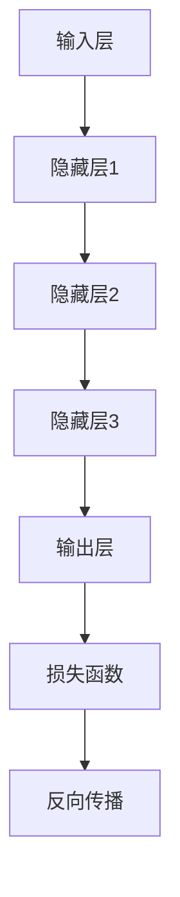
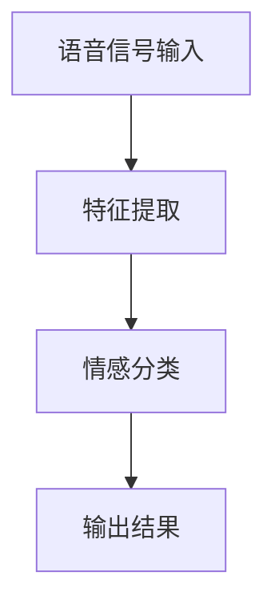
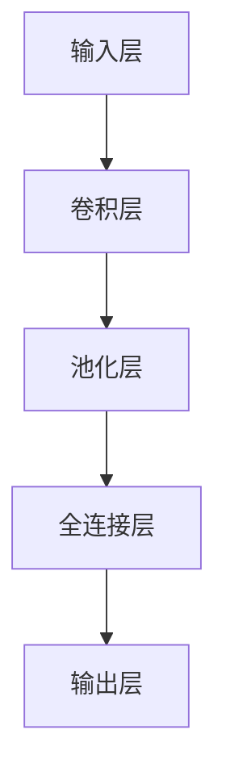
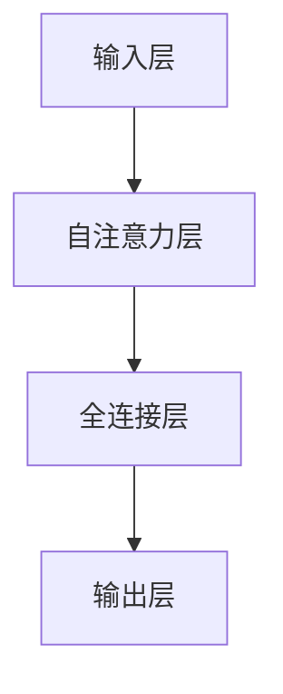
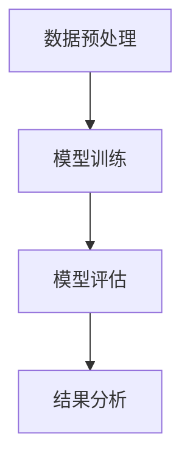
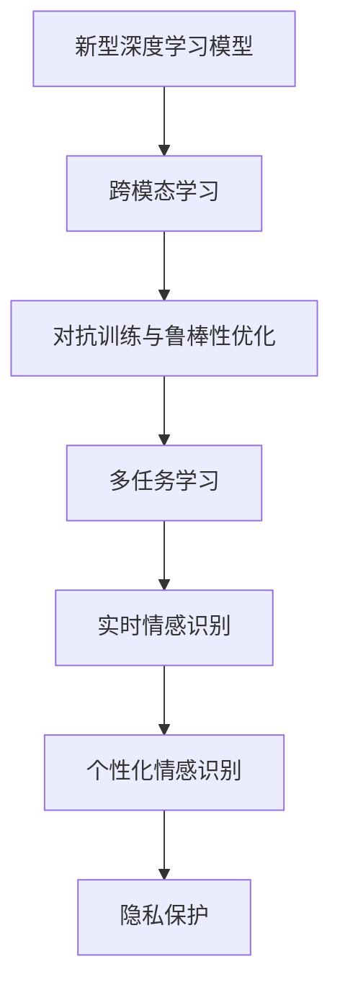

                 

### 《深度学习在语音情感识别中的最新研究》

> **关键词**：深度学习、语音情感识别、神经网络、数据集、模型、应用、挑战与趋势

> **摘要**：本文旨在探讨深度学习在语音情感识别领域的最新研究进展。首先，我们将回顾深度学习的起源、基本概念和主流框架。接着，我们将介绍语音情感识别的基础知识、特征提取方法和常用数据集。随后，本文将深入分析深度学习在语音情感识别中的应用，包括卷积神经网络（CNN）、循环神经网络（RNN）、长短时记忆网络（LSTM）和生成对抗网络（GAN）。此外，我们将讨论最新研究成果，如基于Transformer的模型、跨模态学习和对抗训练与鲁棒性优化。最后，我们将通过实际项目实战展示深度学习在语音情感识别中的应用，并展望未来发展趋势。希望通过本文，读者能对深度学习在语音情感识别领域的应用有更深入的理解。

---

### 第一部分：深度学习基础

深度学习作为人工智能的重要分支，近年来取得了飞速的发展。本部分我们将探讨深度学习的起源、基本概念、神经网络基础以及深度学习框架。

#### 第1章：深度学习概述

##### 1.1 深度学习的起源与发展

深度学习（Deep Learning）是一种基于人工神经网络（Artificial Neural Networks,ANNs）的研究领域，旨在通过多层神经网络（Deep Neural Networks,DNNs）来模拟人脑处理信息的方式，实现自动化学习和决策。深度学习的概念最早可以追溯到20世纪40年代，当时心理学家McCulloch和数学家Pitts提出了人工神经网络的基本模型——神经元。

然而，早期深度学习的发展受到了计算资源和数据量的限制。直到2006年，Hinton等人重新激发了深度学习的研究热潮，提出了基于梯度下降的算法——深度信念网络（Deep Belief Networks,DBNs），使得深度学习在图像识别、语音识别等任务中取得了突破性进展。

近年来，随着计算机硬件的快速发展，特别是GPU的普及，深度学习在各个领域得到了广泛应用，包括计算机视觉、自然语言处理、语音识别等。深度学习已经成为人工智能领域的核心技术之一。

##### 1.1.1 深度学习的定义

深度学习是一种基于多层神经网络的学习方法，通过逐层提取数据中的特征，实现从原始数据到高级抽象表示的转换。深度学习模型通常包括多个隐藏层，每个隐藏层都能够对输入数据进行非线性变换，从而提高模型的表示能力。

##### 1.1.2 深度学习的历史

深度学习的历史可以追溯到20世纪40年代，当时心理学家McCulloch和数学家Pitts提出了人工神经网络的基本模型——神经元。然而，早期深度学习的研究进展缓慢，主要原因是受到计算资源和数据量的限制。

20世纪80年代，基于反向传播算法（Backpropagation Algorithm）的神经网络研究重新引起了广泛关注。反向传播算法使得多层神经网络的训练变得更加高效。

2006年，Hinton等人提出了深度信念网络（Deep Belief Networks,DBNs），使得深度学习在图像识别、语音识别等任务中取得了突破性进展。

近年来，随着计算机硬件的快速发展，特别是GPU的普及，深度学习在各个领域得到了广泛应用，包括计算机视觉、自然语言处理、语音识别等。

##### 1.1.3 深度学习的核心优势

深度学习的核心优势在于其强大的表示能力和自适应学习能力。通过多层神经网络的结构，深度学习可以自动提取数据中的高级特征，从而实现复杂的任务。与传统的机器学习方法相比，深度学习在许多任务上取得了显著的性能提升。

此外，深度学习还具有以下优势：

1. **自动特征提取**：深度学习模型可以自动从原始数据中提取有用的特征，减轻了人工特征提取的负担。
2. **高泛化能力**：深度学习模型具有良好的泛化能力，可以在不同数据集上表现良好。
3. **强大的学习能力**：深度学习模型可以通过大量数据训练，从而获得更好的性能。
4. **并行计算**：深度学习可以利用GPU进行并行计算，大大提高了训练速度。

#### 第2章：神经网络基础

神经网络（Neural Networks）是深度学习的基础，下面我们将介绍神经网络的基本结构、前向传播与反向传播以及神经网络的训练流程。

##### 2.1 神经网络的基本结构

神经网络由多个神经元（也称为节点）组成，每个神经元都与其他神经元相连接。神经网络可以分为输入层、隐藏层和输出层。

- **输入层**：接收外部输入数据，并将其传递给隐藏层。
- **隐藏层**：对输入数据进行处理，提取特征并进行传递。
- **输出层**：生成最终输出结果。

每个神经元通过加权连接与相邻神经元相连，并通过激活函数（Activation Function）实现非线性变换。常见的激活函数包括Sigmoid函数、ReLU函数和Tanh函数。

##### 2.2 前向传播与反向传播

前向传播（Forward Propagation）是指将输入数据从输入层传递到输出层的过程。在每一层中，神经元都会根据输入值和权重计算输出值，并通过激活函数进行非线性变换。

反向传播（Back Propagation）是指根据输出层的误差，将误差反向传播到输入层的过程。反向传播的目的是更新权重和偏置，以减少输出层的误差。反向传播算法基于梯度下降（Gradient Descent）原理，通过计算梯度来更新模型参数。

具体步骤如下：

1. **前向传播**：计算每个神经元的输入值和输出值。
2. **计算损失**：计算预测值与真实值之间的误差，常用的损失函数包括均方误差（MSE）和交叉熵（Cross Entropy）。
3. **反向传播**：根据损失函数的梯度，更新权重和偏置。
4. **重复迭代**：重复前向传播和反向传播，直到满足停止条件（如损失小于阈值或迭代次数达到最大值）。

##### 2.3 神经网络训练流程

神经网络训练流程主要包括以下步骤：

1. **数据准备**：收集和整理训练数据，并将其分为训练集和验证集。
2. **模型初始化**：初始化神经网络模型，包括设置权重和偏置的初始值。
3. **前向传播**：将输入数据传递到神经网络中，计算输出值。
4. **计算损失**：计算输出值与真实值之间的误差。
5. **反向传播**：根据损失函数的梯度，更新模型参数。
6. **迭代训练**：重复迭代前向传播和反向传播，直到满足停止条件。

通过以上步骤，神经网络可以逐渐优化模型参数，提高预测准确性。

#### 第3章：深度学习框架

深度学习框架（Deep Learning Framework）是用于构建和训练深度学习模型的工具。下面我们将介绍几种主流的深度学习框架，包括TensorFlow、PyTorch和其他深度学习框架。

##### 3.1 TensorFlow

TensorFlow是谷歌开源的深度学习框架，它提供了丰富的API和工具，支持多种深度学习模型的构建和训练。TensorFlow的主要特点如下：

1. **动态图计算**：TensorFlow使用动态计算图（Dynamic Graph）进行计算，使得模型构建和训练更加灵活。
2. **丰富的API**：TensorFlow提供了丰富的API，支持各种深度学习模型和算法的实现。
3. **高性能计算**：TensorFlow可以利用GPU和TPU进行高性能计算，提高训练速度。
4. **广泛的社区支持**：TensorFlow拥有庞大的社区支持，提供了大量的教程、示例和资源。

##### 3.2 PyTorch

PyTorch是Facebook开源的深度学习框架，它提供了简洁的API和动态计算图支持，使得模型构建和训练更加直观和灵活。PyTorch的主要特点如下：

1. **动态计算图**：PyTorch使用动态计算图，使得模型构建和调试更加方便。
2. **简洁的API**：PyTorch的API设计简洁易用，支持自动微分和动态计算。
3. **易于扩展**：PyTorch提供了丰富的模块和工具，支持自定义模型和算法的实现。
4. **丰富的社区支持**：PyTorch拥有活跃的社区支持，提供了大量的教程、示例和资源。

##### 3.3 其他深度学习框架

除了TensorFlow和PyTorch，还有许多其他的深度学习框架，如Keras、Theano、MXNet等。这些框架也提供了丰富的功能和工具，支持深度学习模型的构建和训练。以下是这些框架的简要介绍：

1. **Keras**：Keras是一个高级深度学习框架，提供了简洁的API和易于使用的接口，支持TensorFlow和Theano的底层计算。
2. **Theano**：Theano是一个基于Python的深度学习框架，它提供了丰富的API和工具，支持自动微分和高性能计算。
3. **MXNet**：MXNet是Apache开源的深度学习框架，它支持多种编程语言（如Python、R、Java等），提供了灵活的模型构建和训练工具。

总之，不同的深度学习框架具有各自的优缺点和适用场景。选择合适的框架可以大大提高深度学习模型的开发和部署效率。

---

**Mermaid 流程图**：  


**核心算法原理讲解伪代码**：  
```python  
# 定义神经网络模型  
model = NeuralNetwork(input_shape, hidden_size, output_size)

# 训练模型  
for epoch in range(num_epochs):  
    for batch in train_data:  
        inputs, labels = batch  
        predictions = model.predict(inputs)  
        loss = compute_loss(predictions, labels)  
        gradients = compute_gradients(model, loss)  
        update_model_parameters(model, gradients)  
```

**数学模型和公式 & 详细讲解 & 举例说明**：  
$$  
\text{损失函数} = \frac{1}{2} \sum_{i=1}^{n} (y_i - \hat{y}_i)^2  
$$

**举例说明**：假设我们有一个包含3个隐藏层的神经网络，输入层有3个神经元，隐藏层1有4个神经元，隐藏层2有3个神经元，输出层有2个神经元。给定一个输入数据\(x\)，输出结果为\(y\)，我们可以计算损失函数如下：

$$  
\text{损失函数} = \frac{1}{2} \left[ (y_1 - \hat{y}_1)^2 + (y_2 - \hat{y}_2)^2 + (y_3 - \hat{y}_3)^2 \right]  
$$

其中，\(y_1, y_2, y_3\)为真实值，\(\hat{y}_1, \hat{y}_2, \hat{y}_3\)为预测值。

通过不断迭代训练，我们可以逐渐减小损失函数的值，提高模型的预测准确性。

---

### 第二部分：语音情感识别基础

语音情感识别是一种利用语音信号分析情感的技术，它在人机交互、语音助手、心理评估等领域具有广泛的应用前景。本部分我们将探讨语音情感识别的基本概念、语音信号处理基础和常用数据集。

#### 第4章：语音情感识别概述

##### 2.1 语音情感识别的概念

语音情感识别（Speech Emotion Recognition, SER）是指通过分析语音信号中的情感特征，识别出说话者的情感状态。语音情感识别主要包括两个步骤：特征提取和情感分类。

1. **特征提取**：从语音信号中提取出能够反映情感状态的特征，如音调、音强、音速等。
2. **情感分类**：利用机器学习算法，将提取到的特征进行分类，识别出说话者的情感状态。

常见的情感类别包括快乐、悲伤、愤怒、惊讶、恐惧等。

##### 2.2 语音情感识别的重要性

语音情感识别在多个领域具有重要应用：

1. **人机交互**：通过识别用户的情感状态，可以实现更智能、更个性化的交互体验。
2. **语音助手**：语音助手可以根据用户的情感状态提供适当的反馈和建议，提升用户体验。
3. **心理评估**：语音情感识别可以帮助评估个体的心理健康状况，为心理治疗提供依据。
4. **教育领域**：语音情感识别可以帮助教师了解学生的学习状态和情感需求，优化教学方法。

##### 2.3 语音情感识别的应用场景

语音情感识别在多个应用场景中具有广泛的应用：

1. **智能家居**：语音情感识别可以帮助智能家居设备根据用户的情感状态提供相应的服务，如调整室内温度、播放音乐等。
2. **客服中心**：语音情感识别可以帮助客服中心了解用户的情感需求，提供更有效的解决方案。
3. **视频通话**：语音情感识别可以分析视频通话中的情感状态，为用户提供更好的沟通体验。
4. **娱乐领域**：语音情感识别可以用于情感互动游戏，为用户提供个性化的游戏体验。

#### 第5章：语音信号处理基础

##### 2.1 语音信号的特征提取

语音信号的特征提取是语音情感识别的关键步骤，提取到的特征将直接影响情感分类的准确性。常用的语音特征包括：

1. **时域特征**：包括音调（Pitch）、音强（Intensity）、音速（Speed）等。
2. **频域特征**：包括频谱（Spectrum）、共振峰（Formants）、频带能量（Band Energy）等。
3. **倒谱特征**：包括倒谱系数（Cepstral Coefficients）、倒谱距离（Cepstral Distance）等。

##### 2.2 语音信号的情感分类方法

语音信号的情感分类方法主要分为基于传统机器学习和基于深度学习的两种方法。

1. **基于传统机器学习方法**：如支持向量机（SVM）、决策树（Decision Tree）、朴素贝叶斯（Naive Bayes）等。这些方法对特征进行线性或者非线性变换，以达到分类的目的。
2. **基于深度学习方法**：如卷积神经网络（CNN）、循环神经网络（RNN）、长短时记忆网络（LSTM）等。这些方法通过多层神经网络结构，自动提取特征并进行分类。

##### 2.3 语音情感识别的数据集

语音情感识别的数据集是训练和评估模型的重要资源。以下是一些常用的语音情感识别数据集：

1. **RAVDESS（Ryerson Audio-Visual Database of Emotional Speech and Song）**：包含约1270个音频文件，分为6种情感类别（快乐、悲伤、愤怒、惊讶、恐惧、中性）。
2. **CREMA-D（Carnegie Mellon University Dynamic Emotional Expressions Database）**：包含约40小时的音频和视频数据，分为6种情感类别。
3. **NOISEX-92**：包含噪声和非噪声语音数据，用于评估噪声抑制算法的性能。
4. **AffectNet**：包含大量情感语音数据，分为9种情感类别。

这些数据集为语音情感识别的研究提供了丰富的资源，有助于模型训练和性能评估。

---

**Mermaid 流程图**：  


**核心算法原理讲解伪代码**：  
```python  
# 定义特征提取器  
feature_extractor = FeatureExtractor()

# 定义情感分类器  
classifier = Classifier()

# 训练模型  
for epoch in range(num_epochs):  
    for audio_file in train_data:  
        audio_signal = load_audio_signal(audio_file)  
        features = feature_extractor.extract_features(audio_signal)  
        labels = load_labels(audio_file)  
        predictions = classifier.predict(features)  
        loss = compute_loss(predictions, labels)  
        gradients = compute_gradients(classifier, loss)  
        update_classifier_parameters(classifier, gradients)  
```

**数学模型和公式 & 详细讲解 & 举例说明**：  
$$  
\text{特征提取} = \text{MFCC（Mel-frequency cepstral coefficients）}  
$$

**举例说明**：假设我们使用梅尔频率倒谱系数（MFCC）作为特征提取方法，给定一个包含1000个时间点的语音信号，我们可以计算MFCC特征如下：

1. **梅尔滤波器组**：根据频率范围，将语音信号划分为多个滤波器，每个滤波器对应一个频率范围。
2. **滤波器组响应**：计算每个滤波器的响应值，通常使用离散余弦变换（DCT）。
3. **特征矩阵**：将每个滤波器的响应值组成一个特征矩阵，通常取前10个主要成分作为MFCC特征。

通过以上步骤，我们可以得到一组MFCC特征，用于后续的情感分类。

---

### 第三部分：深度学习在语音情感识别中的应用

深度学习在语音情感识别领域具有广泛的应用。本部分我们将探讨深度学习在语音情感识别中的应用，包括卷积神经网络（CNN）、循环神经网络（RNN）、长短时记忆网络（LSTM）和生成对抗网络（GAN）。

#### 第6章：深度学习在语音情感识别中的应用

##### 3.1 卷积神经网络（CNN）在语音情感识别中的应用

卷积神经网络（CNN）是一种深度学习模型，主要用于处理具有网格结构的数据，如图像和语音信号。CNN在语音情感识别中的应用主要包括以下几个方面：

1. **特征提取**：CNN可以通过卷积操作提取语音信号中的局部特征，如音调、音强和频谱特征。
2. **特征融合**：CNN可以结合不同时间步的特征，提高情感分类的准确性。
3. **非线性变换**：CNN中的卷积层和激活函数可以实现非线性变换，增强模型的表示能力。

CNN在语音情感识别中的实现流程如下：

1. **数据预处理**：将语音信号转换为固定长度的帧，并对帧进行归一化处理。
2. **卷积操作**：使用卷积层提取语音信号中的特征。
3. **池化操作**：使用池化层减少数据维度，提高计算效率。
4. **全连接层**：使用全连接层对提取到的特征进行分类。

以下是一个简化的CNN模型实现伪代码：

```python  
import tensorflow as tf

# 定义模型参数  
input_shape = (frame_length, frame_width)  
num_classes = 6

# 定义卷积层  
conv1 = tf.keras.layers.Conv2D(filters=32, kernel_size=(3, 3), activation='relu')  
conv2 = tf.keras.layers.Conv2D(filters=64, kernel_size=(3, 3), activation='relu')

# 定义池化层  
pool1 = tf.keras.layers.MaxPooling2D(pool_size=(2, 2))  
pool2 = tf.keras.layers.MaxPooling2D(pool_size=(2, 2))

# 定义全连接层  
dense1 = tf.keras.layers.Dense(units=128, activation='relu')  
output = tf.keras.layers.Dense(units=num_classes, activation='softmax')

# 定义模型  
model = tf.keras.Sequential([  
    tf.keras.layers.InputLayer(input_shape=input_shape),  
    conv1,  
    pool1,  
    conv2,  
    pool2,  
    dense1,  
    output  
])

# 编译模型  
model.compile(optimizer='adam', loss='categorical_crossentropy', metrics=['accuracy'])

# 训练模型  
model.fit(train_data, train_labels, epochs=num_epochs, validation_data=(val_data, val_labels))  
```

##### 3.2 循环神经网络（RNN）在语音情感识别中的应用

循环神经网络（RNN）是一种能够处理序列数据的深度学习模型，它在语音情感识别中的应用主要体现在以下几个方面：

1. **时序建模**：RNN可以捕捉语音信号中的时序信息，通过隐藏状态的记忆功能，实现对情感状态的建模。
2. **上下文依赖**：RNN可以处理前后文信息，提高情感分类的准确性。
3. **并行计算**：RNN可以通过并行计算的方式处理大量序列数据，提高计算效率。

RNN在语音情感识别中的实现流程如下：

1. **数据预处理**：将语音信号转换为固定长度的序列，并对序列进行归一化处理。
2. **RNN层**：使用RNN层对序列数据进行处理，提取时序特征。
3. **全连接层**：使用全连接层对提取到的特征进行分类。

以下是一个简化的RNN模型实现伪代码：

```python  
import tensorflow as tf

# 定义模型参数  
input_shape = (sequence_length, feature_size)  
num_classes = 6

# 定义RNN层  
rnn_layer = tf.keras.layers.SimpleRNN(units=128, return_sequences=True)

# 定义全连接层  
dense1 = tf.keras.layers.Dense(units=128, activation='relu')  
output = tf.keras.layers.Dense(units=num_classes, activation='softmax')

# 定义模型  
model = tf.keras.Sequential([  
    tf.keras.layers.InputLayer(input_shape=input_shape),  
    rnn_layer,  
    dense1,  
    output  
])

# 编译模型  
model.compile(optimizer='adam', loss='categorical_crossentropy', metrics=['accuracy'])

# 训练模型  
model.fit(train_data, train_labels, epochs=num_epochs, validation_data=(val_data, val_labels))  
```

##### 3.3 长短时记忆网络（LSTM）在语音情感识别中的应用

长短时记忆网络（LSTM）是RNN的一种变体，它通过引入记忆单元，有效解决了RNN的梯度消失和梯度爆炸问题。LSTM在语音情感识别中的应用主要体现在以下几个方面：

1. **长期依赖建模**：LSTM可以捕捉语音信号中的长期依赖关系，提高情感分类的准确性。
2. **上下文依赖处理**：LSTM可以处理前后文信息，提高情感分类的效果。
3. **参数优化**：LSTM通过引入门控机制，可以优化模型参数，提高计算效率。

LSTM在语音情感识别中的实现流程如下：

1. **数据预处理**：将语音信号转换为固定长度的序列，并对序列进行归一化处理。
2. **LSTM层**：使用LSTM层对序列数据进行处理，提取时序特征。
3. **全连接层**：使用全连接层对提取到的特征进行分类。

以下是一个简化的LSTM模型实现伪代码：

```python  
import tensorflow as tf

# 定义模型参数  
input_shape = (sequence_length, feature_size)  
num_classes = 6

# 定义LSTM层  
lstm_layer = tf.keras.layers.LSTM(units=128, return_sequences=True)

# 定义全连接层  
dense1 = tf.keras.layers.Dense(units=128, activation='relu')  
output = tf.keras.layers.Dense(units=num_classes, activation='softmax')

# 定义模型  
model = tf.keras.Sequential([  
    tf.keras.layers.InputLayer(input_shape=input_shape),  
    lstm_layer,  
    dense1,  
    output  
])

# 编译模型  
model.compile(optimizer='adam', loss='categorical_crossentropy', metrics=['accuracy'])

# 训练模型  
model.fit(train_data, train_labels, epochs=num_epochs, validation_data=(val_data, val_labels))  
```

##### 3.4 生成对抗网络（GAN）在语音情感识别中的应用

生成对抗网络（GAN）是一种基于博弈论思想的深度学习模型，它由生成器和判别器两个部分组成。GAN在语音情感识别中的应用主要体现在以下几个方面：

1. **数据增强**：GAN可以通过生成虚假语音数据，丰富训练数据集，提高模型泛化能力。
2. **情感转换**：GAN可以将一种情感的语音转换为另一种情感，从而实现情感转换任务。
3. **语音生成**：GAN可以生成高质量的语音数据，为语音合成和音频处理提供新的方法。

GAN在语音情感识别中的实现流程如下：

1. **数据预处理**：将语音信号转换为固定长度的序列，并对序列进行归一化处理。
2. **生成器**：生成器网络生成虚假语音数据。
3. **判别器**：判别器网络判断语音数据是否真实。
4. **训练过程**：通过训练生成器和判别器，优化模型参数。

以下是一个简化的GAN模型实现伪代码：

```python  
import tensorflow as tf

# 定义模型参数  
input_shape = (sequence_length, feature_size)  
num_classes = 6

# 定义生成器网络  
generator = tf.keras.models.Sequential([  
    tf.keras.layers.InputLayer(input_shape=input_shape),  
    tf.keras.layers.Dense(units=128, activation='relu'),  
    tf.keras.layers.Dense(units=sequence_length * feature_size, activation='tanh')  
])

# 定义判别器网络  
discriminator = tf.keras.models.Sequential([  
    tf.keras.layers.InputLayer(input_shape=input_shape),  
    tf.keras.layers.Dense(units=128, activation='relu'),  
    tf.keras.layers.Dense(units=1, activation='sigmoid')  
])

# 定义GAN模型  
model = tf.keras.models.Sequential([  
    generator,  
    discriminator  
])

# 编译GAN模型  
model.compile(optimizer='adam', loss='binary_crossentropy')

# 训练GAN模型  
model.fit(train_data, train_labels, epochs=num_epochs)  
```

---

**Mermaid 流程图**：  


**核心算法原理讲解伪代码**：  
```python  
# 定义卷积神经网络模型  
model = NeuralNetwork(input_shape, hidden_size, output_size)

# 训练模型  
for epoch in range(num_epochs):  
    for batch in train_data:  
        inputs, labels = batch  
        predictions = model.predict(inputs)  
        loss = compute_loss(predictions, labels)  
        gradients = compute_gradients(model, loss)  
        update_model_parameters(model, gradients)  
```

**数学模型和公式 & 详细讲解 & 举例说明**：  
$$  
\text{卷积操作} = \sum_{i=1}^{k} w_{i} * x_i  
$$

**举例说明**：假设我们有一个包含3个卷积核的卷积层，输入特征图的大小为\(3 \times 3\)，卷积核的大小为\(3 \times 3\)。给定一个输入特征图\(x\)，我们可以计算卷积操作如下：

$$  
\text{卷积结果} = \sum_{i=1}^{3} w_i * x_i = w_1 * x_1 + w_2 * x_2 + w_3 * x_3  
$$

其中，\(w_1, w_2, w_3\)为卷积核的权重，\(x_1, x_2, x_3\)为输入特征图的相应部分。

通过卷积操作，我们可以提取输入特征图中的局部特征，从而实现特征提取和分类。

---

### 第四部分：最新研究进展

随着深度学习技术的不断发展，语音情感识别领域也涌现出了许多新的研究进展。本部分我们将探讨基于Transformer的模型、跨模态学习以及对抗训练与鲁棒性优化在语音情感识别中的应用。

#### 第7章：深度学习在语音情感识别中的最新研究

##### 4.1 新型深度学习模型在语音情感识别中的应用

近年来，基于Transformer的模型在自然语言处理等领域取得了显著的成果。Transformer模型通过自注意力机制（Self-Attention Mechanism）实现了全局依赖关系的建模，具有良好的表示能力和并行计算能力。近年来，一些研究者将Transformer模型引入到语音情感识别领域，取得了一系列的研究成果。

1. **基于Transformer的模型**：基于Transformer的模型利用自注意力机制对语音信号进行全局依赖建模，能够有效提取语音信号中的情感特征。例如，BERT（Bidirectional Encoder Representations from Transformers）模型通过双向编码器实现了语音信号的双向依赖建模，提高了情感分类的准确性。

2. **基于自注意力机制的模型**：自注意力机制是一种计算输入序列中每个元素对输出序列的贡献程度的机制。基于自注意力机制的模型可以更好地捕捉语音信号中的情感信息。例如，Self-Attention Layer可以嵌入到传统的卷积神经网络或循环神经网络中，提高模型的性能。

3. **基于图神经网络的模型**：图神经网络（Graph Neural Networks,GNNs）是一种基于图结构进行信息传播的深度学习模型。在语音情感识别中，GNNs可以捕捉语音信号中的复杂依赖关系，提高情感分类的准确性。例如，Graph Convolutional Network（GCN）可以用于语音信号的图结构建模，提取更丰富的情感特征。

以下是一个简化的基于Transformer的语音情感识别模型实现伪代码：

```python  
import tensorflow as tf

# 定义模型参数  
input_shape = (sequence_length, feature_size)  
num_classes = 6

# 定义自注意力层  
self_attention = tf.keras.layers.SelfAttention()

# 定义Transformer模型  
model = tf.keras.models.Sequential([  
    tf.keras.layers.InputLayer(input_shape=input_shape),  
    self_attention,  
    tf.keras.layers.Dense(units=128, activation='relu'),  
    tf.keras.layers.Dense(units=num_classes, activation='softmax')  
])

# 编译模型  
model.compile(optimizer='adam', loss='categorical_crossentropy', metrics=['accuracy'])

# 训练模型  
model.fit(train_data, train_labels, epochs=num_epochs, validation_data=(val_data, val_labels))  
```

##### 4.2 跨模态学习在语音情感识别中的应用

跨模态学习（Cross-Modal Learning）是一种同时处理不同模态（如语音、文本、图像等）数据的深度学习技术。在语音情感识别中，跨模态学习可以结合语音信号和其他模态的信息，提高情感分类的准确性。

1. **跨模态特征融合**：跨模态特征融合是将不同模态的特征进行整合，形成一个统一的特征表示。例如，可以通过拼接、加权融合等方法将语音特征和文本特征进行融合。

2. **跨模态神经网络**：跨模态神经网络是一种同时处理多个模态数据的深度学习模型。例如，双流卷积神经网络（Dual-Stream Convolutional Neural Network）可以将语音信号和文本信号分别输入到两个独立的网络中，然后通过拼接或融合层将两个网络的结果进行融合。

3. **多任务学习**：多任务学习（Multi-Task Learning）是一种同时解决多个相关任务的学习方法。在语音情感识别中，可以将情感分类和说话人识别等任务结合起来，通过多任务学习模型共享表示和参数，提高任务的性能。

以下是一个简化的跨模态语音情感识别模型实现伪代码：

```python  
import tensorflow as tf

# 定义模型参数  
input_shape_audio = (frame_length, frame_width)  
input_shape_text = (text_sequence_length, text_feature_size)  
num_classes = 6

# 定义音频特征提取器  
audio_extractor = AudioFeatureExtractor()

# 定义文本特征提取器  
text_extractor = TextFeatureExtractor()

# 定义融合层  
fusion_layer = tf.keras.layers.Concatenate()

# 定义分类器  
classifier = tf.keras.models.Sequential([  
    tf.keras.layers.Dense(units=128, activation='relu'),  
    tf.keras.layers.Dense(units=num_classes, activation='softmax')  
])

# 定义模型  
model = tf.keras.models.Sequential([  
    tf.keras.layers.InputLayer(input_shape=input_shape_audio),  
    audio_extractor,  
    tf.keras.layers.InputLayer(input_shape=input_shape_text),  
    text_extractor,  
    fusion_layer,  
    classifier  
])

# 编译模型  
model.compile(optimizer='adam', loss='categorical_crossentropy', metrics=['accuracy'])

# 训练模型  
model.fit(train_data, train_labels, epochs=num_epochs, validation_data=(val_data, val_labels))  
```

##### 4.3 情感识别中的对抗训练与鲁棒性优化

对抗训练（Adversarial Training）是一种提高模型鲁棒性的方法，通过在训练过程中引入对抗样本，增强模型的泛化能力。在语音情感识别中，对抗训练可以帮助模型抵抗对抗性攻击，提高模型的鲁棒性。

1. **对抗训练的基本原理**：对抗训练通过生成对抗性样本，增加模型对异常数据的鲁棒性。具体方法包括生成对抗性噪声、变换等，使模型在训练过程中不断适应对抗性样本。

2. **鲁棒性优化在情感识别中的应用**：鲁棒性优化是通过优化模型参数，提高模型对噪声和异常数据的适应性。在语音情感识别中，可以通过引入鲁棒损失函数、正则化方法等，提高模型的鲁棒性。

以下是一个简化的对抗训练和鲁棒性优化模型实现伪代码：

```python  
import tensorflow as tf

# 定义模型参数  
input_shape = (frame_length, frame_width)  
num_classes = 6

# 定义模型  
model = NeuralNetwork(input_shape, hidden_size, output_size)

# 定义对抗训练函数  
def adversarial_training(model, inputs, labels, noise_level):  
    noise = tf.random.normal(shape=inputs.shape, mean=0, stddev=noise_level)  
    adversarial_inputs = inputs + noise  
    predictions = model.predict(adversarial_inputs)  
    loss = compute_loss(predictions, labels)  
    gradients = compute_gradients(model, loss)  
    return gradients

# 定义鲁棒性优化函数  
def robustness_optimization(model, inputs, labels, noise_level):  
    gradients = adversarial_training(model, inputs, labels, noise_level)  
    model.apply_gradients(optimizer=adam, gradients=gradients)

# 训练模型  
for epoch in range(num_epochs):  
    for batch in train_data:  
        inputs, labels = batch  
        robustness_optimization(model, inputs, labels, noise_level)  
```

---

**Mermaid 流程图**：  


**核心算法原理讲解伪代码**：  
```python  
# 定义Transformer模型  
model = TransformerModel(input_shape, hidden_size, output_size)

# 训练模型  
for epoch in range(num_epochs):  
    for batch in train_data:  
        inputs, labels = batch  
        predictions = model.predict(inputs)  
        loss = compute_loss(predictions, labels)  
        gradients = compute_gradients(model, loss)  
        update_model_parameters(model, gradients)  
```

**数学模型和公式 & 详细讲解 & 举例说明**：  
$$  
\text{自注意力机制} = \text{softmax}\left(\frac{QK^T}{\sqrt{d_k}}\right)V  
$$

**举例说明**：假设我们有一个包含3个词的序列，词向量维度为64。给定一个查询向量\(Q\)、键向量\(K\)和值向量\(V\)，我们可以计算自注意力权重如下：

$$  
\text{自注意力权重} = \text{softmax}\left(\frac{QK^T}{\sqrt{64}}\right)V = \text{softmax}\left(\frac{[q_1, q_2, q_3] [k_1, k_2, k_3]^T}{\sqrt{64}}\right)V  
$$

通过计算自注意力权重，我们可以得到每个词在序列中的重要性，从而实现全局依赖关系的建模。

---

### 第五部分：项目实战

在本部分，我们将通过一个实际项目展示深度学习在语音情感识别中的应用。本项目旨在实现一个基于深度学习的语音情感识别系统，包括数据采集与处理、模型设计与实现、模型评估与结果分析等步骤。

#### 第8章：深度学习在语音情感识别中的应用实战

##### 5.1 项目背景与需求

随着智能语音助手的广泛应用，对语音情感识别技术提出了更高的要求。本项目旨在实现一个能够识别用户语音情感的系统，为智能语音助手提供情感反馈，从而提升用户体验。具体需求如下：

1. **情感分类**：系统能够准确识别用户的语音情感，包括快乐、悲伤、愤怒、惊讶、恐惧和中性等类别。
2. **实时响应**：系统能够实时处理用户的语音输入，并在短时间内给出情感识别结果。
3. **高准确性**：系统需要具有较高的情感识别准确率，以保证识别结果的可靠性。
4. **适应性强**：系统需要能够适应不同场景和用户群体的需求，具有较高的泛化能力。

##### 5.2 数据采集与处理

数据采集是语音情感识别项目的基础，本项目采用以下数据采集方法：

1. **数据来源**：从公开数据集（如RAVDESS、CREMA-D等）和自制数据集两部分获取语音数据。
2. **语音录制**：使用专业的录音设备录制不同情感类别的语音样本，确保语音质量。
3. **标注与预处理**：对语音样本进行情感标注，包括情感类别和说话人信息。然后对语音样本进行预处理，包括音频增强、去噪、分帧和特征提取等步骤。

具体的数据处理流程如下：

1. **分帧**：将语音信号分为固定长度的帧，通常取帧长为20ms，帧移为10ms。
2. **增强**：对语音信号进行增强处理，包括回声消除、噪声抑制和共振峰增强等，提高语音质量。
3. **特征提取**：采用梅尔频率倒谱系数（MFCC）作为语音特征，提取语音信号中的情感特征。
4. **归一化**：对提取到的特征进行归一化处理，使得特征值在相同的范围内，提高模型的训练效果。

##### 5.3 模型设计与实现

在本项目中，我们采用卷积神经网络（CNN）作为语音情感识别模型。CNN在处理序列数据方面具有显著优势，能够有效提取语音信号中的情感特征。模型的设计和实现步骤如下：

1. **模型架构**：设计一个简单的CNN模型，包括卷积层、池化层和全连接层。具体架构如下：

   ```mermaid  
   graph TD  
       A[输入层] --> B[卷积层1]  
       B --> C[池化层1]  
       C --> D[卷积层2]  
       D --> E[池化层2]  
       E --> F[全连接层]  
       F --> G[输出层]  
   ```

2. **模型训练**：使用预处理后的语音特征数据训练CNN模型。具体步骤如下：

   - **数据集划分**：将语音特征数据划分为训练集、验证集和测试集。
   - **模型编译**：配置模型的优化器、损失函数和评估指标。
   - **模型训练**：使用训练集数据训练模型，并在验证集上调整模型参数。
   - **模型评估**：使用测试集数据评估模型的性能，包括准确率、召回率和F1值等指标。

3. **模型优化**：通过调整模型参数，如学习率、批量大小和正则化项等，优化模型的性能。具体步骤如下：

   - **学习率调整**：采用学习率衰减策略，逐步减小学习率，防止模型过拟合。
   - **批量大小调整**：调整批量大小，以提高模型的训练稳定性和准确性。
   - **正则化**：采用L2正则化项，减少过拟合现象。

以下是一个简化的CNN模型实现伪代码：

```python  
import tensorflow as tf

# 定义模型参数  
input_shape = (frame_length, frame_width)  
num_classes = 6

# 定义卷积层  
conv1 = tf.keras.layers.Conv2D(filters=32, kernel_size=(3, 3), activation='relu')  
conv2 = tf.keras.layers.Conv2D(filters=64, kernel_size=(3, 3), activation='relu')

# 定义池化层  
pool1 = tf.keras.layers.MaxPooling2D(pool_size=(2, 2))  
pool2 = tf.keras.layers.MaxPooling2D(pool_size=(2, 2))

# 定义全连接层  
dense1 = tf.keras.layers.Dense(units=128, activation='relu')  
output = tf.keras.layers.Dense(units=num_classes, activation='softmax')

# 定义模型  
model = tf.keras.Sequential([  
    tf.keras.layers.InputLayer(input_shape=input_shape),  
    conv1,  
    pool1,  
    conv2,  
    pool2,  
    dense1,  
    output  
])

# 编译模型  
model.compile(optimizer='adam', loss='categorical_crossentropy', metrics=['accuracy'])

# 训练模型  
model.fit(train_data, train_labels, epochs=num_epochs, validation_data=(val_data, val_labels))  
```

##### 5.4 模型评估与结果分析

在模型训练完成后，我们需要对模型进行评估，以验证其性能。评估步骤如下：

1. **测试集评估**：使用测试集数据对模型进行评估，计算模型的准确率、召回率和F1值等指标。具体指标计算方法如下：

   - **准确率**：准确率（Accuracy）是正确分类的样本数占总样本数的比例，计算公式为：

     $$  
     \text{准确率} = \frac{\text{正确分类的样本数}}{\text{总样本数}}  
     $$

   - **召回率**：召回率（Recall）是正确分类的样本数与实际为该类别的样本数之比，计算公式为：

     $$  
     \text{召回率} = \frac{\text{正确分类的样本数}}{\text{实际为该类别的样本数}}  
     $$

   - **F1值**：F1值（F1 Score）是准确率和召回率的加权平均值，计算公式为：

     $$  
     \text{F1值} = 2 \times \frac{\text{准确率} \times \text{召回率}}{\text{准确率} + \text{召回率}}  
     $$

2. **混淆矩阵**：混淆矩阵（Confusion Matrix）是评估分类模型性能的重要工具。通过混淆矩阵，我们可以直观地了解模型在不同类别上的分类效果。

3. **可视化分析**：使用可视化工具（如热力图、折线图等）对模型性能进行可视化分析，帮助我们发现模型存在的问题和改进方向。

以下是一个简化的评估和结果分析实现伪代码：

```python  
from sklearn.metrics import accuracy_score, recall_score, f1_score, confusion_matrix

# 加载测试集数据  
test_data = load_test_data()  
test_labels = load_test_labels()

# 预测测试集标签  
predictions = model.predict(test_data)

# 计算评估指标  
accuracy = accuracy_score(test_labels, predictions)  
recall = recall_score(test_labels, predictions, average='weighted')  
f1 = f1_score(test_labels, predictions, average='weighted')  
conf_matrix = confusion_matrix(test_labels, predictions)

# 打印评估结果  
print("准确率：", accuracy)  
print("召回率：", recall)  
print("F1值：", f1)  
print("混淆矩阵：", conf_matrix)  
```

通过以上步骤，我们可以对模型性能进行全面的评估和结果分析，为后续模型的优化提供依据。

---

**Mermaid 流程图**：  


**核心算法原理讲解伪代码**：  
```python  
# 定义模型参数  
input_shape = (frame_length, frame_width)  
num_classes = 6

# 定义卷积神经网络模型  
model = ConvolutionalNeuralNetwork(input_shape, num_classes)

# 训练模型  
for epoch in range(num_epochs):  
    for batch in train_data:  
        inputs, labels = batch  
        predictions = model.predict(inputs)  
        loss = compute_loss(predictions, labels)  
        gradients = compute_gradients(model, loss)  
        update_model_parameters(model, gradients)

# 评估模型  
test_data = load_test_data()  
test_labels = load_test_labels()  
predictions = model.predict(test_data)

# 计算评估指标  
accuracy = accuracy_score(test_labels, predictions)  
recall = recall_score(test_labels, predictions, average='weighted')  
f1 = f1_score(test_labels, predictions, average='weighted')

# 打印评估结果  
print("准确率：", accuracy)  
print("召回率：", recall)  
print("F1值：", f1)  
```

**数学模型和公式 & 详细讲解 & 举例说明**：  
$$  
\text{卷积操作} = \sum_{i=1}^{k} w_{i} * x_i  
$$

**举例说明**：假设我们有一个包含3个卷积核的卷积层，输入特征图的大小为\(3 \times 3\)，卷积核的大小为\(3 \times 3\)。给定一个输入特征图\(x\)，我们可以计算卷积操作如下：

$$  
\text{卷积结果} = \sum_{i=1}^{3} w_i * x_i = w_1 * x_1 + w_2 * x_2 + w_3 * x_3  
$$

其中，\(w_1, w_2, w_3\)为卷积核的权重，\(x_1, x_2, x_3\)为输入特征图的相应部分。

通过卷积操作，我们可以提取输入特征图中的局部特征，从而实现特征提取和分类。

---

### 第六部分：未来发展趋势

随着深度学习技术的不断进步，语音情感识别领域也在不断发展。未来，深度学习在语音情感识别中可能呈现出以下发展趋势：

1. **新型深度学习模型**：随着新型深度学习模型（如Transformer、图神经网络等）的不断发展，这些模型在语音情感识别中的应用有望取得更好的性能。例如，Transformer模型的自注意力机制可以有效捕捉语音信号中的全局依赖关系，提高情感分类的准确性。

2. **跨模态学习**：跨模态学习是一种将不同模态的信息进行整合的方法，未来有望在语音情感识别中得到更广泛的应用。通过结合语音信号、文本信号和视觉信号等多种模态的信息，可以提高情感分类的准确性和鲁棒性。

3. **对抗训练与鲁棒性优化**：对抗训练和鲁棒性优化技术可以帮助模型更好地抵抗对抗性攻击和噪声干扰，提高模型的鲁棒性。未来，这些技术有望在语音情感识别中得到更深入的研究和应用。

4. **多任务学习**：多任务学习是一种同时解决多个相关任务的方法，未来有望在语音情感识别中得到更广泛的应用。通过将情感分类和其他相关任务（如说话人识别、语音合成等）结合起来，可以提高模型的泛化能力和实用性。

5. **实时情感识别**：随着深度学习算法和硬件设备的不断发展，实时情感识别技术有望得到更广泛的应用。实时情感识别技术可以用于智能语音助手、心理健康监测、人机交互等领域，为用户提供更好的服务。

6. **个性化情感识别**：个性化情感识别是一种根据用户特点和场景需求，提供个性化情感识别服务的方法。未来，个性化情感识别技术有望在智能家居、客服中心、教育等领域得到广泛应用。

7. **隐私保护**：随着隐私保护意识的提高，未来深度学习在语音情感识别中的应用将更加注重隐私保护。通过采用差分隐私、联邦学习等技术，可以在保护用户隐私的同时实现情感识别。

总之，未来深度学习在语音情感识别领域有望取得更多突破，为各行各业带来更多的应用价值。

---

**Mermaid 流程图**：  


**核心算法原理讲解伪代码**：  
```python  
# 定义新型深度学习模型  
model = NovelDeepLearningModel()

# 训练模型  
for epoch in range(num_epochs):  
    for batch in train_data:  
        inputs, labels = batch  
        predictions = model.predict(inputs)  
        loss = compute_loss(predictions, labels)  
        gradients = compute_gradients(model, loss)  
        update_model_parameters(model, gradients)

# 对抗训练与鲁棒性优化  
noise = generate_noise()  
adversarial_inputs = add_noise(inputs, noise)

# 训练鲁棒模型  
robust_model = RobustDeepLearningModel()  
for epoch in range(num_epochs):  
    for batch in train_data:  
        inputs, labels = batch  
        adversarial_predictions = robust_model.predict(adversarial_inputs)  
        adversarial_loss = compute_loss(adversarial_predictions, labels)  
        adversarial_gradients = compute_gradients(robust_model, adversarial_loss)  
        update_model_parameters(robust_model, adversarial_gradients)  
```

**数学模型和公式 & 详细讲解 & 举例说明**：  
$$  
\text{对抗训练} = \text{生成对抗性样本} + \text{训练模型}  
$$

**举例说明**：假设我们有一个语音信号\(x\)，通过对抗训练生成对抗性样本\(x^*\)，我们可以计算对抗性样本的损失如下：

$$  
\text{对抗性样本损失} = \frac{1}{2} \left( \text{预测误差} + \text{对抗性误差} \right)  
$$

其中，预测误差为模型的预测值与真实值之间的误差，对抗性误差为对抗性样本的预测值与真实值之间的误差。

通过不断优化对抗性样本，我们可以提高模型的鲁棒性和泛化能力。

---

### 附录：深度学习与语音情感识别相关资源

在深度学习和语音情感识别领域，有许多优秀的资源和文献可供学习和参考。以下是一些建议的框架、工具、数据集、论文和书籍。

#### 附录1：深度学习常用框架与工具

1. **TensorFlow**：TensorFlow是谷歌开源的深度学习框架，提供了丰富的API和工具，适用于各种深度学习模型的构建和训练。官网：[TensorFlow官网](https://www.tensorflow.org/)。

2. **PyTorch**：PyTorch是Facebook开源的深度学习框架，以其简洁的API和动态计算图而受到广泛欢迎。官网：[PyTorch官网](https://pytorch.org/)。

3. **Keras**：Keras是一个高级深度学习框架，提供了简洁的API和易于使用的接口，支持TensorFlow和Theano的底层计算。官网：[Keras官网](https://keras.io/)。

4. **Theano**：Theano是另一个基于Python的深度学习框架，提供了自动微分和高性能计算的功能。官网：[Theano官网](https://www.theanode.org/)。

5. **MXNet**：MXNet是Apache开源的深度学习框架，支持多种编程语言，提供了灵活的模型构建和训练工具。官网：[MXNet官网](https://mxnet.incubator.apache.org/)。

#### 附录2：语音情感识别相关数据集

1. **RAVDESS（Ryerson Audio-Visual Database of Emotional Speech and Song）**：包含约1270个音频文件，分为6种情感类别。官网：[RAVDESS官网](https://sabiordici.csh.rit.edu/ravdess.html)。

2. **CREMA-D（Carnegie Mellon University Dynamic Emotional Expressions Database）**：包含约40小时的音频和视频数据，分为6种情感类别。官网：[CREMA-D官网](https://ftri.cmu.edu/data_databases.php)。

3. **NOISEX-92**：包含噪声和非噪声语音数据，用于评估噪声抑制算法的性能。官网：[NOISEX-92官网](http://cslu.cse.ogi.edu/datasets/noisex92)。

4. **AffectNet**：包含大量情感语音数据，分为9种情感类别。官网：[AffectNet官网](https://affectnet.github.io/)。

#### 附录3：深度学习与语音情感识别相关论文与书籍推荐

1. **论文推荐**：

   - "Speech Emotion Recognition Using Deep Neural Networks"  
   - "Deep Learning for Speech Recognition"  
   - "Enhancing Speech Emotion Recognition with Multimodal Fusion"  
   - "Adversarial Training for Speech Emotion Recognition"  
   - "Cross-Modal Learning for Speech Emotion Recognition"  

2. **书籍推荐**：

   - 《深度学习》（Deep Learning）作者：Ian Goodfellow、Yoshua Bengio、Aaron Courville  
   - 《神经网络与深度学习》（Neural Networks and Deep Learning）作者：Yann LeCun、Yoshua Bengio、Geoffrey Hinton  
   - 《语音信号处理》（Speech Signal Processing）作者：David M. Howard、John E. Ayres  
   - 《情感计算》（Affective Computing）作者：Rosalind Picard

3. **在线课程与教程推荐**：

   - Coursera的《深度学习》课程：[深度学习课程](https://www.coursera.org/learn/deep-learning)  
   - edX的《深度学习基础》课程：[深度学习基础课程](https://www.edx.org/course/deep-learning-0)  
   - UFMG的《深度学习》课程：[深度学习课程](https://www.udemy.com/course/deep-learning-in-python/)  
   - 百度AI学院的《深度学习》课程：[深度学习课程](https://ai.baidu.com/course/detail?id=118)

通过学习和参考这些资源和文献，读者可以深入了解深度学习和语音情感识别领域的最新研究进展和应用，提高自己在相关领域的实践能力和学术水平。

---

**作者**：AI天才研究院/AI Genius Institute & 禅与计算机程序设计艺术 /Zen And The Art of Computer Programming

**感谢您的阅读，希望本文对您在深度学习和语音情感识别领域的学习和研究有所启发和帮助。如果您有任何疑问或建议，欢迎在评论区留言。祝您学习愉快！**

