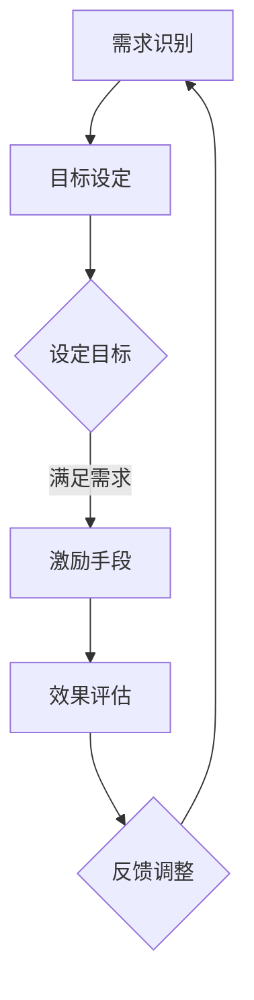

                 

### 激励机制：设计有效的奖惩制度

#### 关键词：
激励机制、奖惩制度、员工绩效、企业管理、心理契约

#### 摘要：
本文系统地探讨了激励机制及其在企业管理中的重要性。首先，我们介绍了激励机制的基本概念、起源和发展，并概述了相关理论。接着，文章深入分析了奖惩制度的定义、设计原则和实施策略。通过实践应用案例，展示了不同类型企业在奖惩制度设计中的特点。随后，文章讨论了激励机制与员工绩效管理的关系，以及奖惩制度的法律风险与管理策略。最后，我们提出了激励机制的有效性评估和优化方法，并结合实际案例进行了详细分析。本文旨在为企业管理者提供全面的理论指导和实践参考。

### 第一部分：激励机制的基础知识

#### 第1章：激励机制概述

##### 1.1 激励机制的基本概念

激励机制是一种通过特定的手段来激发和维持个体工作热情、积极性和创造力的一种管理方法。它包括对个体的奖励和惩罚两个部分，旨在通过正面的激励措施来鼓励个体行为，通过负面的惩罚措施来纠正不良行为。激励机制的起源可以追溯到古代社会，但现代激励理论的系统研究始于20世纪。

在现代企业管理中，激励机制被广泛应用于提升员工绩效、促进组织目标实现以及提高组织整体竞争力。激励机制的有效性直接关系到员工的满意度和忠诚度，从而影响组织的稳定性和发展。

##### 1.2 激励机制的起源与发展

激励机制的起源可以追溯到古代社会的奖励制度，如古希腊和古罗马时期的奖赏制度。然而，现代激励理论的发展始于20世纪初，以弗雷德里克·泰勒的科学管理理论为代表。泰勒主张通过工作研究和时间研究来提高劳动生产率，这一思想奠定了现代激励机制的基础。

随后，马斯洛的需求层次理论提出了人的需求分为生理需求、安全需求、社交需求、尊重需求和自我实现需求五个层次，认为激励应该从满足这些层次的需求入手。这一理论对后来的激励研究产生了深远影响。

此外，赫茨伯格的双因素理论提出了激励因素和卫生因素的概念，认为激励因素与工作本身相关，能够提高员工的满意度和绩效；而卫生因素与工作环境相关，如果不足会导致员工的不满意，但不会直接提高绩效。

#### 1.3 激励机制的基本要素

激励机制的实现通常涉及以下几个基本要素：

1. **激励目标**：明确激励的目的和期望达到的效果，如提高员工的工作效率、创新能力和团队合作精神。

2. **激励对象**：确定激励的对象，包括员工个人、团队或整个组织。

3. **激励手段**：选择合适的激励手段，包括物质奖励、精神奖励、晋升机会、培训机会等。

4. **激励机制的设计**：设计一个合理的激励系统，确保激励手段与激励目标相匹配，并且能够公平、公正地实施。

5. **激励效果的评估**：对激励效果进行定期评估，以了解激励机制的成效，并根据评估结果进行调整和优化。

##### 1.4 激励机制的作用与影响

激励机制在企业中的重要作用体现在以下几个方面：

1. **提高员工工作积极性**：通过激励措施，可以激发员工的工作热情，提高工作效率和创造力。

2. **促进团队合作**：合理的激励机制能够鼓励员工之间的协作和沟通，形成良好的团队氛围。

3. **提升员工满意度**：满足员工的需求和期望，能够提高员工的满意度和忠诚度。

4. **降低员工流失率**：通过激励措施，可以减少员工因不满意而离职的情况，降低员工流失率。

5. **提高组织绩效**：激励机制的合理运用，有助于实现组织目标，提升组织的整体绩效和竞争力。

#### 第2章：设计有效的奖惩制度

##### 2.1 奖惩制度的定义与作用

奖惩制度是指企业为了激励员工行为，规范员工行为，通过奖励和惩罚两种方式来影响员工行为的一种管理制度。奖惩制度在企业中的作用主要体现在以下几个方面：

1. **激励作用**：通过奖励措施，可以激发员工的工作热情和积极性，提高员工的工作效率和绩效。

2. **约束作用**：通过惩罚措施，可以约束员工的不当行为，防止违规行为的发生。

3. **规范作用**：奖惩制度可以规范员工行为，促进企业内部秩序的维护。

4. **导向作用**：奖惩制度可以引导员工行为符合企业的发展方向和目标。

##### 2.2 奖惩制度的设计原则

设计有效的奖惩制度，需要遵循以下原则：

1. **公平性原则**：奖惩制度要公平合理，确保每位员工都有机会获得奖励，同时也能接受惩罚。

2. **明确性原则**：奖惩制度要明确具体，员工对奖励和惩罚的标准有清晰的了解。

3. **一致性原则**：奖惩制度在执行过程中要保持一致性，确保奖惩措施与员工的实际表现相匹配。

4. **灵活性原则**：奖惩制度要具有一定的灵活性，能够根据实际情况进行调整。

5. **正面激励为主，适度惩罚为辅**：在奖惩制度中，应以正面激励为主，通过奖励来鼓励员工积极行为；同时，适度使用惩罚来纠正不良行为。

##### 2.3 奖惩制度的实施策略

奖惩制度的实施策略主要包括以下几个方面：

1. **设计流程**：在实施奖惩制度前，需要制定详细的设计流程，包括确定奖惩目标、选择奖惩手段、制定奖惩标准和制定奖惩流程。

2. **制定奖惩标准**：根据企业的实际情况和员工的表现，制定明确的奖惩标准，确保奖惩措施的公平性和合理性。

3. **执行与监督**：在实施奖惩制度时，要确保奖惩措施得到有效执行，并建立监督机制，确保奖惩制度的公正性和透明度。

4. **反馈与调整**：在实施奖惩制度后，要及时收集员工的反馈意见，并根据反馈结果对奖惩制度进行调整和优化。

### 第二部分：奖惩制度的实践与应用

#### 第3章：奖惩制度在不同企业中的应用

##### 3.1 创新型企业的奖惩制度设计

创新型企业的特点是创新能力强，员工素质高，具有强烈的自主学习和创新能力。因此，在奖惩制度的设计上，应更加注重激励创新和鼓励自主学习。

1. **激励创新**：设立创新奖励，对提出创新方案并被采纳的员工给予奖励，以激发员工的创新热情。

2. **鼓励自主学习**：设立学习奖励，对参加培训并取得优异成绩的员工给予奖励，以鼓励员工不断学习，提升个人能力。

3. **团队奖励**：对在团队项目中做出突出贡献的团队给予奖励，以促进团队合作和团队精神。

##### 3.2 传统企业的奖惩制度优化

传统企业的特点是业务模式成熟，员工稳定性较高，但创新能力相对较弱。因此，在奖惩制度的优化上，应更加注重激励员工的稳定性和提高工作效率。

1. **激励稳定性**：设立长期稳定奖励，对在岗位上长期稳定工作的员工给予奖励，以激励员工稳定性。

2. **提高工作效率**：设立效率奖励，对在工作中表现突出，工作效率高的员工给予奖励，以激发员工的工作积极性。

3. **优化晋升机制**：建立明确的晋升机制，对工作表现优异的员工提供晋升机会，以激励员工的职业发展。

##### 3.3 国际化企业的奖惩制度构建

国际化企业的特点是跨国运营，员工来自不同国家和文化背景，具有多样化的思维方式和工作习惯。因此，在奖惩制度的构建上，应更加注重跨文化管理和全球化视野。

1. **跨文化管理**：制定跨文化奖惩制度，对在跨文化交流中表现优秀的员工给予奖励，以促进跨文化沟通和协作。

2. **全球化视野**：设立国际化奖励，对在国际化项目中表现突出的员工给予奖励，以鼓励员工开拓国际视野。

3. **团队协作奖励**：设立全球化团队奖励，对在国际团队项目中作出突出贡献的团队给予奖励，以促进全球化团队协作。

#### 第4章：激励机制与员工绩效管理

##### 4.1 员工绩效评估体系设计

员工绩效评估体系是企业对员工工作绩效进行评估和考核的重要工具。一个有效的员工绩效评估体系应包括以下要素：

1. **评估指标**：根据企业的战略目标和部门职责，设定具体的评估指标，包括定量指标和定性指标。

2. **评估标准**：制定明确的评估标准，确保评估的公正性和客观性。

3. **评估方法**：选择合适的评估方法，如360度评估、KPI考核等，以提高评估的准确性和全面性。

4. **反馈机制**：建立反馈机制，及时向员工提供评估结果，帮助员工了解自己的工作表现，并制定改进计划。

##### 4.2 绩效考核与奖惩制度的结合

绩效考核和奖惩制度是相辅相成的两个体系，通过结合，可以更好地实现激励员工、提升绩效的目标。

1. **绩效与奖励结合**：将绩效考核结果与奖励制度挂钩，对绩效优秀的员工给予奖励，激励员工积极工作。

2. **绩效与惩罚结合**：将绩效考核结果与惩罚制度挂钩，对绩效不达标的员工给予惩罚，防止和纠正不良行为。

3. **持续优化**：根据绩效考核结果和员工反馈，持续优化奖惩制度，确保其公平性和有效性。

##### 4.3 员工激励与心理契约

员工激励不仅仅是物质奖励，更重要的是心理激励。心理契约是员工与企业之间的一种隐性合同，包括对企业的信任、忠诚度和期望等。有效的员工激励应该关注以下几个方面：

1. **信任与忠诚度**：建立信任机制，提高员工对企业的忠诚度，从而提高员工的工作积极性和绩效。

2. **期望与成就感**：满足员工的期望，提供挑战性的工作机会，让员工在工作中获得成就感和满足感。

3. **职业发展**：提供职业发展机会，帮助员工规划职业发展路径，提高员工的职业满意度和忠诚度。

#### 第5章：奖惩制度的法律风险与管理

##### 5.1 奖惩制度中的法律风险

奖惩制度在实施过程中可能面临以下法律风险：

1. **歧视风险**：奖惩制度可能导致对某些特定群体（如性别、年龄、种族等）的歧视，违反平等就业法律。

2. **不当解雇风险**：如果奖惩制度不当，可能导致员工因绩效不佳被不当解雇，违反劳动法律。

3. **隐私侵犯风险**：奖惩制度可能涉及员工隐私信息，如绩效评估结果，如果处理不当，可能导致隐私侵犯。

##### 5.2 奖惩制度的管理策略

为降低奖惩制度中的法律风险，企业应采取以下管理策略：

1. **明确法律合规性**：确保奖惩制度符合相关法律法规，避免违法行为。

2. **培训与沟通**：对管理层和员工进行培训，确保他们了解奖惩制度的法律要求，提高法律意识。

3. **内部监督与反馈**：建立内部监督机制，对奖惩制度的实施过程进行监督，及时反馈和处理问题。

##### 5.3 奖惩制度的国际化管理

在国际化企业中，奖惩制度的设计和实施面临更多挑战。以下是一些国际化管理的建议：

1. **文化适应性**：考虑不同国家和地区的文化差异，设计具有文化适应性的奖惩制度。

2. **全球标准与本地化**：建立全球统一的奖惩标准，同时考虑本地化需求，确保制度的可行性和有效性。

3. **国际沟通与协作**：加强国际间的沟通与协作，确保奖惩制度的全球一致性和协同效应。

### 第三部分：激励机制的有效性评估与优化

#### 第6章：激励机制的有效性评估

##### 6.1 激励机制效果评估的方法

评估激励机制的有效性，需要采用科学的方法。以下是一些常用的评估方法：

1. **员工满意度调查**：通过调查员工的满意度来评估激励机制的成效。

2. **绩效考核结果**：通过分析员工的绩效考核结果，评估激励机制对员工工作绩效的影响。

3. **员工流失率**：通过分析员工的流失率，评估激励机制对员工忠诚度的影响。

4. **员工创新能力**：通过分析员工的创新能力，评估激励机制对员工创新能力的激发程度。

##### 6.2 员工满意度调查与分析

员工满意度调查是评估激励机制有效性的重要手段。以下是一个员工满意度调查的设计和分析步骤：

1. **调查问卷设计**：设计包含多个维度的调查问卷，如工作环境、薪酬待遇、晋升机会、职业发展等。

2. **调查实施**：选择适当的调查方式，如线上调查、面对面访谈等，确保调查的覆盖面和代表性。

3. **数据分析**：对调查结果进行统计分析，识别员工满意度的关键因素，评估激励机制的有效性。

##### 6.3 激励机制的反馈与调整

激励机制的有效性评估不仅仅是一个结果，更是一个反馈和调整的过程。以下是一些反馈与调整的策略：

1. **定期评估**：定期对激励机制进行评估，确保其持续有效。

2. **反馈机制**：建立有效的反馈机制，收集员工的意见和建议，及时调整激励机制。

3. **持续优化**：根据评估结果和反馈，持续优化激励机制，确保其适应企业的发展和员工的需求。

#### 第7章：激励机制优化的策略与实践

##### 7.1 激励机制优化的原则与方法

优化激励机制，需要遵循以下原则和方法：

1. **以员工为中心**：激励机制的优化应以满足员工需求为核心，关注员工的工作体验和职业发展。

2. **持续创新**：激励机制的优化应不断引入新的激励手段和方式，保持激励机制的创新性。

3. **科学评估**：优化激励机制的步骤应包括明确优化目标、选择优化方法、实施优化措施和评估优化效果。

4. **全员参与**：激励机制的优化应鼓励全员参与，提高员工的参与感和认同感。

##### 7.2 激励机制的案例研究

以下是一些激励机制优化的案例研究：

1. **案例一：某高科技企业的激励机制优化**：该企业通过引入绩效奖金和股票期权等激励手段，有效提升了员工的积极性和创新能力。

2. **案例二：某制造业公司的激励机制优化**：该公司通过优化晋升机制和培训计划，提高了员工的职业满意度和忠诚度。

3. **案例三：某金融服务企业的激励机制优化**：该企业通过引入竞争机制和团队合作奖励，增强了员工的竞争意识和团队合作能力。

##### 7.3 激励机制优化中的问题与解决

在激励机制优化的过程中，可能会遇到以下问题：

1. **员工满意度不高**：解决策略：通过增加员工参与度和透明度，提高员工对激励机制的认可度。

2. **激励手段单一**：解决策略：引入多样化的激励手段，如荣誉奖励、休假奖励等，满足不同员工的需求。

3. **激励机制不公平**：解决策略：确保激励机制的公平性和透明度，避免因激励机制不公平导致的员工不满。

### 第四部分：附录

#### 第8章：激励机制相关的工具与资源

以下是一些激励机制相关的工具与资源：

1. **激励工具**：如员工满意度调查问卷模板、绩效评估表等。

2. **资源库**：包括企业管理书籍、学术论文、行业报告等。

3. **在线课程**：如领导力培训、团队建设课程等。

#### 结语

激励机制是企业管理的核心之一，有效的激励机制能够激发员工潜能，提升企业绩效。本文从激励机制的基础知识、奖惩制度的实践与应用、激励机制与员工绩效管理、激励机制的有效性评估与优化等方面进行了系统探讨，为企业管理者提供了理论指导和实践参考。在未来的企业管理中，激励机制的设计和优化将更加重要，企业应不断创新激励机制，以适应快速变化的市场环境。

**作者：AI天才研究院/AI Genius Institute & 禅与计算机程序设计艺术 /Zen And The Art of Computer Programming**<|vq_377|>### 第1章：激励机制概述

#### 1.1 激励机制的基本概念

激励机制是一种通过特定的手段来激发和维持个体工作热情、积极性和创造力的一种管理方法。它包括对个体的奖励和惩罚两个部分，旨在通过正面的激励措施来鼓励个体行为，通过负面的惩罚措施来纠正不良行为。激励机制的实现可以通过多种方式，包括物质奖励、精神奖励、晋升机会、培训机会等。

在企业管理中，激励机制的核心目标是提升员工的工作效率、促进团队合作、提高员工满意度和忠诚度，从而实现组织目标。激励机制的起源可以追溯到古代社会，但现代激励理论的系统研究始于20世纪。弗雷德里克·泰勒的科学管理理论是现代激励机制的奠基之作，他通过工作研究和时间研究来提高劳动生产率。此后，马斯洛的需求层次理论、赫茨伯格的双因素理论等相继提出，丰富了激励理论的研究内容。

#### 1.2 激励机制的起源与发展

激励机制的起源可以追溯到古代社会的奖励制度，如古希腊和古罗马时期的奖赏制度。然而，现代激励理论的发展始于20世纪初，以弗雷德里克·泰勒的科学管理理论为代表。泰勒主张通过工作研究和时间研究来提高劳动生产率，这一思想奠定了现代激励机制的基础。

随后，马斯洛的需求层次理论提出了人的需求分为生理需求、安全需求、社交需求、尊重需求和自我实现需求五个层次，认为激励应该从满足这些层次的需求入手。这一理论对后来的激励研究产生了深远影响。

此外，赫茨伯格的双因素理论提出了激励因素和卫生因素的概念，认为激励因素与工作本身相关，能够提高员工的满意度和绩效；而卫生因素与工作环境相关，如果不足会导致员工的不满意，但不会直接提高绩效。

在20世纪中后期，随着组织行为学和心理学的发展，激励理论得到了进一步丰富和完善。例如，目标设定理论、期望理论、公平理论等都在不同层面和角度上对激励机制进行了深入探讨。

#### 1.3 激励机制的基本要素

激励机制的实现通常涉及以下几个基本要素：

1. **激励目标**：明确激励的目的和期望达到的效果，如提高员工的工作效率、创新能力和团队合作精神。

2. **激励对象**：确定激励的对象，包括员工个人、团队或整个组织。

3. **激励手段**：选择合适的激励手段，包括物质奖励、精神奖励、晋升机会、培训机会等。

4. **激励机制的设计**：设计一个合理的激励系统，确保激励手段与激励目标相匹配，并且能够公平、公正地实施。

5. **激励效果的评估**：对激励效果进行定期评估，以了解激励机制的成效，并根据评估结果进行调整和优化。

#### 1.4 激励机制的作用与影响

激励机制在企业中的重要作用体现在以下几个方面：

1. **提高员工工作积极性**：通过激励措施，可以激发员工的工作热情和积极性，提高工作效率和创造力。

2. **促进团队合作**：合理的激励机制能够鼓励员工之间的协作和沟通，形成良好的团队氛围。

3. **提升员工满意度**：满足员工的需求和期望，能够提高员工的满意度和忠诚度。

4. **降低员工流失率**：通过激励措施，可以减少员工因不满意而离职的情况，降低员工流失率。

5. **提高组织绩效**：激励机制的合理运用，有助于实现组织目标，提升组织的整体绩效和竞争力。

#### 1.5 激励机制的架构与模型

激励机制的架构和模型多种多样，以下是一些常见的架构和模型：

1. **需求层次模型**：基于马斯洛的需求层次理论，激励机制的架构包括满足生理需求、安全需求、社交需求、尊重需求和自我实现需求五个层次。

2. **目标设定模型**：基于目标设定理论，激励机制的架构包括设定具体的、可实现的、有挑战性的目标，并通过反馈和奖励来激励员工。

3. **期望模型**：基于期望理论，激励机制的架构包括设定员工的期望，并确保员工的努力与期望结果之间的联系。

4. **公平模型**：基于公平理论，激励机制的架构包括确保员工的奖励与其投入和绩效之间的公平性。

5. **综合模型**：结合多种理论，设计出一个综合性的激励机制架构，以满足不同层次的需求，提高员工的满意度和绩效。

#### 1.6 激励机制的Mermaid流程图

为了更直观地理解激励机制的架构，我们可以使用Mermaid图来展示其基本流程。以下是一个简单的Mermaid流程图示例：



在这个流程图中，A代表需求识别，即企业或组织识别员工的需求；B代表目标设定，即根据需求设定具体的激励目标；C是判断目标是否满足需求；D是激励手段，即采取具体的激励措施；E是效果评估，即评估激励措施的效果；F是反馈调整，即根据评估结果调整激励机制。

#### 1.7 激励机制的核心算法原理讲解

激励机制的核心算法原理可以概括为以下几点：

1. **目标设定**：基于员工的需求和组织的目标，设定具体的激励目标。目标应具有挑战性，但又不能过于困难，以确保员工能够通过努力实现。

2. **期望计算**：计算员工实现目标的期望值，即员工认为通过努力实现目标的概率。期望值越高，激励效果越好。

3. **激励手段选择**：根据期望值和员工的需求，选择合适的激励手段。激励手段应能够满足员工的需求，提高员工的积极性和满意度。

4. **效果评估**：定期评估激励措施的效果，包括员工的工作绩效、满意度和忠诚度等。根据评估结果调整激励手段和目标。

以下是激励机制的伪代码示例：

```python
# 激励机制伪代码

# 输入：员工需求列表，组织目标，激励手段列表
# 输出：激励方案

def incentive_mechanism(员工需求，组织目标，激励手段列表):
    # 设定目标
    目标 = set_target(员工需求，组织目标)
    
    # 计算期望
    期望 = calculate_expectation(目标)
    
    # 选择激励手段
    激励手段 = select_incentive(期望，激励手段列表)
    
    # 评估效果
    效果 = evaluate_effect(激励手段)
    
    # 调整激励方案
    激励方案 = adjust_incentive(效果)
    
    return 激励方案

# 辅助函数定义
def set_target(员工需求，组织目标):
    # 根据员工需求和组织目标设定具体目标
    pass

def calculate_expectation(目标):
    # 计算目标实现的期望值
    pass

def select_incentive(期望，激励手段列表):
    # 根据期望值选择合适的激励手段
    pass

def evaluate_effect(激励手段):
    # 评估激励手段的效果
    pass

def adjust_incentive(效果):
    # 根据评估结果调整激励方案
    pass
```

#### 1.8 激励机制的数学模型和公式

激励机制的数学模型可以帮助我们更深入地理解激励机制的运作机制。以下是一个简单的激励机制数学模型：

1. **激励效果模型**：

\[ E = f(X, Y) \]

其中，\( E \) 表示激励效果，\( X \) 表示激励手段，\( Y \) 表示员工需求。

2. **期望模型**：

\[ E' = g(Z) \]

其中，\( E' \) 表示期望值，\( Z \) 表示目标实现的概率。

3. **满意度模型**：

\[ S = h(E', Y) \]

其中，\( S \) 表示员工满意度，\( E' \) 表示期望值，\( Y \) 表示激励手段。

以下是这些模型的详细解释和举例说明：

1. **激励效果模型**：

\[ E = f(X, Y) \]

这个模型表示激励效果是激励手段和员工需求共同作用的结果。例如，如果员工对薪资有较高需求，且企业提供了高薪资作为激励手段，那么激励效果会很好。反之，如果员工对薪资需求较低，而企业提供的激励手段是薪资，那么激励效果可能不理想。

2. **期望模型**：

\[ E' = g(Z) \]

这个模型表示期望值是目标实现的概率。例如，如果一个员工设定了一个短期目标，并且通过努力能够实现这个目标的概率较高，那么他的期望值会较高。反之，如果目标实现的概率较低，那么期望值会较低。

3. **满意度模型**：

\[ S = h(E', Y) \]

这个模型表示员工满意度是期望值和激励手段共同作用的结果。例如，如果一个员工对实现目标的期望值较高，并且企业提供的激励手段也符合他的需求，那么他的满意度会较高。反之，如果期望值较低或者激励手段不符合需求，那么满意度会较低。

#### 1.9 激励机制的数学模型应用举例

假设一个员工的目标是提高销售额，企业设定的激励手段是提供高额奖金。以下是这个员工在不同情况下的激励效果、期望值和满意度计算：

1. **情况一**：员工有很强的销售能力，目标实现的概率很高。

\[ E = f(\text{高额奖金}, \text{高需求}) = \text{很好} \]
\[ E' = g(\text{高概率}) = \text{高} \]
\[ S = h(E', \text{高额奖金}) = \text{高} \]

2. **情况二**：员工销售能力一般，目标实现的概率中等。

\[ E = f(\text{高额奖金}, \text{中等需求}) = \text{一般} \]
\[ E' = g(\text{中等概率}) = \text{中等} \]
\[ S = h(E', \text{高额奖金}) = \text{中等} \]

3. **情况三**：员工销售能力较弱，目标实现的概率很低。

\[ E = f(\text{高额奖金}, \text{低需求}) = \text{较差} \]
\[ E' = g(\text{低概率}) = \text{低} \]
\[ S = h(E', \text{高额奖金}) = \text{低} \]

通过这个例子，我们可以看到，员工的销售能力、目标实现的概率以及激励手段的选择都会对激励效果、期望值和满意度产生影响。企业需要根据实际情况调整激励手段，以达到最佳激励效果。

### 第2章：设计有效的奖惩制度

#### 2.1 奖惩制度的定义与作用

奖惩制度是指企业为了激励员工行为，规范员工行为，通过奖励和惩罚两种方式来影响员工行为的一种管理制度。奖惩制度在企业中的作用主要体现在以下几个方面：

1. **激励作用**：通过奖励措施，可以激发员工的工作热情和积极性，提高员工的工作效率和绩效。

2. **约束作用**：通过惩罚措施，可以约束员工的不当行为，防止违规行为的发生。

3. **规范作用**：奖惩制度可以规范员工行为，促进企业内部秩序的维护。

4. **导向作用**：奖惩制度可以引导员工行为符合企业的发展方向和目标。

#### 2.2 奖惩制度的设计原则

设计有效的奖惩制度，需要遵循以下原则：

1. **公平性原则**：奖惩制度要公平合理，确保每位员工都有机会获得奖励，同时也能接受惩罚。

2. **明确性原则**：奖惩制度要明确具体，员工对奖励和惩罚的标准有清晰的了解。

3. **一致性原则**：奖惩制度在执行过程中要保持一致性，确保奖惩措施与员工的实际表现相匹配。

4. **灵活性原则**：奖惩制度要具有一定的灵活性，能够根据实际情况进行调整。

5. **正面激励为主，适度惩罚为辅**：在奖惩制度中，应以正面激励为主，通过奖励来鼓励员工积极行为；同时，适度使用惩罚来纠正不良行为。

#### 2.3 奖惩制度的实施策略

奖惩制度的实施策略主要包括以下几个方面：

1. **设计流程**：在实施奖惩制度前，需要制定详细的设计流程，包括确定奖惩目标、选择奖惩手段、制定奖惩标准和制定奖惩流程。

2. **制定奖惩标准**：根据企业的实际情况和员工的表现，制定明确的奖惩标准，确保奖惩措施的公平性和合理性。

3. **执行与监督**：在实施奖惩制度时，要确保奖惩措施得到有效执行，并建立监督机制，确保奖惩制度的公正性和透明度。

4. **反馈与调整**：在实施奖惩制度后，要及时收集员工的反馈意见，并根据反馈结果对奖惩制度进行调整和优化。

#### 2.4 常见的奖惩制度类型

在企业管理中，常见的奖惩制度类型包括以下几种：

1. **绩效考核奖惩制度**：根据员工的绩效考核结果，给予奖励或惩罚。这种制度主要关注员工的工作绩效。

2. **行为奖惩制度**：根据员工的行为表现，给予奖励或惩罚。这种制度主要关注员工的日常行为。

3. **违规行为奖惩制度**：对员工的违规行为进行惩罚。这种制度主要关注员工的不当行为。

4. **安全奖惩制度**：对员工的安全行为进行奖励，对不安全行为进行惩罚。这种制度主要关注员工的安全表现。

#### 2.5 奖惩制度的设计流程

设计一个有效的奖惩制度，需要遵循以下流程：

1. **确定奖惩目标**：明确奖惩制度的目的和预期效果，如提高工作效率、减少违规行为等。

2. **选择奖惩手段**：根据奖惩目标，选择合适的奖惩手段，如奖金、晋升、调岗等。

3. **制定奖惩标准**：根据员工的实际表现，制定明确的奖惩标准，确保奖惩措施的公平性和合理性。

4. **制定奖惩流程**：明确奖惩的具体流程，包括奖惩的申请、审批、执行和反馈等环节。

5. **宣传与培训**：对奖惩制度进行宣传和培训，确保员工了解奖惩制度的内容和执行流程。

6. **实施与监督**：确保奖惩制度得到有效执行，并建立监督机制，及时发现和处理问题。

7. **反馈与调整**：根据实施效果和员工的反馈，对奖惩制度进行调整和优化。

#### 2.6 奖惩标准的制定

制定奖惩标准是奖惩制度设计的关键环节，需要遵循以下原则：

1. **公平性原则**：确保奖惩标准对所有员工都是公平的，避免歧视和不公平现象。

2. **明确性原则**：奖惩标准应明确具体，员工对奖惩的具体条件和标准有清晰的了解。

3. **合理性原则**：奖惩标准应合理，与员工的实际表现相匹配，避免过严或过宽。

4. **灵活性原则**：奖惩标准应具有一定的灵活性，能够根据实际情况进行调整。

5. **公开性原则**：奖惩标准应公开透明，员工对奖惩标准有知情权，确保奖惩的公正性。

#### 2.7 奖惩制度的执行与监督

奖惩制度的执行与监督是确保奖惩制度有效性的关键。以下是一些执行与监督的策略：

1. **明确执行流程**：制定明确的奖惩执行流程，确保奖惩措施得到有效执行。

2. **建立监督机制**：建立监督机制，对奖惩制度的执行过程进行监督，确保奖惩的公正性和透明度。

3. **定期检查与评估**：定期对奖惩制度进行评估和检查，及时发现问题和不足，并进行调整和优化。

4. **员工参与**：鼓励员工参与奖惩制度的制定和执行过程，提高员工的参与感和认同感。

5. **反馈与沟通**：及时收集员工的反馈意见，与员工进行沟通和交流，确保奖惩制度的持续改进。

#### 2.8 奖惩制度的效果评估

奖惩制度的效果评估是衡量奖惩制度有效性的重要手段。以下是一些效果评估的方法：

1. **员工满意度调查**：通过调查员工的满意度，了解奖惩制度对员工的影响。

2. **绩效考核结果**：分析员工的绩效考核结果，评估奖惩制度对员工工作绩效的影响。

3. **员工流失率**：分析员工的流失情况，评估奖惩制度对员工忠诚度的影响。

4. **违规行为减少情况**：分析违规行为的减少情况，评估奖惩制度对规范员工行为的效果。

5. **团队氛围**：评估奖惩制度对团队氛围的影响，确保奖惩制度不会破坏团队合作。

#### 2.9 奖惩制度的调整与优化

根据奖惩制度的效果评估结果，需要对奖惩制度进行调整和优化。以下是一些调整与优化的策略：

1. **完善奖惩标准**：根据实际情况，完善奖惩标准，确保奖惩措施的公平性和合理性。

2. **调整奖惩手段**：根据员工的反馈和实际效果，调整奖惩手段，使其更符合员工的需求和期望。

3. **优化执行流程**：简化奖惩执行流程，提高执行效率，确保奖惩措施得到有效执行。

4. **加强监督与反馈**：加强监督与反馈机制，确保奖惩制度的公正性和透明度，提高员工的参与感和认同感。

5. **持续改进**：根据评估结果和员工的反馈，持续改进奖惩制度，确保其适应企业的发展和员工的需求。

### 第3章：奖惩制度在不同企业中的应用

#### 3.1 创新型企业的奖惩制度设计

创新型企业的特点是创新能力强，员工素质高，具有强烈的自主学习和创新能力。因此，在奖惩制度的设计上，应更加注重激励创新和鼓励自主学习。

1. **激励创新**：设立创新奖励，对提出创新方案并被采纳的员工给予奖励，以激发员工的创新热情。

2. **鼓励自主学习**：设立学习奖励，对参加培训并取得优异成绩的员工给予奖励，以鼓励员工不断学习，提升个人能力。

3. **团队奖励**：对在团队项目中做出突出贡献的团队给予奖励，以促进团队合作和团队精神。

#### 3.2 传统企业的奖惩制度优化

传统企业的特点是业务模式成熟，员工稳定性较高，但创新能力相对较弱。因此，在奖惩制度的优化上，应更加注重激励员工的稳定性和提高工作效率。

1. **激励稳定性**：设立长期稳定奖励，对在岗位上长期稳定工作的员工给予奖励，以激励员工稳定性。

2. **提高工作效率**：设立效率奖励，对在工作中表现突出，工作效率高的员工给予奖励，以激发员工的工作积极性。

3. **优化晋升机制**：建立明确的晋升机制，对工作表现优异的员工提供晋升机会，以激励员工的职业发展。

#### 3.3 国际化企业的奖惩制度构建

国际化企业的特点是跨国运营，员工来自不同国家和文化背景，具有多样化的思维方式和工作习惯。因此，在奖惩制度的构建上，应更加注重跨文化管理和全球化视野。

1. **跨文化管理**：制定跨文化奖惩制度，对在跨文化交流中表现优秀的员工给予奖励，以促进跨文化沟通和协作。

2. **全球化视野**：设立国际化奖励，对在国际化项目中表现突出的员工给予奖励，以鼓励员工开拓国际视野。

3. **团队协作奖励**：设立全球化团队奖励，对在国际团队项目中作出突出贡献的团队给予奖励，以促进全球化团队协作。

### 第4章：激励机制与员工绩效管理

#### 4.1 员工绩效评估体系设计

员工绩效评估体系是企业对员工工作绩效进行评估和考核的重要工具。一个有效的员工绩效评估体系应包括以下要素：

1. **评估指标**：根据企业的战略目标和部门职责，设定具体的评估指标，包括定量指标和定性指标。

2. **评估标准**：制定明确的评估标准，确保评估的公正性和客观性。

3. **评估方法**：选择合适的评估方法，如360度评估、KPI考核等，以提高评估的准确性和全面性。

4. **反馈机制**：建立反馈机制，及时向员工提供评估结果，帮助员工了解自己的工作表现，并制定改进计划。

#### 4.2 绩效考核与奖惩制度的结合

绩效考核和奖惩制度是相辅相成的两个体系，通过结合，可以更好地实现激励员工、提升绩效的目标。

1. **绩效与奖励结合**：将绩效考核结果与奖励制度挂钩，对绩效优秀的员工给予奖励，激励员工积极工作。

2. **绩效与惩罚结合**：将绩效考核结果与惩罚制度挂钩，对绩效不达标的员工给予惩罚，防止和纠正不良行为。

3. **持续优化**：根据绩效考核结果和员工反馈，持续优化奖惩制度，确保其公平性和有效性。

#### 4.3 员工激励与心理契约

员工激励不仅仅是物质奖励，更重要的是心理激励。心理契约是员工与企业之间的一种隐性合同，包括对企业的信任、忠诚度和期望等。有效的员工激励应该关注以下几个方面：

1. **信任与忠诚度**：建立信任机制，提高员工对企业的忠诚度，从而提高员工的工作积极性和绩效。

2. **期望与成就感**：满足员工的期望，提供挑战性的工作机会，让员工在工作中获得成就感和满足感。

3. **职业发展**：提供职业发展机会，帮助员工规划职业发展路径，提高员工的职业满意度和忠诚度。

### 第5章：奖惩制度的法律风险与管理

#### 5.1 奖惩制度中的法律风险

奖惩制度在实施过程中可能面临以下法律风险：

1. **歧视风险**：奖惩制度可能导致对某些特定群体（如性别、年龄、种族等）的歧视，违反平等就业法律。

2. **不当解雇风险**：如果奖惩制度不当，可能导致员工因绩效不佳被不当解雇，违反劳动法律。

3. **隐私侵犯风险**：奖惩制度可能涉及员工隐私信息，如绩效评估结果，如果处理不当，可能导致隐私侵犯。

#### 5.2 奖惩制度的管理策略

为降低奖惩制度中的法律风险，企业应采取以下管理策略：

1. **明确法律合规性**：确保奖惩制度符合相关法律法规，避免违法行为。

2. **培训与沟通**：对管理层和员工进行培训，确保他们了解奖惩制度的法律要求，提高法律意识。

3. **内部监督与反馈**：建立内部监督机制，对奖惩制度的实施过程进行监督，及时反馈和处理问题。

#### 5.3 奖惩制度的国际化管理

在国际化企业中，奖惩制度的设计和实施面临更多挑战。以下是一些国际化管理的建议：

1. **文化适应性**：考虑不同国家和地区的文化差异，设计具有文化适应性的奖惩制度。

2. **全球标准与本地化**：建立全球统一的奖惩标准，同时考虑本地化需求，确保制度的可行性和有效性。

3. **国际沟通与协作**：加强国际间的沟通与协作，确保奖惩制度的全球一致性和协同效应。

### 第6章：激励机制的有效性评估

#### 6.1 激励机制效果评估的方法

评估激励机制的有效性，需要采用科学的方法。以下是一些常用的评估方法：

1. **员工满意度调查**：通过调查员工的满意度来评估激励机制的成效。

2. **绩效考核结果**：通过分析员工的绩效考核结果，评估激励机制对员工工作绩效的影响。

3. **员工流失率**：通过分析员工的流失率，评估激励机制对员工忠诚度的影响。

4. **员工创新能力**：通过分析员工的创新能力，评估激励机制对员工创新能力的激发程度。

#### 6.2 员工满意度调查与分析

员工满意度调查是评估激励机制有效性的重要手段。以下是一个员工满意度调查的设计和分析步骤：

1. **调查问卷设计**：设计包含多个维度的调查问卷，如工作环境、薪酬待遇、晋升机会、职业发展等。

2. **调查实施**：选择适当的调查方式，如线上调查、面对面访谈等，确保调查的覆盖面和代表性。

3. **数据分析**：对调查结果进行统计分析，识别员工满意度的关键因素，评估激励机制的有效性。

#### 6.3 激励机制的反馈与调整

激励机制的有效性评估不仅仅是一个结果，更是一个反馈和调整的过程。以下是一些反馈与调整的策略：

1. **定期评估**：定期对激励机制进行评估，确保其持续有效。

2. **反馈机制**：建立有效的反馈机制，收集员工的意见和建议，及时调整激励机制。

3. **持续优化**：根据评估结果和反馈，持续优化激励机制，确保其适应企业的发展和员工的需求。

### 第7章：激励机制优化的策略与实践

#### 7.1 激励机制优化的原则与方法

优化激励机制，需要遵循以下原则和方法：

1. **以员工为中心**：激励机制的优化应以满足员工需求为核心，关注员工的工作体验和职业发展。

2. **持续创新**：激励机制的优化应不断引入新的激励手段和方式，保持激励机制的创新性。

3. **科学评估**：优化激励机制的步骤应包括明确优化目标、选择优化方法、实施优化措施和评估优化效果。

4. **全员参与**：激励机制的优化应鼓励全员参与，提高员工的参与感和认同感。

#### 7.2 激励机制的案例研究

以下是一些激励机制优化的案例研究：

1. **案例一：某高科技企业的激励机制优化**：该企业通过引入绩效奖金和股票期权等激励手段，有效提升了员工的积极性和创新能力。

2. **案例二：某制造业公司的激励机制优化**：该公司通过优化晋升机制和培训计划，提高了员工的职业满意度和忠诚度。

3. **案例三：某金融服务企业的激励机制优化**：该企业通过引入竞争机制和团队合作奖励，增强了员工的竞争意识和团队合作能力。

#### 7.3 激励机制优化中的问题与解决

在激励机制优化的过程中，可能会遇到以下问题：

1. **员工满意度不高**：解决策略：通过增加员工参与度和透明度，提高员工对激励机制的认可度。

2. **激励手段单一**：解决策略：引入多样化的激励手段，如荣誉奖励、休假奖励等，满足不同员工的需求。

3. **激励机制不公平**：解决策略：确保激励机制的公平性和透明度，避免因激励机制不公平导致的员工不满。

### 第8章：激励机制相关的工具与资源

#### 8.1 激励机制设计工具

以下是一些常用的激励机制设计工具：

1. **绩效管理系统**：用于评估和监控员工绩效，提供数据支持。

2. **员工满意度调查工具**：用于收集员工对激励机制的意见和建议。

3. **培训与开发系统**：用于提供员工培训和职业发展机会。

#### 8.2 激励机制相关资源

以下是一些激励机制相关的资源：

1. **管理书籍**：如《激励与绩效管理》、《员工激励技巧》等。

2. **学术论文**：关于激励机制的研究论文，提供理论基础。

3. **行业报告**：关于激励机制的应用和实践，提供行业视角。

#### 8.3 激励机制的研究热点与趋势

以下是一些激励机制的研究热点与趋势：

1. **个性化和定制化激励**：根据员工的个性特点和需求，提供个性化的激励方案。

2. **心理契约管理**：重视员工与企业之间的心理契约，提高员工满意度和忠诚度。

3. **跨界合作与协同**：通过跨界合作和协同创新，提高企业的整体激励水平。

### 结语

激励机制是企业管理的重要组成部分，有效的激励机制能够激发员工的潜能，提升企业绩效。本文从激励机制的基础知识、奖惩制度的实践与应用、激励机制与员工绩效管理、激励机制的有效性评估与优化等方面进行了系统探讨，为企业管理者提供了理论指导和实践参考。在未来的企业管理中，激励机制的设计和优化将更加重要，企业应不断创新激励机制，以适应快速变化的市场环境。

**作者：AI天才研究院/AI Genius Institute & 禅与计算机程序设计艺术 /Zen And The Art of Computer Programming**<|vq_3478|>### 第1章：激励机制概述

#### 1.1 激励机制的基本概念

激励机制是一种通过特定的手段来激发和维持个体工作热情、积极性和创造力的一种管理方法。它包括对个体的奖励和惩罚两个部分，旨在通过正面的激励措施来鼓励个体行为，通过负面的惩罚措施来纠正不良行为。激励机制的实现可以通过多种方式，包括物质奖励、精神奖励、晋升机会、培训机会等。

在企业管理中，激励机制的核心目标是提升员工的工作效率、促进团队合作、提高员工满意度和忠诚度，从而实现组织目标。激励机制的起源可以追溯到古代社会，但现代激励理论的系统研究始于20世纪。弗雷德里克·泰勒的科学管理理论是现代激励机制的奠基之作，他通过工作研究和时间研究来提高劳动生产率。此后，马斯洛的需求层次理论、赫茨伯格的双因素理论等相继提出，丰富了激励理论的研究内容。

#### 1.2 激励机制的起源与发展

激励机制的起源可以追溯到古代社会的奖励制度，如古希腊和古罗马时期的奖赏制度。然而，现代激励理论的发展始于20世纪初，以弗雷德里克·泰勒的科学管理理论为代表。泰勒主张通过工作研究和时间研究来提高劳动生产率，这一思想奠定了现代激励机制的基础。

随后，马斯洛的需求层次理论提出了人的需求分为生理需求、安全需求、社交需求、尊重需求和自我实现需求五个层次，认为激励应该从满足这些层次的需求入手。这一理论对后来的激励研究产生了深远影响。

此外，赫茨伯格的双因素理论提出了激励因素和卫生因素的概念，认为激励因素与工作本身相关，能够提高员工的满意度和绩效；而卫生因素与工作环境相关，如果不足会导致员工的不满意，但不会直接提高绩效。

在20世纪中后期，随着组织行为学和心理学的发展，激励理论得到了进一步丰富和完善。例如，目标设定理论、期望理论、公平理论等都在不同层面和角度上对激励机制进行了深入探讨。

#### 1.3 激励机制的基本要素

激励机制的实现通常涉及以下几个基本要素：

1. **激励目标**：明确激励的目的和期望达到的效果，如提高员工的工作效率、创新能力和团队合作精神。

2. **激励对象**：确定激励的对象，包括员工个人、团队或整个组织。

3. **激励手段**：选择合适的激励手段，包括物质奖励、精神奖励、晋升机会、培训机会等。

4. **激励机制的设计**：设计一个合理的激励系统，确保激励手段与激励目标相匹配，并且能够公平、公正地实施。

5. **激励效果的评估**：对激励效果进行定期评估，以了解激励机制的成效，并根据评估结果进行调整和优化。

#### 1.4 激励机制的作用与影响

激励机制在企业中的重要作用体现在以下几个方面：

1. **提高员工工作积极性**：通过激励措施，可以激发员工的工作热情和积极性，提高工作效率和创造力。

2. **促进团队合作**：合理的激励机制能够鼓励员工之间的协作和沟通，形成良好的团队氛围。

3. **提升员工满意度**：满足员工的需求和期望，能够提高员工的满意度和忠诚度。

4. **降低员工流失率**：通过激励措施，可以减少员工因不满意而离职的情况，降低员工流失率。

5. **提高组织绩效**：激励机制的合理运用，有助于实现组织目标，提升组织的整体绩效和竞争力。

#### 1.5 激励机制的架构与模型

激励机制的架构和模型多种多样，以下是一些常见的架构和模型：

1. **需求层次模型**：基于马斯洛的需求层次理论，激励机制的架构包括满足生理需求、安全需求、社交需求、尊重需求和自我实现需求五个层次。

2. **目标设定模型**：基于目标设定理论，激励机制的架构包括设定具体的、可实现的、有挑战性的目标，并通过反馈和奖励来激励员工。

3. **期望模型**：基于期望理论，激励机制的架构包括设定员工的期望，并确保员工的努力与期望结果之间的联系。

4. **公平模型**：基于公平理论，激励机制的架构包括确保员工的奖励与其投入和绩效之间的公平性。

5. **综合模型**：结合多种理论，设计出一个综合性的激励机制架构，以满足不同层次的需求，提高员工的满意度和绩效。

#### 1.6 激励机制的Mermaid流程图

为了更直观地理解激励机制的架构，我们可以使用Mermaid图来展示其基本流程。以下是一个简单的Mermaid流程图示例：


在这个流程图中，A代表需求识别，即企业或组织识别员工的需求；B代表目标设定，即根据需求设定具体的激励目标；C是判断目标是否满足需求；D是激励手段，即采取具体的激励措施；E是效果评估，即评估激励措施的效果；F是反馈调整，即根据评估结果调整激励机制。

#### 1.7 激励机制的核心算法原理讲解

激励机制的核心算法原理可以概括为以下几点：

1. **目标设定**：基于员工的需求和组织的目标，设定具体的激励目标。目标应具有挑战性，但又不能过于困难，以确保员工能够通过努力实现。

2. **期望计算**：计算员工实现目标的期望值，即员工认为通过努力实现目标的概率。期望值越高，激励效果越好。

3. **激励手段选择**：根据期望值和员工的需求，选择合适的激励手段。激励手段应能够满足员工的需求，提高员工的积极性和满意度。

4. **效果评估**：定期评估激励措施的效果，包括员工的工作绩效、满意度和忠诚度等。根据评估结果调整激励手段和目标。

以下是激励机制的伪代码示例：

```python
# 激励机制伪代码

# 输入：员工需求列表，组织目标，激励手段列表
# 输出：激励方案

def incentive_mechanism(员工需求，组织目标，激励手段列表):
    # 设定目标
    目标 = set_target(员工需求，组织目标)
    
    # 计算期望
    期望 = calculate_expectation(目标)
    
    # 选择激励手段
    激励手段 = select_incentive(期望，激励手段列表)
    
    # 评估效果
    效果 = evaluate_effect(激励手段)
    
    # 调整激励方案
    激励方案 = adjust_incentive(效果)
    
    return 激励方案

# 辅助函数定义
def set_target(员工需求，组织目标):
    # 根据员工需求和组织目标设定具体目标
    pass

def calculate_expectation(目标):
    # 计算目标实现的期望值
    pass

def select_incentive(期望，激励手段列表):
    # 根据期望值选择合适的激励手段
    pass

def evaluate_effect(激励手段):
    # 评估激励手段的效果
    pass

def adjust_incentive(效果):
    # 根据评估结果调整激励方案
    pass
```

#### 1.8 激励机制的数学模型和公式

激励机制的数学模型可以帮助我们更深入地理解激励机制的运作机制。以下是一个简单的激励机制数学模型：

1. **激励效果模型**：

\[ E = f(X, Y) \]

其中，\( E \) 表示激励效果，\( X \) 表示激励手段，\( Y \) 表示员工需求。

2. **期望模型**：

\[ E' = g(Z) \]

其中，\( E' \) 表示期望值，\( Z \) 表示目标实现的概率。

3. **满意度模型**：

\[ S = h(E', Y) \]

其中，\( S \) 表示员工满意度，\( E' \) 表示期望值，\( Y \) 表示激励手段。

以下是这些模型的详细解释和举例说明：

1. **激励效果模型**：

\[ E = f(X, Y) \]

这个模型表示激励效果是激励手段和员工需求共同作用的结果。例如，如果员工对薪资有较高需求，且企业提供了高薪资作为激励手段，那么激励效果会很好。反之，如果员工对薪资需求较低，而企业提供的激励手段是薪资，那么激励效果可能不理想。

2. **期望模型**：

\[ E' = g(Z) \]

这个模型表示期望值是目标实现的概率。例如，如果一个员工设定了一个短期目标，并且通过努力能够实现这个目标的概率较高，那么他的期望值会较高。反之，如果目标实现的概率较低，那么期望值会较低。

3. **满意度模型**：

\[ S = h(E', Y) \]

这个模型表示员工满意度是期望值和激励手段共同作用的结果。例如，如果一个员工对实现目标的期望值较高，并且企业提供的激励手段也符合他的需求，那么他的满意度会较高。反之，如果期望值较低或者激励手段不符合需求，那么满意度会较低。

#### 1.9 激励机制的数学模型应用举例

假设一个员工的目标是提高销售额，企业设定的激励手段是提供高额奖金。以下是这个员工在不同情况下的激励效果、期望值和满意度计算：

1. **情况一**：员工有很强的销售能力，目标实现的概率很高。

\[ E = f(\text{高额奖金}, \text{高需求}) = \text{很好} \]
\[ E' = g(\text{高概率}) = \text{高} \]
\[ S = h(E', \text{高额奖金}) = \text{高} \]

2. **情况二**：员工销售能力一般，目标实现的概率中等。

\[ E = f(\text{高额奖金}, \text{中等需求}) = \text{一般} \]
\[ E' = g(\text{中等概率}) = \text{中等} \]
\[ S = h(E', \text{高额奖金}) = \text{中等} \]

3. **情况三**：员工销售能力较弱，目标实现的概率很低。

\[ E = f(\text{高额奖金}, \text{低需求}) = \text{较差} \]
\[ E' = g(\text{低概率}) = \text{低} \]
\[ S = h(E', \text{高额奖金}) = \text{低} \]

通过这个例子，我们可以看到，员工的销售能力、目标实现的概率以及激励手段的选择都会对激励效果、期望值和满意度产生影响。企业需要根据实际情况调整激励手段，以达到最佳激励效果。

### 第2章：设计有效的奖惩制度

#### 2.1 奖惩制度的定义与作用

奖惩制度是指企业为了激励员工行为，规范员工行为，通过奖励和惩罚两种方式来影响员工行为的一种管理制度。奖惩制度在企业中的作用主要体现在以下几个方面：

1. **激励作用**：通过奖励措施，可以激发员工的工作热情和积极性，提高员工的工作效率和绩效。

2. **约束作用**：通过惩罚措施，可以约束员工的不当行为，防止违规行为的发生。

3. **规范作用**：奖惩制度可以规范员工行为，促进企业内部秩序的维护。

4. **导向作用**：奖惩制度可以引导员工行为符合企业的发展方向和目标。

#### 2.2 奖惩制度的设计原则

设计有效的奖惩制度，需要遵循以下原则：

1. **公平性原则**：奖惩制度要公平合理，确保每位员工都有机会获得奖励，同时也能接受惩罚。

2. **明确性原则**：奖惩制度要明确具体，员工对奖励和惩罚的标准有清晰的了解。

3. **一致性原则**：奖惩制度在执行过程中要保持一致性，确保奖惩措施与员工的实际表现相匹配。

4. **灵活性原则**：奖惩制度要具有一定的灵活性，能够根据实际情况进行调整。

5. **正面激励为主，适度惩罚为辅**：在奖惩制度中，应以正面激励为主，通过奖励来鼓励员工积极行为；同时，适度使用惩罚来纠正不良行为。

#### 2.3 奖惩制度的实施策略

奖惩制度的实施策略主要包括以下几个方面：

1. **设计流程**：在实施奖惩制度前，需要制定详细的设计流程，包括确定奖惩目标、选择奖惩手段、制定奖惩标准和制定奖惩流程。

2. **制定奖惩标准**：根据企业的实际情况和员工的表现，制定明确的奖惩标准，确保奖惩措施的公平性和合理性。

3. **执行与监督**：在实施奖惩制度时，要确保奖惩措施得到有效执行，并建立监督机制，确保奖惩制度的公正性和透明度。

4. **反馈与调整**：在实施奖惩制度后，要及时收集员工的反馈意见，并根据反馈结果对奖惩制度进行调整和优化。

#### 2.4 常见的奖惩制度类型

在企业管理中，常见的奖惩制度类型包括以下几种：

1. **绩效考核奖惩制度**：根据员工的绩效考核结果，给予奖励或惩罚。这种制度主要关注员工的工作绩效。

2. **行为奖惩制度**：根据员工的行为表现，给予奖励或惩罚。这种制度主要关注员工的日常行为。

3. **违规行为奖惩制度**：对员工的违规行为进行惩罚。这种制度主要关注员工的不当行为。

4. **安全奖惩制度**：对员工的安全行为进行奖励，对不安全行为进行惩罚。这种制度主要关注员工的安全表现。

#### 2.5 奖惩制度的设计流程

设计一个有效的奖惩制度，需要遵循以下流程：

1. **确定奖惩目标**：明确奖惩制度的目的和预期效果，如提高工作效率、减少违规行为等。

2. **选择奖惩手段**：根据奖惩目标，选择合适的奖惩手段，如奖金、晋升、调岗等。

3. **制定奖惩标准**：根据员工的实际表现，制定明确的奖惩标准，确保奖惩措施的公平性和合理性。

4. **制定奖惩流程**：明确奖惩的具体流程，包括奖惩的申请、审批、执行和反馈等环节。

5. **宣传与培训**：对奖惩制度进行宣传和培训，确保员工了解奖惩制度的内容和执行流程。

6. **实施与监督**：确保奖惩制度得到有效执行，并建立监督机制，确保奖惩制度的公正性和透明度。

7. **反馈与调整**：根据实施效果和员工的反馈，对奖惩制度进行调整和优化。

#### 2.6 奖惩标准的制定

制定奖惩标准是奖惩制度设计的关键环节，需要遵循以下原则：

1. **公平性原则**：确保奖惩标准对所有员工都是公平的，避免歧视和不公平现象。

2. **明确性原则**：奖惩标准应明确具体，员工对奖惩的具体条件和标准有清晰的了解。

3. **合理性原则**：奖惩标准应合理，与员工的实际表现相匹配，避免过严或过宽。

4. **灵活性原则**：奖惩标准应具有一定的灵活性，能够根据实际情况进行调整。

5. **公开性原则**：奖惩标准应公开透明，员工对奖惩标准有知情权，确保奖惩的公正性。

#### 2.7 奖惩制度的执行与监督

奖惩制度的执行与监督是确保奖惩制度有效性的关键。以下是一些执行与监督的策略：

1. **明确执行流程**：制定明确的奖惩执行流程，确保奖惩措施得到有效执行。

2. **建立监督机制**：建立监督机制，对奖惩制度的执行过程进行监督，确保奖惩的公正性和透明度。

3. **定期检查与评估**：定期对奖惩制度进行评估和检查，及时发现问题和不足，并进行调整和优化。

4. **员工参与**：鼓励员工参与奖惩制度的制定和执行过程，提高员工的参与感和认同感。

5. **反馈与沟通**：及时收集员工的反馈意见，与员工进行沟通和交流，确保奖惩制度的持续改进。

#### 2.8 奖惩制度的效果评估

奖惩制度的效果评估是衡量奖惩制度有效性的重要手段。以下是一些效果评估的方法：

1. **员工满意度调查**：通过调查员工的满意度，了解奖惩制度对员工的影响。

2. **绩效考核结果**：分析员工的绩效考核结果，评估奖惩制度对员工工作绩效的影响。

3. **员工流失率**：分析员工的流失情况，评估奖惩制度对员工忠诚度的影响。

4. **违规行为减少情况**：分析违规行为的减少情况，评估奖惩制度对规范员工行为的效果。

5. **团队氛围**：评估奖惩制度对团队氛围的影响，确保奖惩制度不会破坏团队合作。

#### 2.9 奖惩制度的调整与优化

根据奖惩制度的效果评估结果，需要对奖惩制度进行调整和优化。以下是一些调整与优化的策略：

1. **完善奖惩标准**：根据实际情况，完善奖惩标准，确保奖惩措施的公平性和合理性。

2. **调整奖惩手段**：根据员工的反馈和实际效果，调整奖惩手段，使其更符合员工的需求和期望。

3. **优化执行流程**：简化奖惩执行流程，提高执行效率，确保奖惩措施得到有效执行。

4. **加强监督与反馈**：加强监督与反馈机制，确保奖惩制度的公正性和透明度，提高员工的参与感和认同感。

5. **持续改进**：根据评估结果和员工的反馈，持续改进奖惩制度，确保其适应企业的发展和员工的需求。

### 第3章：奖惩制度在不同企业中的应用

#### 3.1 创新型企业的奖惩制度设计

创新型企业的特点是创新能力强，员工素质高，具有强烈的自主学习和创新能力。因此，在奖惩制度的设计上，应更加注重激励创新和鼓励自主学习。

1. **激励创新**：设立创新奖励，对提出创新方案并被采纳的员工给予奖励，以激发员工的创新热情。

2. **鼓励自主学习**：设立学习奖励，对参加培训并取得优异成绩的员工给予奖励，以鼓励员工不断学习，提升个人能力。

3. **团队奖励**：对在团队项目中做出突出贡献的团队给予奖励，以促进团队合作和团队精神。

#### 3.2 传统企业的奖惩制度优化

传统企业的特点是业务模式成熟，员工稳定性较高，但创新能力相对较弱。因此，在奖惩制度的优化上，应更加注重激励员工的稳定性和提高工作效率。

1. **激励稳定性**：设立长期稳定奖励，对在岗位上长期稳定工作的员工给予奖励，以激励员工稳定性。

2. **提高工作效率**：设立效率奖励，对在工作中表现突出，工作效率高的员工给予奖励，以激发员工的工作积极性。

3. **优化晋升机制**：建立明确的晋升机制，对工作表现优异的员工提供晋升机会，以激励员工的职业发展。

#### 3.3 国际化企业的奖惩制度构建

国际化企业的特点是跨国运营，员工来自不同国家和文化背景，具有多样化的思维方式和工作习惯。因此，在奖惩制度的构建上，应更加注重跨文化管理和全球化视野。

1. **跨文化管理**：制定跨文化奖惩制度，对在跨文化交流中表现优秀的员工给予奖励，以促进跨文化沟通和协作。

2. **全球化视野**：设立国际化奖励，对在国际化项目中表现突出的员工给予奖励，以鼓励员工开拓国际视野。

3. **团队协作奖励**：设立全球化团队奖励，对在国际团队项目中作出突出贡献的团队给予奖励，以促进全球化团队协作。

### 第4章：激励机制与员工绩效管理

#### 4.1 员工绩效评估体系设计

员工绩效评估体系是企业对员工工作绩效进行评估和考核的重要工具。一个有效的员工绩效评估体系应包括以下要素：

1. **评估指标**：根据企业的战略目标和部门职责，设定具体的评估指标，包括定量指标和定性指标。

2. **评估标准**：制定明确的评估标准，确保评估的公正性和客观性。

3. **评估方法**：选择合适的评估方法，如360度评估、KPI考核等，以提高评估的准确性和全面性。

4. **反馈机制**：建立反馈机制，及时向员工提供评估结果，帮助员工了解自己的工作表现，并制定改进计划。

#### 4.2 绩效考核与奖惩制度的结合

绩效考核和奖惩制度是相辅相成的两个体系，通过结合，可以更好地实现激励员工、提升绩效的目标。

1. **绩效与奖励结合**：将绩效考核结果与奖励制度挂钩，对绩效优秀的员工给予奖励，激励员工积极工作。

2. **绩效与惩罚结合**：将绩效考核结果与惩罚制度挂钩，对绩效不达标的员工给予惩罚，防止和纠正不良行为。

3. **持续优化**：根据绩效考核结果和员工反馈，持续优化奖惩制度，确保其公平性和有效性。

#### 4.3 员工激励与心理契约

员工激励不仅仅是物质奖励，更重要的是心理激励。心理契约是员工与企业之间的一种隐性合同，包括对企业的信任、忠诚度和期望等。有效的员工激励应该关注以下几个方面：

1. **信任与忠诚度**：建立信任机制，提高员工对企业的忠诚度，从而提高员工的工作积极性和绩效。

2. **期望与成就感**：满足员工的期望，提供挑战性的工作机会，让员工在工作中获得成就感和满足感。

3. **职业发展**：提供职业发展机会，帮助员工规划职业发展路径，提高员工的职业满意度和忠诚度。

### 第5章：奖惩制度的法律风险与管理

#### 5.1 奖惩制度中的法律风险

奖惩制度在实施过程中可能面临以下法律风险：

1. **歧视风险**：奖惩制度可能导致对某些特定群体（如性别、年龄、种族等）的歧视，违反平等就业法律。

2. **不当解雇风险**：如果奖惩制度不当，可能导致员工因绩效不佳被不当解雇，违反劳动法律。

3. **隐私侵犯风险**：奖惩制度可能涉及员工隐私信息，如绩效评估结果，如果处理不当，可能导致隐私侵犯。

#### 5.2 奖惩制度的管理策略

为降低奖惩制度中的法律风险，企业应采取以下管理策略：

1. **明确法律合规性**：确保奖惩制度符合相关法律法规，避免违法行为。

2. **培训与沟通**：对管理层和员工进行培训，确保他们了解奖惩制度的法律要求，提高法律意识。

3. **内部监督与反馈**：建立内部监督机制，对奖惩制度的实施过程进行监督，及时反馈和处理问题。

#### 5.3 奖惩制度的国际化管理

在国际化企业中，奖惩制度的设计和实施面临更多挑战。以下是一些国际化管理的建议：

1. **文化适应性**：考虑不同国家和地区的文化差异，设计具有文化适应性的奖惩制度。

2. **全球标准与本地化**：建立全球统一的奖惩标准，同时考虑本地化需求，确保制度的可行性和有效性。

3. **国际沟通与协作**：加强国际间的沟通与协作，确保奖惩制度的全球一致性和协同效应。

### 第6章：激励机制的有效性评估

#### 6.1 激励机制效果评估的方法

评估激励机制的有效性，需要采用科学的方法。以下是一些常用的评估方法：

1. **员工满意度调查**：通过调查员工的满意度，了解激励机制的成效。

2. **绩效考核结果**：通过分析员工的绩效考核结果，评估激励机制对员工工作绩效的影响。

3. **员工流失率**：通过分析员工的流失率，评估激励机制对员工忠诚度的影响。

4. **员工创新能力**：通过分析员工的创新能力，评估激励机制对员工创新能力的激发程度。

#### 6.2 员工满意度调查与分析

员工满意度调查是评估激励机制有效性的重要手段。以下是一个员工满意度调查的设计和分析步骤：

1. **调查问卷设计**：设计包含多个维度的调查问卷，如工作环境、薪酬待遇、晋升机会、职业发展等。

2. **调查实施**：选择适当的调查方式，如线上调查、面对面访谈等，确保调查的覆盖面和代表性。

3. **数据分析**：对调查结果进行统计分析，识别员工满意度的关键因素，评估激励机制的有效性。

#### 6.3 激励机制的反馈与调整

激励机制的有效性评估不仅仅是一个结果，更是一个反馈和调整的过程。以下是一些反馈与调整的策略：

1. **定期评估**：定期对激励机制进行评估，确保其持续有效。

2. **反馈机制**：建立有效的反馈机制，收集员工的意见和建议，及时调整激励机制。

3. **持续优化**：根据评估结果和反馈，持续优化激励机制，确保其适应企业的发展和员工的需求。

### 第7章：激励机制优化的策略与实践

#### 7.1 激励机制优化的原则与方法

优化激励机制，需要遵循以下原则和方法：

1. **以员工为中心**：激励机制的优化应以满足员工需求为核心，关注员工的工作体验和职业发展。

2. **持续创新**：激励机制的优化应不断引入新的激励手段和方式，保持激励机制的创新性。

3. **科学评估**：优化激励机制的步骤应包括明确优化目标、选择优化方法、实施优化措施和评估优化效果。

4. **全员参与**：激励机制的优化应鼓励全员参与，提高员工的参与感和认同感。

#### 7.2 激励机制的案例研究

以下是一些激励机制优化的案例研究：

1. **案例一：某高科技企业的激励机制优化**：该企业通过引入绩效奖金和股票期权等激励手段，有效提升了员工的积极性和创新能力。

2. **案例二：某制造业公司的激励机制优化**：该公司通过优化晋升机制和培训计划，提高了员工的职业满意度和忠诚度。

3. **案例三：某金融服务企业的激励机制优化**：该企业通过引入竞争机制和团队合作奖励，增强了员工的竞争意识和团队合作能力。

#### 7.3 激励机制优化中的问题与解决

在激励机制优化的过程中，可能会遇到以下问题：

1. **员工满意度不高**：解决策略：通过增加员工参与度和透明度，提高员工对激励机制的认可度。

2. **激励手段单一**：解决策略：引入多样化的激励手段，如荣誉奖励、休假奖励等，满足不同员工的需求。

3. **激励机制不公平**：解决策略：确保激励机制的公平性和透明度，避免因激励机制不公平导致的员工不满。

### 第8章：激励机制相关的工具与资源

#### 8.1 激励机制设计工具

以下是一些常用的激励机制设计工具：

1. **绩效管理系统**：用于评估和监控员工绩效，提供数据支持。

2. **员工满意度调查工具**：用于收集员工对激励机制的意见和建议。

3. **培训与开发系统**：用于提供员工培训和职业发展机会。

#### 8.2 激励机制相关资源

以下是一些激励机制相关的资源：

1. **管理书籍**：如《激励与绩效管理》、《员工激励技巧》等。

2. **学术论文**：关于激励机制的研究论文，提供理论基础。

3. **行业报告**：关于激励机制的应用和实践，提供行业视角。

#### 8.3 激励机制的研究热点与趋势

以下是一些激励机制的研究热点与趋势：

1. **个性化和定制化激励**：根据员工的个性特点和需求，提供个性化的激励方案。

2. **心理契约管理**：重视员工与企业之间的心理契约，提高员工满意度和忠诚度。

3. **跨界合作与协同**：通过跨界合作和协同创新，提高企业的整体激励水平。

### 结语

激励机制是企业管理的核心之一，有效的激励机制能够激发员工潜能，提升企业绩效。本文从激励机制的基础知识、奖惩制度的实践与应用、激励机制与员工绩效管理、激励机制的有效性评估与优化等方面进行了系统探讨，为企业管理者提供了理论指导和实践参考。在未来的企业管理中，激励机制的设计和优化将更加重要，企业应不断创新激励机制，以适应快速变化的市场环境。

**作者：AI天才研究院/AI Genius Institute & 禅与计算机程序设计艺术 /Zen And The Art of Computer Programming**<|vq_3571|>### 第一部分：激励机制的基础知识

#### 第1章：激励机制概述

##### 1.1 激励机制的基本概念

激励机制是一种管理工具，旨在通过奖励和惩罚措施来激发个体的积极性和动力，以实现组织目标。在企业管理中，激励机制广泛应用于提高员工绩效、促进团队合作、增强员工满意度和忠诚度等方面。激励机制的基本概念包括以下几个方面：

1. **奖励**：通过给予员工物质或精神的奖励，如奖金、晋升、荣誉等，以激发员工的积极性。
2. **惩罚**：对违反规章制度或绩效不佳的员工采取惩罚措施，如警告、降级、停职等，以纠正不良行为。
3. **公平性**：确保激励机制的公正性和透明度，使每位员工都有公平的机会获得奖励或受到惩罚。
4. **目标导向**：激励机制的设定应与组织目标和个人发展目标相一致，确保激励机制的有效性。

##### 1.2 激励机制的起源与发展

激励机制的起源可以追溯到古代社会，例如古代的奖赏制度和惩罚制度。然而，现代激励理论的发展始于20世纪初，以下是一些重要的理论和模型：

1. **泰勒的科学管理理论**：弗雷德里克·泰勒提出了通过工作研究和时间研究来提高劳动生产率的科学管理方法，这是现代激励机制的基石。
2. **马斯洛的需求层次理论**：亚伯拉罕·马斯洛提出了人的需求层次理论，认为激励应从满足员工的生理需求、安全需求、社交需求、尊重需求和自我实现需求入手。
3. **赫茨伯格的双因素理论**：弗雷德里克·赫茨伯格提出了激励因素和卫生因素的概念，认为激励因素与工作本身相关，能够提高员工的满意度和绩效；而卫生因素与工作环境相关，如果不足会导致员工的不满意，但不会直接提高绩效。
4. **目标设定理论**：洛克和朗格提出了目标设定理论，认为设定具体、可实现的、有挑战性的目标能够有效激发员工的工作动力。
5. **期望理论**：维克托·弗鲁姆提出了期望理论，认为员工的行为取决于他们对行为结果的期望及其对结果的价值观。

##### 1.3 激励机制的基本要素

激励机制的设计和实施涉及多个基本要素，这些要素相互作用，共同影响激励效果。以下是激励机制的基本要素：

1. **目标设定**：明确激励目标和期望成果，确保激励机制与组织目标和个人发展目标相一致。
2. **激励对象**：确定激励对象，可以是个人、团队或整个组织，根据不同层次的目标设定相应的激励措施。
3. **激励手段**：选择合适的激励手段，包括物质奖励（如奖金、福利等）和精神奖励（如认可、荣誉等），以满足不同层次的需求。
4. **激励系统的设计**：设计一个合理的激励系统，包括激励措施的实施流程、奖惩标准、反馈机制等，确保激励机制的公正性和有效性。
5. **效果评估**：定期评估激励机制的成效，包括员工的工作绩效、满意度和忠诚度等，根据评估结果进行调整和优化。

##### 1.4 激励机制的作用与影响

激励机制在企业中的重要作用和影响体现在以下几个方面：

1. **提高员工积极性**：通过奖励措施，激发员工的工作热情和积极性，提高工作效率和创造力。
2. **促进团队合作**：合理的激励机制能够鼓励员工之间的协作和沟通，形成良好的团队氛围。
3. **提升员工满意度**：满足员工的需求和期望，提高员工的满意度和忠诚度，减少员工流失率。
4. **实现组织目标**：激励机制的合理运用有助于实现组织目标，提升组织的整体绩效和竞争力。

##### 1.5 激励机制的架构与模型

激励机制的架构和模型多种多样，以下是几种常见的架构和模型：

1. **需求层次模型**：基于马斯洛的需求层次理论，将激励系统分为满足生理需求、安全需求、社交需求、尊重需求和自我实现需求五个层次。
2. **目标设定模型**：基于目标设定理论，通过设定具体的、可实现的、有挑战性的目标来激励员工。
3. **期望模型**：基于期望理论，设定员工的期望，并确保员工的努力与期望结果之间的联系。
4. **公平模型**：基于公平理论，确保员工的奖励与其投入和绩效之间的公平性。

##### 1.6 激励机制的Mermaid流程图

为了更直观地理解激励机制的架构，我们可以使用Mermaid图来展示其基本流程。以下是一个简单的Mermaid流程图示例：


在这个流程图中，A代表需求识别，即企业或组织识别员工的需求；B代表目标设定，即根据需求设定具体的激励目标；C是判断目标是否满足需求；D是激励手段，即采取具体的激励措施；E是效果评估，即评估激励措施的效果；F是反馈调整，即根据评估结果调整激励机制。

##### 1.7 激励机制的核心算法原理讲解

激励机制的核心算法原理涉及目标设定、期望计算、激励手段选择和效果评估等方面。以下是激励机制的核心算法原理的伪代码示例：

```python
# 激励机制伪代码

# 输入：员工需求列表，组织目标，激励手段列表
# 输出：激励方案

def incentive_mechanism(员工需求，组织目标，激励手段列表):
    # 设定目标
    目标 = set_target(员工需求，组织目标)
    
    # 计算期望
    期望 = calculate_expectation(目标)
    
    # 选择激励手段
    激励手段 = select_incentive(期望，激励手段列表)
    
    # 评估效果
    效果 = evaluate_effect(激励手段)
    
    # 调整激励方案
    激励方案 = adjust_incentive(效果)
    
    return 激励方案

# 辅助函数定义
def set_target(员工需求，组织目标):
    # 根据员工需求和组织目标设定具体目标
    pass

def calculate_expectation(目标):
    # 计算目标实现的期望值
    pass

def select_incentive(期望，激励手段列表):
    # 根据期望值选择合适的激励手段
    pass

def evaluate_effect(激励手段):
    # 评估激励手段的效果
    pass

def adjust_incentive(效果):
    # 根据评估结果调整激励方案
    pass
```

##### 1.8 激励机制的数学模型和公式

激励机制的数学模型可以帮助我们更深入地理解激励机制的运作机制。以下是几个常见的数学模型和公式：

1. **激励效果模型**：
\[ E = f(X, Y) \]
其中，\( E \) 表示激励效果，\( X \) 表示激励手段，\( Y \) 表示员工需求。

2. **期望模型**：
\[ E' = g(Z) \]
其中，\( E' \) 表示期望值，\( Z \) 表示目标实现的概率。

3. **满意度模型**：
\[ S = h(E', Y) \]
其中，\( S \) 表示员工满意度，\( E' \) 表示期望值，\( Y \) 表示激励手段。

这些模型和公式可以帮助企业设计和优化激励机制，确保激励机制的有效性和公平性。

##### 1.9 激励机制的数学模型应用举例

假设一个员工的目标是提高销售额，企业设定的激励手段是提供高额奖金。以下是这个员工在不同情况下的激励效果、期望值和满意度计算：

1. **情况一**：员工有很强的销售能力，目标实现的概率很高。
\[ E = f(\text{高额奖金}, \text{高需求}) = \text{很好} \]
\[ E' = g(\text{高概率}) = \text{高} \]
\[ S = h(E', \text{高额奖金}) = \text{高} \]

2. **情况二**：员工销售能力一般，目标实现的概率中等。
\[ E = f(\text{高额奖金}, \text{中等需求}) = \text{一般} \]
\[ E' = g(\text{中等概率}) = \text{中等} \]
\[ S = h(E', \text{高额奖金}) = \text{中等} \]

3. **情况三**：员工销售能力较弱，目标实现的概率很低。
\[ E = f(\text{高额奖金}, \text{低需求}) = \text{较差} \]
\[ E' = g(\text{低概率}) = \text{低} \]
\[ S = h(E', \text{高额奖金}) = \text{低} \]

通过这个例子，我们可以看到，员工的销售能力、目标实现的概率以及激励手段的选择都会对激励效果、期望值和满意度产生影响。企业需要根据实际情况调整激励手段，以达到最佳激励效果。

### 第一部分：激励机制的基础知识

#### 第1章：激励机制概述

##### 1.1 激励机制的基本概念

激励机制是一种通过特定的手段来激发和维持个体工作热情、积极性和创造力的一种管理方法。它包括对个体的奖励和惩罚两个部分，旨在通过正面的激励措施来鼓励个体行为，通过负面的惩罚措施来纠正不良行为。激励机制的实现可以通过多种方式，包括物质奖励、精神奖励、晋升机会、培训机会等。

在企业管理中，激励机制的核心目标是提升员工的工作效率、促进团队合作、提高员工满意度和忠诚度，从而实现组织目标。激励机制的起源可以追溯到古代社会，但现代激励理论的系统研究始于20世纪。弗雷德里克·泰勒的科学管理理论是现代激励机制的奠基之作，他通过工作研究和时间研究来提高劳动生产率。此后，马斯洛的需求层次理论、赫茨伯格的双因素理论等相继提出，丰富了激励理论的研究内容。

##### 1.2 激励机制的起源与发展

激励机制的起源可以追溯到古代社会的奖励制度，如古希腊和古罗马时期的奖赏制度。然而，现代激励理论的发展始于20世纪初，以弗雷德里克·泰勒的科学管理理论为代表。泰勒主张通过工作研究和时间研究来提高劳动生产率，这一思想奠定了现代激励机制的基础。

随后，马斯洛的需求层次理论提出了人的需求分为生理需求、安全需求、社交需求、尊重需求和自我实现需求五个层次，认为激励应该从满足这些层次的需求入手。这一理论对后来的激励研究产生了深远影响。

此外，赫茨伯格的双因素理论提出了激励因素和卫生因素的概念，认为激励因素与工作本身相关，能够提高员工的满意度和绩效；而卫生因素与工作环境相关，如果不足会导致员工的不满意，但不会直接提高绩效。

在20世纪中后期，随着组织行为学和心理学的发展，激励理论得到了进一步丰富和完善。例如，目标设定理论、期望理论、公平理论等都在不同层面和角度上对激励机制进行了深入探讨。

##### 1.3 激励机制的基本要素

激励机制的实现通常涉及以下几个基本要素：

1. **激励目标**：明确激励的目的和期望达到的效果，如提高员工的工作效率、创新能力和团队合作精神。

2. **激励对象**：确定激励的对象，包括员工个人、团队或整个组织。

3. **激励手段**：选择合适的激励手段，包括物质奖励、精神奖励、晋升机会、培训机会等。

4. **激励机制的设计**：设计一个合理的激励系统，确保激励手段与激励目标相匹配，并且能够公平、公正地实施。

5. **激励效果的评估**：对激励效果进行定期评估，以了解激励机制的成效，并根据评估结果进行调整和优化。

##### 1.4 激励机制的作用与影响

激励机制在企业中的重要作用和影响体现在以下几个方面：

1. **提高员工积极性**：通过激励措施，激发员工的工作热情和积极性，提高工作效率和创造力。

2. **促进团队合作**：合理的激励机制能够鼓励员工之间的协作和沟通，形成良好的团队氛围。

3. **提升员工满意度**：满足员工的需求和期望，提高员工的满意度和忠诚度。

4. **降低员工流失率**：通过激励措施，可以减少员工因不满意而离职的情况，降低员工流失率。

5. **提高组织绩效**：激励机制的合理运用，有助于

