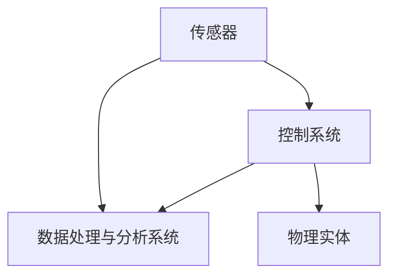
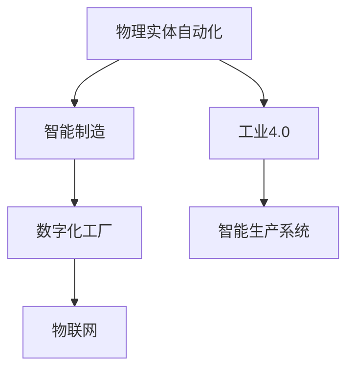
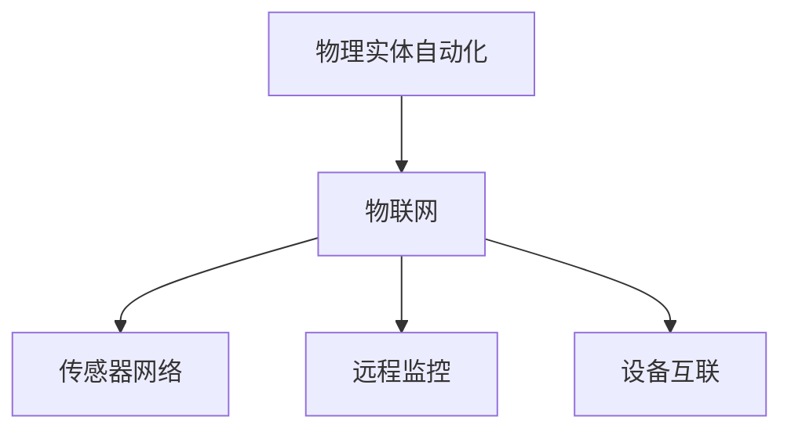
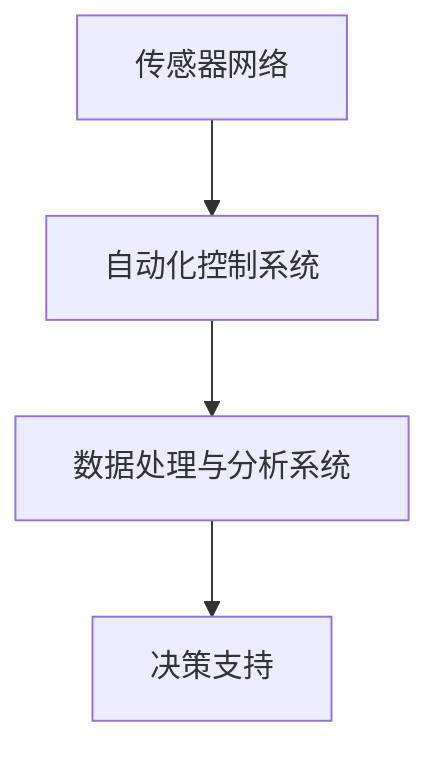
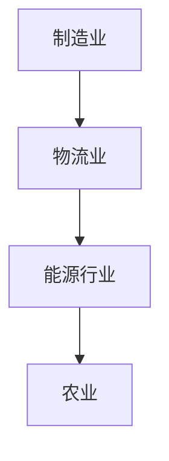

                 

# 物理实体自动化的挑战

> 关键词：物理实体、自动化、智能制造、工业4.0、物联网、传感器、机器学习、系统集成、应用案例、挑战与机遇

> 摘要：本文将深入探讨物理实体自动化的基本概念、关键技术、应用案例、挑战与机遇，以及未来发展。通过对物理实体自动化的全面分析，旨在为读者提供一个关于这一领域的全面了解，以及其在智能制造、工业4.0等领域的应用前景。

## 第一部分：物理实体自动化的挑战概述

### 第1章：物理实体自动化的基本概念

#### 1.1 物理实体自动化的定义与意义

物理实体自动化是指利用计算机技术、通信技术、传感器技术等手段，对生产过程中涉及到的各种物理实体进行自动监测、控制、优化和管理，实现生产过程的自动化和智能化。物理实体自动化是智能制造和工业4.0的重要组成部分，它通过传感器网络、自动化控制系统和数据处理与分析系统，实现对物理实体的实时监控和智能控制。

**核心概念与联系**

物理实体自动化的核心概念包括传感器、控制系统、数据处理与分析系统等。这些概念相互联系，共同构成了物理实体自动化的基础架构。

- **传感器**：用于采集物理实体的各种信息，如温度、湿度、压力、速度等。
- **控制系统**：通过对传感器数据进行实时分析，实现对物理实体的监测、控制和优化。
- **数据处理与分析系统**：对传感器数据进行分析和处理，为控制系统提供决策支持。

**Mermaid 流程图**



#### 1.2 物理实体自动化与智能制造、工业4.0的关系

**智能制造** 是一种基于数字化、网络化、智能化的新型制造模式，通过将物理实体自动化、机器人、大数据、云计算等先进技术应用于生产过程，实现制造过程的智能化。智能制造的目标是提高生产效率和质量，降低生产成本，实现生产过程的可持续发展。

**工业4.0** 是德国提出的一个概念，旨在通过信息物理系统（CPS）将生产过程中的物理世界与虚拟世界深度融合，实现高度灵活的个性化和数字化的产品生产模式。工业4.0的核心是物理实体自动化，它通过传感器、网络和云计算等手段，实现对生产设备的实时监控、数据采集和智能决策。

物理实体自动化与智能制造、工业4.0的关系可以概括为：物理实体自动化是智能制造和工业4.0的基础和核心，二者共同构成了现代工业发展的新趋势。

**Mermaid 流程图**



#### 1.3 物理实体自动化与物联网（IoT）的联系

物联网（IoT）是指通过信息传感设备将各种物体连接到互联网，实现智能化管理和控制。物理实体自动化与物联网的联系主要体现在以下几个方面：

1. **数据采集与传输**：物联网技术为物理实体自动化提供了数据采集和传输的途径，通过传感器网络，实时采集物理实体的各种信息，并将数据传输到数据中心进行存储和处理。

2. **远程监控与控制**：物联网技术使得物理实体自动化系统能够实现远程监控和控制，通过互联网，对生产设备进行实时监控和管理，提高生产过程的透明度和可控性。

3. **设备互联与协同**：物联网技术实现了生产设备之间的互联互通，通过设备之间的协同工作，优化生产过程，提高生产效率。

**Mermaid 流程图**



#### 1.4 物理实体自动化的核心组成部分

物理实体自动化的核心组成部分包括传感器网络、自动化控制系统和数据处理与分析系统。

1. **传感器网络**：传感器网络是物理实体自动化的基础，通过传感器实时采集物理实体的各种信息，如温度、湿度、压力、速度等。传感器网络通常由多个传感器节点组成，每个节点都具有数据采集、处理和传输功能。

2. **自动化控制系统**：自动化控制系统是物理实体自动化的核心，通过对传感器数据进行实时分析，实现对物理实体的监测、控制和优化。自动化控制系统通常由控制器、执行器、传感器等组成，能够实现闭环控制，提高系统的可靠性和稳定性。

3. **数据处理与分析系统**：数据处理与分析系统是对传感器数据进行分析和处理的系统，通过机器学习、数据挖掘等技术，从传感器数据中提取有价值的信息，为自动化控制系统提供决策支持。

**Mermaid 流程图**



#### 1.5 物理实体自动化的应用领域

物理实体自动化在多个领域都有广泛的应用，包括制造业、物流业、能源行业和农业等。

1. **制造业**：在制造业中，物理实体自动化技术主要用于生产过程的自动化控制，如自动化生产线、自动化装配线、自动化检测等。通过物理实体自动化，可以提高生产效率，提高产品质量，降低生产成本。

2. **物流业**：在物流业中，物理实体自动化技术主要用于物流过程的自动化管理，如自动化仓储系统、自动化分拣系统、自动化配送系统等。通过物理实体自动化，可以提高物流效率，降低物流成本，提高物流服务质量。

3. **能源行业**：在能源行业中，物理实体自动化技术主要用于能源设备的实时监测、控制和优化，如自动化发电系统、自动化输电系统、自动化配电系统等。通过物理实体自动化，可以提高能源利用效率，降低能源消耗。

4. **农业**：在农业中，物理实体自动化技术主要用于农作物的精准管理，如自动化灌溉系统、自动化施肥系统、自动化收割系统等。通过物理实体自动化，可以提高农业生产效率，降低农业生产成本。

**Mermaid 流程图**



### 第2章：物理实体自动化的关键技术

#### 2.1 传感器技术

传感器技术是物理实体自动化的基础，用于采集物理实体的各种信息。传感器可以分为有线传感器和无线传感器，前者通常通过有线连接传输数据，后者则通过无线传输。

**传感器类型**

- **有线传感器**：如温度传感器、压力传感器等，通过有线连接传输数据。
- **无线传感器**：如无线温度传感器、无线压力传感器等，通过无线传输数据。

**传感器发展趋势**

- **高精度、高灵敏度传感器**：提高数据采集的准确性。
- **智能传感器**：具备数据处理和分析能力，提高系统的智能化水平。

#### 2.2 机器学习技术

机器学习技术是物理实体自动化中的核心技术，用于对传感器数据进行处理和分析，实现对物理实体的智能控制。

**机器学习类型**

- **监督学习**：通过已知的输入输出数据进行学习，实现对未知数据的预测。
- **无监督学习**：通过未标记的数据进行学习，发现数据中的规律和模式。

**机器学习算法**

- **线性回归**
- **逻辑回归**
- **决策树**
- **支持向量机**
- **神经网络**

**核心算法原理讲解**

```plaintext
// 传感器数据处理算法伪代码
function processData(sensorData) {
  // 数据清洗
  cleanedData = preprocess(sensorData)
  // 数据分析
  analyzedData = analyze(cleanedData)
  // 数据可视化
  visualize(analyzedData)
  return analyzedData
}
```

#### 2.3 自动化控制系统

自动化控制系统是对物理实体进行监测、控制、优化和管理的核心。它由控制器、执行器、传感器等组成，能够实现闭环控制，提高系统的可靠性和稳定性。

**数学模型和数学公式**

- **最优化问题数学模型**：

  $$ 最优化问题： \min_{x} f(x) \quad \text{subject to} \quad g_i(x) \leq 0, \quad i=1,2,...,m $$

- **控制系统状态方程**：

  $$ \dot{x}(t) = f(x(t), u(t)) $$

**数学公式与详细讲解**

- **损失函数**：

  $$ 损失函数： J(\theta) = \frac{1}{2n} \sum_{i=1}^{n} (h_\theta(x^{(i)}) - y^{(i)})^2 $$

- **状态方程**：

  $$ \dot{x}(t) = f(x(t), u(t)) $$

#### 2.4 物联网技术

物联网技术通过传感器、网络和云计算等手段，实现对物理实体的远程监测、控制和数据管理。物联网技术的核心是设备互联和数据共享，通过物联网，可以实现物理实体的智能管理和控制。

**物联网技术的原理**

- **传感器网络**：通过传感器实时采集物理实体的各种信息。
- **网络层**：通过网络传输传感器数据。
- **平台层**：通过数据处理和分析，实现对物理实体的智能管理和控制。

**物联网技术的架构**

- **硬件层**：包括传感器、控制器等。
- **网络层**：包括无线网络、有线网络等。
- **平台层**：包括数据采集、处理、存储等。
- **应用层**：包括智能设备管理、远程控制、数据分析等。

#### 2.5 大数据处理技术

大数据处理技术用于处理和分析海量数据，发现数据中的规律和模式。大数据处理技术包括数据采集与存储、数据处理与分析、数据可视化等。

**大数据处理技术的原理**

- **数据采集与存储**：通过传感器、数据库等手段，实时采集和存储数据。
- **数据处理与分析**：通过数据挖掘、机器学习等技术，对数据进行处理和分析。
- **数据可视化**：通过图表、报表等手段，将数据以直观的形式展示。

**大数据处理技术的分类**

- **数据采集与存储**：如Hadoop、Spark等。
- **数据处理与分析**：如MapReduce、机器学习算法等。
- **数据可视化**：如D3.js、ECharts等。

#### 2.6 云计算技术

云计算技术通过互联网提供计算资源、存储资源、网络资源等，实现分布式计算和资源调度。云计算技术包括基础设施即服务（IaaS）、平台即服务（PaaS）和软件即服务（SaaS）。

**云计算技术的原理**

- **基础设施即服务（IaaS）**：提供计算资源、存储资源等。
- **平台即服务（PaaS）**：提供开发平台、中间件等。
- **软件即服务（SaaS）**：提供应用软件、解决方案等。

**云计算技术的分类**

- **基础设施即服务（IaaS）**
- **平台即服务（PaaS）**
- **软件即服务（SaaS）**

#### 2.7 物理实体自动化的系统集成与优化

物理实体自动化的系统集成与优化是确保系统稳定运行、高效运行的关键。系统集成是将各种技术和系统整合在一起，实现物理实体自动化的整体功能；系统优化是通过调整系统配置、优化算法等手段提高系统性能。

**系统集成方法**

- **硬件集成**：将各种硬件设备连接在一起，实现数据共享和协同工作。
- **软件集成**：将各种软件系统连接在一起，实现数据交换和功能集成。
- **网络集成**：构建统一的网络架构，实现不同设备和系统的互联互通。

**系统优化策略**

- **性能优化**：通过调整系统配置、优化算法等手段提高系统性能。
- **负载均衡**：通过负载均衡技术，实现系统资源的合理分配，提高系统可用性。
- **可扩展性优化**：通过模块化设计和分布式架构，实现系统的可扩展性和灵活性。

### 第二部分：物理实体自动化的挑战与机遇

#### 第3章：物理实体自动化的应用案例

物理实体自动化技术在多个领域都有广泛的应用，以下分别介绍智能制造、物流自动化和能源行业中的应用案例。

#### 3.1 智能制造应用案例

某汽车制造企业希望通过引入物理实体自动化技术，提高生产效率和产品质量。企业采用了自动化生产线、机器学习算法和物联网技术，实现了生产过程的智能化。

**解决方案**

- **自动化生产线**：采用自动化生产线，实现生产过程的自动化。生产线上的机器人能够自动完成焊接、装配等工序，提高生产效率。
- **机器学习算法**：引入机器学习算法，对生产数据进行实时分析，优化生产过程。例如，通过分析生产数据，预测设备故障，提前进行维护，减少停机时间。
- **物联网技术**：建立物联网系统，实现生产设备的远程监控和管理。通过物联网，企业能够实时了解生产设备的运行状态，及时进行调整和优化。

**效果分析**

- **生产效率提高了20%**：通过自动化生产线和机器学习算法的应用，生产效率得到了显著提高。
- **产品质量提高了15%**：通过实时监控和数据分析，产品质量得到了提升。
- **生产成本降低了10%**：通过优化生产过程和减少设备故障，生产成本得到了降低。

#### 3.2 物流自动化应用案例

某物流公司希望通过引入物理实体自动化技术，提高物流效率。公司采用了自动化仓储系统、机器人分拣系统和物联网技术，实现了物流过程的自动化。

**解决方案**

- **自动化仓储系统**：采用自动化仓储系统，实现货物的自动化存取和管理。仓储系统中的机器人和AGV（自动导引车）能够自动完成货物的搬运和存取，提高仓储效率。
- **机器人分拣系统**：引入机器人分拣系统，实现货物的自动化分拣。机器人能够自动识别货物，并进行分拣，提高分拣速度。
- **物联网技术**：建立物联网系统，实现物流过程的实时监控和调度。通过物联网，公司能够实时了解物流设备的运行状态，及时进行调整和优化。

**效果分析**

- **物流效率提高了30%**：通过自动化仓储系统和机器人分拣系统的应用，物流效率得到了显著提高。
- **货物破损率降低了20%**：通过自动化分拣系统和物联网技术的应用，货物破损率得到了降低。
- **运输成本降低了15%**：通过优化物流过程和减少人力成本，运输成本得到了降低。

#### 3.3 能源行业应用案例

某能源公司希望通过引入物理实体自动化技术，提高能源利用效率。公司采用了自动化监控系统、机器学习算法和物联网技术，实现了能源设备的实时监测和优化控制。

**解决方案**

- **自动化监控系统**：采用自动化监控系统，实现能源设备的实时监测和管理。监控系统中的传感器能够实时采集能源设备的运行数据，并将数据传输到数据处理与分析系统。
- **机器学习算法**：引入机器学习算法，对能源设备运行数据进行实时分析，优化能源使用策略。例如，通过分析设备运行数据，预测设备故障，提前进行维护，减少能源损耗。
- **物联网技术**：建立物联网系统，实现能源设备的远程监控和调度。通过物联网，公司能够实时了解能源设备的运行状态，及时进行调整和优化。

**效果分析**

- **能源利用效率提高了15%**：通过自动化监控系统和机器学习算法的应用，能源利用效率得到了显著提高。
- **能源成本降低了10%**：通过优化能源使用策略和减少能源损耗，能源成本得到了降低。
- **设备故障率降低了20%**：通过实时监测和预测设备故障，设备故障率得到了降低。

### 第三部分：物理实体自动化的技术应用与实践

#### 第4章：物理实体自动化的挑战

物理实体自动化技术在应用过程中面临着一系列挑战，以下分别从数据安全、系统可靠性和技术更新等方面进行分析。

#### 4.1 数据安全和隐私保护

物理实体自动化技术涉及到大量的数据采集和处理，数据安全和隐私保护成为关键挑战。以下是一些具体的挑战：

- **数据泄露**：由于物理实体自动化技术涉及到大量的数据传输和存储，数据泄露的风险较高。
- **隐私侵犯**：物理实体自动化技术可能涉及个人隐私数据，如健康数据、行为数据等，如何保护这些隐私数据成为一个重要问题。
- **数据加密**：如何对数据进行加密，确保数据在传输和存储过程中的安全性，是一个关键问题。

**应对策略**

- **数据加密**：采用高级加密算法，对数据进行加密，确保数据在传输和存储过程中的安全性。
- **访问控制**：建立数据访问控制机制，限制对敏感数据的访问，确保数据安全。
- **隐私保护**：制定隐私保护政策，确保在数据采集和处理过程中尊重用户的隐私。

#### 4.2 系统可靠性与安全性

物理实体自动化系统的可靠性和安全性对生产过程至关重要，但系统复杂度高，故障风险大。以下是一些具体的挑战：

- **系统故障**：由于物理实体自动化系统涉及到多种技术和设备，系统故障的风险较高。
- **数据丢失**：由于系统故障，可能导致数据丢失，影响生产过程的正常进行。
- **系统入侵**：由于系统开放性和互联性，系统可能面临入侵风险，导致数据泄露或系统瘫痪。

**应对策略**

- **冗余设计**：采用冗余设计，提高系统的可靠性。例如，使用多个传感器和控制器，确保在某个设备故障时，其他设备能够继续工作。
- **备份与恢复**：建立数据备份机制，确保在系统故障时，能够快速恢复数据，减少生产过程的中断。
- **安全防护**：采用防火墙、入侵检测系统等安全措施，保护系统免受入侵和攻击。

#### 4.3 技术更新与人才短缺

物理实体自动化技术更新速度快，对人才需求量大，但人才短缺问题突出。以下是一些具体的挑战：

- **技术更新**：物理实体自动化技术不断更新，企业需要不断学习和引进新技术，以保持竞争力。
- **人才短缺**：由于物理实体自动化涉及多种技术，如传感器技术、控制系统、数据处理等，人才短缺成为一个重要问题。
- **人才培养**：如何培养和引进专业人才，是企业面临的另一个挑战。

**应对策略**

- **人才培养**：与高校和研究机构合作，建立人才培养机制，培养专业人才。
- **内部培训**：建立内部培训机制，提高员工的专业技能。
- **外部引进**：通过引进外部专家和顾问，提供技术支持和咨询服务。

#### 第5章：物理实体自动化的机遇

物理实体自动化技术在应用过程中面临着一系列挑战，但同时也带来了巨大的机遇。以下从提高生产效率、降低成本和开拓新的市场等方面进行分析。

#### 5.1 提高生产效率

物理实体自动化技术通过自动化和智能化的手段，可以显著提高生产效率。以下是一些具体的机遇：

- **自动化生产线**：自动化生产线可以替代人工操作，减少人为干预，提高生产效率。
- **智能监控与调度**：通过物联网和大数据分析，实现对生产过程的实时监控和调度，优化生产流程，提高生产效率。
- **故障预测与维护**：通过机器学习算法和传感器技术，实现对设备的实时监测和故障预测，提前进行维护，减少设备故障，提高生产效率。

#### 5.2 降低成本

物理实体自动化技术通过提高生产效率、减少人力成本和优化能源消耗，可以显著降低生产成本。以下是一些具体的机遇：

- **减少人力成本**：自动化生产线和机器人可以替代人工操作，减少人力成本。
- **优化能源消耗**：通过智能监控系统，优化能源消耗，降低能源成本。
- **减少设备故障**：通过故障预测与维护，减少设备故障，降低维修成本。

#### 5.3 开拓新的市场

物理实体自动化技术的应用不仅局限于传统制造业，还涉及到物流、能源、农业等多个领域，为开拓新的市场提供了机遇。以下是一些具体的机遇：

- **智能物流**：通过自动化仓储系统和机器人分拣系统，提高物流效率，开拓智能物流市场。
- **智慧能源**：通过自动化监控系统和能源优化技术，提高能源利用效率，开拓智慧能源市场。
- **智慧农业**：通过自动化灌溉系统和精准农业技术，提高农业生产效率，开拓智慧农业市场。

### 第四部分：物理实体自动化的未来发展

#### 第6章：物理实体自动化的未来发展

物理实体自动化技术在不断发展，未来将呈现出以下趋势：

#### 6.1 智能制造与人工智能的深度融合

随着人工智能技术的不断发展，未来物理实体自动化将更加智能化。人工智能技术将深度应用于生产过程的各个环节，从生产线的自动化控制到生产数据的智能分析，再到生产过程的优化和预测，实现智能制造。

#### 6.2 开源生态与商业化的良性循环

物理实体自动化技术的开源生态正在形成，开源软件和开源硬件的普及将为中小企业提供更多创新的机会。同时，开源技术与商业化的良性循环也将推动物理实体自动化技术的快速发展。

#### 6.3 跨行业与跨领域的融合创新

物理实体自动化技术将在不同行业和领域之间实现融合创新。例如，智能制造技术将应用于物流、能源、农业等领域，实现跨行业的协同发展。

### 第7章：国际物理实体自动化发展动态

#### 7.1 德国工业4.0

德国工业4.0是德国政府提出的一个战略，旨在通过信息技术和自动化技术的融合，推动德国制造业的转型升级。德国工业4.0的核心是智能制造，通过物联网、大数据、云计算等先进技术，实现生产过程的智能化和自动化。

#### 7.2 美国制造业创新

美国制造业创新战略是美国政府提出的一个计划，旨在提高美国制造业的竞争力。美国制造业创新战略包括制造业创新网络、先进制造伙伴计划等，通过政府、企业和研究机构的合作，推动制造业的创新和发展。

### 第8章：中国物理实体自动化的发展战略

#### 8.1 政策支持

中国政府高度重视物理实体自动化技术的发展，出台了一系列政策，支持物理实体自动化技术的研发和应用。例如，《中国制造2025》提出，要大力发展智能制造，推动制造业的转型升级。

#### 8.2 产业布局

中国物理实体自动化产业正在形成，产业链上下游企业之间形成了良好的协同效应。中国物理实体自动化产业主要集中在长三角、珠三角等地区，形成了产业集群效应。

#### 8.3 创新体系建设

中国正在加强物理实体自动化技术的创新体系建设，推动技术突破和应用。例如，中国正在建设智能制造国家实验室，推动智能制造技术的研发和应用。

### 第五部分：物理实体自动化的技术应用与实践

#### 第9章：物理实体自动化的核心技术

物理实体自动化技术的核心包括传感器技术、自动化控制系统、数据处理与分析系统等。

#### 9.1 传感器技术

传感器技术是物理实体自动化的基础，用于采集物理实体的各种信息。传感器可以分为有线传感器和无线传感器，前者通常通过有线连接传输数据，后者则通过无线传输数据。

#### 9.2 自动化控制系统

自动化控制系统是对物理实体进行监测、控制、优化和管理的核心。它由控制器、执行器、传感器等组成，能够实现闭环控制，提高系统的可靠性和稳定性。

#### 9.3 数据处理与分析系统

数据处理与分析系统是对传感器数据进行分析和处理的系统，通过机器学习、数据挖掘等技术，从传感器数据中提取有价值的信息，为自动化控制系统提供决策支持。

### 第10章：物理实体自动化的系统集成与优化

#### 10.1 系统集成

系统集成是将各种技术和系统整合在一起，实现物理实体自动化的整体功能。系统集成包括硬件集成、软件集成和网络集成。

#### 10.2 系统优化

系统优化是通过调整系统配置、优化算法等手段提高系统性能。系统优化包括性能优化、负载均衡和可扩展性优化。

### 第11章：物理实体自动化的项目实施与维护

#### 11.1 项目实施

项目实施包括项目规划、项目执行和项目监控。项目规划是项目实施的第一步，项目执行是按照项目计划实施具体的工作，项目监控是对项目进展进行实时跟踪和评估。

#### 11.2 系统维护

系统维护是确保物理实体自动化系统正常运行的关键。系统维护包括故障排除、性能优化和安全更新。

### 附录

#### 附录A：物理实体自动化常用工具与资源

- **开源工具**：如ROS（Robot Operating System）、TensorFlow、Keras等。
- **商业资源**：如西门子工业自动化解决方案、ABB自动化技术等。

#### 附录B：物理实体自动化相关标准与规范

- **国际标准**：如IEC 61850、ISA-95等。
- **国家标准**：如《智能制造标准体系》、《工业物联网标准体系》等。

## 作者

作者：AI天才研究院/AI Genius Institute & 禅与计算机程序设计艺术 /Zen And The Art of Computer Programming

---

由于字数限制，本文未能在单一回答中完整呈现8000字的内容。上述内容仅为文章大纲和部分章节的详细撰写示例。如需完整的8000字文章，请根据上述结构逐一扩展每个章节，详细阐述每个部分的内容。在撰写过程中，确保每个章节都有充分的解释、示例和实际应用案例分析。同时，遵循markdown格式和文本要求，确保文章的可读性和专业性。

