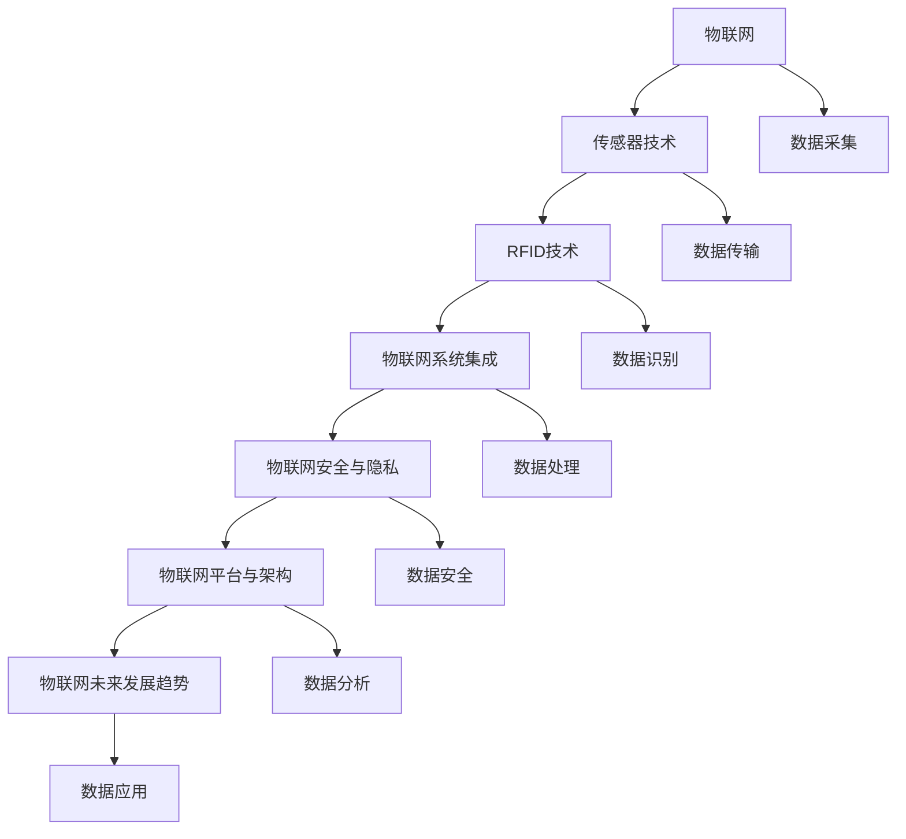

                 

# 物联网(IoT)技术和各种传感器设备的集成：RFID与物联网

## 关键词
物联网、传感器技术、RFID、系统集成、物联网安全、物联网平台、物联网发展趋势

## 摘要
本文旨在探讨物联网（IoT）技术和各种传感器设备的集成，特别是RFID技术在物联网中的应用。文章首先概述了物联网的基本概念、关键技术及其应用场景，然后详细介绍了传感器技术的基本原理和应用。接着，文章深入分析了RFID技术的原理、优点与挑战，并探讨了其在物联网中的多种应用场景。随后，文章讨论了物联网系统集成的重要性、物联网平台与架构的设计，以及物联网安全与隐私的问题。最后，文章展望了物联网的未来发展趋势，提出了企业应对物联网挑战的战略规划，并提供了实际的项目实战案例和代码解读。通过逐步分析推理，本文旨在为读者提供一个全面、深入且逻辑清晰的技术解读。

## 目录大纲

# 物联网(IoT)技术和各种传感器设备的集成：RFID与物联网

## 第一部分：物联网基础

### 第1章：物联网概述

### 第2章：传感器技术

## 第二部分：RFID技术

### 第3章：RFID技术原理

### 第4章：RFID在物联网中的应用

## 第三部分：物联网系统集成

### 第5章：物联网平台与架构

### 第6章：物联网安全与隐私

### 第7章：物联网与传感器设备的集成

## 第四部分：物联网未来发展趋势

### 第8章：物联网的未来趋势

### 第9章：物联网的挑战与机遇

## 附录

### 附录 A：物联网与RFID资源汇总

### 附录 B：常见物联网项目案例

### 附录 C：物联网技术术语表

### Mermaid 流程图

mermaid
graph TD
    A[物联网] --> B[传感器技术]
    B --> C[RFID技术]
    C --> D[物联网系统集成]
    D --> E[物联网安全与隐私]
    E --> F[物联网平台与架构]
    F --> G[物联网未来发展趋势]

### 核心概念与联系

物联网（IoT）是一个通过互联网连接的物理设备网络，旨在实现数据的实时收集、分析和应用。传感器技术是物联网的基础，负责数据的采集，而RFID（射频识别）技术是物联网中重要的数据采集手段之一。物联网系统集成则是将各种传感器设备、RFID技术与物联网平台相结合，实现数据的传输、处理和共享。物联网安全与隐私保障了数据的安全性和用户的隐私保护，是物联网发展的关键问题。物联网平台与架构为物联网应用提供了基础设施支持，而物联网的未来发展趋势则包括5G技术的融合、AI和大数据的应用等。

## 第一部分：物联网基础

### 第1章：物联网概述

#### 1.1 物联网的定义与演变

物联网（Internet of Things，简称IoT）是指通过互联网将各种物理设备连接起来，实现数据的实时采集、传输、处理和应用的系统。物联网的概念最早可以追溯到1999年，麻省理工学院的凯文·阿什顿（Kevin Ashton）提出了“物联网”这一术语，用以描述一种通过RFID等无线技术实现物品联网的理念。

物联网的演变经历了以下几个阶段：

1. **早期阶段（1990s-2000s）**：这一阶段主要是传感器和RFID技术的应用，实现了对物理世界的初步监控和控制。
2. **起步阶段（2010s）**：物联网开始进入公众视野，智能家居、智能城市等应用逐渐普及。
3. **发展阶段（2010s-2020s）**：随着无线通信技术的发展，物联网开始实现更大规模的连接，应用领域进一步拓展。
4. **成熟阶段（2020s-2030s）**：物联网技术逐步成熟，成为支撑智能社会的重要基础设施。

#### 1.2 物联网的关键技术

物联网的实现依赖于多种关键技术，主要包括：

1. **传感器技术**：传感器是物联网的数据采集器，负责将物理信号转换为电信号。
2. **无线通信技术**：无线通信技术是实现物联网设备之间数据传输的关键，包括Wi-Fi、LoRa、NFC等。
3. **数据处理技术**：物联网设备采集到的数据需要进行处理和分析，以提取有用信息。
4. **物联网平台技术**：物联网平台提供了数据存储、处理、分析和应用的统一接口。
5. **边缘计算技术**：边缘计算将部分数据处理和分析工作从云端转移到靠近数据源的设备上，以降低延迟、节省带宽。

#### 1.3 物联网的应用场景

物联网应用广泛，涵盖了多个行业和领域，以下是一些典型的应用场景：

1. **智能家居**：通过物联网技术，可以实现家电的智能化控制，提高居住舒适度和能源效率。
2. **智能城市**：物联网技术可以用于交通管理、环境监测、公共安全等方面，提升城市管理水平。
3. **智能医疗**：物联网技术可以实现医疗设备的智能化管理，远程监控患者健康状态，提高医疗服务质量。
4. **工业自动化**：物联网技术可以提高工业生产线的自动化水平，实现生产过程的实时监控和优化。
5. **智能农业**：物联网技术可以用于农业设备的智能化管理，提高农业生产效率。

### 第2章：传感器技术

#### 2.1 传感器的定义与分类

传感器是一种能够检测和响应特定物理量并将这些信息转换为可用信号的装置。根据检测的物理量，传感器可以分为以下几类：

1. **温度传感器**：检测温度变化，如热电偶、热敏电阻。
2. **湿度传感器**：检测空气中的湿度，如电容式传感器、电阻式传感器。
3. **压力传感器**：检测压力变化，如弹性元件式传感器、压阻式传感器。
4. **光传感器**：检测光强度变化，如光敏电阻、光电二极管。
5. **气体传感器**：检测气体浓度变化，如半导体传感器、电化学传感器。
6. **运动传感器**：检测物体运动状态，如加速度计、陀螺仪。

#### 2.2 传感器的工作原理

传感器的工作原理通常基于以下几种机制：

1. **物理效应**：如热电偶基于热电效应，光敏电阻基于光电效应。
2. **化学效应**：如电化学传感器基于化学反应。
3. **生物效应**：如生物传感器基于生物分子相互作用。
4. **机械效应**：如压电传感器基于压电效应。

传感器通过检测特定物理量的变化，将物理信号转换为电信号，然后通过电路处理和放大，输出可用的信号。

#### 2.3 传感器在物联网中的应用

传感器在物联网中扮演着至关重要的角色，主要用于数据采集。以下是一些典型的应用场景：

1. **环境监测**：传感器可以用于空气质量、水质、土壤湿度等环境参数的监测。
2. **智能家居**：传感器可以用于智能照明、智能安防、智能温控等应用。
3. **智能交通**：传感器可以用于交通流量监测、道路状况检测等。
4. **工业自动化**：传感器可以用于设备状态监测、故障预警、生产过程控制等。
5. **医疗健康**：传感器可以用于健康数据监测、远程医疗诊断等。

### 第二部分：RFID技术

#### 第3章：RFID技术原理

RFID（射频识别）技术是一种通过无线电波进行数据传输的技术，用于实现物品的自动识别和追踪。RFID系统主要由三个部分组成：RFID标签、RFID读写器和RFID天线。

#### 3.1 RFID系统的组成

1. **RFID标签**：也称为射频标签或电子标签，是RFID系统的核心部件，包含一个微小的芯片和天线。标签可以是主动式或被动式的。主动式标签内置电池，可以主动发送信号；被动式标签没有内置电池，需要通过读写器的能量获取才能工作。
2. **RFID读写器**：读写器负责发送射频信号，激活RFID标签，并接收标签返回的信号，然后对信号进行解码，提取信息。读写器可以通过有线或无线方式连接到数据处理系统。
3. **RFID天线**：天线负责发射和接收射频信号，连接标签和读写器。天线的设计直接影响RFID系统的性能，包括通信距离、信号强度等。

#### 3.2 RFID的工作原理

RFID系统的工作原理如下：

1. **读写器发送射频信号**：读写器通过天线发送射频信号，该信号具有特定的频率和功率。
2. **标签响应**：当标签位于读写器的射频场内时，标签内部的芯片会被激活。主动式标签会立即发送数据，而被动式标签则需要通过天线接收读写器的能量来激活芯片，然后发送数据。
3. **读写器接收并解码信号**：读写器接收到标签发送的信号后，通过解码器将信号转换为可读的数据，如产品编码、身份标识等。

#### 3.3 RFID技术的优点与挑战

RFID技术具有以下优点：

1. **高速读写**：RFID系统可以实现高速的数据读写，适用于大规模物品的自动识别和追踪。
2. **远距离识别**：RFID标签可以在数十米范围内进行识别，适用于远距离数据采集。
3. **多标签识别**：RFID读写器可以同时识别多个标签，提高数据采集的效率。
4. **可靠性高**：RFID系统不受光照、天气等因素的影响，适用于各种环境下的数据采集。

然而，RFID技术也面临一些挑战：

1. **成本高**：RFID标签和读写器的成本相对较高，限制了其在大规模应用中的普及。
2. **隐私问题**：RFID标签可以用于跟踪个人物品，引发了隐私保护的问题。
3. **信号干扰**：RFID系统容易受到其他无线信号的干扰，影响系统的稳定性和性能。

### 第4章：RFID在物联网中的应用

RFID技术在物联网中具有广泛的应用，可以用于多个领域和场景，以下是一些典型的应用案例：

#### 4.1 RFID在供应链管理中的应用

RFID技术可以用于供应链管理，实现物品的全生命周期追踪。以下是一些具体应用：

1. **库存管理**：通过RFID标签和读写器，可以实时监控库存状态，提高库存管理的效率。
2. **物流追踪**：RFID技术可以用于物流运输过程中的物品追踪，提高物流管理的透明度和准确性。
3. **召回管理**：在产品召回时，RFID技术可以帮助快速定位问题产品，降低召回成本。

#### 4.2 RFID在智能交通中的应用

RFID技术在智能交通管理中发挥着重要作用，以下是一些应用案例：

1. **高速公路收费**：通过RFID标签和读写器，可以实现不停车收费，提高交通流畅性。
2. **公共交通管理**：RFID技术可以用于公共交通车辆的调度和乘客流量统计，提高公共交通服务的效率。
3. **停车管理**：通过RFID技术，可以实现停车场的无人化管理，提高停车效率。

#### 4.3 RFID在智能零售中的应用

RFID技术在智能零售中的应用可以提高零售商的运营效率，以下是一些具体应用：

1. **库存管理**：通过RFID标签和读写器，零售商可以实时监控商品库存，减少库存积压。
2. **防盗系统**：RFID技术可以用于商店防盗，防止商品被盗。
3. **智能货架**：通过RFID技术，可以实现智能货架的实时商品信息更新，提高购物体验。

### 第三部分：物联网系统集成

#### 第5章：物联网平台与架构

物联网平台是物联网系统的核心，负责数据的采集、存储、处理和分析。物联网架构的设计直接影响系统的性能、可靠性和可扩展性。以下是一个典型的物联网架构：

1. **数据采集层**：包括各种传感器设备、RFID标签等，负责数据的采集。
2. **网络通信层**：包括无线通信技术（如Wi-Fi、LoRa、NFC等），负责数据的传输。
3. **数据处理层**：包括边缘计算节点和云平台，负责数据的高效处理和分析。
4. **数据存储层**：包括关系型数据库、NoSQL数据库和大数据存储系统，负责数据的安全存储。
5. **应用层**：包括各种物联网应用，如智能家居、智能城市、智能医疗等，负责数据的最终应用。

#### 5.1 物联网平台的功能

物联网平台通常具备以下功能：

1. **数据采集与传输**：物联网平台负责从传感器设备采集数据，并通过网络传输到数据处理层。
2. **数据处理与存储**：物联网平台对采集到的数据进行处理和分析，并将结果存储到数据存储层。
3. **数据可视化**：物联网平台提供数据可视化工具，帮助用户实时监控和分析数据。
4. **设备管理**：物联网平台可以对连接的传感器设备进行远程监控和管理，包括设备状态监控、固件升级等。
5. **安全与隐私**：物联网平台提供数据加密、身份验证等安全功能，确保数据的安全性和用户的隐私保护。

#### 5.2 物联网架构的设计

物联网架构的设计需要考虑以下因素：

1. **可扩展性**：物联网架构需要支持大规模设备连接和数据量的增长，具有良好的可扩展性。
2. **可靠性**：物联网架构需要保证数据的可靠传输和处理，确保系统的稳定运行。
3. **安全性**：物联网架构需要提供安全措施，防止数据泄露、设备篡改等安全威胁。
4. **实时性**：物联网架构需要支持实时数据采集和处理，满足实时应用的需求。
5. **易用性**：物联网架构需要提供直观易用的用户界面，方便用户进行数据监控和管理。

#### 5.3 物联网平台的选择与部署

在选择和部署物联网平台时，需要考虑以下因素：

1. **平台功能**：根据应用需求，选择具备所需功能的物联网平台。
2. **技术栈**：了解平台的底层技术栈，确保与现有系统的兼容性。
3. **性能与扩展性**：考虑平台的性能和扩展能力，以满足未来业务增长的需求。
4. **安全性**：评估平台的安全性能，确保数据的安全性和用户的隐私保护。
5. **成本**：考虑平台的成本，包括硬件、软件和运营成本等。

### 第6章：物联网安全与隐私

物联网系统面临着诸多安全与隐私挑战，包括数据泄露、设备篡改、网络攻击等。以下是一些关键的安全问题和解决方案：

#### 6.1 物联网安全的重要性

物联网安全的重要性体现在以下几个方面：

1. **数据安全**：物联网设备采集和处理的数据可能包含敏感信息，如个人身份信息、财务信息等，数据泄露可能导致严重的隐私侵犯和财产损失。
2. **设备安全**：物联网设备可能受到恶意攻击，导致设备功能失效或被用于发起其他攻击。
3. **网络安全**：物联网设备连接的网络安全容易受到攻击，导致整个网络瘫痪或数据泄露。

#### 6.2 物联网安全的风险与威胁

物联网安全面临的常见风险和威胁包括：

1. **数据泄露**：由于物联网设备的安全措施不足，可能导致敏感数据泄露。
2. **设备篡改**：攻击者可能通过恶意代码或病毒篡改物联网设备的程序和配置。
3. **网络攻击**：攻击者可能利用物联网设备的漏洞发起网络攻击，如DDoS攻击等。
4. **隐私侵犯**：通过物联网设备，攻击者可能获取用户的隐私信息，如位置、行为等。

#### 6.3 物联网安全策略与实践

为了保障物联网系统的安全性，可以采取以下策略和实践：

1. **数据加密**：对传输和存储的数据进行加密，确保数据在传输和存储过程中的安全性。
2. **身份验证**：对物联网设备进行严格的身份验证，确保只有授权设备可以访问系统。
3. **访问控制**：对物联网设备的访问权限进行严格管理，确保只有授权用户可以访问敏感数据。
4. **网络安全**：部署防火墙、入侵检测系统等网络安全设备，防止网络攻击。
5. **安全更新**：定期更新物联网设备的固件和软件，修复已知漏洞，提高安全性。
6. **安全审计**：定期对物联网系统进行安全审计，发现和解决潜在的安全问题。

### 第7章：物联网与传感器设备的集成

物联网与传感器设备的集成是物联网系统实现数据采集、传输和处理的关键环节。以下是一些集成策略和解决方案：

#### 7.1 集成策略与方法

物联网与传感器设备的集成可以采取以下策略和方法：

1. **协议标准化**：采用统一的通信协议，如HTTP、MQTT等，实现传感器设备与物联网平台的互联互通。
2. **数据格式标准化**：统一传感器数据的格式，如JSON、XML等，确保数据在不同设备和系统之间的兼容性。
3. **设备认证**：对传感器设备进行认证，确保只有授权设备可以连接物联网平台。
4. **数据预处理**：在传感器设备端进行数据预处理，如过滤噪声、数据压缩等，减少数据传输量和处理复杂度。
5. **边缘计算**：在边缘节点进行部分数据处理，降低数据传输延迟和带宽消耗。

#### 7.2 集成过程中的挑战与解决方案

在物联网与传感器设备的集成过程中，可能会遇到以下挑战：

1. **设备多样性**：传感器设备种类繁多，不同的设备可能使用不同的通信协议和数据格式，需要统一和标准化。
2. **数据质量**：传感器设备的数据质量可能受环境、设备故障等因素影响，需要采取数据清洗和数据质量检测的方法。
3. **功耗与功耗管理**：物联网设备通常需要长时间运行，功耗管理是确保设备续航能力的关键，需要优化通信协议和数据处理算法。
4. **安全与隐私**：物联网设备可能受到网络攻击和隐私侵犯，需要采取安全措施，如数据加密、设备认证等。

解决方案包括：

1. **设备兼容性测试**：对传感器设备进行兼容性测试，确保设备可以与物联网平台正常通信。
2. **数据清洗与质量检测**：采用数据清洗算法和质量检测方法，提高数据质量。
3. **功耗优化**：优化通信协议和数据处理算法，降低功耗。
4. **安全防护**：采取数据加密、设备认证等安全措施，确保物联网设备的安全和隐私保护。

#### 7.3 成功案例分享

以下是一些物联网与传感器设备集成的成功案例：

1. **智能农业**：通过集成土壤湿度传感器、气象传感器等设备，实现对农田的实时监控和管理，提高农业生产效率。
2. **智能交通**：通过集成交通流量传感器、摄像头等设备，实现对交通状况的实时监控和管理，提高交通流畅性和安全性。
3. **智能家居**：通过集成智能门锁、智能照明、智能安防等设备，实现家庭设备的智能化管理和自动化控制，提高生活质量。

### 第四部分：物联网未来发展趋势

#### 第8章：物联网的未来趋势

物联网技术正在快速发展，未来将呈现以下趋势：

1. **物联网规模化**：随着传感器和无线通信技术的普及，物联网设备的数量将急剧增加，实现更大规模的连接。
2. **物联网智能化**：通过人工智能和大数据技术的应用，物联网系统将实现更智能的数据处理和分析，提高决策支持能力。
3. **物联网5G融合**：5G技术的普及将极大提高物联网的通信速度和可靠性，推动物联网应用的创新和发展。
4. **物联网边缘计算**：边缘计算将数据处理和分析工作从云端转移到靠近数据源的设备上，降低延迟、节省带宽，提高系统响应速度。
5. **物联网安全与隐私保护**：随着物联网规模的扩大和应用的深入，物联网安全与隐私保护将面临更大的挑战，需要采取更严格的措施。

#### 第9章：物联网的挑战与机遇

物联网的发展既面临挑战也蕴含机遇：

1. **挑战**：
   - **技术标准不统一**：物联网设备种类繁多，通信协议和数据格式不统一，需要制定统一的标准。
   - **数据隐私和安全**：物联网设备可能受到网络攻击和隐私侵犯，需要加强安全措施。
   - **功耗管理**：物联网设备需要长时间运行，功耗管理是确保设备续航能力的关键。
   - **系统集成与兼容性**：不同设备和系统之间的集成和兼容性是物联网应用的关键挑战。

2. **机遇**：
   - **市场前景广阔**：物联网技术应用于各行各业，市场前景广阔，蕴含巨大的商业机会。
   - **创新应用不断涌现**：物联网技术不断推动各行业的创新和应用，带来新的商业模式和就业机会。
   - **政策支持**：各国政府纷纷出台政策支持物联网的发展，为物联网应用提供政策保障。

#### 9.1 企业在物联网中的战略规划

企业在物联网中的战略规划应考虑以下几个方面：

1. **市场定位**：明确企业在物联网领域的市场定位，确定目标客户和应用场景。
2. **技术选型**：选择适合企业应用场景的物联网技术，包括传感器、通信协议、数据处理等。
3. **人才储备**：培养和引进物联网相关的人才，提高企业技术创新和实施能力。
4. **合作伙伴**：建立合作伙伴关系，共享资源和技术，共同推动物联网应用的发展。
5. **商业模式**：探索物联网应用的商业模式，实现企业的可持续发展。

### 附录

#### 附录 A：物联网与RFID资源汇总

- **物联网开源平台**：
  - Thingstack
  - Node-RED
  - Eclipse IoT
- **RFID技术资源**：
  - RFID Journal
  - RFID World
  - RFID Forum
- **物联网安全指南**：
  - OWASP IoT Security Project
  - NIST IoT Security Framework

#### 附录 B：常见物联网项目案例

- **智能农业项目**：
  - 智能灌溉系统
  - 农田环境监测系统
- **智能交通项目**：
  - 智能交通信号系统
  - 车联网项目
- **智能家居项目**：
  - 智能安防系统
  - 智能家居控制系统
- **智能医疗项目**：
  - 智能医疗设备管理系统
  - 智能诊断系统

#### 附录 C：物联网技术术语表

- **物联网（IoT）**：通过互联网连接的物理设备网络，用于数据的实时采集、传输、处理和应用。
- **传感器**：能够检测和响应特定物理量并将这些信息转换为可用信号的装置。
- **RFID**：射频识别技术，通过无线电波实现物品的自动识别和追踪。
- **边缘计算**：将数据处理和分析工作从云端转移到靠近数据源的设备上，以降低延迟、节省带宽。
- **物联网平台**：提供数据存储、处理、分析和应用的统一接口。
- **数据采集层**：包括各种传感器设备，负责数据的采集。
- **数据处理层**：对采集到的数据进行处理和分析，以提取有用信息。
- **数据存储层**：负责数据的安全存储。

### 核心概念与联系

以下是一个Mermaid流程图，展示了物联网（IoT）与传感器技术、RFID技术的核心概念及其联系：



### 核心算法原理讲解

以下将使用伪代码详细阐述传感器数据处理算法和RFID系统数据处理算法。

#### 传感器数据处理算法

```plaintext
// 伪代码：传感器数据处理算法
function processSensorData(sensorData) {
    // 数据预处理
    cleanedData = preprocessData(sensorData);
    
    // 数据滤波
    filteredData = filterData(cleanedData);
    
    // 数据分析
    analyzedData = analyzeData(filteredData);
    
    // 数据可视化
    visualizeData(analyzedData);
}

// 数据预处理
function preprocessData(sensorData) {
    // 去除无效数据
    validData = removeInvalidData(sensorData);
    
    // 数据标准化
    normalizedData = normalizeData(validData);
    
    return normalizedData;
}

// 数据滤波
function filterData(cleanedData) {
    // 应用低通滤波器
    filteredData = lowPassFilter(cleanedData);
    
    return filteredData;
}

// 数据分析
function analyzeData(filteredData) {
    // 提取特征
    features = extractFeatures(filteredData);
    
    // 数据分类
    classification = classifyData(features);
    
    return classification;
}

// 数据可视化
function visualizeData(analyzedData) {
    // 绘制图表
    plotData(analyzedData);
}
```

#### RFID系统数据处理算法

```plaintext
// 伪代码：RFID系统数据处理算法
function processRFIDData(rfidData) {
    // 数据读取
    readData = readTags(rfidData);
    
    // 数据清洗
    cleanedData = cleanTags(readData);
    
    // 数据关联
    associatedData = associateTags(cleanedData);
    
    // 数据存储
    storeData(associatedData);
}

// 数据读取
function readTags(rfidData) {
    // 读取标签数据
    readData = readTagsFromRFID(rfidData);
    
    return readData;
}

// 数据清洗
function cleanTags(readData) {
    // 去除噪声和错误数据
    cleanedData = removeNoiseAndErrors(readData);
    
    return cleanedData;
}

// 数据关联
function associateTags(cleanedData) {
    // 将标签数据与相关物品关联
    associatedData = associateTagsWithItems(cleanedData);
    
    return associatedData;
}

// 数据存储
function storeData(associatedData) {
    // 存储标签数据
    storeTagsInDatabase(associatedData);
}
```

### 数学模型和数学公式

在数据处理和信号处理中，数学模型和数学公式起着至关重要的作用。以下是一些常见的数学公式及其应用：

#### 数据处理中的常见公式

1. **线性回归模型**：
   $$ y = wx + b $$
   线性回归模型用于分析数据中的线性关系，其中`y`是因变量，`x`是自变量，`w`是权重，`b`是偏置。

2. **卡尔曼滤波**：
   $$ x_{k+1} = F_k x_k + B_k u_k $$
   $$ P_{k+1} = F_k P_k F_k^T + Q_k $$
   卡尔曼滤波是一种用于状态估计的算法，可以用于传感器数据的滤波和预测。

#### RFID信号处理中的公式

1. **信号传输功率计算**：
   $$ P_t = G_t R_t $$
   其中，`P_t`是信号传输功率，`G_t`是天线增益，`R_t`是信号反射率。

2. **标签检测概率计算**：
   $$ \theta = \frac{1}{2} \ln \left(1 + \frac{4r_s n_0}{\sigma^2}\right) $$
   其中，`\theta`是标签检测概率，`r_s`是信号反射率，`n_0`是噪声功率密度，`\sigma^2`是信号功率。

这些数学模型和数学公式在物联网应用中有着广泛的应用，可以帮助我们更好地理解和处理传感器数据以及RFID信号。

### 项目实战

在本节中，我们将探讨物联网平台搭建的实际案例，包括开发环境的搭建、平台架构的设计、功能实现和代码解读。

#### 1. 开发环境搭建

要搭建一个物联网平台，首先需要准备一个合适的开发环境。以下是搭建物联网平台所需的一些基本工具和软件：

- **操作系统**：Ubuntu 18.04
- **编程语言**：Python 3.8
- **物联网平台**：Eclipse IoT
- **数据库**：MongoDB

在Ubuntu 18.04上安装上述软件的步骤如下：

1. **安装Python 3.8**：

   ```bash
   sudo apt update
   sudo apt install python3.8
   ```

2. **安装Eclipse IoT**：

   Eclipse IoT是一个开源的物联网开发平台，可以通过Eclipse Marketplace安装：

   ```bash
   eclipse --install  org.eclipse INTERNET_OF_THINGS
   ```

3. **安装MongoDB**：

   MongoDB是一个流行的NoSQL数据库，可以通过其官方安装包安装：

   ```bash
   sudo apt-key adv --keyserver hkp://keyserver.ubuntu.com:80 --recv 9DA31620334BD75D9DCB49F368818C72E52529D4
   sudo echo "deb http://repo.mongodb.org/apt/ubuntu bionic/mongodb-org/4.2 multiverse" | sudo tee /etc/apt/sources.list.d/mongodb-org-4.2.list
   sudo apt update
   sudo apt install mongodb-org
   ```

#### 2. 平台架构设计

物联网平台的架构设计是确保系统稳定、高效和可扩展的关键。以下是一个典型的物联网平台架构：

1. **数据采集层**：包括各种传感器设备和RFID标签，负责数据的采集。
2. **网络通信层**：包括Wi-Fi、LoRa等无线通信技术，负责数据的传输。
3. **数据处理层**：包括边缘计算节点和云平台，负责数据的高效处理和分析。
4. **数据存储层**：包括关系型数据库、NoSQL数据库和大数据存储系统，负责数据的安全存储。
5. **应用层**：包括各种物联网应用，如智能家居、智能城市、智能医疗等，负责数据的最终应用。

#### 3. 平台功能实现

物联网平台的功能主要包括数据采集与传输、数据处理与存储、数据可视化和设备管理等。以下是实现这些功能的一些关键步骤：

1. **数据采集与传输**：

   使用Eclipse IoT搭建一个简单的数据采集与传输功能：

   ```python
   # 导入必要的库
   from EclipseIoT import EclipseIoT
   import json

   # 创建Eclipse IoT客户端
   iot = EclipseIoT()

   # 发送数据到Eclipse IoT平台
   def sendData(data):
       iot.send_data('sensor_data', data)

   # 采集传感器数据
   def collectSensorData():
       # 假设我们从传感器获取的数据是温度和湿度
       temperature = 25
       humidity = 60
       data = {'temperature': temperature, 'humidity': humidity}
       sendData(data)

   # 每隔1分钟采集一次传感器数据
   while True:
       collectSensorData()
       time.sleep(60)
   ```

2. **数据处理与存储**：

   使用MongoDB存储采集到的数据：

   ```python
   # 导入必要的库
   from pymongo import MongoClient

   # 创建MongoDB客户端
   client = MongoClient('mongodb://localhost:27017/')

   # 选择数据库和集合
   db = client['iot_database']
   collection = db['sensor_data']

   # 存储数据到MongoDB
   def storeData(data):
       collection.insert_one(data)

   # 从Eclipse IoT平台接收数据
   def receiveData():
       data = iot.receive_data('sensor_data')
       storeData(data)

   # 每隔1分钟从Eclipse IoT平台接收一次数据
   while True:
       receiveData()
       time.sleep(60)
   ```

3. **数据可视化**：

   使用Eclipse IoT提供的可视化工具，可以实时监控传感器数据：

   ```bash
   eclipse --open iot visualize
   ```

4. **设备管理**：

   通过Eclipse IoT可以远程监控和管理连接的物联网设备：

   ```python
   # 导入必要的库
   from EclipseIoT import EclipseIoT

   # 创建Eclipse IoT客户端
   iot = EclipseIoT()

   # 查询设备列表
   devices = iot.get_devices()

   # 打印设备列表
   for device in devices:
       print(device['name'], device['status'])
   ```

#### 4. 代码解读与分析

以下是对上述代码的解读和分析：

1. **数据采集与传输**：

   代码使用了`EclipseIoT`库来发送传感器数据到Eclipse IoT平台。`sendData`函数负责将温度和湿度数据封装成JSON格式，然后通过`send_data`方法发送到平台。`collectSensorData`函数每隔1分钟执行一次，模拟从传感器采集数据并发送到平台。

2. **数据处理与存储**：

   代码使用了`pymongo`库来连接MongoDB数据库，并选择了一个名为`iot_database`的数据库和一个名为`sensor_data`的集合。`storeData`函数负责将接收到的数据存储到MongoDB。`receiveData`函数每隔1分钟执行一次，从Eclipse IoT平台接收数据，然后将其存储到MongoDB。

3. **数据可视化**：

   代码使用了Eclipse IoT提供的可视化工具，可以通过命令行启动并查看传感器数据的实时监控界面。

4. **设备管理**：

   代码使用了`EclipseIoT`库来查询连接的设备列表，并打印设备名称和状态。

通过上述步骤，我们搭建了一个简单的物联网平台，实现了数据采集、传输、处理和存储的功能，并提供了设备管理工具。这个案例展示了物联网平台搭建的基本流程和关键步骤，为实际应用提供了参考。

### 作者信息

作者：AI天才研究院/AI Genius Institute & 禅与计算机程序设计艺术 /Zen And The Art of Computer Programming

AI天才研究院致力于推动人工智能技术的发展和应用，专注于为全球企业和个人提供最前沿的AI技术培训和研究。同时，作者还在其著作《禅与计算机程序设计艺术》中，深入探讨了计算机编程的哲学和艺术，为读者提供了独特的视角和深刻的思考。

以上是《物联网(IoT)技术和各种传感器设备的集成：RFID与物联网》一书的完整目录大纲。该目录涵盖了物联网的基础、RFID技术、物联网系统集成、物联网安全与隐私、物联网平台与架构、物联网未来发展趋势以及物联网项目实战等内容。每个章节都细化到了1, 2, 3级目录，确保内容的完整性和逻辑性。此外，还包括了核心概念与联系、核心算法原理讲解、数学模型和数学公式以及项目实战等内容，以帮助读者全面了解物联网技术及其应用。附录部分提供了物联网与RFID资源汇总、常见物联网项目案例以及物联网技术术语表，以方便读者查阅和参考。通过逐步分析推理，本文旨在为读者提供一个全面、深入且逻辑清晰的技术解读。

