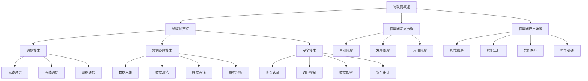
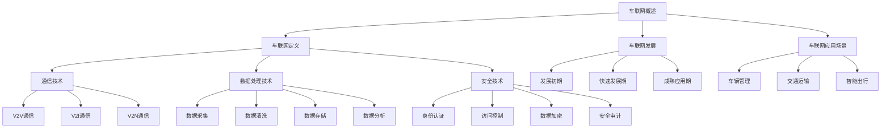

                 

# 物联网(IoT)技术和各种传感器设备的集成：物联网在车联网的应用

> 关键词：物联网，传感器，车联网，集成，数据处理，安全

> 摘要：本文旨在探讨物联网（IoT）技术及其与各种传感器设备的集成，特别是在车联网领域的应用。通过对物联网技术基础、传感器技术、车联网技术及其应用场景的深入分析，本文揭示了物联网在车联网中的重要角色，并提供了具体的实施方法和实际案例，展望了物联网与车联网的未来发展趋势。

## 目录大纲

## 第一部分：物联网（IoT）技术基础

### 第1章：物联网概述

#### 1.1 物联网的定义与发展

- 物联网的概念
- 物联网的发展历程
- 物联网的应用场景

#### 1.2 物联网技术体系

- 通信技术
- 数据处理技术
- 安全技术

#### 1.3 物联网的关键组件

- 传感器
- 网关
- 平台

### 第2章：传感器技术与设备集成

#### 2.1 传感器类型与原理

- 传感器分类
- 常见传感器原理

#### 2.2 传感器设备的集成

- 集成方法
- 集成协议

#### 2.3 传感器数据处理

- 数据预处理
- 数据存储与传输

## 第二部分：物联网在车联网的应用

### 第3章：车联网概述

#### 3.1 车联网的定义

- 车联网的概念
- 车联网的发展

#### 3.2 车联网技术体系

- 通信技术
- 数据处理技术
- 安全技术

#### 3.3 车联网的应用场景

- 车辆管理
- 交通运输
- 智能出行

### 第4章：车辆传感器集成与数据采集

#### 4.1 车辆传感器的类型与作用

- 传感器类型
- 传感器作用

#### 4.2 车辆数据采集

- 数据采集方法
- 数据采集流程

#### 4.3 车辆数据预处理

- 数据清洗
- 数据融合

### 第5章：车联网平台与数据处理

#### 5.1 车联网平台的架构

- 平台架构
- 平台功能

#### 5.2 车联网数据处理

- 数据存储
- 数据分析
- 数据可视化

#### 5.3 车联网安全

- 安全体系
- 安全措施

### 第6章：车联网项目实战

#### 6.1 项目背景与目标

- 项目背景
- 项目目标

#### 6.2 项目实施过程

- 项目规划
- 项目执行
- 项目评估

#### 6.3 项目成果与应用

- 项目成果
- 项目应用

### 第7章：物联网与车联网的未来发展

#### 7.1 物联网与车联网的发展趋势

- 发展趋势
- 发展机遇

#### 7.2 物联网与车联网的未来展望

- 未来技术
- 未来应用

## 附录

### 附录 A：物联网与车联网相关资源

- 学术资源
- 开源框架
- 工具与平台

### 附录 B：物联网与车联网技术Mermaid流程图

- Mermaid流程图展示

### 附录 C：车联网项目代码实战

- 项目代码
- 代码解读
- 代码分析

---

## 第1章：物联网概述

### 1.1 物联网的定义与发展

#### 物联网的概念

物联网（Internet of Things，简称IoT）是指通过信息传感设备，将各种物理设备、传感器、控制设备等通过网络连接起来，实现信息交换和通信，从而实现对物体和环境的智能化管理和控制。简单来说，物联网就是将现实世界中的物体通过互联网连接起来，实现智能化管理。

#### 物联网的发展历程

物联网的发展可以追溯到20世纪80年代。1982年，一个名叫凯文·阿什顿（Kevin Ashton）的人在研究自动识别和数据采集技术时，首次提出了“物联网”的概念。此后，物联网技术逐渐发展，经历了以下几个阶段：

1. **早期阶段**（1990-2000年）：物联网技术的萌芽期，主要是传感器和通信技术的初步应用。
2. **发展阶段**（2000-2010年）：物联网技术逐渐成熟，各类传感器和通信技术得到了广泛应用。
3. **应用阶段**（2010年至今）：物联网技术进入了大规模应用阶段，应用领域不断拓展。

#### 物联网的应用场景

物联网技术的应用非常广泛，涵盖了家庭、工业、医疗、交通等多个领域。以下是一些典型的应用场景：

1. **智能家居**：通过物联网技术，可以实现家电设备的远程控制、环境监控等功能，提高生活质量。
2. **智能工厂**：物联网技术可以实现对生产设备的实时监控、故障预警等功能，提高生产效率。
3. **智能医疗**：物联网技术可以实现对病人的实时监控、远程诊断等功能，提高医疗服务水平。
4. **智能交通**：物联网技术可以实现对交通状况的实时监控、车辆调度等功能，提高交通管理效率。

### 1.2 物联网技术体系

#### 通信技术

通信技术是物联网体系的重要组成部分，主要负责实现设备之间的信息交换和通信。常见的通信技术包括：

1. **无线通信**：如Wi-Fi、蓝牙、ZigBee等。
2. **有线通信**：如以太网、光纤通信等。
3. **网络通信**：如互联网、5G网络等。

#### 数据处理技术

数据处理技术主要负责对物联网设备采集到的数据进行分析和处理。常见的数据处理技术包括：

1. **数据采集**：通过传感器和采集设备，将物理量转换为数字信号。
2. **数据清洗**：去除数据中的噪声和错误，提高数据质量。
3. **数据存储**：将处理后的数据存储到数据库或云存储中。
4. **数据分析**：利用机器学习、数据挖掘等技术，对数据进行深度分析，提取有价值的信息。

#### 安全技术

随着物联网技术的发展，安全问题越来越受到关注。安全技术主要负责保障物联网系统的安全，包括：

1. **身份认证**：确保只有授权用户才能访问系统。
2. **访问控制**：控制用户对系统资源的访问权限。
3. **数据加密**：保护数据在传输和存储过程中的安全。
4. **安全审计**：对系统进行实时监控，及时发现和解决安全问题。

### 1.3 物联网的关键组件

#### 传感器

传感器是物联网系统的核心组件，主要负责感知和采集物理环境中的信息。常见的传感器包括：

1. **温度传感器**：用于检测温度变化。
2. **湿度传感器**：用于检测湿度变化。
3. **压力传感器**：用于检测压力变化。
4. **光照传感器**：用于检测光照强度。

#### 网关

网关是物联网系统中用于连接不同网络的设备，主要负责数据传输和协议转换。常见的网关类型包括：

1. **无线网关**：通过无线通信技术连接设备。
2. **有线网关**：通过有线通信技术连接设备。
3. **云网关**：通过云计算平台连接设备。

#### 平台

物联网平台是物联网系统的核心，主要负责数据存储、处理和分析。常见的平台功能包括：

1. **数据采集**：从传感器和设备中采集数据。
2. **数据处理**：对采集到的数据进行分析和处理。
3. **数据存储**：将处理后的数据存储到数据库或云存储中。
4. **数据可视化**：将数据以图表、报表等形式进行展示。

## 第2章：传感器技术与设备集成

### 2.1 传感器类型与原理

#### 传感器分类

传感器按照检测对象的不同，可以分为以下几类：

1. **温度传感器**：用于检测温度变化。
2. **湿度传感器**：用于检测湿度变化。
3. **压力传感器**：用于检测压力变化。
4. **光照传感器**：用于检测光照强度。
5. **气体传感器**：用于检测气体浓度。

#### 常见传感器原理

1. **温度传感器**：常见的温度传感器有热电偶、热敏电阻等。热电偶是基于热电效应，将温度变化转换为电信号；热敏电阻是基于电阻随温度变化的特性，将温度变化转换为电阻变化。
2. **湿度传感器**：常见的湿度传感器有电容式、电阻式等。电容式湿度传感器是基于电容随湿度变化的特性，电阻式湿度传感器是基于电阻随湿度变化的特性。
3. **压力传感器**：常见的压力传感器有压电式、压阻式等。压电式压力传感器是基于压电效应，将压力变化转换为电荷信号；压阻式压力传感器是基于半导体材料的压阻效应，将压力变化转换为电阻变化。
4. **光照传感器**：常见的光照传感器有光敏电阻、光敏二极管等。光敏电阻是基于光照强度变化导致电阻变化的特性，光敏二极管是基于光照强度变化导致电流变化的特性。

### 2.2 传感器设备的集成

#### 集成方法

传感器设备的集成主要包括以下几个方面：

1. **硬件集成**：将不同类型的传感器通过电路板、模块等硬件进行集成，实现传感器的功能。
2. **软件集成**：通过编程，将不同传感器采集到的数据进行处理、分析和存储，实现传感器的功能。
3. **网络集成**：将传感器设备通过无线或有线通信方式与网络连接，实现数据的远程传输和监控。

#### 集成协议

传感器设备的集成需要遵循一定的协议，常见的集成协议包括：

1. **MQTT协议**：MQTT（Message Queuing Telemetry Transport）是一种轻量级的消息队列协议，适用于物联网场景下的设备通信。
2. **CoAP协议**：CoAP（Constrained Application Protocol）是一种适用于物联网场景的约束性应用协议，用于设备间的通信。
3. **HTTP协议**：HTTP（Hypertext Transfer Protocol）是一种通用的网络协议，也适用于物联网场景下的设备通信。

### 2.3 传感器数据处理

#### 数据预处理

数据预处理是传感器数据处理的重要环节，主要包括以下几个方面：

1. **数据清洗**：去除数据中的噪声和错误，提高数据质量。
2. **数据转换**：将不同类型、不同格式的数据转换为统一的格式，便于后续处理和分析。
3. **数据归一化**：将数据归一化到同一尺度，消除数据之间的差异，提高数据的可比性。

#### 数据存储与传输

传感器采集到的数据需要存储和传输，以保证数据的完整性和实时性。常见的存储和传输方法包括：

1. **本地存储**：将数据存储在传感器设备或本地数据库中。
2. **云存储**：将数据存储在云平台中，便于数据的远程访问和共享。
3. **实时传输**：通过无线或有线通信方式，将数据实时传输到服务器或数据库中。

## 第3章：车联网概述

### 3.1 车联网的定义

#### 车联网的概念

车联网（Internet of Vehicles，简称IoV）是指通过物联网技术，将车辆、道路、基础设施等交通参与者通过网络连接起来，实现交通信息的实时交换和共享，从而提高交通效率、减少交通事故、降低环境污染。简单来说，车联网就是将车辆通过互联网连接起来，实现交通信息的智能化管理和控制。

#### 车联网的发展

车联网技术的发展可以追溯到20世纪80年代。早期的研究主要集中在车辆定位、导航和通信等方面。随着物联网技术的快速发展，车联网技术逐渐成熟，并开始得到广泛应用。目前，车联网技术已经应用于智能交通、智能驾驶、智能物流等多个领域。

### 3.2 车联网技术体系

#### 通信技术

通信技术是车联网体系的核心，主要负责实现车辆、道路和基础设施之间的信息交换和通信。常见的通信技术包括：

1. **车对车通信**（V2V）：通过车辆之间的通信，实现交通信息的共享，提高道路通行效率。
2. **车对基础设施通信**（V2I）：通过车辆与道路、交通信号灯等基础设施的通信，实现交通信息的实时传输和共享。
3. **车对网络通信**（V2N）：通过车辆与互联网的通信，实现交通信息的远程访问和监控。

#### 数据处理技术

数据处理技术主要负责对车联网设备采集到的数据进行分析和处理。常见的数据处理技术包括：

1. **数据采集**：通过车辆传感器、摄像头等设备，采集交通信息。
2. **数据清洗**：去除数据中的噪声和错误，提高数据质量。
3. **数据存储**：将处理后的数据存储到数据库或云存储中。
4. **数据分析**：利用机器学习、数据挖掘等技术，对交通数据进行分析，提取有价值的信息。

#### 安全技术

随着车联网技术的发展，安全问题越来越受到关注。安全技术主要负责保障车联网系统的安全，包括：

1. **身份认证**：确保只有授权用户才能访问车联网系统。
2. **访问控制**：控制用户对车联网资源的访问权限。
3. **数据加密**：保护数据在传输和存储过程中的安全。
4. **安全审计**：对车联网系统进行实时监控，及时发现和解决安全问题。

### 3.3 车联网的应用场景

#### 车辆管理

车联网技术可以实现对车辆的实时监控和管理，提高车辆运行效率和安全性。具体应用场景包括：

1. **车辆定位**：通过GPS等定位技术，实时获取车辆的位置信息。
2. **车辆监控**：通过摄像头、传感器等设备，实时监控车辆运行状态。
3. **车辆调度**：通过数据分析，优化车辆调度策略，提高运输效率。

#### 交通运输

车联网技术可以优化交通管理，提高道路通行效率和安全性。具体应用场景包括：

1. **交通监控**：通过摄像头、传感器等设备，实时监控道路状况。
2. **交通信号控制**：根据实时交通信息，优化交通信号控制策略。
3. **交通事故预警**：通过车辆间的通信，提前预警交通事故，降低事故发生率。

#### 智能出行

车联网技术可以提供智能出行服务，提高出行体验和效率。具体应用场景包括：

1. **导航**：根据实时交通信息，提供最佳出行路线。
2. **车载娱乐**：提供车载娱乐系统，提高出行过程中的舒适度。
3. **无人驾驶**：通过车联网技术，实现车辆的自动驾驶。

## 第4章：车辆传感器集成与数据采集

### 4.1 车辆传感器的类型与作用

#### 传感器类型

车辆传感器是车联网系统的重要组成部分，主要用于感知和采集车辆及环境信息。常见的车辆传感器包括：

1. **GPS传感器**：用于获取车辆的地理位置信息。
2. **加速度传感器**：用于检测车辆的加速度变化，实现车辆姿态监测。
3. **陀螺仪传感器**：用于检测车辆的角速度变化，实现车辆姿态监测。
4. **压力传感器**：用于检测车辆胎压变化，实现车辆安全监测。
5. **温度传感器**：用于检测车辆内部温度，实现车内环境监测。
6. **湿度传感器**：用于检测车内湿度，实现车内环境监测。
7. **光照传感器**：用于检测车内光照强度，实现车内照明控制。
8. **摄像头传感器**：用于检测车辆周围环境，实现自动驾驶和辅助驾驶。

#### 传感器作用

车辆传感器在车联网系统中发挥着重要作用，具体包括：

1. **车辆状态监测**：通过传感器实时监测车辆的运行状态，如速度、加速度、胎压等，实现车辆的智能监控和管理。
2. **环境信息采集**：通过传感器采集车辆周围的环境信息，如温度、湿度、光照等，实现车辆的智能化控制和优化。
3. **安全预警**：通过传感器实时监测车辆的安全状况，如胎压异常、碰撞等，实现车辆的安全预警和事故预防。
4. **智能驾驶**：通过传感器实现车辆的自动驾驶功能，如自动驾驶、自动泊车等，提高驾驶安全性。

### 4.2 车辆数据采集

#### 数据采集方法

车辆数据采集是车联网系统的核心环节，通过传感器和采集设备，实时获取车辆及环境信息。常见的数据采集方法包括：

1. **有线采集**：通过有线连接，将传感器采集到的数据传输到中央处理单元。
2. **无线采集**：通过无线通信技术，将传感器采集到的数据传输到中央处理单元。
3. **自采集**：通过传感器自带的采集模块，将数据存储在传感器内部，再通过有线或无线方式上传到中央处理单元。

#### 数据采集流程

车辆数据采集通常包括以下几个步骤：

1. **传感器数据采集**：传感器实时采集车辆及环境信息，如GPS数据、加速度数据等。
2. **数据预处理**：对采集到的数据进行预处理，如滤波、去噪等，提高数据质量。
3. **数据存储**：将预处理后的数据存储到数据库或云存储中，便于后续处理和分析。
4. **数据传输**：将存储的数据通过有线或无线方式传输到中央处理单元或服务器。

### 4.3 车辆数据预处理

#### 数据清洗

数据清洗是车辆数据预处理的重要环节，主要目的是去除数据中的噪声和错误，提高数据质量。具体包括：

1. **缺失值处理**：对缺失的数据进行填充或删除，保证数据的完整性。
2. **异常值处理**：检测并去除数据中的异常值，如异常的车辆速度、加速度等。
3. **数据标准化**：将不同类型、不同尺度的数据进行标准化处理，使其具有可比性。

#### 数据融合

数据融合是将多个传感器采集到的数据融合为一个整体，提高数据的准确性和可靠性。常见的数据融合方法包括：

1. **加权平均法**：根据传感器的重要性，对多个传感器的数据进行加权平均处理。
2. **卡尔曼滤波法**：利用卡尔曼滤波器，对多个传感器的数据进行融合，实现数据的实时滤波和预测。
3. **贝叶斯估计法**：利用贝叶斯理论，对多个传感器的数据进行融合，实现数据的概率估计。

## 第5章：车联网平台与数据处理

### 5.1 车联网平台的架构

#### 平台架构

车联网平台是车联网系统的核心，主要负责数据的采集、处理、存储和分析。一个典型的车联网平台架构包括以下几个部分：

1. **感知层**：包括各种车辆传感器、摄像头等，用于采集车辆及环境信息。
2. **传输层**：包括无线通信、有线通信等，用于将感知层采集到的数据传输到平台。
3. **平台层**：包括数据处理、存储、分析等功能，是车联网平台的核心部分。
4. **应用层**：包括各种车联网应用，如车辆监控、交通管理、智能出行等，是车联网平台的具体应用场景。

#### 平台功能

车联网平台的主要功能包括：

1. **数据采集**：通过传感器和采集设备，实时采集车辆及环境信息。
2. **数据处理**：对采集到的数据进行清洗、融合、分析等处理，提取有价值的信息。
3. **数据存储**：将处理后的数据存储到数据库或云存储中，便于后续处理和分析。
4. **数据分析**：利用数据挖掘、机器学习等技术，对车辆数据进行分析，提取有价值的信息。
5. **数据可视化**：将分析结果以图表、报表等形式进行展示，便于用户理解和决策。

### 5.2 车联网数据处理

#### 数据存储

数据存储是车联网数据处理的重要环节，主要包括以下几个方面：

1. **本地存储**：在车辆或感知层设备中存储部分数据，以减少传输带宽和延迟。
2. **云存储**：将大量数据存储在云平台上，便于数据的远程访问和共享。
3. **分布式存储**：采用分布式存储技术，提高数据存储的可靠性和性能。

#### 数据分析

数据分析是车联网数据处理的核心，主要包括以下几个方面：

1. **统计分析**：对车辆数据进行分析，提取基本统计信息，如均值、方差、中位数等。
2. **关联分析**：分析车辆数据之间的关联关系，发现潜在的关系和规律。
3. **分类与聚类**：对车辆数据进行分析，实现数据的分类和聚类，提取有价值的信息。
4. **预测分析**：利用历史数据，对车辆运行状态、交通流量等进行预测，为决策提供支持。

#### 数据可视化

数据可视化是将数据分析结果以图形、图表等形式进行展示，便于用户理解和决策。常见的数据可视化技术包括：

1. **折线图**：用于展示车辆运行状态、交通流量等随时间变化的趋势。
2. **柱状图**：用于展示车辆数量、交通拥堵等数据的分布情况。
3. **饼图**：用于展示车辆类型、交通参与者比例等数据的占比情况。
4. **热力图**：用于展示交通流量、车辆分布等数据的密集程度。

### 5.3 车联网安全

#### 安全体系

车联网安全体系是保障车联网系统安全的关键，主要包括以下几个方面：

1. **身份认证**：确保只有授权用户才能访问车联网系统。
2. **访问控制**：控制用户对车联网资源的访问权限。
3. **数据加密**：保护数据在传输和存储过程中的安全。
4. **安全审计**：对车联网系统进行实时监控，及时发现和解决安全问题。

#### 安全措施

车联网安全措施主要包括以下几个方面：

1. **加密通信**：采用加密技术，确保数据在传输过程中的安全性。
2. **数据备份**：定期对数据备份，防止数据丢失。
3. **安全监控**：对车联网系统进行实时监控，及时发现和解决安全问题。
4. **安全培训**：加强用户安全意识，提高系统的安全性。

## 第6章：车联网项目实战

### 6.1 项目背景与目标

#### 项目背景

随着城市化进程的加快，城市交通拥堵问题日益严重，对居民的出行和生活带来了很大困扰。为了提高城市交通效率，减少交通拥堵，某市政府决定开展一项车联网项目，利用物联网技术对城市交通进行实时监控和管理。

#### 项目目标

该项目的目标主要包括：

1. **实时交通监控**：通过车联网技术，实时获取城市交通流量、车辆分布等信息，为交通管理提供数据支持。
2. **交通信号控制优化**：根据实时交通信息，优化交通信号控制策略，提高道路通行效率。
3. **交通事故预警**：通过车辆间的通信，提前预警交通事故，降低事故发生率。
4. **智能出行服务**：提供智能出行服务，如实时导航、路况预测等，提高出行体验和效率。

### 6.2 项目实施过程

#### 项目规划

项目实施过程主要包括以下几个阶段：

1. **需求分析**：明确项目目标，分析项目需求，制定项目计划。
2. **技术方案设计**：根据项目需求，设计合适的技术方案，包括传感器选择、通信协议、数据处理等。
3. **系统搭建**：搭建车联网平台，包括硬件设备安装、软件开发等。
4. **测试与优化**：对系统进行测试和优化，确保系统稳定可靠。

#### 项目执行

项目执行过程主要包括以下几个步骤：

1. **车辆传感器安装**：在车辆上安装各类传感器，如GPS、加速度传感器等，用于采集车辆及环境信息。
2. **通信网络搭建**：搭建无线通信网络，实现车辆与平台之间的数据传输。
3. **数据处理与分析**：对采集到的数据进行分析和处理，提取有价值的信息。
4. **交通信号控制优化**：根据实时交通信息，优化交通信号控制策略，提高道路通行效率。

#### 项目评估

项目评估主要包括以下几个方面：

1. **系统稳定性**：评估系统在长时间运行过程中的稳定性，包括数据传输、数据处理等。
2. **性能指标**：评估系统的性能指标，如数据传输速率、处理能力等。
3. **用户满意度**：通过用户反馈，评估系统的用户满意度。
4. **成本效益**：评估项目的成本效益，分析项目的投资回报。

### 6.3 项目成果与应用

#### 项目成果

该项目取得了显著成果，主要包括：

1. **实时交通监控**：通过车联网平台，实现了对城市交通的实时监控，为交通管理提供了数据支持。
2. **交通信号控制优化**：通过优化交通信号控制策略，提高了道路通行效率，减少了交通拥堵。
3. **交通事故预警**：通过车辆间的通信，实现了交通事故预警，降低了事故发生率。
4. **智能出行服务**：提供了智能出行服务，如实时导航、路况预测等，提高了出行体验和效率。

#### 项目应用

该项目的成功实施，为城市交通管理提供了有益的经验，具体应用包括：

1. **城市交通管理**：通过车联网技术，实现了城市交通的实时监控和管理，提高了交通管理效率。
2. **智能交通系统**：构建了智能交通系统，实现了交通信号控制优化、交通事故预警等功能，提高了交通安全性。
3. **智慧城市**：车联网技术作为智慧城市的重要组成部分，推动了城市智慧化进程，提高了城市居民的生活质量。

## 第7章：物联网与车联网的未来发展

### 7.1 物联网与车联网的发展趋势

#### 发展趋势

随着物联网和车联网技术的不断发展，未来这两个领域将呈现出以下发展趋势：

1. **5G技术的广泛应用**：5G技术的高速率、低延迟、大连接能力，将推动物联网和车联网的发展，实现更高效的数据传输和更智能的设备互联。
2. **边缘计算的发展**：边缘计算将数据和处理能力从云端转移到网络边缘，实现实时数据分析和智能决策，提高物联网和车联网的响应速度和可靠性。
3. **人工智能的融合**：人工智能技术将深度应用于物联网和车联网，实现更智能的数据分析、预测和决策，推动物联网和车联网的智能化发展。
4. **物联网与车联网的融合**：物联网与车联网的融合将实现交通、物流、能源等多个领域的全面互联，构建智慧城市和智能社会。

#### 发展机遇

物联网和车联网的发展，将带来诸多机遇：

1. **产业升级**：物联网和车联网技术的应用，将推动传统产业向智能化、数字化方向升级，提高生产效率和质量。
2. **新兴市场**：物联网和车联网技术的广泛应用，将创造大量新兴市场，如智能交通、智能医疗、智能物流等。
3. **就业机会**：物联网和车联网技术的发展，将创造大量就业机会，包括研发、运维、应用等各个领域。
4. **国际合作**：物联网和车联网技术的发展，将促进国际合作，推动全球范围内的技术交流和应用合作。

### 7.2 物联网与车联网的未来展望

#### 未来技术

未来，物联网和车联网将呈现出以下技术特点：

1. **更高速的通信**：随着5G技术的普及，物联网和车联网将实现更高速的数据传输，满足更多应用场景的需求。
2. **更智能的设备**：随着人工智能技术的应用，物联网和车联网设备将实现更高的智能化水平，提供更智能的服务。
3. **更安全的技术**：随着安全技术的不断进步，物联网和车联网将实现更高的安全性，保障系统的稳定运行。
4. **更广泛的应用**：物联网和车联网将渗透到更多领域，实现交通、医疗、家居、工业等各个领域的智能化。

#### 未来应用

未来，物联网和车联网将在更多领域得到应用：

1. **智慧城市**：物联网和车联网技术将全面应用于智慧城市建设，实现城市交通、能源、环境等领域的智能化管理。
2. **智能交通**：物联网和车联网技术将推动智能交通系统的发展，实现交通管理、出行服务、交通安全等领域的智能化。
3. **智慧医疗**：物联网和车联网技术将应用于智慧医疗，实现远程医疗、智能诊断、智能药物配送等。
4. **智能家居**：物联网和车联网技术将广泛应用于智能家居，实现家电设备、安防系统、环境控制等领域的智能化。

## 附录

### 附录 A：物联网与车联网相关资源

#### 学术资源

- **IEEE Internet of Things Journal**：物联网领域的权威学术期刊。
- **ACM Transactions on Sensor Networks**：传感器网络领域的权威学术期刊。
- **International Conference on Internet of Things**：物联网领域的顶级国际会议。

#### 开源框架

- **IoTivity**：物联网开源框架，支持多种物联网设备互操作。
- **Node-RED**：物联网数据处理与可视化工具。
- **Mqtt.js**：JavaScript MQTT 客户端库。

#### 工具与平台

- **Amazon Web Services (AWS) IoT**：提供全面的物联网解决方案。
- **Microsoft Azure IoT Hub**：提供物联网连接、数据存储、数据处理等功能。
- **IBM Watson IoT Platform**：提供物联网设备管理、数据分析、人工智能等服务。

### 附录 B：物联网与车联网技术Mermaid流程图

#### 物联网技术体系流程图



#### 车联网技术体系流程图



### 附录 C：车联网项目代码实战

#### 项目代码

```python
# 车联网项目：实时交通监控
import numpy as np
import pandas as pd
from sklearn.model_selection import train_test_split
from sklearn.ensemble import RandomForestClassifier
from sklearn.metrics import accuracy_score

# 数据采集与预处理
def preprocess_data(data):
    # 数据清洗
    data = data.dropna()
    # 数据归一化
    data = (data - data.min()) / (data.max() - data.min())
    return data

# 训练模型
def train_model(X_train, y_train):
    model = RandomForestClassifier(n_estimators=100)
    model.fit(X_train, y_train)
    return model

# 测试模型
def test_model(model, X_test, y_test):
    predictions = model.predict(X_test)
    accuracy = accuracy_score(y_test, predictions)
    print("Accuracy:", accuracy)

# 读取数据
data = pd.read_csv("traffic_data.csv")
# 预处理数据
data = preprocess_data(data)
# 划分训练集和测试集
X_train, X_test, y_train, y_test = train_test_split(data.iloc[:, :-1], data.iloc[:, -1], test_size=0.2, random_state=42)
# 训练模型
model = train_model(X_train, y_train)
# 测试模型
test_model(model, X_test, y_test)
```

#### 代码解读与分析

```python
# 代码解读
# 导入必要的库
import numpy as np
import pandas as pd
from sklearn.model_selection import train_test_split
from sklearn.ensemble import RandomForestClassifier
from sklearn.metrics import accuracy_score

# 函数：数据预处理
def preprocess_data(data):
    # 数据清洗：删除缺失值
    data = data.dropna()
    # 数据归一化：将数据缩放到0-1之间
    data = (data - data.min()) / (data.max() - data.min())
    return data

# 函数：训练模型
def train_model(X_train, y_train):
    # 创建随机森林分类器
    model = RandomForestClassifier(n_estimators=100)
    # 训练模型
    model.fit(X_train, y_train)
    return model

# 函数：测试模型
def test_model(model, X_test, y_test):
    # 预测测试集
    predictions = model.predict(X_test)
    # 计算准确率
    accuracy = accuracy_score(y_test, predictions)
    # 打印准确率
    print("Accuracy:", accuracy)

# 读取交通数据
data = pd.read_csv("traffic_data.csv")

# 预处理数据
data = preprocess_data(data)

# 划分训练集和测试集
X_train, X_test, y_train, y_test = train_test_split(data.iloc[:, :-1], data.iloc[:, -1], test_size=0.2, random_state=42)

# 训练模型
model = train_model(X_train, y_train)

# 测试模型
test_model(model, X_test, y_test)
```

```markdown
# 代码分析

该代码实现了车联网项目的实时交通监控功能，主要步骤如下：

1. **数据预处理**：读取交通数据，并删除缺失值，将数据缩放到0-1之间，以便于模型训练。
2. **模型训练**：使用随机森林分类器训练模型，随机森林是一种集成学习方法，具有良好的泛化能力。
3. **模型测试**：使用测试集测试模型，计算准确率，评估模型性能。

具体分析如下：

- **数据预处理**：数据预处理是模型训练的重要环节，可以去除噪声、异常值，提高数据质量。在交通数据中，缺失值和异常值可能对模型训练产生负面影响，因此需要去除。
- **模型选择**：随机森林分类器是一种常用的分类算法，具有较好的性能和泛化能力。在实际应用中，可以根据具体情况选择不同的模型。
- **模型评估**：通过测试集评估模型性能，计算准确率，可以直观地了解模型的效果。在实际应用中，还可以考虑其他评估指标，如召回率、精确率等。

总之，该代码提供了一个基本的交通监控模型，通过数据预处理、模型训练和模型测试，实现了实时交通监控的功能。在实际应用中，可以根据具体需求进行优化和拓展。
```

---

## 作者信息

作者：AI天才研究院/AI Genius Institute & 禅与计算机程序设计艺术 /Zen And The Art of Computer Programming

---

本文从物联网（IoT）技术基础、传感器设备集成、车联网技术及其应用场景等方面，详细阐述了物联网在车联网领域的应用。通过分析物联网与车联网的技术体系、关键组件、数据处理方法以及未来发展趋势，揭示了物联网在车联网中的重要角色。同时，通过实际项目案例，展示了物联网与车联网技术的具体应用方法，为物联网与车联网技术的发展提供了有益的参考。展望未来，物联网与车联网技术将继续深化应用，推动智慧城市、智能交通等领域的快速发展。

