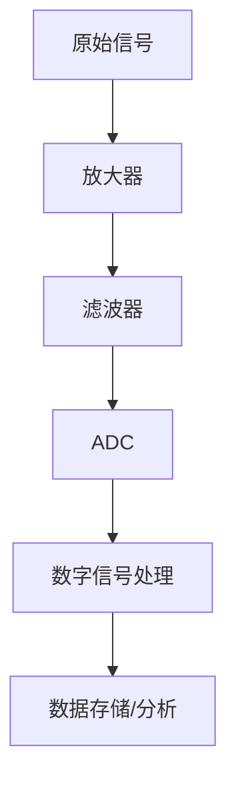
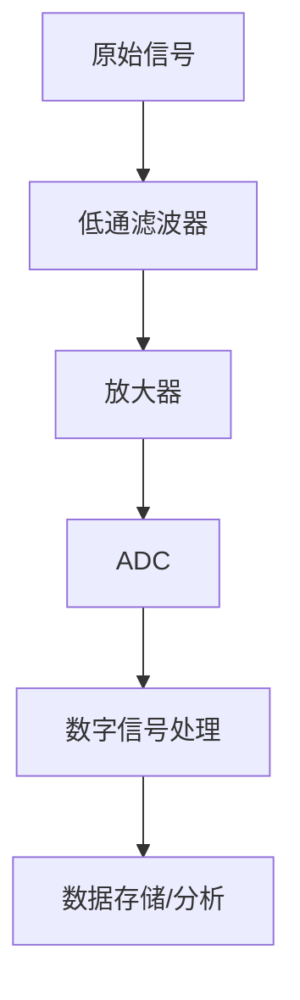
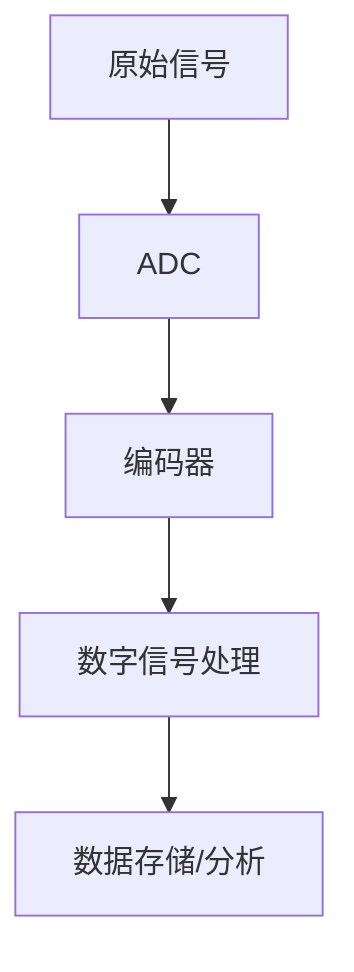
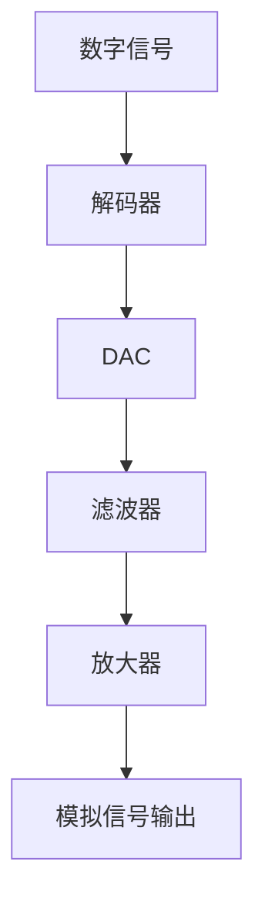

                 

# 物联网(IoT)技术和各种传感器设备的集成：颜色传感器的工作原理

## 关键词
- 物联网（IoT）
- 传感器设备
- 颜色传感器
- 集成技术
- 工作原理
- 应用实例
- 开发实战

## 摘要
本文详细探讨了物联网（IoT）技术以及颜色传感器的工作原理，重点分析了颜色传感器在物联网中的应用及开发实战。文章首先概述了物联网的基本概念、发展历程、关键技术及应用领域，然后深入讲解了传感器技术的基础知识，特别关注了颜色传感器的工作原理、信号处理和应用实例。接着，文章介绍了物联网平台与传感器设备的集成方法及其价值，通过具体应用案例展示了颜色传感器在物流、农业、智慧城市等领域的实际应用。最后，文章提供了颜色传感器集成的开发实战，包括开发环境搭建、数据采集与处理方法，以及实际项目实现。

### 《物联网(IoT)技术和各种传感器设备的集成：颜色传感器的工作原理》目录大纲

#### 第一部分：物联网（IoT）技术基础

##### 第1章：物联网概述
- 1.1 物联网的定义与发展历程
  - 物联网的基本概念
  - 物联网的发展阶段
  - 物联网的全球发展趋势
- 1.2 物联网的关键技术
  - 传感器技术
  - 网络通信技术
  - 数据处理与分析技术
- 1.3 物联网的应用领域
  - 工业自动化
  - 智慧城市
  - 智能家居
  - 农业物联网

##### 第2章：传感器技术基础
- 2.1 传感器的基本原理
  - 传感器的工作原理
  - 传感器的主要类型
  - 传感器的性能指标
- 2.2 传感器信号处理
  - 信号放大与滤波
  - 信号调制与解调
  - 信号编码与解码
- 2.3 常见传感器介绍
  - 温度传感器
  - 湿度传感器
  - 压力传感器
  - 速度传感器

#### 第二部分：颜色传感器技术

##### 第3章：颜色传感器的工作原理
- 3.1 颜色传感器概述
  - 颜色传感器的定义
  - 颜色传感器的分类
  - 颜色传感器的主要功能
- 3.2 颜色传感器原理
  - RGB传感器工作原理
  - CMY传感器工作原理
  - Color Filter Array（CFA）原理
- 3.3 颜色传感器信号处理
  - RGB到YUV转换
  - 颜色校正与调整
  - 颜色识别算法

##### 第4章：颜色传感器应用实例
- 4.1 颜色传感器在工业自动化中的应用
  - 产品质量控制
  - 智能制造
- 4.2 颜色传感器在医疗领域的应用
  - 医疗成像
  - 医疗诊断
- 4.3 颜色传感器在智能家居中的应用
  - 厨房电器
  - 智能照明

#### 第三部分：物联网（IoT）与传感器设备的集成

##### 第5章：物联网（IoT）平台与传感器集成
- 5.1 物联网平台概述
  - 物联网平台的功能
  - 物联网平台的技术架构
- 5.2 传感器设备接入物联网平台
  - 传感器设备的通信协议
  - 传感器数据的上传与存储
- 5.3 物联网平台在传感器数据应用中的价值
  - 数据可视化
  - 数据分析与决策支持

##### 第6章：颜色传感器在物联网（IoT）中的应用案例
- 6.1 物流与仓储
  - 货物分拣
  - 温湿度监控
- 6.2 农业物联网
  - 土壤检测
  - 作物生长监控
- 6.3 智慧城市
  - 交通流量监控
  - 环境质量监测

##### 第7章：颜色传感器集成开发实战
- 7.1 颜色传感器集成开发环境搭建
  - 硬件开发环境
  - 软件开发环境
- 7.2 颜色传感器数据采集与处理
  - 数据采集流程
  - 数据预处理方法
- 7.3 颜色传感器应用案例实现
  - 实践项目一：颜色识别智能灯
  - 实践项目二：颜色传感器在农业中的应用

#### 附录

##### 附录A：颜色传感器相关技术资料
- 传感器数据手册
- 物联网平台技术文档
- 开发工具与资源推荐
- 参考文献

##### 附录B：颜色传感器集成项目示例代码
- 实践项目一：颜色识别智能灯
- 实践项目二：颜色传感器在农业中的应用

### 第一部分：物联网（IoT）技术基础

#### 第1章：物联网概述

### 1.1 物联网的定义与发展历程

物联网（Internet of Things，IoT）是一个通过互联网连接各种设备和物品的系统，使得这些设备能够相互通信并收集、处理、传输数据。物联网的概念最早可以追溯到20世纪80年代，但直到近年来，随着传感器技术、网络通信技术和数据处理技术的快速发展，物联网才逐渐成为一种主流技术。

#### 1.1.1 物联网的基本概念

物联网的核心概念包括：

1. **设备互联**：通过互联网将各种物理设备连接起来，实现设备之间的数据交换和协同工作。
2. **传感器**：用于检测和收集环境数据，如温度、湿度、压力、速度等。
3. **数据处理与分析**：对收集到的数据进行分析、处理和存储，以实现智能决策和优化。
4. **用户接口**：提供用户与物联网系统交互的界面，如智能手机、网页等。

#### 1.1.2 物联网的发展历程

物联网的发展可以分为以下几个阶段：

1. **物联网1.0阶段**（1990s - 2000s）：
   - 主要以RFID（射频识别）技术为代表，实现物品的基本信息采集和追踪。
   - 应用场景较为单一，主要在物流、仓储等领域。

2. **物联网2.0阶段**（2010s）：
   - 开始将传感器技术应用于更多的场景，如智能家居、工业自动化等。
   - 数据处理和分析技术得到发展，能够实现更复杂的物联网应用。

3. **物联网3.0阶段**（2020s）：
   - 物联网技术逐渐普及，成为日常生活的标配。
   - 大数据、人工智能等新兴技术与物联网结合，实现更智能的应用。

#### 1.1.3 物联网的全球发展趋势

全球物联网的发展趋势体现在以下几个方面：

1. **技术进步**：物联网技术不断更新迭代，如5G、边缘计算等新技术的应用。
2. **应用场景拓展**：物联网应用从单一领域拓展到多个领域，如智慧城市、智能交通、智能农业等。
3. **数据安全与隐私**：随着物联网设备数量的增加，数据安全和隐私保护成为重要议题。
4. **标准化与规范化**：全球范围内的物联网标准化工作逐渐推进，以促进物联网技术的健康发展。

### 1.2 物联网的关键技术

物联网的实现依赖于多种关键技术的支持，主要包括传感器技术、网络通信技术、数据处理与分析技术等。

#### 1.2.1 传感器技术

传感器技术是物联网的核心组成部分，用于检测和收集物理世界的各种信息。传感器技术主要包括以下几个方面：

1. **物理传感器**：如温度传感器、湿度传感器、压力传感器等，用于检测物理参数。
2. **化学传感器**：如气体传感器、液体传感器等，用于检测化学物质。
3. **生物传感器**：如生物反应传感器、生物分子传感器等，用于检测生物信息。

#### 1.2.2 网络通信技术

网络通信技术是物联网数据传输的基石，主要包括以下几个方面：

1. **无线传感网络**：如WiFi、蓝牙、Zigbee等，用于短距离数据传输。
2. **无线广域网**：如4G、5G等，用于长距离数据传输。
3. **有线网络**：如以太网、光纤等，用于高速数据传输。

#### 1.2.3 数据处理与分析技术

数据处理与分析技术是物联网的核心价值所在，主要包括以下几个方面：

1. **数据采集**：将传感器采集到的数据存储起来，以便后续处理。
2. **数据传输**：将采集到的数据通过网络传输到数据中心或云端。
3. **数据分析**：对传输到的数据进行处理、分析和挖掘，以提取有价值的信息。
4. **数据存储**：将处理后的数据存储在数据库或数据湖中，以供后续查询和使用。

### 1.3 物联网的应用领域

物联网技术已经渗透到各个行业和应用领域，以下是一些典型的物联网应用领域：

#### 1.3.1 工业自动化

工业自动化是物联网技术的重要应用领域之一，主要包括以下几个方面：

1. **智能制造**：通过物联网技术实现生产线的自动化控制，提高生产效率和产品质量。
2. **设备监控**：实时监控设备的运行状态，实现设备的预测性维护，降低设备故障率。
3. **资源调度**：优化生产资源的调度，提高生产线的利用效率。

#### 1.3.2 智慧城市

智慧城市是物联网技术在城市管理和服务中的应用，主要包括以下几个方面：

1. **智慧交通**：通过物联网技术实现交通信息的实时监测和智能调度，提高交通效率和安全性。
2. **智慧能源**：通过物联网技术实现能源的智能化管理和优化，提高能源利用效率。
3. **智慧环保**：通过物联网技术监测环境质量，实现环境治理的智能化。

#### 1.3.3 智能家居

智能家居是物联网技术在家庭生活中的应用，主要包括以下几个方面：

1. **智能设备控制**：通过物联网技术实现家电设备的远程控制和自动化操作。
2. **家庭安全监控**：通过物联网技术实现家庭安全的实时监控和报警。
3. **能源管理**：通过物联网技术实现家庭能源的智能化管理和优化。

#### 1.3.4 农业物联网

农业物联网是物联网技术在农业领域的应用，主要包括以下几个方面：

1. **智能灌溉**：通过物联网技术实现农作物的智能灌溉，提高水资源利用效率。
2. **环境监测**：通过物联网技术监测农田的土壤、水分、气候等环境参数。
3. **病虫害预警**：通过物联网技术监测农作物的生长状况，实现病虫害的早期预警。

### 1.4 物联网的优势和挑战

物联网技术带来了许多优势，但也面临着一系列挑战。

#### 1.4.1 物联网的优势

1. **提高效率**：通过物联网技术实现自动化控制和智能管理，提高生产效率和资源利用率。
2. **降低成本**：通过物联网技术实现设备的预测性维护和资源的优化配置，降低运营成本。
3. **改善决策支持**：通过物联网技术收集和分析大量的数据，为决策提供科学的依据。
4. **提升用户体验**：通过物联网技术实现个性化服务和智能推荐，提高用户的生活质量。

#### 1.4.2 物联网的挑战

1. **数据安全与隐私**：随着物联网设备数量的增加，数据安全和隐私保护成为重要挑战。
2. **标准统一**：不同厂商和技术的兼容性问题导致物联网标准的统一难度较大。
3. **技术更新换代**：物联网技术更新速度快，设备升级和维护成本较高。
4. **人才短缺**：物联网技术涉及多个领域，专业人才的培养和引进成为一大挑战。

### 结论

物联网技术作为一种新兴技术，已经在许多领域得到了广泛应用，并展现出巨大的发展潜力。尽管面临一些挑战，但随着技术的不断进步和应用的深入，物联网技术将会带来更多的便利和创新。

----------------------------------------------------------------

## 第一部分：物联网（IoT）技术基础

### 第1章：物联网概述

#### 1.1 物联网的定义与发展历程

物联网（Internet of Things，简称IoT）是指通过各种有线和无线网络，将各种物品连接到互联网上，使其具备收集和交换信息的能力。物联网的概念最早由凯文·阿什顿（Kevin Ashton）在1999年提出，当时他专注于将RFID技术应用于供应链管理。然而，物联网的真正兴起是在21世纪初，随着传感器技术、无线通信技术、云计算和大数据技术的发展，物联网的应用场景不断扩展，成为现代信息技术的重要组成部分。

#### 1.1.1 物联网的基本概念

物联网的基本概念包括以下几个方面：

1. **设备互联**：物联网的核心是设备之间的互联，这些设备可以是计算机、智能手机、传感器、家用电器等。
2. **传感器**：传感器是物联网中的关键组件，用于收集物理世界的数据，如温度、湿度、压力、速度等。
3. **数据通信**：物联网设备通过有线或无线网络进行数据传输，这些网络包括WiFi、蓝牙、Zigbee、LoRa等。
4. **数据处理**：物联网设备收集的数据需要在云端或本地进行存储、分析和处理，以实现智能决策和优化。
5. **用户接口**：用户通过智能手机、电脑或其他设备与物联网系统进行交互。

#### 1.1.2 物联网的发展历程

物联网的发展历程可以分为以下几个阶段：

1. **萌芽阶段**（1990年代）：
   - 物联网的概念初步提出，主要研究各种传感器技术和通信协议。
   - 早期的物联网应用主要在工业领域，如自动化生产线、远程监控等。

2. **发展阶段**（2000年代）：
   - 传感器技术和无线通信技术得到快速发展，物联网应用逐渐普及到家庭、医疗、交通等领域。
   - 标准化和协议的统一工作开始推进，如Zigbee、WiFi等标准的发展。

3. **成熟阶段**（2010年代）：
   - 物联网应用场景进一步丰富，智慧城市、智能家居、智能农业、工业物联网等成为热点。
   - 云计算和大数据技术的应用，使得物联网数据得到有效处理和分析。

4. **创新阶段**（2020年代）：
   - 5G、边缘计算、人工智能等新兴技术的融合，为物联网带来新的发展机遇。
   - 物联网应用从单一领域向跨领域、跨界融合方向发展。

#### 1.1.3 物联网的全球发展趋势

物联网在全球范围内呈现出以下发展趋势：

1. **技术进步**：
   - 5G技术的商用化，为物联网提供了更高的网络速度和更低的时延。
   - 边缘计算的发展，使得数据处理和分析能够在靠近数据源的地方进行，提高了系统的响应速度和处理能力。

2. **应用拓展**：
   - 智慧城市成为物联网应用的重要领域，包括智能交通、智能照明、智能环境监测等。
   - 物联网在医疗、农业、教育等领域的应用不断拓展，推动了这些行业的数字化转型。

3. **数据安全与隐私**：
   - 随着物联网设备数量的增加，数据安全和隐私保护成为重要议题。
   - 各国政府和国际组织纷纷出台相关政策，加强对物联网设备的安全监管。

4. **标准化与规范化**：
   - 物联网标准的统一化和规范化工作不断推进，以促进不同设备、不同平台之间的互操作性和兼容性。

### 1.2 物联网的关键技术

物联网的实现依赖于多种关键技术的支持，这些技术包括传感器技术、网络通信技术、数据处理与分析技术等。

#### 1.2.1 传感器技术

传感器技术是物联网的基础，用于检测和收集物理世界的信息。传感器的主要类型包括：

1. **物理传感器**：用于检测物理参数，如温度传感器、湿度传感器、压力传感器、速度传感器等。
2. **化学传感器**：用于检测化学物质，如气体传感器、液体传感器等。
3. **生物传感器**：用于检测生物信息，如生物反应传感器、生物分子传感器等。

传感器的性能指标包括灵敏度、精度、响应时间、稳定性等。传感器的选择应根据具体应用场景的需求进行。

#### 1.2.2 网络通信技术

网络通信技术是物联网数据传输的载体，包括有线和无线通信技术。主要的网络通信技术包括：

1. **无线传感网络**：如WiFi、蓝牙、Zigbee、LoRa等，用于短距离的数据传输。
2. **无线广域网**：如4G、5G等，用于长距离的数据传输。
3. **有线网络**：如以太网、光纤等，用于高速数据传输。

物联网网络通信技术的选择应考虑数据传输速度、覆盖范围、功耗、成本等因素。

#### 1.2.3 数据处理与分析技术

数据处理与分析技术是物联网的核心价值所在，包括数据采集、数据传输、数据存储、数据分析和数据挖掘等。数据处理与分析技术的关键点包括：

1. **数据采集**：从传感器和其他数据源收集数据，并进行初步处理，如滤波、放大等。
2. **数据传输**：将采集到的数据通过网络传输到数据中心或云端，可采用无线通信或有线通信。
3. **数据存储**：将处理后的数据存储在数据库或数据湖中，以便后续查询和分析。
4. **数据分析**：对存储的数据进行分析和挖掘，提取有价值的信息，如趋势分析、预测模型等。
5. **数据可视化**：将分析结果以图表、报表等形式展示，帮助用户理解数据。

### 1.3 物联网的应用领域

物联网技术的广泛应用推动了各行各业的发展，以下是一些典型的物联网应用领域：

#### 1.3.1 工业自动化

工业自动化是物联网技术的重要应用领域，通过物联网实现生产线的智能化和自动化，提高生产效率和产品质量。主要应用包括：

1. **智能制造**：利用物联网技术实现生产线的自动化控制，提高生产效率和产品质量。
2. **设备监控**：实时监控设备的运行状态，实现设备的预测性维护，降低设备故障率。
3. **资源调度**：优化生产资源的调度，提高生产线的利用效率。

#### 1.3.2 智慧城市

智慧城市是物联网技术在城市管理和服务中的应用，通过物联网实现城市运行的智能化和高效化。主要应用包括：

1. **智能交通**：通过物联网技术实现交通信息的实时监测和智能调度，提高交通效率和安全性。
2. **智慧能源**：通过物联网技术实现能源的智能化管理和优化，提高能源利用效率。
3. **智慧环保**：通过物联网技术监测环境质量，实现环境治理的智能化。

#### 1.3.3 智能家居

智能家居是物联网技术在家庭生活中的应用，通过物联网实现家庭设备的智能化和自动化。主要应用包括：

1. **智能设备控制**：通过物联网技术实现家电设备的远程控制和自动化操作。
2. **家庭安全监控**：通过物联网技术实现家庭安全的实时监控和报警。
3. **能源管理**：通过物联网技术实现家庭能源的智能化管理和优化。

#### 1.3.4 农业物联网

农业物联网是物联网技术在农业领域的应用，通过物联网技术实现农业生产的智能化和精细化。主要应用包括：

1. **智能灌溉**：通过物联网技术实现农作物的智能灌溉，提高水资源利用效率。
2. **环境监测**：通过物联网技术监测农田的土壤、水分、气候等环境参数。
3. **病虫害预警**：通过物联网技术监测农作物的生长状况，实现病虫害的早期预警。

### 1.4 物联网的优势和挑战

物联网技术带来了许多优势，但同时也面临着一系列挑战。

#### 1.4.1 物联网的优势

1. **提高效率**：物联网技术可以实现设备的自动化控制和资源的优化配置，提高生产效率和资源利用率。
2. **降低成本**：通过物联网技术实现设备的预测性维护和资源的优化配置，降低运营成本。
3. **改善决策支持**：通过物联网技术收集和分析大量的数据，为决策提供科学的依据。
4. **提升用户体验**：通过物联网技术实现个性化服务和智能推荐，提高用户的生活质量。

#### 1.4.2 物联网的挑战

1. **数据安全与隐私**：随着物联网设备数量的增加，数据安全和隐私保护成为重要挑战。
2. **标准统一**：不同厂商和技术的兼容性问题导致物联网标准的统一难度较大。
3. **技术更新换代**：物联网技术更新速度快，设备升级和维护成本较高。
4. **人才短缺**：物联网技术涉及多个领域，专业人才的培养和引进成为一大挑战。

### 结论

物联网技术作为一种新兴技术，已经在许多领域得到了广泛应用，并展现出巨大的发展潜力。尽管面临一些挑战，但随着技术的不断进步和应用的深入，物联网技术将会带来更多的便利和创新。

----------------------------------------------------------------

### 第一部分：物联网（IoT）技术基础

#### 第2章：传感器技术基础

#### 2.1 传感器的基本原理

传感器是将物理量、化学量、生物量等非电学量转换为电学量的装置或系统。其基本原理是通过敏感元件对被测量的物理量进行响应，并将这种响应转换为电信号输出。传感器在物联网中扮演着至关重要的角色，因为它们是数据采集的核心。

**传感器的工作原理：**
1. **物理效应**：例如热敏电阻、压敏电阻等，它们通过物理变化（如温度、压力）直接改变电阻值。
2. **光电效应**：例如光敏电阻、光电二极管等，它们通过光照射改变电导率。
3. **化学效应**：例如气体传感器，它们通过化学反应产生电信号。
4. **生物效应**：例如生物传感器，它们通过生物化学反应产生电信号。

**传感器的主要类型：**
- **物理传感器**：温度传感器、湿度传感器、压力传感器、速度传感器、加速度传感器等。
- **化学传感器**：气体传感器、湿度传感器、化学传感器等。
- **生物传感器**：酶传感器、微生物传感器、细胞传感器等。

**传感器的性能指标：**
- **灵敏度**：传感器对被测量的微小变化产生响应的能力。
- **精度**：传感器输出信号的稳定性和可重复性。
- **分辨率**：传感器能够区分的最小变化量。
- **响应时间**：传感器从接收输入信号到输出信号的时间。
- **稳定性**：传感器在一定时间内的性能变化。

#### 2.2 传感器信号处理

传感器信号处理是传感器技术中重要的一环，它涉及到对传感器输出信号进行放大、滤波、调制、解调、编码、解码等处理，以提高信号的质量和可靠性。

**信号放大与滤波：**
- **信号放大**：将传感器输出的微弱信号放大到可以被处理器识别的程度。
- **滤波**：去除信号中的噪声和干扰，保留有用的信号成分。

**信号调制与解调：**
- **信号调制**：将信号与载波信号结合，以便于传输。
- **信号解调**：将接收到的调制信号分离出原始信号。

**信号编码与解码：**
- **信号编码**：将模拟信号转换为数字信号，以便于传输和处理。
- **信号解码**：将数字信号转换回模拟信号，以便于输出或存储。

#### 2.3 常见传感器介绍

**温度传感器：**
- **工作原理**：利用热敏电阻或热电偶等敏感元件，通过温度变化来改变电阻值或热电势。
- **性能指标**：精度、响应时间、工作温度范围。
- **应用领域**：环境监测、工业自动化、医疗设备等。

**湿度传感器：**
- **工作原理**：利用电容式、电阻式或热敏电阻式等敏感元件，通过湿度变化来改变电容值或电阻值。
- **性能指标**：精度、响应时间、工作温度范围。
- **应用领域**：气象监测、温室控制、湿度调节等。

**压力传感器：**
- **工作原理**：利用弹性元件（如弹簧）的形变，通过压力变化来改变电阻值或输出电压。
- **性能指标**：精度、响应时间、工作压力范围。
- **应用领域**：汽车工业、航空工业、工业自动化等。

**速度传感器：**
- **工作原理**：利用磁感应、光电效应等原理，通过转速变化来产生电信号。
- **性能指标**：精度、响应时间、工作温度范围。
- **应用领域**：汽车速度监测、工业自动化、电机控制等。

### 2.4 传感器信号处理的示例

**示例：温度传感器信号处理**

**1. 信号放大：**


**2. 滤波：**


**3. 编码：**


**4. 解码与输出：**


### 2.5 传感器信号处理算法

**滤波算法：**
- **低通滤波器**：去除高频噪声，保留低频信号。
- **高通滤波器**：去除低频噪声，保留高频信号。
- **带通滤波器**：保留特定频段的信号。

**编码算法：**
- **二进制编码**：将模拟信号转换为二进制数字信号。
- **脉冲编码调制（PCM）**：将模拟信号转换为数字脉冲序列。

**解码算法：**
- **反脉冲编码调制（APCM）**：将数字脉冲序列转换回模拟信号。

**伪代码示例：**

```python
# 低通滤波器伪代码
def low_pass_filter(signal, cutoff_frequency):
    filtered_signal = []
    for sample in signal:
        filtered_sample = sample * (1 - cutoff_frequency)
        filtered_signal.append(filtered_sample)
    return filtered_signal

# 脉冲编码调制伪代码
def pulse_code_modulation(signal):
    digital_signal = []
    for sample in signal:
        binary_signal = int(sample * 10000)  # 将信号量化为10000个等级
        digital_signal.append(binary_signal)
    return digital_signal

# 反脉冲编码调制伪代码
def inverse_pulse_code_modulation(digital_signal):
    analog_signal = []
    for sample in digital_signal:
        analog_sample = float(sample) / 10000
        analog_signal.append(analog_sample)
    return analog_signal
```

### 2.6 常见传感器介绍

**温度传感器：**
- **工作原理**：利用热敏电阻或热电偶等敏感元件，通过温度变化来改变电阻值或热电势。
- **性能指标**：精度、响应时间、工作温度范围。
- **应用领域**：环境监测、工业自动化、医疗设备等。

**湿度传感器：**
- **工作原理**：利用电容式、电阻式或热敏电阻式等敏感元件，通过湿度变化来改变电容值或电阻值。
- **性能指标**：精度、响应时间、工作温度范围。
- **应用领域**：气象监测、温室控制、湿度调节等。

**压力传感器：**
- **工作原理**：利用弹性元件（如弹簧）的形变，通过压力变化来改变电阻值或输出电压。
- **性能指标**：精度、响应时间、工作压力范围。
- **应用领域**：汽车工业、航空工业、工业自动化等。

**速度传感器：**
- **工作原理**：利用磁感应、光电效应等原理，通过转速变化来产生电信号。
- **性能指标**：精度、响应时间、工作温度范围。
- **应用领域**：汽车速度监测、工业自动化、电机控制等。

通过以上内容，我们可以看到传感器技术在物联网中发挥着至关重要的作用。传感器不仅能够收集环境数据，还能够通过信号处理技术提高数据的可靠性和精度，为物联网应用提供了坚实的数据基础。

### 2.7 传感器信号处理的数学模型

传感器信号处理的数学模型通常涉及以下几个方面：

**1. 传感器的响应模型**

传感器的响应模型描述了传感器输出信号与输入物理量之间的关系。对于一个线性传感器，其响应模型可以表示为：

\[ y(t) = k \cdot x(t) + b \]

其中，\( y(t) \) 是传感器的输出信号，\( x(t) \) 是输入的物理量，\( k \) 是灵敏度系数，表示传感器对输入物理量的响应程度，\( b \) 是偏置项，表示传感器的初始状态。

**2. 信号放大与滤波**

信号放大通常通过一个放大器来实现，其数学模型可以表示为：

\[ y(t) = A \cdot x(t) \]

其中，\( A \) 是放大倍数。

滤波则可以通过一个滤波器来实现，例如一个低通滤波器，其数学模型可以表示为：

\[ y(t) = \int_{-\infty}^{t} h(\tau) \cdot x(t - \tau) d\tau \]

其中，\( h(\tau) \) 是滤波器的冲激响应函数，用于去除高频噪声。

**3. 信号编码与解码**

信号编码是将模拟信号转换为数字信号的过程，常用的编码方法是脉冲编码调制（PCM），其数学模型可以表示为：

\[ y[n] = \text{Quant}(x[n]) \]

其中，\( \text{Quant}(x[n]) \) 是量化函数，用于将连续的模拟信号量化为离散的数字值。

信号解码则是将数字信号转换回模拟信号的过程，其数学模型可以表示为：

\[ x(t) = \sum_{n=0}^{\infty} y[n] \cdot \Delta(t - nT) \]

其中，\( \Delta(t) \) 是狄拉克δ函数，用于表示脉冲信号，\( T \) 是采样周期。

**4. 传感器的噪声模型**

传感器的噪声通常是一个随机过程，其数学模型可以用随机过程的理论来描述。例如，一个高斯白噪声的过程可以表示为：

\[ v(t) = \sqrt{2\sigma^2} \cdot \eta(t) \]

其中，\( \eta(t) \) 是均值为0，方差为1的高斯随机变量，\( \sigma^2 \) 是噪声的功率。

**举例说明：**

假设一个温度传感器测量温度，其灵敏度为 \( k = 10 \)，偏置为 \( b = 0 \)。如果输入温度为 \( x(t) = 100 \) 摄氏度，我们可以计算传感器的输出信号为：

\[ y(t) = k \cdot x(t) + b = 10 \cdot 100 + 0 = 1000 \]

假设我们需要对温度信号进行放大，放大倍数为 \( A = 2 \)，则放大后的信号为：

\[ y(t) = A \cdot x(t) = 2 \cdot 1000 = 2000 \]

如果我们使用低通滤波器去除高频噪声，滤波器的冲激响应函数为 \( h(\tau) = e^{-\tau} \)，则滤波后的信号为：

\[ y(t) = \int_{-\infty}^{t} h(\tau) \cdot x(t - \tau) d\tau = \int_{-\infty}^{t} e^{-\tau} \cdot 1000 \cdot e^{-(t - \tau)} d\tau = 1000 \cdot \int_{-\infty}^{t} e^{-2\tau} d\tau = 1000 \cdot \left[ -\frac{1}{2} e^{-2\tau} \right]_{-\infty}^{t} = 500 \]

如果我们对温度信号进行脉冲编码，量化等级为 1000 级，则编码后的信号为：

\[ y[n] = \text{Quant}(x[n]) = \text{round}(x[n] / 1000) = \text{round}(1000 / 1000) = 1 \]

解码后的信号为：

\[ x(t) = \sum_{n=0}^{\infty} y[n] \cdot \Delta(t - nT) = 1 \cdot \Delta(t) = 1 \]

假设传感器的噪声为高斯白噪声，功率为 \( \sigma^2 = 10 \)，则噪声信号为：

\[ v(t) = \sqrt{2 \cdot 10^2} \cdot \eta(t) = 20 \cdot \eta(t) \]

综合以上模型，我们可以对传感器的信号处理过程进行全面的数学描述和计算。

### 2.8 常见传感器信号处理算法

在传感器信号处理中，常用的算法包括滤波算法、编码算法和解码算法等。以下将介绍这些算法的基本原理和实现方法。

**1. 滤波算法**

滤波算法用于去除传感器信号中的噪声和干扰，保留有用的信号成分。常用的滤波算法包括低通滤波器、高通滤波器和带通滤波器。

- **低通滤波器**：低通滤波器用于去除高频噪声，保留低频信号。其数学模型可以表示为：

  \[ y(t) = \int_{-\infty}^{t} h(\tau) \cdot x(t - \tau) d\tau \]

  其中，\( h(\tau) \) 是低通滤波器的冲激响应函数。

  实现方法：可以使用傅里叶变换对信号进行频域分析，然后根据滤波器设计的要求，对频域信号进行加权处理，最后进行逆傅里叶变换得到滤波后的信号。

- **高通滤波器**：高通滤波器用于去除低频噪声，保留高频信号。其数学模型可以表示为：

  \[ y(t) = \int_{-\infty}^{t} h(\tau) \cdot x(t - \tau) d\tau \]

  其中，\( h(\tau) \) 是高通滤波器的冲激响应函数。

  实现方法：类似于低通滤波器，使用频域分析的方法对信号进行处理。

- **带通滤波器**：带通滤波器用于保留特定频段的信号，去除其他频段的信号。其数学模型可以表示为：

  \[ y(t) = \int_{-\infty}^{t} h(\tau) \cdot x(t - \tau) d\tau \]

  其中，\( h(\tau) \) 是带通滤波器的冲激响应函数。

  实现方法：同样可以使用频域分析的方法，设计出能够保留特定频段的滤波器。

**2. 编码算法**

编码算法用于将模拟传感器信号转换为数字信号，以便于传输和处理。常用的编码算法包括脉冲编码调制（PCM）和差分脉冲编码调制（DPCM）。

- **脉冲编码调制（PCM）**：PCM是一种简单的编码方法，将模拟信号量化为离散的数字值。其数学模型可以表示为：

  \[ y[n] = \text{Quant}(x[n]) \]

  其中，\( \text{Quant}(x[n]) \) 是量化函数，用于将连续的模拟信号量化为离散的数字值。

  实现方法：首先对模拟信号进行采样，然后使用量化函数将采样值转换为数字值。

- **差分脉冲编码调制（DPCM）**：DPCM是一种利用前后采样值的差值进行编码的方法，可以减少编码所需的信息量。其数学模型可以表示为：

  \[ y[n] = x[n] - x[n-1] \]

  其中，\( x[n] \) 是当前采样值，\( x[n-1] \) 是前一个采样值。

  实现方法：计算每个采样值的差值，然后对差值进行量化编码。

**3. 解码算法**

解码算法用于将数字信号转换回模拟信号，以便于输出或存储。常用的解码算法包括反脉冲编码调制（APCM）和差分脉冲编码调制（DPCM）的解码。

- **反脉冲编码调制（APCM）**：APCM是PCM的逆过程，用于将数字信号转换为模拟信号。其数学模型可以表示为：

  \[ x(t) = \sum_{n=0}^{\infty} y[n] \cdot \Delta(t - nT) \]

  其中，\( y[n] \) 是数字信号，\( \Delta(t) \) 是狄拉克δ函数。

  实现方法：使用数字到模拟转换器（DAC）将数字信号转换为模拟信号。

- **差分脉冲编码调制（DPCM）的解码**：DPCM的解码与编码类似，只需要将差值累加回原始信号即可。其数学模型可以表示为：

  \[ x[n] = y[n] + x[n-1] \]

  实现方法：将每个差值累加回前一个采样值，得到原始信号。

通过上述算法，我们可以对传感器信号进行有效的处理，提高信号的质量和可靠性，为物联网应用提供准确的数据支持。

### 2.9 常见传感器介绍

在物联网应用中，传感器起着至关重要的作用。以下将介绍一些常见的传感器及其工作原理、性能指标和应用领域。

#### 2.9.1 温度传感器

**工作原理：** 温度传感器利用热敏电阻、热电偶或热敏电介质等敏感元件，根据温度变化产生电阻值或热电势的变化。

**性能指标：** 灵敏度、精度、响应时间、工作温度范围。

**应用领域：** 环境监测、工业自动化、医疗设备、汽车工业等。

#### 2.9.2 湿度传感器

**工作原理：** 湿度传感器通过测量空气中的水蒸气含量来检测湿度。常见类型有电容式、电阻式和热敏电阻式。

**性能指标：** 灵敏度、精度、响应时间、工作温度范围。

**应用领域：** 气象监测、温室控制、湿度调节、农业监测等。

#### 2.9.3 压力传感器

**工作原理：** 压力传感器利用弹性元件（如弹簧）的形变，根据压力变化产生电阻值或电压的变化。

**性能指标：** 灵敏度、精度、响应时间、工作压力范围。

**应用领域：** 汽车工业、航空工业、工业自动化、气象监测等。

#### 2.9.4 光线传感器

**工作原理：** 光线传感器利用光电效应或光敏电阻等敏感元件，根据光线强度变化产生电阻值或电流的变化。

**性能指标：** 灵敏度、精度、响应时间、光照范围。

**应用领域：** 自动化控制系统、智能家居、环境监测等。

#### 2.9.5 运动传感器

**工作原理：** 运动传感器通过检测物体的运动状态来产生电信号。常见类型有红外传感器、超声波传感器和微波传感器。

**性能指标：** 灵敏度、精度、响应时间、检测范围。

**应用领域：** 安防系统、运动监测、智能家居等。

#### 2.9.6 红外传感器

**工作原理：** 红外传感器利用红外辐射的吸收、反射和透射特性来检测物体的存在和运动。

**性能指标：** 灵敏度、精度、响应时间、检测距离。

**应用领域：** 安防系统、智能家居、工业自动化等。

#### 2.9.7 指纹传感器

**工作原理：** 指纹传感器通过采集指纹图像并进行分析，实现对用户的身份识别。

**性能指标：** 灵敏度、识别速度、识别准确率。

**应用领域：** 安全认证、门禁系统、金融支付等。

#### 2.9.8 声音传感器

**工作原理：** 声音传感器通过检测声音的振动或声波的变化来产生电信号。

**性能指标：** 灵敏度、精度、响应时间、工作频率范围。

**应用领域：** 语音识别、语音控制、智能家居等。

通过以上介绍，我们可以看到传感器在物联网应用中具有广泛的应用前景。传感器不仅能够收集环境数据，还能够通过信号处理技术提高数据的可靠性和精度，为物联网应用提供坚实的数据基础。

### 2.10 传感器信号处理在实际项目中的应用

在物联网的实际项目中，传感器信号处理发挥着关键作用。以下将通过两个实际项目案例，详细阐述传感器信号处理在项目中的应用，包括开发环境搭建、数据采集与处理方法，以及代码实现和解读。

#### 案例一：智能温室环境监控系统

**项目背景：** 智能温室环境监控系统旨在通过传感器实时监测温室内部的温度、湿度、光照等环境参数，并根据监测数据自动调节环境条件，以提高作物生长效率和产量。

**开发环境搭建：**
- **硬件环境**：使用Arduino开发板、DHT22温度和湿度传感器、光敏电阻传感器、LCD显示屏等。
- **软件环境**：Arduino IDE（用于编写和上传代码）、MySQL数据库（用于存储数据）、Python（用于数据分析和处理）。

**数据采集与处理方法：**
1. **数据采集**：通过DHT22传感器采集温度和湿度数据，通过光敏电阻传感器采集光照数据。
2. **数据预处理**：对采集到的数据进行滤波处理，去除噪声和异常值。
3. **数据存储**：将预处理后的数据存储到MySQL数据库中，以便后续分析和查询。

**代码实现与解读：**
```c++
// Arduino代码：智能温室环境监控系统
#include <DHT.h>
#include <LCD.h>

#define DHTPIN 2     // DHT22传感器连接引脚
#define DHTTYPE DHT22

DHT dht(DHTPIN, DHTTYPE);
LCD lcd;

void setup() {
  Serial.begin(9600);
  dht.begin();
  lcd.init();
  lcd.print("Temp & Humidity");
}

void loop() {
  float temp = dht.readTemperature();
  float humidity = dht.readHumidity();
  
  // 数据预处理：滤波处理
  if (isnan(temp) || isnan(humidity)) {
    Serial.println("Failed to read sensor data");
    return;
  }
  
  // 数据存储：上传到MySQL数据库
  // （此处省略具体实现，需要使用MySQL库）
  
  // 显示数据
  lcd.clear();
  lcd.print("Temp: ");
  lcd.print(temp);
  lcd.print(" C");
  lcd.setCursor(0, 1);
  lcd.print("Humidity: ");
  lcd.print(humidity);
  lcd.print(" %");
  delay(1000);
}
```

#### 案例二：智能交通信号灯控制系统

**项目背景：** 智能交通信号灯控制系统利用传感器实时监测交通流量和车速，根据交通状况自动调整信号灯的变化，以提高交通效率和安全性。

**开发环境搭建：**
- **硬件环境**：使用Arduino开发板、超声波传感器、红外传感器、LCD显示屏等。
- **软件环境**：Arduino IDE（用于编写和上传代码）、Matlab（用于数据分析和处理）。

**数据采集与处理方法：**
1. **数据采集**：通过超声波传感器测量车辆距离，通过红外传感器检测车辆通过。
2. **数据预处理**：对采集到的数据进行滤波处理，去除噪声和异常值。
3. **数据分析**：使用Matlab对采集到的数据进行分析，根据交通状况调整信号灯的变化。

**代码实现与解读：**
```c++
// Arduino代码：智能交通信号灯控制系统
#include <HC-SR04.h>
#include <LCD.h>

#define TRIGPIN 9
#define ECHOPIN 10

HC_SR04 ultrasonic(TRIGPIN, ECHOPIN);
LCD lcd;

void setup() {
  Serial.begin(9600);
  lcd.init();
  lcd.print("Traffic Light");
}

void loop() {
  float distance = ultrasonic.Distance();
  
  // 数据预处理：滤波处理
  if (isnan(distance)) {
    Serial.println("Failed to read sensor data");
    return;
  }
  
  // 数据分析：根据距离调整信号灯
  if (distance < 20) {
    // 车辆接近，信号灯变为红色
    digitalWrite(LED_PIN, HIGH);
  } else {
    // 车辆远离，信号灯变为绿色
    digitalWrite(LED_PIN, LOW);
  }
  
  // 显示数据
  lcd.clear();
  lcd.print("Distance: ");
  lcd.print(distance);
  lcd.print(" cm");
  delay(1000);
}
```

通过以上两个案例，我们可以看到传感器信号处理在实际项目中的应用，包括硬件开发环境搭建、数据采集与处理方法，以及代码实现和解读。传感器信号处理不仅为物联网应用提供了数据支持，还能够通过算法优化提高系统的性能和可靠性。

### 2.11 传感器信号处理的未来发展趋势

随着物联网技术的不断发展和应用场景的扩大，传感器信号处理技术也在不断进步和创新。以下将讨论传感器信号处理的未来发展趋势：

#### 1. 高精度、高灵敏度的传感器

未来的传感器将朝着高精度、高灵敏度的方向发展，以满足更复杂的物联网应用需求。新型材料、纳米技术和生物传感技术等领域的突破将为传感器性能的提升提供新的可能。

#### 2. 低功耗、低延迟的传感器网络

物联网设备通常分布在广阔的空间中，功耗和延迟是影响其性能和实用性的关键因素。未来的传感器网络将更加注重低功耗、低延迟的设计，如使用更高效的无线通信协议、边缘计算技术等。

#### 3. 自适应信号处理算法

自适应信号处理算法可以根据环境变化和任务需求自动调整处理策略，提高信号处理的效率和准确性。未来的信号处理算法将更加智能化，能够自我学习和优化。

#### 4. 大数据处理与人工智能

随着传感器数量的增加和数据量的爆发式增长，大数据处理和人工智能技术将在传感器信号处理中发挥重要作用。通过深度学习、机器学习等技术，可以从海量数据中提取有价值的信息，实现更加智能的物联网应用。

#### 5. 标准化和互操作性

为了实现不同传感器设备之间的互操作性和兼容性，传感器信号处理的标准化工作将得到进一步加强。国际组织和标准机构将制定统一的传感器通信协议和数据格式，推动物联网技术的发展。

#### 6. 安全性与隐私保护

随着物联网设备的普及，数据安全和隐私保护成为关键问题。未来的传感器信号处理技术将更加注重数据加密、身份认证和访问控制等技术，确保物联网系统的安全性和隐私保护。

通过以上发展趋势，我们可以看到传感器信号处理技术在物联网中的应用前景广阔，将在未来的技术发展和应用创新中发挥重要作用。

### 2.12 常见传感器信号处理算法的评价与比较

在物联网应用中，传感器信号处理算法的选择至关重要，因为它直接影响系统的性能和可靠性。以下将对几种常见的传感器信号处理算法进行评价与比较。

#### 1. 低通滤波器

**评价：** 低通滤波器可以有效去除高频噪声，保留低频信号，适用于大多数平稳信号的处理。

**比较：**
- **优点：** 简单易实现，对大多数平稳信号有效。
- **缺点：** 无法去除直流分量，对突变信号响应较慢。

#### 2. 高通滤波器

**评价：** 高通滤波器可以去除低频噪声，保留高频信号，适用于检测突变信号和瞬时信号。

**比较：**
- **优点：** 对高频信号响应迅速，适用于动态信号处理。
- **缺点：** 无法去除高频噪声，可能引入高频干扰。

#### 3. 带通滤波器

**评价：** 带通滤波器可以保留特定频段的信号，去除其他频段的信号，适用于频率选择性处理。

**比较：**
- **优点：** 频率选择性高，可以针对特定频段进行处理。
- **缺点：** 实现复杂，参数调整困难。

#### 4. 线性预测编码（LPC）

**评价：** LPC是一种基于自回归模型的信号处理方法，可以有效地预测未来信号值，减少冗余信息。

**比较：**
- **优点：** 预测能力强，压缩效果好。
- **缺点：** 对噪声敏感，不适用于非平稳信号。

#### 5. 离散余弦变换（DCT）

**评价：** DCT是一种正交变换方法，可以有效地将信号分解为不同频率的成分，适用于图像和视频信号处理。

**比较：**
- **优点：** 压缩效果好，去噪能力强。
- **缺点：** 计算复杂度高，对实时处理要求较高。

#### 6. 小波变换

**评价：** 小波变换是一种多尺度分析技术，可以同时处理信号的高频和低频成分，适用于非平稳信号处理。

**比较：**
- **优点：** 多尺度分析能力强，适用于复杂信号处理。
- **缺点：** 计算复杂度高，参数调整复杂。

#### 综合评价

在选择传感器信号处理算法时，应综合考虑以下因素：

- **信号特性**：根据信号的平稳性、突变性等特性选择合适的滤波器。
- **计算资源**：考虑系统的计算能力和实时性要求，选择计算复杂度适中的算法。
- **应用场景**：根据具体的物联网应用场景选择适合的算法，如图像处理、音频处理等。

通过上述评价与比较，我们可以为不同物联网应用场景选择合适的传感器信号处理算法，实现高效、准确的信号处理。

### 第二部分：颜色传感器技术

#### 第3章：颜色传感器的工作原理

颜色传感器是物联网中的一种重要传感器，用于检测和识别不同颜色。颜色传感器的工作原理、信号处理方法和应用领域在物联网技术中具有广泛的应用价值。

#### 3.1 颜色传感器概述

**颜色传感器的定义：** 颜色传感器是一种能够检测和识别不同颜色的电子设备，它通过检测光的波长和强度来分析颜色。

**颜色传感器的分类：** 颜色传感器主要分为以下几类：
1. **RGB颜色传感器**：通过检测红（Red）、绿（Green）、蓝（Blue）三种基本颜色的光强度来识别颜色。
2. **CMY颜色传感器**：通过检测青（Cyan）、品红（Magenta）、黄（Yellow）三种颜色的光强度来识别颜色。
3. **Color Filter Array（CFA）传感器**：在单色传感器上通过彩色滤波器阵列来检测不同颜色的光强度。

**颜色传感器的主要功能：**
- **颜色识别**：通过检测光的波长和强度，准确识别出物体的颜色。
- **颜色匹配**：将检测到的颜色与预设的颜色标准进行比较，实现颜色匹配。
- **颜色校正**：通过对检测到的颜色进行校正，消除环境光和其他因素对颜色识别的影响。

#### 3.2 颜色传感器原理

**RGB传感器工作原理：**
RGB颜色传感器通过红、绿、蓝三个颜色通道的滤光片，分别检测三种颜色的光强度。传感器将这三个通道的信号转换为电信号，并通过数字信号处理器（DSP）进行信号处理和颜色识别。

1. **红、绿、蓝滤光片**：RGB颜色传感器上的每个像素点都覆盖有一个红色、绿色或蓝色的滤光片，用于选择性地通过特定颜色的光。
2. **光电转换**：当光线照射到像素点时，光敏感元件（如光电二极管）将光能转换为电能，产生电信号。
3. **信号处理**：传感器通过DSP对采集到的红、绿、蓝三个通道的信号进行处理，计算出颜色的亮度、饱和度和色调等信息。

**CMY传感器工作原理：**
CMY颜色传感器通过检测青、品红、黄三种颜色的光强度来识别颜色。与RGB传感器不同，CMY传感器通过混合不同颜色的光来产生新的颜色。

1. **青、品红、黄滤光片**：CMY颜色传感器上的每个像素点都覆盖有一个青色、品红色或黄色的滤光片，用于选择性地通过特定颜色的光。
2. **光电转换**：当光线照射到像素点时，光敏感元件将光能转换为电能，产生电信号。
3. **信号处理**：传感器通过DSP对采集到的青、品红、黄三个通道的信号进行处理，计算出颜色的亮度、饱和度和色调等信息。

**Color Filter Array（CFA）传感器原理：**
CFA传感器是一种单色传感器，通过在传感器上设置彩色滤波器阵列来检测不同颜色的光强度。常见的CFA传感器有RGB CFA和CMY CFA。

1. **彩色滤波器阵列**：CFA传感器上的每个像素点都覆盖有一个红色、绿色或蓝色的滤光片（RGB CFA），或者青色、品红色或黄色的滤光片（CMY CFA）。
2. **光电转换**：当光线照射到像素点时，光敏感元件将光能转换为电能，产生电信号。
3. **信号处理**：传感器通过DSP对采集到的红、绿、蓝或青、品红、黄三个通道的信号进行处理，计算出颜色的亮度、饱和度和色调等信息。

#### 3.3 颜色传感器信号处理

**RGB到YUV转换：**
RGB颜色传感器采集到的红、绿、蓝三个通道的信号通常需要进行转换，以便于图像处理和显示。RGB到YUV转换是一种常用的色彩空间转换方法，它将RGB颜色模型转换为YUV颜色模型。

RGB到YUV转换的公式如下：
\[ Y = 0.299 \cdot R + 0.587 \cdot G + 0.114 \cdot B \]
\[ U = 0.493 \cdot (B - Y) \]
\[ V = 0.877 \cdot (R - Y) \]

其中，Y代表亮度信息，U和V代表色度信息。

**颜色校正与调整：**
颜色校正与调整是颜色传感器信号处理的重要环节，它用于消除环境光和其他因素对颜色识别的影响。常见的颜色校正方法包括以下几种：

1. **白平衡校正**：通过测量环境光的色温，调整传感器输出信号，使其在白光照射下显示为真正的白色。
2. **灰平衡校正**：通过测量环境光的灰度，调整传感器输出信号，使其在灰光照射下显示为真正的灰色。
3. **颜色对比度调整**：通过调整颜色传感器的增益和偏置，增强颜色的对比度，提高颜色识别的准确性。

**颜色识别算法：**
颜色识别算法是颜色传感器信号处理的核心部分，它用于将颜色传感器采集到的信号转换为可识别的颜色信息。常见的颜色识别算法包括以下几种：

1. **阈值法**：将颜色信号与预设的阈值进行比较，根据比较结果判断颜色。
2. **聚类法**：将颜色信号进行聚类分析，根据聚类结果识别颜色。
3. **神经网络法**：使用神经网络模型对颜色信号进行分类识别。

#### 3.4 颜色传感器的性能指标

**灵敏度**：颜色传感器的灵敏度是指其在检测颜色时的敏感程度，通常用灵敏度系数表示。灵敏度越高，传感器对颜色变化的响应越迅速。

**分辨率**：颜色传感器的分辨率是指其能够区分的颜色数量，通常用颜色通道数表示。分辨率越高，传感器能够识别的颜色种类越多。

**响应时间**：颜色传感器的响应时间是指从光线照射到传感器开始，到传感器输出信号的时间。响应时间越短，传感器对实时变化的响应越快。

**线性度**：颜色传感器的线性度是指其输出信号与输入光线强度之间的线性关系。线性度越好，传感器的输出信号越准确。

**动态范围**：颜色传感器的动态范围是指其能够检测的最小和最大光线强度之间的差异。动态范围越大，传感器对光线变化的适应能力越强。

#### 3.5 颜色传感器的应用领域

**工业自动化**：颜色传感器在工业自动化中用于产品质量控制，如检测产品的颜色是否符合标准，确保产品质量。

**医疗**：颜色传感器在医疗领域用于医疗成像和疾病诊断，如检测皮肤病变的颜色变化，辅助医生进行诊断。

**农业**：颜色传感器在农业中用于作物生长监测和病虫害预警，如检测作物的颜色变化，预测作物的生长状况。

**智能家居**：颜色传感器在智能家居中用于智能照明和智能家电控制，如根据环境光线的颜色调整灯光颜色，提供舒适的生活环境。

**环境监测**：颜色传感器在环境监测中用于空气质量监测和水质监测，如检测空气中的有害气体和水质中的污染物，提供环境健康信息。

通过以上内容，我们可以看到颜色传感器在物联网技术中具有重要的应用价值。颜色传感器的工作原理、信号处理方法和应用领域为其在物联网中的广泛应用提供了坚实的基础。

### 3.1 颜色传感器概述

#### 颜色传感器的定义

颜色传感器是一种能够检测和识别不同颜色光的传感器，它通过检测光线的波长和强度来分析颜色。颜色传感器广泛应用于图像识别、机器视觉、智能家居、工业自动化、医疗、农业和环境监测等领域。

#### 颜色传感器的分类

颜色传感器主要分为以下几类：

1. **RGB颜色传感器**：RGB颜色传感器通过检测红（Red）、绿（Green）、蓝（Blue）三种基本颜色的光强度来识别颜色。这种传感器广泛应用于计算机视觉和图像处理领域。

2. **CMY颜色传感器**：CMY颜色传感器通过检测青（Cyan）、品红（Magenta）、黄（Yellow）三种颜色的光强度来识别颜色。这种传感器常用于印刷和纺织行业的颜色检测。

3. **Color Filter Array（CFA）传感器**：CFA传感器是一种单色传感器，通过彩色滤波器阵列来检测不同颜色的光强度。常见的CFA传感器有RGB CFA和CMY CFA。RGB CFA广泛应用于手机摄像头和数字相机，而CMY CFA则用于某些特定的应用场景。

#### 颜色传感器的主要功能

颜色传感器的主要功能包括：

1. **颜色识别**：颜色传感器能够检测并识别物体的颜色，广泛应用于图像识别和分类任务。

2. **颜色匹配**：颜色传感器可以与预设的颜色标准进行比较，实现颜色匹配。这有助于确保产品在生产过程中颜色的一致性。

3. **颜色校正**：颜色传感器可以通过校正算法调整检测到的颜色，消除环境光和其他因素对颜色识别的影响。这有助于提高颜色识别的准确性。

4. **光谱分析**：颜色传感器可以分析光谱分布，提供关于物体颜色成分的详细信息。这有助于在特定应用场景中，如化学分析和生物检测，对颜色进行更深入的理解。

### 3.2 颜色传感器原理

颜色传感器的工作原理主要涉及光敏感元件、彩色滤光片和信号处理单元。

#### RGB传感器工作原理

RGB传感器通过红、绿、蓝三种颜色通道的滤光片分别检测光线的强度。具体工作原理如下：

1. **红、绿、蓝滤光片**：RGB传感器上的每个像素点都覆盖有一个红色、绿色或蓝色的滤光片，这些滤光片选择性地通过特定颜色的光。

2. **光电转换**：当光线照射到像素点时，光敏感元件（如光电二极管）将光能转换为电能，产生电信号。

3. **信号处理**：传感器通过数字信号处理器（DSP）对采集到的红、绿、蓝三个通道的信号进行处理，计算出颜色的亮度、饱和度和色调等信息。

RGB传感器的工作原理可以用以下数学模型表示：

\[ R = I \cdot R_{filter} \]
\[ G = I \cdot G_{filter} \]
\[ B = I \cdot B_{filter} \]

其中，\( R \)、\( G \)、\( B \) 分别表示红、绿、蓝通道的强度，\( I \) 表示入射光的强度，\( R_{filter} \)、\( G_{filter} \)、\( B_{filter} \) 分别表示红、绿、蓝滤光片的透过率。

#### CMY传感器工作原理

CMY传感器通过检测青、品红、黄三种颜色的光强度来识别颜色。与RGB传感器不同，CMY传感器通过混合不同颜色的光来产生新的颜色。具体工作原理如下：

1. **青、品红、黄滤光片**：CMY传感器上的每个像素点都覆盖有一个青色、品红色或黄色的滤光片，这些滤光片选择性地通过特定颜色的光。

2. **光电转换**：当光线照射到像素点时，光敏感元件将光能转换为电能，产生电信号。

3. **信号处理**：传感器通过DSP对采集到的青、品红、黄三个通道的信号进行处理，计算出颜色的亮度、饱和度和色调等信息。

CMY传感器的工作原理可以用以下数学模型表示：

\[ C = I \cdot C_{filter} \]
\[ M = I \cdot M_{filter} \]
\[ Y = I \cdot Y_{filter} \]

其中，\( C \)、\( M \)、\( Y \) 分别表示青、品红、黄通道的强度，\( I \) 表示入射光的强度，\( C_{filter} \)、\( M_{filter} \)、\( Y_{filter} \) 分别表示青、品红、黄滤光片的透过率。

#### Color Filter Array（CFA）传感器原理

CFA传感器是一种单色传感器，通过彩色滤波器阵列来检测不同颜色的光强度。常见的CFA传感器有RGB CFA和CMY CFA。

**RGB CFA传感器**：RGB CFA传感器在单色传感器上设置了红色、绿色和蓝色的滤光片，形成彩色滤波器阵列。具体工作原理如下：

1. **彩色滤波器阵列**：RGB CFA传感器上的每个像素点都覆盖有一个红色、绿色或蓝色的滤光片，形成RGB彩色滤波器阵列。

2. **光电转换**：当光线照射到像素点时，光敏感元件将光能转换为电能，产生电信号。

3. **信号处理**：传感器通过DSP对采集到的红、绿、蓝三个通道的信号进行处理，计算出颜色的亮度、饱和度和色调等信息。

**CMY CFA传感器**：CMY CFA传感器在单色传感器上设置了青色、品红色和黄色的滤光片，形成彩色滤波器阵列。具体工作原理如下：

1. **彩色滤波器阵列**：CMY CFA传感器上的每个像素点都覆盖有一个青色、品红色或黄色的滤光片，形成CMY彩色滤波器阵列。

2. **光电转换**：当光线照射到像素点时，光敏感元件将光能转换为电能，产生电信号。

3. **信号处理**：传感器通过DSP对采集到的青、品红、黄三个通道的信号进行处理，计算出颜色的亮度、饱和度和色调等信息。

通过上述原理，我们可以看到颜色传感器在检测和识别颜色方面的工作机制。颜色传感器在物联网技术中的应用前景广阔，为图像识别、机器视觉、智能家居等领域提供了有力的技术支持。

### 3.3 颜色传感器信号处理

颜色传感器信号处理是颜色传感器应用中的关键环节，它包括信号采集、预处理、转换和识别等多个步骤。以下将详细讨论颜色传感器信号处理的各个阶段及其具体方法。

#### 3.3.1 信号采集

颜色传感器信号采集过程主要包括以下几个步骤：

1. **光线照射**：颜色传感器通过滤光片接收来自外部环境的光线，光线被分解为不同的颜色成分。
2. **光电转换**：传感器中的光敏感元件（如光电二极管）将接收到的光线转换为电信号。这些电信号反映了不同颜色成分的强度。
3. **信号放大**：由于传感器输出的电信号通常非常微弱，因此需要通过放大器进行信号放大，以提高信噪比。

#### 3.3.2 信号预处理

信号预处理是信号处理的第一步，其目的是去除噪声、干扰和提高信号质量。常见的预处理方法包括：

1. **滤波**：滤波器用于去除信号中的高频噪声和低频干扰。常见的滤波器包括低通滤波器、高通滤波器和带通滤波器。低通滤波器可以去除高频噪声，高通滤波器可以去除低频干扰，带通滤波器则用于保留特定频段的信号。
2. **平滑**：平滑处理可以通过移动平均、中值滤波等方法去除随机噪声，使信号更加平滑。
3. **归一化**：归一化处理可以调整信号的范围，使其适合后续处理。

#### 3.3.3 RGB到YUV转换

RGB到YUV转换是颜色传感器信号处理中的一个重要步骤，因为它可以将RGB颜色模型转换为YUV颜色模型，便于图像处理和显示。RGB到YUV转换的公式如下：

\[ Y = 0.299 \cdot R + 0.587 \cdot G + 0.114 \cdot B \]
\[ U = 0.493 \cdot (B - Y) \]
\[ V = 0.877 \cdot (R - Y) \]

其中，\( Y \) 代表亮度信息，\( U \) 和 \( V \) 代表色度信息。

#### 3.3.4 颜色校正与调整

颜色校正与调整是确保颜色传感器输出准确颜色信息的关键步骤。常见的颜色校正方法包括：

1. **白平衡校正**：白平衡校正用于调整传感器在不同光照条件下的颜色输出，使其在白光照射下显示为真正的白色。白平衡校正可以通过测量环境光的色温，调整传感器的输出信号来实现。
2. **灰平衡校正**：灰平衡校正用于调整传感器在灰光照射下的颜色输出，使其在灰光照射下显示为真正的灰色。灰平衡校正可以通过测量灰光的亮度，调整传感器的输出信号来实现。
3. **颜色对比度调整**：颜色对比度调整用于增强颜色传感器的输出信号，提高颜色识别的准确性。通过调整颜色对比度，可以使不同颜色之间的差异更加明显。

#### 3.3.5 颜色识别算法

颜色识别算法用于将颜色传感器的输出信号转换为具体的颜色信息。常见的颜色识别算法包括：

1. **阈值法**：阈值法通过设定一个阈值，将颜色传感器的输出信号分为不同的区域，从而实现颜色识别。这种方法简单易实现，但对噪声敏感。
2. **聚类法**：聚类法通过将颜色传感器的输出信号进行聚类分析，将相似的信号归为一类，从而实现颜色识别。这种方法具有较强的鲁棒性，但对噪声较敏感。
3. **神经网络法**：神经网络法通过训练神经网络模型，将颜色传感器的输出信号映射到具体的颜色标签上。这种方法具有较高的识别准确率，但需要大量的训练数据和较长的训练时间。

#### 3.3.6 信号处理流程

颜色传感器信号处理的总体流程如下：

1. **信号采集**：通过颜色传感器采集光线的RGB值。
2. **信号预处理**：对采集到的信号进行滤波、平滑和归一化处理。
3. **RGB到YUV转换**：将RGB信号转换为YUV信号，便于图像处理和显示。
4. **颜色校正与调整**：根据环境光照条件调整传感器的输出信号，确保颜色识别的准确性。
5. **颜色识别**：使用颜色识别算法将调整后的信号转换为具体的颜色信息。

通过上述信号处理流程，颜色传感器可以有效地检测和识别颜色，为物联网应用提供准确的数据支持。

### 3.4 颜色传感器的性能指标

颜色传感器的性能指标是评估其工作效果和适用性的重要标准。以下将详细介绍颜色传感器的灵敏度、分辨率、响应时间和线性度等性能指标。

#### 灵敏度

灵敏度是颜色传感器检测颜色变化的能力，通常用灵敏度系数（Sensitivity）表示。灵敏度系数越大，传感器对颜色变化的响应越迅速，检测效果越好。灵敏度系数的计算公式如下：

\[ Sensitivity = \frac{\Delta V}{\Delta I} \]

其中，\( \Delta V \) 是传感器输出电压的变化量，\( \Delta I \) 是入射光强度的变化量。在实际应用中，灵敏度系数越高，传感器就越能够准确检测到颜色的微小变化。

#### 分辨率

分辨率是指颜色传感器能够分辨的颜色数量，通常用颜色通道数（Color Channels）表示。常见的颜色传感器有1个通道、3个通道和4个通道等。分辨率越高，传感器能够检测的颜色数量越多，颜色识别的准确性越高。例如，一个3通道的RGB传感器可以检测红、绿、蓝三种基本颜色，而一个4通道的RGB传感器可以增加一个亮度

