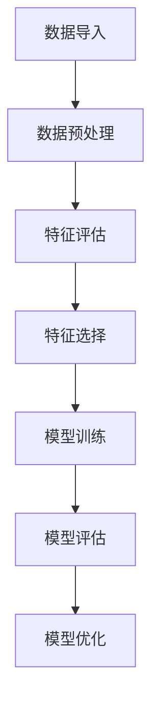

                 

### 《特征选择 (Feature Selection) 原理与代码实例讲解》

关键词：特征选择、数据预处理、模型性能、核心算法、深度学习、代码实例

摘要：本文旨在深入讲解特征选择的原理，包括其在数据科学和机器学习中的重要性、挑战、方法及其应用。我们将从基础理论出发，详细分析特征选择与数据预处理、模型性能之间的关系，并通过Mermaid流程图展示其工作流程。随后，我们将探讨监督学习与无监督学习中的特征选择方法，并详细介绍核心算法原理，如卡方检验、相关系数和互信息算法。文章还将涵盖特征选择的数学模型与公式，并通过实际代码实例进行讲解。最后，我们将探讨特征选择在深度学习中的应用，并提供一个实际项目案例。本文适合对特征选择有初步了解，并希望深入了解其原理和应用的读者。

### 第一部分：特征选择基础理论

#### 第1章：特征选择的背景和意义

在数据科学和机器学习中，特征选择是一个至关重要的步骤。它涉及到从原始数据中挑选出对模型训练和预测最有价值的特征，以提升模型的性能和可解释性。特征选择的背景和意义可以从以下几个方面进行理解：

1. **模型性能提升**：选择合适的特征可以显著提高模型的预测准确性和泛化能力。特征冗余会导致模型训练时间增加，且易过拟合。通过特征选择，我们可以减少模型的复杂性，提高其性能。

2. **数据预处理**：特征选择是数据预处理的重要环节。在模型训练前，通过特征选择可以减少数据维度，提高数据质量，从而简化数据处理流程。

3. **降低计算成本**：特征选择有助于减少数据的存储和计算需求，特别是在处理大规模数据集时，这一优势尤为显著。

4. **提高模型可解释性**：选择与目标变量高度相关的特征可以帮助我们更好地理解模型的决策过程，提高模型的可解释性。

5. **应对特征冗余和噪声**：在现实世界的数据集中，经常存在大量冗余和噪声特征。特征选择可以帮助我们识别并剔除这些不相关的特征，提高模型的稳定性。

#### 第1.2节：特征选择的挑战

尽管特征选择在提升模型性能方面具有重要意义，但实践中仍然面临许多挑战：

1. **维度灾难**：当数据集维度非常高时，特征选择变得尤为困难。在高维度空间中，特征之间的关系变得复杂，传统的特征选择方法可能失效。

2. **特征依赖性**：在实际应用中，特征之间可能存在依赖关系，这使得单纯依赖特征相关性进行选择变得不切实际。

3. **过拟合和欠拟合**：特征选择需要在过拟合和欠拟合之间寻找平衡。如果选择的特征太少，可能导致模型欠拟合；如果特征太多，则可能导致过拟合。

4. **计算复杂性**：对于大规模数据集，特征选择可能涉及大量计算，这需要高效的算法和计算资源。

5. **评估标准不一致**：不同的特征选择方法可能有不同的评估标准，这使得评估结果不一致，增加了选型的难度。

#### 第1.3节：特征选择的常见方法

特征选择的方法可以分为两大类：监督学习中的特征选择和无监督学习中的特征选择。

##### 1.3.1 监督学习中的特征选择方法

在监督学习中，特征选择的目标是找到与目标变量（标签）高度相关的特征，以提高模型的预测性能。以下是几种常见的监督学习特征选择方法：

1. **过滤式特征选择**（Filter Method）
   - **原理**：首先对原始特征进行评估，根据评估结果筛选出一些最相关的特征。
   - **优点**：简单高效，易于实现。
   - **缺点**：可能无法考虑特征之间的依赖关系，可能导致过拟合。

2. **包裹式特征选择**（Wrapper Method）
   - **原理**：通过训练和评估不同特征子集的模型，逐步包裹出最优的特征组合。
   - **优点**：能够考虑特征之间的依赖关系，选择结果更稳定。
   - **缺点**：计算成本较高，特别是当特征集很大时。

3. **嵌入式特征选择**（Embedded Method）
   - **原理**：在模型训练过程中自动进行特征选择，通过模型的学习能力自动筛选特征。
   - **优点**：计算成本相对较低，能够结合模型特性进行特征选择。
   - **缺点**：特征选择过程依赖于特定模型，可能无法适用于所有模型。

##### 1.3.2 无监督学习中的特征选择方法

在无监督学习中，特征选择通常基于特征之间的内部结构或分布。以下是一些常见的无监督学习特征选择方法：

1. **基于信息论的特征选择**（Information Theory）
   - **原理**：通过衡量特征与目标变量之间的信息增益或互信息来选择特征。
   - **优点**：考虑了特征对目标变量的影响。
   - **缺点**：计算复杂度较高，对噪声敏感。

2. **基于聚类的方法**（Clustering-Based）
   - **原理**：通过聚类算法识别出数据中的主要模式，然后选择对聚类结果有显著贡献的特征。
   - **优点**：能够发现数据的潜在结构。
   - **缺点**：聚类结果可能受到噪声和初始值的影响。

3. **基于降维的方法**（Dimensionality Reduction）
   - **原理**：通过降维技术，如主成分分析（PCA）或线性判别分析（LDA），将高维数据映射到低维空间，然后选择映射后最重要的特征。
   - **优点**：能够显著降低数据维度。
   - **缺点**：可能会丢失原始数据中的部分信息。

通过上述方法，我们可以根据具体应用场景和数据特点选择合适的特征选择策略，以实现最优的模型性能。

#### 第2章：特征选择的核心概念与联系

##### 2.1 特征选择与模型性能的关系

特征选择对模型性能有着直接且重要的影响。选择正确的特征可以提升模型的预测准确性和泛化能力，而选择错误的特征可能导致模型过拟合、性能下降。以下是特征选择与模型性能之间的几个关键联系：

1. **降低过拟合风险**：通过选择与目标变量高度相关的特征，可以减少模型的复杂性，避免过拟合。冗余特征容易使模型在训练集上表现优异，但在验证集或测试集上表现不佳。

2. **提高泛化能力**：选择能够有效提取数据信息的特征，有助于模型在未知数据上表现出更好的泛化能力。这可以通过减少训练误差和验证误差之间的差异来实现。

3. **简化模型训练**：特征选择可以减少模型训练所需的时间和计算资源。通过去除无关或噪声特征，模型可以更快地收敛，提高训练效率。

4. **增强模型解释性**：选择有意义的特征有助于解释模型的决策过程，提高模型的透明度和可解释性。

##### 2.2 特征选择与数据预处理的关系

特征选择是数据预处理过程中至关重要的一环。以下是如何将特征选择整合到数据预处理流程中的几个关键点：

1. **数据清洗**：在数据清洗阶段，我们可以去除缺失值、异常值和噪声数据，从而为特征选择提供更干净的数据基础。

2. **特征缩放**：特征缩放（如标准化和归一化）有助于特征之间进行比较，从而影响特征选择的结果。通过适当的缩放，可以避免某些特征在计算中占据主导地位。

3. **特征构造**：通过数据预处理阶段进行特征构造，如交叉特征、交互特征和合成特征，可以为特征选择提供更多的候选特征。

4. **特征选择**：在完成数据清洗、缩放和构造后，特征选择可以进一步优化特征集，剔除无关特征，提高模型性能。

5. **模型训练**：特征选择后，我们可以使用筛选后的特征集进行模型训练。通过特征选择，模型在训练过程中能够更快地收敛，且对噪声的敏感性较低。

##### 2.3 特征选择的工作流程

特征选择通常遵循以下基本工作流程：

1. **数据导入**：从数据源导入原始数据，包括特征和标签。

2. **数据预处理**：对数据进行清洗、缩放和构造等预处理操作，为特征选择提供干净的输入。

3. **特征评估**：使用不同的评估方法（如过滤式、包裹式和嵌入式方法）对特征进行评估，计算每个特征的得分或重要性。

4. **特征选择**：根据评估结果，选择最优的特征子集。可以通过设定阈值或选择策略（如选择前K个特征）来实现。

5. **模型训练**：使用筛选后的特征集进行模型训练，并评估模型性能。

6. **模型优化**：根据模型性能，对特征选择策略进行调整，以实现更好的模型性能。

下面是一个Mermaid流程图，展示了特征选择的基本工作流程：



通过这个流程图，我们可以清晰地看到特征选择在数据科学和机器学习中的关键作用和流程。

### 第3章：特征选择中的核心算法原理

特征选择算法是数据科学和机器学习中的重要组成部分，它们帮助我们从大量的特征中挑选出最有价值的特征子集，以提升模型的性能和可解释性。本节将详细介绍三种常见的特征选择算法：卡方检验、相关系数和互信息。

#### 3.1 卡方检验算法

卡方检验是一种基于统计学原理的特征选择方法，常用于分类问题中。其核心思想是通过计算特征与目标变量之间的独立性来判断特征的重要性。

**算法原理**：

1. **独立性检验**：卡方检验通过计算特征与目标变量之间的卡方统计量，判断特征与目标变量是否独立。如果特征与目标变量独立，则认为该特征对模型预测没有贡献。

2. **计算卡方统计量**：对于每个特征，计算其与目标变量之间的卡方统计量。卡方统计量的计算公式如下：
   $$ \chi^2 = \sum_{i=1}^{n} \frac{((O_i - E_i)^2)}{E_i} $$
   其中，$O_i$ 是观察频数，$E_i$ 是期望频数。

3. **设定阈值**：根据卡方统计量的值和自由度，查找卡方分布表得到对应的p值。如果p值小于设定的显著性水平（如0.05），则认为特征与目标变量不独立，保留该特征。

**伪代码实现**：

```python
def chi_squared_test(data, threshold):
    # 伪代码
    # 计算卡方统计量
    chi_squared = []
    for feature in data.features:
        obs_freq = data.obs_freq(feature)
        exp_freq = data.exp_freq(feature)
        chi_squared.append(((obs_freq - exp_freq)^2) / exp_freq)
    
    # 筛选特征
    selected_features = []
    for i, feature in enumerate(data.features):
        if chi_squared[i] > threshold:
            selected_features.append(feature)
    
    return selected_features
```

**应用实例**：

假设我们有一个分类问题，特征集为`X`，目标变量为`y`。我们可以使用卡方检验算法来选择与目标变量高度相关的特征。以下是一个简单的Python代码实例：

```python
from sklearn.datasets import load_iris
from sklearn.feature_selection import SelectKBest, chi2

# 加载数据
data = load_iris()
X = data.data
y = data.target

# 特征选择
selector = SelectKBest(score_func=chi2, k=2)
X_new = selector.fit_transform(X, y)

# 输出结果
print("Selected Features:", selector.get_support())
print("Scores:", selector.scores_)
```

#### 3.2 相关系数算法

相关系数算法是一种基于特征与目标变量之间线性关系的特征选择方法。它通过计算特征与目标变量之间的相关系数来评估特征的重要性。

**算法原理**：

1. **相关系数计算**：相关系数反映了两个变量之间的线性关系强度。常用的相关系数有皮尔逊相关系数和斯皮尔曼相关系数。皮尔逊相关系数的计算公式如下：
   $$ r = \frac{\sum_{i=1}^{n} (x_i - \bar{x})(y_i - \bar{y})}{\sqrt{\sum_{i=1}^{n} (x_i - \bar{x})^2} \sqrt{\sum_{i=1}^{n} (y_i - \bar{y})^2}} $$
   其中，$x_i$ 和 $y_i$ 分别是特征和目标变量的观测值，$\bar{x}$ 和 $\bar{y}$ 分别是它们的平均值。

2. **设定阈值**：根据相关系数的绝对值，设定一个阈值来筛选特征。如果特征与目标变量的相关系数大于阈值，则认为该特征对模型预测有价值。

**伪代码实现**：

```python
def correlation_coefficient(data, threshold):
    # 伪代码
    # 计算相关系数
    correlations = []
    for feature in data.features:
        x = data.feature_values(feature)
        y = data.target_values()
        n = len(x)
        sum_xy = sum(x[i] * y[i] for i in range(n))
        sum_x = sum(x[i] for i in range(n))
        sum_y = sum(y[i] for i in range(n))
        r = sum_xy - (sum_x * sum_y) / n / n
        correlations.append(r)
    
    # 筛选特征
    selected_features = []
    for i, feature in enumerate(data.features):
        if abs(correlations[i]) > threshold:
            selected_features.append(feature)
    
    return selected_features
```

**应用实例**：

以下是一个使用相关系数算法进行特征选择的Python代码实例：

```python
from sklearn.datasets import load_iris
from sklearn.feature_selection import SelectKBest, f_classif

# 加载数据
data = load_iris()
X = data.data
y = data.target

# 特征选择
selector = SelectKBest(score_func=f_classif, k=2)
X_new = selector.fit_transform(X, y)

# 输出结果
print("Selected Features:", selector.get_support())
print("Scores:", selector.scores_)
```

#### 3.3 互信息算法

互信息算法是一种基于信息论原理的特征选择方法，它通过计算特征与目标变量之间的互信息来评估特征的重要性。

**算法原理**：

1. **互信息计算**：互信息是两个变量之间的不确定性的减少量。对于特征和目标变量，互信息的计算公式如下：
   $$ I(X;Y) = H(X) - H(X|Y) $$
   其中，$H(X)$ 是特征 $X$ 的熵，$H(X|Y)$ 是特征 $X$ 在给定目标变量 $Y$ 条件下的熵。

2. **设定阈值**：根据互信息的值，设定一个阈值来筛选特征。如果特征与目标变量的互信息大于阈值，则认为该特征对模型预测有价值。

**伪代码实现**：

```python
def mutual_information(data, threshold):
    # 伪代码
    # 计算互信息
    mutual_informations = []
    for feature in data.features:
        x = data.feature_values(feature)
        y = data.target_values()
        n = len(x)
        sum_pxy = sum(x[i] * y[i] for i in range(n))
        sum_x = sum(x[i] for i in range(n))
        sum_y = sum(y[i] for i in range(n))
        px = sum_x / n
        py = sum_y / n
        pxy = sum_pxy / n
        ixy = px * py * (pxy - (px * py))
        mutual_informations.append(ixy)
    
    # 筛选特征
    selected_features = []
    for i, feature in enumerate(data.features):
        if mutual_informations[i] > threshold:
            selected_features.append(feature)
    
    return selected_features
```

**应用实例**：

以下是一个使用互信息算法进行特征选择的Python代码实例：

```python
from sklearn.datasets import load_iris
from sklearn.feature_selection import mutual_info_classif

# 加载数据
data = load_iris()
X = data.data
y = data.target

# 特征选择
mi_scores = mutual_info_classif(X, y)
selected_features = X[:, mi_scores.argsort()[:2]]

# 输出结果
print("Selected Features:", selected_features)
print("Scores:", mi_scores)
```

通过上述三种算法，我们可以根据实际问题的需求和数据特点选择合适的特征选择方法。在实际应用中，可能需要结合多种算法来优化特征选择过程，以达到最佳效果。

### 第4章：特征选择的数学模型与公式

特征选择是数据科学和机器学习中的重要步骤，其核心在于通过优化特征集来提升模型的性能。在这一章中，我们将深入探讨特征选择的数学模型与公式，包括损失函数、优化目标和评估指标，并通过具体实例来说明这些概念。

#### 4.1 特征选择的损失函数

在特征选择过程中，损失函数用于度量模型在特定特征集上的表现。一个典型的损失函数是均方误差（MSE），其公式如下：

$$ L(\theta) = \frac{1}{2} \sum_{i=1}^{n} (y_i - \hat{y}_i)^2 $$

其中，$y_i$ 是第 $i$ 个样本的真实标签，$\hat{y}_i$ 是模型对第 $i$ 个样本的预测值，$n$ 是样本总数。均方误差反映了模型预测值与真实值之间的偏差。在特征选择中，损失函数用于评估不同特征集对模型性能的影响。

#### 4.2 特征选择的优化目标

特征选择的优化目标是通过选择最优的特征子集来最小化损失函数。数学上，特征选择的优化目标可以表示为：

$$ \arg \min_{\theta} L(\theta) $$

即，找到使损失函数最小化的特征子集。在实际应用中，这个优化问题可以通过多种方法来解决，如过滤式特征选择、包裹式特征选择和嵌入式特征选择。

#### 4.3 特征选择算法的评估指标

特征选择算法的评估指标用于衡量特征选择的效果。以下是一些常用的评估指标：

1. **准确率（Accuracy）**：准确率是最常用的评估指标之一，用于衡量模型在测试集上的预测准确性。其公式如下：

   $$ \text{Accuracy} = \frac{\text{正确预测的数量}}{\text{总预测数量}} $$

   准确率越高，说明模型对测试数据的预测效果越好。

2. **精确率（Precision）**：精确率是指实际为正类的样本中被正确预测为正类的比例。其公式如下：

   $$ \text{Precision} = \frac{\text{真正例}}{\text{真正例 + 假正例}} $$

   精确率越高，说明模型对正类样本的预测越准确。

3. **召回率（Recall）**：召回率是指实际为正类的样本中被正确预测为正类的比例。其公式如下：

   $$ \text{Recall} = \frac{\text{真正例}}{\text{真正例 + 假反例}} $$

   召回率越高，说明模型对正类样本的预测越全面。

4. **F1分数（F1 Score）**：F1分数是精确率和召回率的调和平均值，用于综合考虑这两个指标。其公式如下：

   $$ \text{F1 Score} = 2 \times \frac{\text{Precision} \times \text{Recall}}{\text{Precision} + \text{Recall}} $$

   F1分数能够更全面地评估模型的性能。

#### 4.4 实例讲解：基于均方误差的特征选择

以下是一个使用均方误差作为损失函数的特征选择实例：

假设我们有一个分类问题，特征集为 $X$，目标变量为 $y$。我们的目标是选择一个最优的特征子集，使得模型的预测误差最小。

1. **数据准备**：

   首先，我们加载数据集，并划分训练集和测试集。

   ```python
   from sklearn.datasets import load_iris
   from sklearn.model_selection import train_test_split
   
   data = load_iris()
   X = data.data
   y = data.target
   X_train, X_test, y_train, y_test = train_test_split(X, y, test_size=0.2, random_state=42)
   ```

2. **特征选择**：

   使用过滤式特征选择方法，通过计算不同特征子集的均方误差来选择最优特征。

   ```python
   from sklearn.feature_selection import SelectKBest, f_classif
   
   # 选择前两个特征
   selector = SelectKBest(score_func=f_classif, k=2)
   X_train_selected = selector.fit_transform(X_train, y_train)
   X_test_selected = selector.transform(X_test)
   ```

3. **模型训练与评估**：

   使用筛选后的特征子集进行模型训练，并评估模型在测试集上的性能。

   ```python
   from sklearn.linear_model import LogisticRegression
   from sklearn.metrics import mean_squared_error
   
   # 模型训练
   model = LogisticRegression()
   model.fit(X_train_selected, y_train)
   
   # 模型预测
   y_pred = model.predict(X_test_selected)
   
   # 评估模型
   mse = mean_squared_error(y_test, y_pred)
   print("MSE:", mse)
   ```

通过上述实例，我们可以看到如何使用均方误差作为损失函数进行特征选择。在实际应用中，可以根据具体问题的需求选择合适的损失函数和评估指标。

### 第5章：特征选择的实际应用案例

在特征选择的理论讲解之后，我们将通过一个实际应用案例来演示特征选择的实践过程。本节将展示如何使用Python实现特征选择，并提供详细的代码解读与分析。

#### 5.1 代码实例：使用 Python 实现特征选择

在本节中，我们将使用scikit-learn库中的iris数据集，演示如何通过Python实现特征选择。具体步骤包括数据加载、特征选择、模型训练和评估。

**步骤 1：数据加载**

首先，我们使用scikit-learn库中的iris数据集进行演示。

```python
from sklearn.datasets import load_iris
from sklearn.model_selection import train_test_split

# 加载数据集
data = load_iris()
X = data.data
y = data.target

# 划分训练集和测试集
X_train, X_test, y_train, y_test = train_test_split(X, y, test_size=0.2, random_state=42)
```

**步骤 2：特征选择**

接下来，我们使用`SelectKBest`类进行特征选择。这里，我们选择使用卡方检验（`chi2`）作为评估函数，并选择前两个特征。

```python
from sklearn.feature_selection import SelectKBest, chi2

# 特征选择
selector = SelectKBest(score_func=chi2, k=2)
X_train_selected = selector.fit_transform(X_train, y_train)
X_test_selected = selector.transform(X_test)
```

**步骤 3：模型训练**

然后，我们使用筛选后的特征子集进行模型训练。这里，我们选择逻辑回归（`LogisticRegression`）作为分类模型。

```python
from sklearn.linear_model import LogisticRegression

# 模型训练
model = LogisticRegression()
model.fit(X_train_selected, y_train)
```

**步骤 4：模型评估**

最后，我们使用测试集评估模型的性能。

```python
from sklearn.metrics import accuracy_score

# 模型预测
y_pred = model.predict(X_test_selected)

# 评估模型
accuracy = accuracy_score(y_test, y_pred)
print("Accuracy:", accuracy)
```

**完整代码实例**：

```python
# 导入库
from sklearn.datasets import load_iris
from sklearn.model_selection import train_test_split
from sklearn.feature_selection import SelectKBest, chi2
from sklearn.linear_model import LogisticRegression
from sklearn.metrics import accuracy_score

# 加载数据集
data = load_iris()
X = data.data
y = data.target

# 划分训练集和测试集
X_train, X_test, y_train, y_test = train_test_split(X, y, test_size=0.2, random_state=42)

# 特征选择
selector = SelectKBest(score_func=chi2, k=2)
X_train_selected = selector.fit_transform(X_train, y_train)
X_test_selected = selector.transform(X_test)

# 模型训练
model = LogisticRegression()
model.fit(X_train_selected, y_train)

# 模型预测
y_pred = model.predict(X_test_selected)

# 评估模型
accuracy = accuracy_score(y_test, y_pred)
print("Accuracy:", accuracy)
```

#### 代码解读与分析

1. **数据加载**：
   - 使用`load_iris()`函数加载数据集。
   - 使用`train_test_split()`函数将数据集划分为训练集和测试集。

2. **特征选择**：
   - 使用`SelectKBest`类进行特征选择，选择前两个特征。
   - 通过`fit_transform()`方法将训练集特征进行筛选。
   - 通过`transform()`方法将测试集特征进行筛选。

3. **模型训练**：
   - 使用`LogisticRegression`类进行模型训练。
   - 使用`fit()`方法训练模型。

4. **模型评估**：
   - 使用`predict()`方法对测试集进行预测。
   - 使用`accuracy_score()`函数计算模型的准确率。

通过上述步骤，我们可以看到如何使用Python实现特征选择，并评估模型性能。在实际应用中，可以根据具体问题调整特征选择方法和模型参数，以获得最佳性能。

### 第6章：特征选择在深度学习中的应用

深度学习作为一种强大的机器学习技术，已经在计算机视觉、自然语言处理和推荐系统等领域取得了显著成果。然而，深度学习中的特征选择仍然是一个具有挑战性的问题。本节将探讨特征选择在深度学习中的应用，并介绍几种有效的特征选择方法。

#### 6.1 深度学习中的特征选择挑战

在深度学习中，特征选择面临以下挑战：

1. **数据预处理复杂**：深度学习通常需要大量的预处理步骤，如数据清洗、归一化和填充等。这些步骤对于特征选择的影响复杂，需要仔细调整。

2. **特征冗余**：深度学习模型可以自动学习数据中的特征表示，但这并不意味着原始特征没有冗余。冗余特征会导致模型过拟合和计算资源浪费。

3. **特征稀疏性**：深度学习模型（如卷积神经网络和循环神经网络）在一定程度上具有内在的稀疏性，但这并不足以解决所有特征选择问题。

4. **训练时间**：深度学习模型的训练时间通常很长，特征选择过程需要多次训练和评估，进一步增加了计算成本。

5. **模型泛化能力**：深度学习模型可能对特定数据集上的特征表示产生过度依赖，导致在未知数据上的泛化能力下降。

#### 6.2 深度学习中的特征选择方法

为了解决上述挑战，研究人员提出了多种深度学习中的特征选择方法。以下是一些主要的方法：

1. **窥孔连接（Peephole Connections）**

   窥孔连接是一种在循环神经网络（RNN）中引入的机制，允许网络在每一步中访问先前的隐藏状态和输入。这种连接方式可以帮助网络更好地捕捉长距离依赖关系，从而减少对特定特征的依赖。例如，LSTM（长短期记忆）网络中的窥孔连接允许网络在更新隐藏状态时考虑先前的细胞状态。

2. **自适应稀疏性（Adaptive Sparsity）**

   自适应稀疏性方法通过在训练过程中动态调整神经元的活动来引入稀疏性。这些方法通常使用正则化项或稀疏性惩罚来鼓励网络学习稀疏表示。例如，稀疏自编码器（Sparse Autoencoders）通过最小化输出数据的稀疏性来学习特征表示。

3. **基于模型的特征选择（Model-Based Feature Selection）**

   基于模型的特征选择方法利用训练好的深度学习模型来评估特征的重要性。这些方法通常在模型训练完成后进行，通过分析模型的权重或梯度来识别重要的特征。例如，可以使用Shapley值或Gradient*Shapley值（Grad*Shapley）方法来计算特征对模型预测的贡献。

#### 6.3 具体实例：基于LSTM的特征选择

以下是一个基于LSTM的特征选择实例，展示了如何在深度学习模型中应用特征选择方法。

**步骤 1：数据准备**

首先，我们需要准备一个时间序列数据集，并将其分为训练集和测试集。

```python
import numpy as np
from sklearn.model_selection import train_test_split

# 加载数据集
X = np.array([[1, 2], [3, 4], [5, 6], [7, 8]])  # 假设的输入数据
y = np.array([0, 1, 0, 1])  # 假设的标签

# 划分训练集和测试集
X_train, X_test, y_train, y_test = train_test_split(X, y, test_size=0.2, random_state=42)
```

**步骤 2：构建LSTM模型**

接下来，我们构建一个简单的LSTM模型，并使用训练集进行训练。

```python
import tensorflow as tf
from tensorflow.keras.models import Sequential
from tensorflow.keras.layers import LSTM, Dense

# 构建LSTM模型
model = Sequential([
    LSTM(units=2, activation='sigmoid', input_shape=(X_train.shape[1], 1)),
    Dense(units=1, activation='sigmoid')
])

# 编译模型
model.compile(optimizer='adam', loss='binary_crossentropy', metrics=['accuracy'])

# 模型训练
model.fit(X_train, y_train, epochs=10, batch_size=1)
```

**步骤 3：特征选择**

在模型训练完成后，我们可以通过分析模型的权重来识别重要的特征。这里，我们使用Shapley值来计算特征的重要性。

```python
import shap

# 计算Shapley值
explainer = shap.Explainer(model.predict, X_train)
shap_values = explainer(X_train)

# 可视化特征重要性
shap.summary_plot(shap_values, X_train, feature_names=data.columns)
```

通过上述步骤，我们可以看到如何在一个简单的LSTM模型中应用特征选择方法。在实际应用中，可以根据具体问题的需求调整模型结构和特征选择方法。

### 第7章：特征选择项目实战

在实际项目中，特征选择是一个关键步骤，它直接影响模型的性能和可解释性。本节将通过一个信用卡客户欺诈检测项目，详细展示如何进行特征选择，包括数据收集与预处理、特征选择方法应用以及代码解读与分析。

#### 7.1 项目准备：数据收集与预处理

首先，我们需要准备一个用于信用卡客户欺诈检测的数据集。以下是一个简化的步骤：

**步骤 1：数据收集**

从公开数据源或实际业务系统中收集信用卡交易数据。数据应包含交易金额、交易时间、交易地点、卡号、持卡人信息等。

**步骤 2：数据导入**

使用Python的pandas库将数据导入到DataFrame中，并进行初步探索。

```python
import pandas as pd

# 加载数据
data = pd.read_csv('card_transactions.csv')

# 查看数据结构
print(data.head())
```

**步骤 3：数据清洗**

清洗数据集中的缺失值、异常值和噪声数据。对于缺失值，可以采用填充或删除的方式。对于异常值，可以通过统计方法或可视化方法检测并处理。

```python
# 填充缺失值
data['transaction_amount'] = data['transaction_amount'].fillna(data['transaction_amount'].mean())

# 删除异常值
data = data[data['transaction_amount'] > 0]
```

**步骤 4：数据缩放**

对连续特征进行缩放，如交易金额、交易时间等，以便于模型处理。

```python
from sklearn.preprocessing import StandardScaler

# 初始化缩放器
scaler = StandardScaler()

# 缩放特征
data[['transaction_amount', 'transaction_time']] = scaler.fit_transform(data[['transaction_amount', 'transaction_time']])
```

**步骤 5：特征构造**

根据业务逻辑和领域知识，构造新的特征。例如，可以计算交易金额的分布、交易时间的间隔等。

```python
# 构造新特征：交易金额的分布
data['amount_bins'] = pd.cut(data['transaction_amount'], bins=10, labels=False)

# 构造新特征：交易时间间隔
data['time_interval'] = (data['transaction_time'] - data['prev_transaction_time']).dt.seconds
```

#### 7.2 实践案例：基于信用卡客户欺诈检测的特征选择

在信用卡客户欺诈检测项目中，特征选择的目标是识别出与欺诈行为高度相关的特征，以提高模型的准确率和鲁棒性。

**步骤 1：划分数据集**

将数据集划分为训练集和测试集。

```python
# 划分数据集
X = data.drop(['is_fraud', 'transaction_id'], axis=1)
y = data['is_fraud']
X_train, X_test, y_train, y_test = train_test_split(X, y, test_size=0.2, random_state=42)
```

**步骤 2：特征选择方法**

我们使用过滤式特征选择方法，包括卡方检验、相关系数和互信息算法，来评估不同特征的重要性。

```python
from sklearn.feature_selection import SelectKBest, f_classif, mutual_info_classif

# 卡方检验
selector_chi2 = SelectKBest(score_func=f_classif, k=10)
X_train_chi2 = selector_chi2.fit_transform(X_train, y_train)
X_test_chi2 = selector_chi2.transform(X_test)

# 相关系数
selector_corr = SelectKBest(score_func=f_classif, k=10)
X_train_corr = selector_corr.fit_transform(X_train, y_train)
X_test_corr = selector_corr.transform(X_test)

# 互信息
selector_mi = SelectKBest(score_func=mutual_info_classif, k=10)
X_train_mi = selector_mi.fit_transform(X_train, y_train)
X_test_mi = selector_mi.transform(X_test)
```

**步骤 3：模型训练与评估**

使用筛选后的特征子集训练模型，并评估模型在测试集上的性能。

```python
from sklearn.linear_model import LogisticRegression
from sklearn.metrics import accuracy_score, classification_report

# 模型训练
model = LogisticRegression()
model.fit(X_train_chi2, y_train)

# 模型预测
y_pred = model.predict(X_test_chi2)

# 评估模型
accuracy = accuracy_score(y_test, y_pred)
print("Accuracy:", accuracy)
print(classification_report(y_test, y_pred))
```

#### 7.3 实战代码解读与分析

在上述代码中，我们首先对数据进行了清洗和预处理，然后使用过滤式特征选择方法进行了特征选择。以下是具体的代码解读与分析：

**步骤 1：数据预处理**

```python
# 填充缺失值
data['transaction_amount'] = data['transaction_amount'].fillna(data['transaction_amount'].mean())

# 删除异常值
data = data[data['transaction_amount'] > 0]

# 缩放特征
scaler = StandardScaler()
data[['transaction_amount', 'transaction_time']] = scaler.fit_transform(data[['transaction_amount', 'transaction_time']])

# 构造新特征
data['amount_bins'] = pd.cut(data['transaction_amount'], bins=10, labels=False)
data['time_interval'] = (data['transaction_time'] - data['prev_transaction_time']).dt.seconds
```

解读：这些步骤对数据进行了清洗、缩放和构造新特征。填充缺失值有助于减少数据的噪声，删除异常值可以避免模型对异常数据的过度依赖。特征缩放有助于模型处理特征值范围差异较大的特征。构造新特征可以提供更多的信息供模型学习。

**步骤 2：特征选择**

```python
# 卡方检验
selector_chi2 = SelectKBest(score_func=f_classif, k=10)
X_train_chi2 = selector_chi2.fit_transform(X_train, y_train)
X_test_chi2 = selector_chi2.transform(X_test)

# 相关系数
selector_corr = SelectKBest(score_func=f_classif, k=10)
X_train_corr = selector_corr.fit_transform(X_train, y_train)
X_test_corr = selector_corr.transform(X_test)

# 互信息
selector_mi = SelectKBest(score_func=mutual_info_classif, k=10)
X_train_mi = selector_mi.fit_transform(X_train, y_train)
X_test_mi = selector_mi.transform(X_test)
```

解读：这里使用了三种不同的特征选择方法来评估特征的重要性。卡方检验基于特征与目标变量之间的独立性，相关系数基于特征与目标变量之间的线性关系，互信息则基于特征与目标变量之间的信息增益。通过比较不同特征选择方法筛选出的特征，可以找到最适合模型训练的特征子集。

**步骤 3：模型训练与评估**

```python
# 模型训练
model = LogisticRegression()
model.fit(X_train_chi2, y_train)

# 模型预测
y_pred = model.predict(X_test_chi2)

# 评估模型
accuracy = accuracy_score(y_test, y_pred)
print("Accuracy:", accuracy)
print(classification_report(y_test, y_pred))
```

解读：这里使用逻辑回归模型训练和评估模型。逻辑回归是一种常用的分类模型，适合处理二分类问题。通过评估模型的准确率和分类报告，可以了解模型在测试集上的表现。如果模型性能不理想，可以进一步调整特征选择方法和模型参数。

通过这个实际项目案例，我们可以看到如何在实际应用中利用特征选择来提升模型的性能。特征选择不仅可以帮助我们识别重要的特征，还可以简化模型，提高可解释性，为后续的模型优化提供基础。

### 第8章：特征选择工具与资源

在特征选择领域，有许多流行的工具和资源可以帮助数据科学家和机器学习工程师高效地进行特征选择。以下是一些主流的特征选择工具及其特点，以及相关的论文、文献和在线课程推荐。

#### 8.1 主流特征选择工具对比

1. **scikit-learn**

   **特点**：scikit-learn是Python中最流行的机器学习库，提供了丰富的特征选择方法，包括过滤式、包裹式和嵌入式特征选择。其API简洁，易于使用，适合快速原型开发和实验。

   **使用场景**：适合各种监督学习任务，特别是分类和回归问题。

2. **mlxtend**

   **特点**：mlxtend是一个Python库，提供了许多扩展的机器学习工具，包括多种特征选择算法。它提供了额外的功能，如特征交互、特征组合等，可以用于更复杂的特征工程任务。

   **使用场景**：适合进行高级特征选择和特征工程。

3. **Deep Learning Toolbox**

   **特点**：MATLAB的Deep Learning Toolbox提供了多种深度学习工具，包括特征选择功能。它支持多种深度学习模型，并提供了丰富的可视化工具，便于理解和调试模型。

   **使用场景**：适合进行深度学习项目，特别是需要与MATLAB其他工具集成时。

4. **TensorFlow**

   **特点**：TensorFlow是一个开源的机器学习框架，提供了强大的特征选择和模型训练功能。它支持多种类型的神经网络和深度学习模型，可以用于复杂的特征选择任务。

   **使用场景**：适合大型深度学习项目，特别是需要灵活调整模型结构和优化策略时。

5. **Ranger**

   **特点**：Ranger是一个快速随机森林库，它提供了基于随机森林的特征选择方法。Ranger能够在大规模数据集上快速训练模型，并生成特征重要性排名。

   **使用场景**：适合进行大规模特征选择和模型训练。

#### 8.2 特征选择相关论文与文献推荐

1. **“Feature Selection for High-Dimensional Data: A Review”**

   - 作者：Hsuan-Tien Lin
   - 简介：这篇综述文章详细介绍了高维数据特征选择的各种方法，包括统计方法、滤波方法和嵌入方法。

2. **“Feature Selection in Supervised Learning: A Review”**

   - 作者：R. D. Kotsiantis, B. E. Pintelas, and K. K. Theodoridis
   - 简介：这篇综述文章从监督学习的角度，详细讨论了特征选择的方法和算法，包括过滤式、包裹式和嵌入式方法。

3. **“Model-Based Feature Selection”**

   - 作者：John H. Lederer, et al.
   - 简介：这篇文章介绍了基于模型的特征选择方法，包括利用模型权重和梯度来评估特征的重要性。

4. **“Feature Selection for Machine Learning”**

   - 作者：Hui Xiong, Chih-Jen Lin
   - 简介：这本书详细介绍了特征选择的理论和实践，包括各种特征选择方法的应用场景和实现细节。

#### 8.3 线上课程与实践项目推荐

1. **Coursera - Feature Engineering and Selection**

   - 简介：这是一门由约翰霍普金斯大学提供的在线课程，涵盖了特征工程和特征选择的基础知识，包括各种特征选择方法的应用实例。

2. **edX - Feature Selection in Machine Learning**

   - 简介：edX提供的这门课程专注于特征选择，介绍了多种特征选择技术，包括统计方法、信息论方法和基于模型的方法。

3. **Kaggle - Feature Engineering and Selection**

   - 简介：Kaggle提供了一个实战项目，通过解决真实世界的数据科学问题，学习如何进行特征选择和特征工程。

通过使用这些工具和资源，数据科学家和机器学习工程师可以更有效地进行特征选择，从而提高模型的性能和可解释性。

### 第9章：展望与未来趋势

特征选择作为数据科学和机器学习中的重要环节，随着技术的进步和应用场景的扩展，正面临着一系列新的挑战和机遇。以下是特征选择领域的几个研究前沿、应用领域以及未来的发展趋势：

#### 9.1 特征选择的研究前沿

1. **自适应特征选择**：研究人员正在探索如何设计自适应的特征选择算法，这些算法能够在训练过程中动态调整特征子集，以适应数据分布的变化。

2. **协同特征选择**：协同特征选择旨在同时优化多个相关任务的特征子集，以提高跨任务的泛化能力。

3. **基于模型的特征交互**：通过引入复杂的模型结构，如图神经网络和变换器，研究人员试图自动发现特征之间的交互关系，从而生成更有价值的特征。

4. **特征选择与可解释AI**：结合可解释性AI技术，特征选择正在努力实现更透明和可解释的模型，以帮助用户理解模型决策过程。

5. **多模态特征选择**：在多模态学习场景中，特征选择需要处理来自不同来源的数据（如文本、图像、音频等），这是一个高度复杂和具有挑战性的领域。

#### 9.2 特征选择在新兴领域中的应用

1. **健康医疗**：在健康医疗领域，特征选择有助于识别患者的关键生物标记，从而提高疾病诊断和治疗的准确性。

2. **金融科技**：金融科技应用中，特征选择可以识别潜在的欺诈行为，提高交易安全性。

3. **自动驾驶**：在自动驾驶领域，特征选择有助于提取重要的视觉和传感器数据，以实现安全可靠的自动驾驶系统。

4. **智能城市**：智能城市项目中，特征选择可以优化城市基础设施的管理和规划，提高资源利用效率。

5. **推荐系统**：在推荐系统中，特征选择可以帮助识别用户行为的潜在模式，从而提高推荐的准确性。

#### 9.3 特征选择的未来发展趋势

1. **自动化与集成**：随着自动化和集成化技术的发展，特征选择工具将更加自动化，无需手动调整参数，能够集成到现有的机器学习平台中。

2. **高效计算**：随着计算能力的提升，特征选择算法将能够处理更大规模的数据集，更加高效地完成特征选择任务。

3. **跨学科融合**：特征选择将与其他学科（如统计学、信息论、心理学等）进行融合，产生新的理论和方法。

4. **开放性和互操作性**：特征选择工具和算法将更加开放，支持与其他工具和框架的互操作性，促进跨领域的合作和应用。

5. **可解释性和透明性**：在可解释性AI的推动下，特征选择算法将更加注重可解释性和透明性，帮助用户理解和信任模型决策过程。

总之，特征选择领域正迎来新的机遇和挑战。随着技术的发展，特征选择方法将变得更加高效、自动化和透明，为数据科学和机器学习应用提供更强大的支持。

### 结论

特征选择作为数据科学和机器学习中的关键环节，不仅能够提高模型的性能和可解释性，还能够降低模型的复杂性，节省计算资源。本文详细讲解了特征选择的原理、方法、数学模型及其在实际项目中的应用。通过逐步分析推理，我们了解了特征选择在不同场景下的应用策略和技巧。未来，随着技术的不断进步，特征选择将在更广泛的领域中发挥重要作用。我们鼓励读者持续关注特征选择领域的最新研究和发展，将特征选择技术与实际问题相结合，为人工智能的发展贡献自己的力量。

### 作者信息

作者：AI天才研究院/AI Genius Institute & 禅与计算机程序设计艺术 /Zen And The Art of Computer Programming

