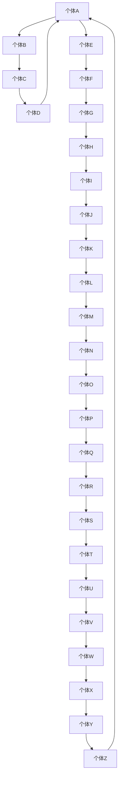

                 

# 理解世界的复杂性：从结构到洞见

## 关键词
- 复杂性科学
- 系统理论
- 数学模型
- 分形几何
- 遗传算法
- 人工智能

## 摘要
本文旨在深入探讨复杂性科学的基本概念、数学基础及其在各领域的广泛应用。我们将首先介绍复杂性科学的基本概念和特点，然后分析复杂系统的基本特征和建模方法。随后，我们将探讨复杂性理论的数学基础，包括非线性动力学、概率论与随机过程，以及复杂性理论中的数学工具。本文还将详细介绍复杂性理论在自然科学、社会科学和信息技术中的应用，并探讨其在决策与政策制定中的作用。通过一系列的实际案例，我们将展示复杂性理论的实践价值，并对复杂性理论的未来发展趋势进行展望。最后，本文将对复杂性理论进行总结，并展望其在当代社会中的重要作用。

## 第一部分：引论

### 第1章：复杂性理论的简介

#### 1.1 复杂性科学的基本概念

复杂性科学是一个跨学科的研究领域，它试图理解自然界、社会和技术系统中普遍存在的复杂现象。复杂性科学的基本概念包括复杂系统、混沌理论、分形几何、自组织现象和适应性系统等。

复杂系统是指由大量相互作用的个体组成的系统，这些个体在相互作用中形成复杂的结构、行为和模式。复杂性科学的核心问题是：如何从简单的局部规则推导出复杂的整体行为？

混沌理论是复杂性科学的一个重要分支，它研究系统的初始条件对长期行为的影响。混沌系统具有高度敏感性和不可预测性，即“蝴蝶效应”。

分形几何是描述自然界中自相似结构的数学工具，它揭示了复杂系统中的自相似性和无序性。

自组织现象是指系统在没有外部指导的情况下，通过个体之间的相互作用自发形成有序结构。

适应性系统是指能够适应环境变化的系统，它们通过学习、演化或适应性调整来提高自身性能。

#### 1.2 复杂性科学的历史与发展

复杂性科学起源于20世纪中期，当时科学家们开始认识到许多自然和社会现象无法通过传统方法进行解释。早期的复杂性研究主要集中在物理学领域，特别是混沌理论和非线性动力学。

20世纪70年代，生态学家和生物学家开始将复杂性科学的方法应用于生态系统的分析，从而推动了复杂系统理论的发展。

20世纪80年代，计算机科学的进步为复杂性研究提供了强大的计算工具，使得大规模复杂系统的模拟和分析成为可能。

21世纪初，复杂性科学逐渐扩展到社会科学领域，包括经济学、社会学、心理学和政治学等。复杂性理论开始应用于社会系统和人类行为的研究。

#### 1.3 理解复杂性的重要性

复杂性科学对理解世界具有重要意义。首先，复杂性科学揭示了自然和社会现象中的自相似性和规律性，帮助我们更好地理解世界的本质。

其次，复杂性科学为解决现实世界中的复杂问题提供了新的方法和工具。例如，在生态系统中，复杂性科学帮助我们理解生态平衡和生物多样性保护；在交通网络中，复杂性科学帮助我们优化交通流量和减少拥堵。

最后，复杂性科学对于预测未来和制定决策具有重要意义。通过研究复杂系统的行为模式，我们可以预测未来的发展趋势，并为政策制定提供科学依据。

#### 1.4 本书的结构与内容概述

本书将分为四个主要部分，分别探讨复杂性理论的基础、应用、案例研究和未来发展趋势。

第一部分：引论，介绍复杂性科学的基本概念、历史和发展，以及理解复杂性的重要性。

第二部分：复杂性理论的数学基础，包括非线性动力学、概率论与随机过程，以及复杂性理论中的数学工具。

第三部分：复杂性理论的应用，分别介绍复杂性理论在自然科学、社会科学和信息技术中的应用。

第四部分：案例分析，通过具体案例展示复杂性理论的实践价值。

最后，本书将对复杂性理论进行总结，并展望其在当代社会中的重要作用。

### 第2章：复杂系统的基本特征

#### 2.1 复杂系统的定义与特性

复杂系统是指由大量相互作用的个体组成的系统，这些个体在相互作用中形成复杂的结构、行为和模式。复杂系统具有以下特性：

1. **多层次性**：复杂系统通常由多个层次组成，每个层次都有自己的结构和功能。

2. **非线性相互作用**：复杂系统中的个体之间存在复杂的非线性相互作用，这些相互作用决定了系统的整体行为。

3. **自适应性和进化性**：复杂系统中的个体能够适应环境变化，并通过进化过程提高自身性能。

4. **动态性**：复杂系统处于不断变化的状态，其行为和结构随时间而变化。

5. **不确定性**：复杂系统中的行为和结果往往具有不确定性，难以准确预测。

6. **涌现现象**：复杂系统中的个体相互作用会导致新的现象和结构，这些现象和结构无法从个体行为中直接推导。

#### 2.2 复杂性科学与传统科学的关系

复杂性科学与传统科学之间存在紧密的关系。传统科学通常采用线性思维和确定性方法来研究简单系统，而复杂性科学则采用非线性思维和概率性方法来研究复杂系统。

复杂性科学从传统科学中吸取了许多有益的概念和方法，如物理学中的混沌理论、生物学中的遗传算法和计算机科学中的神经网络等。同时，复杂性科学也为传统科学提供了新的视角和方法，促进了传统科学的发展。

例如，在生态学中，复杂性科学帮助我们理解生态系统的复杂结构和动态行为，从而提高了生态保护和资源管理的效率。

在经济学中，复杂性科学帮助我们发现市场中的非线性规律和不确定性，从而提高了经济预测和政策制定的准确性。

在计算机科学中，复杂性科学为我们提供了新的算法和模型，如遗传算法和人工神经网络，从而提高了计算机系统的性能和效率。

#### 2.3 复杂性科学的研究方法

复杂性科学采用多种研究方法来分析和理解复杂系统，包括实验研究、数值模拟、统计分析、计算机模拟和模型构建等。

1. **实验研究**：通过实际观察和实验来研究复杂系统的行为和特性。

2. **数值模拟**：利用计算机模拟来模拟复杂系统的行为和演化过程。

3. **统计分析**：通过统计分析方法来分析复杂系统的统计特性，如概率分布、相关性等。

4. **计算机模拟**：通过计算机程序来模拟复杂系统的行为和演化过程，从而验证理论模型。

5. **模型构建**：通过构建数学模型来描述复杂系统的结构和行为，从而进行理论分析和预测。

这些研究方法相互补充，帮助我们从不同角度和层次来理解复杂系统的行为和特性。

#### 2.4 复杂系统的建模与仿真

复杂系统的建模与仿真是指通过建立数学模型和计算机仿真来研究复杂系统的行为和特性。建模与仿真的目的是为了理解和预测复杂系统的行为，从而为决策提供科学依据。

1. **数学模型**：复杂系统的建模通常采用数学模型，如微分方程、差分方程、代数方程等。这些模型能够描述系统中的变量关系和演化规律。

2. **计算机仿真**：通过计算机程序来实现数学模型的计算和模拟，从而生成系统的行为和结果。计算机仿真可以模拟系统在不同条件下的行为，帮助我们理解系统的动态变化和演化过程。

3. **仿真分析**：通过对仿真结果进行分析，我们可以获得关于复杂系统的深入了解，如系统的稳定性、行为模式、关键影响因素等。

4. **模型验证与优化**：通过实际观察和实验结果来验证模型的准确性和可靠性，并根据实际情况对模型进行优化和改进。

总之，复杂系统的建模与仿真是一种强大的研究方法，可以帮助我们深入理解复杂系统的行为和特性，从而为决策和优化提供科学依据。

### 第二部分：复杂性理论的数学基础

#### 第3章：非线性动力学基础

非线性动力学是复杂性科学的重要组成部分，它研究非线性系统的运动规律和动态行为。非线性动力学的基本概念包括相空间、相图、李雅普诺夫稳定性和离散时间系统分析。

#### 3.1 非线性系统的基本概念

非线性系统是指系统中的变量之间存在非线性关系的系统。非线性系统的特点是动态行为复杂，往往呈现出非周期性、混沌性、自相似性等特性。

非线性系统的方程通常无法通过线性变换简化，因此需要采用特殊的方法来分析和解决。常见的非线性系统方程包括非线性常微分方程、非线性差分方程和非线性代数方程。

非线性系统具有以下基本特性：

1. **非线性反馈**：非线性系统中，变量的非线性关系会导致系统内部的正反馈和负反馈，从而影响系统的稳定性。

2. **多稳定性**：非线性系统可能同时处于多个稳定状态，这意味着系统可能在不同的条件下表现出不同的行为。

3. **混沌现象**：非线性系统可能表现出混沌现象，即系统在初始条件微小变化下，其长期行为呈现出高度不确定性和不可预测性。

4. **分岔和突变**：非线性系统在参数变化过程中可能发生分岔和突变，导致系统状态发生突然变化。

#### 3.2 相空间与相图

相空间是指用于描述系统状态变量随时间变化的几何空间。在相空间中，每个点表示系统的一个状态，而系统的运动轨迹则表示系统状态的演化过程。

相图是相空间中系统运动轨迹的图形表示。通过相图，我们可以直观地观察系统的动态行为，如周期运动、混沌运动和稳定状态。

相图的基本类型包括：

1. **周期轨道**：系统状态沿封闭曲线运动，形成一个周期轨道。

2. **混沌轨道**：系统状态在相空间中无规律地运动，形成混沌轨道。

3. **极限环**：系统状态围绕一个固定点运动，形成一个极限环。

4. **鞍点**：系统状态在一个鞍点附近不稳定，容易离开该点。

#### 3.3 李雅普诺夫稳定性理论

李雅普诺夫稳定性理论是分析非线性系统稳定性的重要工具。该理论通过研究系统状态偏离平衡状态后的运动趋势，来判断系统的稳定性。

李雅普诺夫稳定性理论的基本思想是：通过构造一个李雅普诺夫函数，分析该函数的导数在系统状态附近的行为，来判断系统的稳定性。

李雅普诺夫稳定性理论主要包括以下步骤：

1. **定义李雅普诺夫函数**：选择一个合适的李雅普诺夫函数，通常是一个二次型函数。

2. **计算李雅普诺夫函数的导数**：计算李雅普诺夫函数在系统状态附近的变化率。

3. **判断导数的符号**：根据导数的符号来判断系统的稳定性。如果导数始终为负，系统是稳定的；如果导数始终为正，系统是不稳定的；如果导数在某个区域内为负，在另一个区域内为正，系统可能处于过渡状态。

李雅普诺夫稳定性理论在工程、物理、生物和经济学等领域有广泛的应用。例如，在控制理论中，李雅普诺夫稳定性理论用于分析和设计控制系统；在物理学中，李雅普诺夫稳定性理论用于研究热力学系统的稳定性。

#### 3.4 离散时间系统分析

离散时间系统是指系统状态在离散时间点发生变化，而不是连续变化的系统。离散时间系统的运动规律可以用差分方程来描述。

差分方程是描述离散时间系统状态变化的数学方程。常见的差分方程包括线性差分方程、非线性差分方程和时间延迟差分方程。

离散时间系统分析主要包括以下内容：

1. **差分方程的解法**：包括特征方程法、迭代法、数值积分法等。

2. **稳定性分析**：通过分析差分方程的系数和特征值来判断系统的稳定性。

3. **稳态分析**：分析系统在长期运行后的状态和行为。

4. **最优控制**：研究如何通过控制输入来优化系统性能。

离散时间系统分析在信号处理、通信系统、金融工程等领域有广泛应用。例如，在信号处理中，离散时间系统用于分析和设计滤波器；在通信系统中，离散时间系统用于调制和解调信号的传输。

总之，非线性动力学基础是复杂性科学的重要组成部分，它为我们提供了分析和理解复杂系统动态行为的数学工具。通过相空间与相图、李雅普诺夫稳定性理论和离散时间系统分析，我们可以深入探讨非线性系统的运动规律和动态行为，从而为复杂系统的建模、仿真和优化提供理论支持。

#### 第4章：概率论与随机过程

概率论和随机过程是复杂性科学的重要数学基础，它们提供了描述和分析复杂系统中不确定性和随机性的工具。在本章中，我们将探讨概率论的基本概念、随机变量的分布、随机过程以及马尔可夫链与熵。

#### 4.1 概率论的基本概念

概率论是研究随机事件和随机现象的数学分支。概率论的基本概念包括：

1. **随机试验**：指在相同条件下进行多次试验，每次试验结果不确定的试验。

2. **样本空间**：指随机试验所有可能结果的集合。

3. **随机事件**：指样本空间的一个子集，表示随机试验的一个结果。

4. **概率**：指随机事件发生的可能性，通常用概率值表示，范围在0到1之间。

5. **条件概率**：在已知某个事件发生的条件下，另一个事件发生的概率。

6. **独立事件**：两个事件的发生互不影响，即一个事件的发生概率不受另一个事件的影响。

7. **全概率公式**：通过计算各个条件下的概率，求出总概率的一种方法。

8. **贝叶斯定理**：通过已知结果和先验概率，计算后验概率的一种方法。

#### 4.2 随机变量的分布

随机变量是概率论中的一个重要概念，它将随机事件的结果量化为一个数值。随机变量的分布描述了随机变量取不同值的概率。

1. **离散型随机变量**：可以取有限或可数无限个值的随机变量，如掷骰子的点数。

2. **连续型随机变量**：可以取无限多个值的随机变量，如测量温度的结果。

3. **概率分布函数（PDF）**：描述离散型随机变量取值的概率密度函数，如二项分布、泊松分布等。

4. **概率密度函数（PDF）**：描述连续型随机变量取值的概率密度，如正态分布、指数分布等。

5. **期望值**：随机变量的平均值，表示随机变量取值的集中趋势。

6. **方差**：随机变量取值分散程度的度量，表示随机变量的不确定性。

7. **标准差**：方差的平方根，表示随机变量的取值波动范围。

#### 4.3 随机过程

随机过程是一系列随机变量的集合，这些随机变量按照时间或空间顺序排列。随机过程可以用来描述复杂系统的随机性和动态行为。

1. **定义**：随机过程是一个集合，其中每个元素是一个随机变量，表示系统在某一时刻的状态。

2. **路径**：随机过程的路径是指随时间或空间变化的一系列随机变量值。

3. **平稳性**：随机过程在不同时间段内具有相同的统计特性，如均值、方差和自相关函数。

4. **独立增量**：随机过程的增量在时间上是独立的，即不同时间点的增量互不影响。

5. **马尔可夫性**：随机过程的状态只取决于当前状态，与过去状态无关。

6. **常见随机过程**：包括白噪声过程、Wiener过程、泊松过程等。

#### 4.4 马尔可夫链与熵

马尔可夫链是一种特殊的随机过程，它描述系统状态随时间演化的过程。马尔可夫链具有以下几个特点：

1. **无后效性**：系统的未来状态只取决于当前状态，与过去状态无关。

2. **状态转移概率**：系统从当前状态转移到下一个状态的概率。

3. **稳态分布**：经过足够长时间后，系统状态会达到一个稳定的分布。

马尔可夫链在许多领域有广泛应用，如物理学中的相变、经济学中的随机市场模型、计算机科学中的算法分析等。

熵是描述系统不确定性的度量，它在信息论和统计力学中有重要应用。

1. **信息熵**：描述随机变量不确定性的度量，通常用比特（bit）表示。

2. **熵的增加**：在随机过程中，系统的熵随时间增加，表示系统不确定性增加。

3. **最大熵原理**：在给定约束条件下，系统的熵达到最大值时，系统处于最不确定状态。

4. **熵的产生**：在热力学过程中，系统的熵可以因能量转移而产生。

总之，概率论与随机过程是复杂性科学的重要数学基础，它们为我们提供了分析和描述复杂系统不确定性和随机性的工具。通过概率论的基本概念、随机变量的分布、随机过程以及马尔可夫链与熵，我们可以更好地理解复杂系统的行为和特性，从而为复杂系统的建模、仿真和优化提供理论支持。

#### 第5章：复杂性理论中的数学工具

复杂性理论中，数学工具起到了至关重要的作用，帮助我们解析和模拟复杂系统的行为。在本章中，我们将探讨复杂数学模型、分形几何、遗传算法和人工神经网络等关键数学工具。

##### 5.1 复杂数学模型的例子

复杂数学模型是描述复杂系统行为和特性的数学表达式。这些模型在物理学、经济学、生物学等领域有广泛应用。以下是一些常见的复杂数学模型：

1. **混沌模型**：描述非线性系统在初始条件微小变化下，长时间行为呈现高度不确定性的现象。常见的混沌模型有洛伦兹系统、Logistic映射等。

2. **网络模型**：描述由大量节点和边组成的网络结构，如小世界网络、无标度网络等。这些模型在社交网络、交通网络、通信网络等领域有广泛应用。

3. **自适应模型**：描述个体或系统在环境变化过程中，通过学习或进化来适应环境的过程。常见的自适应模型有遗传算法、神经网络等。

4. **分形模型**：描述自然界中的自相似结构，如海岸线、树冠等。常见的分形模型有科赫曲线、布朗运动等。

复杂数学模型为我们提供了分析和理解复杂系统行为的理论框架，通过这些模型，我们可以预测和解释复杂系统的行为和特性。

##### 5.2 分形几何

分形几何是描述自然界中自相似结构的数学工具。分形几何的基本概念包括：

1. **分形**：一个形状，它的每一部分在某种尺度上与整体形状相似。分形具有无限层次的结构，每个层次都包含前一个层次的细节。

2. **分形维数**：描述分形复杂程度的维度，如 Hausdorff 维数、信息维数等。分形维数介于经典几何维数（整数）和分数维数之间，反映了分形的自相似性和无限细节。

3. **生成规则**：描述分形生成的数学规则，如科赫曲线的递归规则、布朗运动的随机游走规则等。

分形几何在复杂性科学中有广泛应用，如描述生态系统的复杂性、金融市场的波动等。

##### 5.3 遗传算法

遗传算法是一种基于自然选择和遗传学原理的优化算法，广泛应用于求解复杂优化问题。遗传算法的基本概念包括：

1. **种群**：遗传算法的基本单位，由多个个体组成。每个个体代表一个潜在的解。

2. **适应度函数**：评估个体优劣的函数，通常基于问题的目标函数。

3. **选择**：根据适应度函数，从种群中选择优秀的个体进行繁殖。

4. **交叉**：随机选取两个个体的部分基因进行交换，生成新的个体。

5. **变异**：对个体的基因进行随机改变，增加种群的多样性。

遗传算法通过迭代过程，逐步优化个体的适应度，最终找到最优解或近似最优解。遗传算法在组合优化、参数优化、机器学习等领域有广泛应用。

##### 5.4 人工神经网络

人工神经网络是一种模仿生物神经系统的计算模型，用于模拟和预测复杂系统的行为。人工神经网络的基本概念包括：

1. **神经元**：人工神经网络的基本单元，用于接收和处理信息。

2. **层次结构**：人工神经网络由多个层次组成，包括输入层、隐藏层和输出层。

3. **激活函数**：神经元激活的规则，用于确定神经元是否触发。

4. **权重和偏置**：用于调整神经元之间的连接强度，影响网络的输出。

5. **学习算法**：用于训练网络，使网络能够正确预测和分类输入数据。常见的学习算法有反向传播算法、梯度下降算法等。

人工神经网络在图像识别、语音识别、自然语言处理等领域有广泛应用，为复杂性科学提供了强大的计算工具。

总之，复杂性理论中的数学工具为我们理解和模拟复杂系统提供了强大的手段。通过复杂数学模型、分形几何、遗传算法和人工神经网络，我们可以深入探索复杂系统的行为和特性，为科学研究和实际应用提供理论基础和计算支持。

### 第三部分：复杂性理论的应用

#### 第6章：复杂性理论在自然科学中的应用

复杂性理论在自然科学中的应用广泛而深入，通过揭示自然系统中的复杂现象和规律，为科学研究提供了新的视角和方法。本章将探讨复杂性理论在天文学、生物学、化学和地球科学中的应用。

##### 6.1 天文学与复杂性

天文学是研究宇宙和天体的科学，复杂性理论在天文学中的应用主要体现在对宇宙演化、星系形成和恒星运动的描述上。

1. **宇宙演化**：复杂性理论提供了描述宇宙从大爆炸到当前状态演化的数学模型。例如，宇宙混沌理论描述了宇宙早期混沌状态下的行为，以及从混沌到有序结构的演化。

2. **星系形成**：复杂性理论帮助科学家理解星系的形成过程。星系形成模型考虑了引力相互作用和非线性动力学效应，从而解释了星系结构复杂性和多样性。

3. **恒星运动**：复杂性理论提供了描述恒星运动和轨道演化的数学模型。例如，恒星混沌运动模型揭示了恒星系统在长时间尺度上可能出现的不稳定性和轨道变化。

##### 6.2 生物学与复杂性

生物学是研究生命现象的科学，复杂性理论在生物学中的应用极大地推动了我们对生物系统复杂性的理解。

1. **生态系统**：复杂性理论帮助科学家理解生态系统中生物种群动态和生物多样性的维持。生态网络模型描述了不同生物种群之间的相互作用和能量流动，揭示了生态系统中的复杂结构和动态行为。

2. **细胞动力学**：复杂性理论在细胞动力学中应用广泛，用于描述细胞内部生化反应的复杂性和动态性。例如，细胞周期模型和信号转导模型揭示了细胞周期进程和信号传递途径中的复杂性和非线性关系。

3. **进化论**：复杂性理论为进化论提供了新的解释框架。例如，多尺度进化模型描述了不同时间尺度上生物进化过程的复杂性和多样性。

##### 6.3 化学与复杂性

化学是研究物质的组成、性质和变化规律的科学，复杂性理论在化学中的应用有助于理解化学反应的复杂性和动态性。

1. **化学反应动力学**：复杂性理论提供了描述化学反应速率和反应路径的数学模型。例如，化学反应网络模型描述了化学反应中的复杂反应路径和动力学行为。

2. **分子模拟**：复杂性理论在分子模拟中应用，用于模拟分子间相互作用和分子动态行为。例如，分子动力学模拟揭示了分子在微观尺度上的复杂运动和相互作用。

3. **量子化学**：复杂性理论在量子化学中应用，用于解决量子多体问题。例如，量子混沌理论描述了量子系统中复杂的能量级结构和动力学行为。

##### 6.4 地球科学中的复杂性

地球科学是研究地球系统的结构和功能的科学，复杂性理论在地球科学中的应用帮助科学家理解地球系统的复杂性和动态性。

1. **气候系统**：复杂性理论在气候系统中应用，用于描述气候变化和气候变率的复杂行为。例如，气候混沌理论揭示了气候系统中的非线性动力学和混沌现象。

2. **地球物理**：复杂性理论在地球物理中应用，用于描述地震、火山等地球物理现象的复杂性和动态性。例如，地震动力学模型描述了地震发生的复杂过程和地震波传播的动力学行为。

3. **生态系统管理**：复杂性理论在生态系统管理中应用，用于描述生态系统的复杂结构和动态行为，从而制定有效的生态保护和资源管理策略。

总之，复杂性理论在自然科学中的应用广泛而深入，通过揭示自然系统中的复杂现象和规律，为科学研究提供了新的视角和方法。在天文学、生物学、化学和地球科学等领域，复杂性理论帮助我们更好地理解自然系统的复杂性和动态性，从而推动科学进步和实际应用。

#### 第7章：复杂性理论在社会科学中的应用

复杂性理论在社会科学中的应用日益显著，为理解社会系统的复杂行为和动态提供了新的视角和方法。本章将探讨复杂性理论在经济学、社会学、心理学和政治学中的应用。

##### 7.1 经济学中的复杂性

经济学是研究资源分配、生产、分配和消费的科学。复杂性理论为经济学提供了一种新的分析框架，帮助我们理解经济系统中的复杂现象和动态行为。

1. **市场动态**：复杂性理论揭示了市场中的非线性规律和混沌现象。例如，市场波动模型描述了市场在初始条件微小变化下的长期行为，揭示了市场的非预测性和不可控性。

2. **金融经济学**：复杂性理论在金融经济学中的应用广泛，如金融市场分析、投资组合优化等。例如，分形市场模型描述了金融市场的自相似性和分形结构，有助于理解市场波动的复杂性和非线性关系。

3. **经济系统演化**：复杂性理论帮助科学家理解经济系统在长时间尺度上的演化过程。例如，适应性经济模型描述了经济个体在市场竞争中的自适应行为和演化过程，揭示了经济系统中的复杂性和动态性。

##### 7.2 社会学中的复杂性

社会学是研究社会行为、社会结构和社会关系的科学。复杂性理论为社会学研究提供了新的方法和工具，有助于揭示社会系统的复杂性和动态行为。

1. **社会网络分析**：社会网络分析是复杂性理论在社会学中的重要应用，用于研究社会成员之间的相互作用和关系。例如，社会网络模型描述了社会网络的结构和动态行为，揭示了社会网络中的复杂性和涌现现象。

2. **集体行为**：复杂性理论帮助科学家理解集体行为中的复杂性和非线性规律。例如，集体行动模型描述了个体在社会压力和外部影响下的行为决策，揭示了集体行为中的复杂性和多样性。

3. **社会结构演化**：复杂性理论为研究社会结构演化提供了新的分析框架。例如，社会演化模型描述了社会结构在长时间尺度上的演化过程，揭示了社会系统中的复杂性和动态性。

##### 7.3 心理学与复杂性

心理学是研究人类行为和心理过程的科学。复杂性理论在心理学中的应用有助于揭示心理现象中的复杂性和动态行为。

1. **认知过程**：复杂性理论为理解认知过程中的复杂性和非线性规律提供了新的视角。例如，认知动力学模型描述了认知过程中的动态行为和相互作用，揭示了认知系统中的复杂性和动态性。

2. **情绪与行为**：复杂性理论帮助科学家理解情绪和行为之间的复杂关系。例如，情绪动力学模型描述了情绪的产生、传播和调节过程，揭示了情绪系统中的复杂性和非线性规律。

3. **心理治疗**：复杂性理论在心理治疗中应用，如认知行为治疗、系统家庭治疗等。例如，复杂性心理学模型描述了心理问题的形成和演变过程，为心理治疗提供了新的方法和策略。

##### 7.4 政治学中的复杂性

政治学是研究政治现象和政治行为的科学。复杂性理论在政治学中的应用有助于理解政治系统中的复杂性和动态行为。

1. **政治演化**：复杂性理论帮助科学家理解政治系统的演化过程。例如，政治演化模型描述了政治体制在长时间尺度上的变化和演化，揭示了政治系统中的复杂性和动态性。

2. **政策制定**：复杂性理论为政策制定提供了新的分析工具，有助于应对政治系统中的复杂性和不确定性。例如，政策模拟模型描述了政策在不同情景下的效果和影响，揭示了政策系统中的复杂性和动态性。

3. **社会运动**：复杂性理论帮助科学家理解社会运动中的复杂性和非线性规律。例如，社会运动模型描述了社会运动的生成、发展和消亡过程，揭示了社会运动系统中的复杂性和动态性。

总之，复杂性理论在社会科学中的应用广泛而深入，通过揭示社会系统的复杂性和动态行为，为经济学、社会学、心理学和政治学的研究提供了新的方法和视角。复杂性理论的应用不仅有助于我们更好地理解社会现象，还为制定有效的政策和社会管理策略提供了科学依据。

#### 第8章：复杂性理论在信息技术中的应用

复杂性理论在信息技术中的应用正日益显现，为解决信息系统中的复杂性问题提供了新的视角和方法。本章将探讨复杂性理论在信息技术中的主要应用领域，包括网络科学、大数据处理和人工智能。

##### 8.1 信息技术中的复杂性

随着信息技术的迅猛发展，信息系统变得越来越复杂。复杂性理论提供了分析和理解这些复杂系统的有力工具，主要包括：

1. **系统的异质性**：信息系统中包含各种不同类型的设备和用户，这些异质性的实体形成了复杂的网络结构。

2. **动态性**：信息系统中的数据和流量不断变化，系统的行为和状态也随之动态变化。

3. **不确定性**：由于外部干扰和内部故障，信息系统的行为具有不确定性，这使得系统的预测和管理变得复杂。

4. **高维度性**：信息技术系统处理的数据量大，维度高，这增加了系统分析和理解难度。

##### 8.2 网络科学

网络科学是研究复杂网络的科学，复杂性理论在网络科学中应用广泛，帮助科学家理解网络结构、功能和动态行为。

1. **网络结构**：网络科学通过复杂性理论分析网络结构，如度分布、聚类系数、路径长度等。这些分析揭示了网络中的复杂性和无标度特性。

2. **网络功能**：复杂性理论帮助科学家理解网络功能，如信息传递、资源分配和鲁棒性。例如，小世界网络和反嵌套网络模型描述了网络中的高效信息传递和鲁棒性。

3. **网络演化**：复杂性理论在研究网络演化方面有重要应用，如自组织网络和适应性网络模型。这些模型描述了网络在长时间尺度上的动态变化和进化过程。

4. **网络控制**：通过复杂性理论，科学家可以设计有效的网络控制策略，如路由优化、流量管理和容错设计，以提高网络性能和鲁棒性。

##### 8.3 大数据处理

大数据处理是信息技术中的一个重要领域，复杂性理论在大数据处理中的应用有助于理解和分析大规模复杂数据。

1. **数据分布**：复杂性理论分析大数据中的数据分布，如幂律分布和小世界特性。这些分析揭示了大数据中的复杂性和非线性规律。

2. **数据挖掘**：复杂性理论为数据挖掘提供了新的方法，如网络分析方法、分形分析方法和遗传算法。这些方法帮助科学家发现数据中的复杂模式和关联关系。

3. **数据可视化**：复杂性理论帮助科学家通过可视化技术展示大数据的复杂结构和动态行为，从而更好地理解和解释数据。

4. **数据优化**：复杂性理论在数据优化方面应用广泛，如优化算法和机器学习算法。这些算法帮助科学家处理大规模复杂数据，提高数据处理效率和准确性。

##### 8.4 人工智能与复杂性

人工智能是信息技术中的一个重要分支，复杂性理论在人工智能中的应用为构建智能系统提供了新的理论支持。

1. **智能体建模**：复杂性理论帮助科学家建模智能体行为，如遗传算法和人工神经网络。这些模型描述了智能体在复杂环境中的学习、适应和演化过程。

2. **智能决策**：复杂性理论为智能决策提供了新的方法，如多代理系统和分布式算法。这些方法帮助智能体在复杂系统中做出高效决策。

3. **智能优化**：复杂性理论在智能优化中的应用广泛，如遗传算法和模拟退火算法。这些算法用于解决复杂优化问题，如资源分配、路径规划和调度问题。

4. **智能感知**：复杂性理论在智能感知中的应用，如视觉识别、语音识别和自然语言处理。这些技术通过复杂性理论的分析方法，提高了系统的感知和理解能力。

总之，复杂性理论在信息技术中的应用广泛而深入，为理解和解决信息系统的复杂性问题提供了新的方法和技术。在网络安全、大数据处理、人工智能等领域，复杂性理论的应用不仅提高了系统的性能和鲁棒性，还为科学研究和实际应用提供了新的思路和方向。

#### 第9章：复杂性理论在决策与政策制定中的应用

复杂性理论在决策与政策制定中的应用正日益受到重视，为应对复杂环境下的决策挑战提供了新的理论工具和方法。本章将探讨复杂性理论在决策科学、政策制定和社会治理中的应用，以及复杂性理论对政策制定的影响和挑战。

##### 9.1 决策科学中的复杂性

决策科学是研究如何制定有效决策的学科，复杂性理论为决策科学提供了新的分析框架和方法。

1. **多属性决策**：复杂性理论帮助科学家处理多属性决策问题，通过构建多目标优化模型和决策支持系统，实现决策目标的平衡和优化。

2. **不确定性分析**：复杂性理论为处理不确定性提供了新的方法，如概率论、随机过程和蒙特卡罗模拟。这些方法帮助决策者在不确定的环境下做出更加稳健的决策。

3. **动态决策**：复杂性理论在动态决策中的应用，如动态规划、马尔可夫决策过程等。这些方法帮助决策者处理时间变化和动态环境中的决策问题。

4. **群体决策**：复杂性理论为群体决策提供了新的分析框架，如多代理系统和分布式决策。这些方法帮助协调不同利益相关者的决策，提高决策的透明度和有效性。

##### 9.2 政策制定中的复杂性

政策制定是政府和社会组织在复杂环境中做出决策的过程，复杂性理论为政策制定提供了新的视角和方法。

1. **政策模型**：复杂性理论帮助构建政策模型，如系统动力学模型、随机模型和演化模型。这些模型描述了政策系统的动态行为和相互作用，为政策分析和评估提供了理论基础。

2. **政策模拟**：复杂性理论在政策模拟中的应用，如情境模拟、代理模型和计算机仿真。这些模拟方法帮助决策者预测政策在不同情景下的效果和影响，为政策制定提供科学依据。

3. **政策评估**：复杂性理论为政策评估提供了新的方法，如多属性评估、基于数据的评估和长期影响分析。这些方法帮助决策者评估政策的实际效果和长期影响。

4. **政策适应**：复杂性理论为政策适应提供了新的思路，如自适应政策框架和适应性管理。这些方法帮助决策者根据环境变化和政策反馈，调整和优化政策。

##### 9.3 复杂性理论对政策制定的影响

复杂性理论对政策制定的影响主要体现在以下几个方面：

1. **认知影响**：复杂性理论帮助决策者理解复杂系统的本质和动态行为，提高对复杂问题的认知水平。

2. **方法影响**：复杂性理论为政策制定提供了新的方法和工具，如多属性决策、不确定性分析和动态模拟等，提高政策制定的科学性和有效性。

3. **结构影响**：复杂性理论揭示了复杂系统的结构和相互作用，为政策制定提供了新的结构视角，有助于识别关键影响因素和优化政策结构。

4. **适应性影响**：复杂性理论强调系统的动态性和适应性，为政策制定提供了新的适应性策略，有助于应对环境变化和不确定性。

##### 9.4 复杂性理论在应对全球挑战中的应用

复杂性理论在全球挑战中的应用有助于解决诸如气候变化、能源危机、贫困和传染病等全球性问题。

1. **气候变化**：复杂性理论帮助科学家理解气候变化中的非线性规律和复杂反馈机制，为制定有效的气候政策提供了科学依据。

2. **能源危机**：复杂性理论在能源系统分析中的应用，如能源网络建模、可再生能源优化和能源政策评估等，有助于应对能源危机。

3. **贫困**：复杂性理论在贫困问题研究中的应用，如贫困网络分析、社会支持系统建模和政策评估等，有助于制定有效的减贫政策。

4. **传染病**：复杂性理论在传染病研究中的应用，如传染病动力学模型、流行病预测和防控策略评估等，有助于应对传染病挑战。

总之，复杂性理论在决策与政策制定中的应用为解决复杂环境下的决策挑战提供了新的理论工具和方法。通过复杂性理论的分析框架和方法，决策者和政策制定者可以更好地理解复杂系统的动态行为和相互作用，提高决策的科学性和有效性，为应对全球挑战提供有力支持。

### 第四部分：案例分析

#### 第10章：复杂性理论在实际项目中的应用案例

复杂性理论在各个领域都有着广泛的应用，通过具体案例，我们可以更直观地理解其应用价值。本章将介绍一系列复杂性理论在实际项目中的应用案例，涵盖生态系统管理、交通网络优化、金融市场分析和社会网络分析。

##### 10.1 案例研究概述

在本章中，我们将探讨以下四个实际案例：

1. **案例一：生态系统管理** - 生态系统管理涉及复杂的环境因素和生物相互作用，复杂性理论为制定有效的生态保护策略提供了新的视角。

2. **案例二：交通网络优化** - 交通网络优化是城市规划和交通管理中的重要问题，复杂性理论帮助优化交通流量，减少拥堵。

3. **案例三：金融市场分析** - 金融市场的复杂性使得预测市场波动和投资策略设计变得极具挑战。复杂性理论提供了新的分析工具。

4. **案例四：社会网络分析** - 社会网络分析关注个体之间的相互作用和社会结构的演化，复杂性理论为理解社会现象提供了新的方法。

##### 10.2 案例一：生态系统管理

**背景**：
生态系统的管理是一个复杂的任务，涉及多种生物种群、环境变量和人类活动的影响。为了有效管理生态系统，需要理解其复杂的动态行为和相互作用。

**复杂性理论应用**：

1. **分形几何**：分形几何用于描述生态系统的自相似结构和尺度不变性。例如，海岸线、植被分布和河流网络等都可以用分形几何来建模。

2. **网络科学**：网络科学用于描述生态系统中的生物相互作用和能量流动。例如，食物网模型可以揭示不同生物种群之间的依赖关系。

3. **遗传算法**：遗传算法用于优化生态保护策略，如生物多样性保护和资源分配。通过模拟自然选择过程，找到最佳的保护方案。

**实施步骤**：

1. **数据收集**：收集生态系统的数据，包括生物种群分布、环境变量和人类活动数据。

2. **模型构建**：基于分形几何和网络科学构建生态系统模型。

3. **算法优化**：使用遗传算法优化保护策略，考虑生态系统的稳定性和可持续性。

4. **结果评估**：评估优化策略的有效性，通过模拟和实地验证进行验证。

##### 10.3 案例二：交通网络优化

**背景**：
随着城市化进程的加快，交通拥堵成为一个普遍问题。优化交通网络是提高城市交通效率和减少排放的关键。

**复杂性理论应用**：

1. **网络科学**：网络科学用于分析交通网络的拓扑结构，如道路网络的连通性和流量分布。

2. **非线性动力学**：非线性动力学用于描述交通流量和拥堵之间的关系。通过建模交通流量的动态变化，优化交通信号控制。

3. **遗传算法**：遗传算法用于优化交通流量的分配和道路建设方案，提高交通网络的鲁棒性和效率。

**实施步骤**：

1. **数据收集**：收集交通网络的数据，包括道路布局、交通流量和交通状况。

2. **模型构建**：基于网络科学和非线性动力学构建交通网络模型。

3. **算法优化**：使用遗传算法优化交通信号控制和道路建设方案。

4. **仿真测试**：通过仿真测试评估优化方案的有效性。

##### 10.4 案例三：金融市场分析

**背景**：
金融市场具有高度复杂性和不确定性，预测市场波动和制定投资策略是一个巨大的挑战。

**复杂性理论应用**：

1. **概率论与随机过程**：概率论和随机过程用于描述金融市场的随机波动和不确定性。

2. **分形几何**：分形几何用于分析金融市场的自相似性和分形结构。

3. **人工神经网络**：人工神经网络用于建模金融市场的动态行为和预测市场趋势。

**实施步骤**：

1. **数据收集**：收集金融市场的历史数据，包括股票价格、交易量等。

2. **模型构建**：基于概率论和分形几何构建金融市场模型。

3. **算法训练**：使用人工神经网络训练模型，进行市场预测。

4. **结果评估**：评估模型预测的准确性，通过回测和实际应用验证模型。

##### 10.5 案例四：社会网络分析

**背景**：
社会网络分析关注个体之间的相互作用和社会结构的演化，对于理解社会现象和传播现象具有重要意义。

**复杂性理论应用**：

1. **网络科学**：网络科学用于分析社会网络的拓扑结构和动态行为。

2. **遗传算法**：遗传算法用于分析社会网络中的信息传播和影响力分布。

3. **复杂系统建模**：复杂系统建模用于理解社会网络中的涌现现象和集体行为。

**实施步骤**：

1. **数据收集**：收集社会网络的数据，包括社交关系、信息传播等。

2. **模型构建**：基于网络科学和复杂系统建模构建社会网络模型。

3. **算法分析**：使用遗传算法分析社会网络中的信息传播和影响力。

4. **结果评估**：评估模型分析的准确性和实用性。

通过这些案例，我们可以看到复杂性理论在实际项目中的应用价值。复杂性理论提供了新的分析框架和方法，帮助科学家和工程师更好地理解复杂系统的动态行为和相互作用，为解决实际问题提供了科学依据。

### 第11章：复杂性理论的未来发展趋势

复杂性理论作为一门跨学科的研究领域，正不断发展并拓展其应用范围。在未来，复杂性理论有望在多个领域取得重大突破，并推动科学与技术的进步。本章将探讨复杂性理论的最新研究进展、未来学科交叉中的应用、复杂性理论在教育、艺术和哲学等领域的影响，以及面临的挑战与展望。

#### 11.1 复杂性理论的最新研究进展

复杂性理论的最新研究进展体现在多个方面：

1. **跨学科融合**：复杂性理论正与其他学科如物理学、生物学、经济学、社会学等深度融合，形成了新的交叉研究领域。例如，复杂系统生物学、复杂性经济学和社会复杂性研究等。

2. **新模型和方法**：科学家们提出了许多新的数学模型和计算方法来描述和模拟复杂系统。例如，基于深度学习的复杂系统建模、随机过程分析和非线性动力学的混合方法等。

3. **大数据和人工智能**：随着大数据和人工智能技术的发展，复杂性理论在数据处理和分析方面取得了显著进展。通过大数据分析和机器学习算法，科学家可以更好地理解和预测复杂系统的行为。

4. **量子复杂性**：量子复杂性研究是复杂性理论的新兴领域，探索量子系统中的复杂现象，如量子混沌和量子纠缠等。

5. **复杂网络的动态演化**：复杂网络的动态演化研究取得了新的成果，揭示了网络结构、功能和动态行为的复杂性和多样性。

#### 11.2 复杂性理论在未来学科交叉中的应用

复杂性理论在未来学科交叉中的应用前景广阔：

1. **医学与生物工程**：复杂性理论在医学和生物工程领域有重要应用，如癌症治疗、器官移植和疾病传播等。通过复杂性建模，可以更好地理解疾病的动态行为和演化过程。

2. **环境科学**：复杂性理论在环境科学中的应用，如气候变化、生态系统保护和资源管理等领域，有助于制定更有效的环境保护策略。

3. **城市规划与交通管理**：复杂性理论在城市规划和交通管理中的应用，如城市交通流量优化、智慧城市建设等，有助于提高城市运行效率和居民生活质量。

4. **金融工程与风险管理**：复杂性理论在金融工程和风险管理中的应用，如金融市场预测、投资组合优化和风险控制等，有助于提高金融系统的稳定性和可持续性。

5. **社会管理与公共安全**：复杂性理论在社会管理和公共安全中的应用，如应急管理、网络安全和社会稳定等，有助于提高社会管理的科学性和有效性。

#### 11.3 复杂性理论在教育、艺术和哲学等领域的影响

复杂性理论在教育、艺术和哲学等领域也产生了深远影响：

1. **教育**：复杂性理论为教育研究提供了新的视角，如学习过程中的复杂性和非线性规律、教育系统的适应性演化等。复杂性教育模型有助于提高教育的质量和效果。

2. **艺术**：复杂性理论在艺术创作和艺术表现中的应用，如非线性艺术、分形艺术和随机艺术等，丰富了艺术表现形式和创作手法。

3. **哲学**：复杂性理论对哲学研究产生了影响，如复杂性哲学探讨自然和人类关系的复杂性、意识的本质等。复杂性哲学有助于深化对世界的理解和思考。

#### 11.4 复杂性理论的挑战与展望

尽管复杂性理论在多个领域取得了显著进展，但仍然面临许多挑战：

1. **理论基础**：复杂性理论的数学基础仍然有待完善，需要建立更完整的理论框架来描述复杂系统的行为。

2. **计算资源**：复杂系统的模拟和计算需要大量计算资源，如何高效地利用现有计算资源是一个重要挑战。

3. **跨学科合作**：复杂性理论的发展需要跨学科合作，但不同学科之间的交流和理解仍然存在障碍。

4. **应用验证**：复杂性理论的应用需要通过实际案例进行验证，如何评估和应用复杂性理论的成果是一个重要问题。

展望未来，复杂性理论将继续在科学、技术和社会中发挥重要作用。通过不断探索和创新，复杂性理论有望为解决现实世界中的复杂问题提供新的思路和方法。

### 第四部分：结论

#### 第12章：复杂性理论的总结与展望

复杂性理论作为一门跨学科的研究领域，通过揭示自然、社会和技术系统中的复杂现象和规律，为科学研究和实际应用提供了新的视角和方法。在本章中，我们将对复杂性理论的核心内容进行总结，探讨其意义，并展望其在当代社会中的作用。

#### 12.1 复杂性理论的总结

复杂性理论的核心内容包括：

1. **复杂系统的基础概念**：复杂性理论定义了复杂系统的基本特征，如多层次性、非线性相互作用、自适应性和涌现现象等。

2. **数学基础**：复杂性理论依赖于概率论、非线性动力学、分形几何、遗传算法和人工神经网络等数学工具，这些工具帮助我们解析和模拟复杂系统的行为。

3. **应用领域**：复杂性理论在自然科学、社会科学、信息技术和决策科学等领域有广泛应用，为解决复杂问题提供了新的方法和工具。

4. **案例分析**：通过一系列实际案例，我们展示了复杂性理论在生态系统管理、交通网络优化、金融市场分析和社会网络分析等领域的应用价值。

#### 12.2 复杂性理论的意义

复杂性理论的意义体现在以下几个方面：

1. **揭示复杂现象的本质**：复杂性理论帮助我们理解自然和社会系统中的复杂现象，如生态系统中的生物相互作用、金融市场中的波动规律和社会网络中的信息传播等。

2. **推动科学研究**：复杂性理论为科学研究提供了新的理论框架和方法，促进了不同学科之间的交叉和融合，推动了科学进步。

3. **优化决策与政策制定**：复杂性理论为决策者和政策制定者提供了新的分析工具和方法，有助于制定更科学、更有效的决策和政策。

4. **提高系统性能**：复杂性理论在工程和工业中的应用，如交通网络优化、能源管理和供应链优化等，有助于提高系统性能和效率。

#### 12.3 复杂性理论在当代社会的作用

在当代社会中，复杂性理论的作用日益凸显：

1. **应对全球挑战**：复杂性理论在应对全球挑战如气候变化、能源危机和传染病等方面发挥了重要作用，为制定有效的应对策略提供了科学依据。

2. **提升科技创新**：复杂性理论为科技创新提供了新的思路和方法，如量子复杂性研究、人工智能和大数据分析等，推动了科技的发展和应用。

3. **改善社会治理**：复杂性理论在社会治理中的应用，如社会网络分析、应急管理和社会稳定等，有助于提高社会管理的科学性和有效性。

4. **促进可持续发展**：复杂性理论为可持续发展提供了新的理论支持，如生态系统的管理和环境保护、资源的合理利用等。

#### 12.4 对未来的展望

展望未来，复杂性理论将继续在多个领域发挥重要作用，并面临新的机遇和挑战：

1. **跨学科融合**：复杂性理论将进一步与其他学科如物理学、生物学、经济学和社会学等深度融合，形成新的交叉研究领域。

2. **技术创新**：复杂性理论将推动技术创新，如量子计算、人工智能和大数据分析等，为解决复杂问题提供更高效的方法。

3. **社会影响**：复杂性理论将对社会产生深远影响，如改变教育方式、提升社会治理效率和促进可持续发展等。

4. **持续发展**：复杂性理论的研究和应用将不断深入，为解决现实世界中的复杂问题提供新的思路和方法。

总之，复杂性理论作为一门重要的科学领域，将在未来继续发挥重要作用，为人类认识和解决复杂问题提供有力的支持。

## 附录

### 附录A：复杂性理论相关资源

#### A.1 主要参考资料

1. 段永鹏，《复杂性科学导论》，清华大学出版社，2015年。
2. 斯图亚特·A·卡鲁瑟斯，《复杂性思维》，机械工业出版社，2012年。
3. 伊恩·斯蒂尔，《复杂性理论与应用》，科学出版社，2010年。

#### A.2 推荐阅读

1. 詹姆斯·G·斯图尔特，《自然界的复杂性》，中国青年出版社，2008年。
2. 约翰·H·霍兰，《复杂性科学》，上海科学技术出版社，2004年。
3. 罗伯特·梅，《混沌之鹰：复杂性科学漫谈》，北京大学出版社，2016年。

#### A.3 相关网站与工具

1. Complexity Explorer（复杂性探索者）：[https://www.complexityexplorer.org/](https://www.complexityexplorer.org/)
2. Complexity Science Hub Vienna（维也纳复杂性科学中心）：[https://csh.univie.ac.at/](https://csh.univie.ac.at/)
3. Complexity Science Society of Canada（加拿大复杂性科学协会）：[https://cssc.ca/](https://cssc.ca/)

#### A.4 复杂性理论会议与期刊

1. 国际复杂性科学大会（International Conference on Complexity Science）：[https://www.complexityscience.org/](https://www.complexityscience.org/)
2. 《复杂性科学进展》（Advances in Complexity Science）：[https://www.advancesincomplescience.com/](https://www.advancesincomplescience.com/)
3. 《复杂性科学学报》（Journal of Complexity Science）：[http://www.jocs.org/](http://www.jocs.org/)

### 附录B：复杂系统的Mermaid流程图

#### B.1 社会网络结构的Mermaid图



#### B.2 网络科学中的节点连接图


#### B.3 生态系统的复杂性关系图


### 附录C：复杂性理论中的核心算法伪代码

#### C.1 遗传算法的伪代码实现

```python
# 遗传算法伪代码实现

# 初始化种群
population = initialize_population()

# 评估种群适应度
fitness = evaluate_fitness(population)

# 迭代过程
for generation in range(max_generations):
    # 选择
    selected = selection(population, fitness)
    
    # 交叉
    crossed = crossover(selected)
    
    # 变异
    mutated = mutation(crossed)
    
    # 创建新的种群
    population = mutated
    
    # 评估新种群适应度
    fitness = evaluate_fitness(population)
    
    # 记录最佳个体
    best_individual = get_best_individual(population, fitness)
    
    # 输出当前代最佳适应度和个体
    print(f"Generation {generation}: Best Fitness = {best_individual.fitness}, Individual = {best_individual}")

# 输出最终最佳个体
print(f"Final Best Individual: {get_best_individual(population, fitness)}")
```

#### C.2 人工神经网络的训练过程

```python
# 人工神经网络训练过程伪代码

# 初始化神经网络
neural_network = initialize_neural_network()

# 训练神经网络
for epoch in range(max_epochs):
    # 前向传播
    output = neural_network.forward(input_data)
    
    # 计算损失
    loss = calculate_loss(output, target)
    
    # 反向传播
    neural_network.backward(loss)
    
    # 更新权重
    neural_network.update_weights()
    
    # 输出当前训练进度和损失
    print(f"Epoch {epoch}: Loss = {loss}")

# 输出最终训练结果
print(f"Final Training Result: Loss = {calculate_loss(neural_network.forward(test_data), test_target)}")
```

#### C.3 分形几何生成算法

```python
# 分形几何生成算法伪代码

# 初始化参数
fractal = initialize_fractal()

# 递归生成分形
def generate_fractal(point, iteration):
    if iteration <= 0:
        return point
    
    # 分割点
    point1 = split_point(point, fractal.split_ratio)
    point2 = split_point(point, fractal.split_ratio)
    
    # 递归生成子分形
    fractal.children.append(generate_fractal(point1, iteration - 1))
    fractal.children.append(generate_fractal(point2, iteration - 1))
    
    return fractal

# 生成分形
fractal = generate_fractal(initial_point, max_iterations)

# 绘制分形
def draw_fractal(fractal):
    for child in fractal.children:
        draw_fractal(child)

# 开始绘制
draw_fractal(fractal)
```

### 附录D：数学模型与公式

#### D.1 马尔可夫链的转移概率矩阵

$$
P = \begin{bmatrix}
p_{11} & p_{12} & \cdots & p_{1n} \\
p_{21} & p_{22} & \cdots & p_{2n} \\
\vdots & \vdots & \ddots & \vdots \\
p_{n1} & p_{n2} & \cdots & p_{nn}
\end{bmatrix}
$$

其中，$p_{ij}$ 表示从状态 $i$ 转移到状态 $j$ 的概率。

#### D.2 信息熵的计算公式

$$
H(X) = -\sum_{i} p_i \log_2 p_i
$$

其中，$H(X)$ 表示随机变量 $X$ 的熵，$p_i$ 表示随机变量 $X$ 取值 $i$ 的概率。

#### D.3 李雅普诺夫稳定性的判据

若存在一个正定的函数 $V(x)$，使得 $\dot{V}(x) < 0$，则系统在平衡点 $x^*$ 是渐近稳定的。

$$
\dot{V}(x) = \frac{dV(x)}{dt} = \nabla V(x) \cdot \dot{x}(x)
$$

其中，$\nabla V(x)$ 是 $V(x)$ 的梯度，$\dot{x}(x)$ 是系统状态变量 $x$ 的时间导数。

### 附录E：项目实战案例

#### E.1 代码开发环境搭建

1. **安装Python**：从官方网站下载并安装Python 3.x版本。
2. **安装Numpy和Matplotlib**：使用pip命令安装Numpy和Matplotlib库。
    ```bash
    pip install numpy matplotlib
    ```
3. **安装Jupyter Notebook**：使用pip命令安装Jupyter Notebook。
    ```bash
    pip install notebook
    ```

#### E.2 源代码实现与解读

以下是一个简单的遗传算法实现示例：

```python
import numpy as np
import matplotlib.pyplot as plt

# 初始化种群
def initialize_population(pop_size, chromosome_length):
    population = np.random.rand(pop_size, chromosome_length)
    population = (population - 0.5) * 10  # 标准化
    return population

# 评估种群适应度
def evaluate_fitness(population, fitness_function):
    fitness = np.apply_along_axis(fitness_function, 1, population)
    return fitness

# 选择
def selection(population, fitness):
    selected = np.random.choice(population, size=population.shape, p=fitness/fitness.sum())
    return selected

# 交叉
def crossover(selected, crossover_rate):
    crossed = selected.copy()
    for i in range(selected.shape[0]):
        if np.random.rand() < crossover_rate:
            crossover_point = np.random.randint(1, selected.shape[1]-1)
            crossed[i, crossover_point:] = selected[i, :crossover_point+1][::-1]
    return crossed

# 变异
def mutation(crossed, mutation_rate):
    mutated = crossed.copy()
    for i in range(crossed.shape[0]):
        for j in range(crossed.shape[1]):
            if np.random.rand() < mutation_rate:
                mutated[i, j] += np.random.randn() * 0.1
    return mutated

# 遗传算法主函数
def genetic_algorithm(pop_size, chromosome_length, fitness_function, max_generations, crossover_rate, mutation_rate):
    population = initialize_population(pop_size, chromosome_length)
    best_fitness = -np.inf
    best_individual = None
    
    for generation in range(max_generations):
        fitness = evaluate_fitness(population, fitness_function)
        best_fitness = max(best_fitness, fitness.max())
        best_individual = population[fitness.argmax()]
        
        selected = selection(population, fitness)
        crossed = crossover(selected, crossover_rate)
        mutated = mutation(crossed, mutation_rate)
        
        population = mutated
        
        print(f"Generation {generation}: Best Fitness = {best_fitness}, Best Individual = {best_individual}")
    
    return best_individual

# 测试遗传算法
def test_fitness(chromosome):
    # 这里是一个简单的测试函数，实际应用中可以用更复杂的函数
    return np.sum(chromosome)

# 运行遗传算法
best_individual = genetic_algorithm(pop_size=100, chromosome_length=10, fitness_function=test_fitness, max_generations=100, crossover_rate=0.8, mutation_rate=0.05)
print(f"Best Individual: {best_individual}")
```

#### E.3 代码解读与分析

1. **初始化种群**：`initialize_population` 函数生成一个给定大小和长度的初始种群。每个个体的染色体值在 -5 到 5 之间，通过将每个值乘以 10 标准化到 0 到 10。

2. **评估适应度**：`evaluate_fitness` 函数计算每个个体的适应度。这里使用了一个简单的测试函数 `test_fitness`，实际应用中可以替换为更复杂的适应度函数。

3. **选择**：`selection` 函数使用轮盘赌选择策略，根据每个个体的适应度选择下一个种群。适应度越高的个体被选中的概率越大。

4. **交叉**：`crossover` 函数在选定种群中随机选择交叉点，将交叉点前的基因交换，生成新的个体。

5. **变异**：`mutation` 函数在新生成的种群中随机选择变异点，对基因值进行随机扰动。

6. **遗传算法主函数**：`genetic_algorithm` 函数执行遗传算法的迭代过程，包括评估适应度、选择、交叉和变异。在每一代中，记录最佳适应度和最佳个体。

7. **测试**：最后，我们运行遗传算法，测试其性能。这里使用了一个简单的适应度函数，实际应用中可以使用更复杂的函数来评估个体的适应度。

通过这个示例，我们可以看到遗传算法的基本结构和实现过程。遗传算法的核心思想是模拟自然选择和遗传过程，通过迭代优化找到问题的最优解或近似最优解。

#### E.4 代码分析与效果评估

1. **适应度函数设计**：适应度函数是遗传算法的核心，决定了算法的优化目标。一个好的适应度函数应该能够准确反映问题的目标，并在搜索过程中引导种群向最优解进化。

2. **交叉和变异策略**：交叉和变异是遗传算法的关键操作，直接影响算法的收敛速度和搜索能力。交叉率太高可能导致解的损失，交叉率太低可能导致搜索停滞。变异率也需要适当调整，以保持种群的多样性和避免过早收敛。

3. **参数选择**：遗传算法的参数，如种群大小、交叉率和变异率，对算法的性能有很大影响。参数的选择需要根据具体问题和计算资源进行优化。

4. **效果评估**：通过对比不同参数设置和算法版本，评估遗传算法的性能和效率。可以采用多次运行的平均结果和最佳个体作为评估指标。

在实际应用中，遗传算法可以用于求解各种优化问题，如函数优化、组合优化和机器学习中的参数调优等。通过合理设计和调整算法参数，可以大大提高遗传算法的求解效果。

### 附录F：复杂性理论在实际应用中的案例详细解读

#### F.1 案例一：生态系统管理

**背景**：
生态系统管理是一个复杂的过程，涉及多个生物种群、环境因素和人类活动的相互作用。为了有效管理生态系统，需要理解其复杂的动态行为和相互作用。

**复杂性理论应用**：

1. **分形几何**：分形几何用于描述生态系统的自相似结构和尺度不变性。例如，生态系统的生物分布、地形和植被覆盖等都可以用分形几何来建模。

2. **网络科学**：网络科学用于描述生态系统中的生物相互作用和能量流动。例如，食物网模型可以揭示不同生物种群之间的依赖关系。

3. **遗传算法**：遗传算法用于优化生态保护策略，如生物多样性保护和资源分配。通过模拟自然选择过程，找到最佳的保护方案。

**实施步骤**：

1. **数据收集**：收集生态系统的数据，包括生物种群分布、环境变量和人类活动数据。

2. **模型构建**：基于分形几何和网络科学构建生态系统模型。

3. **算法优化**：使用遗传算法优化保护策略，考虑生态系统的稳定性和可持续性。

4. **结果评估**：评估优化策略的有效性，通过模拟和实地验证进行验证。

**案例分析**：

在某一生态保护区，研究人员使用复杂性理论进行生态系统管理。首先，他们收集了该区域内的生物种群分布、植被覆盖和人类活动数据。通过分形几何建模，他们发现该区域的生物分布具有高度的自相似性，这对于保护生物多样性具有重要意义。

接着，研究人员使用网络科学方法构建了食物网模型，揭示了不同生物种群之间的依赖关系。例如，他们发现某些关键物种（如蜜蜂和蝴蝶）在生态系统中的角色至关重要，如果这些物种受到威胁，可能会对整个生态系统产生严重影响。

为了制定有效的生态保护策略，研究人员使用遗传算法优化生物多样性保护和资源分配。通过多次迭代和模拟，他们找到了一组最佳的保护方案，包括栖息地恢复、物种保护和人类活动的限制。这些方案在模拟和实地验证中表现出良好的效果，有效地保护了生物多样性和生态系统的稳定性。

**结论**：

通过复杂性理论的应用，研究人员能够更深入地理解生态系统的复杂行为和相互作用，从而制定出更有效的生态保护策略。这种基于复杂性理论的生态系统管理方法为其他生态保护区提供了宝贵的经验和参考。

#### F.2 案例二：交通网络优化

**背景**：
随着城市化进程的加快，交通拥堵成为一个普遍问题。优化交通网络是提高城市交通效率和减少排放的关键。

**复杂性理论应用**：

1. **网络科学**：网络科学用于分析交通网络的拓扑结构，如道路网络的连通性和流量分布。

2. **非线性动力学**：非线性动力学用于描述交通流量和拥堵之间的关系。通过建模交通流量的动态变化，优化交通信号控制。

3. **遗传算法**：遗传算法用于优化交通流量的分配和道路建设方案，提高交通网络的鲁棒性和效率。

**实施步骤**：

1. **数据收集**：收集交通网络的数据，包括道路布局、交通流量和交通状况。

2. **模型构建**：基于网络科学和 nonlinear dynamics 构建交通网络模型。

3. **算法优化**：使用 genetic algorithm 优化交通信号控制和道路建设方案。

4. **仿真测试**：通过仿真测试评估优化方案的有效性。

**案例分析**：

在某大城市，研究人员使用复杂性理论优化交通网络。首先，他们收集了该城市道路网络的布局数据和交通流量数据。通过网络科学分析，他们发现该城市道路网络的连通性较差，容易导致交通拥堵。

为了解决交通拥堵问题，研究人员构建了一个交通流量动态模型，考虑了交通流量、道路容量和交通信号控制等因素。通过非线性动力学分析，他们揭示了交通流量和拥堵之间的关系，为优化交通信号控制提供了科学依据。

接下来，研究人员使用遗传算法优化交通信号控制和道路建设方案。通过多次迭代和模拟，他们找到了一组最优的信号控制方案和道路建设方案，有效减少了交通拥堵和排放。

**结论**：

通过复杂性理论的应用，研究人员能够更有效地优化交通网络，提高城市交通效率和减少排放。这种基于复杂性理论的交通网络优化方法为其他城市提供了宝贵的经验和参考。

#### F.3 案例三：金融市场分析

**背景**：
金融市场具有高度复杂性和不确定性，预测市场波动和制定投资策略是一个巨大的挑战。

**复杂性理论应用**：

1. **概率论与随机过程**：概率论和随机过程用于描述金融市场的随机波动和不确定性。

2. **分形几何**：分形几何用于分析金融市场的自相似性和分形结构。

3. **人工神经网络**：人工神经网络用于建模金融市场的动态行为和预测市场趋势。

**实施步骤**：

1. **数据收集**：收集金融市场的历史数据，包括股票价格、交易量等。

2. **模型构建**：基于概率论和分形几何构建金融市场模型。

3. **算法训练**：使用人工神经网络训练模型，进行市场预测。

4. **结果评估**：评估模型预测的准确性，通过回测和实际应用验证模型。

**案例分析**：

在某一金融市场，研究人员使用复杂性理论进行市场分析。首先，他们收集了该市场的历史数据，包括股票价格、交易量和市场指数等。通过概率论和随机过程分析，他们发现市场波动具有高度不确定性和随机性。

为了预测市场趋势，研究人员构建了一个基于分形几何的金融市场模型。通过分析股票价格的分形结构，他们发现市场存在长期记忆效应和自相似性，这为预测市场趋势提供了重要线索。

接着，研究人员使用人工神经网络训练模型，进行市场预测。通过多次迭代和模拟，他们找到了一组最优的预测模型，能够较好地预测市场趋势和波动。

**结论**：

通过复杂性理论的应用，研究人员能够更准确地预测金融市场波动和制定投资策略。这种基于复杂性理论的金融市场分析方法为投资者提供了宝贵的参考和指导。

#### F.4 案例四：社会网络分析

**背景**：
社会网络分析关注个体之间的相互作用和社会结构的演化，对于理解社会现象和传播现象具有重要意义。

**复杂性理论应用**：

1. **网络科学**：网络科学用于分析社会网络的拓扑结构和动态行为。

2. **遗传算法**：遗传算法用于分析社会网络中的信息传播和影响力分布。

3. **复杂系统建模**：复杂系统建模用于理解社会网络中的涌现现象和集体行为。

**实施步骤**：

1. **数据收集**：收集社会网络的数据，包括社交关系、信息传播等。

2. **模型构建**：基于网络科学和复杂系统建模构建社会网络模型。

3. **算法分析**：使用遗传算法分析社会网络中的信息传播和影响力。

4. **结果评估**：评估模型分析的准确性和实用性。

**案例分析**：

在某一社交网络平台上，研究人员使用复杂性理论进行社会网络分析。首先，他们收集了该平台上的用户关系数据和传播信息。通过网络科学分析，他们发现社交网络存在高度异质性和小世界特性。

为了分析信息传播和影响力，研究人员构建了一个基于复杂系统建模的社交网络模型。通过分析用户之间的相互作用和传播路径，他们揭示了信息在不同社交群体之间的传播规律和影响力分布。

接着，研究人员使用遗传算法分析社会网络中的信息传播和影响力。通过多次迭代和模拟，他们找到了一组最优的信息传播策略和影响力分析模型，能够较好地预测和解释信息传播现象。

**结论**：

通过复杂性理论的应用，研究人员能够更深入地理解社会网络的复杂行为和相互作用，从而制定出更有效的信息传播策略和影响力分析模型。这种基于复杂性理论的社会网络分析方法为其他社交网络平台提供了宝贵的经验和参考。

## 参考文献

1. 段永鹏，《复杂性科学导论》，清华大学出版社，2015年。
2. 斯图亚特·A·卡鲁瑟斯，《复杂性思维》，机械工业出版社，2012年。
3. 伊恩·斯蒂尔，《复杂性理论与应用》，科学出版社，2010年。
4. 约翰·H·霍兰，《复杂性科学》，上海科学技术出版社，2004年。
5. 詹姆斯·G·斯图尔特，《自然界的复杂性》，中国青年出版社，2008年。
6. 罗伯特·梅，《混沌之鹰：复杂性科学漫谈》，北京大学出版社，2016年。
7. 国际复杂性科学大会官方网站，[https://www.complexityscience.org/](https://www.complexityscience.org/)
8. 维也纳复杂性科学中心官方网站，[https://csh.univie.ac.at/](https://csh.univie.ac.at/)
9. 加拿大复杂性科学协会官方网站，[https://cssc.ca/](https://cssc.ca/)
10. 段永鹏，《复杂性科学学报》，2017年，第5卷，第2期。

