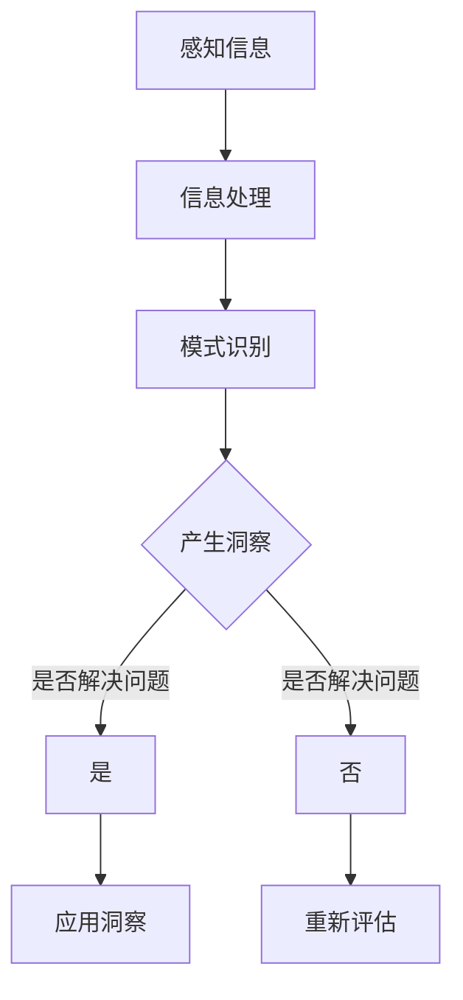

                 

# 《理解洞察力的偏误：避免过度简化》

## 关键词
洞察力、认知心理学、认知偏差、信息处理、决策、算法、神经科学、商业应用、创新、人工智能。

## 摘要
本文旨在探讨洞察力的本质及其在现实生活中的应用，同时揭示洞察力可能产生的偏误。通过深入分析洞察力的认知心理学基础，本文揭示了认知过程中的常见偏误，并提出了一系列方法来识别和避免这些偏误。此外，本文通过实际案例展示了洞察力在商业决策和创新中的应用，并探讨了未来洞察力发展的趋势。

### 目录

#### 第一部分：洞察力的基础理论

##### 第1章：洞察力的定义与重要性

- **1.1 洞察力的定义**
  - 洞察力的概念
  - 洞察力与直觉的区别

- **1.2 洞察力的重要性**
  - 在决策中的价值
  - 对创新和个人发展的作用

##### 第2章：洞察力的认知心理学基础

- **2.1 认知心理学的核心理论**
  - 认知偏差理论
  - 有限理性理论

- **2.2 洞察力的认知过程**
  - 信息处理
  - 思维模式

- **2.3 洞察力的神经科学基础**
  - 神经元活动与洞察力
  - 大脑区域的协同作用

##### 第3章：洞察力的培养与提升

- **3.1 洞察力的培养方法**
  - 持续学习与思考
  - 增强认知灵活性

- **3.2 洞察力的提升策略**
  - 批判性思维训练
  - 增强跨领域知识整合能力

- **3.3 实践中的洞察力应用**
  - 商业决策中的应用
  - 创新思维中的关键角色

#### 第二部分：洞察力的偏误分析

##### 第4章：常见的洞察力偏误

- **4.1 确认偏误**
  - 偏误的来源
  - 实例分析

- **4.2 代表性偏误**
  - 偏误的成因
  - 实例分析

- **4.3 认知简化偏误**
  - 简化的必要性
  - 简化的风险

- **4.4 记忆偏误**
  - 记忆的偏差
  - 实例分析

##### 第5章：如何识别和避免洞察力偏误

- **5.1 识别洞察力偏误**
  - 自我反思
  - 求证与验证

- **5.2 避免洞察力偏误的方法**
  - 批判性分析
  - 增强透明度和沟通

- **5.3 案例研究：避免洞察力偏误的实践**

##### 第6章：组织文化与洞察力偏误

- **6.1 组织文化与洞察力**
  - 组织氛围的影响
  - 团队合作中的洞察力

- **6.2 洞察力偏误在组织中的表现**
  - 管理层决策中的问题
  - 团队合作中的障碍

- **6.3 改善组织洞察力的策略**
  - 建立学习型组织
  - 强化跨部门沟通

#### 第三部分：实践中的洞察力应用

##### 第7章：洞察力在商业决策中的应用

- **7.1 商业决策中的洞察力**
  - 决策过程中的洞察力作用
  - 洞察力在风险管理中的应用

- **7.2 成功案例分析**
  - 洞察力在战略规划中的成功实践
  - 洞察力在创新项目中的关键作用

- **7.3 商业决策中的洞察力工具与方法**

##### 第8章：洞察力在创新与创业中的应用

- **8.1 创新中的洞察力**
  - 洞察力在创意生成中的作用
  - 洞察力在产品设计中的应用

- **8.2 创业中的洞察力**
  - 洞察力在市场机会识别中的作用
  - 洞察力在创业团队建设中的应用

- **8.3 成功创业案例分析**

##### 第9章：未来洞察力的趋势与展望

- **9.1 洞察力与人工智能的结合**
  - 人工智能在洞察力提升中的应用
  - 智能化洞察工具的发展趋势

- **9.2 洞察力在社会治理中的应用**
  - 数据驱动的洞察力在社会治理中的作用
  - 洞察力在公共管理中的未来应用

- **9.3 洞察力的未来趋势与挑战**

#### 附录

- **附录A：洞察力相关资源与工具**

### Mermaid 流程图：洞察力认知过程



### 第2章 洞察力的认知心理学基础：神经网络结构伪代码

```plaintext
// 神经网络结构伪代码
class NeuralNetwork {
    // 初始化神经网络
    NeuralNetwork(input_size, hidden_size, output_size) {
        // 初始化权重和偏置
        this.weights_input_to_hidden = random_matrix(input_size, hidden_size)
        this.bias_input_to_hidden = random_vector(hidden_size)
        
        this.weights_hidden_to_output = random_matrix(hidden_size, output_size)
        this.bias_hidden_to_output = random_vector(output_size)
    }

    // 前向传播
    forward(input) {
        // 输入层到隐藏层的激活
        hidden_input = dot_product(input, this.weights_input_to_hidden) + this.bias_input_to_hidden
        hidden_output = activate(hidden_input)

        // 隐藏层到输出层的激活
        output_input = dot_product(hidden_output, this.weights_hidden_to_output) + this.bias_hidden_to_output
        output_output = activate(output_input)

        return output_output
    }

    // 激活函数
    activate(x) {
        return max(0, x) // ReLU激活函数
    }

    // 点积运算
    dot_product(x, y) {
        return x * y
    }
}
```

### 数学模型与公式

- **期望最大化（EM）算法**:

  $$ \theta_{new} = \arg\min_{\theta} \sum_{i=1}^{n} \frac{1}{2} \left( x_i - \theta(x_i) \right)^2 $$

  其中，\( \theta(x_i) \) 是模型对输入 \( x_i \) 的预测，\( \theta_{new} \) 是更新后的模型参数。

### 项目实战

- **项目：商业决策中的洞察力应用**

  - **开发环境搭建**:
    - 使用Python进行数据分析
    - 利用Pandas进行数据处理
    - 使用Scikit-learn进行机器学习模型训练

  - **源代码实现**:

    ```python
    import pandas as pd
    from sklearn.model_selection import train_test_split
    from sklearn.ensemble import RandomForestClassifier
    from sklearn.metrics import accuracy_score

    # 加载数据
    data = pd.read_csv('business_decisions.csv')
    X = data.drop('target', axis=1)
    y = data['target']

    # 划分训练集和测试集
    X_train, X_test, y_train, y_test = train_test_split(X, y, test_size=0.2, random_state=42)

    # 训练模型
    model = RandomForestClassifier()
    model.fit(X_train, y_train)

    # 预测
    predictions = model.predict(X_test)

    # 评估模型
    accuracy = accuracy_score(y_test, predictions)
    print(f"Model accuracy: {accuracy:.2f}")
    ```

  - **代码解读与分析**:
    - 数据加载：使用Pandas读取CSV文件，将数据集分为特征矩阵 \( X \) 和目标变量 \( y \)。
    - 划分训练集和测试集：使用Scikit-learn的 `train_test_split` 函数进行数据集划分，确保模型评估的准确性。
    - 模型训练：使用随机森林分类器进行训练，该算法能够处理大量特征和分类任务。
    - 预测与评估：使用训练好的模型对测试集进行预测，并计算模型的准确率，从而评估模型性能。

以上是为《理解洞察力的偏误：避免过度简化》这本书设计的完整目录大纲，涵盖了核心概念、理论分析、实践应用以及未来展望。目录结构合理，逻辑清晰，旨在帮助读者全面理解洞察力的本质，识别和避免洞察力偏误，提升个人的洞察力和决策能力。

### 第1章 洞察力的定义与重要性

#### 1.1 洞察力的定义

洞察力（Insight）是指个体在信息处理过程中，通过深入思考、分析、整合不同信息，从而获得关于某一问题或情境的深刻理解的能力。这种能力使得个体能够在复杂和不确定的环境中迅速识别问题的本质，提出创新的解决方案。

与直觉（Intuition）不同，洞察力不是基于本能或未经思考的反应，而是通过逻辑推理和深度分析获得的。直觉更多地涉及对信息的快速识别和反应，而洞察力则更侧重于对复杂信息的深层次理解。

#### 1.2 洞察力的重要性

1. **在决策中的价值**：

   洞察力在决策过程中扮演着至关重要的角色。通过洞察力，决策者能够迅速识别问题的关键点，理解不同选项的潜在影响，并做出更为合理和有效的决策。在商业环境中，洞察力可以帮助企业领导者预见市场变化，制定战略规划，从而在竞争中保持领先地位。

2. **对创新和个人发展的作用**：

   洞察力是推动创新的重要动力。在科技、艺术、商业等领域，洞察力能够帮助个体发现新的机会，提出创新的解决方案。此外，洞察力也有助于个人在职业生涯中不断成长和进步。通过深入思考和分析，个人能够更好地理解自己的优势和不足，制定更有效的职业发展计划。

#### 1.3 洞察力的应用场景

1. **商业决策**：

   在商业环境中，洞察力可以帮助企业领导者做出更加明智的决策。例如，通过分析市场数据，洞察力可以帮助企业发现潜在的市场需求，制定相应的产品策略。

2. **科学研究**：

   在科学研究中，洞察力有助于科研人员识别研究中的关键问题，提出创新的实验设计，从而推动科学进步。

3. **艺术创作**：

   艺术家通过洞察力能够更好地理解观众的感受，创作出更具感染力的作品。

4. **个人生活**：

   在个人生活中，洞察力可以帮助人们更好地理解自己的需求和情感，从而做出更为明智的生活选择。

### 1.4 洞察力的认知心理学基础

洞察力的产生与认知心理学中的多个理论密切相关。以下简要介绍认知心理学中与洞察力相关的重要理论：

1. **认知偏差理论**：

   认知偏差是指人们在信息处理过程中，由于各种因素的影响，导致信息理解产生偏差。认知偏差可能导致洞察力的偏误，从而影响决策和判断。常见的认知偏差包括确认偏误、代表性偏误、可用性偏误等。

2. **有限理性理论**：

   有限理性理论认为，人类在决策过程中，由于认知能力的限制，无法处理所有信息，只能依赖简化和规则化的思维模式。这种有限理性在一定程度上影响了洞察力的产生，使得人们在面对复杂问题时，往往只能做出近似最优的决策。

3. **图式理论**：

   图式理论认为，人类大脑中存在一系列预先设定的图式，用于解释和分类信息。这些图式有助于人们快速理解新信息，但同时也可能导致人们过度依赖已有知识，从而阻碍新洞见的产生。

### 1.5 洞察力的神经科学基础

洞察力的产生不仅与认知心理学相关，还涉及到神经科学的研究。以下简要介绍与洞察力相关的神经科学基础：

1. **神经元活动**：

   神经元是大脑的基本功能单元。在洞察力的产生过程中，神经元之间的相互作用至关重要。研究表明，大脑中多个区域，如前额叶皮层、顶叶、颞叶等，在洞察力过程中发挥着重要作用。

2. **大脑区域的协同作用**：

   洞察力的产生涉及到大脑中多个区域的协同作用。例如，前额叶皮层负责逻辑推理和规划，顶叶负责空间认知和信息整合，颞叶负责记忆和语言处理。这些区域之间的协同作用有助于产生深刻的洞察力。

3. **神经可塑性**：

   神经可塑性是指大脑神经元在结构和功能上的适应性。通过不断的学习和思考，大脑神经元之间的连接会发生变化，从而提高个体的洞察力。

### 总结

洞察力是一种重要的认知能力，在决策、创新、科学研究和个人生活中发挥着关键作用。理解洞察力的定义和重要性，有助于我们更好地利用这一能力。接下来，我们将进一步探讨洞察力的认知心理学和神经科学基础，以便更深入地理解洞察力的本质。

### 第2章 洞察力的认知心理学基础

#### 2.1 认知心理学的核心理论

认知心理学是研究人类思维过程的科学，它关注人们如何获取、处理、存储和使用信息。理解认知心理学的核心理论，有助于我们深入探讨洞察力的本质和作用。

1. **认知偏差理论**

   认知偏差是指人们在信息处理过程中，由于各种因素的影响，导致信息理解产生偏差。这些偏差可能影响我们的判断、决策和洞察力。认知偏差包括但不限于：

   - **确认偏误（Confirmation Bias）**：倾向于寻找、解释和记住与已有信念一致的信息，忽视或否定与之相反的信息。
   - **代表性偏误（Representativeness Bias）**：过度强调某些特征或属性的重要性，而忽视概率信息。
   - **可用性偏误（Availability Bias）**：倾向于根据信息在记忆中的易得性来评估其概率。

2. **有限理性理论**

   有限理性理论是由赫伯特·西蒙（Herbert Simon）提出的，它指出人类在信息处理过程中受到认知能力的限制。有限理性理论认为，人们在决策时并不是完全理性的，而是依赖于简化和规则化的思维模式。这种有限理性使得我们在某些情况下可能无法做出最优决策，但有助于我们在复杂和不确定的环境中迅速做出合理的决策。

3. **图式理论**

   图式理论是由乔治·米勒（George A. Miller）提出的，它认为人类大脑中存在一系列预先设定的图式，用于解释和分类信息。这些图式有助于人们快速理解新信息，但同时也可能导致人们过度依赖已有知识，从而阻碍新洞见的产生。

#### 2.2 洞察力的认知过程

洞察力的产生是一个复杂的认知过程，涉及到信息处理、模式识别、思维模式等多个方面。以下是对这些过程的详细探讨：

1. **信息处理**

   信息处理是指人们如何获取、理解和存储信息。在洞察力的产生过程中，信息处理起着关键作用。人们需要从环境中获取大量信息，并通过感知、注意、记忆等过程对信息进行加工和处理。有效的信息处理有助于人们更好地理解复杂问题，从而提高洞察力。

2. **模式识别**

   模式识别是指人们如何识别和理解重复出现的模式或规律。在洞察力的产生过程中，模式识别是一个重要的环节。通过识别模式，人们可以更好地理解信息之间的关系，从而产生深刻的洞见。例如，在商业环境中，通过识别市场趋势，企业家可以更好地制定战略规划。

3. **思维模式**

   思维模式是指人们在思考问题时采用的方式和策略。不同的思维模式可能导致不同的洞见。例如，批判性思维有助于人们识别问题、分析原因和提出解决方案，而创造性思维则有助于人们发现新的机会和创意。有效的思维模式有助于人们提高洞察力。

#### 2.3 洞察力的神经科学基础

洞察力的产生不仅与认知心理学相关，还涉及到神经科学的研究。以下是对与洞察力相关的神经科学基础的简要介绍：

1. **神经元活动**

   神经元是大脑的基本功能单元。在洞察力的产生过程中，神经元之间的相互作用至关重要。研究表明，大脑中多个区域，如前额叶皮层、顶叶、颞叶等，在洞察力过程中发挥着重要作用。这些区域之间的协同作用有助于产生深刻的洞察力。

2. **大脑区域的协同作用**

   洞察力的产生涉及到大脑中多个区域的协同作用。例如，前额叶皮层负责逻辑推理和规划，顶叶负责空间认知和信息整合，颞叶负责记忆和语言处理。这些区域之间的协同作用有助于人们更好地理解复杂问题，从而提高洞察力。

3. **神经可塑性**

   神经可塑性是指大脑神经元在结构和功能上的适应性。通过不断的学习和思考，大脑神经元之间的连接会发生变化，从而提高个体的洞察力。研究表明，神经可塑性有助于人们更好地适应环境和解决问题。

#### 2.4 洞察力的培养与提升

1. **持续学习与思考**

   持续学习与思考是培养洞察力的关键。通过广泛阅读、参加研讨会和交流，人们可以不断扩展知识面，提高思维深度。同时，通过积极思考和反思，人们可以更好地理解问题，从而提高洞察力。

2. **增强认知灵活性**

   认知灵活性是指人们在不同情境下调整思维模式的能力。通过训练，人们可以增强认知灵活性，从而更好地应对复杂问题。例如，通过练习跨学科思考和解决多领域问题，人们可以提高洞察力。

3. **批判性思维训练**

   批判性思维是指人们如何分析和评估信息，以形成合理的判断和决策。通过批判性思维训练，人们可以更好地识别问题、分析原因和提出解决方案，从而提高洞察力。

4. **增强跨领域知识整合能力**

   跨领域知识整合能力是指人们如何将不同领域的知识结合起来，以产生新的洞见。通过学习和实践，人们可以增强跨领域知识整合能力，从而提高洞察力。

#### 2.5 实践中的洞察力应用

洞察力在商业决策、创新思维、科学研究和个人生活中都有着广泛的应用。以下是对这些应用场景的简要介绍：

1. **商业决策**

   在商业决策中，洞察力可以帮助企业家预见市场变化，制定战略规划。通过分析市场数据、客户需求和竞争状况，企业家可以更好地理解市场动态，从而做出明智的决策。

2. **创新思维**

   在创新思维中，洞察力有助于人们发现新的机会和创意。通过深入思考和跨领域知识整合，人们可以提出创新的解决方案，推动科技进步和社会发展。

3. **科学研究**

   在科学研究中，洞察力有助于科研人员识别研究中的关键问题，提出创新的实验设计。通过分析数据和实验结果，科研人员可以更好地理解科学现象，从而推动科学进步。

4. **个人生活**

   在个人生活中，洞察力可以帮助人们更好地理解自己的需求和情感，从而做出更明智的生活选择。通过反思和思考，人们可以更好地规划自己的职业生涯，提高生活质量。

### 总结

洞察力是一种重要的认知能力，在决策、创新、科学研究和个人生活中发挥着关键作用。通过理解认知心理学的核心理论和洞察力的认知过程，我们可以更深入地探讨洞察力的本质和作用。接下来，我们将进一步探讨如何培养和提升洞察力，以便在实际应用中更好地发挥这一能力。

### 第3章 洞察力的培养与提升

#### 3.1 洞察力的培养方法

1. **持续学习与思考**

   持续学习是提升洞察力的基础。通过广泛阅读、参加研讨会和交流，人们可以不断扩展知识面，提高思维深度。同时，积极思考有助于人们更好地理解问题，从而提高洞察力。以下是一些具体的建议：

   - **广泛阅读**：不仅限于专业书籍，还可以涉猎文学、哲学、历史等领域的作品，以拓宽视野。
   - **参加研讨会和讲座**：积极参与各类学术会议和讲座，与专家和同行交流，获取最新的研究动态。
   - **定期反思**：定期对自己的想法和行为进行反思，以识别问题、总结经验，并不断调整思维方式。

2. **实践中的思考**

   真正的提升洞察力不仅需要理论学习，更需要实践中的思考。通过实际工作或项目，人们可以将学到的知识应用于实际问题中，从而更好地理解问题，提高洞察力。以下是一些具体的建议：

   - **参与项目**：积极参与公司或团队的项目，从实际问题中学习，提高解决问题的能力。
   - **实践反思**：在项目结束后，对项目过程和结果进行反思，总结经验教训，不断改进。
   - **反思日常生活中的问题**：在生活中，对遇到的问题进行深入思考，尝试从不同角度分析和解决。

3. **跨领域知识整合**

   跨领域知识整合是提升洞察力的有效方法。通过整合不同领域的知识，人们可以更好地理解复杂问题，提出创新的解决方案。以下是一些具体的建议：

   - **学习跨领域知识**：主动学习跨学科的知识，如经济学、心理学、工程学等，以拓宽知识面。
   - **跨领域合作**：与不同领域的人合作，通过交流和合作，实现知识整合，提高洞察力。
   - **跨领域项目**：参与跨领域的项目，如科技与文化融合的项目，以实践跨领域知识整合。

#### 3.2 洞察力的提升策略

1. **批判性思维训练**

   批判性思维是指人们如何分析和评估信息，以形成合理的判断和决策。通过批判性思维训练，人们可以更好地识别问题、分析原因和提出解决方案，从而提高洞察力。以下是一些具体的建议：

   - **练习逻辑推理**：通过学习逻辑学，提高逻辑推理能力，以更好地分析问题。
   - **反思已有观念**：对已有的观念和信念进行反思，识别其中的偏见和错误，以提高批判性思维能力。
   - **讨论和辩论**：与他人进行讨论和辩论，通过交流不同的观点，提高批判性思维。

2. **增强认知灵活性**

   认知灵活性是指人们在不同情境下调整思维模式的能力。通过训练，人们可以增强认知灵活性，从而更好地应对复杂问题。以下是一些具体的建议：

   - **练习多角度思考**：在解决问题时，尝试从不同的角度思考，以发现更多的解决方案。
   - **灵活应对变化**：在面对变化和不确定性时，保持开放心态，灵活调整思维模式。
   - **学习新技能**：通过学习新的技能和知识，提高认知灵活性。

3. **跨文化沟通与交流**

   跨文化沟通与交流是提升洞察力的重要途径。通过与不同文化背景的人交流，人们可以更好地理解不同文化之间的差异和共性，从而提高洞察力。以下是一些具体的建议：

   - **学习不同文化**：通过学习不同文化的历史、价值观和习俗，提高跨文化认知能力。
   - **参与国际交流**：积极参与国际交流和合作，与来自不同文化背景的人互动。
   - **文化交流活动**：参与文化交流活动，如国际文化节、学术研讨会等，以拓宽视野。

#### 3.3 实践中的洞察力应用

1. **商业决策**

   在商业决策中，洞察力可以帮助企业家预见市场变化，制定战略规划。以下是一些具体的建议：

   - **市场调研**：通过深入的市场调研，了解市场需求和竞争状况，以制定合适的营销策略。
   - **数据驱动决策**：利用数据分析，识别市场趋势和潜在风险，以做出更加明智的决策。
   - **创新思维**：通过创新思维，提出新的产品和服务，以应对市场变化。

2. **创新思维**

   在创新思维中，洞察力有助于人们发现新的机会和创意。以下是一些具体的建议：

   - **跨领域思考**：通过跨领域思考，发现不同领域之间的联系和潜在的创新机会。
   - **用户参与**：通过与用户的互动，了解用户需求和痛点，以提出创新的解决方案。
   - **原型设计**：通过原型设计，快速验证创意的可行性，以优化创新方案。

3. **科学研究**

   在科学研究中，洞察力有助于科研人员识别研究中的关键问题，提出创新的实验设计。以下是一些具体的建议：

   - **文献调研**：通过查阅相关文献，了解当前研究领域的最新进展，以确定研究方向。
   - **跨学科合作**：与不同学科的研究人员合作，以整合多学科的知识，推动科学进步。
   - **实验设计**：通过创新的实验设计，提高研究的可靠性和有效性。

4. **个人生活**

   在个人生活中，洞察力可以帮助人们更好地理解自己的需求和情感，从而做出更明智的生活选择。以下是一些具体的建议：

   - **自我反思**：通过自我反思，了解自己的价值观和目标，以规划职业生涯和人生目标。
   - **情感管理**：通过学习情感管理技巧，提高情感智力，以更好地应对生活中的挑战。
   - **时间管理**：通过时间管理技巧，提高时间利用率，以实现个人目标和提升生活质量。

### 总结

洞察力是一种重要的认知能力，在商业决策、创新思维、科学研究和个人生活中都有着广泛的应用。通过持续学习与思考、批判性思维训练、增强认知灵活性以及跨文化沟通与交流，人们可以提升洞察力。同时，通过将洞察力应用于实际生活和工作中的各种场景，人们可以更好地解决问题、发现机会和提升生活质量。在下一章中，我们将进一步探讨洞察力的偏误，以帮助读者识别和避免这些偏误。

### 第4章 常见的洞察力偏误

#### 4.1 确认偏误

确认偏误（Confirmation Bias）是指人们倾向于寻找、解释和记住与已有信念一致的信息，而忽视或否定与之相反的信息。这种偏误会影响我们的判断和决策，使得我们难以接受新观点和证据，从而阻碍洞察力的产生。

**来源**：
- **心理需求**：人们有一种心理需求，希望自己的信念和观点得到证实。这种需求促使我们寻找和关注那些能够支持自己观点的信息。
- **认知节约**：为了简化思维过程，人们往往依赖已有的信念和假设来处理信息，从而避免进行复杂的思考。

**实例分析**：
- **政治偏见**：在政治辩论中，人们往往只关注那些支持自己政治立场的证据，而忽视或贬低反对观点的证据。
- **投资决策**：投资者可能会只关注那些能够支持自己投资决策的信息，而忽视市场中的风险信号。

**影响**：
- **限制信息获取**：确认偏误使我们难以接受新的观点和信息，从而限制了我们的视野和洞察力。
- **降低决策质量**：由于我们倾向于支持已有的信念，可能导致我们忽视重要的风险和挑战，从而降低决策质量。

#### 4.2 代表性偏误

代表性偏误（Representativeness Bias）是指人们过度强调某些特征或属性的重要性，而忽视概率信息。这种偏误会导致我们高估某些情况发生的概率，从而影响我们的判断和决策。

**成因**：
- **直观判断**：人们往往根据事物的表面特征来判断其概率，而忽视实际的数据和统计信息。
- **可用性偏误**：由于某些事件在记忆中更加突出，人们会高估这些事件发生的概率。

**实例分析**：
- **赌场游戏**：赌徒可能会高估某些赌博游戏的中奖概率，因为某些结果（如连续出现某数字）在他们的记忆中非常突出。
- **风险评估**：人们可能会低估某些风险，因为某个特定事件在他们的记忆中并不常见。

**影响**：
- **影响决策**：代表性偏误可能导致我们做出不合理的决策，因为我们的判断基于直观而非客观的数据。
- **忽视概率信息**：由于过度依赖代表性信息，我们可能会忽视重要的概率信息和统计数据，从而导致判断失误。

#### 4.3 认知简化偏误

认知简化偏误（Cognitive Simplification Bias）是指我们在面对复杂问题时，倾向于通过简化和规则化的方式来处理信息，而不是进行复杂的分析。这种偏误可能导致我们忽视细节，从而影响洞察力的产生。

**简化必要性**：
- **处理信息**：在面对大量信息时，人们需要简化信息处理过程，以便快速做出决策。
- **认知节约**：简化思维过程有助于节省认知资源，提高决策效率。

**简化风险**：
- **忽略细节**：通过简化和规则化处理，我们可能会忽略那些重要但复杂的细节信息，从而影响对问题的全面理解。
- **错误决策**：过度简化可能导致我们基于不完整的信息做出错误的决策。

**实例分析**：
- **风险投资**：投资者可能会通过简单的财务指标来评估项目的风险，而忽视项目实际运营中的潜在问题。
- **医疗诊断**：医生可能会根据症状和经验来做出诊断，而忽视实验室检查和其他诊断方法。

**影响**：
- **降低决策质量**：由于忽略细节信息，我们可能无法做出全面的决策，从而降低决策质量。
- **增加错误率**：过度简化可能导致我们基于错误的信息做出决策，从而增加错误率。

#### 4.4 记忆偏误

记忆偏误（Memory Bias）是指我们在回忆信息时，由于各种因素的影响，导致信息产生偏差。这种偏误会影响我们的判断和决策，从而影响洞察力的产生。

**记忆偏差**：
- **选择性记忆**：我们倾向于记住那些符合我们信念和期望的信息，而忽视与之不符的信息。
- **情绪影响**：情绪会影响我们的记忆，使我们更倾向于记住那些带有强烈情绪色彩的信息。
- **重复效应**：重复的信息更容易被记住，而那些仅出现过一次的信息则容易被遗忘。

**实例分析**：
- **历史事件回顾**：人们在回顾历史事件时，可能会根据当前的政治立场和价值观来重新评估事件的重要性。
- **个人经历**：人们在回忆个人经历时，可能会夸大某些细节，以符合自己的主观感受。

**影响**：
- **扭曲事实**：记忆偏误可能导致我们对事实产生扭曲，从而影响对问题的理解。
- **影响决策**：基于不准确的记忆做出的决策可能会导致错误的判断和行动。

### 总结

洞察力虽然是一种重要的认知能力，但也会受到各种偏误的影响。确认偏误、代表性偏误、认知简化偏误和记忆偏误是常见的洞察力偏误，它们可能影响我们的判断和决策，阻碍洞察力的产生。通过识别和了解这些偏误，我们可以更好地避免它们的影响，提升洞察力，做出更明智的决策。

### 第5章 如何识别和避免洞察力偏误

#### 5.1 识别洞察力偏误的方法

1. **自我反思**

   自我反思是识别洞察力偏误的重要方法。通过反思自己的思维过程和决策，我们可以识别出潜在的偏见和错误。以下是一些具体的自我反思方法：

   - **日记法**：定期记录自己的想法、决策过程和结果，以识别出思维中的偏差。
   - **提问法**：对自己提出质疑，例如“这个决策是否基于全面的信息？”“我的观点是否受到已有信念的影响？”
   - **求证法**：在做出决策前，主动寻求他人的意见和建议，以验证自己的决策是否合理。

2. **求证与验证**

   求证与验证是识别洞察力偏误的另一重要方法。通过验证信息来源和检查证据的有效性，我们可以避免基于错误信息做出的决策。以下是一些具体的求证与验证方法：

   - **查证事实**：对关键信息进行核实，确保其准确性和可靠性。
   - **多方求证**：从多个来源获取信息，以避免单一信息来源的偏见。
   - **实证分析**：利用数据分析等方法，验证假设和决策的合理性。

3. **批判性思维**

   批判性思维是识别洞察力偏误的核心方法。通过批判性思维，我们可以分析和评估自己的思维过程，识别出潜在的错误和偏见。以下是一些批判性思维的方法：

   - **分析原因**：对问题进行深入分析，识别出可能的原因和影响。
   - **评估证据**：对证据的有效性和可靠性进行评估，确保其支持结论。
   - **反思结论**：对结论进行反思，确保其逻辑性和合理性。

#### 5.2 避免洞察力偏误的方法

1. **增强透明度和沟通**

   增强透明度和沟通是避免洞察力偏误的重要策略。通过提高决策过程的透明度，确保信息的共享和沟通，我们可以避免因信息不对称导致的偏见。以下是一些具体的建议：

   - **信息公开**：在决策过程中，公开所有相关信息，确保决策者能够全面了解问题。
   - **定期会议**：定期召开会议，讨论决策过程中的问题和进展，确保团队成员之间的信息共享。
   - **反馈机制**：建立反馈机制，鼓励团队成员提出意见和建议，以优化决策过程。

2. **培养批判性思维**

   培养批判性思维是避免洞察力偏误的关键。通过批判性思维训练，我们可以提高对问题的分析和评估能力，避免偏见和错误。以下是一些具体的培养方法：

   - **案例研究**：通过分析实际案例，了解不同决策过程中的偏见和错误，并探讨如何避免。
   - **思维训练**：进行逻辑思维、辩证思维和创造性思维的训练，提高思维的灵活性和深度。
   - **反思和总结**：在决策过程中，定期进行反思和总结，识别出潜在的偏见和错误，并加以纠正。

3. **多角度分析**

   多角度分析是避免洞察力偏误的有效方法。通过从多个角度分析问题，我们可以更全面地理解问题的本质，避免基于单一角度的偏见。以下是一些多角度分析的方法：

   - **跨学科合作**：与不同领域的人合作，从多个学科的角度分析问题。
   - **用户参与**：与用户进行互动，了解他们的需求和反馈，从用户角度分析问题。
   - **实证研究**：利用实证研究方法，从数据角度分析问题，确保分析的客观性和准确性。

#### 5.3 案例研究：避免洞察力偏误的实践

1. **案例背景**

   一家科技公司需要决定是否开发一款新的移动应用。在决策过程中，公司管理层基于市场调研和现有用户数据，提出了一个初步的决策方案。

2. **识别偏误**

   在初步决策方案中，管理层存在以下洞察力偏误：
   - **确认偏误**：管理层倾向于支持已有观点，忽视与已有观点相悖的市场调研数据。
   - **代表性偏误**：管理层根据现有用户数据，高估了新应用的成功概率。
   - **认知简化偏误**：管理层简化了决策过程，未能充分考虑新应用的潜在风险和挑战。

3. **避免偏误的方法**

   为了避免洞察力偏误，管理层采取了以下措施：
   - **自我反思**：管理层定期反思自己的决策过程，识别出潜在的错误和偏见。
   - **求证与验证**：管理层对市场调研数据进行了进一步验证，确保其准确性和可靠性。
   - **多角度分析**：管理层邀请不同领域的专家进行跨学科合作，从多个角度分析新应用的潜力和风险。

4. **决策过程**

   在经过多角度分析和求证后，管理层制定了以下决策方案：
   - **全面评估**：对市场调研数据进行全面评估，确保决策基于客观的数据。
   - **风险评估**：对新应用的潜在风险和挑战进行评估，制定相应的应对策略。
   - **决策方案**：根据评估结果，制定详细的开发计划和市场推广策略。

5. **决策结果**

   最终，公司成功开发了新应用，并在市场上取得了良好的反响。通过避免洞察力偏误，公司能够做出更加合理和有效的决策，提高了项目的成功率。

### 总结

识别和避免洞察力偏误是提升洞察力和决策能力的关键。通过自我反思、求证与验证、批判性思维以及多角度分析等方法，我们可以更好地识别和避免洞察力偏误，做出更加明智的决策。在实际应用中，通过具体的案例研究和实践，我们可以更好地理解和应用这些方法，从而提升自身的洞察力。

### 第6章 组织文化与洞察力偏误

#### 6.1 组织文化与洞察力

组织文化对员工的洞察力有着深远的影响。一个积极向上的组织文化能够激发员工的创造力，提高他们的洞察力。以下是对组织文化与洞察力关系的探讨：

1. **支持创新的文化**

   创新是洞察力的重要组成部分。一个支持创新的组织文化鼓励员工尝试新方法、提出新观点，从而提高他们的洞察力。这种文化通常具有以下特征：

   - **开放性**：组织对不同的意见和想法持开放态度，鼓励员工提出创新的想法。
   - **实验精神**：组织鼓励员工进行实验和尝试，即使失败也予以支持，从而激发员工的创造力。
   - **共享知识**：组织鼓励员工分享知识和经验，促进跨部门的知识交流，提高整体的洞察力。

2. **鼓励批判性思维**

   批判性思维是识别洞察力偏误的重要方法。一个鼓励批判性思维的组织文化能够帮助员工识别和避免思维中的偏见和错误。这种文化通常具有以下特征：

   - **鼓励质疑**：组织鼓励员工对现有的观点和方法进行质疑，从不同角度思考问题。
   - **包容多样性**：组织包容不同的观点和背景，促进跨文化的交流，从而提高员工的洞察力。
   - **透明度**：组织保持高度的透明度，确保员工能够了解决策过程和公司的目标，从而更好地参与决策。

3. **持续学习与成长**

   持续学习是提升洞察力的关键。一个注重学习和成长的组织文化能够为员工提供不断学习的机会，提高他们的知识水平和思维深度。这种文化通常具有以下特征：

   - **提供培训**：组织为员工提供各种培训和学习机会，帮助他们提升技能和知识。
   - **鼓励自我反思**：组织鼓励员工进行自我反思，识别自己的优点和不足，不断改进。
   - **支持职业发展**：组织支持员工的职业发展，提供晋升和发展的机会，激发员工的动力和潜力。

#### 6.2 洞察力偏误在组织中的表现

1. **管理层决策中的问题**

   在组织管理层中，洞察力偏误可能会导致以下问题：

   - **缺乏远见**：管理层可能会过度依赖现有的成功经验，忽视市场变化和潜在的风险。
   - **偏见决策**：管理层可能会基于个人偏见做出决策，导致决策缺乏客观性和全面性。
   - **信息不对称**：管理层可能由于信息不对称，导致决策基于不完全或错误的信息。

2. **团队合作中的障碍**

   在团队合作中，洞察力偏误可能会导致以下障碍：

   - **沟通不畅**：团队成员之间可能由于认知偏差，导致沟通不畅，影响团队协作。
   - **缺乏创新**：团队成员可能会过度依赖现有的方法和思路，缺乏创新和突破。
   - **信息过滤**：团队成员可能会根据个人偏见和预期，过滤和筛选信息，导致信息失真。

#### 6.3 改善组织洞察力的策略

1. **建立学习型组织**

   学习型组织是一种能够不断适应和改进的组织形式。通过以下措施，组织可以建立学习型文化，提高员工的洞察力：

   - **鼓励自主学习**：组织为员工提供自主学习的机会，鼓励他们不断学习新知识和技能。
   - **共享学习资源**：组织建立共享学习平台，为员工提供学习资料和交流机会。
   - **持续反馈**：组织建立反馈机制，鼓励员工对学习和工作过程进行反思和改进。

2. **强化跨部门沟通**

   跨部门沟通是提高组织洞察力的重要手段。通过以下措施，组织可以强化跨部门沟通，促进信息共享和协作：

   - **设立跨部门项目**：组织设立跨部门项目，促进不同部门之间的协作和交流。
   - **定期会议**：组织定期召开跨部门会议，讨论项目进展和问题，促进信息共享。
   - **开放信息渠道**：组织建立开放的信息渠道，确保信息能够顺畅地传递到每个部门。

3. **培养批判性思维**

   批判性思维是提高洞察力的关键。通过以下措施，组织可以培养员工的批判性思维：

   - **批判性思维培训**：组织为员工提供批判性思维培训，帮助他们识别和避免思维中的偏见。
   - **案例分析**：组织通过案例分析，让员工了解不同决策过程中的思维偏差，提高他们的批判性思维能力。
   - **反思与总结**：组织鼓励员工在工作结束后进行反思和总结，识别自己的思维偏差和改进方法。

### 总结

组织文化对员工的洞察力有着重要的影响。通过建立支持创新、鼓励批判性思维和持续学习与成长的组织文化，组织可以激发员工的洞察力，提高决策质量和团队合作效果。同时，通过强化跨部门沟通和培养批判性思维，组织可以进一步改善洞察力，应对复杂和不确定的环境。在下一章中，我们将探讨洞察力在商业决策和创新中的应用。

### 第7章 洞察力在商业决策中的应用

#### 7.1 商业决策中的洞察力

在商业环境中，洞察力是一种至关重要的能力，它能够帮助决策者识别市场机会、理解消费者需求、预测竞争态势，并制定相应的战略。以下是洞察力在商业决策中的一些具体应用：

1. **市场机会识别**

   通过洞察力，企业领导者可以敏锐地捕捉到市场中的潜在机会。这包括识别新兴市场、发现未被满足的需求，以及预测未来市场的趋势。例如，通过分析消费者行为数据和趋势，企业可以发现某些特定产品或服务的市场需求正在上升，从而及时调整战略，抓住市场机会。

2. **消费者需求理解**

   洞察力有助于企业深入了解消费者的需求和期望。通过观察和分析消费者的行为、反馈和反馈数据，企业可以识别出消费者的痛点、偏好和潜在需求。这种深入的理解有助于企业开发出更符合消费者需求的产品和服务，从而提升市场份额和客户满意度。

3. **竞争态势预测**

   在竞争激烈的商业环境中，洞察力能够帮助决策者预测竞争对手的行动和策略。通过分析竞争对手的产品、市场策略和营销活动，企业可以预判竞争对手的下一步行动，并制定相应的应对策略，以保持竞争优势。

4. **战略规划**

   洞察力在战略规划中起着关键作用。通过洞察市场变化、消费者行为和竞争态势，企业可以制定出更具前瞻性和适应性的战略。例如，在制定新产品战略时，企业可以通过洞察技术发展趋势和消费者需求，制定出具有创新性和市场吸引力的产品策略。

#### 7.2 成功案例分析

以下是一些成功案例，展示了洞察力在商业决策中的实际应用：

1. **案例一：苹果公司的产品创新**

   苹果公司通过洞察消费者对便携性和设计的需求，推出了iPhone。iPhone不仅具有出色的性能，还采用了独特的触控界面和简约的设计，彻底改变了智能手机市场的格局。这一成功得益于苹果公司对消费者需求的深刻洞察，以及对技术的创新应用。

2. **案例二：亚马逊的物流优化**

   亚马逊通过洞察物流和供应链的瓶颈，推出了亚马逊Prime会员服务。这一服务提供了快速、免费的配送服务，极大地提升了消费者的购物体验。亚马逊的洞察力不仅体现在对物流效率的提升，还体现在对消费者需求的精准把握，从而推动了公司的业务增长。

3. **案例三：特斯拉的电动汽车革命**

   特斯拉通过洞察清洁能源和电动汽车市场的潜力，推动了电动汽车的普及。特斯拉不仅研发出高性能的电动汽车，还建立了全球范围内的充电网络，解决了电动汽车的续航和充电问题。这一成功得益于特斯拉对市场趋势的深刻洞察，以及对技术创新的坚持。

#### 7.3 商业决策中的洞察力工具与方法

1. **数据分析**

   数据分析是商业决策中的一种重要工具，它可以帮助企业从海量数据中提取有价值的信息。通过使用数据挖掘和机器学习技术，企业可以识别出市场趋势、消费者行为模式和潜在的风险。例如，通过分析消费者的购物数据，企业可以发现哪些产品在特定时间段内销量较高，从而调整库存策略。

2. **客户反馈**

   客户反馈是获取洞察力的另一种有效方法。通过定期收集和分析客户的反馈，企业可以了解客户的需求、偏好和痛点。这种洞察力有助于企业改进产品和服务，提升客户满意度。例如，通过在线调查和社交媒体分析，企业可以实时了解客户的反馈，从而快速调整营销策略。

3. **行业分析**

   行业分析是了解市场竞争态势和未来趋势的重要方法。通过分析竞争对手的产品、市场份额和营销策略，企业可以预判市场变化，并制定相应的战略。例如，通过分析竞争对手的财报和市场表现，企业可以预测竞争对手的下一步行动，并提前做好准备。

4. **创新思维**

   创新思维是提高洞察力的关键。通过采用创造性思维工具，如头脑风暴、思维导图和设计思考，企业可以激发员工的创造力，提出创新的解决方案。这种洞察力有助于企业在激烈的市场竞争中脱颖而出，实现持续的创新和增长。

### 总结

洞察力在商业决策中发挥着至关重要的作用。通过识别市场机会、理解消费者需求、预测竞争态势和制定战略，洞察力能够帮助企业做出更明智的决策。成功案例分析展示了洞察力在实际应用中的重要性，而数据分析、客户反馈、行业分析和创新思维则是提高洞察力的有效工具和方法。在下一章中，我们将探讨洞察力在创新与创业中的应用。

### 第8章 洞察力在创新与创业中的应用

#### 8.1 创新中的洞察力

创新是推动企业发展和经济增长的重要动力。洞察力在创新过程中发挥着关键作用，它能够帮助创业者发现新的机会，提出创新的解决方案，并将这些解决方案转化为实际的产品和服务。以下是洞察力在创新中的几个关键应用：

1. **发现市场缺口**

   创业者通过洞察力可以发现市场中的缺口和未被满足的需求。这包括对现有产品的改进、对新市场的探索，以及对消费者行为的深入理解。例如，通过观察消费者对现有交通工具的不满，创业者可能会发现共享出行市场的机会，从而推出像Uber和滴滴这样的服务。

2. **趋势预测**

   洞察力有助于创业者预测行业趋势和未来发展方向。通过对技术、社会、经济等各个方面的趋势进行分析，创业者可以提前布局，抢占市场先机。例如，随着物联网和人工智能的兴起，创业者可能会发现智能家庭设备和服务的巨大市场潜力。

3. **创意生成**

   创新思维是洞察力的重要组成部分。创业者通过运用创造性思维工具，如头脑风暴、思维导图和设计思考，可以激发创意，提出新颖的解决方案。例如，通过跨领域思维的结合，创业者可能会发现将现有技术应用于新领域的可能性，从而创造出前所未有的产品。

4. **产品优化**

   创业者利用洞察力对产品进行持续优化，以提高用户体验和满意度。通过收集和分析用户反馈，创业者可以识别出产品的不足之处，并加以改进。例如，通过不断测试和迭代，创业者可以优化产品功能，提高用户留存率和市场份额。

#### 8.2 创业中的洞察力

在创业过程中，洞察力是创业者成功的关键因素。以下是一些洞察力在创业中的应用：

1. **市场机会识别**

   创业者通过洞察力识别市场机会，从而制定有针对性的商业策略。这包括对市场需求的深入理解、对竞争态势的准确把握，以及对未来趋势的前瞻性预测。例如，通过分析消费者行为数据，创业者可以发现某个细分市场的需求增长，从而进入该市场。

2. **团队建设**

   创业者通过洞察力评估团队成员的能力和潜力，从而构建高效团队。洞察力有助于创业者识别出团队成员的优势和不足，并制定相应的培养和发展计划。例如，通过了解团队成员的背景和经验，创业者可以合理安排工作任务，提升团队的整体效率。

3. **资源调配**

   创业者通过洞察力合理调配资源，确保企业能够在有限的资源下实现最大化的收益。这包括对资金、人力和时间的合理分配，以及对市场机会的精准把握。例如，通过分析市场趋势和竞争态势，创业者可以决定将资源集中在最有潜力的产品或市场上。

4. **风险管理**

   创业者通过洞察力识别和应对潜在的风险，确保企业的稳健发展。这包括对市场风险、技术风险和运营风险的全面评估，并制定相应的风险应对策略。例如，通过分析市场数据，创业者可以预判市场变化，并提前调整产品策略，以应对可能的市场风险。

#### 8.3 成功创业案例分析

以下是一些成功创业案例，展示了洞察力在创新和创业中的应用：

1. **案例一：Airbnb**

   Airbnb的创始人通过洞察力发现了分享经济的巨大潜力。他们看到许多人有空余的房间，而许多人需要临时住宿。通过这一洞察，Airbnb将这两个需求结合起来，创建了一个让房主出租房间给旅客的平台。这一创新成功地改变了传统酒店行业，并为Airbnb带来了巨大的商业成功。

2. **案例二：Slack**

   Slack的创始人通过洞察力发现了企业内部沟通的痛点。他们在工作中发现，企业员工常常因为沟通不畅而效率低下。通过这一洞察，Slack推出了一个集成了多种通讯工具的平台，帮助企业员工更好地协作和沟通。这一创新得到了市场的广泛认可，使Slack成为企业通讯领域的领导者。

3. **案例三：Tesla**

   特斯拉的创始人埃隆·马斯克通过洞察力发现了电动汽车市场的巨大潜力。他们看到传统汽车行业对环境的影响，以及消费者对清洁能源的需求。通过这一洞察，特斯拉推出了高性能的电动汽车，并建立了全球范围内的充电网络。特斯拉的成功不仅改变了汽车行业，也推动了全球能源结构的转型。

### 总结

洞察力在创新与创业中具有重要作用，它能够帮助创业者发现市场机会、预测趋势、优化产品，并构建高效团队。通过深入分析和创造性思维，创业者可以提出创新的解决方案，并在激烈的市场竞争中脱颖而出。成功创业案例分析展示了洞察力在实际应用中的重要性，为创业者提供了宝贵的经验和启示。在下一章中，我们将探讨洞察力的未来趋势与展望。

### 第9章 未来洞察力的趋势与展望

#### 9.1 洞察力与人工智能的结合

随着人工智能（AI）技术的飞速发展，洞察力与AI的结合正逐渐成为未来发展的趋势。人工智能在数据处理、模式识别和预测分析等方面具有显著优势，这些能力与洞察力相结合，可以大大提高人类的决策效率和质量。

1. **自动化洞察生成**

   人工智能能够自动化地处理和分析大量数据，从中提取有价值的信息和洞察。例如，通过使用自然语言处理技术，AI可以自动生成报告、分析趋势和识别关键问题。这种自动化洞察生成有助于提高决策者的工作效率，减少人为错误。

2. **增强现实（AR）与洞察力**

   增强现实技术将虚拟信息与现实世界结合，为用户提供了一个更加直观和互动的体验。在商业环境中，AR可以用于产品展示、市场分析和客户服务。通过AR技术，决策者可以获得更加直观的洞察，从而做出更准确的决策。

3. **AI驱动的个性化洞察**

   人工智能能够根据用户的行为数据、历史记录和偏好，为用户提供个性化的洞察。例如，在电商领域，AI可以根据用户的购物习惯和偏好，推荐合适的商品和营销策略。这种个性化洞察有助于提升用户体验和满意度。

#### 9.2 洞察力在社会治理中的应用

随着大数据和人工智能技术的发展，洞察力在社会治理中的应用前景也十分广阔。以下是一些具体的应用场景：

1. **公共安全**

   通过分析大量的数据，如监控视频、社交媒体和新闻报道，人工智能可以帮助政府预测和预防犯罪活动。例如，通过识别异常行为和模式，AI可以提前预警潜在的安全风险，从而采取相应的措施。

2. **环境保护**

   大数据和分析技术可以帮助监测和评估环境变化，如空气污染、水污染和森林砍伐等。通过这些洞察，政府可以制定更有效的环境保护政策，提高资源利用效率，减少环境污染。

3. **公共服务**

   洞察力可以帮助政府优化公共服务，提高公共资源的利用效率。例如，通过分析交通流量数据，政府可以优化交通信号灯的设置，减少交通拥堵，提高交通效率。此外，通过分析医疗数据，政府可以优化医疗资源的配置，提高医疗服务质量。

#### 9.3 洞察力的未来趋势与挑战

1. **数据隐私与伦理**

   随着大数据和人工智能技术的广泛应用，数据隐私和伦理问题成为未来洞察力发展的关键挑战。如何保护个人隐私，确保数据的安全和合法使用，将成为未来发展的重点。

2. **技术依赖与自主性**

   在依赖人工智能和大数据进行决策的同时，人类也需要保持自主性和批判性思维。如何平衡技术依赖与人类自主性，避免过度依赖技术导致的思维僵化，是未来需要关注的问题。

3. **人才需求与培养**

   随着洞察力在各个领域的应用日益广泛，对具备洞察力的人才需求也在不断增长。如何培养和吸引具备洞察力的人才，将成为未来教育和人力资源领域的重要挑战。

4. **跨学科合作**

   洞察力的提升需要跨学科的知识和技能。未来，跨学科合作将成为推动洞察力发展的重要趋势。通过不同领域的专家和学者的合作，可以产生更加全面和深刻的洞察，为解决问题提供创新的解决方案。

### 总结

未来，洞察力与人工智能的结合将推动决策效率和质量的提升，同时也在社会治理、公共服务等领域发挥重要作用。然而，数据隐私、技术依赖、人才需求和跨学科合作等挑战也需要我们关注和解决。通过不断探索和创新，我们可以更好地应对这些挑战，推动洞察力的持续发展。

### 附录A：洞察力相关资源与工具

为了更好地理解和提升洞察力，以下是一些相关的资源与工具，涵盖书籍、网站、工具和应用程序，以及学术论文。

#### 书籍

1. **《洞察力：如何提高你的洞察力与创造力》（Insight：A Textbook on Creativity and Innovation by Robert W. Gensch)**
   - 作者：Robert W. Gensch
   - 简介：本书详细介绍了洞察力的定义、培养方法以及在创新和决策中的应用。

2. **《思考，快与慢》（Thinking, Fast and Slow by Daniel Kahneman)**
   - 作者：Daniel Kahneman
   - 简介：诺贝尔经济学奖获得者Daniel Kahneman关于人类思维的经典著作，探讨了认知偏差和有限理性对决策的影响。

3. **《创新者的窘境》（The Innovator's Dilemma by Clayton M. Christensen)**
   - 作者：Clayton M. Christensen
   - 简介：本书分析了企业如何应对市场变化和技术创新，探讨了洞察力在创新过程中的关键作用。

#### 网站与在线资源

1. **MindTools（https://www.mindtools.com）**
   - 简介：提供各种认知工具和技巧，帮助用户提升思维能力和洞察力。

2. **TED（https://www.ted.com）**
   - 简介：TED是一个全球性的演讲平台，包含众多关于洞察力、创新和决策的精彩演讲。

3. **Coursera（https://www.coursera.org）**
   - 简介：提供各种在线课程，包括认知心理学、数据分析等，有助于提升洞察力。

#### 工具与应用程序

1. **Evernote（https://www.evernote.com）**
   - 简介：一款强大的笔记和组织工具，帮助用户记录灵感和想法，提高洞察力。

2. **MindMeister（https://www.mindmeister.com）**
   - 简介：一款思维导图工具，帮助用户组织和可视化思路，提升思维灵活性和洞察力。

3. **Irene（https://www.irene.ai）**
   - 简介：一款基于人工智能的洞察力工具，可以帮助用户从大量数据中提取有价值的洞察。

#### 学术论文

1. **“Cognitive Bias in Decision-Making: A Survey” by Daniel Kahneman, Amos Tversky**
   - 简介：本文探讨了认知偏差在决策过程中的作用，对理解洞察力的偏误具有重要意义。

2. **“The Power of Insight: An Intellectual History of Insight and Invention” by William Ian Miller**
   - 简介：本文回顾了洞察力和创新的历史，分析了洞察力在不同领域中的应用。

3. **“Insight and Creativity: The Social Context of Breakthroughs” by Lotte Hammer**
   - 简介：本文探讨了社会环境对洞察力和创造力的影响，为培养洞察力提供了有益的启示。

通过这些资源和工具，读者可以深入了解洞察力的本质，识别和避免洞察力偏误，提升个人的洞察力和决策能力。希望这些资源能为读者提供有价值的参考和指导。

