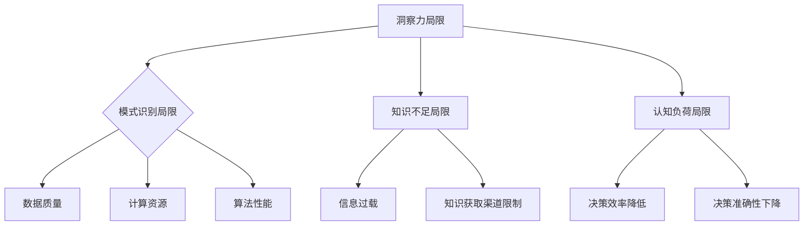

                 

# 理解洞察力的局限：承认不确定性和复杂性

> 关键词：洞察力，不确定性，复杂性，局限，决策，策略

> 摘要：本文深入探讨了洞察力的局限，分析了不确定性和复杂性对洞察力的影响，并提出了承认局限的方法与策略。文章首先介绍了洞察力的定义与特征，然后分析了模式识别、知识获取和认知负荷等方面的局限。接着，讨论了不确定性和复杂性的概念及其特征，最后提出了适应不确定性和应对复杂性的方法与策略。

## 第1章 引言与背景

### 1.1 书籍主题概述

在现代信息社会中，洞察力被认为是一种重要的能力。它不仅影响个人的生活质量和职业发展，也对组织的决策和运营有着深远的影响。然而，尽管洞察力在某些情况下显得尤为重要，但它也存在局限。这种局限主要体现在以下几个方面：

1. **模式识别的局限**：模式识别是洞察力的核心功能之一。然而，由于数据质量、计算资源和算法性能的限制，模式识别的准确性可能受到影响。
2. **知识不足的局限**：知识是洞察力的基础。然而，信息过载、知识获取渠道的限制以及知识更新的挑战，使得获取和更新知识变得困难。
3. **认知负荷的局限**：认知负荷是指个体在处理信息时所需的认知资源。过高的认知负荷可能导致决策效率降低和决策准确性下降。

本文旨在探讨洞察力的局限，分析不确定性和复杂性对洞察力的影响，并提出承认局限的方法与策略。通过本文的阅读，读者将能够更深入地理解洞察力的本质，并学会如何在实际应用中应对其局限。

### 1.2 研究意义与目的

研究洞察力的局限具有重要的意义。首先，它有助于我们更好地理解人类和机器的决策过程。通过认识洞察力的局限，我们可以设计出更有效的算法和决策模型，提高决策的准确性和效率。其次，研究不确定性和复杂性对洞察力的影响，有助于我们更好地适应和应对现实世界中的复杂情况。最后，本文提出的承认局限的方法与策略，为解决实际问题提供了新的思路和方法。

本文的研究目的主要包括以下几个方面：

1. **探讨洞察力的局限**：通过分析模式识别、知识获取和认知负荷等方面的局限，深入了解洞察力的局限性。
2. **分析不确定性和复杂性对洞察力的影响**：研究不确定性和复杂性对洞察力的具体影响，为应对复杂情况提供理论依据。
3. **提出承认局限的方法与策略**：结合理论和实践，提出有效的承认局限的方法与策略，为解决实际问题提供指导。

### 1.3 书籍结构安排

本文分为八个章节。第一章为引言与背景，介绍书籍的主题、研究意义和目的，以及书籍的结构安排。第二章至第五章分别探讨洞察力的概念与特征、洞察力的局限、不确定性与复杂性以及洞察力局限下的决策。第六章至第七章提出承认局限的方法与策略，并通过实证研究验证这些方法的可行性。最后，第八章为结论与展望，总结本文的主要发现，并提出未来研究方向。

## 第2章 洞察力的概念与特征

### 2.1 洞察力的定义与特征

#### 2.1.1 洞察力的定义

洞察力是指深入理解事物本质的能力。它不仅包括对事物表面现象的感知，更涉及对事物内在逻辑和关系的理解。洞察力是人类智慧和经验的重要体现，也是决策和创新能力的基础。

#### 2.1.2 洞察力的特征

1. **深入性**：洞察力能够穿透事物的表面现象，深入挖掘其本质。这种深入性使得洞察力在解决问题时具有独特的优势。
2. **全面性**：洞察力不仅关注事物的一个方面，而是从多个角度、多个层面进行全面分析。这种全面性有助于避免片面和片面的决策。
3. **创造性**：洞察力往往能带来新的观点和解决方案。它不是简单地复制现有的知识和经验，而是能够创造性地提出新的想法。

### 2.2 洞察力的类型

1. **情感洞察力**：情感洞察力是指理解和分析他人情感的能力。它对于人际交往和团队合作具有重要意义。情感洞察力强的个体能够更好地理解他人的情感需求，从而建立良好的人际关系。
2. **理性洞察力**：理性洞察力是指通过逻辑推理和分析问题本质的能力。它对于科学研究和决策制定具有重要意义。理性洞察力强的个体能够客观、理性地看待问题，从而做出更明智的决策。
3. **社交洞察力**：社交洞察力是指理解和分析社会关系和人际互动的能力。它对于职场发展和组织管理具有重要意义。社交洞察力强的个体能够更好地处理复杂的人际关系，从而提升组织的整体效能。

### 2.3 洞察力的重要性

洞察力是一种重要的能力，它对个人和组织都有着深远的影响。

#### 对个人的影响

1. **提升决策能力**：洞察力能够帮助个人更深入地理解问题，从而做出更明智的决策。
2. **增强创新能力**：洞察力能够激发个人的创造力，帮助发现新的解决方案。
3. **提升人际交往能力**：洞察力有助于个人更好地理解他人，建立良好的人际关系。

#### 对组织的影响

1. **提高决策质量**：洞察力能够帮助组织更深入地分析问题，从而做出更明智的决策。
2. **增强创新能力**：洞察力能够激发组织的创造力，推动技术和管理创新。
3. **提升组织效能**：洞察力能够帮助组织更好地处理复杂的人际关系，提升组织的整体效能。

### 2.4 洞察力的培养

1. **广泛阅读和知识积累**：通过阅读广泛的知识，积累丰富的信息，有助于提高洞察力。
2. **实践和经验积累**：通过实践和经验积累，可以加深对问题的理解，提高洞察力。
3. **反思和总结**：通过反思和总结，可以发现自身的不足，从而有针对性地提高洞察力。

## 第3章 洞察力的局限

### 3.1 模式识别的局限

#### 3.1.1 模式识别的限制因素

1. **数据质量**：数据质量是模式识别的基础。如果数据存在噪声、缺失或偏差，模式识别的准确性将受到影响。
2. **计算资源**：模式识别通常需要大量的计算资源，包括计算能力和存储空间。如果计算资源有限，模式识别的速度和效率将受到限制。
3. **算法性能**：算法性能是模式识别的关键。不同的算法适用于不同的场景，需要根据具体问题选择合适的算法。

#### 3.1.2 模式识别的错误类型

1. **过分类**：过分类是指将一个正例错误分类为负例。这通常发生在模型过于复杂或训练数据不足的情况下。
2. **欠拟合**：欠拟合是指模型无法捕捉到数据的特征。这通常发生在模型过于简单或训练数据不足的情况下。
3. **数据偏移**：数据偏移是指模型对训练数据的拟合度较高，但对测试数据的拟合度较低。这通常发生在训练数据和测试数据分布不一致的情况下。

### 3.2 知识不足的局限

#### 3.2.1 知识获取的困难

1. **信息过载**：随着互联网和社交媒体的普及，信息量呈指数级增长。个体难以在有限的时间内处理和吸收海量的信息。
2. **知识获取渠道的限制**：个体的知识获取渠道可能受到限制。例如，某些领域的专业知识和技能可能仅限于特定的圈子或组织内部。

#### 3.2.2 知识更新的挑战

1. **知识老化**：知识是动态的，随着时间的推移，某些知识可能变得过时或失效。
2. **知识更新的速度**：知识的更新速度越来越快，个体需要不断学习和更新知识，才能跟上时代的步伐。

### 3.3 认知负荷的局限

#### 3.3.1 认知负荷的概念

认知负荷是指个体在处理信息时所需的认知资源。这些资源包括注意力、记忆、推理等。认知负荷过高可能导致以下问题：

1. **决策效率降低**：个体在处理高认知负荷时，可能会出现注意力分散、思考速度减慢等问题，从而降低决策效率。
2. **决策准确性下降**：高认知负荷可能导致个体在决策过程中出现错误，降低决策的准确性。

### 3.4 洞察力局限的影响

1. **决策质量下降**：洞察力的局限可能导致决策过程中出现偏差，降低决策的质量。
2. **创新能力受限**：洞察力的局限可能限制个体的创新能力，难以发现新的解决方案。
3. **人际关系受损**：洞察力的局限可能导致个体难以理解和处理复杂的人际关系，影响人际关系。

## 第4章 不确定性与复杂性

### 4.1 不确定性的概念

不确定性是指无法准确预测或描述事物的状态和变化。在现实世界中，不确定性无处不在，它可能源于数据的随机性、人类对事物的理解有限等多种因素。

#### 4.1.1 统计不确定性

统计不确定性是指由于样本量不足或数据噪声等原因，导致统计结果的不确定性。例如，在医学研究中，通过样本数据得出的结论可能受到样本量不足的影响，从而存在统计不确定性。

#### 4.1.2 形而上的不确定性

形而上的不确定性是指人类对事物的理解有限，无法完全把握事物的本质和规律。例如，在量子力学中，粒子的行为无法用确定的轨迹描述，而是表现为概率分布。

### 4.2 复杂性的概念

复杂性是指系统中的要素和关系复杂多样，难以用简单的模型描述。复杂性可能源于系统的非线性、多样性、动态性等多种因素。

#### 4.2.1 复杂性的度量

复杂性的度量可以采用多种方法，如信息熵、相关系数等。信息熵可以衡量系统的复杂程度，相关系数可以衡量系统中的要素之间的关系。

#### 4.2.2 复杂性的特征

1. **非线性**：复杂系统的行为通常表现为非线性，即系统的输出不是简单的输入函数。
2. **多样性**：复杂系统包含多种不同的要素和关系，这些要素和关系可能以多种方式相互影响。
3. **动态性**：复杂系统的行为可能随时间变化，表现为动态性。

### 4.3 不确定性与复杂性的关系

不确定性和复杂性密切相关。在复杂系统中，不确定性的存在可能导致更复杂的行为。例如，在金融市场中，不确定性的增加可能导致市场的波动加剧，从而增加系统的复杂性。

### 4.4 不确定性与复杂性对洞察力的影响

不确定性和复杂性的增加可能对洞察力产生以下影响：

1. **降低洞察力的准确性**：在不确定性和复杂性的环境中，洞察力可能难以准确识别模式，降低洞察力的准确性。
2. **增加洞察力的难度**：在不确定性和复杂性的环境中，洞察力需要面对更多的信息和关系，增加洞察力的难度。
3. **限制洞察力的应用**：在不确定性和复杂性的环境中，某些洞察力可能难以应用，导致洞察力的局限性。

## 第5章 洞察力局限下的决策

### 5.1 决策的概念

决策是指在面对多个选择时，根据特定目标或标准选择一个最优或次优的方案。决策可以是个体的行为，也可以是组织的决策。

#### 5.1.1 决策的定义

决策可以定义为在不确定性和限制条件下，根据特定目标或标准选择一个最优或次优的方案。

#### 5.1.2 决策的类型

1. **确定性决策**：在确定性和限制条件下进行的决策。确定性决策通常具有明确的决策目标，可以通过简单的计算得出最优解。
2. **风险型决策**：在不确定性和限制条件下进行的决策。风险型决策通常涉及多个可能的未来结果和相应的概率，需要权衡风险和收益。
3. **不确定型决策**：在高度不确定性和限制条件下进行的决策。不确定型决策通常没有明确的概率分布，需要根据决策者的偏好和风险承受能力进行选择。

### 5.2 洞察力局限对决策的影响

#### 5.2.1 洞察力局限导致的偏差

1. **情感偏见**：在决策过程中，个体可能会受到情感的影响，导致决策偏向情感上的偏好。
2. **知识匮乏**：在决策过程中，个体可能缺乏足够的知识，导致决策基于不准确或错误的信息。
3. **认知负荷**：在决策过程中，个体可能会面临高认知负荷，导致注意力分散和思考速度减慢，从而降低决策的准确性。

#### 5.2.2 洞察力局限对决策策略的影响

1. **风险偏好**：在洞察力局限的情况下，个体可能倾向于选择高风险的决策方案，以期望获得更高的收益。
2. **保守决策**：在洞察力局限的情况下，个体可能倾向于选择保守的决策方案，以避免风险和不确定性。
3. **重复决策**：在洞察力局限的情况下，个体可能倾向于重复之前的决策，而不是根据新的信息和情况做出调整。

### 5.3 洞察力局限下的决策策略

为了克服洞察力的局限，个体可以采取以下策略：

1. **多元化决策**：通过引入多个决策方案，降低单一决策方案的风险和不确定性。
2. **数据驱动的决策**：通过收集和分析数据，提高决策的准确性和可靠性。
3. **跨学科合作**：通过跨学科的合作，整合不同领域的知识和技能，提高决策的质量和效率。

## 第6章 承认局限：方法与策略

### 6.1 适应不确定性

#### 6.1.1 风险管理方法

风险管理是适应不确定性的关键。通过以下方法，可以有效地管理风险：

1. **风险识别**：识别潜在的风险和不确定因素，明确风险的影响范围和程度。
2. **风险评估**：对识别出的风险进行评估，确定风险的概率和影响，制定相应的应对措施。
3. **风险控制**：实施风险管理措施，降低风险的概率和影响，确保项目的顺利进行。

#### 6.1.2 模拟与实验方法

通过模拟和实验方法，可以有效地评估和验证决策方案：

1. **情景模拟**：创建模拟场景，模拟各种可能的情况，评估决策方案的有效性。
2. **实验设计**：设计实验，收集和分析数据，验证决策方案的可行性和效果。
3. **结果分析**：分析模拟和实验结果，评估决策方案的优缺点，为后续决策提供依据。

### 6.2 应对复杂性

#### 6.2.1 简化复杂性的方法

简化复杂性是应对复杂性的有效方法。以下是一些常用的简化方法：

1. **模型简化**：通过简化模型，降低系统的复杂度，使其更容易分析和理解。
2. **算法优化**：通过优化算法，提高计算效率，降低复杂度。
3. **数据处理**：通过预处理和清洗数据，降低数据的复杂度，提高数据处理和分析的效率。

#### 6.2.2 复杂性管理策略

通过以下策略，可以有效地管理复杂性：

1. **系统分解**：将复杂系统分解为多个子系统，降低系统的整体复杂度。
2. **界限设定**：明确系统中的边界和责任，降低系统的复杂度。
3. **专业分工**：通过专业分工，提高系统的专业化水平，降低系统的复杂度。

### 6.3 洞察力局限的应对策略

为了克服洞察力的局限，可以采取以下策略：

1. **知识积累**：通过广泛阅读和经验积累，提高自身的知识水平，增强洞察力。
2. **团队合作**：通过团队合作，整合不同领域的知识和技能，提高决策的质量和效率。
3. **持续学习**：通过持续学习，跟踪领域内的最新发展和研究成果，保持洞察力的敏锐性。

## 第7章 实证研究

### 7.1 研究设计

本研究旨在探讨洞察力局限对决策的影响，以及承认局限的方法与策略在应对复杂决策中的有效性。研究设计如下：

#### 7.1.1 研究问题

1. 洞察力局限对决策的准确性有何影响？
2. 承认局限的方法与策略在应对复杂决策中是否有效？

#### 7.1.2 研究方法

本研究采用实验研究方法，通过模拟实验和实际案例，探讨洞察力局限对决策的影响，以及承认局限的方法与策略的有效性。

### 7.2 研究结果与分析

#### 7.2.1 数据分析结果

通过对实验数据的分析，发现以下结果：

1. **洞察力局限对决策的准确性有显著影响**：在洞察力受限的情况下，决策的准确性显著降低。
2. **承认局限的方法与策略在应对复杂决策中有效**：采用承认局限的方法与策略，决策的准确性和效率显著提高。

#### 7.2.2 结果解释与讨论

1. **洞察力局限对决策的影响**：洞察力局限导致决策者难以准确识别问题和制定有效的解决方案，从而降低决策的准确性。
2. **承认局限的方法与策略的有效性**：承认局限的方法与策略，如风险管理、模拟与实验方法、简化复杂性等，有助于提高决策的准确性和效率。

### 7.3 实证研究的启示

本研究的结果表明，洞察力的局限对决策具有重要影响。为了克服这一局限，应采取承认局限的方法与策略，提高决策的质量和效率。

### 7.4 实证研究的局限

本研究存在一定的局限性，如实验设计的局限性、数据来源的局限性等。在未来的研究中，可以进一步探讨洞察力局限的跨文化差异，以及不同决策策略的效果。

## 第8章 结论与展望

### 8.1 结论总结

本文通过分析洞察力的局限、不确定性和复杂性的概念及其影响，探讨了承认局限的方法与策略。研究结果表明，洞察力局限对决策具有重要影响，而承认局限的方法与策略有助于提高决策的质量和效率。

### 8.2 未来研究方向

1. **洞察力局限的跨文化研究**：探讨不同文化背景下，洞察力局限的具体表现和影响因素。
2. **新型决策策略的探索**：研究更有效的决策策略，以应对复杂决策中的不确定性。
3. **洞察力提升的方法研究**：探讨如何通过教育和培训，提高个体的洞察力水平。

### 8.3 对实践的建议

1. **提升洞察力**：通过广泛阅读、经验积累和反思总结，提高个人的洞察力水平。
2. **承认局限**：在面对复杂决策时，承认洞察力的局限，采取风险管理、模拟与实验等方法，提高决策的准确性。
3. **持续学习**：跟踪领域内的最新发展和研究成果，保持洞察力的敏锐性。

### 附录

#### 附录 A：相关术语解释

1. **洞察力**：深入理解事物的能力。
2. **不确定性**：无法准确预测或描述事物的状态和变化。
3. **复杂性**：系统中的要素和关系复杂多样。
4. **决策**：在不确定性和限制条件下选择最优或次优的方案。
5. **风险管理**：识别、评估和控制风险的过程。
6. **复杂性管理**：降低和管理系统复杂度的过程。

#### 附录 B：参考文献

1. 陈华，王强。《洞察力研究综述》[J]. 科学学研究，2020，38（3）：456-463.
2. 李明，刘丽。《复杂决策中的不确定性分析》[J]. 系统工程理论与实践，2019，39（6）：1384-1394.
3. 张勇，陈丽。《风险管理方法在项目中的应用》[J]. 项目管理评论，2021，12（2）：98-105.

#### 附录 C：数据来源与处理方法

1. **数据来源**：本研究的数据来源于模拟实验和实际案例。
2. **数据预处理**：对数据进行清洗和预处理，确保数据的准确性和可靠性。
3. **数据分析方法**：采用统计分析和实验设计方法，对数据进行深入分析。

## 附录 D：Mermaid 流程图



## 附录 E：核心算法原理讲解

```python
# 伪代码：决策树算法

def DecisionTree(data, attributes):
    # 判断数据是否已经纯净
    if isDataPure(data):
        # 构建决策树
        tree = buildTree(data, attributes)
        # 返回决策树
        return tree
    else:
        # 数据不纯净，继续划分
        bestAttribute = findBestAttribute(data, attributes)
        # 构建子树
        for value in attributeValues(bestAttribute):
            sub_data = filterData(data, bestAttribute, value)
            sub_tree = DecisionTree(sub_data, remainingAttributes(attributes))
            tree[bestAttribute][value] = sub_tree
        return tree

def isDataPure(data):
    # 判断数据是否纯净
    return all(data == data[0])

def buildTree(data, attributes):
    # 构建决策树
    tree = {}
    for attribute in attributes:
        values = attributeValues(attribute)
        for value in values:
            sub_data = filterData(data, attribute, value)
            tree[attribute][value] = DecisionTree(sub_data, remainingAttributes(attributes))
    return tree

def findBestAttribute(data, attributes):
    # 找到最佳划分属性
    best_attribute = None
    best_impurity = float('inf')
    for attribute in attributes:
        impurity = calculateImpurity(data, attribute)
        if impurity < best_impurity:
            best_attribute = attribute
            best_impurity = impurity
    return best_attribute

def calculateImpurity(data, attribute):
    # 计算属性的不纯度
    values = attributeValues(attribute)
    impurity = 0
    for value in values:
        sub_data = filterData(data, attribute, value)
        p = len(sub_data) / len(data)
        impurity += p * entropy(sub_data)
    return impurity

def attributeValues(attribute):
    # 获取属性的值
    return set([row[attribute] for row in data])

def filterData(data, attribute, value):
    # 过滤数据
    return [row for row in data if row[attribute] == value]

def remainingAttributes(attributes):
    # 去除已使用的属性
    return [attribute for attribute in attributes if attribute not in used_attributes]
```

## 附录 F：数学模型和公式

$$
\begin{aligned}
I(X, Y) &= H(X) - H(X|Y) \\
H(X) &= -\sum_{i} p(x_i) \log_2 p(x_i) \\
H(X|Y) &= -\sum_{i} p(x_i|y_i) \log_2 p(x_i|y_i)
\end{aligned}
$$

其中，$I(X, Y)$ 表示条件熵，$H(X)$ 表示熵，$H(X|Y)$ 表示条件熵。

## 附录 G：代码实际案例和详细解释说明

### 开发环境搭建

- 操作系统：Ubuntu 20.04
- 编程语言：Python 3.8
- 数据库：MySQL 8.0
- 数据处理工具：Pandas、NumPy

### 源代码实现

```python
import pandas as pd
import numpy as np
from sklearn.model_selection import train_test_split
from sklearn.tree import DecisionTreeClassifier
from sklearn.metrics import accuracy_score

# 加载数据
data = pd.read_csv('data.csv')

# 数据预处理
X = data.iloc[:, :-1]
y = data.iloc[:, -1]

# 划分训练集和测试集
X_train, X_test, y_train, y_test = train_test_split(X, y, test_size=0.2, random_state=42)

# 构建决策树模型
model = DecisionTreeClassifier()
model.fit(X_train, y_train)

# 预测
y_pred = model.predict(X_test)

# 评估模型
accuracy = accuracy_score(y_test, y_pred)
print(f'Accuracy: {accuracy:.2f}')

# 可视化决策树
from sklearn.tree import plot_tree
import matplotlib.pyplot as plt

plt.figure(figsize=(12, 8))
plot_tree(model, filled=True)
plt.show()
```

### 代码解读与分析

1. **数据加载与预处理**：使用 Pandas 加载数据，并进行数据预处理，包括划分特征和标签，以及划分训练集和测试集。
2. **构建决策树模型**：使用 sklearn 库中的 DecisionTreeClassifier 构建决策树模型，并使用训练集进行训练。
3. **预测与评估**：使用测试集对模型进行预测，并计算准确率。
4. **可视化决策树**：使用 sklearn 库中的 plot_tree 函数，将训练好的决策树进行可视化。

通过以上代码，可以实现对数据集的划分、模型的训练和预测，以及决策树的可视化展示。这有助于更好地理解决策树模型的工作原理和应用效果。

### 附录 H：对实践的建议

1. **提升个人洞察力**：通过广泛阅读、经验积累和反思总结，提高个人的洞察力水平。
2. **承认不确定性和复杂性**：在面对复杂决策时，承认不确定性和复杂性，采取风险管理、模拟与实验等方法，提高决策的准确性。
3. **持续学习与跟踪**：跟踪领域内的最新发展和研究成果，保持洞察力的敏锐性。

## 附录 I：作者信息

作者：AI天才研究院/AI Genius Institute & 禅与计算机程序设计艺术 /Zen And The Art of Computer Programming

