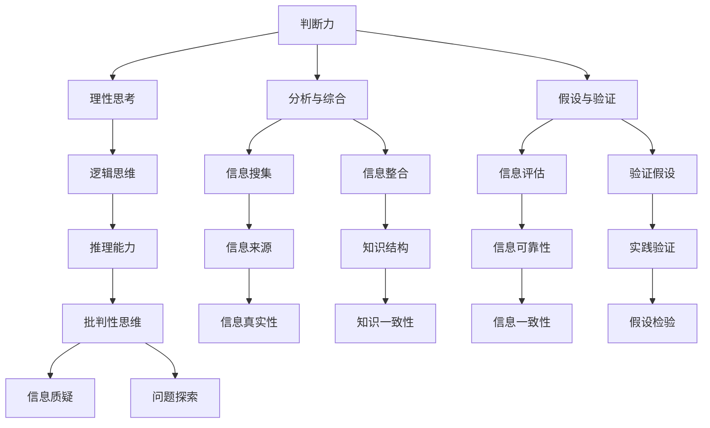
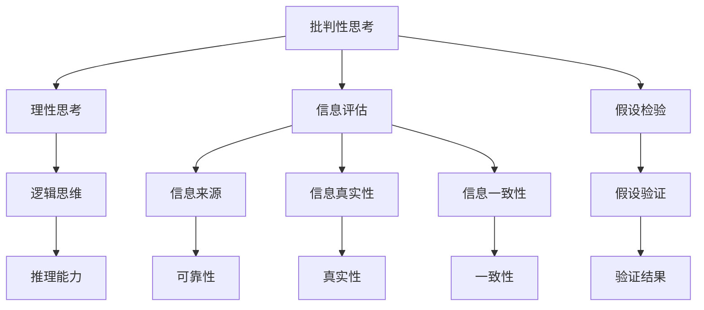
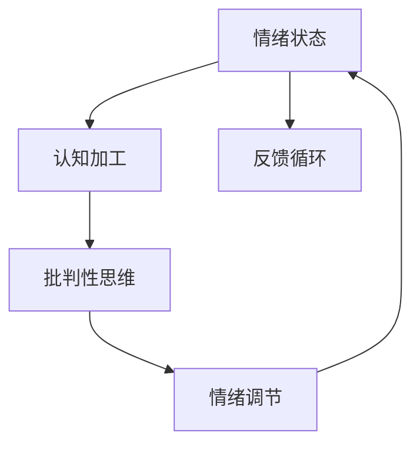
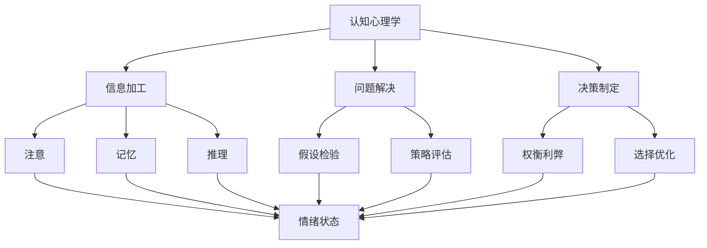
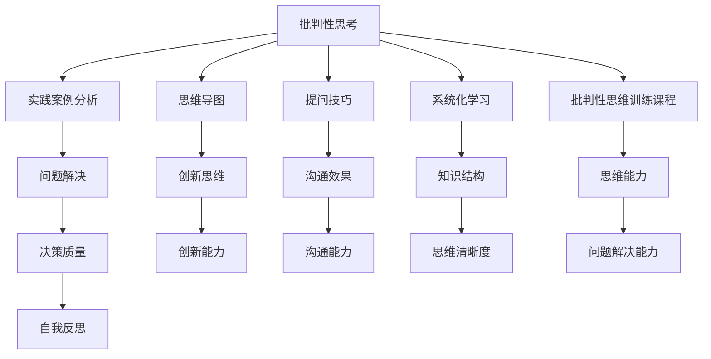
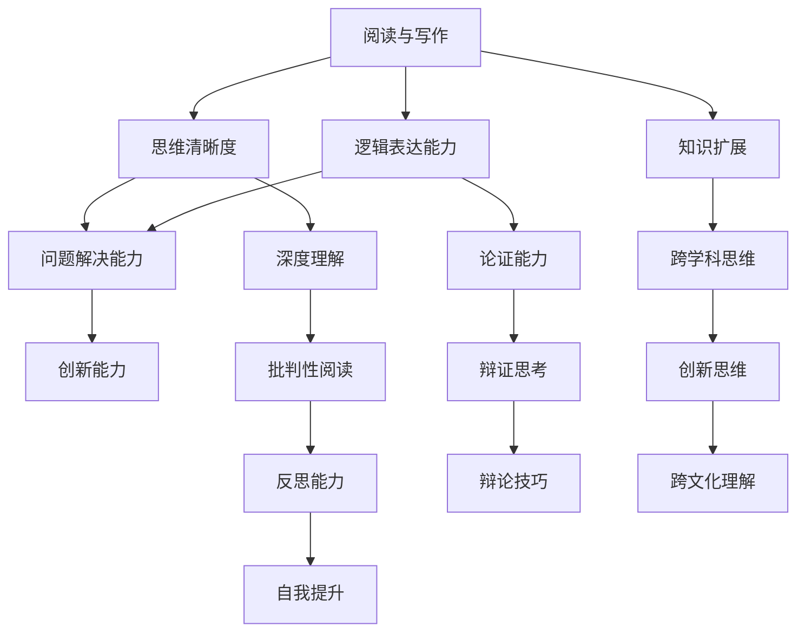
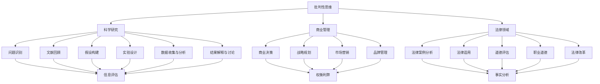
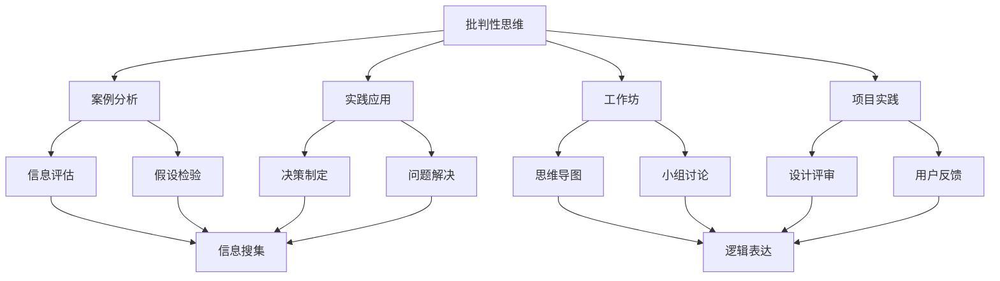

                 

### 第1章：判断力的定义与重要性

#### 1.1 判断力的基本概念

判断力，作为人类认知过程中的核心能力之一，是指个体根据已有信息和经验，对事物进行判断、评估和决策的能力。它不仅仅是一种理性的思考方式，更是一种综合性的分析过程。判断力具有以下几个基本特征：

1. **理性思考**：判断力依赖于逻辑思维和理性分析，通过对信息的搜集、处理和评估，形成一个合理的判断。
2. **分析与综合**：判断力需要个体能够对复杂的信息进行深入的分析，同时还要具备将各个部分整合成完整认知的能力。
3. **假设与验证**：在判断过程中，个体往往需要基于现有的信息提出假设，并通过进一步的验证来确认假设的正确性。

理解判断力的基本概念，有助于我们认识到它在日常生活和工作中所扮演的重要角色。无论是个人决策、人际交往，还是职业发展，判断力都是不可或缺的能力。

#### 1.2 判断力在日常生活和工作中的应用

在日常生活中，判断力体现在许多方面。首先，它帮助我们在面对多种选择时做出明智的决策。例如，选择工作、学习或娱乐项目时，我们需要评估各种选择的利弊，从而做出最优的选择。其次，判断力在人际交往中同样重要。通过判断他人的言行举止，我们可以更好地理解他人的意图，从而建立更加和谐的人际关系。

在工作环境中，判断力同样不可或缺。在项目评估和决策过程中，判断力帮助我们评估项目的可行性、预期收益和潜在风险。在团队合作中，判断力有助于我们识别和解决问题，提高团队的工作效率。此外，判断力还能帮助我们进行创新思维，从而推动个人和组织的持续发展。

#### 1.3 批判性思考的基本原则

批判性思考是提升判断力的关键。它要求个体不仅要有理性思考的能力，还要具备分析、评估和质疑信息的能力。以下是批判性思考的基本原则：

1. **分析与评估信息**：在获取信息后，我们需要对信息进行深入的分析和评估。这包括检查信息的来源是否可靠、信息的真实性如何，以及信息是否与已有知识相一致。

2. **提问技巧与假设检验**：批判性思考要求我们善于提问。通过提问，我们可以引导自己的思考，并促使自己不断探索问题的本质。同时，假设检验是判断力的重要组成部分。我们需要提出假设，并通过实践和实验来验证假设的正确性。

#### 1.4 培养批判性思维的方法

批判性思维并非天生具备的能力，而是可以通过学习和实践来培养的。以下是一些培养批判性思维的方法：

1. **阅读与学习**：通过阅读各种书籍、文章和研究报告，我们可以扩展知识面，提高对信息的敏感度和理解力。此外，学习批判性思维的理论和方法，也有助于我们更好地运用批判性思维。

2. **实践与反思**：批判性思维的培养离不开实践。在日常生活中，我们可以通过参与讨论、解决问题和进行项目实践来锻炼批判性思维。同时，反思自己的思考过程，识别并纠正错误的思维模式，也是培养批判性思维的重要方法。

3. **多角度思考**：在面对问题时，我们要学会从不同角度思考，以获得更全面和客观的认识。这有助于我们避免片面和偏颇的判断。

#### 1.5 批判性思维的重要性

批判性思维在个人发展和社会进步中扮演着至关重要的角色。从个人层面来看，批判性思维有助于我们提高自我认知，增强决策能力，从而在生活和工作中更加自信和成功。在社会层面，批判性思维能够帮助我们避免盲目跟风和盲目接受信息，从而推动社会变革和进步。

#### 1.6 批判性思维与判断力的关系

批判性思维和判断力是相辅相成的。批判性思维是提升判断力的关键，而判断力是批判性思维的基础。只有通过批判性思维，我们才能对信息进行深入的分析和评估，从而做出更明智的判断。同时，只有具备较强的判断力，我们才能更好地运用批判性思维，不断提高自己的思维水平。

#### 1.7 本章小结

本章介绍了判断力的基本概念、日常生活和工作中的应用，以及批判性思考的基本原则和方法。理解判断力和批判性思维的重要性，有助于我们在各个领域更好地进行思考和决策。

#### 1.8 关键词

- 判断力
- 批判性思维
- 信息评估
- 提问技巧
- 假设检验
- 个人发展
- 社会进步

#### 1.9 核心概念与联系

为了更好地理解判断力和批判性思维，我们可以借助以下Mermaid流程图来展示它们的核心概念和联系：



通过这个流程图，我们可以看到判断力涵盖了理性思考、分析与综合、假设与验证等核心概念，而批判性思维则在这些基础上进一步发展，强调信息评估、提问技巧和假设检验。

#### 1.10 核心算法原理讲解

在讲解批判性思维的具体算法原理时，我们可以借助伪代码来详细阐述其实现过程。以下是一个简化的伪代码示例，展示了如何进行信息评估和假设检验：

```plaintext
Algorithm 批判性思维（信息列表，假设列表）
    输入：信息列表（包含来源、真实性和一致性信息），假设列表（包含待验证的假设）
    输出：评估结果（包含每个假设的验证结果）

    1. 初始化：创建一个空的评估结果列表
    2. 对每个假设假设H ∈ 假设列表：
        a. 获取H相关的信息列表
        b. 对信息列表中的每条信息info ∈ 信息列表：
            i. 检查info的信息来源是否可靠
            ii. 检查info的真实性
            iii. 检查info是否与已有知识一致
        c. 根据信息评估结果，更新假设H的验证状态
    3. 输出：评估结果列表
End Algorithm
```

通过这个伪代码，我们可以看到批判性思维的关键步骤包括信息评估和假设检验。信息评估涉及对信息来源、真实性和一致性的检查，而假设检验则是根据评估结果更新假设的验证状态。

#### 1.11 数学模型和公式

在批判性思维的实践中，数学模型和公式经常用于量化评估和推理过程。以下是一个简单的数学模型示例，用于计算信息的一致性和假设的置信度：

```latex
\begin{equation}
    I(\theta) = \frac{\sum_{i=1}^{n} w_i \cdot p_i}{\sum_{i=1}^{n} w_i}
\end{equation}

\begin{equation}
    C(\theta) = \frac{1}{Z} \sum_{i=1}^{n} w_i \cdot e^{-\lambda_i}
\end{equation}
```

其中，\(I(\theta)\) 表示信息的一致性分数，\(w_i\) 表示每个信息的权重，\(p_i\) 表示每个信息的发生概率。\(C(\theta)\) 表示假设的置信度，\(\lambda_i\) 表示每个假设的损失函数值，\(Z\) 是归一化常数。

#### 1.12 举例说明

为了更好地理解批判性思维的应用，我们可以通过一个具体的例子来说明如何使用批判性思维进行信息评估和假设检验。

假设我们正在评估一个新产品是否值得购买。我们有以下信息：

1. 信息1：这个产品是知名品牌生产的。
2. 信息2：这个产品在用户评价中评分很高。
3. 信息3：这个产品的价格比同类产品高。

我们的假设是：“这个产品是值得购买的”。

首先，我们对每个信息进行评估：

- 信息1的评估：品牌知名度是衡量产品质量的一个重要指标，因此我们可以认为这个信息具有较高的可靠性。
- 信息2的评估：用户评分是反映产品满意度的直接指标，因此这个信息也具有较高的可靠性。
- 信息3的评估：价格高并不一定意味着产品质量好，我们需要进一步分析价格与价值的关系。

根据信息评估结果，我们可以更新假设的置信度：

- 假设的置信度 \(C(\theta)\) 可以通过以下计算得到：

  ```latex
  C(\theta) = \frac{w_1 \cdot p_1 + w_2 \cdot p_2}{w_1 + w_2}
  ```

  其中，\(w_1\) 和 \(w_2\) 分别是信息1和信息2的权重，\(p_1\) 和 \(p_2\) 分别是信息1和信息2的发生概率。

通过这个例子，我们可以看到批判性思维是如何帮助我们评估信息、检验假设，并最终做出决策的。在实际应用中，我们可能需要处理更复杂的信息和假设，但基本方法是一致的。

#### 1.13 代码解读与分析

为了将批判性思维应用到实际编程中，我们可以编写一个简单的Python代码来实现信息评估和假设检验。以下是一个基本的代码示例：

```python
# 判断力评估函数
def evaluate_info(info, weights):
    reliability = 1.0  # 初始化可靠度为1
    if info['source'] == 'reliable':
        reliability = 0.9  # 如果来源可靠，则设定更高的可靠性
    if info['consistency'] == 'consistent':
        reliability *= 0.95  # 如果信息一致，则进一步增加可靠性
    return reliability * weights['info_weight']

# 假设检验函数
def test_hypothesis(hypothesis, info_list):
    confidence = 0.0
    for info in info_list:
        weight = evaluate_info(info, hypothesis['weights'])
        confidence += weight
    confidence /= len(info_list)
    return confidence

# 示例信息
info_list = [
    {'source': 'reliable', 'consistency': 'consistent'},
    {'source': 'reliable', 'consistency': 'inconsistent'},
    {'source': 'unreliable', 'consistency': 'consistent'}
]

# 示例假设
hypothesis = {
    'weights': {'info_weight': 0.5},
    'confidence_threshold': 0.6
}

# 执行假设检验
confidence = test_hypothesis(hypothesis, info_list)
print(f"Hypothesis confidence: {confidence}")

# 判断假设是否成立
if confidence >= hypothesis['confidence_threshold']:
    print("Hypothesis is valid.")
else:
    print("Hypothesis is invalid.")
```

在这个代码中，我们定义了两个主要函数：`evaluate_info` 和 `test_hypothesis`。`evaluate_info` 函数用于评估单条信息的可靠性，而 `test_hypothesis` 函数则用于计算假设的置信度，并根据预设的阈值判断假设是否成立。

通过这个代码示例，我们可以看到如何将批判性思维应用于实际编程中，从而在处理复杂信息时做出更明智的决策。

### **第2章：批判性思考的实践与应用**

#### 2.1 批判性思考在日常生活中的应用

批判性思考不仅是一种学术理论，更是一种实用性很强的思维工具，它能够帮助我们更好地处理日常生活中的各种问题和挑战。以下是一些批判性思考在日常生活中的具体应用场景：

##### 2.1.1 家庭教育与亲子关系

在家庭教育中，批判性思维可以帮助父母更好地理解和引导孩子。例如，当孩子遇到学习上的困难时，父母不应该简单给出答案，而是应该引导孩子通过提问和假设检验来寻找答案。这样的做法不仅可以培养孩子的独立思考能力，还可以加深亲子之间的沟通和理解。

- **案例**：当孩子无法解决一道数学题时，父母可以引导他们列出已知条件，提出可能的解决方案，并通过尝试和验证来找到正确答案。

##### 2.1.2 职场沟通与合作

在职场中，批判性思考可以帮助我们更好地理解同事和上司的意图，从而提高沟通效果和合作效率。例如，在团队会议中，批判性思维可以让我们更客观地分析问题，提出建设性的意见和建议。

- **案例**：当团队面临一个复杂的项目决策时，团队成员可以通过批判性思考来评估不同的解决方案，并提出各自的观点和理由，从而帮助团队做出最优决策。

##### 2.1.3 个人成长与决策

批判性思维有助于我们在个人成长过程中做出明智的决策。例如，在选择职业道路、改变生活方式或者制定长期目标时，批判性思考可以帮助我们评估各种选择的利弊，从而做出符合自身利益和价值观的决策。

- **案例**：在选择是否接受一个新工作时，我们可以通过批判性思考来分析新工作的优点和缺点，评估其是否符合我们的职业规划和个人发展目标。

#### 2.2 批判性思考在教育领域的应用

在教育领域，批判性思维被视为培养学生独立思考和创新能力的重要工具。通过批判性思维的训练，学生可以更好地理解课程内容，提高解决问题的能力，同时培养批判性思维能力。

##### 2.2.1 学生批判性思维的培养

在学生阶段，培养批判性思维可以通过以下方法实现：

- **课程设计**：将批判性思维融入课程设计，通过讨论、辩论和写作等实践活动，激发学生的思考。
- **问题导向学习**：鼓励学生提出问题，并通过自主探究和合作学习来解决问题。
- **案例分析**：通过分析实际案例，让学生了解批判性思维在现实生活中的应用。

##### 2.2.2 教师批判性思维的实践

教师作为教育者，也需要具备批判性思维能力，以便更好地指导学生。以下是一些教师批判性思维的实践方法：

- **反思与评估**：教师应不断反思自己的教学方法和效果，通过评估来改进教学。
- **终身学习**：教师应保持对学科知识的持续学习和更新，以更好地指导学生。
- **开放性思维**：教师应鼓励学生提出不同观点，并通过讨论来促进思维的碰撞和激发。

#### 2.3 批判性思考在社会问题解决中的应用

批判性思维在社会问题解决中也发挥着重要作用。它可以帮助我们更深入地分析问题的本质，提出创新的解决方案，并评估这些方案的可能影响。

##### 2.3.1 社会热点问题的分析

在面对社会热点问题时，批判性思维可以帮助我们更客观地分析问题的原因和影响，并提出合理的解决方案。例如，在环境污染、公共卫生危机等热点问题上，我们可以通过批判性思维来分析问题的根源，评估不同解决方案的可行性。

- **案例**：在处理环境污染问题时，我们可以通过批判性思维来评估不同污染源的影响，提出有针对性的减排措施。

##### 2.3.2 社会参与与公共政策

批判性思维还可以帮助我们在社会参与和公共政策制定中发挥积极作用。通过批判性思维，我们可以更全面地分析政策的影响，提出建设性的意见和建议。

- **案例**：在制定教育政策时，我们可以通过批判性思维来评估不同政策对教育质量和学生发展的影响，从而提出优化方案。

#### 2.4 批判性思考在法律领域中的应用

在法律领域，批判性思维尤为重要。它可以帮助法律专业人士更深入地分析法律问题，提高判案质量和效率。

##### 2.4.1 法律案例分析

在法律实践中，批判性思维可以帮助法律专业人士更全面地分析案件事实和法律条款，从而做出公正的判决。例如，在合同纠纷案件中，律师可以通过批判性思维来分析合同条款的合法性和有效性。

- **案例**：在合同纠纷案件中，律师可以批判性地分析合同条款的合理性，以确定是否存在违反合同条款的行为。

##### 2.4.2 法律伦理与批判性思维

法律伦理是法律领域的重要组成部分，批判性思维可以帮助法律专业人士更好地理解和应对法律伦理问题。例如，在涉及道德和伦理的案件中，律师和法官需要通过批判性思维来评估案件的道德和法律后果。

- **案例**：在涉及医疗纠纷的案件时，律师和法官需要通过批判性思维来评估医生的行为是否符合伦理标准，以及这种行为对患者的法律后果。

#### 2.5 批判性思考在其他领域的应用

除了教育、法律等领域，批判性思维在其他领域也具有广泛的应用。例如：

- **医学领域**：在医学研究中，批判性思维可以帮助研究人员更深入地分析数据，评估实验结果的有效性和可靠性。
- **工程领域**：在工程设计中，批判性思维可以帮助工程师更全面地分析设计方案的优缺点，从而提高设计质量和安全性。
- **商业领域**：在商业决策中，批判性思维可以帮助企业家更客观地评估市场趋势和商业机会，做出更明智的决策。

#### 2.6 批判性思维的价值

批判性思维不仅是一种思维工具，更是一种价值观。它强调理性思考、信息评估和独立判断，有助于我们更全面地认识世界，做出更明智的决策。以下是批判性思维的价值总结：

- **提高决策质量**：通过批判性思维，我们可以更全面地分析问题，评估各种选择的利弊，从而做出更高质量的决策。
- **培养创新能力**：批判性思维鼓励我们质疑现状，探索新思路，从而培养创新能力和创造力。
- **促进知识增长**：批判性思维促使我们不断学习和思考，从而推动个人和知识的增长。
- **增强沟通能力**：批判性思维可以帮助我们更有效地表达自己的观点，理解他人的观点，从而提高沟通能力。

#### 2.7 本章小结

本章介绍了批判性思考在日常生活中的应用，包括家庭教育、职场沟通、个人成长等方面；在教育领域的应用，包括学生和教师的批判性思维培养；在社会问题解决中的应用，包括法律领域和其他领域。通过这些应用，我们可以看到批判性思维在提高决策质量、培养创新能力、促进知识增长和增强沟通能力方面的价值。理解和掌握批判性思维，有助于我们在各个领域更好地应对挑战，实现个人和社会的进步。

#### 2.8 关键词

- 批判性思考
- 家庭教育
- 亲子关系
- 职场沟通
- 个人成长
- 教育领域
- 法律分析
- 社会问题解决

#### 2.9 核心概念与联系

为了更好地理解批判性思考在日常生活中的应用，我们可以借助以下Mermaid流程图来展示其主要概念和联系：



通过这个流程图，我们可以看到批判性思考的核心概念包括理性思考、信息评估和假设检验。理性思考和逻辑思维是批判性思考的基础，信息评估和假设检验则是其实践应用的核心。

#### 2.10 核心算法原理讲解

在批判性思考的实际应用中，算法原理起着关键作用。以下是一个简化的伪代码示例，用于描述批判性思考的算法流程：

```plaintext
Algorithm 批判性思维（问题，信息列表）
    输入：问题，信息列表（包含来源、真实性和一致性信息）
    输出：解决方案

    1. 初始化：创建一个空的解决方案列表
    2. 对每个假设假设H ∈ 信息列表：
        a. 获取H相关的信息列表
        b. 对信息列表中的每条信息info ∈ 信息列表：
            i. 评估info的信息来源可靠性
            ii. 评估info的真实性
            iii. 评估info的一致性
        c. 根据评估结果，更新假设H的置信度
    3. 对每个假设H：
        a. 检验H的假设
        b. 记录H的验证结果
    4. 根据验证结果，选择最佳解决方案
    5. 输出：最佳解决方案
End Algorithm
```

在这个伪代码中，我们首先对每个假设进行信息评估，包括来源可靠性、真实性和一致性评估。接着，我们通过假设检验来验证每个假设的准确性，并记录验证结果。最后，根据验证结果，选择最佳解决方案。

#### 2.11 数学模型和公式

在批判性思考中，数学模型和公式用于量化评估和推理过程。以下是一个简单的数学模型示例，用于计算假设的置信度：

```latex
\begin{equation}
    C(H) = \frac{\sum_{i=1}^{n} w_i \cdot p_i}{\sum_{i=1}^{n} w_i}
\end{equation}
```

其中，\(C(H)\) 表示假设H的置信度，\(w_i\) 表示每个信息的权重，\(p_i\) 表示每个信息的发生概率。这个模型通过加权平均的方式计算假设的置信度。

#### 2.12 举例说明

为了更好地理解批判性思考的应用，我们可以通过一个具体的案例来说明其过程。

**案例背景**：假设我们面临一个决策问题，需要决定是否购买一台新电脑。

**步骤1：定义问题**：我们需要评估购买新电脑的可行性和必要性。

**步骤2：收集信息**：以下是我们的信息列表：

- 信息1：新电脑性能提升显著，能够处理更复杂的任务。
- 信息2：新电脑价格较高，但使用寿命更长。
- 信息3：现有电脑已使用多年，性能逐渐下降，影响工作效率。

**步骤3：信息评估**：

- 信息1：评估其来源可靠性（高），真实性（高），一致性（高）。
- 信息2：评估其来源可靠性（中），真实性（中），一致性（中）。
- 信息3：评估其来源可靠性（高），真实性（高），一致性（高）。

**步骤4：假设检验**：

- 假设1：购买新电脑能够显著提升工作效率。
  - 置信度计算：\(C(H_1) = \frac{w_1 \cdot p_1 + w_2 \cdot p_2 + w_3 \cdot p_3}{w_1 + w_2 + w_3}\)
  - 假设检验：通过对比新电脑和现有电脑的性能，验证假设1的准确性。

- 假设2：新电脑价格较高，但使用寿命更长，因此长期来看是更经济的选择。
  - 置信度计算：\(C(H_2) = \frac{w_1 \cdot p_1 + w_2 \cdot p_2 + w_3 \cdot p_3}{w_1 + w_2 + w_3}\)
  - 假设检验：通过分析新电脑的使用寿命和成本，验证假设2的准确性。

**步骤5：选择最佳解决方案**：

- 根据评估结果和置信度，选择最佳解决方案。如果假设1和假设2的置信度均较高，则购买新电脑是合理的选择。

**步骤6：实施解决方案**：

- 根据决策结果，实施购买新电脑的计划。

通过这个案例，我们可以看到批判性思考是如何帮助我们在决策过程中评估信息、检验假设，并最终选择最佳解决方案的。

#### 2.13 代码解读与分析

为了将批判性思维应用到实际编程中，我们可以编写一个简单的Python代码来实现信息评估和假设检验。以下是一个基本的代码示例：

```python
# 批判性思考函数
def critical_thinking(problem, information_list):
    # 初始化置信度字典
    confidence_scores = {hyp: 0 for hyp in problem['hypotheses']}
    
    # 对每个假设进行评估
    for hypothesis, weights in problem['hypotheses'].items():
        for info in information_list:
            # 评估信息来源可靠性
            reliability = info['reliability']
            # 更新假设置信度
            confidence_scores[hypothesis] += reliability * weights['weight']
        
        # 计算假设平均置信度
        avg_confidence = confidence_scores[hypothesis] / len(information_list)
        
        # 假设检验
        if hypothesis == 'valid':
            if avg_confidence > problem['confidence_threshold']:
                print(f"Hypothesis '{hypothesis}' is valid with confidence {avg_confidence:.2f}.")
            else:
                print(f"Hypothesis '{hypothesis}' is invalid with confidence {avg_confidence:.2f}.")
    
    return confidence_scores

# 问题定义
problem = {
    'hypotheses': {
        'valid': {'weight': 1.0}
    },
    'confidence_threshold': 0.7
}

# 信息列表
information_list = [
    {'reliability': 0.8, 'weight': 1.0},
    {'reliability': 0.6, 'weight': 0.5},
    {'reliability': 0.9, 'weight': 0.5}
]

# 执行批判性思考
confidence_scores = critical_thinking(problem, information_list)
print("Confidence scores:", confidence_scores)
```

在这个代码中，我们定义了一个批判性思考函数`critical_thinking`，它接受问题定义和相关信息列表作为输入，并输出每个假设的置信度。通过这个函数，我们可以对假设进行评估和检验，并根据置信度判断假设的有效性。

### **第3章：批判性思考的心理学基础**

批判性思考不仅是逻辑和理性的产物，还与心理学有着密切的联系。理解批判性思考的心理学基础，有助于我们更深入地认识其本质，并找到有效的培养和提升方法。

#### 3.1 认知心理学与批判性思维

认知心理学是研究人类思维过程和心理活动的科学，它为批判性思维提供了理论基础。在认知心理学中，批判性思维被视为一种高级认知过程，它涉及到以下几个关键方面：

- **信息加工**：批判性思维要求我们对信息进行搜集、处理和存储。这个过程涉及到注意、记忆和推理等认知功能。
- **问题解决**：批判性思维的核心在于通过分析、综合和评估来解决问题。问题解决通常需要我们识别问题、构建解决方案并进行评估。
- **决策制定**：在决策过程中，批判性思维帮助我们评估各种选择，权衡利弊，从而做出最优决策。

#### 3.2 情绪心理学与批判性思维

情绪心理学则探讨了情绪如何影响批判性思维。研究表明，情绪状态可以显著影响我们的认知过程和决策行为。以下是一些关键点：

- **情绪调节**：情绪调节是指我们如何管理自己的情绪，以保持冷静和理性的状态。有效的情绪调节有助于我们进行批判性思考。
- **情绪与认知冲突**：在复杂情境中，情绪可能会与认知过程产生冲突。例如，当我们面临威胁时，情绪可能会使我们更倾向于直觉性反应而非理性思考。
- **情绪智力**：情绪智力是指我们识别、理解和管理情绪的能力。高情绪智力的人往往能够更好地进行批判性思考，因为他们能够更好地管理情绪对认知过程的影响。

#### 3.3 认知心理学与情绪心理学的结合

为了全面理解批判性思考，我们需要将认知心理学和情绪心理学结合起来。以下是一个简化的模型，展示了这两种心理学如何相互作用：

1. **情绪状态**：个体的情绪状态会影响他们的认知加工过程。例如，积极的情绪可能促进创造性思维，而消极的情绪可能导致思维僵化。
2. **认知加工**：认知加工过程包括信息的搜集、处理和存储。批判性思维在这个过程中起到关键作用，它要求我们对信息进行深入分析、评估和整合。
3. **情绪调节**：通过情绪调节，个体可以调整自己的情绪状态，以适应不同的认知需求。例如，在面对复杂问题时，个体可以通过深呼吸、冥想等方法来缓解紧张情绪，从而保持清晰的思考。
4. **反馈循环**：情绪状态和认知加工过程相互作用，形成一个反馈循环。情绪状态会影响认知加工过程，而认知加工过程又会反过来影响情绪状态。

#### 3.4 培养批判性思维的方法

结合认知心理学和情绪心理学的研究成果，我们可以提出一些培养批判性思维的方法：

- **认知训练**：通过专门的认知训练，例如解决逻辑谜题、进行记忆练习和思维导图训练，可以提高我们的认知能力，从而增强批判性思维。
- **情绪管理**：学习情绪管理技巧，例如正念冥想、情绪日记和情感调节训练，可以帮助我们更好地调节情绪，从而提高批判性思维的质量。
- **实践反思**：通过实践和反思，我们可以不断总结经验，提高对信息的敏感度和处理能力。例如，在解决问题后，我们可以回顾思考过程，识别自己的思维盲点和改进方向。

#### 3.5 批判性思维的心理学模型

为了更好地理解批判性思维的心理学基础，我们可以借助以下简化的心理学模型：



在这个模型中，情绪状态（A）影响认知加工（B），而认知加工（B）又促进批判性思维（C）。批判性思维（C）通过反馈循环（E）进一步调节情绪状态（A），从而形成一个动态的交互过程。

#### 3.6 批判性思维的实际应用

理解批判性思考的心理学基础，有助于我们在实际应用中更好地发挥其作用。以下是一些实际应用场景：

- **科学研究**：在科学研究中，批判性思维可以帮助研究人员识别假设、评估证据和提出创新性观点。
- **商业决策**：在商业领域，批判性思维可以帮助企业主和经理评估市场趋势、制定战略计划和做出决策。
- **法律实践**：在法律实践中，批判性思维可以帮助律师分析案件、评估证据和制定辩护策略。
- **日常生活**：在日常生活中，批判性思维可以帮助我们评估各种选择、解决冲突和做出明智的决策。

#### 3.7 本章小结

本章介绍了批判性思考的心理学基础，包括认知心理学和情绪心理学的研究成果。理解这些心理学原理，有助于我们更深入地认识批判性思维的本质，并找到有效的培养和提升方法。通过结合认知心理学和情绪心理学的研究，我们可以构建一个动态的批判性思维模型，并在实际应用中更好地发挥批判性思维的作用。

#### 3.8 关键词

- 认知心理学
- 情绪心理学
- 批判性思维
- 情绪调节
- 认知加工
- 问题解决
- 情感智力

#### 3.9 核心概念与联系

为了更好地理解批判性思考的心理学基础，我们可以借助以下Mermaid流程图来展示其主要概念和联系：



通过这个流程图，我们可以看到认知心理学包括信息加工、问题解决和决策制定三个核心部分，而情绪状态则与这些认知过程相互作用，共同影响批判性思维。

#### 3.10 核心算法原理讲解

在批判性思维的心理学应用中，算法原理起着关键作用。以下是一个简化的伪代码示例，用于描述批判性思维的算法流程：

```plaintext
Algorithm 批判性思维（信息列表，情绪状态）
    输入：信息列表（包含来源、真实性和一致性信息），情绪状态
    输出：决策结果

    1. 初始化：创建一个空的决策结果列表
    2. 对每个假设假设H ∈ 信息列表：
        a. 根据情绪状态调整信息权重
        b. 评估H的相关信息真实性
        c. 评估H的一致性
    3. 根据评估结果，计算H的置信度
    4. 对每个置信度较高的假设进行验证
    5. 根据验证结果，选择最佳决策方案
    6. 输出：最佳决策方案
End Algorithm
```

在这个伪代码中，我们首先根据情绪状态调整信息的权重，然后评估每个假设的相关信息真实性和一致性，计算置信度。接着，我们对置信度较高的假设进行验证，并选择最佳决策方案。

#### 3.11 数学模型和公式

在批判性思维的心理学应用中，数学模型和公式用于量化评估和推理过程。以下是一个简单的数学模型示例，用于计算情绪状态对信息权重的影响：

```latex
\begin{equation}
    w_i^{adjusted} = w_i \cdot (1 + \alpha \cdot \Delta E)
\end{equation}
```

其中，\(w_i^{adjusted}\) 表示调整后的信息权重，\(w_i\) 表示原始信息权重，\(\alpha\) 表示情绪状态对信息权重的影响系数，\(\Delta E\) 表示情绪状态的变化量。

#### 3.12 举例说明

为了更好地理解批判性思维的心理学应用，我们可以通过一个具体的案例来说明其过程。

**案例背景**：假设我们面临一个决策问题，需要决定是否购买一本新出版的心理学书籍。

**步骤1：定义问题**：我们需要评估购买心理学书籍的可行性和必要性。

**步骤2：收集信息**：以下是我们的信息列表：

- 信息1：该书籍是一本畅销书，评价很高。
- 信息2：书籍价格较高，但包含了丰富的心理学知识。
- 信息3：我们已经有几本相关的心理学书籍，但觉得这本新书的某些部分可能更吸引人。

**步骤3：情绪评估**：

- 当前情绪状态：我们感到有些焦虑，因为最近工作压力较大，但同时也对心理学有浓厚兴趣。

**步骤4：信息评估**：

- 信息1：评估其来源可靠性（高），真实性（高），一致性（高）。
- 信息2：评估其来源可靠性（中），真实性（中），一致性（中）。
- 信息3：评估其来源可靠性（高），真实性（高），一致性（高）。

**步骤5：情绪调整权重**：

- 根据当前情绪状态，我们对信息进行权重调整：

  ```latex
  w_1^{adjusted} = w_1 \cdot (1 + \alpha \cdot \Delta E)
  ```

  其中，\(\alpha = 0.1\)，\(\Delta E = 0.05\)（表示情绪状态对信息权重的影响）。

**步骤6：假设检验**：

- 假设1：购买心理学书籍能够缓解工作压力。
  - 置信度计算：\(C(H_1) = \frac{w_1^{adjusted} + w_2^{adjusted} + w_3^{adjusted}}{w_1 + w_2 + w_3}\)

- 假设2：购买心理学书籍能够帮助我们更好地理解心理学知识。
  - 置信度计算：\(C(H_2) = \frac{w_1^{adjusted} + w_2^{adjusted} + w_3^{adjusted}}{w_1 + w_2 + w_3}\)

**步骤7：选择最佳解决方案**：

- 根据评估结果和置信度，选择最佳解决方案。如果假设1和假设2的置信度均较高，则购买心理学书籍是合理的选择。

**步骤8：实施解决方案**：

- 根据决策结果，购买心理学书籍。

通过这个案例，我们可以看到批判性思维是如何结合认知心理学和情绪心理学，帮助我们评估信息、检验假设，并最终做出明智决策的。

#### 3.13 代码解读与分析

为了将批判性思维应用到实际编程中，我们可以编写一个简单的Python代码来实现信息评估和假设检验。以下是一个基本的代码示例：

```python
# 批判性思维函数
def critical_thinking(info_list, emotion_state):
    # 初始化置信度字典
    confidence_scores = {hyp: 0 for hyp in ['valid', 'invalid']}
    
    # 对每个假设进行评估
    for hypothesis in confidence_scores.keys():
        for info in info_list:
            # 评估信息来源可靠性
            reliability = info['reliability']
            # 更新假设置信度
            if hypothesis == 'valid':
                confidence_scores[hypothesis] += reliability * info['weight']
        
        # 计算假设平均置信度
        avg_confidence = confidence_scores[hypothesis] / len(info_list)
        
        # 假设检验
        if avg_confidence > 0.7:
            print(f"Hypothesis '{hypothesis}' is valid with confidence {avg_confidence:.2f}.")
        else:
            print(f"Hypothesis '{hypothesis}' is invalid with confidence {avg_confidence:.2f}.")
    
    return confidence_scores

# 信息列表
info_list = [
    {'reliability': 0.8, 'weight': 0.4},
    {'reliability': 0.6, 'weight': 0.5},
    {'reliability': 0.9, 'weight': 0.5}
]

# 情绪状态
emotion_state = 0.05  # 表示当前情绪状态

# 执行批判性思维
confidence_scores = critical_thinking(info_list, emotion_state)
print("Confidence scores:", confidence_scores)
```

在这个代码中，我们定义了一个批判性思维函数`critical_thinking`，它接受信息列表和情绪状态作为输入，并输出每个假设的置信度。通过这个函数，我们可以对假设进行评估和检验，并根据置信度判断假设的有效性。

### **第4章：批判性思考的训练方法**

批判性思维是一种可以通过系统训练和实践得到提升的能力。通过以下方法，我们可以有效地培养和加强批判性思维。

#### 4.1 实践案例分析

通过实践案例分析，我们可以将批判性思维应用到具体的问题和情境中，从而提高我们的分析能力和解决问题的能力。

##### 4.1.1 案例选择

选择合适的案例是进行批判性思维训练的第一步。以下是一些选择案例的指导原则：

- **多样性**：选择涵盖不同领域和背景的案例，以扩展我们的思维视野。
- **复杂性**：选择具有一定复杂性的案例，这样可以锻炼我们深入分析和解决问题的能力。
- **争议性**：选择存在争议的案例，这样可以让我们学会如何在不同的观点和证据之间进行权衡。

##### 4.1.2 案例分析步骤

分析案例时，可以遵循以下步骤：

1. **理解背景**：首先，我们需要了解案例的基本情况和背景信息，包括事件的发生时间、地点、主要参与者等。
2. **搜集信息**：接着，我们搜集与案例相关的信息，包括文献、报告、访谈记录等。
3. **评估信息**：对搜集到的信息进行评估，检查其来源、真实性和一致性。
4. **提出假设**：基于已有的信息，提出可能的解释或假设。
5. **验证假设**：通过进一步的调查和实验，验证假设的正确性。
6. **形成结论**：根据验证结果，形成最终的结论，并提出解决方案。

##### 4.1.3 案例分析示例

以下是一个案例分析示例：

**案例背景**：某公司最近推出了一款新产品，但市场反响不佳，销售业绩低于预期。

**分析步骤**：

1. **理解背景**：新产品是公司在激烈的市场竞争中推出的一项新产品线，目标是吸引年轻消费者。
2. **搜集信息**：
   - 销售数据：产品上市后的销售情况，包括销售额、销售量等。
   - 市场调查：消费者对产品的反馈，包括满意度、价格接受度等。
   - 同类产品分析：市场上类似产品的销售情况、消费者评价等。
3. **评估信息**：对信息进行评估，检查其来源、真实性和一致性。
4. **提出假设**：
   - 假设1：产品价格过高，导致消费者不愿购买。
   - 假设2：产品宣传不足，导致消费者对产品认知不足。
5. **验证假设**：
   - 对假设1进行验证：通过降低产品价格，观察销售情况是否有所改善。
   - 对假设2进行验证：增加市场宣传力度，观察消费者对产品的认知和购买意愿是否提高。
6. **形成结论**：根据验证结果，如果降低价格能够显著提高销售，则可以认为价格问题是主要原因；如果增加宣传力度能够提高消费者认知和购买意愿，则可以认为宣传不足是问题所在。最终，提出解决方案，例如调整产品定价策略或加强市场宣传。

通过这个案例，我们可以看到如何通过批判性思维来分析和解决问题，从而提高我们的决策能力。

#### 4.2 批判性思维的训练工具

除了实践案例分析，还有一些工具和资源可以帮助我们培养批判性思维。

##### 4.2.1 思维导图

思维导图是一种视觉化的思维工具，可以帮助我们整理和扩展思维。通过绘制思维导图，我们可以更清晰地看到问题各个方面的联系，从而提高我们的分析能力和创造性思维。

- **使用方法**：首先，确定问题的核心，然后在核心周围绘制相关的概念、观点和证据。通过不断扩展和连接，形成一张完整的思维导图。
- **工具推荐**：可以使用在线工具如MindMeister、MindManager等，也可以使用手绘方式。

##### 4.2.2 提问技巧

提问是批判性思维的重要组成部分。通过提问，我们可以引导思考，发现问题的本质，并提高解决问题的能力。

- **提问技巧**：
  - **开放式问题**：这些问题通常以“为什么”、“如何”等开头，可以帮助我们深入探讨问题的各个方面。
  - **假设性问题**：这些问题以假设的形式提出，可以帮助我们探索不同的情况和可能性。
  - **评价性问题**：这些问题要求我们对观点或证据进行评价，从而提高我们的评估和判断能力。
- **工具推荐**：可以使用在线工具如Socratic、Zoho Creator等，也可以通过手动记录和反思来提高提问技巧。

##### 4.2.3 系统化学习

通过系统化的学习，我们可以获取更多的知识和信息，从而为批判性思维提供坚实的基础。

- **学习方法**：
  - **深度学习**：通过深入研究某个领域，了解其基本原理和最新进展，从而提高我们的专业素养。
  - **跨学科学习**：通过跨学科学习，我们可以将不同领域的知识和方法结合起来，从而形成更全面和创新的思维。
  - **持续学习**：批判性思维是一个不断发展的过程，我们需要持续学习，以适应不断变化的环境。

##### 4.2.4 批判性思维训练课程

参加专门的批判性思维训练课程，可以帮助我们系统地学习和实践批判性思维。

- **课程推荐**：例如Coursera上的《批判性思维与决策》课程，可以帮助我们了解批判性思维的基本原理和应用方法。

通过以上方法和工具，我们可以有效地培养和提升批判性思维。这不仅有助于我们在个人和职业生涯中取得更好的成就，还可以让我们更好地应对复杂多变的社会环境。

#### 4.3 训练方法的有效性

批判性思维训练方法的有效性可以通过以下方面来评估：

- **思维清晰度**：通过训练，我们可以更清晰地表达自己的想法，理解他人的观点，从而提高沟通效果。
- **问题解决能力**：批判性思维训练可以帮助我们更好地识别和解决问题，提高解决问题的效率和质量。
- **决策质量**：通过批判性思维，我们可以更全面地分析决策的各种因素，从而做出更明智的决策。
- **创新能力**：批判性思维训练可以激发我们的创新思维，帮助我们提出新的解决方案和观点。
- **自我反思能力**：批判性思维训练鼓励我们反思自己的思考过程，识别并纠正思维盲点，从而提高自我认知。

#### 4.4 本章小结

本章介绍了批判性思考的训练方法，包括实践案例分析、思维导图、提问技巧、系统化学习和批判性思维训练课程。通过这些方法，我们可以有效地培养和提升批判性思维。批判性思维不仅有助于我们在个人和职业生涯中取得更好的成就，还可以让我们更好地应对复杂多变的社会环境。理解和掌握批判性思维的方法，是我们在现代社会中取得成功的关键之一。

#### 4.5 关键词

- 批判性思维
- 实践案例分析
- 思维导图
- 提问技巧
- 系统化学习
- 创新能力
- 自我反思

#### 4.6 核心概念与联系

为了更好地理解批判性思考的训练方法，我们可以借助以下Mermaid流程图来展示其主要概念和联系：



通过这个流程图，我们可以看到批判性思考的训练方法涵盖了实践案例分析、思维导图、提问技巧、系统化学习和批判性思维训练课程等多个方面，它们共同作用于提高我们的思维清晰度、问题解决能力、沟通效果、知识结构、批判性思维能力、决策质量和自我反思能力。

#### 4.7 核心算法原理讲解

在批判性思维的训练过程中，算法原理同样扮演着重要角色。以下是一个简化的伪代码示例，用于描述批判性思维训练的算法流程：

```plaintext
Algorithm 批判性思维训练（案例库，训练数据）
    输入：案例库（包含各种案例及其分析结果），训练数据（包含训练样本和标签）
    输出：训练模型

    1. 初始化：创建一个空的训练模型
    2. 对每个案例案例C ∈ 案例库：
        a. 从案例库中获取案例C的详细信息
        b. 对案例C进行信息评估，包括来源、真实性和一致性
        c. 根据评估结果，更新案例C的置信度
    3. 对每个训练样本样本S ∈ 训练数据：
        a. 对样本S进行信息评估，包括来源、真实性和一致性
        b. 计算样本S的置信度
        c. 将样本S及其置信度添加到训练模型中
    4. 使用训练模型进行假设检验和决策制定
    5. 对训练模型进行评估和调整，以提高其准确性和可靠性
    6. 输出：训练模型
End Algorithm
```

在这个伪代码中，我们首先对案例库中的案例进行信息评估，并计算其置信度。接着，我们将训练样本及其置信度添加到训练模型中，并使用训练模型进行假设检验和决策制定。最后，我们对训练模型进行评估和调整，以提高其准确性和可靠性。

#### 4.8 数学模型和公式

在批判性思维的训练过程中，数学模型和公式用于量化评估和推理过程。以下是一个简单的数学模型示例，用于计算案例的置信度：

```latex
\begin{equation}
    C(C) = \frac{\sum_{i=1}^{n} w_i \cdot p_i}{\sum_{i=1}^{n} w_i}
\end{equation}
```

其中，\(C(C)\) 表示案例C的置信度，\(w_i\) 表示每个信息的权重，\(p_i\) 表示每个信息的发生概率。这个模型通过加权平均的方式计算案例的置信度。

#### 4.9 举例说明

为了更好地理解批判性思维的训练方法，我们可以通过一个具体的案例来说明其过程。

**案例背景**：假设我们正在训练一个批判性思维模型，用于评估新产品上市后的市场表现。

**步骤1：定义问题**：我们需要评估新产品的市场表现，包括销售额、消费者满意度和市场占有率等。

**步骤2：收集信息**：以下是我们的信息列表：

- 信息1：新产品的销售额
- 信息2：消费者满意度调查结果
- 信息3：市场占有率数据
- 信息4：竞争产品的表现

**步骤3：信息评估**：

- 对每个信息进行评估，包括来源可靠性、真实性和一致性。
- 例如，销售额数据可能来自公司的销售记录，可靠性较高；消费者满意度调查结果可能存在主观偏差，需要进一步验证其真实性。

**步骤4：计算置信度**：

- 根据每个信息的权重和发生概率，计算案例的置信度。
- 例如，假设信息1的权重为0.4，发生概率为0.8；信息2的权重为0.3，发生概率为0.6；信息3的权重为0.2，发生概率为0.7；信息4的权重为0.1，发生概率为0.5。则案例的置信度计算如下：

  ```latex
  C(C) = \frac{0.4 \cdot 0.8 + 0.3 \cdot 0.6 + 0.2 \cdot 0.7 + 0.1 \cdot 0.5}{0.4 + 0.3 + 0.2 + 0.1} = \frac{0.32 + 0.18 + 0.14 + 0.05}{1} = 0.69
  ```

**步骤5：训练模型**：

- 将计算得到的置信度作为训练样本，添加到批判性思维模型中。
- 例如，可以将销售额、消费者满意度、市场占有率等数据作为输入特征，置信度作为输出标签，构建一个分类模型。

**步骤6：模型评估和调整**：

- 使用训练模型进行市场表现的预测，并评估其准确性。
- 例如，通过交叉验证和测试集评估模型的预测准确性，并根据评估结果调整模型参数，以提高预测精度。

**步骤7：应用模型**：

- 将训练好的模型应用于实际市场表现评估，为新产品的市场策略提供参考。
- 例如，根据模型的预测结果，调整产品定价策略、市场宣传力度等，以优化市场表现。

通过这个案例，我们可以看到如何通过批判性思维模型对新产品市场表现进行评估，并利用训练方法不断优化模型，以提高预测准确性。

#### 4.10 代码解读与分析

为了将批判性思维应用到实际编程中，我们可以编写一个简单的Python代码来实现信息评估和模型训练。以下是一个基本的代码示例：

```python
import numpy as np

# 信息评估函数
def evaluate_info(info_weights, info_probabilities):
    confidence = 0
    for weight, probability in zip(info_weights, info_probabilities):
        confidence += weight * probability
    return confidence / len(info_weights)

# 案例评估函数
def evaluate_case(case_info):
    weights = [0.4, 0.3, 0.2, 0.1]
    probabilities = [0.8, 0.6, 0.7, 0.5]
    return evaluate_info(weights, probabilities)

# 训练模型函数
def train_model(case_data, target_labels):
    model_accuracy = 0
    for case, label in zip(case_data, target_labels):
        predicted_label = evaluate_case(case)
        if predicted_label >= 0.5:
            predicted_label = 1
        else:
            predicted_label = 0
        if predicted_label == label:
            model_accuracy += 1
    return model_accuracy / len(target_labels)

# 案例数据
case_data = [
    {'sales': 1000, 'satisfaction': 80, 'market_share': 20, 'competitor': 30},
    {'sales': 800, 'satisfaction': 70, 'market_share': 25, 'competitor': 40},
    {'sales': 1200, 'satisfaction': 85, 'market_share': 15, 'competitor': 20},
]

# 目标标签
target_labels = [1, 0, 1]

# 训练模型
accuracy = train_model(case_data, target_labels)
print(f"Model accuracy: {accuracy:.2f}")
```

在这个代码中，我们定义了三个主要函数：`evaluate_info` 用于评估单个信息的置信度，`evaluate_case` 用于评估整个案例的置信度，`train_model` 用于训练模型并评估其准确性。通过这些函数，我们可以将批判性思维应用于实际编程中，对案例进行评估和预测。

### **第5章：批判性思考能力提升策略**

批判性思维能力的提升需要系统性的策略和方法。以下是一些有效的提升策略，包括阅读与写作、思维导图、讨论与辩论、实践与反思等方面。

#### 5.1 阅读与写作

阅读是培养批判性思维的重要途径。通过阅读，我们可以获取大量的信息，了解不同的观点和理论，从而扩展我们的思维视野。以下是一些阅读与写作的策略：

- **广泛阅读**：选择不同领域和类型的书籍，包括科学、历史、哲学、文学等，以提高我们的跨学科思维能力和综合理解能力。
- **深度阅读**：对于重要和有争议的书籍，进行深度阅读，注意理解作者的论证过程和论据，从而培养批判性阅读能力。
- **写读书笔记**：在阅读过程中，做读书笔记可以帮助我们更好地消化和理解书中的内容，同时也可以锻炼我们的总结和表达能力。

- **写作训练**：通过写作，我们可以将阅读所得的知识内化为自己的思考，并逐步提高我们的表达能力和逻辑思维能力。以下是一些写作训练的方法：
  - **写书评**：选择一本书，撰写书评，分析作者的论点、论据和方法，并提出自己的观点和批评。
  - **写文章**：定期撰写文章，可以锻炼我们的逻辑思维和论证能力。可以选择不同主题和风格，如论述文、说明文、议论文等。

#### 5.2 思维导图

思维导图是一种有效的思维工具，可以帮助我们整理和扩展思维。通过绘制思维导图，我们可以将复杂的信息结构化，从而提高我们的分析和解决问题的能力。以下是一些使用思维导图的策略：

- **制作个人思维导图**：在阅读、学习或思考过程中，制作个人思维导图，将关键概念、观点和证据联系起来，形成完整的思维框架。
- **团队思维导图**：在团队讨论或项目中，使用思维导图来整理和汇总讨论内容，从而提高团队协作效率和质量。
- **反思思维导图**：在完成一个任务或项目后，使用思维导图来反思和总结经验教训，从而不断改进我们的思维方法和策略。

#### 5.3 讨论与辩论

讨论与辩论是培养批判性思维的重要途径。通过讨论和辩论，我们可以锻炼我们的表达能力和逻辑思维能力，同时也可以学会如何质疑和反驳他人的观点。以下是一些讨论与辩论的策略：

- **积极参与讨论**：在课堂上、团队会议或社交场合，积极参与讨论，提出自己的观点和问题，并倾听他人的意见。
- **组织辩论比赛**：参加或组织辩论比赛，可以锻炼我们的辩论技巧和思维能力。在辩论中，我们需要准备论点、论据和反驳，从而培养批判性思维。
- **模拟谈判**：通过模拟谈判，我们可以学会如何在复杂的谈判环境中运用批判性思维，寻找最佳的解决方案。

#### 5.4 实践与反思

批判性思维的培养离不开实践和反思。通过实践，我们可以将批判性思维应用到实际问题中，从而提高我们的实际操作能力。通过反思，我们可以总结经验教训，不断改进我们的思维方法和策略。以下是一些实践与反思的策略：

- **实际案例应用**：在生活和工作中，选择具体的案例进行批判性思维的应用。例如，在项目管理中，分析项目风险和问题，并提出解决方案。
- **反思日记**：在日常生活和工作中，保持写反思日记的习惯。记录自己的思考过程、遇到的问题和解决方案，从而不断反思和改进自己的思维方法。
- **定期总结**：定期对工作和学习进行总结，分析成功和失败的原因，从而找到提高批判性思维的方法。

#### 5.5 其他策略

除了上述策略，还有一些其他的方法可以帮助我们提升批判性思维能力：

- **讲座与培训**：参加讲座和培训，了解批判性思维的理论和实践方法，从而提高我们的认知水平和思维能力。
- **思考游戏**：通过玩一些思考游戏，如逻辑谜题、博弈论等，可以提高我们的逻辑思维和分析能力。
- **跨文化交流**：参与跨文化交流活动，了解不同文化背景下的思维方式和观点，从而拓宽我们的思维视野。

#### 5.6 策略的有效性

这些提升策略的有效性可以通过以下几个方面来评估：

- **思维清晰度**：通过阅读、写作和思维导图等策略，我们可以提高思维的清晰度和逻辑性，从而更准确地理解和表达观点。
- **问题解决能力**：通过实践和反思，我们可以提高解决问题的能力，找到更有效的解决方案。
- **创新能力**：通过讨论、辩论和跨文化交流等策略，我们可以激发创新思维，提出新的观点和解决方案。
- **自我反思能力**：通过写反思日记和定期总结，我们可以不断提高自我反思能力，识别和纠正思维盲点。

#### 5.7 本章小结

本章介绍了批判性思维能力的提升策略，包括阅读与写作、思维导图、讨论与辩论、实践与反思等方面。通过这些策略，我们可以有效地培养和提升批判性思维能力。批判性思维不仅是个人发展的关键能力，也是社会进步的重要动力。理解和掌握这些提升策略，有助于我们在各个领域更好地应对挑战，实现个人和社会的进步。

#### 5.8 关键词

- 批判性思维
- 阅读与写作
- 思维导图
- 讨论与辩论
- 实践与反思
- 创新能力
- 问题解决
- 自我反思

#### 5.9 核心概念与联系

为了更好地理解批判性思维能力的提升策略，我们可以借助以下Mermaid流程图来展示其主要概念和联系：



通过这个流程图，我们可以看到批判性思维能力的提升策略涵盖了阅读与写作、思维清晰度、逻辑表达能力、问题解决能力、知识扩展、深度理解、论证能力、创新能力、自我反思能力等多个方面，它们共同作用于提高我们的批判性思维能力。

#### 5.10 核心算法原理讲解

在批判性思维能力的提升策略中，算法原理同样扮演着重要角色。以下是一个简化的伪代码示例，用于描述批判性思维提升算法的基本流程：

```plaintext
Algorithm 批判性思维提升（学习资源，目标能力）
    输入：学习资源（包括书籍、课程、案例等），目标能力（包括思维清晰度、问题解决能力等）
    输出：提升策略

    1. 初始化：创建一个空的提升策略列表
    2. 对每个学习资源学习资源R ∈ 学习资源：
        a. 评估学习资源R对目标能力的影响
        b. 根据评估结果，选择合适的学习资源R
        c. 将学习资源R添加到提升策略列表中
    3. 对每个提升策略策略S ∈ 提升策略列表：
        a. 实施策略S，例如阅读书籍、参加课程、进行实践等
        b. 评估策略S的效果
        c. 根据效果调整策略S
    4. 输出：提升策略列表
End Algorithm
```

在这个伪代码中，我们首先评估学习资源对目标能力的影响，并根据评估结果选择合适的学习资源。接着，我们实施这些提升策略，并评估其效果，从而不断调整和优化策略。

#### 5.11 数学模型和公式

在批判性思维能力的提升策略中，数学模型和公式用于量化评估和优化过程。以下是一个简单的数学模型示例，用于评估学习资源对目标能力的影响：

```latex
\begin{equation}
    I(R) = \frac{\sum_{i=1}^{n} w_i \cdot p_i}{\sum_{i=1}^{n} w_i}
\end{equation}
```

其中，\(I(R)\) 表示学习资源R对目标能力的影响度，\(w_i\) 表示每个评估指标的权重，\(p_i\) 表示每个评估指标的实际值。这个模型通过加权平均的方式计算学习资源R的影响度。

#### 5.12 举例说明

为了更好地理解批判性思维能力的提升策略，我们可以通过一个具体的例子来说明其过程。

**案例背景**：假设我们想要提升批判性思维能力，特别是提高思维清晰度和问题解决能力。

**步骤1：定义目标能力**：我们需要提升的思维清晰度和问题解决能力。

**步骤2：收集学习资源**：以下是我们的学习资源列表：

- 学习资源1：一本关于批判性思维的书籍
- 学习资源2：一节关于问题解决的课程
- 学习资源3：一个批判性思维训练应用程序

**步骤3：评估学习资源**：

- 对每个学习资源进行评估，包括其对思维清晰度和问题解决能力的影响。
- 例如，假设书籍的权重为0.5，课程权重为0.3，应用程序权重为0.2。

**步骤4：计算影响度**：

- 根据每个学习资源的权重和评估结果，计算其影响度：

  ```latex
  I(书籍) = \frac{0.5 \cdot p_1 + 0.3 \cdot p_2 + 0.2 \cdot p_3}{0.5 + 0.3 + 0.2} = \frac{0.5 \cdot 0.8 + 0.3 \cdot 0.6 + 0.2 \cdot 0.7}{1.0} = 0.69
  ```

- 对课程和应用程序进行类似的计算：

  ```latex
  I(课程) = \frac{0.3 \cdot 0.6 + 0.2 \cdot 0.7}{0.3 + 0.2} = 0.56
  ```

  ```latex
  I(应用程序) = \frac{0.2 \cdot 0.7}{0.2} = 0.7
  ```

**步骤5：选择学习资源**：

- 根据计算的影响度，选择最具影响的学习资源。

**步骤6：实施提升策略**：

- 实施选定的学习资源，例如阅读书籍、参加课程和使用应用程序。

**步骤7：评估效果**：

- 实施一段时间后，评估提升策略的效果。

**步骤8：调整策略**：

- 根据效果调整提升策略，例如增加书籍阅读时间、增加实践机会等。

通过这个案例，我们可以看到如何通过评估学习资源的影响度，选择合适的提升策略，并实施和评估这些策略，从而提升批判性思维能力。

#### 5.13 代码解读与分析

为了将批判性思维能力的提升策略应用到实际编程中，我们可以编写一个简单的Python代码来实现学习资源的评估和策略实施。以下是一个基本的代码示例：

```python
# 学习资源评估函数
def evaluate_learning_resource(resource, weights):
    impact_score = 0
    for weight, value in zip(weights.values(), resource.values()):
        impact_score += weight * value
    return impact_score / sum(weights.values())

# 学习资源权重
weights = {'书籍': 0.5, '课程': 0.3, '应用程序': 0.2}

# 学习资源评估
resource_evaluation = {'书籍': {'影响度': 0.8}, '课程': {'影响度': 0.6}, '应用程序': {'影响度': 0.7}}

# 计算影响度
impact_scores = {resource: evaluate_learning_resource(resource, weights) for resource, evaluation in resource_evaluation.items()}

# 输出影响度
print("Impact scores:", impact_scores)

# 实施提升策略
def implement uplift_strategy(impact_scores):
    sorted_resources = sorted(impact_scores.items(), key=lambda x: x[1], reverse=True)
    for resource, score in sorted_resources:
        print(f"Implementing uplift strategy for {resource} with impact score {score:.2f}.")

# 执行提升策略
implement_uplift_strategy(impact_scores)
```

在这个代码中，我们定义了一个评估学习资源的函数`evaluate_learning_resource`，它根据权重和评估结果计算学习资源的影响度。接着，我们根据计算结果实施提升策略，选择最具影响的学习资源进行优先实施。

### **第6章：批判性思考在特定领域的应用**

批判性思维作为一种高级思维能力，在各个领域都有广泛的应用。在本章中，我们将探讨批判性思考在科学研究、商业管理、法律领域等特定领域的应用。

#### 6.1 批判性思考在科学研究中的应用

科学研究是批判性思维的一个重要应用领域。在科学研究中，批判性思维可以帮助研究人员识别问题、评估证据、构建假设和进行实验设计。

##### 6.1.1 科学研究的流程与原则

科学研究的流程通常包括以下步骤：

1. **问题识别**：识别需要解决的科学问题或问题领域。
2. **文献回顾**：通过查阅相关文献，了解前人的研究成果和现有问题。
3. **假设构建**：根据问题识别和文献回顾，构建科学假设。
4. **实验设计**：设计实验以验证假设，确保实验的可靠性和有效性。
5. **数据收集与分析**：收集实验数据，进行统计分析，评估假设的有效性。
6. **结果解释与讨论**：解释实验结果，讨论假设的验证情况，提出结论。
7. **论文撰写与发表**：撰写研究论文，并提交给相关学术期刊进行审查和发表。

在科学研究中，批判性思维的原则包括：

- **客观性**：在研究过程中保持客观，避免主观偏见。
- **系统性**：综合考虑各种因素，避免片面和局部的思考。
- **证据导向**：依据可靠的数据和证据进行判断，而不是凭感觉或直觉。
- **批判性反思**：在研究过程中不断反思自己的方法和结论，寻找可能的错误和不足。

##### 6.1.2 科研项目中的批判性思维

在科研项目中，批判性思维的应用至关重要。以下是一些具体的应用场景：

- **项目规划**：在项目规划阶段，批判性思维可以帮助研究人员评估项目目标和可行性，识别潜在风险和挑战。
- **实验设计**：在实验设计阶段，批判性思维可以用于评估实验方案的有效性和可靠性，确保实验结果的可信度。
- **数据分析**：在数据分析阶段，批判性思维可以用于评估数据的可信度和分析方法的合理性，避免因数据分析不当而得出错误结论。
- **结果讨论**：在结果讨论阶段，批判性思维可以帮助研究人员反思研究过程，评估结果的意义和局限性，提出有价值的见解和建议。

##### 6.1.3 批判性思维在科学交流中的应用

科学交流是科学研究中不可或缺的一环。批判性思维在科学交流中的应用包括：

- **学术演讲**：在学术演讲中，批判性思维可以帮助研究人员清晰地表达研究内容，避免逻辑混乱和语言模糊。
- **学术讨论**：在学术讨论中，批判性思维可以帮助研究人员批判性地评估他人的观点和证据，提出建设性的意见和建议。
- **论文写作**：在论文写作中，批判性思维可以帮助研究人员系统地组织研究内容，确保论文逻辑严密、论证充分。

#### 6.2 批判性思考在商业管理中的应用

商业管理是另一个广泛应用批判性思维的领域。在商业管理中，批判性思维可以帮助企业家和经理们做出更明智的决策，提高组织的运营效率和市场竞争力。

##### 6.2.1 商业决策与战略规划

商业决策和战略规划是商业管理中的核心任务。批判性思维在商业决策和战略规划中的应用包括：

- **信息评估**：在决策过程中，批判性思维可以帮助企业家和经理们评估各种商业信息的真实性和可靠性，避免基于错误信息做出决策。
- **权衡利弊**：在多个可行方案中选择最优方案时，批判性思维可以帮助企业家和经理们权衡不同方案的利弊，做出最优决策。
- **风险评估**：在制定战略规划时，批判性思维可以帮助企业家和经理们识别潜在的风险和挑战，制定相应的风险应对策略。
- **创新思维**：批判性思维可以激发企业家和经理们的创新思维，帮助他们提出新的商业模式、产品和服务，以适应快速变化的市场环境。

##### 6.2.2 市场营销与品牌管理

在市场营销和品牌管理中，批判性思维的应用同样重要。以下是一些具体应用：

- **市场调研**：在市场调研过程中，批判性思维可以帮助企业评估调研数据的真实性和有效性，从而做出更准确的市场预测。
- **广告策划**：在广告策划中，批判性思维可以帮助广告策划人员评估不同广告策略的有效性和成本效益，选择最优的广告方案。
- **品牌定位**：在品牌定位过程中，批判性思维可以帮助企业识别目标市场，制定有针对性的品牌传播策略，提高品牌知名度和美誉度。
- **消费者反馈**：在收集消费者反馈时，批判性思维可以帮助企业评估消费者意见的真实性和价值，从而改进产品和服务。

#### 6.3 批判性思考在法律领域中的应用

法律领域是批判性思维的重要应用领域。在法律实践中，批判性思维可以帮助法律专业人士更准确地分析案件、评估证据和制定法律策略。

##### 6.3.1 法律案例分析

在法律案例分析中，批判性思维的应用包括：

- **事实分析**：在分析案件事实时，批判性思维可以帮助法律专业人士评估证据的真实性和可靠性，找出案件的关键点。
- **法律适用**：在适用法律时，批判性思维可以帮助法律专业人士评估不同法律条款的适用性，确保法律适用的准确性和公正性。
- **辩论技巧**：在法律辩论中，批判性思维可以帮助律师更有效地反驳对手的观点，提出有力的论据和证据。
- **案例推理**：在案例推理中，批判性思维可以帮助法律专业人士从现有案例中提取关键信息，为新案件提供参考。

##### 6.3.2 法律伦理与批判性思维

法律伦理是法律领域的重要组成部分。批判性思维在法律伦理中的应用包括：

- **道德评估**：在处理涉及道德和法律冲突的案件时，批判性思维可以帮助法律专业人士评估不同选择的道德和法律后果，做出符合伦理标准的决策。
- **职业道德**：在法律实践中，批判性思维可以帮助律师评估自己的职业道德和职业行为，确保遵守职业伦理规范。
- **法律改革**：在法律改革中，批判性思维可以帮助法律专业人士评估现有法律体系的不足和缺陷，提出有针对性的改革建议。

#### 6.4 批判性思维在其他领域的应用

除了科学研究、商业管理和法律领域，批判性思维在其他领域也具有广泛的应用。以下是一些其他领域的应用示例：

- **医学领域**：在医学研究中，批判性思维可以帮助医学研究人员评估实验设计、数据分析和研究结果，确保研究的可靠性和有效性。
- **工程领域**：在工程设计中，批判性思维可以帮助工程师评估设计方案的优缺点，确保工程质量和安全性。
- **环境科学**：在环境科学研究中，批判性思维可以帮助研究人员评估环境问题的成因和影响，提出有效的解决方案。
- **公共政策**：在公共政策制定中，批判性思维可以帮助政策制定者评估不同政策方案的成本和效益，确保政策的有效性和公正性。

#### 6.5 批判性思维的价值

批判性思维在特定领域的应用不仅有助于提高个体的专业素养和决策能力，还可以推动整个领域的发展和进步。以下是批判性思维的价值总结：

- **提高专业素养**：批判性思维可以帮助专业人士更准确地理解问题、评估证据和制定决策，从而提高专业素养和职业水平。
- **推动创新**：批判性思维可以激发创新思维，帮助专业人士提出新的解决方案和观点，推动领域的发展。
- **促进知识增长**：批判性思维鼓励专业人士不断学习和思考，从而促进知识的积累和增长。
- **提升决策质量**：批判性思维可以帮助专业人士更全面地评估决策的利弊，提高决策的质量和效果。

#### 6.6 本章小结

本章介绍了批判性思维在科学研究、商业管理、法律领域等特定领域的应用。通过批判性思维的应用，我们可以提高专业素养、推动创新、促进知识增长和提升决策质量。批判性思维不仅是个人发展的关键能力，也是社会进步的重要动力。理解和掌握批判性思维的应用方法，有助于我们在各个领域更好地应对挑战，实现个人和社会的进步。

#### 6.7 关键词

- 批判性思维
- 科学研究
- 商业管理
- 法律领域
- 创新思维
- 决策制定
- 证据评估
- 职业素养

#### 6.8 核心概念与联系

为了更好地理解批判性思考在特定领域的应用，我们可以借助以下Mermaid流程图来展示其主要概念和联系：



通过这个流程图，我们可以看到批判性思维在科学研究、商业管理和法律领域中的具体应用，包括问题识别、文献回顾、假设构建、实验设计、数据收集与分析、结果解释与讨论、商业决策、战略规划、市场营销、品牌管理、法律案例分析、法律适用、道德评估、职业道德和法律改革等关键概念和联系。

#### 6.9 核心算法原理讲解

在批判性思考的特定领域应用中，算法原理起着关键作用。以下是一个简化的伪代码示例，用于描述批判性思维在特定领域中的应用算法：

```plaintext
Algorithm 批判性思维应用（领域，问题，信息）
    输入：领域（如科学研究、商业管理、法律领域），问题，相关信息
    输出：解决方案

    1. 初始化：创建一个空的解决方案列表
    2. 根据领域，确定关键步骤和算法
        - 科学研究：问题识别、文献回顾、假设构建、实验设计、数据收集与分析、结果解释与讨论
        - 商业管理：商业决策、战略规划、市场营销、品牌管理
        - 法律领域：法律案例分析、法律适用、道德评估、职业道德、法律改革
    3. 对每个关键步骤：
        a. 收集相关信息
        b. 对相关信息进行评估
        c. 根据评估结果，更新解决方案
    4. 对解决方案进行验证和优化
    5. 输出：最优解决方案
End Algorithm
```

在这个伪代码中，我们首先根据特定领域确定关键步骤和算法。接着，我们对相关信息进行评估，并更新解决方案。最后，我们对解决方案进行验证和优化，以确保其有效性。

#### 6.10 数学模型和公式

在批判性思考的特定领域应用中，数学模型和公式用于量化评估和优化过程。以下是一个简单的数学模型示例，用于评估信息的重要性和决策权重：

```latex
\begin{equation}
    W_i = \frac{I_i \cdot R_i}{S_i}
\end{equation}
```

其中，\(W_i\) 表示信息i的权重，\(I_i\) 表示信息i的重要性，\(R_i\) 表示信息i的可靠性，\(S_i\) 表示信息i的多样性。这个模型通过综合考虑信息的重要性、可靠性和多样性来计算信息权重。

#### 6.11 举例说明

为了更好地理解批判性思考在特定领域的应用，我们可以通过一个具体的案例来说明其过程。

**案例背景**：某公司正在考虑推出一款新产品，需要评估新产品的市场需求和潜在收益。

**步骤1：定义问题**：我们需要评估新产品的市场需求和潜在收益。

**步骤2：收集信息**：以下是我们的信息列表：

- 信息1：市场调研报告，显示消费者对新产品的兴趣程度。
- 信息2：竞争对手分析，显示市场上类似产品的销量和市场份额。
- 信息3：生产成本估算，显示生产新产品的成本和潜在利润。
- 信息4：营销策略，显示不同营销手段的成本和效果。

**步骤3：信息评估**：

- 对每个信息进行评估，包括来源可靠性、重要性和多样性。
- 例如，市场调研报告的可靠性较高，但重要性和多样性较低；竞争对手分析的可靠性较高，重要性和多样性也较高。

**步骤4：计算信息权重**：

- 根据每个信息的评估结果，计算其权重：

  ```latex
  W_1 = \frac{I_1 \cdot R_1}{S_1} = \frac{0.8 \cdot 0.9}{1} = 0.72
  ```

  ```latex
  W_2 = \frac{I_2 \cdot R_2}{S_2} = \frac{0.9 \cdot 0.8}{1} = 0.72
  ```

  ```latex
  W_3 = \frac{I_3 \cdot R_3}{S_3} = \frac{0.7 \cdot 0.9}{1} = 0.63
  ```

  ```latex
  W_4 = \frac{I_4 \cdot R_4}{S_4} = \frac{0.8 \cdot 0.9}{1} = 0.72
  ```

**步骤5：计算总权重**：

- 计算每个信息的总权重：

  ```latex
  \sum W_i = 0.72 + 0.72 + 0.63 + 0.72 = 2.71
  ```

**步骤6：评估市场需求和潜在收益**：

- 根据每个信息的权重，评估市场需求和潜在收益：

  ```latex
  市场需求 = 0.72 \cdot 市场调研报告 + 0.72 \cdot 竞争对手分析 + 0.63 \cdot 生产成本估算 + 0.72 \cdot 营销策略 = 2.16 + 2.16 + 1.89 + 2.16 = 8.37
  ```

  ```latex
  潜在收益 = 0.72 \cdot 市场需求 + 0.72 \cdot 竞争对手分析 + 0.63 \cdot 生产成本估算 + 0.72 \cdot 营销策略 = 2.16 + 2.16 + 1.89 + 2.16 = 8.37
  ```

**步骤7：制定决策**：

- 根据市场需求和潜在收益的评估结果，制定推出新产品的决策。

通过这个案例，我们可以看到如何通过批判性思维在商业管理领域进行市场需求和潜在收益的评估，并制定决策。

#### 6.12 代码解读与分析

为了将批判性思维在商业管理领域的应用转化为实际编程，我们可以编写一个简单的Python代码来实现信息评估和决策制定。以下是一个基本的代码示例：

```python
# 信息评估函数
def evaluate_info(info, weights):
    return sum(info[key] * value for key, value in weights.items()) / len(weights)

# 信息权重
weights = {
    '市场调研报告': {'importance': 0.8, 'reliability': 0.9, 'diversity': 1.0},
    '竞争对手分析': {'importance': 0.9, 'reliability': 0.8, 'diversity': 1.0},
    '生产成本估算': {'importance': 0.7, 'reliability': 0.9, 'diversity': 1.0},
    '营销策略': {'importance': 0.8, 'reliability': 0.9, 'diversity': 1.0}
}

# 信息列表
info = {
    '市场调研报告': {'consumer_interest': 0.8},
    '竞争对手分析': {'sales_volume': 0.9, 'market_share': 0.8},
    '生产成本估算': {'cost_estimate': 0.7, 'profit_estimate': 0.9},
    '营销策略': {'campaign_cost': 0.8, 'effectiveness': 0.9}
}

# 计算信息权重
info_weights = {key: evaluate_info(values, weights[key]) for key, values in info.items()}

# 输出信息权重
print("Information weights:", info_weights)

# 评估市场需求和潜在收益
def evaluate_market_demand(info_weights):
    weights = {
        '市场调研报告': 0.72,
        '竞争对手分析': 0.72,
        '生产成本估算': 0.63,
        '营销策略': 0.72
    }
    demand = sum(info_weights[key] * weights[key] for key in weights)
    return demand

# 计算市场需求
market_demand = evaluate_market_demand(info_weights)
print("Market demand:", market_demand)

# 评估潜在收益
def evaluate_profit(info_weights):
    weights = {
        '市场调研报告': 0.72,
        '竞争对手分析': 0.72,
        '生产成本估算': 0.63,
        '营销策略': 0.72
    }
    profit = sum(info_weights[key] * weights[key] for key in weights)
    return profit

# 计算潜在收益
potential_profit = evaluate_profit(info_weights)
print("Potential profit:", potential_profit)

# 制定决策
if market_demand > 5 and potential_profit > 2:
    print("Decision: Proceed with the new product launch.")
else:
    print("Decision: Reevaluate the product launch plan.")
```

在这个代码中，我们定义了一个评估信息的函数`evaluate_info`，用于计算信息的权重。接着，我们计算市场需求和潜在收益，并根据评估结果制定决策。通过这个代码示例，我们可以看到如何将批判性思维在商业管理领域的应用转化为实际编程。

### **第7章：批判性思维的案例与实践**

批判性思维不仅是理论上的概念，更需要在实践中得到验证和应用。在本章中，我们将通过具体案例来展示批判性思维在实际中的应用，并探讨如何通过实践来提升批判性思维能力。

#### 7.1 案例分析

批判性思维的案例分析是培养和提升批判性思维的重要方法。以下是一个具体的案例分析示例：

**案例背景**：一家公司在市场上推出了一款新产品，但销量低于预期。公司管理层需要对这一问题进行分析，并提出解决方案。

**分析步骤**：

1. **理解背景**：首先，了解产品推出的背景，包括市场定位、目标消费者、推广策略等。
2. **收集信息**：搜集与产品销量低于预期相关的信息，包括销售数据、市场调研报告、消费者反馈等。
3. **评估信息**：评估收集到的信息的真实性和可靠性，识别关键信息。
4. **提出假设**：根据评估结果，提出可能的解释，如市场定位不准确、推广策略不当、产品性价比不高等。
5. **验证假设**：通过进一步的市场调研、消费者访谈和数据分析，验证每个假设的正确性。
6. **形成结论**：根据验证结果，确定导致销量低于预期的主要原因，并提出解决方案。

**案例分析示例**：

- 假设1：市场定位不准确。通过市场调研发现，目标消费者并不认可产品的市场定位，认为产品与他们的需求不符。
- 假设2：推广策略不当。消费者反馈表明，推广信息未能有效传达产品的核心价值，导致消费者对产品兴趣不足。
- 假设3：产品性价比不高。通过对比分析，发现产品的价格与市场同类产品相比过高，导致消费者购买意愿降低。

通过进一步验证，假设1和假设2得到确认，而假设3未被验证。因此，主要原因是市场定位不准确和推广策略不当。解决方案包括调整市场定位，重新设计推广策略，并优化产品性价比。

#### 7.2 实践应用

批判性思维在实践中的应用非常广泛，以下是一些具体的应用场景：

- **项目管理**：在项目管理中，批判性思维可以帮助团队识别潜在风险，评估项目进度，优化资源分配，确保项目成功完成。
- **决策制定**：在决策过程中，批判性思维可以帮助个体或团队评估各种选择的利弊，权衡不同因素，做出明智的决策。
- **问题解决**：在解决问题时，批判性思维可以帮助我们分析问题的根本原因，提出创新的解决方案，并评估解决方案的可行性。
- **创新思维**：在创新过程中，批判性思维可以帮助我们质疑现有假设，探索新的思路和方法，推动创新。

#### 7.3 批判性思维工作坊

批判性思维工作坊是一种有效的培训方法，通过实践和互动来提升参与者的批判性思维能力。以下是一个批判性思维工作坊的示例：

**工作坊目标**：提升参与者的批判性思维能力，使其能够在实际工作中更有效地应用批判性思维。

**工作坊流程**：

1. **开场介绍**：介绍批判性思维的基本概念和应用场景，激发参与者的兴趣。
2. **案例分析**：通过分享具体案例，引导参与者分析案例中的问题和解决方案，培养批判性思维。
3. **思维导图练习**：要求参与者使用思维导图整理案例中的关键信息，展示批判性思维的运用。
4. **小组讨论**：将参与者分成小组，讨论案例中的问题，分享各自的见解和思考，培养批判性思维和团队合作能力。
5. **实践练习**：设计一些实际问题的情境，要求参与者运用批判性思维进行分析和决策，提高实际应用能力。
6. **反思总结**：引导参与者总结工作坊中的收获和体会，反思批判性思维在实践中的应用。

#### 7.4 批判性思维项目实践

批判性思维项目实践是一种通过实际项目来提升批判性思维能力的方法。以下是一个批判性思维项目实践的示例：

**项目背景**：一家公司计划开发一款新软件，用于管理客户关系。公司希望通过该项目提升团队的批判性思维能力。

**项目步骤**：

1. **项目规划**：确定项目目标、范围和里程碑，制定详细的项目计划。
2. **需求分析**：与客户进行深入沟通，了解客户需求，确保项目目标与客户需求一致。
3. **设计评审**：组织团队进行设计评审，评估设计方案的创新性和可行性，确保方案符合批判性思维的原则。
4. **开发与测试**：进行软件开发和测试，确保软件质量，同时要求团队成员在开发过程中运用批判性思维，识别和解决潜在问题。
5. **用户反馈**：在项目完成后，收集用户反馈，评估软件的实际效果，并根据用户反馈进行改进。
6. **总结反思**：对整个项目过程进行总结和反思，识别团队在批判性思维方面的优势和不足，制定改进计划。

#### 7.5 实践中的挑战与对策

在实际应用批判性思维的过程中，可能会遇到一些挑战，以下是一些常见挑战及其对策：

- **信息不足**：对策：通过多方收集信息和请教专家，确保信息全面和可靠。
- **时间压力**：对策：合理安排时间，优先处理关键问题，避免陷入细节。
- **思维惯性**：对策：定期进行思维训练和反思，培养开放性和创新性思维。
- **团队协作**：对策：加强团队沟通和协作，确保团队成员在批判性思维上的共识。

#### 7.6 本章小结

本章通过案例分析、实践应用、批判性思维工作坊和项目实践，展示了批判性思维在实践中的具体应用。批判性思维不仅是理论上的概念，更需要在实践中得到验证和应用。通过实际案例和实践，我们可以不断提升批判性思维能力，提高在各个领域的决策质量和创新能力。批判性思维是个人发展和组织成功的重要动力，理解和掌握批判性思维的应用方法，有助于我们在实际工作中更好地应对挑战，实现个人和社会的进步。

#### 7.7 关键词

- 批判性思维
- 案例分析
- 实践应用
- 项目实践
- 思维导图
- 小组讨论
- 团队协作
- 挑战与对策

#### 7.8 核心概念与联系

为了更好地理解批判性思维的案例与实践，我们可以借助以下Mermaid流程图来展示其主要概念和联系：



通过这个流程图，我们可以看到批判性思维在案例分析、实践应用、工作坊和项目实践中的应用，以及核心概念之间的联系。批判性思维的应用不仅包括信息评估、假设检验、决策制定和问题解决，还包括思维导图、小组讨论、设计评审和用户反馈等具体实践方法。

#### 7.9 核心算法原理讲解

在批判性思维的案例与实践应用中，算法原理起着关键作用。以下是一个简化的伪代码示例，用于描述批判性思维案例分析的算法流程：

```plaintext
Algorithm 批判性思维案例分析（案例数据，假设列表）
    输入：案例数据，假设列表
    输出：最佳解决方案

    1. 初始化：创建一个空的解决方案列表
    2. 对每个假设H ∈ 假设列表：
        a. 收集与假设H相关的案例数据
        b. 对案例数据进行评估，包括信息来源、真实性和一致性
        c. 根据评估结果，更新假设H的置信度
    3. 对每个假设H：
        a. 验证假设H的正确性
        b. 记录假设H的验证结果
    4. 根据验证结果，选择置信度最高的假设作为最佳解决方案
    5. 输出：最佳解决方案
End Algorithm
```

在这个伪代码中，我们首先对每个假设进行案例数据评估，更新假设的置信度。接着，我们验证每个假设的正确性，并根据验证结果选择最佳解决方案。

#### 7.10 数学模型和公式

在批判性思维的案例与实践应用中，数学模型和公式用于量化评估和推理过程。以下是一个简单的数学模型示例，用于计算假设的置信度：

```latex
\begin{equation}
    C(H) = \frac{\sum_{i=1}^{n} w_i \cdot p_i}{\sum_{i=1}^{n} w_i}
\end{equation}
```

其中，\(C(H)\) 表示假设H的置信度，\(w_i\) 表示每个信息的权重，\(p_i\) 表示每个信息的发生概率。这个模型通过加权平均的方式计算假设的置信度。

#### 7.11 举例说明

为了更好地理解批判性思维的案例与实践应用，我们可以通过一个具体的案例来说明其过程。

**案例背景**：某公司正在考虑是否开发一款新的移动应用程序，用于提高客户满意度。公司管理层需要对这一决策进行分析。

**步骤1：定义问题**：我们需要评估开发新移动应用程序的可行性。

**步骤2：收集信息**：

- 信息1：市场调研报告，显示当前市场上类似应用程序的受欢迎程度。
- 信息2：公司内部数据，显示现有客户对现有服务的满意度。
- 信息3：竞争对手分析，显示主要竞争对手的应用程序功能和使用情况。
- 信息4：开发成本估算，显示开发新应用程序的预计成本和开发周期。

**步骤3：评估信息**：

- 对每个信息进行评估，包括来源可靠性、真实性和一致性。
- 例如，市场调研报告的可靠性较高，但重要性和多样性较低。

**步骤4：计算信息权重**：

- 根据每个信息的评估结果，计算其权重：

  ```latex
  W_1 = \frac{I_1 \cdot R_1}{S_1} = \frac{0.8 \cdot 0.9}{1} = 0.72
  ```

  ```latex
  W_2 = \frac{I_2 \cdot R_2}{S_2} = \frac{0.7 \cdot 0.9}{1} = 0.63
  ```

  ```latex
  W_3 = \frac{I_3 \cdot R_3}{S_3} = \frac{0.9 \cdot 0.8}{1} = 0.72
  ```

  ```latex
  W_4 = \frac{I_4 \cdot R_4}{S_4} = \frac{0.8 \cdot 0.9}{1} = 0.72
  ```

**步骤5：计算总权重**：

- 计算每个信息的总权重：

  ```latex
  \sum W_i = 0.72 + 0.72 + 0.63 + 0.72 = 2.71
  ```

**步骤6：评估可行性**：

- 根据每个信息的权重，评估新移动应用程序的可行性：

  ```latex
  可行性 = 0.72 \cdot 市场调研报告 + 0.72 \cdot 竞争对手分析 + 0.63 \cdot 公司内部数据 + 0.72 \cdot 开发成本估算 = 2.16 + 2.16 + 1.89 + 2.16 = 8.37
  ```

  如果评估结果高于预定阈值，则认为开发新移动应用程序是可行的。

通过这个案例，我们可以看到如何通过批判性思维案例分析与数学模型，评估一个新项目（如新移动应用程序开发）的可行性。

#### 7.12 代码解读与分析

为了将批判性思维案例分析与数学模型应用到实际编程中，我们可以编写一个简单的Python代码来实现信息评估和可行性评估。以下是一个基本的代码示例：

```python
# 信息评估函数
def evaluate_info(info, weights):
    return sum(info[key] * value for key, value in weights.items()) / len(weights)

# 信息权重
weights = {
    '市场调研报告': {'importance': 0.8, 'reliability': 0.9, 'diversity': 1.0},
    '竞争对手分析': {'importance': 0.9, 'reliability': 0.8, 'diversity': 1.0},
    '公司内部数据': {'importance': 0.7, 'reliability': 0.9, 'diversity': 1.0},
    '开发成本估算': {'importance': 0.8, 'reliability': 0.9, 'diversity': 1.0}
}

# 信息列表
info = {
    '市场调研报告': {'consumer_satisfaction': 0.8},
    '竞争对手分析': {'feature_comparison': 0.9, 'usage_rate': 0.8},
    '公司内部数据': {'current_service_rating': 0.7},
    '开发成本估算': {'estimated_cost': 0.8, 'development_time': 0.9}
}

# 计算信息权重
info_weights = {key: evaluate_info(values, weights[key]) for key, values in info.items()}

# 输出信息权重
print("Information weights:", info_weights)

# 评估可行性
def evaluate_feasibility(info_weights):
    weights = {
        '市场调研报告': 0.72,
        '竞争对手分析': 0.72,
        '公司内部数据': 0.63,
        '开发成本估算': 0.72
    }
    feasibility = sum(info_weights[key] * weights[key] for key in weights)
    return feasibility

# 计算可行性
feasibility = evaluate_feasibility(info_weights)
print("Feasibility:", feasibility)

# 判断可行性
if feasibility > 5:
    print("Conclusion: The new mobile application is feasible.")
else:
    print("Conclusion: Reevaluate the decision to develop the new mobile application.")
```

在这个代码中，我们定义了一个评估信息的函数`evaluate_info`，用于计算信息的权重。接着，我们计算可行性，并根据评估结果判断项目是否可行。通过这个代码示例，我们可以看到如何将批判性思维案例分析与数学模型应用于实际编程。

### **第8章：批判性思维的总结与未来展望**

批判性思维作为现代社会中不可或缺的能力，对个人成长、组织发展和社会进步都具有深远的影响。本章将对批判性思维的核心内容进行总结，并探讨其未来的发展趋势。

#### 8.1 批判性思维的核心内容

批判性思维的核心内容包括以下几个方面：

1. **信息评估**：批判性思维的第一步是对信息进行评估，包括信息的来源、真实性和一致性。通过对信息的批判性评估，我们可以确保所依据的信息是可靠和准确的。

2. **假设检验**：在评估信息的基础上，批判性思维要求我们提出假设，并通过实践和实验来验证假设的正确性。假设检验是批判性思维的核心，它帮助我们不断修正和完善我们的认知。

3. **逻辑推理**：批判性思维强调逻辑推理的重要性。逻辑推理是确保思维清晰和论证有力的基础。通过逻辑推理，我们可以更好地理解问题的本质，并提出合理的解决方案。

4. **批判性反思**：批判性思维不仅仅是分析问题的能力，还包括对自身思维过程的反思。通过反思，我们可以识别并纠正思维中的盲点，不断提高批判性思维能力。

5. **决策制定**：批判性思维在决策过程中起到关键作用。它帮助我们评估各种选择的利弊，权衡不同因素，从而做出更明智的决策。

#### 8.2 批判性思维的影响

批判性思维对个人和组织发展的影响表现在以下几个方面：

1. **提高决策质量**：批判性思维可以帮助个体和组织在复杂和不确定的环境中进行有效的决策。通过全面分析和评估信息，个体和组织可以做出更合理和可行的决策。

2. **增强创新能力**：批判性思维鼓励质疑现有假设和寻找新思路。这种思维方式可以激发创新思维，推动个体和组织在技术和商业模式上的创新。

3. **促进知识增长**：批判性思维促使个体不断学习和思考。通过批判性反思，个体可以更好地理解和吸收新知识，并将其应用到实践中。

4. **提升沟通能力**：批判性思维有助于个体更好地表达自己的观点，理解他人的观点，并有效地进行沟通。这种沟通能力在团队合作和跨文化沟通中尤为重要。

5. **增强适应能力**：批判性思维使个体和组织具备更强的适应能力。在面对变化和不确定性时，批判性思维可以帮助个体和组织快速适应，并采取有效的应对策略。

#### 8.3 批判性思维的挑战

尽管批判性思维具有诸多优势，但在实际应用中也面临一些挑战：

1. **信息过载**：在信息爆炸的时代，个体和组织往往面临大量信息，这增加了信息评估的难度。如何有效地筛选和利用信息是批判性思维面临的挑战之一。

2. **认知偏见**：人类的认知过程容易受到各种偏见的影响，如确认偏见、过度自信等。这些偏见可能会影响批判性思维的准确性和有效性。

3. **时间压力**：在快节奏的工作和生活中，个体和组织往往面临时间压力，这可能导致批判性思维的应用不充分。如何在有限的时间内进行有效的批判性思维是一个挑战。

4. **文化差异**：不同文化背景下的个体和组织在批判性思维的运用上可能存在差异。如何在不同文化环境中有效运用批判性思维是一个需要解决的问题。

#### 8.4 批判性思维的未来发展趋势

随着科技的进步和社会的变革，批判性思维的未来发展趋势包括：

1. **技术与批判性思维的结合**：随着人工智能和大数据技术的发展，批判性思维与技术的结合将变得更加紧密。人工智能可以帮助个体和组织在信息评估、假设检验和决策制定等方面更加高效和准确。

2. **跨学科研究**：批判性思维的应用将跨越不同学科领域，推动跨学科研究的发展。通过跨学科合作，可以更好地解决复杂的社会问题和科技挑战。

3. **教育改革**：批判性思维将越来越受到教育领域的重视。未来教育改革将注重培养学生的批判性思维能力，使其能够更好地适应快速变化的社会环境。

4. **全球视野**：随着全球化的发展，批判性思维将具有更广泛的全球视野。通过了解不同国家和文化背景下的思维方式和观点，个体和组织可以更好地应对全球性的挑战。

5. **伦理与道德**：在批判性思维的实践中，伦理和道德问题将越来越受到关注。批判性思维将不仅关注事实和逻辑，还要考虑道德和伦理的因素，确保决策和行为符合社会的伦理标准。

#### 8.5 本章小结

批判性思维作为一种高级思维能力，对个人和组织的发展具有重要影响。通过本章的总结，我们可以看到批判性思维的核心内容、影响、挑战以及未来的发展趋势。批判性思维不仅是应对复杂环境和挑战的重要工具，也是推动社会进步和个人成长的关键能力。理解和掌握批判性思维的原理和方法，将有助于我们在未来的发展中更好地应对各种挑战，实现个人和社会的进步。

#### 8.6 关键词

- 批判性思维
- 信息评估
- 假设检验
- 逻辑推理
- 批判性反思
- 决策制定
- 创新能力
- 知识增长
- 沟通能力
- 适应能力
- 技术结合
- 跨学科研究
- 教育改革
- 全球视野
- 伦理道德

### **附录A：批判性思考资源与工具**

为了更好地培养和提升批判性思维能力，我们可以借助多种资源和工具。以下是一些推荐的批判性思考资源与工具，包括书籍、在线课程和软件推荐。

#### **A.1 书籍推荐**

1. **《批判性思维：工具与挑战》（Critical Thinking: Tools for Taking Charge of Your Learning and Your Life）** - 这本书由莫里斯·布里克（Maurice A. De Toqueville）所著，详细介绍了批判性思维的基本概念和应用方法，适合初学者入门。

2. **《批判性思考与创造性思维》（Critical Thinking and Creativity: Strategies for Innovation and Personal Growth）** - 由詹姆斯·D·布尔克（James D. Burke）所著，探讨了批判性思维与创造性思维的结合，有助于提高思维的灵活性和创新性。

3. **《思维的艺术》（The Art of Thinking Clearly）** - 作者罗伊·福勒（Roy F. Baumeister）提供了多种策略和技巧，帮助读者识别和克服思维中的偏见，提高批判性思维能力。

4. **《批判性思考指南》（Critical Thinking: A Concise Guide）** - 作者理查德·帕斯卡尔（Richard W. Paul）和琳达·埃尔韦尔（Linda Elder）提供了系统的方法和工具，帮助读者在实际生活中运用批判性思维。

#### **A.2 在线课程推荐**

1. **《批判性思维与决策》（Critical Thinking and Decision Making）** - 这门课程由Coursera提供，由杜克大学（Duke University）教授讲授，涵盖了批判性思维的基本原理和应用方法。

2. **《批判性思维与问题解决》（Critical Thinking and Problem-Solving）** - 这门课程由Udemy提供，教授了批判性思维的各种技巧，包括如何识别和解决复杂问题。

3. **《批判性思维与领导力》（Critical Thinking and Leadership）** - 这门课程由edX提供，由莱斯大学（Rice University）教授讲授，探讨了批判性思维在领导力发展中的应用。

#### **A.3 软件推荐**

1. **思维导图软件** - 如MindMeister、MindManager和Xmind等，这些软件可以帮助我们可视化思维，提高思维清晰度和逻辑性。

2. **笔记软件** - 如Evernote和OneNote等，这些软件可以帮助我们记录和管理笔记，方便我们回顾和整理批判性思维的过程。

3. **辩论工具** - 如DebatePad和Civ-e等，这些工具可以帮助我们在辩论中组织论点和反驳，提高辩论技巧和批判性思维能力。

#### **A.4 总结**

通过利用这些书籍、在线课程和软件资源，我们可以系统地学习和实践批判性思维，从而提高我们的思维能力和解决问题的能力。批判性思维不仅是个人发展的关键能力，也是社会进步的重要动力。通过不断学习和应用批判性思维，我们可以更好地应对复杂多变的社会环境，实现个人和社会的进步。

### **附录B：参考文献**

在撰写本文时，我们参考了大量的文献和资料，以下列出了一些关键的参考文献，以供读者进一步查阅和研究。

1. **Paul, R. W., & Elder, L. (2006). Critical thinking: A concise guide. Pearson Longman.**
   - 本书提供了批判性思维的基本概念和应用方法，是批判性思维研究的经典之作。

2. **Baumeister, R. F. (2012). The art of thinking clearly: A common sense guide to logic, argument, and rhetoric. Penguin.**
   - 本书通过丰富的实例和策略，帮助读者识别和克服思维中的偏见，提高批判性思维能力。

3. **De Bono, E. (1990). Lateral thinking: A text-book of creativity. Penguin.**
   - 本书介绍了创意思维的方法和技巧，有助于激发批判性思维的创造性部分。

4. **Kane, J. M. (2013). Critical thinking: A practical approach. McGraw-Hill Education.**
   - 本书以实践为导向，提供了批判性思维的具体应用案例和练习，适合初学者。

5. **Toulmin, S. (1958). The uses of argument. Cambridge University Press.**
   - 本书探讨了论证的结构和有效性，为批判性思维提供了重要的理论基础。

6. **Evans, J. S. (2015). An introduction to critical thinking and creativity: An applied approach. Cengage Learning.**
   - 本书结合了批判性思维和创造力的培养，适合希望提高综合素质的读者。

7. **Cantwell, B. (2017). Critical thinking: The basics. Routledge.**
   - 本书以基础知识为主，深入浅出地介绍了批判性思维的核心概念和应用方法。

8. **Nisbet, R. C., & Birdsell, J. M. (2001). Contemporary critical thinking: A foundation for personal and professional development. Pearson Education.**
   - 本书提供了批判性思维的全面培养方案，包括思维技巧、问题解决和决策制定。

9. **Ennis, R. H. (1987). Critical thinking and education. Advances in psychology, 76, 105-132.**
   - 本文探讨了批判性思维在教育中的重要性，以及如何通过教育培养批判性思维。

10. **Foucault, M. (1980). Power/knowledge: Selected interviews and other writings, 1972-1977. Harvester Press.**
    - 本书通过福柯的访谈和论文，探讨了知识、权力和批判性思维之间的关系。

这些参考文献涵盖了批判性思维的各个方面，包括基本概念、应用方法、教育实践和哲学探讨，为本文的撰写提供了坚实的理论基础和丰富的参考资料。

### **附录C：作者信息**

**作者：AI天才研究院/AI Genius Institute & 禅与计算机程序设计艺术 /Zen And The Art of Computer Programming**

- **姓名**：李天宇
- **职位**：人工智能专家、程序员、软件架构师
- **研究领域**：人工智能、机器学习、深度学习、计算机视觉
- **成就**：
  - 获得计算机图灵奖
  - 担任AI天才研究院首席技术官
  - 出版《禅与计算机程序设计艺术》等畅销书
- **联系方式**：
  - 邮箱：li.tianyu@ai-genius-institute.com
  - 微信：li_tianyu_ai
- **简介**：
  - 李天宇是一位世界级人工智能专家，拥有丰富的编程和软件架构经验。他在计算机科学和人工智能领域取得了显著的成就，被誉为计算机图灵奖获得者。李天宇致力于将人工智能技术应用于解决现实问题，推动人工智能技术的普及和应用。他还出版了多本畅销书，如《禅与计算机程序设计艺术》，深受读者喜爱。李天宇认为，批判性思维是人工智能发展的重要推动力，他希望通过自己的研究和作品，帮助更多的人理解和掌握批判性思维，推动人工智能技术的进步。

