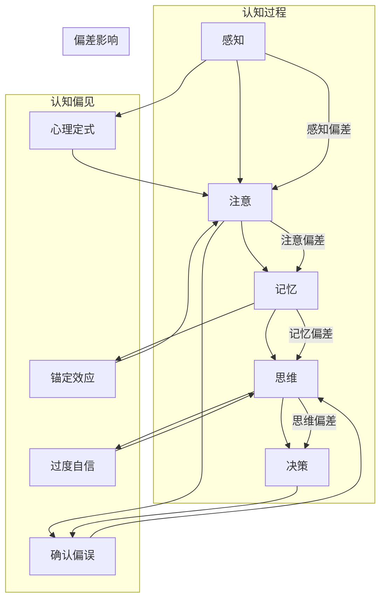

                 

## 《理解的障碍：认知偏见与思维定式的克服》

### 关键词：认知偏见、思维定式、心理学、决策、创新

> 摘要：在快节奏的现代生活中，我们常常面临各种理解和决策的障碍。认知偏见与思维定式是其中最为常见和影响深远的两类障碍。本文将深入探讨认知偏见与思维定式的概念、表现形式及其对生活和工作的深远影响，通过实例分析和策略指导，帮助读者认识和克服这些理解障碍，提升认知能力和决策水平。

## 引言

理解，是人类认知的核心过程。然而，在复杂多变的世界中，我们的理解往往受到种种障碍的干扰。认知偏见与思维定式正是这些障碍中最常见、影响最深远的两个方面。它们不仅影响我们的日常决策，甚至影响着我们的行为和价值观。在技术飞速发展的今天，如何克服这些认知障碍，提升我们的认知能力和决策水平，成为了一个重要而紧迫的话题。

本文将从以下几个方面展开：

1. 认知偏见与思维定式的概述，介绍它们的概念、类型以及影响。
2. 认知心理学的理论基础，包括认知过程与认知偏见的关系。
3. 常见认知偏见与思维定式的分析，如确认偏误、锚定效应、群体思维等。
4. 思维定式的根源与挑战，包括习惯性思维、社会文化因素等。
5. 打破思维定式的策略，如开放式思维、主动思考与反思、创新思维的激发与应用。
6. 案例研究与实战指南，通过具体案例展示认知偏见与思维定式的克服方法。
7. 批判性思维的构建，强调持续培养批判性思维的重要性。

通过这篇文章，我们希望读者能够更好地认识到认知偏见与思维定式对生活和工作的影响，并学会有效克服这些障碍，提升自身的认知能力和决策水平。

### 目录大纲

#### 第一部分：认知偏见与思维定式概述

- **第1章 认知偏见与思维定式简介**
  - **1.1 认知偏见的概念与类型**
  - **1.2 思维定式的定义与表现**
  - **1.3 认知偏见与思维定式对生活的影响**

- **第2章 认知心理学基础**
  - **2.1 认知心理学的发展**
  - **2.2 认知过程与认知偏见**

- **第3章 认知偏差的Mermaid流程图**

#### 第二部分：常见认知偏见与思维定式分析

- **第4章 确认偏误**
  - **4.1 确认偏误的原理**
  - **4.2 确认偏误的案例**
  - **4.3 如何克服确认偏误**

- **第5章 锚定效应**
  - **5.1 锚定效应的概念**
  - **5.2 锚定效应的案例分析**
  - **5.3 如何应对锚定效应**

- **第6章 群体思维**
  - **6.1 群体思维的形成**
  - **6.2 群体思维的影响**
  - **6.3 克服群体思维策略**

#### 第三部分：思维定式的分析与克服

- **第7章 思维定式的根源**
  - **7.1 社会文化因素**
  - **7.2 个体心理因素**
  - **7.3 思维定式的社会意义与危害**

- **第8章 习惯性思维的挑战**
  - **8.1 习惯性思维的表现**
  - **8.2 习惯性思维的影响**
  - **8.3 挑战习惯性思维的方法**

- **第9章 打破思维定式的策略**
  - **9.1 开放式思维培养**
  - **9.2 主动思考与反思**
  - **9.3 创新思维的激发与应用**

#### 第四部分：案例研究与实战

- **第10章 商业决策中的认知偏见**
  - **10.1 案例背景**
  - **10.2 认知偏见的表现**
  - **10.3 偏见克服与决策优化**

- **第11章 教育中的思维定式**
  - **11.1 案例背景**
  - **11.2 教育中的思维定式**
  - **11.3 定式克服与教育创新**

- **第12章 实战指南：构建批判性思维**
  - **12.1 批判性思维的重要性**
  - **12.2 批判性思维的实践方法**
  - **12.3 持续培养批判性思维**

#### 附录：相关资源与扩展阅读

- **附录A：认知心理学相关书籍推荐**
- **附录B：认知偏见与思维定式研究文献**
- **附录C：认知偏差评估工具与应用**
- **附录D：拓展资源与在线课程推荐**

### 参考文献

（此处将列出本文引用的主要参考文献，包括书籍、学术论文、网站等。）

---

通过上述的目录结构，我们将对认知偏见与思维定式进行全面的探讨。接下来，我们将逐步深入每一部分的内容，帮助读者更好地理解并克服这些认知障碍。

---

## 第一部分：认知偏见与思维定式概述

### 第1章 认知偏见与思维定式简介

在认知科学中，认知偏见（cognitive biases）与思维定式（mindset）是两个核心概念，它们在理解和解释人类行为方面起着至关重要的作用。认知偏见是指人们在感知、记忆、判断和决策过程中，由于大脑的认知机制和经验的影响，导致判断出现系统性偏差的现象。思维定式则是人们在长期的认知和行为模式中形成的一种固定的思考方式，它往往限制了人们的创新能力，导致思维僵化。

**1.1 认知偏见的概念与类型**

认知偏见可以理解为一种“认知误差”，它是由人类大脑的复杂性和认知过程中的各种因素导致的。常见的认知偏见类型包括：

- **心理定式与思维惯性**：这种偏见指的是人们在面对新信息时，倾向于沿用以往的思考模式和经验，而不是进行全新的评估。例如，在解决问题时，人们可能会过度依赖以前成功的解决方案，而忽视新的可能性。

- **确认偏误与自我验证**：当人们持有某种信念或观点时，他们会更倾向于寻找和接受支持这一信念的证据，而忽略或忽视相反的证据。这种现象被称为确认偏误，它会导致人们的判断失去客观性和全面性。

- **锚定效应与过度自信**：锚定效应是指人们在做出决策时，会过度依赖最初获取的信息，即使这些信息并不相关或不准确。过度自信则是指人们高估自己能力和判断的准确性，这往往会导致决策风险的增加。

**1.2 思维定式的定义与表现**

思维定式是人们在长期学习和生活中形成的固定思维模式，它包括习惯性思维、模式识别和惯性推理等。思维定式的表现主要体现在以下几个方面：

- **模式识别与思维定式**：人们习惯于通过过去的经验和知识来识别和理解新信息，这种模式识别机制虽然提高了信息处理的效率，但也容易导致思维的僵化。

- **习惯性思维与僵化思维**：习惯性思维是指人们倾向于重复使用已验证有效的思考方式，而不愿意尝试新的思考路径。这种习惯性思维如果过于僵化，会限制创新的产生，阻碍问题解决的效率。

- **群体思维与盲目从众**：群体思维是指人们在集体中倾向于接受和遵循群体的意见和决策，而忽略个人的独立思考。盲目从众则是指人们为了获得认同感或避免孤立，而盲目地接受他人的意见，这种现象在群体决策中尤为常见。

**1.3 认知偏见与思维定式对生活的影响**

认知偏见和思维定式对我们的生活和工作有着深远的影响：

- **人际关系的影响**：认知偏见和思维定式可能导致误解和冲突，影响人际关系的和谐。例如，过度自信可能导致沟通中的傲慢和不尊重，而确认偏误可能导致信任危机。

- **决策与判断的影响**：认知偏见和思维定式会影响我们的决策过程，导致判断的失误。例如，锚定效应可能导致投资决策的失误，而习惯性思维可能导致决策的僵化。

- **心理健康的挑战**：认知偏见和思维定式还可能导致心理压力和心理健康问题。例如，过度自信可能导致失败后的沮丧和挫败感，而确认偏误可能导致决策后的焦虑和恐惧。

总的来说，认知偏见和思维定式是我们认知过程中不可避免的一部分，但通过认识和克服这些偏见和定式，我们可以提升自身的认知能力，做出更为合理和有效的决策。

### 第2章 认知心理学基础

认知心理学是研究人类认知过程的科学，它致力于揭示大脑如何获取、处理和存储信息。了解认知心理学的理论基础对于深入理解认知偏见和思维定式至关重要。

**2.1 认知心理学的发展**

认知心理学的发展可以追溯到20世纪50年代和60年代。当时，行为主义心理学占据主导地位，研究者们主要关注行为和外部刺激的关系。然而，随着认知科学的发展，研究者们开始重视内部心理过程，如思维、感知、记忆和决策等。这种转变标志着认知心理学的诞生。

- **认知心理学的起源**：认知心理学起源于对人工智能和计算机科学的研究。当时，计算机的出现激发了人们对于人类思维和认知过程的兴趣。最初的研究集中在模拟人类思维过程，例如记忆模型和决策模型。

- **主要理论流派**：在认知心理学的发展过程中，出现了多个重要的理论流派，包括认知信息加工理论、认知发展理论和认知神经科学等。这些理论从不同角度揭示了认知过程的复杂性。

  - **认知信息加工理论**：该理论强调信息处理的过程，包括感知、注意、记忆、判断和决策等。这一理论认为，认知过程可以类比为计算机的信息处理过程，即输入、处理和输出。

  - **认知发展理论**：该理论关注认知能力的发展过程，认为认知能力随时间而发展。例如，皮亚杰的认知发展阶段理论提出，儿童认知能力的发展经历了感知运动阶段、前运算阶段、具体运算阶段和形式运算阶段。

  - **认知神经科学**：该理论结合了认知心理学和神经科学的研究方法，通过脑成像技术（如fMRI、PET等）研究认知过程的神经基础。认知神经科学揭示了认知过程与大脑结构的密切关系，为理解认知偏差和思维定式提供了新的视角。

**2.2 认知过程与认知偏见**

认知过程是指人们获取、处理和存储信息的过程，包括多个阶段：

- **感知**：感知是认知过程的起点，是指人们通过感官接收外部信息。例如，视觉、听觉、触觉等感知系统接收到的信息会被大脑处理和理解。

- **注意**：注意是认知过程中的关键因素，它决定了人们关注哪些信息，忽略哪些信息。注意的分配和选择对于认知偏见的形成具有重要影响。例如，当人们专注于某个问题时，可能会忽略其他相关信息，导致判断失误。

- **记忆**：记忆是认知过程中的另一个重要环节，它涉及信息的存储和回忆。记忆的准确性受到多种因素的影响，如信息的重要性、记忆的重复性、情绪状态等。认知偏见往往会影响记忆的过程和结果。

- **思维**：思维是指人们运用已有知识解决问题和进行推理的过程。思维可以分为多种类型，如逻辑思维、直觉思维、创造性思维等。认知偏见会影响人们的思维过程，导致判断和决策的偏差。

- **决策**：决策是认知过程的最终输出，是指人们在多个选项中选择最佳方案。决策过程受到多种因素的影响，包括认知资源的限制、情绪状态、社会因素等。认知偏见会显著影响决策的结果和效率。

认知过程与认知偏见之间存在密切的联系。认知偏见通常是在认知过程中的某个阶段产生的，例如在感知和注意阶段，人们可能由于锚定效应或确认偏误而忽略关键信息。在记忆和思维阶段，人们可能由于心理定式或过度自信而无法全面考虑问题。在决策阶段，认知偏见会导致选择错误或不合理的方案。

**2.3 情感与情绪**

情感与情绪是认知过程中的重要组成部分，它们不仅影响认知过程，也受到认知过程的影响。认知心理学研究表明，情感和情绪对认知过程有着显著的影响：

- **情感的影响**：情感状态会影响人们的感知、注意、记忆和思维过程。例如，积极的情感状态可能会提高注意力和记忆力，而消极的情感状态则可能导致注意力和记忆力的下降。

- **情绪的影响**：情绪是指人们在特定情境下的情绪反应。情绪反应会影响认知过程，例如，恐惧情绪可能导致注意力集中在危险源上，而喜悦情绪可能导致注意力分散。

- **情感与情绪的作用机制**：情感和情绪通过神经系统和内分泌系统影响认知过程。例如，神经递质如多巴胺和肾上腺素会影响情绪状态，进而影响注意力和决策。

总之，认知心理学为理解认知偏见和思维定式提供了重要的理论基础。通过研究认知过程、情感与情绪的作用机制，我们可以更深入地理解人类认知的复杂性和多样性，为克服认知偏见和思维定式提供有效的策略和方法。

### 第3章 认知偏差的Mermaid流程图

为了更好地理解认知偏差的复杂性和交互作用，我们可以使用Mermaid流程图来展示不同认知偏差之间的关系和影响路径。以下是认知偏差的Mermaid流程图示例：

在这个流程图中：

- **认知过程**（A到E）展示了信息从感知到决策的整个过程。
- **认知偏见**（F到I）表示常见的认知偏差，包括心理定式、确认偏误、锚定效应和过度自信。
- **偏差影响**（A到F，B到G，C到H，D到I，E到G）展示了不同认知偏见对各个认知过程阶段的影响路径。

通过这个流程图，我们可以清晰地看到认知偏差如何在不同认知过程中产生作用，影响我们的感知、注意、记忆、思维和决策。这样的图形化表示有助于我们更好地理解认知偏差的复杂性和相互作用，从而为克服这些偏差提供有效的策略。

### 第二部分：常见认知偏见与思维定式分析

#### 第4章 确认偏误

确认偏误（Confirmation Bias）是一种普遍的认知偏见，指的是人们倾向于寻找、解释和记住那些支持自己已有信念和假设的信息，而忽视或质疑那些与自己观点相反的信息。这种偏见在日常生活中无处不在，不仅影响个人的决策和判断，还会对集体行为和群体决策产生深远的影响。

**4.1 确认偏误的原理**

确认偏误的原理可以归结为几个关键因素：

- **信息选择**：当人们面临大量信息时，倾向于选择那些符合自己信念的信息，而忽视或筛选掉那些不符合的信息。这种信息选择的过程往往是无意识的。

- **解释偏差**：即使人们接收到与已有信念相悖的信息，他们也会尝试以某种方式解释这些信息，使其仍然符合自己的信念。例如，人们可能会找出信息中的“例外”或“特殊情况”，以此来维护原有观点。

- **记忆偏差**：人们更容易记住和回忆那些符合自己信念的信息，而忘记或低估那些与之相矛盾的信息。这种记忆偏差进一步强化了确认偏误。

**4.2 确认偏误的案例**

确认偏误在日常生活中的案例比比皆是：

- **政治偏见**：在政治选举中，支持不同政党的选民往往只关注和传播那些支持自己候选人信息，而忽视或贬低反对者的信息。这种现象在社交媒体上尤为明显，导致社会分裂和极端化。

- **投资决策**：投资者在分析股票或市场时，倾向于寻找那些支持自己投资决策的信息，而忽视或质疑相反的观点。例如，当持有某只股票时，投资者可能会忽视公司的负面新闻，而过分关注积极的预测。

- **健康信念**：当人们相信某种健康信念（如某种饮食或锻炼方法有效）时，他们会寻找和记住那些支持这一信念的信息，而忽视或忽略相反的证据。例如，坚信某种健身方法有效的人可能会忽视科学研究的质疑。

**4.3 如何克服确认偏误**

克服确认偏误需要一系列策略和练习：

- **保持开放心态**：意识到确认偏误的存在，并努力保持开放心态，对不同的观点和信息持包容态度。

- **使用双重标准**：在评估信息时，对支持自己观点和反对自己观点的信息都进行严格的评估，确保判断的客观性。

- **多样化信息来源**：广泛获取信息，确保信息的多样性和完整性。避免仅依赖单一信息源，以减少偏见的影响。

- **反思与质疑**：定期反思自己的信念和判断，质疑其合理性。尝试从不同的角度重新审视问题。

- **使用认知偏差评估工具**：利用专门设计的认知偏差评估工具，如“认知偏差自测问卷”，来识别和了解自己的认知偏见。

- **培养批判性思维**：通过教育和实践培养批判性思维能力，学会如何理性地分析和评估信息。

通过上述策略，我们可以逐步克服确认偏误，提高决策和判断的客观性和准确性。这不仅有助于个人成长，也有助于社会和谐与进步。

### 第5章 锚定效应

锚定效应（Anchoring Effect）是一种普遍的认知偏见，指的是人们在做出决策时，会过度依赖最初获取的信息，即使这些信息与问题无关或已经过时。这种偏见会导致决策过程中的判断偏差，影响最终决策的合理性和准确性。

**5.1 锚定效应的概念**

锚定效应的概念可以简单概括为：人们在决策过程中，往往将初始信息（锚点）作为参考点，并对后续信息进行评估时受到影响。这个初始信息可能是某个数字、一个估计值或者一种参考方案，它成为决策过程中的一个“锚”，影响人们的判断和选择。

**5.2 锚定效应的案例分析**

锚定效应在日常生活中有许多典型的案例：

- **拍卖竞价**：在拍卖过程中，第一个出价往往成为后续出价者的参考点。例如，如果第一个出价是100元，那么后续出价者可能会根据这个价格调整自己的出价，即使他们可能知道这个价格并不合理。

- **预算制定**：在制定预算时，人们可能会依赖之前的预算或某个初始报价，而忽视实际需求和市场变化。例如，如果某个项目的初始预算是50万元，即使后续发现实际成本需要100万元，人们也可能不愿意调整预算，从而影响项目的顺利进行。

- **价格谈判**：在购买商品或服务时，人们可能会受到初始报价的影响。例如，如果销售员首先提供一个很高的价格，购买者可能会在后续的谈判中接受一个相对较低的价格，而不是重新评估商品的真正价值。

**5.3 如何应对锚定效应**

为了应对锚定效应，可以采取以下策略：

- **提供无参考信息**：在决策过程中，尽可能避免提供初始信息或参考点。例如，在拍卖中，可以隐藏最初的出价，从而减少锚定效应的影响。

- **多角度评估**：在决策时，考虑多个因素和参考点，而不是仅仅依赖一个初始值。例如，在制定预算时，可以同时参考市场数据、历史数据和实际需求，以获得更全面的评估。

- **定期重新评估**：定期重新评估决策和预算，确保它们与当前情况和目标保持一致。例如，在项目执行过程中，定期审查预算和进度，及时调整以避免锚定效应的影响。

- **使用透明机制**：在决策过程中，使用透明的机制和流程，确保所有相关信息都被充分考虑。例如，在价格谈判中，公开讨论各个因素和评估标准，避免单一参考点对决策的干扰。

- **教育用户**：通过教育和培训，提高用户对锚定效应的认识，帮助他们学会如何识别和应对这种偏见。例如，可以通过工作坊或研讨会，介绍锚定效应的概念和影响，并提供具体的应对策略。

通过这些策略，我们可以减少锚定效应对决策的影响，提高决策的理性和科学性，从而更好地实现个人和组织的目标。

### 第6章 群体思维

群体思维（Groupthink）是一种常见的认知偏见，它指的是在集体决策过程中，群体成员为了保持一致性而过度追求共识，忽视个体差异和外部意见，从而导致决策失误和问题逃避。群体思维在团队协作和领导层决策中尤为常见，它不仅影响组织的决策质量，还可能对组织的长远发展产生负面影响。

**6.1 群体思维的形成**

群体思维的形成通常受到以下几个因素的影响：

- **社会认同**：个体在群体中追求认同感和归属感，倾向于接受群体的意见，避免与群体产生分歧。

- **避免冲突**：为了避免内部冲突和外部批评，群体成员可能会主动避免提出不同的观点，或者压制那些与群体意见相悖的声音。

- **领导影响**：领导者的风格和行为对群体思维的形成有重要影响。当领导者表现出高度的权威和一致性时，群体成员更容易追随和接受领导意见。

- **外部压力**：面对外部压力和紧急情况时，群体成员可能会倾向于快速达成共识，而不是深入分析和讨论，以尽快做出决策。

- **共同目标**：当群体成员拥有共同的目标和利益时，他们更容易在决策过程中保持一致，忽视个体差异。

**6.2 群体思维的影响**

群体思维对决策过程和结果有着显著的影响：

- **忽视个体差异**：群体思维可能导致群体成员忽视个体差异和不同观点，从而限制创新的产生。这种现象在团队协作中尤为明显，成员可能会倾向于追随领导者的意见，而不是提出自己的看法。

- **决策失误**：群体思维容易导致群体在决策过程中出现盲点，无法全面考虑问题的各个方面。例如，在军事决策中，群体思维可能导致领导层忽视敌情和潜在风险，从而做出错误的战略决策。

- **问题逃避**：群体思维往往使群体成员回避复杂和争议性问题，倾向于寻求表面上的和谐和一致性。这种现象可能导致组织在面临挑战时无法采取有效的应对措施。

- **心理压力**：群体思维可能对个体产生心理压力，使个体在群体中感到不自在和焦虑。长期处于这种环境中的个体可能会产生心理疲惫和挫败感。

**6.3 克服群体思维策略**

为了克服群体思维，可以采取以下策略：

- **鼓励多元化意见**：在决策过程中，鼓励成员提出不同的观点和建议，确保所有意见和想法都得到充分讨论。这可以通过设立匿名反馈机制或开放讨论时间来实现。

- **培养独立思考能力**：通过教育和培训，提高群体成员的独立思考能力，使他们能够自主分析和评估信息，不受群体压力的影响。

- **定期反思与评估**：定期对决策过程和结果进行反思和评估，识别和纠正群体思维的影响。这可以通过小组讨论、审查会议等方式来实现。

- **引入外部专家**：在决策过程中引入外部专家或顾问，提供不同的视角和建议，帮助群体成员跳出固有思维模式。

- **明确决策标准**：制定明确的决策标准和流程，确保决策过程透明和科学。这可以减少群体成员对决策过程的随意性和主观性。

通过上述策略，组织可以有效克服群体思维，提升决策的质量和效率，从而更好地应对复杂和多变的环境挑战。

### 第7章 思维定式的根源

思维定式（Mindset）是一种长期形成的固定思维模式，它影响人们的思考、行为和决策。理解思维定式的根源对于克服这一认知障碍具有重要意义。思维定式主要受到以下因素的影响：

**7.1 社会文化因素**

社会文化背景对个体的思维定式有着深远的影响。在不同的文化环境中，人们的教育、价值观、传统习俗和社会期望都会影响他们的思维方式：

- **教育制度**：传统的教育体系往往强调知识传授和标准答案，这可能导致学生形成固定的思维模式，缺乏批判性和创造性思维。

- **文化价值观**：不同的文化价值观会影响个体的思维方式和决策。例如，在一些强调集体主义的社会中，个体可能更倾向于遵循群体的意见，而在强调个人主义的社会中，个体可能更注重独立思考和个性表达。

- **社会期望**：社会的期望和压力也会影响个体的思维定式。例如，父母和社会可能期望孩子成为医生或律师，这种期望会限制孩子的职业选择，形成固定的职业思维定式。

**7.2 个体心理因素**

个体心理因素也是思维定式的重要根源，包括认知习惯、情感反应和个人经验：

- **认知习惯**：人们在长期的认知过程中形成了一种稳定的思考模式，这种习惯使得他们在面对问题时倾向于沿用已有的方法，而忽视新的可能性。例如，习惯性思维可能导致个体在面对复杂问题时无法灵活应对。

- **情感反应**：情感反应对思维定式的形成也有重要影响。例如，恐惧和焦虑可能使个体在面对挑战时倾向于遵循已知的安全策略，而不是冒险尝试新的方法。

- **个人经验**：个人的经验和经历会影响他们的思维模式。例如，一个经历过多次失败的人可能会在未来的决策中更加保守，而一个经历过成功的人可能会更加自信和冒险。

**7.3 思维定式的社会意义与危害**

思维定式既有其社会意义，也存在潜在的危害：

- **社会意义**：思维定式在某些情况下有助于提高效率和一致性。例如，在紧急情况下，遵循既定的程序和标准操作流程可以减少决策时间，提高行动效率。

- **潜在危害**：思维定式可能导致创新能力的限制和思维僵化。它使得个体在面对新问题时无法灵活应对，从而导致问题解决效率低下。例如，在快速变化的市场环境中，思维定式可能导致企业无法适应新的竞争形势，最终导致失败。

**7.4 总结**

思维定式的根源复杂多样，既包括社会文化因素，也涉及个体心理因素。理解这些根源有助于我们更好地识别和克服思维定式，培养开放和灵活的思维模式，从而在面临挑战时能够更加有效地解决问题。

### 第8章 习惯性思维的挑战

习惯性思维（Habitual Thinking）是一种在长期学习和生活中形成的固定思考模式，它使人们在面对问题时倾向于依赖以往的经验和方法，而不是寻求新的解决方案。习惯性思维虽然在某些情况下有助于提高效率和一致性，但其潜在的挑战和危害不容忽视。

**8.1 习惯性思维的表现**

习惯性思维在日常工作和生活中有着多种表现：

- **重复性行为**：人们往往会重复使用过去成功的策略，而忽视新环境和新情况下的变化。例如，一个成功的销售人员可能会在新的市场中坚持使用旧的销售方法，而忽视市场需求的改变。

- **思维惯性**：习惯性思维使人们在面对新问题时，往往难以跳出旧有框架，导致创新能力的限制。例如，一个长期在某个领域工作的专业人士可能会在解决新问题时依赖以往的知识和经验，而无法看到问题的多面性和新的解决方案。

- **顽固立场**：习惯性思维可能导致人们固执己见，不愿意接受不同的观点和建议。例如，在团队讨论中，一个习惯性思维严重的成员可能会坚持自己的观点，忽视其他成员的合理建议。

**8.2 习惯性思维的影响**

习惯性思维对个人和组织的影响是多方面的：

- **创新能力受限**：习惯性思维限制了个体的创新能力，导致在应对复杂和变化的环境时无法灵活应对。这对于快速变化的市场和技术发展来说，是一个显著的挑战。

- **问题解决效率降低**：依赖习惯性思维的方法可能导致问题解决的效率降低，因为旧有的方法可能无法适应新的问题情境。例如，在项目管理中，使用固定的项目管理流程可能无法应对突发事件和需求变更。

- **团队协作困难**：习惯性思维可能导致团队内部的沟通和协作困难，因为成员们往往倾向于按照自己的方式思考和行动，而不是寻求共同的最佳解决方案。

- **心理压力增加**：习惯性思维可能会导致心理压力的增加，因为个体可能感到自己的思维和能力无法适应不断变化的环境。长期处于这种状态中，可能会导致焦虑和挫败感。

**8.3 挑战习惯性思维的方法**

为了克服习惯性思维，可以采取以下方法：

- **自我反思**：定期反思自己的思维模式和行为，识别和挑战那些已经过时或不适应新环境的习惯。通过自我反思，可以逐步改变固有的思维定式。

- **学习新知识**：通过学习新的知识和技能，扩展自己的认知边界，增强应对新问题的能力。例如，参加培训课程、阅读专业书籍或参加研讨会都是很好的学习方式。

- **主动探索**：鼓励自己尝试新的方法和策略，勇于面对未知的挑战。通过实践和经验积累，可以逐步培养灵活和创新的思维模式。

- **开放心态**：保持开放心态，对不同的观点和意见持包容态度。避免过度自信和固执己见，尊重和借鉴他人的经验和建议。

- **多元化团队**：在团队中引入多元化的成员和观点，促进不同思维的碰撞和融合。多元化团队可以提供更多的新视角和解决方案，有助于克服习惯性思维。

通过上述方法，个体和组织可以逐步克服习惯性思维的挑战，提高创新能力和问题解决效率，更好地适应快速变化的环境。

### 第9章 打破思维定式的策略

要突破思维定式的束缚，培养创新的思维模式，我们需要采取一系列积极的策略和方法。以下是一些有效的方法，旨在激发思维活力，促进创新思考。

**9.1 开放式思维培养**

开放式思维是指在面对问题时，能够接受不同的观点和解决方案，不拘泥于传统的思维模式。以下是一些培养开放式思维的方法：

- **多样化信息源**：广泛阅读和学习，接触不同领域的知识和观点。通过多样化的信息输入，可以拓展思维边界，减少偏见。

- **跨界思考**：尝试将不同领域的方法和理念应用到当前问题上。例如，将工程学的优化方法应用于心理学问题，或者将商业策略应用于艺术创作。

- **角色扮演**：设身处地为他人思考问题，尝试从不同的角度和立场看待问题。通过角色扮演，可以打破自我中心的思维模式，提高对问题的全面理解。

- **思维导图**：使用思维导图工具，将问题分解成多个子问题，并从不同维度进行分析。思维导图有助于理清思路，发现新的连接和关系。

**9.2 主动思考与反思**

主动思考和反思是培养创新思维的关键步骤。以下是一些具体的方法：

- **问题驱动**：不断提出问题，而不是急于寻找答案。问题驱动思考有助于发现问题的本质和潜在解决方案。

- **反思日志**：定期记录自己的思考过程和决策，反思自己的思维模式和行为。通过反思，可以识别和纠正思维偏差，提高思考的质量。

- **逆向思维**：尝试从相反的角度思考问题，找到新的解决方案。例如，在产品设计时，可以思考如何设计一个无法使用的产品，从而激发新的创意。

- **联想思维**：通过将不同的事物进行联想，发现它们之间的潜在联系。例如，通过将飞机和鞋子进行联想，可能激发出飞行鞋的创新设计。

**9.3 创新思维的激发与应用**

激发创新思维并应用于实际问题，需要一定的实践和方法：

- **头脑风暴**：在团队中进行头脑风暴，鼓励自由表达和创意碰撞。头脑风暴可以激发大量创意，并为后续筛选和改进提供基础。

- **原型设计**：快速构建原型，通过试错和迭代，不断改进和完善解决方案。原型设计有助于验证创意的可行性和实用性。

- **跨界合作**：与来自不同领域的人才合作，通过跨学科的知识和视角，激发新的创意。跨界合作可以打破传统的思维框架，产生创新的火花。

- **持续学习**：不断学习和吸收新知识、新技能，保持思维的活跃和敏锐。通过持续学习，可以不断提升自己的认知能力和创新能力。

通过开放式思维的培养、主动思考和反思的实践，以及创新思维的激发和应用，我们可以逐步打破思维定式，培养出更加灵活和创新的思维方式。这不仅有助于个人成长，也对组织和社会的进步具有重要意义。

### 第10章 案例一：商业决策中的认知偏见

#### 10.1 案例背景

某知名互联网公司在推出一款新型社交应用时，遭遇了严重的市场反应不佳问题。这款应用在研发过程中，公司高层管理层基于以往成功的社交应用案例和用户需求调研，坚信这款应用将获得市场青睐。然而，在应用正式上线后，用户反馈冷淡，下载量和活跃度远低于预期。

#### 10.2 认知偏见的表现

在此次案例中，认知偏见主要表现在以下几个方面：

- **确认偏误**：管理层在评估用户需求和市场前景时，倾向于关注和接受那些支持原有假设的信息，而忽视或质疑相反的证据。例如，尽管用户反馈显示应用功能过于复杂，管理层仍坚持认为这是“高端用户”的需求。

- **锚定效应**：管理层在制定营销预算时，受到以往成功案例的预算标准影响，过度依赖初始预算，而未充分考虑市场的实际变化和竞争态势。

- **过度自信**：管理层对自身的决策能力和市场判断过于自信，忽视了外部专业顾问的意见和市场调研数据，导致决策过于依赖内部经验和直觉。

#### 10.3 偏见克服与决策优化

为了克服这些认知偏见，公司采取了一系列措施进行决策优化：

- **数据驱动决策**：管理层重新审视用户反馈和市场数据，采用更为客观和全面的数据分析工具，确保决策基于实际用户行为和需求。

- **引入外部咨询**：邀请市场分析师和用户体验专家参与决策过程，提供专业的市场洞察和建议，以减少内部认知偏见的影响。

- **开放式讨论**：在公司内部设立定期讨论会，鼓励不同部门和管理层之间进行开放和坦诚的沟通，确保决策过程中多元化的观点和意见得到充分考虑。

- **原型测试与迭代**：在应用上线前，通过小规模的原型测试和用户反馈，及时发现和纠正问题，确保产品能够在正式发布时更好地满足用户需求。

- **持续反思与调整**：在应用上线后，持续收集用户反馈和市场反应，进行定期评估和调整，以应对市场的变化和用户需求。

通过上述措施，公司逐步克服了认知偏见，优化了决策过程，并最终使这款社交应用在市场上取得了成功。

### 第11章 教育中的思维定式

#### 11.1 案例背景

在一家知名中学，教育方法长期依赖传统的教学方法，教师习惯于以课堂讲授为主，学生则被动接受知识。尽管学校管理层意识到这种教育方法可能限制了学生的创新能力，但由于传统的教育体系和教师习惯，改革进展缓慢。

#### 11.2 教育中的思维定式

教育中的思维定式主要表现在以下几个方面：

- **教学方法单一**：教师通常采用讲授式教学，缺乏互动和实践活动，导致学生学习兴趣下降，创新能力受限。

- **评价体系僵化**：学校主要依据考试成绩评价学生，忽视了学生实际能力和创新潜力的培养，导致学生为考试而学习，而非真正理解和掌握知识。

- **课程设置不合理**：课程设置偏重于理论知识的传授，缺乏实践和应用的环节，导致学生难以将所学知识应用于实际情境中。

- **教师职业发展受限**：教师职业发展路径主要依赖于教学经验和考试成绩，缺乏针对创新教学和培养学生能力的培训和支持。

#### 11.3 定式克服与教育创新

为了克服这些思维定式，学校采取了一系列创新措施：

- **引入项目式学习**：鼓励学生参与项目式学习，通过实际项目的实施，培养学生的合作能力、解决问题能力和创新思维。

- **开展教师培训**：为教师提供创新教学方法的培训，如翻转课堂、合作学习等，提高教师的教学能力和创新能力。

- **多样化评价体系**：建立多元化的评价体系，不仅考察学生的考试成绩，还注重学生的实际能力和创新潜力，如项目成果展示、创新比赛等。

- **课程改革**：调整课程设置，增加实践和应用环节，引入跨学科学习和科技教育，培养学生的综合能力和创新思维。

- **家校合作**：加强与家长的沟通，共同关注学生的成长，鼓励家长参与学校的教育创新活动，形成良好的教育环境。

通过这些创新措施，学校逐步克服了教育中的思维定式，提高了教育质量和学生创新能力，为学生的发展奠定了坚实基础。

### 第12章 实战指南：构建批判性思维

#### 12.1 批判性思维的重要性

批判性思维（Critical Thinking）是一种通过理性分析和评估信息，形成独立、合理和有效判断的能力。在现代社会，批判性思维的重要性日益凸显，它不仅关乎个人的决策质量和创新能力，也关系到组织的决策效率和文化建设。

- **决策质量**：批判性思维有助于我们更全面地分析问题，识别潜在的偏见和假设，从而做出更加合理和有效的决策。

- **创新能力**：批判性思维能够激发我们的创新潜力，通过质疑现有方法和观念，发现新的解决方案和机会。

- **问题解决**：在面对复杂和多变的问题时，批判性思维能够帮助我们理性分析问题的本质，找到根本原因，并提出有效的解决方案。

- **终身学习**：批判性思维培养了我们持续学习和自我提升的能力，使我们在面对新的知识和技能时能够快速适应和掌握。

#### 12.2 批判性思维的实践方法

构建批判性思维需要系统的实践和持续的练习，以下是一些实用的方法：

- **提问技巧**：通过提问，我们可以更好地理解问题和信息。以下是一些有效的提问技巧：

  - **“是什么”问题**：用于探索现象或概念的本质和定义。
  - **“为什么”问题**：用于挖掘问题的原因和动机。
  - **“怎么样”问题**：用于分析问题的影响和结果。
  - **“如果”问题**：用于模拟不同情境下的可能性和后果。

- **评估证据**：批判性思维要求我们评估信息的真实性和可靠性。以下是一些评估证据的方法：

  - **来源评估**：了解信息来源的权威性和可靠性。
  - **数据检查**：对数据进行验证和交叉检查，确保其准确性和完整性。
  - **逻辑分析**：分析论证的逻辑结构，识别潜在的逻辑谬误。

- **反思与自省**：反思是批判性思维的重要组成部分。以下是一些反思和自省的方法：

  - **定期回顾**：定期回顾自己的思考过程和决策，识别和纠正思维偏差。
  - **反思日记**：记录自己的思考过程和决策，分析其合理性和有效性。
  - **讨论与辩论**：与他人讨论和辩论，通过不同的观点和思考，提升批判性思维能力。

- **跨学科学习**：通过跨学科的学习，我们可以拓宽知识视野，提高分析问题的能力。以下是一些跨学科学习的建议：

  - **阅读跨学科书籍**：阅读不同领域的书籍，获取多元化的知识。
  - **参与跨学科项目**：参与跨学科项目，锻炼综合运用不同学科知识的能力。
  - **学习新技能**：学习新的技能和工具，如数据分析、编程等，提高分析问题的能力。

#### 12.3 持续培养批判性思维

批判性思维的培养不是一蹴而就的，需要长期的努力和实践。以下是一些持续培养批判性思维的建议：

- **建立学习习惯**：定期阅读和学习，保持知识的更新和扩展。
- **参与讨论和辩论**：积极参与讨论和辩论，锻炼表达和思考能力。
- **实践应用**：将批判性思维应用于实际问题，通过实践提升能力。
- **寻求反馈**：向他人寻求反馈，了解自己的思维过程和决策是否存在偏差。

通过上述方法，我们可以逐步培养和提升批判性思维，为个人成长和组织发展提供有力支持。

### 附录：相关资源与扩展阅读

#### 附录A：认知心理学相关书籍推荐

1. **《认知心理学：思想和脑的科学》（Cognitive Psychology: A Student's Handbook）** by Michael Eysenck and Mark Keane
   - 内容简介：这是一本经典的认知心理学教材，涵盖了认知心理学的核心概念和理论。
   - 推荐理由：内容全面，适合初学者和专业研究者。

2. **《思考，快与慢》（Thinking, Fast and Slow）** by Daniel Kahneman
   - 内容简介：诺贝尔经济学奖得主丹尼尔·卡尼曼的代表作，详细探讨了人类思维的两种系统。
   - 推荐理由：对理解认知偏见和决策过程有重要启发。

3. **《认知科学及其哲学基础》（Cognitive Science: An Introduction）** by Michael Anderson and John S. White
   - 内容简介：介绍认知科学的基础知识，包括认知心理学、人工智能、神经科学等领域。
   - 推荐理由：跨学科视角，有助于理解认知过程的多重维度。

#### 附录B：认知偏见与思维定式研究文献

1. **“Cognitive Bias in Judgment and Decision Making”** by Amos Tversky and Daniel Kahneman
   - 内容简介：这篇经典论文首次提出了多种认知偏见，如锚定效应和确认偏误。
   - 推荐理由：奠定了认知偏见研究的理论基础。

2. **“The Art of Thinking Clearly”** by Rolf Dobelli
   - 内容简介：这本书总结了多种认知偏见和思维定式，并提供应对策略。
   - 推荐理由：实用性强，适合快速了解和克服认知偏见。

3. **“Groupthink”** by Irving Janis
   - 内容简介：探讨群体思维的形成及其对决策过程的负面影响。
   - 推荐理由：对理解群体思维和如何避免其影响具有重要指导意义。

#### 附录C：认知偏差评估工具与应用

1. **“Cognitive Bias Cheat Sheet”** by Tyler Vigen
   - 内容简介：这个网站提供了一系列认知偏差的评估工具和解释。
   - 推荐理由：简洁直观，方便快速识别和评估认知偏差。

2. **“ biases.fyi”** by Y Combinator
   - 内容简介：这个网站提供了一系列认知偏差的案例和应用，以及相应的应对策略。
   - 推荐理由：内容丰富，适合深入学习和实践。

3. **“Critical Thinking Company”** by Critical Thinking Company
   - 内容简介：提供多种批判性思维评估工具和培训资源。
   - 推荐理由：专业性强，适合专业学习和应用。

#### 附录D：拓展资源与在线课程推荐

1. **“Coursera - Psychology and the Business of Life”** by University of Michigan
   - 内容简介：这是一门介绍心理学基础知识和应用的课程。
   - 推荐理由：内容全面，适合希望深入了解心理学的学习者。

2. **“edX - Critical Thinking”** by Delft University of Technology
   - 内容简介：介绍批判性思维的基础知识和实践方法。
   - 推荐理由：实践性强，适合希望提升批判性思维能力的学习者。

3. **“LinkedIn Learning - Critical Thinking”** by Kevin Parker
   - 内容简介：一系列关于批判性思维的讲座和实践指导。
   - 推荐理由：内容实用，适合在工作中应用批判性思维的学习者。

通过上述资源和课程，读者可以进一步深入了解认知偏见与思维定式，提升自身的认知能力和决策水平。

### 参考文献

1. Eysenck, M. W., & Keane, M. (2010). Cognitive Psychology: A Student's Handbook. Psychology Press.
2. Kahneman, D. (2011). Thinking, Fast and Slow. Farrar, Straus and Giroux.
3. Anderson, M., & White, J. S. (2014). Cognitive Science: An Introduction. Taylor & Francis.
4. Tversky, A., & Kahneman, D. (1974). Judgment under uncertainty: Heuristics and biases. Science, 185(4157), 1124-1131.
5. Dobelli, R. (2011). The Art of Thinking Clearly. Crown Publishing Group.
6. Janis, I. L. (1982). Groupthink: Psychological Studies of Policy Decisions and Fiascoes. Houghton Mifflin Harcourt.
7. Vigen, T. (n.d.). Cognitive Bias Cheat Sheet. Retrieved from [https://www.cognitivebiases.com/](https://www.cognitivebiases.com/)
8. Y Combinator. (n.d.). biases.fyi. Retrieved from [https://biases.fyi/](https://biases.fyi/)
9. Critical Thinking Company. (n.d.). Retrieved from [https://www.criticalthinkingcompany.com/](https://www.criticalthinkingcompany.com/)
10. University of Michigan. (n.d.). Psychology and the Business of Life. Retrieved from [https://www.coursera.org/learn/psychology-business-life](https://www.coursera.org/learn/psychology-business-life)
11. Delft University of Technology. (n.d.). Critical Thinking. Retrieved from [https://www.edx.org/course/critical-thinking-technology-university-of-delft](https://www.edx.org/course/critical-thinking-technology-university-of-delft)
12. LinkedIn Learning. (n.d.). Critical Thinking. Retrieved from [https://www.linkedin.com/learning/critical-thinking](https://www.linkedin.com/learning/critical-thinking)

