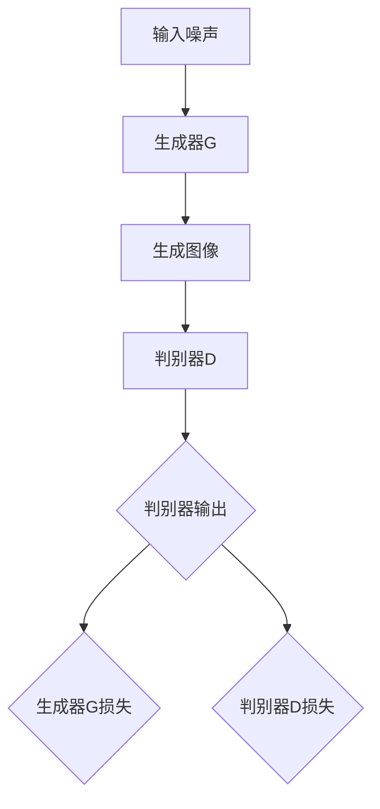
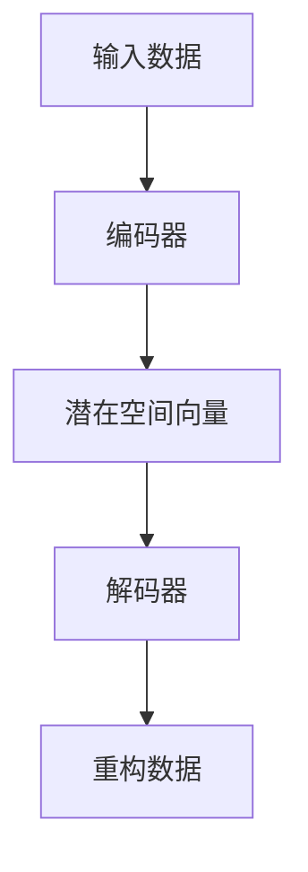
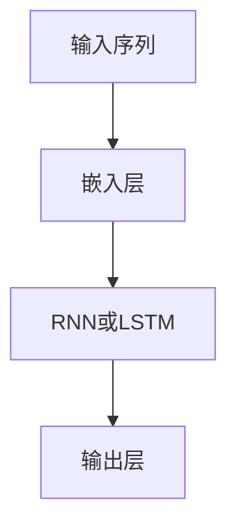

                 

# 《生成式AIGC：从理论到商业应用的跨越》

> 关键词：生成式AI，AIGC，商业应用，GAN，VAE，RNN，Transformer

> 摘要：本文从AIGC的概念、技术原理、应用场景、数学模型到商业应用挑战与解决方案，全面探讨生成式人工智能生成内容（AIGC）的理论基础与商业实践。通过具体的项目实战案例，深入解析AIGC技术的实现过程，为读者提供从理论到实践的完整指南。同时，本文还探讨了AIGC在商业应用中的挑战与未来发展趋势，为人工智能产业的发展提供新思路。

## 第一部分：AIGC基础

### 第1章：AIGC概述

#### 1.1 AIGC的定义与分类

生成内容人工智能（AI-Generated Content，简称AIGC）是指通过人工智能算法自动生成文本、图像、视频等内容的一种技术。AIGC可以分为以下几类：

1. **文本生成**：通过机器学习模型生成文章、新闻报道、聊天对话等文本内容。
2. **图像生成**：通过算法生成新的图像，包括真实感图像、抽象艺术等。
3. **视频生成**：通过算法生成新的视频内容，如视频预测、视频增强、视频修复等。

AIGC的发展历程可以追溯到20世纪80年代，随着深度学习技术的发展，生成式AI在近年来取得了显著进展。

#### 1.2 AIGC的核心技术与原理

AIGC的核心技术包括生成对抗网络（GAN）、变分自编码器（VAE）、循环神经网络（RNN）与长短期记忆网络（LSTM）、自注意力机制与Transformer架构。

1. **生成对抗网络（GAN）**：
   - **定义**：GAN由生成器和判别器组成，通过对抗训练生成高质量的数据。
   - **原理**：生成器生成数据，判别器判断数据真假，生成器和判别器互相竞争，生成器逐渐生成越来越真实的数据。

2. **变分自编码器（VAE）**：
   - **定义**：VAE通过编码器和解码器将输入数据映射到潜在空间，并从这个空间生成新的数据。
   - **原理**：编码器将输入数据编码成一个概率分布，解码器从这个分布中采样生成新的数据。

3. **循环神经网络（RNN）与长短期记忆网络（LSTM）**：
   - **定义**：RNN是一种处理序列数据的神经网络，LSTM是RNN的一种改进，能够学习长期依赖关系。
   - **原理**：RNN通过递归结构处理序列数据，LSTM引入门控机制，解决长期依赖问题。

4. **自注意力机制与Transformer架构**：
   - **定义**：Transformer是一种基于自注意力机制的序列模型，广泛应用于自然语言处理任务。
   - **原理**：Transformer通过多头自注意力机制处理序列数据，能够捕捉长距离依赖关系。

#### 1.3 AIGC的发展历程

- **1980年代**：生成式AI的萌芽期，基于规则的方法被提出。
- **2006年**：深度学习的发展，生成式对抗网络（GAN）被提出。
- **2010年代**：GAN和VAE等生成式模型取得突破性进展，应用场景逐渐丰富。
- **2020年代**：生成式AI技术不断完善，进入商业化应用阶段。

### 第2章：生成式模型基础

#### 2.1 生成式模型的数学基础

生成式模型的数学基础包括随机过程与概率分布、信息论基础。

1. **随机过程与概率分布**：
   - **定义**：随机过程是一个随时间变化的随机变量序列。
   - **概率分布**：描述随机变量可能取值的概率分布。

2. **信息论基础**：
   - **定义**：信息论研究信息传输、处理和存储的数学理论。
   - **熵**：描述随机变量不确定性的度量。
   - **互信息**：描述两个随机变量之间信息关联的度量。

#### 2.2 生成式模型的核心算法

生成式模型的核心算法包括生成对抗网络（GAN）、变分自编码器（VAE）、循环神经网络（RNN）与长短期记忆网络（LSTM）。

1. **GAN的工作原理**：
   - **定义**：GAN由生成器和判别器组成，生成器和判别器相互竞争。
   - **原理**：生成器生成数据，判别器判断数据真假，生成器和判别器互相竞争，生成器逐渐生成越来越真实的数据。

2. **VAE的建模方法**：
   - **定义**：VAE通过编码器和解码器将输入数据映射到潜在空间，并从这个空间生成新的数据。
   - **原理**：编码器将输入数据编码成一个概率分布，解码器从这个分布中采样生成新的数据。

3. **RNN与LSTM的时间序列建模**：
   - **定义**：RNN是一种处理序列数据的神经网络，LSTM是RNN的一种改进，能够学习长期依赖关系。
   - **原理**：RNN通过递归结构处理序列数据，LSTM引入门控机制，解决长期依赖问题。

### 第3章：AIGC应用场景介绍

#### 3.1 文本生成

文本生成是AIGC的重要应用场景，包括自动写作与内容生成、文本风格迁移与写作辅助等。

1. **自动写作与内容生成**：
   - **应用**：自动生成文章、新闻报道、博客等文本内容。
   - **原理**：使用生成式模型（如GAN、VAE）从训练数据中学习文本生成规律，生成新的文本内容。

2. **文本风格迁移与写作辅助**：
   - **应用**：将一种文本风格转换为另一种风格，辅助人类写作。
   - **原理**：通过预训练的模型（如GPT、BERT）学习文本风格特征，实现风格迁移。

#### 3.2 图像生成

图像生成是AIGC的另一个重要应用场景，包括真实感图像生成、超分辨率图像生成等。

1. **真实感图像生成**：
   - **应用**：生成逼真的图像，如人脸、风景等。
   - **原理**：使用GAN、VAE等生成式模型学习真实图像特征，生成新的真实感图像。

2. **超分辨率图像生成**：
   - **应用**：将低分辨率图像转换为高分辨率图像。
   - **原理**：使用生成式模型（如GAN、VAE）学习图像细节特征，生成高分辨率图像。

#### 3.3 视频生成

视频生成是AIGC的新兴应用场景，包括视频预测与生成、视频增强与修复等。

1. **视频预测与生成**：
   - **应用**：预测视频序列的未来帧，生成新的视频内容。
   - **原理**：使用生成式模型（如GAN、VAE）学习视频特征，生成新的视频内容。

2. **视频增强与修复**：
   - **应用**：增强视频质量，修复损坏的视频。
   - **原理**：使用生成式模型（如GAN、VAE）学习视频特征，改善视频质量。

### 第4章：AIGC数学模型与公式

#### 4.1 GAN的损失函数

生成对抗网络（GAN）的损失函数主要包括对抗损失函数和生成损失函数。

1. **对抗损失函数**：
   - **定义**：对抗损失函数衡量生成器和判别器之间的对抗效果。
   - **公式**：$$
   L_{adv} = -\mathbb{E}_{x \sim p_{data}(x)}[\log(D(x))] - \mathbb{E}_{z \sim p_{z}(z)}[\log(1 - D(G(z)))]
   $$

2. **生成损失函数**：
   - **定义**：生成损失函数衡量生成器生成的数据质量。
   - **公式**：$$
   L_{gen} = \mathbb{E}_{z \sim p_{z}(z)}[\log(D(G(z))]
   $$

#### 4.2 VAE的损失函数

变分自编码器（VAE）的损失函数主要包括重构损失函数和KL散度。

1. **重构损失函数**：
   - **定义**：重构损失函数衡量编码器和解码器重构数据的效果。
   - **公式**：$$
   L_{recon} = \mathbb{E}_{x \sim p_{data}(x)}[\log(p_{\theta}(x| \mu, \sigma))]
   $$

2. **KL散度**：
   - **定义**：KL散度衡量两个概率分布之间的差异。
   - **公式**：$$
   D_{KL}(p_{\theta}||q_{\phi}(x)) = \mathbb{E}_{x \sim p_{\theta}(x)}[\log \frac{p_{\theta}(x)}{q_{\phi}(x)}]
   $$

#### 4.3 RNN与LSTM的动态系统方程

循环神经网络（RNN）与长短期记忆网络（LSTM）的动态系统方程如下：

1. **RNN的递归方程**：
   - **公式**：$$
   h_t = \sigma(W_h \cdot [h_{t-1}, x_t] + b_h)
   $$

2. **LSTM的门控机制**：
   - **公式**：$$
   \begin{aligned}
   i_t &= \sigma(W_i \cdot [h_{t-1}, x_t] + b_i) \\
   f_t &= \sigma(W_f \cdot [h_{t-1}, x_t] + b_f) \\
   o_t &= \sigma(W_o \cdot [h_{t-1}, x_t] + b_o) \\
   g_t &= \tanh(W_g \cdot [h_{t-1}, x_t] + b_g) \\
   h_t &= f_t \odot h_{t-1} + i_t \odot g_t
   \end{aligned}
   $$

### 第5章：AIGC项目实战

#### 5.1 GAN图像生成项目实战

**5.1.1 项目需求分析**

本项目旨在使用生成对抗网络（GAN）生成真实感图像。具体需求如下：

- 数据集：使用CIFAR-10数据集，包含10个类别，共计50000张32x32彩色图像。
- 模型：使用标准的GAN架构，包括生成器和判别器。
- 目标：生成高质量的真实感图像。

**5.1.2 环境搭建与数据预处理**

1. **环境搭建**：

   - Python环境：3.8及以上版本
   - 深度学习框架：PyTorch
   - GPU支持：NVIDIA CUDA 11.0及以上版本

2. **数据预处理**：

   - 数据加载：使用PyTorch的`Dataset`类加载数据集，并进行归一化处理。
   - 数据增强：使用随机裁剪、翻转等数据增强方法，增加模型泛化能力。

**5.1.3 模型设计与训练**

1. **模型设计**：

   - 生成器：使用一个全连接神经网络，输入噪声向量，输出32x32彩色图像。
   - 判别器：使用一个卷积神经网络，输入32x32彩色图像，输出二分类标签。

2. **训练过程**：

   - 训练参数：学习率0.0002，批量大小64，迭代次数1000。
   - 训练策略：使用梯度裁剪和权重衰减，防止模型过拟合。
   - 损失函数：对抗损失函数和生成损失函数。

**5.1.4 生成图像分析与优化**

1. **生成图像分析**：

   - 观察生成图像的质量，对比训练前后的效果。
   - 分析生成图像的分布和多样性。

2. **优化策略**：

   - 调整超参数：调整学习率、批量大小、迭代次数等。
   - 改进模型结构：尝试使用更深、更复杂的网络结构。
   - 数据增强：增加数据增强方法，提高模型泛化能力。

#### 5.2 VAE文本生成项目实战

**5.2.1 项目需求分析**

本项目旨在使用变分自编码器（VAE）生成新的文本内容。具体需求如下：

- 数据集：使用维基百科英文数据集，包含大量文本数据。
- 模型：使用标准的VAE架构，包括编码器和解码器。
- 目标：生成新的、连贯的文本内容。

**5.2.2 环境搭建与数据预处理**

1. **环境搭建**：

   - Python环境：3.8及以上版本
   - 深度学习框架：PyTorch
   - GPU支持：NVIDIA CUDA 11.0及以上版本

2. **数据预处理**：

   - 数据加载：使用PyTorch的`Dataset`类加载数据集，并进行分词处理。
   - 数据编码：将文本数据编码为数字序列，便于模型处理。
   - 数据增强：使用随机裁剪、翻转等数据增强方法，增加模型泛化能力。

**5.2.3 模型设计与训练**

1. **模型设计**：

   - 编码器：使用一个卷积神经网络，输入文本序列，输出潜在空间向量。
   - 解码器：使用一个卷积神经网络，输入潜在空间向量，输出文本序列。

2. **训练过程**：

   - 训练参数：学习率0.0001，批量大小64，迭代次数1000。
   - 训练策略：使用梯度裁剪和权重衰减，防止模型过拟合。
   - 损失函数：重构损失函数和KL散度。

**5.2.4 文本生成与分析**

1. **文本生成**：

   - 生成新的文本内容，观察生成的文本是否连贯、有趣。
   - 分析生成文本的主题和风格。

2. **优化策略**：

   - 调整超参数：调整学习率、批量大小、迭代次数等。
   - 改进模型结构：尝试使用更深、更复杂的网络结构。
   - 数据增强：增加数据增强方法，提高模型泛化能力。

### 第6章：AIGC在商业应用中的挑战与解决方案

#### 6.1 商业应用中的挑战

AIGC在商业应用中面临以下挑战：

1. **数据隐私与安全**：
   - **挑战**：生成式模型训练过程中需要大量真实数据，数据隐私问题亟待解决。
   - **解决方案**：使用数据加密、差分隐私等技术保护用户隐私。

2. **计算资源消耗**：
   - **挑战**：AIGC模型训练和推理过程需要大量计算资源，对硬件设备要求较高。
   - **解决方案**：采用分布式计算、模型压缩等技术降低计算资源消耗。

3. **模型可解释性**：
   - **挑战**：生成式模型训练过程复杂，模型决策过程难以解释，影响用户信任。
   - **解决方案**：研究可解释AI技术，提高模型的可解释性。

#### 6.2 解决方案与案例

以下为AIGC在商业应用中的解决方案与案例：

1. **数据加密与隐私保护**：
   - **案例**：某互联网公司使用联邦学习技术，在保障用户隐私的前提下，训练生成式模型。

2. **分布式计算与模型压缩**：
   - **案例**：某科技公司采用分布式计算框架，将AIGC模型训练任务分发到多台服务器，提高训练效率。

3. **可解释AI与模型调试**：
   - **案例**：某金融公司使用可解释AI技术，对生成式模型进行调试，提高模型决策过程的可解释性。

### 第7章：AIGC的未来发展趋势与前景

#### 7.1 技术演进趋势

AIGC在未来将呈现以下技术演进趋势：

1. **模型规模与效率的平衡**：
   - **趋势**：研究人员将关注如何提高生成式模型效率，实现模型规模与效率的平衡。

2. **多模态生成式模型的融合**：
   - **趋势**：将文本、图像、视频等多种模态的数据结合，构建多模态生成式模型。

#### 7.2 商业应用前景

AIGC在商业应用中具有广阔前景：

1. **在线内容生成与分发**：
   - **前景**：生成式AI技术将改变内容创作与分发方式，提高内容生产效率。

2. **智能服务与交互体验**：
   - **前景**：生成式AI技术将提高智能服务水平，改善用户体验。

### 附录：AIGC常用工具与资源

#### A.1 AIGC开源框架与库

1. **TensorFlow**：谷歌开源的深度学习框架，支持AIGC模型的训练与部署。
2. **PyTorch**：微软开源的深度学习框架，具有灵活的动态计算图支持。
3. **Keras**：基于TensorFlow和PyTorch的高级API，简化深度学习模型的构建。

#### A.2 AIGC研究论文与资源

1. **相关研究论文推荐**：
   - **《Generative Adversarial Nets》**：生成对抗网络的奠基性论文。
   - **《Variational Autoencoders》**：变分自编码器的奠基性论文。
   - **《Seq2Seq Learning with Neural Networks》**：循环神经网络在序列学习中的应用。

2. **研究社区与论坛链接**：
   - **[ACL](https://www.aclweb.org/)**：计算语言学年会，涉及自然语言处理和生成式AI的研究。
   - **[ICLR](https://iclr.cc/)**：人工智能和机器学习国际会议，涵盖生成式AI的最新研究成果。
   - **[arXiv](https://arxiv.org/)**：预印本平台，包含大量生成式AI领域的研究论文。

### Mermaid流程图

以下为生成式模型的一些常见流程图：

#### GAN的工作流程

#### VAE的建模流程

#### RNN与LSTM的时间序列建模流程

### 作者

作者：AI天才研究院/AI Genius Institute & 禅与计算机程序设计艺术 /Zen And The Art of Computer Programming

