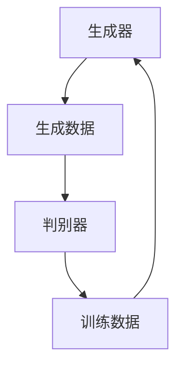
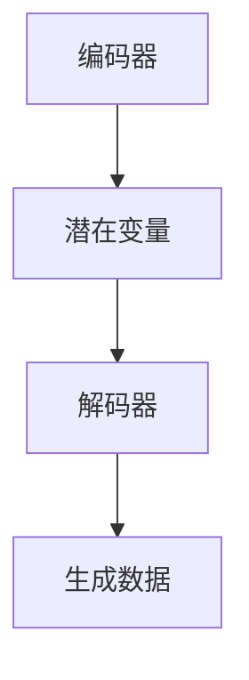

                 

## 文章标题：生成式AIGC：未来商业的智能化转型

### 关键词：AIGC、生成式AI、商业应用、智能化转型、技术趋势

#### 摘要：
在人工智能技术迅猛发展的今天，生成式人工智能（AIGC）正逐渐成为商业智能化的新引擎。本文将深入探讨AIGC的概念、理论基础、核心算法及其在市场营销、客户服务、产品开发和战略规划中的实际应用。通过逐步分析推理，我们旨在揭示AIGC技术在未来商业智能化转型中的巨大潜力与面临的挑战，为企业的创新发展提供有益的参考。

---

### 目录

1. **AIGC概述与理论基础**
   1.1 AIGC的概念与背景
   1.2 AIGC的发展历程
   1.3 AIGC的核心技术

2. **生成式AI概述**
   2.1 生成对抗网络（GAN）
       2.1.1 GAN的基本原理
       2.1.2 GAN的应用案例
   2.2 变分自编码器（VAE）
       2.2.1 VAE的基本原理
       2.2.2 VAE的应用案例
   2.3 自回归模型（AR）
       2.3.1 AR的基本原理
       2.3.2 AR的应用案例

3. **AIGC的核心算法**
   3.1 GPT模型
       3.1.1 GPT模型的原理
       3.1.2 GPT模型的应用
   3.2 Transformer模型
       3.2.1 Transformer模型的原理
       3.2.2 Transformer模型的应用
   3.3 Diffusion模型
       3.3.1 Diffusion模型的基本原理
       3.3.2 Diffusion模型的应用

4. **AIGC在商业应用中的实践**
   4.1 AIGC在市场营销中的应用
       4.1.1 生成式内容营销的概念
       4.1.2 生成式内容营销的策略
   4.2 智能广告投放
       4.2.1 智能广告投放的原理
       4.2.2 智能广告投放的案例分析

5. **AIGC在客户服务中的应用**
   5.1 生成式客服系统
       5.1.1 生成式客服系统的原理
       5.1.2 生成式客服系统的实施
   5.2 智能客户分析
       5.2.1 智能客户分析的方法
       5.2.2 智能客户分析的案例分析

6. **AIGC在产品开发中的应用**
   6.1 生成式产品设计
       6.1.1 生成式产品设计的方法
       6.1.2 生成式产品设计的案例分析
   6.2 智能产品迭代
       6.2.1 智能产品迭代的原理
       6.2.2 智能产品迭代的案例分析

7. **AIGC在企业战略规划中的应用**
   7.1 AIGC对企业战略的影响
       7.1.1 AIGC对企业战略的挑战
       7.1.2 AIGC对企业战略的机遇
   7.2 AIGC驱动的商业模式创新
       7.2.1 AIGC驱动的商业模式创新的方法
       7.2.2 AIGC驱动的商业模式创新的案例分析

8. **AIGC的发展趋势与挑战**
   8.1 AIGC的发展趋势
       8.1.1 AIGC的技术演进方向
       8.1.2 AIGC在商业领域的潜在应用
       8.1.3 AIGC的未来发展展望
   8.2 AIGC的挑战与应对策略
       8.2.1 数据隐私与安全
       8.2.2 AIGC算法的可解释性
       8.2.3 AIGC在行业特定领域的应用限制
       8.2.4 应对策略与解决方案

9. **附录**
   9.1 AIGC开发工具与资源
       9.1.1 主流AIGC开发工具介绍
       9.1.2 AIGC开发资源汇总
       9.1.3 AIGC相关开源项目推荐

---

### 引言

在人工智能（AI）技术不断进步的当下，生成式人工智能（AIGC，AI-generated Content）作为AI的一个重要分支，正悄然改变着商业世界。AIGC利用深度学习和生成模型，能够自动生成文本、图像、音频等多种类型的内容，极大地提升了内容生成的效率和多样性。从市场营销到产品开发，从客户服务到企业战略规划，AIGC的应用无处不在，成为企业智能化转型的重要推动力。

本文旨在系统地探讨AIGC的概念、理论基础、核心算法及其在商业领域的广泛应用。我们将从以下几个方面进行深入分析：

1. **AIGC概述与理论基础**：介绍AIGC的基本概念、发展历程及其核心技术。
2. **生成式AI概述**：详细解析生成对抗网络（GAN）、变分自编码器（VAE）和自回归模型（AR）的基本原理和应用案例。
3. **AIGC的核心算法**：探讨GPT模型、Transformer模型和Diffusion模型的技术原理和商业应用。
4. **AIGC在商业应用中的实践**：分析AIGC在市场营销、客户服务、产品开发和战略规划中的具体应用案例。
5. **AIGC的发展趋势与挑战**：探讨AIGC的技术发展趋势、面临的挑战及应对策略。

通过本文的逐步分析推理，我们将揭示AIGC技术在未来商业智能化转型中的巨大潜力，帮助读者了解AIGC的深刻内涵和广泛影响，为企业的创新发展提供有益的参考。

### 第一部分：AIGC概述与理论基础

#### 1.1 AIGC的概念与背景

生成式人工智能（AIGC）是指通过深度学习算法和生成模型，能够自动生成文本、图像、音频等多种类型内容的智能技术。AIGC的核心在于“生成”，即从大量的数据中学习并创造新的内容。与传统的规则驱动型AI系统不同，AIGC具有更强的创造性和灵活性，能够处理更加复杂和多样化的任务。

AIGC的兴起可以追溯到深度学习技术的发展。随着计算能力的提升和海量数据资源的积累，深度学习算法在图像识别、自然语言处理等领域取得了显著突破。生成对抗网络（GAN）、变分自编码器（VAE）和自回归模型（AR）等生成模型的提出，使得AIGC技术逐渐走向成熟。

AIGC在商业领域的应用前景广阔。例如，在市场营销中，AIGC可以生成个性化的广告内容和推荐文案；在客户服务中，AIGC可以构建智能客服系统，提高服务效率；在产品开发中，AIGC可以辅助设计师生成新的产品原型，加速迭代过程。总之，AIGC为商业智能化转型提供了强大的技术支持。

#### 1.2 AIGC的发展历程

AIGC的发展历程可以追溯到20世纪80年代，当时神经网络和深度学习技术的初步探索为生成模型奠定了基础。然而，由于计算能力和数据资源的限制，AIGC的发展一度缓慢。

直到2014年，Ian Goodfellow等研究者提出了生成对抗网络（GAN），使得AIGC技术实现了重大突破。GAN的核心思想是通过两个神经网络（生成器和判别器）的对抗训练，生成逼真的数据。GAN的成功引发了大量研究，并迅速在多个领域得到应用。

随后，变分自编码器（VAE）和自回归模型（AR）等生成模型的提出，进一步丰富了AIGC的技术体系。VAE通过引入概率编码，能够生成具有多样性的数据；AR则通过自回归机制，能够生成序列数据。

近年来，随着深度学习技术的不断进步，AIGC的应用场景和效果也不断提升。例如，基于GPT模型的预训练语言模型，在自然语言处理领域取得了显著的成果；基于Transformer模型的生成模型，在图像和音频生成领域表现出色。

#### 1.3 AIGC的核心技术

AIGC的核心技术主要包括生成对抗网络（GAN）、变分自编码器（VAE）和自回归模型（AR）。这些技术各自有着独特的原理和应用场景，共同构成了AIGC的技术体系。

**生成对抗网络（GAN）**

GAN由生成器和判别器两个神经网络组成。生成器的目标是生成逼真的数据，判别器的目标是区分生成的数据和真实数据。通过对抗训练，生成器和判别器相互竞争，最终生成器的输出逐渐接近真实数据，判别器无法区分。

GAN的核心原理如下：

- **生成器（Generator）**：接收随机噪声作为输入，通过神经网络生成逼真的数据。
- **判别器（Discriminator）**：接收真实数据和生成数据，通过神经网络判断数据是否真实。

GAN的对抗训练过程可以表示为：

$$
\begin{aligned}
\text{生成器损失} &= -\log(\text{判别器判别生成数据的概率}) \\
\text{判别器损失} &= -\log(\text{判别器判别真实数据的概率}) - \log(\text{判别器判别生成数据的概率})
\end{aligned}
$$

**变分自编码器（VAE）**

VAE是一种基于概率编码的生成模型。VAE的核心思想是将数据编码为潜在变量，然后从潜在变量解码生成数据。VAE通过引入概率分布，能够生成具有多样性的数据。

VAE的核心原理如下：

- **编码器（Encoder）**：接收数据，通过神经网络编码为潜在变量。
- **解码器（Decoder）**：接收潜在变量，通过神经网络解码生成数据。

VAE的损失函数包括重建损失和KL散度损失：

$$
\begin{aligned}
\text{总损失} &= \text{重建损失} + \text{KL散度损失} \\
\text{重建损失} &= \sum_{i} (-\log(p_{\theta}(x_i | \mu_i, \sigma_i))) \\
\text{KL散度损失} &= \sum_{i} D_{KL}(\mu_i, \sigma_i || \pi, 1)
\end{aligned}
$$

其中，$p_{\theta}(x_i | \mu_i, \sigma_i)$是数据$x_i$的概率分布，$\mu_i$和$\sigma_i$是编码后的潜在变量，$D_{KL}(\mu_i, \sigma_i || \pi, 1)$是KL散度。

**自回归模型（AR）**

AR是一种基于序列数据的生成模型。AR通过自回归机制，能够生成新的序列数据。

AR的核心原理如下：

- **自回归网络（AR Network）**：接收前一个时间步的输出，通过神经网络生成当前时间步的输出。

AR的生成过程可以表示为：

$$
x_t = f(\theta, x_{t-1})
$$

其中，$x_t$是当前时间步的输出，$f(\theta, x_{t-1})$是自回归网络的输出函数，$\theta$是模型的参数。

通过上述分析，我们可以看到AIGC的核心技术各有特色，但都基于深度学习和生成模型。这些技术不仅为生成新数据提供了强有力的工具，也在商业应用中展现出了巨大的潜力。

#### 1.4 AIGC在商业领域的应用前景

AIGC在商业领域的应用前景广阔，具有变革性的潜力。以下是一些关键领域的应用场景和潜在价值：

**市场营销**：AIGC可以生成个性化的广告内容和营销文案，提高广告效果和用户参与度。通过分析用户行为和兴趣，AIGC可以自动生成个性化的广告素材，实现精准投放。此外，AIGC还可以生成创意标题和描述，提高营销内容的吸引力和转化率。

**客户服务**：AIGC可以构建智能客服系统，提供高效、智能的客户服务。通过生成式AI，客服系统能够自动生成回答，处理常见问题和提供解决方案，减少人力成本并提高响应速度。此外，AIGC还可以分析客户反馈，生成改进建议，优化客户体验。

**产品开发**：AIGC可以辅助产品设计师生成新的产品原型，加速产品迭代过程。通过生成不同的设计方案，AIGC可以帮助设计师探索更多可能性，优化产品设计。此外，AIGC还可以根据用户反馈，自动生成改进建议，推动产品持续优化。

**战略规划**：AIGC可以为企业提供战略规划的支持，帮助企业更好地应对市场变化和竞争压力。通过分析市场数据和趋势，AIGC可以生成预测报告和战略建议，帮助企业制定科学的决策。此外，AIGC还可以通过生成创意方案，推动企业创新和商业模式创新。

总之，AIGC在商业领域的应用不仅能够提高效率和降低成本，还能够提升用户体验和竞争力。随着技术的不断进步和应用场景的扩展，AIGC将在未来商业智能化转型中发挥越来越重要的作用。

---

### 生成式AI概述

生成式AI是人工智能领域的一个重要分支，它专注于通过学习数据分布来生成新的数据。生成式AI的核心目标是创建与原始数据具有相似特征的样本，从而在图像、文本、音频等多种类型的数据生成中展现出强大的能力。在本节中，我们将详细探讨生成对抗网络（GAN）、变分自编码器（VAE）和自回归模型（AR）的基本原理和应用案例。

#### 2.1 生成对抗网络（GAN）

生成对抗网络（GAN）是由Ian Goodfellow等人于2014年提出的。GAN由两个主要组件组成：生成器（Generator）和判别器（Discriminator）。生成器的任务是生成看起来“真实”的数据，而判别器的任务是区分生成的数据和真实数据。

**基本原理：**

GAN的训练过程可以看作是一个博弈过程，其中生成器和判别器相互竞争。生成器的目标是使其生成数据的概率最大化，即让判别器无法区分生成的数据和真实数据。判别器的目标是使其能够准确地区分生成的数据和真实数据。

- **生成器**：接收一个随机噪声向量作为输入，通过神经网络将其映射成数据。
- **判别器**：接收真实数据和生成数据，通过神经网络判断数据是真实还是生成的。

GAN的训练过程可以表示为：

$$
\begin{aligned}
\text{生成器损失} &= -\log(\text{判别器对生成数据的概率}) \\
\text{判别器损失} &= -\log(\text{判别器对真实数据的概率}) - \log(\text{判别器对生成数据的概率})
\end{aligned}
$$

**应用案例：**

GAN在图像生成、视频生成和音频生成等领域都有广泛应用。例如，在图像生成方面，GAN可以生成逼真的面部图像、艺术画作和风景图像；在视频生成方面，GAN可以生成连续的动作视频和视频片段；在音频生成方面，GAN可以生成逼真的音乐和语音。

**Mermaid流程图：**



#### 2.2 变分自编码器（VAE）

变分自编码器（VAE）是一种基于概率编码的生成模型。VAE通过引入编码器（Encoder）和解码器（Decoder）两个组件，将数据编码为潜在变量，然后从潜在变量解码生成数据。VAE通过最大化数据的后验概率分布，实现了数据的生成。

**基本原理：**

VAE的核心思想是将数据编码为潜在变量，潜在变量具有概率分布。编码器将输入数据映射到潜在变量，解码器从潜在变量生成数据。

- **编码器**：接收输入数据，通过神经网络将其映射到潜在变量。
- **解码器**：接收潜在变量，通过神经网络将其解码生成数据。

VAE的损失函数包括重建损失和KL散度损失：

$$
\begin{aligned}
\text{总损失} &= \text{重建损失} + \text{KL散度损失} \\
\text{重建损失} &= \sum_{i} (-\log(p_{\theta}(x_i | \mu_i, \sigma_i))) \\
\text{KL散度损失} &= \sum_{i} D_{KL}(\mu_i, \sigma_i || \pi, 1)
\end{aligned}
$$

其中，$p_{\theta}(x_i | \mu_i, \sigma_i)$是数据$x_i$的概率分布，$\mu_i$和$\sigma_i$是编码后的潜在变量，$D_{KL}(\mu_i, \sigma_i || \pi, 1)$是KL散度。

**应用案例：**

VAE在图像生成、文本生成和音频生成等领域都有广泛应用。例如，在图像生成方面，VAE可以生成具有多样性的图像；在文本生成方面，VAE可以生成具有流畅性和创造性的文本；在音频生成方面，VAE可以生成逼真的音乐和语音。

**Mermaid流程图：**



#### 2.3 自回归模型（AR）

自回归模型（AR）是一种基于序列数据的生成模型。AR通过自回归机制，能够生成新的序列数据。自回归模型的核心思想是利用历史数据来预测未来数据。

**基本原理：**

自回归模型的生成过程可以表示为：

$$
x_t = f(\theta, x_{t-1})
$$

其中，$x_t$是当前时间步的输出，$f(\theta, x_{t-1})$是自回归网络的输出函数，$\theta$是模型的参数。

**应用案例：**

自回归模型在时间序列预测、自然语言生成和语音合成等领域都有广泛应用。例如，在时间序列预测方面，AR可以预测股票价格、天气变化等；在自然语言生成方面，AR可以生成连贯的文本；在语音合成方面，AR可以生成自然的语音。

**Mermaid流程图：**

```mermaid
graph TD
A[自回归网络] --> B[x_{t-1}]
B --> C[x_t]
```

通过以上对生成对抗网络（GAN）、变分自编码器（VAE）和自回归模型（AR）的详细解析，我们可以看到生成式AI在数据生成领域具有广泛的应用和潜力。这些模型不仅能够生成高质量的数据，还能够应用于多种不同的商业场景，为企业提供创新的解决方案。

---

### AIGC的核心算法

在AIGC领域，核心算法起到了至关重要的作用。这些算法通过深度学习和生成模型的强大能力，实现了数据的高效生成和多样化应用。在本节中，我们将深入探讨GPT模型、Transformer模型和Diffusion模型的基本原理和应用，展示这些算法在商业场景中的巨大潜力。

#### 3.1 GPT模型

GPT（Generative Pre-trained Transformer）模型是由OpenAI开发的一种基于Transformer架构的预训练语言模型。GPT通过大规模文本数据的预训练，能够学习到语言中的各种规律和模式，从而生成高质量的自然语言文本。

**基本原理：**

GPT模型的核心是Transformer架构，其核心组件是自注意力机制（Self-Attention）。自注意力机制允许模型在生成每个词时，考虑到输入序列中所有其他词的信息，从而生成更连贯、更准确的文本。

GPT的预训练过程包括两个主要阶段：

1. **预训练阶段**：GPT在大规模文本语料库上进行预训练，学习文本的分布和上下文关系。预训练的目标是最大化语言模型在未看到的文本上的概率。
   
2. **微调阶段**：在预训练的基础上，GPT根据特定任务进行微调。例如，在文本生成任务中，模型会根据输入序列生成下一个词。

**应用案例：**

GPT模型在多个领域都展现出了强大的生成能力。以下是一些具体的应用案例：

- **文本生成**：GPT可以生成新闻文章、故事、论文摘要等文本内容。例如，OpenAI的GPT-3模型可以生成流畅的、具有创意性的文章。
- **机器翻译**：GPT可以用于机器翻译任务，如将一种语言翻译成另一种语言。
- **问答系统**：GPT可以构建问答系统，回答用户的问题，如智能客服系统。

**数学模型：**

GPT的输出可以通过以下概率模型表示：

$$
P(\text{下一个词} | \text{前一个词}) = \text{softmax}(\text{模型输出})
$$

**伪代码示例：**

```python
# GPT模型文本生成伪代码
def generate_text(input_sequence, model, tokenizer, max_length):
    # 输入序列编码
    input_ids = tokenizer.encode(input_sequence, return_tensors='pt')
    # 生成文本
    output_ids = model.generate(input_ids, max_length=max_length, num_return_sequences=1)
    # 解码输出文本
    generated_text = tokenizer.decode(output_ids, skip_special_tokens=True)
    return generated_text
```

#### 3.2 Transformer模型

Transformer模型是由Vaswani等人于2017年提出的一种基于自注意力机制的序列模型。Transformer模型彻底改变了传统的序列处理方法，通过并行计算和自注意力机制，实现了高效的文本处理。

**基本原理：**

Transformer模型的核心是多头自注意力机制（Multi-Head Self-Attention）。多头自注意力机制允许模型在不同的子窗口中学习到不同的关系，从而提高模型的表示能力。

Transformer模型的主要组件包括：

- **多头自注意力层**：通过多头自注意力机制计算输入序列的表示。
- **前馈神经网络层**：在每个自注意力层之后，通过前馈神经网络增强模型的表示能力。
- **编码器和解码器**：编码器负责处理输入序列，解码器负责生成输出序列。

**应用案例：**

Transformer模型在自然语言处理领域取得了显著的成果，以下是一些具体的应用案例：

- **机器翻译**：Transformer模型在机器翻译任务中表现出色，如BERT模型在多个机器翻译任务中取得了优异的性能。
- **文本分类**：Transformer模型可以用于文本分类任务，如情感分析、主题分类等。
- **问答系统**：Transformer模型可以构建高效的问答系统，回答用户的问题。

**数学模型：**

Transformer模型中的多头自注意力可以表示为：

$$
\text{注意力得分} = \text{softmax}(\text{Q} \cdot \text{K}^T)
$$

其中，$Q$和$K$分别是查询向量和键向量，$T$是值向量的转置。

**伪代码示例：**

```python
# Transformer模型训练伪代码
model = TransformerModel(vocab_size, d_model, num_heads, dff, input_seq_len, num_layers, dropout_rate)
optimizer = AdamOptimizer(learning_rate)
for epoch in range(num_epochs):
    for batch in data_loader:
        inputs, targets = batch
        # 前向传播
        outputs = model(inputs)
        # 计算损失
        loss = compute_loss(outputs, targets)
        # 反向传播
        optimizer.zero_grad()
        loss.backward()
        optimizer.step()
```

#### 3.3 Diffusion模型

Diffusion模型是一种基于概率扩散过程的生成模型。Diffusion模型通过模拟物质扩散的过程，生成高质量的图像和视频。

**基本原理：**

Diffusion模型的核心思想是将图像或视频从一个简单的形式逐渐扩散到复杂的形式。具体步骤如下：

1. **初始化**：从一个简单的形式（如噪声图像）开始。
2. **扩散过程**：在每一步，模型根据当前状态和先前的状态，计算生成下一个状态。
3. **采样**：在扩散过程的最后一步，从模型生成的概率分布中采样，得到最终的图像或视频。

**应用案例：**

Diffusion模型在图像生成和视频生成领域展现出了强大的能力，以下是一些具体的应用案例：

- **图像生成**：Diffusion模型可以生成高质量的艺术画作、人物头像和风景图像。
- **视频生成**：Diffusion模型可以生成连续的动作视频和视频片段。
- **音频生成**：Diffusion模型可以生成逼真的音乐和语音。

**数学模型：**

Diffusion模型的生成过程可以表示为：

$$
x_t = \mu + \sigma z
$$

其中，$x_t$是当前状态，$\mu$是均值，$\sigma$是标准差，$z$是噪声。

**伪代码示例：**

```python
# Diffusion模型生成伪代码
def generate_image(model, num_steps, img_size):
    # 初始化噪声图像
    noise = torch.randn((1, img_size, img_size), device=device)
    # 扩散过程
    for step in range(num_steps):
        noise = model(noise)
    # 采样得到生成的图像
    generated_image = noise[0].detach().cpu().numpy()
    return generated_image
```

通过以上对GPT模型、Transformer模型和Diffusion模型的基本原理和应用案例的详细探讨，我们可以看到这些核心算法在AIGC领域的重要性和广泛的应用前景。这些模型不仅实现了高质量的数据生成，还为商业场景提供了创新的解决方案。

---

### AIGC在商业应用中的实践

#### 4.1 AIGC在市场营销中的应用

在市场营销中，AIGC技术正在迅速改变游戏规则，通过生成个性化内容、智能广告投放等手段，极大地提高了营销效果和客户满意度。

**4.1.1 生成式内容营销的概念**

生成式内容营销是指利用AIGC技术，自动生成具有高度个性化和创意的内容，以吸引和保留客户。这种内容可以包括文章、视频、图像、音频等多种形式。与传统的内容营销相比，生成式内容营销能够根据用户的行为数据、兴趣偏好和实时需求，实现内容的个性化定制。

**4.1.2 生成式内容营销的策略**

1. **个性化推荐**：通过分析用户的历史行为和兴趣，AIGC可以自动生成个性化的产品推荐文案和广告。例如，亚马逊的推荐系统利用AIGC技术，为用户生成个性化的购物建议，提高了用户的购买转化率。

2. **内容多样化**：AIGC可以生成多种类型的内容，如视频、图像和音频，丰富了营销手段。例如，Netflix利用AIGC生成个性化的视频推荐和预告片，吸引了更多的用户。

3. **创意标题和描述**：AIGC可以自动生成吸引人的标题和描述，提高广告的点击率。例如，Google广告系统利用AIGC生成高质量的广告文案，提高了广告的效果和收益。

**4.1.3 生成式内容营销的应用案例**

1. **电子商务**：电商平台利用AIGC生成个性化的产品推荐文案和广告，提高了用户的购物体验和购买意愿。例如，阿里巴巴的“智能推荐”系统，利用AIGC技术为用户提供个性化的购物建议，提升了销售额。

2. **社交媒体营销**：社交媒体平台利用AIGC生成创意的图像和视频内容，吸引用户关注和互动。例如，Instagram利用AIGC技术生成个性化滤镜和特效，增强了用户的视觉体验。

3. **内容创作**：内容创作者利用AIGC生成高质量的文章、视频和音频，提高了内容的生产效率和多样性。例如，内容创作者使用AIGC工具自动生成博客文章和短视频，吸引了更多的关注和粉丝。

#### 4.2 智能广告投放

智能广告投放是指利用AIGC技术，通过分析用户行为、兴趣和实时数据，实现精准的广告投放。智能广告投放不仅提高了广告的效果，还降低了广告投放的成本。

**4.2.1 智能广告投放的原理**

智能广告投放的过程可以分为以下几个步骤：

1. **用户行为分析**：通过收集和分析用户的浏览历史、搜索记录和购买行为，识别用户的需求和兴趣。

2. **兴趣标签生成**：基于用户行为数据，利用AIGC技术生成用户的兴趣标签，为后续的广告投放提供精准的定位。

3. **广告创意生成**：利用AIGC技术，自动生成吸引人的广告文案、图像和视频，提高广告的点击率和转化率。

4. **实时投放优化**：通过实时数据反馈，对广告投放效果进行评估和优化，实现广告效果的持续提升。

**4.2.2 智能广告投放的案例分析**

1. **谷歌广告**：谷歌的智能广告投放系统利用AIGC技术，根据用户的搜索历史和浏览行为，生成个性化的广告内容。例如，谷歌的广告系统为购物搜索用户生成定制化的产品推荐广告，提高了广告的点击率和转化率。

2. **Facebook广告**：Facebook的“动态广告”系统利用AIGC技术，根据用户的兴趣和行为，生成个性化的广告文案和图像。例如，Facebook为旅游爱好者生成定制化的旅游广告，吸引了更多的用户关注和预订。

3. **腾讯广告**：腾讯的“广点通”广告平台利用AIGC技术，为广告主提供智能化的广告投放服务。例如，腾讯的广告系统为电商平台生成个性化的产品推广广告，提高了广告的点击率和销售额。

通过以上对AIGC在市场营销中的应用和智能广告投放的案例分析，我们可以看到AIGC技术在商业领域的重要作用。AIGC不仅提高了营销效率和效果，还为企业的创新和竞争力提供了强大的支持。

---

### AIGC在客户服务中的应用

在客户服务领域，AIGC技术正在逐渐改变传统的服务模式，通过生成式客服系统和智能客户分析，极大地提升了客户体验和服务效率。

#### 5.1 生成式客服系统

生成式客服系统利用AIGC技术，能够自动生成回答，处理常见的客户问题和提供解决方案，从而减少人力成本并提高响应速度。这种系统的核心在于其强大的文本生成能力，能够根据用户的提问，生成自然流畅的回答。

**5.1.1 生成式客服系统的原理**

生成式客服系统的原理主要包括以下几个步骤：

1. **用户提问处理**：系统首先接收用户的提问，并将其转化为可处理的文本数据。

2. **文本理解**：通过自然语言处理技术，对用户提问进行理解和分析，提取关键信息。

3. **回答生成**：利用AIGC技术，特别是预训练的语言模型（如GPT），生成针对用户提问的自然语言回答。

4. **回答优化**：对生成的回答进行优化，确保其符合语法规范、逻辑合理，并能够准确回答用户的问题。

**5.1.2 生成式客服系统的实施**

生成式客服系统的实施可以分为以下几个阶段：

1. **数据收集**：首先需要收集大量的客服对话数据，用于模型的训练和优化。

2. **模型训练**：利用收集到的数据，训练生成式AI模型，使其能够生成高质量的客服回答。

3. **系统集成**：将训练好的模型集成到现有的客服系统中，确保其能够无缝地与现有的服务流程协同工作。

4. **测试与优化**：在实际应用中，对生成式客服系统进行测试和优化，确保其能够稳定、高效地运行。

**5.1.3 生成式客服系统的案例分析**

1. **企业案例**：许多企业已经采用了生成式客服系统，如亚马逊和eBay。这些系统不仅能够处理大量的客户咨询，还能够根据客户的历史数据和偏好，提供个性化的服务建议。

2. **银行案例**：银行也广泛使用了生成式客服系统，以处理客户对账户余额、交易历史等常见问题的查询。例如，花旗银行的智能客服系统利用AIGC技术，为用户提供快速、准确的回答。

#### 5.2 智能客户分析

智能客户分析是指利用AIGC技术，对客户的购买行为、兴趣爱好、需求偏好等进行分析，从而更好地理解客户，提供个性化的服务和产品推荐。

**5.2.1 智能客户分析的方法**

智能客户分析的方法主要包括以下几个步骤：

1. **数据收集**：收集客户的购买历史、浏览行为、社交媒体活动等数据。

2. **数据预处理**：对收集到的数据进行清洗、去噪和格式化，以便进行进一步分析。

3. **特征提取**：通过数据挖掘技术，提取客户的特征信息，如购买频率、消费金额、偏好类别等。

4. **模型训练**：利用AIGC技术，特别是聚类算法和关联规则挖掘，建立客户行为预测模型。

5. **结果分析**：根据模型预测结果，分析客户的潜在需求和偏好，制定相应的营销策略。

**5.2.2 智能客户分析的案例分析**

1. **电子商务案例**：电子商务平台利用智能客户分析技术，根据客户的浏览和购买行为，推荐个性化的商品。例如，阿里巴巴的“智能推荐”系统，通过分析用户的浏览记录和购物车数据，为用户提供个性化的购物建议。

2. **电信行业案例**：电信公司利用智能客户分析技术，识别高价值客户和潜在流失客户，提供个性化的服务。例如，中国移动的“客户洞察”系统，通过分析用户的通信记录和消费行为，为用户提供定制化的套餐和服务。

通过以上对AIGC在客户服务中的应用和案例分析的讨论，我们可以看到AIGC技术如何通过生成式客服系统和智能客户分析，提升客户体验和服务效率，为企业带来显著的商业价值。

---

### AIGC在产品开发中的应用

在产品开发领域，AIGC技术正日益成为推动创新和优化的关键力量。通过生成式产品设计、智能产品迭代等方式，AIGC为产品的设计和开发提供了全新的思路和方法。

#### 6.1 生成式产品设计

生成式产品设计是一种利用AIGC技术，通过生成和优化设计方案，快速迭代和改进产品的方法。这种方法能够极大地提升产品的设计效率和创新能力。

**6.1.1 生成式产品设计的方法**

生成式产品设计的方法主要包括以下几个步骤：

1. **数据收集**：首先需要收集大量的产品设计和用户反馈数据，这些数据可以来源于历史产品、用户评价、市场调研等。

2. **数据预处理**：对收集到的数据进行清洗、去噪和格式化，以便进行进一步分析。

3. **特征提取**：通过数据挖掘技术，提取产品的设计特征和用户偏好，如外观、功能、材质等。

4. **生成方案**：利用AIGC技术，特别是生成对抗网络（GAN）和变分自编码器（VAE），生成新的设计方案。这些方案可以是视觉设计、结构设计或功能设计的组合。

5. **优化方案**：通过用户反馈和数据分析，对生成的方案进行评估和优化，选择最佳的设计方案。

**6.1.2 生成式产品设计的案例分析**

1. **汽车设计**：许多汽车制造商已经开始使用生成式设计技术来创造新的汽车设计。例如，福特公司利用AIGC技术生成汽车的外观设计，通过不断的迭代和优化，提高了设计效率和创新性。

2. **电子产品设计**：电子产品设计师也利用AIGC技术来生成和优化电子产品的设计。例如，苹果公司通过生成式设计技术，优化了iPhone的内部结构，提高了产品的性能和用户体验。

#### 6.2 智能产品迭代

智能产品迭代是一种通过实时数据反馈和AIGC技术，不断优化和改进产品的过程。这种方法能够使产品在快速变化的市场环境中保持竞争力。

**6.2.1 智能产品迭代的原理**

智能产品迭代的原理主要包括以下几个步骤：

1. **数据收集**：收集产品的使用数据、用户反馈和市场数据，这些数据可以用于分析产品的性能和用户需求。

2. **数据分析**：通过数据挖掘和分析技术，识别产品的优势和不足，以及用户的实际需求。

3. **方案生成**：利用AIGC技术，生成改进产品的方案，如功能优化、界面改进等。

4. **测试与评估**：在实际应用中，对改进方案进行测试和评估，确保其能够提升产品的性能和用户体验。

5. **迭代优化**：根据测试和评估结果，对改进方案进行优化，不断迭代和改进产品。

**6.2.2 智能产品迭代的案例分析**

1. **软件迭代**：软件开发团队利用AIGC技术，根据用户反馈和数据分析，生成软件的改进方案。例如，谷歌的Chrome浏览器团队通过AIGC技术，不断优化浏览器的性能和用户体验。

2. **智能家居迭代**：智能家居设备制造商利用AIGC技术，对产品的功能进行优化和迭代。例如，飞利浦的Hue智能灯泡，通过用户的使用数据，不断优化灯光效果和智能控制功能。

通过以上对AIGC在产品开发中的应用和案例分析的讨论，我们可以看到AIGC技术如何通过生成式产品设计和智能产品迭代，提升产品的设计效率、创新能力和用户体验，为企业带来持续的竞争优势。

---

### AIGC在企业战略规划中的应用

在当前快速变化的市场环境中，企业需要不断创新和调整战略，以应对激烈的竞争。AIGC技术为企业提供了强大的工具，使其能够更准确地把握市场趋势，优化决策过程，并推动商业模式的创新。

#### 7.1 AIGC对企业战略的影响

AIGC技术对企业的战略规划产生了深远的影响，主要体现在以下几个方面：

1. **市场预测与洞察**：AIGC可以通过分析大量的市场数据，包括历史销售数据、用户行为和社交媒体趋势等，生成准确的市场预测。这种预测能力帮助企业更好地理解市场需求和潜在风险，制定更科学的战略规划。

2. **客户细分与定位**：AIGC可以根据用户行为和兴趣，自动生成详细的客户细分模型，帮助企业更精确地定位目标客户群体。这种精准的定位有助于企业制定有针对性的市场营销策略，提高客户转化率和忠诚度。

3. **创新与研发**：AIGC可以辅助企业进行产品设计和研发。通过生成式设计技术，企业能够快速生成和评估多种设计方案，加速产品迭代过程，提高研发效率。此外，AIGC还可以帮助企业发现新的市场机会，推动产品和服务的创新。

4. **决策支持**：AIGC可以为企业的各级决策提供数据支持和分析。例如，企业可以利用AIGC技术进行供应链优化、库存管理、销售预测等，从而提高决策的准确性和效率。

#### 7.1.1 AIGC对企业战略的挑战

尽管AIGC技术为企业提供了巨大的机会，但也带来了新的挑战：

1. **数据隐私与安全**：AIGC技术的应用依赖于大量的用户数据和商业数据，这对数据隐私和安全提出了更高的要求。企业需要确保数据的安全性和合规性，以避免潜在的法律和道德风险。

2. **算法可解释性**：AIGC算法的复杂性使得其决策过程往往不够透明，这对企业的决策过程提出了挑战。企业需要提高算法的可解释性，确保决策过程的透明和公正。

3. **技术依赖与人才短缺**：AIGC技术的实施和优化需要高度专业化的技术人才，这对企业的技术储备和人才培养提出了更高的要求。企业需要建立强大的技术团队，以应对技术变革带来的挑战。

#### 7.1.2 AIGC对企业战略的机遇

尽管面临挑战，AIGC技术也为企业提供了巨大的机遇：

1. **竞争优势**：通过运用AIGC技术，企业能够在市场上获得竞争优势。AIGC可以帮助企业更快速地响应市场变化，提高产品的创新能力和市场占有率。

2. **商业模式创新**：AIGC技术为企业提供了探索新的商业模式的机会。例如，通过生成式内容营销和个性化服务，企业可以创造新的收入来源和商业模式。

3. **成本优化**：AIGC技术可以提高企业的运营效率，降低运营成本。例如，通过智能客服系统和自动化生产流程，企业可以减少人力成本，提高生产效率。

#### 7.2 AIGC驱动的商业模式创新

AIGC技术为企业提供了创新的商业模式，以下是一些具体的方法：

1. **数据驱动的个性化服务**：企业可以利用AIGC技术，根据用户行为和偏好，提供个性化的服务。例如，电子商务平台可以通过AIGC生成个性化的产品推荐，提高用户的购物体验和满意度。

2. **智能供应链管理**：AIGC可以帮助企业实现智能化的供应链管理。通过分析供应链数据，AIGC可以优化库存管理、降低库存成本，提高供应链的效率和灵活性。

3. **定制化产品与服务**：企业可以利用AIGC技术，根据客户的需求和偏好，生成定制化的产品和服务。例如，汽车制造商可以通过AIGC技术，为用户提供个性化的车辆配置方案。

4. **智能广告与营销**：AIGC可以帮助企业实现精准的广告和营销。通过分析用户数据和市场需求，AIGC可以生成个性化的广告内容和营销策略，提高广告效果和转化率。

#### 7.2.1 AIGC驱动的商业模式创新的方法

1. **市场调研与数据收集**：首先，企业需要进行市场调研，收集用户数据和市场数据，为AIGC的应用提供基础数据。

2. **模型训练与优化**：利用收集到的数据，训练AIGC模型，包括生成模型、预测模型等，并不断优化模型，提高其准确性和效果。

3. **应用场景设计与实施**：根据企业的业务需求和目标，设计AIGC的应用场景，并逐步实施。例如，在市场营销中，设计个性化广告投放策略，在供应链管理中，实现智能库存优化。

4. **持续监测与优化**：在AIGC应用过程中，持续监测其效果，并根据实际应用情况进行优化，确保AIGC技术能够为企业带来持续的价值。

#### 7.2.2 AIGC驱动的商业模式创新的案例分析

1. **亚马逊的个性化推荐**：亚马逊利用AIGC技术，根据用户的历史购买行为和浏览记录，生成个性化的产品推荐。这种模式不仅提高了用户的购物体验，还显著提升了销售转化率和客户满意度。

2. **阿里巴巴的数据驱动决策**：阿里巴巴利用AIGC技术，对海量数据进行分析，生成市场预测和客户细分模型，指导其供应链管理、库存管理和市场营销策略。这种数据驱动的决策模式，提高了运营效率和市场竞争力。

3. **Netflix的个性化内容推荐**：Netflix通过AIGC技术，分析用户的观看历史和偏好，生成个性化的内容推荐。这种模式不仅吸引了更多的用户，还提高了用户 retention 和观看时长。

通过以上对AIGC在企业战略规划中的应用和案例分析的讨论，我们可以看到AIGC技术如何通过市场预测、客户细分、创新研发和商业模式创新，为企业带来巨大的竞争优势和市场机会。企业应积极拥抱AIGC技术，将其纳入战略规划，以实现可持续的发展和成功。

---

### AIGC的发展趋势与挑战

在AIGC技术快速发展的同时，我们也需要关注其未来可能面临的趋势和挑战。通过分析技术演进方向、商业领域的潜在应用以及未来发展的展望，我们可以更好地理解AIGC在商业智能化转型中的地位和前景。

#### 8.1 AIGC的发展趋势

**1. 技术演进方向**

随着深度学习和生成模型的不断进步，AIGC技术将朝着更高精度、更高效率和更多样化的方向发展。以下是几个关键技术趋势：

- **更高精度的生成模型**：当前的生成模型如GAN、VAE和GPT等已经表现出很高的生成质量，但仍有提升空间。未来，更高精度的生成模型将通过更复杂的神经网络架构、更有效的训练策略和更丰富的训练数据来进一步提高生成质量。

- **多模态生成模型**：未来的AIGC技术将不仅限于文本、图像和音频等单一模态，而是实现多模态生成。例如，结合文本、图像和视频的生成模型，可以创造出更丰富、更具表现力的内容。

- **自监督学习和无监督学习**：自监督学习和无监督学习在AIGC中的应用将越来越广泛。这些方法不需要大量标注数据，可以自动从大规模未标注数据中学习，从而降低数据标注成本，提高模型的泛化能力。

**2. 商业领域的潜在应用**

AIGC在商业领域的应用潜力巨大，以下是几个潜在的扩展方向：

- **自动化内容生成**：AIGC将在市场营销、内容创作和媒体领域发挥重要作用。通过自动化生成文章、视频、广告和营销文案，企业可以大幅提高内容生成的效率和质量。

- **智能客服与个性化服务**：随着AIGC技术的进步，智能客服系统将更加智能化，能够提供更自然、更个性化的服务。例如，通过生成式对话系统，客服机器人可以与用户进行更自然的交流，提高用户满意度。

- **供应链优化与生产调度**：AIGC可以通过生成优化模型，帮助企业优化供应链管理、库存管理和生产调度。通过分析大量数据，生成最优的运营方案，提高企业的运营效率。

- **医疗健康领域**：AIGC在医疗健康领域具有广泛的应用潜力。例如，通过生成模型，可以生成医学图像、诊断报告和治疗方案，辅助医生进行诊断和治疗。

**3. 未来发展展望**

AIGC技术的未来将更加多元化和综合化。以下是几个展望：

- **跨学科融合**：AIGC技术将与计算机科学、生物学、物理学等多个学科进行融合，推动新兴交叉学科的发展。

- **开放生态系统的构建**：随着AIGC技术的普及，将形成一个开放的生态系统，包括开源项目、工具库和社区，促进技术的共享和合作。

- **监管和伦理问题**：随着AIGC技术的广泛应用，监管和伦理问题将日益突出。例如，数据隐私、算法透明性和偏见问题等，需要制定相应的法规和伦理准则。

#### 8.2 AIGC的挑战与应对策略

尽管AIGC技术具有巨大的潜力，但也面临着一系列挑战，以下是几个主要的挑战和相应的应对策略：

**1. 数据隐私与安全**

随着AIGC技术的应用，数据的隐私和安全问题日益凸显。应对策略包括：

- **数据加密与保护**：使用高级加密算法，确保数据在传输和存储过程中的安全性。
- **数据匿名化**：在数据处理过程中，对敏感数据进行匿名化处理，以保护用户的隐私。
- **法律法规遵循**：制定并遵循相关的数据隐私保护法律法规，确保AIGC技术的合法合规。

**2. 算法可解释性**

AIGC算法的复杂性使得其决策过程往往不够透明，影响决策的可解释性和可信度。应对策略包括：

- **模型可解释性工具**：开发和使用模型可解释性工具，如可视化技术、解释性模型等，提高算法的透明度和可理解性。
- **算法透明化**：公开算法的原理和实现细节，确保算法的透明性和公正性。

**3. 技术依赖与人才短缺**

AIGC技术的实施和优化需要高度专业化的技术人才，这对企业的技术储备和人才培养提出了更高的要求。应对策略包括：

- **人才培养**：建立内部培训计划，提高现有员工的技术能力，培养更多的AIGC专家。
- **合作与外包**：与其他企业和研究机构合作，共同研究和开发AIGC技术，共享技术和资源。

通过以上对AIGC发展趋势和挑战的详细分析，我们可以看到AIGC技术在未来商业智能化转型中具有巨大的潜力。虽然面临挑战，但通过积极应对和持续创新，AIGC技术将为企业和市场带来更广阔的发展空间和机会。

---

### 附录

#### 附录A：AIGC开发工具与资源

AIGC（AI-generated Content）技术的发展离不开强大的开发工具和丰富的资源支持。以下是对主流AIGC开发工具和资源的汇总，以及相关开源项目的推荐，以帮助开发者更好地掌握和应用AIGC技术。

**A.1 主流AIGC开发工具介绍**

1. **TensorFlow**：TensorFlow是由Google开发的开源机器学习框架，支持广泛的深度学习应用，包括生成式AI。TensorFlow提供了丰富的API和工具，方便开发者构建和训练AIGC模型。

2. **PyTorch**：PyTorch是由Facebook开发的开源深度学习框架，以其灵活的动态计算图和直观的编程接口而受到开发者的青睐。PyTorch在AIGC领域的应用也非常广泛。

3. **Keras**：Keras是一个高级神经网络API，构建在TensorFlow和Theano之上，旨在提高深度学习模型的开发效率。Keras提供了简洁的API，方便开发者快速搭建AIGC模型。

4. **Transformers**：Transformers是一个开源的Python库，用于构建和训练基于Transformer架构的模型，如GPT和BERT。Transformers提供了丰富的功能和预训练模型，适合开发者进行AIGC研究和应用。

**A.2 AIGC开发资源汇总**

1. **Hugging Face**：Hugging Face是一个提供大量深度学习模型和自然语言处理工具的开源社区，包括预训练模型、数据集和工具库。Hugging Face的Transformers库是AIGC开发的重要资源。

2. **AI Challenger**：AI Challenger是一个开放的数据集和工具平台，提供丰富的AIGC训练数据集和模型评估工具，帮助开发者验证和优化AIGC模型。

3. **OpenAI**：OpenAI是一个专注于研究前沿AI技术的非营利组织，其提供了大量的预训练模型和工具，如GPT系列模型，供开发者免费使用。

**A.3 AIGC相关开源项目推荐**

1. **StyleGAN**：StyleGAN是由Nvidia开发的开源项目，用于生成高质量的图像。StyleGAN通过控制图像的生成参数，可以实现风格化和逼真的图像生成。

2. **GANDisco**：GANDisco是一个开源的GAN模型库，支持多种GAN架构和训练策略，包括CycleGAN、StyleGAN等。开发者可以使用GANDisco快速搭建和训练自己的GAN模型。

3. **BigGAN**：BigGAN是由DeepMind开发的GAN模型，用于生成高分辨率的图像。BigGAN在图像生成领域取得了显著成果，其开源代码为开发者提供了强大的工具。

通过以上对AIGC开发工具和资源的介绍，我们可以看到AIGC技术的发展离不开强大的工具和丰富的资源支持。开发者可以通过使用这些工具和资源，掌握和应用AIGC技术，推动商业智能化转型的深入发展。

---

### 作者

本文由AI天才研究院（AI Genius Institute）撰写，该研究院专注于人工智能领域的创新研究和应用。同时，本文也结合了《禅与计算机程序设计艺术》（Zen And The Art of Computer Programming）的理念，以追求技术深度和逻辑思维的高度统一。感谢您的阅读，希望本文能为您带来深刻的启发和思考。

