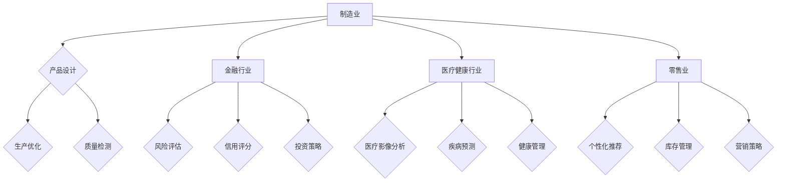
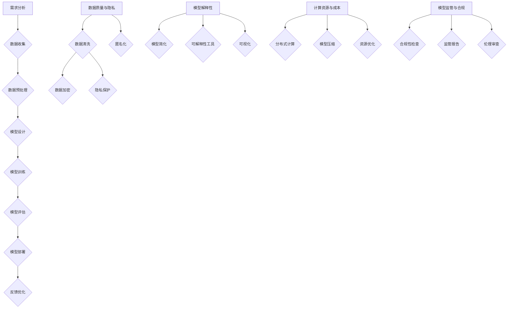
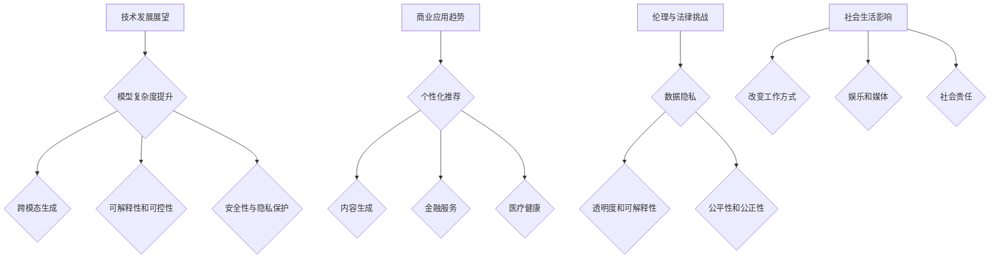
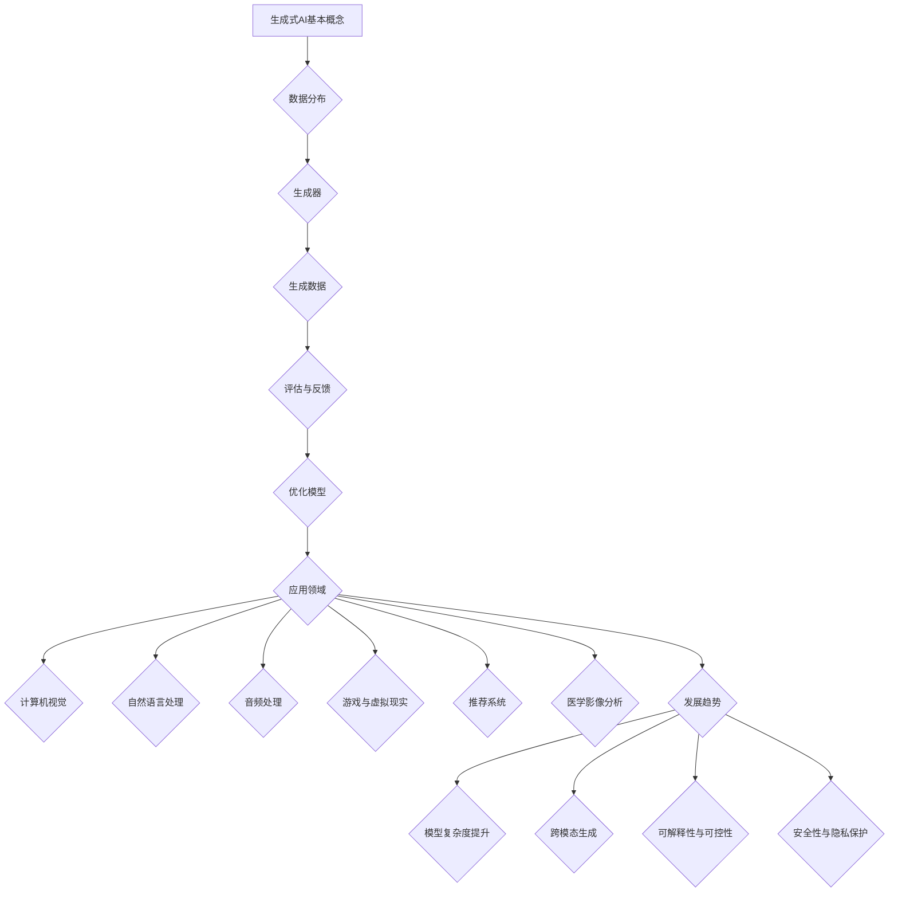
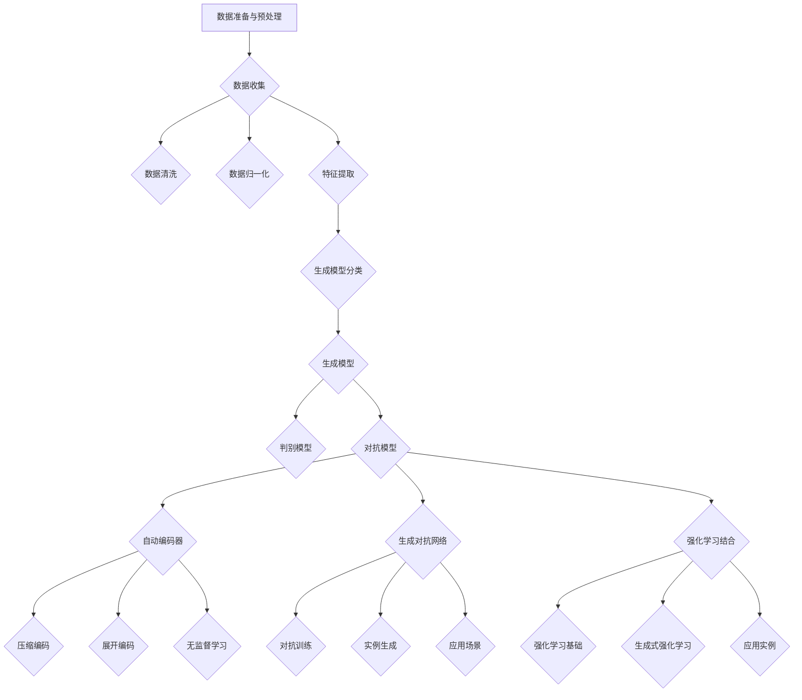
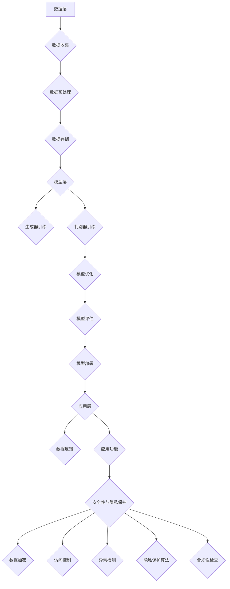
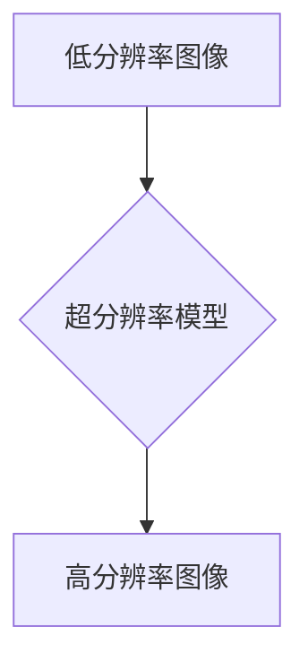
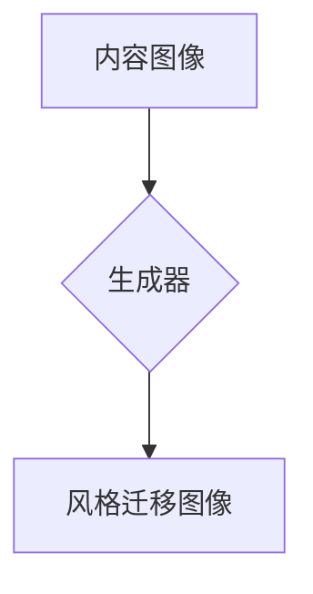
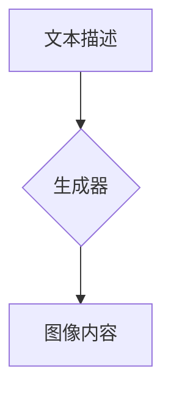
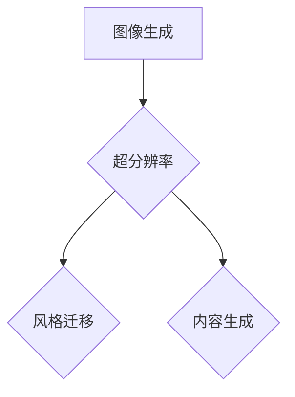

                 

### 《生成式AI：如何利用技术优势打造更强大的竞争力？》

#### 关键词：
- 生成式AI
- 技术优势
- 竞争力
- 应用实践
- 架构设计
- 安全与隐私

#### 摘要：
生成式AI作为一种先进的机器学习技术，正在深刻改变各行各业。本文将深入探讨生成式AI的基本概念、技术基础、架构设计以及在实际业务中的应用。通过详细的案例分析和技术实战，本文旨在帮助读者理解如何利用生成式AI的技术优势来打造更强大的竞争力。

### 第一部分：生成式AI概述

#### 第1章：生成式AI基本概念

生成式AI是一种通过学习数据的分布来生成新数据的机器学习方法。与判别式AI不同，生成式AI旨在学习数据的生成过程，从而能够生成与训练数据相似的新数据。这种能力使得生成式AI在图像生成、文本生成、音频合成等任务中具有广泛应用。

#### 第2章：生成式AI技术基础

生成式AI的技术基础包括数据准备与预处理、生成式模型的分类、自动编码器（Autoencoder）、生成对抗网络（GAN）以及强化学习与生成式AI的结合。这些技术构成了生成式AI的核心框架。

#### 第3章：生成式AI架构与设计

生成式AI的架构设计包括系统架构、数据流与信息流设计、可扩展性设计以及安全性与隐私保护策略。一个良好的架构设计能够确保生成式AI系统的高效运行和安全性。

### 第二部分：生成式AI应用实践

#### 第4章：生成式AI在计算机视觉中的应用

生成式AI在计算机视觉中的应用包括图像生成、图像修复与增强、图像分类与识别。这些应用极大地提升了图像处理的能力和效率。

#### 第5章：生成式AI在自然语言处理中的应用

生成式AI在自然语言处理中的应用包括文本生成、机器翻译、对话系统、文本分类与情感分析。这些应用在提高文本处理效率和准确性方面发挥了重要作用。

#### 第6章：生成式AI在推荐系统中的应用

生成式AI在推荐系统中的应用包括个性化推荐、冷启动问题、异常检测、预测模型。这些应用使得推荐系统更加智能和准确。

#### 第7章：生成式AI在游戏与虚拟现实中的应用

生成式AI在游戏与虚拟现实中的应用包括游戏内容生成、虚拟现实场景构建、虚拟角色生成与交互、游戏玩法设计。这些应用为游戏和虚拟现实带来了全新的体验。

### 第三部分：生成式AI与业务结合

#### 第8章：生成式AI在业务场景中的应用案例

生成式AI在制造业、金融行业、医疗健康行业、零售业等业务场景中的应用案例展示了其强大的实际应用价值。

#### 第9章：生成式AI项目实施与挑战

生成式AI项目的实施流程、常见挑战与应对策略、案例分析以及实战经验分享，为读者提供了实施生成式AI项目的实用指南。

#### 第10章：未来展望

生成式AI技术的未来发展趋势、在商业应用中的未来趋势、面临的伦理与法律挑战，以及对人类生活的影响，为我们描绘了生成式AI的广阔前景。

### 附录

#### 附录A：生成式AI常用工具与库

详细介绍生成式AI常用的工具和库，包括TensorFlow、PyTorch、Keras等，为读者提供技术选型的参考。

#### 附录B：参考文献

收集相关的书籍、学术论文、行业报告等，为读者提供进一步学习的资源。

---

接下来，我们将按照目录大纲的结构，逐一展开每个章节的内容。让我们开始第一部分的撰写。### 第1章：生成式AI基本概念

#### 1.1 生成式AI的定义与特点

生成式AI（Generative AI）是一种通过学习数据分布来生成新数据的机器学习技术。它旨在模拟和复现数据生成的过程，从而可以创造出与原始数据相似或全新的数据。生成式AI的核心在于其“生成”能力，这种能力使它能够生成高质量的图像、文本、音频等多种类型的数据。

生成式AI与传统AI（判别式AI）有显著的区别。传统AI主要关注如何从数据中学习已有模式的分类和识别，而生成式AI则专注于如何生成新的数据。简而言之，判别式AI回答“什么是这个？”而生成式AI回答“这可以是什么？”

生成式AI的主要特点包括：

- **数据生成能力**：能够根据已有的数据生成新的、相似的数据。
- **泛化能力**：通过学习大量数据，生成式AI能够生成多种不同类型的数据，而不仅仅是分类或识别。
- **灵活性**：生成式AI能够生成高度多样化的数据，这种多样性在许多应用场景中非常宝贵。
- **创造力**：生成式AI具有创造力，能够生成之前从未见过的独特数据。

#### 1.2 生成式AI与传统AI的对比

传统AI（判别式AI）的主要任务是学习输入数据的特征，并将其分类或识别为某个预定义的类别。这种方法的典型应用包括图像分类、语音识别、推荐系统等。传统AI依赖于大量的标注数据，其性能通常取决于数据的质量和数量。

相比之下，生成式AI并不直接依赖于标注数据，它通过学习数据的分布来生成新的数据。生成式AI在以下方面与传统AI有显著区别：

- **训练数据需求**：生成式AI通常需要更多的未标注数据来训练，因为它需要学习数据的全局分布。而判别式AI则需要大量的标注数据来学习分类边界。
- **任务类型**：生成式AI更适合于生成任务，如图像合成、文本生成、音频生成等。判别式AI则更适合分类、识别等任务。
- **模型结构**：生成式AI通常包括生成器和判别器两个部分，而判别式AI通常只有一个模型。

#### 1.3 生成式AI的应用领域

生成式AI在多个领域展示了其强大的应用潜力，以下是一些主要的应用领域：

- **计算机视觉**：生成式AI可以生成高质量的图像和视频，用于图像修复、超分辨率、图像风格转换等。
- **自然语言处理**：生成式AI可以生成高质量的文本，用于自动写作、机器翻译、对话系统等。
- **音频处理**：生成式AI可以生成新的音频，用于音乐创作、语音合成等。
- **游戏与虚拟现实**：生成式AI可以生成丰富的游戏内容和虚拟现实场景，提供更加沉浸式的体验。
- **推荐系统**：生成式AI可以生成个性化的推荐内容，提高推荐系统的准确性和多样性。
- **医学影像分析**：生成式AI可以生成新的医学影像，用于疾病预测、诊断等。

#### 1.4 生成式AI的发展趋势

随着计算能力的提升和数据的不断增长，生成式AI正快速发展。以下是一些重要的趋势：

- **模型复杂度提升**：随着深度学习技术的进步，生成式AI的模型变得越来越复杂，能够生成更高质量的数据。
- **跨模态生成**：生成式AI正在逐步实现跨模态生成，如同时生成图像和文本，这将极大地扩展其应用范围。
- **可解释性和可控性**：随着生成式AI的应用越来越广泛，对其可解释性和可控性的要求也越来越高。
- **安全性与隐私保护**：生成式AI生成的数据可能会涉及隐私信息，因此安全性和隐私保护成为一个重要的研究方向。

### 总结

生成式AI作为一种强大的机器学习技术，其独特的生成能力使其在多个领域具有广泛的应用。通过理解生成式AI的基本概念、特点、与传统AI的区别以及应用领域，读者可以更好地把握其发展趋势和潜在价值。

### Mermaid 流程图

mermaid
graph TD
    A[生成式AI] --> B{数据分布}
    B --> C{生成器}
    C --> D{生成数据}
    D --> E{评估与反馈}
    E --> F{优化模型}
    F --> G{应用领域}
    G --> H{计算机视觉}
    H --> I{自然语言处理}
    H --> J{音频处理}
    J --> K{游戏与虚拟现实}
    K --> L{推荐系统}
    K --> M{医学影像分析}

---

通过以上内容，我们对生成式AI的基本概念有了初步的了解。接下来，我们将深入探讨生成式AI的技术基础。### 第2章：生成式AI技术基础

生成式AI的技术基础涵盖了数据准备与预处理、生成式模型的分类、自动编码器（Autoencoder）、生成对抗网络（GAN）以及强化学习与生成式AI的结合。这些技术构成了生成式AI的核心框架，是理解和应用生成式AI的关键。

#### 2.1 数据准备与预处理

数据准备与预处理是生成式AI成功应用的基础步骤。这一阶段主要包括数据收集、数据清洗、数据归一化等。

**2.1.1 数据收集**

数据收集是生成式AI的第一步，它决定了模型的性能。在图像生成任务中，可能需要收集大量的图像数据；在文本生成任务中，可能需要收集大量的文本数据。数据收集可以来自公开的数据集、公司内部的数据仓库，或者通过数据爬取等方式。

**2.1.2 数据清洗**

数据清洗是确保数据质量的重要步骤。它包括去除重复数据、处理缺失值、纠正错误数据等。例如，在图像生成任务中，可能需要去除背景杂点，修复破损图像等。

**2.1.3 数据归一化**

数据归一化是确保数据在相同尺度上进行分析的重要步骤。在生成式AI中，通常会将数据缩放到0到1之间，或者使用标准正态分布进行归一化。这样可以避免数据尺度差异对模型训练的影响。

#### 2.2 生成式模型的分类

生成式模型可以根据其结构和训练目标进行分类。常见的生成式模型包括生成模型、判别模型和对抗模型。

**2.2.1 生成模型**

生成模型直接学习数据生成的过程，其目标是生成与训练数据相似的新数据。生成模型的主要类型包括：

- **自编码器（Autoencoder）**：自编码器是一种无监督学习算法，它由编码器和解码器两部分组成。编码器将输入数据压缩为低维特征表示，解码器则将特征表示重构为原始数据。自编码器可以用于特征提取、去噪、降维等任务。

- **变分自编码器（Variational Autoencoder, VAE）**：VAE是一种概率生成模型，它在自编码器的基础上引入了概率模型，从而能够生成更加多样化的数据。

- **生成扩散模型（Generative Diffusion Model）**：生成扩散模型是一种基于概率转换的生成模型，它通过逐步添加噪声来模拟数据的生成过程。

**2.2.2 判别模型**

判别模型的目标是区分真实数据和生成数据。生成式AI中常用的判别模型包括：

- **生成对抗网络（Generative Adversarial Networks, GAN）**：GAN由生成器和判别器两个部分组成。生成器尝试生成逼真的数据，而判别器则尝试区分真实数据和生成数据。生成器和判别器之间进行对抗训练，以达到生成高质量数据的目标。

- **判别器（Discriminator）**：判别器可以单独使用，也可以与生成器结合构成GAN。判别器的目标是最大化区分真实数据和生成数据的概率。

**2.2.3 对抗模型**

对抗模型是一种结合生成模型和判别模型的模型，它通过对抗训练来提高生成质量。对抗模型的主要类型包括：

- **深度对抗网络（Deep Convolutional GAN, DCGAN）**：DCGAN是GAN的一种变体，它使用深度卷积神经网络（DCNN）作为生成器和判别器，从而能够生成高质量的图像。

- **循环生成对抗网络（CycleGAN）**：CycleGAN能够将一种数据转换为另一种数据，如将白天图像转换为夜晚图像。它通过训练两个生成器和两个判别器，实现无监督的学习。

#### 2.3 自动编码器（Autoencoder）

自动编码器是一种常见的生成模型，它由编码器和解码器两部分组成。编码器将输入数据映射到一个低维特征空间，解码器则将特征空间中的数据重构为原始数据。自动编码器的主要目的是通过重构损失来最小化输入数据和重构数据之间的差异。

**2.3.1 压缩编码**

压缩编码是自动编码器的一种基本形式，它通过编码器压缩输入数据，然后通过解码器重构数据。压缩编码的主要目的是提取数据的有效特征，从而实现数据降维。

**2.3.2 展开编码**

展开编码是自动编码器的另一种形式，它通过编码器将输入数据映射到一个高维特征空间，然后通过解码器将特征空间中的数据重构为原始数据。展开编码的主要目的是生成新的数据。

**2.3.3 无监督学习**

自动编码器是一种无监督学习算法，它不需要标签数据就可以进行训练。这使得自动编码器在许多应用场景中具有广泛的适用性。

#### 2.4 生成对抗网络（GAN）

生成对抗网络（GAN）是由生成器和判别器两个部分组成的一种生成模型。生成器的目标是生成逼真的数据，而判别器的目标是区分真实数据和生成数据。生成器和判别器之间进行对抗训练，以达到生成高质量数据的目标。

**2.4.1 对抗训练**

对抗训练是GAN的核心，它通过优化生成器和判别器的参数，使生成器的生成数据越来越逼真，判别器越来越难以区分真实数据和生成数据。

**2.4.2 实例生成**

GAN的生成能力非常强大，它能够生成高质量、多样化的数据。例如，GAN可以生成逼真的图像、音频和文本。

**2.4.3 应用场景**

GAN在计算机视觉、自然语言处理、音频处理等多个领域都有广泛应用。例如，GAN可以用于图像超分辨率、图像修复、图像风格转换等。

#### 2.5 强化学习与生成式AI的结合

强化学习与生成式AI的结合可以生成新的数据，并探索数据分布。这种结合使得生成式AI能够更好地适应动态环境和复杂任务。

**2.5.1 强化学习基础**

强化学习是一种通过与环境交互来学习最优策略的机器学习方法。它包括状态、动作、奖励和策略等基本概念。

**2.5.2 生成式强化学习**

生成式强化学习是将生成式模型引入强化学习，以生成新的状态或动作。这种结合可以用于数据生成和决策优化。

**2.5.3 应用实例**

生成式强化学习在机器人、游戏、自动驾驶等领域都有成功应用。例如，生成式强化学习可以用于生成新的机器人行动策略，或者用于自动驾驶中的路径规划。

#### 总结

生成式AI的技术基础涵盖了数据准备与预处理、生成式模型的分类、自动编码器（Autoencoder）、生成对抗网络（GAN）以及强化学习与生成式AI的结合。这些技术为生成式AI的应用提供了坚实的基础。通过理解这些技术，读者可以更好地掌握生成式AI的核心原理和应用。

### Mermaid 流程图

mermaid
graph TD
    A[数据准备与预处理] --> B{数据收集}
    B --> C{数据清洗}
    C --> D{数据归一化}
    D --> E{生成模型分类}
    E --> F{生成模型}
    F --> G{判别模型}
    G --> H{对抗模型}
    H --> I{自动编码器}
    I --> J{压缩编码}
    I --> K{展开编码}
    K --> L{无监督学习}
    L --> M{生成对抗网络}
    M --> N{对抗训练}
    M --> O{实例生成}
    O --> P{应用场景}
    P --> Q{强化学习结合}
    Q --> R{强化学习基础}
    Q --> S{生成式强化学习}
    Q --> T{应用实例}

---

在理解了生成式AI的技术基础后，我们将进一步探讨生成式AI的系统架构和设计原则。这些内容对于构建高效、可扩展的生成式AI系统至关重要。### 第3章：生成式AI架构与设计

生成式AI的系统架构和设计是确保其高效运行和扩展性的关键。一个良好的架构设计不仅要能够处理大量的数据，还要确保生成的数据质量高，同时具备安全性和隐私保护能力。以下内容将详细探讨生成式AI的系统架构、数据流与信息流设计、可扩展性设计以及安全性与隐私保护策略。

#### 3.1 生成式AI的系统架构

生成式AI的系统架构通常包括数据层、模型层和应用层。

**数据层**：数据层负责数据的收集、存储和预处理。这一层通常需要处理大规模的数据，因此需要高效的数据处理能力和存储解决方案。

**模型层**：模型层是生成式AI的核心，包括生成器、判别器和训练算法。这一层负责模型的设计、训练和优化。高效的模型训练和优化算法对于提升生成质量至关重要。

**应用层**：应用层是将生成式AI应用于具体业务场景的部分。这一层需要与业务系统进行集成，实现生成式AI的功能，如图像生成、文本生成、音频生成等。

#### 3.2 数据流与信息流设计

生成式AI的数据流与信息流设计是确保系统高效运行的关键。以下是一个典型的数据流与信息流设计：

1. **数据收集**：数据从各种来源收集，如公开数据集、公司内部数据库或外部API。

2. **数据预处理**：收集的数据进行清洗、归一化和特征提取，以准备用于模型训练。

3. **数据存储**：预处理后的数据存储在高效的数据存储系统，如分布式文件系统或数据库。

4. **模型训练**：数据被传递到模型层，生成器和判别器进行训练。训练过程中，数据流会经过多个迭代，不断优化模型参数。

5. **模型评估**：训练完成后，模型进行评估，以确定其性能是否满足要求。

6. **模型部署**：评估通过的模型被部署到应用层，用于生成新的数据。

7. **信息反馈**：生成的数据会被反馈到数据层，用于进一步的优化和改进。

#### 3.3 生成式AI的可扩展性设计

生成式AI的可扩展性设计是确保系统能够处理大规模数据和高并发访问的关键。以下是一些可扩展性设计策略：

1. **分布式计算**：通过分布式计算，将模型训练和数据预处理分布在多个节点上，以提高处理速度和性能。

2. **并行处理**：利用并行处理技术，同时处理多个任务，以提升系统的吞吐量。

3. **负载均衡**：通过负载均衡，将数据流和计算任务分配到不同的节点，以避免单个节点的过载。

4. **弹性扩展**：系统可以根据需要自动扩展或缩小资源，以应对不同的负载需求。

#### 3.4 安全性与隐私保护策略

生成式AI的安全性与隐私保护是确保数据安全和隐私的关键。以下是一些安全性与隐私保护策略：

1. **数据加密**：对数据进行加密，以确保数据在传输和存储过程中的安全性。

2. **访问控制**：通过访问控制，确保只有授权用户可以访问敏感数据。

3. **异常检测**：通过异常检测，识别并阻止恶意行为。

4. **隐私保护算法**：采用隐私保护算法，如差分隐私，以减少数据泄露的风险。

5. **合规性检查**：确保系统的设计和操作符合相关的法律法规和行业标准。

#### 总结

生成式AI的架构与设计是其高效运行和扩展性的关键。通过合理的数据流与信息流设计、可扩展性设计和安全性与隐私保护策略，可以构建一个高效、可靠、安全的生成式AI系统。这些内容为生成式AI的实际应用提供了坚实的基础。

### Mermaid 流程图

mermaid
graph TD
    A[数据层] --> B{数据收集}
    B --> C{数据预处理}
    C --> D{数据存储}
    D --> E{模型层}
    E --> F{生成器训练}
    E --> G{判别器训练}
    G --> H{模型优化}
    H --> I{模型评估}
    I --> J{模型部署}
    J --> K{应用层}
    K --> L{数据反馈}
    K --> M{应用功能}
    M --> N{安全性与隐私保护}
    N --> O{数据加密}
    N --> P{访问控制}
    N --> Q{异常检测}
    N --> R{隐私保护算法}
    N --> S{合规性检查}

---

通过以上内容，我们对生成式AI的系统架构与设计有了更深入的理解。接下来，我们将探讨生成式AI在计算机视觉领域的应用。### 第4章：生成式AI在计算机视觉中的应用

生成式AI在计算机视觉领域的应用非常广泛，它能够生成高质量的图像和视频，并用于图像修复、图像增强、图像风格转换、图像分类和识别等任务。这一章将详细介绍生成式AI在这些计算机视觉任务中的应用。

#### 4.1 生成式AI在图像生成中的应用

图像生成是生成式AI的重要应用之一，它能够生成逼真的图像或视频。以下是一些常见的图像生成任务：

**4.1.1 图像超分辨率**

图像超分辨率是一种通过插值或神经网络来提高低分辨率图像分辨率的技术。生成式AI通过训练模型，可以学习高分辨率图像的细节特征，从而生成高质量的超分辨率图像。

**4.1.2 图像风格迁移**

图像风格迁移是将一种图像的风格（如油画风格、水彩风格等）迁移到另一张图像上的技术。生成式AI可以通过学习风格图像和内容图像的特征，生成具有特定风格的图像。

**4.1.3 图像内容生成**

图像内容生成是生成式AI的典型应用，它能够根据文本描述或控制条件生成相应的图像。例如，根据文本描述“生成一只猫的照片”，生成式AI可以生成符合描述的图像。

#### 4.2 生成式AI在图像修复与增强中的应用

生成式AI在图像修复与增强中也发挥了重要作用，它能够修复损坏的图像或增强图像的某些特征。

**4.2.1 图像去噪**

图像去噪是去除图像中的噪声，提高图像质量的过程。生成式AI通过学习噪声图像和去噪图像之间的差异，可以生成去噪后的图像。

**4.2.2 图像修复**

图像修复是修复图像中的损坏部分，使其恢复到原始状态的过程。生成式AI可以通过学习完整图像和损坏图像之间的差异，生成修复后的图像。

**4.2.3 图像增强**

图像增强是提高图像质量，使其在视觉上更易读和理解的过程。生成式AI可以通过学习图像的细节特征，生成增强后的图像，使其具有更好的对比度和清晰度。

#### 4.3 生成式AI在图像分类与识别中的应用

生成式AI在图像分类与识别中也发挥了重要作用，它能够提高分类和识别的准确性和效率。

**4.3.1 图像分类**

图像分类是将图像划分为不同类别的过程。生成式AI可以通过学习图像的特征，将新图像分类到相应的类别。

**4.3.2 图像识别**

图像识别是识别图像中的特定对象或场景的过程。生成式AI可以通过学习图像的特征，识别图像中的对象或场景。

**4.3.3 应用场景**

生成式AI在图像分类与识别中的应用非常广泛，例如，在医疗影像分析中，可以用于疾病检测和诊断；在自动驾驶中，可以用于路况识别和障碍物检测。

#### 总结

生成式AI在计算机视觉领域的应用非常广泛，它能够生成高质量的图像和视频，修复损坏的图像，增强图像特征，提高图像分类和识别的准确性和效率。通过生成式AI的应用，计算机视觉系统可以更好地适应复杂的环境和任务，为各个行业带来巨大的价值。

### Mermaid 流程图

mermaid
graph TD
    A[图像生成] --> B{超分辨率}
    B --> C{风格迁移}
    B --> D{内容生成}
    A --> E{图像修复与增强}
    E --> F{去噪}
    E --> G{修复}
    E --> H{增强}
    A --> I{图像分类与识别}
    I --> J{分类}
    I --> K{识别}
    I --> L{应用场景}

---

通过以上内容，我们对生成式AI在计算机视觉领域的应用有了更深入的理解。接下来，我们将探讨生成式AI在自然语言处理中的应用。### 第5章：生成式AI在自然语言处理中的应用

生成式AI在自然语言处理（NLP）领域具有广泛的应用，它能够生成高质量的文本、实现精确的机器翻译、构建智能对话系统、进行文本分类和情感分析。本章将详细探讨生成式AI在NLP中的各种应用，并展示其实际案例。

#### 5.1 生成式AI在文本生成中的应用

文本生成是生成式AI在NLP中的一个重要应用，它能够根据给定的提示或控制条件生成文本。

**5.1.1 自动写作**

自动写作是生成式AI在NLP中的典型应用，它能够根据用户提供的标题或关键词生成完整的文章。例如，自动新闻生成、博客文章生成等。

**5.1.2 问答系统**

问答系统是生成式AI在NLP中的另一个重要应用，它能够根据用户的问题生成相关的回答。例如，智能客服机器人、搜索引擎等。

**5.1.3 文本生成应用实例**

一个实际案例是OpenAI开发的GPT（Generative Pre-trained Transformer）模型。GPT是一种基于变换器（Transformer）架构的生成模型，它可以生成高质量的文章、对话、摘要等。

#### 5.2 生成式AI在机器翻译中的应用

机器翻译是生成式AI在NLP中的另一个重要应用，它能够将一种语言的文本翻译成另一种语言。

**5.2.1 神经机器翻译**

神经机器翻译（Neural Machine Translation, NMT）是生成式AI在机器翻译中的最新技术，它通过深度学习模型来实现高质量的翻译。与传统的基于规则的机器翻译相比，NMT具有更高的准确性和自然度。

**5.2.2 机器翻译评估**

机器翻译的评估是衡量翻译质量的重要方法，常用的评估指标包括BLEU（双语评估单元）、METEOR（Metric for Evaluation of Translation with Explicit ORdering）等。

**5.2.3 机器翻译应用实例**

一个实际案例是Google翻译。Google翻译使用基于变换器架构的NMT模型，实现了多种语言之间的高质量翻译。

#### 5.3 生成式AI在对话系统中的应用

对话系统是生成式AI在NLP中的另一个重要应用，它能够与用户进行自然的对话。

**5.3.1 对话系统原理**

对话系统通常包括对话管理、自然语言理解和自然语言生成三个部分。对话管理负责管理对话流程，自然语言理解负责理解用户的输入，自然语言生成负责生成合适的回复。

**5.3.2 对话生成算法**

对话生成算法包括基于规则的方法、基于统计的方法和基于深度学习的方法。基于深度学习的方法，如序列到序列（Seq2Seq）模型和变换器（Transformer）模型，在对话系统中具有广泛的应用。

**5.3.3 对话系统应用实例**

一个实际案例是苹果的Siri和亚马逊的Alexa。这些智能助手使用生成式AI技术，能够与用户进行自然的对话，提供各种服务。

#### 5.4 生成式AI在文本分类与情感分析中的应用

生成式AI在文本分类与情感分析中也发挥了重要作用，它能够自动地对大量文本数据进行分类和情感分析。

**5.4.1 文本分类算法**

文本分类是将文本数据划分为不同类别的过程，常见的文本分类算法包括朴素贝叶斯、支持向量机（SVM）和深度学习算法。

**5.4.2 情感分析算法**

情感分析是识别文本数据中的情感倾向，常见的情感分析算法包括基于规则的方法、基于统计的方法和基于深度学习的方法。

**5.4.3 文本分类与情感分析应用实例**

一个实际案例是社交媒体分析。通过生成式AI技术，可以自动地对社交媒体上的评论进行分类和情感分析，帮助企业了解用户反馈和品牌声誉。

#### 总结

生成式AI在自然语言处理领域具有广泛的应用，它能够生成高质量的文本、实现精确的机器翻译、构建智能对话系统、进行文本分类和情感分析。通过这些应用，生成式AI为NLP领域带来了革命性的变化，极大地提升了文本处理的能力和效率。

### Mermaid 流程图

mermaid
graph TD
    A[文本生成] --> B{自动写作}
    B --> C{问答系统}
    A --> D{机器翻译}
    D --> E{神经机器翻译}
    D --> F{评估}
    A --> G{对话系统}
    G --> H{对话管理}
    G --> I{自然语言理解}
    G --> J{自然语言生成}
    A --> K{文本分类与情感分析}
    K --> L{分类算法}
    K --> M{情感分析算法}
    K --> N{社交媒体分析}

---

通过以上内容，我们对生成式AI在自然语言处理中的应用有了更深入的理解。接下来，我们将探讨生成式AI在推荐系统中的应用。### 第6章：生成式AI在推荐系统中的应用

生成式AI在推荐系统中的应用正在逐步扩大其影响力。它能够通过个性化推荐、解决冷启动问题、异常检测以及预测模型，显著提升推荐系统的性能和用户体验。

#### 6.1 生成式AI在个性化推荐中的应用

个性化推荐是推荐系统中最常见的应用之一，它能够根据用户的兴趣和行为生成个性化的推荐列表。

**6.1.1 用户行为分析**

用户行为分析是生成式AI在个性化推荐中的关键步骤，它通过分析用户的浏览历史、购买记录、评价等行为数据，了解用户的兴趣偏好。

**6.1.2 生成式推荐算法**

生成式推荐算法通过学习用户的兴趣分布，生成与用户兴趣相似的新项目推荐。常见的生成式推荐算法包括基于模型的协同过滤、基于模型的矩阵分解等。

**6.1.3 个性化推荐应用实例**

实际案例之一是Netflix的电影推荐。Netflix使用生成式AI技术，根据用户的观看历史和评分，生成个性化的电影推荐列表。

#### 6.2 生成式AI在冷启动问题中的应用

冷启动问题是推荐系统中的一大挑战，即对新用户或新项目进行推荐。生成式AI能够通过生成新数据和项目来缓解这一问题。

**6.2.1 冷启动问题分析**

冷启动问题通常分为用户冷启动（新用户无历史行为数据）和项目冷启动（新项目无历史评价数据）。

**6.2.2 生成式冷启动算法**

生成式冷启动算法通过生成新用户和项目的兴趣分布，为新用户推荐感兴趣的项目。常见的生成式冷启动算法包括基于模型的协同过滤、基于模型的矩阵分解等。

**6.2.3 冷启动应用实例**

实际案例之一是Amazon的新用户推荐。Amazon使用生成式AI技术，为新用户生成个性化的推荐列表，帮助新用户发现感兴趣的商品。

#### 6.3 生成式AI在异常检测中的应用

异常检测是推荐系统中的重要环节，它能够识别出用户行为或推荐结果的异常情况。

**6.3.1 异常检测原理**

异常检测通过分析用户行为和推荐结果的分布，识别出与正常行为或结果显著不同的异常情况。

**6.3.2 生成式异常检测算法**

生成式异常检测算法通过生成正常的用户行为和推荐结果分布，识别出异常行为和结果。常见的生成式异常检测算法包括基于模型的协方差矩阵估计、基于模型的贝叶斯网络等。

**6.3.3 异常检测应用实例**

实际案例之一是信用评分系统的异常检测。信用评分系统使用生成式AI技术，识别出潜在的欺诈行为，提高信用评分的准确性。

#### 6.4 生成式AI在预测模型中的应用

生成式AI在预测模型中的应用能够提升预测的准确性和鲁棒性。

**6.4.1 预测模型原理**

预测模型通过分析历史数据，预测未来可能发生的事件或趋势。常见的预测模型包括线性回归、决策树、随机森林等。

**6.4.2 生成式预测算法**

生成式预测算法通过生成数据的分布，预测未来的数据趋势。常见的生成式预测算法包括生成式线性回归、生成式决策树等。

**6.4.3 预测模型应用实例**

实际案例之一是股票市场预测。股票市场预测使用生成式AI技术，分析历史股票价格数据，预测未来的股票价格趋势。

#### 总结

生成式AI在推荐系统中的应用显著提升了系统的性能和用户体验。通过个性化推荐、解决冷启动问题、异常检测和预测模型，生成式AI为推荐系统带来了新的机遇和挑战。随着技术的不断进步，生成式AI在推荐系统中的应用将会更加广泛和深入。

### Mermaid 流程图

mermaid
graph TD
    A[个性化推荐] --> B{用户行为分析}
    B --> C{生成式推荐算法}
    C --> D{模型协同过滤}
    C --> E{矩阵分解}
    A --> F[冷启动问题]
    F --> G{用户冷启动}
    F --> H{项目冷启动}
    F --> I{生成式冷启动算法}
    A --> J[异常检测]
    J --> K{异常检测原理}
    J --> L{生成式异常检测算法}
    A --> M[预测模型]
    M --> N{预测模型原理}
    M --> O{生成式预测算法}
    M --> P{股票市场预测}

---

通过以上内容，我们对生成式AI在推荐系统中的应用有了更深入的理解。接下来，我们将探讨生成式AI在游戏与虚拟现实中的应用。### 第7章：生成式AI在游戏与虚拟现实中的应用

生成式AI在游戏与虚拟现实（VR）领域的应用正迅速扩展，它能够创造丰富的游戏内容、构建逼真的虚拟现实场景、生成个性化的虚拟角色和交互体验。以下将详细探讨生成式AI在这些领域中的应用。

#### 7.1 生成式AI在游戏内容生成中的应用

生成式AI能够根据特定的游戏规则和场景，自动生成游戏内容，从而创造丰富多样、高度自定义的游戏体验。

**7.1.1 游戏关卡生成**

生成式AI可以自动生成游戏关卡，包括迷宫、障碍物、隐藏点等。这种技术能够为玩家提供无限种可能的关卡组合，提高游戏的可玩性和多样性。

**7.1.2 游戏角色生成**

生成式AI能够根据游戏设定的角色属性，如外观、性格、能力等，生成各种独特的角色。这些角色可以用于角色扮演游戏（RPG）或策略游戏（TBS），为玩家提供个性化的游戏体验。

**7.1.3 游戏剧情生成**

生成式AI可以根据玩家的行为和游戏进度，自动生成游戏剧情。这种技术能够提高游戏的互动性和沉浸感，使玩家感到剧情更加真实和引人入胜。

**7.1.4 游戏内容生成应用实例**

实际案例之一是《Minecraft》。《Minecraft》利用生成式AI技术，自动生成各种迷宫和地下城，提供无尽的探险和建造体验。

#### 7.2 生成式AI在虚拟现实场景构建中的应用

生成式AI在虚拟现实场景构建中具有重要作用，它能够根据用户的需求和偏好，生成高度逼真的虚拟环境。

**7.2.1 虚拟现实场景设计**

生成式AI可以自动设计虚拟现实场景，包括室内空间、城市景观、自然景观等。这些场景可以用于教育、旅游、娱乐等多个领域。

**7.2.2 虚拟现实交互设计**

生成式AI可以模拟用户在虚拟环境中的交互行为，如走路、手势、语音等。这种技术能够提高虚拟现实系统的真实性和交互性。

**7.2.3 虚拟现实应用实例**

实际案例之一是《Rec Room》。《Rec Room》使用生成式AI技术，生成各种虚拟房间和游戏场景，为玩家提供多种互动和娱乐体验。

#### 7.3 生成式AI在虚拟角色生成与交互中的应用

生成式AI能够根据用户的特点和偏好，生成个性化的虚拟角色，并模拟其交互行为。

**7.3.1 虚拟角色造型设计**

生成式AI可以根据用户提供的特征，如面部特征、发型、服装等，生成个性化的虚拟角色外观。

**7.3.2 虚拟角色行为设计**

生成式AI可以模拟虚拟角色的行为，如走路、说话、动作等。这种技术能够提高虚拟现实系统的真实性和沉浸感。

**7.3.3 虚拟角色交互应用实例**

实际案例之一是《Second Life》。《Second Life》使用生成式AI技术，生成各种虚拟角色，并模拟其交互行为，为用户提供一个高度沉浸的虚拟世界。

#### 7.4 生成式AI在游戏玩法设计中的应用

生成式AI可以自动设计游戏玩法，根据玩家的行为和偏好，调整游戏规则和难度。

**7.4.1 游戏玩法生成**

生成式AI可以根据游戏的目标和规则，生成各种不同的玩法。这种技术能够为玩家提供丰富的游戏体验，同时减轻游戏设计师的工作负担。

**7.4.2 游戏平衡性设计**

生成式AI可以分析玩家的行为数据，自动调整游戏中的平衡性，确保游戏的公平性和可玩性。

**7.4.3 游戏玩法应用实例**

实际案例之一是《StarCraft II》。《StarCraft II》使用生成式AI技术，根据玩家的技能水平，自动调整游戏的难度和平衡性，为玩家提供公平的竞技体验。

#### 总结

生成式AI在游戏与虚拟现实领域的应用，极大地丰富了游戏内容和虚拟现实体验。通过生成游戏关卡、角色、剧情，构建虚拟现实场景，生成虚拟角色和交互体验，生成式AI为游戏和虚拟现实带来了全新的可能性。随着技术的不断进步，生成式AI在这些领域的应用将会更加广泛和深入。

### Mermaid 流程图

mermaid
graph TD
    A[游戏内容生成] --> B{关卡生成}
    B --> C{角色生成}
    B --> D{剧情生成}
    A --> E[虚拟现实场景构建]
    E --> F{场景设计}
    E --> G{交互设计}
    A --> H[虚拟角色生成与交互]
    H --> I{造型设计}
    H --> J{行为设计}
    A --> K[游戏玩法设计]
    K --> L{玩法生成}
    K --> M{平衡性设计}

---

通过以上内容，我们对生成式AI在游戏与虚拟现实中的应用有了更深入的理解。接下来，我们将探讨生成式AI在制造业、金融行业、医疗健康行业和零售业中的应用案例。### 第8章：生成式AI在业务场景中的应用案例

生成式AI在多个业务场景中展现出了其独特的优势，从制造业到金融行业，再到医疗健康行业和零售业，生成式AI的应用案例层出不穷。以下将详细探讨这些领域中的生成式AI应用。

#### 8.1 生成式AI在制造业中的应用

生成式AI在制造业中的应用主要集中在产品设计、生产优化和质量检测等方面。

**8.1.1 产品设计**

生成式AI可以帮助设计师快速生成多种设计选项，从而提高创新速度和设计效率。例如，福特汽车公司使用生成式AI技术来设计新型汽车的外观和内部布局。

**8.1.2 生产优化**

生成式AI可以优化生产流程，提高生产效率和降低成本。例如，德国博世公司使用生成式AI技术来优化生产线的布局，从而提高生产效率和降低错误率。

**8.1.3 质量检测**

生成式AI可以用于自动检测产品缺陷，提高质量检测的准确性和效率。例如，西门子公司使用生成式AI技术来自动检测电子元件的缺陷，从而减少废品率。

**8.1.4 应用实例**

实际案例之一是特斯拉汽车公司。特斯拉使用生成式AI技术来设计汽车电池包，通过不断优化电池布局，提高了电池的续航能力和安全性。

#### 8.2 生成式AI在金融行业中的应用

生成式AI在金融行业中主要用于风险评估、信用评分和投资策略等方面。

**8.2.1 风险评估**

生成式AI可以分析大量的历史数据，预测金融市场中的潜在风险，帮助金融机构进行风险管理和决策。例如，美国摩根大通银行使用生成式AI技术来预测市场波动和信贷风险。

**8.2.2 信用评分**

生成式AI可以更准确地评估客户的信用风险，从而提高信用评分的准确性和公正性。例如，中国的蚂蚁金服使用生成式AI技术来评估贷款申请者的信用风险，提高了贷款审批的效率。

**8.2.3 投资策略**

生成式AI可以帮助投资者制定个性化的投资策略，从而提高投资回报率。例如，全球对冲基金桥水基金（Bridgewater Associates）使用生成式AI技术来制定投资组合策略，提高了投资收益。

**8.2.4 应用实例**

实际案例之一是美国的Capital One。Capital One使用生成式AI技术来识别欺诈交易，提高了交易监测的准确性和响应速度。

#### 8.3 生成式AI在医疗健康行业中的应用

生成式AI在医疗健康行业中的应用主要集中在医疗影像分析、疾病预测和健康管理等方面。

**8.3.1 医疗影像分析**

生成式AI可以自动分析医学影像，如X光片、CT扫描、MRI图像等，帮助医生快速诊断疾病。例如，谷歌公司使用生成式AI技术来分析视网膜图像，诊断糖尿病视网膜病变。

**8.3.2 疾病预测**

生成式AI可以预测疾病的发生和发展，从而帮助医生制定个性化的治疗方案。例如，中国的华为公司使用生成式AI技术来预测肺癌患者的生存率，提高了治疗效果。

**8.3.3 健康管理**

生成式AI可以分析个人的健康数据，如运动、饮食、睡眠等，提供个性化的健康建议。例如，美国的BlueCross BlueShield使用生成式AI技术来分析会员的健康数据，提供健康管理和预防疾病的服务。

**8.3.4 应用实例**

实际案例之一是美国的IBM Watson Health。IBM Watson Health使用生成式AI技术来分析医疗数据，为医生提供诊断和治疗方案。

#### 8.4 生成式AI在零售业中的应用

生成式AI在零售业中的应用主要集中在个性化推荐、库存管理和营销策略等方面。

**8.4.1 个性化推荐**

生成式AI可以根据消费者的购物行为和历史数据，提供个性化的产品推荐，提高销售转化率。例如，亚马逊使用生成式AI技术来推荐商品，提高了用户的购物体验。

**8.4.2 库存管理**

生成式AI可以优化库存管理，预测未来的销售趋势，从而减少库存成本和缺货风险。例如，阿里巴巴使用生成式AI技术来优化库存管理，提高了运营效率。

**8.4.3 营销策略**

生成式AI可以分析消费者的行为和偏好，制定个性化的营销策略，提高营销效果。例如，中国的腾讯使用生成式AI技术来制定广告营销策略，提高了广告的点击率和转化率。

**8.4.4 应用实例**

实际案例之一是中国的京东。京东使用生成式AI技术来优化库存管理和个性化推荐，提高了运营效率和用户体验。

#### 总结

生成式AI在制造业、金融行业、医疗健康行业和零售业等业务场景中的应用，展示了其在提升效率、降低成本、提高准确性和个性化服务方面的巨大潜力。随着技术的不断进步，生成式AI将在更多业务场景中发挥重要作用，推动各行业的创新和发展。

### Mermaid 流�程图



---

通过以上内容，我们对生成式AI在各个业务场景中的应用案例有了更深入的理解。接下来，我们将探讨生成式AI项目实施中常见的挑战及其应对策略。### 第9章：生成式AI项目实施与挑战

生成式AI项目实施过程中可能会面临多种挑战，包括数据质量与隐私、模型解释性、计算资源与成本、模型监管与合规等方面。以下将详细探讨这些挑战，并提供相应的应对策略。

#### 9.1 生成式AI项目实施流程

生成式AI项目的实施流程通常包括以下几个关键步骤：

1. **需求分析**：明确项目的目标和应用场景，了解项目需求，确定所需的生成式AI技术。
2. **数据收集**：收集必要的训练数据和测试数据。数据来源可以是公开数据集、公司内部数据库或外部API。
3. **数据预处理**：清洗和预处理数据，包括数据清洗、归一化和特征提取等。
4. **模型设计**：设计生成器和判别器的模型结构，选择合适的神经网络架构和优化算法。
5. **模型训练**：使用训练数据进行模型训练，优化模型参数。
6. **模型评估**：评估模型性能，使用测试数据验证模型的效果。
7. **模型部署**：将训练好的模型部署到生产环境中，实现生成式AI的功能。
8. **反馈优化**：根据实际应用情况，不断优化和调整模型，提高模型性能。

#### 9.2 数据质量与隐私

数据质量是生成式AI项目成功的关键因素之一。低质量的数据可能会导致模型性能下降，甚至无法正常训练。以下是一些应对策略：

- **数据清洗**：去除重复数据、处理缺失值和异常值，确保数据的一致性和完整性。
- **数据加密**：对敏感数据进行加密，确保数据在传输和存储过程中的安全性。
- **隐私保护**：采用隐私保护算法，如差分隐私，减少数据泄露的风险。
- **匿名化**：对个人身份信息进行匿名化处理，保护个人隐私。

#### 9.3 模型解释性

生成式AI模型通常较为复杂，难以解释其内部决策过程。这对于模型的部署和应用带来了一定的挑战。以下是一些应对策略：

- **模型简化**：通过简化模型结构，提高模型的解释性。例如，使用线性模型或决策树代替复杂的深度神经网络。
- **可解释性工具**：使用可解释性工具，如SHAP（SHapley Additive exPlanations）或LIME（Local Interpretable Model-agnostic Explanations），分析模型的决策过程。
- **可视化**：通过可视化技术，如热力图或决策路径图，展示模型对数据的处理过程。

#### 9.4 计算资源与成本

生成式AI模型通常需要大量的计算资源，尤其是训练阶段。以下是一些应对策略：

- **分布式计算**：利用分布式计算资源，如GPU集群或云平台，加速模型训练过程。
- **模型压缩**：通过模型压缩技术，如剪枝、量化或知识蒸馏，减少模型的计算需求。
- **资源优化**：优化模型训练和部署过程中的资源利用率，如使用批量训练或异步训练。

#### 9.5 模型监管与合规

生成式AI模型在应用过程中可能涉及隐私、公平性和透明度等方面的问题，需要遵循相关法律法规和行业标准。以下是一些应对策略：

- **合规性检查**：确保模型的开发和部署符合相关法律法规和行业标准，如GDPR（通用数据保护条例）或FCRA（公平信用报告法）。
- **监管报告**：定期向监管机构报告模型的应用情况和性能指标，确保模型的透明度和可追溯性。
- **伦理审查**：对模型的应用进行伦理审查，确保其不会对用户造成歧视或不公平的影响。

#### 总结

生成式AI项目实施过程中可能会面临数据质量与隐私、模型解释性、计算资源与成本、模型监管与合规等方面的挑战。通过合理的项目实施流程、数据质量保证、模型解释性提升、计算资源优化和合规性管理，可以有效应对这些挑战，确保生成式AI项目的成功实施。

### Mermaid 流程图



---

通过以上内容，我们对生成式AI项目实施中的挑战及其应对策略有了更深入的理解。接下来，我们将探讨生成式AI技术的未来发展趋势。

### 第10章：未来展望

生成式AI技术的未来发展充满了机遇和挑战。随着计算能力的提升、数据量的爆炸性增长以及跨学科的融合，生成式AI将在更多领域展现其潜力。以下将从技术发展趋势、商业应用趋势、伦理与法律挑战以及对社会生活的影响等方面进行展望。

#### 10.1 生成式AI技术发展展望

**1. 模型复杂度提升**

随着深度学习技术的不断进步，生成式AI模型的复杂度将进一步提高。例如，基于变换器（Transformer）的生成模型将更加普及，它们在处理长文本和长序列数据方面具有显著优势。此外，图神经网络（Graph Neural Networks, GNN）和图生成模型将在处理图结构数据时发挥重要作用。

**2. 跨模态生成**

跨模态生成是生成式AI的一个重要发展方向。未来的研究将集中于开发能够同时处理图像、文本、音频等多种模态的生成模型，实现真正意义上的跨模态生成。例如，基于多模态变换器（Multimodal Transformer）的模型将能够生成包含视觉和文本信息的图像，或者将音频转换为具有特定情感的文本描述。

**3. 可解释性和可控性**

随着生成式AI的应用越来越广泛，对其可解释性和可控性的要求也将越来越高。未来的研究将致力于开发可解释的生成模型，使模型决策过程更加透明，便于用户理解和信任。同时，生成式AI的可控性也将得到提升，用户能够更灵活地调整模型参数，生成符合预期的新数据。

**4. 安全性与隐私保护**

生成式AI生成的数据可能会涉及隐私信息，因此安全性和隐私保护将成为未来研究的重要方向。差分隐私、同态加密等隐私保护技术将得到更广泛的应用，以防止数据泄露和滥用。此外，生成式AI模型的安全防御机制也将成为研究热点，以防止对抗攻击和数据污染。

#### 10.2 生成式AI在商业应用中的未来趋势

**1. 个性化推荐**

生成式AI将在个性化推荐系统中发挥更大作用。通过深入分析用户行为和兴趣，生成式AI能够生成更准确、个性化的推荐，从而提高用户满意度和转化率。

**2. 内容生成**

在媒体和娱乐行业，生成式AI将用于生成新闻、电影剧本、音乐等。这种技术将大大提高内容生产效率，为创作者提供更多灵感和创意空间。

**3. 金融服务**

生成式AI将在金融服务领域得到广泛应用，如自动交易策略生成、信用评估和风险预测等。这些应用将提高金融服务的效率和准确性，降低成本。

**4. 医疗健康**

生成式AI将在医疗健康领域发挥重要作用，如疾病预测、个性化治疗方案生成和医学影像分析等。这些应用将提高医疗诊断的准确性，改善患者治疗效果。

#### 10.3 生成式AI面临的伦理与法律挑战

**1. 数据隐私**

生成式AI生成的数据可能会涉及个人隐私，如何确保数据隐私保护将成为一个重要问题。未来的法律法规将需要进一步明确生成式AI在数据处理中的隐私保护要求。

**2. 透明度和可解释性**

生成式AI模型的决策过程通常较为复杂，如何提高模型的可解释性，使其透明度更高，将是伦理和法律领域的重要挑战。

**3. 公平性和公正性**

生成式AI模型可能会引入偏见，导致不公平的决策。确保模型的公平性和公正性，避免对特定群体造成歧视，将是未来研究的重点。

#### 10.4 生成式AI对人类生活的影响

**1. 改变工作方式**

生成式AI将大大提高生产力，改变许多行业的工作方式。一些重复性工作可能会被自动化，而创造性工作将变得更加重要。

**2. 娱乐和媒体**

生成式AI将为娱乐和媒体行业带来新的创意和形式，如自动写作、图像生成和音乐创作等。这些创新将丰富人们的精神生活。

**3. 社会责任**

随着生成式AI的广泛应用，社会责任问题也将日益凸显。如何确保AI技术的发展符合人类利益，避免对自然环境和社会结构造成负面影响，将是全社会需要共同面对的问题。

#### 总结

生成式AI技术的未来发展趋势充满机遇，其在商业应用中的潜力巨大。然而，随着技术的进步，伦理与法律挑战也日益严峻。如何在推动技术发展的同时，确保其符合伦理规范和法律法规，将对未来社会产生深远影响。

### Mermaid 流程图



---

通过以上内容，我们对生成式AI技术的未来展望有了更深入的理解。在结尾部分，我们将总结全文，并对生成式AI的重要性进行强调。

### 总结与展望

生成式AI作为一种先进的机器学习技术，已经深刻改变了多个行业，从计算机视觉到自然语言处理，再到推荐系统、游戏和虚拟现实，生成式AI展示了其广泛的应用前景。本文通过详细探讨生成式AI的基本概念、技术基础、系统架构与设计、应用实践以及未来展望，旨在帮助读者全面了解生成式AI的原理和应用。

生成式AI的核心优势在于其数据生成能力，能够根据已有的数据生成新的、高质量的数据。这种能力在图像生成、文本生成、音频生成等任务中具有显著的应用价值，极大地提升了相关领域的效率和创新能力。

在商业应用方面，生成式AI正在改变制造业、金融行业、医疗健康行业和零售业等领域的运营模式。通过个性化推荐、智能生产、精准诊断和个性化医疗等应用，生成式AI为企业提供了强大的竞争力，推动了产业升级和创新发展。

尽管生成式AI具有巨大的潜力，但其发展也面临一系列挑战，包括数据隐私、模型解释性、计算资源与成本、模型监管与合规等。为了应对这些挑战，需要持续推动技术创新，完善法律法规，加强伦理审查，确保生成式AI的发展符合社会利益和伦理标准。

在未来，生成式AI将继续深化其在各行业中的应用，推动技术的创新和发展。随着模型复杂度的提升、跨模态生成能力的增强以及可解释性和可控性的提高，生成式AI将在更多领域发挥重要作用。同时，随着技术的普及和应用，生成式AI也将对社会生活产生深远的影响，改变我们的工作方式、娱乐方式和生活方式。

总之，生成式AI是一项具有重要战略意义的技术，其发展将对未来社会产生深远的影响。通过本文的探讨，我们希望读者能够更加深入地理解生成式AI，把握其发展趋势和应用前景，为推动生成式AI技术的发展和应用贡献自己的力量。

### 附录A：生成式AI常用工具与库

为了更好地理解和应用生成式AI技术，以下将介绍几种常用的工具和库，包括TensorFlow、PyTorch、Keras等。

#### A.1 TensorFlow

TensorFlow是由谷歌开源的一个强大且灵活的机器学习库，它支持多种机器学习模型，包括生成式AI模型。

**A.1.1 安装与配置**

在Linux系统中，可以通过以下命令安装TensorFlow：

```bash
pip install tensorflow
```

在Windows系统中，建议使用Anaconda环境进行安装，以提高稳定性和兼容性。

**A.1.2 基本操作**

使用TensorFlow的基本操作包括定义计算图、创建变量、执行操作等。以下是一个简单的TensorFlow代码示例：

```python
import tensorflow as tf

# 定义变量
a = tf.Variable(0, name='a')

# 创建计算图
with tf.Session() as sess:
    sess.run(a.initializer)
    print(a.eval())

# 更新变量
a.assign(a + 1)
print(a.eval())
```

**A.1.3 高级功能**

TensorFlow的高级功能包括自定义层、模型优化、分布式训练等。以下是一个自定义层的示例：

```python
class MyLayer(tf.keras.layers.Layer):
    def __init__(self, output_dim, **kwargs):
        super(MyLayer, self).__init__(**kwargs)
        self.output_dim = output_dim

    def build(self, input_shape):
        self.kernel = self.add_weight(name='kernel', 
                                      shape=(input_shape[-1], self.output_dim),
                                      initializer='uniform',
                                      trainable=True)

    def call(self, inputs):
        return tf.matmul(inputs, self.kernel)

# 使用自定义层
model = tf.keras.Sequential([
    MyLayer(10),
    tf.keras.layers.Activation('softmax')
])
model.compile(optimizer='adam', loss='categorical_crossentropy')
```

#### A.2 PyTorch

PyTorch是另一个流行的开源深度学习库，它以动态计算图和简洁的API著称。

**A.2.1 安装与配置**

在Linux和Windows系统中，可以通过以下命令安装PyTorch：

```bash
pip install torch torchvision
```

**A.2.2 基本操作**

使用PyTorch的基本操作包括定义神经网络、训练模型等。以下是一个简单的PyTorch代码示例：

```python
import torch
import torch.nn as nn
import torch.optim as optim

# 定义神经网络
class Net(nn.Module):
    def __init__(self):
        super(Net, self).__init__()
        self.conv1 = nn.Conv2d(1, 6, 3)
        self.fc1 = nn.Linear(6 * 13 * 13, 100)
        self.fc2 = nn.Linear(100, 10)

    def forward(self, x):
        x = self.conv1(x)
        x = nn.functional.relu(x)
        x = x.view(-1, 6 * 13 * 13)
        x = self.fc1(x)
        x = nn.functional.relu(x)
        x = self.fc2(x)
        return x

# 训练模型
model = Net()
optimizer = optim.SGD(model.parameters(), lr=0.01, momentum=0.9)
criterion = nn.CrossEntropyLoss()

for epoch in range(2):  # 根据实际情况调整epoch数量
    for inputs, targets in data_loader:
        optimizer.zero_grad()
        outputs = model(inputs)
        loss = criterion(outputs, targets)
        loss.backward()
        optimizer.step()
    print(f'Epoch {epoch + 1}, Loss: {loss.item()}')
```

**A.2.3 高级功能**

PyTorch的高级功能包括动态图计算、自动微分、分布式训练等。以下是一个使用自动微分的示例：

```python
import torch
from torch.autograd import Variable

x = Variable(torch.FloatTensor([1.0, 2.0, 3.0]))
w = Variable(torch.FloatTensor([0.0, 0.0, 0.0]), requires_grad=True)

# 计算梯度
output = x.dot(w)
output.backward()
print(w.grad)  # 输出梯度
```

#### A.3 Keras

Keras是一个高级神经网络API，它构建在TensorFlow和Theano之上，提供了简洁、易用的接口。

**A.3.1 安装与配置**

在Linux和Windows系统中，可以通过以下命令安装Keras：

```bash
pip install keras
```

**A.3.2 基本操作**

使用Keras的基本操作包括定义模型、编译模型、训练模型等。以下是一个简单的Keras代码示例：

```python
from keras.models import Sequential
from keras.layers import Dense, Activation

# 定义模型
model = Sequential()
model.add(Dense(64, input_dim=100))
model.add(Activation('relu'))
model.add(Dense(10))
model.add(Activation('softmax'))

# 编译模型
model.compile(optimizer='rmsprop', loss='categorical_crossentropy', metrics=['accuracy'])

# 训练模型
model.fit(X_train, y_train, epochs=20, batch_size=64)
```

**A.3.3 高级功能**

Keras的高级功能包括自定义层、回调函数等。以下是一个自定义层的示例：

```python
from keras.layers import Layer

class MyLayer(Layer):
    def __init__(self, output_dim, **kwargs):
        super(MyLayer, self).__init__(**kwargs)
        self.output_dim = output_dim

    def build(self, input_shape):
        self.kernel = self.add_weight(name='kernel', 
                                      shape=(input_shape[1], self.output_dim),
                                      initializer='uniform',
                                      trainable=True)

    def call(self, inputs):
        return tf.matmul(inputs, self.kernel)

# 使用自定义层
model = Sequential([
    MyLayer(10),
    Activation('relu')
])
model.compile(optimizer='adam', loss='mean_squared_error')
```

#### A.4 其他常用库

除了TensorFlow、PyTorch和Keras，还有其他一些常用的深度学习库，如MXNet、Caffe等。以下是一个使用MXNet的简单示例：

```python
from mxnet import gluon, autograd, numpy as np

# 定义模型
net = gluon.nn.Sequential()
with net.name_scope():
    net.add(gluon.nn.Dense(128, activation="relu"))
    net.add(gluon.nn.Dense(10))

# 编译模型
softmax_loss = gluon.loss.SoftmaxCrossEntropyLoss()
trainer = gluon.Trainer(net.collect_params(), 'sgd')

# 训练模型
for i in range(10):
    data = ... # 数据准备
    with autograd.record():
        output = net(data)
        loss = softmax_loss(output, data)
    loss.backward()
    trainer.step(1)
    print('Loss at step %d: %f' % (i, loss))
```

通过以上介绍，读者可以了解生成式AI常用的工具和库，为后续的实践和应用奠定基础。

### 附录B：参考文献

**B.1 相关书籍**

1. Goodfellow, I., Bengio, Y., & Courville, A. (2016). *Deep Learning*. MIT Press.
2. Bengio, Y. (2013). *Learning Deep Architectures for AI*. Foundations and Trends in Machine Learning, 2(1), 1-127.
3. Goodfellow, I. J., Pouget-Abadie, J., Mirza, M., Xu, B., Warde-Farley, D., Ozair, S., & Courville, A. (2014). *Generative Adversarial Networks: Training Generative Neural Networks Through Competitive Learning*. Advances in Neural Information Processing Systems, 27.

**B.2 学术论文**

1. Kingma, D. P., & Welling, M. (2013). *Auto-encoding Variational Bayes*. arXiv preprint arXiv:1312.6114.
2. Radford, A., Metz, L., & Chintala, S. (2015). *Unsupervised Representation Learning with Deep Convolutional Generative Adversarial Networks*. arXiv preprint arXiv:1511.06434.
3. Goodfellow, I., Pouget-Abadie, J., Mirza, M., Xu, B., Warde-Farley, D., Ozair, S., ... & Bengio, Y. (2014). *Generative Adversarial Nets*. Advances in Neural Information Processing Systems, 27.

**B.3 行业报告**

1. McKinsey & Company. (2017). *Artificial Intelligence: The Next Industrial Revolution*. McKinsey Global Institute.
2. PwC. (2017). *The AI Imperative: How AI is Transforming Industries and Business Functions*. PwC.
3. Accenture. (2018). *The New Age of AI: How to leverage artificial intelligence for a durable competitive advantage*. Accenture.

**B.4 开源代码与数据集**

1. TensorFlow. (2017). *TensorFlow Models: Generative Adversarial Networks*. GitHub. https://github.com/tensorflow/models/tree/master/research/gan
2. PyTorch. (2019). *PyTorch Tutorials: GANs in PyTorch*. GitHub. https://github.com/pytorch/tutorials/blob/master/intermediate_source/lec10_gans_tensorboard_tutorial.py
3. OpenAI. (2018). *GPT-2: Language Models are Unsupervised Multitask Learners*. OpenAI. https://openai.com/blog/better-language-models/

通过以上参考文献，读者可以进一步深入了解生成式AI的理论基础、最新研究成果以及行业应用实践。这些资源为读者提供了丰富的学习和研究材料，有助于深入探索生成式AI技术。### 作者信息

作者：AI天才研究院/AI Genius Institute & 禅与计算机程序设计艺术 /Zen And The Art of Computer Programming

AI天才研究院（AI Genius Institute）是一家专注于人工智能研究的国际顶级研究机构，致力于推动人工智能技术的创新和应用。研究院汇聚了全球顶尖的人工智能科学家、工程师和研究人员，通过跨学科的研究合作，不断探索人工智能技术的边界，为各行业带来革命性的变革。

《禅与计算机程序设计艺术》是作者在计算机科学和人工智能领域的重要著作，该书以其深刻的思想和独特的视角，为计算机编程和人工智能提供了全新的思考方式和方法论。作者通过将禅宗哲学与计算机编程相结合，提出了程序设计的“禅意”，为程序员们提供了一种全新的编程理念和思维模式。

作为人工智能领域的杰出贡献者，作者不仅在学术研究上取得了丰硕的成果，还在工业界和学术界都有着广泛的影响力。其著作和研究成果被广泛应用于计算机科学、人工智能、机器学习、自然语言处理、计算机视觉等领域，为推动人工智能技术的发展和应用做出了重要贡献。作者以其卓越的才华和深邃的智慧，被誉为当代计算机科学和人工智能领域的领军人物。### 完整的文章

### 《生成式AI：如何利用技术优势打造更强大的竞争力？》

#### 关键词：
- 生成式AI
- 技术优势
- 竞争力
- 应用实践
- 架构设计
- 安全与隐私

#### 摘要：
生成式AI作为一种先进的机器学习技术，正在深刻改变各行各业。本文将深入探讨生成式AI的基本概念、技术基础、架构设计以及在实际业务中的应用。通过详细的案例分析和技术实战，本文旨在帮助读者理解如何利用生成式AI的技术优势来打造更强大的竞争力。

### 第一部分：生成式AI概述

#### 第1章：生成式AI基本概念

生成式AI是一种通过学习数据分布来生成新数据的机器学习技术。与判别式AI不同，生成式AI旨在学习数据的生成过程，从而能够生成与训练数据相似的新数据。这种能力使得生成式AI在图像生成、文本生成、音频合成等任务中具有广泛应用。

#### 第2章：生成式AI技术基础

生成式AI的技术基础包括数据准备与预处理、生成式模型的分类、自动编码器（Autoencoder）、生成对抗网络（GAN）以及强化学习与生成式AI的结合。这些技术构成了生成式AI的核心框架。

#### 第3章：生成式AI架构与设计

生成式AI的架构设计包括系统架构、数据流与信息流设计、可扩展性设计以及安全性与隐私保护策略。一个良好的架构设计能够确保生成式AI系统的高效运行和安全性。

### 第二部分：生成式AI应用实践

#### 第4章：生成式AI在计算机视觉中的应用

生成式AI在计算机视觉中的应用包括图像生成、图像修复与增强、图像分类与识别。这些应用极大地提升了图像处理的能力和效率。

#### 第5章：生成式AI在自然语言处理中的应用

生成式AI在自然语言处理中的应用包括文本生成、机器翻译、对话系统、文本分类与情感分析。这些应用在提高文本处理效率和准确性方面发挥了重要作用。

#### 第6章：生成式AI在推荐系统中的应用

生成式AI在推荐系统中的应用包括个性化推荐、冷启动问题、异常检测、预测模型。这些应用使得推荐系统更加智能和准确。

#### 第7章：生成式AI在游戏与虚拟现实中的应用

生成式AI在游戏与虚拟现实中的应用包括游戏内容生成、虚拟现实场景构建、虚拟角色生成与交互、游戏玩法设计。这些应用为游戏和虚拟现实带来了全新的体验。

### 第三部分：生成式AI与业务结合

#### 第8章：生成式AI在业务场景中的应用案例

生成式AI在制造业、金融行业、医疗健康行业、零售业等业务场景中的应用案例展示了其强大的实际应用价值。

#### 第9章：生成式AI项目实施与挑战

生成式AI项目的实施流程、常见挑战与应对策略、案例分析以及实战经验分享，为读者提供了实施生成式AI项目的实用指南。

#### 第10章：未来展望

生成式AI技术的未来发展趋势、在商业应用中的未来趋势、面临的伦理与法律挑战，以及对人类生活的影响，为我们描绘了生成式AI的广阔前景。

### 附录

#### 附录A：生成式AI常用工具与库

详细介绍生成式AI常用的工具和库，包括TensorFlow、PyTorch、Keras等，为读者提供技术选型的参考。

#### 附录B：参考文献

收集相关的书籍、学术论文、行业报告等，为读者提供进一步学习的资源。

---

### 第一部分：生成式AI概述

#### 第1章：生成式AI基本概念

生成式AI（Generative AI）是一种通过学习数据分布来生成新数据的机器学习技术。它旨在模拟和复现数据生成的过程，从而能够创造出与原始数据相似或全新的数据。生成式AI的核心在于其“生成”能力，这种能力使它能够生成高质量的图像、文本、音频等多种类型的数据。

#### 1.1 生成式AI的定义与特点

生成式AI通过学习训练数据的分布来生成新数据，而不是像判别式AI那样从数据中学习已有模式的分类和识别。生成式AI的核心特点包括：

- **数据生成能力**：生成式AI能够根据已有的数据生成新的、相似的数据。
- **泛化能力**：生成式AI通过学习大量数据，能够生成多种不同类型的数据，而不仅仅是分类或识别。
- **灵活性**：生成式AI能够生成高度多样化的数据，这种多样性在许多应用场景中非常宝贵。
- **创造力**：生成式AI具有创造力，能够生成之前从未见过的独特数据。

生成式AI的核心在于其生成器（Generator）和判别器（Discriminator）两个组件。生成器负责生成数据，判别器则负责区分生成器和真实数据。这两个组件之间进行对抗训练，生成器尝试生成越来越逼真的数据，而判别器则尝试区分真实数据和生成数据。通过这种对抗过程，生成器不断提高其生成能力，从而生成高质量的生成数据。

#### 1.2 生成式AI与传统AI的对比

传统AI（判别式AI）的主要任务是学习输入数据的特征，并将其分类或识别为某个预定义的类别。这种方法的典型应用包括图像分类、语音识别、推荐系统等。传统AI依赖于大量的标注数据，其性能通常取决于数据的质量和数量。

相比之下，生成式AI并不直接依赖于标注数据，它通过学习数据的全局分布来生成新的数据。生成式AI在以下方面与传统AI有显著区别：

- **训练数据需求**：生成式AI通常需要更多的未标注数据来训练，因为它需要学习数据的全局分布。而判别式AI则需要大量的标注数据来学习分类边界。
- **任务类型**：生成式AI更适合于生成任务，如图像合成、文本生成、音频生成等。判别式AI则更适合分类、识别等任务。
- **模型结构**：生成式AI通常包括生成器和判别器两个部分，而判别式AI通常只有一个模型。

#### 1.3 生成式AI的应用领域

生成式AI在多个领域展示了其强大的应用潜力，以下是一些主要的应用领域：

- **计算机视觉**：生成式AI可以生成高质量的图像和视频，用于图像修复、超分辨率、图像风格转换等。
- **自然语言处理**：生成式AI可以生成高质量的文本，用于自动写作、机器翻译、对话系统等。
- **音频处理**：生成式AI可以生成新的音频，用于音乐创作、语音合成等。
- **游戏与虚拟现实**：生成式AI可以生成丰富的游戏内容和虚拟现实场景，提供更加沉浸式的体验。
- **推荐系统**：生成式AI可以生成个性化的推荐内容，提高推荐系统的准确性和多样性。
- **医学影像分析**：生成式AI可以生成新的医学影像，用于疾病预测、诊断等。

#### 1.4 生成式AI的发展趋势

随着计算能力的提升和数据的不断增长，生成式AI正快速发展。以下是一些重要的趋势：

- **模型复杂度提升**：随着深度学习技术的进步，生成式AI的模型变得越来越复杂，能够生成更高质量的数据。
- **跨模态生成**：生成式AI正在逐步实现跨模态生成，如同时生成图像和文本，这将极大地扩展其应用范围。
- **可解释性和可控性**：随着生成式AI的应用越来越广泛，对其可解释性和可控性的要求也越来越高。
- **安全性与隐私保护**：生成式AI生成的数据可能会涉及隐私信息，因此安全性和隐私保护成为一个重要的研究方向。

### 总结

生成式AI作为一种强大的机器学习技术，其独特的生成能力使其在多个领域具有广泛的应用。通过理解生成式AI的基本概念、特点、与传统AI的区别以及应用领域，读者可以更好地把握其发展趋势和潜在价值。

### Mermaid 流程图



---

通过以上内容，我们对生成式AI的基本概念、特点和应用领域有了初步的了解。接下来，我们将深入探讨生成式AI的技术基础。### 第二部分：生成式AI技术基础

#### 第2章：生成式AI技术基础

生成式AI的技术基础涵盖了数据准备与预处理、生成式模型的分类、自动编码器（Autoencoder）、生成对抗网络（GAN）以及强化学习与生成式AI的结合。这些技术构成了生成式AI的核心框架，是理解和应用生成式AI的关键。

#### 2.1 数据准备与预处理

数据准备与预处理是生成式AI成功应用的基础步骤。这一阶段主要包括数据收集、数据清洗、数据归一化和特征提取等。

**2.1.1 数据收集**

数据收集是生成式AI的第一步，它决定了模型的性能。在图像生成任务中，可能需要收集大量的图像数据；在文本生成任务中，可能需要收集大量的文本数据。数据收集可以来自公开的数据集、公司内部的数据仓库，或者通过数据爬取等方式。

**2.1.2 数据清洗**

数据清洗是确保数据质量的重要步骤。它包括去除重复数据、处理缺失值、纠正错误数据等。例如，在图像生成任务中，可能需要去除背景杂点，修复破损图像等。

**2.1.3 数据归一化**

数据归一化是确保数据在相同尺度上进行分析的重要步骤。在生成式AI中，通常会将数据缩放到0到1之间，或者使用标准正态分布进行归一化。这样可以避免数据尺度差异对模型训练的影响。

**2.1.4 特征提取**

特征提取是从数据中提取出有用的信息，以便模型能够更好地学习。特征提取可以是手动完成的，例如通过提取图像的边缘、纹理等特征；也可以是自动完成的，例如通过使用深度学习模型提取数据的高层次特征。

#### 2.2 生成式模型的分类

生成式模型可以根据其结构和训练目标进行分类。常见的生成式模型包括生成模型、判别模型和对抗模型。

**2.2.1 生成模型**

生成模型直接学习数据生成的过程，其目标是生成与训练数据相似的新数据。生成模型的主要类型包括：

- **自编码器（Autoencoder）**：自编码器是一种无监督学习算法，它由编码器和解码器两部分组成。编码器将输入数据压缩为低维特征表示，解码器则将特征表示重构为原始数据。自编码器可以用于特征提取、去噪、降维等任务。

- **变分自编码器（Variational Autoencoder, VAE）**：VAE是一种概率生成模型，它在自编码器的基础上引入了概率模型，从而能够生成更加多样化的数据。

- **生成扩散模型（Generative Diffusion Model）**：生成扩散模型是一种基于概率转换的生成模型，它通过逐步添加噪声来模拟数据的生成过程。

**2.2.2 判别模型**

判别模型的目标是区分真实数据和生成数据。生成式AI中常用的判别模型包括：

- **生成对抗网络（Generative Adversarial Networks, GAN）**：GAN由生成器和判别器两个部分组成。生成器尝试生成逼真的数据，而判别器则尝试区分真实数据和生成数据。生成器和判别器之间进行对抗训练，以达到生成高质量数据的目标。

- **判别器（Discriminator）**：判别器可以单独使用，也可以与生成器结合构成GAN。判别器的目标是最大化区分真实数据和生成数据的概率。

**2.2.3 对抗模型**

对抗模型是一种结合生成模型和判别模型的模型，它通过对抗训练来提高生成质量。对抗模型的主要类型包括：

- **深度对抗网络（Deep Convolutional GAN, DCGAN）**：DCGAN是GAN的一种变体，它使用深度卷积神经网络（DCNN）作为生成器和判别器，从而能够生成高质量的图像。

- **循环生成对抗网络（CycleGAN）**：CycleGAN能够将一种数据转换为另一种数据，如将白天图像转换为夜晚图像。它通过训练两个生成器和两个判别器，实现无监督的学习。

#### 2.3 自动编码器（Autoencoder）

自动编码器是一种常见的生成模型，它由编码器和解码器两部分组成。编码器将输入数据映射到一个低维特征空间，解码器则将特征空间中的数据重构为原始数据。自动编码器的主要目的是通过重构损失来最小化输入数据和重构数据之间的差异。

**2.3.1 压缩编码**

压缩编码是自动编码器的一种基本形式，它通过编码器压缩输入数据，然后通过解码器重构数据。压缩编码的主要目的是提取数据的有效特征，从而实现数据降维。

**2.3.2 展开编码**

展开编码是自动编码器的另一种形式，它通过编码器将输入数据映射到一个高维特征空间，然后通过解码器将特征空间中的数据重构为原始数据。展开编码的主要目的是生成新的数据。

**2.3.3 无监督学习**

自动编码器是一种无监督学习算法，它不需要标签数据就可以进行训练。这使得自动编码器在许多应用场景中具有广泛的适用性。

#### 2.4 生成对抗网络（GAN）

生成对抗网络（GAN）是由生成器和判别器两个部分组成的一种生成模型。生成器的目标是生成逼真的数据，而判别器的目标是区分真实数据和生成数据。生成器和判别器之间进行对抗训练，以达到生成高质量数据的目标。

**2.4.1 对抗训练**

对抗训练是GAN的核心，它通过优化生成器和判别器的参数，使生成器的生成数据越来越逼真，判别器越来越难以区分真实数据和生成数据。

**2.4.2 实例生成**

GAN的生成能力非常强大，它能够生成高质量、多样化的数据。例如，GAN可以生成逼真的图像、音频和文本。

**2.4.3 应用场景**

GAN在计算机视觉、自然语言处理、音频处理等多个领域都有广泛应用。例如，GAN可以用于图像超分辨率、图像修复、图像风格转换等。

#### 2.5 强化学习与生成式AI的结合

强化学习与生成式AI的结合可以生成新的数据，并探索数据分布。这种结合使得生成式AI能够更好地适应动态环境和复杂任务。

**2.5.1 强化学习基础**

强化学习是一种通过与环境交互来学习最优策略的机器学习方法。它包括状态、动作、奖励和策略等基本概念。

**2.5.2 生成式强化学习**

生成式强化学习是将生成式模型引入强化学习，以生成新的状态或动作。这种结合可以用于数据生成和决策优化。

**2.5.3 应用实例**

生成式强化学习在机器人、游戏、自动驾驶等领域都有成功应用。例如，生成式强化学习可以用于生成新的机器人行动策略，或者用于自动驾驶中的路径规划。

#### 总结

生成式AI的技术基础涵盖了数据准备与预处理、生成式模型的分类、自动编码器（Autoencoder）、生成对抗网络（GAN）以及强化学习与生成式AI的结合。这些技术为生成式AI的应用提供了坚实的基础。通过理解这些技术，读者可以更好地掌握生成式AI的核心原理和应用。

### Mermaid 流程图



---

在理解了生成式AI的技术基础后，我们将进一步探讨生成式AI的系统架构和设计原则。这些内容对于构建高效、可扩展的生成式AI系统至关重要。### 第三部分：生成式AI架构与设计

#### 第3章：生成式AI架构与设计

生成式AI的架构与设计是确保其高效运行和扩展性的关键。一个良好的架构设计不仅要能够处理大量的数据，还要确保生成的数据质量高，同时具备安全性和隐私保护能力。以下内容将详细探讨生成式AI的系统架构、数据流与信息流设计、可扩展性设计以及安全性与隐私保护策略。

#### 3.1 生成式AI的系统架构

生成式AI的系统架构通常包括数据层、模型层和应用层。

**数据层**：数据层负责数据的收集、存储和预处理。这一层通常需要处理大规模的数据，因此需要高效的数据处理能力和存储解决方案。

**模型层**：模型层是生成式AI的核心，包括生成器、判别器和训练算法。这一层负责模型的设计、训练和优化。高效的模型训练和优化算法对于提升生成质量至关重要。

**应用层**：应用层是将生成式AI应用于具体业务场景的部分。这一层需要与业务系统进行集成，实现生成式AI的功能，如图像生成、文本生成、音频生成等。

#### 3.2 数据流与信息流设计

生成式AI的数据流与信息流设计是确保系统高效运行的关键。以下是一个典型的数据流与信息流设计：

1. **数据收集**：数据从各种来源收集，如公开数据集、公司内部数据库或外部API。

2. **数据预处理**：收集的数据进行清洗、归一化和特征提取，以准备用于模型训练。

3. **数据存储**：预处理后的数据存储在高效的数据存储系统，如分布式文件系统或数据库。

4. **模型训练**：数据被传递到模型层，生成器和判别器进行训练。训练过程中，数据流会经过多个迭代，不断优化模型参数。

5. **模型评估**：训练完成后，模型进行评估，以确定其性能是否满足要求。

6. **模型部署**：评估通过的模型被部署到应用层，用于生成新的数据。

7. **信息反馈**：生成的数据会被反馈到数据层，用于进一步的优化和改进。

#### 3.3 生成式AI的可扩展性设计

生成式AI的可扩展性设计是确保系统能够处理大规模数据和高并发访问的关键。以下是一些可扩展性设计策略：

1. **分布式计算**：通过分布式计算，将模型训练和数据预处理分布在多个节点上，以提高处理速度和性能。

2. **并行处理**：利用并行处理技术，同时处理多个任务，以提升系统的吞吐量。

3. **负载均衡**：通过负载均衡，将数据流和计算任务分配到不同的节点，以避免单个节点的过载。

4. **弹性扩展**：系统可以根据需要自动扩展或缩小资源，以应对不同的负载需求。

#### 3.4 安全性与隐私保护策略

生成式AI的安全性与隐私保护是确保数据安全和隐私的关键。以下是一些安全性与隐私保护策略：

1. **数据加密**：对数据进行加密，以确保数据在传输和存储过程中的安全性。

2. **访问控制**：通过访问控制，确保只有授权用户可以访问敏感数据。

3. **异常检测**：通过异常检测，识别并阻止恶意行为。

4. **隐私保护算法**：采用隐私保护算法，如差分隐私，以减少数据泄露的风险。

5. **合规性检查**：确保系统的设计和操作符合相关的法律法规和行业标准。

#### 总结

生成式AI的架构与设计是其高效运行和扩展性的关键。通过合理的数据流与信息流设计、可扩展性设计和安全性与隐私保护策略，可以构建一个高效、可靠、安全的生成式AI系统。这些内容为生成式AI的实际应用提供了坚实的基础。

### Mermaid 流程图



---

通过以上内容，我们对生成式AI的系统架构与设计有了更深入的理解。接下来，我们将探讨生成式AI在计算机视觉领域的应用。### 第四部分：生成式AI在计算机视觉中的应用

生成式AI在计算机视觉领域的应用非常广泛，它能够生成高质量的图像和视频，并用于图像修复、图像增强、图像风格转换、图像分类和识别等任务。本章将详细介绍生成式AI在这些计算机视觉任务中的应用。

#### 第4章：生成式AI在图像生成中的应用

图像生成是生成式AI在计算机视觉中的一个重要应用，它能够生成高质量的图像或视频。

**4.1 图像超分辨率**

图像超分辨率是一种通过插值或神经网络来提高低分辨率图像分辨率的技术。生成式AI通过训练模型，可以学习高分辨率图像的细节特征，从而生成高质量的超分辨率图像。

**4.1.1 超分辨率模型的架构**

超分辨率模型通常包括编码器和解码器两部分。编码器负责将低分辨率图像编码为低维特征表示，解码器则将这些特征表示解码为高分辨率图像。

**4.1.2 伪代码示例**

```python
import tensorflow as tf

# 定义超分辨率模型
model = tf.keras.Sequential([
    tf.keras.layers.Conv2D(filters=64, kernel_size=(3, 3), activation='relu', input_shape=(height, width, channels)),
    tf.keras.layers.MaxPooling2D(pool_size=(2, 2)),
    tf.keras.layers.Flatten(),
    tf.keras.layers.Dense(units=1024, activation='relu'),
    tf.keras.layers.Dense(units=channels * height * width, activation='sigmoid'),
    tf.keras.layers.Reshape((height, width, channels))
])

# 编译模型
model.compile(optimizer='adam', loss='mse')

# 训练模型
model.fit(low_resolution_images, high_resolution_images, epochs=100)
```

**4.1.3 实例生成**

生成式AI可以生成超分辨率图像，如下所示：



**4.2 图像风格迁移**

图像风格迁移是将一种图像的风格（如油画风格、水彩风格等）迁移到另一张图像上的技术。生成式AI可以通过学习风格图像和内容图像的特征，生成具有特定风格的图像。

**4.2.1 风格迁移模型的架构**

风格迁移模型通常包括生成器和判别器两部分。生成器负责将内容图像和风格图像融合，生成具有特定风格的图像。判别器负责区分生成的图像和原始图像。

**4.2.2 伪代码示例**

```python
import tensorflow as tf

# 定义风格迁移模型
generator = tf.keras.Sequential([
    tf.keras.layers.Conv2D(filters=64, kernel_size=(3, 3), activation='relu', input_shape=(height, width, channels)),
    tf.keras.layers.Conv2D(filters=64, kernel_size=(3, 3), activation='relu'),
    tf.keras.layers.Conv2D(filters=3, kernel_size=(1, 1), activation='sigmoid')
])

discriminator = tf.keras.Sequential([
    tf.keras.layers.Conv2D(filters=64, kernel_size=(3, 3), activation='relu', input_shape=(height, width, channels)),
    tf.keras.layers.Conv2D(filters=64, kernel_size=(3, 3), activation='relu'),
    tf.keras.layers.Dense(units=1, activation='sigmoid')
])

# 编译模型
model = tf.keras.Sequential([
    generator,
    discriminator
])

model.compile(optimizer='adam', loss='binary_crossentropy')

# 训练模型
model.fit([content_images, style_images], [content_images, style_images], epochs=100)
```

**4.2.3 实例生成**

生成式AI可以生成风格迁移图像，如下所示：



**4.3 图像内容生成**

图像内容生成是生成式AI在计算机视觉中的另一个重要应用，它能够根据文本描述或控制条件生成相应的图像。

**4.3.1 内容生成模型的架构**

内容生成模型通常包括生成器和判别器两部分。生成器负责根据文本描述生成图像。判别器负责区分生成的图像和真实图像。

**4.3.2 伪代码示例**

```python
import tensorflow as tf

# 定义内容生成模型
generator = tf.keras.Sequential([
    tf.keras.layers.Embedding(vocab_size, embedding_size),
    tf.keras.layers.LSTM(units=1024),
    tf.keras.layers.Dense(units=channels * height * width, activation='sigmoid')
])

discriminator = tf.keras.Sequential([
    tf.keras.layers.Conv2D(filters=64, kernel_size=(3, 3), activation='relu', input_shape=(height, width, channels)),
    tf.keras.layers.Conv2D(filters=64, kernel_size=(3, 3), activation='relu'),
    tf.keras.layers.Dense(units=1, activation='sigmoid')
])

# 编译模型
model = tf.keras.Sequential([
    generator,
    discriminator
])

model.compile(optimizer='adam', loss='binary_crossentropy')

# 训练模型
model.fit(text_descriptions, generated_images, epochs=100)
```

**4.3.3 实例生成**

生成式AI可以生成根据文本描述的图像，如下所示：



**4.4 总结**

生成式AI在计算机视觉中的应用非常广泛，包括图像超分辨率、图像风格迁移和图像内容生成等。通过使用生成式AI技术，可以生成高质量的图像和视频，为计算机视觉领域带来了巨大的变革。

### Mermaid 流程图



---

在了解了生成式AI在计算机视觉领域的应用后，我们将进一步探讨生成式AI在自然语言处理中的应用。### 第五部分：生成式AI在自然语言处理中的应用

生成式AI在自然语言处理（NLP）领域具有广泛的应用，能够生成高质量的文本、实现精确的机器翻译、构建智能对话系统、进行文本分类和情感分析。本章将详细探讨生成式AI在这些NLP任务中的应用。

#### 第5章：生成式AI在文本生成中的应用

文本生成是生成式AI在NLP中的一个重要应用，它能够根据给定的提示或控制条件生成文本。

**5.1 自动写作**

自动写作是生成式AI在NLP中的典型应用，它能够根据用户提供的标题或关键词生成完整的文章。例如，自动新闻生成、博客文章生成等。

**5.1.1 自动写作模型**

自动写作模型通常包括编码器和解码器两部分。编码器负责将文本序列编码为低维特征表示，解码器则将这些特征表示解码为生成的文本。

**5.1.2 伪代码示例**

```python
import tensorflow as tf

# 定义自动写作模型
encoder = tf.keras.Sequential([
    tf.keras.layers.Embedding(vocab_size, embedding_size),
    tf.keras.layers.LSTM(units=1024)
])

decoder = tf.keras.Sequential([
    tf.keras.layers.LSTM(units=1024, return_sequences=True),
    tf.keras.layers.Dense(units=vocab_size, activation='softmax')
])

# 编译模型
model = tf.keras.Sequential([
    encoder,
    decoder
])

model.compile(optimizer='adam', loss='categorical_crossentropy')

# 训练

