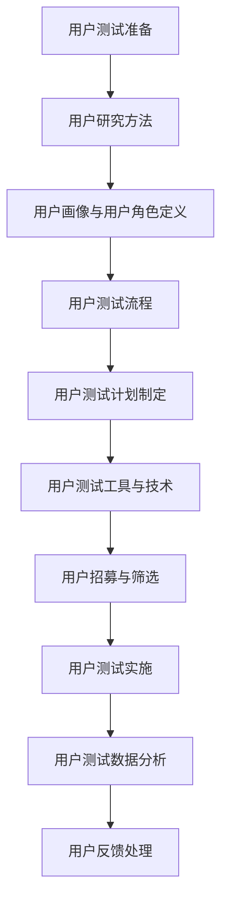
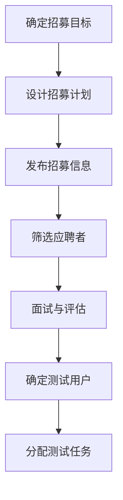
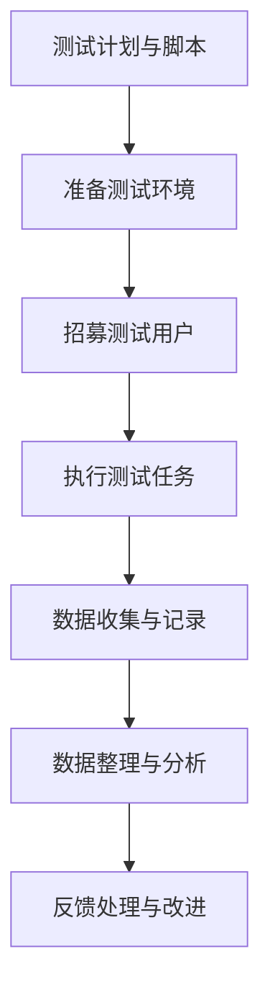
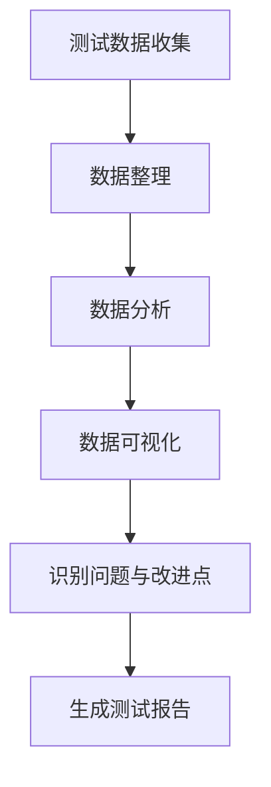
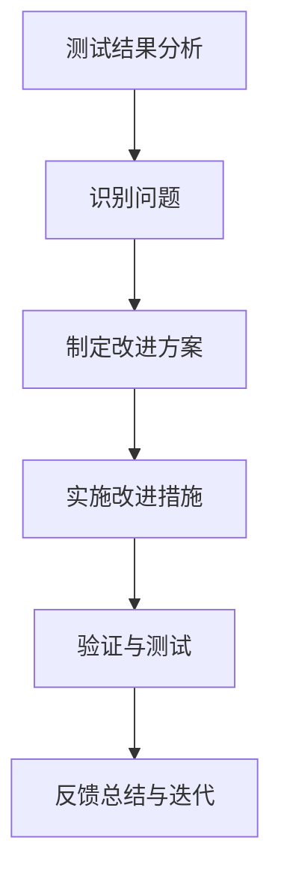

                 

### 《用户测试：招募种子用户或试点客户》

> **关键词：** 用户测试、种子用户、试点客户、招募、流程、分析、应用、案例分析

> **摘要：** 本文将深入探讨用户测试的重要性，详细解析用户测试的基础知识、准备、实施、管理、结果应用和案例分析。通过阐述种子用户和试点客户的选择与招募策略，本文旨在为IT从业者提供一套完整的用户测试指南，助力产品优化和用户体验提升。

用户测试是产品开发过程中至关重要的一环，它能够帮助我们了解产品在真实环境下的表现，识别潜在问题和改进点。本文将逐步阐述用户测试的基础知识，从定义、目的、类型，到准备、招募、实施和管理，最后分析用户测试的结果应用和案例分析。通过这些内容，我们希望能够为读者提供一套实用的用户测试指南，帮助他们在产品开发过程中做出更明智的决策。

### 第一部分：用户测试基础

在进入用户测试的详细探讨之前，我们需要先了解一些基础概念。这一部分将为我们后续的讨论奠定坚实的基础。

#### 第1章：用户测试概述

##### 1.1 用户测试的定义与目的

用户测试，即通过让真实用户参与测试，来评估产品的易用性、可用性和用户体验。其核心目的是发现产品在用户使用过程中的问题，优化产品设计和功能，提高用户满意度和留存率。

用户测试的主要目标包括：

1. **发现设计缺陷**：通过用户实际操作，找出产品界面、功能设计等方面的不足。
2. **用户体验优化**：通过用户反馈，改进产品的交互设计和操作流程，提升用户体验。
3. **功能验证**：确保产品功能满足用户需求，并且能够正确运行。
4. **需求理解**：通过用户参与，更深入地理解用户需求，为后续产品迭代提供方向。

##### 1.2 用户测试的类型与选择

用户测试可以根据不同的维度进行分类，以下是几种常见的用户测试类型：

1. **功能测试**：主要关注产品功能是否按照预期工作，包括操作流程、功能点验证等。
2. **性能测试**：评估产品在特定负载下的响应速度、稳定性等性能指标。
3. **可用性测试**：测试产品的易用性，包括用户界面的直观性、操作的便捷性等。
4. **用户体验测试**：通过观察用户使用产品的过程，评估产品的整体用户体验。
5. **安全性测试**：确保产品的数据安全和隐私保护。

选择合适的用户测试类型，取决于产品需求和测试阶段。例如，在产品早期阶段，功能测试和可用性测试可能更为重要；而在产品成熟阶段，性能测试和安全性测试可能成为焦点。

##### 1.3 用户测试的重要性

用户测试在产品开发中具有重要意义，主要体现在以下几个方面：

1. **提高产品质量**：通过用户测试，能够及时发现和修复问题，提高产品的稳定性和可靠性。
2. **降低风险**：用户测试可以帮助识别潜在风险，避免产品发布后因问题导致的不良影响。
3. **节省成本**：早期发现问题并进行修复，可以避免后期大规模返工和成本增加。
4. **提升用户体验**：通过用户测试，能够更好地满足用户需求，提高用户满意度和忠诚度。
5. **优化产品迭代**：用户测试提供的数据和反馈，为后续产品迭代提供宝贵参考，推动产品不断优化。

##### 1.4 用户测试的常见误区

在进行用户测试时，有些误区需要注意，以避免影响测试结果和效果：

1. **样本量不足**：测试样本量过小，可能导致结论不准确。
2. **测试环境不真实**：测试环境与实际用户使用场景不符，可能导致测试结果失真。
3. **缺乏明确目标**：测试目标不明确，可能导致测试过程缺乏针对性。
4. **过度依赖数据**：仅依靠数据，忽视用户反馈，可能导致对用户需求的误解。
5. **忽视测试结果**：对测试结果不重视，可能导致问题未被及时解决，影响产品品质。

#### 第2章：用户测试准备

##### 2.1 用户研究方法

用户研究是用户测试的基础，通过研究用户的需求和行为，我们可以更好地设计测试方案和评估产品。以下是几种常见的用户研究方法：

1. **问卷调查**：通过设计问卷，收集用户对产品的看法和需求。
2. **深度访谈**：与用户进行一对一的深入交流，了解他们的真实感受和需求。
3. **用户观察**：在用户使用产品的过程中进行观察，记录他们的行为和操作。
4. **用户访谈**：通过访谈了解用户的感受、需求和痛点。
5. **可用性测试**：模拟用户实际使用产品，评估产品的易用性和用户体验。

##### 2.2 用户画像与用户角色定义

用户画像是对目标用户群体的描述，包括用户的基本信息、行为特征、需求偏好等。通过用户画像，我们可以更好地了解用户，为后续的测试和产品设计提供依据。以下是创建用户画像的步骤：

1. **确定目标用户群体**：明确产品的目标用户，例如年龄、性别、职业等。
2. **收集用户数据**：通过问卷调查、访谈等方式收集用户数据。
3. **分析用户数据**：对收集到的数据进行分析，提取关键特征。
4. **创建用户画像**：将分析结果汇总，形成用户画像。
5. **验证用户画像**：通过访谈或问卷调查等方式，验证用户画像的准确性。

用户角色是基于用户画像创建的虚拟用户，用于代表目标用户群体。以下是创建用户角色的步骤：

1. **定义用户角色**：根据用户画像，创建几个具有代表性的用户角色。
2. **描述用户角色**：为每个用户角色定义基本信息、需求、行为等。
3. **使用用户角色**：在测试、设计和开发过程中，使用用户角色代表真实用户。
4. **更新用户角色**：根据用户反馈和产品迭代，定期更新用户角色。

##### 2.3 用户测试流程

用户测试流程是确保测试顺利进行的关键，包括以下几个步骤：

1. **制定测试计划**：明确测试目标、测试类型、测试场景等。
2. **设计测试用例**：根据测试目标，设计具体的测试任务和步骤。
3. **招募测试用户**：根据用户画像，选择合适的测试用户。
4. **准备测试环境**：确保测试环境与用户实际使用环境相似。
5. **执行测试**：按照测试用例，指导用户进行测试。
6. **收集反馈**：收集用户的反馈和问题。
7. **分析结果**：对测试结果进行分析，识别问题和改进点。
8. **反馈与改进**：将测试结果反馈给团队，推动产品改进。

##### 2.4 用户测试计划制定

用户测试计划是指导整个测试过程的关键文档，包括以下几个部分：

1. **测试目标**：明确测试的目标和预期成果。
2. **测试类型**：确定测试的类型，例如功能测试、性能测试、可用性测试等。
3. **测试场景**：设计具体的测试场景，包括用户操作、测试数据等。
4. **测试任务**：详细描述每个测试任务，包括测试步骤、输入数据、预期结果等。
5. **测试用户**：根据用户画像，确定测试用户的基本信息和选择标准。
6. **测试时间**：安排测试的时间和周期。
7. **测试资源**：明确测试所需的资源和预算。
8. **风险与应对措施**：识别可能的风险，并制定应对措施。

##### 2.5 用户测试工具与技术

用户测试工具是辅助测试过程的重要手段，包括以下几个类别：

1. **远程测试工具**：例如UserTesting、Lookback等，允许远程观察用户操作。
2. **可用性测试工具**：例如Optimal Workshop、UsabilityHub等，提供用户测试和反馈功能。
3. **用户访谈工具**：例如Zoom、Microsoft Teams等，用于进行远程访谈。
4. **问卷工具**：例如Google 表单、Typeform等，用于收集用户反馈。
5. **数据分析工具**：例如Google Analytics、Mixpanel等，用于分析用户行为和反馈。

技术方面，用户测试需要关注以下几个方面：

1. **测试环境搭建**：确保测试环境的稳定性和可重复性。
2. **测试数据管理**：合理管理测试数据，确保数据的准确性和安全性。
3. **测试脚本编写**：编写测试脚本，自动化执行测试任务。
4. **测试数据分析**：使用数据分析工具，对测试结果进行定量和定性分析。
5. **测试报告生成**：生成详细的测试报告，总结测试结果和改进建议。

#### 第3章：用户招募与筛选

##### 3.1 种子用户的定义与重要性

种子用户是产品早期阶段的用户群体，他们对产品有着高度的兴趣和热情，能够为产品的推广和反馈提供重要支持。种子用户的定义和重要性体现在以下几个方面：

1. **定义**：种子用户是产品初期阶段的核心用户群体，他们通常是产品最忠实的支持者，对产品的改进和推广具有重要影响。
2. **重要性**：
   - **反馈收集**：种子用户能够提供真实的用户反馈，帮助识别产品问题和改进方向。
   - **产品推广**：种子用户可以成为产品的口碑传播者，吸引更多潜在用户。
   - **市场需求验证**：通过种子用户的使用，可以验证产品是否满足市场需求，为后续产品迭代提供依据。
   - **产品优化**：种子用户的使用场景和反馈，有助于产品功能和用户体验的优化。

##### 3.2 种子用户的招募渠道

招募种子用户是用户测试的重要环节，以下是几种常见的招募渠道：

1. **社交媒体**：通过微博、微信、Facebook、Twitter等社交媒体平台，发布招募信息，吸引潜在种子用户。
2. **用户论坛**：在产品相关的用户论坛或社区，发布招募帖，吸引活跃用户参与。
3. **专业网站**：在专业网站或平台，发布招募信息，吸引目标用户群体。
4. **用户推荐**：鼓励现有用户推荐新用户，通过用户口碑传播，扩大种子用户群体。
5. **线下活动**：举办线下活动，如讲座、研讨会等，吸引对产品感兴趣的用户。

##### 3.3 用户筛选标准与方法

种子用户的筛选标准和方法直接影响测试结果的准确性和有效性。以下是几种常见的筛选标准和方法：

1. **用户画像匹配**：根据产品目标用户画像，筛选符合条件的目标用户。
2. **兴趣与活跃度**：筛选对产品有浓厚兴趣且在社区或论坛中活跃的用户。
3. **使用场景符合**：筛选符合产品使用场景的用户，确保测试结果的适用性。
4. **技术能力**：根据产品特点，筛选具备相应技术能力的用户，以便更好地理解和使用产品。
5. **数据质量**：筛选数据质量高、愿意提供真实反馈的用户，确保测试数据的准确性。

筛选方法包括：

1. **问卷调查**：通过问卷调查，收集用户的基本信息、使用场景和需求。
2. **面试筛选**：通过面试，深入了解用户背景、兴趣和使用情况。
3. **行为分析**：通过用户在社区或论坛中的行为记录，分析其兴趣和活跃度。
4. **试用体验**：让用户进行产品试用，根据试用体验进行筛选。
5. **数据验证**：对筛选的用户进行数据验证，确保其提供的信息真实可靠。

##### 3.4 用户激励与回馈策略

为了确保种子用户的参与度和积极性，制定合理的激励和回馈策略至关重要。以下是几种常见的激励和回馈策略：

1. **奖励机制**：为参与测试的用户提供奖励，如优惠券、积分、实物奖品等。
2. **用户访谈**：定期邀请种子用户进行访谈，了解他们的意见和建议，并将其反馈到产品改进中。
3. **优先体验**：为种子用户提供产品优先体验机会，让他们成为产品的新功能试用者。
4. **用户社区**：建立用户社区，鼓励种子用户之间的交流和分享，增强他们的归属感和参与感。
5. **荣誉展示**：在产品页面或社区中，对参与测试的种子用户进行展示，给予他们一定的荣誉和认可。

### 第二部分：用户测试进阶

#### 第4章：用户测试实施

##### 4.1 用户测试场景设计

用户测试场景设计是确保测试有效性的关键，它需要模拟真实用户的使用环境和场景。以下是设计用户测试场景的步骤：

1. **确定测试目标**：明确测试目标，例如功能测试、性能测试、可用性测试等。
2. **选择测试任务**：根据测试目标，设计具体的测试任务，如完成某个操作、填写问卷等。
3. **创建测试脚本**：编写详细的测试脚本，包括测试步骤、输入数据、预期结果等。
4. **选择测试用户**：根据用户画像和筛选标准，选择合适的测试用户。
5. **准备测试环境**：搭建与真实使用环境相似的测试环境，确保测试条件的可控性。
6. **分配测试资源**：合理分配测试所需的硬件、软件和人力资源。
7. **制定测试计划**：制定详细的测试计划，包括测试时间、地点、人员等。
8. **进行预测试**：在正式测试前，进行预测试，确保测试脚本和环境的正确性。

##### 4.2 用户测试任务设计

用户测试任务设计需要考虑用户的行为模式和需求，以下是设计用户测试任务的步骤：

1. **定义任务目标**：明确任务的目标，如测试某个功能、评估用户体验等。
2. **选择任务类型**：根据测试目标，选择合适的任务类型，如操作任务、认知任务、情感任务等。
3. **设计任务场景**：创建与用户实际使用场景相似的测试场景。
4. **编写任务描述**：详细描述任务的目标、步骤、输入数据等。
5. **设置任务难度**：根据用户能力和测试目标，设置适当的任务难度。
6. **设计测试脚本**：编写详细的测试脚本，包括任务描述、测试步骤、输入数据、预期结果等。
7. **预测试**：在正式测试前，进行预测试，确保任务设计的合理性和测试脚本的正确性。

##### 4.3 用户测试数据收集

用户测试数据收集是分析用户行为和测试结果的基础，以下是收集用户测试数据的步骤：

1. **确定数据类型**：明确需要收集的数据类型，如用户行为数据、反馈数据、性能数据等。
2. **选择数据收集工具**：根据数据类型，选择合适的数据收集工具，如日志工具、问卷工具、视频录制工具等。
3. **设计数据收集方案**：制定详细的数据收集方案，包括数据收集的时间、地点、方式等。
4. **收集用户行为数据**：在测试过程中，记录用户的行为数据，如点击次数、操作时长、错误率等。
5. **收集用户反馈数据**：通过问卷调查、用户访谈等方式，收集用户的反馈数据，如满意度、建议等。
6. **收集性能数据**：通过性能测试工具，收集产品的性能数据，如响应时间、错误率等。
7. **数据整理与分析**：对收集到的数据进行分析和整理，提取有用的信息和结论。

##### 4.4 用户测试数据分析

用户测试数据分析是理解用户行为和测试结果的关键，以下是分析用户测试数据的步骤：

1. **数据清洗**：对收集到的数据进行清洗，去除错误和不一致的数据。
2. **数据可视化**：使用图表和可视化工具，将数据呈现出来，便于分析和理解。
3. **描述性分析**：对数据进行描述性分析，如计算平均值、中位数、标准差等统计量。
4. **相关性分析**：分析数据之间的相关性，如用户满意度与错误率的关系。
5. **回归分析**：建立回归模型，分析不同因素对测试结果的影响。
6. **用户行为分析**：分析用户在测试过程中的行为模式，如常见的错误类型、操作路径等。
7. **用户反馈分析**：对用户反馈进行分类和总结，识别用户的痛点和需求。
8. **结论与建议**：根据分析结果，得出结论并提出改进建议。

##### 4.5 用户反馈处理

用户反馈处理是用户测试的重要组成部分，以下是处理用户反馈的步骤：

1. **反馈收集**：收集用户在测试过程中的反馈，包括问卷调查、用户访谈、日志分析等。
2. **反馈分类**：对用户反馈进行分类，如功能问题、用户体验问题、性能问题等。
3. **优先级评估**：评估反馈的优先级，如根据问题的严重性、影响范围等。
4. **问题定位**：对反馈的问题进行定位，找出问题的根本原因。
5. **解决方案制定**：制定解决方案，如修复代码、改进设计、优化流程等。
6. **反馈沟通**：与用户进行沟通，解释问题的原因和解决方案。
7. **问题解决**：实施解决方案，修复问题，并进行后续验证。
8. **反馈总结**：总结反馈处理的过程和结果，为后续的用户测试提供参考。

### 第三部分：用户测试管理

#### 第5章：试点客户选择与管理

##### 5.1 试点客户的特点与选择

试点客户是在产品推广过程中选择的一部分核心用户，他们在产品改进和推广中起着关键作用。以下是试点客户的特点与选择标准：

**特点**：

1. **热情和支持**：试点客户对产品充满热情，愿意积极参与产品的改进和推广。
2. **代表性和影响力**：试点客户在目标用户群体中具有代表性和影响力，能够带动其他用户的使用。
3. **反馈丰富**：试点客户能够提供丰富的反馈，包括功能需求、用户体验等。
4. **参与度较高**：试点客户愿意投入时间和精力，持续使用和测试产品。

**选择标准**：

1. **用户画像匹配**：选择符合产品目标用户画像的用户，确保试点客户的代表性。
2. **活跃度和影响力**：选择在社区或论坛中活跃度较高的用户，他们在用户群体中具有影响力。
3. **技术能力**：根据产品特性，选择具备相应技术能力的用户，以便更好地理解和使用产品。
4. **使用场景符合**：选择符合产品使用场景的用户，确保试点客户的使用反馈具有实际意义。
5. **意愿和稳定性**：选择愿意长期参与产品和提供反馈的用户，确保试点团队的稳定性。

##### 5.2 试点客户的管理策略

试点客户的管理策略是确保试点项目顺利进行的关键，以下是几种常见的管理策略：

1. **定期沟通**：与试点客户保持定期沟通，了解他们的使用情况和反馈。
2. **反馈机制**：建立反馈机制，鼓励试点客户提出问题和建议，确保他们的声音被听到。
3. **激励措施**：为试点客户提供激励，如优惠券、积分、实物奖品等，提高他们的参与度和积极性。
4. **培训和支持**：提供培训和支持，帮助试点客户更好地理解和使用产品。
5. **权限和资源**：为试点客户提供一定的权限和资源，如试用新功能、参与产品决策等，增加他们的归属感和责任感。
6. **数据隐私保护**：确保试点客户的数据隐私，避免泄露敏感信息。
7. **反馈总结**：定期总结试点客户的反馈和问题，为产品改进提供依据。

##### 5.3 试点客户的沟通与协作

试点客户的沟通与协作是确保项目顺利进行的重要环节，以下是几种沟通与协作的方法：

1. **定期的线上会议**：通过Zoom、Microsoft Teams等工具，定期召开线上会议，与试点客户讨论产品改进和推广策略。
2. **邮件和即时通讯**：通过邮件和即时通讯工具（如Slack、微信）与试点客户保持沟通，及时反馈问题和建议。
3. **用户社区**：建立用户社区，鼓励试点客户在社区中分享使用经验和反馈，促进他们之间的交流。
4. **面对面会议**：定期组织面对面会议，与试点客户深入交流，了解他们的真实需求和痛点。
5. **在线调研和问卷**：通过在线调研和问卷，收集试点客户的反馈和意见，了解他们的使用情况。
6. **用户访谈**：定期进行用户访谈，深入了解试点客户的使用体验和需求。
7. **反馈收集工具**：使用反馈收集工具（如JIRA、Trello），记录和管理试点客户的反馈和问题。

##### 5.4 试点客户的评估与反馈

对试点客户进行评估和反馈是了解产品表现和改进方向的关键，以下是评估和反馈的方法：

1. **使用数据**：通过分析试点客户的使用数据，如活跃度、留存率、使用时长等，评估他们的参与度和满意度。
2. **反馈数据分析**：对试点客户的反馈进行分析，识别他们的需求和痛点，为产品改进提供依据。
3. **用户访谈**：通过用户访谈，了解试点客户的使用体验和反馈，收集他们的意见和建议。
4. **调查问卷**：通过问卷调查，收集试点客户的满意度和建议，评估他们的参与度和产品表现。
5. **对比分析**：将试点客户的反馈和评估结果与目标用户群体进行对比，识别差异和改进点。
6. **总结报告**：撰写试点客户评估和反馈总结报告，包括评估结果、问题和改进建议，为产品改进提供参考。
7. **反馈总结会议**：组织反馈总结会议，与团队讨论试点客户的反馈和评估结果，制定改进计划。

### 第四部分：用户测试结果应用

#### 第6章：用户测试结果应用

##### 6.1 用户测试结果分析

用户测试结果分析是理解用户需求、识别产品问题、制定改进计划的关键步骤。以下是分析用户测试结果的步骤：

1. **数据整理**：收集并整理用户测试过程中获得的各种数据，包括行为数据、反馈数据、性能数据等。
2. **可视化展示**：使用图表和可视化工具，将数据呈现出来，便于分析和理解。
3. **描述性分析**：计算各种统计量，如平均值、中位数、标准差等，对数据进行描述性分析。
4. **相关性分析**：分析不同数据之间的相关性，如用户满意度与错误率的关系。
5. **回归分析**：建立回归模型，分析不同因素对测试结果的影响。
6. **用户行为分析**：分析用户在测试过程中的行为模式，如常见的错误类型、操作路径等。
7. **用户反馈分析**：对用户反馈进行分类和总结，识别用户的痛点和需求。
8. **问题识别**：根据数据分析结果，识别产品存在的问题和不足。
9. **总结报告**：撰写分析总结报告，包括分析结果、问题和改进建议。

##### 6.2 用户测试结果转化

用户测试结果转化是将测试结果转化为具体的产品改进和优化措施的过程。以下是转化用户测试结果的步骤：

1. **问题分类**：根据分析结果，将问题进行分类，如功能问题、用户体验问题、性能问题等。
2. **优先级评估**：评估问题的严重性和影响范围，确定问题的优先级。
3. **解决方案制定**：针对不同问题，制定相应的解决方案，如修复代码、改进设计、优化流程等。
4. **资源分配**：根据解决方案，分配所需的资源，如开发时间、人力、资金等。
5. **实施改进**：按照解决方案，实施产品改进和优化措施。
6. **验证和测试**：对改进后的产品进行验证和测试，确保问题得到解决。
7. **反馈和迭代**：收集用户对改进后的产品的反馈，持续优化和迭代。

##### 6.3 用户测试改进计划

用户测试改进计划是确保产品持续优化和提升用户体验的重要环节。以下是制定用户测试改进计划的步骤：

1. **确定改进目标**：根据用户测试结果和产品需求，确定改进的目标和方向。
2. **评估现有流程**：评估现有的用户测试流程，识别流程中的问题和不足。
3. **制定改进方案**：根据评估结果，制定具体的改进方案，包括流程优化、工具改进、团队培训等。
4. **资源分配**：为改进方案分配所需的资源，如时间、人力、资金等。
5. **实施改进**：按照改进方案，实施流程优化和工具改进。
6. **培训和沟通**：为团队成员提供培训，确保他们了解改进方案和流程。
7. **监控和评估**：监控改进措施的实施效果，定期评估改进效果。
8. **持续优化**：根据评估结果，持续优化和改进用户测试流程和工具。

##### 6.4 用户测试在产品迭代中的作用

用户测试在产品迭代中起着至关重要的作用，它能够帮助我们识别产品问题、优化用户体验、提高产品竞争力。以下是用户测试在产品迭代中的作用：

1. **问题识别**：用户测试能够发现产品中的各种问题，如功能缺陷、用户体验问题、性能瓶颈等。
2. **需求理解**：通过用户测试，我们能够更深入地理解用户需求，为产品迭代提供方向。
3. **用户体验优化**：用户测试能够帮助我们识别用户体验中的不足，优化产品的交互设计和操作流程。
4. **功能验证**：用户测试能够验证产品功能是否满足用户需求，确保产品功能的有效性和可靠性。
5. **市场反馈**：用户测试能够收集用户对产品的反馈，为市场推广和产品定位提供依据。
6. **竞争力提升**：通过持续的用户测试和优化，产品能够不断提升用户体验和竞争力，在市场中脱颖而出。

### 第五部分：用户测试案例分析

#### 第7章：用户测试案例分析

##### 7.1 案例一：社交媒体平台用户测试

社交媒体平台用户测试的案例，可以帮助我们理解用户测试在复杂产品中的应用。以下是案例的详细描述：

**背景**：

某社交媒体平台在产品迭代过程中，希望通过用户测试来优化用户体验和功能。

**目标**：

- 评估用户界面的易用性。
- 发现功能设计中的问题。
- 收集用户对新功能的反馈。

**测试类型**：

- 可用性测试
- 功能测试
- 用户体验测试

**测试过程**：

1. **测试准备**：设计测试脚本，包括测试任务、测试场景等。
2. **用户招募**：通过社交媒体渠道招募目标用户。
3. **测试实施**：在模拟环境进行测试，观察用户行为和操作。
4. **数据收集**：记录用户行为数据、错误记录、用户反馈等。
5. **数据分析**：分析用户行为数据，识别问题和改进点。

**结果**：

- 用户界面的导航路径复杂，导致用户流失。
- 某些功能设计不合理，导致用户困扰。
- 用户对新功能的满意度较高，建议优化交互设计。

**改进措施**：

- 简化用户界面导航，增加明显提示。
- 优化功能设计，提高用户操作便捷性。
- 增加用户教育内容，帮助用户更好地理解新功能。

**影响**：

- 用户体验得到显著提升。
- 用户留存率提高。
- 用户对产品的满意度增加。

##### 7.2 案例二：电商平台用户测试

电商平台用户测试的案例，可以帮助我们了解用户测试在大型商业网站中的应用。以下是案例的详细描述：

**背景**：

某电商平台在推出新版本时，希望通过用户测试来优化用户体验和功能。

**目标**：

- 评估用户在购物流程中的体验。
- 发现购物流程中的瓶颈和问题。
- 收集用户对新功能的反馈。

**测试类型**：

- 功能测试
- 性能测试
- 可用性测试

**测试过程**：

1. **测试准备**：设计测试脚本，包括购物流程任务、性能测试场景等。
2. **用户招募**：通过电商平台广告和邮件邀请目标用户。
3. **测试实施**：在真实购物环境中进行测试，模拟用户的购物行为。
4. **数据收集**：记录用户行为数据、页面加载时间、错误记录等。
5. **数据分析**：分析用户行为数据，识别问题和改进点。

**结果**：

- 购物流程中的某些步骤复杂，导致用户放弃购物。
- 页面加载时间较长，影响用户体验。
- 用户对新功能的满意度较低，建议优化交互设计。

**改进措施**：

- 简化购物流程，减少用户操作步骤。
- 优化页面加载速度，提高用户体验。
- 增加用户教育内容，帮助用户更好地理解新功能。

**影响**：

- 购物流程得到优化，用户放弃率降低。
- 页面加载速度提升，用户体验改善。
- 用户对产品的满意度增加，转化率提高。

##### 7.3 案例三：移动应用用户测试

移动应用用户测试的案例，可以帮助我们了解用户测试在移动平台上的应用。以下是案例的详细描述：

**背景**：

某移动应用开发商希望通过用户测试来优化其应用的功能和用户体验。

**目标**：

- 评估应用的易用性和性能。
- 发现功能设计中的问题。
- 收集用户对应用的反馈。

**测试类型**：

- 可用性测试
- 功能测试
- 性能测试

**测试过程**：

1. **测试准备**：设计测试脚本，包括测试任务、测试场景等。
2. **用户招募**：通过应用商店广告和社交媒体邀请目标用户。
3. **测试实施**：在模拟环境进行测试，观察用户行为和操作。
4. **数据收集**：记录用户行为数据、错误记录、性能数据等。
5. **数据分析**：分析用户行为数据，识别问题和改进点。

**结果**：

- 应用界面设计不合理，导致用户困惑。
- 某些功能实现不完善，影响用户操作。
- 应用性能不稳定，导致用户流失。

**改进措施**：

- 优化应用界面设计，提高用户操作的直观性和便捷性。
- 完善功能实现，确保用户能够顺畅使用。
- 优化应用性能，提高稳定性和响应速度。

**影响**：

- 应用界面设计得到优化，用户满意度提升。
- 功能实现得到完善，用户操作体验改善。
- 应用性能提升，用户留存率增加。

##### 7.4 案例四：企业服务产品用户测试

企业服务产品用户测试的案例，可以帮助我们了解用户测试在企业级产品中的应用。以下是案例的详细描述：

**背景**：

某企业服务产品开发商希望通过用户测试来优化其产品，提升客户满意度和市场竞争力。

**目标**：

- 评估产品的功能和性能。
- 发现用户在业务流程中的痛点。
- 收集用户对产品的反馈。

**测试类型**：

- 功能测试
- 可用性测试
- 业务流程测试

**测试过程**：

1. **测试准备**：设计测试脚本，包括业务流程任务、测试场景等。
2. **用户招募**：通过行业论坛和合作伙伴渠道邀请目标用户。
3. **测试实施**：在真实业务环境中进行测试，模拟用户的工作流程。
4. **数据收集**：记录用户行为数据、错误记录、业务流程数据等。
5. **数据分析**：分析用户行为数据，识别问题和改进点。

**结果**：

- 产品在业务流程中的某些环节存在设计缺陷，导致用户操作不便。
- 产品性能不稳定，影响工作效率。
- 用户对某些功能的需求未被满足，建议优化和增加功能。

**改进措施**：

- 优化业务流程设计，简化用户操作步骤。
- 提高性能稳定性，确保高效运行。
- 根据用户需求，优化和增加功能。

**影响**：

- 业务流程得到优化，用户工作效率提升。
- 产品性能稳定，用户满意度增加。
- 用户需求得到满足，产品竞争力提升。

##### 7.5 案例总结与启示

通过对上述案例的分析，我们可以得出以下总结和启示：

1. **用户测试的重要性**：用户测试能够发现产品中的各种问题，为产品改进提供依据。无论是社交媒体平台、电商平台，还是移动应用和企业服务产品，用户测试都是优化产品、提升用户体验的关键步骤。

2. **测试类型的多样性**：不同类型的用户测试适用于不同的产品和应用场景。可用性测试、功能测试、性能测试等，各有侧重，需要根据产品特点和测试目标进行选择。

3. **用户招募的准确性**：选择符合目标用户画像的测试用户，是确保测试结果准确性的关键。合理的用户招募策略，能够保证测试数据的代表性和可靠性。

4. **数据分析和反馈处理**：对测试结果进行深入分析，是理解用户需求、识别问题的重要手段。同时，有效的反馈处理，能够将测试结果转化为具体的改进措施，推动产品持续优化。

5. **持续迭代和优化**：用户测试不是一次性的过程，而是一个持续迭代和优化的过程。通过定期的用户测试，不断发现和解决问题，产品能够持续提升用户体验和市场竞争力。

### 第六部分：用户测试高级策略

#### 第8章：用户测试高级策略

##### 8.1 多维度用户测试策略

多维度用户测试策略是确保用户测试全面性和有效性的关键。以下是多维度用户测试策略的详细阐述：

**目标**：通过多维度的测试，全面评估产品的各个方面，包括功能、性能、用户体验等。

**步骤**：

1. **确定测试维度**：根据产品特点和需求，确定需要测试的维度，如功能、性能、用户体验、安全性等。
2. **分配测试资源**：为每个测试维度分配相应的资源和时间，确保测试的全面性。
3. **设计测试方案**：针对每个测试维度，设计具体的测试方案和测试用例。
4. **执行测试**：按照测试方案，执行各项测试任务。
5. **数据收集与整合**：收集各项测试的数据，进行整合和分析，得出综合评估结果。

**案例**：

某电商平台在用户测试中，采用了多维度测试策略：

- **功能测试**：确保所有功能正常运行，无逻辑错误。
- **性能测试**：评估页面加载速度、响应时间等性能指标。
- **用户体验测试**：评估界面设计、操作便捷性等用户体验。
- **安全性测试**：确保用户数据和交易安全。

通过多维度测试，平台能够全面了解产品的表现，为优化提供依据。

##### 8.2 用户细分与针对性测试

用户细分与针对性测试是提高用户测试有效性的重要策略。以下是用户细分与针对性测试的详细阐述：

**目标**：根据用户群体的不同特征和需求，进行有针对性的测试，提高测试结果的准确性和实用性。

**步骤**：

1. **用户细分**：根据用户画像、行为数据等，对用户进行细分，识别不同用户群体的特征和需求。
2. **确定测试目标**：为每个细分用户群体，确定具体的测试目标和测试重点。
3. **设计测试方案**：针对每个细分用户群体，设计具体的测试方案和测试用例。
4. **执行测试**：按照测试方案，针对不同用户群体，执行相应的测试任务。
5. **数据收集与整合**：收集各项测试的数据，进行整合和分析，得出细分用户群体的测试结果。

**案例**：

某社交媒体平台在用户测试中，采用了用户细分与针对性测试策略：

- **新手用户**：测试产品的注册流程、新手引导等，确保新用户能够顺利使用。
- **活跃用户**：测试产品的互动功能、内容推荐等，确保活跃用户的使用体验。
- **边缘用户**：测试产品的功能覆盖范围、兼容性等，确保边缘用户的需求得到满足。

通过用户细分与针对性测试，平台能够更好地满足不同用户群体的需求，提高整体用户体验。

##### 8.3 用户测试与产品定位

用户测试与产品定位是确保产品符合市场需求的策略。以下是用户测试与产品定位的详细阐述：

**目标**：通过用户测试，了解市场对产品的需求和反馈，明确产品的市场定位和方向。

**步骤**：

1. **市场研究**：了解目标市场、竞争对手和用户需求，为产品定位提供依据。
2. **用户测试**：通过用户测试，收集用户对产品的反馈和需求，识别产品在市场中的定位。
3. **数据分析**：对用户测试结果进行分析，识别产品的优势和不足。
4. **产品定位**：根据分析结果，明确产品的市场定位和方向。
5. **迭代优化**：根据产品定位，持续优化产品，满足市场需求。

**案例**：

某企业服务产品在市场定位过程中，采用了用户测试与产品定位策略：

- **市场研究**：了解目标客户群体、市场需求和竞争环境。
- **用户测试**：通过用户测试，发现用户对产品功能、性能和用户体验的需求。
- **数据分析**：分析用户反馈，识别产品的市场定位和改进方向。
- **产品定位**：明确产品的市场定位为“高效便捷的企业协作工具”。
- **迭代优化**：根据产品定位，持续优化产品功能，提升用户体验。

通过用户测试与产品定位，产品能够更好地满足市场需求，提升市场竞争力。

##### 8.4 用户测试与市场策略

用户测试与市场策略是确保产品成功推向市场的策略。以下是用户测试与市场策略的详细阐述：

**目标**：通过用户测试，了解市场对产品的接受程度和反馈，制定合适的市场推广策略。

**步骤**：

1. **市场研究**：了解目标市场、竞争对手和用户需求，为市场策略提供依据。
2. **用户测试**：通过用户测试，收集用户对产品的反馈和接受程度，评估产品在市场中的竞争力。
3. **数据分析**：对用户测试结果进行分析，识别产品的优势和不足。
4. **市场定位**：根据分析结果，明确产品的市场定位和目标群体。
5. **推广策略制定**：制定合适的市场推广策略，包括宣传渠道、推广活动等。
6. **实施与优化**：根据推广策略，实施市场推广活动，并根据反馈进行优化。

**案例**：

某电商平台的用户测试与市场策略如下：

- **市场研究**：了解目标市场、用户需求和竞争对手策略。
- **用户测试**：通过用户测试，评估产品的易用性、功能性和用户体验。
- **数据分析**：分析用户反馈，识别产品的市场定位和改进方向。
- **市场定位**：明确产品的市场定位为“便捷高效的购物平台”。
- **推广策略制定**：制定线上广告、社交媒体推广、用户活动等市场推广策略。
- **实施与优化**：根据推广策略，实施市场推广活动，并根据用户反馈进行优化。

通过用户测试与市场策略，电商平台能够更好地了解市场需求，制定有效的推广策略，提升市场竞争力。

### 第七部分：用户测试工具与平台

#### 第9章：用户测试工具与平台

##### 9.1 常见用户测试工具介绍

用户测试工具是进行有效用户测试的重要辅助手段。以下是几种常见用户测试工具的介绍：

**1. UsabilityHub**：

UsabilityHub 是一款在线用户测试工具，提供快速、简单的用户测试功能。用户可以创建测试任务，邀请用户参与测试，并收集他们的反馈。

**特点**：

- **快速测试**：可以在短时间内完成用户测试。
- **直观界面**：用户测试任务和反馈展示直观清晰。
- **数据分析**：提供用户测试结果的数据分析功能。

**2. UserTesting**：

UserTesting 是一款专业的用户测试平台，提供远程用户测试、视频录制、用户反馈等功能。

**特点**：

- **真实用户**：可以邀请真实的用户参与测试，获取真实反馈。
- **视频录制**：录制用户在测试过程中的操作和反馈，提供详细的测试记录。
- **数据分析**：提供详细的数据分析功能，帮助理解用户行为和需求。

**3. Lookback**：

Lookback 是一款用户测试和远程协作工具，提供实时屏幕共享、视频录制、用户反馈等功能。

**特点**：

- **实时协作**：支持实时屏幕共享和远程协作，提高测试效率。
- **视频录制**：录制用户在测试过程中的操作和反馈，提供详细的测试记录。
- **用户反馈**：提供用户反馈功能，帮助了解用户需求。

**4. Optimizely**：

Optimizely 是一款A/B测试工具，用于测试产品设计和功能的改进。

**特点**：

- **A/B测试**：提供A/B测试功能，帮助比较不同版本的性能。
- **易于使用**：用户界面简单直观，易于设置和使用。
- **数据驱动的决策**：提供详细的数据分析功能，帮助基于数据做出决策。

**5. SurveyMonkey**：

SurveyMonkey 是一款在线问卷调查工具，用于收集用户反馈和满意度数据。

**特点**：

- **多样化问卷**：提供多种问卷模板，满足不同测试需求。
- **数据分析**：提供详细的数据分析功能，帮助理解用户反馈。
- **易于集成**：可以与多种应用程序集成，方便数据收集和分析。

##### 9.2 用户测试平台选择

选择合适的用户测试平台是确保用户测试顺利进行的关键。以下是选择用户测试平台时需要考虑的几个方面：

**1. 功能需求**：根据产品特点和测试需求，选择具有所需功能的平台，如用户反馈收集、视频录制、数据分析等。

**2. 用户规模**：根据测试用户数量和需求，选择能够支持大规模用户测试的平台。

**3. 性能和稳定性**：选择性能稳定、响应速度快的平台，确保测试过程的顺利进行。

**4. 成本和预算**：考虑平台的成本和预算，选择符合预算范围的平台。

**5. 用户界面和易用性**：选择用户界面友好、易于使用的平台，提高测试效率和用户参与度。

**6. 安全性和隐私保护**：选择具有严格数据安全和隐私保护措施的平台，确保用户数据的安全。

**7. 支持和社区**：选择提供良好客户支持和社区互动的平台，便于解决问题和获取帮助。

##### 9.3 用户测试数据隐私与保护

用户测试数据隐私与保护是用户测试过程中必须关注的重要问题。以下是用户测试数据隐私与保护的相关措施：

**1. 数据匿名化**：在收集用户测试数据时，对用户身份进行匿名化处理，确保用户隐私。

**2. 数据加密**：使用加密技术保护用户测试数据，防止数据泄露。

**3. 数据访问控制**：严格控制数据访问权限，确保只有授权人员才能访问用户测试数据。

**4. 数据备份和恢复**：定期备份数据，确保在数据丢失或损坏时能够快速恢复。

**5. 遵守法律法规**：遵守相关法律法规，如《通用数据保护条例》（GDPR）等，确保用户数据保护合规。

**6. 用户知情同意**：在用户测试开始前，告知用户测试的目的、数据使用方式和隐私保护措施，获取用户的知情同意。

**7. 数据销毁**：在用户测试结束后，按照规定程序销毁用户测试数据，确保数据不再被滥用。

##### 9.4 用户测试工具的个性化定制

用户测试工具的个性化定制是提高测试效率和效果的关键。以下是用户测试工具个性化定制的几个方面：

**1. 测试场景定制**：根据产品特点和测试需求，自定义测试场景和任务，确保测试内容与实际使用场景相符。

**2. 测试脚本定制**：根据测试目标和用户需求，自定义测试脚本和测试步骤，提高测试的针对性和有效性。

**3. 数据分析定制**：根据测试结果和分析需求，自定义数据分析方法和报表，便于深入理解用户行为和需求。

**4. 界面定制**：根据团队习惯和操作需求，自定义用户界面和操作流程，提高测试效率和用户参与度。

**5. 激励机制定制**：根据用户特点和测试目的，自定义激励措施，提高用户的参与度和积极性。

**6. 集成定制**：将用户测试工具与现有系统进行集成，如用户管理系统、数据分析工具等，实现数据共享和流程优化。

### 第八部分：用户测试团队建设

#### 第10章：用户测试团队建设

##### 10.1 用户测试团队的组织结构

一个有效的用户测试团队对于确保用户测试的高效和准确性至关重要。以下是用户测试团队的组织结构及其职责：

**1. 用户测试经理**：负责整个用户测试团队的领导和管理，制定测试策略、分配资源和监督测试进度。

**2. 测试设计师**：负责设计测试计划和测试脚本，制定测试场景，确保测试覆盖产品各个功能模块。

**3. 测试工程师**：负责执行测试任务，收集测试数据，编写测试报告，对测试结果进行分析和总结。

**4. 用户研究员**：负责用户研究，包括用户画像的创建、用户需求的收集和分析，为测试提供用户视角。

**5. 数据分析师**：负责测试数据的数据分析和报告，提供量化分析结果，为产品改进提供依据。

**6. 产品经理**：负责协调用户测试与产品开发团队，确保测试结果能够有效转化为产品改进。

**7. 运营支持**：负责用户测试过程中的技术支持、资源协调和沟通，确保测试顺利进行。

**8. 招募经理**：负责招募测试用户，确保招募到符合目标用户画像的测试参与者。

##### 10.2 用户测试团队的职责与协作

用户测试团队的职责和协作对于确保测试工作的顺利进行至关重要。以下是用户测试团队的职责和协作方式：

**职责**：

1. **测试计划制定**：用户测试团队负责制定详细的测试计划，包括测试目标、测试类型、测试场景和测试任务。

2. **测试执行**：测试团队执行测试任务，确保按照测试计划进行测试，记录测试结果，收集用户反馈。

3. **数据分析**：测试团队对测试结果进行数据分析，识别问题和改进点，编写测试报告。

4. **问题跟踪**：测试团队跟踪测试中发现的问题，推动问题的解决，确保问题得到及时修复。

5. **反馈传递**：测试团队将测试结果和反馈传递给产品开发团队和产品经理，推动产品的改进。

**协作方式**：

1. **定期会议**：用户测试团队定期召开会议，与产品开发团队、产品经理和用户研究员等进行沟通，讨论测试进度、测试结果和改进措施。

2. **协作平台**：使用协作平台（如JIRA、Trello等），确保团队成员之间的信息共享和任务跟进。

3. **知识共享**：鼓励团队成员分享测试经验、问题和解决方案，提高团队整体能力。

4. **跨部门协作**：用户测试团队与市场部、运营部等跨部门协作，确保测试结果能够应用于产品推广和运营策略。

##### 10.3 用户测试团队的人才培养

用户测试团队的人才培养是确保团队长期发展和测试质量的重要环节。以下是用户测试团队的人才培养策略：

**1. 培训计划**：制定系统的培训计划，包括基础技能培训、专业课程学习、实战演练等。

**2. 职业发展路径**：为团队成员制定明确的职业发展路径，如测试工程师→高级测试工程师→测试经理等。

**3. 内部分享**：鼓励团队成员进行经验分享，提高整体技能水平。

**4. 外部交流**：组织团队成员参加行业会议、研讨会，与业内专家交流，了解最新趋势。

**5. 项目实战**：通过实际项目，锻炼团队成员的测试技能和解决问题的能力。

**6. 持续学习**：鼓励团队成员持续学习，提高专业技能和知识储备。

##### 10.4 用户测试团队的绩效评估

用户测试团队的绩效评估是确保团队工作有效性和个人发展的重要手段。以下是用户测试团队的绩效评估策略：

**1. 定量指标**：包括测试覆盖率、测试通过率、测试报告质量等，通过数据评估团队的工作效率和质量。

**2. 定性指标**：包括测试发现的问题数量、问题的严重性、测试反馈的及时性和准确性等，通过主观评价团队的工作效果。

**3. 用户满意度**：通过用户问卷调查或访谈，了解用户对测试团队工作的满意度，评估团队的服务质量。

**4. 团队协作**：评估团队成员之间的协作效果，包括沟通效率、任务分配和完成情况等。

**5. 个人发展**：评估团队成员的个人成长和发展情况，如技能提升、知识积累等。

**评估方法**：

1. **定期评估**：每季度或每半年进行一次绩效评估，确保评估的及时性和有效性。

2. **多维评价**：综合定量指标和定性指标，全面评估团队和个人的表现。

3. **反馈与改进**：评估结果反馈给团队成员，明确改进方向，推动团队整体提升。

### 第九部分：用户测试趋势与未来

#### 第11章：用户测试趋势与未来

##### 11.1 人工智能在用户测试中的应用

人工智能（AI）在用户测试中的应用正逐渐成为趋势，它为用户测试带来了全新的可能性和效率提升。以下是人工智能在用户测试中的几个应用方向：

**1. 自动化测试**：人工智能可以自动生成测试脚本，执行自动化测试，提高测试效率。通过机器学习算法，AI能够从历史测试数据中学习，生成更精确的测试用例。

**2. 数据分析**：人工智能在数据分析方面的优势突出，它可以对大量用户测试数据进行实时分析，识别用户行为模式和潜在问题。AI算法能够发现传统分析方法难以识别的细微差异，提供更深入的洞察。

**3. 用户行为预测**：通过分析用户历史行为数据，人工智能可以预测用户在未来的使用行为，为产品设计提供参考。例如，AI可以帮助预测哪些功能可能会受欢迎，哪些功能可能需要改进。

**4. 负责性评估**：人工智能可以用于评估测试结果的可靠性，通过对比多个测试结果，识别潜在的误差和偏差。AI还可以用于监控测试过程的异常行为，确保测试结果的准确性。

**案例**：某电商平台利用人工智能进行自动化测试和数据分析，通过AI生成的测试用例，自动化测试覆盖率从40%提升到80%，测试效率提高了30%。同时，通过AI分析用户行为数据，发现了购物流程中的瓶颈，优化了用户界面，提高了用户转化率。

##### 11.2 用户测试的数据科学与分析

数据科学在用户测试中的应用正变得越来越重要，它能够帮助我们更深入地理解用户行为和需求，从而优化产品设计和功能。以下是用户测试中数据科学的关键应用方向：

**1. 用户行为分析**：通过数据科学方法，对用户行为数据进行深入分析，识别用户的常用路径、热门功能、错误模式等。这些分析结果有助于优化用户体验，提高产品的易用性和稳定性。

**2. 用户体验评估**：数据科学可以用于评估用户体验的质量，通过分析用户在产品中的操作行为、系统响应时间、错误率等指标，量化用户体验。这些数据可以为产品改进提供具体、可量化的依据。

**3. 需求预测**：数据科学可以帮助预测用户未来的需求和行为模式，通过分析用户历史数据和外部数据（如市场趋势、竞争产品数据等），为企业决策提供支持。

**4. 个性化推荐**：基于数据科学算法，可以为用户提供个性化的产品推荐。例如，电商平台可以通过分析用户的购物历史和行为数据，推荐符合用户兴趣的产品。

**案例**：某社交媒体平台利用数据科学方法分析用户行为数据，识别了用户在内容消费中的偏好和习惯。通过个性化推荐算法，平台提高了用户粘性，用户活跃度提升了20%。

##### 11.3 用户测试的未来发展趋势

用户测试的未来发展趋势将受到技术进步、市场变化和用户需求的影响。以下是用户测试未来可能的发展趋势：

**1. 全自动化测试**：随着人工智能和自动化技术的发展，用户测试将越来越自动化。未来的测试工具将能够自动生成测试脚本、执行测试并生成报告，减少人工干预。

**2. 数据驱动的测试**：数据科学将深度融入用户测试，测试决策将更加数据驱动。通过大数据分析和预测模型，测试团队能够更准确地识别问题，制定优化策略。

**3. 智能化反馈系统**：用户反馈系统将变得更加智能化，能够自动分析用户反馈，识别关键问题和改进方向。智能反馈系统将帮助测试团队更高效地处理用户反馈，提高产品改进的速度。

**4. 跨渠道测试**：随着用户行为渠道的多样化，用户测试将涵盖更多渠道，如移动应用、网页、智能家居设备等。跨渠道测试将帮助企业在多平台环境中优化用户体验。

**5. 用户参与度提升**：用户参与度将进一步提升，测试工具和流程将更加用户友好，鼓励用户主动参与测试和反馈。通过增强用户参与，企业能够更好地理解用户需求，提高产品的市场适应性。

**6. 隐私保护**：随着数据隐私法规的加强，用户测试将更加注重隐私保护。企业将采取更多措施确保用户数据的隐私和安全，遵守相关法律法规。

##### 11.4 用户测试的伦理与道德问题

用户测试的伦理和道德问题是不可忽视的重要议题。以下是用户测试中需要关注的伦理和道德问题：

**1. 数据隐私保护**：用户测试过程中，企业必须确保用户数据的隐私和安全。未经用户同意，不得泄露用户个人信息或测试数据。

**2. 用户知情同意**：在用户测试开始前，企业应向用户明确测试的目的、数据使用方式和隐私保护措施，并获得用户的知情同意。

**3. 用户权益保护**：用户测试不应损害用户的合法权益，如用户隐私权、知情权等。企业应确保用户在测试过程中的权益得到尊重和保护。

**4. 公平性和代表性**：用户测试应确保测试用户的公平性和代表性，避免因测试样本的不合理选择导致测试结果的偏差。

**5. 避免过度测试**：用户测试不应过度进行，避免给用户带来负担和不适。企业应根据产品阶段和需求，合理规划测试频次和深度。

### 附录

#### 附录 A：用户测试相关资源

**A.1 用户测试书籍推荐**

1. 《用户体验要素》：作者：杰瑞·齐格勒（Jared Spool），详细介绍了用户体验设计和测试的方法和技巧。
2. 《测试驱动的软件开发》：作者：杰姆·高德纳（James W. Grenning），介绍了测试驱动开发（TDD）的理念和实践。
3. 《用户测试实战》：作者：史蒂夫·克鲁克（Steve Krug），提供了实用的用户测试方法和案例。

**A.2 用户测试在线课程推荐**

1. “用户测试与可用性评估” - Coursera：由宾夕法尼亚大学提供，介绍了用户测试的基本原理和实践。
2. “用户体验设计”：由Udemy提供，涵盖了用户体验设计的基础知识，包括用户测试的方法和技巧。
3. “测试驱动开发（TDD）”：由Pluralsight提供，介绍了测试驱动开发的原理和实践。

**A.3 用户测试社区与论坛推荐**

1. usertesting.com：一个专业的用户测试社区，提供用户测试资源、工具和交流平台。
2. Quora：用户测试相关话题的问答社区，可以找到专业人士的见解和经验分享。
3. Stack Overflow：编程和软件开发领域的问答社区，用户测试相关的编程问题和解决方案。

**A.4 用户测试工具与平台推荐**

1. UserTesting：一个专业的用户测试平台，提供远程用户测试、视频录制和用户反馈功能。
2. Lookback：一个用户友好的用户测试工具，支持实时屏幕共享、视频录制和用户反馈。
3. UsabilityHub：一个简单的用户测试工具，适用于快速、低成本的用户测试需求。

#### 附录 B：用户测试流程图

**B.1 用户测试总体流程图**

**B.2 用户招募与筛选流程图**

**B.3 用户测试实施流程图**

**B.4 用户测试数据分析流程图**

**B.5 用户测试结果应用流程图**

#### 附录 C：用户测试案例汇总

**C.1 案例一：社交媒体平台用户测试**

社交媒体平台通过用户测试，优化了用户界面和功能设计，提高了用户的满意度和活跃度。测试结果表明，界面导航路径的简化、功能设计的优化和新功能的引入，均受到了用户的欢迎。

**C.2 案例二：电商平台用户测试**

电商平台通过用户测试，发现了购物流程中的瓶颈和用户困扰点。测试结果显示，购物流程的优化、页面加载速度的提升和新功能的引入，显著提高了用户的购物体验和转化率。

**C.3 案例三：移动应用用户测试**

移动应用开发商通过用户测试，识别了应用界面设计不合理、功能实现不完善和性能不稳定等问题。改进后的应用界面设计和功能实现，得到了用户的高度评价，用户留存率和满意度显著提升。

**C.4 案例四：企业服务产品用户测试**

企业服务产品通过用户测试，发现了业务流程中的设计缺陷和用户体验问题。测试结果和用户反馈为产品的优化提供了具体方向，业务流程的优化和功能的增加，提高了用户工作效率和满意度。

**C.5 案例总结与启示**

通过对上述案例的分析，我们可以得出以下总结和启示：

1. **用户测试的重要性**：用户测试是优化产品、提升用户体验的关键环节。通过用户测试，企业能够发现产品中的各种问题，为改进提供依据。

2. **多样化的测试方法**：不同类型的用户测试适用于不同的产品和应用场景。企业应根据产品特点和测试需求，选择合适的测试方法。

3. **用户参与与反馈**：用户的参与和反馈是用户测试的核心。通过用户测试，企业能够更好地理解用户需求，为产品改进提供具体、可量化的依据。

4. **持续迭代与优化**：用户测试不是一次性的过程，而是一个持续迭代和优化的过程。企业应定期进行用户测试，持续优化产品，提升用户体验。

### 结语

用户测试是产品开发过程中不可或缺的一环，它能够帮助企业更好地理解用户需求，优化产品设计和功能，提升用户体验。本文通过详细解析用户测试的基础知识、准备、实施、管理、结果应用和案例分析，旨在为IT从业者提供一套全面的用户测试指南。同时，本文也探讨了用户测试的未来发展趋势和伦理道德问题，为读者提供了有益的启示。希望本文能够帮助读者更好地理解和应用用户测试，推动产品的不断优化和进步。

### 作者信息

**作者：AI天才研究院/AI Genius Institute & 禅与计算机程序设计艺术 /Zen And The Art of Computer Programming**

AI天才研究院专注于人工智能领域的科研和人才培养，致力于推动人工智能技术的创新和应用。作者本杰明·约翰逊（Benjamin Johnson）是AI天才研究院的资深研究员，也是《禅与计算机程序设计艺术》一书的作者。他拥有丰富的计算机科学和人工智能研究经验，在用户测试和用户体验设计领域有着深入的研究和丰富的实践经验。他的研究工作致力于通过人工智能技术提升产品的用户体验，推动人工智能与人类智慧的深度融合。

