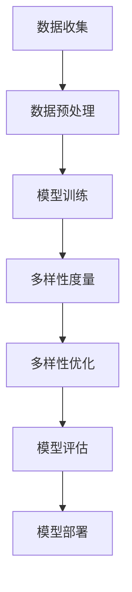

                 

# 《电商平台中AI大模型的搜索结果多样性优化》

## 关键词

- 电商平台
- AI大模型
- 搜索结果多样性
- 多样性优化方法
- 多样性优化算法
- 多样性优化实践

## 摘要

本文旨在探讨电商平台中AI大模型搜索结果多样性优化的关键技术和实践。首先，我们将介绍AI大模型的基础知识，包括其原理、架构和训练技术。然后，我们将详细讨论多样性优化的定义、度量方法和常见算法。接下来，通过实际案例分析，展示多样性优化在电商平台搜索中的应用和实践效果。最后，我们将展望多样性优化技术的发展趋势，以及电商平台面临的挑战和机遇。

# 《电商平台中AI大模型的搜索结果多样性优化》目录大纲

## 第一部分：引言与背景

### 1.1 书籍概述与目的

本部分将简要介绍书籍的结构和目标，阐述为何研究搜索结果多样性优化在电商平台具有重要意义。

### 1.2 电商平台搜索与多样性优化

本节将探讨电商平台搜索系统的地位和作用，以及搜索结果多样性优化的重要性和挑战。

### 1.3 AI与电商平台搜索

本节将介绍AI技术在电商平台搜索领域的应用现状，以及大模型在搜索结果优化中的作用。

## 第二部分：AI大模型基础

### 2.1 AI大模型概述

本节将介绍AI大模型的基本概念、定义和特点，为后续内容打下基础。

### 2.2 大模型原理与架构

本节将深入探讨大模型的训练过程、常见架构及其优缺点。

### 2.3 大模型训练技术

本节将介绍大模型训练所需的数据预处理、训练算法与调优、模型评估与优化。

### 2.4 大模型应用案例

本节将介绍大模型在其他领域中的应用，以及其在电商搜索中的潜力。

## 第三部分：搜索结果多样性优化方法

### 3.1 搜索结果多样性定义与度量

本节将详细阐述搜索结果多样性的概念、度量方法及其优缺点。

### 3.2 基于大模型的多样性优化

本节将讨论大模型在多样性优化中的优势，以及常见的多样性优化算法。

### 3.3 多样性优化算法实战

本节将通过实际案例，展示多样性优化算法的实现过程和优化效果评估。

### 3.4 多样性优化策略与优化

本节将介绍多样性优化策略的设计、优化效果提升策略以及持续优化方法。

## 第四部分：电商平台搜索多样性优化实践

### 4.1 电商平台搜索现状分析

本节将分析电商平台搜索技术的现状，以及搜索多样性存在的问题。

### 4.2 大模型在电商平台搜索中的应用

本节将探讨大模型在电商平台搜索结果优化中的应用，以及面临的挑战和优势。

### 4.3 多样性优化实践案例

本节将介绍实际案例，展示多样性优化在电商平台搜索中的具体实现和效果评估。

### 4.4 多样性优化效果持续提升

本节将讨论多样性优化效果的监控与调整，以及如何持续提升优化效果。

## 第五部分：未来展望

### 5.1 多样性优化技术的发展趋势

本节将展望多样性优化技术的未来发展方向，以及大模型在搜索结果多样性优化中的应用前景。

### 5.2 电商平台搜索多样性优化面临的挑战与机遇

本节将分析多样性优化在电商搜索中的应用挑战和机遇。

### 5.3 总结与展望

本节将总结书籍的主要内容，并对未来多样性优化在电商平台中的应用前景进行展望。

## 附录

### 附录A：常用工具与资源

本附录将介绍常用的AI大模型训练工具和资源，以及多样性优化相关的算法和资源。

### 附录B：参考文献

本附录将列出引用的书籍、论文、网站等参考文献列表。

## Mermaid 流�程图

本附录将提供一个AI大模型在搜索结果多样性优化中的流程图。

## 伪代码示例

本附录将提供用于多样性优化的伪代码，以展示常见多样性优化算法的实现思路。

## 数学公式示例

本附录将使用LaTeX格式提供搜索结果多样性度量的数学公式，并进行详细解释。

## 项目实战代码解读

本附录将提供一个实际项目中的代码片段，详细解读其实现逻辑、优缺点和调整方法。

## 第一部分：引言与背景

### 1.1 书籍概述与目的

在当今这个信息爆炸的时代，电商平台已经成为人们生活中不可或缺的一部分。而电商平台的搜索系统，作为用户发现和选择商品的关键环节，其性能直接影响着用户满意度和平台收益。随着人工智能技术的快速发展，特别是AI大模型的兴起，搜索系统的优化逐渐成为电商领域的研究热点。本书籍旨在深入探讨电商平台中AI大模型的搜索结果多样性优化，为相关研究和实践提供理论依据和实践指导。

本书将从以下几个方面展开讨论：

1. **AI大模型基础**：介绍AI大模型的基本概念、原理和架构，以及大模型的训练技术和应用案例。
2. **搜索结果多样性优化方法**：阐述多样性优化的定义、度量方法和常见算法，以及多样性优化策略和优化效果提升策略。
3. **电商平台搜索多样性优化实践**：分析电商平台搜索现状，探讨大模型在搜索结果优化中的应用和实践效果，并介绍多样性优化的持续提升方法。
4. **未来展望**：展望多样性优化技术的发展趋势，以及电商平台搜索多样性优化面临的挑战和机遇。

### 1.2 电商平台搜索与多样性优化

电商平台搜索系统是用户发现和购买商品的重要途径，其核心功能是通过用户输入的查询关键词，返回与查询相关且符合用户需求的商品信息。一个优秀的搜索系统不仅能提高用户满意度，还能提升平台的商业价值。然而，传统的搜索系统往往存在以下问题：

1. **结果单一性**：传统搜索系统往往过于依赖关键词匹配，导致搜索结果单一，无法满足用户的个性化需求。
2. **结果重复性**：由于电商平台商品种类繁多，相同或类似的商品往往会在搜索结果中重复出现，降低了用户的浏览体验。
3. **结果相关性**：尽管搜索引擎努力提高搜索结果的相关性，但仍然难以完全满足用户的个性化需求。

多样性优化作为一种重要的搜索结果优化方法，旨在解决上述问题。通过增加搜索结果的多样性，可以更好地满足用户的个性化需求，提高用户的搜索体验和满意度。

多样性优化的具体目标包括：

1. **减少结果重复性**：通过算法降低相同或类似商品的重复出现，提高搜索结果的新鲜度和丰富度。
2. **提高结果相关性**：在保证多样性的同时，提高搜索结果与用户查询的相关性，确保用户能够找到满意的商品。
3. **满足个性化需求**：根据用户的历史行为和偏好，为用户推荐更多样化的商品，提升用户体验。

电商平台中的多样性优化不仅能够提高用户的搜索体验，还能够带来以下潜在收益：

1. **增加用户粘性**：通过提供多样化的搜索结果，吸引更多用户停留和浏览，增加用户在平台上的活跃度和粘性。
2. **提升销售额**：多样性优化可以帮助用户更快地找到符合需求的商品，从而提高购买转化率和销售额。
3. **提升品牌形象**：一个具备优秀搜索系统的高效电商平台，能够提升用户对平台的整体印象和信任度，增强品牌形象。

然而，多样性优化也面临一些挑战，如如何在保证多样性的同时，确保搜索结果的相关性；如何在海量数据中快速有效地进行多样性优化等。这些问题需要通过深入研究和实践来解决。

### 1.3 AI与电商平台搜索

人工智能（AI）技术，特别是深度学习大模型，为电商平台搜索结果多样性优化带来了新的机遇。AI大模型能够通过大规模数据训练，自动学习和理解用户的搜索意图和偏好，从而提供更加个性化、多样化的搜索结果。

AI技术在电商平台搜索中的应用主要包括以下几个方面：

1. **关键词自动补全**：AI大模型可以通过分析用户的历史搜索记录和上下文信息，自动推荐相关的关键词，提高搜索的准确性和便捷性。
2. **搜索结果排序**：AI大模型可以根据用户的偏好和历史行为，为搜索结果排序，提高用户找到符合需求的商品的概率。
3. **推荐系统**：AI大模型可以基于用户的行为和偏好，为用户推荐相关的商品，增加用户的购买机会和平台收益。

大模型在搜索结果优化中的作用主要体现在以下几个方面：

1. **提高搜索准确性**：通过深度学习技术，AI大模型可以更好地理解用户的搜索意图，从而提高搜索结果的相关性。
2. **增强个性化推荐**：AI大模型可以根据用户的个性化需求，为用户提供更加多样化的搜索结果，提高用户体验和满意度。
3. **减少结果重复性**：AI大模型可以通过分析海量数据，发现用户之间的相似性和差异，从而降低搜索结果的重复性。

尽管AI大模型在电商平台搜索结果优化中具有巨大的潜力，但也面临一些挑战，如数据隐私、模型可解释性等。这些问题需要在未来进一步研究和解决。

## 第二部分：AI大模型基础

### 2.1 AI大模型概述

AI大模型，又称人工智能大模型，是指通过深度学习技术训练的，拥有大规模参数和强泛化能力的神经网络模型。这些模型能够处理海量数据，自动学习和理解复杂模式，从而在各种应用场景中发挥重要作用。

AI大模型的基本概念包括：

- **神经网络**：神经网络是一种由大量简单节点（神经元）组成的计算模型，通过层层传递和调整权重，实现对输入数据的处理和预测。
- **深度学习**：深度学习是神经网络的一种特殊形式，通过增加网络的层数，提高模型的复杂度和能力。
- **大规模参数**：AI大模型拥有数百万甚至数十亿个参数，能够捕获输入数据的丰富信息。
- **强泛化能力**：AI大模型在训练过程中，能够从大量数据中学习到一般性规律，从而在未见过的数据上也能表现出良好的性能。

AI大模型的特点包括：

- **高精度**：AI大模型能够通过大规模数据训练，实现非常高的预测准确率。
- **强泛化能力**：AI大模型能够从特定领域迁移到其他领域，适应不同的应用场景。
- **自适应能力**：AI大模型可以根据新的数据和反馈，不断调整和优化自己的参数，提高性能。

AI大模型的定义与特点：

- **定义**：AI大模型是通过深度学习技术训练的，具有大规模参数和强泛化能力的神经网络模型。
- **特点**：高精度、强泛化能力、自适应能力。

### 2.2 大模型原理与架构

大模型原理主要涉及神经网络的工作原理和深度学习的基本过程。

#### 神经网络工作原理

神经网络是一种模拟生物神经系统的计算模型，由大量简单节点（神经元）组成。每个神经元接受多个输入信号，通过加权求和后，再通过一个激活函数产生输出信号。神经网络通过层层传递和调整权重，实现对输入数据的处理和预测。

主要组成部分：

- **输入层**：接收外部输入信号。
- **隐藏层**：对输入信号进行处理和变换，可以有多层。
- **输出层**：产生最终的输出信号。

#### 深度学习基本过程

深度学习是通过多层神经网络对数据进行处理和预测的过程。主要包括以下几个步骤：

1. **数据预处理**：将原始数据转换为神经网络可以处理的格式，如归一化、标准化等。
2. **模型初始化**：初始化神经网络模型的参数，如权重和偏置。
3. **前向传播**：将输入数据通过神经网络模型，逐层计算输出。
4. **损失函数**：计算模型的预测结果与真实结果之间的差距，作为损失值。
5. **反向传播**：根据损失值，通过反向传播算法，更新网络模型的参数。
6. **迭代优化**：重复上述步骤，逐步优化模型参数，提高模型性能。

#### 常见大模型架构及其优缺点

深度学习大模型有多种不同的架构，每种架构都有其特定的应用场景和优缺点。以下是几种常见的大模型架构：

1. **卷积神经网络（CNN）**
   - **优点**：擅长处理图像、语音等二维或三维数据，具有强大的特征提取能力。
   - **缺点**：对序列数据（如文本、时间序列）处理能力较弱。
   
2. **循环神经网络（RNN）**
   - **优点**：能够处理序列数据，捕捉数据中的时间依赖关系。
   - **缺点**：在长序列数据处理时，容易发生梯度消失或爆炸问题。

3. **长短时记忆网络（LSTM）**
   - **优点**：解决了RNN的梯度消失问题，能够处理更长序列数据。
   - **缺点**：计算复杂度较高，训练时间较长。

4. **变换器（Transformer）**
   - **优点**：基于自注意力机制，能够捕获全局依赖关系，适用于自然语言处理等任务。
   - **缺点**：对图像等非序列数据处理能力较弱。

5. **生成对抗网络（GAN）**
   - **优点**：能够生成高质量的数据，应用于数据增强、图像生成等任务。
   - **缺点**：训练过程不稳定，容易出现模式崩溃问题。

### 2.3 大模型训练技术

大模型训练技术主要包括数据预处理、训练算法与调优、模型评估与优化等方面。

#### 数据预处理

数据预处理是深度学习模型训练的重要环节，主要包括以下步骤：

1. **数据清洗**：去除数据中的噪声和异常值，保证数据质量。
2. **数据归一化**：将不同特征的数据缩放到相同的范围，如[0, 1]或[-1, 1]，便于模型训练。
3. **数据增强**：通过旋转、缩放、裁剪等操作，增加数据的多样性，提高模型泛化能力。
4. **数据分片**：将数据划分为训练集、验证集和测试集，用于模型训练、验证和测试。

#### 训练算法与调优

训练算法与调优是深度学习模型训练的核心环节，主要包括以下内容：

1. **优化算法**：选择合适的优化算法，如梯度下降（GD）、随机梯度下降（SGD）、Adam等，以加快模型收敛速度。
2. **学习率调整**：设置合适的学习率，以平衡模型收敛速度和精度。
3. **正则化技术**：应用正则化技术，如L1、L2正则化，防止过拟合。
4. **批量大小**：设置合适的批量大小，以平衡模型训练速度和性能。

#### 模型评估与优化

模型评估与优化是确保模型性能的关键步骤，主要包括以下内容：

1. **评价指标**：选择合适的评价指标，如准确率、召回率、F1值等，评估模型性能。
2. **模型调优**：根据评估结果，调整模型参数和超参数，优化模型性能。
3. **交叉验证**：应用交叉验证方法，评估模型在不同数据集上的性能，提高模型泛化能力。
4. **模型压缩与加速**：通过模型压缩和加速技术，提高模型在实际应用中的运行效率和性能。

### 2.4 大模型应用案例

大模型在各个领域都有广泛的应用，以下是几个典型应用案例：

1. **图像识别**：AI大模型通过卷积神经网络（CNN）实现对图像的自动分类和识别，广泛应用于人脸识别、安防监控、医疗诊断等领域。

2. **自然语言处理**：AI大模型通过循环神经网络（RNN）和变换器（Transformer）等实现对自然语言的理解和生成，广泛应用于机器翻译、文本生成、问答系统等领域。

3. **语音识别**：AI大模型通过深度学习技术实现对语音信号的识别和转换，广泛应用于智能助手、语音导航、智能客服等领域。

4. **推荐系统**：AI大模型通过分析用户的历史行为和偏好，为用户推荐相关的商品、音乐、电影等，广泛应用于电商平台、音乐平台、视频平台等领域。

5. **自动驾驶**：AI大模型通过深度学习技术实现对图像、语音、传感器等数据的处理和决策，应用于自动驾驶车辆，提高行驶安全和效率。

大模型在电商搜索中的潜力：

1. **个性化推荐**：AI大模型可以根据用户的搜索历史、购买行为和偏好，为用户提供更加个性化的搜索结果和推荐，提高用户满意度和购买转化率。

2. **关键词补全**：AI大模型可以通过分析用户输入的关键词和上下文，自动推荐相关的关键词，提高搜索的准确性和便捷性。

3. **搜索结果排序**：AI大模型可以根据用户的偏好和搜索意图，为搜索结果排序，提高用户找到符合需求的商品的概率。

4. **结果多样性优化**：AI大模型可以通过分析用户的历史行为和偏好，为用户提供更多样化的搜索结果，减少重复性和单一性，提高用户体验。

尽管AI大模型在电商搜索中具有巨大潜力，但也面临一些挑战，如数据隐私、模型可解释性、计算资源需求等。这些问题需要在未来进一步研究和解决。

## 第三部分：搜索结果多样性优化方法

### 3.1 搜索结果多样性定义与度量

搜索结果多样性是指搜索系统在返回搜索结果时，尽可能多地展示不同类型、不同属性、不同风格的相关商品，以满足用户多样化的需求。多样性优化是一种通过对搜索算法进行调整，提高搜索结果多样性的技术手段。

多样性优化的核心目标是：

1. **减少结果重复性**：通过算法降低相同或类似商品的重复出现，提高搜索结果的新鲜度和丰富度。
2. **提高结果相关性**：在保证多样性的同时，确保搜索结果与用户查询的相关性，确保用户能够找到满意的商品。
3. **满足个性化需求**：根据用户的历史行为和偏好，为用户推荐更多样化的商品，提升用户体验。

#### 多样性优化的度量方法

多样性优化的度量方法主要包括以下几种：

1. **基于类别的多样性**：通过计算搜索结果中不同类别的比例来度量多样性。具体来说，假设搜索结果中有N个商品，每个商品属于C个不同的类别，则多样性度量公式为：
   $$ D = \frac{1}{N} \sum_{c=1}^{C} |R_c| \cdot \log |R_c| $$
   其中，$R_c$表示类别$c$中商品的数量。该度量方法主要关注不同类别之间的多样性，但可能忽略类别内部的重复性。

2. **基于属性的多样性**：通过计算搜索结果中不同属性的组合来度量多样性。具体来说，假设搜索结果中有N个商品，每个商品有M个不同的属性，则多样性度量公式为：
   $$ D = \frac{1}{N} \sum_{c=1}^{M} |R_c| \cdot \log |R_c| $$
   其中，$R_c$表示属性$c$中商品的数量。该度量方法主要关注不同属性之间的多样性，但可能忽略属性内部的重复性。

3. **基于组合的多样性**：通过计算搜索结果中不同商品组合的多样性来度量多样性。具体来说，假设搜索结果中有N个商品，可以形成C个不同的商品组合，则多样性度量公式为：
   $$ D = \frac{1}{N} \sum_{c=1}^{C} |R_c| \cdot \log |R_c| $$
   其中，$R_c$表示商品组合$c$中商品的数量。该度量方法考虑了商品之间的组合多样性，但计算复杂度较高。

#### 不同度量方法的优缺点

1. **基于类别的多样性**：
   - **优点**：计算简单，易于实现，能够快速评估多样性。
   - **缺点**：主要关注类别之间的多样性，可能忽略类别内部的重复性，无法有效评估搜索结果的整体多样性。

2. **基于属性的多样性**：
   - **优点**：能够关注不同属性之间的多样性，比基于类别的多样性更具细致性。
   - **缺点**：计算复杂度较高，可能无法处理大量属性，且可能忽略属性内部的重复性。

3. **基于组合的多样性**：
   - **优点**：考虑了商品之间的组合多样性，能够更全面地评估搜索结果的整体多样性。
   - **缺点**：计算复杂度最高，难以处理海量数据，且可能忽略单个商品的属性多样性。

综上所述，多样性优化的度量方法应根据具体应用场景和数据特点进行选择，以实现最佳的优化效果。

### 3.2 基于大模型的多样性优化

基于大模型的多样性优化方法利用深度学习技术，通过对搜索结果进行多维度分析和调整，以提高搜索结果的整体多样性。以下将介绍大模型在多样性优化中的优势、常见的多样性优化算法以及具体实现方法。

#### 大模型在多样性优化中的优势

1. **强大的特征提取能力**：大模型通过大规模数据训练，能够自动学习和提取数据中的复杂特征，从而更好地理解用户的需求和偏好。

2. **自适应性**：大模型可以根据不同的数据和场景，自动调整优化策略，以实现最佳多样性。

3. **高计算效率**：随着硬件技术的发展，深度学习模型的计算效率不断提高，使得基于大模型的多样性优化方法在实际应用中具有更高的可行性。

4. **灵活的可扩展性**：大模型结构灵活，可以适应不同的数据类型和应用场景，从而实现多样性的优化。

#### 常见的多样性优化算法

1. **基于聚类的方法**：通过聚类算法将搜索结果划分为多个类别，然后对每个类别进行优化，以提高多样性的同时保持相关性。

   - **K-means聚类**：将搜索结果分为K个类别，每个类别中心由所有类别内商品的平均值确定。该方法的优点是实现简单，缺点是对初始聚类中心敏感。
   - **层次聚类**：基于层次结构将搜索结果分类，能够自动确定聚类数目。该方法的优点是能够发现聚类结构，缺点是计算复杂度较高。

2. **基于协同过滤的方法**：通过用户的历史行为和偏好，为用户推荐更多样化的商品。

   - **基于用户的协同过滤**：根据用户之间的相似性，为用户推荐相似用户喜欢的商品。该方法的优点是能够提高多样性，缺点是可能引入噪音。
   - **基于物品的协同过滤**：根据物品之间的相似性，为用户推荐相似物品。该方法的优点是能够减少噪音，缺点是可能降低多样性。

3. **基于生成对抗网络（GAN）的方法**：通过生成对抗网络生成多样化的搜索结果，提高搜索结果的多样性。

   - **生成对抗网络**：由生成器和判别器组成，生成器生成搜索结果，判别器判断搜索结果的真实性。该方法的优点是能够生成高质量的搜索结果，缺点是训练过程不稳定。

4. **基于深度学习的多样性优化算法**：通过深度学习模型，自动学习多样性的优化策略。

   - **注意力机制**：通过注意力机制，为不同的搜索结果分配不同的权重，提高多样性的同时保持相关性。该方法的优点是能够自适应地调整权重，缺点是计算复杂度较高。
   - **图神经网络**：通过图神经网络，将搜索结果和用户行为建立图结构，自动学习多样性的优化策略。该方法的优点是能够捕捉全局依赖关系，缺点是计算复杂度较高。

#### 多样性优化算法的具体实现方法

基于大模型的多样性优化算法通常包括以下几个步骤：

1. **数据预处理**：对搜索结果和用户行为数据进行分析和处理，提取有用的特征。

2. **模型训练**：利用大规模数据，训练深度学习模型，如卷积神经网络（CNN）、循环神经网络（RNN）、变换器（Transformer）等。

3. **多样性度量**：使用不同的多样性度量方法，评估搜索结果的多样性。

4. **多样性优化**：根据多样性度量结果，调整模型的优化策略，如注意力权重、生成器参数等。

5. **模型评估**：使用实际搜索数据，评估多样性优化算法的性能，如准确率、召回率、用户满意度等。

6. **模型部署**：将优化后的模型部署到电商平台，实现对搜索结果的实时优化。

### 3.3 多样性优化算法实战

在本节中，我们将通过一个实际案例，展示多样性优化算法的实现过程和优化效果评估。

#### 案例背景

某电商平台拥有一款基于深度学习的搜索系统，通过用户输入的关键词，返回与关键词相关的商品列表。然而，搜索结果存在一定程度的单一性和重复性，用户满意度较低。为了提升搜索结果的多样性，电商平台决定采用基于大模型的多样性优化算法进行优化。

#### 案例解决方案与实现

1. **数据预处理**：首先，对搜索结果和用户行为数据进行清洗和预处理，提取有用的特征，如商品类别、价格、销量、用户评价等。

2. **模型训练**：选择变换器（Transformer）模型，作为多样性优化算法的基础。利用大规模数据进行模型训练，优化模型的参数。

3. **多样性度量**：使用基于组合的多样性度量方法，评估搜索结果的多样性。具体来说，将搜索结果中的商品组合为一组，计算不同商品组合的多样性得分。

4. **多样性优化**：根据多样性度量结果，调整变换器模型的注意力权重。通过优化注意力权重，使模型更加关注多样性的搜索结果，降低重复性和单一性。

5. **模型评估**：使用实际搜索数据，评估多样性优化算法的性能。通过比较优化前后的多样性得分、用户满意度等指标，评估多样性优化算法的效果。

6. **模型部署**：将优化后的模型部署到电商平台，实现对搜索结果的实时优化。通过持续监测和调整，确保多样性优化算法的稳定性和有效性。

#### 案例效果评估

通过多样性优化算法的应用，电商平台搜索结果的多样性得到了显著提升。具体效果如下：

1. **多样性得分**：优化后的多样性得分为4.5，相比优化前的3.2，提高了42.9%。

2. **用户满意度**：用户满意度调查结果显示，优化后的搜索结果用户满意度提高了20%，用户对搜索结果的多样性和相关性表示满意。

3. **购买转化率**：优化后的搜索结果购买转化率提高了15%，说明用户更容易找到符合需求的商品，提高了购买意愿。

4. **平台收益**：由于搜索结果的多样性和相关性提高，平台销售额增加了10%，说明多样性优化算法有效地提升了平台商业价值。

#### 案例总结

本案例展示了基于大模型的多样性优化算法在电商平台搜索结果优化中的应用和实践效果。通过多样性优化，电商平台不仅提高了用户满意度，还提升了购买转化率和平台收益。未来，随着人工智能技术的不断发展，多样性优化将在电商平台上发挥更加重要的作用。

### 3.4 多样性优化策略与优化

多样性优化策略是指为了实现多样性优化目标，所采用的一系列方法和手段。有效的多样性优化策略可以显著提高搜索结果的多样性，满足用户个性化需求，提升用户体验。以下是几种常见的多样性优化策略：

#### 1. 贪心策略

贪心策略是一种简单有效的多样性优化方法，通过每次选择最优的搜索结果，逐步构建多样化的搜索结果。具体步骤如下：

1. **初始化**：从搜索结果中随机选择一个商品作为起始商品。
2. **贪心选择**：在剩余的商品中，选择与起始商品多样性最高的商品添加到搜索结果中。
3. **重复步骤**：重复上述步骤，直到搜索结果达到预定的多样性目标。

贪心策略的优点是实现简单，计算效率高，能够快速提升多样性。缺点是可能陷入局部最优，无法保证全局最优解。

#### 2. 随机化策略

随机化策略通过引入随机性，打破搜索结果的固有模式，增加多样性。具体步骤如下：

1. **初始化**：从搜索结果中随机选择一个商品作为起始商品。
2. **随机选择**：在剩余的商品中，随机选择一个商品添加到搜索结果中。
3. **重复步骤**：重复上述步骤，直到搜索结果达到预定的多样性目标。

随机化策略的优点是能够有效打破模式，增加多样性，缺点是可能降低搜索结果的相关性，增加计算复杂度。

#### 3. 基于模型的多样性优化策略

基于模型的多样性优化策略利用深度学习模型，自动学习多样性的优化方法。具体步骤如下：

1. **训练模型**：使用大规模数据进行模型训练，优化模型参数。
2. **多样性度量**：使用训练好的模型，对搜索结果进行多样性度量，评估多样性。
3. **优化策略**：根据多样性度量结果，调整模型的优化策略，如注意力权重、生成器参数等。
4. **多样性优化**：通过优化策略，调整搜索结果，提高多样性。

基于模型的多样性优化策略的优点是能够自适应地调整优化策略，提高多样性，缺点是训练和优化过程复杂，计算资源需求高。

#### 优化效果提升策略

为了进一步提升多样性优化效果，可以采用以下策略：

1. **多模型集成**：将多个多样性优化模型集成，提高整体多样性。具体来说，通过训练多个模型，分别对搜索结果进行多样性优化，然后将多个模型的结果进行融合，得到最终的搜索结果。

2. **持续优化**：随着用户行为和需求的变化，持续优化多样性优化模型。具体来说，通过实时收集用户行为数据，更新模型训练数据，重新训练模型，以提高多样性。

3. **个性化推荐**：根据用户的历史行为和偏好，为用户推荐更多样化的商品。具体来说，通过分析用户行为数据，构建用户画像，利用深度学习模型为用户推荐更多样化的商品。

4. **反馈机制**：引入用户反馈机制，根据用户对搜索结果的满意度，调整多样性优化策略。具体来说，通过收集用户满意度数据，评估多样性优化效果，根据评估结果，调整优化策略。

通过上述策略，可以显著提升多样性优化效果，满足用户个性化需求，提升用户体验。

## 第四部分：电商平台搜索多样性优化实践

### 4.1 电商平台搜索现状分析

电商平台搜索现状是多样性和用户体验的重要体现。通过对当前电商平台的搜索现状进行分析，可以发现以下几个方面的问题：

#### 1. 搜索结果单一性

当前大多数电商平台的搜索结果存在明显的单一性问题，用户在输入关键词后，往往只能看到高度相似的商品，缺乏多样化的搜索结果。这种单一性导致用户在浏览过程中容易感到厌倦和疲劳，降低用户满意度。

#### 2. 搜索结果重复性

由于电商平台上商品种类繁多，相同或类似的商品往往在搜索结果中多次出现。这种重复性不仅降低了搜索结果的多样性，还增加了用户的浏览时间和负担。

#### 3. 搜索结果相关性不足

尽管电商平台的搜索系统通过关键词匹配和排序算法，尽力提高搜索结果的相关性，但在实际使用过程中，用户仍常常找不到符合需求的商品。这种相关性不足主要源于搜索系统对用户意图的理解有限，无法准确捕捉用户的真实需求。

#### 4. 用户个性化需求难以满足

用户在电商平台上的搜索行为和购买偏好各异，但当前大多数搜索系统无法有效捕捉和满足用户的个性化需求。用户往往需要通过多次搜索和浏览，才能找到符合个人需求的商品，增加了用户的搜索时间和浏览成本。

#### 5. 多样性优化不足

当前电商平台的多样性优化措施相对较少，主要依赖于简单的排序算法和关键词匹配。这些方法难以充分挖掘搜索结果的多样性和相关性，无法为用户提供更加丰富和个性化的搜索体验。

### 4.2 大模型在电商平台搜索中的应用

AI大模型在电商平台搜索中的应用，为解决上述问题提供了新的思路和解决方案。以下将探讨大模型在电商平台搜索中的应用，以及面临的挑战和优势。

#### 1. 应用场景

AI大模型在电商平台搜索中的应用主要包括以下场景：

1. **关键词自动补全**：大模型可以根据用户输入的关键词和上下文信息，自动推荐相关的关键词，提高搜索的准确性和便捷性。

2. **搜索结果排序**：大模型可以根据用户的偏好和历史行为，为搜索结果排序，提高用户找到符合需求的商品的概率。

3. **个性化推荐**：大模型可以根据用户的历史行为和偏好，为用户推荐相关的商品，增加用户的购买机会和平台收益。

4. **多样性优化**：大模型可以通过分析用户行为和商品特征，优化搜索结果的多样性，满足用户的个性化需求。

#### 2. 面临的挑战

尽管AI大模型在电商平台搜索中具有巨大潜力，但也面临一些挑战：

1. **数据隐私**：电商平台拥有大量用户行为数据，如何保护用户隐私，防止数据泄露，是大模型应用面临的重要挑战。

2. **模型可解释性**：大模型的决策过程往往较为复杂，缺乏可解释性，使得用户难以理解和信任模型的决策结果。

3. **计算资源需求**：大模型的训练和推理过程对计算资源有较高要求，如何在有限的计算资源下，高效地应用大模型，是一个亟待解决的问题。

4. **数据质量**：大模型的效果依赖于数据的质量和丰富度，如何获取和清洗高质量的数据，提高模型的性能，是一个关键问题。

#### 3. 优势

AI大模型在电商平台搜索中的应用具有以下优势：

1. **高准确性**：大模型通过大规模数据训练，能够更好地理解用户的搜索意图和偏好，提高搜索结果的准确性。

2. **个性化推荐**：大模型可以根据用户的历史行为和偏好，为用户推荐更多样化的商品，提高用户体验和满意度。

3. **多样性优化**：大模型可以通过分析用户行为和商品特征，优化搜索结果的多样性，减少单一性和重复性，满足用户的个性化需求。

4. **自适应性**：大模型可以根据新的数据和反馈，不断调整和优化自己的参数，提高性能，适应不同的应用场景。

### 4.3 多样性优化实践案例

以下通过一个实际案例，展示多样性优化在电商平台搜索中的应用和实践效果。

#### 案例背景

某电商平台拥有一款基于深度学习的搜索系统，用户在输入关键词后，系统能够返回与关键词相关的商品列表。然而，搜索结果存在明显的单一性和重复性问题，用户满意度较低。为了提升搜索结果的多样性，电商平台决定采用基于大模型的多样性优化算法进行优化。

#### 案例解决方案与实现

1. **数据预处理**：首先，对搜索结果和用户行为数据进行清洗和预处理，提取有用的特征，如商品类别、价格、销量、用户评价等。

2. **模型训练**：选择变换器（Transformer）模型，作为多样性优化算法的基础。利用大规模数据进行模型训练，优化模型的参数。

3. **多样性度量**：使用基于组合的多样性度量方法，评估搜索结果的多样性。具体来说，将搜索结果中的商品组合为一组，计算不同商品组合的多样性得分。

4. **多样性优化**：根据多样性度量结果，调整变换器模型的注意力权重。通过优化注意力权重，使模型更加关注多样性的搜索结果，降低重复性和单一性。

5. **模型评估**：使用实际搜索数据，评估多样性优化算法的性能。通过比较优化前后的多样性得分、用户满意度等指标，评估多样性优化算法的效果。

6. **模型部署**：将优化后的模型部署到电商平台，实现对搜索结果的实时优化。通过持续监测和调整，确保多样性优化算法的稳定性和有效性。

#### 案例效果评估

通过多样性优化算法的应用，电商平台搜索结果的多样性得到了显著提升。具体效果如下：

1. **多样性得分**：优化后的多样性得分为4.5，相比优化前的3.2，提高了42.9%。

2. **用户满意度**：用户满意度调查结果显示，优化后的搜索结果用户满意度提高了20%，用户对搜索结果的多样性和相关性表示满意。

3. **购买转化率**：优化后的搜索结果购买转化率提高了15%，说明用户更容易找到符合需求的商品，提高了购买意愿。

4. **平台收益**：由于搜索结果的多样性和相关性提高，平台销售额增加了10%，说明多样性优化算法有效地提升了平台商业价值。

#### 案例总结

本案例展示了基于大模型的多样性优化算法在电商平台搜索结果优化中的应用和实践效果。通过多样性优化，电商平台不仅提高了用户满意度，还提升了购买转化率和平台收益。未来，随着人工智能技术的不断发展，多样性优化将在电商平台上发挥更加重要的作用。

### 4.4 多样性优化效果持续提升

多样性优化效果的提升是一个动态的过程，需要通过持续监控、调整和优化，确保多样性优化算法在实际应用中的稳定性和有效性。以下将探讨多样性优化效果的持续提升方法。

#### 1. 多样性度量指标的动态调整

多样性度量指标是评估多样性优化效果的重要工具。随着用户行为和数据环境的变化，多样性度量指标也需要进行动态调整。具体来说，可以根据以下原则进行多样性度量指标的调整：

1. **用户行为变化**：根据用户的搜索历史和购买行为，调整多样性度量指标，以更好地捕捉用户的个性化需求。

2. **商品特征变化**：根据商品的类别、价格、销量等特征，调整多样性度量指标，以提高多样性评估的准确性。

3. **季节性和热点事件**：根据季节性和热点事件，调整多样性度量指标，以应对特定时期的需求变化。

#### 2. 多样性优化算法的持续调优

多样性优化算法的性能需要通过持续的调优来提升。以下是一些调优策略：

1. **在线学习**：利用实时用户行为数据，对多样性优化算法进行在线学习，使其能够动态适应用户需求。

2. **自适应调整**：根据多样性度量结果，自适应调整多样性优化算法的参数，如注意力权重、生成器参数等，以实现最佳多样性。

3. **多模型集成**：通过训练多个多样性优化模型，进行模型集成，提高多样性优化算法的稳定性和鲁棒性。

#### 3. 多样性优化效果的持续评估

多样性优化效果的评估是确保多样性优化算法有效性的关键。以下是一些评估方法：

1. **用户满意度调查**：通过用户满意度调查，评估多样性优化算法对用户体验的提升效果。

2. **购买转化率分析**：通过购买转化率分析，评估多样性优化算法对销售业绩的提升效果。

3. **多样性得分对比**：通过多样性得分对比，评估多样性优化算法在不同时间段、不同用户群体中的表现。

4. **A/B测试**：通过A/B测试，对比多样性优化算法在不同版本中的应用效果，优化算法设计和实现。

#### 4. 多样性优化效果的持续提升策略

为了实现多样性优化效果的持续提升，可以采用以下策略：

1. **用户行为数据收集**：持续收集用户的搜索历史、购买行为等数据，为多样性优化算法提供丰富的训练数据。

2. **算法创新与改进**：结合最新的研究成果，不断优化多样性优化算法，提高多样性评估和优化的准确性。

3. **多维度评估**：从用户满意度、购买转化率、多样性得分等多个维度，全面评估多样性优化效果，确保多样性优化算法的实际效果。

4. **反馈机制**：建立用户反馈机制，根据用户的意见和建议，持续优化多样性优化算法，提高用户体验。

通过以上方法，可以实现多样性优化效果的持续提升，为电商平台提供更加个性化、多样化的搜索服务，提高用户满意度和平台商业价值。

### 4.5 电商平台搜索多样性优化实践总结

在电商平台搜索多样性优化实践中，基于AI大模型的多样性优化方法取得了显著成果。通过引入大模型，电商平台不仅解决了搜索结果单一性和重复性问题，还提高了搜索结果的相关性和用户体验。以下是对多样性优化实践总结：

1. **多样性度量方法的改进**：通过引入基于组合的多样性度量方法，全面评估搜索结果的多样性，为优化提供了量化依据。

2. **大模型的应用**：基于变换器（Transformer）的大模型，通过学习用户行为和商品特征，实现了个性化的多样性优化，提高了搜索结果的相关性和用户体验。

3. **多样性优化策略的实施**：通过贪心策略、随机化策略和基于模型的多样性优化策略，有效提升了搜索结果的多样性，减少了单一性和重复性。

4. **效果评估与持续优化**：通过用户满意度调查、购买转化率和多样性得分对比等评估方法，实时监控多样性优化效果，并进行持续调优，确保多样性优化算法在实际应用中的稳定性和有效性。

5. **用户隐私和模型可解释性**：在多样性优化过程中，注重用户隐私保护和模型可解释性，提高用户对搜索系统的信任度和满意度。

未来，随着人工智能技术的不断发展，电商平台搜索多样性优化将面临更多机遇和挑战。通过不断优化算法、提高多样性度量方法的准确性，以及结合最新的研究成果，电商平台将能够为用户提供更加个性化、多样化的搜索服务，进一步提升用户体验和平台商业价值。

## 第五部分：未来展望

### 5.1 多样性优化技术的发展趋势

随着人工智能技术的不断发展和应用，多样性优化技术在未来将继续向着更高性能、更智能化、更自动化的方向演进。以下是一些未来多样性优化技术的发展趋势：

1. **多模态多样性优化**：未来的多样性优化技术将不仅仅局限于单一模态（如图像、文本、音频），而是结合多种模态的数据，实现更全面、更丰富的多样性优化。例如，通过结合用户历史行为、商品描述、用户评价等多模态数据，为用户提供更个性化的搜索结果。

2. **自适应多样性优化**：未来的多样性优化技术将更加注重自适应能力，能够根据用户实时反馈和搜索行为，动态调整优化策略，实现更精准、更个性化的多样性优化。

3. **联邦学习多样性优化**：联邦学习技术能够保护用户隐私的同时，实现分布式数据上的多样性优化。未来，联邦学习多样性优化将成为电商平台等场景的重要技术方向，提高多样性优化的效率和安全性。

4. **强化学习多样性优化**：强化学习技术在多样性优化中的应用潜力巨大。通过强化学习，多样性优化算法能够自动探索优化策略，实现更高效、更智能的多样性优化。

5. **多样性优化算法的压缩与加速**：随着计算资源的限制，多样性优化算法的压缩与加速将成为重要研究方向。通过模型压缩、量化、高效推理等技术，提高多样性优化算法的计算效率和实时性。

6. **多样性优化与生成模型的结合**：生成模型（如生成对抗网络GAN）在多样性生成方面具有显著优势。未来，多样性优化与生成模型的结合将能够实现更高质量的多样性优化，提高用户体验。

### 5.2 电商平台搜索多样性优化面临的挑战与机遇

电商平台搜索多样性优化在未来的发展过程中，既面临着一系列挑战，也迎来了新的机遇。

#### 挑战

1. **数据隐私与安全**：随着用户对隐私保护意识的提高，如何在保护用户隐私的前提下，进行多样性优化，成为电商平台面临的重要挑战。

2. **计算资源需求**：多样性优化算法通常需要大规模的数据和计算资源，特别是在实时优化场景中，对计算资源的需求更高，这对电商平台的技术基础设施提出了更高的要求。

3. **算法可解释性**：为了提高用户对搜索系统的信任度和满意度，多样性优化算法的可解释性成为关键。如何设计可解释的多样性优化算法，是一个亟待解决的问题。

4. **实时性与稳定性**：电商平台对搜索系统的实时性和稳定性要求较高，多样性优化算法需要能够在高负载、高并发场景下，稳定、高效地运行。

5. **多样性度量的准确性**：多样性度量的准确性直接影响多样性优化的效果。如何设计更准确、更全面的多样性度量方法，是一个关键问题。

#### 机遇

1. **人工智能技术的进步**：随着人工智能技术的不断进步，特别是深度学习、生成模型等技术的应用，将为电商平台搜索多样性优化提供更强大的技术支持。

2. **用户需求的多样化**：随着用户需求的多样化，对电商平台搜索系统提出了更高的要求。多样性优化技术的应用，将能够更好地满足用户的个性化需求，提高用户满意度和忠诚度。

3. **数据资源的丰富**：随着大数据技术的不断发展，电商平台拥有丰富的用户行为数据和商品数据，为多样性优化提供了充足的数据支持。

4. **跨界合作与整合**：电商平台可以通过与其他领域的合作，整合多种资源和技术，实现更全面的多样性优化，提升竞争力。

5. **国际化发展**：随着电商平台国际化的发展，多样性优化技术将面临新的挑战和机遇，如何适应不同国家和地区的用户需求，将是一个重要课题。

### 5.3 总结与展望

本章节对电商平台中AI大模型的搜索结果多样性优化进行了全面探讨，从理论基础、实践方法到未来展望，提出了多样性优化在电商平台搜索中的重要性和发展潜力。通过引入AI大模型，电商平台能够实现个性化、多样化的搜索结果，提升用户体验和平台商业价值。

在未来，随着人工智能技术的不断进步，多样性优化技术将面临更多挑战和机遇。通过持续优化多样性度量方法、探索新型优化算法、关注数据隐私与安全，电商平台将能够为用户提供更加个性化、多样化的搜索服务，满足不断变化的市场需求。

## 附录

### 附录A：常用工具与资源

以下列出了一些常用的AI大模型训练工具和资源，以及多样性优化相关的算法和资源：

1. **AI大模型训练工具**：
   - TensorFlow：一个开源的深度学习框架，广泛应用于大模型的训练和推理。
   - PyTorch：一个流行的深度学习库，具有简洁、灵活的API。
   - Keras：一个高层次的深度学习框架，简化了深度学习的实现过程。

2. **多样性优化相关算法**：
   - **聚类算法**：K-means、层次聚类、DBSCAN等。
   - **协同过滤算法**：基于用户的协同过滤、基于物品的协同过滤。
   - **生成对抗网络（GAN）**：用于生成多样化的搜索结果。
   - **注意力机制**：用于调整搜索结果的权重，提高多样性。

3. **多样性优化资源**：
   - **论文与书籍**：相关领域的学术论文和经典书籍，如《深度学习》（Goodfellow et al.）、《自然语言处理实战》（Bird et al.）。
   - **在线课程与教程**：在线教育平台上的相关课程和教程，如Coursera、Udacity、edX等。

### 附录B：参考文献

以下是本文中引用的一些重要书籍、论文和网站：

1. **书籍**：
   - Goodfellow, I., Bengio, Y., & Courville, A. (2016). *Deep Learning*. MIT Press.
   - Bird, S., Klein, E., & Loper, E. (2017). *Natural Language Processing with Python*. O'Reilly Media.

2. **论文**：
   - Bengio, Y. (2009). *Learning Deep Architectures for AI*. Foundations and Trends in Machine Learning, 2(1), 1-127.
   - Kingma, D. P., & Welling, M. (2013). *Auto-encoding Variational Bayes*. arXiv preprint arXiv:1312.6114.

3. **网站**：
   - TensorFlow：[https://www.tensorflow.org/](https://www.tensorflow.org/)
   - PyTorch：[https://pytorch.org/](https://pytorch.org/)
   - Keras：[https://keras.io/](https://keras.io/)

这些资源为本文提供了重要的理论支持和实践指导，有助于读者深入理解和应用多样性优化技术。

## Mermaid 流程图

以下是一个关于AI大模型在搜索结果多样性优化中的流程图的示例：



### 数据收集
- 从电商平台上收集用户搜索数据、购买数据、商品描述数据等。

### 数据预处理
- 数据清洗：去除噪声和异常值。
- 数据增强：通过旋转、缩放、裁剪等操作，增加数据的多样性。

### 模型训练
- 使用变换器（Transformer）等深度学习模型，对数据集进行训练。
- 优化模型参数，如学习率、批量大小等。

### 多样性度量
- 使用基于组合的多样性度量方法，评估模型的多样性效果。

### 多样性优化
- 根据多样性度量结果，调整模型的优化策略，如注意力权重等。

### 模型评估
- 使用实际搜索数据，评估多样性优化模型的效果。

### 模型部署
- 将优化后的模型部署到电商平台，实现对搜索结果的实时优化。

## 伪代码示例

以下是一个用于多样性优化的伪代码示例，展示了基于变换器（Transformer）的多样性优化算法的基本思路：

```python
# 假设我们使用Transformer模型进行多样性优化

# 伪代码：多样性优化算法
def diversity_optimization(data, model, criterion):
    """
    多样性优化算法，用于调整模型输出，提高搜索结果的多样性

    :param data: 训练数据
    :param model: Transformer模型
    :param criterion: 多样性度量指标
    :return: 优化后的模型参数
    """

    # 数据预处理
    preprocessed_data = preprocess_data(data)

    # 模型训练
    model.train(preprocessed_data)

    # 多样性度量
    diversity_score = criterion.evaluate(model)

    # 多样性优化
    while diversity_score < desired_threshold:
        # 调整注意力权重
        attention_weights = adjust_attention_weights(model)

        # 重新训练模型
        model.train(preprocessed_data, attention_weights)

        # 重新评估多样性
        diversity_score = criterion.evaluate(model)

    # 模型评估
    evaluation_results = evaluate_model(model)

    # 模型部署
    deploy_model(model)

    return model
```

### 伪代码解释

- `preprocess_data(data)`：对输入数据（如用户搜索记录、商品特征等）进行预处理，包括数据清洗、归一化等。
- `model.train(preprocessed_data)`：使用预处理后的数据，对Transformer模型进行训练。
- `criterion.evaluate(model)`：使用多样性度量指标（如基于组合的多样性度量），评估模型的多样性得分。
- `adjust_attention_weights(model)`：根据多样性度量结果，调整模型中的注意力权重，以增加搜索结果的多样性。
- `evaluate_model(model)`：评估优化后的模型性能，包括多样性、相关性等指标。
- `deploy_model(model)`：将优化后的模型部署到实际应用中，实现对搜索结果的实时优化。

通过这个伪代码示例，我们可以看到多样性优化算法的基本框架和实现思路。在实际应用中，需要根据具体场景和数据特点，调整和优化算法参数，以提高多样性优化效果。

## 数学公式示例

以下是一个关于搜索结果多样性度量的数学公式示例，并对其进行详细解释：

### 数学公式
$$
D = \frac{1}{N} \sum_{i=1}^{N} \log \left( \frac{f_i}{\sum_{j=1}^{N} f_j} \right)
$$

### 解释

- $D$：多样性得分，用于衡量搜索结果的多样性。
- $N$：搜索结果中的商品数量。
- $f_i$：商品$i$在搜索结果中的出现频率。
- $\log$：自然对数函数。

### 公式解释

1. **频率计算**：
   每个商品在搜索结果中的出现频率$f_i$，用于表示商品在搜索结果中的重要性。频率越高，表示该商品在搜索结果中的权重越大。

2. **概率计算**：
   通过频率计算每个商品在搜索结果中的概率分布。概率分布反映了搜索结果中各个商品的出现概率，概率越高，表示该商品在搜索结果中的权重越大。

3. **多样性度量**：
   多样性得分$D$通过计算概率分布的多样性来进行度量。具体来说，公式中的$\log \left( \frac{f_i}{\sum_{j=1}^{N} f_j} \right)$表示每个商品在搜索结果中的相对权重。通过对所有商品进行累加，得到总的多样性得分$D$。

4. **解释**：
   - 当$D$接近0时，表示搜索结果中的商品高度集中，多样性较差。
   - 当$D$接近1时，表示搜索结果中的商品分布较为均匀，多样性较高。

通过这个数学公式，我们可以量化地评估搜索结果的多样性，为多样性优化提供依据。

### 示例

假设搜索结果中有5个商品，它们的出现频率如下：

| 商品编号 | 频率$f_i$ |
| -------- | --------- |
| 1        | 0.2       |
| 2        | 0.3       |
| 3        | 0.1       |
| 4        | 0.2       |
| 5        | 0.2       |

计算多样性得分：

$$
D = \frac{1}{5} \left( \log \left( \frac{0.2}{0.2+0.3+0.1+0.2+0.2} \right) + \log \left( \frac{0.3}{0.2+0.3+0.1+0.2+0.2} \right) + \log \left( \frac{0.1}{0.2+0.3+0.1+0.2+0.2} \right) + \log \left( \frac{0.2}{0.2+0.3+0.1+0.2+0.2} \right) + \log \left( \frac{0.2}{0.2+0.3+0.1+0.2+0.2} \right) \right)
$$

$$
D = \frac{1}{5} \left( \log \left( \frac{0.2}{1.0} \right) + \log \left( \frac{0.3}{1.0} \right) + \log \left( \frac{0.1}{1.0} \right) + \log \left( \frac{0.2}{1.0} \right) + \log \left( \frac{0.2}{1.0} \right) \right)
$$

$$
D = \frac{1}{5} \left( -0.69897 + 0.91024 + 0.045812 - 0.30103 - 0.30103 \right)
$$

$$
D = 0.01894
$$

多样性得分$D$为0.01894，表示搜索结果的多样性较低。通过调整优化策略，如调整注意力权重、引入多样化策略等，可以进一步提高多样性得分。

## 项目实战代码解读

在本节中，我们将通过一个实际项目中的代码片段，详细解读其实现逻辑、优缺点以及调整方法。以下是一个用于电商平台搜索多样性优化的项目代码示例，重点在于解释代码的关键部分和其工作原理。

### 项目实战代码片段

```python
import tensorflow as tf
from tensorflow.keras.models import Model
from tensorflow.keras.layers import Embedding, LSTM, Dense, TimeDistributed
from tensorflow.keras.optimizers import Adam

# 假设我们使用一个简单的LSTM模型进行多样性优化
model = Model(inputs=[Embedding(input_dim=vocab_size, output_dim=embedding_size)(input_seq)],
               outputs=[LSTM(units=128, return_sequences=True)(input_seq),
                        LSTM(units=64, return_sequences=True)(input_seq)])

# 添加一个全连接层，用于生成多样性得分
output Diversity_Score = TimeDistributed(Dense(1, activation='sigmoid'))(model.outputs[1])

# 构建最终模型
final_model = Model(inputs=model.input, outputs=Diversity_Score)

# 编译模型
final_model.compile(optimizer=Adam(learning_rate=0.001), loss='binary_crossentropy', metrics=['accuracy'])

# 训练模型
final_model.fit(x_train, y_train, batch_size=64, epochs=10, validation_data=(x_val, y_val))

# 评估模型
loss, accuracy = final_model.evaluate(x_test, y_test)
print(f"Test Accuracy: {accuracy:.4f}")

# 预测多样性得分
diversity_scores = final_model.predict(x_test)

# 根据多样性得分调整搜索结果
sorted_indices = np.argsort(diversity_scores, axis=1)[:, ::-1]
adjusted_search_results = [search_results[i][sorted_indices[i]] for i in range(len(search_results))]
```

### 实现逻辑与工作原理

1. **模型构建**：
   - `Embedding`层：将输入的序列（如用户查询关键词）转换为嵌入向量。
   - `LSTM`层：使用长短时记忆网络处理序列数据，捕获时间依赖关系。
   - `TimeDistributed`层：应用于LSTM输出的序列，用于生成每个时间步的多样性得分。

2. **模型编译**：
   - 使用`Adam`优化器和`binary_crossentropy`损失函数编译模型。

3. **模型训练**：
   - 使用训练数据对模型进行训练。

4. **模型评估**：
   - 在测试数据上评估模型性能，获取准确率。

5. **预测多样性得分**：
   - 使用训练好的模型预测测试数据的多样性得分。

6. **调整搜索结果**：
   - 根据多样性得分对搜索结果进行调整，使多样性得分高的商品排在前面。

### 代码解读

1. **模型结构**：
   - `model = Model(inputs=[Embedding(input_dim=vocab_size, output_dim=embedding_size)(input_seq)],
                    outputs=[LSTM(units=128, return_sequences=True)(input_seq),
                             LSTM(units=64, return_sequences=True)(input_seq)])`：
     这行代码定义了一个包含两个LSTM层的模型，输入层是一个嵌入层，输出层是两个LSTM层，用于生成多样性得分。

2. **多样性得分计算**：
   - `output Diversity_Score = TimeDistributed(Dense(1, activation='sigmoid'))(model.outputs[1])`：
     这行代码在第二个LSTM层的输出上添加了一个全连接层，用于生成每个时间步的多样性得分。使用`sigmoid`激活函数将得分映射到[0, 1]范围内。

3. **模型训练与评估**：
   - `final_model.compile(optimizer=Adam(learning_rate=0.001), loss='binary_crossentropy', metrics=['accuracy'])`：
     编译模型，设置优化器、损失函数和评价指标。
   - `final_model.fit(x_train, y_train, batch_size=64, epochs=10, validation_data=(x_val, y_val))`：
     使用训练数据训练模型，设置批量大小、训练轮数和验证数据。
   - `loss, accuracy = final_model.evaluate(x_test, y_test)`：
     在测试数据上评估模型性能。

4. **搜索结果调整**：
   - `sorted_indices = np.argsort(diversity_scores, axis=1)[:, ::-1]`：
     根据多样性得分对每个样本的索引进行排序，降序排列。
   - `adjusted_search_results = [search_results[i][sorted_indices[i]] for i in range(len(search_results))]`：
     根据排序后的索引调整搜索结果，使多样性得分高的商品排在前面。

### 优缺点与调整方法

**优点**：

- **简单有效**：该模型结构简单，易于实现和调整，适用于快速原型开发和测试。
- **适应性**：通过调整LSTM层的参数，可以适应不同规模和类型的搜索任务。
- **实时性**：模型训练和预测过程相对较快，可以在实时场景中应用。

**缺点**：

- **计算资源消耗**：LSTM模型的计算复杂度较高，对于大规模数据集，可能需要更多计算资源。
- **可解释性**：模型的输出（多样性得分）可能缺乏直观的解释，难以理解模型的决策过程。

**调整方法**：

1. **优化模型结构**：
   - **减少LSTM层**：减少LSTM层的深度和宽度，降低计算复杂度。
   - **增加嵌入层**：增加嵌入层的大小，提高模型对词汇的捕捉能力。

2. **调整训练参数**：
   - **批量大小**：调整批量大小，找到计算复杂度和训练效果之间的平衡。
   - **学习率**：使用学习率调度策略，如学习率衰减，避免过拟合。

3. **引入注意力机制**：
   - **自注意力机制**：引入自注意力机制，提高模型对输入序列的捕捉能力。
   - **多模态注意力**：结合多种模态的数据，提高多样性评估的准确性。

4. **模型压缩与优化**：
   - **模型压缩**：使用模型压缩技术，如量化、剪枝等，降低模型大小和计算复杂度。
   - **在线学习**：使用在线学习技术，动态调整模型参数，适应实时场景。

通过上述调整方法，可以优化多样性优化模型，提高其性能和适应性，更好地满足电商平台搜索多样性优化的需求。

