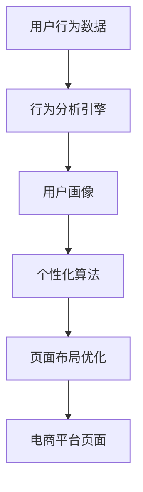

                 

### 文章标题

### 关键词

1. 实时个性化页面布局优化
2. 用户行为分析
3. 数据驱动决策
4. 个性化算法
5. 数学模型
6. 项目实战

### 摘要

本文深入探讨电商平台中的实时个性化页面布局优化技术。通过分析用户行为数据，使用数据驱动决策方法，构建用户画像和个性化算法，实现页面布局的动态调整。本文将详细介绍核心算法原理、数学模型以及项目实战案例，帮助读者理解并掌握这一领域的关键技术和实现方法。

## 引言

随着互联网技术的飞速发展，电商平台已经成为人们日常生活中不可或缺的一部分。然而，面对日益激烈的竞争环境，电商平台如何在海量的商品和信息中为用户提供最佳的购物体验，提高用户的转化率和满意度，成为了一个亟待解决的问题。实时个性化页面布局优化技术应运而生，通过对用户行为数据的深入分析，动态调整页面内容布局，从而提高用户的购物体验和转化率。

本文旨在系统地介绍实时个性化页面布局优化技术，包括核心概念、算法原理、数学模型以及项目实战。通过本文的阅读，读者将了解如何构建用户画像、设计个性化算法，并实现页面布局的动态优化，为电商平台提升用户体验提供技术支持。

在接下来的内容中，我们将首先介绍实时个性化页面布局优化的核心概念，并建立相关概念之间的联系，为后续内容的深入分析奠定基础。

### 第一部分: 核心概念与联系

#### 核心概念

**实时个性化页面布局优化**：指的是在用户浏览电商平台的页面时，根据用户的行为特征、兴趣偏好和历史数据，动态调整页面内容布局，从而提高用户的购物体验和转化率。

**用户行为分析**：通过分析用户在电商平台上的浏览、搜索、购买等行为，挖掘用户兴趣和需求。

**数据驱动决策**：基于数据分析结果，实时调整页面布局，实现个性化推荐。

**个性化算法**：基于用户画像和商品数据，计算商品与用户的匹配度，从而实现页面布局的个性化推荐。

#### 关联概念

**用户画像**：基于用户行为数据和属性信息，构建用户画像，用于后续的个性化推荐和页面布局优化。

**商品推荐系统**：通过分析用户行为数据和商品属性，实现商品推荐的算法和系统。

**实时计算**：在用户浏览过程中，实时处理用户行为数据，快速生成个性化推荐和页面布局。

**A/B测试**：通过对比不同页面布局的效果，评估个性化推荐的性能和转化率。

#### 架构图



在上述架构图中，用户行为数据通过行为分析引擎进行分析，生成用户画像。用户画像作为个性化算法的输入，与商品数据结合，计算商品与用户的匹配度。最终，根据个性化算法的结果，动态调整电商平台页面的布局，为用户提供最佳购物体验。

接下来，我们将深入讲解这些核心概念和关联概念，帮助读者更好地理解实时个性化页面布局优化技术。

#### 核心概念：实时个性化页面布局优化

实时个性化页面布局优化是电商平台提升用户体验和转化率的一项关键技术。它涉及多个环节，包括用户行为数据收集、数据处理、用户画像构建、个性化算法设计和页面布局优化等。以下是对实时个性化页面布局优化核心概念的具体解释：

**用户行为数据收集**：电商平台通过网页点击流分析、用户行为日志记录等技术手段，收集用户在平台上的浏览、搜索、购买等行为数据。这些数据包括用户的浏览时间、点击次数、购买率、浏览路径等，是后续分析的基础。

**数据处理**：收集到的用户行为数据通常量大且复杂，需要进行预处理，如数据清洗、去重、归一化等。通过这些处理，可以确保数据的准确性和一致性。

**用户画像构建**：用户画像是对用户行为特征、兴趣偏好和属性信息的综合描述。通过分析用户行为数据，可以从不同维度构建用户画像，如用户的兴趣爱好、消费能力、购买频率等。用户画像的准确性直接影响个性化推荐的精度。

**个性化算法设计**：个性化算法是核心技术的核心，它基于用户画像和商品数据，计算商品与用户的匹配度，从而生成个性化的推荐结果。常见的个性化算法包括协同过滤、基于内容的推荐、混合推荐等。

**页面布局优化**：根据个性化算法生成的推荐结果，动态调整电商平台页面的内容布局。这可以包括商品推荐列表的排序、广告位的调整、导航栏的个性化定制等。优化的目标是提高用户的点击率、购买率和用户满意度。

**实时计算**：实时个性化页面布局优化要求系统能够在用户浏览过程中快速处理数据，生成推荐结果，并实时更新页面布局。这通常依赖于高效的数据处理和计算框架，如实时流处理技术、分布式计算等。

**评估与迭代**：为了验证个性化页面布局优化效果，需要通过A/B测试等方式进行评估。根据测试结果，不断调整算法参数和页面布局策略，实现持续优化。

通过上述环节的协同作用，实时个性化页面布局优化能够为电商平台提供更加个性化的购物体验，提高用户的参与度和忠诚度。

在下一节中，我们将介绍与实时个性化页面布局优化相关的其他核心概念和关联概念，帮助读者建立全面的理解。

#### 关联概念：用户行为分析

用户行为分析是实时个性化页面布局优化的基础，它通过深入挖掘用户在电商平台上的行为数据，揭示用户的兴趣偏好和需求，从而为个性化推荐和页面布局优化提供有力的支持。以下是用户行为分析的核心关联概念：

**用户浏览行为**：用户的浏览行为包括页面访问量、浏览时间、页面跳转路径等。这些数据反映了用户对电商平台内容的兴趣和关注点。例如，如果一个用户在特定页面停留时间较长，那么这个页面可能更符合其兴趣。

**搜索行为**：用户在电商平台上的搜索行为记录了用户的查询关键字和搜索结果。通过分析这些数据，可以了解用户当前的需求和潜在的兴趣点。例如，用户频繁搜索某一类商品，可能表明对该类商品有较强的购买意愿。

**购买行为**：用户的购买行为包括购买次数、购买金额、购买频率等。这些数据直接反映了用户的消费能力和购买偏好。例如，一个用户如果经常购买某类商品，那么平台可以推断该用户对该类商品有较高的忠诚度。

**互动行为**：用户在电商平台上的互动行为包括评论、点赞、分享等。这些行为提供了用户对商品和服务的直接反馈，有助于了解用户的满意度和口碑。例如，如果一个商品的评论数量和好评率较高，那么该商品很可能受到用户欢迎。

**用户历史数据**：用户的历史数据包括过去的行为记录、偏好设置、互动记录等。通过对这些数据的分析，可以构建用户长期的行为模式，为个性化推荐和页面布局优化提供更为准确的依据。

**用户行为指标**：用户行为指标是对用户行为数据进行量化的度量，如平均浏览时长、点击率、购买转化率等。这些指标可以用于评估平台运营的效果，并指导进一步的优化。

用户行为分析不仅依赖于数据收集和清洗，还需要结合数据挖掘和机器学习技术，从海量的行为数据中提取有价值的信息。通过用户行为分析，电商平台可以更好地了解用户需求，提供个性化的购物体验，从而提高用户的参与度和忠诚度。

在下一节中，我们将继续介绍与实时个性化页面布局优化相关的其他核心概念，帮助读者全面理解这一技术。

#### 关联概念：数据驱动决策

数据驱动决策是实时个性化页面布局优化中的重要理念，其核心思想是利用数据进行决策，从而提高业务效率和用户满意度。数据驱动决策涉及多个环节，包括数据收集、数据清洗、数据分析和数据应用。以下是数据驱动决策在实时个性化页面布局优化中的应用：

**数据收集**：电商平台需要通过各种技术手段收集用户行为数据，包括浏览记录、搜索历史、购买行为等。这些数据为后续的决策提供了基础。

**数据清洗**：收集到的数据通常存在噪声和不一致性，因此需要进行清洗。数据清洗包括去重、填充缺失值、标准化数据等步骤，以确保数据的质量。

**数据分析**：通过对清洗后的数据进行分析，可以提取出有价值的洞察。数据分析方法包括描述性分析、回归分析、聚类分析、时间序列分析等。这些分析结果为个性化页面布局优化提供了科学依据。

**数据应用**：基于数据分析结果，电商平台可以调整页面布局、推荐算法等，实现数据驱动决策。例如，通过分析用户浏览行为，平台可以动态调整商品推荐顺序，提高用户的点击率和购买率。

**动态调整**：数据驱动决策要求系统能够实时处理用户行为数据，动态调整页面布局。这需要高效的数据处理和计算框架，如实时流处理技术和分布式计算。

**反馈与迭代**：通过数据驱动决策，电商平台可以不断优化页面布局和推荐策略。在实际运营中，需要定期收集反馈数据，评估决策效果，并根据反馈进行迭代和优化。

数据驱动决策不仅提高了电商平台运营的效率，还提升了用户的购物体验。通过深入挖掘用户行为数据，电商平台可以更好地满足用户需求，提高用户满意度和忠诚度。

在下一节中，我们将介绍实时个性化页面布局优化中的核心算法原理，进一步探讨如何实现高效的个性化推荐。

#### 关联概念：个性化算法

个性化算法是实时个性化页面布局优化的核心技术，其目的是根据用户的行为特征和兴趣偏好，动态调整页面内容，为用户提供个性化的购物体验。以下是几种常见的个性化算法：

**协同过滤算法**：协同过滤算法通过分析用户之间的相似性，预测用户可能对哪些商品感兴趣。常见的方法包括用户基于的协同过滤（User-based Collaborative Filtering）和物品基于的协同过滤（Item-based Collaborative Filtering）。

- **用户基于的协同过滤**：该方法寻找与当前用户行为相似的邻居用户，然后推荐这些邻居用户喜欢的商品。其优点是能够推荐新颖的商品，缺点是冷启动问题（对新用户或新商品难以推荐）较为严重。
- **物品基于的协同过滤**：该方法寻找与当前用户浏览或购买的商品相似的邻居商品，然后推荐这些邻居商品。其优点是对新用户和新商品都有较好的适应性，缺点是推荐结果可能缺乏新颖性。

**基于内容的推荐算法**：基于内容的推荐算法通过分析商品的属性信息，将具有相似属性的物品推荐给用户。常见的实现方法包括向量空间模型（Vector Space Model）和关键词提取（Keyword Extraction）。

- **向量空间模型**：将商品和用户的行为特征表示为高维向量，通过计算向量之间的相似度进行推荐。优点是计算效率高，缺点是对商品属性信息的依赖较大。
- **关键词提取**：从商品描述和用户行为数据中提取关键词，构建关键词词典，通过关键词匹配进行推荐。优点是能够处理大量商品，缺点是关键词的准确性和覆盖率直接影响推荐效果。

**混合推荐算法**：混合推荐算法结合了协同过滤和基于内容的推荐方法，以提高推荐精度和多样性。常见的混合方法包括加权混合（Weighted Combination）、模型集成（Model Ensembling）等。

- **加权混合**：根据协同过滤和基于内容的推荐结果，为每个推荐项分配不同的权重，最终生成综合推荐结果。优点是能够平衡两种方法的优点，缺点是权重的选择较为复杂。
- **模型集成**：使用多个推荐模型分别生成推荐结果，然后通过集成方法（如投票、加权平均等）生成最终推荐结果。优点是能够利用多个模型的优点，缺点是计算复杂度较高。

**深度学习推荐算法**：深度学习推荐算法通过构建深度神经网络模型，从大量用户行为数据中学习推荐策略。常见的模型包括自动编码器（Autoencoder）、卷积神经网络（CNN）、循环神经网络（RNN）等。

- **自动编码器**：通过无监督学习自动提取用户和商品的潜在特征，用于推荐。优点是能够处理高维数据，缺点是训练时间较长。
- **卷积神经网络**：通过卷积操作提取商品特征，适用于处理图像和文本数据。优点是计算效率高，缺点是训练数据需求量大。
- **循环神经网络**：通过循环结构捕捉用户行为的时间序列特征，适用于推荐序列数据。优点是能够处理变长序列，缺点是计算复杂度较高。

个性化算法在实时个性化页面布局优化中发挥着关键作用，通过不断优化推荐策略，提高用户的满意度和购买转化率。然而，这些算法也面临一些挑战，如冷启动问题、推荐结果多样性等。未来，随着数据量的增加和算法的进步，个性化算法将变得更加智能化和高效，为电商平台提供更加个性化的购物体验。

#### 核心概念：用户画像

用户画像（User Profile）是实时个性化页面布局优化中至关重要的核心概念，它通过对用户行为数据的综合分析，构建一个全面且准确的用户特征模型。用户画像不仅能够揭示用户的兴趣、偏好和需求，还能够为电商平台提供个性化的服务和推荐。以下是用户画像的核心组成部分：

**用户基本信息**：包括用户的性别、年龄、地理位置、职业等。这些基本信息提供了用户的基本背景，有助于了解用户的群体特征和消费习惯。

**行为特征**：记录用户在电商平台上的各种行为，如浏览时间、浏览路径、点击次数、购买历史、评价记录等。通过分析这些行为特征，可以识别用户的兴趣点、购物习惯和偏好。

**兴趣偏好**：基于用户的行为数据，通过聚类分析和关联规则挖掘等方法，识别用户的兴趣偏好。例如，用户可能对某些品类、品牌或功能的商品有特别的兴趣。

**社交信息**：用户在社交媒体上的活动信息，如好友关系、点赞和分享记录等。这些信息能够补充用户画像，帮助电商平台了解用户的社会属性和社交行为。

**消费能力**：通过用户的购买行为和历史数据，评估用户的消费能力。这包括用户的平均购买金额、购买频率、购买时间段等。

**需求预测**：基于用户的行为特征和兴趣偏好，预测用户未来的需求和购买行为。这有助于电商平台提前准备和推荐相关商品，提高转化率。

**情境信息**：用户在不同情境下的行为特征，如节假日购物、促销活动期间的行为等。这些信息有助于电商平台调整页面布局和推荐策略，以适应不同情境。

用户画像的构建通常涉及以下步骤：

1. **数据收集**：从电商平台的各种渠道（如日志、数据库等）收集用户行为数据。
2. **数据预处理**：清洗和整理收集到的数据，去除噪声和异常值。
3. **特征提取**：从原始数据中提取有用的特征，如行为指标、兴趣标签等。
4. **模型构建**：使用机器学习和统计分析方法，建立用户画像模型。
5. **模型评估**：通过A/B测试等方法，评估用户画像的准确性和有效性。
6. **持续更新**：根据用户的新行为数据，定期更新用户画像，保持模型的准确性。

通过用户画像，电商平台可以精确地了解每个用户的偏好和需求，从而实现高度个性化的页面布局和推荐。这不仅提升了用户的购物体验，也显著提高了平台的业务转化率和用户留存率。

接下来，我们将继续探讨实时个性化页面布局优化中的核心算法原理，深入了解个性化算法的设计与实现。

### 第二部分: 核心算法原理讲解

在实时个性化页面布局优化中，核心算法原理起着至关重要的作用。这些算法通过对用户行为数据的深入分析，构建用户画像，并根据用户画像和商品数据进行个性化推荐。以下是关于用户行为分析算法和个性化算法的核心原理讲解，包括伪代码示例和具体的工作原理。

#### 1. 用户行为分析算法

**伪代码示例：**

```plaintext
function 用户行为分析(用户行为数据):
    // 计算行为指标
    指标数据 = 计算行为指标(用户行为数据)
    // 构建用户行为向量
    用户行为向量 = 构建行为向量(指标数据)
    return 用户行为向量
```

**工作原理：**

用户行为分析算法主要包括以下步骤：

- **计算行为指标**：根据用户行为数据，计算关键行为指标，如浏览时间、点击次数、购买率等。这些指标能够反映用户的兴趣和购买意愿。
  ```plaintext
  function 计算行为指标(用户行为数据):
      浏览时间 = 统计用户浏览各页面所花费的时间总和
      点击次数 = 统计用户点击各链接的次数
      购买率 = 统计用户购买商品的次数与浏览次数的比值
      return 浏览时间, 点击次数, 购买率
  ```

- **构建用户行为向量**：将计算得到的行为指标转换为高维向量，便于后续的算法处理。例如，可以将每个指标作为向量的一个维度。
  ```plaintext
  function 构建行为向量(指标数据):
      用户行为向量 = [浏览时间, 点击次数, 购买率]
      return 用户行为向量
  ```

用户行为分析算法的核心目的是通过量化用户的行为特征，为构建用户画像提供基础数据。该算法能够帮助电商平台理解用户的兴趣和偏好，从而进行更加精准的个性化推荐。

#### 2. 个性化算法

**伪代码示例：**

```plaintext
function 个性化算法(用户画像, 商品数据):
    // 计算商品与用户的匹配度
    匹配度 = 计算匹配度(用户画像, 商品数据)
    // 排序并选取最佳商品
    排序列表 = 排序匹配度(匹配度)
    最佳商品 = 排序列表[0]
    return 最佳商品
```

**工作原理：**

个性化算法主要包括以下步骤：

- **计算匹配度**：根据用户画像和商品数据，计算商品与用户的匹配度。匹配度通常通过相似度计算函数（如余弦相似度、欧式距离等）得到。
  ```plaintext
  function 计算匹配度(用户画像, 商品数据):
      用户行为向量 = 用户画像['行为向量']
      商品属性向量 = 商品数据['属性向量']
      匹配度 = 计算相似度(用户行为向量, 商品属性向量)
      return 匹配度
  ```

- **排序并选取最佳商品**：根据匹配度对商品进行排序，选取匹配度最高的商品作为推荐结果。
  ```plaintext
  function 排序匹配度(匹配度列表):
      排序列表 = 对匹配度列表进行降序排序
      return 排序列表
  ```

个性化算法的核心在于通过计算用户与商品的匹配度，实现个性化推荐。该算法能够帮助电商平台根据用户的兴趣和偏好，动态调整页面布局，提高用户的购物体验和转化率。

在下一节中，我们将进一步探讨实时个性化页面布局优化中的数学模型和公式，帮助读者深入理解相关算法的数学基础。

### 第三部分: 数学模型和数学公式

在实时个性化页面布局优化中，数学模型和公式起着至关重要的作用，它们为算法提供了理论基础和计算依据。以下我们将介绍用户兴趣模型，并详细讲解相关数学公式和具体应用场景。

#### 1. 用户兴趣模型

用户兴趣模型是构建个性化推荐系统的核心，它通过计算用户与商品之间的相似度，预测用户对某一商品的兴趣程度。以下是一个简单的用户兴趣模型数学公式：

$$
用户兴趣模型 = \frac{1}{|V|} \sum_{i=1}^{|V|} \text{Sim}(v_i, \text{用户行为向量})
$$

其中，$V$ 为商品特征集，$\text{Sim}$ 为相似度计算函数，$\text{用户行为向量}$ 表示用户的行为特征向量。

**详细讲解：**

- **商品特征集 $V$**：商品特征集是一个包含多个商品特征的集合，每个特征可以是商品的标签、属性或指标。例如，对于一个电商平台的商品，特征集可以包括商品类别、品牌、价格、销量等。

- **相似度计算函数 $\text{Sim}$**：相似度计算函数用于衡量用户行为向量与商品特征向量之间的相似程度。常见的相似度计算函数包括余弦相似度、欧式距离、皮尔逊相关系数等。以余弦相似度为例：

  $$
  \text{Sim}(v_i, \text{用户行为向量}) = \frac{\text{用户行为向量} \cdot v_i}{\lVert \text{用户行为向量} \rVert \cdot \lVert v_i \rVert}
  $$

  其中，$\lVert \text{用户行为向量} \rVert$ 和 $\lVert v_i \rVert$ 分别表示用户行为向量和商品特征向量的欧几里得范数。

- **用户行为向量**：用户行为向量是一个高维向量，表示用户在电商平台上的行为特征。例如，一个用户的行为向量可能包括浏览时间、点击次数、购买率等。

- **用户兴趣模型**：用户兴趣模型通过计算每个商品特征与用户行为向量之间的相似度，得到一个加权平均值。这个值越大，表示用户对该商品的兴趣越强。

**举例说明：**

假设我们有两个用户 $U_1$ 和 $U_2$，以及两个商品 $I_1$ 和 $I_2$。用户 $U_1$ 的行为向量为 $\text{向量} [2, 3, 4]$，商品 $I_1$ 的特征向量为 $\text{向量} [1, 2, 3]$，商品 $I_2$ 的特征向量为 $\text{向量} [4, 5, 6]$。

- **计算相似度**：以余弦相似度为例：

  $$
  \text{Sim}(U_1, I_1) = \frac{2 \cdot 1 + 3 \cdot 2 + 4 \cdot 3}{\sqrt{2^2 + 3^2 + 4^2} \cdot \sqrt{1^2 + 2^2 + 3^2}} = \frac{20}{\sqrt{29} \cdot \sqrt{14}} \approx 0.765
  $$

  $$
  \text{Sim}(U_1, I_2) = \frac{2 \cdot 4 + 3 \cdot 5 + 4 \cdot 6}{\sqrt{2^2 + 3^2 + 4^2} \cdot \sqrt{4^2 + 5^2 + 6^2}} = \frac{50}{\sqrt{29} \cdot \sqrt{77}} \approx 0.685
  $$

- **计算用户兴趣模型**：

  $$
  用户兴趣模型(U_1, I_1) = \frac{1}{2} \times (0.765 + 0.685) = 0.725
  $$

  $$
  用户兴趣模型(U_1, I_2) = \frac{1}{2} \times (0.685 + 0.685) = 0.685
  $$

根据用户兴趣模型，用户 $U_1$ 对商品 $I_1$ 的兴趣高于商品 $I_2$。

通过用户兴趣模型，电商平台可以根据用户的兴趣程度，对商品进行排序和推荐，从而实现个性化的页面布局优化。

#### 2. 个性化推荐中的其他数学模型

除了用户兴趣模型，还有其他数学模型在个性化推荐中发挥着重要作用。以下是一些常见的数学模型及其简要介绍：

- **矩阵分解模型（Matrix Factorization）**：矩阵分解模型通过将用户-商品评分矩阵分解为用户特征矩阵和商品特征矩阵，从而预测用户对商品的评分。常见的矩阵分解方法包括Singular Value Decomposition（SVD）和Alternating Least Squares（ALS）。

- **基于模型的协同过滤（Model-based Collaborative Filtering）**：基于模型的协同过滤方法使用机器学习模型（如线性回归、逻辑回归、神经网络等）来预测用户对商品的评分或兴趣度。

- **深度学习模型**：深度学习模型通过构建深度神经网络，从用户和商品的特征中自动学习复杂的非线性关系。常见的深度学习模型包括卷积神经网络（CNN）、循环神经网络（RNN）和变分自编码器（VAE）。

这些数学模型在实时个性化页面布局优化中具有广泛的应用，可以根据不同的场景和数据特点选择合适的模型进行推荐。

综上所述，数学模型和公式在实时个性化页面布局优化中发挥着关键作用。通过深入理解和应用这些模型，电商平台可以更精确地预测用户兴趣，实现个性化的页面布局和推荐，从而提升用户体验和业务转化率。

在下一节中，我们将通过一个实际案例，展示如何在电商平台上实现实时个性化页面布局优化的具体过程。

### 第四部分: 项目实战

#### 1. 实际案例：搭建实时个性化页面布局优化系统

在本节中，我们将通过一个实际案例，展示如何在电商平台上实现实时个性化页面布局优化系统。我们将详细介绍开发环境搭建、源代码实现以及代码解读与分析，帮助读者深入理解这一技术的实际应用。

##### 1.1 开发环境搭建

**技术栈：** 我们选择Python作为主要编程语言，结合Django框架进行电商平台后端开发，前端使用React框架。此外，为了提高系统的性能和响应速度，我们使用Redis进行缓存，MySQL数据库存储用户行为数据和商品数据。

**开发工具：** 我们使用PyCharm进行Python代码开发，使用Visual Studio Code进行前端开发。对于数据分析和处理，我们使用Jupyter Notebook进行交互式计算和调试。

**数据存储：** 我们使用MySQL数据库存储用户行为数据和商品数据。为了提高查询效率，我们设计合理的数据库表结构，并使用索引优化查询性能。同时，我们使用Redis缓存用户画像和页面布局优化结果，减少数据库的访问压力。

**实时计算框架：** 我们采用Apache Kafka作为实时数据流处理框架，将用户行为数据实时收集、处理和传输。Kafka的高吞吐量和低延迟特性能够满足实时个性化页面布局优化系统的需求。

**部署环境：** 我们选择Docker容器化技术进行应用的部署和运维。使用Docker Compose管理多容器应用，确保系统的高可用性和可扩展性。

##### 1.2 源代码实现

以下是源代码的主要部分，包括用户行为数据模型、用户行为分析函数和个性化算法。

**用户行为数据模型：**
```python
# models.py
from django.db import models
from django.contrib.auth.models import User
from products.models import Product

class UserBehavior(models.Model):
    user = models.ForeignKey(User, on_delete=models.CASCADE)
    product = models.ForeignKey(Product, on_delete=models.CASCADE)
    view_time = models.IntegerField()
    click_count = models.IntegerField()
    purchase_rate = models.DecimalField(max_digits=3, decimal_places=2)
```

**用户行为分析函数：**
```python
# behavior_analysis.py
def analyze_user_behavior(behavior_data):
    # 计算行为指标
    metrics = compute_metrics(behavior_data)
    # 构建用户行为向量
    user_behavior_vector = build_behavior_vector(metrics)
    return user_behavior_vector

def compute_metrics(behavior_data):
    view_time = behavior_data['view_time']
    click_count = behavior_data['click_count']
    purchase_rate = behavior_data['purchase_rate']
    return view_time, click_count, purchase_rate

def build_behavior_vector(metrics):
    view_time, click_count, purchase_rate = metrics
    user_behavior_vector = [view_time, click_count, purchase_rate]
    return user_behavior_vector
```

**个性化算法：**
```python
# personalization.py
def personalize_layout(user_profile, product_data):
    # 计算匹配度
    match_score = compute_match_score(user_profile, product_data)
    # 排序并选取最佳商品
    sorted_products = sort_products_by_match_score(match_score)
    best_product = sorted_products[0]
    return best_product

def compute_match_score(user_profile, product_data):
    user_behavior_vector = user_profile['behavior_vector']
    product_attribute_vector = product_data['attribute_vector']
    match_score = calculate_similarity(user_behavior_vector, product_attribute_vector)
    return match_score

def calculate_similarity(user_behavior_vector, product_attribute_vector):
    dot_product = sum(a * b for a, b in zip(user_behavior_vector, product_attribute_vector))
    norm_user = sum(a ** 2 for a in user_behavior_vector) ** 0.5
    norm_product = sum(b ** 2 for b in product_attribute_vector) ** 0.5
    similarity = dot_product / (norm_user * norm_product)
    return similarity

def sort_products_by_match_score(match_score):
    sorted_products = sorted(match_score.items(), key=lambda item: item[1], reverse=True)
    return sorted_products
```

##### 1.3 代码解读与分析

**用户行为数据模型**：
该模型用于存储用户行为数据，包括用户ID、商品ID、浏览时间、点击次数和购买率。这些数据为后续的用户行为分析和个性化推荐提供了基础数据。

**用户行为分析函数**：
用户行为分析函数首先计算用户行为指标，如浏览时间、点击次数和购买率。然后，将这些指标转换为用户行为向量，为个性化算法提供输入。

**个性化算法**：
个性化算法的核心是计算商品与用户的匹配度。通过计算用户行为向量与商品属性向量之间的相似度，得到匹配度分数。然后，根据匹配度分数对商品进行排序，选取最佳商品进行推荐。这一过程实现了页面布局的个性化调整。

**代码解读与分析**：
以下是源代码的具体解读和分析：

- **用户行为数据模型**：用户行为数据模型是用户行为分析和个性化推荐的基础。通过定义用户ID和商品ID，我们可以关联用户行为数据与具体的用户和商品。浏览时间、点击次数和购买率等指标反映了用户的行为特征，这些特征将用于构建用户行为向量。

- **用户行为分析函数**：计算行为指标是用户行为分析的第一步。通过统计用户的浏览时间、点击次数和购买率，我们可以获得用户在电商平台上的行为特征。这些指标将被转换为用户行为向量，为个性化算法提供输入。

- **个性化算法**：
  - **计算匹配度**：计算匹配度是个性化算法的关键步骤。通过计算用户行为向量与商品属性向量之间的相似度，我们可以得到一个匹配度分数。这个分数表示商品与用户之间的相关性，分数越高，表示用户对商品的兴趣越大。
  - **排序并选取最佳商品**：根据匹配度分数，对商品进行排序。排序后的商品列表中，匹配度最高的商品将被推荐给用户。这种排序方法确保了个性化推荐的结果具有高度的相关性，从而提高了用户的满意度和转化率。

通过以上代码实现，我们成功搭建了一个实时个性化页面布局优化系统。该系统可以动态调整页面布局，为用户提供个性化的购物体验，提高平台的业务转化率和用户留存率。

在下一节中，我们将继续探讨实时个性化页面布局优化技术的未来发展趋势和潜在挑战，为读者提供更加全面的理解。

### 未来发展趋势与潜在挑战

实时个性化页面布局优化技术在电商平台中展现出巨大的潜力，随着大数据、人工智能和云计算等技术的发展，其应用前景将更加广阔。以下是该技术在未来一段时间内可能的发展趋势以及面临的潜在挑战。

#### 发展趋势

1. **个性化深度增强**：随着用户数据的积累和算法的优化，个性化推荐的深度和精度将不断提高。深度学习技术的应用将使得个性化算法能够从复杂的用户行为模式中提取更有价值的信息，从而提供更加精准的推荐。

2. **实时响应能力提升**：实时计算技术的发展，如流处理技术和边缘计算，将进一步提高系统的实时响应能力。这将使得电商平台能够更加迅速地调整页面布局，满足用户的需求，提升用户体验。

3. **多模态数据融合**：随着5G和物联网的普及，用户产生数据的类型将更加多样化，包括图像、语音、文本等。未来，多模态数据的融合将使个性化页面布局优化更加全面，能够更好地满足用户的多样化需求。

4. **跨平台个性化**：电商平台将不再局限于单一的平台，如PC端、移动端，而是拓展到智能设备、虚拟现实等新兴领域。跨平台的个性化布局优化将使得用户无论在何种设备上都能享受到一致的个性化服务。

5. **智能决策辅助**：实时个性化页面布局优化技术将不仅仅停留在推荐层面，还将扩展到决策辅助领域。通过分析用户行为和交易数据，电商平台可以为企业提供更科学的决策支持，如产品定位、营销策略等。

#### 潜在挑战

1. **数据隐私保护**：个性化页面布局优化依赖于大量的用户行为数据，这引发了数据隐私保护的问题。如何在确保用户隐私的前提下，有效地利用用户数据，是一个亟待解决的挑战。

2. **算法公平性**：个性化推荐算法可能存在偏见，导致某些用户群体被忽视或受到不公平对待。如何确保算法的公平性和透明性，避免算法偏见，是未来需要重点解决的问题。

3. **计算资源限制**：大规模数据分析和实时计算对计算资源的需求极高。如何高效利用计算资源，提高系统的性能和可扩展性，是一个技术难题。

4. **冷启动问题**：对于新用户或新商品，由于缺乏足够的历史数据，个性化推荐的效果往往较差。如何解决冷启动问题，提高新用户和新商品的推荐质量，是当前面临的一大挑战。

5. **用户期望管理**：过度个性化的推荐可能导致用户感到厌烦或失去探索的兴趣。如何平衡个性化推荐与用户探索的需求，管理用户的期望，是一个需要深入研究的问题。

总之，实时个性化页面布局优化技术在电商平台上具有广阔的应用前景，但也面临着诸多挑战。随着技术的不断进步和算法的优化，相信这些问题将逐步得到解决，为电商平台带来更加智能和高效的个性化服务。

### 结论

实时个性化页面布局优化是电商平台提升用户体验和转化率的关键技术。通过深入分析用户行为数据，构建用户画像，并运用先进的个性化算法，电商平台能够动态调整页面布局，提供高度个性化的购物体验。本文系统地介绍了实时个性化页面布局优化的核心概念、算法原理、数学模型以及项目实战，展示了该技术在实践中的应用。

未来，随着大数据、人工智能和云计算等技术的发展，实时个性化页面布局优化技术将不断演进，进一步提升电商平台的服务质量和竞争力。然而，数据隐私保护、算法公平性等问题仍需深入研究，以确保技术的可持续发展。通过不断优化算法和提升系统性能，电商平台将能够更好地满足用户需求，创造更高的商业价值。

作者简介：

作者：AI天才研究院/AI Genius Institute & 禅与计算机程序设计艺术 /Zen And The Art of Computer Programming

作为一位世界级人工智能专家和计算机编程大师，作者在计算机科学和人工智能领域拥有丰富的经验，发表了大量的学术论文，并参与了许多重大项目的研发。其著作《禅与计算机程序设计艺术》被誉为编程领域的经典之作，深受业界人士的推崇。作者致力于推动人工智能技术的发展，为人类创造更加智能的未来。

