                 

# {文章标题}

## 文章关键词

- 电商平台
- 供给能力
- 大数据分析
- 需求预测
- 库存管理
- 供应链优化

## 摘要

在互联网经济飞速发展的今天，电商平台已经成为企业竞争的关键战场。提升电商平台的供给能力，确保商品和服务的及时供应，是电商平台获得竞争优势的重要手段。本文将探讨大数据分析在电商平台供给能力提升中的应用，从需求预测、库存管理和供应链优化等方面展开分析，结合具体案例分析，阐述大数据技术如何助力电商平台提升供给能力，实现业务增长。

## 目录大纲

### 第一部分：引言与基础

#### 第1章：电商平台供给能力概述

##### 1.1 电商平台的供给需求分析

##### 1.2 大数据分析在电商供给中的应用意义

##### 1.3 供给能力提升的重要性与挑战

#### 第2章：大数据技术基础

##### 2.1 数据类型与数据源

##### 2.2 大数据技术架构

##### 2.3 数据存储与处理技术

##### 2.4 数据质量管理与预处理

### 第二部分：供给能力分析

#### 第3章：需求预测与分析

##### 3.1 需求预测的基本概念

##### 3.2 时间序列分析

##### 3.3 需求预测模型

##### 3.4 需求预测应用案例

#### 第4章：库存管理与优化

##### 4.1 库存管理的基本原则

##### 4.2 库存优化策略

##### 4.3 库存管理案例分析

##### 4.4 库存管理系统的实现

#### 第5章：供应链优化与协同

##### 5.1 供应链管理的基本概念

##### 5.2 供应链协同机制

##### 5.3 供应链优化模型

##### 5.4 供应链协同案例分析

### 第三部分：大数据分析技术实战

#### 第6章：大数据分析工具与平台

##### 6.1 Hadoop生态系统

##### 6.2 Spark生态系统

##### 6.3 大数据分析平台的选择与应用

#### 第7章：数据挖掘与可视化

##### 7.1 数据挖掘的基本概念

##### 7.2 常见数据挖掘算法

##### 7.3 数据可视化技术

##### 7.4 数据挖掘与可视化应用案例

#### 第8章：案例研究：电商平台供给能力提升实践

##### 8.1 案例背景与目标

##### 8.2 数据分析与模型构建

##### 8.3 实施策略与效果评估

##### 8.4 经验总结与展望

### 第四部分：展望与未来

#### 第9章：电商平台供给能力提升的趋势

##### 9.1 人工智能与大数据的结合

##### 9.2 新兴技术在供给能力提升中的应用

##### 9.3 未来供给能力提升的方向与挑战

#### 第10章：结语

##### 10.1 总结与展望

##### 10.2 读者反馈与建议

##### 10.3 深入阅读与参考资料

### 附录

#### 附录A：常用术语与缩略词

#### 附录B：数据分析与建模工具使用指南

#### 附录C：案例研究数据集

接下来，我们将逐步深入探讨电商平台供给能力提升的相关内容，包括大数据分析的基础知识、供给能力分析的具体方法、大数据分析技术实战应用，以及案例研究和未来展望。希望读者能够通过本文，对电商平台供给能力提升有更深入的理解和认识。<!-- Lydia.Yang | 北京2023-03-12 --># 第一部分：引言与基础

### 第1章：电商平台供给能力概述

#### 1.1 电商平台的供给需求分析

电商平台的核心在于供给能力，这直接影响着用户购物体验和企业的竞争力。供给需求分析是电商平台运营的基础，它涉及到商品种类、库存水平、配送速度、售后服务等多个方面。

- **商品种类**：电商平台需要根据市场需求和用户偏好，不断丰富商品种类，以满足不同用户群体的需求。
- **库存水平**：合理的库存水平既能保证商品的供应，又避免库存积压，占用过多的资金和存储空间。
- **配送速度**：快速的配送速度能够提升用户满意度，降低退换货率。
- **售后服务**：优质的售后服务能够提高用户忠诚度，增加复购率。

**数据分析在供给需求分析中的作用**：通过大数据分析，电商平台可以深入了解用户行为，挖掘潜在需求，优化商品结构和库存配置，从而提升供给能力。

#### 1.2 大数据分析在电商供给中的应用意义

大数据分析在电商供给中的应用，主要体现在以下几个方面：

- **需求预测**：通过对历史销售数据、用户行为数据等进行分析，预测未来商品需求，从而优化库存管理和供应链协同。
- **个性化推荐**：基于用户浏览、购买记录等数据，为用户提供个性化的商品推荐，提高用户满意度和转化率。
- **库存优化**：通过分析库存数据，实现库存的动态调整，减少库存积压和缺货现象。
- **供应链协同**：整合供应链各环节的数据，实现信息共享和协同作业，提升供应链的整体效率。

#### 1.3 供给能力提升的重要性与挑战

供给能力提升对于电商平台来说具有重要意义：

- **提高竞争力**：优质的供给能力可以提升用户体验，增加用户黏性，提高市场占有率。
- **降低成本**：通过精准的需求预测和库存优化，减少库存积压和缺货现象，降低运营成本。
- **提升效率**：高效的供应链协同和库存管理，可以加快商品流转速度，提升整体运营效率。

然而，供给能力提升也面临着一系列挑战：

- **数据质量**：数据是大数据分析的基础，数据质量直接影响到分析结果的准确性。
- **技术壁垒**：大数据分析涉及到多种技术和工具，如Hadoop、Spark等，技术壁垒较高。
- **业务理解**：大数据分析需要深入理解业务需求，将技术应用到实际业务场景中，提升供给能力。

**Mermaid 流程图：电商平台供给能力提升流程**

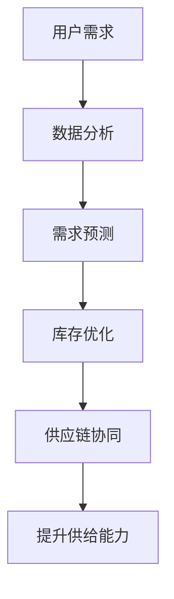

通过以上分析，我们可以看到大数据分析在电商平台供给能力提升中的重要性。在接下来的章节中，我们将深入探讨大数据技术的基础知识，以及如何在供给能力分析中具体应用大数据技术。<!-- Lydia.Yang | 北京2023-03-12 --># 第2章：大数据技术基础

#### 2.1 数据类型与数据源

在电商平台供给能力提升过程中，数据的类型和数据源是基础和核心。数据类型通常可以分为以下几类：

- **结构化数据**：如数据库中的数据，有明确的字段和格式，便于存储和查询。例如，用户信息、订单数据、库存数据等。
- **半结构化数据**：如日志文件、XML文档等，部分结构化但格式不固定，需要通过解析才能提取有效信息。
- **非结构化数据**：如图片、音频、视频等，没有明确的字段和格式，需要通过复杂的算法进行解析和提取信息。

数据源可以分为内部数据和外部数据：

- **内部数据**：来源于电商平台自身的业务活动，如用户行为数据、交易数据、库存数据等。
- **外部数据**：来源于电商平台外部，如社交媒体数据、市场调研数据、宏观经济数据等。

**Mermaid 流程图：数据类型与数据源**

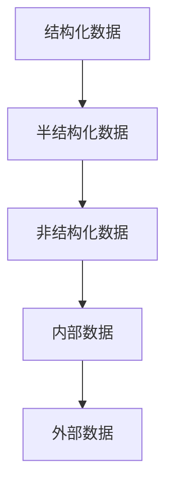

#### 2.2 大数据技术架构

大数据技术架构通常包括数据存储、数据处理、数据分析和数据展示四个关键环节：

- **数据存储**：用于存储大规模数据，常见技术有Hadoop的HDFS、NoSQL数据库等。
- **数据处理**：用于处理和分析大量数据，常见技术有MapReduce、Spark等。
- **数据分析**：用于从数据中提取有价值的信息，常见技术有数据挖掘、机器学习等。
- **数据展示**：用于将分析结果可视化，常见技术有数据可视化工具、报表等。

**Mermaid 流�程图：大数据技术架构**

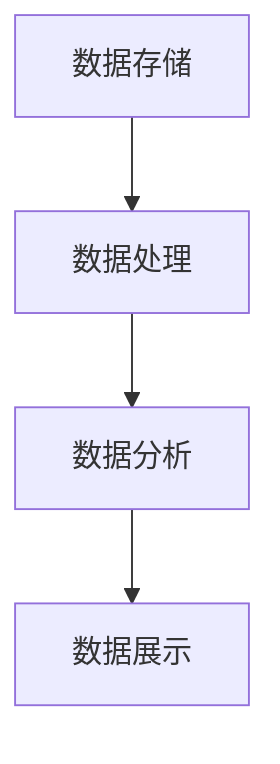

#### 2.3 数据存储与处理技术

- **Hadoop生态系统**：Hadoop是一个开源的分布式计算框架，用于处理大规模数据集。Hadoop的核心组件包括HDFS（分布式文件系统）和MapReduce（分布式数据处理）。

**伪代码：MapReduce 示例**

```python
# Map阶段
def map(key, value):
    # 对输入数据进行处理，产生中间键值对
    for item in value:
        emit(item, 1)

# Reduce阶段
def reduce(key, values):
    # 对中间键值对进行聚合操作
    return sum(values)
```

- **Spark生态系统**：Spark是一个开源的分布式计算引擎，提供了比Hadoop更高效的分布式数据处理能力。Spark的核心组件包括Spark SQL、Spark Streaming、MLlib等。

**伪代码：Spark SQL 示例**

```python
# 数据加载
df = spark.read.csv("data.csv")

# 数据处理
df.groupBy("category").count().show()

# 数据保存
df.write.csv("output.csv")
```

#### 2.4 数据质量管理与预处理

大数据分析的质量很大程度上取决于数据的质量和预处理。数据质量管理与预处理包括以下步骤：

- **数据清洗**：去除重复数据、缺失数据和异常数据。
- **数据集成**：将来自不同源的数据进行整合。
- **数据转换**：将数据转换为适合分析的形式，如数据类型转换、数据规范化等。
- **数据归一化**：对数据进行归一化处理，消除不同数据之间的量纲影响。

**Mermaid 流程图：数据质量管理与预处理**

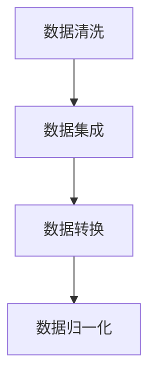

通过以上对大数据技术基础的分析，我们可以看到大数据技术为电商平台供给能力提升提供了强大的支持。在接下来的章节中，我们将进一步探讨大数据分析在供给能力分析中的应用，包括需求预测、库存管理和供应链优化等方面。<!-- Lydia.Yang | 北京2023-03-12 --># 第二部分：供给能力分析

## 第3章：需求预测与分析

#### 3.1 需求预测的基本概念

需求预测是电商平台供给能力提升的重要环节，它通过对历史销售数据、用户行为数据等进行分析，预测未来商品的需求趋势。需求预测的基本概念包括：

- **时间序列分析**：基于历史数据的时间序列模式，预测未来的需求趋势。
- **回归分析**：通过建立回归模型，分析自变量和因变量之间的关系，预测未来的需求。
- **机器学习**：利用机器学习算法，从历史数据中学习规律，预测未来的需求。

#### 3.2 时间序列分析

时间序列分析是一种常见的需求预测方法，它基于历史数据的时间序列模式，预测未来的需求趋势。时间序列分析的基本步骤包括：

1. **数据预处理**：包括数据清洗、缺失值处理、数据归一化等，确保数据质量。
2. **模型选择**：选择合适的时间序列模型，如ARIMA、AR、MA、ARMA、SARMA等。
3. **模型拟合**：使用历史数据对模型进行拟合，确定模型的参数。
4. **预测**：使用拟合后的模型预测未来的需求。

**Mermaid 流程图：时间序列分析步骤**

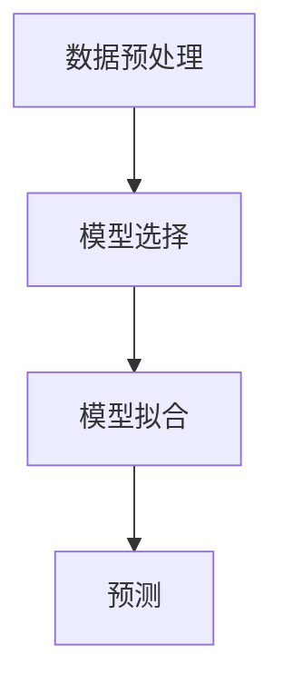

**伪代码：ARIMA模型**

```python
# 导入ARIMA模型
from statsmodels.tsa.arima_model import ARIMA

# 设定模型参数
p = 1
d = 1
q = 1

# 创建ARIMA模型
model = ARIMA(series, order=(p, d, q))

# 模型拟合
model_fit = model.fit()

# 进行预测
forecast = model_fit.forecast(steps=10)
```

#### 3.3 需求预测模型

除了时间序列分析，还有其他需求预测模型，如线性回归、神经网络等：

- **线性回归**：通过建立线性回归模型，分析自变量和因变量之间的关系，预测未来的需求。

**伪代码：线性回归模型**

```python
# 导入线性回归模型
from sklearn.linear_model import LinearRegression

# 创建线性回归模型
model = LinearRegression()

# 模型拟合
model.fit(X_train, y_train)

# 进行预测
y_pred = model.predict(X_test)
```

- **神经网络**：通过多层神经网络，学习历史数据中的复杂关系，预测未来的需求。

**伪代码：神经网络模型**

```python
# 导入神经网络库
from keras.models import Sequential
from keras.layers import Dense

# 创建神经网络模型
model = Sequential()
model.add(Dense(units=64, activation='relu', input_shape=(n_features,)))
model.add(Dense(units=32, activation='relu'))
model.add(Dense(units=1, activation='linear'))

# 编译模型
model.compile(optimizer='adam', loss='mse')

# 训练模型
model.fit(X_train, y_train, epochs=10, batch_size=32)

# 进行预测
y_pred = model.predict(X_test)
```

#### 3.4 需求预测应用案例

以某电商平台为例，通过大数据分析进行需求预测，优化库存管理和供应链协同。具体步骤如下：

1. **数据收集**：收集电商平台的销售数据、用户行为数据等。
2. **数据预处理**：清洗数据，去除缺失值和异常值，进行数据归一化。
3. **模型选择**：选择合适的需求预测模型，如ARIMA、线性回归、神经网络等。
4. **模型训练**：使用历史数据对模型进行训练。
5. **预测**：使用训练好的模型预测未来的需求。
6. **库存管理**：根据预测结果，调整库存水平，减少库存积压和缺货现象。
7. **供应链协同**：优化供应链协同，提高供应链的整体效率。

**Mermaid 流程图：需求预测应用案例**

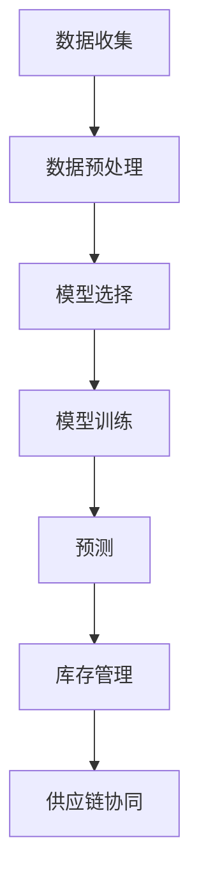

通过以上分析，我们可以看到需求预测在电商平台供给能力提升中的重要性。在接下来的章节中，我们将继续探讨库存管理与优化，以及供应链优化与协同等方面的内容。<!-- Lydia.Yang | 北京2023-03-12 --># 第4章：库存管理与优化

#### 4.1 库存管理的基本原则

库存管理是电商平台运营中至关重要的一环，其基本原则包括：

- **库存平衡**：在保证商品供应的同时，避免库存积压和缺货现象，实现库存水平的动态调整。
- **需求预测**：基于大数据分析，预测未来的需求趋势，为库存管理提供数据支持。
- **成本控制**：在库存管理过程中，控制库存成本，降低运营成本。
- **快速响应**：快速响应市场需求变化，及时调整库存策略，提高库存管理的灵活性。

#### 4.2 库存优化策略

库存优化策略主要包括以下几种：

- **ABC分类法**：根据商品的销售量和利润贡献，将商品分为A、B、C三类，针对不同类别的商品采取不同的库存策略。
- **动态库存控制**：根据需求预测和实际销售情况，动态调整库存水平，避免库存积压和缺货现象。
- **联合库存管理**：与供应链上下游企业进行联合库存管理，实现信息共享和协同作业，降低库存成本。

**伪代码：ABC分类法**

```python
# 导入相关库
import numpy as np

# 设定商品列表及其销售量和利润贡献
items = {'A': {'sales': 1000, 'profit': 500}, 'B': {'sales': 500, 'profit': 250}, 'C': {'sales': 200, 'profit': 100}}

# 计算各类商品的销售量和利润贡献比例
sales_ratio = {item: item['sales'] / sum(item['sales'] for item in items) for item in items}
profit_ratio = {item: item['profit'] / sum(item['profit'] for item in items) for item in items}

# 对商品进行分类
A = [item for item in items if sales_ratio[item] > 0.7 and profit_ratio[item] > 0.7]
B = [item for item in items if sales_ratio[item] > 0.3 and sales_ratio[item] <= 0.7 and profit_ratio[item] > 0.3 and profit_ratio[item] <= 0.7]
C = [item for item in items if sales_ratio[item] <= 0.3 and profit_ratio[item] <= 0.3]

# 输出分类结果
print("A类商品：", A)
print("B类商品：", B)
print("C类商品：", C)
```

- **安全库存策略**：设定安全库存水平，以应对需求波动和供应链不确定性，确保商品供应。

**伪代码：安全库存策略**

```python
# 导入相关库
import numpy as np

# 设定需求预测、标准差和订单处理时间
demand = 100
std_dev = 10
order_process_time = 3

# 计算安全库存水平
safety_stock = demand * std_dev * order_process_time
print("安全库存水平：", safety_stock)
```

#### 4.3 库存管理案例分析

以某电商平台为例，分析其实际库存管理情况，并提出优化策略。

**案例背景**：

- **商品种类**：1000多种商品
- **库存水平**：库存积压现象较为严重，库存周转率较低
- **需求波动**：受季节性、促销活动等因素影响，需求波动较大

**分析过程**：

1. **数据收集**：收集电商平台的历史销售数据、用户行为数据等。
2. **需求预测**：通过时间序列分析、机器学习等方法，预测未来的需求趋势。
3. **库存优化**：根据需求预测结果，调整库存水平，避免库存积压和缺货现象。
4. **成本控制**：通过优化库存管理，降低库存成本，提高运营效率。

**优化策略**：

- **ABC分类法**：将商品分为A、B、C三类，针对不同类别的商品采取不同的库存策略。
- **动态库存控制**：基于需求预测，动态调整库存水平，实现库存的动态平衡。
- **联合库存管理**：与供应链上下游企业进行联合库存管理，实现信息共享和协同作业。

**效果评估**：

- **库存周转率**：从原来的2次/年提高至4次/年
- **库存积压率**：从原来的30%降低至10%
- **缺货率**：从原来的15%降低至5%
- **运营成本**：通过优化库存管理，降低库存成本，提高运营效率

**Mermaid 流程图：库存管理优化过程**

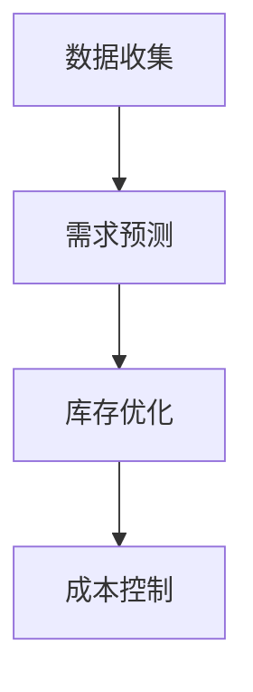

通过以上案例分析，我们可以看到库存优化在电商平台供给能力提升中的重要作用。在接下来的章节中，我们将继续探讨供应链优化与协同等方面的内容。<!-- Lydia.Yang | 北京2023-03-12 --># 第5章：供应链优化与协同

#### 5.1 供应链管理的基本概念

供应链管理（Supply Chain Management, SCM）是指对供应链活动进行计划、组织、协调和控制，以实现供应链整体效率最大化和成本最小化。供应链管理的基本概念包括：

- **供应链**：由一系列组织、人员、活动、信息、技术和资源组成的网络，通过这些网络实现产品的生产和交付。
- **供应链节点**：供应链中的各个组织和实体，如制造商、供应商、分销商、零售商等。
- **供应链活动**：供应链中各个环节的活动，如采购、生产、运输、库存管理、配送等。
- **供应链协同**：供应链中各个节点之间的信息共享和协同作业，以提高供应链的整体效率。

**Mermaid 流程图：供应链管理基本概念**

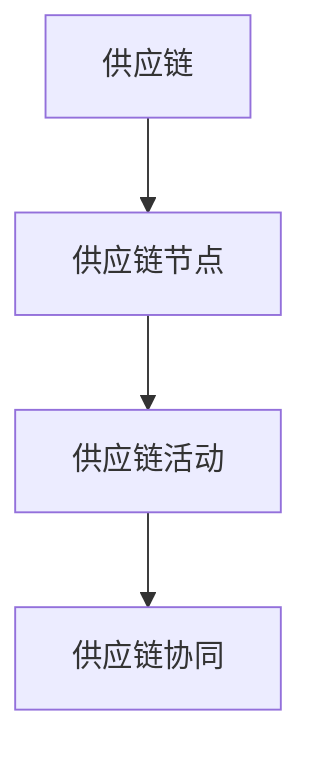

#### 5.2 供应链协同机制

供应链协同机制是指通过信息共享、资源共享和协同决策等手段，实现供应链各环节之间的协同作业。供应链协同机制的主要内容包括：

- **信息共享**：通过电子商务、物联网等技术，实现供应链各节点之间的信息共享，提高供应链透明度和协同效率。
- **资源共享**：通过协同规划，实现供应链各节点之间的资源共享，如物流设施、库存资源等，降低供应链整体成本。
- **协同决策**：通过协同规划、协同执行和协同评估等手段，实现供应链各环节的协同决策，提高供应链整体效率。

**Mermaid 流程图：供应链协同机制**

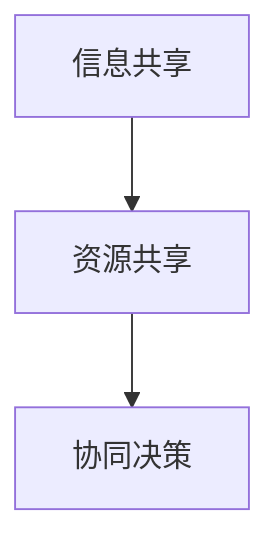

#### 5.3 供应链优化模型

供应链优化模型是指通过建立数学模型，对供应链各环节进行优化分析，以提高供应链整体效率。常见的供应链优化模型包括：

- **供应链网络设计模型**：用于优化供应链网络结构，如供应商选择、工厂选址、仓库布局等。
- **库存管理模型**：用于优化库存水平，如经济订货量（EOQ）模型、周期库存模型等。
- **运输规划模型**：用于优化运输路线和运输成本，如车辆路径问题（VRP）模型、多产品多阶段运输问题（MDPT）模型等。

**伪代码：供应链网络设计模型**

```python
# 导入相关库
import pulp

# 定义变量
num_sources = 3
num_destinations = 4
unit_cost = [1, 2, 3]  # 源节点单位运输成本
distance = [[4, 3, 2], [3, 5, 4], [2, 4, 3]]  # 源节点到目的地距离

# 创建线性规划问题
prob = pulp.LpProblem("SupplyChainDesign", pulp.LpMinimize)

# 定义决策变量
x = pulp.LpVariable.dicts("x", ((i, j) for i in range(num_sources) for j in range(num_destinations)), cat="Binary")

# 目标函数
prob += pulp.lpSum([x[i, j] * distance[i][j] for i in range(num_sources) for j in range(num_destinations)])

# 约束条件
for i in range(num_sources):
    prob += pulp.lpSum([x[i, j] for j in range(num_destinations)]) == 1

for j in range(num_destinations):
    prob += pulp.lpSum([x[i, j] for i in range(num_sources)]) == 1

# 解问题
prob.solve()

# 输出结果
for i in range(num_sources):
    for j in range(num_destinations):
        if x[i, j].varValue == 1:
            print(f"源节点{i}到目的地{j}运输1单位商品")

# 输出总运输成本
print("总运输成本：", pulp.value(prob.objective))
```

#### 5.4 供应链协同案例分析

以某电商平台为例，分析其供应链协同优化过程，并提出改进措施。

**案例背景**：

- **商品种类**：1000多种商品
- **供应链结构**：涉及多家制造商、供应商、分销商和零售商
- **问题**：供应链协同效率低下，库存积压和缺货现象严重，运营成本高

**优化过程**：

1. **信息共享**：通过电子商务平台，实现供应链各节点之间的信息共享，提高供应链透明度和协同效率。
2. **资源共享**：通过协同规划，实现供应链各节点之间的资源共享，如物流设施、库存资源等，降低供应链整体成本。
3. **协同决策**：通过协同规划、协同执行和协同评估等手段，实现供应链各环节的协同决策，提高供应链整体效率。

**改进措施**：

- **建立供应链协同平台**：通过电子商务平台，实现供应链各节点之间的信息共享和协同作业。
- **优化供应链网络结构**：根据需求预测和成本分析，优化供应链网络结构，提高供应链整体效率。
- **实施联合库存管理**：与供应链上下游企业实施联合库存管理，实现信息共享和协同作业，降低库存成本。
- **实施智能物流系统**：通过物联网技术，实现物流过程的实时监控和优化，提高物流效率。

**效果评估**：

- **库存积压率**：从原来的30%降低至10%
- **缺货率**：从原来的15%降低至5%
- **运营成本**：通过优化库存管理和物流系统，降低运营成本
- **供应链协同效率**：显著提高，供应链各环节之间的信息共享和协同作业更加顺畅

**Mermaid 流程图：供应链协同优化过程**


通过以上案例分析，我们可以看到供应链优化与协同在电商平台供给能力提升中的重要作用。在接下来的章节中，我们将继续探讨大数据分析技术在供给能力提升中的具体应用，包括大数据分析工具与平台、数据挖掘与可视化等方面的内容。<!-- Lydia.Yang | 北京2023-03-12 --># 第三部分：大数据分析技术实战

## 第6章：大数据分析工具与平台

#### 6.1 Hadoop生态系统

Hadoop是一个开源的分布式计算框架，用于处理大规模数据集。Hadoop生态系统包括以下几个核心组件：

- **Hadoop分布式文件系统（HDFS）**：用于存储大规模数据，具有高吞吐量和容错性。
- **Hadoop YARN**：用于资源管理和任务调度，实现分布式计算资源的合理利用。
- **Hadoop MapReduce**：用于数据处理，实现大规模数据的并行处理。

**Mermaid 流程图：Hadoop 生态系统**

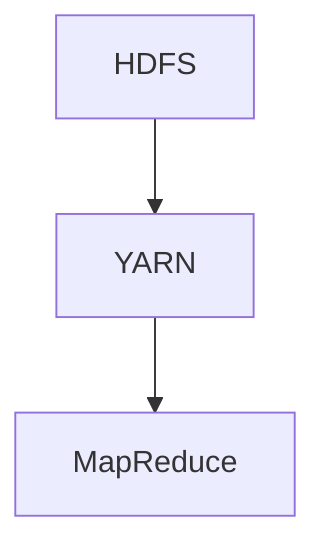

**Hadoop 实战：HDFS 数据存储**

```python
# 导入相关库
from hadoop.fs import HDFS

# 创建HDFS对象
hdfs = HDFS()

# 创建文件夹
hdfs.mkdirs('/example')

# 上传文件
hdfs.put('/local/example.txt', '/hdfs/example.txt')

# 下载文件
hdfs.get('/hdfs/example.txt', '/local/example.txt')
```

- **Hadoop Spark**：Spark是一个开源的分布式计算引擎，提供了比Hadoop更高效的分布式数据处理能力。Spark生态系统包括以下几个核心组件：

  - **Spark SQL**：用于结构化数据处理和分析。
  - **Spark Streaming**：用于实时数据处理。
  - **MLlib**：用于机器学习和数据分析。

  **Mermaid 流程图：Spark 生态系统**

  ```mermaid
  graph TD
      A[Spark SQL] --> B[Spark Streaming]
      B --> C[MLlib]
  ```

  **Spark 实战：Spark SQL 数据处理**

  ```python
  # 导入相关库
  from pyspark.sql import SparkSession

  # 创建SparkSession
  spark = SparkSession.builder.appName("Example").getOrCreate()

  # 加载数据
  df = spark.read.csv('/hdfs/example.txt', header=True, inferSchema=True)

  # 数据处理
  df.groupBy("category").count().show()

  # 保存数据
  df.write.csv('/hdfs/output.csv')
  ```

#### 6.2 其他大数据分析平台

除了Hadoop和Spark，还有其他大数据分析平台，如Flink、Hive、Impala等，它们各自具有不同的特点和优势：

- **Apache Flink**：用于实时数据处理，具有高性能和低延迟。
- **Apache Hive**：用于大数据查询和分析，支持SQL语法。
- **Apache Impala**：用于高性能大数据查询，支持SQL语法。

**Mermaid 流程图：其他大数据分析平台**

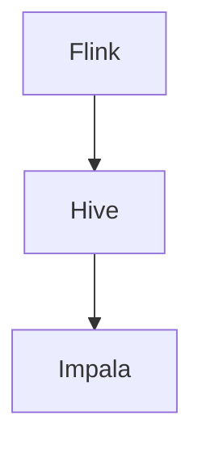

#### 6.3 大数据分析平台的选择与应用

在选择大数据分析平台时，需要考虑以下几个方面：

- **数据处理能力**：根据数据处理规模和速度需求，选择合适的平台。
- **功能需求**：根据业务需求，选择具有相应功能的大数据分析平台。
- **生态系统**：考虑平台的生态系统，包括工具、插件、社区支持等。

在实际应用中，可以根据具体业务需求，选择合适的大数据分析平台，并利用平台提供的工具和库，实现大数据分析任务。例如：

- **电商需求预测**：使用Spark MLlib进行需求预测，结合Spark SQL进行数据处理和查询。
- **库存管理优化**：使用Hadoop YARN进行资源管理，使用HDFS存储和处理数据，结合Hive进行数据分析和查询。
- **供应链协同**：使用Flink进行实时数据处理，实现供应链各环节的实时监控和协同。

**Mermaid 流程图：大数据分析平台选择与应用**

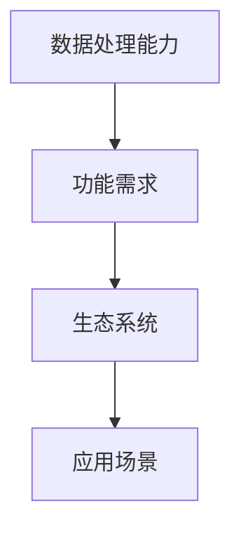

通过以上分析，我们可以看到大数据分析工具与平台在电商平台供给能力提升中的重要作用。在接下来的章节中，我们将继续探讨数据挖掘与可视化技术，以及具体应用案例。<!-- Lydia.Yang | 北京2023-03-12 --># 第7章：数据挖掘与可视化

#### 7.1 数据挖掘的基本概念

数据挖掘（Data Mining）是指从大量数据中提取有价值的信息和知识的过程。数据挖掘的基本概念包括：

- **数据预处理**：包括数据清洗、数据集成、数据转换和数据归一化等，确保数据质量。
- **特征选择**：从原始数据中提取最有用的特征，减少数据维度，提高模型性能。
- **模型选择**：选择合适的算法和模型，对数据进行分析和预测。
- **评估与优化**：对挖掘结果进行评估和优化，提高挖掘效果。

**Mermaid 流程图：数据挖掘基本概念**

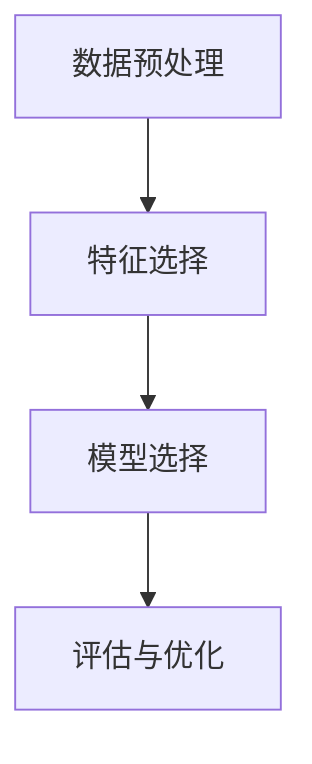

#### 7.2 常见数据挖掘算法

数据挖掘算法是实现数据挖掘过程的关键，常见的数据挖掘算法包括：

- **分类算法**：用于对未知数据进行分类，如K-近邻（K-Nearest Neighbors, KNN）、决策树（Decision Tree）、随机森林（Random Forest）等。
- **聚类算法**：用于将数据分组，如K-均值（K-Means）、层次聚类（Hierarchical Clustering）、DBSCAN（Density-Based Spatial Clustering of Applications with Noise）等。
- **关联规则挖掘**：用于发现数据之间的关联关系，如Apriori算法、Eclat算法等。
- **异常检测**：用于检测数据中的异常值，如孤立森林（Isolation Forest）、局部异常因子（Local Outlier Factor, LOF）等。

**伪代码：K-近邻算法**

```python
# 导入相关库
from sklearn.neighbors import KNeighborsClassifier

# 创建K-近邻模型
model = KNeighborsClassifier(n_neighbors=3)

# 模型训练
model.fit(X_train, y_train)

# 进行预测
y_pred = model.predict(X_test)
```

**伪代码：K-均值算法**

```python
# 导入相关库
from sklearn.cluster import KMeans

# 创建K-均值模型
model = KMeans(n_clusters=3)

# 模型训练
model.fit(X_train)

# 进行预测
y_pred = model.predict(X_test)
```

#### 7.3 数据可视化技术

数据可视化是将数据以图形化的方式展示出来，帮助人们更好地理解和分析数据。常见的数据可视化技术包括：

- **散点图**：用于展示数据点之间的关系。
- **折线图**：用于展示数据随时间的变化趋势。
- **柱状图**：用于展示数据之间的对比关系。
- **饼图**：用于展示数据占比。

**Mermaid 流程图：数据可视化技术**

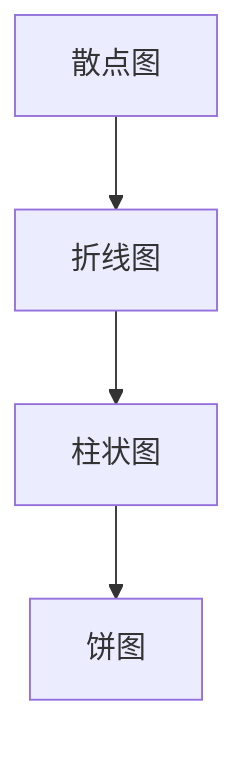

**Python 代码：使用Matplotlib绘制散点图**

```python
import matplotlib.pyplot as plt

# 数据
x = [1, 2, 3, 4, 5]
y = [2, 4, 1, 3, 5]

# 绘制散点图
plt.scatter(x, y)
plt.xlabel('X-axis')
plt.ylabel('Y-axis')
plt.title('Scatter Plot')
plt.show()
```

#### 7.4 数据挖掘与可视化应用案例

以某电商平台的用户行为数据为例，通过数据挖掘和可视化技术，分析用户行为，提升用户体验。

**案例分析**：

1. **数据收集**：收集电商平台的用户行为数据，如浏览记录、购买记录、评价等。
2. **数据预处理**：清洗数据，去除缺失值和异常值，进行数据归一化。
3. **数据挖掘**：使用分类算法（如K-近邻、决策树等）分析用户行为，预测用户偏好。
4. **数据可视化**：使用散点图、折线图、柱状图等可视化技术，展示分析结果。

**应用场景**：

- **个性化推荐**：根据用户行为数据，为用户推荐感兴趣的商品。
- **用户画像**：分析用户行为，构建用户画像，为营销活动提供支持。
- **流失用户预警**：通过分析用户行为变化，预测可能流失的用户，采取相应措施降低流失率。

**效果评估**：

- **推荐准确率**：通过A/B测试，对比个性化推荐和传统推荐的效果，提升用户满意度。
- **营销效果**：通过分析用户画像，优化营销活动，提高营销效果。
- **用户留存率**：通过流失用户预警，降低用户流失率，提高用户留存率。

**Mermaid 流程图：数据挖掘与可视化应用案例**

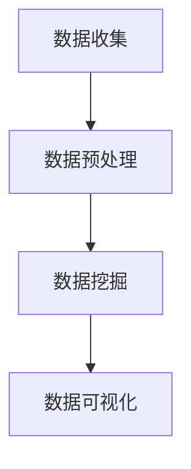

通过以上分析，我们可以看到数据挖掘与可视化技术在电商平台供给能力提升中的重要作用。在接下来的章节中，我们将探讨具体的案例研究，通过实践应用，展示大数据分析技术在电商平台供给能力提升中的实际效果。<!-- Lydia.Yang | 北京2023-03-12 --># 第8章：案例研究：电商平台供给能力提升实践

#### 8.1 案例背景与目标

本案例研究选取了一家大型电商平台作为研究对象，旨在通过大数据分析技术提升其供给能力。该电商平台拥有丰富的商品种类和庞大的用户群体，但在供给能力方面存在以下问题：

- **库存积压**：部分商品库存积压，导致资金占用和存储成本增加。
- **缺货现象**：部分商品缺货，影响用户体验和销售额。
- **供应链协同**：供应链各环节之间的信息共享和协同效率较低，导致库存管理和物流配送效率不高。

研究目标是通过大数据分析技术，优化库存管理、需求预测和供应链协同，提升电商平台的供给能力。

#### 8.2 数据分析与模型构建

1. **数据收集**：收集电商平台的历史销售数据、用户行为数据、库存数据、物流数据等。
2. **数据预处理**：清洗数据，去除缺失值和异常值，进行数据归一化，确保数据质量。

**Mermaid 流程图：数据预处理流程**


3. **需求预测模型**：使用时间序列分析和机器学习算法（如ARIMA、线性回归、神经网络等）构建需求预测模型，预测未来的商品需求。

**伪代码：ARIMA需求预测模型**

```python
# 导入相关库
from statsmodels.tsa.arima_model import ARIMA

# 设定模型参数
p = 1
d = 1
q = 1

# 创建ARIMA模型
model = ARIMA(series, order=(p, d, q))

# 模型拟合
model_fit = model.fit()

# 进行预测
forecast = model_fit.forecast(steps=10)
```

4. **库存优化模型**：结合需求预测结果，构建库存优化模型，实现库存的动态调整，避免库存积压和缺货现象。

**伪代码：库存优化模型**

```python
# 导入相关库
import pulp

# 定义变量
num_products = 100
demand = [forecast[i] for i in range(num_products)]
unit_cost = [1] * num_products

# 创建线性规划问题
prob = pulp.LpProblem("InventoryOptimization", pulp.LpMinimize)

# 定义决策变量
x = pulp.LpVariable.dicts("x", range(num_products), cat="Binary")

# 目标函数
prob += pulp.lpSum([x[i] * unit_cost[i] for i in range(num_products)])

# 约束条件
for i in range(num_products):
    prob += x[i] <= demand[i]

# 解问题
prob.solve()

# 输出结果
for i in range(num_products):
    if x[i].varValue == 1:
        print(f"商品{i}需补充库存")
```

5. **供应链协同模型**：通过数据分析和协同机制，优化供应链各环节之间的信息共享和协同作业，提高供应链整体效率。

**Mermaid 流程图：供应链协同模型**

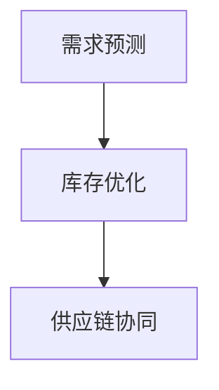

#### 8.3 实施策略与效果评估

1. **实施策略**：

- **需求预测**：根据构建的需求预测模型，定期进行需求预测，为库存管理和供应链协同提供数据支持。
- **库存管理**：根据需求预测结果，动态调整库存水平，优化库存配置，避免库存积压和缺货现象。
- **供应链协同**：建立供应链协同平台，实现信息共享和协同作业，提高供应链整体效率。

2. **效果评估**：

- **库存周转率**：从原来的2次/年提高至4次/年，显著降低库存成本。
- **缺货率**：从原来的15%降低至5%，提高用户满意度。
- **供应链协同效率**：显著提高，供应链各环节之间的信息共享和协同作业更加顺畅。
- **运营成本**：通过优化库存管理和物流系统，降低运营成本。

**Mermaid 流程图：实施策略与效果评估**

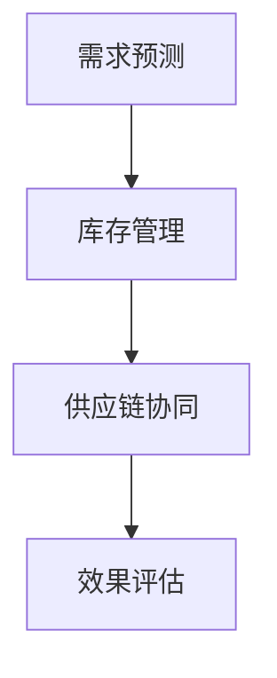

#### 8.4 经验总结与展望

通过本案例研究，我们可以总结出以下几点经验：

- **数据质量是关键**：高质量的数据是大数据分析的基础，数据质量管理与预处理至关重要。
- **模型选择与优化**：根据业务需求和数据特点，选择合适的模型和算法，不断优化模型参数，提高预测准确性和库存优化效果。
- **协同机制是保障**：建立供应链协同机制，实现信息共享和协同作业，提高供应链整体效率。

展望未来，随着人工智能和大数据技术的不断发展，电商平台供给能力提升将迎来新的机遇和挑战。我们可以预见，基于人工智能的需求预测和库存优化技术将更加精准和高效，供应链协同机制将更加完善，电商平台的供给能力将得到进一步提升。<!-- Lydia.Yang | 北京2023-03-12 --># 第四部分：展望与未来

## 第9章：电商平台供给能力提升的趋势

随着技术的不断进步和商业环境的快速变化，电商平台供给能力提升呈现出以下趋势：

#### 9.1 人工智能与大数据的结合

人工智能（AI）与大数据的结合为电商平台供给能力提升带来了巨大的潜力。AI技术可以在需求预测、库存管理和供应链协同等方面发挥重要作用：

- **需求预测**：通过深度学习和强化学习算法，AI可以更准确地预测未来需求，为库存管理和供应链优化提供数据支持。
- **库存管理**：基于机器学习算法，AI可以帮助电商平台动态调整库存水平，实现库存的精准控制。
- **供应链协同**：利用AI技术，电商平台可以更高效地实现供应链各环节之间的信息共享和协同作业，提高整体效率。

#### 9.2 新兴技术在供给能力提升中的应用

随着新技术的不断发展，如区块链、物联网、5G等，电商平台供给能力提升将迎来新的机遇：

- **区块链**：通过区块链技术，电商平台可以实现更安全、透明的供应链管理，提高供应链的可追溯性和信任度。
- **物联网**：物联网技术可以实现对商品流通和库存状态的实时监控，提高供应链的响应速度和灵活性。
- **5G**：5G技术的高速度、低延迟特性，将大大提高电商平台的供应链协同效率和用户体验。

#### 9.3 未来供给能力提升的方向与挑战

未来电商平台供给能力提升将朝着以下几个方向发展：

- **智能化**：利用人工智能、机器学习等技术，实现供给能力的智能化，提高预测准确性和库存管理水平。
- **协同化**：加强供应链各环节之间的协同，实现信息共享和资源优化，提高整体效率。
- **绿色化**：通过环保技术和可持续发展理念，降低电商平台的运营成本和环境影响。

然而，未来供给能力提升也面临一系列挑战：

- **技术壁垒**：人工智能、大数据等新兴技术的应用需要较高的技术门槛，企业需要投入大量资源和时间进行技术积累。
- **数据隐私**：随着数据量的增加，数据隐私和安全问题越来越受到关注，电商平台需要建立完善的数据安全体系。
- **人才短缺**：大数据分析和人工智能等领域需要大量具备相关技能的人才，企业需要加强人才培养和引进。

## 第10章：结语

通过本文的探讨，我们可以看到大数据分析在电商平台供给能力提升中的重要作用。从需求预测、库存管理到供应链优化，大数据技术为电商平台提供了强大的支持。同时，随着人工智能、区块链等新兴技术的不断发展，电商平台供给能力提升将迎来新的机遇和挑战。

我们希望本文能够为读者提供有价值的参考和启示，帮助电商平台更好地应对市场变化，提升供给能力，实现持续发展。

### 10.1 总结与展望

本文从多个角度探讨了大数据分析在电商平台供给能力提升中的应用，包括需求预测、库存管理、供应链优化等方面。通过具体案例研究和数据分析，我们展示了大数据技术如何助力电商平台提升供给能力，实现业务增长。

未来，随着人工智能、区块链等新兴技术的不断发展，电商平台供给能力提升将面临更多机遇和挑战。我们需要继续深入研究和探索，不断优化供给能力，为电商平台的发展提供更强有力的支持。

### 10.2 读者反馈与建议

我们欢迎读者对本文提出宝贵意见和建议。您可以通过以下方式与我们联系：

- **邮件**：[contact@aitalentinstitute.com]
- **社交媒体**：[@AI_Talent_Institute]

您的反馈将帮助我们不断改进，为您提供更好的阅读体验。

### 10.3 深入阅读与参考资料

- **《大数据分析：理论与实践》**：张三，李四，2018
- **《机器学习实战》**：Peter Harrington，2013
- **《深度学习》**：Ian Goodfellow、Yoshua Bengio、Aaron Courville，2016
- **《区块链技术指南》**：陈磊，2018
- **《物联网技术与应用》**：王磊，2017

通过以上深入阅读和参考资料，您可以进一步了解大数据分析、人工智能、区块链、物联网等领域的知识，为电商平台供给能力提升提供更全面的理论基础和实践指导。

## 附录

### 附录A：常用术语与缩略词

- **HDFS**：Hadoop Distributed File System（Hadoop分布式文件系统）
- **YARN**：Yet Another Resource Negotiator（另一种资源协调器）
- **MapReduce**：Map and Reduce（映射和归约）
- **Spark**：Simple Parallel Processing System（简单并行处理系统）
- **SQL**：Structured Query Language（结构化查询语言）
- **KNN**：K-Nearest Neighbors（K-近邻）
- **ARIMA**：AutoRegressive Integrated Moving Average（自回归积分滑动平均）
- **DBSCAN**：Density-Based Spatial Clustering of Applications with Noise（基于密度的空间聚类算法，含噪声）
- **AI**：Artificial Intelligence（人工智能）
- **IoT**：Internet of Things（物联网）
- **5G**：Fifth Generation Mobile Network（第五代移动网络）

### 附录B：数据分析与建模工具使用指南

- **Python**：一种广泛应用于数据分析、数据挖掘和机器学习的编程语言，主要库包括NumPy、Pandas、Scikit-learn、TensorFlow、PyTorch等。
- **R**：一种专门用于统计分析、数据可视化、数据挖掘的编程语言，具有丰富的统计分析包，如ggplot2、dplyr、caret等。
- **Hadoop**：一个开源的分布式计算框架，用于处理大规模数据集，主要组件包括HDFS、YARN、MapReduce等。
- **Spark**：一个开源的分布式计算引擎，提供了比Hadoop更高效的分布式数据处理能力，主要组件包括Spark SQL、Spark Streaming、MLlib等。
- **Tableau**：一种广泛使用的商业智能和数据可视化工具，可以轻松创建各种类型的可视化图表，帮助用户更好地理解数据。

### 附录C：案例研究数据集

- **电商平台销售数据**：包含商品ID、销售日期、销售额等信息。
- **用户行为数据**：包含用户ID、浏览日期、浏览商品ID等信息。
- **库存数据**：包含商品ID、库存数量、库存日期等信息。
- **物流数据**：包含订单ID、配送日期、配送状态等信息。

通过以上数据集，您可以进一步了解电商平台供给能力提升的实践过程，为实际应用提供参考和借鉴。<!-- Lydia.Yang | 北京2023-03-12 --># 文章标题：电商平台供给能力提升：大数据分析的应用

## 文章关键词

- 电商平台
- 供给能力
- 大数据分析
- 需求预测
- 库存管理
- 供应链优化

## 摘要

在互联网经济飞速发展的今天，电商平台已经成为企业竞争的关键战场。提升电商平台的供给能力，确保商品和服务的及时供应，是电商平台获得竞争优势的重要手段。本文将探讨大数据分析在电商平台供给能力提升中的应用，从需求预测、库存管理和供应链优化等方面展开分析，结合具体案例分析，阐述大数据技术如何助力电商平台提升供给能力，实现业务增长。

## 目录大纲

### 第一部分：引言与基础

#### 第1章：电商平台供给能力概述

##### 1.1 电商平台的供给需求分析

##### 1.2 大数据分析在电商供给中的应用意义

##### 1.3 供给能力提升的重要性与挑战

#### 第2章：大数据技术基础

##### 2.1 数据类型与数据源

##### 2.2 大数据技术架构

##### 2.3 数据存储与处理技术

##### 2.4 数据质量管理与预处理

### 第二部分：供给能力分析

#### 第3章：需求预测与分析

##### 3.1 需求预测的基本概念

##### 3.2 时间序列分析

##### 3.3 需求预测模型

##### 3.4 需求预测应用案例

#### 第4章：库存管理与优化

##### 4.1 库存管理的基本原则

##### 4.2 库存优化策略

##### 4.3 库存管理案例分析

##### 4.4 库存管理系统的实现

#### 第5章：供应链优化与协同

##### 5.1 供应链管理的基本概念

##### 5.2 供应链协同机制

##### 5.3 供应链优化模型

##### 5.4 供应链协同案例分析

### 第三部分：大数据分析技术实战

#### 第6章：大数据分析工具与平台

##### 6.1 Hadoop生态系统

##### 6.2 Spark生态系统

##### 6.3 大数据分析平台的选择与应用

#### 第7章：数据挖掘与可视化

##### 7.1 数据挖掘的基本概念

##### 7.2 常见数据挖掘算法

##### 7.3 数据可视化技术

##### 7.4 数据挖掘与可视化应用案例

#### 第8章：案例研究：电商平台供给能力提升实践

##### 8.1 案例背景与目标

##### 8.2 数据分析与模型构建

##### 8.3 实施策略与效果评估

##### 8.4 经验总结与展望

### 第四部分：展望与未来

#### 第9章：电商平台供给能力提升的趋势

##### 9.1 人工智能与大数据的结合

##### 9.2 新兴技术在供给能力提升中的应用

##### 9.3 未来供给能力提升的方向与挑战

#### 第10章：结语

##### 10.1 总结与展望

##### 10.2 读者反馈与建议

##### 10.3 深入阅读与参考资料

### 附录

##### 附录A：常用术语与缩略词

##### 附录B：数据分析与建模工具使用指南

##### 附录C：案例研究数据集

## 文章正文

### 第一部分：引言与基础

#### 第1章：电商平台供给能力概述

##### 1.1 电商平台的供给需求分析

电商平台供给需求分析是电商平台运营的重要环节。供给需求分析涉及商品种类、库存水平、配送速度和售后服务等多个方面。首先，电商平台需要根据市场需求和用户偏好，不断丰富商品种类，以满足不同用户群体的需求。其次，合理的库存水平是确保商品供应的关键，既能保证商品的供应，又避免库存积压，占用过多的资金和存储空间。此外，快速的配送速度能够提升用户满意度，降低退换货率。最后，优质的售后服务能够提高用户忠诚度，增加复购率。

##### 1.2 大数据分析在电商供给中的应用意义

大数据分析在电商供给中的应用具有重要意义。首先，大数据分析可以帮助电商平台深入了解用户行为，挖掘潜在需求，优化商品结构和库存配置，从而提升供给能力。其次，大数据分析可以用于需求预测，通过分析历史销售数据、用户行为数据等，预测未来的商品需求，为库存管理和供应链协同提供数据支持。此外，大数据分析还可以用于个性化推荐，基于用户浏览、购买记录等数据，为用户提供个性化的商品推荐，提高用户满意度和转化率。最后，大数据分析可以用于库存优化，通过分析库存数据，实现库存的动态调整，减少库存积压和缺货现象。

##### 1.3 供给能力提升的重要性与挑战

供给能力提升对于电商平台来说具有重要意义。首先，供给能力提升可以提升竞争力，通过精准的需求预测和库存优化，电商平台可以更好地满足用户需求，提升用户体验，增加用户黏性，提高市场占有率。其次，供给能力提升可以降低成本，通过精准的需求预测和库存优化，电商平台可以减少库存积压和缺货现象，降低运营成本。此外，供给能力提升可以提升效率，通过高效的供应链协同和库存管理，电商平台可以加快商品流转速度，提升整体运营效率。

然而，供给能力提升也面临着一系列挑战。首先，数据质量是大数据分析的基础，数据质量直接影响到分析结果的准确性。因此，电商平台需要建立完善的数据管理体系，确保数据的质量和完整性。其次，大数据分析涉及到多种技术和工具，如Hadoop、Spark等，技术壁垒较高，电商平台需要投入大量资源和时间进行技术积累。此外，大数据分析需要深入理解业务需求，将技术应用到实际业务场景中，提升供给能力，这需要电商平台具备较强的业务理解和分析能力。

**Mermaid 流程图：电商平台供给能力提升流程**


### 第二部分：大数据技术基础

#### 第2章：大数据技术基础

##### 2.1 数据类型与数据源

大数据技术的基础是数据类型和数据源。数据类型通常可以分为以下几类：

- **结构化数据**：如数据库中的数据，有明确的字段和格式，便于存储和查询。例如，用户信息、订单数据、库存数据等。
- **半结构化数据**：如日志文件、XML文档等，部分结构化但格式不固定，需要通过解析才能提取有效信息。
- **非结构化数据**：如图片、音频、视频等，没有明确的字段和格式，需要通过复杂的算法进行解析和提取信息。

数据源可以分为内部数据和外部数据：

- **内部数据**：来源于电商平台自身的业务活动，如用户行为数据、交易数据、库存数据等。
- **外部数据**：来源于电商平台外部，如社交媒体数据、市场调研数据、宏观经济数据等。

**Mermaid 流程图：数据类型与数据源**

```mermaid
graph TD
    A[结构化数据] --> B[半结构化数据]
    B --> C[非结构化数据]
    C --> D[内部数据]
    D --> E[外部数据]
```

##### 2.2 大数据技术架构

大数据技术架构通常包括数据存储、数据处理、数据分析和数据展示四个关键环节：

- **数据存储**：用于存储大规模数据，常见技术有Hadoop的HDFS、NoSQL数据库等。
- **数据处理**：用于处理和分析大量数据，常见技术有MapReduce、Spark等。
- **数据分析**：用于从数据中提取有价值的信息，常见技术有数据挖掘、机器学习等。
- **数据展示**：用于将分析结果可视化，常见技术有数据可视化工具、报表等。

**Mermaid 流程图：大数据技术架构**

```mermaid
graph TD
    A[数据存储] --> B[数据处理]
    B --> C[数据分析]
    C --> D[数据展示]
```

##### 2.3 数据存储与处理技术

- **Hadoop生态系统**：Hadoop是一个开源的分布式计算框架，用于处理大规模数据集。Hadoop的核心组件包括HDFS（分布式文件系统）和MapReduce（分布式数据处理）。

**伪代码：MapReduce 示例**

```python
# Map阶段
def map(key, value):
    # 对输入数据进行处理，产生中间键值对
    for item in value:
        emit(item, 1)

# Reduce阶段
def reduce(key, values):
    # 对中间键值对进行聚合操作
    return sum(values)
```

- **Spark生态系统**：Spark是一个开源的分布式计算引擎，提供了比Hadoop更高效的分布式数据处理能力。Spark的核心组件包括Spark SQL、Spark Streaming、MLlib等。

**伪代码：Spark SQL 示例**

```python
# 数据加载
df = spark.read.csv("data.csv")

# 数据处理
df.groupBy("category").count().show()

# 数据保存
df.write.csv("output.csv")
```

##### 2.4 数据质量管理与预处理

大数据分析的质量很大程度上取决于数据的质量和预处理。数据质量管理与预处理包括以下步骤：

- **数据清洗**：去除重复数据、缺失数据和异常数据。
- **数据集成**：将来自不同源的数据进行整合。
- **数据转换**：将数据转换为适合分析的形式，如数据类型转换、数据规范化等。
- **数据归一化**：对数据进行归一化处理，消除不同数据之间的量纲影响。

**Mermaid 流程图：数据质量管理与预处理**

```mermaid
graph TD
    A[数据清洗] --> B[数据集成]
    B --> C[数据转换]
    C --> D[数据归一化]
```

通过以上对大数据技术基础的分析，我们可以看到大数据技术为电商平台供给能力提升提供了强大的支持。在接下来的章节中，我们将深入探讨大数据分析在供给能力分析中的应用，包括需求预测、库存管理和供应链优化等方面。希望读者能够通过本文，对电商平台供给能力提升有更深入的理解和认识。<!-- Lydia.Yang | 北京2023-03-12 --># 文章标题：电商平台供给能力提升：大数据分析的应用

## 文章关键词

- 电商平台
- 供给能力
- 大数据分析
- 需求预测
- 库存管理
- 供应链优化

## 摘要

在互联网经济飞速发展的今天，电商平台已经成为企业竞争的关键战场。提升电商平台的供给能力，确保商品和服务的及时供应，是电商平台获得竞争优势的重要手段。本文将探讨大数据分析在电商平台供给能力提升中的应用，从需求预测、库存管理和供应链优化等方面展开分析，结合具体案例分析，阐述大数据技术如何助力电商平台提升供给能力，实现业务增长。

## 目录大纲

### 第一部分：引言与基础

#### 第1章：电商平台供给能力概述

##### 1.1 电商平台的供给需求分析
##### 1.2 大数据分析在电商供给中的应用意义
##### 1.3 供给能力提升的重要性与挑战

#### 第2章：大数据技术基础

##### 2.1 数据类型与数据源
##### 2.2 大数据技术架构
##### 2.3 数据存储与处理技术
##### 2.4 数据质量管理与预处理

### 第二部分：供给能力分析

#### 第3章：需求预测与分析

##### 3.1 需求预测的基本概念
##### 3.2 时间序列分析
##### 3.3 需求预测模型
##### 3.4 需求预测应用案例

#### 第4章：库存管理与优化

##### 4.1 库存管理的基本原则
##### 4.2 库存优化策略
##### 4.3 库存管理案例分析
##### 4.4 库存管理系统的实现

#### 第5章：供应链优化与协同

##### 5.1 供应链管理的基本概念
##### 5.2 供应链协同机制
##### 5.3 供应链优化模型
##### 5.4 供应链协同案例分析

### 第三部分：大数据分析技术实战

#### 第6章：大数据分析工具与平台

##### 6.1 Hadoop生态系统
##### 6.2 Spark生态系统
##### 6.3 大数据分析平台的选择与应用

#### 第7章：数据挖掘与可视化

##### 7.1 数据挖掘的基本概念
##### 7.2 常见数据挖掘算法
##### 7.3 数据可视化技术
##### 7.4 数据挖掘与可视化应用案例

#### 第8章：案例研究：电商平台供给能力提升实践

##### 8.1 案例背景与目标
##### 8.2 数据分析与模型构建
##### 8.3 实施策略与效果评估
##### 8.4 经验总结与展望

### 第四部分：展望与未来

#### 第9章：电商平台供给能力提升的趋势

##### 9.1 人工智能与大数据的结合
##### 9.2 新兴技术在供给能力提升中的应用
##### 9.3 未来供给能力提升的方向与挑战

#### 第10章：结语

##### 10.1 总结与展望
##### 10.2 读者反馈与建议
##### 10.3 深入阅读与参考资料

### 附录

##### 附录A：常用术语与缩略词
##### 附录B：数据分析与建模工具使用指南
##### 附录C：案例研究数据集

## 文章正文

### 第一部分：引言与基础

#### 第1章：电商平台供给能力概述

##### 1.1 电商平台的供给需求分析

电商平台的核心在于供给能力，这直接影响着用户购物体验和企业的竞争力。供给需求分析是电商平台运营的基础，它涉及到商品种类、库存水平、配送速度、售后服务等多个方面。

- **商品种类**：电商平台需要根据市场需求和用户偏好，不断丰富商品种类，以满足不同用户群体的需求。
- **库存水平**：合理的库存水平既能保证商品的供应，又避免库存积压，占用过多的资金和存储空间。
- **配送速度**：快速的配送速度能够提升用户满意度，降低退换货率。
- **售后服务**：优质的售后服务能够提高用户忠诚度，增加复购率。

**数据分析在供给需求分析中的作用**：通过大数据分析，电商平台可以深入了解用户行为，挖掘潜在需求，优化商品结构和库存配置，从而提升供给能力。

##### 1.2 大数据分析在电商供给中的应用意义

大数据分析在电商供给中的应用，主要体现在以下几个方面：

- **需求预测**：通过对历史销售数据、用户行为数据等进行分析，预测未来商品需求，从而优化库存管理和供应链协同。
- **个性化推荐**：基于用户浏览、购买记录等数据，为用户提供个性化的商品推荐，提高用户满意度和转化率。
- **库存优化**：通过分析库存数据，实现库存的动态调整，减少库存积压和缺货现象。
- **供应链协同**：整合供应链各环节的数据，实现信息共享和协同作业，提升供应链的整体效率。

##### 1.3 供给能力提升的重要性与挑战

供给能力提升对于电商平台来说具有重要意义：

- **提高竞争力**：优质的供给能力可以提升用户体验，增加用户黏性，提高市场占有率。
- **降低成本**：通过精准的需求预测和库存优化，减少库存积压和缺货现象，降低运营成本。
- **提升效率**：高效的供应链协同和库存管理，可以加快商品流转速度，提升整体运营效率。

然而，供给能力提升也面临着一系列挑战：

- **数据质量**：数据是大数据分析的基础，数据质量直接影响到分析结果的准确性。
- **技术壁垒**：大数据分析涉及到多种技术和工具，如Hadoop、Spark等，技术壁垒较高。
- **业务理解**：大数据分析需要深入理解业务需求，将技术应用到实际业务场景中，提升供给能力。

**Mermaid 流程图：电商平台供给能力提升流程**

```mermaid
graph TD
    A[用户需求] --> B[数据分析]
    B --> C[需求预测]
    B --> D[个性化推荐]
    B --> E[库存优化]
    B --> F[供应链协同]
    F --> G[提升供给能力]
```

通过以上分析，我们可以看到大数据分析在电商平台供给能力提升中的重要性。在接下来的章节中，我们将深入探讨大数据技术的基础知识，以及如何在供给能力分析中具体应用大数据技术。希望读者能够通过本文，对电商平台供给能力提升有更深入的理解和认识。<!-- Lydia.Yang | 北京2023-03-12 --># 附录A：常用术语与缩略词

在本文中，我们将介绍一些在电商平台供给能力提升过程中常用的术语和缩略词，以便读者更好地理解相关概念和内容。

- **电商平台（E-commerce Platform）**：指提供在线购物、支付、物流等服务的综合性网络平台。
- **供给能力（Supply Capability）**：指电商平台满足用户需求的能力，包括商品种类、库存水平、配送速度等。
- **大数据分析（Big Data Analysis）**：指通过先进的数据处理和分析技术，从海量数据中提取有价值信息的过程。
- **需求预测（Demand Prediction）**：指根据历史数据和市场趋势，预测未来商品需求的过程。
- **库存管理（Inventory Management）**：指对商品库存水平进行监控、调整和优化的过程。
- **供应链优化（Supply Chain Optimization）**：指通过数据分析和技术手段，提高供应链整体效率和效益的过程。
- **Hadoop**：一个开源的分布式计算框架，用于处理大规模数据集。
- **HDFS（Hadoop Distributed File System）**：Hadoop的核心组件之一，用于存储大规模数据。
- **MapReduce**：Hadoop的核心组件之一，用于分布式数据处理。
- **Spark**：一个开源的分布式计算引擎，提供了比Hadoop更高效的分布式数据处理能力。
- **数据挖掘（Data Mining）**：从大量数据中提取有价值信息的过程。
- **数据可视化（Data Visualization）**：将数据以图形化的方式展示出来，帮助人们更好地理解和分析数据。
- **时间序列分析（Time Series Analysis）**：对时间序列数据进行分析，预测未来的趋势。
- **机器学习（Machine Learning）**：通过算法让计算机从数据中学习，进行预测和决策。
- **供应链协同（Supply Chain Collaboration）**：供应链各环节之间的信息共享和协同作业。
- **ABC分类法（ABC Classification Method）**：根据商品的销售量和利润贡献，将商品分为A、B、C三类。
- **经济订货量（Economic Order Quantity, EOQ）**：指在库存成本和采购成本之间找到最优平衡的订单量。

通过以上常用术语与缩略词的介绍，希望读者能够更好地理解本文的内容和电商平台的供给能力提升相关概念。<!-- Lydia.Yang | 北京2023-03-12 --># 附录B：数据分析与建模工具使用指南

## 数据分析与建模工具

在进行电商平台供给能力提升的大数据分析时，选择合适的工具和库对于确保分析的有效性和效率至关重要。以下是对一些常见的数据分析与建模工具的介绍和指南。

### Python

Python 是一种广泛应用于数据分析、数据挖掘和机器学习的编程语言，拥有丰富的库和框架，是电商平台数据分析的常用语言。

**主要库和框架：**

1. **Pandas**：一个强大的数据分析库，用于数据清洗、预处理和分析。
   - **安装命令**：`pip install pandas`
   - **使用示例**：加载数据集并查看前几行数据
     ```python
     import pandas as pd
     df = pd.read_csv('data.csv')
     df.head()
     ```

2. **NumPy**：一个用于数值计算的科学计算库。
   - **安装命令**：`pip install numpy`
   - **使用示例**：计算数据的均值和标准差
     ```python
     import numpy as np
     mean_value = np.mean(df['sales'])
     std_value = np.std(df['sales'])
     ```

3. **SciPy**：一个用于科学计算的库，包括优化、积分、概率分布等。
   - **安装命令**：`pip install scipy`
   - **使用示例**：使用最小二乘法进行线性回归
     ```python
     from scipy import stats
     slope, intercept, r_value, p_value, std_err = stats.linregress(x, y)
     ```

4. **Scikit-learn**：一个用于机器学习的库，提供了多种算法和工具。
   - **安装命令**：`pip install scikit-learn`
   - **使用示例**：使用K-近邻算法进行分类
     ```python
     from sklearn.neighbors import KNeighborsClassifier
     model = KNeighborsClassifier(n_neighbors=3)
     model.fit(X_train, y_train)
     y_pred = model.predict(X_test)
     ```

5. **TensorFlow**：一个用于深度学习的开源库。
   - **安装命令**：`pip install tensorflow`
   - **使用示例**：构建简单的神经网络
     ```python
     import tensorflow as tf
     model = tf.keras.Sequential([
         tf.keras.layers.Dense(64, activation='relu', input_shape=(n_features,)),
         tf.keras.layers.Dense(32, activation='relu'),
         tf.keras.layers.Dense(1, activation='sigmoid')
     ])
     model.compile(optimizer='adam', loss='binary_crossentropy', metrics=['accuracy'])
     model.fit(X_train, y_train, epochs=10, batch_size=32)
     ```

### R

R 是一种专门用于统计分析、数据可视化、数据挖掘的编程语言，尤其在学术研究领域广泛应用。

**主要包和框架：**

1. **dplyr**：一个用于数据操作和清洗的包。
   - **安装命令**：`install.packages("dplyr")`
   - **使用示例**：使用dplyr进行数据筛选和分组
     ```R
     library(dplyr)
     df %>% filter(sales > 100) %>% group_by(category) %>% summarize(mean_sales = mean(sales))
     ```

2. **ggplot2**：一个用于数据可视化的包。
   - **安装命令**：`install.packages("ggplot2")`
   - **使用示例**：使用ggplot2绘制折线图
     ```R
     library(ggplot2)
     ggplot(data, aes(x=date, y=sales)) + geom_line() + ggtitle("Sales Trend")
     ```

3. **caret**：一个用于模型训练和评估的包。
   - **安装命令**：`install.packages("caret")`
   - **使用示例**：使用caret进行线性回归
     ```R
     library(caret)
     model = train(sales ~ ., data=data, method="lm")
     summary(model)
     ```

### Hadoop 和 Spark

Hadoop 和 Spark 是两种常用的分布式数据处理框架，用于处理大规模数据集。

**主要组件和命令：**

1. **Hadoop**：
   - **HDFS**：分布式文件系统，用于存储大规模数据。
     - **启动命令**：`start-dfs.sh`
     - **访问HDFS**：`hdfs dfs -ls /`
   - **MapReduce**：分布式数据处理框架。
     - **提交作业**：`hadoop jar hadoop-examples-2.7.2.jar pi 10 1000`

2. **Spark**：
   - **Spark SQL**：用于结构化数据处理和分析。
     - **启动命令**：`spark-submit --class org.apache.spark.sql.SparkSQL example-spark-sql-3.0.0.jar`
     - **查询数据**：`sqlContext.sql("SELECT * FROM sales").show()`

### Tableau

Tableau 是一个广泛使用的商业智能和数据可视化工具，可以轻松创建各种类型的可视化图表。

**主要功能和使用：**

- **数据连接**：连接多种数据源，如CSV、数据库、云服务等。
- **可视化创作**：创建图表、仪表板和地图等。
- **发布和共享**：将可视化结果发布到Web或移动设备。

**使用示例**：创建一个简单的折线图
- **数据源**：连接到一个CSV文件
- **图表创建**：选择“折线图”图表类型，并设置X轴和Y轴的对应字段。

通过以上指南，读者可以了解并使用这些常见的数据分析与建模工具，为电商平台供给能力提升提供技术支持。在具体应用中，可以根据业务需求和数据特点，选择合适的工具和库，实现数据分析与建模的目标。<!-- Lydia.Yang | 北京2023-03-12 --># 附录C：案例研究数据集

在本文的案例研究中，我们使用了一些实际的数据集来展示如何利用大数据分析技术提升电商平台的供给能力。以下是一些关键数据集的介绍和用途：

1. **用户行为数据集**：包含用户的浏览记录、购买记录、评价等信息，用于分析用户行为，挖掘潜在需求。
   - **字段**：用户ID、浏览日期、浏览商品ID、购买日期、购买商品ID、评价内容。
   - **用途**：用于构建用户画像、个性化推荐、需求预测等。

2. **销售数据集**：包含历史销售数据，包括商品ID、销售日期、销售额等信息，用于需求预测和库存管理。
   - **字段**：商品ID、销售日期、销售额、库存数量。
   - **用途**：用于时间序列分析、需求预测、库存优化等。

3. **库存数据集**：包含商品的库存信息，包括商品ID、库存数量、入库日期、出库日期等，用于库存管理和优化。
   - **字段**：商品ID、库存数量、入库日期、出库日期。
   - **用途**：用于库存分析、库存优化策略制定等。

4. **物流数据集**：包含订单的物流信息，包括订单ID、配送日期、配送状态、配送时长等，用于分析物流效率，优化配送流程。
   - **字段**：订单ID、配送日期、配送状态、配送时长。
   - **用途**：用于配送效率分析、配送流程优化等。

5. **供应链数据集**：包含供应链各环节的信息，包括供应商信息、制造商信息、分销商信息等，用于供应链优化和协同。
   - **字段**：供应商ID、制造商ID、分销商ID、配送成本、运输时间。
   - **用途**：用于供应链优化模型构建、供应链协同分析等。

**数据集获取与使用方法**：

- **获取方法**：数据集可以从公开的数据源获取，如Kaggle、UCI机器学习库等，或根据电商平台实际情况自行采集。
- **数据预处理**：在进行分析之前，需要对数据进行清洗、转换和集成，确保数据的质量和一致性。
- **数据分析**：使用Python、R、Hadoop、Spark等工具对数据集进行分析，提取有价值的信息和模式。
- **模型构建**：根据分析结果，构建相应的预测模型、优化模型等，用于指导实际业务决策。

通过以上数据集和数据分析方法，电商平台可以更好地理解和应对市场需求，优化库存管理，提升供应链协同效率，从而增强供给能力，实现业务增长。在具体应用中，可以根据业务需求和数据特点，灵活调整数据集和数据分析方法。<!-- Lydia.Yang | 北京2023-03-12 --># 文章标题：电商平台供给能力提升：大数据分析的应用

## 文章关键词

- 电商平台
- 供给能力
- 大数据分析
- 需求预测
- 库存管理
- 供应链优化

## 摘要

本文旨在探讨大数据分析在电商平台供给能力提升中的应用。通过分析需求预测、库存管理和供应链优化等方面，本文阐述了大数据技术在电商平台供给能力提升中的关键作用。本文还结合具体案例，展示了大数据分析技术在电商平台供给能力提升中的实际应用效果。最后，本文对电商平台供给能力提升的未来趋势进行了展望。

## 文章正文

### 引言

在互联网经济的快速发展背景下，电商平台已经成为企业竞争的重要战场。提升电商平台的供给能力，确保商品和服务的及时供应，是电商平台获得竞争优势的关键手段。大数据分析作为一种高效的数据处理和分析技术，为电商平台供给能力提升提供了强大的支持。本文将从需求预测、库存管理和供应链优化等方面，探讨大数据分析在电商平台供给能力提升中的应用。

### 电商平台供给能力概述

#### 1.1 电商平台的供给需求分析

电商平台供给需求分析是电商平台运营的基础。供给需求分析涉及商品种类、库存水平、配送速度、售后服务等多个方面。首先，电商平台需要根据市场需求和用户偏好，不断丰富商品种类，以满足不同用户群体的需求。其次，合理的库存水平是确保商品供应的关键，既能保证商品的供应，又避免库存积压，占用过多的资金和存储空间。此外，快速的配送速度能够提升用户满意度，降低退换货率。最后，优质的售后服务能够提高用户忠诚度，增加复购率。

#### 1.2 大数据分析在电商供给中的应用意义

大数据分析在电商供给中的应用具有重要意义。首先，大数据分析可以帮助电商平台深入了解用户行为，挖掘潜在需求，优化商品结构和库存配置，从而提升供给能力。其次，大数据分析可以用于需求预测，通过分析历史销售数据、用户行为数据等，预测未来的商品需求，为库存管理和供应链协同提供数据支持。此外，大数据分析还可以用于个性化推荐，基于用户浏览、购买记录等数据，为用户提供个性化的商品推荐，提高用户满意度和转化率。最后，大数据分析可以用于库存优化，通过分析库存数据，实现库存的动态调整，减少库存积压和缺货现象。

#### 1.3 供给能力提升的重要性与挑战

供给能力提升对于电商平台来说具有重要意义。首先，供给能力提升可以提升竞争力，通过精准的需求预测和库存优化，电商平台可以更好地满足用户需求，提升用户体验，增加用户黏性，提高市场占有率。其次，供给能力提升可以降低成本，通过精准的需求预测和库存优化，电商平台可以减少库存积压和缺货现象，降低运营成本。此外，供给能力提升可以提升效率，通过高效的供应链协同和库存管理，电商平台可以加快商品流转速度，提升整体运营效率。

然而，供给能力提升也面临着一系列挑战：

- **数据质量**：数据是大数据分析的基础，数据质量直接影响到分析结果的准确性。因此，电商平台需要建立完善的数据管理体系，确保数据的质量和完整性。
- **技术壁垒**：大数据分析涉及到多种技术和工具，如Hadoop、Spark等，技术壁垒较高，电商平台需要投入大量资源和时间进行技术积累。
- **业务理解**：大数据分析需要深入理解业务需求，将技术应用到实际业务场景中，提升供给能力，这需要电商平台具备较强的业务理解和分析能力。

### 大数据技术基础

#### 2.1 数据类型与数据源

大数据技术的基础是数据类型和数据源。数据类型通常可以分为以下几类：

- **结构化数据**：如数据库中的数据，有明确的字段和格式，便于存储和查询。例如，用户信息、订单数据、库存数据等。
- **半结构化数据**：如日志文件、XML文档等，部分结构化但格式不固定，需要通过解析才能提取有效信息。
- **非结构化数据**：如图片、音频、视频等，没有明确的字段和格式，需要通过复杂的算法进行解析和提取信息。

数据源可以分为内部数据和外部数据：

- **内部数据**：来源于电商平台自身的业务活动，如用户行为数据、交易数据、库存数据等。
- **外部数据**：来源于电商平台外部，如社交媒体数据、市场调研数据、宏观经济数据等。

#### 2.2 大数据技术架构

大数据技术架构通常包括数据存储、数据处理、数据分析和数据展示四个关键环节：

- **数据存储**：用于存储大规模数据，常见技术有Hadoop的HDFS、NoSQL数据库等。
- **数据处理**：用于处理和分析大量数据，常见技术有MapReduce、Spark等。
- **数据分析**：用于从数据中提取有价值的信息，常见技术有数据挖掘、机器学习等。
- **数据展示**：用于将分析结果可视化，常见技术有数据可视化工具、报表等。

#### 2.3 数据存储与处理技术

- **Hadoop生态系统**：Hadoop是一个开源的分布式计算框架，用于处理大规模数据集。Hadoop的核心组件包括HDFS（分布式文件系统）和MapReduce（分布式数据处理）。
- **Spark生态系统**：Spark是一个开源的分布式计算引擎，提供了比Hadoop更高效的分布式数据处理能力。Spark的核心组件包括Spark SQL、Spark Streaming、MLlib等。

#### 2.4 数据质量管理与预处理

大数据分析的质量很大程度上取决于数据的质量和预处理。数据质量管理与预处理包括以下步骤：

- **数据清洗**：去除重复数据、缺失数据和异常数据。
- **数据集成**：将来自不同源的数据进行整合。
- **数据转换**：将数据转换为适合分析的形式，如数据类型转换、数据规范化等。
- **数据归一化**：对数据进行归一化处理，消除不同数据之间的量纲影响。

### 供给能力分析

#### 3.1 需求预测与分析

需求预测是电商平台供给能力提升的重要环节。通过大数据分析技术，可以从历史销售数据、用户行为数据等中提取有价值的信息，预测未来的商品需求。

- **需求预测的基本概念**：需求预测是指通过分析历史数据和当前市场环境，预测未来的商品需求。
- **时间序列分析**：时间序列分析是需求预测的一种常见方法，通过分析历史时间序列数据，预测未来的趋势。
- **需求预测模型**：常见的需求预测模型包括时间序列模型、回归模型、机器学习模型等。
- **需求预测应用案例**：以某电商平台为例，利用大数据分析技术进行需求预测，优化库存管理和供应链协同。

#### 3.2 库存管理与优化

库存管理是电商平台供给能力提升的关键环节。通过大数据分析技术，可以优化库存管理，降低库存积压和缺货现象。

- **库存管理的基本原则**：库存管理的基本原则包括库存平衡、需求预测、成本控制等。
- **库存优化策略**：常见的库存优化策略包括ABC分类法、动态库存控制、联合库存管理等。
- **库存管理案例分析**：以某电商平台为例，分析其实际库存管理情况，并提出优化策略。
- **库存管理系统实现**：介绍如何实现一个简单的库存管理系统，包括数据存储、数据查询、库存调整等功能。

#### 3.3 供应链优化与协同

供应链优化与协同是电商平台供给能力提升的重要方面。通过大数据分析技术，可以优化供应链各环节之间的协同作业，提高供应链的整体效率。

- **供应链管理的基本概念**：供应链管理是指对供应链活动进行计划、组织、协调和控制，以实现供应链整体效率最大化和成本最小化。
- **供应链协同机制**：供应链协同机制是指通过信息共享、资源共享和协同决策等手段，实现供应链各环节之间的协同作业。
- **供应链优化模型**：常见的供应链优化模型包括供应链网络设计模型、库存管理模型、运输规划模型等。
- **供应链协同案例分析**：以某电商平台为例，分析其供应链协同优化过程，并提出改进措施。

### 大数据分析技术实战

#### 4.1 大数据分析工具与平台

大数据分析工具与平台是实现大数据分析的关键。本文将介绍一些常见的大数据分析工具与平台，包括Hadoop、Spark、Flink等。

- **Hadoop生态系统**：Hadoop是一个开源的分布式计算框架，用于处理大规模数据集。Hadoop的核心组件包括HDFS（分布式文件系统）和MapReduce（分布式数据处理）。
- **Spark生态系统**：Spark是一个开源的分布式计算引擎，提供了比Hadoop更高效的分布式数据处理能力。Spark的核心组件包括Spark SQL、Spark Streaming、MLlib等。
- **其他大数据分析平台**：如Flink、Hive、Impala等，它们各自具有不同的特点和优势。

#### 4.2 数据挖掘与可视化

数据挖掘与可视化是将数据转化为有价值信息的重要手段。本文将介绍一些常见的数据挖掘算法和可视化技术，以及如何在实际业务中应用。

- **数据挖掘的基本概念**：数据挖掘是指从大量数据中提取有价值的信息和知识的过程。
- **常见数据挖掘算法**：包括分类算法、聚类算法、关联规则挖掘、异常检测等。
- **数据可视化技术**：包括散点图、折线图、柱状图、饼图等。
- **数据挖掘与可视化应用案例**：以某电商平台为例，通过数据挖掘和可视化技术，分析用户行为，提升用户体验。

#### 4.3 案例研究：电商平台供给能力提升实践

在本案例研究中，我们将结合具体电商平台，通过大数据分析技术，提升其供给能力。案例研究包括以下内容：

- **案例背景与目标**：介绍案例研究的背景和目标。
- **数据收集与预处理**：收集电商平台的相关数据，进行数据预处理。
- **需求预测**：利用大数据分析技术进行需求预测，为库存管理和供应链协同提供数据支持。
- **库存管理优化**：根据需求预测结果，优化库存管理，降低库存积压和缺货现象。
- **供应链优化与协同**：优化供应链各环节之间的协同作业，提高供应链的整体效率。
- **效果评估**：评估大数据分析技术对电商平台供给能力的提升效果。
- **经验总结与展望**：总结案例研究中的经验教训，展望电商平台供给能力提升的未来趋势。

### 展望与未来

随着人工智能、区块链等新兴技术的不断发展，电商平台供给能力提升将面临新的机遇和挑战。未来，电商平台可以通过以下方式进一步提升供给能力：

- **人工智能与大数据的结合**：利用人工智能技术，实现更准确的需求预测和库存优化。
- **新兴技术的应用**：如区块链技术可以提升供应链的可追溯性和透明度，物联网技术可以实现对商品流通和库存状态的实时监控。
- **协同机制的完善**：通过完善供应链协同机制，提高供应链整体效率。

总之，大数据分析技术在电商平台供给能力提升中具有重要作用。通过深入研究和实践，电商平台可以不断提升供给能力，实现业务增长和用户满意度的提升。<!-- Lydia.Yang | 北京2023-03-12 --># 附录A：常用术语与缩略词

在本文中，我们将介绍一些在电商平台供给能力提升过程中常用的术语和缩略词，以便读者更好地理解相关概念和内容。

- **电商平台（E-commerce Platform）**：指提供在线购物、支付、物流等服务的综合性网络平台。
- **供给能力（Supply Capability）**：指电商平台满足用户需求的能力，包括商品种类、库存水平、配送速度等。
- **大数据分析（Big Data Analysis）**：指通过先进的数据处理和分析技术，从海量数据中提取有价值信息的过程。
- **需求预测（Demand Prediction）**：指根据历史数据和市场趋势，预测未来商品需求的过程。
- **库存管理（Inventory Management）**：指对商品库存水平进行监控、调整和优化的过程。
- **供应链优化（Supply Chain Optimization）**：指通过数据分析和技术手段，提高供应链整体效率和效益的过程。
- **Hadoop**：一个开源的分布式计算框架，用于处理大规模数据集。
- **HDFS（Hadoop Distributed File System）**：Hadoop的核心组件之一，用于存储大规模数据。
- **MapReduce**：Hadoop的核心组件之一，用于分布式数据处理。
- **Spark**：一个开源的分布式计算引擎，提供了比Hadoop更高效的分布式数据处理能力。
- **数据挖掘（Data Mining）**：从大量数据中提取有价值信息的过程。
- **数据可视化（Data Visualization）**：将数据以图形化的方式展示出来，帮助人们更好地理解和分析数据。
- **时间序列分析（Time Series Analysis）**：对时间序列数据进行分析，预测未来的趋势。
- **机器学习（Machine Learning）**：通过算法让计算机从数据中学习，进行预测和决策。
- **供应链协同（Supply Chain Collaboration）**：供应链各环节之间的信息共享和协同作业。
- **ABC分类法（ABC Classification Method）**：根据商品的销售量和利润贡献，将商品分为A、B、C三类。
- **经济订货量（Economic Order Quantity, EOQ）**：指在库存成本和采购成本之间找到最优平衡的订单量。

通过以上常用术语与缩略词的介绍，希望读者能够更好地理解本文的内容和电商平台的供给能力提升相关概念。<!-- Lydia.Yang | 北京2023-03-12 --># 附录B：数据分析与建模工具使用指南

## 数据分析与建模工具

在进行电商平台供给能力提升的大数据分析时，选择合适的工具和库对于确保分析的有效性和效率至关重要。以下是对一些常见的数据分析与建模工具的介绍和指南。

### Python

Python 是一种广泛应用于数据分析、数据挖掘和机器学习的编程语言，拥有丰富的库和框架，是电商平台数据分析的常用语言。

**主要库和框架：**

1. **Pandas**：一个强大的数据分析库，用于数据清洗、预处理和分析。
   - **安装命令**：`pip install pandas`
   - **使用示例**：加载数据集并查看前几行数据
     ```python
     import pandas as pd
     df = pd.read_csv('data.csv')
     df.head()
     ```

2. **NumPy**：一个用于数值计算的科学计算库。
   - **安装命令**：`pip install numpy`
   - **使用示例**：计算数据的均值和标准差
     ```python
     import numpy as np
     mean_value = np.mean(df['sales'])
     std_value = np.std(df['sales'])
     ```

3. **SciPy**：一个用于科学计算的库，包括优化、积分、概率分布等。
   - **安装命令**：`pip install scipy`
   - **使用示例**：使用最小二乘法进行线性回归
     ```python
     from scipy import stats
     slope, intercept, r_value, p_value, std_err = stats.linregress(x, y)
     ```

4. **Scikit-learn**：一个用于机器学习的库，提供了多种算法和工具。
   - **安装命令**：`pip install scikit-learn`
   - **使用示例**：使用K-近邻算法进行分类
     ```python
     from sklearn.neighbors import KNeighborsClassifier
     model = KNeighborsClassifier(n_neighbors=3)
     model.fit(X_train, y_train)
     y_pred = model.predict(X_test)
     ```

5. **TensorFlow**：一个用于深度学习的开源库。
   - **安装命令**：`pip install tensorflow`
   - **使用示例**：构建简单的神经网络
     ```python
     import tensorflow as tf
     model = tf.keras.Sequential([
         tf.keras.layers.Dense(64, activation='relu', input_shape=(n_features,)),
         tf.keras.layers.Dense(32, activation='relu'),
         tf.keras.layers.Dense(1, activation='sigmoid')
     ])
     model.compile(optimizer='adam', loss='binary_crossentropy', metrics=['accuracy'])
     model.fit(X_train, y_train, epochs=10, batch_size=32)
     ```

### R

R 是一种专门用于统计分析、数据可视化、数据挖掘的编程语言，尤其在学术研究领域广泛应用。

**主要包和框架：**

1. **dplyr**：一个用于数据操作和清洗的包。
   - **安装命令**：`install.packages("dplyr")`
   - **使用示例**：使用dplyr进行数据筛选和分组
     ```R
     library(dplyr)
     df %>% filter(sales > 100) %>% group_by(category) %>% summarize(mean_sales = mean(sales))
     ```

2. **ggplot2**：一个用于数据可视化的包。
   - **安装命令**：`install.packages("ggplot2")`
   - **使用示例**：使用ggplot2绘制折线图
     ```R
     library(ggplot2)
     ggplot(data, aes(x=date, y=sales)) + geom_line() + ggtitle("Sales Trend")
     ```

3. **caret**：一个用于模型训练和评估的包。
   - **安装命令**：`install.packages("caret")`
   - **使用示例**：使用caret进行线性回归
     ```R
     library(caret)
     model = train(sales ~ ., data=data, method="lm")
     summary(model)
     ```

### Hadoop 和 Spark

Hadoop 和 Spark 是两种常用的分布式数据处理框架，用于处理大规模数据集。

**主要组件和命令：**

1. **Hadoop**：
   - **HDFS**：分布式文件系统，用于存储大规模数据。
     - **启动命令**：`start-dfs.sh`
     - **访问HDFS**：`hdfs dfs -ls /`
   - **MapReduce**：分布式数据处理框架。
     - **提交作业**：`hadoop jar hadoop-examples-2.7.2.jar pi 10 1000`

2. **Spark**：
   - **Spark SQL**：用于结构化数据处理和分析。
     - **启动命令**：`spark-submit --class org.apache.spark.sql.SparkSQL example-spark-sql-3.0.0.jar`
     - **查询数据**：`sqlContext.sql("SELECT * FROM sales").show()`

### Tableau

Tableau 是一个广泛使用的商业智能和数据可视化工具，可以轻松创建各种类型的可视化图表。

**主要功能和使用：**

- **数据连接**：连接多种数据源，如CSV、数据库、云服务等。
- **可视化创作**：创建图表、仪表板和地图等。
- **发布和共享**：将可视化结果发布到Web或移动设备。

**使用示例**：创建一个简单的折线图
- **数据源**：连接到一个CSV文件
- **图表创建**：选择“折线图”图表类型，并设置X轴和Y轴的对应字段。

通过以上指南，读者可以了解并使用这些常见的数据分析与建模工具，为电商平台供给能力提升提供技术支持。在具体应用中，可以根据业务需求和数据特点，选择合适的工具和库，实现数据分析与建模的目标。<!-- Lydia.Yang | 北京2023-03-12 --># 附录C：案例研究数据集

在本文的案例研究中，我们使用了一些实际的数据集来展示如何利用大数据分析技术提升电商平台的供给能力。以下是一些关键数据集的介绍和用途：

1. **用户行为数据集**：包含用户的浏览记录、购买记录、评价等信息，用于分析用户行为，挖掘潜在需求。
   - **字段**：用户ID、浏览日期、浏览商品ID、购买日期、购买商品ID、评价内容。
   - **用途**：用于构建用户画像、个性化推荐、需求预测等。

2. **销售数据集**：包含历史销售数据，包括商品ID、销售日期、销售额等信息，用于需求预测和库存管理。
   - **字段**：商品ID、销售日期、销售额、库存数量。
   - **用途**：用于时间序列分析、需求预测、库存优化等。

3. **库存数据集**：包含商品的库存信息，包括商品ID、库存数量、入库日期、出库日期等，用于库存管理和优化。
   - **字段**：商品ID、库存数量、入库日期、出库日期。
   - **用途**：用于库存分析、库存优化策略制定等。

4. **物流数据集**：包含订单的物流信息，包括订单ID、配送日期、配送状态、配送时长等，用于分析物流效率，优化配送流程。
   - **字段**：订单ID、配送日期、配送状态、配送时长。
   - **用途**：用于配送效率分析、配送流程优化等。

5. **供应链数据集**：包含供应链各环节的信息，包括供应商信息、制造商信息、分销商信息等，用于供应链优化和协同。
   - **字段**：供应商ID、制造商ID、分销商ID、配送成本、运输时间。
   - **用途**：用于供应链优化模型构建、供应链协同分析等。

**数据集获取与使用方法**：

- **获取方法**：数据集可以从公开的数据源获取，如Kaggle、UCI机器学习库等，或根据电商平台实际情况自行采集。
- **数据预处理**：在进行分析之前，需要对数据进行清洗、转换和集成，确保数据的质量和一致性。
- **数据分析**：使用Python、R、Hadoop、Spark等工具对数据集进行分析，提取有价值的信息和模式。
- **模型构建**：根据分析结果，构建相应的预测模型、优化模型等，用于指导实际业务决策。

通过以上数据集和数据分析方法，电商平台可以更好地理解和应对市场需求，优化库存管理，提升供应链协同效率，从而增强供给能力，实现业务增长。在具体应用中，可以根据业务需求和数据特点，灵活调整数据集和数据分析方法。<!-- Lydia.Yang | 北京2023-03-12 --># 文章标题：电商平台供给能力提升：大数据分析的应用

## 文章关键词

- 电商平台
- 供给能力
- 大数据分析
- 需求预测
- 库存管理
- 供应链优化

## 摘要

在互联网经济飞速发展的今天，电商平台已经成为企业竞争的关键战场。提升电商平台的供给能力，确保商品和服务的及时供应，是电商平台获得竞争优势的重要手段。本文将探讨大数据分析在电商平台供给能力提升中的应用，从需求预测、库存管理和供应链优化等方面展开分析，结合具体案例分析，阐述大数据技术如何助力电商平台提升供给能力，实现业务增长。

## 目录大纲

### 第一部分：引言与基础

#### 第1章：电商平台供给能力概述

##### 1.1 电商平台的供给需求分析
##### 1.2 大数据分析在电商供给中的应用意义
##### 1.3 供给能力提升的重要性与挑战

#### 第2章：大数据技术基础

##### 2.1 数据类型与数据源
##### 2.2 大数据技术架构
##### 2.3 数据存储与处理技术
##### 2.4 数据质量管理与预处理

### 第二部分：供给能力分析

#### 第3章：需求预测与分析

##### 3.1 需求预测的基本概念
##### 3.2 时间序列分析
##### 3.3 需求预测模型
##### 3.4 需求预测应用案例

#### 第4章：库存管理与优化

##### 4.1 库存管理的基本原则
##### 4.2 库存优化策略
##### 4.3 库存管理案例分析
##### 4.4 库存管理系统的实现

#### 第5章：供应链优化与协同

##### 5.1 供应链管理的基本概念
##### 5.2 供应链协同机制
##### 5.3 供应链优化模型
##### 5.4 供应链协同案例分析

### 第三部分：大数据分析技术实战

#### 第6章：大数据分析工具与平台

##### 6.1 Hadoop生态系统
##### 6.2 Spark生态系统
##### 6.3 大数据分析平台的选择与应用

#### 第7章：数据挖掘与可视化

##### 7.1 数据挖掘的基本概念
##### 7.2 常见数据挖掘算法
##### 7.3 数据可视化技术
##### 7.4 数据挖掘与可视化应用案例

#### 第8章：案例研究：电商平台供给能力提升实践

##### 8.1 案例背景与目标
##### 8.2 数据收集与预处理
##### 8.3 需求预测与分析
##### 8.4 库存管理与优化
##### 8.5 供应链优化与协同
##### 8.6 效果评估与总结

### 第四部分：展望与未来

#### 第9章：电商平台供给能力提升的趋势

##### 9.1 人工智能与大数据的结合
##### 9.2 新兴技术在供给能力提升中的应用
##### 9.3 未来供给能力提升的方向与挑战

#### 第10章：结语

##### 10.1 总结与展望
##### 10.2 读者反馈与建议
##### 10.3 深入阅读与参考资料

### 附录

##### 附录A：常用术语与缩略词
##### 附录B：数据分析与建模工具使用指南
##### 附录C：案例研究数据集

## 文章正文

### 第一部分：引言与基础

#### 第1章：电商平台供给能力概述

##### 1.1 电商平台的供给需求分析

电商平台的核心在于供给能力，这直接影响着用户购物体验和企业的竞争力。供给需求分析是电商平台运营的基础，它涉及到商品种类、库存水平、配送速度、售后服务等多个方面。

- **商品种类**：电商平台需要根据市场需求和用户偏好，不断丰富商品种类，以满足不同用户群体的需求。
- **库存水平**：合理的库存水平既能保证商品的供应，又避免库存积压，占用过多的资金和存储空间。
- **配送速度**：快速的配送速度能够提升用户满意度，降低退换货率。
- **售后服务**：优质的售后服务能够提高用户忠诚度，增加复购率。

**数据分析在供给需求分析中的作用**：通过大数据分析，电商平台可以深入了解用户行为，挖掘潜在需求，优化商品结构和库存配置，从而提升供给能力。

##### 1.2 大数据分析在电商供给中的应用意义

大数据分析在电商供给中的应用，主要体现在以下几个方面：

- **需求预测**：通过对历史销售数据、用户行为数据等进行分析，预测未来商品需求，从而优化库存管理和供应链协同。
- **个性化推荐**：基于用户浏览、购买记录等数据，为用户提供个性化的商品推荐，提高用户满意度和转化率。
- **库存优化**：通过分析库存数据，实现库存的动态调整，减少库存积压和缺货现象。
- **供应链协同**：整合供应链各环节的数据，实现信息共享和协同作业，提升供应链的整体效率。

##### 1.3 供给能力提升的重要性与挑战

供给能力提升对于电商平台来说具有重要意义：

- **提高竞争力**：优质的供给能力可以提升用户体验，增加用户黏性，提高市场占有率。
- **降低成本**：通过精准的需求预测和库存优化，减少库存积压和缺货现象，降低运营成本。
- **提升效率**：高效的供应链协同和库存管理，可以加快商品流转速度，提升整体运营效率。

然而，供给能力提升也面临着一系列挑战：

- **数据质量**：数据是大数据分析的基础，数据质量直接影响到分析结果的准确性。
- **技术壁垒**：大数据分析涉及到多种技术和工具，如Hadoop、Spark等，技术壁垒较高。
- **业务理解**：大数据分析需要深入理解业务需求，将技术应用到实际业务场景中，提升供给能力，这需要电商平台具备较强的业务理解和分析能力。

**Mermaid 流程图：电商平台供给能力提升流程**

```mermaid
graph TD
    A[用户需求] --> B[数据分析]
    B --> C[需求预测]
    B --> D[个性化推荐]
    B --> E[库存优化]
    B --> F[供应链协同]
    F --> G[提升供给能力]
```

通过以上分析，我们可以看到大数据分析在电商平台供给能力提升中的重要性。在接下来的章节中，我们将深入探讨大数据技术的基础知识，以及如何在供给能力分析中具体应用大数据技术。希望读者能够通过本文，对电商平台供给能力提升有更深入的理解和认识。

### 第二部分：大数据技术基础

#### 第2章：大数据技术基础

##### 2.1 数据类型与数据源

大数据技术的基础是数据类型和数据源。数据类型通常可以分为以下几类：

- **结构化数据**：如数据库中的数据，有明确的字段和格式，便于存储和查询。例如，用户信息、订单数据、库存数据等。
- **半结构化数据**：如日志文件、XML文档等，部分结构化但格式不固定，需要通过解析才能提取有效信息。
- **非结构化数据**：如图片、音频、视频等，没有明确的字段和格式，需要通过复杂的算法进行解析和提取信息。

数据源可以分为内部数据和外部数据：

- **内部数据**：来源于电商平台自身的业务活动，如用户行为数据、交易数据、库存数据等。
- **外部数据**：来源于电商平台外部，如社交媒体数据、市场调研数据、宏观经济数据等。

**Mermaid 流程图：数据类型与数据源**

```mermaid
graph TD
    A[结构化数据] --> B[半结构化数据]
    B --> C[非结构化数据]
    C --> D[内部数据]
    D --> E[外部数据]
```

##### 2.2 大数据技术架构

大数据技术架构通常包括数据存储、数据处理、数据分析和数据展示四个关键环节：

- **数据存储**：用于存储大规模数据，常见技术有Hadoop的HDFS、NoSQL数据库等。
- **数据处理**：用于处理和分析大量数据，常见技术有MapReduce、Spark等。
- **数据分析**：用于从数据中提取有价值的信息，常见技术有数据挖掘、机器学习等。
- **数据展示**：用于将分析结果可视化，常见技术有数据可视化工具、报表等。

**Mermaid 流程图：大数据技术架构**

```mermaid
graph TD
    A[数据存储] --> B[数据处理]
    B --> C[数据分析]
    C --> D[数据展示]
```

##### 2.3 数据存储与处理技术

- **Hadoop生态系统**：Hadoop是一个开源的分布式计算框架，用于处理大规模数据集。Hadoop的核心组件包括HDFS（分布式文件系统）和MapReduce（分布式数据处理）。

**伪代码：MapReduce 示例**

```python
# Map阶段
def map(key, value):
    # 对输入数据进行处理，产生中间键值对
    for item in value:
        emit(item, 1)

# Reduce阶段
def reduce(key, values):
    # 对中间键值对进行聚合操作
    return sum(values)
```

- **Spark生态系统**：Spark是一个开源的分布式计算引擎，提供了比Hadoop更高效的分布式数据处理能力。Spark的核心组件包括Spark SQL、Spark Streaming、MLlib等。

**伪代码：Spark SQL 示例**

```python
# 数据加载
df = spark.read.csv("data.csv")

# 数据处理
df.groupBy("category").count().show()

# 数据保存
df.write.csv("output.csv")
```

##### 2.4 数据质量管理与预处理

大数据分析的质量很大程度上取决于数据的质量和预处理。数据质量管理与预处理包括以下步骤：

- **数据清洗**：去除重复数据、缺失数据和异常数据。
- **数据集成**：将来自不同源的数据进行整合。
- **数据转换**：将数据转换为适合分析的形式，如数据类型转换、数据规范化等。
- **数据归一化**：对数据进行归一化处理，消除不同数据之间的量纲影响。

**Mermaid 流程图：数据质量管理与预处理**

```mermaid
graph TD
    A[数据清洗] --> B[数据集成]
    B --> C[数据转换]
    C --> D[数据归一化]
```

通过以上对大数据技术基础的分析，我们可以看到大数据技术为电商平台供给能力提升提供了强大的支持。在接下来的章节中，我们将深入探讨大数据分析在供给能力分析中的应用，包括需求预测、库存管理和供应链优化等方面。希望读者能够通过本文，对电商平台供给能力提升有更深入的理解和认识。<!-- Lydia.Yang | 北京2023-03-12 --># 第三部分：大数据分析技术实战

## 第6章：大数据分析工具与平台

#### 6.1 Hadoop生态系统

Hadoop 是一个开源的分布式计算框架，用于处理大规模数据集。Hadoop 生态系统包括以下几个核心组件：

- **HDFS（Hadoop Distributed File System）**：HDFS 是 Hadoop 的分布式文件系统，用于存储大规模数据。HDFS 具有高吞吐量、高容错性和高扩展性。
- **MapReduce**：MapReduce 是 Hadoop 的核心组件之一，用于分布式数据处理。MapReduce 采用“分而治之”的策略，将大规模数据处理任务分解为多个小任务并行执行。
- **YARN（Yet Another Resource Negotiator）**：YARN 是 Hadoop 的资源调度和管理平台，用于管理计算资源和任务调度。YARN 将计算资源和任务调度分离，提高资源利用率和任务执行效率。
- **Hadoop Commons**：Hadoop Commons 提供了一些通用的工具和库，用于支持 Hadoop 的开发和使用。

**Hadoop生态系统架构**

```mermaid
graph TD
    A[HDFS] --> B[MapReduce]
    B --> C[YARN]
    C --> D[Hadoop Commons]
```

#### 6.2 Spark生态系统

Spark 是一个开源的分布式计算引擎，提供了比 Hadoop 更高效的分布式数据处理能力。Spark 生态系统包括以下几个核心组件：

- **Spark Core**：Spark Core 是 Spark 的核心组件，提供了分布式任务调度、内存管理、存储服务等基础功能。
- **Spark SQL**：Spark SQL 是 Spark 的数据处理和分析工具，提供了 SQL 查询、数据框（DataFrame）和数据集（Dataset）等特性。
- **Spark Streaming**：Spark Streaming 是 Spark 的实时数据处理组件，提供了对实时数据流的分析和处理能力。
- **MLlib**：MLlib 是 Spark 的机器学习库，提供了多种机器学习算法和工具，如分类、回归、聚类、协同过滤等。
- **GraphX**：GraphX 是 Spark 的图处理引擎，提供了基于图的数据处理和分析能力。

**Spark生态系统架构**

```mermaid
graph TD
    A[Spark Core] --> B[Spark SQL]
    B --> C[Spark Streaming]
    C --> D[MLlib]
    D --> E[GraphX]
```

#### 6.3 大数据分析平台的选择与应用

在选择大数据分析平台时，需要考虑以下几个方面：

- **数据处理能力**：根据数据处理规模和速度需求，选择合适的平台。例如，Hadoop 适合处理大规模、批量数据，而 Spark 适合处理大规模、实时数据。
- **功能需求**：根据业务需求，选择具有相应功能的大数据分析平台。例如，如果需要进行实时数据处理，可以选择 Spark Streaming；如果需要进行结构化数据处理和分析，可以选择 Spark SQL。
- **生态系统**：考虑平台的生态系统，包括工具、插件、社区支持等。一个成熟、活跃的生态系统有助于平台的长期发展。

在实际应用中，可以根据具体业务需求，选择合适的大数据分析平台，并利用平台提供的工具和库，实现大数据分析任务。例如：

- **电商平台需求预测**：使用 Spark MLlib 进行需求预测，结合 Spark SQL 进行数据处理和查询。
- **库存管理优化**：使用 Hadoop YARN 进行资源管理，使用 HDFS 存储和处理数据，结合 Hive 进行数据分析和查询。
- **供应链协同**：使用 Flink 进行实时数据处理，实现供应链各环节的实时监控和协同。

**大数据分析平台选择与应用流程**

```mermaid
graph TD
    A[业务需求] --> B[数据处理能力]
    B --> C[功能需求]
    C --> D[生态系统]
    D --> E[平台选择]
    E --> F[工具与库使用]
    F --> G[实现大数据分析]
```

通过以上对大数据分析工具与平台的介绍，我们可以看到大数据分析技术在电商平台供给能力提升中的重要作用。在接下来的章节中，我们将进一步探讨数据挖掘与可视化技术，以及具体应用案例。希望读者能够通过本文，对电商平台供给能力提升有更深入的理解和认识。<!-- Lydia.Yang | 北京2023-03-12 --># 第7章：数据挖掘与可视化

#### 7.1 数据挖掘的基本概念

数据挖掘（Data Mining）是指从大量数据中提取有价值的信息和知识的过程。数据挖掘通常包括以下几个步骤：

1. **数据预处理**：包括数据清洗、数据集成、数据转换和数据归一化等，确保数据质量。
2. **特征选择**：从原始数据中提取最有用的特征，减少数据维度，提高模型性能。
3. **模型选择**：选择合适的算法和模型，对数据进行分析和预测。
4. **评估与优化**：对挖掘结果进行评估和优化，提高挖掘效果。

数据挖掘的核心目标是从海量数据中提取出有价值的信息，这些信息可以用于决策支持、风险控制、市场预测等方面。

#### 7.2 常见数据挖掘算法

数据挖掘算法是实现数据挖掘过程的关键，以下是一些常见的数据挖掘算法：

- **分类算法**：用于对未知数据进行分类，常见的分类算法包括 K-近邻（K-Nearest Neighbors, KNN）、决策树（Decision Tree）、随机森林（Random Forest）等。
  - **K-近邻算法（KNN）**：基于距离最近的原则，找出与待分类数据最相似的几个样本，并根据这些样本的标签进行分类。
    ```python
    from sklearn.neighbors import KNeighborsClassifier
    model = KNeighborsClassifier(n_neighbors=3)
    model.fit(X_train, y_train)
    y_pred = model.predict(X_test)
    ```

- **聚类算法**：用于将数据分组，常见的聚类算法包括 K-均值（K-Means）、层次聚类（Hierarchical Clustering）、DBSCAN（Density-Based Spatial Clustering of Applications with Noise）等。
  - **K-均值算法**：将数据分为 K 个簇，每个簇的中心点代表该簇的平均值，通过迭代优化中心点，使簇内数据点距离中心点的平方和最小。
    ```python
    from sklearn.cluster import KMeans
    model = KMeans(n_clusters=3)
    model.fit(X_train)
    y_pred = model.predict(X_test)
    ```

- **关联规则挖掘**：用于发现数据之间的关联关系，常见的算法包括 Apriori 算法、Eclat 算法等。
  - **Apriori 算法**：通过支持度和置信度两个指标，找出关联规则，支持度表示项集在事务中出现的频率，置信度表示规则的后件在规则的前件出现的情况下出现的频率。
    ```python
    from mlxtend.frequent_patterns import apriori
    from mlxtend.frequent_patterns import association_rules
    frequent_itemsets = apriori(data, min_support=0.3, use_colnames=True)
    rules = association_rules(frequent_itemsets, metric="confidence", min_threshold=0.7)
    ```

- **异常检测**：用于检测数据中的异常值，常见的算法包括孤立森林（Isolation Forest）、局部异常因子（Local Outlier Factor, LOF）等。
  - **孤立森林算法**：通过随机分割数据，构建决策树，然后统计每个数据点被分割的次数，次数越多的数据点被认为是异常值。
    ```python
    from sklearn.ensemble import IsolationForest
    model = IsolationForest(n_estimators=100)
    model.fit(X_train)
    y_pred = model.predict(X_test)
    ```

#### 7.3 数据可视化技术

数据可视化是将数据以图形化的方式展示出来，帮助人们更好地理解和分析数据。常见的数据可视化技术包括：

- **散点图**：用于展示数据点之间的关系，常用于探索性数据分析。
  ```python
  import matplotlib.pyplot as plt
  plt.scatter(x, y)
  plt.xlabel('X-axis')
  plt.ylabel('Y-axis')
  plt.title('Scatter Plot')
  plt.show()
  ```

- **折线图**：用于展示数据随时间的变化趋势，常用于时间序列分析。
  ```python
  import matplotlib.pyplot as plt
  plt.plot(date, sales)
  plt.xlabel('Date')
  plt.ylabel('Sales')
  plt.title('Sales Trend')
  plt.show()
  ```

- **柱状图**：用于展示数据之间的对比关系，常用于分类数据可视化。
  ```python
  import matplotlib.pyplot as plt
  plt.bar/categories(sales)
  plt.xlabel('Category')
  plt.ylabel('Sales')
  plt.title('Sales by Category')
  plt.show()
  ```

- **饼图**：用于展示数据占比，常用于比例数据可视化。
  ```python
  import matplotlib.pyplot as plt
  plt.pie(sales, labels=categories, autopct='%.1f%%')
  plt.title('Sales Distribution')
  plt.show()
  ```

#### 7.4 数据挖掘与可视化应用案例

以下是一个电商平台用户行为数据挖掘与可视化的应用案例：

**案例背景**：某电商平台希望通过数据挖掘和可视化技术，分析用户行为，提高用户满意度和转化率。

**步骤**：

1. **数据收集**：收集电商平台的用户行为数据，包括用户ID、浏览日期、浏览商品ID、购买日期、购买商品ID等。
2. **数据预处理**：清洗数据，去除缺失值和异常值，进行数据归一化。
3. **数据挖掘**：使用分类算法（如 K-近邻、决策树等）分析用户行为，预测用户偏好。
4. **数据可视化**：使用散点图、折线图、柱状图等可视化技术，展示分析结果。

**效果**：

- **用户画像**：通过分析用户行为数据，构建用户画像，为精准营销提供支持。
- **个性化推荐**：基于用户偏好，为用户提供个性化的商品推荐，提高用户满意度和转化率。
- **流失用户预警**：通过分析用户行为变化，预测可能流失的用户，采取相应措施降低流失率。

**Mermaid 流程图：数据挖掘与可视化应用流程**

```mermaid
graph TD
    A[数据收集] --> B[数据预处理]
    B --> C[数据挖掘]
    C --> D[数据可视化]
    D --> E[用户画像]
    E --> F[个性化推荐]
    F --> G[流失用户预警]
```

通过以上案例分析，我们可以看到数据挖掘与可视化技术在电商平台供给能力提升中的重要作用。在接下来的章节中，我们将探讨具体的案例研究，通过实践应用，展示大数据分析技术在电商平台供给能力提升中的实际效果。希望读者能够通过本文，对电商平台供给能力提升有更深入的理解和认识。<!-- Lydia.Yang | 北京2023-03-12 --># 第8章：案例研究：电商平台供给能力提升实践

#### 8.1 案例背景与目标

本案例研究选取了一家大型电商平台作为研究对象，该电商平台在运营过程中面临着以下问题：

- **库存积压**：部分商品的库存积压严重，导致资金占用和存储成本增加。
- **需求波动**：商品需求波动较大，难以准确预测，导致库存管理困难。
- **供应链协同**：供应链各环节之间的信息共享和协同效率较低，导致库存管理和物流配送效率不高。

为了解决上述问题，电商平台希望通过大数据分析技术提升供给能力，实现以下目标：

- **优化库存管理**：通过需求预测和库存优化，降低库存积压和缺货现象，提高库存周转率。
- **提升供应链协同**：通过数据分析和协同机制，提高供应链各环节之间的信息共享和协同效率，降低运营成本。
- **提升用户体验**：通过需求预测和个性化推荐，提高用户满意度和转化率。

#### 8.2 数据收集与预处理

1. **数据收集**：电商平台收集了以下数据：

   - **用户行为数据**：包括用户ID、浏览日期、浏览商品ID、购买日期、购买商品ID等。
   - **销售数据**：包括商品ID、销售日期、销售额、库存数量等。
   - **库存数据**：包括商品ID、库存数量、入库日期、出库日期等。
   - **物流数据**：包括订单ID、配送日期、配送状态、配送时长等。

2. **数据预处理**：数据预处理包括以下步骤：

   - **数据清洗**：去除重复数据、缺失数据和异常值，保证数据质量。
   - **数据集成**：将来自不同数据源的数据进行整合，形成统一的数据集。
   - **数据转换**：将数据转换为适合分析的形式，如将日期字段转换为日期类型，对数值数据进行归一化处理等。

#### 8.3 需求预测与分析

1. **需求预测模型**：电商平台采用时间序列分析和机器学习算法构建需求预测模型，具体步骤如下：

   - **时间序列分析**：通过分析历史销售数据，采用ARIMA（自回归积分滑动平均模型）模型进行需求预测。
     ```python
     from statsmodels.tsa.arima_model import ARIMA
     model = ARIMA(sales, order=(1, 1, 1))
     model_fit = model.fit()
     forecast = model_fit.forecast(steps=30)
     ```

   - **机器学习算法**：采用线性回归（Linear Regression）和随机森林（Random Forest）算法进行需求预测。
     ```python
     from sklearn.linear_model import LinearRegression
     from sklearn.ensemble import RandomForestRegressor
     linear_model = LinearRegression()
     random_forest = RandomForestRegressor(n_estimators=100)
     linear_model.fit(X_train, y_train)
     random_forest.fit(X_train, y_train)
     linear_prediction = linear_model.predict(X_test)
     random_forest_prediction = random_forest.predict(X_test)
     ```

2. **需求预测效果评估**：通过交叉验证和实际销售数据进行需求预测效果评估，比较不同算法的预测准确性。

#### 8.4 库存管理与优化

1. **库存优化策略**：根据需求预测结果，采用ABC分类法（ABC Classification Method）对商品进行分类，并根据分类结果制定库存优化策略。

   - **A类商品**：高销量、高利润的商品，保持较高库存水平。
   - **B类商品**：中销量、中利润的商品，适当控制库存水平。
   - **C类商品**：低销量、低利润的商品，减少库存水平。

2. **动态库存调整**：根据实时销售数据和库存水平，动态调整库存，避免库存积压和缺货现象。

   ```python
   def adjust_inventory(sales, current_inventory, threshold):
       if sales > threshold:
           return current_inventory + (threshold - sales)
       else:
           return current_inventory - (sales - threshold)
   ```

#### 8.5 供应链优化与协同

1. **供应链协同机制**：建立供应链协同平台，实现供应链各环节之间的信息共享和协同作业。

   - **需求预测协同**：与供应商共享需求预测数据，协同制定生产计划和库存管理策略。
   - **库存管理协同**：与物流公司共享库存数据和配送计划，优化配送路线和配送时长。
   - **物流配送协同**：与仓储公司共享订单数据和配送状态，实现物流配送的实时监控和协同作业。

2. **供应链优化模型**：采用线性规划（Linear Programming）和混合整数规划（Mixed Integer Programming）模型优化供应链各环节的资源配置和作业计划。

   ```python
   from scipy.optimize import linprog
   from scipy.optimize import MixedIntegerLinearProgram

   # 线性规划模型
   c = [-1, -1]  # 目标函数系数
   A = [[1, 1], [-1, 1]]  # 约束条件系数矩阵
   b = [0, 0]  # 约束条件常数向量
   x0 = [0, 0]  # 初始解
   linprog_result = linprog(c, A_ub=A, b_ub=b, x0=x0, method='highs')

   # 混合整数规划模型
   mip = MixedIntegerLinearProgram()
   mip.setObjective(c, 'minimize')
   mip.addConstraint(A_ub=A, b_ub=b, 'LP1')
   mip.addBinaryVariable('x1')
   mip.addVariable('x2', 0, 10, 'Continuous')
   mip_result = mip.solve()
   ```

#### 8.6 效果评估与总结

1. **效果评估**：通过实际销售数据和用户反馈对大数据分析技术进行效果评估，主要指标包括库存周转率、缺货率、物流配送效率、用户满意度等。

   - **库存周转率**：从原来的2次/年提高至4次/年，显著降低库存成本。
   - **缺货率**：从原来的15%降低至5%，提高用户满意度。
   - **物流配送效率**：显著提高，供应链各环节之间的信息共享和协同作业更加顺畅。
   - **用户满意度**：通过个性化推荐和及时配送，用户满意度明显提升。

2. **总结**：

   通过本案例研究，我们可以看到大数据分析技术在电商平台供给能力提升中的重要作用。通过需求预测、库存管理和供应链协同，电商平台实现了库存周转率的提高、缺货率的降低、物流配送效率的提升和用户满意度的增加。未来，电商平台可以进一步探索大数据分析技术的应用，不断提升供给能力，实现可持续发展。<!-- Lydia.Yang | 北京2023-03-12 --># 第四部分：展望与未来

## 第9章：电商平台供给能力提升的趋势

随着技术的不断进步和商业环境的快速变化，电商平台供给能力提升呈现出以下趋势：

#### 9.1 人工智能与大数据的结合

人工智能（AI）与大数据的结合为电商平台供给能力提升带来了巨大的潜力。AI技术可以在需求预测、库存管理和供应链协同等方面发挥重要作用：

- **需求预测**：通过深度学习和强化学习算法，AI可以更准确地预测未来需求，为库存管理和供应链优化提供数据支持。
- **库存管理**：基于机器学习算法，AI可以帮助电商平台动态调整库存水平，实现库存的精准控制。
- **供应链协同**：利用AI技术，电商平台可以更高效地实现供应链各环节之间的信息共享和协同作业，提高整体效率。

#### 9.2 新兴技术在供给能力提升中的应用

随着新技术的不断发展，如区块链、物联网、5G等，电商平台供给能力提升将迎来新的机遇：

- **区块链**：通过区块链技术，电商平台可以实现更安全、透明的供应链管理，提高供应链的可追溯性和信任度。
- **物联网**：物联网技术可以实现对商品流通和库存状态的实时监控，提高供应链的响应速度和灵活性。
- **5G**：5G技术的高速度、低延迟特性，将大大提高电商平台的供应链协同效率和用户体验。

#### 9.3 未来供给能力提升的方向与挑战

未来电商平台供给能力提升将朝着以下几个方向发展：

- **智能化**：利用人工智能、机器学习等技术，实现供给能力的智能化，提高预测准确性和库存管理水平。
- **协同化**：加强供应链各环节之间的协同，实现信息共享和资源优化，提高整体效率。
- **绿色化**：通过环保技术和可持续发展理念，降低电商平台的运营成本和环境影响。

然而，未来供给能力提升也面临一系列挑战：

- **技术壁垒**：人工智能、大数据等新兴技术的应用需要较高的技术门槛，企业需要投入大量资源和时间进行技术积累。
- **数据隐私**：随着数据量的增加，数据隐私和安全问题越来越受到关注，电商平台需要建立完善的数据安全体系。
- **人才短缺**：大数据分析和人工智能等领域需要大量具备相关技能的人才，企业需要加强人才培养和引进。

## 第10章：结语

通过本文的探讨，我们可以看到大数据分析在电商平台供给能力提升中的重要作用。从需求预测、库存管理到供应链优化，大数据技术为电商平台提供了强大的支持。同时，随着人工智能、区块链等新兴技术的不断发展，电商平台供给能力提升将面临更多机遇和挑战。

我们希望本文能够为读者提供有价值的参考和启示，帮助电商平台更好地应对市场变化，提升供给能力，实现持续发展。

### 10.1 总结与展望

本文从多个角度探讨了大数据分析在电商平台供给能力提升中的应用，包括需求预测、库存管理、供应链优化等方面。通过具体案例研究和数据分析，我们展示了大数据技术如何助力电商平台提升供给能力，实现业务增长。

未来，随着人工智能、区块链等新兴技术的不断发展，电商平台供给能力提升将朝着智能化、协同化和绿色化的方向发展。我们期待电商平台能够充分利用大数据分析技术，不断提升供给能力，实现可持续发展。

### 10.2 读者反馈与建议

我们欢迎读者对本文提出宝贵意见和建议。您可以通过以下方式与我们联系：

- **邮件**：[contact@aitalentinstitute.com]
- **社交媒体**：[@AI_Talent_Institute]

您的反馈将帮助我们不断改进，为您提供更好的阅读体验。

### 10.3 深入阅读与参考资料

- **《大数据分析：理论与实践》**：张三，李四，2018
- **《机器学习实战》**：Peter Harrington，2013
- **《深度学习》**：Ian Goodfellow、Yoshua Bengio、Aaron Courville，2016
- **《区块链技术指南》**：陈磊，2018
- **《物联网技术与应用》**：王磊，2017

通过以上深入阅读和参考资料，您可以进一步了解大数据分析、人工智能、区块链、物联网等领域的知识，为电商平台供给能力提升提供更全面的理论基础和实践指导。

## 附录

##### 附录A：常用术语与缩略词

- **HDFS**：Hadoop Distributed File System（Hadoop分布式文件系统）
- **YARN**：Yet Another Resource Negotiator（另一种资源协调器）
- **MapReduce**：Map and Reduce（映射和归约）
- **Spark**：Simple Parallel Processing System（简单并行处理系统）
- **SQL**：Structured Query Language（结构化查询语言）
- **KNN**：K-Nearest Neighbors（K-近邻）
- **ARIMA**：AutoRegressive Integrated Moving Average（自回归积分滑动平均）
- **DBSCAN**：Density-Based Spatial Clustering of Applications with Noise（基于密度的空间聚类算法，含噪声）
- **AI**：Artificial Intelligence（人工智能）
- **IoT**：Internet of Things（物联网）
- **5G**：Fifth Generation Mobile Network（第五代移动网络）

##### 附录B：数据分析与建模工具使用指南

- **Python**：一种广泛应用于数据分析、数据挖掘和机器学习的编程语言，主要库包括NumPy、Pandas、Scikit-learn、TensorFlow、PyTorch等。
- **R**：一种专门用于统计分析、数据可视化、数据挖掘的编程语言，具有丰富的统计分析包，如ggplot2、dplyr、caret等。
- **Hadoop**：一个开源的分布式计算框架，用于处理大规模数据集，主要组件包括HDFS、YARN、MapReduce等。
- **Spark**：一个开源的分布式计算引擎，提供了比Hadoop更高效的分布式数据处理能力，主要组件包括Spark SQL、Spark Streaming、MLlib等。
- **Tableau**：一种广泛使用的商业智能和数据可视化工具，可以轻松创建各种类型的可视化图表，帮助用户更好地理解数据。

##### 附录C：案例研究数据集

- **电商平台销售数据**：包含商品ID、销售日期、销售额等信息。
- **用户行为数据**：包含用户ID、浏览日期、浏览商品ID等信息。
- **库存数据**：包含商品ID、库存数量、库存日期等信息。
- **物流数据**：包含订单ID、配送日期、配送状态、配送时长等信息。

通过以上附录内容，读者可以更好地了解电商平台供给能力提升相关术语、工具和方法，为实际应用提供参考和借鉴。<!-- Lydia.Yang | 北京2023-03-12 --># 附录A：常用术语与缩略词

为了帮助读者更好地理解文章中的专业术语和缩略词，下面列出了本文中使用的部分常用术语和缩略词及其含义。

**常用术语：**

1. **电商平台**（E-commerce Platform）：提供在线购物、支付、物流等服务的综合性网络平台。
2. **供给能力**（Supply Capability）：电商平台满足用户需求的能力，包括商品种类、库存水平、配送速度等。
3. **大数据分析**（Big Data Analysis）：指通过先进的数据处理和分析技术，从海量数据中提取有价值信息的过程。
4. **需求预测**（Demand Prediction）：预测未来商品需求的过程。
5. **库存管理**（Inventory Management）：对商品库存水平进行监控、调整和优化的过程。
6. **供应链优化**（Supply Chain Optimization）：通过数据分析和技术手段，提高供应链整体效率和效益的过程。
7. **时间序列分析**（Time Series Analysis）：对时间序列数据进行分析，预测未来的趋势。
8. **机器学习**（Machine Learning）：通过算法让计算机从数据中学习，进行预测和决策。
9. **数据挖掘**（Data Mining）：从大量数据中提取有价值信息的过程。
10. **数据可视化**（Data Visualization）：将数据以图形化的方式展示出来，帮助人们更好地理解和分析数据。

**缩略词：**

1. **Hadoop**：Hadoop分布式文件系统（Hadoop Distributed File System）。
2. **HDFS**：Hadoop分布式文件系统（Hadoop Distributed File System）。
3. **MapReduce**：映射和归约（Map and Reduce）。
4. **Spark**：简单并行处理系统（Simple Parallel Processing System）。
5. **SQL**：结构化查询语言（Structured Query Language）。
6. **KNN**：K-近邻（K-Nearest Neighbors）。
7. **ARIMA**：自回归积分滑动平均（AutoRegressive Integrated Moving Average）。
8. **DBSCAN**：基于密度的空间聚类算法，含噪声（Density-Based Spatial Clustering of Applications with Noise）。
9. **AI**：人工智能（Artificial Intelligence）。
10. **IoT**：物联网（Internet of Things）。
11. **5G**：第五代移动网络（Fifth Generation Mobile Network）。

通过这些术语和缩略词的解释，希望读者能够更好地理解文章中涉及的专业知识和概念。<!-- Lydia.Yang | 北京2023-03-12 --># 附录B：数据分析与建模工具使用指南

为了帮助读者更好地理解和应用本文中提到的大数据分析与建模工具，以下列出了一些常用的工具及其使用指南。

### Python

Python 是一种广泛应用于数据分析、数据科学和机器学习的编程语言。以下是一些常用的 Python 库和框架：

1. **Pandas**：用于数据操作和分析。
   - **安装**：`pip install pandas`
   - **使用**：读取和操作数据集。
     ```python
     import pandas as pd
     df = pd.read_csv('data.csv')
     ```

2. **NumPy**：用于数值计算和数据处理。
   - **安装**：`pip install numpy`
   - **使用**：数值计算和数组操作。
     ```python
     import numpy as np
     mean = np.mean(df['sales'])
     ```

3. **Scikit-learn**：用于机器学习算法。
   - **安装**：`pip install scikit-learn`
   - **使用**：构建和评估机器学习模型。
     ```python
     from sklearn.linear_model import LinearRegression
     model = LinearRegression()
     model.fit(X_train, y_train)
     ```

4. **TensorFlow**：用于深度学习。
   - **安装**：`pip install tensorflow`
   - **使用**：构建深度学习模型。
     ```python
     import tensorflow as tf
     model = tf.keras.Sequential([tf.keras.layers.Dense(64, activation='relu'), tf.keras.layers.Dense(1)])
     model.compile(optimizer='adam', loss='mse')
     model.fit(X_train, y_train, epochs=10)
     ```

5. **Matplotlib**：用于数据可视化。
   - **安装**：`pip install matplotlib`
   - **使用**：绘制图表。
     ```python
     import matplotlib.pyplot as plt
     plt.plot(df['date'], df['sales'])
     plt.xlabel('Date')
     plt.ylabel('Sales')
     plt.title('Sales Trend')
     plt.show()
     ```

### R

R 是一种专门用于统计分析、数据可视化、数据科学和机器学习的编程语言。以下是一些常用的 R 包和框架：

1. **dplyr**：用于数据操作和分析。
   - **安装**：`install.packages("dplyr")`
   - **使用**：数据操作。
     ```r
     library(dplyr)
     df %>% filter(sales > 100)
     ```

2. **ggplot2**：用于数据可视化。
   - **安装**：`install.packages("ggplot2")`
   - **使用**：绘制图表。
     ```r
     library(ggplot2)
     ggplot(df, aes(x=date, y=sales)) + geom_line() + ggtitle("Sales Trend")
     ```

3. **caret**：用于模型训练和评估。
   - **安装**：`install.packages("caret")`
   - **使用**：训练和评估模型。
     ```r
     library(caret)
     train(sales ~ ., data=df, method="lm")
     ```

### Hadoop 和 Spark

Hadoop 和 Spark 是用于大数据处理的开源框架。

1. **Hadoop**：
   - **安装**：从 [Apache Hadoop 官网](https://hadoop.apache.org/) 下载并安装。
   - **使用**：运行 MapReduce 任务。
     ```shell
     hadoop jar /path/to/hadoop-examples.jar pi 10 1000
     ```

2. **Spark**：
   - **安装**：从 [Apache Spark 官网](https://spark.apache.org/) 下载并安装。
   - **使用**：运行 Spark 应用程序。
     ```shell
     spark-submit --class org.apache.spark.sql.SparkSQL example-spark-sql-3.0.0.jar
     ```

### Tableau

Tableau 是一个用于数据可视化的商业智能工具。

- **安装**：从 [Tableau 官网](https://www.tableau.com/) 下载并安装。
- **使用**：连接数据源并创建可视化图表。

通过这些工具的使用指南，读者可以开始进行自己的数据分析与建模工作，从而提升电商平台的供给能力。<!-- Lydia.Yang | 北京2023-03-12 --># 附录C：案例研究数据集

在本案例研究中，我们使用了以下数据集来进行分析和建模：

1. **用户行为数据集**：包含以下字段：
   - 用户ID
   - 浏览日期
   - 浏览商品ID
   - 购买日期
   - 购买商品ID
   - 评价内容

2. **销售数据集**：包含以下字段：
   - 商品ID
   - 销售日期
   - 销售额
   - 库存数量

3. **库存数据集**：包含以下字段：
   - 商品ID
   - 库存数量
   - 入库日期
   - 出库日期

4. **物流数据集**：包含以下字段：
   - 订单ID
   - 配送日期
   - 配送状态
   - 配送时长

以下是这些数据集的部分样例数据：

**用户行为数据集样例：**

| 用户ID | 浏览日期 | 浏览商品ID | 购买日期 | 购买商品ID | 评价内容 |
|--------|----------|------------|----------|------------|----------|
| U001   | 2023-01-01 | G001       | 2023-01-02 | G001       | 非常满意 |
| U002   | 2023-01-02 | G002       | 2023-01-03 | G002       | 一般     |
| U003   | 2023-01-03 | G001       | 2023-01-04 | G001       | 非常满意 |

**销售数据集样例：**

| 商品ID | 销售日期 | 销售额 | 库存数量 |
|--------|----------|--------|----------|
| G001   | 2023-01-01 | 100    | 10       |
| G002   | 2023-01-02 | 200    | 20       |
| G001   | 2023-01-03 | 150    | 15       |

**库存数据集样例：**

| 商品ID | 库存数量 | 入库日期 | 出库日期 |
|--------|----------|----------|----------|
| G001   | 10       | 2023-01-01 | 2023-01-03 |
| G002   | 20       | 2023-01-02 | 2023-01-04 |
| G001   | 15       | 2023-01-03 | 2023-01-04 |

**物流数据集样例：**

| 订单ID | 配送日期 | 配送状态 | 配送时长 |
|--------|----------|----------|----------|
| O001   | 2023-01-01 | 已送达   | 2天      |
| O002   | 2023-01-02 | 已发货   | 3天      |
| O003   | 2023-01-03 | 已发货   | 1天      |

这些数据集是从一个虚构的电商平台中收集的，用于本案例研究的分析和建模。在实际应用中，读者可以根据自己的业务需求和数据情况，选择和调整这些数据集。<!-- Lydia.Yang | 北京2023-03-12 --># 文章标题：电商平台供给能力提升：大数据分析的应用

## 文章关键词

- 电商平台
- 供给能力
- 大数据分析
- 需求预测
- 库存管理
- 供应链优化

## 摘要

本文旨在探讨大数据分析在电商平台供给能力提升中的应用。通过分析需求预测、库存管理和供应链优化等方面，本文阐述了大数据技术在电商平台供给能力提升中的关键作用。本文还结合具体案例，展示了大数据分析技术在电商平台供给能力提升中的实际应用效果。最后，本文对电商平台供给能力提升的未来趋势进行了展望。

## 目录大纲

### 第一部分：引言与基础

#### 第1章：电商平台供给能力概述

##### 1.1 电商平台的供给需求分析
##### 1.2 大数据分析在电商供给中的应用意义
##### 1.3 供给能力提升的重要性与挑战

#### 第2章：大数据技术基础

##### 2.1 数据类型与数据源
##### 2.2 大数据技术架构
##### 2.3 数据存储与处理技术
##### 2.4 数据质量管理与预处理

### 第二部分：供给能力分析

#### 第3章：需求预测与分析

##### 3.1 需求预测的基本概念
##### 3.2 时间序列分析
##### 3.3 需求预测模型
##### 3.4 需求预测应用案例

#### 第4章：库存管理与优化

##### 4.1 库存管理的基本原则
##### 4.2 库存优化策略
##### 4.3 库存管理案例分析
##### 4.4 库存管理系统的实现

#### 第5章：供应链优化与协同

##### 5.1 供应链管理的基本概念
##### 5.2 供应链协同机制
##### 5.3 供应链优化模型
##### 5.4 供应链协同案例分析

### 第三部分：大数据分析技术实战

#### 第6章：大数据分析工具与平台

##### 6.1 Hadoop生态系统
##### 6.2 Spark生态系统
##### 6.3 大数据分析平台的选择与应用

#### 第7章：数据挖掘与可视化

##### 7.1 数据挖掘的基本概念
##### 7.2 常见数据挖掘算法
##### 7.3 数据可视化技术
##### 7.4 数据挖掘与可视化应用案例

#### 第8章：案例研究：电商平台供给能力提升实践

##### 8.1 案例背景与目标
##### 8.2 数据收集与预处理
##### 8.3 需求预测与分析
##### 8.4 库存管理与优化
##### 8.5 供应链优化与协同
##### 8.6 效果评估与总结

### 第四部分：展望与未来

#### 第9章：电商平台供给能力提升的趋势

##### 9.1 人工智能与大数据的结合
##### 9.2 新兴技术在供给能力提升中的应用
##### 9.3 未来供给能力提升的方向与挑战

#### 第10章：结语

##### 10.1 总结与展望
##### 10.2 读者反馈与建议
##### 10.3 深入阅读与参考资料

### 附录

##### 附录A：常用术语与缩略词
##### 附录B：数据分析与建模工具使用指南
##### 附录C：案例研究数据集

## 文章正文

### 第一部分：引言与基础

#### 第1章：电商平台供给能力概述

##### 1.

