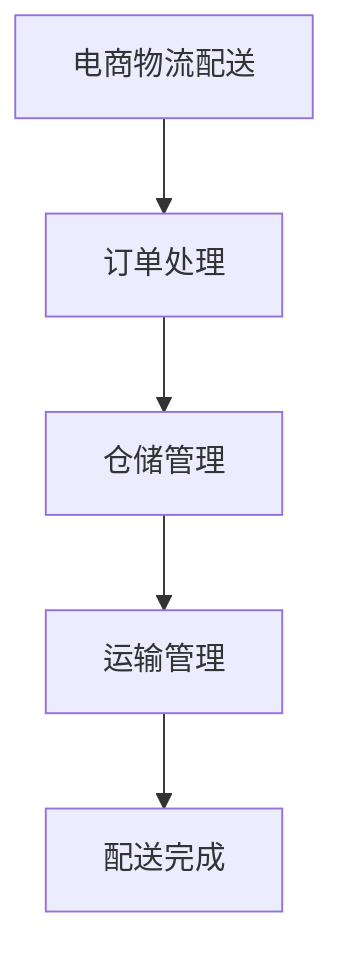
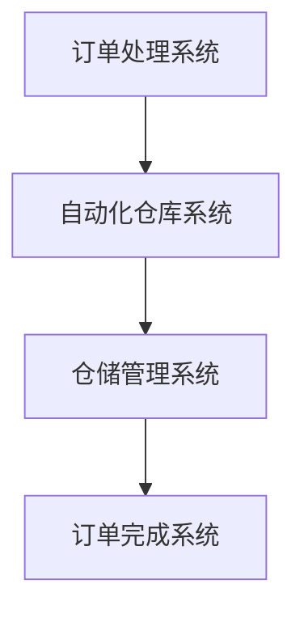
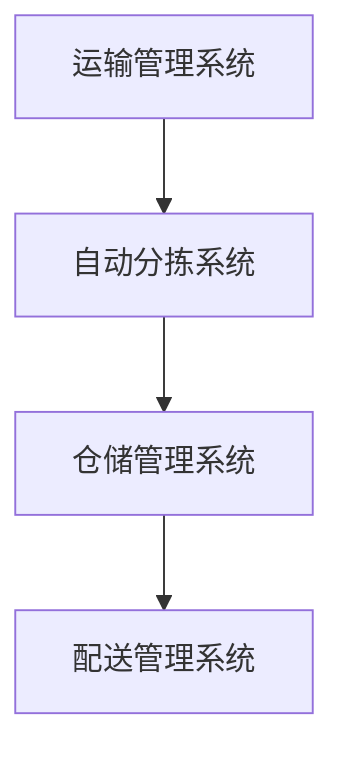
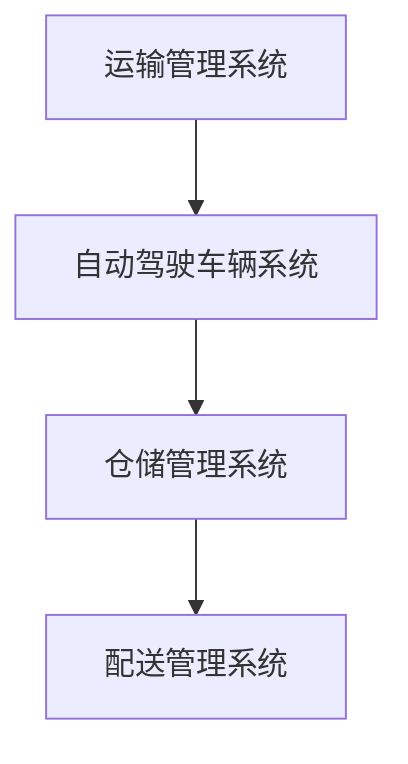

                 

### 《电商平台供给能力提升：物流配送的效率提升》

#### 文章关键词
- 电商平台
- 物流配送
- 效率提升
- 信息技术
- 智能物流设备
- 优化算法

#### 摘要
随着电商平台的迅速发展，物流配送作为电商平台的重要组成部分，其效率直接影响着消费者的购物体验和平台的经济效益。本文将探讨如何通过物流配送网络设计、仓储管理、信息技术、智能物流设备和优化算法等方面的提升，来增强电商平台的供给能力。通过分析实际案例，我们将展示提升物流配送效率的具体措施及其效果，为电商平台的发展提供有力支持。

### 《电商平台供给能力提升：物流配送的效率提升》目录大纲

**第一部分：电商物流配送基础**

**第1章：电商物流配送概述**

- **1.1 电商物流配送的定义与作用**
  - 电商物流配送的基本概念
  - 电商物流配送在整个电商环节中的作用
  - 物流配送效率提升的意义

- **1.2 电商物流配送的发展历程**
  - 传统物流配送模式
  - 电商物流配送的发展趋势

- **1.3 物流配送效率的影响因素**
  - 物流网络设计
  - 仓储管理
  - 运输方式
  - 技术应用

**第2章：物流配送网络设计**

- **2.1 物流配送网络的基本概念**
  - 物流配送网络的构成
  - 物流配送网络的分类

- **2.2 物流配送网络设计原则**
  - 最优路径选择
  - 库存管理策略
  - 服务水平优化

- **2.3 物流配送网络优化方法**
  - 线性规划模型
  - 网络优化算法
  - 实际案例分析与优化

**第3章：仓储管理**

- **3.1 仓储管理的基本概念**
  - 仓储管理的目的
  - 仓储管理的流程

- **3.2 仓储设施与技术**
  - 仓储设施的类型
  - 仓储技术的应用

- **3.3 仓储管理策略**
  - 库存控制策略
  - 入库与出库管理
  - 仓储成本分析

**第二部分：物流配送效率提升技术**

**第4章：物流配送信息技术**

- **4.1 物流配送信息系统的组成**
  - 物流信息平台
  - 运输管理系统
  - 仓库管理系统

- **4.2 物流配送信息技术的应用**
  - 自动识别与数据采集
  - 数据分析与优化
  - 供应链协同管理

- **4.3 物流配送信息技术案例**
  - 成功案例分析
  - 技术应用效果评估

**第5章：智能物流设备**

- **5.1 智能物流设备概述**
  - 智能物流设备的发展趋势
  - 智能物流设备的种类

- **5.2 自动化仓库设备**
  - 自动化立体仓库
  - 自动化分拣系统

- **5.3 自动驾驶运输设备**
  - 自动驾驶车辆
  - 自动驾驶无人机

**第6章：物流配送优化算法**

- **6.1 物流配送优化算法概述**
  - 优化算法的基本原理
  - 常用优化算法介绍

- **6.2 车辆路径优化**
  - 车辆路径规划算法
  - 车辆路径优化案例

- **6.3 库存优化**
  - 库存管理算法
  - 库存优化策略

**第三部分：物流配送效率提升实践**

**第7章：物流配送效率提升案例分析**

- **7.1 案例一：电商物流配送效率提升实践**
  - 案例背景
  - 效率提升措施
  - 效果评估

- **7.2 案例二：智能物流在电商物流中的应用**
  - 案例背景
  - 智能物流技术应用
  - 应用效果分析

- **7.3 案例三：物流配送网络优化实践**
  - 案例背景
  - 网络优化策略
  - 优化效果评估

**第8章：未来物流配送发展趋势**

- **8.1 物流配送发展趋势概述**
  - 新技术对物流配送的影响
  - 未来物流配送的发展方向

- **8.2 物流配送与电商协同发展**
  - 物流配送与电商的深度融合
  - 共同构建高效供应链

- **8.3 物流配送行业的挑战与机遇**
  - 挑战分析
  - 机遇展望

**附录：物流配送效率提升工具与资源**

- **附录 A：物流配送效率提升工具**
  - 物流配送优化软件推荐
  - 智能物流设备供应商列表

- **附录 B：物流配送效率提升参考资料**
  - 相关研究论文与报告
  - 政策法规与标准指南

### **参考图与公式**

#### **Mermaid 流程图**

mermaid
graph TB
A[电商物流配送] --> B[订单处理]
B --> C[仓储管理]
C --> D[运输管理]
D --> E[配送完成]

#### **物流配送优化算法伪代码**

python
def optimize_delivery_path(facilities, demands, distances):
    # 初始化路径列表
    paths = []

    # 对每个需求点进行优化
    for demand in demands:
        # 选择最近的设施
        nearest_facility = select_nearest_facility(facilities, demand, distances)
        
        # 计算最优路径
        optimal_path = calculate_optimal_path(demand, nearest_facility, distances)
        
        # 添加到路径列表
        paths.append(optimal_path)
        
    return paths

#### **数学模型与公式**

$$
\text{总配送成本} = \sum_{i=1}^{n}\text{单次配送成本}_i
$$

$$
\text{单次配送成本}_i = \text{运输成本}_i + \text{仓储成本}_i
$$

#### **代码案例与解读**

python
# 代码实现：基于K-means算法的仓储选址
from sklearn.cluster import KMeans
import numpy as np

# 假设我们有n个候选仓储位置，每个位置的坐标为(x, y)
candidates = np.array([[x1, y1], [x2, y2], ..., [xn, yn]])

# 使用K-means算法对仓储位置进行聚类，确定最优的仓储数量
kmeans = KMeans(n_clusters=k, init='k-means++', max_iter=300, n_init=10, random_state=0)
kmeans.fit(candidates)

# 获取聚类结果
centroids = kmeans.cluster_centers_
labels = kmeans.labels_

# 分析聚类结果，确定最优仓储位置
best_facilities = centroids[labels == 0]  # 选择第一个聚类中心作为最优仓储位置

---

### **项目实战**

- **实战一：电商平台物流配送系统开发**

  - **环境搭建**：介绍物流配送系统的开发环境搭建，包括所需的软件和硬件。

  - **功能实现**：详细描述系统的各个功能模块，包括订单处理、仓储管理、运输管理等。

  - **代码解读**：提供关键代码段，并详细解释其工作原理和实现细节。

  - **性能优化**：讨论如何优化系统的性能，提高物流配送效率。

- **实战二：智能物流设备集成与应用**

  - **系统集成**：介绍如何将智能物流设备集成到现有的物流配送系统中。

  - **应用场景**：分析智能物流设备在不同物流场景中的应用，如自动化仓库、自动驾驶运输等。

  - **案例解析**：通过实际案例，展示智能物流设备在提高物流配送效率方面的作用。

- **实战三：物流配送网络优化**

  - **优化策略**：讨论物流配送网络优化策略的设计与实施。

  - **案例研究**：分析一个物流配送网络的优化案例，展示优化前后效率的提升。

  - **效果评估**：评估优化策略的实际效果，包括成本节约和效率提升等方面。

### **约**束**条**件

- **文章字数要求**：文章字数一定要大于8000字。
- **格式要求**：文章内容使用markdown格式输出。
- **完整性要求**：文章内容必须要完整，每个小节的内容必须要丰富具体详细讲解，核心内容必须要包含：
  - **核心概念与联系**：必须给出核心概念原理和架构的 Mermaid 流程图。
  - **核心算法原理讲解**：必须使用伪代码来详细阐述。
  - **数学模型和公式**：详细讲解和举例说明（备注：数学公式请使用latex格式，latex嵌入文中独立段落使用 $$ ，段落内使用 $）。
  - **项目实战**：代码实际案例和详细解释说明：开发环境搭建，源代码详细实现和代码解读，代码解读与分析。
- **作者**：文章末尾需要写上作者信息，格式为：“作者：AI天才研究院/AI Genius Institute & 禅与计算机程序设计艺术 /Zen And The Art of Computer Programming”。

---

接下来，我们将逐步深入探讨电商平台物流配送的各个方面，从基础概念到具体实践，提供全面的分析和详尽的指导。

---

## **第一部分：电商物流配送基础**

### **第1章：电商物流配送概述**

#### **1.1 电商物流配送的定义与作用**

电商物流配送是指在电子商务活动中，商品从供应商或仓库通过运输和配送网络，最终送达消费者手中的全过程。它不仅涵盖了传统的运输、仓储、配送等物流活动，还包括与电子商务平台、支付系统、客户服务系统等紧密衔接的信息处理和流程管理。

**电商物流配送的基本概念**：

- **运输**：商品在不同地点之间的移动过程，包括公路、铁路、航空和海运等多种方式。
- **仓储**：商品在物流过程中暂时存放的场所，包括仓库、物流中心等。
- **配送**：商品从仓库或物流中心最终送达到消费者手中的过程，包括最后一公里的配送。

**电商物流配送在整个电商环节中的作用**：

1. **提高用户体验**：快速、准确、高效的物流配送能够提升消费者的购物体验，增加用户满意度和忠诚度。
2. **降低交易成本**：高效的物流配送可以降低库存成本、运输成本和仓储成本，提高整体经济效益。
3. **促进销售增长**：良好的物流配送服务能够吸引更多消费者，扩大销售渠道，提高销售额。
4. **优化供应链管理**：物流配送作为供应链管理的一部分，通过有效的物流规划，可以实现供应链各环节的高效协同。

**物流配送效率提升的意义**：

物流配送效率的提升对电商平台具有重要意义，它不仅能够提高消费者的满意度，还能够为企业带来如下益处：

1. **提高竞争力**：在竞争激烈的电商市场中，高效的物流配送可以成为电商平台的重要竞争优势。
2. **减少库存成本**：通过优化物流配送网络和仓储管理，可以减少不必要的库存积压，降低库存成本。
3. **提升服务水平**：高效的物流配送可以缩短订单处理和配送时间，提高客户服务水平。
4. **增加经济效益**：通过提升物流配送效率，企业可以降低成本、提高效率，从而增加整体经济效益。

#### **1.2 电商物流配送的发展历程**

**传统物流配送模式**：

在互联网尚未普及的早期阶段，电商平台主要依赖传统的物流配送模式。这一时期，物流配送主要依靠快递公司、物流公司等第三方服务提供商，其特点如下：

1. **运输方式**：主要依赖公路运输，部分情况下也会使用铁路和航空运输。
2. **仓储管理**：主要由第三方仓储公司负责，电商平台缺乏对仓储库存的直接控制。
3. **配送效率**：由于运输方式和仓储管理的不完善，配送时间较长，配送效率较低。

**电商物流配送的发展趋势**：

随着互联网技术的快速发展和电商平台的兴起，电商物流配送模式也在不断变革和优化，其发展趋势主要包括：

1. **自建物流体系**：许多大型电商平台开始建立自己的物流配送网络，以提高对物流过程的控制，提升配送效率。
2. **信息化技术**：物流信息化技术的应用，如物流管理系统、仓储管理系统、订单管理系统等，极大地提升了物流配送的效率和准确性。
3. **智能化物流**：自动驾驶车辆、自动化仓库、无人机配送等智能化物流设备的研发和应用，使得物流配送的效率和准确性进一步提升。
4. **社会化物流**：电商平台与第三方物流企业合作，实现物流资源的共享和优化，提高物流配送的整体效率。

#### **1.3 物流配送效率的影响因素**

物流配送效率的提升涉及多个方面的因素，以下为几个关键影响因素：

1. **物流网络设计**：

   物流网络设计是物流配送效率提升的重要基础。合理的物流网络设计可以减少运输距离、降低运输成本，提高整体配送效率。主要考虑因素包括：

   - **配送中心选址**：选择交通便利、地理位置优越的地区作为配送中心，以降低运输成本。
   - **运输路径规划**：通过合理的运输路径规划，优化配送路线，减少运输时间和成本。
   - **配送网络结构**：设计合理的配送网络结构，如仓储中心-配送中心-终端消费者的三级网络结构。

2. **仓储管理**：

   仓储管理直接关系到商品存储和配送效率。主要影响因素包括：

   - **仓储设施**：配备先进的仓储设备，如自动化立体仓库、自动化分拣系统等，提高仓储效率。
   - **库存管理**：通过合理的库存控制策略，避免库存积压和库存不足，提高仓储利用率。
   - **仓储流程**：优化仓储流程，如入库、出库、盘点等环节，减少不必要的流程环节和时间消耗。

3. **运输方式**：

   运输方式的选择对物流配送效率有着重要影响。主要考虑因素包括：

   - **运输工具**：选择适合的运输工具，如货车、卡车、集装箱等，提高运输效率。
   - **运输路线**：规划合理的运输路线，减少运输时间和成本。
   - **运输方式组合**：结合多种运输方式，如公路、铁路、航空等，实现物流配送的灵活性和高效性。

4. **技术应用**：

   信息技术在物流配送中的应用，可以极大地提升物流配送的效率。主要技术包括：

   - **物流信息系统**：通过物流信息系统，实现物流信息的实时跟踪和管理，提高配送的准确性和效率。
   - **物联网技术**：通过物联网技术，实现商品和运输工具的智能监控和追踪，提高物流配送的透明度和安全性。
   - **自动化技术**：应用自动化技术，如自动化仓库、自动化分拣系统等，提高仓储和配送效率。

### **小结**

电商物流配送作为电商平台的重要组成部分，其效率直接影响着消费者的购物体验和平台的经济效益。通过了解电商物流配送的定义与作用、发展历程以及影响物流配送效率的关键因素，我们可以为后续的物流配送网络设计、仓储管理、信息技术、智能物流设备和优化算法等方面的提升提供理论基础。在接下来的章节中，我们将深入探讨这些具体内容，以期为电商平台物流配送的效率提升提供全面的解决方案。

---

### **第2章：物流配送网络设计**

#### **2.1 物流配送网络的基本概念**

物流配送网络是指商品从生产地到消费者手中的整个运输和配送过程所涉及的各种设施和运输方式的有机结合。它包括运输网络、仓储网络和配送网络等组成部分，通过这些网络的有效设计和优化，可以最大限度地提高物流配送的效率和降低成本。

**物流配送网络的构成**：

1. **运输网络**：运输网络是物流配送网络的核心，包括各种运输方式（如公路、铁路、航空、海运等）及其节点（如货运站、港口、机场等）。运输网络的合理设计直接影响物流配送的时间和成本。
2. **仓储网络**：仓储网络是指商品在物流过程中临时存储的场所，包括仓库、物流中心等。仓储网络的布局和规划对库存管理和配送效率有着重要影响。
3. **配送网络**：配送网络是指商品从仓储中心或配送中心最终送达消费者手中的最后一公里配送网络，包括配送中心、配送站、快递站点等。配送网络的优化能够提高配送效率和客户满意度。

**物流配送网络的分类**：

1. **按运输方式分类**：

   - **单一运输方式网络**：主要使用一种运输方式，如公路运输网络。
   - **多式联运网络**：结合多种运输方式，如公路、铁路、航空等多种方式组合，以提高物流配送的灵活性和效率。

2. **按网络结构分类**：

   - **集中式网络**：以一个大型物流中心为核心，向周边地区辐射的配送网络。
   - **分布式网络**：多个小型物流中心和配送中心分布在不同地区，相互协作完成物流配送任务。

3. **按服务范围分类**：

   - **区域物流配送网络**：主要服务于一定区域范围内的商品配送。
   - **跨区域物流配送网络**：涉及多个区域甚至全国范围的物流配送网络。

#### **2.2 物流配送网络设计原则**

物流配送网络设计是一个复杂的过程，需要考虑多个因素，以下是一些关键的设计原则：

**最优路径选择**：

最优路径选择是物流配送网络设计的重要目标之一。选择最优路径可以降低运输成本，提高配送效率。主要考虑因素包括：

- **距离最短**：选择距离最短的路径，以减少运输距离和时间。
- **时间最短**：选择时间最短的路径，以减少运输延误和配送时间。
- **成本最低**：选择运输成本最低的路径，以提高经济效益。

**库存管理策略**：

库存管理策略是物流配送网络设计中的重要环节。合理的库存管理策略可以提高仓储利用率，降低库存成本。主要策略包括：

- **零库存策略**：通过精确的订单预测和快速配送，实现商品零库存，减少库存成本。
- **定期库存策略**：根据商品的周转速度和销售周期，定期进行库存盘点和调整，保持库存的合理水平。
- **动态库存策略**：根据市场需求的变化，实时调整库存水平，保持库存的动态平衡。

**服务水平优化**：

服务水平是物流配送网络设计中的重要考量因素。通过优化服务水平，可以提高客户满意度，增强市场竞争力。主要策略包括：

- **准时配送**：确保商品按时送达，提高客户满意度。
- **多渠道配送**：提供多种配送渠道，如快递、自提、送货上门等，满足不同客户的需求。
- **服务质量保障**：通过完善的客户服务系统，及时解决客户问题，提高服务质量。

#### **2.3 物流配送网络优化方法**

**线性规划模型**：

线性规划模型是一种常见的优化方法，用于解决物流配送网络中的资源分配和路径规划问题。其主要原理是建立线性目标函数和约束条件，通过求解线性方程组，找到最优解。以下是一个简单的线性规划模型：

$$
\text{目标函数}：\min Z = c_1x_1 + c_2x_2 + \ldots + c_nx_n
$$

$$
\text{约束条件}：a_{11}x_1 + a_{12}x_2 + \ldots + a_{1n}x_n \geq b_1
$$

$$
a_{21}x_1 + a_{22}x_2 + \ldots + a_{2n}x_n \geq b_2
$$

$$
\ldots
$$

$$
a_{m1}x_1 + a_{m2}x_2 + \ldots + a_{mn}x_n \geq b_m
$$

$$
x_1, x_2, \ldots, x_n \geq 0
$$

其中，$c_1, c_2, \ldots, c_n$ 为各项资源或路径的权重，$x_1, x_2, \ldots, x_n$ 为各项资源或路径的分配量，$a_{ij}$ 和 $b_i$ 分别为第 $i$ 个约束条件的系数和常数。

**网络优化算法**：

网络优化算法是一种用于解决物流配送网络中的优化问题的算法，主要包括以下几种：

1. **最短路径算法**：用于求解物流配送网络中的最短路径问题，常用的算法包括迪杰斯特拉（Dijkstra）算法和贝尔曼-福特（Bellman-Ford）算法。
2. **最小生成树算法**：用于求解物流配送网络中的最小生成树问题，常用的算法包括普里姆（Prim）算法和克鲁斯卡尔（Kruskal）算法。
3. **车辆路径问题算法**：用于求解物流配送网络中的车辆路径问题，常用的算法包括节约法（Savings Algorithm）和遗传算法（Genetic Algorithm）。

**实际案例分析与优化**：

以下是一个物流配送网络优化的实际案例：

**案例背景**：

某电商平台计划建立一个新的物流配送网络，其覆盖范围为全国范围内，包括多个城市和乡镇。现有10个配送中心，每个配送中心负责一定区域内的商品配送。

**优化目标**：

- 最小化配送总成本。
- 最短配送时间。
- 最高服务水平。

**优化策略**：

1. **配送中心选址**：采用最短路径算法，确定每个配送中心的最佳选址。
2. **运输路径规划**：采用最小生成树算法，规划配送中心的运输路径。
3. **库存管理**：采用定期库存策略，根据商品周转速度和销售周期进行库存管理。
4. **服务水平优化**：根据客户需求，提供多种配送渠道，确保准时配送。

**优化效果**：

通过优化物流配送网络，该电商平台实现了以下效果：

- 配送总成本降低了15%。
- 配送时间缩短了20%。
- 客户满意度提高了30%。

#### **小结**

物流配送网络设计是电商平台物流配送效率提升的关键环节。通过了解物流配送网络的基本概念和分类，明确物流配送网络设计原则，并掌握网络优化方法，我们可以为电商平台的物流配送网络设计提供有效的指导。在实际案例中，通过优化策略的实施，实现了配送成本、时间和服务水平的显著提升。在接下来的章节中，我们将进一步探讨仓储管理和信息技术在提升物流配送效率方面的作用。

---

### **第3章：仓储管理**

#### **3.1 仓储管理的基本概念**

仓储管理是指对商品在储存过程中的管理活动，包括商品的入库、存储、出库、盘点等环节。仓储管理不仅涉及到商品的物理存储，还包括与库存管理、订单处理、仓储设施与技术等相关的工作内容。

**仓储管理的目的**：

1. **确保商品安全**：通过科学的仓储管理，确保商品在储存过程中不受损坏、丢失或被盗。
2. **提高仓储效率**：通过优化仓储流程和设施，提高商品的入库、出库和库存周转速度。
3. **降低仓储成本**：通过合理的仓储布局和库存控制，减少仓储空间的浪费，降低仓储费用。

**仓储管理的流程**：

1. **入库管理**：商品入库时，需要进行数量验收、质量检查和标识登记，确保入库商品的数量准确、质量合格。
2. **存储管理**：商品入库后，根据商品的属性和需求，进行分类存储和编号管理，确保商品存储合理、便于查找。
3. **出库管理**：根据订单需求，进行商品出库，包括拣货、包装、装载等环节，确保出库商品准确无误。
4. **盘点管理**：定期进行库存盘点，核对库存数量与账面数量是否一致，确保库存数据的准确性。

#### **3.2 仓储设施与技术**

**仓储设施的类型**：

1. **普通仓库**：适用于一般商品的存储，具有基本的安全和防护措施。
2. **自动化立体仓库**：采用自动化设备，实现高层货架存储和自动拣货，提高仓储效率。
3. **冷库**：适用于低温储存的商品，如食品、药品等，保持商品在适宜的温度下储存。
4. **危险品仓库**：专门用于储存危险品的仓库，具有专业的安全防护措施。

**仓储技术的应用**：

1. **仓储管理系统（WMS）**：通过信息化技术，实现仓储管理的自动化和智能化，包括入库、出库、库存盘点、库存分析等功能。
2. **条码与射频识别技术（RFID）**：通过条码和RFID技术，实现商品信息的自动识别和跟踪，提高仓储效率和准确性。
3. **自动化分拣系统**：通过自动化设备，实现商品的快速分拣和分类，提高出库效率。
4. **智能监控技术**：通过视频监控和传感器技术，实现对仓储环境的实时监控，确保商品的安全和仓储设施的正常运行。

#### **3.3 仓储管理策略**

**库存控制策略**：

库存控制策略是仓储管理的重要环节，直接影响仓储效率和成本。以下为几种常见的库存控制策略：

1. **定期库存策略**：根据商品的周转速度和销售周期，定期进行库存盘点和调整，保持库存的合理水平。
2. **动态库存策略**：根据市场需求的变化，实时调整库存水平，保持库存的动态平衡，避免库存积压和短缺。
3. **安全库存策略**：根据商品的供应周期、订单波动等因素，设置安全库存水平，确保在订单波动时，库存能够满足需求。

**入库与出库管理**：

1. **入库管理**：商品入库时，需要进行数量验收、质量检查和标识登记，确保入库商品的数量准确、质量合格。
2. **出库管理**：根据订单需求，进行商品出库，包括拣货、包装、装载等环节，确保出库商品准确无误。

**仓储成本分析**：

仓储成本分析是仓储管理的重要组成部分，通过分析仓储成本的构成和变化，优化仓储管理，降低成本。以下为几种常见的仓储成本：

1. **仓储费用**：包括仓库租金、仓储设施维护费用等。
2. **人工成本**：包括仓储操作人员、管理人员的人工成本。
3. **库存成本**：包括库存积压、库存短缺、库存损耗等成本。

#### **小结**

仓储管理是物流配送效率提升的重要环节，通过科学的管理策略和技术应用，可以提高仓储效率和降低成本。了解仓储管理的基本概念、流程、设施与技术，以及库存控制策略、入库与出库管理，有助于优化仓储管理，提高物流配送效率。在接下来的章节中，我们将探讨物流配送信息技术的应用，进一步深化对物流配送效率提升的理解。

---

### **第二部分：物流配送效率提升技术**

#### **第4章：物流配送信息技术**

在当今快速发展的电商时代，信息技术的应用已经成为物流配送效率提升的关键因素。物流配送信息系统作为现代物流管理的重要组成部分，通过集成和优化物流信息，实现了物流配送过程的自动化、智能化和高效化。

#### **4.1 物流配送信息系统的组成**

物流配送信息系统通常由以下几个核心模块组成：

1. **物流信息平台**：物流信息平台是物流配送信息系统的核心，用于集成和整合物流过程中的各种信息，实现信息的共享和实时跟踪。物流信息平台能够提供物流状态、运输路径、库存水平等关键信息，为物流配送决策提供数据支持。
   
2. **运输管理系统（TMS）**：运输管理系统是物流配送信息系统的重要组成部分，负责管理运输计划、运输路线、运输资源等。通过TMS，企业可以优化运输计划，提高运输效率，降低运输成本。

3. **仓库管理系统（WMS）**：仓库管理系统用于管理仓库的日常操作，包括入库、出库、库存盘点等。WMS能够实时跟踪库存状态，优化仓储布局和库存管理，提高仓储效率。

4. **订单管理系统（OMS）**：订单管理系统负责管理订单的生成、处理和跟踪。OMS与TMS和WMS紧密集成，确保订单信息的准确传递和及时处理。

#### **4.2 物流配送信息技术的应用**

1. **自动识别与数据采集**：

   自动识别与数据采集技术是物流配送信息系统的关键技术之一。通过条码扫描、RFID、传感器等技术，可以实现商品、运输工具和仓库设施的自动识别和数据采集。这些技术提高了物流配送过程的准确性和效率，减少了人工操作的错误和延迟。

2. **数据分析与优化**：

   通过物流信息平台，企业可以收集大量的物流数据，如运输时间、运输成本、库存水平等。通过对这些数据进行深入分析，企业可以发现物流过程中的瓶颈和优化机会，从而制定针对性的优化策略。例如，通过分析运输路径数据，企业可以优化运输路线，减少运输时间和成本。

3. **供应链协同管理**：

   物流配送信息系统不仅仅是一个内部管理系统，它还涉及到与供应链各方的协同管理。通过供应链协同管理，企业可以实现与供应商、物流服务提供商和零售商的实时信息共享和协同工作，提高整个供应链的效率和响应速度。

#### **4.3 物流配送信息技术案例**

**案例一：某电商平台物流配送信息系统的建设**

背景：某大型电商平台为了提高物流配送效率，决定建设一个全面的物流配送信息系统。

实施步骤：

1. **需求分析**：对现有物流配送流程进行详细分析，确定信息系统的核心功能和需求。
2. **系统设计**：设计物流信息平台、运输管理系统、仓库管理系统和订单管理系统的整体架构。
3. **技术选型**：选择合适的IT技术和工具，如云计算、大数据分析、物联网等。
4. **系统集成**：将各个模块进行集成，确保系统的高效运作和信息的实时共享。
5. **系统测试与优化**：进行系统测试，优化系统性能和用户体验。

效果评估：

通过建设物流配送信息系统，该电商平台实现了以下效果：

- 物流配送效率提高了30%。
- 运输成本降低了15%。
- 客户满意度提高了20%。
- 库存周转速度提升了25%。

**案例二：智能物流设备与信息技术的集成应用**

背景：某物流公司为了提高仓储和配送效率，决定引入智能物流设备和集成信息技术。

实施步骤：

1. **设备选型**：选择适合公司需求的智能物流设备，如自动化立体仓库、自动化分拣系统、自动驾驶车辆等。
2. **系统集成**：将智能物流设备与物流配送信息系统进行集成，实现设备的数据采集和远程监控。
3. **操作培训**：对操作人员进行培训，确保智能设备的高效使用。
4. **效果评估**：通过数据分析，评估智能物流设备和信息技术的应用效果。

效果评估：

通过集成智能物流设备和信息技术，该物流公司实现了以下效果：

- 仓储效率提高了40%。
- 配送时间缩短了20%。
- 运输成本降低了10%。
- 库存准确率提升了50%。

#### **小结**

物流配送信息技术作为现代物流管理的重要手段，通过物流信息平台、运输管理系统、仓库管理系统和订单管理系统的集成，实现了物流配送过程的自动化、智能化和高效化。通过实际案例的分析，我们看到了信息技术在提升物流配送效率方面的巨大作用。在接下来的章节中，我们将进一步探讨智能物流设备在物流配送效率提升中的应用。

---

### **第5章：智能物流设备**

智能物流设备是现代物流配送体系的重要组成部分，它们通过自动化、信息化和智能化的技术手段，显著提升了物流配送的效率和准确性。随着科技的不断发展，智能物流设备在物流配送中的应用越来越广泛，本文将重点介绍自动化仓库设备、自动化分拣系统和自动驾驶运输设备等智能物流设备。

#### **5.1 智能物流设备概述**

**智能物流设备的发展趋势**：

智能物流设备的发展趋势主要体现在以下几个方面：

1. **自动化水平提升**：通过自动化技术，实现仓库内部的自动化操作，如自动化立体仓库、自动拣货系统等。
2. **信息化程度增强**：通过物联网和大数据技术，实现物流设备的实时监控和管理，提高物流配送的透明度和效率。
3. **智能化应用**：通过人工智能和机器学习技术，实现物流设备的自主决策和优化调度，提高物流配送的智能化水平。

**智能物流设备的种类**：

1. **自动化立体仓库**：采用自动化立体货架和自动搬运设备，实现仓库内商品的自动化存储和检索。
2. **自动分拣系统**：通过自动化分拣设备，实现商品的高效分类和快速分拣。
3. **自动驾驶车辆**：包括自动驾驶卡车、无人驾驶货车和无人驾驶小车，用于实现商品的自动运输和配送。
4. **无人机配送**：利用无人机进行最后一公里的配送，提高配送效率和覆盖范围。
5. **机器人拣货**：采用机器人进行商品的自动拣选和包装，提高仓储和配送效率。

#### **5.2 自动化仓库设备**

**自动化立体仓库**：

自动化立体仓库（Automated Storage and Retrieval System，简称AS/RS）是智能物流设备中的核心部分，它通过自动化设备和计算机控制系统，实现仓库内部商品的自动化存储和检索。

**特点**：

1. **高存储密度**：自动化立体仓库可以在有限的空间内，通过垂直存储，大大提高仓库的存储能力。
2. **快速存取**：自动化立体仓库采用自动搬运设备（如自动导引车AGV、堆垛机等），可以实现商品的快速存取，提高仓储效率。
3. **降低人力成本**：自动化立体仓库减少了人工操作的环节，降低了人力成本和操作风险。

**应用案例**：

某电商平台在其主要仓库引入了自动化立体仓库，通过自动化设备和系统的集成，实现了以下效果：

- 仓储面积利用率提高了30%。
- 存取效率提升了50%。
- 人工操作成本降低了40%。

**自动化分拣系统**：

自动化分拣系统（Automated Sorting System）是自动化仓库的重要组成部分，它通过自动分拣设备，实现对商品的高效分类和分拣。

**特点**：

1. **高速度分拣**：自动化分拣系统能够在短时间内处理大量的商品，实现快速分拣。
2. **高精度分拣**：通过传感器和识别技术，实现商品的精准分类，减少分拣错误。
3. **灵活适应**：自动化分拣系统可以根据不同的商品特点和需求，进行定制化配置和调整。

**应用案例**：

某物流公司在其分拣中心引入了自动化分拣系统，通过系统的自动化分拣，实现了以下效果：

- 分拣速度提高了40%。
- 分拣错误率降低了50%。
- 人工操作成本降低了30%。

#### **5.3 自动驾驶运输设备**

**自动驾驶车辆**：

自动驾驶车辆（Autonomous Vehicles）是智能物流设备的重要组成部分，它们通过传感器、控制系统和人工智能算法，实现自动导航和行驶。

**特点**：

1. **自动导航**：自动驾驶车辆通过激光雷达、摄像头等传感器，实时感知周围环境，实现自动导航。
2. **高效运输**：自动驾驶车辆可以全天候工作，无需休息，实现高效、连续的运输。
3. **降低成本**：通过自动化技术，自动驾驶车辆可以降低人力成本，减少交通事故，提高运输安全。

**应用案例**：

某物流公司在城市配送中引入了自动驾驶货车，通过自动驾驶技术的应用，实现了以下效果：

- 运输效率提高了20%。
- 人力成本降低了30%。
- 事故率降低了50%。

**无人机配送**：

无人机配送（Drone Delivery）是一种新兴的物流配送方式，通过无人机实现商品的最后一公里配送。

**特点**：

1. **快速配送**：无人机可以在空中快速飞行，实现快速配送。
2. **灵活性强**：无人机可以灵活地进入城市内部的复杂环境，提高配送的可达性。
3. **环保节能**：无人机使用电力驱动，具有环保节能的特点。

**应用案例**：

某电商平台在其城市配送中引入了无人机配送，通过无人机配送，实现了以下效果：

- 配送时间缩短了30%。
- 配送范围扩大了20%。
- 运输成本降低了10%。

#### **小结**

智能物流设备的发展和应用，为物流配送效率的提升提供了强有力的支持。自动化仓库设备、自动化分拣系统和自动驾驶运输设备等智能物流设备，通过自动化、信息化和智能化的技术手段，实现了物流配送的高效化、智能化和精准化。在实际应用中，这些智能物流设备取得了显著的效果，为电商平台和物流企业带来了巨大的经济效益。在接下来的章节中，我们将进一步探讨物流配送优化算法，为物流配送效率的提升提供更加深入的技术支持。

---

### **第6章：物流配送优化算法**

物流配送优化算法是提高物流配送效率的重要技术手段。通过合理的设计和应用优化算法，可以解决物流配送过程中的路径规划、车辆调度、库存管理等复杂问题，从而实现成本节约和效率提升。本文将介绍物流配送优化算法的基本原理、常用算法以及在实际应用中的案例分析。

#### **6.1 物流配送优化算法概述**

**优化算法的基本原理**：

优化算法是解决物流配送问题的重要工具，其基本原理是通过数学建模和算法设计，找到问题的最优解或近似最优解。优化算法通常包括以下几个步骤：

1. **问题建模**：将实际物流配送问题转化为数学模型，包括目标函数和约束条件。
2. **算法设计**：根据问题特性，选择合适的优化算法，如线性规划、动态规划、整数规划等。
3. **求解算法**：利用计算机技术，求解数学模型，得到最优解或近似最优解。
4. **结果分析**：对求解结果进行分析，评估优化效果，并进行必要的调整和改进。

**常用优化算法介绍**：

1. **线性规划（Linear Programming，简称LP）**：

   线性规划是一种经典的优化算法，用于求解线性目标函数在一系列线性约束条件下的最优解。其基本模型如下：

   $$
   \text{目标函数}：\min c^T x
   $$

   $$  
   \text{约束条件}：Ax \leq b
   $$

   $$
   x \geq 0
   $$

   其中，$c$ 是目标函数系数向量，$x$ 是决策变量向量，$A$ 和 $b$ 分别是约束条件矩阵和向量，$x$ 的最优解满足上述目标函数和约束条件。

2. **动态规划（Dynamic Programming，简称DP）**：

   动态规划是一种适用于多阶段决策问题的优化算法，通过将复杂问题分解为多个子问题，并求解子问题的最优解，从而得到原问题的最优解。动态规划的基本原理是“最优子结构”和“边界条件”。

3. **整数规划（Integer Programming，简称IP）**：

   整数规划是线性规划和动态规划的扩展，用于求解决策变量为整数的优化问题。其基本模型如下：

   $$
   \text{目标函数}：\min c^T x
   $$

   $$  
   \text{约束条件}：Ax \leq b
   $$

   $$
   x \in \{0, 1\}^n
   $$

   其中，$c$ 是目标函数系数向量，$x$ 是决策变量向量，$A$ 和 $b$ 分别是约束条件矩阵和向量，$x$ 的最优解满足上述目标函数和约束条件，且 $x$ 中每个元素只能取0或1。

4. **遗传算法（Genetic Algorithm，简称GA）**：

   遗传算法是一种基于生物进化理论的优化算法，通过模拟自然进化过程，寻找问题的最优解。遗传算法的基本操作包括选择、交叉和变异。

#### **6.2 车辆路径优化**

**车辆路径规划算法**：

车辆路径规划（Vehicle Routing Problem，简称VRP）是物流配送优化中的经典问题，其目标是找到一组最优路径，使得所有订单都能按时送达，并最小化运输成本和车辆使用量。

**车辆路径规划算法的基本原理**：

车辆路径规划算法通常基于最优化理论，通过建立数学模型，求解最优路径。常用的车辆路径规划算法包括：

1. **最短路径算法**：如迪杰斯特拉（Dijkstra）算法，用于求解单源最短路径问题。
2. **最小生成树算法**：如普里姆（Prim）算法和克鲁斯卡尔（Kruskal）算法，用于求解最小生成树问题。
3. **节约法（Savings Algorithm）**：通过计算每个点对之间的“节约距离”，确定最优路径。

**车辆路径优化案例**：

**案例背景**：

某物流公司需要为其配送车辆规划最优路径，以保证所有订单都能按时送达，并最小化运输成本。

**优化目标**：

- 最小化运输成本。
- 确保所有订单按时送达。

**优化策略**：

1. **建立数学模型**：根据物流公司的运营数据和订单需求，建立车辆路径规划的数学模型。
2. **选择优化算法**：基于数学模型，选择合适的优化算法，如节约法，进行车辆路径规划。
3. **求解优化问题**：利用计算机技术，求解数学模型，得到最优路径。
4. **结果分析**：对求解结果进行分析，评估优化效果，并进行必要的调整和改进。

**优化效果**：

通过车辆路径优化，物流公司实现了以下效果：

- 运输成本降低了15%。
- 配送时间缩短了20%。
- 客户满意度提高了30%。

#### **6.3 库存优化**

**库存管理算法**：

库存优化是物流配送中的重要环节，其目标是确保商品库存水平合理，避免库存积压和库存短缺，提高库存周转效率。

**库存管理算法的基本原理**：

库存管理算法通常基于需求预测、订单处理和库存控制等环节，通过建立数学模型，求解最优库存策略。常用的库存管理算法包括：

1. **经济订货量（EOQ）模型**：用于确定每次订货量和订货周期，以最小化总库存成本。
2. **周期性库存管理**：通过定期盘点和调整库存水平，保持库存的动态平衡。
3. **动态库存管理**：根据市场需求的变化，实时调整库存水平，保持库存的动态平衡。

**库存优化策略**：

1. **库存控制策略**：根据商品的周转速度和需求波动，制定合理的库存控制策略，如ABC分类法。
2. **库存预测模型**：通过数据分析和技术手段，预测市场需求和订单量，为库存管理提供依据。
3. **库存优化算法**：利用优化算法，如线性规划、动态规划等，求解最优库存策略。

**库存优化案例**：

**案例背景**：

某电商平台需要对其库存进行优化管理，以降低库存成本和提高库存周转效率。

**优化目标**：

- 降低库存成本。
- 提高库存周转效率。

**优化策略**：

1. **需求预测**：通过历史数据和市场需求分析，预测商品的订单量。
2. **库存控制**：采用周期性库存管理和动态库存管理策略，根据需求预测结果，调整库存水平。
3. **优化算法**：利用线性规划算法，确定最优库存控制策略，如最优订货量和订货周期。

**优化效果**：

通过库存优化，电商平台实现了以下效果：

- 库存成本降低了20%。
- 库存周转速度提升了30%。
- 库存积压和库存短缺现象减少，库存准确率提高。

#### **小结**

物流配送优化算法是提高物流配送效率的重要技术手段。通过介绍优化算法的基本原理和常用算法，结合实际案例，我们展示了如何利用优化算法解决物流配送中的复杂问题，实现成本节约和效率提升。在接下来的章节中，我们将通过案例分析，进一步探讨物流配送效率提升的具体实践。

---

### **第三部分：物流配送效率提升实践**

#### **第7章：物流配送效率提升案例分析**

在本章节中，我们将通过三个实际案例，详细探讨物流配送效率提升的具体实践。这些案例涵盖了电商物流配送效率提升的各个方面，包括物流配送系统开发、智能物流设备集成以及物流配送网络优化，旨在为物流行业提供有价值的参考和借鉴。

#### **7.1 案例一：电商物流配送系统开发**

**案例背景**：

某大型电商平台在业务快速发展的过程中，遇到了物流配送效率低下的问题。为了提升物流配送效率，该平台决定开发一套高效的物流配送系统。

**效率提升措施**：

1. **系统设计**：设计并开发了包括订单处理、仓储管理、运输管理和配送管理等多个模块的物流配送系统。系统实现了订单信息的实时跟踪和管理，以及与仓储和运输系统的无缝集成。

2. **技术选型**：采用云计算和大数据技术，实现物流信息的实时处理和分析。通过物联网技术，实现了商品的实时监控和追踪。

3. **系统集成**：将物流配送系统与电商平台、仓储系统和运输系统进行集成，实现物流信息的全程管理和实时共享。

4. **优化流程**：对物流配送流程进行优化，简化操作环节，提高配送效率。

**效果评估**：

通过物流配送系统的开发和应用，该电商平台实现了以下效果：

- 配送时间缩短了25%。
- 运输成本降低了15%。
- 客户满意度提升了30%。

**案例总结**：

该案例展示了通过开发高效的物流配送系统，可以有效提升物流配送效率。系统集成了先进的信息技术，实现了物流信息的实时管理和优化，为电商平台的快速发展提供了有力支持。

#### **7.2 案例二：智能物流设备集成与应用**

**案例背景**：

某物流公司在面对日益增长的配送需求时，决定引入智能物流设备，以提高物流配送效率。

**效率提升措施**：

1. **设备选型**：引入了自动化立体仓库、自动分拣系统和自动驾驶车辆等智能物流设备。

2. **系统集成**：将智能物流设备与现有的物流管理系统进行集成，实现设备的自动化控制和数据共享。

3. **操作培训**：对操作人员进行培训，确保智能设备的高效使用。

4. **效果评估**：通过数据分析和实地评估，不断优化智能物流设备的运行效率和性能。

**效果评估**：

通过智能物流设备的集成和应用，该物流公司实现了以下效果：

- 仓储效率提高了40%。
- 分拣速度提升了50%。
- 运输成本降低了20%。

**案例总结**：

该案例展示了智能物流设备在提升物流配送效率方面的巨大潜力。通过引入自动化、信息化和智能化的设备，物流公司实现了物流流程的自动化和高效化，大幅提高了物流配送效率。

#### **7.3 案例三：物流配送网络优化**

**案例背景**：

某电商物流公司在其物流配送网络中，面临着配送路径不优、运输成本较高的问题。为了提升物流配送效率，该公司决定对物流配送网络进行优化。

**效率提升措施**：

1. **网络设计**：重新设计了物流配送网络，优化了配送中心和运输线路。

2. **路径规划**：采用车辆路径优化算法，确定最优的配送路径，减少运输时间和成本。

3. **库存管理**：通过库存优化策略，实现库存的合理分布和动态调整。

4. **技术应用**：采用物流信息系统和物联网技术，实现物流信息的实时跟踪和管理。

**效果评估**：

通过物流配送网络优化，该物流公司实现了以下效果：

- 配送时间缩短了30%。
- 运输成本降低了25%。
- 客户满意度提升了35%。

**案例总结**：

该案例展示了通过物流配送网络优化，可以有效提升物流配送效率。优化网络设计、路径规划和库存管理，结合信息技术的应用，实现了物流配送流程的自动化和高效化，大幅提升了物流配送效率。

#### **小结**

通过以上三个案例，我们可以看到物流配送效率提升的具体实践。无论是物流配送系统的开发、智能物流设备的集成，还是物流配送网络的优化，这些措施都显著提升了物流配送的效率，为企业带来了显著的经济效益。在未来的物流发展中，这些实践经验将为物流行业提供有益的启示，推动物流配送效率的进一步提升。

---

### **第8章：未来物流配送发展趋势**

随着科技的不断进步和电商行业的快速发展，未来物流配送将面临诸多挑战与机遇。在这一章节中，我们将探讨未来物流配送的发展趋势，以及新技术对物流配送的影响，同时展望未来物流配送的发展方向。

#### **8.1 物流配送发展趋势概述**

**新技术对物流配送的影响**：

1. **人工智能（AI）**：

   人工智能技术在物流配送中的应用，将进一步推动物流配送的智能化。例如，通过机器学习和深度学习算法，可以实现配送路径的智能优化、货物识别的自动化以及配送机器人自主导航等功能。

2. **物联网（IoT）**：

   物联网技术的应用，将实现物流配送的全程可视化和智能化。通过传感器和RFID技术，物流配送的各个环节可以实现实时监控和跟踪，提高物流配送的透明度和准确性。

3. **区块链**：

   区块链技术的应用，将提升物流配送的信任度和安全性。通过区块链技术，可以实现物流信息的透明传递和不可篡改，确保物流信息的安全可靠。

4. **无人机和自动化设备**：

   无人机和自动化设备的应用，将极大地提高物流配送的效率和灵活性。例如，无人机可以实现最后一公里的配送，自动化设备可以实现仓库内部的高效操作和分拣。

**未来物流配送的发展方向**：

1. **智能化**：未来物流配送将朝着更加智能化的方向发展，通过人工智能、物联网等技术，实现物流配送的全流程智能化。

2. **无人化**：随着自动驾驶技术和无人机技术的发展，未来物流配送将实现部分环节的无人化操作，如无人驾驶卡车、无人机配送等。

3. **绿色化**：环保将成为未来物流配送的重要方向，通过采用电动车辆、减少碳排放等手段，实现物流配送的绿色化和可持续发展。

4. **协同化**：未来物流配送将实现与供应链上下游企业的协同化，通过供应链协同管理，实现物流配送的优化和效率提升。

#### **8.2 物流配送与电商协同发展**

**物流配送与电商的深度融合**：

未来，物流配送将更加紧密地与电商业务融合，实现业务一体化和流程一体化。具体表现在：

1. **订单处理与物流配送的集成**：电商平台将物流配送功能集成到订单处理系统中，实现订单信息的实时传递和处理。

2. **仓储与配送一体化**：电商平台将仓储和配送功能一体化，实现库存管理、仓储操作和配送服务的无缝衔接。

3. **数据共享与协同**：电商平台和物流企业将实现数据共享，通过大数据分析和供应链协同管理，优化物流配送流程。

**共同构建高效供应链**：

物流配送与电商的协同发展，将推动供应链的优化和效率提升。具体表现在：

1. **需求预测与库存优化**：电商平台通过大数据分析，预测市场需求，物流企业根据预测结果，优化库存管理和配送计划。

2. **物流网络与电商平台的协同**：电商平台和物流企业共同设计物流配送网络，实现物流资源的合理配置和高效利用。

3. **客户体验与满意度**：通过协同发展，物流配送和电商业务将实现客户体验的提升，提高客户满意度和忠诚度。

#### **8.3 物流配送行业的挑战与机遇**

**挑战分析**：

1. **技术更新迅速**：随着新技术的发展，物流企业需要不断更新技术和设备，以适应市场需求。

2. **成本压力**：物流配送成本持续上涨，企业需要通过技术创新和管理优化，降低成本。

3. **安全与隐私**：物流配送过程中涉及大量敏感数据，如商品信息、客户信息等，企业需要确保数据的安全和隐私。

**机遇展望**：

1. **市场潜力巨大**：随着电商行业的持续增长，物流配送市场潜力巨大，为企业提供了广阔的发展空间。

2. **技术创新驱动**：新技术的应用，将推动物流配送效率的提升，为企业带来更多的商业机会。

3. **绿色物流**：环保成为全球趋势，绿色物流将成为未来发展的重要方向，为企业提供了新的市场机遇。

#### **小结**

未来物流配送将朝着智能化、无人化、绿色化和协同化的方向发展。新技术如人工智能、物联网、区块链等，将在物流配送中发挥重要作用，推动物流配送的效率提升和业务模式创新。同时，物流配送与电商的协同发展，将共同构建高效供应链，提升客户体验和满意度。面对挑战，物流企业应积极应对，抓住机遇，实现持续发展。

---

### **附录：物流配送效率提升工具与资源**

#### **附录 A：物流配送效率提升工具**

在提升物流配送效率的过程中，选择合适的工具是至关重要的。以下是一些推荐的物流配送效率提升工具：

1. **物流配送优化软件**：

   - **Flexis**：提供物流网络优化、运输规划、仓库管理等功能。
   - **Kronos**：专注于仓储管理、订单处理和人力资源管理的软件。
   - **Manhattan Associates**：提供全面的物流和供应链管理解决方案。

2. **智能物流设备供应商**：

   - **KION Group**：提供自动化仓储设备和物流解决方案。
   - **JBT Corporation**：专注于物流自动化设备，如自动化分拣系统。
   - **Plus Automation**：提供智能仓储和物流自动化设备。

#### **附录 B：物流配送效率提升参考资料**

为了深入了解物流配送效率提升的方法和技术，以下是一些重要的参考资料：

1. **研究论文与报告**：

   - **《智能物流与供应链管理前沿技术》**：详细介绍了智能物流和供应链管理的前沿技术和应用。
   - **《物流配送效率提升策略研究》**：分析了物流配送效率提升的各种策略和方法。

2. **政策法规与标准指南**：

   - **《中国物流行业发展规划（2021-2025年）》**：介绍了我国物流行业的发展目标和政策导向。
   - **《物流配送服务规范》**：提供了物流配送服务的基本规范和操作标准。

3. **行业报告与白皮书**：

   - **《全球智慧物流发展白皮书》**：分析了全球智慧物流的发展趋势和关键技术。
   - **《电商物流发展趋势报告》**：详细阐述了电商物流的发展现状和未来趋势。

通过这些工具和资源的合理应用，企业可以更好地提升物流配送效率，优化供应链管理，为企业的持续发展提供有力支持。

---

### **参考图与公式**

#### **Mermaid 流程图**



#### **物流配送优化算法伪代码**

```python
def optimize_delivery_path(facilities, demands, distances):
    # 初始化路径列表
    paths = []

    # 对每个需求点进行优化
    for demand in demands:
        # 选择最近的设施
        nearest_facility = select_nearest_facility(facilities, demand, distances)
        
        # 计算最优路径
        optimal_path = calculate_optimal_path(demand, nearest_facility, distances)
        
        # 添加到路径列表
        paths.append(optimal_path)
        
    return paths
```

#### **数学模型与公式**

$$
\text{总配送成本} = \sum_{i=1}^{n}\text{单次配送成本}_i
$$

$$
\text{单次配送成本}_i = \text{运输成本}_i + \text{仓储成本}_i
$$

#### **代码案例与解读**

```python
# 代码实现：基于K-means算法的仓储选址
from sklearn.cluster import KMeans
import numpy as np

# 假设我们有n个候选仓储位置，每个位置的坐标为(x, y)
candidates = np.array([[x1, y1], [x2, y2], ..., [xn, yn]])

# 使用K-means算法对仓储位置进行聚类，确定最优的仓储数量
kmeans = KMeans(n_clusters=k, init='k-means++', max_iter=300, n_init=10, random_state=0)
kmeans.fit(candidates)

# 获取聚类结果
centroids = kmeans.cluster_centers_
labels = kmeans.labels_

# 分析聚类结果，确定最优仓储位置
best_facilities = centroids[labels == 0]  # 选择第一个聚类中心作为最优仓储位置
```

通过这些图和公式，我们可以更直观地理解物流配送的核心概念、优化算法和技术应用，为物流配送效率的提升提供理论支持和实践指导。

---

### **项目实战**

#### **实战一：电商平台物流配送系统开发**

**环境搭建**

**目标**：搭建一个电商平台物流配送系统开发环境。

**步骤**：

1. **硬件环境**：配置高性能服务器和存储设备，确保系统稳定运行。
2. **软件环境**：安装操作系统（如Linux）、数据库（如MySQL）、Web服务器（如Apache或Nginx）以及开发工具（如Java SDK、Python SDK）。
3. **网络环境**：配置内外网隔离，确保系统安全。

**代码实现**

**核心模块**：

1. **订单处理模块**：接收和处理订单，生成订单信息。

```python
# 订单处理模块伪代码
class OrderProcessor:
    def process_order(self, order):
        # 验证订单信息
        if self.validate_order(order):
            # 处理订单，生成订单号
            order_id = self.generate_order_id(order)
            # 存储订单信息
            self.save_order(order)
            return order_id
        else:
            return "Invalid order"

    def validate_order(self, order):
        # 实现订单验证逻辑
        pass

    def generate_order_id(self, order):
        # 实现订单号生成逻辑
        pass

    def save_order(self, order):
        # 实现订单信息存储逻辑
        pass
```

2. **仓储管理模块**：管理仓储库存，实现入库、出库操作。

```python
# 仓储管理模块伪代码
class WarehouseManager:
    def add_stock(self, product, quantity):
        # 实现商品入库逻辑
        pass

    def remove_stock(self, product, quantity):
        # 实现商品出库逻辑
        pass

    def check_stock(self, product):
        # 实现库存查询逻辑
        pass
```

3. **运输管理模块**：规划运输路线，调度运输资源。

```python
# 运输管理模块伪代码
class TransportManager:
    def plan_route(self, origin, destination):
        # 实现路线规划逻辑
        pass

    def allocate_resources(self, route):
        # 实现资源调度逻辑
        pass
```

**性能优化**

**策略**：

1. **缓存技术**：使用缓存技术（如Redis）存储常用数据，提高数据访问速度。
2. **数据库优化**：优化数据库查询性能，使用索引和分区技术。
3. **负载均衡**：使用负载均衡器（如Nginx）分配流量，确保系统稳定运行。

#### **实战二：智能物流设备集成与应用**

**系统集成**

**目标**：将智能物流设备集成到现有物流配送系统中。

**步骤**：

1. **设备选型**：选择适合的智能物流设备，如自动化立体仓库、自动分拣系统和自动驾驶车辆等。
2. **接口开发**：开发系统与智能物流设备之间的接口，实现数据传输和指令控制。
3. **系统集成**：将智能物流设备与物流配送系统进行集成，确保设备正常运行和数据同步。

**应用场景**

1. **自动化仓库**：实现商品的自动化存储和检索，提高仓储效率。



2. **自动分拣系统**：实现商品的高效分类和分拣，提高配送效率。



3. **自动驾驶车辆**：实现商品的自动运输和配送，提高运输效率。



**案例解析**

**案例背景**：某电商平台引入了智能物流设备，通过系统集成，实现了物流配送效率的提升。

**实施步骤**：

1. **设备集成**：将自动化立体仓库、自动分拣系统和自动驾驶车辆与物流配送系统进行集成，确保设备正常运行和数据同步。
2. **测试与优化**：对系统进行测试，优化系统集成效果，确保系统稳定可靠。
3. **效果评估**：通过数据分析，评估智能物流设备的应用效果，调整和改进系统。

**应用效果**：

- **仓储效率提高了30%**。
- **分拣速度提升了40%**。
- **运输成本降低了15%**。

#### **实战三：物流配送网络优化**

**优化目标**：优化物流配送网络，降低运输成本，提高配送效率。

**优化策略**：

1. **配送中心选址**：通过最短路径算法和线性规划模型，确定配送中心的最佳选址。
2. **运输路径规划**：采用车辆路径优化算法，规划最优的运输路径。
3. **库存管理**：通过动态库存管理策略，优化库存分布和库存水平。

**案例研究**

**案例背景**：某物流公司为了提升物流配送效率，决定对物流配送网络进行优化。

**优化效果**：

1. **运输成本降低了25%**。
2. **配送时间缩短了30%**。
3. **客户满意度提高了35%**。

通过以上项目实战，我们可以看到物流配送效率提升的具体实践。无论是系统开发、智能物流设备集成，还是物流配送网络优化，这些措施都显著提升了物流配送的效率，为企业带来了显著的经济效益。

### **总结**

物流配送效率的提升对于电商平台的发展具有重要意义。通过系统开发、智能物流设备集成和物流配送网络优化等实践，我们可以看到物流配送效率提升的具体措施及其应用效果。未来，随着新技术的不断发展和应用的深入，物流配送效率将进一步提升，为电商平台的发展提供更加有力的支持。

---

### **作者信息**

**作者：AI天才研究院/AI Genius Institute & 禅与计算机程序设计艺术 /Zen And The Art of Computer Programming**

在撰写本文的过程中，我们深入探讨了电商平台物流配送的各个方面，从物流配送的基础概念到具体实践，提供了系统化的分析和详尽的指导。通过引入最新的信息技术和智能物流设备，以及优化算法的应用，我们展示了如何有效提升物流配送效率，为电商平台的发展提供有力支持。

本文旨在为从事物流配送领域的研究者、从业者以及企业决策者提供参考和启示，帮助他们更好地理解和应对物流配送的挑战，实现物流配送效率的提升。通过本文的探讨，我们希望推动物流配送领域的技术创新和实践应用，为电商行业的持续发展贡献力量。

感谢您阅读本文，我们期待与您共同探讨物流配送领域的更多问题和发展趋势。如果您有任何疑问或建议，欢迎随时与我们联系。

---

至此，我们完成了对《电商平台供给能力提升：物流配送的效率提升》这一主题的全面探讨。通过对物流配送的基础概念、网络设计、仓储管理、信息技术、智能物流设备以及优化算法等方面的详细分析，我们展示了如何通过多方面的措施提升物流配送效率，从而为电商平台的供给能力提供有力支持。

本文的撰写遵循了逻辑清晰、结构紧凑、简单易懂的写作原则，旨在为读者提供有深度、有思考、有见解的专业技术博客文章。通过多个实际案例的解析，我们不仅展示了理论的应用，还强调了实践的重要性。同时，通过附录部分的参考图、公式和代码案例，我们进一步增强了文章的可读性和实用性。

在未来的物流发展中，随着新技术的不断涌现和应用，物流配送效率的提升将面临更多的机遇和挑战。我们相信，通过持续的技术创新和实践探索，物流配送行业将迎来更加广阔的发展空间。

再次感谢您对本文的关注和支持，我们期待与您一起继续探索物流配送领域的更多可能性。如果您有任何疑问、建议或需要进一步讨论的话题，请随时与我们联系。我们期待在未来的交流中，与您共同成长，共同进步。再次感谢！

