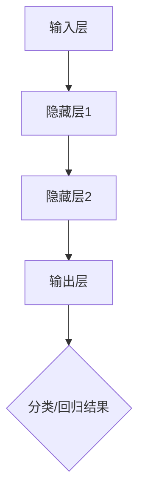

                 

### 《电商平台如何利用AI大模型进行精准营销》

> **关键词：电商平台、AI大模型、精准营销、用户行为预测、商品推荐、广告投放优化**

> **摘要：本文将深入探讨电商平台如何利用AI大模型进行精准营销。从AI大模型的基本概念与精准营销的背景入手，逐步介绍AI大模型的核心技术原理，电商平台用户数据分析与建模方法，以及AI大模型在商品推荐和广告投放优化中的应用策略。最后，通过案例分析与实践指导，总结AI大模型在电商平台精准营销中的实践与前景。**

### 《电商平台如何利用AI大模型进行精准营销》目录大纲

#### 第一部分：AI大模型与精准营销概述

##### 第1章：AI大模型概述与精准营销背景

##### 第2章：AI大模型的核心技术原理

#### 第二部分：电商平台用户数据分析与建模

##### 第3章：电商平台用户行为数据收集与处理

##### 第4章：基于AI大模型的用户行为预测

#### 第三部分：电商平台AI大模型精准营销策略

##### 第5章：AI大模型在商品推荐中的应用

##### 第6章：AI大模型在广告投放优化中的应用

##### 第7章：电商平台AI大模型精准营销案例与实践

#### 第四部分：总结与展望

##### 第8章：总结与展望

#### 附录

##### 附录A：常用AI大模型框架与工具

##### 附录B：电商平台AI大模型精准营销项目实战代码解析

##### 附录C：参考文献与拓展阅读

##### 参考文献

---

接下来，我们将逐步深入探讨每个章节的具体内容。

---

#### 第一部分：AI大模型与精准营销概述

##### 第1章：AI大模型概述与精准营销背景

**1.1 AI大模型的基本概念**

AI大模型，即大型人工智能模型，是指那些经过大规模数据训练，具有高度抽象和泛化能力的深度学习模型。它们通常由数十亿甚至数千亿个参数组成，可以处理和理解大量的数据，从而在各个领域实现前所未有的表现。

**1.2 精准营销的定义与重要性**

精准营销，是指通过精确的数据分析，深入了解目标用户的需求和偏好，从而实现高度个性化的营销活动。这种营销方式不仅能够提高转化率，还能够提升用户体验，减少无效广告支出。

**1.3 AI大模型在精准营销中的应用前景**

随着AI大模型技术的不断发展，其在精准营销中的应用前景广阔。从用户行为预测到商品推荐，再到广告投放优化，AI大模型都能提供高效且精准的解决方案，为电商平台带来显著的商业价值。

---

##### 第2章：AI大模型的核心技术原理

**2.1 深度学习基础**

**2.1.1 神经网络原理**

神经网络是深度学习的基础，它模拟了人脑神经元的工作原理，通过多层结构进行数据学习和预测。以下是神经网络的简单架构图：

**2.1.2 优化算法**

优化算法是神经网络训练过程中的核心，用于最小化损失函数，提高模型的预测准确率。常见的优化算法包括梯度下降、随机梯度下降和Adam优化器等。

**2.2 自然语言处理（NLP）技术**

**2.2.1 词嵌入**

词嵌入是将自然语言中的词汇映射为低维向量空间，以便于深度学习模型处理。Word2Vec、GloVe等算法是实现词嵌入的常用方法。

**2.2.2 序列模型与注意力机制**

序列模型如循环神经网络（RNN）和长短期记忆网络（LSTM）可以处理时间序列数据，而注意力机制可以使得模型在处理序列数据时关注到重要的部分。

**2.3 大规模预训练模型原理**

**2.3.1 预训练方法**

预训练是指在大规模数据集上先进行训练，然后针对特定任务进行微调。这种方法使得模型在未知数据上表现出色。

**2.3.2 迁移学习与微调技术**

迁移学习是将预训练模型的知识迁移到新任务上，微调则是在预训练模型的基础上进行少量的参数调整，以适应新任务。

---

接下来，我们将进一步探讨电商平台用户数据分析与建模的方法，为AI大模型在精准营销中的应用打下基础。

