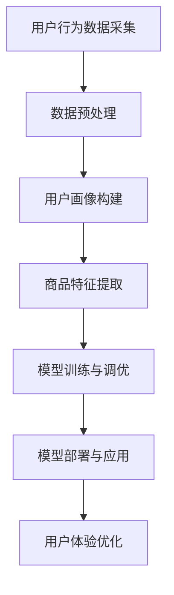

                 

# 电商平台引入AI大模型后的用户体验变革

> **关键词**：电商平台、AI大模型、用户体验、用户行为分析、商品推荐系统、个性化搜索与排序

> **摘要**：
本文旨在探讨电商平台引入AI大模型后，用户体验所经历的深刻变革。通过对AI大模型的基本概念、应用场景、核心算法原理、数学模型和项目实战的详细分析，我们将揭示AI技术在电商领域中的巨大潜力和实际应用，为电商平台的未来发展提供有价值的参考。

## 第一部分：电商平台引入AI大模型后的用户体验变革

### 第1章：变革背景与概述

#### 1.1 电商平台的演进历程

##### 1.1.1 传统电商平台的发展

传统电商平台起源于20世纪90年代末，以亚马逊、eBay和阿里巴巴等为代表，通过互联网为商家和消费者提供了一个线上交易的渠道。在这个阶段，电商平台的主要功能是商品展示、在线支付和物流配送。用户体验主要集中在网站的导航、商品信息的完整性和及时性等方面。

##### 1.1.2 用户体验的关键因素

随着互联网的普及，用户对电商平台的期望也在不断提升。用户体验（UX）成为电商平台竞争的关键因素之一。用户体验的关键因素包括：

- **易用性**：用户能否轻松地完成购买流程，界面设计是否直观。
- **响应速度**：网站加载速度和页面切换的流畅性。
- **个性化**：根据用户的兴趣和购买历史提供个性化的推荐。
- **安全性**：支付过程的安全性，数据隐私保护。

##### 1.1.3 AI大模型在电商领域的应用潜力

近年来，人工智能（AI）技术的发展为电商平台带来了新的机遇。特别是AI大模型的引入，使得电商平台能够更加精准地分析用户行为，提供个性化的服务和推荐。AI大模型在电商领域的应用潜力包括：

- **用户行为预测**：通过分析用户的历史数据，预测用户的购物行为，提高顾客留存率。
- **商品推荐**：根据用户的兴趣和行为，推荐符合其需求的商品。
- **个性化搜索与排序**：优化搜索结果，提高用户找到心仪商品的概率。

#### 1.2 AI大模型的引入

##### 1.2.1 AI大模型的基本概念

AI大模型是指具有大规模参数和深度结构的神经网络模型。这些模型通常需要大量的数据和计算资源进行训练，但它们在处理复杂数据和任务时具有强大的能力。常见的AI大模型包括深度神经网络（DNN）、卷积神经网络（CNN）、循环神经网络（RNN）和变换器（Transformer）等。

##### 1.2.2 AI大模型在电商中的应用场景

AI大模型在电商中的应用场景非常广泛，包括但不限于以下方面：

- **用户行为分析**：通过分析用户的点击、购买、评价等行为，了解用户的需求和偏好。
- **商品推荐**：根据用户的行为和偏好，推荐相关的商品。
- **个性化搜索与排序**：优化搜索结果，提高用户找到心仪商品的概率。
- **智能客服**：通过自然语言处理（NLP）技术，实现与用户的智能对话。

##### 1.2.3 引入AI大模型后的用户体验变化

引入AI大模型后，电商平台的用户体验将发生显著变化，具体体现在以下几个方面：

- **更加个性化的服务**：平台能够根据用户的行为和偏好，提供更加个性化的推荐和搜索结果。
- **更快的响应速度**：通过自动化处理，用户能够更快地获得所需信息和服务。
- **更高的安全性**：AI大模型可以帮助平台更好地保护用户的隐私和数据安全。
- **更好的购物体验**：平台能够提供更加智能的客服和购物助手，提高用户的购物满意度。

### 第2章：核心概念与架构

#### 2.1 电商平台的核心功能模块

电商平台的核心功能模块包括用户行为分析、商品推荐系统、个性化搜索与排序等。这些模块协同工作，为用户提供优质的购物体验。

##### 2.1.1 用户行为分析

用户行为分析是指通过对用户的点击、购买、评价等行为数据进行收集、处理和分析，了解用户的需求和偏好。用户行为分析主要包括以下几个步骤：

- **数据采集**：通过网站日志、点击流数据等渠道收集用户行为数据。
- **数据预处理**：对原始数据进行清洗、去噪和归一化等预处理操作。
- **特征提取**：从预处理后的数据中提取有用的特征，如用户点击次数、购买频率、评价评分等。
- **行为预测**：利用机器学习算法，对用户的行为进行预测，如购买行为预测、顾客留存率预测等。

##### 2.1.2 商品推荐系统

商品推荐系统是电商平台的核心功能之一，其主要目的是根据用户的兴趣和行为，向用户推荐相关的商品。商品推荐系统通常包括以下几种算法：

- **基于内容的推荐**：根据商品的属性和用户的历史行为，推荐具有相似属性的商品。
- **基于协同过滤的推荐**：根据用户与商品之间的相似度，推荐其他用户喜欢的商品。
- **基于模型的推荐**：利用机器学习算法，预测用户对商品的喜好，推荐符合用户偏好的商品。

##### 2.1.3 个性化搜索与排序

个性化搜索与排序是指根据用户的兴趣和行为，优化搜索结果和页面排序，提高用户找到心仪商品的概率。个性化搜索与排序主要包括以下几个步骤：

- **搜索词分析**：通过自然语言处理（NLP）技术，分析用户的搜索词，提取关键信息。
- **搜索结果优化**：根据用户的兴趣和行为，优化搜索结果的排序，提高相关性和满意度。
- **排序算法优化**：利用机器学习算法，不断优化排序算法，提高排序的准确性和效果。

#### 2.2 AI大模型在电商平台中的应用

AI大模型在电商平台中的应用包括自然语言处理（NLP）、计算机视觉（CV）和强化学习（RL）等方面。

##### 2.2.1 自然语言处理（NLP）

NLP技术在电商平台中的应用主要包括文本分类、情感分析和命名实体识别等。通过NLP技术，平台可以更好地理解用户的搜索意图和评论内容，从而提供更准确的推荐和搜索结果。

- **文本分类**：将用户的评论、搜索词等文本数据分类，如分类为正面评论、负面评论等。
- **情感分析**：分析用户的评论和反馈，判断其情感倾向，如积极、消极等。
- **命名实体识别**：识别用户评论中的商品名称、用户名等实体信息，为后续分析提供基础。

##### 2.2.2 计算机视觉（CV）

CV技术在电商平台中的应用主要包括图像识别、目标检测和图像增强等。通过CV技术，平台可以更好地理解用户的购物需求，提供更加个性化的服务。

- **图像识别**：识别用户上传的图片中的商品类别，如识别一张图片中的衣服、鞋子等。
- **目标检测**：检测用户上传的图片中的特定目标，如检测一张图片中的特定商品。
- **图像增强**：对用户上传的图片进行增强处理，提高图像质量，如去噪、增强对比度等。

##### 2.2.3 强化学习（RL）

强化学习技术在电商平台中的应用主要包括用户行为预测、商品推荐和智能客服等。通过强化学习技术，平台可以更好地适应用户的行为和需求，提供更加个性化的服务。

- **用户行为预测**：通过分析用户的历史行为，预测用户的下一步操作，如购买、浏览等。
- **商品推荐**：根据用户的行为和偏好，推荐符合用户需求的商品。
- **智能客服**：通过自然语言处理（NLP）技术，实现与用户的智能对话，提供个性化服务。

#### 2.3 Mermaid流程图：电商平台AI大模型架构

以下是一个简化的电商平台AI大模型架构的Mermaid流程图：



这个流程图展示了从用户行为数据采集到用户体验优化的整个过程。用户行为数据经过预处理后，用于构建用户画像和商品特征提取。然后，利用这些特征进行模型训练和调优，最终部署到生产环境中，为用户提供个性化的推荐和搜索服务。

## 第二部分：核心算法原理讲解

### 第3章：核心算法原理讲解

#### 3.1 用户行为分析算法

用户行为分析是电商平台AI大模型中的重要组成部分，其核心任务是通过对用户的历史行为数据进行挖掘和分析，预测用户的未来行为。以下介绍几种常见的用户行为分析算法：

##### 3.1.1 购物行为预测

购物行为预测是指利用历史购物数据，预测用户在未来的某个时间点是否会购买某个商品。购物行为预测的主要算法包括：

###### 3.1.1.1 决策树算法

决策树算法是一种基于规则的学习算法，通过构建一棵决策树，对用户的行为进行分类预测。决策树的构建过程如下：

1. **数据预处理**：对用户的历史购物数据进行预处理，包括数据清洗、特征提取等。
2. **特征选择**：选择对用户购物行为有较强预测能力的特征，如购买频率、购买时间、商品类别等。
3. **构建决策树**：利用ID3、C4.5等算法，构建一棵决策树。
4. **预测**：利用构建好的决策树，对新的用户行为数据进行预测。

决策树算法的优点是易于理解和实现，但缺点是对于复杂问题的预测效果较差。

###### 3.1.1.2 贝叶斯算法

贝叶斯算法是一种基于贝叶斯定理的概率模型，通过计算不同条件下的概率，预测用户的购物行为。贝叶斯算法的步骤如下：

1. **数据预处理**：对用户的历史购物数据进行预处理，包括数据清洗、特征提取等。
2. **特征选择**：选择对用户购物行为有较强预测能力的特征，如购买频率、购买时间、商品类别等。
3. **构建贝叶斯模型**：利用贝叶斯定理，计算不同条件下的概率，构建贝叶斯模型。
4. **预测**：利用构建好的贝叶斯模型，对新的用户行为数据进行预测。

贝叶斯算法的优点是适用于各种类型的数据，预测效果较好，但缺点是需要大量的训练数据和计算资源。

##### 3.1.2 顾客留存率预测

顾客留存率预测是指利用历史顾客数据，预测顾客在未来的某个时间点是否会继续使用平台的服务。顾客留存率预测的主要算法包括：

###### 3.1.2.1 考试机算法

考试机算法是一种基于逻辑回归的学习算法，通过构建逻辑回归模型，预测顾客的留存率。考试机算法的步骤如下：

1. **数据预处理**：对顾客的历史行为数据进行预处理，包括数据清洗、特征提取等。
2. **特征选择**：选择对顾客留存率有较强预测能力的特征，如购买频率、购买时间、评价评分等。
3. **构建逻辑回归模型**：利用历史数据，构建逻辑回归模型。
4. **预测**：利用构建好的逻辑回归模型，对新的顾客行为数据进行预测。

考试机算法的优点是易于理解和实现，预测效果较好，但缺点是对于复杂问题的预测效果较差。

###### 3.1.2.2 决策树算法

决策树算法是一种基于规则的学习算法，通过构建一棵决策树，预测顾客的留存率。决策树算法的步骤如下：

1. **数据预处理**：对顾客的历史行为数据进行预处理，包括数据清洗、特征提取等。
2. **特征选择**：选择对顾客留存率有较强预测能力的特征，如购买频率、购买时间、评价评分等。
3. **构建决策树**：利用ID3、C4.5等算法，构建一棵决策树。
4. **预测**：利用构建好的决策树，对新的顾客行为数据进行预测。

决策树算法的优点是易于理解和实现，预测效果较好，但缺点是对于复杂问题的预测效果较差。

#### 3.2 商品推荐系统算法

商品推荐系统是电商平台的重要组成部分，其目的是根据用户的兴趣和行为，向用户推荐相关的商品。商品推荐系统的主要算法包括：

##### 3.2.1 基于内容的推荐

基于内容的推荐是指根据商品的属性和用户的历史行为，推荐具有相似属性的商品。基于内容的推荐算法的步骤如下：

1. **数据预处理**：对商品和用户的历史行为数据进行预处理，包括数据清洗、特征提取等。
2. **特征选择**：选择对商品和用户行为有较强预测能力的特征，如商品类别、用户购买历史等。
3. **计算相似度**：计算商品和用户之间的相似度，常用的相似度计算方法有欧氏距离、余弦相似度等。
4. **推荐**：根据相似度计算结果，推荐相似度较高的商品。

基于内容的推荐算法的优点是易于理解和实现，但缺点是对于新商品和用户推荐效果较差。

##### 3.2.2 基于协同过滤的推荐

基于协同过滤的推荐是指根据用户和商品之间的交互行为，推荐其他用户喜欢的商品。基于协同过滤的推荐算法的步骤如下：

1. **数据预处理**：对用户和商品的历史交互数据进行预处理，包括数据清洗、特征提取等。
2. **特征选择**：选择对用户和商品交互行为有较强预测能力的特征，如用户购买历史、商品评价等。
3. **计算用户和商品之间的相似度**：计算用户和商品之间的相似度，常用的相似度计算方法有欧氏距离、余弦相似度等。
4. **推荐**：根据相似度计算结果，推荐其他用户喜欢的商品。

基于协同过滤的推荐算法的优点是推荐效果较好，但缺点是计算复杂度较高，且对于冷启动问题处理效果较差。

##### 3.2.3 基于模型的推荐算法

基于模型的推荐是指利用机器学习算法，预测用户对商品的喜好，推荐符合用户偏好的商品。基于模型的推荐算法的步骤如下：

1. **数据预处理**：对用户和商品的历史行为数据进行预处理，包括数据清洗、特征提取等。
2. **特征选择**：选择对用户和商品行为有较强预测能力的特征，如用户购买历史、商品评价等。
3. **构建推荐模型**：利用机器学习算法，如线性回归、决策树、支持向量机等，构建推荐模型。
4. **预测**：利用构建好的推荐模型，预测用户对商品的喜好，推荐符合用户偏好的商品。

基于模型的推荐算法的优点是推荐效果较好，且对于新商品和用户推荐效果较好，但缺点是计算复杂度较高，且需要大量的训练数据和计算资源。

#### 3.3 计算机视觉与NLP算法原理

计算机视觉（CV）和自然语言处理（NLP）是人工智能领域的重要分支，在电商平台的用户行为分析和商品推荐系统中发挥着重要作用。以下分别介绍CV和NLP的算法原理。

##### 3.3.1 图像识别与分类

图像识别与分类是指利用计算机视觉技术，对图像进行识别和分类。图像识别与分类的主要算法包括：

1. **卷积神经网络（CNN）**：CNN是一种用于图像识别和分类的深度学习算法，通过多层卷积和池化操作，提取图像的特征，并利用全连接层进行分类。CNN的原理如下：

   - **卷积层**：通过卷积操作，提取图像的局部特征。
   - **池化层**：通过池化操作，降低特征图的维度，减少参数数量。
   - **全连接层**：通过全连接层，将特征图映射到分类结果。

2. **循环神经网络（RNN）**：RNN是一种用于序列数据处理的人工神经网络，可以用于图像序列的识别和分类。RNN的原理如下：

   - **输入层**：接收图像序列的输入。
   - **隐藏层**：通过隐藏层对图像序列进行特征提取。
   - **输出层**：通过输出层对图像序列进行分类。

##### 3.3.2 文本分类与情感分析

文本分类与情感分析是指利用自然语言处理技术，对文本进行分类和情感分析。文本分类与情感分析的主要算法包括：

1. **朴素贝叶斯（NB）**：朴素贝叶斯是一种基于贝叶斯定理的文本分类算法，通过计算文本中词语的条件概率，预测文本的分类。NB的原理如下：

   - **数据预处理**：对文本进行预处理，包括分词、去停用词等。
   - **特征提取**：计算文本中词语的条件概率。
   - **分类**：利用条件概率，预测文本的分类。

2. **支持向量机（SVM）**：SVM是一种基于间隔最大化的文本分类算法，通过将文本映射到高维空间，寻找一个最佳的超平面，将不同类别的文本分开。SVM的原理如下：

   - **数据预处理**：对文本进行预处理，包括分词、去停用词等。
   - **特征提取**：将文本映射到高维空间。
   - **分类**：利用超平面，将不同类别的文本分开。

3. **循环神经网络（RNN）**：RNN是一种用于序列数据处理的自然语言处理算法，可以用于文本分类和情感分析。RNN的原理如下：

   - **输入层**：接收文本序列的输入。
   - **隐藏层**：通过隐藏层对文本序列进行特征提取。
   - **输出层**：通过输出层对文本序列进行分类或情感分析。

### 第4章：数学模型与公式

#### 4.1 用户行为分析数学模型

用户行为分析是电商平台AI大模型中的重要组成部分，其核心任务是通过对用户的历史行为数据进行挖掘和分析，预测用户的未来行为。以下介绍用户行为分析中的数学模型。

##### 4.1.1 用户行为序列建模

用户行为序列建模是指利用概率模型，对用户的行为序列进行建模和预测。常见的用户行为序列建模方法包括马尔可夫模型（Markov Model）和前向隐马尔可夫模型（Forward Hidden Markov Model，FHMM）。

###### 4.1.1.1 马尔可夫模型

马尔可夫模型是一种基于概率的建模方法，它假设用户的行为仅与其当前状态有关，与过去的状态无关。马尔可夫模型的主要数学公式如下：

- **状态转移概率矩阵**：
  $$
  P = \begin{bmatrix}
  p_{11} & p_{12} & \cdots & p_{1n} \\
  p_{21} & p_{22} & \cdots & p_{2n} \\
  \vdots & \vdots & \ddots & \vdots \\
  p_{m1} & p_{m2} & \cdots & p_{mn}
  \end{bmatrix}
  $$
  其中，$p_{ij}$ 表示从状态$i$转移到状态$j$的概率。

- **初始状态概率分布**：
  $$
  \pi = \begin{bmatrix}
  \pi_1 \\
  \pi_2 \\
  \vdots \\
  \pi_n
  \end{bmatrix}
  $$
  其中，$\pi_i$ 表示用户处于状态$i$的初始概率。

- **当前状态概率分布**：
  $$
  p_{t} = \pi P^t
  $$
  其中，$p_{t}$ 表示在时间$t$，用户处于每个状态的概率分布。

###### 4.1.1.2 前向隐马尔可夫模型（FHMM）

前向隐马尔可夫模型（FHMM）是对马尔可夫模型的扩展，它考虑了隐状态的影响。FHMM的主要数学公式如下：

- **状态转移概率矩阵**：
  $$
  A = \begin{bmatrix}
  a_{11} & a_{12} & \cdots & a_{1n} \\
  a_{21} & a_{22} & \cdots & a_{2n} \\
  \vdots & \vdots & \ddots & \vdots \\
  a_{m1} & a_{m2} & \cdots & a_{mn}
  \end{bmatrix}
  $$
  其中，$a_{ij}$ 表示从隐状态$i$转移到隐状态$j$的概率。

- **观测概率矩阵**：
  $$
  B = \begin{bmatrix}
  b_{11} & b_{12} & \cdots & b_{1n} \\
  b_{21} & b_{22} & \cdots & b_{2n} \\
  \vdots & \vdots & \ddots & \vdots \\
  b_{m1} & b_{m2} & \cdots & b_{mn}
  \end{bmatrix}
  $$
  其中，$b_{ij}$ 表示在隐状态$i$下，观测到状态$j$的概率。

- **初始状态概率分布**：
  $$
  \pi = \begin{bmatrix}
  \pi_1 \\
  \pi_2 \\
  \vdots \\
  \pi_n
  \end{bmatrix}
  $$
  其中，$\pi_i$ 表示用户处于隐状态$i$的初始概率。

- **前向概率分布**：
  $$
  \alpha_t(i) = \prod_{i=1}^{t} a_{i, j} \cdot b_{j, o_t}
  $$
  其中，$\alpha_t(i)$ 表示在时间$t$，用户处于隐状态$i$的前向概率。

- **当前状态概率分布**：
  $$
  p_t(i) = \frac{\alpha_t(i) \cdot \beta_t(i)}{\sum_{j=1}^{n} \alpha_t(j) \cdot \beta_t(j)}
  $$
  其中，$p_t(i)$ 表示在时间$t$，用户处于隐状态$i$的概率。

##### 4.1.2 顾客留存率预测

顾客留存率预测是指利用历史顾客数据，预测顾客在未来的某个时间点是否会继续使用平台的服务。顾客留存率预测的常见数学模型包括逻辑回归模型和决策树模型。

###### 4.1.2.1 逻辑回归模型

逻辑回归模型是一种基于概率的建模方法，通过预测顾客留存率的概率，进行分类预测。逻辑回归模型的主要数学公式如下：

- **回归系数**：
  $$
  \theta = \begin{bmatrix}
  \theta_0 \\
  \theta_1 \\
  \vdots \\
  \theta_p
  \end{bmatrix}
  $$
  其中，$\theta_0$ 表示截距项，$\theta_1, \theta_2, \ldots, \theta_p$ 表示各个特征对留存率的系数。

- **概率预测**：
  $$
  \hat{P}(Y=1|X) = \frac{1}{1 + \exp(-\theta_0 - \theta_1X_1 - \theta_2X_2 - \cdots - \theta_pX_p)}
  $$
  其中，$X$ 表示顾客的特征向量，$Y$ 表示顾客的留存状态。

###### 4.1.2.2 决策树模型

决策树模型是一种基于规则的建模方法，通过构建决策树，对顾客留存率进行分类预测。决策树模型的主要数学公式如下：

- **决策树构建**：
  $$
  \text{if } X_1 \leq \theta_1 \text{ then } \text{go to left subtree}
  $$
  $$
  \text{else if } X_1 > \theta_1 \text{ and } X_2 \leq \theta_2 \text{ then } \text{go to right subtree}
  $$
  $$
  \text{else if } X_2 > \theta_2 \text{ and } X_3 \leq \theta_3 \text{ then } \text{go to right subtree}
  $$
  $$
  \text{else } \text{make a final decision}
  $$
  其中，$X_1, X_2, \ldots, X_p$ 表示顾客的各个特征，$\theta_1, \theta_2, \ldots, \theta_p$ 表示各个特征的阈值。

### 第5章：项目实战

#### 5.1 实战一：用户行为预测系统开发

##### 5.1.1 开发环境搭建

为了开发用户行为预测系统，我们需要搭建一个适合的编程环境。以下是搭建开发环境的步骤：

1. **安装Python环境**：Python是一种广泛使用的编程语言，适用于数据分析和机器学习项目。可以从Python官方网站下载并安装Python，推荐版本为Python 3.8或以上。
2. **安装Jupyter Notebook**：Jupyter Notebook是一种交互式计算环境，方便我们在Python中进行数据分析和模型训练。可以通过pip命令安装Jupyter Notebook：
   ```
   pip install notebook
   ```
3. **安装常用库**：为了进行用户行为预测，我们需要安装一些常用的Python库，如NumPy、Pandas、Scikit-learn等。可以使用以下命令安装：
   ```
   pip install numpy pandas scikit-learn
   ```

##### 5.1.2 数据集准备

用户行为预测需要大量的数据作为训练数据。以下是准备数据集的步骤：

1. **数据来源**：可以从电商平台获取用户行为数据，如用户的点击记录、购买记录等。这些数据可以以CSV、JSON或数据库等形式存储。
2. **数据清洗**：对数据进行清洗，去除无效数据、处理缺失值、去除重复数据等。可以使用Pandas库进行数据清洗。
3. **特征提取**：根据用户行为数据，提取对用户行为有较强预测能力的特征，如用户的点击次数、购买频率、购买金额等。可以使用Pandas和NumPy库进行特征提取。
4. **数据预处理**：对提取到的特征进行预处理，如归一化、标准化等。可以使用Scikit-learn库进行数据预处理。

##### 5.1.3 模型训练与调优

在准备好数据后，我们可以利用机器学习算法进行模型训练和调优。以下是模型训练和调优的步骤：

1. **选择算法**：选择适合用户行为预测的算法，如决策树、逻辑回归、随机森林等。可以使用Scikit-learn库实现这些算法。
2. **模型训练**：利用训练数据，对选择的算法进行训练。可以使用Scikit-learn库中的fit方法进行模型训练。
3. **模型评估**：使用验证集对训练好的模型进行评估，常用的评估指标有准确率、召回率、F1值等。可以使用Scikit-learn库中的评估方法进行模型评估。
4. **模型调优**：根据模型评估结果，调整模型的参数，优化模型性能。可以使用Scikit-learn库中的GridSearchCV方法进行模型调优。

##### 5.1.4 预测结果分析

在完成模型训练和调优后，我们可以利用训练好的模型进行预测。以下是预测结果分析的步骤：

1. **预测**：使用训练好的模型，对新的用户行为数据进行预测。可以使用Scikit-learn库中的predict方法进行预测。
2. **结果分析**：对预测结果进行分析，如预测准确率、召回率等。可以根据预测结果，调整模型参数或改进算法。
3. **可视化**：使用matplotlib、seaborn等库，对预测结果进行可视化，如混淆矩阵、ROC曲线等，以更直观地展示模型性能。

#### 5.2 实战二：商品推荐系统构建

##### 5.2.1 基于内容的推荐实现

基于内容的推荐是指根据商品的属性和用户的历史行为，推荐具有相似属性的商品。以下是基于内容的推荐实现的步骤：

1. **数据准备**：准备商品和用户行为数据，包括商品的属性（如类别、品牌、价格等）和用户的历史行为（如购买记录、浏览记录等）。
2. **特征提取**：提取商品和用户行为的特征，如商品的类别、品牌、价格等。可以使用Pandas和NumPy库进行特征提取。
3. **相似度计算**：计算商品和用户之间的相似度，常用的相似度计算方法有欧氏距离、余弦相似度等。可以使用Scikit-learn库实现相似度计算。
4. **推荐**：根据相似度计算结果，为用户推荐具有相似属性的商品。可以使用排序算法，如Top-N推荐算法，推荐相似度最高的商品。

##### 5.2.2 基于协同过滤的推荐实现

基于协同过滤的推荐是指根据用户和商品之间的交互行为，推荐其他用户喜欢的商品。以下是基于协同过滤的推荐实现的步骤：

1. **数据准备**：准备用户和商品之间的交互数据，如用户购买记录、用户评分数据等。
2. **特征提取**：提取用户和商品的交互特征，如用户的购买次数、评分等。可以使用Pandas和NumPy库进行特征提取。
3. **相似度计算**：计算用户和商品之间的相似度，常用的相似度计算方法有用户相似度计算、商品相似度计算等。可以使用Scikit-learn库实现相似度计算。
4. **推荐**：根据相似度计算结果，为用户推荐其他用户喜欢的商品。可以使用Top-N推荐算法，推荐相似度最高的商品。

##### 5.2.3 混合推荐系统实现

混合推荐系统是指将基于内容的推荐和基于协同过滤的推荐相结合，以提高推荐效果。以下是混合推荐系统实现的步骤：

1. **数据准备**：准备商品和用户行为数据，以及用户和商品之间的交互数据。
2. **特征提取**：提取商品和用户行为的特征，以及用户和商品的交互特征。
3. **相似度计算**：计算商品和用户之间的相似度，以及用户和商品之间的相似度。
4. **推荐**：首先使用基于内容的推荐方法，为用户推荐具有相似属性的商品；然后使用基于协同过滤的推荐方法，为用户推荐其他用户喜欢的商品；最后将两种推荐结果进行融合，生成最终的推荐列表。

#### 5.3 实战三：个性化搜索与排序

##### 5.3.1 搜索引擎设计与实现

个性化搜索与排序是指根据用户的兴趣和行为，优化搜索结果和页面排序，以提高用户的搜索满意度。以下是搜索引擎设计与实现的步骤：

1. **数据准备**：准备用户的搜索历史数据，包括用户的搜索词、搜索结果、点击记录等。
2. **特征提取**：提取用户的搜索特征，如搜索词的频率、搜索结果的点击率等。
3. **索引构建**：构建搜索引擎的索引，包括倒排索引、全文索引等。
4. **搜索算法**：设计搜索算法，包括基于关键词的搜索、基于语义的搜索等。
5. **搜索结果排序**：根据用户的搜索特征和搜索结果的点击率，对搜索结果进行排序。

##### 5.3.2 排序算法优化

排序算法优化是指通过优化排序算法，提高搜索结果的准确性、相关性和满意度。以下是排序算法优化的步骤：

1. **特征选择**：选择对用户搜索结果有较强预测能力的特征，如搜索词的频率、搜索结果的点击率等。
2. **相似度计算**：计算用户和搜索结果之间的相似度，常用的相似度计算方法有欧氏距离、余弦相似度等。
3. **排序算法**：设计排序算法，如Top-N排序算法、基于相似度的排序算法等。
4. **性能优化**：优化排序算法的执行效率，如并行计算、缓存技术等。

## 第三部分：用户体验优化

### 第6章：用户体验优化

#### 6.1 AI大模型在用户体验优化中的应用

AI大模型在电商平台用户体验优化中扮演着至关重要的角色。通过引入AI大模型，电商平台可以在以下几个方面显著提升用户体验：

##### 6.1.1 自动化测试与性能监控

AI大模型可以帮助电商平台进行自动化测试和性能监控。通过模拟用户行为，AI大模型可以检测系统的性能瓶颈，如响应时间、加载速度等。以下是一个自动化测试的伪代码示例：

```python
def test_performance(url, expected_response_time):
    # 输入：网址，预期响应时间
    # 输出：测试结果
    start_time = get_current_time()
    response = send_request(url)
    end_time = get_current_time()
    response_time = end_time - start_time
    
    if response_time > expected_response_time:
        print("性能不佳，响应时间为：", response_time, "秒")
    else:
        print("性能良好，响应时间为：", response_time, "秒")
```

##### 6.1.2 用户反馈分析与处理

AI大模型还可以对用户的反馈进行分析和处理。通过自然语言处理（NLP）技术，AI大模型可以提取用户反馈的关键词和情感倾向，从而帮助电商平台快速响应用户需求。以下是一个情感分析的伪代码示例：

```python
def analyze_feedback(feedback):
    # 输入：用户反馈
    # 输出：情感倾向
    sentiment = get_sentiment(feedback)
    
    if sentiment == "positive":
        print("用户反馈积极")
    elif sentiment == "negative":
        print("用户反馈消极")
    else:
        print("用户反馈中性")
```

##### 6.1.3 智能客服系统

智能客服系统是AI大模型在电商平台用户体验优化中的重要应用。通过自然语言处理（NLP）和机器学习技术，智能客服系统可以模拟人类客服，为用户提供实时、准确的答案。以下是一个智能客服的伪代码示例：

```python
def chat_with_user(question):
    # 输入：用户问题
    # 输出：答案
    answer = get_answer(question)
    return answer

def get_answer(question):
    # 输入：用户问题
    # 输出：答案
    if question.startswith("如何"):
        return "您可以按照以下步骤操作：..."
    elif question.startswith("为什么"):
        return "这是因为...的原因"
    else:
        return "很抱歉，我无法理解您的问题"
```

#### 6.2 用户体验设计原则

为了确保电商平台在引入AI大模型后能够提供出色的用户体验，我们需要遵循以下用户体验设计原则：

##### 6.2.1 易用性设计

易用性设计是用户体验设计的基础。一个易用的电商平台应该具备以下特点：

- **直观的界面**：界面设计应该简洁直观，使用户能够快速找到所需功能。
- **简洁的操作流程**：操作流程应该简洁，减少用户的操作步骤，提高用户满意度。
- **清晰的指示**：在用户操作过程中，应该提供清晰的指示，帮助用户顺利完成操作。

##### 6.2.2 可访问性设计

可访问性设计确保电商平台能够为所有用户提供服务，包括残障用户和老年人。以下是一些可访问性设计的关键点：

- **兼容性**：电商平台应该兼容各种浏览器和设备，确保所有用户都能访问。
- **字体大小**：字体大小应该适中，易于阅读。
- **色彩对比**：色彩对比应该明显，有助于用户识别信息。
- **语音辅助**：提供语音辅助功能，帮助残障用户使用电商平台。

##### 6.2.3 情感化设计

情感化设计是指通过设计触动人心的元素，提升用户的情感体验。以下是一些情感化设计的关键点：

- **个性化的界面**：根据用户偏好，个性化界面设计，提高用户归属感。
- **趣味性**：在适当的地方添加趣味元素，如动画、小游戏等，提高用户参与度。
- **情感反馈**：在用户操作过程中，提供积极的情感反馈，如成功提示、错误提示等。

#### 6.3 用户体验评估方法

为了评估电商平台的用户体验，我们可以采用以下评估方法：

##### 6.3.1 量化评估方法

量化评估方法通过统计数据和指标，评估用户对电商平台的满意度。以下是一些常见的量化评估方法：

- **用户满意度调查**：通过问卷调查，了解用户对电商平台的满意度。
- **任务完成率**：测量用户完成特定任务的效率，如购买流程的完成率。
- **用户停留时间**：测量用户在电商平台上的停留时间，反映用户对电商平台的兴趣程度。

##### 6.3.2 定性评估方法

定性评估方法通过用户反馈和观察，评估用户对电商平台的体验。以下是一些常见的定性评估方法：

- **用户访谈**：与用户进行一对一访谈，了解用户的真实体验和需求。
- **用户观察**：观察用户在电商平台上的行为，了解用户在使用过程中遇到的问题和困惑。
- **可用性测试**：邀请用户进行实际操作，记录用户的操作过程和反馈，发现平台存在的问题。

## 第四部分：未来发展趋势与挑战

### 第7章：未来发展趋势与挑战

#### 7.1 电商领域AI大模型的发展趋势

随着人工智能技术的不断发展，AI大模型在电商领域的应用前景广阔。以下是电商领域AI大模型的发展趋势：

##### 7.1.1 大模型技术演进

大模型技术将继续演进，模型规模将越来越大，参数数量将达到数十亿甚至千亿级别。随着模型规模的增加，模型的计算能力和表达能力将得到显著提升，能够处理更加复杂的任务。

##### 7.1.2 多模态数据处理

多模态数据处理是指结合多种数据类型（如图像、文本、音频等）进行数据处理和分析。电商领域将逐步引入多模态数据处理技术，以提高用户行为分析和商品推荐的准确性。

##### 7.1.3 用户体验优化

用户体验优化将成为AI大模型在电商领域的重点研究方向。通过引入深度学习、强化学习等算法，电商平台将能够提供更加个性化和智能化的服务，提升用户的购物体验。

#### 7.2 挑战与对策

虽然AI大模型在电商领域具有巨大的潜力，但也面临一系列挑战。以下是一些主要挑战和对策：

##### 7.2.1 数据隐私与安全

数据隐私和安全是AI大模型应用过程中面临的主要挑战。电商平台需要确保用户数据的隐私和安全，防止数据泄露和滥用。对策包括：

- **数据加密**：对用户数据进行加密处理，确保数据在传输和存储过程中的安全性。
- **数据脱敏**：对敏感数据进行脱敏处理，保护用户隐私。
- **合规性**：遵守相关法律法规，确保数据处理符合合规要求。

##### 7.2.2 技术依赖与风险

电商平台过度依赖AI大模型可能导致技术风险。对策包括：

- **技术多元化**：引入多种技术，降低对单一技术的依赖。
- **风险评估**：定期进行技术风险评估，确保平台的稳定性和可靠性。

##### 7.2.3 跨学科合作与人才培养

AI大模型应用需要跨学科的知识和技能，包括计算机科学、数据科学、心理学等。电商平台需要加强跨学科合作，培养复合型人才。对策包括：

- **跨学科培训**：组织跨学科培训，提高员工的综合素质。
- **校企合作**：与高校和研究机构合作，共同培养AI大模型应用人才。

## 附录

### 附录A：AI大模型开发工具与资源

#### A.1 主流深度学习框架对比

在AI大模型开发过程中，选择合适的深度学习框架至关重要。以下是目前几种主流深度学习框架的对比：

##### A.1.1 TensorFlow

TensorFlow是由Google开源的深度学习框架，具有丰富的功能和强大的计算能力。TensorFlow的优点包括：

- **灵活性**：支持动态计算图，适用于各种深度学习任务。
- **生态系统**：拥有丰富的预训练模型和工具，方便模型开发和部署。
- **社区支持**：拥有庞大的开发者社区，解决问题和获取资源较为方便。

##### A.1.2 PyTorch

PyTorch是由Facebook开源的深度学习框架，以其简洁和易用性著称。PyTorch的优点包括：

- **动态计算图**：支持动态计算图，便于调试和理解。
- **自动求导**：内置自动求导机制，简化了模型的实现过程。
- **易于扩展**：支持自定义操作和模块，便于实现复杂的模型。

##### A.1.3 其他深度学习框架简介

除了TensorFlow和PyTorch，还有其他一些深度学习框架，如MXNet、Keras等。这些框架各有优缺点，适用于不同的应用场景。以下是一些简要介绍：

- **MXNet**：由Apache开源，支持多种编程语言，具有良好的性能和灵活性。
- **Keras**：基于TensorFlow和Theano，提供简洁的API，方便快速原型开发。

#### A.2 常用算法与模型资源

在AI大模型开发过程中，选择合适的算法和模型至关重要。以下是一些常用的算法和模型资源：

##### A.2.1 用户行为分析算法库

- **Scikit-learn**：提供了多种用户行为分析算法，如决策树、逻辑回归、朴素贝叶斯等。
- **MLlib**：Hadoop的机器学习库，提供了多种用户行为分析算法，如随机森林、协同过滤等。

##### A.2.2 商品推荐系统算法库

- **Surprise**：提供了多种商品推荐系统算法，如基于内容的推荐、基于协同过滤的推荐等。
- **RecBoo**：提供了多种商品推荐系统算法，包括基于模型的推荐、深度学习推荐等。

##### A.2.3 计算机视觉与NLP算法库

- **OpenCV**：提供了丰富的计算机视觉算法，如图像识别、目标检测等。
- **spaCy**：提供了强大的自然语言处理库，包括文本分类、情感分析等。

#### A.3 开发与优化技巧

在AI大模型开发过程中，掌握一些开发与优化技巧可以显著提高模型的性能和稳定性。以下是一些常见的开发与优化技巧：

##### A.3.1 模型训练技巧

- **数据预处理**：对数据集进行充分的预处理，如归一化、标准化等，以提高模型的训练效果。
- **超参数调整**：通过调整学习率、批量大小、正则化参数等超参数，优化模型性能。
- **模型融合**：结合多个模型的结果，提高预测的准确性和稳定性。

##### A.3.2 模型部署技巧

- **模型压缩**：通过模型压缩技术，降低模型的参数数量和计算量，提高部署效率。
- **分布式训练**：利用分布式训练技术，提高模型的训练速度和计算能力。
- **模型解释性**：通过模型解释性技术，提高模型的可解释性，帮助用户理解模型的工作原理。

##### A.3.4 性能优化技巧

- **GPU加速**：利用GPU加速计算，提高模型的训练速度和预测速度。
- **数据并行**：通过数据并行技术，利用多GPU或多机多卡训练模型，提高训练速度。
- **模型缓存**：利用模型缓存技术，减少模型加载时间，提高系统性能。

### 参考文献

1. Coursera. (2020). Machine Learning. Retrieved from https://www.coursera.org/learn/machine-learning
2. Andrew Ng. (2017). Deep Learning. Retrieved from https://www.deeplearning.ai/deep-learning
3. KDNuggets. (2021). Top 10 Deep Learning Projects on GitHub. Retrieved from https://www.kdnuggets.com/2021/09/top-10-deep-learning-projects-github.html
4. TensorFlow. (2021). Documentation. Retrieved from https://www.tensorflow.org/overview
5. PyTorch. (2021). Documentation. Retrieved from https://pytorch.org/docs/stable/index.html
6. Scikit-learn. (2021). Documentation. Retrieved from https://scikit-learn.org/stable/documentation.html
7. OpenCV. (2021). Documentation. Retrieved from https://opencv.org/docs/master/
8. spaCy. (2021). Documentation. Retrieved from https://spacy.io/usage/spacy-cli
9. Surprisal. (2021). Documentation. Retrieved from https://surprise.readthedocs.io/en/stable/index.html
10. RecBoo. (2021). Documentation. Retrieved from https://recbole.readthedocs.io/en/latest/index.html
11. Hadoop MLlib. (2021). Documentation. Retrieved from https://spark.apache.org/docs/latest/mllib-guide.html

## 作者

作者：AI天才研究院/AI Genius Institute & 禅与计算机程序设计艺术 /Zen And The Art of Computer Programming

