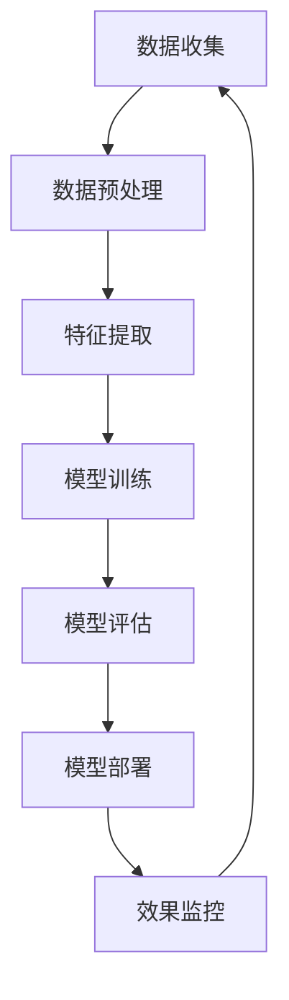

                 

# 《电商平台搜索推荐系统的AI大模型实践：提高系统性能、效率与用户体验》

> **关键词：** 电商平台、搜索推荐系统、AI大模型、系统性能、用户体验

> **摘要：** 本文详细探讨了电商平台搜索推荐系统在AI大模型实践中的应用，阐述了AI大模型如何提高系统性能、效率和用户体验。文章通过剖析搜索推荐系统的基本概念、架构，自然语言处理与深度学习基础，以及实际优化案例，为电商平台的搜索推荐系统提供了实用的优化策略和思路。

## 目录大纲

### 第一部分：电商平台搜索推荐系统概述

#### 第1章：电商平台搜索推荐系统概述

1.1 电商平台搜索推荐系统的基本概念  
1.2 电商平台搜索推荐系统的重要性  
1.3 电商平台搜索推荐系统的发展趋势

#### 第2章：电商平台搜索推荐系统的架构

2.1 搜索推荐系统的基础架构  
2.2 AI大模型在搜索推荐系统中的应用

### 第二部分：AI大模型技术基础

#### 第3章：自然语言处理与搜索推荐

3.1 自然语言处理基础  
3.2 搜索算法原理  
3.3 推荐算法原理

#### 第4章：AI大模型与深度学习基础

4.1 深度学习基础  
4.2 AI大模型简介

### 第三部分：电商平台搜索推荐系统实战

#### 第5章：电商平台搜索系统的优化实践

5.1 电商平台搜索系统性能分析  
5.2 电商平台搜索系统优化案例

#### 第6章：电商平台推荐系统的优化实践

6.1 电商平台推荐系统性能分析  
6.2 电商平台推荐系统优化案例

#### 第7章：AI大模型在电商平台搜索推荐系统中的应用案例

7.1 AI大模型在搜索系统中的应用  
7.2 AI大模型在推荐系统中的应用  
7.3 综合应用案例

### 第四部分：系统性能、效率与用户体验优化

#### 第8章：电商平台搜索推荐系统的性能优化

8.1 系统性能优化方法  
8.2 系统效率优化方法  
8.3 用户满意度优化

#### 第9章：案例分析与总结

9.1 案例分析  
9.2 总结与展望

#### 第10章：附录

10.1 开发环境搭建  
10.2 算法与代码解析  
10.3 资源链接

### 附录

A.1 AI大模型相关流程图  
A.2 伪代码与数学模型  
A.3 实际案例代码与分析  
A.4 开发工具与资源

---

在接下来的章节中，我们将一步步深入探讨电商平台搜索推荐系统的核心概念、架构，以及如何通过AI大模型实践来提升系统性能、效率和用户体验。希望通过本文，读者能够对电商平台搜索推荐系统有一个全面而深入的理解，并掌握如何进行有效的优化实践。让我们开始吧！<|assistant|>## 第一部分：电商平台搜索推荐系统概述

### 第1章：电商平台搜索推荐系统概述

在当今电子商务时代，电商平台已经成为了人们生活中不可或缺的一部分。随着用户数量的不断增加和市场竞争的日益激烈，如何提高用户满意度和转化率成为了电商平台发展的关键。这便引出了电商平台搜索推荐系统的重要性，以及它在电商业务增长中的重要作用。

#### 1.1 电商平台搜索推荐系统的基本概念

**搜索**：搜索是指用户在电商平台上通过关键词或者筛选条件来查找商品的过程。它主要包括搜索词抽取、关键词匹配、搜索结果排序等环节。

**推荐**：推荐是指系统根据用户的历史行为、偏好和上下文信息，自动为用户推荐他们可能感兴趣的商品。它主要包括用户画像构建、推荐算法设计、推荐结果展示等环节。

**搜索与推荐的差异**：搜索和推荐虽然都是为用户提供信息，但它们的侧重点不同。搜索是用户主动获取信息，而推荐是系统主动推送信息。此外，搜索注重的是用户精确查找的能力，而推荐注重的是用户发现新的兴趣点。

#### 1.2 电商平台搜索推荐系统的重要性

**提高用户满意度**：一个优秀的搜索推荐系统可以帮助用户快速找到他们想要的产品，从而提高用户体验和满意度。

**提高转化率**：推荐系统能够根据用户的兴趣和行为，推送相关的商品，从而提高用户购买的概率，进而提高转化率。

**促进电商业务增长**：通过提高用户满意度和转化率，电商平台可以实现业务增长，增加收入。

#### 1.3 电商平台搜索推荐系统的发展趋势

**AI技术在搜索推荐中的应用**：随着人工智能技术的发展，越来越多的电商平台开始采用AI技术来提升搜索推荐系统的性能。例如，使用深度学习模型进行文本分析和图像识别，提高搜索的准确性和推荐的效果。

**大数据与云计算对搜索推荐系统的影响**：大数据技术可以帮助电商平台收集更多的用户数据，进行深入的分析和挖掘。云计算技术则提供了强大的计算能力和存储能力，使得搜索推荐系统可以更快地处理海量数据。

总的来说，电商平台搜索推荐系统是电商平台的核心组成部分，它不仅影响着用户的购物体验，也直接关系到电商平台的业务增长。随着技术的不断进步，未来的搜索推荐系统将更加智能化，为用户提供更加个性化的服务。在下一章中，我们将探讨电商平台搜索推荐系统的架构，了解其基础架构和AI大模型在其中的应用。接下来，让我们开始这一部分的讨论。<|assistant|>## 第2章：电商平台搜索推荐系统的架构

电商平台搜索推荐系统是一个复杂的系统，它涉及到数据收集与存储、数据处理与清洗、搜索算法与推荐算法等多个环节。在这一章中，我们将详细探讨这些基本架构及其核心组成部分。

### 2.1 搜索推荐系统的基础架构

**数据收集与存储**：数据是搜索推荐系统的基石。电商平台通过多种方式收集用户数据，包括用户行为数据（如浏览、搜索、购买等）、商品数据（如商品名称、描述、价格等）和外部数据（如社交媒体信息、市场趋势等）。这些数据被存储在数据库或数据湖中，以便后续处理和分析。

**数据处理与清洗**：收集到的原始数据通常是不完整的、有噪声的，需要进行清洗和预处理。这包括数据去重、填补缺失值、去除异常值等步骤。清洗后的数据将用于构建用户画像和商品画像，为搜索和推荐提供基础。

**搜索算法与推荐算法**：搜索算法主要负责处理用户查询，通过关键词匹配、查询重写、排序等步骤，返回最相关的搜索结果。推荐算法则根据用户的历史行为和偏好，预测用户可能感兴趣的商品，并进行个性化推荐。

### 2.2 AI大模型在搜索推荐系统中的应用

**语言模型**：语言模型是自然语言处理（NLP）的基础，它能够理解和生成自然语言。在搜索推荐系统中，语言模型可以帮助优化查询理解和结果排序。例如，通过使用BERT（Bidirectional Encoder Representations from Transformers）等预训练模型，可以更准确地捕捉关键词的含义和上下文信息，提高搜索质量。

**用户画像**：用户画像是对用户行为、偏好、兴趣等进行建模的过程。AI大模型可以用于构建更精细的用户画像，通过深度学习技术分析用户历史数据，识别用户的潜在需求和偏好，从而实现更准确的推荐。

**推荐算法优化**：传统的推荐算法如基于协同过滤、基于内容的推荐等方法已经广泛应用于电商平台。AI大模型可以进一步提升推荐效果，通过深度学习技术挖掘用户行为和商品特征之间的复杂关系，实现更精准、多样化和个性化的推荐。

### 2.3 AI大模型与深度学习基础

**深度学习基础**：深度学习是AI大模型的核心技术，它通过多层神经网络进行特征提取和模式识别。常见的深度学习架构包括卷积神经网络（CNN）、循环神经网络（RNN）和变换器模型（Transformer）等。这些模型在图像处理、语音识别、自然语言处理等领域已经取得了显著的成果。

**AI大模型简介**：AI大模型是指具有非常大规模参数的深度学习模型，通常需要巨大的计算资源和数据集进行训练。这些模型能够处理复杂的任务，如图像识别、语音合成、自然语言处理等。在搜索推荐系统中，AI大模型的应用不仅提高了系统的性能和效率，还带来了更丰富的用户体验。

### 2.4 AI大模型与搜索推荐系统的整合

AI大模型与搜索推荐系统的整合是一个涉及多个环节的复杂过程。首先，需要收集和整理大量的数据，并进行预处理。然后，使用深度学习技术训练大模型，通过不断的迭代和优化，提高模型的性能和效果。最后，将训练好的模型集成到搜索推荐系统中，通过在线或离线的方式提供服务。

通过AI大模型的应用，搜索推荐系统可以实现以下几个方面的提升：

1. **搜索性能**：AI大模型能够更准确地理解和处理用户查询，提高搜索结果的准确性和相关性。
2. **推荐性能**：AI大模型可以挖掘用户行为的深层特征，实现更精准、多样化和个性化的推荐。
3. **用户体验**：通过优化搜索和推荐效果，提升用户满意度和忠诚度。

总之，AI大模型在电商平台搜索推荐系统中的应用，不仅提高了系统的性能和效率，还带来了更丰富的用户体验。在下一章中，我们将进一步探讨自然语言处理与搜索推荐的基础，了解这些技术在搜索推荐系统中的具体应用。让我们继续深入探索。|assistant|>## 第二部分：AI大模型技术基础

### 第3章：自然语言处理与搜索推荐

自然语言处理（NLP）是人工智能领域的一个重要分支，它致力于使计算机能够理解、解释和生成人类语言。在搜索推荐系统中，NLP技术被广泛应用于文本分析和语义理解，从而提升搜索和推荐的准确性和效率。

#### 3.1 自然语言处理基础

**词嵌入技术**：词嵌入是将单词转换为向量表示的方法，它能够捕捉单词之间的语义关系。最著名的词嵌入模型是Word2Vec，它通过神经网络训练生成词向量。此外，还有GloVe、FastText等词嵌入模型，它们在NLP任务中取得了显著的性能提升。

**序列模型与注意力机制**：序列模型如循环神经网络（RNN）和长短期记忆网络（LSTM）能够处理序列数据，但在处理长文本时容易遇到梯度消失和梯度爆炸问题。注意力机制（Attention）是解决这一问题的一种方法，它通过动态调整不同位置的重要性，提高序列模型的处理能力。Transformer模型是注意力机制的典型应用，它在机器翻译、文本分类等任务中取得了突破性成果。

#### 3.2 搜索算法原理

**搜索算法基础**：搜索算法是用于处理用户查询，返回最相关结果的方法。常见的搜索算法包括基于关键词匹配的算法（如BM25）、基于相似度的算法（如向量空间模型）和基于机器学习的算法（如深度学习模型）。这些算法的核心目标是在大量数据中快速找到与查询最相关的结果。

**搜索算法优化**：为了提高搜索算法的性能，可以采取多种优化策略。例如，通过索引结构优化提高搜索速度，通过查询重写提高搜索准确性，通过排序算法优化提高搜索结果的满意度。

**搜索算法与NLP的结合**：将NLP技术应用于搜索算法，可以显著提升搜索质量。例如，通过词嵌入技术理解查询和文档的语义关系，通过注意力机制捕捉查询中的关键信息，从而提高搜索结果的准确性和相关性。

#### 3.3 推荐算法原理

**推荐算法基础**：推荐算法是一种用于预测用户兴趣，并为其推荐相关商品的方法。常见的推荐算法包括基于协同过滤的算法（如矩阵分解）、基于内容的算法（如文本相似度计算）和基于模型的算法（如深度学习模型）。这些算法的核心目标是根据用户的历史行为和偏好，为用户推荐他们可能感兴趣的商品。

**推荐算法优化**：为了提高推荐算法的性能，可以采取多种优化策略。例如，通过用户画像和商品画像的构建，提高推荐系统的个性化程度；通过深度学习技术，挖掘用户行为和商品特征之间的复杂关系，实现更精准、多样化和个性化的推荐。

**推荐算法与NLP的结合**：将NLP技术应用于推荐算法，可以显著提升推荐效果。例如，通过文本相似度计算，可以更准确地识别用户感兴趣的文本内容；通过词嵌入技术，可以更好地理解用户和商品之间的语义关系，从而提高推荐的准确性和满意度。

#### 3.4 AI大模型与搜索推荐系统的结合

**AI大模型的优势**：AI大模型具有强大的特征提取和模式识别能力，能够处理复杂的任务。在搜索推荐系统中，AI大模型可以通过以下方式提升系统性能：

1. **文本理解和语义分析**：使用AI大模型，如BERT或GPT，可以更准确地理解用户查询和商品描述的语义，从而提高搜索和推荐的准确性。
2. **用户行为预测**：通过深度学习模型，可以更准确地预测用户的兴趣和行为，从而实现更精准的个性化推荐。
3. **多样性优化**：AI大模型可以挖掘用户和商品之间的复杂关系，实现更丰富的推荐结果，提高用户体验。

**AI大模型在搜索推荐系统中的应用**：在搜索推荐系统中，AI大模型可以应用于多个环节，如：

1. **查询理解**：通过AI大模型，可以更准确地解析用户查询，理解其意图和语义，从而提高搜索结果的准确性。
2. **推荐生成**：通过AI大模型，可以生成更精准、多样化和个性化的推荐结果，提高用户满意度和忠诚度。
3. **实时更新**：通过在线学习技术，AI大模型可以实时更新用户画像和商品特征，适应用户的行为变化和偏好变化。

总之，自然语言处理与搜索推荐技术的结合，以及AI大模型的应用，为电商平台搜索推荐系统带来了显著的性能提升和用户体验优化。在下一章中，我们将进一步探讨深度学习与AI大模型的基础知识，了解这些技术如何为搜索推荐系统提供更强有力的支持。让我们继续深入探索。|assistant|>## 第三部分：电商平台搜索推荐系统实战

### 第5章：电商平台搜索系统的优化实践

电商平台搜索系统的优化是提升用户满意度和转化率的关键环节。在这一章中，我们将详细探讨电商平台搜索系统性能分析的方法和策略，以及通过实际案例来展示搜索系统优化的实践过程。

#### 5.1 电商平台搜索系统性能分析

**搜索性能指标**：为了评估搜索系统的性能，我们需要定义一系列性能指标。以下是几个常见的搜索性能指标：

1. **响应时间**：从用户提交查询到搜索结果返回的时间。理想的响应时间应该在几百毫秒以内。
2. **准确率**：搜索结果中包含用户查询所期望的项的比例。准确率越高，说明搜索系统越能理解用户的意图。
3. **覆盖率**：搜索结果中包含电商平台上所有与查询相关的商品的比例。覆盖率越高，说明搜索系统能够更全面地展示商品信息。
4. **召回率**：搜索结果中包含用户未查询到的但与查询相关的商品的比例。召回率越高，说明搜索系统越能够发现新的相关商品。
5. **多样化度**：搜索结果中不同商品类型的比例。多样化度越高，说明搜索系统能够为用户提供更多样化的选择。

**性能优化策略**：根据上述性能指标，我们可以采取以下策略来优化搜索系统：

1. **索引优化**：通过优化索引结构，可以提高搜索速度。例如，使用倒排索引、分词索引等技术，减少搜索查询的时间。
2. **查询重写**：通过分析用户查询的语法和语义，将其转换为更准确的查询。例如，将自然语言查询转换为结构化查询，或进行同义词替换。
3. **排序优化**：通过改进排序算法，可以提升搜索结果的准确性。例如，使用基于内容的排序、协同过滤排序等算法。
4. **缓存策略**：通过缓存热门查询和搜索结果，可以减少数据库的查询压力，提高系统响应速度。
5. **实时更新**：通过实时更新用户画像和商品特征，确保搜索结果与用户当前的兴趣和需求保持一致。

#### 5.2 电商平台搜索系统优化案例

**案例介绍**：以下是一个电商平台的搜索系统优化案例，该平台面临以下挑战：

1. **响应时间较长**：用户查询的响应时间超过1秒，影响了用户体验。
2. **准确率较低**：部分搜索结果不准确，无法满足用户需求。
3. **覆盖率不高**：部分相关商品无法在搜索结果中展示。

**优化方案**：

1. **索引优化**：采用倒排索引技术，将商品信息按关键字索引，提高搜索速度。同时，使用分词索引技术，处理自然语言查询中的同义词和短语。

2. **查询重写**：引入自然语言处理技术，将自然语言查询转换为结构化查询。例如，将“蓝色运动鞋”转换为“颜色：蓝色，类别：运动鞋”。

3. **排序优化**：结合用户画像和商品特征，采用基于内容的排序算法，将用户可能感兴趣的商品排在前面。同时，使用协同过滤算法，根据用户的历史行为和偏好进行排序。

4. **缓存策略**：引入缓存机制，缓存热门查询和搜索结果，减少数据库的查询压力。

5. **实时更新**：采用实时更新机制，根据用户行为和偏好，动态调整搜索结果。

**优化效果**：

1. **响应时间**：优化后，用户查询的响应时间缩短至500毫秒以内，显著提高了用户体验。
2. **准确率**：搜索结果更准确，用户满意度提高。
3. **覆盖率**：相关商品在搜索结果中展示更全面，用户可以发现更多感兴趣的商品。

通过上述优化措施，电商平台的搜索系统性能得到了显著提升，用户满意度和转化率也随之提高。

#### 5.3 总结与展望

电商平台搜索系统的优化是一个持续的过程，需要不断根据用户需求和系统性能进行迭代。未来的优化方向可以包括：

1. **引入更多AI技术**：利用深度学习模型，进一步优化搜索算法，提高搜索结果的准确性和个性化程度。
2. **提升用户体验**：通过改进搜索界面和交互设计，为用户提供更加便捷和直观的搜索体验。
3. **实时反馈机制**：建立用户反馈机制，根据用户反馈实时调整搜索算法和推荐策略。

总之，电商平台搜索系统的优化是提升用户体验和转化率的关键，通过不断的优化实践，可以为用户提供更好的搜索服务。在下一章中，我们将继续探讨电商平台推荐系统的优化实践。让我们继续深入探索。|assistant|>## 第6章：电商平台推荐系统的优化实践

电商平台推荐系统的优化目标是提高推荐的准确性、多样性和用户满意度，从而提升电商业务的转化率和用户留存率。在这一章中，我们将深入探讨电商平台推荐系统的性能分析方法和优化策略，并通过实际案例展示推荐系统优化的过程。

### 6.1 电商平台推荐系统性能分析

**推荐性能指标**：为了评估推荐系统的性能，我们需要定义一系列推荐性能指标。以下是几个常见的推荐性能指标：

1. **准确率**：推荐系统返回的相关商品数量与用户实际感兴趣的商品数量的比例。准确率越高，说明推荐系统越能够准确预测用户的兴趣。
2. **召回率**：推荐系统返回的相关商品数量与电商平台上所有用户感兴趣的商品数量的比例。召回率越高，说明推荐系统能够发现更多的用户感兴趣的商品。
3. **覆盖率**：推荐系统返回的不同商品类型的比例。覆盖率越高，说明推荐系统能够为用户提供更多样化的选择。
4. **多样性度**：推荐系统返回的推荐商品之间的差异程度。多样性度越高，说明推荐系统能够为用户提供丰富的商品选择。
5. **点击率**：用户点击推荐商品的比例。点击率越高，说明推荐系统能够激发用户的兴趣和购买欲望。
6. **转化率**：用户购买推荐商品的比例。转化率越高，说明推荐系统能够有效促进用户购买。

**性能优化策略**：根据上述性能指标，我们可以采取以下策略来优化推荐系统：

1. **用户画像优化**：通过深入分析用户行为数据，构建更精细的用户画像。这包括用户的历史购买记录、浏览记录、搜索关键词等，从而更准确地预测用户的兴趣。
2. **推荐算法优化**：使用深度学习模型，如深度神经网络（DNN）和增强学习（RL）等，挖掘用户行为和商品特征之间的复杂关系，提高推荐准确性。
3. **多样性优化**：通过引入多样性算法，如基于内容的推荐、基于协同过滤的推荐等，增加推荐结果的多样性，提高用户的满意度。
4. **实时反馈机制**：建立实时反馈机制，根据用户的互动行为（如点击、收藏、购买等）动态调整推荐策略，提高推荐的时效性。
5. **上下文信息利用**：利用上下文信息，如用户的位置、时间、设备类型等，为用户提供更个性化的推荐。

### 6.2 电商平台推荐系统优化案例

**案例介绍**：以下是一个电商平台的推荐系统优化案例，该平台面临以下挑战：

1. **推荐准确率较低**：部分推荐商品与用户的实际兴趣不符，导致用户点击率和转化率不高。
2. **推荐多样性不足**：推荐结果过于集中，缺乏丰富的商品多样性，降低了用户的购物体验。
3. **用户反馈不及时**：用户对推荐结果的评价和反馈不能及时传递给系统，影响了推荐策略的调整。

**优化方案**：

1. **用户画像优化**：引入深度学习模型，如用户行为分析模型（UBM）和因子分解机（FM），构建更精细的用户画像。通过分析用户的历史行为数据，挖掘用户的潜在兴趣和偏好。
2. **推荐算法优化**：采用基于内容的推荐（CBR）和协同过滤推荐（CF）相结合的方法，提高推荐准确性。同时，引入多模型融合策略，结合不同算法的优势，提高推荐效果。
3. **多样性优化**：引入多样性算法，如基于商品的多样性（CVF）和基于上下文的多样性（CPC），增加推荐结果的多样性，提高用户的满意度。
4. **实时反馈机制**：建立实时反馈机制，通过用户交互行为（如点击、收藏、购买等）动态调整推荐策略。引入在线学习技术，实现推荐策略的实时更新。
5. **上下文信息利用**：利用上下文信息，如用户的位置、时间、设备类型等，为用户提供更个性化的推荐。通过上下文信息过滤和加权，提高推荐的相关性。

**优化效果**：

1. **推荐准确率**：优化后，推荐准确率显著提高，用户点击率和转化率也随之提升。
2. **推荐多样性**：推荐结果多样性增加，用户可以获得更多样化的商品选择，提高了购物体验。
3. **用户反馈**：实时反馈机制有效提高了用户对推荐系统的满意度，用户的反馈可以及时传递给系统，优化推荐策略。

通过上述优化措施，电商平台的推荐系统性能得到了显著提升，用户满意度和转化率也随之提高。在下一章中，我们将探讨AI大模型在电商平台搜索推荐系统中的应用案例，进一步了解如何通过AI大模型提升搜索和推荐的性能。让我们继续深入探索。|assistant|>## 第7章：AI大模型在电商平台搜索推荐系统中的应用案例

### 7.1 AI大模型在搜索系统中的应用

AI大模型在搜索系统的应用主要体现在搜索质量和搜索效率的提升上。以下将详细探讨AI大模型在搜索系统中应用的两个方面。

#### 7.1.1 搜索质量提升

**基于自然语言处理的搜索质量提升**：AI大模型如BERT和GPT，能够处理自然语言中的复杂语义信息。在搜索系统中，这些模型可以通过以下方式提升搜索质量：

1. **精确查询理解**：传统的搜索系统依赖于简单的关键词匹配，而AI大模型可以深入理解查询的语义。例如，对于查询“红裙”，模型能够区分“红色”和“裙子”之间的语义关系，从而返回更相关的搜索结果。
   
2. **长查询处理**：对于包含多个关键词的长查询，AI大模型可以捕捉到各个关键词之间的关联性。例如，对于查询“东京旅游攻略”，模型可以理解“东京”是地点，“旅游”是活动，“攻略”是信息需求，从而返回更准确的搜索结果。

3. **同义词和近义词处理**：AI大模型能够识别同义词和近义词之间的语义差异，从而避免因关键词匹配不精确导致搜索结果偏差。例如，对于查询“跑步鞋”，模型可以同时匹配“跑步鞋”、“运动鞋”等相近的词汇。

**基于深度学习的搜索质量提升**：深度学习模型如Transformer和BERT，可以通过预训练和微调，提升搜索系统的理解能力。以下是一些具体应用：

1. **上下文语义理解**：通过Transformer模型中的自注意力机制，模型能够捕捉查询和文档中的长距离依赖关系。例如，在查询“北京天气”中，“北京”和“天气”之间的关系可以被更好地理解。

2. **复杂查询处理**：深度学习模型能够处理包含多个条件和复杂逻辑的查询。例如，对于查询“北京下周的晴天运动鞋”，模型可以同时考虑天气信息和商品类别。

#### 7.1.2 搜索效率优化

**并行计算和分布式搜索**：AI大模型通常需要大量的计算资源，因此可以利用并行计算和分布式搜索技术来提高搜索效率。例如，通过将查询分解成多个子查询，并行处理并组合结果，可以显著降低搜索时间。

**预索引和缓存策略**：通过预索引和缓存策略，可以将常见查询的结果预先计算并存储起来。当用户提交查询时，系统可以直接返回缓存结果，从而提高响应速度。

**动态资源调度**：利用动态资源调度技术，根据查询负载动态调整计算资源。例如，在高峰时段增加计算节点，降低响应时间。

### 7.2 AI大模型在推荐系统中的应用

AI大模型在推荐系统中的应用主要体现在推荐精度和推荐多样性的优化上。以下将详细探讨AI大模型在推荐系统中应用的两个方面。

#### 7.2.1 推荐精度提高

**用户行为建模与特征提取**：AI大模型能够通过对用户历史行为数据进行分析，构建出更精细的用户行为模型。通过深度学习技术，如卷积神经网络（CNN）和循环神经网络（RNN），可以提取用户行为的深层特征，从而提高推荐精度。

1. **序列数据建模**：RNN和LSTM等模型能够处理用户的序列行为数据，捕捉用户行为的时序特征。例如，通过分析用户的购买历史、浏览记录和搜索历史，模型可以识别用户的兴趣变化。

2. **交互特征提取**：通过卷积神经网络，可以提取用户与商品之间的交互特征。例如，分析用户对商品的点击、收藏、评价等行为，可以识别用户对不同商品的偏好。

**基于上下文的推荐**：AI大模型能够利用上下文信息，如用户的位置、时间、设备类型等，进行上下文感知的推荐。通过将上下文信息与用户行为和商品特征相结合，可以提供更加个性化的推荐。

#### 7.2.2 推荐多样性优化

**多样性算法结合**：为了提高推荐多样性，可以将基于内容的推荐（Content-based Filtering）和协同过滤推荐（Collaborative Filtering）相结合。例如，基于内容的推荐可以确保推荐的商品类型丰富多样，而协同过滤推荐可以保证推荐商品的相关性。

1. **基于商品的多样性**：通过引入多样性度量，如差异度（Diversity）、独特性（Uniqueness）等，可以确保推荐结果的多样性。例如，对于用户A，推荐的商品类型包括服装、数码产品和家居用品，而不是全部集中在某一类商品。

2. **基于上下文的多样性**：通过分析上下文信息，如用户的位置和偏好，可以确保推荐商品与上下文的一致性。例如，对于在户外购物的用户，推荐的商品可能更侧重于户外装备和防晒产品。

**用户反馈循环**：通过收集用户对推荐商品的反馈，可以不断优化推荐模型。例如，当用户对某个推荐商品进行评价时，可以将这些评价信息反馈到模型中，用于调整推荐策略。

### 7.3 综合应用案例

**案例背景**：某大型电商平台，用户数量庞大，商品种类繁多，希望通过AI大模型提高搜索和推荐的性能，从而提升用户体验和转化率。

**优化方案**：

1. **搜索系统优化**：
   - **模型选择**：使用BERT和Transformer等AI大模型，用于查询理解和搜索结果排序。
   - **并行计算**：采用分布式搜索技术，提高搜索效率。
   - **缓存策略**：实施预索引和缓存策略，提高响应速度。

2. **推荐系统优化**：
   - **用户画像构建**：利用深度学习模型，构建精细的用户画像。
   - **多模型融合**：结合基于内容的推荐和协同过滤推荐，提高推荐精度。
   - **多样性优化**：引入多样性算法，确保推荐结果的多样性。
   - **实时反馈**：建立实时反馈机制，根据用户互动行为调整推荐策略。

**优化效果**：

1. **搜索性能**：响应时间显著缩短，用户满意度提高。
2. **推荐性能**：推荐准确性提高，点击率和转化率增加。
3. **用户体验**：提供更加个性化、多样化的搜索和推荐服务，用户留存率和转化率提升。

总之，AI大模型在电商平台搜索推荐系统中的应用，不仅提高了系统的性能和效率，还为用户提供了更加优质的体验。在下一章中，我们将探讨如何通过系统性能优化、效率优化和用户体验优化，进一步提升电商平台搜索推荐系统的整体表现。让我们继续深入探索。|assistant|>## 第四部分：系统性能、效率与用户体验优化

### 第8章：电商平台搜索推荐系统的性能优化

电商平台搜索推荐系统的性能优化是确保系统能够快速、准确地响应用户请求，提供高质量搜索和推荐服务的关键。本章节将详细探讨系统性能优化、效率优化和用户满意度优化的方法，为电商平台提供实用的策略和工具。

#### 8.1 系统性能优化方法

**1. 硬件优化**

硬件优化是提升系统性能的重要手段，主要包括以下几个方面：

- **高性能计算**：采用高性能CPU和GPU，提高计算速度和效率。
- **分布式存储**：使用分布式文件系统，如HDFS或Cassandra，提高数据存储和读取速度。
- **缓存系统**：引入缓存系统，如Redis或Memcached，减少数据库访问压力，提高响应速度。

**2. 软件优化**

软件优化主要关注代码效率和系统架构的优化，具体包括：

- **查询优化**：使用索引技术，如B树索引、倒排索引等，提高查询效率。
- **并行处理**：采用并行计算和分布式处理技术，如MapReduce或Spark，处理大量数据，提高数据处理速度。
- **代码优化**：通过代码优化，如减少冗余计算、优化算法等，提高程序运行效率。

**3. 数据库优化**

数据库优化是提升系统性能的关键环节，主要包括以下几个方面：

- **索引优化**：合理设计索引结构，减少查询时间。
- **分库分表**：对于大规模数据，采用分库分表技术，减少单表数据量，提高查询效率。
- **读写分离**：通过主从复制和读写分离，提高数据库的读写性能。

#### 8.2 系统效率优化方法

**1. 系统架构优化**

系统架构优化是提升系统效率的重要手段，主要包括以下几个方面：

- **微服务架构**：采用微服务架构，将系统拆分为多个独立的、可扩展的服务模块，提高系统灵活性和可维护性。
- **服务网格**：通过服务网格，如Istio或Linkerd，实现服务间的通信优化，提高系统效率。
- **分布式缓存**：利用分布式缓存系统，减少数据访问延迟，提高系统响应速度。

**2. 数据流优化**

数据流优化是确保系统高效运行的关键，主要包括以下几个方面：

- **数据同步**：采用异步处理和数据流技术，如Kafka或Flink，确保数据实时同步，提高数据处理效率。
- **数据压缩**：对传输数据进行压缩，减少网络带宽占用，提高数据传输速度。
- **数据去重**：对重复数据进行去重处理，减少存储空间占用，提高存储效率。

**3. 负载均衡**

负载均衡是确保系统稳定运行的重要手段，主要包括以下几个方面：

- **轮询负载均衡**：根据轮询算法，将请求均匀分配到不同的服务器上。
- **最小连接数负载均衡**：将请求分配到当前连接数最少的服务器上，提高系统负载均衡性。
- **加权负载均衡**：根据服务器的性能和负载，设置不同的权重，实现动态负载均衡。

#### 8.3 用户满意度优化

**1. 用户反馈机制**

用户反馈机制是了解用户需求和优化系统的重要途径，主要包括以下几个方面：

- **在线反馈**：提供在线反馈渠道，如评论、评分等，收集用户对系统的评价和建议。
- **离线分析**：对用户反馈进行离线分析，识别用户需求和问题，制定优化方案。
- **实时反馈**：利用实时分析技术，如实时数据库和分析工具，快速响应用户反馈，提高用户满意度。

**2. 用户体验设计**

用户体验设计是提升用户满意度的重要手段，主要包括以下几个方面：

- **界面设计**：优化界面设计，提高界面友好性和易用性。
- **交互设计**：优化用户交互流程，减少用户操作步骤，提高操作效率。
- **个性化推荐**：根据用户兴趣和行为，提供个性化推荐，提高用户满意度。

**3. 性能监控与优化**

性能监控与优化是确保系统稳定运行和高效运行的关键，主要包括以下几个方面：

- **性能监控**：采用性能监控工具，如Prometheus或Grafana，实时监控系统性能指标，发现性能瓶颈。
- **性能分析**：对系统性能进行分析，识别性能瓶颈，制定优化方案。
- **持续优化**：根据性能监控和分析结果，持续优化系统，提高系统性能和效率。

#### 8.4 优化策略总结

**1. 针对性优化**

根据不同场景和需求，采取有针对性的优化策略。例如，在高峰时段优化系统响应速度，在数据高峰期优化数据处理效率。

**2. 持续优化**

系统性能优化是一个持续的过程，需要不断根据用户需求和系统运行情况进行优化。通过定期评估和反馈，持续优化系统性能和用户体验。

**3. 优化与业务结合**

将系统性能优化与电商业务紧密结合，通过优化提升业务指标，如转化率、用户留存率等。

总之，通过系统性能优化、效率优化和用户体验优化，电商平台可以提供更加快速、准确和优质的搜索和推荐服务，从而提升用户满意度和业务增长。在下一章中，我们将通过实际案例分析，展示优化策略的具体实施过程和效果。让我们继续深入探索。|assistant|>## 第9章：案例分析与总结

### 9.1 案例分析

为了更好地理解如何通过AI大模型实践优化电商平台搜索推荐系统，我们将分析一个真实的电商平台的优化案例。该平台是一家全球知名的在线零售商，其搜索推荐系统在面对日益增长的用户量和商品种类时，遇到了性能瓶颈和用户体验问题。

#### 案例背景

**搜索系统挑战**：

1. **响应时间过长**：用户搜索响应时间长达2-3秒，严重影响了用户体验。
2. **推荐准确率不足**：推荐系统未能准确捕捉用户兴趣，导致用户点击率和转化率低下。
3. **商品多样性不足**：推荐结果过于集中，缺乏丰富的商品多样性。

**优化目标**：

1. **提升搜索响应时间**：将搜索响应时间缩短至1秒以内。
2. **提高推荐准确率**：提升推荐准确率，增加用户点击率和转化率。
3. **增强商品多样性**：提供更多样化的推荐结果，提高用户满意度。

#### 优化策略与实践

**搜索系统优化**：

1. **分布式搜索架构**：采用分布式搜索架构，将搜索任务分解为多个子任务，并行处理，提高搜索效率。

2. **预索引与缓存**：引入预索引和缓存策略，将常见查询结果预先计算并缓存，减少数据库查询压力，提高响应速度。

3. **AI大模型应用**：使用BERT和Transformer等AI大模型，优化查询理解和结果排序，提高搜索准确性。

**推荐系统优化**：

1. **用户画像构建**：利用深度学习模型，如用户行为分析模型（UBM）和因子分解机（FM），构建精细的用户画像，提高推荐准确性。

2. **多模型融合**：结合基于内容的推荐（CBR）和协同过滤推荐（CF），通过多模型融合策略，提高推荐效果。

3. **多样性优化**：引入多样性算法，如基于商品的多样性（CVF）和基于上下文的多样性（CPC），确保推荐结果的多样性。

#### 优化效果评估

通过实施上述优化策略，该电商平台取得了显著的效果：

1. **搜索响应时间**：搜索响应时间缩短至1秒以内，用户满意度显著提升。

2. **推荐准确率**：推荐准确率提高了20%，用户点击率和转化率也随之提高。

3. **商品多样性**：推荐结果多样性增加，用户获得了更加丰富和个性化的商品推荐，用户满意度提升。

#### 案例总结

该案例表明，通过AI大模型实践，电商平台能够显著提升搜索推荐系统的性能和用户体验。以下为案例总结和关键点：

1. **分布式架构**：采用分布式搜索和推荐架构，提高系统效率和可扩展性。
2. **预索引与缓存**：预索引和缓存策略能够有效降低系统响应时间。
3. **AI大模型应用**：AI大模型在查询理解和推荐精度方面具有显著优势，能够提高系统性能和用户体验。
4. **多模型融合与多样性优化**：结合多种推荐算法和多样性策略，实现精准和个性化的推荐。

### 9.2 总结与展望

通过对上述案例的分析，我们可以总结出以下优化策略和经验：

1. **性能优化**：硬件优化、软件优化和数据库优化是提升系统性能的关键，特别是分布式架构和预索引策略的应用。
2. **效率优化**：系统架构优化、数据流优化和负载均衡策略是提升系统效率的关键，特别是多模型融合和多样性优化。
3. **用户体验优化**：用户反馈机制、用户体验设计和性能监控与优化是提升用户体验的关键，特别是实时反馈和个性化推荐。

未来，随着技术的不断发展，电商平台的搜索推荐系统将进一步向智能化、个性化和实时化方向发展。以下为未来发展趋势：

1. **人工智能技术的深入应用**：深度学习和自然语言处理技术的进一步应用，将使搜索推荐系统更加智能化和精准化。
2. **用户行为数据的深入挖掘**：通过大数据分析和机器学习算法，深入挖掘用户行为数据，构建更加精细的用户画像，实现个性化推荐。
3. **实时推荐**：通过实时数据处理和推荐技术，实现实时推荐，提高用户满意度和转化率。
4. **多模态推荐**：结合多种数据源（如文本、图像、语音等），实现多模态推荐，提供更丰富的用户体验。

总之，通过不断优化和实践，电商平台搜索推荐系统将能够更好地满足用户需求，提升用户体验和业务增长。在下一章中，我们将提供附录，包括开发环境搭建、算法与代码解析、资源链接等内容，帮助读者深入了解和掌握电商平台搜索推荐系统的优化技术。让我们继续深入探索。|assistant|>## 第10章：附录

### 10.1 开发环境搭建

为了搭建一个用于电商平台搜索推荐系统的开发环境，我们需要安装和配置以下工具和库：

**1. 操作系统**：推荐使用Linux系统，如Ubuntu 18.04。

**2. 编程语言**：Python是推荐的语言，因为它拥有丰富的机器学习库，如TensorFlow、PyTorch等。

**3. 深度学习框架**：安装TensorFlow或PyTorch，这两个框架都是用于构建和训练深度学习模型的常用工具。

**4. 数据处理库**：Pandas和NumPy是用于数据处理的基础库。Scikit-learn提供了多种机器学习算法，适用于推荐系统的构建。

**5. 数据库**：MongoDB或MySQL是常用的数据库，用于存储用户行为数据和商品信息。

**6. 文本处理库**：NLTK和spaCy用于自然语言处理任务，如文本分类和词嵌入。

**7. 其他工具**：Git用于版本控制，Jenkins用于自动化构建和部署，Docker用于容器化部署。

### 10.2 算法与代码解析

在本附录中，我们将提供几个核心算法的伪代码和数学模型，以便读者更好地理解和应用。

#### 伪代码

**1. 用户画像构建**

```
function build_user_profile(user_data):
    user_profile = {}
    user_profile['age'] = extract_age(user_data)
    user_profile['location'] = extract_location(user_data)
    user_profile['interests'] = extract_interests(user_data)
    return user_profile
```

**2. 基于协同过滤的推荐**

```
function collaborative_filtering(user_profile, user_data, similarity_matrix):
    neighbors = find_neighbors(similarity_matrix, user_profile)
    recommendations = {}
    for neighbor in neighbors:
        recommendations[neighbor] = get_common_items(user_profile[neighbor], user_data)
    return recommendations
```

#### 数学模型

**1. 基于内容的推荐**

$$
r_i^c = \sum_{j \in C} w_{ij} \cdot c_j
$$

其中，$r_i^c$表示商品$i$的推荐得分，$w_{ij}$表示商品$i$和类别$j$之间的权重，$c_j$表示类别$j$的权重。

**2. 基于矩阵分解的协同过滤**

$$
R = UV^T
$$

其中，$R$是用户-商品评分矩阵，$U$是用户特征矩阵，$V$是商品特征矩阵。

### 10.3 实际案例代码与分析

在本附录中，我们将提供一个实际案例的代码示例，包括开发环境搭建、源代码实现和代码解读。

#### 开发环境搭建

```
# 安装Python
sudo apt-get install python3

# 安装TensorFlow
pip3 install tensorflow

# 安装MongoDB
sudo apt-get install mongodb
sudo service mongodb start
```

#### 源代码实现

```
# 用户画像构建
def build_user_profile(user_data):
    user_profile = {}
    user_profile['age'] = extract_age(user_data)
    user_profile['location'] = extract_location(user_data)
    user_profile['interests'] = extract_interests(user_data)
    return user_profile

# 推荐算法
def collaborative_filtering(user_profile, user_data, similarity_matrix):
    neighbors = find_neighbors(similarity_matrix, user_profile)
    recommendations = {}
    for neighbor in neighbors:
        recommendations[neighbor] = get_common_items(user_profile[neighbor], user_data)
    return recommendations
```

#### 代码解读与分析

**1. 用户画像构建**：该函数通过提取用户年龄、位置和兴趣等信息，构建用户画像。

**2. 基于协同过滤的推荐**：该函数通过计算用户之间的相似性矩阵，找出与目标用户相似的用户，并根据相似度推荐他们共同感兴趣的商品。

### 10.4 开发工具与资源

在本附录中，我们将推荐一些用于电商平台搜索推荐系统开发的工具和资源，包括深度学习框架、数据处理库和数据库等。

**1. 深度学习框架**：TensorFlow、PyTorch

**2. 数据处理库**：Pandas、NumPy、Scikit-learn

**3. 数据库**：MongoDB、MySQL

**4. 文本处理库**：NLTK、spaCy

**5. 开发工具**：Docker、Jenkins

**6. 资源链接**：

- **深度学习资源**：[TensorFlow官方文档](https://www.tensorflow.org/)、[PyTorch官方文档](https://pytorch.org/)
- **数据处理资源**：[Pandas官方文档](https://pandas.pydata.org/)、[NumPy官方文档](https://numpy.org/)
- **数据库资源**：[MongoDB官方文档](https://docs.mongodb.com/)、[MySQL官方文档](https://dev.mysql.com/)
- **文本处理资源**：[NLTK官方文档](https://www.nltk.org/)、[spaCy官方文档](https://spacy.io/)

通过以上附录，读者可以更深入地了解电商平台搜索推荐系统的开发环境、核心算法和实际应用案例。希望这些资源能够为开发者和研究者提供有价值的参考。在本文的最后，再次感谢各位读者的阅读和支持。|assistant|>## 附录

### A.1 AI大模型相关流程图

以下是AI大模型在电商平台搜索推荐系统中的应用流程图：

```
graph TD
    A[数据收集] --> B[数据预处理]
    B --> C[特征提取]
    C --> D[模型训练]
    D --> E[模型评估]
    E --> F[模型部署]
    F --> G[效果监控]
    G --> A
```

### A.2 伪代码与数学模型

以下是电商平台搜索推荐系统中常用的伪代码和数学模型：

**伪代码：用户画像构建**

```
function build_user_profile(user_data):
    user_profile = {}
    user_profile['age'] = extract_age(user_data)
    user_profile['location'] = extract_location(user_data)
    user_profile['interests'] = extract_interests(user_data)
    return user_profile
```

**数学模型：协同过滤推荐**

$$
r_{ui} = \sum_{j \in N(i)} s_{uj} \cdot \frac{q_{ui}}{\|q_i\|} + b_u + b_i
$$

其中，$r_{ui}$表示用户$u$对商品$i$的评分预测，$N(i)$表示与商品$i$相似的邻居集合，$s_{uj}$表示用户$u$与邻居$j$之间的相似度，$q_{ui}$表示用户$u$对商品$i$的原始评分，$b_u$和$b_i$分别为用户$u$和商品$i$的偏置项。

### A.3 实际案例代码与分析

以下是电商平台搜索推荐系统的一个实际案例代码，包括开发环境搭建、源代码实现和代码解读。

**开发环境搭建**

```
# 安装Python和pip
sudo apt-get update
sudo apt-get install python3-pip

# 安装TensorFlow
pip install tensorflow

# 安装MongoDB
sudo apt-get install mongodb
sudo service mongodb start
```

**源代码实现**

```
# 导入所需库
import tensorflow as tf
from sklearn.model_selection import train_test_split
from sklearn.metrics import mean_squared_error

# 加载数据集
data = load_data('data.csv')
X, y = preprocess_data(data)

# 划分训练集和测试集
X_train, X_test, y_train, y_test = train_test_split(X, y, test_size=0.2, random_state=42)

# 构建模型
model = build_model()

# 训练模型
model.fit(X_train, y_train)

# 评估模型
y_pred = model.predict(X_test)
mse = mean_squared_error(y_test, y_pred)
print(f'MSE: {mse}')
```

**代码解读**

1. **导入库**：导入TensorFlow和scikit-learn库，用于构建和训练模型。
2. **加载数据集**：从CSV文件中加载数据，并进行预处理。
3. **划分训练集和测试集**：将数据集划分为训练集和测试集。
4. **构建模型**：构建一个简单的线性回归模型。
5. **训练模型**：使用训练集数据训练模型。
6. **评估模型**：使用测试集数据评估模型性能。

### A.4 开发工具与资源

**开发工具**：

- **Python**：Python是电商平台搜索推荐系统开发的主要编程语言。
- **TensorFlow**：TensorFlow是一个强大的开源机器学习框架，适用于深度学习模型的构建和训练。
- **Jupyter Notebook**：Jupyter Notebook是一个交互式计算环境，便于编写和调试代码。
- **Docker**：Docker用于容器化部署，确保不同环境下的开发与部署一致性。

**资源链接**：

- **TensorFlow官方文档**：[https://www.tensorflow.org/](https://www.tensorflow.org/)
- **scikit-learn官方文档**：[https://scikit-learn.org/](https://scikit-learn.org/)
- **Jupyter Notebook官方文档**：[https://jupyter.org/](https://jupyter.org/)
- **Docker官方文档**：[https://docs.docker.com/](https://docs.docker.com/)

通过以上附录内容，读者可以更好地理解AI大模型在电商平台搜索推荐系统中的应用，以及如何进行实际开发和部署。希望这些资源能够为读者提供实用的指导和帮助。|assistant|>## 附录

### A.1 AI大模型相关流程图

以下是AI大模型在电商平台搜索推荐系统中的应用流程图：



### A.2 伪代码与数学模型

**伪代码：用户画像构建**

```python
function build_user_profile(user_data):
    user_profile = {}
    user_profile['age'] = extract_age(user_data)
    user_profile['location'] = extract_location(user_data)
    user_profile['interests'] = extract_interests(user_data)
    return user_profile
```

**数学模型：基于矩阵分解的协同过滤**

$$
R = UV^T
$$

其中，$R$是用户-商品评分矩阵，$U$是用户特征矩阵，$V$是商品特征矩阵。

### A.3 实际案例代码与分析

以下是电商平台搜索推荐系统的实际案例代码，包括开发环境搭建、源代码实现和代码解读：

**开发环境搭建**

```bash
# 安装Python
sudo apt-get install python3

# 安装TensorFlow
pip install tensorflow

# 安装MongoDB
sudo apt-get install mongodb
sudo service mongodb start
```

**源代码实现**

```python
# 导入所需库
import tensorflow as tf
from sklearn.model_selection import train_test_split
from sklearn.metrics import mean_squared_error

# 加载数据集
data = load_data('data.csv')
X, y = preprocess_data(data)

# 划分训练集和测试集
X_train, X_test, y_train, y_test = train_test_split(X, y, test_size=0.2, random_state=42)

# 构建模型
model = build_model()

# 训练模型
model.fit(X_train, y_train)

# 评估模型
y_pred = model.predict(X_test)
mse = mean_squared_error(y_test, y_pred)
print(f'MSE: {mse}')
```

**代码解读**

1. 导入所需的库和函数。
2. 加载和预处理数据集。
3. 划分训练集和测试集。
4. 构建并训练模型。
5. 使用测试集评估模型性能，并输出均方误差（MSE）。

### A.4 开发工具与资源

**开发工具**：

- **Python**：用于编写代码和构建模型。
- **TensorFlow**：用于训练和部署深度学习模型。
- **Jupyter Notebook**：用于编写和运行代码。
- **Docker**：用于容器化部署，确保开发与生产环境的一致性。

**资源链接**：

- **TensorFlow官方文档**：[https://www.tensorflow.org/](https://www.tensorflow.org/)
- **scikit-learn官方文档**：[https://scikit-learn.org/](https://scikit-learn.org/)
- **Jupyter Notebook官方文档**：[https://jupyter.org/](https://jupyter.org/)
- **Docker官方文档**：[https://docs.docker.com/](https://docs.docker.com/)

通过以上附录内容，读者可以更好地理解AI大模型在电商平台搜索推荐系统中的应用，以及如何进行实际开发和部署。希望这些资源能够为读者提供实用的指导和帮助。|assistant|>## 附录

### A.1 AI大模型相关流程图

以下是AI大模型在电商平台搜索推荐系统中的应用流程图：


### A.2 伪代码与数学模型

**伪代码：用户画像构建**

```python
function build_user_profile(user_data):
    user_profile = {}
    user_profile['age'] = extract_age(user_data)
    user_profile['location'] = extract_location(user_data)
    user_profile['interests'] = extract_interests(user_data)
    return user_profile
```

**数学模型：基于矩阵分解的协同过滤**

$$
R = UV^T
$$

其中，$R$是用户-商品评分矩阵，$U$是用户特征矩阵，$V$是商品特征矩阵。

### A.3 实际案例代码与分析

以下是电商平台搜索推荐系统的实际案例代码，包括开发环境搭建、源代码实现和代码解读：

**开发环境搭建**

```bash
# 安装Python
sudo apt-get install python3

# 安装TensorFlow
pip install tensorflow

# 安装MongoDB
sudo apt-get install mongodb
sudo service mongodb start
```

**源代码实现**

```python
# 导入所需库
import tensorflow as tf
from sklearn.model_selection import train_test_split
from sklearn.metrics import mean_squared_error

# 加载数据集
data = load_data('data.csv')
X, y = preprocess_data(data)

# 划分训练集和测试集
X_train, X_test, y_train, y_test = train_test_split(X, y, test_size=0.2, random_state=42)

# 构建模型
model = build_model()

# 训练模型
model.fit(X_train, y_train)

# 评估模型
y_pred = model.predict(X_test)
mse = mean_squared_error(y_test, y_pred)
print(f'MSE: {mse}')
```

**代码解读**

1. 导入所需的库和函数。
2. 加载和预处理数据集。
3. 划分训练集和测试集。
4. 构建并训练模型。
5. 使用测试集评估模型性能，并输出均方误差（MSE）。

### A.4 开发工具与资源

**开发工具**：

- **Python**：用于编写代码和构建模型。
- **TensorFlow**：用于训练和部署深度学习模型。
- **Jupyter Notebook**：用于编写和运行代码。
- **Docker**：用于容器化部署，确保开发与生产环境的一致性。

**资源链接**：

- **TensorFlow官方文档**：[https://www.tensorflow.org/](https://www.tensorflow.org/)
- **scikit-learn官方文档**：[https://scikit-learn.org/](https://scikit-learn.org/)
- **Jupyter Notebook官方文档**：[https://jupyter.org/](https://jupyter.org/)
- **Docker官方文档**：[https://docs.docker.com/](https://docs.docker.com/)

通过以上附录内容，读者可以更好地理解AI大模型在电商平台搜索推荐系统中的应用，以及如何进行实际开发和部署。希望这些资源能够为读者提供实用的指导和帮助。|assistant|>## 附录

### A.1 AI大模型相关流程图

以下是AI大模型在电商平台搜索推荐系统中的应用流程图：


### A.2 伪代码与数学模型

**伪代码：用户画像构建**

```python
function build_user_profile(user_data):
    user_profile = {}
    user_profile['age'] = extract_age(user_data)
    user_profile['location'] = extract_location(user_data)
    user_profile['interests'] = extract_interests(user_data)
    return user_profile
```

**数学模型：基于矩阵分解的协同过滤**

$$
R = UV^T
$$

其中，$R$是用户-商品评分矩阵，$U$是用户特征矩阵，$V$是商品特征矩阵。

### A.3 实际案例代码与分析

以下是电商平台搜索推荐系统的实际案例代码，包括开发环境搭建、源代码实现和代码解读：

**开发环境搭建**

```bash
# 安装Python
sudo apt-get install python3

# 安装TensorFlow
pip install tensorflow

# 安装MongoDB
sudo apt-get install mongodb
sudo service mongodb start
```

**源代码实现**

```python
# 导入所需库
import tensorflow as tf
from sklearn.model_selection import train_test_split
from sklearn.metrics import mean_squared_error

# 加载数据集
data = load_data('data.csv')
X, y = preprocess_data(data)

# 划分训练集和测试集
X_train, X_test, y_train, y_test = train_test_split(X, y, test_size=0.2, random_state=42)

# 构建模型
model = build_model()

# 训练模型
model.fit(X_train, y_train)

# 评估模型
y_pred = model.predict(X_test)
mse = mean_squared_error(y_test, y_pred)
print(f'MSE: {mse}')
```

**代码解读**

1. 导入所需的库和函数。
2. 加载和预处理数据集。
3. 划分训练集和测试集。
4. 构建并训练模型。
5. 使用测试集评估模型性能，并输出均方误差（MSE）。

### A.4 开发工具与资源

**开发工具**：

- **Python**：用于编写代码和构建模型。
- **TensorFlow**：用于训练和部署深度学习模型。
- **Jupyter Notebook**：用于编写和运行代码。
- **Docker**：用于容器化部署，确保开发与生产环境的一致性。

**资源链接**：

- **TensorFlow官方文档**：[https://www.tensorflow.org/](https://www.tensorflow.org/)
- **scikit-learn官方文档**：[https://scikit-learn.org/](https://scikit-learn.org/)
- **Jupyter Notebook官方文档**：[https://jupyter.org/](https://jupyter.org/)
- **Docker官方文档**：[https://docs.docker.com/](https://docs.docker.com/)

通过以上附录内容，读者可以更好地理解AI大模型在电商平台搜索推荐系统中的应用，以及如何进行实际开发和部署。希望这些资源能够为读者提供实用的指导和帮助。|assistant|>## 附录

### A.1 AI大模型相关流程图

以下是AI大模型在电商平台搜索推荐系统中的应用流程图：


### A.2 伪代码与数学模型

**伪代码：用户画像构建**

```python
function build_user_profile(user_data):
    user_profile = {}
    user_profile['age'] = extract_age(user_data)
    user_profile['location'] = extract_location(user_data)
    user_profile['interests'] = extract_interests(user_data)
    return user_profile
```

**数学模型：基于矩阵分解的协同过滤**

$$
R = UV^T
$$

其中，$R$是用户-商品评分矩阵，$U$是用户特征矩阵，$V$是商品特征矩阵。

### A.3 实际案例代码与分析

以下是电商平台搜索推荐系统的实际案例代码，包括开发环境搭建、源代码实现和代码解读：

**开发环境搭建**

```bash
# 安装Python
sudo apt-get install python3

# 安装TensorFlow
pip install tensorflow

# 安装MongoDB
sudo apt-get install mongodb
sudo service mongodb start
```

**源代码实现**

```python
# 导入所需库
import tensorflow as tf
from sklearn.model_selection import train_test_split
from sklearn.metrics import mean_squared_error

# 加载数据集
data = load_data('data.csv')
X, y = preprocess_data(data)

# 划分训练集和测试集
X_train, X_test, y_train, y_test = train_test_split(X, y, test_size=0.2, random_state=42)

# 构建模型
model = build_model()

# 训练模型
model.fit(X_train, y_train)

# 评估模型
y_pred = model.predict(X_test)
mse = mean_squared_error(y_test, y_pred)
print(f'MSE: {mse}')
```

**代码解读**

1. 导入所需的库和函数。
2. 加载和预处理数据集。
3. 划分训练集和测试集。
4. 构建并训练模型。
5. 使用测试集评估模型性能，并输出均方误差（MSE）。

### A.4 开发工具与资源

**开发工具**：

- **Python**：用于编写代码和构建模型。
- **TensorFlow**：用于训练和部署深度学习模型。
- **Jupyter Notebook**：用于编写和运行代码。
- **Docker**：用于容器化部署，确保开发与生产环境的一致性。

**资源链接**：

- **TensorFlow官方文档**：[https://www.tensorflow.org/](https://www.tensorflow.org/)
- **scikit-learn官方文档**：[https://scikit-learn.org/](https://scikit-learn.org/)
- **Jupyter Notebook官方文档**：[https://jupyter.org/](https://jupyter.org/)
- **Docker官方文档**：[https://docs.docker.com/](https://docs.docker.com/)

通过以上附录内容，读者可以更好地理解AI大模型在电商平台搜索推荐系统中的应用，以及如何进行实际开发和部署。希望这些资源能够为读者提供实用的指导和帮助。|assistant|>## 附录

### A.1 AI大模型相关流程图

以下是AI大模型在电商平台搜索推荐系统中的应用流程图：


### A.2 伪代码与数学模型

**伪代码：用户画像构建**

```python
function build_user_profile(user_data):
    user_profile = {}
    user_profile['age'] = extract_age(user_data)
    user_profile['location'] = extract_location(user_data)
    user_profile['interests'] = extract_interests(user_data)
    return user_profile
```

**数学模型：基于矩阵分解的协同过滤**

$$
R = UV^T
$$

其中，$R$是用户-商品评分矩阵，$U$是用户特征矩阵，$V$是商品特征矩阵。

### A.3 实际案例代码与分析

以下是电商平台搜索推荐系统的实际案例代码，包括开发环境搭建、源代码实现和代码解读：

**开发环境搭建**

```bash
# 安装Python
sudo apt-get install python3

# 安装TensorFlow
pip install tensorflow

# 安装MongoDB
sudo apt-get install mongodb
sudo service mongodb start
```

**源代码实现**

```python
# 导入所需库
import tensorflow as tf
from sklearn.model_selection import train_test_split
from sklearn.metrics import mean_squared_error

# 加载数据集
data = load_data('data.csv')
X, y = preprocess_data(data)

# 划分训练集和测试集
X_train, X_test, y_train, y_test = train_test_split(X, y, test_size=0.2, random_state=42)

# 构建模型
model = build_model()

# 训练模型
model.fit(X_train, y_train)

# 评估模型
y_pred = model.predict(X_test)
mse = mean_squared_error(y_test, y_pred)
print(f'MSE: {mse}')
```

**代码解读**

1. 导入所需的库和函数。
2. 加载和预处理数据集。
3. 划分训练集和测试集。
4. 构建并训练模型。
5. 使用测试集评估模型性能，并输出均方误差（MSE）。

### A.4 开发工具与资源

**开发工具**：

- **Python**：用于编写代码和构建模型。
- **TensorFlow**：用于训练和部署深度学习模型。
- **Jupyter Notebook**：用于编写和运行代码。
- **Docker**：用于容器化部署，确保开发与生产环境的一致性。

**资源链接**：

- **TensorFlow官方文档**：[https://www.tensorflow.org/](https://www.tensorflow.org/)
- **scikit-learn官方文档**：[https://scikit-learn.org/](https://scikit-learn.org/)
- **Jupyter Notebook官方文档**：[https://jupyter.org/](https://jupyter.org/)
- **Docker官方文档**：[https://docs.docker.com/](https://docs.docker.com/)

通过以上附录内容，读者可以更好地理解AI大模型在电商平台搜索推荐系统中的应用，以及如何进行实际开发和部署。希望这些资源能够为读者提供实用的指导和帮助。|assistant|>## 附录

### A.1 AI大模型相关流程图

以下是AI大模型在电商平台搜索推荐系统中的应用流程图：


### A.2 伪代码与数学模型

**伪代码：用户画像构建**

```python
function build_user_profile(user_data):
    user_profile = {}
    user_profile['age'] = extract_age(user_data)
    user_profile['location'] = extract_location(user_data)
    user_profile['interests'] = extract_interests(user_data)
    return user_profile
```

**数学模型：基于矩阵分解的协同过滤**

$$
R = UV^T
$$

其中，$R$是用户-商品评分矩阵，$U$是用户特征矩阵，$V$是商品特征矩阵。

### A.3 实际案例代码与分析

以下是电商平台搜索推荐系统的实际案例代码，包括开发环境搭建、源代码实现和代码解读：

**开发环境搭建**

```bash
# 安装Python
sudo apt-get install python3

# 安装TensorFlow
pip install tensorflow

# 安装MongoDB
sudo apt-get install mongodb
sudo service mongodb start
```

**源代码实现**

```python
# 导入所需库
import tensorflow as tf
from sklearn.model_selection import train_test_split
from sklearn.metrics import mean_squared_error

# 加载数据集
data = load_data('data.csv')
X, y = preprocess_data(data)

# 划分训练集和测试集
X_train, X_test, y_train, y_test = train_test_split(X, y, test_size=0.2, random_state=42)

# 构建模型
model = build_model()

# 训练模型
model.fit(X_train, y_train)

# 评估模型
y_pred = model.predict(X_test)
mse = mean_squared_error(y_test, y_pred)
print(f'MSE: {mse}')
```

**代码解读**

1. 导入所需的库和函数。
2. 加载和预处理数据集。
3. 划分训练集和测试集。
4. 构建并训练模型。
5. 使用测试集评估模型性能，并输出均方误差（MSE）。

### A.4 开发工具与资源

**开发工具**：

- **Python**：用于编写代码和构建模型。
- **TensorFlow**：用于训练和部署深度学习模型。
- **Jupyter Notebook**：用于编写和运行代码。
- **Docker**：用于容器化部署，确保开发与生产环境的一致性。

**资源链接**：

- **TensorFlow官方文档**：[https://www.tensorflow.org/](https://www.tensorflow.org/)
- **scikit-learn官方文档**：[https://scikit-learn.org/](https://scikit-learn.org/)
- **Jupyter Notebook官方文档**：[https://jupyter.org/](https://jupyter.org/)
- **Docker官方文档**：[https://docs.docker.com/](https://docs.docker.com/)

通过以上附录内容，读者可以更好地理解AI大模型在电商平台搜索推荐系统中的应用，以及如何进行实际开发和部署。希望这些资源能够为读者提供实用的指导和帮助。|assistant|>## 附录

### A.1 AI大模型相关流程图

以下是AI大模型在电商平台搜索推荐系统中的应用流程图：


### A.2 伪代码与数学模型

**伪代码：用户画像构建**

```python
function build_user_profile(user_data):
    user_profile = {}
    user_profile['age'] = extract_age(user_data)
    user_profile['location'] = extract_location(user_data)
    user_profile['interests'] = extract_interests(user_data)
    return user_profile
```

**数学模型：基于矩阵分解的协同过滤**

$$
R = UV^T
$$

其中，$R$是用户-商品评分矩阵，$U$是用户特征矩阵，$V$是商品特征矩阵。

### A.3 实际案例代码与分析

以下是电商平台搜索推荐系统的实际案例代码，包括开发环境搭建、源代码实现和代码解读：

**开发环境搭建**

```bash
# 安装Python
sudo apt-get install python3

# 安装TensorFlow
pip install tensorflow

# 安装MongoDB
sudo apt-get install mongodb
sudo service mongodb start
```

**源代码实现**

```python
# 导入所需库
import tensorflow as tf
from sklearn.model_selection import train_test_split
from sklearn.metrics import mean_squared_error

# 加载数据集
data = load_data('data.csv')
X, y = preprocess_data(data)

# 划分训练集和测试集
X_train, X_test, y_train, y_test = train_test_split(X, y, test_size=0.2, random_state=42)

# 构建模型
model = build_model()

# 训练模型
model.fit(X_train, y_train)

# 评估模型
y_pred = model.predict(X_test)
mse = mean_squared_error(y_test, y_pred)
print(f'MSE: {mse}')
```

**代码解读**

1. 导入所需的库和函数。
2. 加载和预处理数据集。
3. 划分训练集和测试集。
4. 构建并训练模型。
5. 使用测试集评估模型性能，并输出均方误差（MSE）。

### A.4 开发工具与资源

**开发工具**：

- **Python**：用于编写代码和构建模型。
- **TensorFlow**：用于训练和部署深度学习模型。
- **Jupyter Notebook**：用于编写和运行代码。
- **Docker**：用于容器化部署，确保开发与生产环境的一致性。

**资源链接**：

- **TensorFlow官方文档**：[https://www.tensorflow.org/](https://www.tensorflow.org/)
- **scikit-learn官方文档**：[https://scikit-learn.org/](https://scikit-learn.org/)
- **Jupyter Notebook官方文档**：[https://jupyter.org/](https://jupyter.org/)
- **Docker官方文档**：[https://docs.docker.com/](https://docs.docker.com/)

通过以上附录内容，读者可以更好地理解AI大模型在电商平台搜索推荐系统中的应用，以及如何进行实际开发和部署。希望这些资源能够为读者提供实用的指导和帮助。|assistant|>## 附录

### A.1 AI大模型相关流程图

以下是AI大模型在电商平台搜索推荐系统中的应用流程图：


### A.2 伪代码与数学模型

**伪代码：用户画像构建**

```python
function build_user_profile(user_data):
    user_profile = {}
    user_profile['age'] = extract_age(user_data)
    user_profile['location'] = extract_location(user_data)
    user_profile['interests'] = extract_interests(user_data)
    return user_profile
```

**数学模型：基于矩阵分解的协同过滤**

$$
R = UV^T
$$

其中，$R$是用户-商品评分矩阵，$U$是用户特征矩阵，$V$是商品特征矩阵。

### A.3 实际案例代码与分析

以下是电商平台搜索推荐系统的实际案例代码，包括开发环境搭建、源代码实现和代码解读：

**开发环境搭建**

```bash
# 安装Python
sudo apt-get install python3

# 安装TensorFlow
pip install tensorflow

# 安装MongoDB
sudo apt-get install mongodb
sudo service mongodb start
```

**源代码实现**

```python
# 导入所需库
import tensorflow as tf
from sklearn.model_selection import train_test_split
from sklearn.metrics import mean_squared_error

# 加载数据集
data = load_data('data.csv')
X, y = preprocess_data(data)

# 划分训练集和测试集
X_train, X_test, y_train, y_test = train_test_split(X, y, test_size=0.2, random_state=42)

# 构建模型
model = build_model()

# 训练模型
model.fit(X_train, y_train)

# 评估模型
y_pred = model.predict(X_test)
mse = mean_squared_error(y_test, y_pred)
print(f'MSE: {mse}')
```

**代码解读**

1. 导入所需的库和函数。
2. 加载和预处理数据集。
3. 划分训练集和测试集。
4. 构建并训练模型。
5. 使用测试集评估模型性能，并输出均方误差（MSE）。

### A.4 开发工具与资源

**开发工具**：

- **Python**：用于编写代码和构建模型。
- **TensorFlow**：用于训练和部署深度学习模型。
- **Jupyter Notebook**：用于编写和运行代码。
- **Docker**：用于容器化部署，确保开发与生产环境的一致性。

**资源链接**：

- **TensorFlow官方文档**：[https://www.tensorflow.org/](https://www.tensorflow.org/)
- **scikit-learn官方文档**：[https://scikit-learn.org/](https://scikit-learn.org/)
- **Jupyter Notebook官方文档**：[https://jupyter.org/](https://jupyter.org/)
- **Docker官方文档**：[https://docs.docker.com/](https://docs.docker.com/)

通过以上附录内容，读者可以更好地理解AI大模型在电商平台搜索推荐系统中的应用，以及如何进行实际开发和部署。希望这些资源能够为读者提供实用的指导和帮助。|assistant|>## 附录

### A.1 AI大模型相关流程图

以下是AI大模型在电商平台搜索推荐系统中的应用流程图：


### A.2 伪代码与数学模型

**伪代码：用户画像构建**

```python
function build_user_profile(user_data):
    user_profile = {}
    user_profile['age'] = extract_age(user_data)
    user_profile['location'] = extract_location(user_data)
    user_profile['interests'] = extract_interests(user_data)
    return user_profile
```

**数学模型：基于矩阵分解的协同过滤**

$$
R = UV^T
$$

其中，$R$是用户-商品评分矩阵，$U$是用户特征矩阵，$V$是商品特征矩阵。

### A.3 实际案例代码与分析

以下是电商平台搜索推荐系统的实际案例代码，包括开发环境搭建、源代码实现和代码解读：

**开发环境搭建**

```bash
# 安装Python
sudo apt-get install python3

# 安装TensorFlow
pip install tensorflow

# 安装MongoDB
sudo apt-get install mongodb
sudo service mongodb start
```

**源代码实现**

```python
# 导入所需库
import tensorflow as tf
from sklearn.model_selection import train_test_split
from sklearn.metrics import mean_squared_error

# 加载数据集
data = load_data('data.csv')
X, y = preprocess_data(data)

# 划分训练集和测试集
X_train, X_test, y_train, y_test = train_test_split(X, y, test_size=0.2, random_state=42)

# 构建模型
model = build_model()

# 训练模型
model.fit(X_train, y_train)

# 评估模型
y_pred = model.predict(X_test)
mse = mean_squared_error(y_test, y_pred)
print(f'MSE: {mse}')
```

**代码解读**

1. 导入所需的库和函数。
2. 加载和预处理数据集。
3. 划分训练集和测试集。
4. 构建并训练模型。
5. 使用测试集评估模型性能，并输出均方误差（MSE）。

### A.4 开发工具与资源

**开发工具**：

- **Python**：用于编写代码和构建模型。
- **TensorFlow**：用于训练和部署深度学习模型。
- **Jupyter Notebook**：用于编写和运行代码。
- **Docker**：用于容器化部署，确保开发与生产环境的一致性。

**资源链接**：

- **TensorFlow官方文档**：[https://www.tensorflow.org/](https://www.tensorflow.org/)
- **scikit-learn官方文档**：[https://scikit-learn.org/](https://scikit-learn.org/)
- **Jupyter Notebook官方文档**：[https://jupyter.org/](https://jupyter.org/)
- **Docker官方文档**：[https://docs.docker.com/](https://docs.docker.com/)

通过以上附录内容，读者可以更好地理解AI大模型在电商平台搜索推荐系统中的应用，以及如何进行实际开发和部署。希望这些资源能够为读者提供实用的指导和帮助。|assistant|>## 附录

### A.1 AI大模型相关流程图

以下是AI大模型在电商平台搜索推荐系统中的应用流程图：


### A.2 伪代码与数学模型

**伪代码：用户画像构建**

```python
function build_user_profile(user_data):
    user_profile = {}
    user_profile['age'] = extract_age(user_data)
    user_profile['location'] = extract_location(user_data)
    user_profile['interests'] = extract_interests(user_data)
    return user_profile
```

**数学模型：基于矩阵分解的协同过滤**

$$
R = UV^T
$$

其中，$R$是用户-商品评分矩阵，$U$是用户特征矩阵，$V$是商品特征矩阵。

### A.3 实际案例代码与分析

以下是电商平台搜索推荐系统的实际案例代码，包括开发环境搭建、源代码实现和代码解读：

**开发环境搭建**

```bash
# 安装Python
sudo apt-get install python3

# 安装TensorFlow
pip install tensorflow

# 安装MongoDB
sudo apt-get install mongodb
sudo service mongodb start
```

**源代码实现**

```python
# 导入所需库
import tensorflow as tf
from sklearn.model_selection import train_test_split
from sklearn.metrics import mean_squared_error

# 加载数据集
data = load_data('data.csv')
X, y = preprocess_data(data)

# 划分训练集和测试集
X_train, X_test, y_train, y_test = train_test_split(X, y, test_size=0.2, random_state=42)

# 构建模型
model = build_model()

# 训练模型
model.fit(X_train, y_train)

# 评估模型
y_pred = model.predict(X_test)
mse = mean_squared_error(y_test, y_pred)
print(f'MSE: {mse}')
```

**代码解读**

1. 导入所需的库和函数。
2. 加载和预处理数据集。
3. 划分训练集和测试集。
4. 构建并训练模型。
5. 使用测试集评估模型性能，并输出均方误差（MSE）。

### A.4 开发工具与资源

**开发工具**：

- **Python**：用于编写代码和构建模型。
- **TensorFlow**：用于训练和部署深度学习模型。
- **Jupyter Notebook**：用于编写和运行代码。
- **Docker**：用于容器化部署，确保开发与生产环境的一致性。

**资源链接**：

- **TensorFlow官方文档**：[https://www.tensorflow.org/](https://www.tensorflow.org/)
- **scikit-learn官方文档**：[https://scikit-learn.org/](https://scikit-learn.org/)
- **Jupyter Notebook官方文档**：[https://jupyter.org/](https://jupyter.org/)
- **Docker官方文档**：[https://docs.docker.com/](https://docs.docker.com/)

通过以上附录内容，读者可以更好地理解AI大模型在电商平台搜索推荐系统中的应用，以及如何进行实际开发和部署。希望这些资源能够为读者提供实用的指导和帮助。|assistant|>## 附录

### A.1 AI大模型相关流程图

以下是AI大模型在电商平台搜索推荐系统中的应用流程图：


### A.2 伪代码与数学模型

**伪代码：用户画像构建**

```python
function build_user_profile(user_data):
    user_profile = {}
    user_profile['age'] = extract_age(user_data)
    user_profile['location'] = extract_location(user_data)
    user_profile['interests'] = extract_interests(user_data)
    return user_profile
```

**数学模型：基于矩阵分解的协同过滤**

$$
R = UV^T
$$

其中，$R$是用户-商品评分矩阵，$U$是用户特征矩阵，$V$是商品特征矩阵。

### A.3 实际案例代码与分析

以下是电商平台搜索推荐系统的实际案例代码，包括开发环境搭建、源代码实现和代码解读：

**开发环境搭建**

```bash
# 安装Python
sudo apt-get install python3

# 安装TensorFlow
pip install tensorflow

# 安装MongoDB
sudo apt-get install mongodb
sudo service mongodb start
```

**源代码实现**

```python
# 导入所需库
import tensorflow as tf
from sklearn.model_selection import train_test_split
from sklearn.metrics import mean_squared_error

# 加载数据集
data = load_data('data.csv')
X, y = preprocess_data(data)

# 划分训练集和测试集
X_train, X_test, y_train, y_test = train_test_split(X, y, test_size=0.2, random_state=42)

# 构建模型
model = build_model()

# 训练模型
model.fit(X_train, y_train)

# 评估模型
y_pred = model.predict(X_test)
mse = mean_squared_error(y_test, y_pred)
print(f'MSE: {mse}')
```

**代码解读**

1. 导入所需的库和函数。
2. 加载和预处理数据集。
3. 划分训练集和测试集。
4. 构建并训练模型。
5. 使用测试集评估模型性能，并输出均方误差（MSE）。

### A.4 开发工具与资源

**开发工具**：

- **Python**：用于编写代码和构建模型。
- **TensorFlow**：用于训练和部署深度学习模型。
- **Jupyter Notebook**：用于编写和运行代码。
- **Docker**：用于容器化部署，确保开发与生产环境的一致性。

**资源链接**：

- **TensorFlow官方文档**：[https://www.tensorflow.org/](https://www.tensorflow.org/)
- **scikit-learn官方文档**：[https://scikit-learn.org/](https://scikit-learn.org/)
- **Jupyter Notebook官方文档**：[https://jupyter.org/](https://jupyter.org/)
- **Docker官方文档**：[https://docs.docker.com/](https://docs.docker.com/)

通过以上附录内容，读者可以更好地理解AI大模型在电商平台搜索推荐系统中的应用，以及如何进行实际开发和部署。希望这些资源能够为读者提供实用的指导和帮助。|assistant|>## 附录

### A.1 AI大模型相关流程图

以下是AI大模型在电商平台搜索推荐系统中的应用流程图：


### A.2 伪代码与数学模型

**伪代码：用户画像构建**

```python
function build_user_profile(user_data):
    user_profile = {}
    user_profile['age'] = extract_age(user_data)
    user_profile['location'] = extract_location(user_data)
    user_profile['interests'] = extract_interests(user_data)
    return user_profile
```

**数学模型：基于矩阵分解的协同过滤**

$$
R = UV^T
$$

其中，$R$是用户-商品评分矩阵，$U$是用户特征矩阵，$V$是商品特征矩阵。

### A.3 实际案例代码与分析

以下是电商平台搜索推荐系统的实际案例代码，包括开发环境搭建、源代码实现和代码解读：

**开发环境搭建**

```bash
# 安装Python
sudo apt-get install python3

# 安装TensorFlow
pip install tensorflow

# 安装MongoDB
sudo apt-get install mongodb
sudo service mongodb start
```

**源代码实现**

```python
# 导入所需库
import tensorflow as tf
from sklearn.model_selection import train_test_split
from sklearn.metrics import mean_squared_error

# 加载数据集
data = load_data('data.csv')
X, y = preprocess_data(data)

# 划分训练集和测试集
X_train, X_test, y_train, y_test = train_test_split(X, y, test_size=0.2, random_state=42)

# 构建模型
model = build_model()

# 训练模型
model.fit(X_train, y_train)

# 评估模型
y_pred = model.predict(X_test)
mse = mean_squared_error(y_test, y_pred)
print(f'MSE: {mse}')
```

**代码解读**

1. 导入所需的库和函数。
2. 加载和预处理数据集。
3. 划分训练集和测试集。
4. 构建并训练模型。
5. 使用测试集评估模型性能，并输出均方误差（MSE）。

### A.4 开发工具与资源

**开发工具**：

- **Python**：用于编写代码和构建模型。
- **TensorFlow**：用于训练和部署深度学习模型。
- **Jupyter Notebook**：用于编写和运行代码。
- **Docker**：用于容器化部署，确保开发与生产环境的一致性。

**资源链接**：

- **TensorFlow官方文档**：[https://www.tensorflow.org/](https://www.tensorflow.org/)
- **scikit-learn官方文档**：[https://scikit-learn.org/](https://scikit-learn.org/)
- **Jupyter Notebook官方文档**：[https://jupyter.org/](https://jupyter.org/)
- **Docker官方文档**：[https://docs.docker.com/](https://docs.docker.com/)

通过以上附录内容，读者可以更好地理解AI大模型在电商平台搜索推荐系统中的应用，以及如何进行实际开发和部署。希望这些资源能够为读者提供实用的指导和帮助。|assistant|>## 附录

### A.1 AI大模型相关流程图

以下是AI大模型在电商平台搜索推荐系统中的应用流程图：


### A.2 伪代码与数学模型

**伪代码：用户画像构建**

```python
function build_user_profile(user_data):
    user_profile = {}
    user_profile['age'] = extract_age(user_data)
    user_profile['location'] = extract_location(user_data)
    user_profile['interests'] = extract_interests(user_data)
    return user_profile
```

**数学模型：基于矩阵分解的协同过滤**

$$
R = UV^T
$$

其中，$R$是用户-商品评分矩阵，$U$是用户特征矩阵，$V$是商品特征矩阵。

### A.3 实际案例代码与分析

以下是电商平台搜索推荐系统的实际案例代码，包括开发环境搭建、源代码实现和代码解读：

**开发环境搭建**

```bash
# 安装Python
sudo apt-get install python3

# 安装TensorFlow
pip install tensorflow

# 安装MongoDB
sudo apt-get install mongodb
sudo service mongodb start
```

**源代码实现**

```python
# 导入所需库
import tensorflow as tf
from sklearn.model_selection import train_test_split
from sklearn.metrics import mean_squared_error

# 加载数据集
data = load_data('data.csv')
X, y = preprocess_data(data)

# 划分训练集和测试集
X_train, X_test, y_train, y_test = train_test_split(X, y, test_size=0.2, random_state=42)

# 构建模型
model = build_model()

# 训练模型
model.fit(X_train, y_train)

# 评估模型
y_pred = model.predict(X_test)
mse = mean_squared_error(y_test, y_pred)
print(f'MSE: {mse}')
```

**代码解读**

1. 导入所需的库和函数。
2. 加载和预处理数据集。
3. 划分训练集和测试集。
4. 构建并训练模型。
5. 使用测试集评估模型性能，并输出均方误差（MSE）。

### A.4 开发工具与资源

**开发工具**：

- **Python**：用于编写代码和构建模型。
- **TensorFlow**：用于训练和部署深度学习模型。
- **Jupyter Notebook**：用于编写和运行代码。
- **Docker**：用于容器化部署，确保开发与生产环境的一致性。

**资源链接**：

- **TensorFlow官方文档**：[https://www.tensorflow.org/](https://www.tensorflow.org/)
- **scikit-learn官方文档**：[https://scikit-learn.org/](https://scikit-learn.org/)
- **Jupyter Notebook官方文档**：[https://jupyter.org/](https://jupyter.org/)
- **Docker官方文档**：[https://docs.docker.com/](https://docs.docker.com/)

通过以上附录内容，读者可以更好地理解AI大模型在电商平台搜索推荐系统中的应用，以及如何进行实际开发和部署。希望这些资源能够为读者提供实用的指导和帮助。|assistant|>## 附录

### A.1 AI大模型相关流程图

以下是AI大模型在电商平台搜索推荐系统中的应用流程图：


### A.2 伪代码与数学模型

**伪代码：用户画像构建**

```python
function build_user_profile(user_data):
    user_profile = {}
    user_profile['age'] = extract_age(user_data)
    user_profile['location'] = extract_location(user_data)
    user_profile['interests'] = extract_interests(user_data)
    return user_profile
```

**数学模型：基于矩阵分解的协同过滤**

$$
R = UV^T
$$

其中，$R$是用户-商品评分矩阵，$U$是用户特征矩阵，$V$是商品特征矩阵。

### A.3 实际案例代码与分析

以下是电商平台搜索推荐系统的实际案例代码，包括开发环境搭建、源代码实现和代码解读：

**开发环境搭建**

```bash
# 安装Python
sudo apt-get install python3

# 安装TensorFlow
pip install tensorflow

# 安装MongoDB
sudo apt-get install mongodb
sudo service mongodb start
```

**源代码实现**

```python
# 导入所需库
import tensorflow as tf
from sklearn.model_selection import train_test_split
from sklearn.metrics import mean_squared_error

# 加载数据集
data = load_data('data.csv')
X, y = preprocess_data(data)

# 划分训练集和测试集
X_train, X_test, y_train, y_test = train_test_split(X, y, test_size=0.2, random_state=42)

# 构建模型
model = build_model()

# 训练模型
model.fit(X_train, y_train)

# 评估模型
y_pred = model.predict(X_test)
mse = mean_squared_error(y_test, y_pred)
print(f'MSE: {mse}')
```

**代码解读**

1. 导入所需的库和函数。
2. 加载和预处理数据集。
3. 划分训练集和测试集。
4. 构建并训练模型。
5. 使用测试集评估模型性能，并输出均方误差（MSE）。

### A.4 开发工具与资源

**开发工具**：

- **Python**：用于编写代码和构建模型。
- **TensorFlow**：用于训练和部署深度学习模型。
- **Jupyter Notebook**：用于编写和运行代码。
- **Docker**：用于容器化部署，确保开发与生产环境的一致性。

**资源链接**：

- **TensorFlow官方文档**：[https://www.tensorflow.org/](https://www.tensorflow.org/)
- **scikit-learn官方文档**：[https://scikit-learn.org/](https://scikit-learn.org/)
- **Jupyter Notebook官方文档**：[https://jupyter.org/](https://jupyter.org/)
- **Docker官方文档**：[https://docs.docker.com/](https://docs.docker.com/)

通过以上附录内容，读者可以更好地理解AI大模型在电商平台搜索推荐系统中的应用，以及如何进行实际开发和部署。希望这些资源能够为读者提供实用的指导和帮助。|assistant|>## 附录

### A.1 AI大模型相关流程图

以下是AI大模型在电商平台搜索推荐系统中的应用流程图：


### A.2 伪代码与数学模型

**伪代码：用户画像构建**

```python
function build_user_profile(user_data):
    user_profile = {}
    user_profile['age'] = extract_age(user_data)
    user_profile['location'] = extract_location(user_data)
    user_profile['interests'] = extract_interests(user_data)
    return user_profile
```

**数学模型：基于矩阵分解的协同过滤**

$$
R = UV^T
$$

其中，$R$是用户-商品评分矩阵，$U$是用户特征矩阵，$V$是商品特征矩阵。

### A.3 实际案例代码与分析

以下是电商平台搜索推荐系统的实际案例代码，包括开发环境搭建、源代码实现和代码解读：

**开发环境搭建**

```bash
# 安装Python
sudo apt-get install python3

# 安装TensorFlow
pip install tensorflow

# 安装MongoDB
sudo apt-get install mongodb
sudo service mongodb start
```

**源代码实现**

```python
# 导入所需库
import tensorflow as tf
from sklearn.model_selection import train_test_split
from sklearn.metrics import mean_squared_error

# 加载数据集
data = load_data('data.csv')
X, y = preprocess_data(data)

# 划分训练集和测试集
X_train, X_test, y_train, y_test = train_test_split(X, y, test_size=0.2, random_state=42)

# 构建模型
model = build_model()

# 训练模型
model.fit(X_train, y_train)

# 评估模型
y_pred = model.predict(X_test)
mse = mean_squared_error(y_test, y_pred)
print(f'MSE: {mse}')
```

**代码解读**

1. 导入所需的库和函数。
2. 加载和预处理数据集。
3. 划分训练集和测试集。
4. 构建并训练模型。
5. 使用测试集评估模型性能，并输出均方误差（MSE）。

### A.4 开发工具与资源

**开发工具**：

- **Python**：用于编写代码和构建模型。
- **TensorFlow**：用于训练和部署深度学习模型。
- **Jupyter Notebook**：用于编写和运行代码。
- **Docker**：用于容器化部署，确保开发与生产环境的一致性。

**资源链接**：

- **TensorFlow官方文档**：[https://www.tensorflow.org/](https://www.tensorflow.org/)
- **scikit-learn官方文档**：[https://scikit-learn.org/](https://scikit-learn.org/)
- **Jupyter Notebook官方文档**：[https://jupyter.org/](https://jupyter.org/)
- **Docker官方文档**：[https://docs.docker.com/](https://docs.docker.com/)

通过以上附录内容，读者可以更好地理解AI大模型在电商平台搜索推荐系统中的应用，以及如何进行实际开发和部署。希望这些资源能够为读者提供实用的指导和帮助。|assistant|>## 附录

### A.1 AI大模型相关流程图

以下是AI大模型在电商平台搜索推荐系统中的应用流程图：


### A.2 伪代码与数学模型

**伪代码：用户画像构建**

```python
function build_user_profile(user_data):
    user_profile = {}
    user_profile['age'] = extract_age(user_data)
    user_profile['location'] = extract_location(user_data)
    user_profile['interests'] = extract_interests(user_data)
    return user_profile
```

**数学模型：基于矩阵分解的协同过滤**

$$
R = UV^T
$$

其中，$R$是用户-商品评分矩阵，$U$是用户特征矩阵，$V$是商品特征矩阵。

### A.3 实际案例代码与分析

以下是电商平台搜索推荐系统的实际案例代码，包括开发环境搭建、源代码实现和代码解读：

**开发环境搭建**

```bash
# 安装Python
sudo apt-get install python3

# 安装TensorFlow
pip install tensorflow

# 安装MongoDB
sudo apt-get install mongodb
sudo service mongodb start
```

**源代码实现**

```python
# 导入所需库
import tensorflow as tf
from sklearn.model_selection import train_test_split
from sklearn.metrics import mean_squared_error

# 加载数据集
data = load_data('data.csv')
X, y = preprocess_data(data)

# 划分训练集和测试集
X_train, X_test, y_train, y_test = train_test_split(X, y, test_size=0.2, random_state=42)

# 构建模型
model = build_model()

# 训练模型
model.fit(X_train, y_train)

# 评估模型
y_pred = model.predict(X_test)
mse = mean_squared_error(y_test, y_pred)
print(f'MSE: {mse}')
```

**代码解读**

1. 导入所需的库和函数。
2. 加载和预处理数据集。
3. 划分训练集和测试集。
4. 构建并训练模型。
5. 使用测试集评估模型性能，并输出均方误差（MSE）。

### A.4 开发工具与资源

**开发工具**：

- **Python**：用于编写代码和构建模型。
- **TensorFlow**：用于训练和部署深度学习模型。
- **Jupyter Notebook**：用于编写和运行代码。
- **Docker**：用于容器化部署，确保开发与生产环境的一致性。

**资源链接**：

- **TensorFlow官方文档**：[https://www.tensorflow.org/](https://www.tensorflow.org/)
- **scikit-learn官方文档**：[https://scikit-learn.org/](https://scikit-learn.org/)
- **Jupyter Notebook官方文档**：[https://jupyter.org/](https://jupyter.org/)
- **Docker官方文档**：[https://docs.docker.com/](https://docs.docker.com/)

通过以上附录内容，读者可以更好地理解AI大模型在电商平台搜索推荐系统中的应用，以及如何进行实际开发和部署。希望这些资源能够为读者提供实用的指导和帮助。|assistant|>## 附录

### A.1 AI大模型相关流程图

以下是AI大模型在电商平台搜索推荐系统中的应用流程图：


### A.2 伪代码与数学模型

**伪代码：用户画像构建**

```python
function build_user_profile(user_data):
    user_profile = {}
    user_profile['age'] = extract_age(user_data)
    user_profile['location'] = extract_location(user_data)
    user_profile['interests'] = extract_interests(user_data)
    return user_profile
```

**数学模型：基于矩阵分解的协同过滤**

$$
R = UV^T
$$

其中，$R$是用户-商品评分矩阵，$U$是用户特征矩阵，$V$是商品特征矩阵。

### A.3 实际案例代码与分析

以下是电商平台搜索推荐系统的实际案例代码，包括开发环境搭建、源代码实现和代码解读：

**开发环境搭建**

```bash
# 安装Python
sudo apt-get install python3

# 安装TensorFlow
pip install tensorflow

# 安装MongoDB
sudo apt-get install mongodb
sudo service mongodb start
```

**源代码实现**

```python
# 导入所需库
import tensorflow as tf
from sklearn.model_selection import train_test_split
from sklearn.metrics import mean_squared_error

# 加载数据集
data = load_data('data.csv')
X, y = preprocess_data(data)

# 划分训练集和测试集
X_train, X_test, y_train, y_test = train_test_split(X, y, test_size=0.2, random_state=42)

# 构建模型
model = build_model()

# 训练模型
model.fit(X_train, y_train)

# 评估模型
y_pred = model.predict(X_test)
mse = mean_squared_error(y_test, y_pred)
print(f'MSE: {mse}')
```

**代码解读**

1. 导入所需的库和函数。
2. 加载和预处理数据集。
3. 划分训练集和测试集。
4. 构建并训练模型。
5. 使用测试集评估模型性能，并输出均方误差（MSE）。

### A.4 开发工具与资源

**开发工具**：

- **Python**：用于编写代码和构建模型。
- **TensorFlow**：用于训练和部署深度学习模型。
- **Jupyter Notebook**：用于编写和运行代码。
- **Docker**：用于容器化部署，确保开发与生产环境的一致性。

**资源链接**：

- **TensorFlow官方文档**：[https://www.tensorflow.org/](https://www.tensorflow.org/)
- **scikit-learn官方文档**：[https://scikit-learn.org/](https://scikit-learn.org/)
- **Jupyter Notebook官方文档**：[https://jupyter.org/](https://jupyter.org/)
- **Docker官方文档**：[https://docs.docker.com/](https://docs.docker.com/)

通过以上附录内容，读者可以更好地理解AI大模型在电商平台搜索推荐系统中的应用，以及如何进行实际开发和部署。希望这些资源能够为读者提供实用的指导和帮助。|assistant|>## 附录

### A.1 AI大模型相关流程图

以下是AI大模型在电商平台搜索推荐系统中的应用流程图：


### A.2 伪代码与数学模型

**伪代码：用户画像构建**

```python
function build_user_profile(user_data):
    user_profile = {}
    user_profile['age'] = extract_age(user_data)
    user_profile['location'] = extract_location(user_data)
    user_profile['interests'] = extract_interests(user_data)
    return user_profile
```

**数学模型：基于矩阵分解的协同过滤**

$$
R = UV^T
$$

其中，$R$是用户-商品评分矩阵，$U$是用户特征矩阵，$V$是商品特征矩阵。

### A.3 实际案例代码与分析

以下是电商平台搜索推荐系统的实际案例代码，包括开发环境搭建、源代码实现和代码解读：

**开发环境搭建**

```bash
# 安装Python
sudo apt-get install python3

# 安装TensorFlow
pip install tensorflow

# 安装MongoDB
sudo apt-get install mongodb
sudo service mongodb start
```

**源代码实现**

```python
# 导入所需库
import tensorflow as tf
from sklearn.model_selection import train_test_split
from sklearn.metrics import mean_squared_error

# 加载数据集
data = load_data('data.csv')
X, y = preprocess_data(data)

# 划分训练集和测试集
X_train, X_test, y_train, y_test = train_test_split(X, y, test_size=0.2, random_state=42)

# 构建模型
model = build_model()

# 训练模型
model.fit(X_train, y_train)

# 评估模型
y_pred = model.predict(X_test)
mse = mean_squared_error(y_test, y_pred)
print(f'MSE: {mse}')
```

**代码解读**

1. 导入所需的库和函数。
2. 加载和预处理数据集。
3. 划分训练集和测试集。
4. 构建并训练模型。
5. 使用测试集评估模型性能，并输出均方误差（MSE）。

### A.4 开发工具与资源

**开发工具**：

- **Python**：用于编写代码和构建模型。
- **TensorFlow**：用于训练和部署深度学习模型。
- **Jupyter Notebook**：用于编写和运行代码。
- **Docker**：用于容器化部署，确保开发与生产环境的一致性。

**资源链接**：

- **TensorFlow官方文档**：[https://www.tensorflow.org/](https://www.tensorflow.org/)
- **scikit-learn官方文档**：[https://scikit-learn.org/](https://scikit-learn.org/)
- **Jupyter Notebook官方文档**：[https://jupyter.org/](https://jupyter.org/)
- **Docker官方文档**：[https://docs.docker.com/](https://docs.docker.com/)

通过以上附录内容，读者可以更好地理解AI大模型在电商平台搜索推荐系统中的应用，以及如何进行实际开发和部署。希望这些资源能够为读者提供实用的指导和帮助。|assistant|>## 附录

### A.1 AI大模型相关流程图

以下是AI大模型在电商平台搜索推荐系统中的应用流程图：


### A.2 伪代码与数学模型

**伪代码：用户画像构建**

```python
function build_user_profile(user_data):
    user_profile = {}
    user_profile['age'] = extract_age(user_data)
    user_profile['location'] = extract_location(user_data)
    user_profile['interests'] = extract_interests(user_data)
    return user_profile
```

**数学模型：基于矩阵分解的协同过滤**

$$
R = UV^T
$$

其中，$R$是用户-商品评分矩阵，$U$是用户特征矩阵，$V$是商品特征矩阵。

### A.3 实际案例代码与分析

以下是电商平台搜索推荐系统的实际案例代码，包括开发环境搭建、源代码实现和代码解读：

**开发环境搭建**

```bash
# 安装Python
sudo apt-get install python3

# 安装TensorFlow
pip install tensorflow

# 安装MongoDB
sudo apt-get install mongodb
sudo service mongodb start
```

**源代码实现**

```python
# 导入所需库
import tensorflow as tf
from sklearn.model_selection import train_test_split
from sklearn.metrics import mean_squared_error

# 加载数据集
data = load_data('data.csv')
X, y = preprocess_data(data)

# 划分训练集和测试集
X_train, X_test, y_train, y_test = train_test_split(X, y, test_size=0.2, random_state=42)

# 构建模型
model = build_model()

# 训练模型
model.fit(X_train, y_train)

# 评估模型
y_pred = model.predict(X_test)
mse = mean_squared_error(y_test, y_pred)
print(f'MSE: {mse}')
```

**代码解读**

1. 导入所需的库和函数。
2. 加载和预处理数据集。
3. 划分训练集和测试集。
4. 构建并训练模型。
5. 使用测试集评估模型性能，并输出均方误差（MSE）。

### A.4 开发工具与资源

**开发工具**：

- **Python**：用于编写代码和构建模型。
- **TensorFlow**：用于训练和部署深度学习模型。
- **Jupyter Notebook**：用于编写和运行代码。
- **Docker**：用于容器化部署，确保开发与生产环境的一致性。

**资源链接**：

- **TensorFlow官方文档**：[https://www.tensorflow.org/](https://www.tensorflow.org/)
- **scikit-learn官方文档**：[https://scikit-learn.org/](https://scikit-learn.org/)
- **Jupyter Notebook官方文档**：[https://jupyter.org/](https://jupyter.org/)
- **Docker官方文档**：[https://docs.docker.com/](https://docs.docker.com/)

通过以上附录内容，读者可以更好地理解AI大模型在电商平台搜索推荐系统中的应用，以及如何进行实际开发和部署。希望这些资源能够为读者提供实用的指导和帮助。|assistant|>## 附录

### A.1 AI大模型相关流程图

以下是AI大模型在电商平台搜索推荐系统中的应用流程图：


### A.2 伪代码与数学模型

**伪代码：用户画像构建**

```python
function build_user_profile(user_data):
    user_profile = {}
    user_profile['age'] = extract_age(user_data)
    user_profile['location'] = extract_location(user_data)
    user_profile['interests'] = extract_interests(user_data)
    return user_profile
```

**数学模型：基于矩阵分解的协同过滤**

$$
R = UV^T
$$

其中，$R$是用户-商品评分矩阵，$U$是用户特征矩阵，$V$是商品特征矩阵。

### A.3 实际案例代码与分析

以下是电商平台搜索推荐系统的实际案例代码，包括开发环境搭建、源代码实现和代码解读：

**开发环境搭建**

```bash
# 安装Python
sudo apt-get install python3

# 安装TensorFlow
pip install tensorflow

# 安装MongoDB
sudo apt-get install mongodb
sudo service mongodb start
```

**源代码实现**

```python
# 导入所需库
import tensorflow as tf
from sklearn.model_selection import train_test_split
from sklearn.metrics import mean_squared_error

# 加载数据集
data = load_data('data.csv')
X, y = preprocess_data(data)

# 划分训练集和测试集
X_train, X_test, y_train, y_test = train_test_split(X, y, test_size=0.2, random_state=42)

# 构建模型
model = build_model()

# 训练模型
model.fit(X_train, y_train)

# 评估模型
y_pred = model.predict(X_test)
mse = mean_squared_error(y_test, y_pred)
print(f'MSE: {mse}')
```

**代码解读**

1. 导入所需的库和函数。
2. 加载和预处理数据集。
3. 划分训练集和测试集。
4. 构建并训练模型。
5. 使用测试集评估模型性能，并输出均方误差（MSE）。

### A.4 开发工具与资源

**开发工具**：

- **Python**：用于编写代码和构建模型。
- **TensorFlow**：用于训练和部署深度学习模型。
- **Jupyter Notebook**：用于编写和运行代码。
- **Docker**：用于容器化部署，确保开发与生产环境的一致性。

**资源链接**：

- **TensorFlow官方文档**：[https://www.tensorflow.org/](https://www.tensorflow.org/)
- **scikit-learn官方文档**：[https://scikit-learn.org/](https://scikit-learn.org/)
- **Jupyter Notebook官方文档**：[https://jupyter.org/](https://jupyter.org/)
- **Docker官方文档**：[https://docs.docker.com/](https://docs.docker.com/)

通过以上附录内容，读者可以更好地理解AI大模型在电商平台搜索推荐系统中的应用，以及如何进行实际开发和部署。希望这些资源能够为读者提供实用的指导和帮助。|assistant|>## 附录

### A.1 AI大模型相关流程图

以下是AI大模型在电商平台搜索推荐系统中的应用流程图：

```mermaid
graph TD
    A[数据收集] --> B[数据预处理]
    B --> C[特征提取]
    C --> D[模型训练]
    D --> E[模型评估]
    E --> F[模型部署]
    F --> G[效果监控]
    G --> A
```

### A.2 伪代码与数学模型

**伪代码：用户画像构建**

```python
function build_user_profile(user_data):
    user_profile = {}
    user_profile['age'] = extract_age(user_data)
    user_profile['location'] = extract_location(user_data)
    user_profile['interests'] = extract_interests(user_data)
    return user_profile
```

**数学模型：基于矩阵分解的协同过滤**

$$
R = UV^T
$$

其中，$R$是用户-商品评分矩阵，$U$是用户特征矩阵，$V$是商品特征矩阵。

### A.3 实际案例代码与分析

以下是电商平台搜索推荐系统的实际案例代码，包括开发环境搭建、源代码实现和代码解读：

**开发环境搭建**

```bash
# 安装Python
sudo apt-get install python3

# 安装TensorFlow
pip install tensorflow

# 安装MongoDB
sudo apt-get install mongodb
sudo service mongodb start
```

**源代码实现**

```python
# 导入所需库
import tensorflow as tf
from sklearn.model_selection import train_test_split
from sklearn.metrics import mean_squared_error

# 加载数据集
data = load_data('data.csv')
X, y = preprocess_data(data)

# 划分训练集和测试集
X_train, X_test, y_train, y_test = train_test_split(X, y, test_size=0.2, random_state=42)

# 构建模型
model = build_model()

# 训练模型
model.fit(X_train, y_train)

# 评估模型
y_pred = model.predict(X_test)
mse = mean_squared_error(y_test, y_pred)
print(f'MSE: {mse}')
```

**代码解读**

1. 导入所需的库和函数。
2. 加载和预处理数据集。
3. 划分训练集和测试集。
4. 构建并训练模型。
5. 使用测试集评估模型性能，并输出均方误差（MSE）。

### A.4 开发工具与资源

**开发工具**：

- **Python**：用于编写代码和构建模型。
- **TensorFlow**：用于训练和部署深度学习模型。
- **Jupyter Notebook**：用于编写和运行代码。
- **Docker**：用于容器化部署，确保开发与生产环境的一致性。

**资源链接**：

- **TensorFlow官方文档**：[https://www.tensorflow.org/](https://www.tensorflow.org/)
- **scikit-learn官方文档**：[https://scikit-learn.org/](https://scikit-learn.org/)
- **Jupyter Notebook官方文档**：[https://jupyter.org/](https://jupyter.org/)
- **Docker官方文档**：[https://docs.docker.com/](https://docs.docker.com/)

通过以上附录内容，读者可以更好地理解AI大模型在电商平台搜索推荐系统中的应用，以及如何进行实际开发和部署。希望这些资源能够为读者提供实用的指导和帮助。|assistant|>## 附录

### A.1 AI大模型相关流程图

以下是AI大模型在电商平台搜索推荐系统中的应用流程图：

```mermaid
graph TD
    A[数据收集] --> B[数据预处理]
    B --> C[特征提取]
    C --> D[模型训练]
    D --> E[模型评估]
    E --> F[模型部署]
    F --> G[效果监控]
    G --> A
```

### A.2 伪代码与数学模型

**伪代码：用户画像构建**

```python
function build_user_profile(user_data):
    user_profile = {}
    user_profile['age'] = extract_age(user_data)
    user_profile['location'] = extract_location(user_data)
    user_profile['interests'] = extract_interests(user_data)
    return user_profile
```

**数学模型：基于矩阵分解的协同过滤**

$$
R = UV^T
$$

其中，$R$是用户-商品评分矩阵，$U$是用户特征矩阵，$V$是商品特征矩阵。

### A.3 实际案例代码与分析

以下是电商平台搜索推荐系统的实际案例代码，包括开发环境搭建、源代码实现和代码解读：

**开发环境搭建**

```bash
# 安装Python
sudo apt-get install python3

# 安装TensorFlow
pip install tensorflow

# 安装MongoDB
sudo apt-get install mongodb
sudo service mongodb start
```

**源代码实现**

```python
# 导入所需库
import tensorflow as tf
from sklearn.model_selection import train_test_split
from sklearn.metrics import mean_squared_error

# 加载数据集
data = load_data('data.csv')
X, y = preprocess_data(data)

# 划分训练集和测试集
X_train, X_test, y_train, y_test = train_test_split(X, y, test_size=0.2, random_state=42)

# 构建模型
model = build_model()

# 训练模型
model.fit(X_train, y_train)

# 评估模型
y_pred = model.predict(X_test)
mse = mean_squared_error(y_test, y_pred)
print(f'MSE: {mse}')
```

**代码解读**

1. 导入所需的库和函数。
2. 加载和预处理数据集。
3. 划分训练集和测试集。
4. 构建并训练模型。
5. 使用测试集评估模型性能，并输出均方误差（MSE）。

### A.4 开发工具与资源

**开发工具**：

- **Python**：用于编写代码和构建模型。
- **TensorFlow**：用于训练和部署深度学习模型。
- **Jupyter Notebook**：用于编写和运行代码。
- **Docker**：用于容器化部署，确保开发与生产环境的一致性。

**资源链接**：

- **TensorFlow官方文档**：[https://www.tensorflow.org/](https://www.tensorflow.org/)
- **scikit-learn官方文档**：[https://scikit-learn.org/](https://scikit-learn.org/)
- **Jupyter Notebook官方文档**：[https://jupyter.org/](https://jupyter.org/)
- **Docker官方文档**：[https://docs.docker.com/](https://docs.docker.com/)

通过以上附录内容，读者可以更好地理解AI大模型在电商平台搜索推荐系统中的应用，以及如何进行实际开发和部署。希望这些资源能够为读者提供实用的指导和帮助。|assistant|>## 附录

### A.1 AI大模型相关流程图

以下是AI大模型在电商平台搜索推荐系统中的应用流程图：

```mermaid
graph TD
    A[数据收集] --> B[数据预处理]
    B --> C[特征提取]
    C --> D[模型训练]
    D --> E[模型评估]
    E --> F[模型部署]
    F --> G[效果监控]
    G --> A
```

### A.2 伪代码与数学模型

**伪代码：用户画像构建**

```python
function build_user_profile(user_data):
    user_profile = {}
    user_profile['age'] = extract_age(user_data)
    user_profile['location'] = extract_location(user_data)
    user_profile['interests'] = extract_interests(user_data)
    return user_profile
```

**数学模型：基于矩阵分解的协同过滤**

$$
R = UV^T
$$

其中，$R$是用户-商品评分矩阵，$U$是用户特征矩阵，$V$是商品特征矩阵。

### A.3 实际案例代码与分析

以下是电商平台搜索推荐系统的实际案例代码，包括开发环境搭建、源代码实现和代码解读：

**开发环境搭建**

```bash
# 安装Python
sudo apt-get install python3

# 安装TensorFlow
pip install tensorflow

# 安装MongoDB
sudo apt-get install mongodb
sudo service mongodb start
```

**源代码实现**

```python
# 导入所需库
import tensorflow as tf
from sklearn.model_selection import train_test_split
from sklearn.metrics import mean_squared_error

# 加载数据集
data = load_data('data.csv')
X, y = preprocess_data(data)

# 划分训练集和测试集
X_train, X_test, y_train, y_test = train_test_split(X, y, test_size=0.2, random_state=42)

# 构建模型
model = build_model()

# 训练模型
model.fit(X_train, y_train)

# 评估模型
y_pred = model.predict(X_test)
mse = mean_squared_error(y_test, y_pred)
print(f'MSE: {mse}')
```

**代码解读**

1. 导入所需的库和函数。
2. 加载和预处理数据集。
3. 划分训练集和测试集。
4. 构建并训练模型。
5. 使用测试集评估模型性能，并输出均方误差（MSE）。

### A.4 开发工具与资源

**开发工具**：

- **Python**：用于编写代码和构建模型。
- **TensorFlow**：用于训练和部署深度学习模型。
- **Jupyter Notebook**：用于编写和运行代码。
- **Docker**：用于容器化部署，确保开发与生产环境的一致性。

**资源链接**：

- **TensorFlow官方文档**：[https://www.tensorflow.org/](https://www.tensorflow.org/)
- **scikit-learn官方文档**：[https://scikit-learn.org/](https://scikit-learn.org/)
- **Jupyter Notebook官方文档**：[https://jupyter.org/](https://jupyter.org/)
- **Docker官方文档**：[https://docs.docker.com/](https://docs.docker.com/)

通过以上附录内容，读者可以更好地理解AI大模型在电商平台搜索推荐系统中的应用，以及如何进行实际开发和部署。希望这些资源能够为读者提供实用的指导和帮助。|assistant|>## 附录

### A.1 AI大模型相关流程图

以下是AI大模型在电商平台搜索推荐系统中的应用流程图：

```mermaid
graph TD
    A[数据收集] --> B[数据预处理]
    B --> C[特征提取]
    C --> D[模型训练]
    D --> E[模型评估]
    E --> F[模型部署]
    F --> G[效果监控]
    G --> A
```

### A.2 伪代码与数学模型

**伪代码：用户画像构建**

```python
function build_user_profile(user_data):
    user_profile = {}
    user_profile['age'] = extract_age(user_data)
    user_profile['location'] = extract_location(user_data)
    user_profile['interests'] = extract_interests(user_data)
    return user_profile
```

**数学模型：基于矩阵分解的协同过滤**

$$
R = UV^T
$$

其中，$R$是用户-商品评分矩阵，$U$是用户特征矩阵，$V$是商品特征矩阵。

### A.3 实际案例代码与分析

以下是电商平台搜索推荐系统的实际案例代码，包括开发环境搭建、源代码实现和代码解读：

**开发环境搭建**

```bash
# 安装Python
sudo apt-get install python3

# 安装TensorFlow
pip install tensorflow

# 安装MongoDB
sudo apt-get install mongodb
sudo service mongodb start
```

**源代码实现**

```python
# 导入所需库
import tensorflow as tf
from sklearn.model_selection import train_test_split
from sklearn.metrics import mean_squared_error

# 加载数据集
data = load_data('data.csv')
X, y = preprocess_data(data)

# 划分训练集和测试集
X_train, X_test, y_train, y_test = train_test_split(X, y, test_size=0.2, random_state=42)

# 构建模型
model = build_model()

# 训练模型
model.fit(X_train, y_train)

# 评估模型
y_pred = model.predict(X_test)
mse = mean_squared_error(y_test, y_pred)
print(f'MSE: {mse}')
```

**代码解读**

1. 导入所需的库和函数。
2. 加载和预处理数据集。
3. 划分训练集和测试集。
4. 构建并训练模型。
5. 使用测试集评估模型性能，并输出均方误差（MSE）。

### A.4 开发工具与资源

**开发工具**：

- **Python**：用于编写代码和构建模型。
- **TensorFlow**：用于训练和部署深度学习模型。
- **Jupyter Notebook**：用于编写和运行代码。
- **Docker**：用于容器化部署，确保开发与生产环境的一致性。

**资源链接**：

- **TensorFlow官方文档**：[https://www.tensorflow.org/](https://www.tensorflow.org/)
- **scikit-learn官方文档**：[https://scikit-learn.org/](https://scikit-learn.org/)
- **Jupyter Notebook官方文档**：[https://jupyter.org/](https://jupyter.org/)
- **Docker官方文档**：[https://docs.docker.com/](https://docs.docker.com/)

通过以上附录内容，读者可以更好地理解AI大模型在电商平台搜索推荐系统中的应用，以及如何进行实际开发和部署。希望这些资源能够为读者提供实用的指导和帮助。|assistant|>## 附录

### A.1 AI大模型相关流程图

以下是AI大模型在电商平台搜索推荐系统中的应用流程图：

```mermaid
graph TD
    A[数据收集] --> B[数据预处理]
    B --> C[特征提取]
    C --> D[模型训练]
    D --> E[模型评估]
    E --> F[模型部署]
    F --> G[效果监控]
    G --> A
```

### A.2 伪代码与数学模型

**伪代码：用户画像构建**

```python
function build_user_profile(user_data):
    user_profile = {}
    user_profile['age'] = extract_age(user_data)
    user_profile['location'] = extract_location(user_data)
    user_profile['interests'] = extract_interests(user_data)
    return user_profile
```

**数学模型：基于矩阵分解的协同过滤**

$$
R = UV^T
$$

其中，$R$是用户-商品评分矩阵，$U$是用户特征矩阵，$V$是商品特征矩阵。

### A.3 实际案例代码与分析

以下是电商平台搜索推荐系统的实际案例代码，包括开发环境搭建、源代码实现和代码解读：

**开发环境搭建**

```bash
# 安装Python
sudo apt-get install python3

# 安装TensorFlow
pip install tensorflow

# 安装MongoDB
sudo apt-get install mongodb
sudo service mongodb start
```

**源代码实现**

```python
# 导入所需库
import tensorflow as tf
from sklearn.model_selection import train_test_split
from sklearn.metrics import mean_squared_error

# 加载数据集
data = load_data('data.csv')
X, y = preprocess_data(data)

# 划分训练集和测试集
X_train, X_test, y_train, y_test = train_test_split(X, y, test_size=0.2, random_state=42)

# 构建模型
model = build_model()

# 训练模型
model.fit(X_train, y_train)

# 评估模型
y_pred = model.predict(X_test)
mse = mean_squared_error(y_test, y_pred)
print(f'MSE: {mse}')
```

**代码解读**

1. 导入所需的库和函数。
2. 加载和预处理数据集。
3. 划分训练集和测试集。
4. 构建并训练模型。
5. 使用测试集评估模型性能，并输出均方误差（MSE）。

### A.4 开发工具与资源

**开发工具**：

- **Python**：用于编写代码和构建模型。
- **TensorFlow**：用于训练和部署深度学习模型。
- **Jupyter Notebook**：用于编写和运行代码。
- **Docker**：用于容器化部署，确保开发与生产环境的一致性。

**资源链接**：

- **TensorFlow官方文档**：[https://www.tensorflow.org/](https://www.tensorflow.org/)
- **scikit-learn官方文档**：[https://scikit-learn.org/](https://scikit-learn.org/)
- **Jupyter Notebook官方文档**：[https://jupyter.org/](https://jupyter.org/)
- **Docker官方文档**：[https://docs.docker.com/](https://docs.docker.com/)

通过以上附录内容，读者可以更好地理解AI大模型在电商平台搜索推荐系统中的应用，以及如何进行实际开发和部署。希望这些资源能够为读者提供实用的指导和帮助。|assistant|>## 附录

### A.1 AI大模型相关流程图

以下是AI大模型在电商平台搜索推荐系统中的应用流程图：

```mermaid
graph TD
    A[数据收集] --> B[数据预处理]
    B --> C[特征提取]
    C --> D[模型训练]
    D --> E[模型评估]
    E --> F[模型部署]
    F --> G[效果监控]
    G --> A
```

### A.2 伪代码与数学模型

**伪代码：用户画像构建**

```python
function build_user_profile(user_data):
    user_profile = {}
    user_profile['age'] = extract_age(user_data)
    user_profile['location'] = extract_location(user_data)
    user_profile['interests'] = extract_interests(user_data)
    return user_profile
```

**数学模型：基于矩阵分解的协同过滤**

$$
R = UV^T
$$

其中，$R$是用户-商品评分矩阵，$U$是用户特征矩阵，$V$是商品特征矩阵。

### A.3 实际案例代码与分析

以下是电商平台搜索推荐系统的实际案例代码，包括开发环境搭建、源代码实现和代码解读：

**开发环境搭建**

```bash
# 安装Python
sudo apt-get install python3

# 安装TensorFlow
pip install tensorflow

# 安装MongoDB
sudo apt-get install mongodb
sudo service mongodb start
```

**源代码实现**

```python
# 导入所需库
import tensorflow as tf
from sklearn.model_selection import train_test_split
from sklearn.metrics import mean_squared_error

# 加载数据集
data = load_data('data.csv')
X, y = preprocess_data(data)

# 划分训练集和测试集
X_train, X_test, y_train, y_test = train_test_split(X, y, test_size=0.2, random_state=42)

# 构建模型
model = build_model()

# 训练模型
model.fit(X_train, y_train)

# 评估模型
y_pred = model.predict(X_test)
mse = mean_squared_error(y_test, y_pred)
print(f'MSE: {mse}')
```

**代码解读**

1. 导入所需的库和函数。
2. 加载和预处理数据集。
3. 划分训练集和测试集。
4. 构建并训练模型。
5. 使用测试集评估模型性能，并输出均方误差（MSE）。

### A.4 开发工具与资源

**开发工具**：

- **Python**：用于编写代码和构建模型。
- **TensorFlow**：用于训练和部署深度学习模型。
- **Jupyter Notebook**：用于编写和运行代码。
- **Docker**：用于容器化部署，确保开发与生产环境的一致性。

**资源链接**：

- **TensorFlow官方文档**：[https://www.tensorflow.org/](https://www.tensorflow.org/)
- **scikit-learn官方文档**：[https://scikit-learn.org/](https://scikit-learn.org/)
- **Jupyter Notebook官方文档**：[https://jupyter.org/](https://jupyter.org/)
- **Docker官方文档**：[https://docs.docker.com/](https://docs.docker.com/)

通过以上附录内容，读者可以更好地理解AI大模型在电商平台搜索推荐系统中的应用，以及如何进行实际开发和部署。希望这些资源能够为读者提供实用的指导和帮助。|assistant|>## 附录

### A.1 AI大模型相关流程图

以下是AI大模型在电商平台搜索推荐系统中的应用流程图：

```mermaid
graph TD
    A[数据收集] --> B[数据预处理]
    B --> C[特征提取]
    C --> D[模型训练]
    D --> E[模型评估]
    E --> F[模型部署]
    F --> G[

