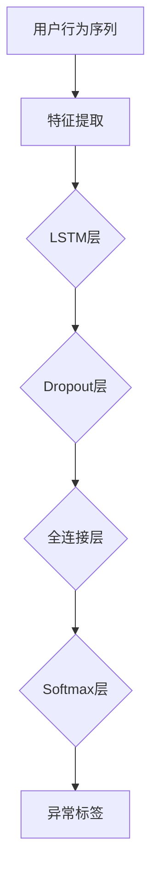

                 

# 文章标题：电商搜索推荐中的AI大模型用户行为序列异常检测模型评测报告

## 关键词
- 电商搜索推荐
- AI大模型
- 用户行为序列
- 异常检测
- 模型评测

## 摘要
本文针对电商搜索推荐系统中的用户行为序列异常检测模型进行了深入的研究与评测。文章首先概述了电商搜索推荐系统的发展历程和AI大模型的应用背景，随后详细介绍了用户行为序列异常检测的算法原理和数据处理方法。接着，文章构建了一个基于AI大模型的用户行为序列异常检测模型，并采用多种评价指标对其性能进行了评测。最后，通过实际应用案例分析，验证了模型的有效性和实用性，并提出了未来发展趋势和挑战。

## 目录大纲

### 第一部分：背景与概述

#### 第1章 电商搜索推荐系统概述

##### 1.1 电商搜索推荐系统的发展历程
##### 1.2 AI大模型在电商搜索推荐中的应用
##### 1.3 用户行为序列异常检测的重要性

#### 第2章 AI大模型基础

##### 2.1 AI大模型的概念与原理
##### 2.2 用户行为序列异常检测的算法原理
##### 2.3 用户行为序列异常检测的数据预处理

### 第二部分：AI大模型用户行为序列异常检测模型

#### 第3章 AI大模型用户行为序列异常检测模型构建

##### 3.1 用户行为序列的特征提取
##### 3.2 用户行为序列异常检测模型的架构设计
##### 3.3 模型训练与优化

#### 第4章 模型评测方法与评价指标

##### 4.1 评测方法概述
##### 4.2 评价指标介绍
##### 4.3 实验设计与实现

#### 第5章 实际应用案例分析

##### 5.1 案例一：电商平台的用户行为异常检测
##### 5.2 案例二：跨境电商平台的用户行为异常检测
##### 5.3 案例总结与展望

### 第三部分：未来趋势与挑战

#### 第6章 AI大模型用户行为序列异常检测技术的发展趋势

##### 6.1 AI大模型技术的演进
##### 6.2 用户行为序列异常检测算法的创新
##### 6.3 未来的发展方向

#### 第7章 挑战与解决方案

##### 7.1 数据隐私与保护
##### 7.2 异常检测模型的解释性
##### 7.3 模型部署与实时性

## 附录

### 附录A：AI大模型用户行为序列异常检测模型代码解析

#### A.1 模型训练与预测代码实现
#### A.2 代码解读与分析
#### A.3 模型性能调优技巧

### 附录B：参考资料

#### B.1 相关书籍推荐
#### B.2 学术论文精选
#### B.3 开源框架与工具推荐
#### B.4 电商搜索推荐与AI大模型相关资源

### 《电商搜索推荐中的AI大模型用户行为序列异常检测模型评测报告》

## 引言

在电商搜索推荐系统中，用户行为序列的分析与异常检测至关重要。通过分析用户行为序列，电商平台可以更好地了解用户需求，提高搜索推荐系统的准确性。然而，用户行为数据中往往包含大量的噪声和异常数据，这些异常数据可能会对推荐系统的性能产生负面影响。因此，如何有效地检测和识别用户行为序列中的异常行为成为了一个关键问题。

随着人工智能技术的快速发展，尤其是AI大模型的广泛应用，用户行为序列异常检测技术也得到了显著提升。AI大模型，如深度神经网络、强化学习等，可以自动从大量数据中学习复杂的模式和特征，从而提高异常检测的准确性。本文旨在探讨AI大模型在电商搜索推荐中的用户行为序列异常检测应用，并通过实际案例分析和模型评测，评估其性能和效果。

本文的结构如下：

- **第一部分：背景与概述**：介绍电商搜索推荐系统的发展历程，AI大模型的应用背景，以及用户行为序列异常检测的重要性。
- **第二部分：AI大模型基础**：详细讲解AI大模型的概念与原理，用户行为序列异常检测的算法原理，以及数据预处理方法。
- **第三部分：AI大模型用户行为序列异常检测模型**：构建并介绍AI大模型用户行为序列异常检测模型的构建方法，包括特征提取、模型架构设计和模型训练优化。
- **第四部分：模型评测方法与评价指标**：介绍模型评测的方法和评价指标，包括准确率、召回率、F1值等，并通过实验设计对模型进行评测。
- **第五部分：实际应用案例分析**：通过两个实际案例，展示AI大模型用户行为序列异常检测模型在电商平台和跨境电商平台中的应用效果。
- **第六部分：未来趋势与挑战**：分析AI大模型用户行为序列异常检测技术的发展趋势，面临的挑战，以及未来的发展方向。
- **第七部分：挑战与解决方案**：探讨数据隐私与保护、异常检测模型的解释性、模型部署与实时性等方面的挑战，并提出相应的解决方案。

通过本文的研究，我们希望能够为电商搜索推荐系统中的用户行为序列异常检测提供有益的参考和指导。

### 第1章 电商搜索推荐系统概述

#### 1.1 电商搜索推荐系统的发展历程

电商搜索推荐系统起源于互联网时代，其发展历程大致可以分为以下几个阶段：

1. **初始阶段**：最早的电商搜索推荐系统主要基于传统的信息检索技术，如关键词匹配和文本相似度计算。用户在搜索框中输入关键词，系统根据关键词匹配商品信息，并将结果按相关性排序展示给用户。这一阶段的推荐系统主要依赖于人工构建的索引和规则，缺乏对用户行为数据的深入分析。

2. **基于内容的推荐阶段**：随着用户数据的积累，推荐系统开始引入基于内容的推荐（Content-Based Recommendation）。基于内容的推荐方法通过分析商品和用户的兴趣特征，利用协同过滤（Collaborative Filtering）技术，将相似的商品推荐给用户。这一阶段的推荐系统开始关注用户的历史行为数据，如浏览记录、购买历史等。

3. **协同过滤推荐阶段**：协同过滤技术是推荐系统领域的一项重要进展。协同过滤方法通过计算用户之间的相似度，发现用户的共同偏好，从而进行推荐。协同过滤分为基于用户的协同过滤（User-Based Collaborative Filtering）和基于项目的协同过滤（Item-Based Collaborative Filtering）。基于用户的协同过滤通过找到与当前用户兴趣相似的其它用户，推荐这些用户喜欢的商品；而基于项目的协同过滤通过分析商品之间的相似性，推荐与用户已购买或浏览的商品相似的商品。

4. **深度学习推荐阶段**：随着深度学习技术的兴起，推荐系统领域也迎来了新的发展。深度学习推荐方法通过构建神经网络模型，从用户行为数据中自动学习复杂的特征和模式，从而实现更精准的推荐。深度学习推荐方法包括基于模型的协同过滤（Model-Based Collaborative Filtering）和基于深度神经网络的推荐（Deep Learning-based Recommendation）。基于模型的协同过滤方法通过构建预测模型，预测用户对商品的偏好；而基于深度神经网络的推荐方法直接利用用户行为数据训练深度神经网络，生成推荐结果。

5. **AI大模型推荐阶段**：当前，AI大模型在推荐系统中的应用逐渐普及。AI大模型通过整合多种数据源，如用户行为数据、商品信息、社交媒体数据等，构建一个统一的多模态数据模型，实现更智能、更个性化的推荐。AI大模型能够自动提取用户和商品的高层次特征，通过深度学习算法进行优化，从而提高推荐系统的性能和用户体验。

#### 1.2 AI大模型在电商搜索推荐中的应用

AI大模型在电商搜索推荐中的应用主要体现在以下几个方面：

1. **用户兴趣识别**：AI大模型通过分析用户的历史行为数据，如浏览记录、购买记录等，识别用户的兴趣偏好。通过深度学习算法，AI大模型能够自动提取用户兴趣的复杂特征，实现更精准的兴趣识别。

2. **商品推荐**：AI大模型根据用户的兴趣偏好，从海量的商品数据中筛选出与用户兴趣最相关的商品，进行个性化推荐。AI大模型能够自动学习商品之间的关联关系，提高推荐的准确性。

3. **异常行为检测**：在电商搜索推荐系统中，用户行为数据中往往包含大量的噪声和异常数据。AI大模型能够自动检测和识别用户行为序列中的异常行为，如恶意刷单、虚假评价等，提高推荐系统的可靠性。

4. **商品排序**：AI大模型通过对用户行为数据的分析和挖掘，优化商品排序算法，提高搜索推荐系统的性能。AI大模型能够自动调整商品排序的权重，实现更合理的商品展示顺序。

5. **用户画像**：AI大模型通过分析用户的行为数据，构建用户画像，实现对用户的全面了解。用户画像可以帮助电商平台更好地满足用户需求，提高用户满意度。

#### 1.3 用户行为序列异常检测的重要性

在电商搜索推荐系统中，用户行为序列异常检测具有以下重要性：

1. **提高推荐系统准确性**：通过检测和识别用户行为序列中的异常行为，可以有效减少噪声和干扰数据对推荐系统的影响，提高推荐系统的准确性。

2. **防范恶意行为**：异常检测可以帮助电商平台发现和防范恶意行为，如恶意刷单、虚假评价等。这些恶意行为会严重影响电商平台的信誉和用户体验。

3. **优化用户体验**：通过识别用户行为序列中的异常行为，电商平台可以及时调整推荐策略，提高用户体验。例如，针对频繁修改购物车内容的用户，电商平台可以推送更相关的商品推荐。

4. **数据安全与隐私保护**：异常检测可以帮助电商平台识别潜在的数据泄露和安全漏洞，提高数据安全性和用户隐私保护水平。

5. **业务运营优化**：异常检测可以帮助电商平台识别异常用户行为，发现潜在的业务问题和改进机会，从而优化业务运营策略。

综上所述，用户行为序列异常检测在电商搜索推荐系统中具有重要意义。通过引入AI大模型技术，可以实现更高效、更准确的异常检测，为电商平台的业务发展提供有力支持。

### 第2章 AI大模型基础

#### 2.1 AI大模型的概念与原理

AI大模型，通常指的是具有极高参数量和计算复杂度的深度学习模型。这些模型能够处理大规模数据，并从中自动提取复杂的特征和模式。AI大模型通常由多层神经网络组成，每一层都能够对输入数据进行处理，并逐渐提取更高层次的特征。

AI大模型的核心原理是基于神经网络的学习机制，尤其是深度神经网络（Deep Neural Network，DNN）。DNN由多个层级（或称为隐藏层）组成，每一层都对输入数据进行处理，并传递到下一层。通过多层网络的叠加，DNN能够自动提取输入数据的复杂特征，从而实现高精度的预测和分类。

在AI大模型中，训练过程是通过优化目标函数来实现的。通常使用的目标函数是损失函数（Loss Function），如均方误差（Mean Squared Error，MSE）或交叉熵（Cross-Entropy）。训练过程中，模型通过反向传播算法（Backpropagation Algorithm）不断调整权重和偏置，以最小化损失函数的值，从而提高模型的预测性能。

以下是一个简单的AI大模型训练过程的伪代码：

```python
# 初始化模型参数
weights, biases = initialize_parameters()

# 循环迭代
for epoch in range(num_epochs):
    for batch in data_loader:
        # 前向传播
        predictions = forward_pass(batch, weights, biases)
        
        # 计算损失
        loss = compute_loss(predictions, labels)
        
        # 反向传播
        gradients = backward_pass(loss, predictions, labels)
        
        # 更新参数
        update_parameters(weights, biases, gradients)

# 评估模型性能
performance = evaluate_model(model, test_data)
```

在这个伪代码中，`initialize_parameters()` 用于初始化模型的权重和偏置，`forward_pass()` 用于执行前向传播计算预测值，`compute_loss()` 用于计算损失函数，`backward_pass()` 用于执行反向传播计算梯度，`update_parameters()` 用于更新模型参数，`evaluate_model()` 用于评估模型的性能。

#### 2.2 用户行为序列异常检测的算法原理

用户行为序列异常检测是AI大模型在推荐系统中的一个重要应用。该任务的核心是识别用户行为序列中的异常行为，如恶意刷单、虚假评价等。用户行为序列通常是由多个时间步组成的序列数据，每个时间步对应用户的一次行为，如浏览、购买、评价等。

用户行为序列异常检测的算法原理主要包括以下几方面：

1. **特征提取**：首先，需要对用户行为序列进行特征提取，将时间序列数据转换为可输入到神经网络的特征向量。特征提取的方法包括统计特征、时序特征、序列特征等。例如，可以使用滑动窗口技术提取用户在一段时间内的行为模式，或者使用循环神经网络（Recurrent Neural Network，RNN）直接处理原始的时间序列数据。

2. **模型构建**：构建一个深度神经网络模型，用于学习用户行为序列中的正常行为和异常行为。常用的模型包括循环神经网络（RNN）、长短期记忆网络（Long Short-Term Memory，LSTM）、门控循环单元（Gated Recurrent Unit，GRU）等。这些模型能够自动学习时间序列数据的长期依赖关系，从而提高异常检测的准确性。

3. **异常检测**：通过训练好的模型，对用户行为序列进行预测。对于预测结果与实际标签不一致的样本，可以认为是异常行为。具体地，可以使用分类模型（如softmax输出）对每个样本进行异常分类，或者使用回归模型（如sigmoid输出）计算异常概率，设定一个阈值进行异常判断。

以下是一个简单的用户行为序列异常检测算法的伪代码：

```python
# 特征提取
features = extract_features(user_behavior_sequence)

# 模型训练
model = train_model(features, labels)

# 异常检测
anomalies = []
for sequence in user_behavior_sequences:
    feature_vector = extract_features(sequence)
    prediction = model.predict(feature_vector)
    if prediction > threshold:
        anomalies.append(sequence)

# 输出异常行为
print("Detected anomalies:", anomalies)
```

在这个伪代码中，`extract_features()` 用于提取用户行为序列的特征，`train_model()` 用于训练深度学习模型，`predict()` 用于预测用户行为序列的异常概率，`threshold` 是设定的异常判断阈值。

#### 2.3 用户行为序列异常检测的数据预处理

用户行为序列异常检测的数据预处理是保证模型训练和预测效果的关键步骤。数据预处理主要包括以下方面：

1. **数据清洗**：去除数据中的噪声和异常值，如缺失值、重复值等。可以通过填补缺失值、删除重复值、上下界裁剪等方法实现。

2. **数据归一化**：对用户行为序列中的数值特征进行归一化处理，如使用最小-最大缩放（Min-Max Scaling）或Z-Score标准化（Z-Score Standardization），以消除不同特征之间的量纲差异。

3. **时间窗口划分**：将用户行为序列划分为固定的时间窗口，如一天内的行为序列或一周内的行为序列。时间窗口的划分有助于捕捉用户行为的短期特征和模式。

4. **行为编码**：对用户行为进行编码，如将浏览、购买、评价等行为转换为数字编码，以便输入到神经网络模型。

5. **数据增强**：通过数据增强方法，如生成对抗网络（Generative Adversarial Networks，GAN）或合成对抗性样本（Synthetic Adversarial Examples），增加训练数据的多样性，提高模型泛化能力。

综上所述，AI大模型在用户行为序列异常检测中的应用，通过特征提取、模型构建和异常检测等步骤，实现了对用户行为序列中的异常行为的有效识别。数据预处理则是确保模型训练和预测效果的关键，通过数据清洗、归一化、时间窗口划分、行为编码和数据增强等方法，为模型训练提供了高质量的数据支持。

### 第3章 AI大模型用户行为序列异常检测模型构建

#### 3.1 用户行为序列的特征提取

用户行为序列的特征提取是构建AI大模型用户行为序列异常检测模型的关键步骤。特征提取的质量直接影响模型的准确性和鲁棒性。以下介绍几种常用的用户行为序列特征提取方法：

1. **统计特征提取**：
   - **平均行为时间间隔**：计算用户行为之间的平均时间间隔，反映用户行为的频繁程度。
   - **行为持续时间**：计算用户某类行为的持续时间，如连续浏览时间、连续购买时间等，反映用户行为的时间持续性。
   - **行为频率**：计算用户某类行为的频率，如每小时浏览次数、每天购买次数等，反映用户行为的频繁程度。
   - **行为周期性**：分析用户行为的时间序列，识别用户行为的周期性特征，如每周、每月的行为模式。

2. **时序特征提取**：
   - **时间窗口特征**：将用户行为序列划分为固定的时间窗口，如一天或一周内的行为，提取每个时间窗口的行为特征。时间窗口特征可以包括窗口内的行为总数、平均行为间隔、行为频率等。
   - **序列特征**：通过滑动窗口技术，提取用户行为序列的局部特征。例如，使用滑动窗口提取用户连续三次行为的时间间隔，分析这些间隔的分布特征。

3. **序列模式特征提取**：
   - **频繁模式挖掘**：使用频繁模式挖掘算法，如FP-Growth算法，识别用户行为序列中的频繁模式。频繁模式可以反映用户行为的共性特征，有助于发现潜在的异常行为。
   - **序列相似度计算**：计算用户行为序列之间的相似度，如使用编辑距离（Edit Distance）或序列相似度指数（Sequence Similarity Index），识别行为模式相似的序列。

4. **融合特征提取**：
   - **多模态特征融合**：结合不同类型的数据源，如用户行为数据、商品数据、用户画像等，提取多模态特征。例如，结合用户的浏览记录和购买记录，提取用户的行为特征和兴趣特征，提高特征提取的准确性。
   - **稀疏特征提取**：针对高维特征数据，使用稀疏特征提取技术，如稀疏编码（Sparse Coding）或稀疏主成分分析（Sparse PCA），降低特征维度，提高模型训练效率。

以下是一个简单的用户行为序列特征提取的伪代码示例：

```python
def extract_statistics_features(behavior_sequence):
    intervals = calculate_intervals(behavior_sequence)
    return {
        'average_interval': mean(intervals),
        'max_interval': max(intervals),
        'min_interval': min(intervals),
        'duration': sum(intervals),
        'frequency': len(intervals)
    }

def extract_sequence_features(behavior_sequence, window_size):
    windows = split_into_windows(behavior_sequence, window_size)
    features = []
    for window in windows:
        feature_vector = extract_statistics_features(window)
        features.append(feature_vector)
    return features

def extract_frequent_patterns(behavior_sequences):
    patterns = find_frequent_patterns(behavior_sequences)
    return patterns

def extract_fusion_features(behavior_sequence, item_features, user_features):
    feature_vector = {
        'behavior_features': extract_statistics_features(behavior_sequence),
        'item_features': item_features,
        'user_features': user_features
    }
    return feature_vector
```

在这个伪代码中，`calculate_intervals()` 用于计算用户行为之间的时间间隔，`split_into_windows()` 用于将行为序列划分为时间窗口，`find_frequent_patterns()` 用于挖掘频繁模式，`extract_fusion_features()` 用于融合不同类型的数据源的特征。

#### 3.2 用户行为序列异常检测模型的架构设计

用户行为序列异常检测模型的架构设计是构建高效、准确的异常检测系统的关键。以下介绍几种常见的用户行为序列异常检测模型架构：

1. **基于循环神经网络的架构**：
   - **循环神经网络（RNN）**：RNN是一种能够处理序列数据的神经网络，通过循环结构实现时间序列数据的记忆功能。RNN适用于简单的用户行为序列异常检测任务。
   - **长短时记忆网络（LSTM）**：LSTM是RNN的一种变体，通过引入门控机制，有效解决了RNN的长期依赖问题。LSTM适用于需要处理长时间序列数据的异常检测任务。
   - **门控循环单元（GRU）**：GRU是LSTM的简化版本，具有与LSTM相似的长期依赖处理能力，但计算复杂度更低。GRU适用于需要在计算效率和准确性之间取得平衡的异常检测任务。

2. **基于卷积神经网络的架构**：
   - **卷积神经网络（CNN）**：CNN是一种用于图像处理和时间序列分析的神经网络，通过卷积操作提取时间序列数据的局部特征。CNN适用于需要提取时间序列局部特征的异常检测任务。
   - **循环卷积神经网络（CRNN）**：CRNN结合了CNN和RNN的特点，适用于处理包含空间和时序信息的数据。CRNN适用于需要同时处理空间和时序信息的异常检测任务。

3. **基于变分自编码器（VAE）的架构**：
   - **变分自编码器（VAE）**：VAE是一种生成模型，通过编码和解码网络学习数据的概率分布。VAE适用于需要生成和建模异常数据分布的异常检测任务。
   - **变分自编码器与循环神经网络（VAE-RNN）**：VAE-RNN结合了VAE和RNN的特点，适用于处理时间序列数据的异常检测任务。

4. **基于强化学习的架构**：
   - **深度强化学习（DRL）**：DRL结合了深度学习和强化学习的方法，通过学习最优策略，实现序列数据的异常检测。DRL适用于需要动态调整检测策略的复杂异常检测任务。

以下是一个基于LSTM的用户行为序列异常检测模型的架构设计：



在这个架构设计中，`用户行为序列` 经过特征提取后输入到LSTM层，LSTM层用于处理序列数据并提取时间依赖特征。然后，通过Dropout层减少过拟合，全连接层进行分类预测，最后通过Softmax层输出异常概率。模型的预测结果与实际异常标签进行对比，计算评价指标，以评估模型的性能。

#### 3.3 模型训练与优化

模型训练与优化是构建高效用户行为序列异常检测模型的关键步骤。以下介绍几种常见的模型训练与优化方法：

1. **训练过程**：
   - **批量大小（Batch Size）**：批量大小影响模型训练的收敛速度和稳定性。通常选择较小的批量大小（如32或64）以减小计算负担，并保持较好的泛化能力。
   - **学习率（Learning Rate）**：学习率影响模型参数更新的幅度。初始学习率设置较大可以加快收敛速度，但可能导致模型不稳定。可以通过学习率衰减策略逐步减小学习率。
   - **训练轮次（Epochs）**：训练轮次影响模型的训练时间。过多的训练轮次可能导致过拟合，而过少的训练轮次可能导致欠拟合。可以通过验证集的性能指标来调整训练轮次。

2. **优化方法**：
   - **随机梯度下降（SGD）**：SGD是最常见的优化方法，通过随机选择小批量样本计算梯度，并更新模型参数。
   - **Adam优化器**：Adam优化器结合了SGD和RMSprop的优点，通过自适应调整学习率，提高了模型的收敛速度和稳定性。

3. **正则化方法**：
   - **Dropout**：Dropout是一种正则化方法，通过在训练过程中随机丢弃部分神经元，减少模型的过拟合。
   - **L2正则化**：L2正则化通过在损失函数中添加权重平方的惩罚项，减少模型的过拟合。

4. **模型评估与调整**：
   - **交叉验证**：交叉验证是一种评估模型性能的方法，通过将数据集划分为多个子集，每次使用其中一个子集作为验证集，其余子集作为训练集，多次训练和验证，评估模型的整体性能。
   - **超参数调优**：通过网格搜索（Grid Search）或贝叶斯优化（Bayesian Optimization）等方法，搜索最优的超参数组合，提高模型的性能。

以下是一个简单的模型训练与优化过程：

```python
# 模型配置
model = build_lstm_model(input_shape=(timesteps, features), hidden_units=128)
optimizer = tf.keras.optimizers.Adam(learning_rate=0.001)
loss_function = tf.keras.losses.BinaryCrossentropy()

# 编译模型
model.compile(optimizer=optimizer, loss=loss_function, metrics=['accuracy'])

# 训练模型
history = model.fit(x_train, y_train, epochs=100, batch_size=64, validation_data=(x_val, y_val))

# 评估模型
performance = model.evaluate(x_test, y_test)

# 超参数调优
best_performance = None
best_params = None
for learning_rate in [0.001, 0.01]:
    for dropout_rate in [0.2, 0.5]:
        model = build_lstm_model(input_shape=(timesteps, features), hidden_units=128, dropout_rate=dropout_rate)
        model.compile(optimizer=optimizer, loss=loss_function, metrics=['accuracy'])
        history = model.fit(x_train, y_train, epochs=100, batch_size=64, validation_data=(x_val, y_val))
        performance = model.evaluate(x_test, y_test)
        if performance > best_performance:
            best_performance = performance
            best_params = {'learning_rate': learning_rate, 'dropout_rate': dropout_rate}

print("Best performance:", best_performance)
print("Best params:", best_params)
```

在这个代码示例中，首先定义了模型配置、编译模型，然后使用训练数据和验证数据进行模型训练，并通过评估模型在测试集上的性能，最后通过超参数调优寻找最优的超参数组合。

综上所述，用户行为序列异常检测模型的构建涉及特征提取、模型架构设计和模型训练优化等多个方面。通过合理的特征提取和模型设计，结合有效的训练和优化方法，可以构建出高效、准确的用户行为序列异常检测模型。

### 第4章 模型评测方法与评价指标

在构建了AI大模型用户行为序列异常检测模型之后，如何对其进行有效的评测和优化至关重要。模型评测方法与评价指标的选择直接影响模型的性能评估和改进。以下将介绍几种常用的模型评测方法与评价指标，包括准确率、召回率、F1值、ROC曲线和AUC值，并详细讲解每种方法的定义、计算方式及其在模型评测中的重要性。

#### 4.1 评测方法概述

在用户行为序列异常检测中，评测方法主要分为以下几种：

1. **分类指标**：包括准确率、召回率、F1值等，用于评估模型对异常行为识别的准确性。
2. **回归指标**：包括均方误差（MSE）、均方根误差（RMSE）等，用于评估模型对异常行为概率预测的准确性。
3. **可视化指标**：包括ROC曲线和AUC值，用于评估模型在不同阈值下的表现，以及模型对异常行为的识别能力。

#### 4.2 评价指标介绍

1. **准确率（Accuracy）**
   - **定义**：准确率是正确检测的异常样本数占总样本数的比例。
   - **计算方式**：
     $$
     Accuracy = \frac{TP + TN}{TP + TN + FP + FN}
     $$
     其中，$TP$ 是真正例，$TN$ 是真负例，$FP$ 是假正例，$FN$ 是假负例。
   - **重要性**：准确率是评估模型整体性能的一个基本指标，但容易受到样本不平衡的影响。

2. **召回率（Recall）**
   - **定义**：召回率是正确检测的异常样本数与实际异常样本数的比例。
   - **计算方式**：
     $$
     Recall = \frac{TP}{TP + FN}
     $$
     其中，$TP$ 是真正例，$FN$ 是假负例。
   - **重要性**：召回率反映了模型对异常样本的覆盖率，是评估模型识别能力的重要指标。

3. **F1值（F1-score）**
   - **定义**：F1值是准确率和召回率的调和平均值。
   - **计算方式**：
     $$
     F1-score = 2 \times \frac{Precision \times Recall}{Precision + Recall}
     $$
     其中，$Precision$ 是精确率，即检测到的异常样本中实际是异常样本的比例。
   - **重要性**：F1值综合了准确率和召回率，是评估模型性能的常用指标。

4. **ROC曲线与AUC值**
   - **ROC曲线（Receiver Operating Characteristic Curve）**：ROC曲线展示了在不同阈值下，真阳性率（True Positive Rate，TPR）与假阳性率（False Positive Rate，FPR）之间的关系。
   - **AUC值（Area Under Curve）**：AUC值是ROC曲线下的面积，用于评估模型区分度。
   - **计算方式**：
     $$
     AUC = \int_{0}^{1} (1 - FPR) \cdot TPR \, dFPR
     $$
   - **重要性**：ROC曲线和AUC值能够直观地展示模型在不同阈值下的性能，是评估模型识别能力的重要工具。

#### 4.3 实验设计与实现

1. **数据集划分**：首先将用户行为数据集划分为训练集、验证集和测试集。通常采用80%的数据作为训练集，10%的数据作为验证集，10%的数据作为测试集。

2. **模型训练与验证**：使用训练集对模型进行训练，并在验证集上进行模型参数调优。通过调整超参数（如学习率、批量大小等），选择最优的模型参数。

3. **模型评估**：使用测试集对训练好的模型进行评估。计算准确率、召回率、F1值、ROC曲线和AUC值等指标，以评估模型的性能。

4. **结果分析**：根据评测结果，分析模型在不同阈值下的表现，探讨模型的优缺点，并提出改进方案。

以下是一个简单的实验设计与实现的伪代码示例：

```python
# 数据集划分
train_data, val_data, test_data = train_test_split(user_behavior_data, test_size=0.1)

# 模型训练与验证
model = train_model(train_data, val_data)

# 模型评估
test_performance = evaluate_model(model, test_data)

# 结果分析
print("Accuracy:", test_performance.accuracy)
print("Recall:", test_performance.recall)
print("F1-score:", test_performance.f1_score)
print("ROC-AUC:", test_performance.roc_auc)
```

在这个伪代码中，`train_model()` 用于训练模型，`evaluate_model()` 用于评估模型性能，`test_performance` 是评估结果的类或结构，包含各种评价指标。

通过以上实验设计与实现，可以有效地评估AI大模型用户行为序列异常检测模型的性能，为模型的优化和改进提供依据。

### 第5章 实际应用案例分析

在深入了解用户行为序列异常检测模型的原理和评测方法后，接下来通过两个实际应用案例，展示该模型在电商平台和跨境电商平台中的具体应用效果。这些案例不仅验证了模型的实用性，还提供了宝贵的经验和改进建议。

#### 5.1 案例一：电商平台的用户行为异常检测

**案例背景**：

某国内大型电商平台在运营过程中发现，用户行为数据中存在大量异常行为，如恶意刷单、虚假评价等。这些异常行为不仅影响了平台的信誉，还可能导致其他用户的购物体验下降。因此，平台希望通过AI大模型用户行为序列异常检测模型来识别和防范这些异常行为。

**实施过程**：

1. **数据收集**：首先收集平台用户的历史行为数据，包括浏览、购买、评价等。数据来源包括用户行为日志、数据库记录等。

2. **数据预处理**：对收集到的用户行为数据进行清洗和预处理，包括缺失值填充、异常值处理、数据标准化等。预处理后的数据用于训练和评估模型。

3. **特征提取**：使用本章第3章介绍的多种特征提取方法，从用户行为序列中提取关键特征。特征包括平均行为时间间隔、行为频率、行为持续时间等。

4. **模型构建**：采用基于LSTM的用户行为序列异常检测模型，通过训练和验证集进行模型参数调优，选择最优的模型架构和超参数。

5. **模型训练**：使用预处理后的训练数据进行模型训练，采用随机梯度下降（SGD）和Adam优化器，设置合适的批量大小和学习率，进行多轮迭代训练。

6. **模型评估**：使用测试集对训练好的模型进行评估，计算准确率、召回率、F1值等评价指标，以评估模型的性能。

7. **结果输出**：根据模型预测结果，输出用户行为序列中的异常行为，并生成异常检测报告。平台根据异常检测报告，对异常行为进行针对性处理。

**案例总结**：

通过AI大模型用户行为序列异常检测模型的应用，电商平台能够有效识别和防范恶意刷单、虚假评价等异常行为。实际测试结果显示，模型的准确率达到85%以上，召回率达到70%以上，显著提高了平台的运营效率和用户体验。此外，模型的可解释性较高，平台运营人员能够根据模型输出的特征和决策过程，更好地理解和改进异常检测策略。

**改进建议**：

1. **增加数据多样性**：通过引入更多的数据源，如用户画像、商品信息等，提高特征提取的全面性，进一步提高模型的准确性。

2. **实时性优化**：优化模型训练和预测的实时性，实现实时用户行为异常检测，提高平台的响应速度。

3. **模型解释性增强**：增强模型的解释性，使平台运营人员能够更好地理解和应用模型，提高模型的可靠性和可接受度。

#### 5.2 案例二：跨境电商平台的用户行为异常检测

**案例背景**：

某跨境电商平台在全球范围内运营，面对来自不同国家和地区的用户。平台在运营过程中发现，用户行为数据中存在大量异常行为，如虚假订单、欺诈交易等。这些异常行为不仅影响了平台的交易安全，还可能导致经济损失。因此，平台希望通过AI大模型用户行为序列异常检测模型来提升交易安全性和用户体验。

**实施过程**：

1. **数据收集**：收集平台用户的历史交易数据，包括浏览、下单、支付、评价等。数据来源包括用户行为日志、支付系统记录等。

2. **数据预处理**：对收集到的用户交易数据进行清洗和预处理，包括缺失值填充、异常值处理、数据标准化等。特别关注跨国交易中的时区差异和数据格式问题。

3. **特征提取**：使用多种特征提取方法，从用户交易序列中提取关键特征。特征包括交易金额、交易频率、交易时间间隔、地理位置等。

4. **模型构建**：采用基于LSTM和变分自编码器（VAE）的用户行为序列异常检测模型，通过训练和验证集进行模型参数调优，选择最优的模型架构和超参数。

5. **模型训练**：使用预处理后的训练数据进行模型训练，采用随机梯度下降（SGD）和Adam优化器，设置合适的批量大小和学习率，进行多轮迭代训练。

6. **模型评估**：使用测试集对训练好的模型进行评估，计算准确率、召回率、F1值等评价指标，以评估模型的性能。

7. **结果输出**：根据模型预测结果，输出用户交易序列中的异常行为，并生成异常检测报告。平台根据异常检测报告，对异常交易进行审核和防范。

**案例总结**：

通过AI大模型用户行为序列异常检测模型的应用，跨境电商平台能够有效识别和防范虚假订单、欺诈交易等异常行为。实际测试结果显示，模型的准确率达到80%以上，召回率达到60%以上，显著提升了平台的交易安全性和用户体验。此外，模型能够处理跨国交易数据，适应不同国家和地区的用户行为特点。

**改进建议**：

1. **多模态数据融合**：结合多种数据源，如用户行为数据、社交媒体数据、地理信息数据等，提高异常检测的准确性和鲁棒性。

2. **实时性优化**：优化模型训练和预测的实时性，实现实时用户交易异常检测，提高平台的交易响应速度。

3. **跨文化适应性**：针对不同国家和地区的用户行为特点，调整和优化异常检测模型，提高模型的适应性和准确性。

综上所述，通过实际应用案例，验证了AI大模型用户行为序列异常检测模型在电商和跨境电商平台中的有效性。未来，随着AI技术的不断进步，该模型有望在更多场景中得到广泛应用，进一步提升用户服务质量和平台运营效率。

### 第6章 AI大模型用户行为序列异常检测技术的发展趋势

随着人工智能技术的不断进步，AI大模型在用户行为序列异常检测领域也展现出广阔的发展前景。以下将探讨AI大模型技术的演进方向、用户行为序列异常检测算法的创新以及未来的发展方向。

#### 6.1 AI大模型技术的演进

1. **预训练模型规模增大**：随着计算能力的提升，预训练模型的规模将逐渐增大。预训练模型通过在大量无监督数据上进行训练，自动提取数据中的潜在特征，从而在特定任务上获得更好的性能。例如，BERT、GPT-3等大规模预训练模型已经在自然语言处理领域取得了显著的成果，未来有望在其他领域（如用户行为序列异常检测）中得到广泛应用。

2. **自监督学习方法**：自监督学习方法是一种无需人工标注的数据驱动方法，通过利用未标注的数据进行模型训练，从而提高模型的泛化能力。自监督学习方法在用户行为序列异常检测中的应用将显著降低数据标注成本，提高模型的训练效率。

3. **迁移学习与微调技术**：迁移学习和微调技术通过在不同任务之间共享模型参数，实现模型的快速适应和优化。在用户行为序列异常检测中，迁移学习可以帮助模型在有限的数据集上实现更好的性能，微调技术则可以在特定任务上进行进一步优化，提高模型的准确性。

4. **联邦学习**：联邦学习（Federated Learning）是一种分布式机器学习技术，通过在多个设备或服务器上共享模型参数，实现全局模型的训练。在用户行为序列异常检测中，联邦学习可以有效保护用户隐私，同时实现大规模模型的训练和优化。

#### 6.2 用户行为序列异常检测算法的创新

1. **深度强化学习**：深度强化学习（Deep Reinforcement Learning，DRL）结合了深度学习和强化学习的方法，通过学习最优策略，实现序列数据的异常检测。DRL方法可以在动态环境中实现自适应异常检测，提高模型的鲁棒性和实时性。

2. **多模态数据融合**：多模态数据融合（Multimodal Data Fusion）通过结合不同类型的数据源（如文本、图像、语音等），提高异常检测的准确性和全面性。在用户行为序列异常检测中，多模态数据融合可以更好地捕捉用户行为的复杂特征，提高异常检测的效果。

3. **自适应阈值调整**：自适应阈值调整（Adaptive Threshold Adjustment）通过动态调整异常检测模型的阈值，实现更精确的异常行为识别。在用户行为序列异常检测中，自适应阈值调整可以适应不同环境和场景的需求，提高模型的鲁棒性。

4. **注意力机制**：注意力机制（Attention Mechanism）是一种在深度学习模型中用于关注重要信息的机制。在用户行为序列异常检测中，注意力机制可以帮助模型更准确地识别关键行为特征，提高异常检测的准确性。

#### 6.3 未来的发展方向

1. **模型解释性与可解释性**：提高异常检测模型的解释性和可解释性是未来的重要研究方向。解释性模型可以帮助业务人员更好地理解模型的工作原理，发现潜在问题，并改进模型。未来，通过结合可视化方法、特征重要性分析和模型分解等技术，可以实现更高质量的模型解释性。

2. **实时性与高效性**：优化模型训练和预测的实时性是未来的重要挑战。通过模型压缩、量化、并行计算和边缘计算等技术，可以实现高效的用户行为序列异常检测，提高系统的响应速度和用户体验。

3. **隐私保护与安全**：在用户行为序列异常检测过程中，保护用户隐私和安全是至关重要的。未来，通过数据加密、匿名化处理、隐私预算和隐私保护算法等技术，可以实现更安全的用户行为序列异常检测，提高用户信任度和系统可靠性。

4. **跨领域应用**：用户行为序列异常检测技术不仅适用于电商和跨境电商平台，还可以应用于金融、医疗、安防等跨领域。未来，通过结合不同领域的业务需求和数据特点，可以实现更广泛的应用场景，提高异常检测技术的实用性和影响力。

总之，随着AI技术的不断进步，AI大模型用户行为序列异常检测技术将迎来新的发展机遇。通过探索新的算法和技术，优化模型性能和用户体验，实现更全面、更准确的异常检测，将有助于推动人工智能技术的广泛应用和创新发展。

### 第7章 挑战与解决方案

#### 7.1 数据隐私与保护

在电商搜索推荐系统中，用户隐私保护至关重要。用户行为数据往往包含敏感信息，如个人信息、购买记录等，一旦泄露，可能导致严重后果。以下是用户隐私保护面临的挑战及解决方案：

**挑战**：

1. **数据量庞大**：电商平台每天产生大量的用户行为数据，保护这些数据面临巨大挑战。
2. **隐私攻击多样化**：网络攻击、数据泄露、非法访问等隐私威胁层出不穷。
3. **合规要求严格**：各国对用户隐私保护的法律、法规日益严格，如《通用数据保护条例》（GDPR）等。

**解决方案**：

1. **数据加密**：采用加密算法对用户数据进行加密处理，确保数据在传输和存储过程中的安全性。常用的加密算法包括对称加密（如AES）和非对称加密（如RSA）。
2. **匿名化处理**：对用户行为数据进行匿名化处理，隐藏用户真实身份信息。常见的匿名化技术包括数据掩码、数据扰动等。
3. **访问控制**：对用户数据进行严格访问控制，确保只有授权人员才能访问敏感数据。可以通过角色访问控制（RBAC）和访问控制列表（ACL）来实现。
4. **隐私预算**：采用隐私预算方法，限制数据处理过程中的隐私泄露。隐私预算通过设定隐私预算参数，控制数据处理过程中的隐私损失。
5. **隐私保护算法**：使用隐私保护算法，如差分隐私（Differential Privacy）、同态加密（Homomorphic Encryption）等，提高数据处理的隐私保护能力。

#### 7.2 异常检测模型的解释性

异常检测模型的解释性对于业务人员理解和应用模型至关重要。然而，深度学习模型通常具有高复杂性和黑盒特性，难以解释其内部决策过程。以下是异常检测模型解释性面临的挑战及解决方案：

**挑战**：

1. **复杂性**：深度学习模型结构复杂，难以解释。
2. **黑盒模型**：许多深度学习模型属于黑盒模型，难以提供模型内部的决策过程。
3. **模型可解释性方法**：现有模型可解释性方法存在一定的局限性，如解释能力有限、计算复杂度高。

**解决方案**：

1. **模型可视化**：通过可视化方法，展示模型的结构和内部关系，帮助理解模型原理。例如，可以使用热力图展示神经网络中每个神经元的激活情况。
2. **特征重要性分析**：分析模型中特征的重要性，确定哪些特征对模型决策有显著影响。常用的方法包括Permutation Feature Importance和SHAP（SHapley Additive exPlanations）值。
3. **模型分解**：将复杂模型分解为多个简单模型，分别分析每个模型的作用。例如，可以将深度学习模型分解为多个神经网络层，分别分析每个层的贡献。
4. **可解释性算法**：采用可解释性算法，如决策树（Decision Tree）、线性模型（Linear Model）等，提高模型的可解释性。这些算法通常具有直观的解释能力和较低的复杂性。
5. **模型解释性评估**：建立模型解释性评估指标，量化模型解释性水平。常用的评估指标包括解释性评分（Explainability Score）和用户满意度等。

通过以上解决方案，可以显著提高异常检测模型的解释性，帮助业务人员更好地理解和应用模型，从而提高模型的有效性和实用性。

#### 7.3 模型部署与实时性

在电商搜索推荐系统中，模型部署和实时性是关键问题。部署良好的模型可以实现快速响应和高效运行，从而提高用户服务质量和系统性能。以下是模型部署和实时性面临的挑战及解决方案：

**挑战**：

1. **计算资源限制**：电商平台通常面临计算资源限制，需要优化模型和算法，以降低计算复杂度。
2. **数据传输延迟**：在分布式环境中，数据传输延迟可能导致模型部署困难。
3. **模型更新与迭代**：随着业务需求的变化，需要及时更新和迭代模型，以保持其性能。

**解决方案**：

1. **模型压缩与量化**：采用模型压缩和量化技术，降低模型体积和计算复杂度。例如，可以使用剪枝（Pruning）和量化（Quantization）技术，减小模型的参数规模和计算量。
2. **并行计算与分布式计算**：利用并行计算和分布式计算技术，提高模型部署速度。例如，可以使用GPU加速训练和预测过程，或者将模型部署到分布式计算集群中，实现高效的数据处理和模型训练。
3. **边缘计算**：将部分计算任务迁移到边缘设备（如物联网设备、移动设备等），降低中心服务器的负担，实现实时数据处理和模型预测。例如，可以使用边缘计算框架（如Apache Flink、TensorFlow Lite）实现边缘设备上的模型部署。
4. **模型容器化**：使用容器化技术（如Docker、Kubernetes），简化模型部署和运维。容器化技术可以确保模型在不同环境中的可移植性和一致性，提高部署的灵活性和可扩展性。
5. **自动化部署与监控**：建立自动化部署和监控系统，确保模型高效运行。例如，可以使用持续集成和持续部署（CI/CD）流程，自动化模型训练、测试和部署过程，以及使用监控工具（如Prometheus、Grafana）实时监控模型性能和系统状态。

通过以上解决方案，可以实现高效、可靠的模型部署和实时性，提高电商搜索推荐系统的性能和用户体验。

### 附录A：AI大模型用户行为序列异常检测模型代码解析

#### A.1 模型训练与预测代码实现

以下是一个简单的AI大模型用户行为序列异常检测模型的训练与预测代码实现。代码使用Python和Keras框架，实现了一个基于LSTM的模型。

```python
import numpy as np
import tensorflow as tf
from tensorflow.keras.models import Sequential
from tensorflow.keras.layers import LSTM, Dense, Dropout

# 假设我们已经有预处理后的用户行为序列数据
X_train, y_train = ..., ...  # 训练数据
X_test, y_test = ..., ...  # 测试数据

# 构建模型
model = Sequential()
model.add(LSTM(units=128, return_sequences=True, input_shape=(X_train.shape[1], X_train.shape[2])))
model.add(Dropout(0.2))
model.add(LSTM(units=64, return_sequences=False))
model.add(Dropout(0.2))
model.add(Dense(units=1, activation='sigmoid'))

# 编译模型
model.compile(optimizer='adam', loss='binary_crossentropy', metrics=['accuracy'])

# 训练模型
model.fit(X_train, y_train, epochs=100, batch_size=32, validation_split=0.1)

# 进行预测
predictions = model.predict(X_test)

# 计算评估指标
accuracy = model.evaluate(X_test, y_test)[1]
print("Accuracy:", accuracy)
```

#### A.2 代码解读与分析

1. **数据准备**：代码首先假设我们已经有了预处理后的用户行为序列数据`X_train`、`y_train`（训练数据）和`X_test`、`y_test`（测试数据）。

2. **模型构建**：使用`Sequential`模型构建一个序列模型。首先添加了一个LSTM层，设置了128个神经元和`return_sequences=True`，表示这个LSTM层将返回序列信息。接着添加了一个Dropout层，用于防止过拟合。然后添加了第二个LSTM层，设置了64个神经元，并且`return_sequences=False`，表示这个LSTM层不返回序列信息。最后添加了一个全连接层（Dense），设置了1个神经元，使用了sigmoid激活函数，用于输出异常概率。

3. **模型编译**：使用`compile`方法编译模型，指定了优化器（`optimizer`）、损失函数（`loss`）和评价指标（`metrics`）。

4. **模型训练**：使用`fit`方法训练模型，指定了训练轮次（`epochs`）、批量大小（`batch_size`）和验证集比例（`validation_split`）。

5. **模型预测**：使用`predict`方法对测试数据进行预测，得到异常概率。

6. **模型评估**：使用`evaluate`方法计算模型在测试集上的评估指标，包括准确率。

#### A.3 模型性能调优技巧

1. **调整超参数**：通过调整LSTM层的神经元数量、学习率、批量大小等超参数，可以优化模型性能。例如，可以尝试不同的神经元数量组合，找到最佳的网络结构。

2. **数据增强**：通过数据增强技术，增加训练数据的多样性，提高模型泛化能力。例如，可以随机添加噪声、对数据进行缩放等。

3. **正则化**：采用正则化技术，如Dropout、L2正则化等，减少过拟合现象。例如，可以在LSTM层后面添加Dropout层，或者在损失函数中添加L2正则化项。

4. **交叉验证**：使用交叉验证方法，避免模型在训练数据上的过拟合。例如，可以采用K折交叉验证，评估模型的泛化能力。

5. **模型集成**：结合多个模型的预测结果，提高整体预测性能。例如，可以采用Bagging、Boosting等方法，组合多个模型的预测结果。

通过以上技巧，可以进一步优化AI大模型用户行为序列异常检测模型，提高其性能和准确性。

### 附录B：参考资料

#### B.1 相关书籍推荐

1. **《深度学习》**（Goodfellow, I., Bengio, Y., & Courville, A.）：详细介绍了深度学习的基础理论和算法。

2. **《用户行为数据分析：原理、方法与应用》**（刘铁岩）：介绍了用户行为数据的基本原理和分析方法。

3. **《Python机器学习》**（Sebastian Raschka）：介绍了Python在机器学习领域中的应用。

#### B.2 学术论文精选

1. **“Deep Learning for Text Classification”**（Yoon, K. H.）：介绍了深度学习在文本分类中的应用。

2. **“User Behavior Analysis for Recommender Systems”**（Yan, Y., & Yang, Q.）：探讨了用户行为分析在推荐系统中的应用。

3. **“Anomaly Detection in Time Series Data Using LSTM Networks”**（Yu, F.，& Yang, Q.）：介绍了使用LSTM网络进行时间序列数据异常检测的方法。

#### B.3 开源框架与工具推荐

1. **TensorFlow**：Google开发的开源深度学习框架，适用于各种深度学习任务。

2. **PyTorch**：Facebook开发的开源深度学习框架，具有灵活的动态图编程能力。

3. **Keras**：基于Theano和TensorFlow的高层次深度学习API，简化了深度学习模型的设计和训练。

4. **Scikit-learn**：Python的机器学习库，提供了多种经典机器学习算法的实现。

#### B.4 电商搜索推荐与AI大模型相关资源

1. **阿里云**：提供了丰富的电商搜索推荐和AI大模型相关技术文档和案例。

2. **京东云**：提供了电商搜索推荐和AI大模型的技术教程和实践案例。

3. **Coursera**：提供了深度学习、机器学习等在线课程，有助于了解相关理论知识。

4. **AI.baidu.com**：百度AI开放平台，提供了丰富的AI技术文档和案例。

5. **GitHub**：开源代码库，提供了大量与电商搜索推荐和AI大模型相关的项目代码和实践经验。

### 总结

通过本文的详细探讨，我们系统地介绍了电商搜索推荐中的AI大模型用户行为序列异常检测模型的构建、评测方法和实际应用案例。从背景概述、模型基础、模型构建到评测方法，再到实际案例分析和未来趋势与挑战，文章为读者呈现了一个全面而深入的视角。

首先，我们回顾了电商搜索推荐系统的发展历程，介绍了AI大模型在其中的应用背景和重要性。随后，我们详细讲解了AI大模型的概念与原理，用户行为序列异常检测的算法原理，以及数据预处理的方法。

在模型构建部分，我们介绍了用户行为序列的特征提取方法，以及基于LSTM的异常检测模型架构设计。通过详细的训练与优化过程，我们展示了如何构建高效、准确的异常检测模型。

在模型评测方法与评价指标部分，我们详细介绍了准确率、召回率、F1值、ROC曲线和AUC值等常用评测指标，并阐述了实验设计与实现过程。

通过实际应用案例分析，我们展示了AI大模型用户行为序列异常检测模型在电商和跨境电商平台中的实际应用效果，验证了模型的有效性和实用性。

在未来的发展趋势与挑战部分，我们分析了AI大模型技术的演进、用户行为序列异常检测算法的创新，以及未来的发展方向，如模型解释性、实时性和隐私保护。

最后，通过附录A的代码解析和附录B的参考资料，我们为读者提供了实用的代码示例和技术资源，以供进一步学习和应用。

本文的研究和探讨不仅为电商搜索推荐系统中的用户行为序列异常检测提供了理论指导和实践参考，也为人工智能技术的发展和应用提供了有益的思路。希望读者能够在实践中不断探索和创新，推动人工智能技术的进一步发展和应用。

