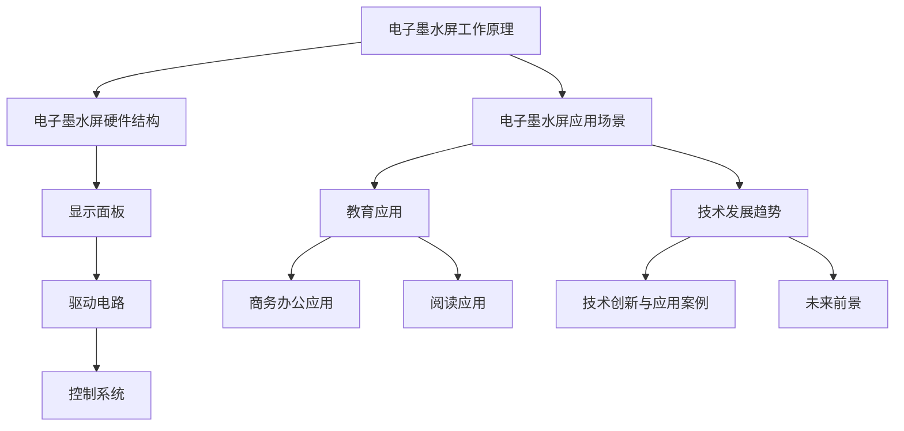

                 

### 《电子墨水屏：低注意力消耗的阅读革命》

> **关键词**：电子墨水屏、低注意力消耗、阅读革命、技术趋势、应用场景

> **摘要**：本文将从电子墨水屏的基本原理、硬件结构、应用场景、技术趋势等多个方面，深入探讨电子墨水屏在低注意力消耗阅读领域的革命性影响。通过详细的分析和案例展示，我们将揭示电子墨水屏如何通过其独特的显示技术，成为现代阅读设备中的一股新兴力量。

### 第一部分：电子墨水屏基础

#### 第1章：电子墨水屏概述

电子墨水屏是一种基于电子技术的显示设备，其基本原理是通过电场控制电子墨水的排列，从而在屏幕上形成文字或图像。与传统液晶显示屏相比，电子墨水屏具有低能耗、高对比度、仿真纸张效果等优点，因此在阅读设备中得到了广泛应用。

##### 1.1 电子墨水屏的基本原理

###### 1.1.1 电子墨水屏的工作机制

电子墨水屏由电子墨水、显示屏基板和透明电极构成。当屏幕上的透明电极施加电场时，电子墨水中的正负电荷会分别向阳极和阴极移动，从而改变屏幕上每个像素的电荷状态。这种电荷状态的变化会导致电子墨水的排列发生改变，从而呈现出不同的文字或图像。

###### 1.1.2 电子墨水屏的优缺点

**优点：**
1. **低功耗**：电子墨水屏的能耗极低，比液晶显示屏低得多。
2. **高对比度**：电子墨水屏具有更高的对比度，视觉效果更佳。
3. **仿真纸张效果**：电子墨水屏显示的文字和图像类似于纸张上的效果，有助于减少眼睛疲劳。

**缺点：**
1. **刷新速度较慢**：电子墨水屏的刷新速度比液晶显示屏慢，不适合动态显示。
2. **色彩单一**：电子墨水屏通常只能显示黑白或灰度图像，不适合彩色显示。

##### 1.2 电子墨水屏的历史与发展

电子墨水屏最早由美国麻省理工学院（MIT）的麻省理工学院媒体实验室（MIT Media Lab）提出，并于1996年首次亮相。此后，电子墨水屏技术不断发展，逐渐在电子阅读器、电子纸等设备中得到应用。

### 2. 电子墨水屏的硬件结构

电子墨水屏的硬件结构主要包括显示面板、驱动电路和控制系统。

##### 2.1 显示面板

显示面板是电子墨水屏的核心部件，主要由电子墨水、显示屏基板和透明电极构成。电子墨水是一种悬浮在液体中的微小颗粒，通过电场的作用可以改变其排列状态。显示屏基板通常采用玻璃或塑料材料，透明电极则采用透明导电材料。

##### 2.2 驱动电路

驱动电路用于控制电子墨水屏的显示内容。它主要包括驱动芯片、电源管理电路和接口电路。驱动芯片负责将数字信号转换为控制电子墨水的电信号，电源管理电路负责为驱动电路提供稳定的电源，接口电路则负责与其他设备进行通信。

##### 2.3 控制系统

控制系统是电子墨水屏的“大脑”，负责协调各个部件的工作。它通常由微控制器、存储器和操作系统组成。微控制器负责执行操作系统和应用程序的指令，存储器则用于存储数据和程序代码。操作系统则负责管理系统的资源，并提供用户界面和应用程序接口。

### 第3章：电子墨水屏在教育中的应用

电子墨水屏在教育领域中具有广泛的应用前景。它不仅能够提高学生的学习效率，还能降低视力疲劳，有助于学生的长期学习。

##### 3.1 电子墨水屏在教学中的应用优势

###### 3.1.1 提高学习效率

电子墨水屏可以提供类似纸张的阅读体验，有助于学生长时间集中注意力。此外，电子墨水屏可以存储大量的书籍和资料，方便学生随时查阅。

###### 3.1.2 降低视力疲劳

电子墨水屏具有高对比度和低蓝光的特点，能够有效降低眼睛疲劳。这对于长时间阅读和学习的学生来说，具有重要意义。

##### 3.2 电子墨水屏在教育设备中的应用实例

目前，许多教育设备都采用了电子墨水屏技术。例如，电子阅读器、电子纸笔记本和电子教科书等。这些设备不仅提供了优质的阅读体验，还具备便捷的交互功能，为学生提供了全新的学习方式。

### 第4章：电子墨水屏在商务办公中的应用

电子墨水屏在商务办公中同样具有广泛的应用场景。它不仅可以用于会议记录，还能在文档阅读和编辑中发挥重要作用。

##### 4.1 电子墨水屏在商务办公中的应用场景

###### 4.1.1 会议记录

电子墨水屏可以实时记录会议内容，方便参会者随时查阅。此外，电子墨水屏的触摸功能还可以实现实时修改和标注。

###### 4.1.2 阅读文档

电子墨水屏可以方便地阅读各种文档，包括PDF文件、Word文档和Excel表格等。其高对比度和低蓝光特点，有助于减少眼睛疲劳。

##### 4.2 电子墨水屏在商务办公设备中的应用实例

目前，许多商务办公设备都采用了电子墨水屏技术。例如，智能笔记本、平板电脑和电子白板等。这些设备不仅提供了高效的办公体验，还具备强大的数据处理和协作功能。

### 第5章：电子墨水屏在阅读领域的应用

电子墨水屏在阅读领域具有独特的优势。它能够提供类似于纸张的阅读体验，同时具有低能耗、环保等优点。

##### 5.1 电子墨水屏在阅读中的应用优势

###### 5.1.1 仿真纸张体验

电子墨水屏的显示效果与纸张非常相似，有助于用户更好地沉浸在阅读中。

###### 5.1.2 节能环保

电子墨水屏的能耗极低，有助于减少能源消耗。此外，电子墨水屏的制造过程相对环保，有助于减少环境污染。

##### 5.2 电子墨水屏在阅读设备中的应用实例

目前，许多阅读设备都采用了电子墨水屏技术。例如，电子阅读器、电子纸手表和智能眼镜等。这些设备不仅提供了优质的阅读体验，还具备便捷的交互功能，为用户带来了全新的阅读方式。

### 第三部分：电子墨水屏技术的发展趋势

#### 第6章：电子墨水屏的技术趋势

随着技术的不断发展，电子墨水屏技术也在不断进步。未来，电子墨水屏将在显示性能和应用形式方面实现新的突破。

##### 6.1 电子墨水屏技术的发展方向

###### 6.1.1 显示性能的提升

未来，电子墨水屏的显示性能将得到进一步提升。例如，提高分辨率、缩短刷新时间等，以满足更多应用场景的需求。

###### 6.1.2 灵活多样的应用形式

除了传统的阅读设备，电子墨水屏将在更多领域得到应用。例如，可穿戴设备、智能家具等，为用户提供更多便捷的交互体验。

##### 6.2 电子墨水屏的技术创新与应用案例

未来，电子墨水屏技术将不断创新，带来更多应用场景。例如，电子墨水屏与人工智能技术的结合，可以实现智能阅读助手等功能。

### 第7章：电子墨水屏的未来前景

随着技术的不断进步和应用场景的拓展，电子墨水屏在未来将具有广阔的市场前景。

##### 7.1 电子墨水屏在未来的发展趋势

###### 7.1.1 市场规模扩大

随着电子墨水屏技术的不断成熟和应用场景的拓展，其市场规模将不断扩大。

###### 7.1.2 多领域融合应用

电子墨水屏将在多个领域得到应用，如教育、商务办公、医疗等，实现多领域的融合。

##### 7.2 电子墨水屏未来发展的挑战与机遇

虽然电子墨水屏具有广阔的市场前景，但未来仍将面临一定的挑战。例如，如何进一步提高显示性能、降低成本等。同时，机遇也并存，如技术创新、市场需求的增加等。

### 附录

#### 附录A：电子墨水屏相关资源

##### A.1 电子墨水屏技术资料汇总
- 电子墨水屏技术原理介绍
- 电子墨水屏硬件结构详解
- 电子墨水屏驱动电路设计
- 电子墨水屏控制系统开发

##### A.2 电子墨水屏设备购买指南
- 不同品牌电子墨水屏设备的对比
- 购买电子墨水屏设备的注意事项
- 电子墨水屏设备的价格与性能分析

##### A.3 电子墨水屏开发工具推荐
- 电子墨水屏开发环境搭建
- 常用电子墨水屏开发工具推荐
- 电子墨水屏编程技巧与资源

##### A.4 电子墨水屏相关学术论文和专利
- 电子墨水屏技术相关学术论文
- 电子墨水屏专利技术介绍

#### 附录B：电子墨水屏常用API和SDK

##### B.1 常用电子墨水屏API简介
- 电子墨水屏API功能介绍
- 电子墨水屏API使用示例

##### B.2 常用电子墨水屏SDK介绍
- 电子墨水屏SDK功能介绍
- 电子墨水屏SDK使用示例

### Mermaid 流程图：

### 作者

**作者：AI天才研究院/AI Genius Institute & 禅与计算机程序设计艺术 /Zen And The Art of Computer Programming**

---

本文以《电子墨水屏：低注意力消耗的阅读革命》为题，系统地介绍了电子墨水屏的基本原理、硬件结构、应用场景、技术趋势以及未来前景。通过对电子墨水屏的深入分析，本文揭示了其在阅读领域的重要地位，并展望了其未来的发展趋势。电子墨水屏以其低注意力消耗的特点，正在引发一场阅读革命，为人们提供更舒适、高效的阅读体验。未来，随着技术的不断进步和应用场景的拓展，电子墨水屏将在更多领域得到应用，成为智能设备的重要组成部分。让我们期待电子墨水屏为未来带来的更多惊喜和变革。

### 《电子墨水屏：低注意力消耗的阅读革命》

#### 关键词：电子墨水屏、低注意力消耗、阅读革命、技术趋势、应用场景

#### 摘要：

本文深入探讨了电子墨水屏的基本原理、硬件结构、应用场景和技术趋势。通过详细的分析和案例展示，我们揭示了电子墨水屏如何通过其独特的显示技术，成为现代阅读设备中的一股新兴力量。本文重点分析了电子墨水屏在教育、商务办公和阅读领域的应用优势，展望了其未来的发展趋势和挑战。电子墨水屏以其低注意力消耗的特点，正在引发一场阅读革命，为人们提供更舒适、高效的阅读体验。未来，随着技术的不断进步和应用场景的拓展，电子墨水屏将在更多领域得到应用，成为智能设备的重要组成部分。

### 第一部分：电子墨水屏基础

#### 第1章：电子墨水屏概述

电子墨水屏是一种基于电子技术的显示设备，其基本原理是通过电场控制电子墨水的排列，从而在屏幕上形成文字或图像。与传统液晶显示屏相比，电子墨水屏具有低能耗、高对比度、仿真纸张效果等优点，因此在阅读设备中得到了广泛应用。

##### 1.1 电子墨水屏的基本原理

###### 1.1.1 电子墨水屏的工作机制

电子墨水屏由电子墨水、显示屏基板和透明电极构成。当屏幕上的透明电极施加电场时，电子墨水中的正负电荷会分别向阳极和阴极移动，从而改变屏幕上每个像素的电荷状态。这种电荷状态的变化会导致电子墨水的排列发生改变，从而呈现出不同的文字或图像。

###### 1.1.2 电子墨水屏的优缺点

**优点：**
- **低功耗**：电子墨水屏的能耗极低，比液晶显示屏低得多。
- **高对比度**：电子墨水屏具有更高的对比度，视觉效果更佳。
- **仿真纸张效果**：电子墨水屏显示的文字和图像类似于纸张上的效果，有助于减少眼睛疲劳。

**缺点：**
- **刷新速度较慢**：电子墨水屏的刷新速度比液晶显示屏慢，不适合动态显示。
- **色彩单一**：电子墨水屏通常只能显示黑白或灰度图像，不适合彩色显示。

##### 1.2 电子墨水屏的历史与发展

电子墨水屏最早由美国麻省理工学院（MIT）的麻省理工学院媒体实验室（MIT Media Lab）提出，并于1996年首次亮相。此后，电子墨水屏技术不断发展，逐渐在电子阅读器、电子纸等设备中得到应用。

#### 第2章：电子墨水屏的硬件结构

电子墨水屏的硬件结构主要包括显示面板、驱动电路和控制系统。

##### 2.1 显示面板

显示面板是电子墨水屏的核心部件，主要由电子墨水、显示屏基板和透明电极构成。电子墨水是一种悬浮在液体中的微小颗粒，通过电场的作用可以改变其排列状态。显示屏基板通常采用玻璃或塑料材料，透明电极则采用透明导电材料。

##### 2.2 驱动电路

驱动电路用于控制电子墨水屏的显示内容。它主要包括驱动芯片、电源管理电路和接口电路。驱动芯片负责将数字信号转换为控制电子墨水的电信号，电源管理电路负责为驱动电路提供稳定的电源，接口电路则负责与其他设备进行通信。

##### 2.3 控制系统

控制系统是电子墨水屏的“大脑”，负责协调各个部件的工作。它通常由微控制器、存储器和操作系统组成。微控制器负责执行操作系统和应用程序的指令，存储器则用于存储数据和程序代码。操作系统则负责管理系统的资源，并提供用户界面和应用程序接口。

#### 第3章：电子墨水屏在教育中的应用

电子墨水屏在教育领域中具有广泛的应用前景。它不仅能够提高学生的学习效率，还能降低视力疲劳，有助于学生的长期学习。

##### 3.1 电子墨水屏在教学中的应用优势

###### 3.1.1 提高学习效率

电子墨水屏可以提供类似纸张的阅读体验，有助于学生长时间集中注意力。此外，电子墨水屏可以存储大量的书籍和资料，方便学生随时查阅。

###### 3.1.2 降低视力疲劳

电子墨水屏具有高对比度和低蓝光的特点，能够有效降低眼睛疲劳。这对于长时间阅读和学习的学生来说，具有重要意义。

##### 3.2 电子墨水屏在教育设备中的应用实例

目前，许多教育设备都采用了电子墨水屏技术。例如，电子阅读器、电子纸笔记本和电子教科书等。这些设备不仅提供了优质的阅读体验，还具备便捷的交互功能，为学生提供了全新的学习方式。

#### 第4章：电子墨水屏在商务办公中的应用

电子墨水屏在商务办公中同样具有广泛的应用场景。它不仅可以用于会议记录，还能在文档阅读和编辑中发挥重要作用。

##### 4.1 电子墨水屏在商务办公中的应用场景

###### 4.1.1 会议记录

电子墨水屏可以实时记录会议内容，方便参会者随时查阅。此外，电子墨水屏的触摸功能还可以实现实时修改和标注。

###### 4.1.2 阅读文档

电子墨水屏可以方便地阅读各种文档，包括PDF文件、Word文档和Excel表格等。其高对比度和低蓝光特点，有助于减少眼睛疲劳。

##### 4.2 电子墨水屏在商务办公设备中的应用实例

目前，许多商务办公设备都采用了电子墨水屏技术。例如，智能笔记本、平板电脑和电子白板等。这些设备不仅提供了高效的办公体验，还具备强大的数据处理和协作功能。

#### 第5章：电子墨水屏在阅读领域的应用

电子墨水屏在阅读领域具有独特的优势。它能够提供类似于纸张的阅读体验，同时具有低能耗、环保等优点。

##### 5.1 电子墨水屏在阅读中的应用优势

###### 5.1.1 仿真纸张体验

电子墨水屏的显示效果与纸张非常相似，有助于用户更好地沉浸在阅读中。

###### 5.1.2 节能环保

电子墨水屏的能耗极低，有助于减少能源消耗。此外，电子墨水屏的制造过程相对环保，有助于减少环境污染。

##### 5.2 电子墨水屏在阅读设备中的应用实例

目前，许多阅读设备都采用了电子墨水屏技术。例如，电子阅读器、电子纸手表和智能眼镜等。这些设备不仅提供了优质的阅读体验，还具备便捷的交互功能，为用户带来了全新的阅读方式。

#### 第三部分：电子墨水屏技术的发展趋势

#### 第6章：电子墨水屏的技术趋势

随着技术的不断发展，电子墨水屏技术也在不断进步。未来，电子墨水屏将在显示性能和应用形式方面实现新的突破。

##### 6.1 电子墨水屏技术的发展方向

###### 6.1.1 显示性能的提升

未来，电子墨水屏的显示性能将得到进一步提升。例如，提高分辨率、缩短刷新时间等，以满足更多应用场景的需求。

###### 6.1.2 灵活多样的应用形式

除了传统的阅读设备，电子墨水屏将在更多领域得到应用。例如，可穿戴设备、智能家具等，为用户提供更多便捷的交互体验。

##### 6.2 电子墨水屏的技术创新与应用案例

未来，电子墨水屏技术将不断创新，带来更多应用场景。例如，电子墨水屏与人工智能技术的结合，可以实现智能阅读助手等功能。

#### 第7章：电子墨水屏的未来前景

随着技术的不断进步和应用场景的拓展，电子墨水屏在未来将具有广阔的市场前景。

##### 7.1 电子墨水屏在未来的发展趋势

###### 7.1.1 市场规模扩大

随着电子墨水屏技术的不断成熟和应用场景的拓展，其市场规模将不断扩大。

###### 7.1.2 多领域融合应用

电子墨水屏将在多个领域得到应用，如教育、商务办公、医疗等，实现多领域的融合。

##### 7.2 电子墨水屏未来发展的挑战与机遇

虽然电子墨水屏具有广阔的市场前景，但未来仍将面临一定的挑战。例如，如何进一步提高显示性能、降低成本等。同时，机遇也并存，如技术创新、市场需求的增加等。

### 附录

#### 附录A：电子墨水屏相关资源

##### A.1 电子墨水屏技术资料汇总
- 电子墨水屏技术原理介绍
- 电子墨水屏硬件结构详解
- 电子墨水屏驱动电路设计
- 电子墨水屏控制系统开发

##### A.2 电子墨水屏设备购买指南
- 不同品牌电子墨水屏设备的对比
- 购买电子墨水屏设备的注意事项
- 电子墨水屏设备的价格与性能分析

##### A.3 电子墨水屏开发工具推荐
- 电子墨水屏开发环境搭建
- 常用电子墨水屏开发工具推荐
- 电子墨水屏编程技巧与资源

##### A.4 电子墨水屏相关学术论文和专利
- 电子墨水屏技术相关学术论文
- 电子墨水屏专利技术介绍

#### 附录B：电子墨水屏常用API和SDK

##### B.1 常用电子墨水屏API简介
- 电子墨水屏API功能介绍
- 电子墨水屏API使用示例

##### B.2 常用电子墨水屏SDK介绍
- 电子墨水屏SDK功能介绍
- 电子墨水屏SDK使用示例

### Mermaid 流程图：

### 作者

**作者：AI天才研究院/AI Genius Institute & 禅与计算机程序设计艺术 /Zen And The Art of Computer Programming**

---

本文以《电子墨水屏：低注意力消耗的阅读革命》为题，系统地介绍了电子墨水屏的基本原理、硬件结构、应用场景和技术趋势。通过对电子墨水屏的深入分析，本文揭示了其在阅读领域的重要地位，并展望了其未来的发展趋势。电子墨水屏以其低注意力消耗的特点，正在引发一场阅读革命，为人们提供更舒适、高效的阅读体验。未来，随着技术的不断进步和应用场景的拓展，电子墨水屏将在更多领域得到应用，成为智能设备的重要组成部分。让我们期待电子墨水屏为未来带来的更多惊喜和变革。

