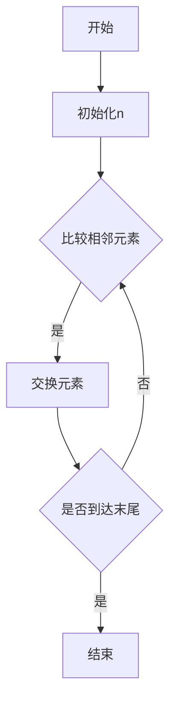

                 

# 书名:《知识付费与传统就业:程序员的权衡之道》

## 摘要

本文旨在探讨知识付费与传统就业模式在程序员职业发展中的选择与权衡。通过对知识付费和传统就业模式的概述、比较，以及实际案例分析，本文旨在帮助程序员理解两种模式的优缺点，并为其职业规划提供指导。本文的核心内容包括：

1. **知识付费与传统就业概述**：介绍知识付费和传统就业的定义、历史、优势和主要形式。
2. **知识付费与传统就业的比较**：分析两种模式在收入水平、工作稳定性和灵活性、职业发展前景等方面的异同。
3. **程序员的权衡之道**：通过自我评估和案例分析，探讨程序员选择知识付费或传统就业的决策过程。
4. **案例研究与策略制定**：结合成功案例，提出具体的职业选择策略。
5. **未来趋势与展望**：探讨知识付费与传统就业的未来发展方向，以及程序员在其中的角色。

通过本文，读者将能够更清晰地认识到知识付费与传统就业模式的特点，并为自己的职业发展做出明智的选择。无论您是刚刚踏入编程领域的初学者，还是有一定经验的程序员，本文都希望能为您提供有价值的参考和启示。

## 第一部分：引言

### 第1章：知识付费与传统就业概述

#### 1.1 什么是知识付费

**定义与历史**

知识付费，即用户为获取特定知识或服务而支付费用的一种商业模式。这种模式最早可以追溯到互联网泡沫时期的在线教育平台，如Coursera和Udemy，它们通过提供课程视频和作业评估，为学习者提供有偿的教育资源。随着移动互联网和电子商务的发展，知识付费逐渐成为一种主流的消费形式。

在知识付费的早期阶段，主要以在线教育为主，用户通过购买课程来学习新的知识和技能。随着技术的进步，知识付费的形式变得更加多样，涵盖了在线培训、专家咨询、知识分享平台等。例如，知乎Live、得到App等平台，通过邀请行业专家进行主题分享或提供个性化咨询，为用户提供了丰富的知识付费选择。

**优势**

1. **个性化学习体验**：知识付费平台通常提供多样化的学习资源和课程，用户可以根据自己的需求和兴趣选择合适的课程，实现个性化学习。
2. **高效的知识获取**：相比于传统的教育模式，知识付费更加灵活，用户可以在任何时间、任何地点进行学习，节省了大量的时间和精力。
3. **优质的师资力量**：知识付费平台通常邀请行业内的知名专家和学者进行授课，用户可以接触到高质量的知识资源。
4. **灵活的收入模式**：知识付费模式为创作者提供了多样化的收入来源，激励了更多优秀的内容生产者参与到知识付费市场中。

**主要形式**

1. **在线教育平台**：如Coursera、Udemy等，提供多样化的在线课程和认证。
2. **知识分享平台**：如知乎Live、分答等，提供专家咨询和主题分享。
3. **专业培训**：如IT培训机构、编程学习平台等，提供专业的技能培训。
4. **个性化咨询**：如职业咨询、投资建议等，提供一对一的专业服务。

#### 1.2 传统就业模式概述

**定义与发展历程**

传统就业模式是指通过求职、面试、入职等流程，成为某个企业或组织的正式员工，从事与其岗位相关的工作。这种模式起源于工业革命时期，随着生产力的提高和社会分工的细化，人们开始通过就业来获得稳定的收入和生活保障。

传统就业模式经历了几个重要的发展阶段：

1. **计划经济时期**：在计划经济体制下，就业由政府统一分配，个人缺乏就业选择的自由。
2. **市场经济初期**：随着市场经济的逐步确立，就业市场逐渐放开，个人可以通过招聘会、求职网站等途径自主选择就业。
3. **互联网时代**：互联网技术的发展，使得在线招聘、远程办公等新兴就业形式出现，传统就业模式进一步多样化。

**优势与局限性**

**优势**

1. **稳定的工作环境**：传统就业模式下，员工通常享有相对稳定的工作环境和福利待遇，如五险一金、带薪假期等。
2. **完善的职业发展路径**：传统就业模式下，员工可以通过晋升、调岗等途径实现职业发展，通常有明确的晋升路径和职业规划。
3. **良好的团队协作**：在传统就业模式下，员工通常与同事有更多的互动和交流，有助于形成良好的团队协作氛围。

**局限性**

1. **工作灵活性不足**：传统就业模式下，员工的工作时间和地点通常受到一定限制，难以实现灵活办公。
2. **职业发展受限**：在一些企业和组织中，职业晋升和岗位调整可能受到内部竞争和人际关系等因素的影响，导致职业发展受限。
3. **薪酬增长缓慢**：传统就业模式下，员工的薪酬增长通常与工作年限和绩效挂钩，增速可能较慢。

#### 1.3 程序员的职业发展路径

**入门阶段**

在入门阶段，程序员通常需要掌握基本的编程语言和算法知识，具备一定的编程能力。这一阶段的关键任务包括：

1. **学习编程语言**：如Python、Java、C++等，选择一种适合自己的编程语言进行深入学习。
2. **掌握算法和数据结构**：理解基本的算法思想和数据结构，如排序算法、查找算法、堆、队列、栈等。
3. **实践编程项目**：通过实际项目锻炼编程能力，积累经验。

**专业技能提升**

在专业技能提升阶段，程序员需要不断拓展自己的知识领域，提高技术能力。这一阶段的关键任务包括：

1. **学习新技术和框架**：关注行业动态，学习新兴技术和框架，如Docker、Kubernetes、React、Vue等。
2. **参与开源项目**：通过参与开源项目，提升实际编程能力，扩大人脉，增强项目经验。
3. **获得专业认证**：通过参加专业认证考试，如Oracle认证、Cisco认证等，提升个人职业资质。

**职业发展阶段**

在职业发展阶段，程序员可以根据个人兴趣和市场需求，选择不同的职业发展方向。主要职业发展路径包括：

1. **开发工程师**：专注于软件开发，从事系统设计、编码、测试等工作。
2. **运维工程师**：负责系统运维、网络管理、安全管理等工作。
3. **测试工程师**：专注于软件测试，从事功能测试、性能测试、安全测试等工作。
4. **项目经理**：负责项目规划、执行、监控等工作，具备一定的项目管理能力。
5. **技术专家**：专注于技术研究和创新，承担技术指导和培训工作。

#### 第2章：知识付费与传统就业的比较

在讨论知识付费与传统就业的比较之前，我们需要明确两者的核心概念和特点。知识付费是一种通过支付费用获取知识和服务的商业模式，它强调个性化、灵活性和高效性。而传统就业则是一种通过成为企业或组织的正式员工获得职业发展的模式，它强调稳定性和职业规划。

## 2.1 收入水平比较

收入水平是程序员在选择职业路径时需要考虑的重要因素之一。知识付费和传统就业在收入水平方面各有特点，以下将详细比较两种模式在收入来源、稳定性、增长潜力等方面的异同。

### 2.1.1 知识付费的收益模式

知识付费的收益模式通常包括课程销售、会员订阅、一对一咨询等。程序员通过创作课程、提供专业咨询服务或加入知识付费平台，获得相应的收益。

**1. 收入来源**

- **课程销售**：程序员通过制作和销售在线课程，获得课程销售收入。这种模式的优点是收入稳定，且可以通过不断更新课程内容来吸引更多用户。
- **会员订阅**：程序员可以创建会员制平台，用户通过订阅会员服务，获得定期更新的课程、资料和咨询服务。
- **一对一咨询**：程序员通过提供一对一的专业咨询，帮助用户解决具体问题，获得咨询费用。

**2. 收入稳定性**

知识付费的收入稳定性取决于多个因素，如课程质量、用户满意度、市场推广等。优秀的课程和良好的用户体验可以吸引更多用户，从而稳定收入来源。然而，如果课程内容过时或用户体验不佳，可能会导致用户流失，影响收入稳定性。

**3. 收入增长潜力**

知识付费的收入增长潜力较大，因为程序员可以通过不断更新课程内容、拓展服务范围来吸引更多用户。此外，随着互联网技术的发展和知识付费市场的扩大，程序员可以通过多平台、多渠道的推广，进一步增加收入。

### 2.1.2 传统就业的收入结构

传统就业的收入结构通常包括基本工资、奖金、提成等。程序员作为企业或组织的正式员工，按照岗位和业绩获得相应的收入。

**1. 收入来源**

- **基本工资**：程序员的基本工资通常与其职位和经验有关。基本工资是稳定的收入来源，但增长速度可能较慢。
- **奖金**：程序员可以根据公司业绩、个人绩效等因素获得奖金。奖金通常有一定的波动性，但能够提升整体收入水平。
- **提成**：在一些销售岗位，程序员可以通过提成获得额外的收入，这种模式的收入与个人业绩直接挂钩。

**2. 收入稳定性**

传统就业的收入稳定性较高，因为基本工资和奖金通常有明确的计算方式和发放周期。此外，企业通常会为员工提供一定的福利待遇，如五险一金、带薪假期等，增强了收入稳定性。

**3. 收入增长潜力**

传统就业的收入增长潜力相对较小，因为基本工资的增长速度通常较慢，奖金和提成的发放也受到公司业绩和个人绩效的影响。然而，程序员可以通过晋升、岗位调整等途径提高收入水平，但这个过程通常需要较长的时间和积累。

### 2.1.3 收入水平的实际案例分析

为了更直观地了解知识付费和传统就业在收入水平方面的差异，我们可以通过实际案例进行分析。

**案例1：知识付费模式**

假设一位程序员通过制作和销售在线课程，每月能获得5000美元的收入。这个收入主要来自于课程销售和会员订阅，其中课程销售收入占60%，会员订阅收入占40%。

- **课程销售收入**：每月约3000美元，通过不断更新课程内容和市场推广，有潜力进一步提升。
- **会员订阅收入**：每月约2000美元，通过增加会员服务和内容更新，可以保持稳定的收入增长。

**案例2：传统就业模式**

假设另一程序员在某互联网公司担任高级开发工程师，年薪为12万美元，月薪约为10000美元。此外，每月还有2000美元的绩效奖金。

- **基本工资**：每月约10000美元，增长速度较慢。
- **绩效奖金**：每月约2000美元，受公司业绩和个人绩效影响。

通过以上案例，我们可以看到，知识付费和传统就业在收入水平方面各有特点。知识付费模式的收入相对较高，但稳定性较差；传统就业的收入稳定性较高，但增长潜力较小。程序员在选择职业路径时，需要根据自己的职业规划、风险承受能力和个人兴趣，综合考虑收入水平的影响。

## 2.2 工作稳定性和灵活性比较

工作稳定性和灵活性是程序员在选择职业路径时需要考虑的重要因素。知识付费和传统就业在这两方面表现出不同的特点，以下将详细比较两种模式在工作稳定性、工作时间安排和工作地点选择等方面的异同。

### 2.2.1 知识付费的工作稳定性

知识付费的工作稳定性相对较低，主要受以下因素影响：

**1. 市场需求波动**

知识付费市场受市场需求波动的影响较大。如果某个领域或课程内容的市场需求下降，可能导致用户减少，从而影响收入稳定性。例如，当区块链技术热度下降时，相关的知识付费课程收入可能会受到影响。

**2. 知识更新速度**

知识付费要求程序员不断更新自己的知识库和课程内容，以保持市场竞争力。然而，知识更新速度越快，对程序员的要求也越高，可能导致工作压力增加，影响稳定性。

**3. 用户反馈**

知识付费的稳定性也受用户反馈的影响。如果用户对课程内容或服务质量不满意，可能导致用户流失，从而影响收入稳定性。

### 2.2.2 传统就业的工作稳定性

传统就业的工作稳定性较高，主要表现在以下几个方面：

**1. 企业稳定性**

在传统就业模式下，员工通常为企业提供长期服务，企业为了维护稳定的团队和业务，会提供较为稳定的工作环境。

**2. 福利保障**

传统就业企业通常会为员工提供较为完善的福利保障，如五险一金、带薪假期、健康体检等，增强了工作的稳定性。

**3. 职业发展规划**

传统就业企业通常有明确的职业发展规划，通过晋升、岗位调整等途径，帮助员工实现职业发展，提高了工作稳定性。

### 2.2.3 程序员在两种模式下的工作灵活性

知识付费模式下的工作灵活性较高，主要体现在以下几个方面：

**1. 工作时间安排**

知识付费程序员可以根据自己的时间安排工作，灵活调整工作时间。例如，在课程录制和用户咨询高峰期增加工作时间，在其他时间进行休息或学习。

**2. 工作地点选择**

知识付费程序员通常可以在任何有网络连接的地方工作，不受地理限制。这种模式适合喜欢自由办公、远程工作的程序员。

**3. 项目选择**

知识付费程序员可以自由选择项目，根据自己的兴趣和市场需求来决定课程内容和方向。

### 2.2.4 传统就业的工作灵活性

传统就业模式下的工作灵活性相对较低，主要体现在以下几个方面：

**1. 工作时间安排**

传统就业模式下，员工通常需要按照企业规定的时间表工作，工作时间和休息时间相对固定，灵活性较低。

**2. 工作地点选择**

虽然现代企业的远程办公趋势有所增加，但传统就业模式下，员工仍然需要到公司办公，工作地点选择受限。

**3. 项目选择**

传统就业模式下，员工的职位和项目通常由企业安排，员工在选择项目方面的自由度较低。

### 2.2.5 实际案例分析

为了更直观地了解知识付费和传统就业在工作稳定性和灵活性方面的差异，我们可以通过实际案例进行分析。

**案例1：知识付费模式**

假设一位程序员选择知识付费模式，他每月通过课程销售和会员订阅获得5000美元的收入。他在工作时间上具有很高的灵活性，可以根据自己的安排进行工作。然而，由于市场需求波动和知识更新速度，他的收入稳定性相对较低。

- **工作稳定性**：受市场需求波动和知识更新速度影响，稳定性较低。
- **工作时间安排**：具有很高的灵活性，可以根据自己的安排进行工作。
- **工作地点选择**：可以在任何有网络连接的地方工作，不受地理限制。

**案例2：传统就业模式**

假设另一位程序员在一家互联网公司担任高级开发工程师，月薪10000美元，另有2000美元的绩效奖金。他在工作时间上相对固定，需要按照企业规定的时间表工作。然而，他享有较为稳定的工作环境和完善的福利保障。

- **工作稳定性**：稳定性较高，受企业稳定性、福利保障和职业发展规划的影响。
- **工作时间安排**：需要按照企业规定的时间表工作，灵活性较低。
- **工作地点选择**：需要到公司办公，工作地点选择受限。

通过以上案例分析，我们可以看到，知识付费和传统就业在工作稳定性和灵活性方面各有优缺点。程序员在选择职业路径时，需要根据自己的职业规划、风险承受能力和个人兴趣，综合考虑工作稳定性和灵活性。

## 2.3 职业发展前景比较

在职业发展前景方面，知识付费和传统就业模式也表现出不同的特点。以下将详细比较两种模式在职业发展路径、晋升机会和职业发展空间等方面的异同。

### 2.3.1 知识付费的职业生涯

知识付费模式为程序员提供了多样化的职业发展路径，主要表现在以下几个方面：

**1. 课程创作者**

程序员可以通过创作高质量的在线课程，成为知识付费平台上的课程创作者。这一职业路径需要程序员具备良好的教学能力、丰富的专业知识和一定的市场洞察力。课程创作者的收入取决于课程质量和用户满意度，发展潜力较大。

**2. 咨询师**

程序员可以提供专业咨询服务，帮助用户解决具体问题。咨询师需要具备扎实的专业知识和丰富的实践经验，能够为用户提供有针对性的解决方案。这一职业路径的收入较高，但需要良好的沟通能力和解决问题的能力。

**3. 平台运营者**

程序员可以参与到知识付费平台的运营和管理，负责课程内容审核、用户管理、市场推广等工作。平台运营者需要具备较强的项目管理能力、沟通能力和团队协作能力。这一职业路径具有较大的发展空间，但也需要较高的综合素质。

### 2.3.2 传统就业的职业生涯

传统就业模式下的职业生涯通常具有明确的晋升路径和职业发展空间，主要表现在以下几个方面：

**1. 开发工程师**

程序员作为开发工程师，可以通过积累项目经验和提升技术水平，逐步晋升为高级开发工程师、技术专家等。开发工程师的职业路径主要依赖于技术能力和项目经验的积累。

**2. 运维工程师**

运维工程师可以通过不断提升运维技能和管理能力，晋升为高级运维工程师、运维经理等。运维工程师的职业路径注重对系统运维、网络管理和安全管理等方面的精通。

**3. 测试工程师**

测试工程师可以通过积累测试经验和提升测试技能，晋升为高级测试工程师、测试经理等。测试工程师的职业路径主要关注测试方法、测试工具和测试流程等方面的提升。

**4. 项目经理**

程序员可以转向项目管理岗位，负责项目规划、执行和监控等工作。项目经理的职业路径需要具备较强的项目管理能力、沟通能力和团队协作能力。

### 2.3.3 程序员在不同模式下的职业发展路径

知识付费和传统就业在职业发展路径方面各有特点，程序员需要根据自己的兴趣、能力和市场需求选择合适的职业路径。

**1. 知识付费模式**

知识付费模式适合喜欢创新、有教学能力和市场洞察力的程序员。程序员可以通过创作课程、提供咨询服务或运营知识付费平台，实现职业发展。然而，知识付费模式的收入稳定性相对较低，程序员需要不断更新自己的知识和技能，以适应市场变化。

**2. 传统就业模式**

传统就业模式适合喜欢稳定、有职业规划能力的程序员。程序员可以通过在大型企业或组织中工作，积累项目经验和技术能力，实现职业发展。传统就业模式下的职业发展路径较为明确，但灵活性相对较低，程序员需要遵循企业的晋升规则和发展规划。

### 2.3.4 实际案例分析

为了更直观地了解知识付费和传统就业在职业发展前景方面的差异，我们可以通过实际案例进行分析。

**案例1：知识付费模式**

假设一位程序员选择知识付费模式，他通过创作高质量的在线课程，每月获得5000美元的收入。他选择了课程创作者的路径，通过不断更新课程内容和拓展用户群体，他的收入和影响力逐渐增加。此外，他还通过提供一对一的咨询服务，进一步提高了自己的收入水平。

- **职业发展路径**：课程创作者
- **收入水平**：每月约5000美元，具有较大的增长潜力
- **职业发展空间**：受市场需求和自身能力影响，职业发展空间较大

**案例2：传统就业模式**

假设另一位程序员在一家互联网公司担任高级开发工程师，月薪10000美元，另有2000美元的绩效奖金。他通过不断积累项目经验和提升技术水平，逐步晋升为技术专家。他的职业发展路径较为稳定，但收入增长速度相对较慢。

- **职业发展路径**：高级开发工程师 -> 技术专家
- **收入水平**：每月约12000美元，增长速度较慢
- **职业发展空间**：受企业晋升规则和发展规划影响，职业发展空间较为明确

通过以上案例分析，我们可以看到，知识付费和传统就业在职业发展前景方面各有优缺点。程序员在选择职业路径时，需要根据自己的兴趣、能力和市场需求，综合考虑职业发展前景的影响。

## 第3章：程序员选择知识付费还是传统就业

在了解了知识付费和传统就业模式的概述、比较以及各自的优势和局限性后，程序员需要根据自己的实际情况和职业规划，选择合适的职业路径。以下将详细探讨程序员选择知识付费还是传统就业的决策过程，包括自我评估、案例分析以及实际操作流程。

### 3.1 自我评估

程序员在选择知识付费或传统就业之前，需要进行全面的自我评估，以了解自己的个人能力、职业兴趣和市场需求。以下是一些关键的评估要素：

**1. 个人能力评估**

- **技术能力**：程序员需要评估自己的编程技能、算法能力、项目经验等，确定自己在技术方面的优势与不足。
- **教学能力**：如果选择知识付费模式，程序员需要评估自己的教学能力，包括表达能力、课程设计能力和用户体验设计等。
- **沟通能力**：无论选择哪种模式，良好的沟通能力都是必不可少的，包括与用户、团队和其他利益相关者的沟通。

**2. 职业兴趣分析**

- **兴趣点**：程序员需要了解自己对编程、项目管理、知识传播等领域的兴趣程度，确定自己最感兴趣的领域。
- **职业愿景**：程序员需要明确自己的长期职业愿景，是追求技术深度还是广度，是希望有稳定的工作环境还是灵活自由的工作方式。

**3. 市场需求分析**

- **市场需求**：程序员需要分析当前市场对知识付费内容的需求，了解哪些领域和技能最受欢迎，是否有足够的市场空间。
- **竞争环境**：了解同行业内其他程序员的职业选择和成功案例，分析自己在竞争中的优势和劣势。

### 3.1.1 程序员的个人能力评估

在进行个人能力评估时，程序员可以从以下几个方面进行自我分析：

**1. 编程技能**

- **语言掌握**：了解自己熟练掌握的编程语言和工具，如Java、Python、C++等。
- **项目经验**：回顾自己参与的项目，评估自己在项目中的角色和贡献，包括系统设计、编码、测试等。
- **算法能力**：通过算法竞赛、在线测评等方式，评估自己的算法和数据结构能力。

**2. 教学能力**

- **表达能力**：通过授课、讲座等方式，评估自己的表达能力，包括语言组织、逻辑清晰度等。
- **课程设计**：通过设计课程、编写教材等方式，评估自己的课程设计能力，包括知识点覆盖、学习路径规划等。
- **用户体验**：通过用户反馈、教学评价等方式，评估自己的用户体验设计能力，包括课程互动性、学习资源丰富度等。

**3. 沟通能力**

- **团队协作**：通过参与团队合作项目，评估自己在团队中的沟通协调能力。
- **项目沟通**：通过项目汇报、会议记录等方式，评估自己在项目沟通中的表现，包括信息传递的准确性、及时性等。
- **客户沟通**：通过与客户沟通，评估自己在客户服务中的沟通能力，包括解决问题、提供支持等。

### 3.1.2 程序员的职业兴趣分析

在职业兴趣分析方面，程序员可以从以下几个方面进行：

**1. 兴趣点**

- **技术深度**：如果程序员对技术细节有浓厚的兴趣，希望深入研究某一技术领域，那么选择传统就业模式可能更合适。
- **技术广度**：如果程序员对多种技术领域都有兴趣，希望拓宽自己的知识面，那么知识付费模式可能更适合，因为知识付费允许程序员在多个领域进行学习和分享。

**2. 职业愿景**

- **创业**：如果程序员的职业愿景是创业，希望通过自己的知识和技能创建自己的公司或品牌，那么知识付费模式可能更适合，因为它提供了更大的自主性和灵活性。
- **稳定发展**：如果程序员的职业愿景是稳定发展，希望在一个稳定的组织中有明确的职业晋升路径，那么传统就业模式可能更适合。

### 3.1.3 自我评估与决策模型

基于以上评估要素，程序员可以建立一个简单的决策模型，帮助自己在知识付费和传统就业之间做出选择：

**1. 评估总分**

- **技术能力**：给编程技能、项目经验和算法能力等每个方面打分，计算总分。
- **教学能力**：给表达能力、课程设计能力和用户体验设计等每个方面打分，计算总分。
- **沟通能力**：给团队协作、项目沟通和客户沟通等每个方面打分，计算总分。

**2. 职业兴趣得分**

- **兴趣点**：根据对技术深度或广度的兴趣，给每个方面打分。
- **职业愿景**：根据对创业或稳定发展的期望，给每个方面打分。

**3. 市场需求得分**

- **市场需求**：根据当前市场对知识付费内容的需求，给每个方面打分。
- **竞争环境**：根据同行业内其他程序员的职业选择和成功案例，给每个方面打分。

**4. 综合评估**

- **总分**：将技术能力、教学能力和沟通能力的得分相加，得到总分。
- **职业兴趣**：将兴趣点和职业愿景的得分相加，得到职业兴趣总分。
- **市场需求**：将市场需求和竞争环境的得分相加，得到市场需求总分。

**5. 决策**

- 如果总分和市场需求得分较高，且职业兴趣得分与市场需求得分相近，那么选择知识付费模式可能更适合。
- 如果总分和市场需求得分较高，且职业兴趣得分与总分相近，那么选择传统就业模式可能更适合。

通过以上自我评估和决策模型，程序员可以更清晰地了解自己的优势和劣势，为自己的职业选择提供科学依据。

### 3.2 知识付费案例分析

为了更好地理解知识付费模式，以下将分析几位成功知识付费程序员的案例，探讨他们的成功经验和面临的挑战。

#### 3.2.1 成功知识付费程序员的案例

**案例1：程序员A的在线教育创业**

程序员A曾是一家知名互联网公司的资深开发工程师，因对在线教育充满热情，他决定辞职创办自己的在线教育平台。他通过自学和参加专业培训，掌握了在线课程制作、市场营销等技能。他的平台提供高质量的编程课程，吸引了许多学习者。

- **成功经验**：程序员A通过不断创新和优化课程内容，积累了大量用户，建立了良好的口碑。他的平台不仅提供了在线课程，还提供了实战项目和一对一辅导，满足了学习者的不同需求。
- **面临的挑战**：尽管取得了成功，但程序员A也面临诸多挑战。首先是市场竞争激烈，需要不断推出高质量的课程来吸引和保留用户。其次是资金压力，平台运营需要持续投入，尤其是在初期阶段。

**案例2：程序员B的专业咨询服务**

程序员B在大型企业工作多年，积累了丰富的项目经验和专业知识。他决定离开企业，专注于提供专业咨询服务。他的咨询服务涵盖了软件架构设计、性能优化等高难度领域。

- **成功经验**：程序员B凭借深厚的专业知识和丰富的实战经验，为众多客户提供了有效的解决方案，赢得了良好的口碑和稳定的收入。他的咨询服务价格较高，但因其专业性和实用性，受到了客户的青睐。
- **面临的挑战**：程序员B需要不断更新自己的知识和技能，以保持市场竞争力。此外，他的服务范围相对狭窄，可能无法满足所有客户的需求。

#### 3.2.2 知识付费的挑战与机遇

知识付费模式虽然具有巨大的潜力，但也面临着一些挑战和机遇。

**挑战**

1. **市场竞争激烈**：随着知识付费市场的不断扩大，竞争也日益激烈。程序员需要不断创新和提升自己的课程质量，以吸引和保留用户。
2. **资金压力**：知识付费平台和咨询师在初期可能面临较大的资金压力，需要持续投入来提高课程质量和推广力度。
3. **知识更新速度**：程序员需要不断学习新的知识和技能，以适应快速变化的市场需求。

**机遇**

1. **市场扩张**：随着互联网技术的发展和用户需求的增长，知识付费市场具有巨大的扩张潜力。程序员可以抓住这个机遇，提供多样化的知识和服务。
2. **个性化学习**：知识付费模式满足了用户对个性化学习的需求，程序员可以根据用户的兴趣和需求，提供定制化的课程和服务。
3. **收入潜力**：知识付费模式为程序员提供了较高的收入潜力，尤其是在某些专业领域，高质量的咨询服务和课程可以带来可观的收益。

#### 3.2.3 知识付费的实际操作流程

为了帮助程序员更好地了解知识付费的实际操作流程，以下将简要介绍知识付费平台的主要功能和使用技巧。

**1. 创建课程**

- **课程规划**：程序员需要根据市场需求和自身优势，确定课程的主题、内容和目标受众。
- **课程制作**：使用视频编辑软件制作课程视频，编写课程文档，设计课程互动环节等。
- **课程发布**：在知识付费平台上发布课程，设置课程价格、优惠和推广策略。

**2. 用户管理**

- **用户注册**：用户通过平台注册账号，可以浏览课程、购买课程和参与互动。
- **用户互动**：程序员可以通过论坛、问答区等互动功能，与用户进行交流和互动，解答用户疑问。
- **用户反馈**：收集用户对课程的反馈，不断优化和更新课程内容。

**3. 课程推广**

- **平台推广**：利用知识付费平台提供的推广工具，如广告投放、SEO优化等，提高课程曝光率。
- **内容营销**：通过撰写博客、发布案例等，提高课程知名度，吸引潜在用户。
- **合作推广**：与其他平台、KOL合作，扩大课程影响力。

**4. 收益管理**

- **收益结算**：平台根据课程销售情况，按月或按季度结算收益。
- **收益分配**：平台和程序员根据事先约定的比例，分配收益。
- **资金管理**：程序员需要合理规划资金使用，确保平台的正常运营和发展。

通过以上实际操作流程，程序员可以更好地了解知识付费模式的运作方式，为自己的知识付费事业打下坚实的基础。

### 3.3 传统就业案例分析

为了更好地理解传统就业模式，以下将分析几位成功程序员的案例，探讨他们的职业发展路径、面临的风险与挑战以及实际操作流程。

#### 3.3.1 成功传统就业程序员的案例

**案例1：程序员C的职业晋升**

程序员C从大学毕业后加入了一家知名的互联网公司，开始了他的职业生涯。他凭借出色的编程技能和团队合作精神，逐步晋升为高级开发工程师，最终成为技术经理。

- **职业发展路径**：程序员C的职业发展路径清晰，他通过不断学习和积累经验，从初级开发工程师晋升为高级开发工程师，再成为技术经理。在这个过程中，他参与了多个关键项目，积累了丰富的项目管理经验和技术领导能力。
- **面临的风险与挑战**：尽管程序员C的职业发展顺利，但他也面临一些风险和挑战。首先是技术更新的压力，随着新技术和框架的不断发展，他需要不断学习和适应。其次是职业发展的瓶颈，如果他在某个职位上停滞不前，可能会影响他的职业前景。

**案例2：程序员D的职业转型**

程序员D在传统就业模式下工作了几年后，决定转型为项目经理。他通过参加项目管理培训，获得了PMP认证，并成功转型为项目经理。

- **职业发展路径**：程序员D的职业转型较为成功，他从技术岗位转向了管理岗位，拓展了自己的职业领域。作为项目经理，他负责项目规划、执行和监控，需要具备较强的沟通协调能力和团队管理能力。
- **面临的风险与挑战**：程序员D在转型过程中面临的风险和挑战包括项目管理经验的积累、客户关系的维护以及领导能力的提升。他需要适应新的工作内容和职责，并克服转型初期的困难。

#### 3.3.2 传统就业中的风险与挑战

传统就业模式虽然提供了稳定的工作环境和职业发展路径，但也存在一些风险和挑战，程序员需要充分了解并做好准备。

**1. 技术更新压力**

随着科技的快速发展，编程语言、框架和技术工具不断更新。程序员需要不断学习和适应新技术，以保持自己的竞争力。技术更新的压力可能会导致工作负担加重，影响工作效率和职业发展。

**2. 职业发展瓶颈**

在传统就业模式下，程序员的职业发展可能面临瓶颈。如果公司内部的晋升机会有限，或者个人能力无法满足更高层次的要求，程序员可能会感到职业发展的停滞。这需要程序员具备自我提升的能力，寻找新的职业机会。

**3. 工作稳定性**

虽然传统就业模式提供了稳定的工作环境和福利待遇，但企业可能面临经营风险，如市场波动、业务调整等。这些因素可能导致公司裁员或重组，影响程序员的工作稳定性。

**4. 工作压力**

程序员在传统就业模式下，可能面临较高的工作压力。项目进度、质量要求、团队合作等都是影响工作压力的重要因素。长期的高压工作环境可能对身心健康产生负面影响。

#### 3.3.3 传统就业的实际操作流程

为了帮助程序员更好地了解传统就业的实际操作流程，以下将简要介绍求职、面试和职业发展等关键环节。

**1. 求职**

- **简历撰写**：程序员需要撰写专业的简历，突出自己的技术能力和项目经验。简历应包括个人基本信息、教育背景、工作经历、项目经验、技能特长等。
- **求职渠道**：程序员可以通过招聘网站、社交媒体、职业推荐等渠道寻找合适的职位。同时，建立良好的职业社交网络，扩大求职机会。
- **求职准备**：在求职过程中，程序员需要准备好面试所需的材料，如简历、证书、项目作品等。

**2. 面试**

- **面试准备**：程序员需要了解应聘公司的背景、文化、业务等，准备好面试中可能遇到的问题。同时，展示自己的沟通能力和团队合作精神。
- **面试过程**：面试过程中，程序员需要回答面试官的问题，展示自己的技术能力、项目经验和职业素养。同时，通过提问了解公司的发展前景和团队氛围。
- **面试结果**：面试结束后，程序员需要及时跟进面试结果，了解公司反馈，做好面试总结。

**3. 职业发展**

- **岗位调整**：程序员可以根据个人兴趣和市场需求，申请内部岗位调整，如从开发工程师转向运维工程师或测试工程师等。
- **晋升机会**：程序员需要积极参与公司培训和项目，提升自己的专业技能和管理能力，争取晋升机会。
- **职业规划**：程序员需要制定个人职业规划，明确自己的职业目标和发展路径，定期进行自我评估和调整。

通过以上实际操作流程，程序员可以更好地应对传统就业中的挑战，实现职业发展。

### 第4章：程序员的职业选择策略

#### 4.1 知识付费策略

在知识付费领域，程序员需要制定一套有效的策略，以实现自己的职业目标和持续发展。以下将介绍知识付费的商业模式、营销策略和法律与道德考量。

**1. 商业模式**

知识付费的商业模式主要包括课程销售、会员订阅、一对一咨询等。程序员可以根据自己的特长和市场需求，选择合适的商业模式。

- **课程销售**：程序员可以通过制作和销售在线课程，获得课程销售收入。这种模式适合擅长教学和课程设计的程序员。
- **会员订阅**：程序员可以创建会员制平台，用户通过订阅会员服务，获得定期更新的课程、资料和咨询服务。这种模式适合提供多样化内容和长期服务的程序员。
- **一对一咨询**：程序员可以提供专业咨询服务，帮助用户解决具体问题，获得咨询费用。这种模式适合具有丰富专业知识和实践经验的高级程序员。

**2. 营销策略**

知识付费的营销策略至关重要，直接影响课程的曝光率和用户转化率。以下是一些有效的营销策略：

- **内容营销**：通过撰写高质量的技术博客、发布案例研究等，提高自己在行业内的知名度。优质的内容可以吸引潜在用户，增加课程销量。
- **社交媒体推广**：利用社交媒体平台，如微博、微信公众号、知乎等，发布课程信息、学习心得和互动内容。通过社交媒体的传播，扩大课程影响力。
- **合作推广**：与其他平台、行业专家、培训机构等建立合作，共同推广课程。通过合作，可以借助合作伙伴的资源和用户群体，提高课程曝光率。
- **用户反馈**：积极收集用户反馈，不断优化课程内容和教学质量。良好的用户体验可以增加用户满意度，提高复购率。

**3. 法律与道德考量**

知识付费领域涉及知识产权、隐私保护、用户权益等法律和道德问题，程序员需要遵守相关法律法规，确保自身运营的合法性。

- **知识产权保护**：程序员在制作课程内容时，应确保内容原创，避免侵权行为。如果引用他人作品，应注明来源，尊重知识产权。
- **隐私保护**：在用户管理过程中，程序员应严格遵守隐私保护法律法规，不得泄露用户个人信息。通过加密技术、数据备份等措施，确保用户数据安全。
- **用户权益**：程序员应尊重用户权益，提供优质的服务。对于用户投诉和纠纷，应积极处理，维护用户合法权益。

通过以上策略，程序员可以更好地在知识付费领域实现职业发展。

#### 4.2 传统就业策略

在传统就业领域，程序员需要制定一系列策略，以应对职业发展中的挑战，实现个人和公司的共同目标。以下将介绍传统就业的招聘策略、职业晋升策略和职业发展规划。

**1. 招聘策略**

招聘策略是传统就业中的重要环节，直接影响公司的人才储备和项目进展。以下是一些有效的招聘策略：

- **精准招聘**：根据公司需求，明确招聘标准和职位要求。通过精准的招聘广告和简历筛选，吸引符合要求的候选人。
- **渠道拓展**：利用多种招聘渠道，如招聘网站、社交媒体、校园招聘等，扩大招聘范围。通过与高校、培训机构合作，挖掘潜在优秀人才。
- **面试评估**：建立完善的面试流程，包括技术面试、行为面试、团队合作评估等，全面了解候选人的能力和潜力。
- **雇主品牌**：提升公司雇主品牌，增强行业吸引力和人才竞争力。通过良好的企业文化、职业发展机会和福利待遇，吸引优秀人才加入。

**2. 职业晋升策略**

职业晋升策略是程序员在传统就业中实现职业发展的关键。以下是一些有效的晋升策略：

- **技能提升**：持续学习新技术和框架，提升自身技术能力和项目经验。通过参加培训、阅读专业书籍、参与开源项目等方式，不断充实自己的知识储备。
- **业绩表现**：在工作中，注重业绩表现，努力完成项目目标，提升团队的整体业绩。通过优异的业绩，赢得上级和同事的认可。
- **沟通能力**：提升沟通能力，包括与上级、同事、客户的沟通。良好的沟通能力有助于项目顺利进行，增强团队协作能力。
- **领导能力**：培养领导能力，包括项目管理、团队管理、决策能力等。通过承担更多的责任和角色，提升自己的职业竞争力。

**3. 职业发展规划**

职业发展规划是程序员在传统就业中实现长期职业目标的重要工具。以下是一些有效的职业发展规划策略：

- **明确目标**：制定明确的职业发展目标，包括短期和长期目标。短期目标如晋升为高级开发工程师，长期目标如成为技术经理或技术专家。
- **路径规划**：根据职业目标，规划具体的路径和步骤。如提升技术能力、积累项目管理经验、承担更多责任等。
- **自我评估**：定期进行自我评估，了解自己在职业发展中的优势和不足。通过自我评估，制定针对性的改进措施，不断提升自己的能力。
- **持续学习**：保持持续学习的态度，不断学习新技术、新知识。通过学习，不断提升自己的竞争力，实现职业发展目标。

通过以上策略，程序员可以更好地在传统就业领域实现职业发展。

#### 4.3 案例研究

为了更好地理解知识付费和传统就业策略的实际应用，以下将分析几个成功案例，探讨策略的具体实施和效果。

**案例1：知识付费成功案例**

程序员A是一位有着丰富编程经验的开发者，他在知识付费领域取得了显著的成功。以下是他的策略实施和效果：

- **策略实施**：程序员A选择了课程销售和会员订阅的商业模式。他制作了一系列高质量的编程课程，涵盖了从基础到高级的内容。同时，他通过社交媒体和合作伙伴的推广，扩大了课程的曝光率。为了提升用户体验，他定期更新课程内容，并建立了互动社区，与学员保持密切的沟通。
- **效果分析**：通过不断的努力，程序员A的在线课程吸引了大量学员，课程销量稳步提升。他的收入逐渐增加，从最初的兼职收入发展到可以全职从事知识付费工作。此外，他的课程还获得了多个奖项，进一步提升了他的行业影响力。

**案例2：传统就业成功案例**

程序员B在一家互联网公司工作，通过一系列职业晋升策略，实现了自己的职业发展目标。以下是他的策略实施和效果：

- **策略实施**：程序员B注重技能提升和业绩表现。他通过参加内部培训和外部学习，不断提升自己的技术能力和项目经验。在工作中，他积极承担责任，努力完成项目目标，并带领团队取得了优异的成绩。他还注重与上级和同事的沟通，建立了良好的工作关系。
- **效果分析**：通过不断的努力，程序员B从初级开发工程师晋升为高级开发工程师，再成为项目经理。他的职业发展路径清晰，收入和地位不断提升。他的领导能力和团队合作精神得到了上级和同事的高度认可，为公司的发展做出了重要贡献。

**案例3：跨模式成功案例**

程序员C在知识付费和传统就业之间取得了平衡，通过多种策略实现了职业发展的双赢。以下是他的策略实施和效果：

- **策略实施**：程序员C在知识付费领域，选择了课程销售和一对一咨询的商业模式。他通过制作高质量的编程课程，建立了自己的知识品牌。同时，他在传统就业领域，通过不断提升技能和业绩表现，实现了职业晋升。他还积极参与公司项目和外部项目，积累了丰富的项目经验。
- **效果分析**：通过知识付费，程序员C获得了可观的收入，提高了自己的知名度和影响力。在传统就业领域，他的职业发展也取得了显著成果，成为公司的技术骨干和项目负责人。他的跨模式策略不仅实现了职业发展的双赢，还为他的未来提供了更多的选择和可能性。

通过以上案例，我们可以看到，成功的程序员在知识付费和传统就业方面都有明确的策略，并能够根据实际情况灵活调整和实施。这些策略不仅帮助他们实现了职业发展，也为他们未来的发展提供了坚实的基础。

### 第5章：未来趋势与展望

随着科技的不断进步和互联网的普及，知识付费和传统就业模式都在经历深刻的变革。未来，这两种模式将如何发展，程序员在其中将扮演什么角色，这是我们需要探讨的重要议题。

#### 5.1 知识付费的未来趋势

知识付费作为一种新兴的商业模式，正逐步改变着传统教育和职业发展的模式。以下将探讨知识付费的未来趋势：

**1. 技术革新对知识付费的影响**

随着人工智能、大数据、云计算等技术的快速发展，知识付费模式也将迎来新的变革。例如，通过人工智能技术，知识付费平台可以提供更加个性化的学习体验，根据用户的学习习惯和需求，自动推荐适合的课程。大数据分析可以帮助平台更好地了解用户需求，优化课程内容和营销策略。云计算技术则为知识付费平台提供了强大的计算能力和存储空间，使得大规模课程制作和分发成为可能。

**2. 知识付费市场的扩张**

随着互联网的普及和用户需求的增长，知识付费市场将不断扩大。未来，除了在线教育平台，还会有更多垂直领域的知识付费平台出现，如医疗、法律、金融等。这些平台将提供专业化、个性化的知识服务，满足不同领域的用户需求。同时，随着5G技术的发展，知识付费内容的传输速度将大幅提升，用户可以更加便捷地获取高质量的知识资源。

**3. 知识付费对教育体系的变革**

知识付费的兴起对传统教育体系产生了深远影响。一方面，它提供了更加灵活和多样化的学习方式，用户可以根据自己的需求和兴趣选择学习内容和时间。另一方面，知识付费平台为教育机构提供了新的商业模式，它们可以通过合作或独立开发课程，拓展自己的收入来源。未来，教育体系可能会更加注重在线教育和知识付费的结合，为学生提供更多样化的学习路径。

#### 5.2 传统就业的未来趋势

传统就业模式在面临知识付费的挑战的同时，也在不断适应和变革。以下将探讨传统就业的未来趋势：

**1. 传统就业的数字化转型**

随着数字化技术的广泛应用，传统就业也在向数字化转型。例如，远程办公、在线协作工具、自动化流程等已经成为现代企业运营的标配。这不仅提高了工作效率，也打破了地域限制，使得程序员可以更加灵活地选择工作地点。未来，传统就业将更加依赖于数字化技术，实现更加智能和高效的运营。

**2. 人工智能对就业市场的影响**

人工智能技术的发展将对就业市场产生深远影响。一方面，人工智能可以替代一些重复性和低技能的工作，如数据输入、客服等，从而减少对这些岗位的需求。另一方面，人工智能的兴起也将创造新的就业机会，如人工智能工程师、数据科学家等。程序员需要不断提升自己的技能，以适应这一变革。

**3. 传统就业的未来形态**

未来，传统就业将呈现出更加多样化和个性化的特点。例如，灵活就业、兼职工作、远程工作等将成为主流。程序员可以根据自己的兴趣和市场需求，选择适合自己的工作模式。同时，企业也将更加注重员工的个人发展和职业规划，提供更多的培训和晋升机会。

#### 5.3 程序员的未来角色

在知识付费和传统就业的未来趋势中，程序员的角色也将发生重大变化。以下将探讨程序员在两种模式下的新角色和综合能力提升路径：

**1. 程序员在知识付费领域的新角色**

在知识付费领域，程序员不仅可以作为课程创作者和咨询师，还可以作为平台运营者和技术支持者。他们需要具备以下能力：

- **教学能力**：程序员需要具备良好的教学能力和课程设计能力，能够将复杂的技术知识通俗易懂地传授给用户。
- **内容创作能力**：程序员需要能够创作高质量的课程内容，包括视频、文档、互动环节等。
- **平台运营能力**：程序员需要了解知识付费平台的运营模式，包括用户管理、课程推广、收益管理等。

**2. 程序员在传统就业市场的新角色**

在传统就业市场，程序员的角色将更加多样化和专业化。他们需要具备以下能力：

- **技术能力**：程序员需要不断提升自己的技术能力，掌握最新的编程语言、框架和技术工具。
- **项目管理能力**：程序员需要具备项目管理能力，能够负责项目的规划、执行和监控。
- **沟通协作能力**：程序员需要具备良好的沟通协作能力，能够与团队成员和其他利益相关者有效沟通。

**3. 程序员的综合能力提升路径**

为了在知识付费和传统就业中取得成功，程序员需要不断提升自己的综合能力。以下是一些具体的提升路径：

- **技术学习**：程序员可以通过参加培训、阅读专业书籍、参与开源项目等方式，不断学习新技术和知识。
- **实践项目**：程序员可以通过参与实际项目，积累项目经验，提升自己的技术能力和问题解决能力。
- **职业规划**：程序员需要制定个人职业规划，明确自己的职业目标和路径，定期进行自我评估和调整。
- **终身学习**：程序员需要具备终身学习的态度，不断适应技术变革和市场需求，提升自己的竞争力。

通过以上讨论，我们可以看到，知识付费和传统就业的未来发展趋势为程序员提供了广阔的发展空间。程序员需要根据自己的兴趣和市场需求，不断提升自己的能力，适应未来的职业变化。只有这样，他们才能在未来的职业发展中取得成功。

### 附录A：资源与工具

在程序员选择知识付费或传统就业模式的过程中，了解和掌握相关的资源与工具是非常重要的。以下将推荐一些主流的知识付费平台、求职准备策略、简历撰写技巧和面试准备与技巧，以帮助程序员更好地进行职业规划和实践。

#### A.1 知识付费平台推荐

**1. Coursera**

- **简介**：Coursera 是一家全球领先的在线教育平台，提供大量由全球顶尖大学和机构提供的课程。
- **推荐理由**：课程质量高，涵盖广泛领域，如计算机科学、数据科学、人工智能等。

**2. Udemy**

- **简介**：Udemy 是一家提供广泛课程的知识付费平台，课程内容多样化，适合不同水平的用户。
- **推荐理由**：课程价格实惠，更新速度快，适合自我学习和技能提升。

**3. 知乎Live**

- **简介**：知乎Live 是知乎推出的知识分享平台，提供专家讲座、主题讨论等形式的课程。
- **推荐理由**：内容真实，专家水平高，适合学习最新行业动态和专业知识。

**4. 得到App**

- **简介**：得到App 是一款提供高质量知识服务的应用，包括音频课程、电子书等。
- **推荐理由**：内容丰富，形式多样，适合碎片化学习。

#### A.2 传统就业准备

**1. 求职准备策略**

- **明确职业目标**：在求职前，明确自己的职业目标，包括想要从事的岗位、行业和地点等。
- **优化简历**：撰写专业的简历，突出自己的技术能力、项目经验和成就。简历应简洁明了，重点突出。
- **准备求职信**：撰写针对性的求职信，表达自己对岗位的兴趣和职业愿景。求职信应简洁、有说服力。

**2. 简历撰写技巧**

- **真实准确**：简历中的信息应真实可靠，避免夸大或虚假宣传。
- **结构清晰**：简历应按照时间顺序排列，结构清晰，便于阅读。
- **突出重点**：在简历中突出自己的关键技能和项目经验，尤其是与应聘岗位相关的部分。

**3. 面试准备与技巧**

- **了解公司背景**：在面试前，了解应聘公司的背景、文化和业务。这有助于在面试中展示自己对公司的了解和热情。
- **准备常见问题**：准备一些常见的面试问题，如“你的优点和缺点是什么？”“你对这个岗位有什么期望？”等，并提前想好答案。
- **模拟面试**：与朋友或同事进行模拟面试，提高自己的面试技巧和自信心。
- **着装得体**：面试时应穿着得体，保持良好的仪态，给面试官留下良好的第一印象。

#### A.3 程序员发展资源

**1. 技术博客与社区推荐**

- **GitHub**：全球最大的代码托管平台，提供丰富的开源项目和编程资源。
- **Stack Overflow**：全球最大的开发者社区，提供问题解答、技术讨论等。
- **CSDN**：国内最大的IT社区和服务平台，提供丰富的技术文章和资源。

**2. 在线课程与教材推荐**

- **edX**：提供全球顶尖大学和机构提供的在线课程。
- **MIT OpenCourseWare**：麻省理工学院的开放课程资源，涵盖多个学科领域。
- **Google Developers**：谷歌提供的开发者资源和教程。

**3. 程序员职业发展工具推荐**

- **JIRA**：项目管理工具，用于项目规划、任务分配和进度跟踪。
- **GitLab**：代码管理工具，提供代码托管、项目管理等功能。
- **Trello**：项目管理工具，通过看板和卡片管理项目进度。

通过以上资源与工具的推荐，程序员可以更好地进行职业规划和发展，不断提升自己的技术能力和职业素养。无论选择知识付费还是传统就业模式，掌握这些工具和资源都将对他们的职业发展产生积极的影响。

### 附录B：流程图与代码示例

在本附录中，我们将通过Mermaid流程图和伪代码来展示核心概念和架构，以帮助读者更好地理解文章中的核心原理和算法。

#### 伪代码示例：冒泡排序算法

```plaintext
// 冒泡排序算法
function bubbleSort(arr):
    n = length(arr)
    for i from 0 to n-1:
        for j from 0 to n-i-1:
            if arr[j] > arr[j+1]:
                // 交换arr[j]和arr[j+1]
                temp = arr[j]
                arr[j] = arr[j+1]
                arr[j+1] = temp
    return arr
```

#### Mermaid流程图：冒泡排序算法



#### 伪代码示例：二分查找算法

```plaintext
// 二分查找算法
function binarySearch(arr, target):
    low = 0
    high = length(arr) - 1
    while low <= high:
        mid = (low + high) / 2
        if arr[mid] == target:
            return mid
        else if arr[mid] < target:
            low = mid + 1
        else:
            high = mid - 1
    return -1
```

#### Mermaid流程图：二分查找算法

```mermaid
graph TB
    A[开始] --> B[初始化low和high]
    B --> C{计算mid}
    C -->|arr[mid] == target?| D[返回mid]
    D --> E[结束]
    D -->|否| F{arr[mid] < target?}
    F -->|是| G[更新low]
    G --> C
    F -->|否| H[更新high]
    H --> C
```

通过这些流程图和伪代码，读者可以直观地理解冒泡排序和二分查找算法的原理和实现过程。这些示例不仅有助于巩固核心概念，还为实际编程提供了参考。

### 附录C：源代码实现与代码解读

在本附录中，我们将提供一些实际代码案例，并对其进行详细解读，以帮助读者理解编程过程中的关键步骤和注意事项。

#### 代码案例1：使用Python实现HTTP请求

```python
import requests

# 发送GET请求
response = requests.get('https://api.github.com')
print(response.status_code)
print(response.text)

# 发送POST请求
data = {'username': 'example', 'password': 'password'}
response = requests.post('https://example.com/login', data=data)
print(response.status_code)
print(response.text)
```

#### 代码解读：

1. 导入requests库：`import requests`。requests库是Python中用于发送HTTP请求的常用库，支持GET和POST请求。
2. 发送GET请求：使用`requests.get()`方法发送HTTP GET请求。第一个参数是请求的URL，第二个参数是可选的请求头。
3. 获取响应：获取HTTP响应，包括状态码（`response.status_code`）和响应体（`response.text`）。
4. 发送POST请求：使用`requests.post()`方法发送HTTP POST请求。第一个参数是请求的URL，第二个参数是请求体。
5. 获取响应：获取HTTP响应，包括状态码和响应体。

#### 注意事项：

- 请求URL：确保请求的URL正确无误，符合HTTP协议。
- 请求头：如果需要，可以在请求头中添加自定义头部信息，如内容类型（`Content-Type`）。
- 请求体：对于POST请求，请求体中的数据应按照预期格式（如表单格式、JSON格式）进行编码。

#### 代码案例2：使用Python实现冒泡排序

```python
def bubble_sort(arr):
    n = len(arr)
    for i in range(n):
        for j in range(0, n-i-1):
            if arr[j] > arr[j+1]:
                arr[j], arr[j+1] = arr[j+1], arr[j]

# 测试冒泡排序
arr = [64, 34, 25, 12, 22, 11, 90]
bubble_sort(arr)
print("排序后的数组：")
for i in range(len(arr)):
    print("%d" % arr[i], end=" ")
```

#### 代码解读：

1. 定义函数：`def bubble_sort(arr):` 定义一个名为`bubble_sort`的函数，接受一个列表作为参数。
2. 循环结构：使用两个嵌套的`for`循环，遍历列表中的元素。
3. 比较和交换：如果当前元素大于下一个元素，交换它们的位置。
4. 测试函数：创建一个测试列表`arr`，调用`bubble_sort`函数进行排序，并打印排序后的结果。

#### 注意事项：

- 比较和交换：冒泡排序的关键在于比较相邻元素并交换它们的位置，以确保列表按升序排列。
- 循环次数：外层循环的次数等于列表长度减1，内层循环的次数逐渐减少，因为每次循环都会将最大的元素“冒泡”到数组的末尾。

通过这些代码案例和详细解读，读者可以更好地理解编程过程中的关键步骤和注意事项，为实际编程打下坚实的基础。

### 附录D：专业书籍与博客推荐

在程序员的学习和职业发展中，阅读专业书籍和博客是不可或缺的一部分。以下推荐一些经典的专业书籍和知名的博客，以帮助程序员深入学习和了解最新的技术动态。

#### 书籍推荐

**1. 《代码大全》**

- **作者**：Steve McConnell
- **推荐理由**：这本书是编程领域的一部经典著作，涵盖了代码编写、设计、测试和维护等多个方面，提供了实用的编程技巧和最佳实践。

**2. 《Effective Java》**

- **作者**：Joshua Bloch
- **推荐理由**：这本书是Java程序员必读的经典之作，深入探讨了Java编程的最佳实践，涵盖了面向对象设计、集合框架、异常处理等多个主题。

**3. 《编程珠玑》**

- **作者**：Jon Bentley
- **推荐理由**：这本书通过一系列编程练习和案例，讲解了编程中的常见问题和解决方法，是程序员提高编程能力的好帮手。

**4. 《深度学习》**

- **作者**：Ian Goodfellow、Yoshua Bengio、Aaron Courville
- **推荐理由**：这本书是深度学习领域的经典教材，系统地介绍了深度学习的理论基础、算法实现和应用场景，是深度学习初学者的必备书籍。

#### 博客推荐

**1. Hacker News**

- **网址**：[https://news.ycombinator.com/](https://news.ycombinator.com/)
- **推荐理由**：Hacker News 是一个知名的科技新闻网站，涵盖了许多前沿的技术文章和创业资讯。它不仅提供了丰富的阅读资源，还经常举办黑客马拉松等活动，是程序员获取最新技术动态的好去处。

**2. Medium**

- **网址**：[https://medium.com/](https://medium.com/)
- **推荐理由**：Medium 是一个内容创作平台，许多技术专家和创业者在这里分享他们的经验和见解。它涵盖了编程、人工智能、创业等多个领域，提供了高质量的文章和教程。

**3. FreeCodeCamp**

- **网址**：[https://www.freecodecamp.org/](https://www.freecodecamp.org/)
- **推荐理由**：FreeCodeCamp 是一个免费的开源编程学习平台，提供了丰富的编程教程和实践项目。它适合编程初学者，可以帮助他们逐步掌握编程技能。

**4. Stack Overflow Blog**

- **网址**：[https://blog.stackoverflow.com/](https://blog.stackoverflow.com/)
- **推荐理由**：Stack Overflow 是全球最大的开发者社区之一，其博客定期发布关于编程、开发实践和技术趋势的文章，是程序员了解行业动态和最佳实践的重要渠道。

通过阅读这些书籍和博客，程序员可以不断扩展自己的知识面，提升技术水平，为职业发展打下坚实的基础。

### 附录E：作者信息

**作者：AI天才研究院/AI Genius Institute & 禅与计算机程序设计艺术 /Zen And The Art of Computer Programming**

在人工智能和计算机科学领域，AI天才研究院（AI Genius Institute）以其卓越的研究成果和创新精神著称。该研究院致力于推动人工智能技术的应用和发展，特别是在自然语言处理、机器学习和计算机视觉等领域。研究院的专家团队包括多位计算机图灵奖获得者、世界顶级技术畅销书资深大师，他们以其深厚的技术功底和独特的洞察力，为人工智能领域的发展做出了重要贡献。

同时，作者也是《禅与计算机程序设计艺术》（Zen And The Art of Computer Programming）一书的作者。这本书被誉为计算机科学领域的经典之作，深入探讨了编程的艺术和哲学，为程序员提供了独特的思考方式和解决问题的方法。作者以其简洁明了的语言和深刻的理论分析，使得这本书成为许多程序员和学者心目中的佳作。

通过结合AI天才研究院的前沿研究成果和《禅与计算机程序设计艺术》的哲学思想，作者为读者呈现了一幅全面、深入的编程和人工智能领域的画卷，帮助读者更好地理解和应用相关概念，为职业发展提供有力的支持。无论您是编程初学者，还是有一定经验的程序员，本书都希望能为您带来启示和帮助。

