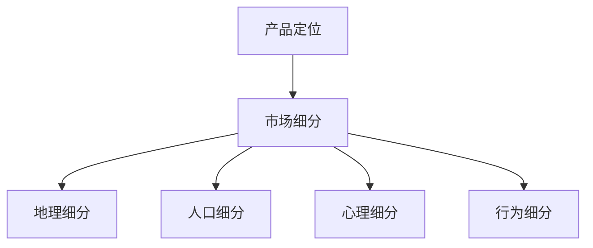

                 

# 《知识付费创业的产品矩阵构建》

> **关键词**：知识付费、产品矩阵、用户需求、市场调研、创业策略、技术工具

> **摘要**：本文深入探讨了知识付费创业的产品矩阵构建方法。通过分析行业趋势、用户需求、市场调研、产品定位、设计、工具应用以及创业实战，为创业者提供了系统性的指导。文章旨在帮助创业者构建科学有效的产品矩阵，把握市场机遇，实现知识付费业务的可持续发展。

## 目录大纲

### 第一部分：知识付费行业概述

#### 1.1 知识付费的兴起与市场趋势

##### 1.1.1 知识付费的定义与特点

##### 1.1.2 知识付费市场的规模与增长

##### 1.1.3 用户需求与消费行为分析

#### 1.2 知识付费创业的机遇与挑战

##### 1.2.1 创业机遇分析

##### 1.2.2 市场竞争现状

##### 1.2.3 创业面临的挑战

#### 1.3 知识付费创业的行业生态

##### 1.3.1 行业参与者分析

##### 1.3.2 行业模式与盈利方式

##### 1.3.3 行业监管与政策环境

### 第二部分：产品矩阵构建方法

#### 2.1 产品矩阵构建的原理与实践

##### 2.1.1 产品矩阵的定义与作用

##### 2.1.2 产品矩阵构建的步骤

##### 2.1.3 产品矩阵构建的实践案例

#### 2.2 用户需求分析与市场调研

##### 2.2.1 用户需求分析的方法

##### 2.2.2 市场调研的工具与技巧

##### 2.2.3 用户需求的挖掘与整理

#### 2.3 产品定位与市场细分

##### 2.3.1 产品定位的策略

##### 2.3.2 市场细分的标准

##### 2.3.3 产品定位与市场细分的关系

#### 2.4 产品规划与设计

##### 2.4.1 产品规划的原则与流程

##### 2.4.2 产品设计的方法与工具

##### 2.4.3 产品设计的实践案例

### 第三部分：产品矩阵构建工具与应用

#### 3.1 产品矩阵构建工具介绍

##### 3.1.1 常用产品矩阵构建工具

##### 3.1.2 工具的优缺点分析

##### 3.1.3 工具的选用建议

#### 3.2 产品矩阵应用案例

##### 3.2.1 知识付费平台产品矩阵案例分析

##### 3.2.2 线上教育产品矩阵案例分析

##### 3.2.3 企业内训产品矩阵案例分析

#### 3.3 产品矩阵构建的优化与迭代

##### 3.3.1 产品矩阵优化的方法

##### 3.3.2 产品矩阵迭代的策略

##### 3.3.3 产品矩阵优化的实践案例

### 第四部分：知识付费创业实战

#### 4.1 知识付费创业的准备

##### 4.1.1 创业团队的组建

##### 4.1.2 资金与资源的筹备

##### 4.1.3 商业模式的确定

#### 4.2 知识付费创业的市场定位

##### 4.2.1 市场定位的步骤

##### 4.2.2 市场定位的技巧

##### 4.2.3 市场定位的案例分析

#### 4.3 知识付费创业的产品开发

##### 4.3.1 产品开发的流程

##### 4.3.2 产品开发的策略

##### 4.3.3 产品开发的实践案例

#### 4.4 知识付费创业的市场推广

##### 4.4.1 市场推广的策略

##### 4.4.2 市场推广的渠道

##### 4.4.3 市场推广的案例分析

#### 4.5 知识付费创业的风险管理

##### 4.5.1 风险识别与评估

##### 4.5.2 风险应对策略

##### 4.5.3 风险管理的实践案例

### 第五部分：知识付费创业的未来趋势

#### 5.1 知识付费创业的未来展望

##### 5.1.1 行业发展趋势分析

##### 5.1.2 创业机会与挑战

##### 5.1.3 创业者的应对策略

#### 5.2 新技术对知识付费创业的影响

##### 5.2.1 人工智能在知识付费中的应用

##### 5.2.2 区块链在知识付费中的潜力

##### 5.2.3 物联网对知识付费的影响

#### 5.3 知识付费创业的可持续发展

##### 5.3.1 社会责任与伦理问题

##### 5.3.2 知识共享与知识传播

##### 5.3.3 可持续发展的实践案例

### 附录

#### 附录 A：知识付费创业资源与工具

##### A.1 常用资源推荐

##### A.2 常用工具介绍

##### A.3 资源与工具的获取方式

#### 附录 B：知识付费创业案例汇编

##### B.1 国内知名知识付费案例

##### B.2 国际知识付费成功案例

##### B.3 案例分析与启示

## 第一部分：知识付费行业概述

### 1.1 知识付费的兴起与市场趋势

知识付费作为互联网时代下的一种新型商业模式，近年来在全球范围内迅速崛起。它指的是用户为获取高质量的知识内容，愿意付费的行为。知识付费的兴起，一方面源于用户对高质量内容的需求不断增加，另一方面则是互联网技术和在线支付手段的普及，为知识付费提供了便捷的支付渠道。

#### 1.1.1 知识付费的定义与特点

知识付费的核心在于“知识”与“付费”。知识是内容的核心，付费则是用户获取知识的交换手段。与传统的免费内容相比，知识付费具有以下几个显著特点：

1. **高质量**：知识付费内容通常由行业专家、学者或专业人士提供，具有高价值和实用性。
2. **针对性**：知识付费产品往往针对特定用户群体，提供定制化的服务。
3. **付费模式多样**：知识付费可以通过订阅、单次购买、会员制等多种模式实现。
4. **互动性**：部分知识付费产品提供与专家的互动机会，提升用户体验。

#### 1.1.2 知识付费市场的规模与增长

根据相关报告，全球知识付费市场规模呈现出快速增长的趋势。以中国为例，2018年中国知识付费市场规模已达到196亿元，预计到2022年将达到356亿元。这一数据充分表明，知识付费已经成为一个潜力巨大的市场。

知识付费市场的增长主要得益于以下几个因素：

1. **用户需求**：随着社会经济的发展和人们教育水平的提高，用户对高质量知识的渴求日益增强。
2. **技术进步**：互联网和移动支付技术的普及，为知识付费提供了便利的条件。
3. **内容多样性**：知识付费内容涵盖了教育、职场、健康、艺术等多个领域，满足了用户的多样化需求。

#### 1.1.3 用户需求与消费行为分析

用户需求是知识付费市场发展的核心驱动力。根据调查，知识付费用户主要具有以下特征：

1. **高学历**：知识付费用户大多具有本科及以上学历，对知识的深度和专业性有较高的要求。
2. **高收入**：用户收入水平较高，具备较强的付费能力。
3. **高频消费**：知识付费用户具有较强的消费习惯，愿意为高质量内容持续付费。

此外，用户在知识付费消费行为上也有明显的特点：

1. **订阅为主**：用户更倾向于订阅制消费，以便持续获取最新内容。
2. **碎片化学习**：用户利用碎片化时间学习，对内容形式和时长有较高的要求。
3. **口碑传播**：用户通过社交媒体、口碑推荐等方式获取知识付费产品，具有较强的社交属性。

#### 1.2 知识付费创业的机遇与挑战

在知识付费市场快速增长的同时，创业者也看到了其中的巨大商机。然而，知识付费创业并非一片坦途，创业者面临着诸多机遇与挑战。

##### 1.2.1 创业机遇分析

1. **市场潜力巨大**：知识付费市场仍处于快速发展阶段，市场需求持续增长，为创业者提供了广阔的市场空间。
2. **用户需求多样化**：知识付费内容覆盖多个领域，创业者可以根据自身优势和用户需求，精准定位市场。
3. **技术进步**：人工智能、大数据等技术的进步，为知识付费创业提供了新的工具和方法。

##### 1.2.2 市场竞争现状

知识付费市场竞争激烈，主要表现在以下几个方面：

1. **头部效应明显**：市场被少数头部平台和品牌占据，中小创业者难以突破。
2. **内容同质化**：大量创业者涌入知识付费领域，导致内容同质化严重，用户选择困难。
3. **监管政策趋严**：知识付费市场面临监管压力，创业者需遵守相关法律法规，合规经营。

##### 1.2.3 创业面临的挑战

1. **内容质量**：知识付费的核心在于内容，创业者需确保内容的高质量和专业性，以赢得用户信任。
2. **用户获取**：在竞争激烈的市场中，创业者需要创新营销策略，吸引和留住用户。
3. **商业模式**：知识付费创业的商业模式需不断创新和优化，以适应市场变化和用户需求。

#### 1.3 知识付费创业的行业生态

知识付费创业涉及多个环节，包括内容创作、平台运营、用户管理等。了解行业生态，有助于创业者更好地布局和发展。

##### 1.3.1 行业参与者分析

知识付费行业的参与者主要包括以下几类：

1. **内容创作者**：包括专家学者、行业领袖、资深从业者等，他们是知识付费的核心资源。
2. **平台运营方**：如得到、知乎Live、分答等，他们负责内容审核、用户管理、平台推广等。
3. **用户**：知识付费的最终消费者，他们的需求和反馈对创业者至关重要。

##### 1.3.2 行业模式与盈利方式

知识付费行业的盈利模式多样，主要包括以下几种：

1. **订阅制**：用户按月或按年付费，享受平台提供的内容和服务。
2. **单次购买**：用户为某个特定内容付费，如一门课程、一篇报告等。
3. **广告收入**：平台通过广告分成获取收入。
4. **增值服务**：如会员服务、线下活动等，提供额外的收益来源。

##### 1.3.3 行业监管与政策环境

知识付费行业受到政策监管的影响，创业者需关注相关法律法规和监管政策。以下是一些关键政策：

1. **版权保护**：知识付费内容需遵守版权法律法规，确保内容原创性和合法性。
2. **用户隐私**：平台需保护用户隐私，遵守数据安全法律法规。
3. **广告监管**：平台广告需合规，避免虚假宣传和误导用户。

### 小结

知识付费行业具有巨大的市场潜力和发展空间，但也面临着激烈的竞争和监管压力。创业者需深入了解行业趋势和用户需求，构建科学的产品矩阵，创新商业模式，才能在市场中脱颖而出。

### (待续) <|split|>### 1.4 知识付费创业的产品矩阵构建方法

知识付费创业的产品矩阵构建是确保企业能够在竞争激烈的市场中脱颖而出，满足多样化用户需求的关键。以下是构建产品矩阵的具体方法：

#### 2.1 产品矩阵构建的原理与实践

##### 2.1.1 产品矩阵的定义与作用

产品矩阵是指将企业的产品或服务按照一定的逻辑关系进行分类和组合，形成的一个多维度的产品体系。它有助于企业系统性地理解和定位产品，优化资源配置，提升用户体验。

产品矩阵的作用主要体现在以下几个方面：

1. **市场定位**：通过产品矩阵，企业可以明确产品的市场定位，满足不同用户群体的需求。
2. **资源配置**：产品矩阵有助于企业合理分配资源，提高运营效率。
3. **产品创新**：产品矩阵为企业提供了丰富的产品组合，有助于不断推出新的产品和服务。
4. **风险评估**：通过产品矩阵，企业可以全面评估产品的风险和收益，做出科学的决策。

##### 2.1.2 产品矩阵构建的步骤

构建产品矩阵通常包括以下步骤：

1. **需求分析**：了解用户需求，挖掘潜在的市场机会。
2. **市场调研**：分析市场竞争状况，确定产品的市场定位。
3. **产品规划**：根据需求和市场调研结果，制定产品规划方案。
4. **产品设计**：设计产品的功能、界面和用户体验。
5. **产品上线**：将产品设计转化为实际产品，并进行市场推广。

##### 2.1.3 产品矩阵构建的实践案例

以一家知识付费平台为例，该平台的产品矩阵构建过程如下：

1. **需求分析**：通过问卷调查、用户访谈等方式，了解用户对知识付费的需求，如课程类型、时长、价格等。
2. **市场调研**：分析同类平台的竞争状况，了解市场趋势和用户偏好。
3. **产品规划**：根据需求和调研结果，制定产品规划方案，包括课程种类、课程时长、价格体系等。
4. **产品设计**：设计课程内容、界面和用户体验，确保课程易于学习、互动性强。
5. **产品上线**：将设计好的课程上线，并进行市场推广，吸引目标用户。

#### 2.2 用户需求分析与市场调研

##### 2.2.1 用户需求分析的方法

用户需求分析是产品矩阵构建的重要环节。以下是几种常用的用户需求分析方法：

1. **问卷调查**：通过设计问卷，收集用户对知识付费的需求和意见。
2. **用户访谈**：与目标用户进行深入交流，了解他们的真实需求和期望。
3. **用户行为分析**：通过数据分析，了解用户的浏览、购买、学习等行为。
4. **焦点小组**：邀请一定数量的用户，就产品设计和市场策略展开讨论。

##### 2.2.2 市场调研的工具与技巧

市场调研需要使用一些工具和技巧，以获取全面、准确的数据。以下是一些常用的工具和技巧：

1. **在线调查工具**：如问卷星、金数据等，可以方便地设计和分发问卷。
2. **社交媒体分析**：通过分析社交媒体平台上的用户讨论和反馈，了解市场趋势。
3. **用户跟踪系统**：如谷歌分析、百度统计等，可以实时监测用户行为。
4. **访谈记录**：使用录音笔、笔记等方式，记录用户的访谈内容和观点。

##### 2.2.3 用户需求的挖掘与整理

用户需求的挖掘和整理是产品矩阵构建的关键。以下是一些常用的方法和技巧：

1. **用户需求地图**：将用户需求按照主题和优先级进行分类和排序，形成需求地图。
2. **用户画像**：通过用户行为数据和特征，构建用户的详细画像，了解他们的需求和偏好。
3. **用户故事**：将用户需求转化为具体的用户故事，描述用户在使用产品过程中的问题和期望。
4. **需求矩阵**：将用户需求与产品功能进行匹配，形成需求矩阵，确保产品功能能够满足用户需求。

#### 2.3 产品定位与市场细分

##### 2.3.1 产品定位的策略

产品定位是确保产品在市场中获得竞争优势的关键。以下是一些常见的产品定位策略：

1. **差异化定位**：通过提供独特的功能和优势，与竞争对手形成差异化。
2. **细分市场定位**：针对特定的用户群体，提供定制化的产品和服务。
3. **高端市场定位**：通过高品质和高端形象，吸引高消费能力的用户。
4. **低成本市场定位**：通过降低成本，提供价格优势，吸引价格敏感的用户。

##### 2.3.2 市场细分的标准

市场细分是将市场划分为若干个子市场，以便企业更好地满足不同用户群体的需求。以下是一些常见的市场细分标准：

1. **地理细分**：根据用户的地理位置进行细分，如城市、地区等。
2. **人口细分**：根据用户的人口特征进行细分，如年龄、性别、收入等。
3. **心理细分**：根据用户的心理特征和需求进行细分，如价值观、生活方式等。
4. **行为细分**：根据用户的行为特征进行细分，如购买频率、使用习惯等。

##### 2.3.3 产品定位与市场细分的关系

产品定位与市场细分密切相关。产品定位需要基于市场细分的结果，确保产品能够精准地满足目标市场的需求。以下是一个简化的关系图：

#### 2.4 产品规划与设计

##### 2.4.1 产品规划的原则与流程

产品规划是确保产品能够满足市场需求的战略性工作。以下是一些常见的产品规划原则和流程：

1. **原则**：
   - 用户导向：以用户需求为中心，确保产品能够满足用户需求。
   - 创新驱动：不断创新，提供独特的价值和功能。
   - 效率优先：提高产品开发效率，缩短产品上市时间。
   - 风险控制：对产品开发过程进行风险控制，确保产品质量和安全性。

2. **流程**：
   - 市场调研：收集和分析市场需求和竞争情况。
   - 需求分析：确定产品功能和性能要求。
   - 产品设计：设计产品的架构和界面。
   - 开发与测试：进行产品开发，并进行测试和优化。
   - 上线与推广：将产品推向市场，并进行推广和营销。

##### 2.4.2 产品设计的方法与工具

产品设计是产品规划的重要环节。以下是一些常见的设计方法和工具：

1. **设计方法**：
   - 用户故事地图：通过用户故事描述用户需求和使用场景。
   - 用户画像：通过用户数据和特征，创建用户画像，了解用户需求。
   - 原型设计：通过创建原型，验证产品功能和用户体验。

2. **工具**：
   - Sketch：用于绘制产品原型和设计界面。
   - Axure RP：用于创建交互原型和设计文档。
   - Figma：用于协作设计和原型制作。

##### 2.4.3 产品设计的实践案例

以一款在线教育平台的产品设计为例，设计过程如下：

1. **需求分析**：通过问卷调查和用户访谈，了解用户对在线教育的需求和期望。
2. **用户故事地图**：创建用户故事地图，描述用户在平台上的主要使用场景。
3. **用户画像**：创建用户画像，了解用户的基本特征和需求。
4. **原型设计**：使用Figma创建平台的原型界面，包括课程列表、课程详情、学习进度等。
5. **测试与优化**：邀请用户进行测试，收集反馈，并进行优化。

#### 小结

知识付费创业的产品矩阵构建是一个系统性、多步骤的过程。通过需求分析、市场调研、产品定位、产品规划和设计，创业者可以构建科学有效的产品矩阵，满足用户需求，实现企业的可持续发展。

### (待续) <|split|>### 3.1 产品矩阵构建工具介绍

在知识付费创业中，构建科学合理的产品矩阵至关重要。为了提高产品矩阵构建的效率和准确性，创业者可以借助各种工具。以下是几种常用的产品矩阵构建工具及其优缺点分析。

#### 3.1.1 常用产品矩阵构建工具

1. **Excel**

   Excel是一款功能强大的电子表格软件，适用于数据整理和可视化。创业者可以使用Excel创建简单的产品矩阵，通过表格形式展示产品特性、用户群体和市场定位等信息。

   - **优点**：操作简单，易于学习和使用；可以灵活调整表格结构和数据。
   - **缺点**：数据量较大时，处理效率和可视化效果有限；不支持多用户协作。

2. **PowerPoint**

   PowerPoint是一款常用的演示文稿软件，创业者可以使用PPT制作产品矩阵的演示版，通过图表和文字展示产品信息。

   - **优点**：支持丰富的图表和多媒体元素，便于展示产品特性；易于制作和分享。
   - **缺点**：数据处理和编辑功能有限；不适合进行复杂的数据分析和统计。

3. **Miro**

   Miro是一款在线协作白板工具，适用于团队协作和项目管理。创业者可以使用Miro创建动态的产品矩阵，通过拖放、标注等功能进行产品规划。

   - **优点**：支持多人协作，实时更新；提供丰富的模板和工具，便于设计和修改。
   - **缺点**：免费版功能有限，部分高级功能需付费；操作界面较为复杂。

4. **Tableau**

   Tableau是一款数据可视化工具，适用于数据分析和企业报表制作。创业者可以使用Tableau创建丰富的产品矩阵图表，直观展示产品性能和市场趋势。

   - **优点**：强大的数据处理和分析功能；丰富的图表类型和定制选项。
   - **缺点**：学习曲线较陡，需要一定的时间掌握；部分功能需付费。

#### 3.1.2 工具的优缺点分析

以下是各工具的优缺点分析：

| 工具         | 优点                            | 缺点                                  |
| ------------ | ------------------------------- | ------------------------------------- |
| Excel        | 操作简单，易于学习和使用        | 数据处理和可视化效果有限              |
| PowerPoint   | 支持丰富的图表和多媒体元素      | 数据处理和编辑功能有限              |
| Miro         | 支持多人协作，实时更新          | 免费版功能有限，部分高级功能需付费  |
| Tableau      | 强大的数据处理和分析功能        | 学习曲线较陡，需要一定的时间掌握    |

#### 3.1.3 工具的选用建议

根据创业者的需求和资源，可以参考以下建议选择合适的工具：

1. **初创企业**：建议使用Excel或PowerPoint，这两种工具易于上手，且成本较低。Excel适用于数据整理和简单可视化；PowerPoint适用于制作演示文档和产品矩阵的初步设计。
2. **中小型企业**：可以考虑使用Miro，该工具支持多人协作，适合团队共同规划和讨论产品矩阵。Miro提供了丰富的模板和功能，可以满足中小企业的需求。
3. **大型企业或专业团队**：建议使用Tableau等高级数据可视化工具。这些工具具有强大的数据处理和分析功能，可以生成复杂的产品矩阵图表，辅助决策。

#### 3.2 产品矩阵应用案例

以下是三个不同领域的产品矩阵应用案例，供创业者参考：

##### 3.2.1 知识付费平台产品矩阵案例分析

**案例描述**：一家在线教育平台构建了产品矩阵，涵盖了课程、会员服务、线下活动等多个维度。

**产品矩阵**：

| 产品类别     | 产品名称       | 用户群体           | 产品特点                 |
| ------------ | -------------- | ------------------ | ------------------------ |
| 课程         | 人工智能基础课程 | 本科及以上学历用户 | 系统化教学，互动性强     |
| 会员服务     | 年度会员       | 对课程有持续需求的用户 | 优惠价格，免费课程更新 |
| 线下活动     | 技术沙龙       | 企事业单位用户     | 行业交流，技术分享     |

**分析**：该平台的产品矩阵充分考虑了不同用户群体的需求，提供了多样化的产品选择，有助于提高用户满意度和留存率。

##### 3.2.2 线上教育产品矩阵案例分析

**案例描述**：一家在线英语学习平台构建了产品矩阵，包括课程、辅导、考试等服务。

**产品矩阵**：

| 产品类别 | 产品名称     | 用户群体               | 产品特点               |
| -------- | ------------ | ---------------------- | ---------------------- |
| 课程     | 系统课程     | 初学者和进阶者         | 科学编排，循序渐进     |
| 辅导     | 个性化辅导   | 学习效果不佳的用户     | 专业老师，针对性辅导 |
| 考试     | 英语考试培训 | 有考试需求的用户       | 精选真题，实战演练   |

**分析**：该平台通过产品矩阵，为不同学习阶段和需求的用户提供了全面的服务，提高了产品的竞争力和用户粘性。

##### 3.2.3 企业内训产品矩阵案例分析

**案例描述**：一家企业内训机构构建了产品矩阵，包括培训课程、咨询辅导、管理培训等。

**产品矩阵**：

| 产品类别 | 产品名称         | 用户群体                   | 产品特点                 |
| -------- | ---------------- | -------------------------- | ------------------------ |
| 培训课程 | 基础技能培训     | 新员工和在职员工           | 系统化教学，实战演练     |
| 咨询辅导 | 管理咨询         | 企业管理层                 | 个性化方案，问题诊断     |
| 管理培训 | 领导力培训       | 高层管理人员和团队领导     | 提升领导力，团队协作能力 |

**分析**：该企业内训机构的产品矩阵充分考虑了企业不同层级和岗位的需求，提供了全面的服务方案，有助于提高员工素质和企业竞争力。

#### 小结

产品矩阵构建是知识付费创业的重要环节。通过选择合适的工具和应用案例，创业者可以构建科学有效的产品矩阵，满足用户需求，提升企业竞争力。在实际应用中，创业者需根据自身情况，灵活调整和优化产品矩阵，以适应市场变化。

### (待续) <|split|>### 3.3 产品矩阵构建的优化与迭代

在知识付费创业的过程中，产品矩阵的构建并非一成不变的，而是一个不断优化和迭代的过程。通过持续的优化与迭代，创业者可以更好地适应市场变化和用户需求，提高产品竞争力。

#### 3.3.1 产品矩阵优化的方法

1. **用户反馈分析**：收集用户对产品的反馈，包括评价、建议和投诉。通过分析用户反馈，找出产品存在的问题和改进点。

2. **数据分析**：利用数据分析工具，分析用户行为数据、销售数据和市场数据。通过数据驱动的分析，发现产品优化的潜在方向。

3. **市场调研**：定期进行市场调研，了解竞争对手的产品矩阵和用户需求。通过市场调研，把握行业动态和趋势，为产品优化提供依据。

4. **内部评审**：组织内部评审会议，邀请不同部门的代表参与，共同讨论产品矩阵的优化方案。内部评审有助于发现产品潜在的问题和改进点。

5. **A/B测试**：对产品矩阵的不同部分进行A/B测试，比较不同方案的效果。通过A/B测试，确定最佳的产品优化方案。

#### 3.3.2 产品矩阵迭代的策略

1. **持续改进**：产品矩阵的迭代是一个持续的过程。创业者应定期评估产品矩阵，发现问题并及时进行调整和改进。

2. **敏捷开发**：采用敏捷开发方法，快速迭代和发布产品。敏捷开发有助于快速响应市场变化和用户需求，提高产品竞争力。

3. **开放合作**：与用户、合作伙伴和行业专家保持紧密合作，共同探讨产品优化的方向和方案。开放合作有助于获取多方面的意见和建议，提高产品矩阵的优化效果。

4. **创新驱动**：鼓励创新思维，不断探索新的产品和服务。通过创新，为企业带来新的增长点和竞争优势。

#### 3.3.3 产品矩阵优化的实践案例

以下是几个产品矩阵优化的实践案例：

1. **案例一：在线教育平台的产品矩阵优化**

   一家在线教育平台在用户反馈和数据分析中发现，用户对课程时长和学习节奏有较高要求。为此，平台优化了课程体系，推出了一系列短小精悍的微课，满足用户碎片化学习的需求。

   - **优化前**：课程以长篇大论为主，时长较长。
   - **优化后**：推出短小精悍的微课，时长控制在10-15分钟。

   优化后的产品矩阵提高了用户的学习效率和满意度，用户留存率显著提高。

2. **案例二：知识付费平台的会员服务优化**

   一家知识付费平台通过用户反馈和数据分析，发现部分用户对会员服务的性价比有较高要求。为此，平台调整了会员服务的价格体系，推出了多层次的会员套餐，满足不同用户的需求。

   - **优化前**：会员服务价格单一，缺乏灵活性和个性化。
   - **优化后**：推出多层次的会员套餐，价格区间更合理，满足不同用户的需求。

   优化后的会员服务得到了用户的广泛好评，会员数量和收入均有所提升。

3. **案例三：企业内训产品的迭代**

   一家企业内训机构通过市场调研和用户反馈，发现部分企业对定制化培训有较高需求。为此，机构优化了产品矩阵，增加了定制化培训服务。

   - **优化前**：培训产品以标准化课程为主，缺乏个性化。
   - **优化后**：增加定制化培训服务，根据企业特点和需求进行个性化设计。

   优化后的产品矩阵提高了企业的满意度，赢得了更多客户的信任和合作。

#### 小结

产品矩阵的优化与迭代是知识付费创业的重要环节。通过用户反馈、数据分析、市场调研和内部评审等方法，创业者可以不断优化产品矩阵，提高产品竞争力。同时，采用敏捷开发、开放合作和创新驱动的策略，有助于加快产品矩阵的迭代速度，满足用户需求，实现企业的可持续发展。

### (待续) <|split|>### 4.1 知识付费创业的准备

在知识付费创业的过程中，准备工作是确保项目顺利进行的基础。创业者需要从团队组建、资金与资源筹备以及商业模式确定等方面进行全面准备。

#### 4.1.1 创业团队的组建

一个高效的创业团队是知识付费创业成功的关键。创业者需根据项目需求，搭建合适的团队。以下是组建创业团队的一些关键点：

1. **核心成员**：核心成员应具备以下特质：
   - **专业知识**：在知识付费领域有丰富的经验和专业知识。
   - **创新能力**：具备创新思维，能够不断推出新的产品和服务。
   - **团队协作**：具备良好的团队协作精神和沟通能力。

2. **团队结构**：团队结构应包括：
   - **产品经理**：负责产品规划和设计。
   - **技术团队**：负责技术开发和平台搭建。
   - **内容团队**：负责内容创作和质量控制。
   - **市场团队**：负责市场推广和用户运营。
   - **财务和运营团队**：负责财务管理和日常运营。

3. **招聘渠道**：可以通过以下渠道招聘团队成员：
   - **线上招聘平台**：如猎聘、拉勾网等。
   - **线下招聘会**：参加行业招聘会，直接接触潜在人才。
   - **人脉推荐**：利用个人和专业人脉，获取优质人才推荐。

#### 4.1.2 资金与资源的筹备

知识付费创业需要一定的资金和资源支持。以下是筹备资金和资源的一些关键点：

1. **资金来源**：
   - **自筹资金**：利用个人储蓄或筹集亲友资金。
   - **天使投资**：寻找天使投资人进行融资。
   - **风险投资**：寻求风险投资机构的投资。
   - **政府资助**：申请政府相关项目资助和补贴。

2. **资金用途**：
   - **产品开发**：用于产品研发和平台建设。
   - **市场推广**：用于市场推广和用户获取。
   - **运营成本**：用于日常运营和管理费用。
   - **内容制作**：用于内容创作和质量控制。

3. **资源筹备**：
   - **技术资源**：搭建适合的知识付费平台，确保技术支持和运维。
   - **内容资源**：寻找优秀的讲师和内容创作者，确保内容质量和多样性。
   - **人力资源**：筹备足够的运营和推广团队，确保项目顺利推进。
   - **市场资源**：建立市场渠道和合作伙伴关系，扩大品牌影响力。

#### 4.1.3 商业模式的确定

商业模式是知识付费创业的核心，创业者需根据市场环境和自身优势，确定合适的商业模式。以下是几种常见的商业模式：

1. **订阅制**：
   - **特点**：用户按月或按年付费，享受平台提供的全部或部分内容。
   - **优势**：稳定的收入来源，提高用户粘性。
   - **适用场景**：内容更新频繁、用户需求持续的市场。

2. **单次购买**：
   - **特点**：用户为特定内容付费，如一门课程、一个报告等。
   - **优势**：灵活的收入模式，提高用户购买决策。
   - **适用场景**：内容独立、用户有明确购买意愿的市场。

3. **会员制**：
   - **特点**：用户成为会员，享受平台提供的多种服务。
   - **优势**：多样化的收入来源，提高用户忠诚度。
   - **适用场景**：内容丰富、用户有长期服务需求的市场。

4. **广告收入**：
   - **特点**：通过平台广告获取收入。
   - **优势**：低风险，稳定的收入来源。
   - **适用场景**：用户流量大、广告市场成熟的市场。

#### 小结

知识付费创业的准备工作涉及团队组建、资金与资源筹备以及商业模式的确定。通过科学合理的准备，创业者可以确保项目顺利启动，为后续发展奠定坚实基础。

### (待续) <|split|>### 4.2 知识付费创业的市场定位

市场定位是知识付费创业成功的关键环节。准确的定位有助于企业明确目标用户，制定有效的营销策略，提高市场竞争力。以下是市场定位的步骤、技巧和案例分析。

#### 4.2.1 市场定位的步骤

1. **市场分析**：
   - **行业研究**：了解知识付费行业的发展趋势、市场规模和竞争态势。
   - **目标市场**：明确目标市场的范围，如行业、地域、用户年龄等。

2. **用户研究**：
   - **用户画像**：通过调研和数据分析，构建目标用户的详细画像。
   - **用户需求**：分析目标用户的需求、痛点和期望，为产品规划提供依据。

3. **竞争分析**：
   - **竞争对手**：识别主要竞争对手，分析他们的优势和不足。
   - **市场地位**：确定自身在市场中的位置，如领导者、追随者等。

4. **定位策略**：
   - **差异化定位**：通过独特的产品特点或服务优势，与竞争对手形成差异化。
   - **细分市场定位**：针对特定用户群体，提供定制化的产品和服务。

5. **定位实施**：
   - **品牌传播**：通过品牌传播和营销活动，强化市场定位。
   - **产品优化**：根据市场定位，不断优化产品和服务，确保与定位一致。

#### 4.2.2 市场定位的技巧

1. **差异化策略**：
   - **产品差异化**：提供独特的产品特性或服务，满足用户特殊需求。
   - **市场差异化**：针对特定的市场细分，提供定制化的产品和服务。

2. **创新策略**：
   - **技术创新**：利用新技术提高产品性能和用户体验。
   - **服务创新**：提供创新的服务模式，如在线咨询、互动课程等。

3. **品牌塑造**：
   - **品牌形象**：通过品牌设计和传播，建立独特的品牌形象。
   - **口碑传播**：通过用户口碑和推荐，提升品牌知名度和美誉度。

4. **用户体验**：
   - **优化用户界面**：提供简洁、直观的用户界面，提升用户体验。
   - **个性化服务**：根据用户需求，提供个性化的产品和服务。

#### 4.2.3 市场定位的案例分析

1. **案例一：得到APP**

   得到APP是一家知名的知识付费平台，以其独特的市场定位和优质的课程内容赢得了大量用户。

   - **定位策略**：得到APP以“知识服务”为核心，提供涵盖职场、科技、文化等多个领域的精品课程。
   - **差异化优势**：得到APP的课程内容具有深度和广度，与市场上的其他知识付费平台形成差异化。
   - **品牌塑造**：得到APP通过优质的内容和专业的讲师，树立了权威、专业的品牌形象。

2. **案例二：知乎Live**

   知乎Live是知乎旗下的知识付费产品，通过线上的讲座、沙龙等形式，为用户提供高质量的知识分享。

   - **定位策略**：知乎Live以“知识分享”为核心，邀请行业专家和资深从业者进行分享。
   - **差异化优势**：知乎Live的内容具有专业性和实用性，与市场上的其他知识分享平台形成差异化。
   - **品牌塑造**：知乎Live依托知乎的品牌影响力，吸引了大量专业用户和行业专家。

3. **案例三：分答**

   分答是一款基于问答的知识付费产品，通过提供即时问答服务，为用户解决实际问题。

   - **定位策略**：分答以“即时问答”为核心，提供快速、高效的知识获取渠道。
   - **差异化优势**：分答通过语音问答的形式，提高了知识获取的便捷性和互动性。
   - **品牌塑造**：分答通过简洁、易用的界面和专业的问答内容，建立了良好的用户口碑。

#### 小结

市场定位是知识付费创业的核心环节，准确的定位有助于企业明确目标用户，制定有效的营销策略，提高市场竞争力。通过差异化策略、创新策略、品牌塑造和用户体验，创业者可以打造独特的市场定位，赢得用户的认可和支持。

### (待续) <|split|>### 4.3 知识付费创业的产品开发

知识付费创业的核心在于产品开发。一个成功的知识付费产品不仅要有高质量的内容，还需要具备良好的用户体验和强大的技术支撑。以下是知识付费创业的产品开发流程、策略和实践案例。

#### 4.3.1 产品开发的流程

产品开发是一个系统性的过程，包括需求分析、产品设计、开发与测试、上线与推广等多个阶段。

1. **需求分析**：
   - **用户需求**：通过市场调研、用户访谈等方式，了解用户对知识付费产品的需求。
   - **功能需求**：根据用户需求，梳理产品需要实现的功能和特性。
   - **非功能需求**：如系统的稳定性、安全性、易用性等。

2. **产品设计**：
   - **原型设计**：使用工具（如Axure、Sketch等）创建产品的原型，进行用户反馈和优化。
   - **界面设计**：设计产品的用户界面，确保简洁、直观、易用。
   - **系统架构**：确定产品的技术架构，包括数据库设计、服务器配置等。

3. **开发与测试**：
   - **开发**：根据设计文档进行产品开发，实现产品的功能和技术特性。
   - **测试**：进行功能测试、性能测试、安全测试等，确保产品质量。

4. **上线与推广**：
   - **上线**：将产品部署到服务器，并进行上线测试。
   - **推广**：制定推广策略，通过市场推广活动吸引目标用户。

#### 4.3.2 产品开发的策略

1. **用户导向**：
   - **用户需求**：始终以用户需求为导向，确保产品功能符合用户期望。
   - **用户体验**：注重用户体验，提升用户满意度。

2. **迭代开发**：
   - **快速迭代**：采用敏捷开发方法，快速迭代和发布产品，及时响应市场变化。
   - **持续改进**：通过持续改进，优化产品功能和用户体验。

3. **技术创新**：
   - **技术应用**：利用先进的技术，提高产品的性能和用户体验。
   - **技术积累**：不断积累技术经验和知识，提高团队的技术水平。

4. **差异化竞争**：
   - **产品特色**：通过独特的产品特性，与竞争对手形成差异化。
   - **市场定位**：针对特定的市场细分，提供定制化的产品和服务。

#### 4.3.3 产品开发的实践案例

以下是一个知识付费创业的产品开发实践案例：

**项目背景**：一家初创公司计划开发一款针对职场人士的职业发展课程平台。

**需求分析**：
- **用户需求**：用户希望获得实用、有针对性的职业发展课程，包括职业规划、面试技巧、职场沟通等。
- **功能需求**：产品需要具备课程管理、学习进度跟踪、互动讨论等功能。

**产品设计**：
- **原型设计**：使用Axure创建产品原型，进行用户反馈和优化。
- **界面设计**：设计简洁、直观的用户界面，提升用户体验。
- **系统架构**：采用微服务架构，确保系统的高可用性和可扩展性。

**开发与测试**：
- **开发**：开发团队使用Python和Django框架进行产品开发，实现课程管理、学习进度跟踪等功能。
- **测试**：进行功能测试、性能测试和安全测试，确保产品稳定性和安全性。

**上线与推广**：
- **上线**：将产品部署到服务器，进行上线测试。
- **推广**：通过社交媒体、合作渠道等渠道进行推广，吸引目标用户。

**效果评估**：
- **用户反馈**：通过用户反馈和评价，持续优化产品功能和用户体验。
- **数据分析**：通过数据分析，了解用户行为和需求，为产品迭代提供依据。

#### 小结

知识付费创业的产品开发是一个复杂而系统的过程。通过明确的需求分析、严谨的设计、高效的开发和持续的改进，创业者可以打造出高质量、受用户喜爱的知识付费产品，为企业的长期发展奠定基础。

### (待续) <|split|>### 4.4 知识付费创业的市场推广

在知识付费创业的过程中，市场推广是吸引目标用户、提升品牌知名度和实现商业价值的关键环节。以下是市场推广的策略、渠道和案例分析。

#### 4.4.1 市场推广的策略

1. **内容营销**：
   - **价值传递**：通过高质量的原创内容，传递产品的价值和优势。
   - **社交媒体**：利用社交媒体平台，如微信、微博、知乎等，发布有价值的内容，吸引关注。

2. **品牌合作**：
   - **跨界合作**：与其他品牌合作，进行联合推广，扩大品牌影响力。
   - **行业合作**：与行业内的专家、机构合作，提升品牌的权威性和专业性。

3. **广告投放**：
   - **搜索引擎广告**：利用搜索引擎广告，如百度推广、谷歌广告等，提高产品在搜索引擎中的排名。
   - **社交媒体广告**：在社交媒体平台上投放广告，精准定位目标用户。

4. **口碑营销**：
   - **用户推荐**：鼓励用户分享产品体验，通过口碑传播增加用户信任度。
   - **权威评价**：争取行业权威评价和媒体报道，提升品牌形象。

5. **活动营销**：
   - **线上线下活动**：举办线上线下活动，如讲座、研讨会、沙龙等，增加用户互动和品牌曝光。

#### 4.4.2 市场推广的渠道

1. **社交媒体**：
   - **微信**：通过公众号、微信群、朋友圈等渠道进行内容推广和互动。
   - **微博**：通过微博进行实时互动和话题营销，提高品牌知名度。
   - **知乎**：在知乎发布高质量回答和文章，吸引专业用户关注。

2. **搜索引擎**：
   - **百度**：通过百度搜索推广，提高产品在搜索引擎中的曝光率。
   - **谷歌**：通过谷歌广告，精准定位海外用户。

3. **合作渠道**：
   - **行业媒体**：在行业媒体上进行广告投放和软文推广。
   - **专业论坛**：在专业论坛上发布帖子，吸引行业用户关注。

4. **线上线下活动**：
   - **线上活动**：通过直播、网络研讨会等形式，与用户进行互动。
   - **线下活动**：举办讲座、研讨会、沙龙等活动，增加用户互动和品牌曝光。

#### 4.4.3 市场推广的案例分析

1. **案例一：得到APP**

   得到APP通过内容营销和社交媒体推广，成功打造了知识付费品牌。

   - **内容营销**：得到APP邀请行业专家和知名人士开设课程，通过高质量的原创内容吸引用户。
   - **社交媒体**：得到APP在微信、微博等平台上进行推广，通过公众号、朋友圈等渠道发布课程信息和用户评价，增加用户关注。

2. **案例二：知乎Live**

   知乎Live通过品牌合作和口碑营销，吸引了大量用户。

   - **品牌合作**：知乎Live与多家知名企业和机构合作，进行联合推广，扩大品牌影响力。
   - **口碑营销**：知乎Live鼓励用户分享学习体验和心得，通过口碑传播增加用户信任度。

3. **案例三：分答**

   分答通过广告投放和社交媒体推广，迅速扩大了用户群体。

   - **广告投放**：分答在微信、微博等平台上进行广告投放，提高产品在社交媒体中的曝光率。
   - **社交媒体**：分答通过微信公众号、朋友圈等渠道发布推广信息，吸引目标用户。

#### 小结

知识付费创业的市场推广需要结合多种策略和渠道，通过内容营销、品牌合作、广告投放和口碑营销等手段，提高品牌知名度和用户关注度。在实际操作中，创业者应根据自身情况，灵活调整推广策略，不断优化推广效果。

### (待续) <|split|>### 4.5 知识付费创业的风险管理

在知识付费创业的过程中，风险管理是确保项目顺利推进和可持续发展的关键。创业者需识别潜在风险，评估风险影响，制定应对策略，并采取有效的风险管理措施。以下是知识付费创业的风险管理方法、风险识别与评估以及风险应对策略。

#### 4.5.1 风险管理方法

1. **风险评估**：
   - **定性评估**：通过专家判断、历史数据等方法，对风险发生的可能性进行初步评估。
   - **定量评估**：使用数学模型、统计分析等方法，对风险可能带来的影响进行量化分析。

2. **风险监控**：
   - **实时监控**：通过数据分析和实时监控，及时发现潜在风险并采取措施。
   - **定期评估**：定期对项目进行风险评估，确保风险管理的持续有效性。

3. **风险应对**：
   - **风险规避**：通过调整项目计划或业务模式，避免风险的直接发生。
   - **风险转移**：通过保险、合作等方式，将风险转移给第三方。
   - **风险减轻**：通过技术改进、过程优化等措施，减轻风险的影响。
   - **风险接受**：在无法避免或成本过高时，接受风险并制定应对措施。

#### 4.5.2 风险识别与评估

1. **风险识别**：
   - **内部分析**：通过内部调研、访谈等方式，识别项目内部的风险因素。
   - **外部分析**：关注行业趋势、政策变化、市场环境等外部因素，识别外部风险。

2. **风险评估**：
   - **可能性评估**：根据历史数据和专家判断，评估风险发生的可能性。
   - **影响评估**：评估风险发生可能带来的影响，如经济损失、时间延误等。

3. **风险排序**：
   - **优先级评估**：根据风险的可能性和影响，对风险进行排序，确定优先级。

#### 4.5.3 风险应对策略

1. **风险管理计划**：
   - **制定计划**：根据风险评估结果，制定详细的风险管理计划。
   - **实施措施**：执行风险管理计划，采取相应的风险应对措施。

2. **应急预案**：
   - **制定预案**：针对可能发生的风险，制定应急预案。
   - **演练与测试**：定期进行应急演练和测试，确保应急预案的有效性。

3. **沟通与协作**：
   - **内部沟通**：确保团队成员了解风险和应对措施，提高风险应对的协同性。
   - **外部沟通**：与合作伙伴、用户等外部利益相关者保持沟通，确保风险信息传递的及时性和准确性。

4. **持续改进**：
   - **回顾与总结**：定期回顾和总结风险管理过程，发现问题和不足。
   - **持续优化**：根据回顾和总结的结果，持续优化风险管理流程和措施。

#### 4.5.4 风险管理的实践案例

以下是一个知识付费创业的风险管理实践案例：

**项目背景**：一家初创公司计划开发一款在线职业发展课程平台。

**风险识别**：
- **技术风险**：技术实现难度大，可能存在技术瓶颈。
- **市场风险**：市场竞争激烈，产品难以脱颖而出。
- **资金风险**：资金不足，可能导致项目中断。

**风险评估**：
- **可能性评估**：技术风险和资金风险较高，市场风险适中。
- **影响评估**：技术风险可能导致项目延期或失败，资金风险可能导致项目无法继续。

**风险应对**：
- **技术风险**：通过技术研讨和外部合作，提高技术实现的可行性。
- **市场风险**：通过市场调研和产品差异化，提高产品的竞争力。
- **资金风险**：通过融资和成本控制，确保项目资金充足。

**风险管理效果**：
- **技术实现**：经过多次技术研讨和优化，成功实现了产品功能。
- **市场竞争力**：通过差异化和精准营销，吸引了大量用户。
- **资金状况**：通过多轮融资和成本控制，确保了项目的持续发展。

#### 小结

知识付费创业的风险管理是确保项目顺利进行和可持续发展的关键。通过有效的风险识别、评估和应对措施，创业者可以降低风险对项目的影响，提高项目成功率。在实际操作中，创业者需根据项目特点和市场环境，灵活调整风险管理策略，确保项目的稳定发展。

### (待续) <|split|>### 5.1 知识付费创业的未来展望

随着互联网技术的不断进步和用户需求的多样化，知识付费创业市场正在经历深刻变革。展望未来，知识付费创业将面临新的发展趋势、机遇与挑战。创业者需要紧跟行业动态，把握机遇，应对挑战，以实现业务的可持续发展。

#### 5.1.1 行业发展趋势分析

1. **技术驱动**：
   - **人工智能**：人工智能技术的应用将更加广泛，通过智能推荐、个性化学习路径规划等功能，提升用户体验。
   - **大数据**：大数据分析将帮助创业者更准确地了解用户需求，优化产品和服务。
   - **区块链**：区块链技术的应用将提高知识付费内容的版权保护和交易透明度。

2. **内容多样化**：
   - **垂直细分**：知识付费内容将更加垂直细分，满足不同用户群体的专业需求。
   - **跨领域融合**：知识付费内容将与其他领域（如娱乐、健康等）结合，提供更加综合的服务。

3. **商业模式创新**：
   - **混合模式**：知识付费企业将探索多种商业模式，如订阅制、单次购买、广告收入等，实现多元化收入。
   - **平台生态**：知识付费平台将打造开放生态，吸引更多内容创作者和用户，形成良好的生态循环。

4. **国际化发展**：
   - **本地化**：知识付费企业将更加注重本地化服务，满足不同国家和地区用户的需求。
   - **跨境合作**：跨国合作将日益增加，知识付费企业将拓展海外市场，实现全球化发展。

#### 5.1.2 创业机会与挑战

1. **创业机会**：
   - **新兴领域**：随着科技的发展和用户需求的变化，新兴领域如人工智能、区块链、健康等将成为知识付费创业的热点。
   - **垂直细分市场**：针对特定行业或领域的专业知识付费需求日益增长，创业者可以通过提供专业内容，满足细分市场的需求。
   - **个性化服务**：用户对个性化、定制化服务的需求日益增强，创业者可以通过提供个性化解决方案，赢得市场份额。

2. **挑战**：
   - **激烈竞争**：知识付费市场竞争日益激烈，创业者需不断创新，提升产品竞争力。
   - **内容质量**：高质量的内容是知识付费的核心，创业者需确保内容的专业性和实用性。
   - **用户获取**：用户获取成本上升，创业者需寻找有效的市场推广策略，降低用户获取成本。

#### 5.1.3 创业者的应对策略

1. **技术创新**：
   - **紧跟技术趋势**：关注人工智能、大数据、区块链等新技术的发展，将其应用于产品和服务中。
   - **持续研发**：加大研发投入，提高产品的技术含量和用户体验。

2. **内容优化**：
   - **专业化**：打造专业的内容团队，确保内容的专业性和实用性。
   - **多样化**：提供多样化的内容形式，如视频、图文、音频等，满足不同用户的需求。

3. **市场定位**：
   - **精准定位**：明确目标市场，提供针对性的产品和服务。
   - **差异化竞争**：通过差异化策略，与竞争对手形成区别，提高市场竞争力。

4. **用户运营**：
   - **用户互动**：通过用户反馈、社群运营等方式，增强用户粘性。
   - **个性化推荐**：利用大数据技术，提供个性化的推荐和服务。

5. **国际化拓展**：
   - **本地化服务**：了解目标市场的文化、法律和用户习惯，提供本地化服务。
   - **跨境合作**：寻求跨国合作机会，共同开拓国际市场。

#### 小结

知识付费创业的未来充满机遇与挑战。创业者需紧跟行业趋势，创新商业模式，优化内容和服务，提升用户体验。同时，加强市场定位和用户运营，拓展国际市场，以应对激烈的市场竞争。通过不断创新和优化，创业者将在知识付费市场中脱颖而出，实现可持续发展。

### (待续) <|split|>### 5.2 新技术对知识付费创业的影响

随着科技的不断发展，新技术在知识付费创业中的应用越来越广泛，对行业的发展产生了深远的影响。以下是人工智能、区块链和物联网在知识付费创业中的应用及其潜力分析。

#### 5.2.1 人工智能在知识付费中的应用

人工智能（AI）技术在知识付费创业中的应用主要体现在以下几个方面：

1. **个性化推荐**：
   - **用户画像**：通过分析用户的行为数据和偏好，构建用户画像，实现个性化推荐。
   - **内容筛选**：利用机器学习算法，筛选出符合用户兴趣和需求的知识内容，提高用户满意度。

2. **自动内容生成**：
   - **文本生成**：利用自然语言处理（NLP）技术，自动生成文章、报告等文本内容，降低内容创作成本。
   - **语音合成**：通过语音合成技术，将文本内容转化为语音，实现音频内容的自动化生成。

3. **智能客服**：
   - **在线问答**：利用聊天机器人（Chatbot）技术，提供智能客服服务，解答用户疑问，提高服务效率。
   - **用户行为分析**：通过分析用户提问和行为，优化客服策略，提升用户体验。

#### 5.2.2 区块链在知识付费中的潜力

区块链技术在知识付费创业中的应用潜力主要体现在以下几个方面：

1. **版权保护**：
   - **内容认证**：通过区块链技术，为知识内容提供唯一标识，确保内容的原创性和真实性。
   - **版权交易**：利用区块链的透明性和不可篡改性，实现知识内容的版权交易，保护创作者权益。

2. **去中心化支付**：
   - **加密货币支付**：利用加密货币（如比特币、以太币等）进行支付，降低交易成本，提高支付安全性。
   - **去中心化交易平台**：构建去中心化的知识付费平台，减少中介环节，提高交易效率。

3. **智能合约**：
   - **自动执行**：利用智能合约技术，实现知识付费交易的自动化执行，提高交易效率。
   - **收益分配**：通过智能合约，实现创作者、平台和其他参与者之间的收益分配，提高透明度和公平性。

#### 5.2.3 物联网对知识付费的影响

物联网（IoT）技术在知识付费创业中的应用潜力主要体现在以下几个方面：

1. **智能硬件**：
   - **智能设备**：结合智能硬件（如智能音箱、智能手表等），提供互动式学习体验，提高用户粘性。
   - **设备联动**：通过物联网技术，实现不同设备之间的联动，提供更加便捷的学习服务。

2. **实时数据采集**：
   - **用户行为**：通过物联网设备，实时采集用户的学习行为数据，为个性化推荐和用户分析提供数据支持。
   - **环境监控**：利用物联网技术，监控学习环境中的温度、湿度等参数，为用户提供舒适的学习体验。

3. **智能分析**：
   - **数据挖掘**：通过物联网技术，对用户行为数据进行挖掘和分析，优化产品和服务。
   - **智能决策**：结合人工智能技术，实现智能化的知识付费决策，提高运营效率。

#### 小结

新技术在知识付费创业中的应用为行业带来了巨大的变革和机遇。人工智能、区块链和物联网等技术的融合，不仅提升了知识付费产品的质量和用户体验，还推动了知识付费行业的创新和可持续发展。创业者需紧跟技术发展趋势，积极探索新技术的应用，以应对行业变革和市场竞争。

### (待续) <|split|>### 5.3 知识付费创业的可持续发展

知识付费创业的可持续发展不仅需要技术创新和商业模式创新，还涉及社会责任与伦理问题、知识共享与知识传播等方面。以下是知识付费创业在可持续发展方面的实践案例和关键策略。

#### 5.3.1 社会责任与伦理问题

1. **内容质量**：
   - **专业审核**：建立专业的内容审核机制，确保知识付费内容的准确性和权威性。
   - **版权保护**：重视知识付费内容的版权保护，尊重创作者的知识产权。

2. **用户隐私**：
   - **隐私保护**：严格遵循隐私保护法律法规，保护用户的个人信息和隐私。

3. **社会责任**：
   - **公益项目**：通过开展公益项目，如捐赠知识内容、提供免费课程等，履行社会责任。

#### 5.3.2 知识共享与知识传播

1. **开放平台**：
   - **开放资源**：构建开放的知识付费平台，提供免费或低成本的知识资源，促进知识共享。

2. **跨界合作**：
   - **行业联盟**：与行业内的专家、机构合作，共同推进知识付费的可持续发展。

3. **知识传播**：
   - **社交媒体**：利用社交媒体平台，如微信、微博、知乎等，传播知识付费内容，提升品牌影响力。

#### 5.3.3 可持续发展的实践案例

1. **案例一：得到APP**

   得到APP在可持续发展方面采取了一系列措施：

   - **内容质量**：严格审核课程内容，确保专业性和权威性。
   - **用户隐私**：采用加密技术保护用户隐私。
   - **公益项目**：开展“得到公益”项目，捐赠部分收入用于公益活动。

2. **案例二：知乎Live**

   知乎Live在知识共享与传播方面表现出色：

   - **开放平台**：知乎Live提供了大量的免费或低成本的知识内容，促进了知识共享。
   - **跨界合作**：知乎Live与多个行业专家和机构合作，共同推进知识传播。
   - **知识传播**：通过知乎平台的广泛影响力，知乎Live成功传播了大量的知识内容。

3. **案例三：分答**

   分答在可持续发展方面采取了以下策略：

   - **用户导向**：分答注重用户需求，不断优化产品功能和用户体验。
   - **技术创新**：分答利用人工智能技术，提高知识付费产品的质量和效率。
   - **社会责任**：分答通过“分答公益”项目，为弱势群体提供免费的知识服务。

#### 小结

知识付费创业的可持续发展需要从社会责任、知识共享和知识传播等多个方面进行综合考虑。通过确保内容质量、保护用户隐私、开展公益项目、开放平台资源、跨界合作和利用社交媒体等手段，知识付费创业可以实现长期、稳定的可持续发展。创业者需不断创新和优化，以应对不断变化的市场环境和社会需求。

### 附录

#### 附录 A：知识付费创业资源与工具

A.1 **常用资源推荐**

- **行业报告**：艾瑞咨询、腾讯科技等发布的行业报告，提供市场趋势和数据分析。
- **学术期刊**：如《中国教育技术》、《现代教育管理》等，提供教育领域的研究成果。
- **在线课程平台**：如网易云课堂、慕课网等，提供丰富的教学资源和课程。
- **社群**：如知乎、得到用户社群等，为创业者提供交流和学习机会。

A.2 **常用工具介绍**

- **问卷调查工具**：如问卷星、金数据等，用于收集用户反馈和需求。
- **数据分析工具**：如Tableau、Power BI等，用于数据可视化和分析。
- **原型设计工具**：如Axure、Sketch等，用于创建产品原型和设计界面。
- **项目管理工具**：如Trello、JIRA等，用于团队协作和项目管理。

A.3 **资源与工具的获取方式**

- **免费资源**：部分资源可以在官方网站免费获取，如学术期刊、部分在线课程等。
- **付费资源**：部分高级功能和工具需要付费购买，如数据分析工具、项目管理工具等。
- **开源工具**：部分工具是开源的，可以在开源社区免费获取，如数据分析工具、原型设计工具等。

#### 附录 B：知识付费创业案例汇编

B.1 **国内知名知识付费案例**

- **得到APP**：提供高质量的知识内容，涵盖职场、科技、文化等领域。
- **知乎Live**：通过在线讲座、沙龙等形式，为用户提供专业知识分享。
- **分答**：提供即时问答服务，用户可以付费获取专业人士的回答。
- **腾讯课堂**：提供各类在线课程，涵盖教育、职场、技能培训等。

B.2 **国际知识付费成功案例**

- **Udemy**：全球最大的在线学习平台之一，提供超过50万门课程。
- **Coursera**：提供来自全球知名大学的在线课程，支持多种语言。
- **Khan Academy**：非营利性在线教育平台，提供免费的教育资源。

B.3 **案例分析与启示**

- **得到APP**：成功的关键在于高质量的内容和精准的用户定位。
- **知乎Live**：通过社交属性和专家效应，吸引了大量用户。
- **分答**：创新性地提供了即时问答服务，满足了用户的即时需求。
- **Udemy**：通过开放平台，吸引了大量的课程创作者和用户，实现了全球化发展。

### 小结

附录部分提供了丰富的知识付费创业资源与工具，以及国内外知名的知识付费案例。这些案例分析了各平台在内容质量、用户定位、技术创新等方面的成功经验，为创业者提供了有益的启示。创业者可以根据自身情况，借鉴这些经验，优化产品和服务，提升竞争力。

