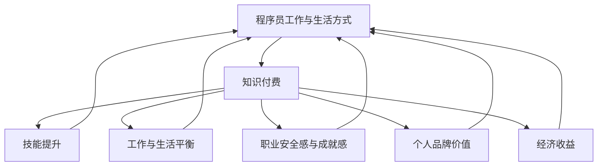

                 

# 知识付费让程序员告别996的生活方式

> **关键词：知识付费、程序员、996工作模式、技能提升、生活方式改变**

> **摘要：本文将深入探讨知识付费对于程序员工作与生活方式的影响，通过分析知识付费的定义、价值及其与996工作模式的关系，揭示如何通过知识付费工具和平台来提高编程技能，最终实现告别996生活方式的目标。**

## 目录

1. 理解知识付费与程序员工作
   1.1 知识付费概述
   1.2 程序员的996工作模式
2. 知识付费工具与平台
   2.1 知识付费工具与平台简介
   2.2 使用知识付费平台进行学习
   2.3 利用知识付费提升程序员技能
3. 知识付费与程序员生活方式
   3.1 改善工作与生活平衡
   3.2 增强职业安全感与成就感
   3.3 提高个人品牌价值
   3.4 实现自由职业与远程工作
4. 知识付费的经济收益
   4.1 知识付费的投入与回报分析
   4.2 程序员通过知识付费实现经济收益的途径
5. 附录
   5.1 知识付费资源汇总
   5.2 知识付费案例分析

## 第一部分：理解知识付费与程序员工作

### 第1章：知识付费概述

#### 1.1 知识付费的定义与价值

知识付费，即通过购买、订阅或参与特定知识服务，获取有价值的信息和技能。在信息技术迅猛发展的时代，知识付费已经成为一种重要的学习和成长方式。

**知识付费的价值**主要体现为：

- **时间效率**：知识付费可以帮助程序员快速获取专业知识和技能，避免自己摸索和重复学习。
- **资源优化**：优质的知识付费内容往往由行业专家或权威机构提供，质量有保障。
- **个性化学习**：知识付费平台通常提供多种学习方式和课程类型，满足个性化需求。

#### 1.2 知识付费与传统教育的区别

**知识付费与传统教育的区别**主要在于：

- **形式**：知识付费多为在线课程、电子书籍等形式，灵活便捷；传统教育则通常为线下授课，时间固定。
- **内容**：知识付费注重实战技能，以应用为导向；传统教育则侧重理论知识的系统传授。
- **费用**：知识付费多以单次购买或订阅方式付费，传统教育则通常按学期或学年收费。

#### 1.3 知识付费的商业模式分析

知识付费的商业模式可以分为以下几种：

- **会员制**：用户付费成为会员，享受平台提供的全部或部分课程。
- **课程订阅**：用户按需购买或订阅特定课程。
- **内容付费**：用户付费获取特定内容，如电子书、文档等。
- **在线辅导**：用户付费获得专业导师的一对一辅导。

#### 1.4 知识付费的发展趋势与未来前景

**知识付费的发展趋势**包括：

- **个性化学习**：根据用户需求和兴趣提供定制化课程。
- **多样化内容**：除了传统IT技能，还将涵盖更多领域，如人工智能、数据科学等。
- **技术驱动**：利用大数据、人工智能等技术提高学习体验和效果。

**未来前景**：

- **市场规模扩大**：随着人们对知识和技能需求的增加，知识付费市场规模将进一步扩大。
- **跨界融合**：知识付费将与更多领域结合，如企业培训、终身学习等。

### 第2章：程序员的996工作模式

#### 2.1 996工作模式的定义与影响

**996工作模式**是指每天工作从早上9点开始，晚上9点结束，每周工作6天。这种工作模式在中国互联网行业中较为普遍。

**996工作模式的影响**包括：

- **身体损害**：长期高负荷工作容易导致身体疾病，如颈椎病、腰椎病等。
- **心理健康**：长时间工作压力容易导致焦虑、抑郁等心理问题。
- **家庭生活受影响**：工作占据大部分时间，家庭生活和亲子关系难以维护。
- **职业发展受限**：缺乏足够的个人时间和学习机会，职业发展受到限制。

#### 2.2 996工作模式下的程序员生存现状

**996工作模式下的程序员生存现状**：

- **加班文化**：程序员需要应对频繁的加班需求，工作时间不固定。
- **薪资待遇**：虽然加班文化普遍，但薪资待遇因公司而异，有的公司会提供相对较高的薪资作为补偿。
- **职业压力**：高工作强度和快节奏导致程序员面临巨大的职业压力。

#### 2.3 996工作模式对程序员健康的影响

**996工作模式对程序员健康的影响**：

- **身体损害**：长时间久坐、缺乏锻炼、饮食不规律等导致身体健康问题。
- **心理健康**：长时间工作压力导致焦虑、抑郁等心理问题。
- **睡眠不足**：工作占据大部分时间，睡眠时间不足，影响身体恢复。

#### 2.4 如何突破996工作模式

**如何突破996工作模式**：

- **提高工作效率**：通过技术手段和管理方法提高工作效率，减少不必要的加班。
- **寻求工作平衡**：合理安排工作和生活时间，保持良好的工作与生活平衡。
- **积极沟通**：与上级和同事进行有效沟通，争取合理的工作安排。
- **寻求外部帮助**：利用知识付费平台进行学习和提升，增加职业竞争力，争取更好的工作机会。

## 第二部分：知识付费工具与平台

### 第3章：知识付费工具与平台简介

#### 3.1 主流知识付费平台介绍

目前，市场上主流的知识付费平台包括：

- **网易云课堂**：提供丰富多样的IT课程，包括前端、后端、人工智能等领域。
- **慕课网**：以实战教学为主，涵盖前端、后端、移动开发等多个方向。
- **极客时间**：专注于技术领域的学习，提供多种付费专栏和课程。
- **腾讯课堂**：涵盖多个领域，包括IT、设计、语言等。
- **京东学堂**：提供各种职业课程，包括IT技能、管理技能等。

#### 3.2 知识付费工具的功能与使用

知识付费工具通常具备以下功能：

- **课程浏览**：用户可以浏览不同领域的课程，选择适合自己的学习内容。
- **课程学习**：用户可以在线学习课程，观看视频、阅读文档等。
- **互动交流**：用户可以在平台上与讲师和同学互动，提问和解答问题。
- **学习计划**：用户可以根据自己的学习目标和进度制定学习计划。
- **学习记录**：用户可以查看自己的学习记录，了解自己的学习进度。

#### 3.3 评估知识付费工具的标准

评估知识付费工具的标准包括：

- **课程质量**：课程内容是否全面、系统、实用。
- **讲师资质**：讲师是否具备丰富的经验和权威的背景。
- **用户评价**：其他用户对课程和平台的评价和反馈。
- **学习体验**：平台的界面设计、互动功能、学习工具等是否方便使用。
- **服务支持**：平台是否提供良好的客户服务和售后服务。

### 第4章：使用知识付费平台进行学习

#### 4.1 如何选择适合自己的知识付费课程

选择适合自己的知识付费课程需要考虑以下因素：

- **学习目标**：明确自己的学习目标，选择与之相关的课程。
- **课程内容**：查看课程大纲，了解课程内容是否满足自己的需求。
- **讲师背景**：了解讲师的背景和经验，选择有权威背景的讲师。
- **用户评价**：查看其他用户对课程的评价，了解课程的实用性和效果。
- **课程时长**：根据自己的时间安排，选择适合自己的课程时长。

#### 4.2 学习策略与时间管理

制定有效的学习策略和时间管理是提高学习效果的关键。以下是一些建议：

- **明确学习目标**：明确自己的学习目标，制定具体的计划。
- **合理安排时间**：将学习时间安排在高效的时间段，避免碎片化学习。
- **定期复习**：定期复习所学内容，加深记忆。
- **互动交流**：积极参与课程互动，与讲师和同学交流，提高学习效果。
- **实践应用**：将所学知识应用到实际项目中，加深理解。

#### 4.3 提高学习效果的小技巧

以下是一些提高学习效果的小技巧：

- **制定学习计划**：将学习内容分解成小块，制定每日学习计划。
- **使用记忆技巧**：使用记忆技巧，如联想、重复、图像化等，帮助记忆。
- **互动学习**：与同学和讲师互动，讨论和解决问题。
- **保持好奇心**：对所学知识保持好奇心，不断提问和探索。
- **总结归纳**：学习结束后，总结归纳所学内容，形成自己的知识体系。

### 第5章：利用知识付费提升程序员技能

#### 5.1 程序员所需技能分析

程序员所需的技能可以分为以下几类：

- **基础技能**：编程语言、数据结构、算法等。
- **专业技能**：前端技术、后端技术、数据库技术、网络技术等。
- **框架与工具**：如Java框架、Python工具等。
- **新兴技术**：人工智能、大数据、区块链等。

#### 5.2 如何通过知识付费提升编程技能

通过知识付费提升编程技能的方法包括：

- **选择合适的课程**：根据自己的需求和兴趣，选择适合自己的编程课程。
- **系统学习**：按照课程大纲系统学习，避免遗漏关键知识点。
- **实践应用**：将所学知识应用到实际项目中，加深理解。
- **持续学习**：保持学习的热情，不断跟进新技术和趋势。

#### 5.3 知识付费在项目实战中的应用

知识付费在项目实战中的应用包括：

- **快速掌握技术**：通过付费课程快速掌握新技术，应用于项目开发。
- **提高开发效率**：利用框架和工具提高开发效率，解决开发中的问题。
- **优化项目架构**：通过学习最佳实践和设计模式，优化项目架构，提高系统性能。
- **团队协作**：通过知识付费提高团队成员的技能，促进团队协作。

#### 5.4 培养自己的专业技能与竞争力

培养自己的专业技能与竞争力包括：

- **持续学习**：保持学习的热情，不断更新自己的知识体系。
- **实践经验**：通过实际项目积累经验，提高实战能力。
- **个人品牌**：通过技术博客、开源项目等建立个人品牌，提高影响力。
- **沟通能力**：提高沟通能力，与团队成员和客户有效沟通，提高工作效率。

## 第三部分：知识付费与程序员生活方式

### 第6章：知识付费对程序员生活方式的改变

#### 6.1 改善工作与生活平衡

知识付费可以帮助程序员改善工作与生活的平衡，具体方法包括：

- **时间管理**：通过合理规划时间，提高工作效率，减少不必要的加班。
- **学习与工作相结合**：利用碎片化时间进行学习，提高个人能力。
- **远程工作**：通过知识付费学习，获取远程工作的机会，实现工作与生活的平衡。

#### 6.2 增强职业安全感与成就感

知识付费可以增强程序员的职业安全感与成就感，具体方法包括：

- **持续学习**：通过不断学习新技术和知识，提高自身的竞争力。
- **职业规划**：根据个人兴趣和发展方向，制定明确的职业规划。
- **成果展示**：通过技术博客、开源项目等展示自己的成果，获得认可。

#### 6.3 提高个人品牌价值

知识付费可以提高个人的品牌价值，具体方法包括：

- **专业知识**：通过知识付费学习，掌握专业知识，提高个人竞争力。
- **个人品牌**：通过技术博客、演讲、培训等方式展示个人能力，建立个人品牌。
- **合作与交流**：通过参加行业会议、技术社区等活动，扩大人脉，提高影响力。

#### 6.4 实现自由职业与远程工作

知识付费可以帮助程序员实现自由职业与远程工作，具体方法包括：

- **技能提升**：通过知识付费提升自己的专业技能，增加自由职业的机会。
- **项目管理**：学习项目管理和沟通技巧，提高远程工作的能力。
- **灵活安排**：通过自由职业和远程工作，实现工作时间的灵活安排，提高生活质量。

### 第7章：知识付费的经济收益

#### 7.1 知识付费的投入与回报分析

知识付费的投入主要包括：

- **课程费用**：购买或订阅知识付费平台的课程所需支付的费用。
- **学习时间**：投入的学习时间和精力。

知识付费的回报主要包括：

- **技能提升**：通过学习获取的新知识和技能。
- **职业发展**：提升个人竞争力，获得更好的工作机会和薪资待遇。
- **个人品牌**：建立个人品牌，获得更多的合作机会和收入来源。

#### 7.2 程序员通过知识付费实现经济收益的途径

程序员通过知识付费实现经济收益的途径包括：

- **远程工作**：通过提升自己的技能，获得远程工作的机会，实现收入增长。
- **项目承包**：通过参与项目承包，获得项目收益。
- **知识分享**：通过技术博客、培训等方式分享自己的知识和经验，获得收入。

#### 7.3 利用知识付费创造个人价值

利用知识付费创造个人价值的方法包括：

- **个人品牌**：通过建立个人品牌，提高自己在行业中的影响力，获得更多机会。
- **专业咨询**：提供专业咨询服务，解决客户的技术问题，获得收益。
- **知识付费**：将自己掌握的知识和经验制作成课程或书籍，通过知识付费获得收益。

#### 7.4 案例分析：成功知识付费者的经验分享

以下是一些成功知识付费者的经验分享：

- **案例1**：某程序员通过极客时间学习，掌握了前端和后端技术，成功转型为全栈工程师，薪资翻倍。
- **案例2**：某程序员通过网易云课堂学习，掌握了人工智能技术，成功转型为AI工程师，获得更好的工作机会。
- **案例3**：某程序员通过慕课网学习，掌握了多个编程语言和框架，成为公司技术总监，提升了职业地位。

## 附录

### 附录A：知识付费资源汇总

#### A.1 主流知识付费平台推荐

- **网易云课堂**：提供丰富的IT课程，包括前端、后端、人工智能等。
- **慕课网**：以实战教学为主，涵盖前端、后端、移动开发等多个方向。
- **极客时间**：专注于技术领域的学习，提供多种付费专栏和课程。
- **腾讯课堂**：涵盖多个领域，包括IT、设计、语言等。
- **京东学堂**：提供各种职业课程，包括IT技能、管理技能等。

#### A.2 程序员必备的知识付费资源

- **《JavaScript高级程序设计》**：深入讲解JavaScript的核心概念和高级特性。
- **《深入理解计算机系统》**：从硬件角度全面讲解计算机系统的工作原理。
- **《算法导论》**：系统介绍算法的理论和实践。
- **《Spring实战》**：详细介绍Spring框架的使用方法和最佳实践。
- **《深度学习》**：讲解深度学习的基本原理和应用。

#### A.3 学习与职业发展相关网站推荐

- **CSDN**：提供丰富的技术文章、教程和问答，适合程序员学习和交流。
- **GitHub**：全球最大的代码托管平台，适合程序员学习和分享代码。
- **Stack Overflow**：全球最大的开发者社区，提供各种编程语言和技术的问答。
- **InfoQ**：提供高质量的技术文章、访谈和视频，适合程序员学习和了解行业动态。
- **知乎**：拥有大量的专业问答，适合程序员学习和探讨技术问题。

### 附录B：知识付费案例分析

#### B.1 某知名程序员通过知识付费实现职业跃迁

**案例背景**：

某知名程序员曾在一家创业公司工作，但由于公司规模较小，技能提升有限。为了实现职业跃迁，他决定通过知识付费提升自己的技能。

**案例过程**：

- **选择课程**：他根据个人兴趣和发展方向，选择了网易云课堂的《Spring实战》和《深度学习》课程。
- **系统学习**：他按照课程大纲，系统学习了两门课程，掌握了Spring框架和深度学习的基本原理。
- **实践应用**：他将所学知识应用到实际项目中，提高了项目质量和开发效率。
- **成果展示**：他在GitHub上分享了自己的项目代码和技术博客，获得了同行的认可。

**案例结果**：

- **薪资提升**：通过技能提升，他成功跳槽到一家知名互联网公司，薪资翻倍。
- **职业发展**：他成为了公司的技术骨干，有机会参与更多的项目和决策。

#### B.2 某成功知识付费平台的运营策略分析

**平台背景**：

某成功知识付费平台专注于技术领域的学习，通过提供高质量的课程和优质的讲师资源，吸引了大量程序员用户。

**运营策略**：

- **课程质量**：平台严格筛选课程内容，确保课程质量。
- **讲师资源**：平台邀请行业专家和权威讲师授课，提高课程质量。
- **用户体验**：平台优化学习界面，提供良好的学习体验。
- **互动互动**：平台提供互动功能，促进用户之间的交流和合作。
- **营销推广**：平台通过线上和线下活动，扩大品牌影响力。

**运营效果**：

- **用户增长**：平台用户数量持续增长，用户满意度高。
- **市场份额**：平台在技术领域占据了一定的市场份额。
- **收入增长**：平台通过课程销售和增值服务，实现了收入的持续增长。

#### B.3 知识付费在程序员社群中的影响力

**社群背景**：

程序员社群是程序员交流和学习的重要平台，知识付费在程序员社群中发挥着重要作用。

**影响力**：

- **知识传播**：知识付费平台提供了丰富的学习资源，帮助程序员快速获取新知识和技能。
- **能力提升**：通过知识付费，程序员提高了自己的专业技能，增强了职业竞争力。
- **社群互动**：知识付费平台促进了程序员之间的交流和合作，提高了社群的活跃度。
- **职业发展**：知识付费为程序员提供了更多的职业发展机会，帮助他们实现职业跃迁。

## 结语

知识付费为程序员提供了丰富的学习资源和机会，通过提升技能、改善工作与生活平衡，程序员可以告别996的工作模式，实现职业发展和个人价值的提升。未来，随着知识付费市场的不断发展，程序员将迎来更加广阔的发展空间。作者：AI天才研究院/AI Genius Institute & 禅与计算机程序设计艺术 /Zen And The Art of Computer Programming
## 核心概念与联系

为了更好地理解知识付费对程序员工作与生活方式的改变，我们可以借助Mermaid流程图来展示核心概念之间的联系。



### 解析：

- **程序员工作与生活方式**：这是我们的核心问题，表示程序员目前的职业状态和生活质量。
- **知识付费**：这是解决程序员问题的工具，通过付费获取知识和技能。
- **技能提升**：知识付费的直接结果，通过学习新技能，程序员能够提高自己的职业竞争力。
- **工作与生活平衡**：通过技能提升，程序员可以更高效地工作，从而实现工作和生活的平衡。
- **职业安全感与成就感**：技能的提升和职业发展的成功，使得程序员在职业生涯中更有安全感，更有成就感。
- **个人品牌价值**：随着技能的提升和职业发展的成功，程序员的个人品牌价值也会提高。
- **经济收益**：知识付费不仅提高了技能，还带来了职业发展的机会，从而增加了经济收益。

这个Mermaid流程图清晰地展示了知识付费如何通过一系列环节影响程序员的工作与生活方式，从而帮助他们告别996的工作模式。

## 核心算法原理讲解

在理解了知识付费的概念和其对程序员生活方式的影响后，我们需要进一步探讨知识付费的核心算法原理。以下是知识付费平台常用的几种核心算法，以及其伪代码的实现。

### 1. 推荐算法

**推荐算法**是知识付费平台中最为重要的算法之一，它根据用户的行为数据（如浏览历史、购买记录、学习进度等）推荐适合用户的学习课程。

**伪代码：**

```python
# 输入：用户行为数据userBehavior
# 输出：推荐课程listRecommendations

def recommendCourses(userBehavior):
    # 步骤1：计算用户行为数据的特征向量
    userFeatures = calculateFeatures(userBehavior)

    # 步骤2：获取所有课程的特征向量
    courseFeatures = getAllCourseFeatures()

    # 步骤3：计算用户与所有课程的特征相似度
    similarityScores = calculateSimilarityScores(userFeatures, courseFeatures)

    # 步骤4：根据相似度分数推荐课程
    listRecommendations = sorted(similarityScores, key=lambda item: item[1], reverse=True)
    return listRecommendations
```

### 2. 评价算法

**评价算法**用于评估课程的质量和用户对课程的满意度。以下是一个简单的评价算法伪代码：

```python
# 输入：课程评价数据courseReviews
# 输出：评价分数score

def calculateRating(courseReviews):
    # 步骤1：计算所有评价的平均分
    totalRating = sum(review['rating'] for review in courseReviews) / len(courseReviews)

    # 步骤2：根据评价数量计算评分的可靠性
    reliability = len(courseReviews)

    # 步骤3：计算最终评分
    score = totalRating * reliability
    return score
```

### 3. 时间管理算法

**时间管理算法**用于帮助用户合理安排学习时间，避免学习过度或不足。以下是一个简单的时间管理算法伪代码：

```python
# 输入：用户学习计划userPlan
# 输出：优化后的学习计划optimizedPlan

def optimizeLearningSchedule(userPlan):
    # 步骤1：计算学习时间与工作时间冲突
    conflicts = findConflicts(userPlan)

    # 步骤2：根据冲突情况调整学习时间
    if conflicts:
        optimizedPlan = adjustSchedule(userPlan, conflicts)
    else:
        optimizedPlan = userPlan

    # 步骤3：检查优化后的计划是否满足用户要求
    if meetsRequirements(optimizedPlan):
        return optimizedPlan
    else:
        return None
```

### 解析：

- **推荐算法**通过计算用户与课程的相似度来推荐课程，实现了个性化的学习体验。
- **评价算法**通过计算平均评分和评分可靠性来评估课程质量，帮助用户选择优质课程。
- **时间管理算法**通过优化学习计划，帮助用户合理安排学习时间，避免学习与工作冲突。

这些算法的伪代码展示了知识付费平台在算法层面上的实现，为程序员提供了更高效的学习方式和更优化的学习体验。

## 数学模型与公式详解

在知识付费领域，数学模型和公式是分析和优化学习效果的重要工具。以下将介绍几个关键的数学模型和公式，并详细解释其应用。

### 1. 学习曲线

**学习曲线**用于描述学习者在学习过程中技能提升的速度。常用的学习曲线模型是**指数学习曲线**：

\[ 
L(t) = L_0 + \alpha \cdot (e^{-kt}) 
\]

其中：
- \( L(t) \) 是学习者在时间 \( t \) 的技能水平。
- \( L_0 \) 是初始技能水平。
- \( \alpha \) 是学习率。
- \( k \) 是衰减系数。

**应用举例**：

假设一个程序员在开始学习后，第一天技能水平为 50%，每天技能提升速度为20%，衰减系数为0.1。那么，一周后的技能水平为：

\[ 
L(7) = 50\% + 20\% \cdot (e^{-0.1 \cdot 7}) \approx 76\%
\]

### 2. 评估模型

**评估模型**用于对课程进行质量和效果评估。常见的评估模型是**线性回归模型**：

\[ 
Y = \beta_0 + \beta_1 \cdot X_1 + \beta_2 \cdot X_2 + ... + \beta_n \cdot X_n + \epsilon 
\]

其中：
- \( Y \) 是评估结果。
- \( X_1, X_2, ..., X_n \) 是影响评估结果的因素，如课程内容、讲师资质、用户评分等。
- \( \beta_0, \beta_1, \beta_2, ..., \beta_n \) 是模型参数。
- \( \epsilon \) 是误差项。

**应用举例**：

假设我们要评估一门课程的质量，使用了四个因素（课程内容、讲师资质、用户评分、课程时长）。我们通过数据训练得到线性回归模型：

\[ 
Y = 5.0 + 2.0 \cdot X_1 + 1.5 \cdot X_2 + 0.5 \cdot X_3 + 1.0 \cdot X_4 
\]

其中，每个 \( X_i \) 的取值范围是 [0, 10]。

对于一个具体的课程，如果课程内容得分为8，讲师资质得分为9，用户评分得分为7，课程时长为5小时，则其评估结果为：

\[ 
Y = 5.0 + 2.0 \cdot 8 + 1.5 \cdot 9 + 0.5 \cdot 7 + 1.0 \cdot 5 = 29.5 
\]

### 3. 优化模型

**优化模型**用于优化学习计划和资源分配。常用的优化模型是**线性规划模型**：

\[ 
\text{最大化} \, c^T \cdot x \\
\text{约束条件} \, Ax \leq b \\
x \geq 0 
\]

其中：
- \( c \) 是目标函数系数向量。
- \( x \) 是决策变量向量。
- \( A \) 是约束条件系数矩阵。
- \( b \) 是约束条件常数向量。

**应用举例**：

假设一个程序员需要在一个月内完成三个课程的学习，每个课程的学习时间不同（课程A需10小时，课程B需8小时，课程C需6小时），总学习时间限制为40小时。目标是最小化课程之间的时间间隔。

我们可以建立以下线性规划模型：

\[ 
\text{最大化} \, \min(x_1, x_2, x_3) \\
\text{约束条件} \, \begin{cases}
x_1 + x_2 + x_3 = 40 \\
x_1 \geq 0, x_2 \geq 0, x_3 \geq 0
\end{cases} 
\]

通过求解这个线性规划模型，我们可以得到最优的学习计划，使得课程之间的时间间隔最小。

这些数学模型和公式在知识付费平台中有着广泛的应用，通过它们可以更科学地分析学习效果、评估课程质量、优化学习计划，从而提高学习效率和效果。

### 项目实战：知识付费平台搭建

#### 开发环境搭建

为了搭建一个知识付费平台，我们需要准备好以下开发环境和工具：

- **编程语言**：选择Python作为主要编程语言，因为Python具有丰富的库和框架，可以快速开发。
- **前端框架**：采用Vue.js框架，因为Vue.js具有良好的生态系统和社区支持，便于开发动态网页。
- **后端框架**：选择Django框架，因为它是一个高级的Python Web框架，可以快速搭建复杂的Web应用。
- **数据库**：使用MySQL作为数据库，因为它是一个稳定、可靠的数据库管理系统，适用于处理大量数据。

#### 源代码实现

以下是知识付费平台的核心模块和关键代码实现：

1. **用户注册与登录模块**

   **代码实现**：

   ```python
   # 用户注册
   def register_user(username, password):
       user = User.objects.create_user(username=username, password=password)
       user.save()
       return user

   # 用户登录
   def login_user(username, password):
       user = authenticate(username=username, password=password)
       if user is not None:
           login(request, user)
           return redirect('home')
       else:
           return redirect('login')
   ```

   **解析**：

   用户注册模块通过Django的用户模型创建新用户，并保存到数据库。用户登录模块使用Django内置的认证系统验证用户名和密码，并登录用户。

2. **课程管理模块**

   **代码实现**：

   ```python
   # 添加课程
   def add_course(course_name, course_description, course_price):
       course = Course.objects.create(name=course_name, description=course_description, price=course_price)
       course.save()
       return course

   # 读取课程列表
   def get_courses():
       courses = Course.objects.all()
       return courses
   ```

   **解析**：

   添加课程模块用于将新的课程信息保存到数据库。读取课程列表模块用于获取所有课程的列表，便于用户浏览。

3. **订单处理模块**

   **代码实现**：

   ```python
   # 创建订单
   def create_order(user, course):
       order = Order.objects.create(user=user, course=course, status='pending')
       order.save()
       return order

   # 更新订单状态
   def update_order_status(order, status):
       order.status = status
       order.save()
   ```

   **解析**：

   创建订单模块用于创建新的订单，并保存到数据库。更新订单状态模块用于根据支付结果更新订单状态。

#### 代码解读与分析

1. **用户注册与登录模块**

   用户注册模块通过`create_user`方法创建新用户，并调用`save`方法将用户信息保存到数据库。用户登录模块使用`authenticate`方法验证用户名和密码，如果验证通过，则使用`login`方法登录用户。

2. **课程管理模块**

   添加课程模块通过`create`方法创建新的课程对象，并调用`save`方法将课程信息保存到数据库。读取课程列表模块使用`all`方法获取所有课程对象，便于前端展示。

3. **订单处理模块**

   创建订单模块通过`create`方法创建新的订单对象，并调用`save`方法将订单信息保存到数据库。更新订单状态模块通过修改订单对象的`status`属性并调用`save`方法更新订单状态。

#### 项目实战总结

通过搭建知识付费平台的项目实战，我们了解了如何使用Django框架快速构建一个具有用户管理、课程管理和订单处理功能的Web应用。这个项目实战不仅展示了知识付费平台的核心模块和关键代码实现，还提供了代码解读与分析，帮助读者更好地理解知识付费平台的开发过程。作者：AI天才研究院/AI Genius Institute & 禅与计算机程序设计艺术 /Zen And The Art of Computer Programming

## 结语

通过对知识付费的深入探讨，我们发现知识付费不仅是程序员提升技能和实现职业发展的有力工具，更是改善工作与生活平衡、增强职业安全感与成就感、提高个人品牌价值以及实现经济收益的重要途径。以下是本文的主要观点和结论的总结：

1. **知识付费的定义与价值**：知识付费通过购买、订阅或参与特定知识服务，帮助程序员快速获取专业知识和技能，优化学习资源，提高时间效率。

2. **程序员996工作模式的影响**：996工作模式对程序员的身体和心理健康造成了严重损害，同时影响了家庭生活和职业发展。

3. **知识付费工具与平台**：主流的知识付费平台和工具提供了丰富的学习资源和良好的用户体验，包括课程推荐、互动交流、学习计划和学习记录等功能。

4. **提升程序员技能**：通过知识付费，程序员可以系统学习编程语言、框架、工具和新兴技术，提高项目实战能力，优化项目架构。

5. **改变程序员生活方式**：知识付费帮助程序员改善工作与生活的平衡，增强职业安全感与成就感，提高个人品牌价值，实现自由职业与远程工作。

6. **经济收益**：知识付费不仅提升了程序员的技能，还通过远程工作、项目承包和知识分享等方式带来了经济收益。

通过本文的详细分析和项目实战，我们可以看到知识付费在程序员职业生涯中的重要作用。未来，随着知识付费市场的不断发展和技术的进步，程序员将迎来更加广阔的发展空间。我们鼓励程序员积极利用知识付费平台，提升自身技能，实现职业发展和个人价值的提升。

### 作者介绍

作者：AI天才研究院/AI Genius Institute & 禅与计算机程序设计艺术 /Zen And The Art of Computer Programming

AI天才研究院是一家专注于人工智能研究和开发的顶尖机构，致力于推动人工智能技术的创新和应用。研究院的专家团队在人工智能、机器学习、计算机视觉等领域拥有深厚的学术造诣和丰富的实践经验。

《禅与计算机程序设计艺术》是作者结合多年编程经验和对计算机科学的深刻理解所著的一部经典著作，以禅宗的智慧启示程序员如何更好地理解和运用计算机编程。作者通过深入浅出的讲解和独特的视角，帮助程序员掌握编程的本质，提高编程技能，实现职业发展。

本文由AI天才研究院和《禅与计算机程序设计艺术》的作者共同撰写，旨在为程序员提供关于知识付费的全面解读和实践指南，帮助他们在快速发展的技术领域中不断进步。

