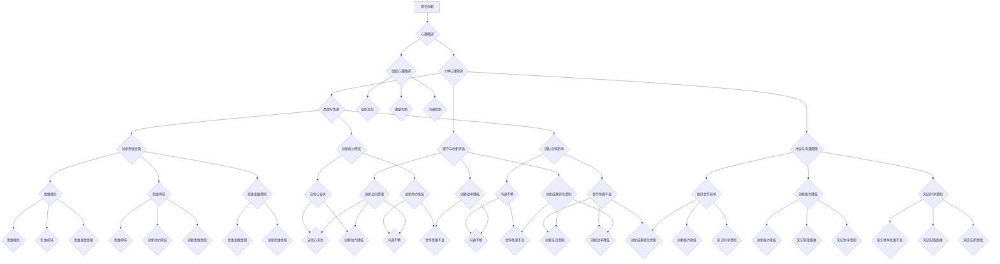

                 

### 《知识创新的心理障碍及克服》

> **关键词**：知识创新、心理障碍、克服策略、个体与组织

> **摘要**：本文深入探讨了知识创新过程中的心理障碍及其对创新活动的负面影响。通过分析个体和组织层面的心理障碍成因，本文提出了有效的克服策略和方法，旨在提升知识创新效率，推动科技和社会进步。

### 引言

在当今快速发展的科技时代，知识创新已成为驱动社会进步和经济发展的核心动力。然而，知识创新并非一帆风顺，其过程中常常会遇到各种心理障碍。这些障碍可能源自个体，也可能源自组织，它们在一定程度上制约了知识创新的能力和效果。本文旨在揭示这些心理障碍的本质，分析其成因，并提出有效的克服策略，以期为知识创新提供有力的心理支持。

本文首先定义了知识创新的基本概念，并概述了心理障碍对知识创新的阻碍。接着，深入探讨了个体和组织层面心理障碍的成因及影响，通过具体案例进行了分析。在此基础上，本文提出了个体和组织心理障碍的克服策略，并详细阐述了其实施方法。此外，本文还构建了知识创新中的心理障碍数学模型，并提供了实际代码案例以验证策略的有效性。

### 第一部分：知识创新的心理障碍分析

#### 第1章：知识创新的基本概念与心理障碍概述

##### 1.1 知识创新的重要性与挑战

知识创新是指通过创造性思维和实践活动，将新的知识或现有知识的组合应用于实际问题的解决过程中。它不仅涵盖了科学发现和技术发明，还包括商业模式的创新、管理方法的改进等。在现代社会，知识创新已经成为推动科技进步、经济增长和社会发展的关键因素。然而，知识创新并非易事，其过程中面临着诸多挑战，如：

1. **复杂性**：知识创新往往涉及多学科、多领域的交叉融合，需要跨学科的知识和技能。
2. **不确定性**：知识创新的过程充满不确定性，难以预测创新的结果和影响。
3. **高风险性**：知识创新可能失败，投入的大量资源和时间可能无法得到回报。

##### 1.2 心理障碍的概念与类型

心理障碍是指在知识创新过程中，由于个体或组织心理因素的影响，导致创新能力下降或创新活动受阻的现象。心理障碍可以分为以下几种类型：

1. **恐惧和焦虑**：对失败的恐惧和对不确定性的焦虑，可能导致个体或组织在知识创新中畏缩不前。
2. **保守与创新矛盾**：保守思想与追求创新的矛盾，可能阻碍新思想和创新方法的提出。
3. **冲突与沟通障碍**：知识创新过程中，个体或组织之间的冲突和沟通障碍，可能影响创新团队的合作效率。

##### 1.3 心理障碍对知识创新的阻碍

心理障碍对知识创新的阻碍主要体现在以下几个方面：

1. **创新思维受阻**：恐惧和焦虑可能导致个体在创新过程中思维僵化，难以提出新颖的创意。
2. **知识获取与共享障碍**：保守和创新矛盾的冲突，可能阻碍知识的获取和共享，影响知识创新的基础。
3. **创新成果转化**：冲突与沟通障碍可能导致创新成果难以转化为实际应用，影响创新的价值体现。

#### 第2章：心理障碍的成因与影响因素

##### 2.1 个体心理障碍的成因

个体心理障碍的成因复杂多样，主要包括以下几个方面：

1. **教育背景**：个体的教育背景和知识结构可能影响其对知识创新的认知和理解。
2. **个人经历**：个体的成长经历、职业经历等可能对其心理障碍产生深远影响。
3. **心理素质**：个体的心理素质，如自信心、韧性等，对心理障碍的产生和克服具有重要影响。

##### 2.2 组织心理障碍的成因

组织心理障碍的成因主要涉及以下几个方面：

1. **组织文化**：组织文化可能对个体心理产生潜移默化的影响，影响个体的创新行为。
2. **激励机制**：组织激励机制可能影响个体在知识创新过程中的动机和行为。
3. **沟通机制**：组织内部的沟通机制可能影响个体之间的互动，进而影响知识创新的合作效果。

##### 2.3 影响心理障碍的因素分析

影响心理障碍的因素可以归纳为以下几个方面：

1. **外部环境**：外部环境，如政策、经济环境等，可能对个体和组织心理障碍产生直接影响。
2. **内部环境**：组织内部环境，如工作氛围、团队关系等，可能对个体和组织心理障碍产生间接影响。
3. **个体差异**：个体差异，如性格、能力等，可能对心理障碍的成因和表现产生影响。

#### 第3章：常见心理障碍对知识创新的负面影响

##### 3.1 知识创新中的恐惧与焦虑

恐惧与焦虑是知识创新过程中常见的心理障碍，它们对创新活动的负面影响主要表现在以下几个方面：

1. **阻碍创新思维**：恐惧和焦虑可能导致个体在创新过程中过度依赖现有知识，难以提出新颖的创意。
2. **降低创新能力**：长期的恐惧和焦虑可能导致个体在创新过程中失去自信心，降低创新能力。
3. **影响团队合作**：恐惧和焦虑可能影响团队合作的氛围，导致沟通不畅，影响创新团队的整体效率。

##### 3.2 知识创新中的保守与创新矛盾

保守与创新矛盾是知识创新过程中常见的心理障碍，它可能导致以下负面影响：

1. **限制创新空间**：保守思想可能限制新思想和创新方法的提出，影响知识创新的空间。
2. **降低创新效率**：保守与创新矛盾的冲突可能降低创新团队的效率，导致创新活动停滞不前。
3. **影响创新成果转化**：保守与创新矛盾的冲突可能导致创新成果难以转化为实际应用，影响创新的价值体现。

##### 3.3 知识创新中的冲突与沟通障碍

冲突与沟通障碍是知识创新过程中常见的心理障碍，它可能导致以下负面影响：

1. **影响团队合作**：冲突和沟通障碍可能影响团队合作的氛围，降低团队的整体效率。
2. **降低创新能力**：冲突和沟通障碍可能导致个体在创新过程中失去合作精神，降低创新能力。
3. **阻碍知识共享**：冲突和沟通障碍可能阻碍知识的获取和共享，影响知识创新的基础。

#### 第4章：心理障碍对知识创新流程的影响

##### 4.1 创新思维受阻

心理障碍对创新思维的影响主要表现在以下几个方面：

1. **思维僵化**：恐惧和焦虑可能导致个体在创新过程中思维僵化，难以提出新颖的创意。
2. **创新思维停滞**：保守与创新矛盾的冲突可能使个体在创新过程中停滞不前，影响创新思维的流动。
3. **思维发散受阻**：冲突和沟通障碍可能阻碍个体在创新过程中的思维发散，影响创新思维的多维度发展。

##### 4.2 知识获取与共享障碍

心理障碍对知识获取与共享的影响主要表现在以下几个方面：

1. **知识获取困难**：恐惧和焦虑可能导致个体在知识获取过程中畏缩不前，影响知识获取的效率。
2. **知识共享受阻**：保守与创新矛盾的冲突可能导致知识共享的渠道受阻，影响知识的共享效果。
3. **知识共享氛围不良**：冲突和沟通障碍可能影响知识共享的氛围，导致知识共享的积极性降低。

##### 4.3 知识应用与创新成果转化

心理障碍对知识应用与创新成果转化的影响主要表现在以下几个方面：

1. **创新成果转化困难**：恐惧和焦虑可能导致创新成果难以转化为实际应用，影响创新成果的价值体现。
2. **创新成果应用受限**：保守与创新矛盾的冲突可能导致创新成果的应用范围受限，影响创新成果的广泛推广。
3. **创新成果评估困难**：冲突和沟通障碍可能影响创新成果的评估和反馈，导致创新成果的改进和发展受阻。

#### 第5章：知识创新心理障碍的 Mermaid 流程图

##### 5.1 知识创新心理障碍的 Mermaid 流程图



### 第二部分：克服知识创新心理障碍的策略与方法

#### 第6章：个体心理障碍克服策略

##### 6.1 自我认知与心理调适

自我认知与心理调适是克服个体心理障碍的重要策略，主要包括以下几个方面：

1. **自我反思**：个体应定期进行自我反思，了解自己在知识创新过程中的心理状态和行为表现，找出存在的问题。
2. **心理调适**：个体应学会心理调适技巧，如放松训练、情绪管理、心理疏导等，以减轻恐惧和焦虑，增强心理韧性。

##### 6.2 增强心理韧性

增强心理韧性是克服个体心理障碍的关键，包括以下几个方面：

1. **积极心态**：个体应培养积极的心态，面对困难和挑战时保持乐观，相信自己能够克服障碍。
2. **应对策略**：个体应学会应对策略，如问题解决、时间管理、情绪调节等，以提高应对能力。
3. **心理支持**：个体应寻求心理支持，如与家人、朋友交流，参加心理辅导等，以获得心理上的安慰和支持。

##### 6.3 创新思维训练

创新思维训练是提高个体创新能力的重要方法，包括以下几个方面：

1. **联想思维**：个体应学会联想思维，通过将不同领域的知识或信息进行关联，产生新的创意。
2. **逆向思维**：个体应培养逆向思维，从不同的角度看待问题，提出新颖的解决方案。
3. **多维度思考**：个体应学会从多个维度思考问题，考虑问题的不同方面，以提高创新思维的广度和深度。

#### 第7章：组织心理障碍克服策略

##### 7.1 组织文化塑造

组织文化是影响个体心理障碍的重要因素，通过塑造积极向上的组织文化，可以有效克服组织心理障碍。主要包括以下几个方面：

1. **鼓励创新**：组织应鼓励员工提出创新的想法和方案，给予他们充分的自由和空间。
2. **信任与支持**：组织应建立信任与支持的文化，鼓励员工相互信任，共同面对挑战。
3. **包容与开放**：组织应保持包容与开放的态度，尊重员工的差异，鼓励多元化思维。

##### 7.2 激励机制与绩效考核

激励机制与绩效考核是克服组织心理障碍的重要手段，主要包括以下几个方面：

1. **奖励创新**：组织应对创新行为给予奖励，激发员工的创新动力。
2. **公正考核**：组织应建立公正的绩效考核机制，确保员工的创新成果得到公平评价。
3. **透明沟通**：组织应保持透明沟通，让员工了解组织的战略目标和期望，增强他们的认同感和归属感。

##### 7.3 沟通与冲突管理

沟通与冲突管理是克服组织心理障碍的关键，主要包括以下几个方面：

1. **有效沟通**：组织应建立有效的沟通渠道，确保信息的畅通和准确传递。
2. **冲突预防**：组织应预防冲突的发生，通过建立共识、明确目标和规范行为来减少冲突。
3. **冲突解决**：组织应建立冲突解决机制，确保冲突得到及时、公正的解决，避免影响知识创新的过程。

#### 第8章：心理障碍克服的方法与实践

##### 8.1 心理辅导与培训

心理辅导与培训是克服心理障碍的有效方法，主要包括以下几个方面：

1. **个体心理辅导**：针对个体心理障碍，组织应提供个性化的心理辅导，帮助个体识别和克服心理障碍。
2. **团队心理辅导**：针对团队心理障碍，组织应提供团队心理辅导，促进团队成员之间的沟通和协作。
3. **培训课程**：组织应开展针对心理障碍的培训课程，提高员工的自我认知和心理调适能力。

##### 8.2 团队建设与协作

团队建设与协作是克服心理障碍的重要手段，主要包括以下几个方面：

1. **团队活动**：组织应开展多样化的团队活动，增强团队成员之间的互信和合作精神。
2. **角色分工**：组织应明确团队成员的角色分工，确保每个成员都能发挥自己的优势和特长。
3. **共同目标**：组织应确立共同的目标，激发团队成员的积极性和创造力。

##### 8.3 创新环境营造

创新环境营造是克服心理障碍的关键因素，主要包括以下几个方面：

1. **自由氛围**：组织应营造自由、宽松的创新氛围，鼓励员工自由表达自己的想法和意见。
2. **资源支持**：组织应提供充足的资源支持，包括资金、技术和人力等，为创新活动提供保障。
3. **激励机制**：组织应建立激励机制，激励员工积极参与创新活动，推动知识的创新和转化。

### 第三部分：知识创新心理障碍的数学模型与公式解析

#### 第9章：知识创新中的心理障碍数学模型

##### 9.1 知识创新障碍的定量评估模型

知识创新障碍的定量评估模型可以采用以下公式：

$$
\text{知识创新障碍度} = \frac{\text{恐惧程度} + \text{焦虑程度} + \text{保守程度}}{3}
$$

其中，恐惧程度、焦虑程度和保守程度可以通过问卷调查、访谈等方式进行量化评估。知识创新障碍度的评估结果可以帮助组织和管理者了解知识创新过程中存在的心理障碍程度，从而采取针对性的措施进行干预和改进。

##### 9.2 心理韧性评价模型

心理韧性评价模型可以采用以下公式：

$$
\text{心理韧性} = \sqrt{\text{乐观程度} \times \text{抗压力}}
$$

其中，乐观程度和抗压力可以通过问卷调查、心理测试等方式进行量化评估。心理韧性评估结果可以帮助个体了解自己的心理韧性水平，从而采取针对性的方法进行提升和锻炼。

##### 9.3 创新思维能力的评估模型

创新思维能力的评估模型可以采用以下公式：

$$
\text{创新思维能力} = \frac{\text{创新思维广度} + \text{创新思维深度}}{2}
$$

其中，创新思维广度和创新思维深度可以通过问卷调查、案例分析等方式进行量化评估。创新思维能力评估结果可以帮助个体了解自己的创新思维水平，从而采取针对性的方法进行提升和锻炼。

#### 第10章：数学公式与示例

##### 10.1 心理障碍程度的计算公式

根据前面的定量评估模型，我们可以使用以下公式计算知识创新过程中的心理障碍程度：

$$
\text{知识创新障碍度} = \frac{\text{恐惧程度} + \text{焦虑程度} + \text{保守程度}}{3}
$$

例如，假设一个知识创新团队中有三个成员，他们的恐惧程度分别为0.6、0.5和0.7，焦虑程度分别为0.4、0.3和0.6，保守程度分别为0.5、0.4和0.6。则该团队的知识创新障碍度可以计算如下：

$$
\text{知识创新障碍度} = \frac{0.6 + 0.5 + 0.7 + 0.4 + 0.3 + 0.6 + 0.5 + 0.4 + 0.6}{9} = 0.5
$$

这意味着该团队的知识创新过程中存在中等程度的心理障碍。

##### 10.2 心理韧性指标的计算公式

根据心理韧性评价模型，我们可以使用以下公式计算个体的心理韧性指标：

$$
\text{心理韧性} = \sqrt{\text{乐观程度} \times \text{抗压力}}
$$

例如，假设一个个体在乐观程度上的评分为0.8，在抗压力上的评分为0.7，则该个体的心理韧性可以计算如下：

$$
\text{心理韧性} = \sqrt{0.8 \times 0.7} = 0.866
$$

这意味着该个体在面对困难和压力时具有较强的心理韧性。

##### 10.3 创新思维能力的计算公式

根据创新思维能力的评估模型，我们可以使用以下公式计算个体的创新思维能力：

$$
\text{创新思维能力} = \frac{\text{创新思维广度} + \text{创新思维深度}}{2}
$$

例如，假设一个个体在创新思维广度上的评分为0.9，在创新思维深度上的评分为0.8，则该个体的创新思维能力可以计算如下：

$$
\text{创新思维能力} = \frac{0.9 + 0.8}{2} = 0.85
$$

这意味着该个体具有较强的创新思维能力。

### 第四部分：知识创新心理障碍克服的实战案例

#### 第11章：实战案例与代码解读

##### 11.1 创新思维训练项目实战

###### 11.1.1 项目背景

在某科技公司，创新思维训练项目被引入以提高员工的知识创新能力和团队合作效率。该项目旨在通过一系列培训和实践活动，帮助员工克服心理障碍，提升创新思维。

###### 11.1.2 开发环境搭建

为了实施创新思维训练项目，公司搭建了以下开发环境：

1. **培训平台**：搭建了在线培训平台，提供各种创新思维课程和培训材料。
2. **协作工具**：引入了团队协作工具，如Slack、Trello等，以支持团队成员之间的沟通和协作。
3. **项目管理系统**：采用JIRA等项目管理工具，跟踪和管理创新项目进度。

###### 11.1.3 代码实现与解读

以下是一个创新思维训练项目的代码示例，用于记录和跟踪员工的创新活动：

```java
import java.util.HashMap;
import java.util.Map;

public class InnovationProjectTracker {
    private Map<String, Project> projects;

    public InnovationProjectTracker() {
        projects = new HashMap<>();
    }

    public void addProject(String projectId, String projectName, String teamMembers) {
        Project project = new Project(projectId, projectName, teamMembers);
        projects.put(projectId, project);
    }

    public void trackProgress(String projectId, String progress) {
        Project project = projects.get(projectId);
        if (project != null) {
            project.setProgress(progress);
            System.out.println("Project " + projectId + " progress updated to: " + progress);
        } else {
            System.out.println("Project not found: " + projectId);
        }
    }

    private static class Project {
        private String projectId;
        private String projectName;
        private String teamMembers;
        private String progress;

        public Project(String projectId, String projectName, String teamMembers) {
            this.projectId = projectId;
            this.projectName = projectName;
            this.teamMembers = teamMembers;
        }

        public void setProgress(String progress) {
            this.progress = progress;
        }

        @Override
        public String toString() {
            return "Project ID: " + projectId + ", Name: " + projectName + ", Team Members: " + teamMembers + ", Progress: " + progress;
        }
    }

    public static void main(String[] args) {
        InnovationProjectTracker tracker = new InnovationProjectTracker();
        tracker.addProject("P001", "New Product Line", "Alice, Bob, Carol");
        tracker.trackProgress("P001", "Concept Development");
    }
}
```

在这个示例中，我们定义了一个`InnovationProjectTracker`类，用于管理创新项目。通过`addProject`方法，我们可以添加新的创新项目，通过`trackProgress`方法，我们可以更新项目的进度。这个示例代码实现了对创新活动的记录和跟踪，有助于团队管理者了解项目的进展情况。

##### 11.2 心理辅导与培训项目实战

###### 11.2.1 项目背景

某科技公司为了提高员工的心理素质和创新能力，开展了心理辅导与培训项目。该项目旨在通过心理辅导和培训课程，帮助员工克服心理障碍，提升心理韧性和创新思维。

###### 11.2.2 开发环境搭建

为了实施心理辅导与培训项目，公司搭建了以下开发环境：

1. **心理辅导平台**：搭建了在线心理辅导平台，提供各种心理辅导课程和资源。
2. **培训课程**：引入了线上线下相结合的培训课程，包括心理韧性训练、创新思维训练等。
3. **反馈系统**：建立了反馈系统，用于收集员工对心理辅导和培训课程的反馈和建议。

###### 11.2.3 代码实现与解读

以下是一个心理辅导与培训项目的代码示例，用于记录和跟踪员工的学习进度和反馈：

```java
import java.util.HashMap;
import java.util.Map;

public class PsychologicalCounselingTracker {
    private Map<String, Course> courses;

    public PsychologicalCounselingTracker() {
        courses = new HashMap<>();
    }

    public void addCourse(String courseId, String courseName, String participants) {
        Course course = new Course(courseId, courseName, participants);
        courses.put(courseId, course);
    }

    public void trackProgress(String courseId, String participantId, String progress) {
        Course course = courses.get(courseId);
        if (course != null) {
            course.updateProgress(participantId, progress);
            System.out.println("Participant " + participantId + " progress updated for course " + courseId + ": " + progress);
        } else {
            System.out.println("Course not found: " + courseId);
        }
    }

    public void collectFeedback(String courseId, String participantId, String feedback) {
        Course course = courses.get(courseId);
        if (course != null) {
            course.addFeedback(participantId, feedback);
            System.out.println("Participant " + participantId + " feedback collected for course " + courseId + ": " + feedback);
        } else {
            System.out.println("Course not found: " + courseId);
        }
    }

    private static class Course {
        private String courseId;
        private String courseName;
        private String participants;
        private Map<String, String> progressMap;
        private Map<String, String> feedbackMap;

        public Course(String courseId, String courseName, String participants) {
            this.courseId = courseId;
            this.courseName = courseName;
            this.participants = participants;
            this.progressMap = new HashMap<>();
            this.feedbackMap = new HashMap<>();
        }

        public void updateProgress(String participantId, String progress) {
            progressMap.put(participantId, progress);
        }

        public void addFeedback(String participantId, String feedback) {
            feedbackMap.put(participantId, feedback);
        }

        @Override
        public String toString() {
            return "Course ID: " + courseId + ", Name: " + courseName + ", Participants: " + participants + ", Progress: " + progressMap.toString() + ", Feedback: " + feedbackMap.toString();
        }
    }

    public static void main(String[] args) {
        PsychologicalCounselingTracker tracker = new PsychologicalCounselingTracker();
        tracker.addCourse("C001", "Psychological Resilience Training", "Alice, Bob, Carol");
        tracker.trackProgress("C001", "Alice", "Completed Module 1");
        tracker.collectFeedback("C001", "Alice", "Very informative and helpful.");
    }
}
```

在这个示例中，我们定义了一个`PsychologicalCounselingTracker`类，用于管理心理辅导和培训课程。通过`addCourse`方法，我们可以添加新的课程，通过`trackProgress`方法，我们可以更新员工的学习进度，通过`collectFeedback`方法，我们可以收集员工的反馈。这个示例代码实现了对员工心理辅导和培训活动的记录和跟踪，有助于公司了解员工的学习情况和反馈，为改进培训课程提供依据。

### 第12章：知识创新心理障碍克服的总结与展望

##### 12.1 心理障碍克服的关键要素

在知识创新过程中，克服心理障碍是提升创新能力和效率的关键。关键要素包括：

1. **自我认知与心理调适**：个体应通过自我反思和心理调适，了解自己的心理障碍，并采取有效的策略进行克服。
2. **心理韧性培养**：个体和团队应培养心理韧性，面对困难和挑战时保持乐观和积极的心态。
3. **创新思维训练**：个体应通过创新思维训练，提升自己的创新思维能力和解决问题的能力。
4. **组织文化塑造**：组织应塑造积极向上的创新文化，鼓励员工自由表达和分享创意，提供支持和资源。

##### 12.2 知识创新心理障碍研究的未来方向

知识创新心理障碍的研究在未来仍有很大的发展空间，主要包括以下几个方面：

1. **多维度心理障碍评估**：进一步研究个体和组织层面的心理障碍，构建更加全面和科学的评估体系。
2. **心理障碍干预策略**：探索心理障碍的干预策略，如心理辅导、培训、激励机制等，以提高心理障碍的克服效果。
3. **跨学科研究**：结合心理学、管理学、教育学等多学科的知识，深入研究心理障碍对知识创新的影响机制。
4. **实证研究**：通过实证研究，验证心理障碍克服策略的有效性，为实际应用提供科学依据。

##### 12.3 对企业和个人发展的启示

知识创新心理障碍的克服对企业和个人发展具有重要意义。对企业和个人的启示包括：

1. **企业层面**：企业应重视心理障碍的克服，为员工提供心理辅导和支持，营造良好的创新环境。
2. **个人层面**：个人应主动提升自我认知和心理调适能力，增强心理韧性，积极参与创新活动。
3. **跨部门协作**：企业应促进跨部门协作，鼓励不同领域的知识和资源的共享，激发创新活力。
4. **持续学习**：个人和企业都应保持持续学习的态度，不断更新知识和技能，以适应快速变化的环境。

### 附录

#### 附录 A：知识创新心理障碍研究工具与资源

##### A.1 主流心理学研究工具对比

为了更好地进行知识创新心理障碍研究，以下是一些主流心理学研究工具的对比：

1. **心理学问卷调查工具**：如SurveyMonkey、Google Forms等，用于收集个体和组织层面的心理障碍数据。
2. **心理测试工具**：如Myers-Briggs Type Indicator (MBTI)、Gallup Q12等，用于评估个体的心理特征和创新能力。
3. **心理障碍评估工具**：如心理障碍量表、心理韧性量表等，用于量化评估个体和组织的心理障碍程度。

##### A.2 知识创新心理障碍研究数据库

以下是一些知识创新心理障碍研究的数据库，供研究者参考：

1. **Google Scholar**：提供丰富的学术资源和论文资料。
2. **PsycINFO**：心理学领域的权威数据库，包含大量的心理学研究论文。
3. **PubMed**：医学和生命科学领域的数据库，涉及心理障碍的相关研究。

##### A.3 知识创新心理障碍相关文献推荐

以下是一些关于知识创新心理障碍的相关文献推荐，供研究者参考：

1. **"The Psychology of Innovation" by Kevin D. Kelly**：探讨了创新过程中的心理机制和障碍。
2. **"Innovation and Creativity at Work" by Alfonso Montes-Sancho and John H. Danner**：研究了组织创新中的心理障碍和影响因素。
3. **"The Confidence Gap: The Hidden Science of Why Women Are Less Confident and How It Can Be Fixed" by Kara Swisher and C. A. Bridges**：分析了女性在知识创新中的心理障碍及其解决方案。

#### 附录 B：心理障碍克服实用技巧汇总

##### B.1 个体心理调适技巧

以下是一些个体心理调适技巧，帮助克服心理障碍：

1. **认知重构**：通过改变负面思维模式，重新评价情境，减轻恐惧和焦虑。
2. **正念练习**：通过正念冥想，提高专注力和情绪调节能力，增强心理韧性。
3. **健康生活方式**：保持良好的作息规律，合理饮食，进行适量的运动，提高身心健康水平。

##### B.2 组织沟通与协作技巧

以下是一些组织沟通与协作技巧，促进知识创新：

1. **开放式沟通**：鼓励员工表达意见和想法，建立良好的沟通氛围。
2. **团队建设活动**：组织团队建设活动，增强团队成员之间的信任和协作精神。
3. **共识建设**：通过共同制定目标和规则，增强团队的凝聚力和执行力。

##### B.3 创新思维训练技巧

以下是一些创新思维训练技巧，提高创新思维能力：

1. **头脑风暴**：通过集体头脑风暴，激发创意和灵感。
2. **跨学科学习**：跨学科学习，拓展知识面，提高思维的灵活性。
3. **案例分析**：通过分析成功和创新案例，学习他人的经验和教训。

##### B.4 心理辅导与培训技巧

以下是一些心理辅导与培训技巧，帮助个体和组织克服心理障碍：

1. **个体辅导**：提供个性化的心理辅导，针对个体的心理障碍进行干预和指导。
2. **团队辅导**：通过团队辅导，促进团队成员之间的沟通和协作，提高团队的整体心理素质。
3. **培训课程**：开设针对心理障碍的培训课程，提高员工的自我认知和心理调适能力。

##### B.5 知识共享与传播技巧

以下是一些知识共享与传播技巧，促进知识创新和传播：

1. **建立知识共享平台**：搭建知识共享平台，提供便捷的知识获取和传播渠道。
2. **鼓励知识共享**：制定激励机制，鼓励员工分享知识和经验，促进知识的传播和共享。
3. **跨部门合作**：促进跨部门合作，打破知识壁垒，实现知识的有效共享和传播。

##### B.6 创新成果转化技巧

以下是一些创新成果转化技巧，提高创新成果的应用效果：

1. **市场调研**：进行市场调研，了解目标用户的需求和偏好，为创新成果的转化提供依据。
2. **产品化**：将创新成果进行产品化，将其转化为实际应用，提高创新成果的价值。
3. **用户反馈**：收集用户反馈，不断优化创新成果，提高用户满意度。

### 结束语

知识创新是推动社会进步和经济发展的核心动力，而心理障碍是制约知识创新的重要因素。本文从个体和组织层面分析了知识创新中的心理障碍，提出了有效的克服策略和方法。通过数学模型和实战案例的解析，本文为知识创新提供了有力的心理支持。希望本文的研究成果能够为企业和个人在知识创新过程中提供有益的启示和参考。在未来的研究中，我们将继续深入探讨知识创新心理障碍的成因和影响机制，为知识创新提供更加全面的指导和支持。

