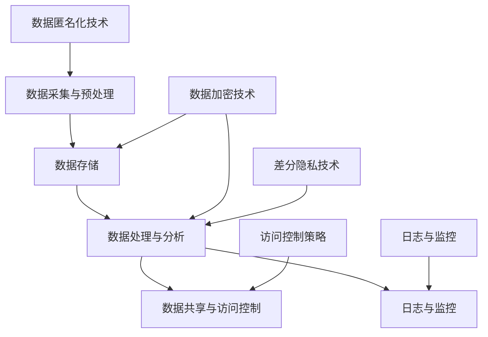

                 

### 文章标题

《知识发现引擎的数据隐私保护策略》

#### 关键词：

数据隐私保护、知识发现引擎、数据匿名化、数据加密、差分隐私、隐私保护机器学习、数据共享与访问控制。

#### 摘要：

随着大数据和人工智能技术的迅猛发展，知识发现引擎在各个领域得到了广泛应用。然而，数据隐私保护成为了一个不可忽视的重要问题。本文将详细探讨知识发现引擎的数据隐私保护策略，包括数据匿名化、数据加密、差分隐私、隐私保护机器学习等关键技术，以及数据共享与访问控制策略。通过实际案例研究，分析不同场景下的数据隐私保护实践，并探讨数据隐私保护在知识发现引擎中的未来发展趋势与挑战。本文旨在为知识发现引擎的数据隐私保护提供系统性、实践性和前瞻性的指导和参考。

## 第一部分：数据隐私保护基础

### 第1章：数据隐私保护概述

#### 1.1 数据隐私保护的重要性

在当今数字化时代，数据已经成为企业和个人最宝贵的资产之一。然而，随着数据采集、存储、处理和共享的规模不断扩大，数据隐私保护问题日益凸显。数据隐私保护是指通过各种技术和管理手段，确保数据在采集、存储、处理和共享过程中不被未经授权的访问、篡改或泄露，从而保护个人和组织的数据隐私。

数据隐私保护的重要性体现在以下几个方面：

1. **法律合规性**：在全球范围内，各国政府都制定了一系列数据隐私保护法律法规，如《通用数据保护条例》（GDPR）、《加州消费者隐私法案》（CCPA）等。企业必须遵守这些法律法规，否则将面临严重的法律后果，包括罚款、诉讼等。

2. **用户信任**：在用户对隐私问题的关注度日益增加的背景下，企业能否有效保护用户隐私，直接影响用户对企业的信任和忠诚度。良好的数据隐私保护措施可以增强用户对企业的信任，提高用户满意度。

3. **商业竞争力**：在激烈的市场竞争中，企业通过数据隐私保护措施可以确保自身数据资产的安全，避免因数据泄露导致的经济损失和声誉损害。

4. **社会责任**：作为社会的一份子，企业有责任尊重和保护用户的隐私权，履行社会责任，推动构建一个安全、可信的数据生态系统。

#### 1.2 数据隐私保护法律法规

数据隐私保护法律法规的制定和实施，旨在规范数据收集、存储、处理和共享行为，保护个人和组织的数据隐私。以下是一些主要的全球数据隐私保护法律法规：

1. **《通用数据保护条例》（GDPR）**：欧盟于2018年实施的GDPR是迄今为止全球最为严格的数据隐私保护法律法规之一。GDPR适用于在欧盟境内收集、处理或存储个人数据的所有组织，无论这些组织是否位于欧盟境内。

2. **《加州消费者隐私法案》（CCPA）**：CCPA是美国加州于2020年实施的一项数据隐私保护法规，旨在赋予加州居民对其个人数据的控制权。CCPA适用于在加州进行商业活动、收集或销售加州居民个人数据的企业。

3. **《个人信息保护法》（PIPL）**：中国于2021年实施的PIPL是对国内数据隐私保护法律体系的一次重要完善。PIPL规定了个人信息的定义、处理规则、保护措施等方面的内容，旨在加强对个人信息保护的监管。

4. **《网络安全法》**：中国的网络安全法也涉及数据隐私保护的内容，明确要求网络运营者采取技术和管理措施保护用户个人信息安全，防止个人信息泄露、毁损或被非法利用。

不同国家和地区的数据隐私保护法律法规各有特点，但总体上都强调了数据收集、处理和共享的合法性、透明性和安全性。企业必须了解并遵守这些法律法规，以确保合规经营。

#### 1.3 数据隐私保护面临的挑战

尽管数据隐私保护法律法规不断完善，但数据隐私保护仍然面临诸多挑战：

1. **数据复杂性**：随着数据来源、类型和规模的不断增加，数据隐私保护变得更加复杂。企业需要处理来自不同渠道、格式和结构的数据，确保数据隐私保护措施的全面性和有效性。

2. **技术创新**：数据隐私保护技术不断发展，黑客攻击手段也日益复杂。企业需要不断更新数据隐私保护技术，以应对新的安全威胁。

3. **法规变动**：全球范围内的数据隐私保护法律法规不断更新和演变，企业需要及时了解和应对这些变化，以确保合规经营。

4. **数据共享与隐私保护平衡**：在数据驱动的商业环境中，数据共享是创新和发展的重要驱动力。如何在数据共享和隐私保护之间找到平衡，是一个需要深入研究和探讨的问题。

5. **用户隐私意识提升**：随着用户对隐私保护的重视程度不断提高，企业需要加强用户教育，提高用户对隐私保护的意识和参与度。

总之，数据隐私保护是一个复杂而长期的任务，需要企业、政府和社会各界的共同努力。在接下来的章节中，我们将进一步探讨知识发现引擎的数据隐私保护策略，为解决这些挑战提供可行的解决方案。

## 第二部分：数据隐私保护策略与方法

### 第3章：数据匿名化技术

#### 3.1 数据匿名化的基本概念

数据匿名化是一种重要的数据隐私保护技术，旨在通过技术手段将个人身份信息从数据中剥离，从而保护数据隐私。数据匿名化的核心思想是将原始数据转换为匿名化数据，使得匿名化数据在保留数据价值的同时，无法直接识别出原始数据中的个人身份信息。

数据匿名化的主要目标是：

1. **保护个人隐私**：通过匿名化处理，使个人身份信息无法被直接识别，从而保护个人隐私。

2. **确保数据可用性**：在保证隐私保护的前提下，匿名化数据仍能保留原始数据的统计特性和分析价值。

3. **合规性**：符合各国数据隐私保护法律法规的要求，避免因数据泄露导致的法律风险。

数据匿名化的关键概念包括：

- **匿名化数据**：通过匿名化处理后的数据，其个人身份信息已被剥离，但仍能保留数据的价值和特征。

- **扰动技术**：用于对原始数据进行处理，以消除个人身份信息的手段，如随机化、加密、混淆等。

- **隐私预算**：在数据匿名化过程中，为了确保隐私保护水平，可以设定一个隐私预算，即允许的最大隐私损失程度。

#### 3.2 数据匿名化技术分类

根据匿名化技术的原理和实现方式，数据匿名化技术可以分为以下几类：

1. **k-匿名性**：k-匿名性是一种基于最小化集合大小的匿名化方法。其核心思想是，将数据集中的记录分组，使得每个分组中的记录数至少为k，并且任何一个记录的值都不会在少于k个记录中重复出现。k-匿名性能够有效地保护个人隐私，但可能牺牲部分数据分析的准确性。

   - **k-最近邻（k-NN）算法**：通过计算数据集中记录之间的距离，将相似记录分组，以实现k-匿名性。
   - **迭代k-匿名算法**：通过反复迭代优化分组方式，提高k-匿名性的有效性。

2. **l-多样性**：l-多样性是指数据集中每个分组中不同属性值的比例应至少为l%。l-多样性确保了数据在匿名化后的多样性，从而提高了数据分析的准确性。

3. **t-接近性**：t-接近性是指数据集中每个分组中的记录应在某些特定属性上保持一致。t-接近性可以确保匿名化数据在保留原始数据特征的同时，避免泄露个人身份信息。

4. **差分隐私**：差分隐私是一种基于概率论的方法，通过在查询结果中引入随机噪声，使得攻击者无法通过单个查询结果推断出原始数据中的具体值。差分隐私能够在保证隐私保护的前提下，提供较为准确的数据分析结果。

   - **拉普拉斯机制**：通过在查询结果中添加拉普拉斯噪声，实现差分隐私保护。
   - **指数机制**：通过在查询结果中添加指数噪声，实现差分隐私保护。

5. **全面混淆**：全面混淆是一种将原始数据转换为完全随机数据的方法，从而实现数据匿名化。全面混淆具有较高的隐私保护效果，但可能导致数据分析准确性下降。

#### 3.3 常见数据匿名化技术实现

在实际应用中，常见的几种数据匿名化技术实现方法如下：

1. **k-匿名化实现**：

   ```mermaid
   flowchart LR
   A[原始数据] --> B[k-NN分组]
   B --> C[去除重复记录]
   C --> D[k-匿名化数据]
   ```

   步骤：
   - 将原始数据输入k-NN算法进行分组。
   - 去除分组中的重复记录，确保每个分组的大小至少为k。
   - 输出k-匿名化数据。

2. **差分隐私实现**：

   ```mermaid
   flowchart LR
   A[原始数据] --> B[查询操作]
   B --> C[添加噪声]
   C --> D[差分隐私数据]
   ```

   步骤：
   - 对原始数据进行查询操作，获取查询结果。
   - 在查询结果中添加拉普拉斯噪声或指数噪声，实现差分隐私。
   - 输出差分隐私数据。

3. **全面混淆实现**：

   ```mermaid
   flowchart LR
   A[原始数据] --> B[混淆操作]
   B --> C[随机数据]
   ```

   步骤：
   - 对原始数据执行混淆操作，如对数值进行随机扰动。
   - 输出完全随机化的数据。

通过这些数据匿名化技术实现，企业可以在保护个人隐私的同时，充分利用数据的价值。然而，数据匿名化技术并非万能，其有效性受多种因素影响，包括数据分布、隐私预算等。因此，在实际应用中，需要根据具体场景和需求选择合适的匿名化技术，并进行充分评估和优化。

### 第4章：数据加密技术

#### 4.1 数据加密的基本原理

数据加密是一种重要的数据隐私保护手段，通过将原始数据转换为难以理解的密文，确保数据在传输和存储过程中的安全性。数据加密的基本原理包括加密算法、密钥管理和加密模式等。

1. **加密算法**：加密算法是数据加密的核心，用于将明文转换为密文。常见的加密算法包括对称加密和非对称加密。

   - **对称加密**：对称加密使用相同的密钥进行加密和解密操作。常用的对称加密算法有DES、AES等。
   - **非对称加密**：非对称加密使用一对密钥进行加密和解密操作，一对密钥包括公钥和私钥。常用的非对称加密算法有RSA、ECC等。

2. **密钥管理**：密钥管理是数据加密中至关重要的一环，涉及密钥的生成、存储、分发和销毁等过程。良好的密钥管理能够确保加密系统的安全性。

   - **密钥生成**：根据加密算法的要求，生成合适的密钥。
   - **密钥存储**：将密钥安全存储，防止密钥泄露。
   - **密钥分发**：在需要共享加密数据的场景中，将密钥安全地分发到相关人员或系统。
   - **密钥销毁**：在密钥不再使用时，及时销毁以防止被恶意利用。

3. **加密模式**：加密模式用于描述数据加密的具体方式，常见的加密模式有电子码本（ECB）、密码分组链接模式（CBC）、密码反馈模式（CFB）等。

   - **电子码本（ECB）**：ECB模式将数据分成固定大小的块，每个块独立加密。ECB模式简单易用，但可能不适合处理具有固定模式的敏感数据。
   - **密码分组链接模式（CBC）**：CBC模式将前一个块的加密结果与当前块进行异或运算，作为当前块的加密输入。CBC模式能够提供更强大的加密效果，但需要确保初始向量（IV）的安全性。
   - **密码反馈模式（CFB）**：CFB模式将前一个块的加密结果作为当前块的加密输入，并将其输出反馈到当前块。CFB模式适用于流加密，但可能对加密速度有一定影响。

#### 4.2 数据加密算法分类

根据加密算法的原理和应用场景，数据加密算法可以分为以下几类：

1. **对称加密算法**：对称加密算法使用相同的密钥进行加密和解密操作，具有计算效率高、易于实现等优点。常见的对称加密算法有DES、AES等。

   - **DES**：数据加密标准（Data Encryption Standard），是一种早期的对称加密算法，已被AES取代。
   - **AES**：高级加密标准（Advanced Encryption Standard），是一种广泛使用的对称加密算法，具有较高的安全性和计算效率。

2. **非对称加密算法**：非对称加密算法使用一对密钥进行加密和解密操作，一对密钥包括公钥和私钥。非对称加密算法具有密钥管理简单、安全性高等优点。常见的非对称加密算法有RSA、ECC等。

   - **RSA**：是一种基于大数分解问题的非对称加密算法，具有较高的安全性和适用性。
   - **ECC**：是一种基于椭圆曲线问题的非对称加密算法，具有较小的密钥长度和较高的安全性能。

3. **哈希算法**：哈希算法用于将输入数据转换为固定长度的哈希值，常用于数据完整性校验和数字签名等场景。常见的哈希算法有MD5、SHA等。

   - **MD5**：是一种广泛使用的哈希算法，但已逐渐被认为不安全。
   - **SHA**：包括SHA-1、SHA-256、SHA-3等哈希算法，具有较高的安全性能。

#### 4.3 数据加密技术在知识发现引擎中的应用

在知识发现引擎中，数据加密技术可以应用于多个环节，确保数据在采集、存储、传输和处理过程中的安全性。

1. **数据存储加密**：对存储在数据库或数据仓库中的敏感数据进行加密，防止数据泄露。常用的加密算法包括AES和RSA等。

2. **数据传输加密**：对数据在传输过程中的内容进行加密，确保数据在网络传输过程中的安全性。常用的加密模式包括CBC和CFB等。

3. **数据处理加密**：在知识发现引擎进行数据处理和分析时，对输入数据进行加密，确保处理过程中的数据安全性。

4. **加密算法实现与优化**：针对不同的应用场景，选择合适的加密算法和加密模式，并进行优化，以提高加密效率。

以下是一个数据加密算法实现的伪代码示例：

```python
# 对称加密实现（AES）
def encrypt_aes(plaintext, key):
    ciphertext = AES_encrypt(plaintext, key)
    return ciphertext

def decrypt_aes(ciphertext, key):
    plaintext = AES_decrypt(ciphertext, key)
    return plaintext

# 非对称加密实现（RSA）
def encrypt_rsa(plaintext, public_key):
    ciphertext = RSA_encrypt(plaintext, public_key)
    return ciphertext

def decrypt_rsa(ciphertext, private_key):
    plaintext = RSA_decrypt(ciphertext, private_key)
    return plaintext
```

通过数据加密技术，知识发现引擎可以更好地保护数据隐私，确保数据在各个环节的安全性。然而，数据加密技术并非万能，其有效性和安全性受多种因素影响。因此，在实际应用中，需要根据具体场景和需求，选择合适的加密算法和加密模式，并进行充分测试和优化。

### 第5章：数据共享与访问控制

#### 5.1 数据共享的概念与挑战

数据共享是指在不同组织、部门和用户之间交换和共享数据的过程，以实现资源利用的最大化和业务价值的最大化。在知识发现引擎中，数据共享尤为重要，因为知识发现过程往往依赖于来自多个源的数据。然而，数据共享也带来了一系列挑战：

1. **隐私泄露风险**：在数据共享过程中，敏感数据可能被未授权的个人或组织访问，导致隐私泄露。

2. **数据一致性**：不同源的数据格式、结构、质量可能不一致，导致数据共享和处理上的困难。

3. **访问控制**：确保只有授权的用户和系统能够访问特定数据，防止未授权访问和数据滥用。

4. **法律合规性**：数据共享可能涉及不同国家和地区的法律和法规，确保合规性是一个挑战。

5. **数据安全**：在数据共享过程中，数据可能会被截获、篡改或破坏，确保数据安全是一个重要的挑战。

#### 5.2 数据访问控制策略

数据访问控制是确保数据安全和隐私的重要手段，通过控制用户和系统对数据的访问权限，防止未授权访问和数据泄露。以下是几种常见的数据访问控制策略：

1. **基于角色的访问控制（RBAC）**：RBAC是一种基于用户角色的访问控制机制，将用户分为不同的角色，并为每个角色分配不同的访问权限。用户通过所属角色获得相应的访问权限。

   - **角色定义**：定义用户的角色，如管理员、普通用户、访客等。
   - **权限分配**：为每个角色分配相应的访问权限，如数据读取、修改、删除等。
   - **权限验证**：在用户访问数据时，系统根据用户的角色和权限验证其访问请求。

2. **基于属性的访问控制（ABAC）**：ABAC是一种基于用户属性、数据属性和环境属性的访问控制机制，更加灵活和细粒度。

   - **用户属性**：包括用户身份、职位、部门等信息。
   - **数据属性**：包括数据类型、敏感性、来源等。
   - **环境属性**：包括时间、地点、系统状态等。
   - **决策模型**：根据用户属性、数据属性和环境属性，通过决策模型确定用户对数据的访问权限。

3. **基于加密的访问控制**：基于加密的访问控制通过加密技术保护数据的访问权限，只有拥有正确密钥的用户才能访问数据。

   - **密钥管理**：对访问控制密钥进行安全管理和存储，防止密钥泄露。
   - **访问控制策略**：将访问控制策略与数据加密结合，确保数据在未授权情况下无法访问。

4. **基于身份验证的访问控制**：通过身份验证技术，确保只有合法用户才能访问数据。

   - **单点登录（SSO）**：提供统一的身份验证入口，用户只需登录一次，即可访问多个系统和数据。
   - **多因素认证（MFA）**：结合多种认证方式，如密码、短信验证码、指纹等，提高认证安全性。

#### 5.3 数据访问控制机制实现

数据访问控制机制需要综合考虑安全性、灵活性和性能等因素，以下是几种常见的数据访问控制机制实现方法：

1. **访问控制列表（ACL）**：ACL是一种基于规则的数据访问控制机制，为每个数据对象定义访问规则。

   - **规则定义**：为每个数据对象定义访问控制规则，如用户、角色和权限。
   - **规则验证**：在用户访问数据时，系统根据ACL中的规则验证其访问请求。

2. **数据标签**：通过为数据对象附加标签，实现细粒度的访问控制。

   - **标签定义**：为数据对象定义标签，如敏感性等级、来源等。
   - **标签管理**：对数据标签进行管理，包括标签的创建、更新和删除。
   - **标签验证**：在用户访问数据时，系统根据数据标签验证其访问请求。

3. **访问控制代理**：通过访问控制代理，实现分布式环境中的数据访问控制。

   - **代理部署**：部署访问控制代理，负责处理数据访问请求和权限验证。
   - **代理通信**：访问控制代理与数据存储系统之间进行通信，确保数据访问控制的一致性和安全性。

4. **访问控制中间件**：通过访问控制中间件，实现对现有系统和数据的高效访问控制。

   - **中间件集成**：将访问控制中间件集成到现有系统中，无需对原有系统进行大规模修改。
   - **中间件功能**：提供访问控制策略定义、规则管理和权限验证等功能。

以下是一个基于ACL的数据访问控制实现示例：

```python
# 定义数据对象和访问控制规则
data_objects = {
    "data1": {"read": ["admin", "editor"], "write": ["admin"]},
    "data2": {"read": ["editor", "user"], "write": ["admin"]}
}

# 用户身份验证
def authenticate_user(username, password):
    # 实现用户身份验证逻辑
    return True

# 访问控制验证
def access_control(data_object, username, action):
    if username in data_objects[data_object][action]:
        return True
    else:
        return False

# 用户请求访问数据
username = "editor"
data_object = "data1"
action = "read"

if authenticate_user(username, password):
    if access_control(data_object, username, action):
        print(f"{username} has access to {data_object} for {action}")
    else:
        print(f"{username} does not have access to {data_object} for {action}")
else:
    print("Authentication failed")
```

通过数据访问控制机制，知识发现引擎可以更好地保护数据隐私，确保只有授权用户能够访问敏感数据。然而，数据访问控制机制需要不断更新和优化，以应对新的安全威胁和合规要求。

### 第6章：差分隐私技术

#### 6.1 差分隐私的基本概念

差分隐私（Differential Privacy，DP）是一种用于保护数据隐私的理论框架，旨在确保数据发布过程中的隐私保护，同时保留数据的统计信息价值。差分隐私的核心思想是通过在数据发布时添加随机噪声，使得攻击者无法通过数据分析推断出单个数据项，从而保护个体隐私。

差分隐私的定义基于拉格朗日微分算子Δ，即对于任意两个相邻的数据集D和D'，如果对于任何输出统计量ε（例如平均值、标准差等），有：

$$ \Pr[\epsilon(D)] \approx \Pr[\epsilon(D')] $$

其中，$\Pr$表示概率。这意味着，对于给定的ε，攻击者无法通过观察ε的变化来区分D和D'。

差分隐私的主要组成部分包括：

1. **ε-差分隐私**：ε参数用于衡量隐私保护强度，ε值越大，隐私保护越强。ε通常由隐私预算β决定：

$$ \epsilon = \frac{\log(1 + \beta)}{\beta} $$

其中，β表示隐私预算，反映了隐私保护的最大容忍度。

2. **噪声机制**：噪声机制用于为数据发布时添加随机噪声，常见的噪声机制包括拉普拉斯机制和指数机制。

3. **本地化机制**：本地化机制用于在数据处理过程中引入隐私保护，确保在本地处理数据时仍能保持差分隐私。

#### 6.2 差分隐私机制的设计原理

差分隐私机制的设计原则包括：

1. **隐私保护**：确保数据发布过程中的隐私保护，防止攻击者通过数据分析推断出单个数据项。

2. **有效性**：确保差分隐私机制在保护隐私的同时，能够保留数据的统计信息价值。

3. **灵活性**：支持多种噪声机制和本地化机制，适应不同的应用场景和数据类型。

差分隐私机制的设计原理包括：

1. **拉普拉斯机制**：拉普拉斯机制通过在数据发布时添加拉普拉斯噪声实现差分隐私。拉普拉斯噪声是一个具有以下形式的概率分布：

$$ \text{Laplace}(\mu, b) = \frac{1}{2b} \exp\left(-\frac{|x - \mu|}{b}\right) $$

其中，μ是噪声均值，b是噪声尺度。拉普拉斯噪声具有以下特性：

   - **对称性**：拉普拉斯噪声在均值μ两侧具有对称性。
   - **鲁棒性**：拉普拉斯噪声对异常值具有较强的鲁棒性。

2. **指数机制**：指数机制通过在数据发布时添加指数噪声实现差分隐私。指数噪声是一个具有以下形式的概率分布：

$$ \text{Exponential}(b) = \frac{1}{b} \exp(-x/b) $$

其中，b是噪声尺度。指数噪声具有以下特性：

   - **单调性**：指数噪声在x增大时递减。
   - **平滑性**：指数噪声具有平滑性，能够减少数据发布时的波动。

#### 6.3 差分隐私技术在知识发现引擎中的应用

差分隐私技术在知识发现引擎中的应用主要包括以下几个方面：

1. **数据发布**：通过差分隐私技术对知识发现引擎中的数据发布过程进行隐私保护，防止攻击者通过数据分析推断出单个数据项。

2. **数据分析**：在数据分析过程中引入差分隐私机制，确保分析结果的隐私保护，同时保留数据的统计信息价值。

3. **本地化处理**：在数据本地处理过程中引入差分隐私机制，确保在本地处理数据时仍能保持差分隐私。

以下是一个差分隐私技术的简单实现示例：

```python
import numpy as np
import matplotlib.pyplot as plt

def laplace Mechanism(data, epsilon):
    noise = np.random.laplace(mu=np.mean(data), scale=epsilon/np.std(data))
    return data + noise

def exponential Mechanism(data, epsilon):
    noise = np.random.exponential(scale=epsilon/np.std(data))
    return data + noise

data = np.array([1, 2, 3, 4, 5])
epsilon = 1

noisy_data_laplace = laplace Mechanism(data, epsilon)
noisy_data_exponential = exponential Mechanism(data, epsilon)

plt.hist(noisy_data_laplace, bins=10, alpha=0.5, label='Laplace')
plt.hist(noisy_data_exponential, bins=10, alpha=0.5, label='Exponential')
plt.xlabel('Value')
plt.ylabel('Frequency')
plt.legend()
plt.show()
```

通过差分隐私技术，知识发现引擎可以在保护数据隐私的同时，实现有效的数据分析，为企业和个人提供有价值的信息。然而，差分隐私技术也存在一定的局限性，需要根据具体应用场景和需求进行优化和调整。

### 第7章：隐私保护机器学习算法

#### 7.1 隐私保护机器学习的基本概念

隐私保护机器学习（Privacy-Preserving Machine Learning，PPML）是一种旨在保护数据隐私的机器学习技术。其主要目标是确保在数据分析和模型训练过程中，个人隐私不会被泄露。隐私保护机器学习不仅关注模型性能，还强调数据隐私保护，以实现隐私与准确性的平衡。

隐私保护机器学习的基本概念包括：

1. **隐私泄露**：隐私泄露是指个人数据在处理过程中被未授权访问、篡改或泄露的风险。隐私保护机器学习的核心任务是降低隐私泄露的风险。

2. **隐私预算**：隐私预算是指为了确保隐私保护水平而设定的参数。在隐私保护机器学习中，隐私预算通常用于控制噪声的强度，以平衡模型准确性和数据隐私。

3. **隐私成本**：隐私成本是指在保护数据隐私的过程中可能付出的额外计算资源、时间或存储空间等成本。隐私保护机器学习需要考虑隐私成本，以实现高效和可扩展的隐私保护方案。

#### 7.2 隐私保护机器学习算法分类

根据隐私保护机制的不同，隐私保护机器学习算法可以分为以下几类：

1. **基于混淆的方法**：混淆方法通过在训练数据中引入噪声，降低模型对单个数据点的依赖性，从而保护数据隐私。

   - **拉普拉斯噪声**：通过在数据点中添加拉普拉斯噪声，实现隐私保护。
   - **高斯噪声**：通过在数据点中添加高斯噪声，实现隐私保护。

2. **基于安全聚合的方法**：安全聚合方法通过将训练数据分布聚合到安全聚合器中，进行模型训练，从而保护数据隐私。

   - **安全多方计算（MPC）**：通过安全多方计算协议，将训练数据分布发送给多个参与者，进行模型训练。
   - **联邦学习**：通过联邦学习框架，将模型训练任务分布到多个参与者，进行模型训练。

3. **基于差分隐私的方法**：差分隐私方法通过在模型训练过程中引入随机噪声，确保模型输出的差分隐私性。

   - **拉普拉斯机制**：通过在模型训练过程中添加拉普拉斯噪声，实现差分隐私。
   - **指数机制**：通过在模型训练过程中添加指数噪声，实现差分隐私。

4. **基于加密的方法**：加密方法通过加密训练数据，确保在模型训练过程中无法访问原始数据，从而保护数据隐私。

   - **同态加密**：通过同态加密技术，对训练数据进行加密，确保在加密状态下仍能进行模型训练。
   - **安全多方计算与加密结合**：将安全多方计算与加密技术结合，实现数据隐私保护。

#### 7.3 隐私保护机器学习算法实现与优化

隐私保护机器学习算法的实现与优化包括以下几个方面：

1. **算法选择**：根据具体应用场景和数据类型，选择合适的隐私保护机器学习算法。例如，对于需要高准确性的应用，可以选择基于差分隐私的方法；对于需要高效训练的应用，可以选择基于安全多方计算的方法。

2. **隐私预算管理**：在模型训练过程中，根据隐私预算参数调整噪声的强度，以平衡模型准确性和数据隐私。隐私预算管理是隐私保护机器学习算法实现的关键步骤。

3. **优化算法性能**：通过优化算法参数和算法结构，提高模型训练效率和准确性。例如，对于基于差分隐私的方法，可以优化噪声添加策略和优化模型结构，以提高模型性能。

以下是一个基于差分隐私的线性回归算法实现的示例：

```python
import numpy as np
import tensorflow as tf

def linear_regression(input_data, true_weights, epsilon):
    noise = tf.random.normal(shape=input_data.shape, mean=0.0, stddev=epsilon)
    predictions = input_data * true_weights + noise
    return predictions

def privacy_preserving_linear_regression(input_data, true_weights, epsilon):
    noise = tf.random.laplace(shape=input_data.shape, loc=0.0, scale=epsilon / np.sqrt(input_data.shape[0]))
    predictions = input_data * true_weights + noise
    return predictions

input_data = np.random.normal(size=(100, 10))
true_weights = np.random.normal(size=(10, 1))
epsilon = 1.0

predictions = linear_regression(input_data, true_weights, epsilon)
privacy_preserving_predictions = privacy_preserving_linear_regression(input_data, true_weights, epsilon)

print("Original predictions:", predictions)
print("Privacy-preserving predictions:", privacy_preserving_predictions)
```

通过隐私保护机器学习算法，知识发现引擎可以在保护数据隐私的同时，实现有效的数据分析和模型训练。然而，隐私保护机器学习算法的实现与优化需要综合考虑隐私保护、模型性能和计算效率等因素。未来的研究将继续探索更高效、更灵活的隐私保护机器学习算法，以应对日益复杂的数据隐私保护需求。

### 第8章：知识发现引擎的数据隐私保护架构

#### 8.1 数据隐私保护架构设计原则

知识发现引擎的数据隐私保护架构设计原则包括以下几个方面：

1. **安全性优先**：在架构设计中，数据隐私保护是首要考虑的因素，确保数据在整个生命周期中不被未经授权的访问、篡改或泄露。

2. **灵活性和可扩展性**：架构应具备灵活性和可扩展性，能够适应不同规模和类型的数据处理需求，支持多种数据隐私保护技术的集成和应用。

3. **可恢复性**：在数据隐私保护架构中，应设计数据恢复机制，确保在发生数据泄露或损坏时，能够快速恢复数据，减少对业务的影响。

4. **合规性**：架构设计应遵循相关数据隐私保护法律法规，确保数据隐私保护措施符合各国和地区的法律和合规要求。

5. **高效性和可维护性**：架构设计应兼顾数据隐私保护的高效性和可维护性，确保在保护数据隐私的同时，不影响知识发现引擎的性能和可维护性。

#### 8.2 数据隐私保护架构实现

知识发现引擎的数据隐私保护架构实现主要包括以下几个关键组件：

1. **数据采集与预处理模块**：负责收集和预处理来自不同源的数据，包括数据清洗、去重、格式转换等操作。在数据采集和预处理过程中，应用数据匿名化技术，如k-匿名性、l-多样性等，确保数据隐私保护。

2. **数据存储模块**：负责存储和处理大规模数据，包括关系数据库、NoSQL数据库、分布式文件系统等。在数据存储模块中，应用数据加密技术，如对称加密、非对称加密等，确保数据在存储过程中的安全性。

3. **数据处理与分析模块**：负责对数据进行处理和分析，包括数据清洗、转换、聚合、挖掘等操作。在数据处理与分析模块中，应用差分隐私技术，如拉普拉斯机制、指数机制等，确保数据处理过程中的数据隐私保护。

4. **数据共享与访问控制模块**：负责实现数据共享与访问控制功能，包括数据访问控制策略、权限管理、数据标签等。在数据共享与访问控制模块中，应用基于角色的访问控制（RBAC）、基于属性的访问控制（ABAC）等技术，确保只有授权用户和系统能够访问数据。

5. **日志与监控模块**：负责记录和监控数据隐私保护的相关操作，包括数据采集、处理、存储、共享等环节。日志与监控模块有助于及时发现和处理数据隐私保护相关问题，确保数据隐私保护措施的有效性。

以下是一个数据隐私保护架构的Mermaid流程图示例：



通过上述组件的集成，知识发现引擎可以实现全面的数据隐私保护，确保数据在各个环节的安全性。然而，数据隐私保护架构需要不断更新和优化，以应对新的安全威胁和合规要求。

#### 8.3 数据隐私保护架构评估与优化

数据隐私保护架构的评估与优化是确保其有效性和可持续性的关键步骤。以下是一些关键指标和方法，用于评估和优化数据隐私保护架构：

1. **安全性评估**：评估数据隐私保护架构的安全性，包括数据泄露、篡改、未授权访问等风险。通过定期进行安全审计、渗透测试和漏洞扫描，发现和修复潜在的安全问题。

2. **隐私保护效果评估**：评估数据隐私保护措施对隐私保护的实际效果，包括隐私预算的消耗、隐私损失程度等。通过差分隐私指标（如ε值、β值）和隐私损失函数，量化隐私保护效果。

3. **性能评估**：评估数据隐私保护架构对知识发现引擎性能的影响，包括数据处理速度、存储效率等。通过基准测试和实际应用场景测试，比较不同数据隐私保护措施的效率。

4. **成本效益分析**：评估数据隐私保护架构的成本效益，包括计算资源、存储资源、运维成本等。通过成本效益分析，确定最优的数据隐私保护方案。

5. **用户满意度调查**：收集用户对数据隐私保护措施的满意度调查，了解用户对隐私保护的感知和需求。通过用户反馈，优化数据隐私保护策略和措施。

优化方法包括：

- **算法优化**：针对不同的数据隐私保护算法，进行参数优化和算法改进，提高隐私保护效果和计算效率。
- **架构改进**：根据评估结果，对数据隐私保护架构进行调整和改进，优化架构设计，提高系统的安全性和可扩展性。
- **技术更新**：定期引入新的数据隐私保护技术和工具，提高数据隐私保护水平。

通过评估和优化，数据隐私保护架构可以更好地应对新的安全威胁和合规要求，确保知识发现引擎的数据隐私保护效果和性能。

### 第9章：知识发现引擎的数据隐私保护案例研究

#### 9.1 案例研究1：社交网络中的隐私保护

社交网络平台如Facebook、Twitter等，积累了大量用户数据，包括个人资料、照片、动态等。这些数据不仅涉及用户的个人隐私，还可能被不法分子利用进行诈骗、网络攻击等。因此，社交网络平台在数据隐私保护方面面临巨大挑战。以下是一个社交网络平台的数据隐私保护案例：

**问题**：如何确保用户在社交网络平台上的个人数据不被未经授权的访问和泄露？

**解决方案**：

1. **数据匿名化**：在数据分析过程中，对用户数据进行匿名化处理，剥离个人身份信息，如用户ID、电话号码等。

2. **数据加密**：对存储在数据库中的敏感数据，如用户密码、支付信息等，采用强加密算法进行加密。

3. **访问控制**：实施基于角色的访问控制策略，确保只有授权用户和系统能够访问敏感数据。同时，使用多因素认证（MFA）提高认证安全性。

4. **差分隐私**：在数据分析过程中，引入差分隐私机制，通过添加随机噪声，确保分析结果不会泄露用户隐私。

5. **日志监控**：记录和监控用户数据的访问和操作日志，及时发现和处理异常行为。

**效果**：通过上述数据隐私保护措施，社交网络平台有效降低了用户数据泄露的风险，提升了用户对平台的信任度。

#### 9.2 案例研究2：医疗数据隐私保护

医疗数据涉及患者的敏感信息，如病历记录、基因信息、诊断结果等。医疗数据隐私保护对患者的隐私权和个人健康具有重要意义。以下是一个医疗数据隐私保护案例：

**问题**：如何确保医疗数据在存储、传输和处理过程中不被未经授权的访问和泄露？

**解决方案**：

1. **数据加密**：对存储在数据库中的医疗数据，如患者病历记录、诊断报告等，采用高级加密算法进行加密，确保数据在存储过程中的安全性。

2. **数据匿名化**：对医疗数据中的个人身份信息进行匿名化处理，如将患者姓名、电话号码等替换为匿名标识符。

3. **访问控制**：实施严格的访问控制策略，确保只有授权医疗工作人员能够访问患者数据。同时，采用基于角色的访问控制（RBAC）和基于属性的访问控制（ABAC）相结合的方式，提高访问控制的灵活性。

4. **差分隐私**：在医疗数据分析过程中，引入差分隐私机制，通过添加随机噪声，确保分析结果不会泄露患者隐私。

5. **数据共享协议**：制定详细的数据共享协议，明确数据共享的范围、权限和责任，确保数据共享过程中的隐私保护。

**效果**：通过上述数据隐私保护措施，医疗数据隐私保护水平显著提高，有效降低了患者数据泄露的风险，保障了患者隐私权。

#### 9.3 案例研究3：金融数据隐私保护

金融数据涉及用户的财务信息、交易记录等，是金融行业的重要资产。金融数据隐私保护对用户的金融安全具有重要意义。以下是一个金融数据隐私保护案例：

**问题**：如何确保金融数据在存储、传输和处理过程中不被未经授权的访问和泄露？

**解决方案**：

1. **数据加密**：对存储在数据库中的金融数据，如用户交易记录、账户余额等，采用高级加密算法进行加密，确保数据在存储过程中的安全性。

2. **数据匿名化**：对金融数据中的个人身份信息进行匿名化处理，如将用户姓名、身份证号码等替换为匿名标识符。

3. **访问控制**：实施严格的访问控制策略，确保只有授权金融工作人员能够访问敏感数据。同时，采用基于角色的访问控制（RBAC）和基于属性的访问控制（ABAC）相结合的方式，提高访问控制的灵活性。

4. **差分隐私**：在金融数据分析过程中，引入差分隐私机制，通过添加随机噪声，确保分析结果不会泄露用户隐私。

5. **安全审计**：定期进行安全审计，监控和记录金融数据的访问和操作情况，确保数据安全。

**效果**：通过上述数据隐私保护措施，金融数据隐私保护水平显著提高，有效降低了用户数据泄露的风险，保障了用户金融安全。

通过以上案例研究，可以看出，知识发现引擎在不同领域的应用中，数据隐私保护措施的实施不仅能够有效降低数据泄露的风险，还能提升用户对平台的信任度，为企业和个人创造更大的价值。

### 第10章：数据隐私保护在知识发现引擎中的未来发展趋势

#### 10.1 数据隐私保护技术的发展趋势

随着大数据和人工智能技术的迅猛发展，数据隐私保护技术也在不断演进，呈现出以下发展趋势：

1. **联邦学习（Federated Learning）**：联邦学习是一种分布式机器学习技术，允许模型在不同设备或服务器上训练，而无需集中数据。通过联邦学习，知识发现引擎可以在保护数据隐私的同时，实现协同学习和模型更新。

2. **区块链技术**：区块链技术具有去中心化、安全性和不可篡改等特点，可用于构建隐私保护的数据共享和交易系统。通过区块链，知识发现引擎可以实现数据的安全共享和透明性。

3. **隐私增强技术（PETs）**：隐私增强技术是一类旨在在不牺牲数据价值的前提下，增强数据隐私保护的技术。例如，差分隐私、基于属性的加密（ABE）、安全多方计算（MPC）等，将在知识发现引擎中得到广泛应用。

4. **联邦隐私计算（Federated Privacy Computing）**：联邦隐私计算结合了联邦学习和隐私增强技术，旨在实现数据隐私保护下的协同计算。未来，联邦隐私计算将成为知识发现引擎中的重要技术方向。

5. **自我保护数据技术**：自我保护数据技术（Self-Protecting Data Technology）是一种新兴的数据隐私保护技术，旨在使数据自身具备自我保护能力。通过自我保护数据技术，知识发现引擎可以在数据处理过程中自动触发隐私保护机制。

#### 10.2 知识发现引擎在数据隐私保护方面的未来应用

在数据隐私保护技术的发展趋势推动下，知识发现引擎在未来的应用将更加广泛和深入，主要体现在以下几个方面：

1. **医疗领域**：随着医疗数据隐私保护要求的提高，知识发现引擎将在医疗领域发挥重要作用。通过联邦学习和隐私增强技术，可以实现隐私保护下的医疗数据分析和共享，为精准医疗和健康预测提供支持。

2. **金融领域**：金融领域的数据隐私保护需求日益严峻，知识发现引擎将利用区块链技术和隐私增强技术，实现金融数据的安全共享和分析，为反欺诈、信用评估等提供有力支持。

3. **社交网络领域**：社交网络平台将在数据隐私保护方面采用更先进的隐私保护技术，如联邦学习、差分隐私等，以提升用户隐私保护和数据安全。

4. **智能交通领域**：智能交通系统需要处理大量实时数据，包括交通流量、车辆位置等。通过隐私增强技术和联邦学习，可以实现数据隐私保护下的智能交通分析和优化。

5. **工业互联网领域**：工业互联网的快速发展带来了大量的工业数据，通过联邦学习和隐私增强技术，可以实现工业数据的隐私保护分析，为智能制造、设备预测性维护等提供支持。

#### 10.3 数据隐私保护在知识发现引擎中的挑战与对策

尽管数据隐私保护技术在知识发现引擎中的应用前景广阔，但仍然面临以下挑战：

1. **计算资源消耗**：隐私保护算法（如联邦学习、差分隐私）通常需要较高的计算资源，这对知识发现引擎的性能和效率提出了挑战。对策：优化算法设计和实现，提高计算效率，采用分布式计算和并行计算技术。

2. **隐私保护与数据价值的平衡**：在数据隐私保护过程中，如何平衡隐私保护与数据价值，确保数据在匿名化或加密后仍能保留足够的分析价值，是一个重要问题。对策：采用精细化隐私预算管理，优化隐私保护算法，提高数据利用效率。

3. **隐私攻击与防御**：随着隐私保护技术的发展，攻击者也将不断寻找新的攻击手段，如对抗性攻击、数据窃取等。对策：持续研究隐私攻击手段，开发新的防御技术，提高系统的抗攻击能力。

4. **法规与标准**：各国和地区的数据隐私保护法律法规不断更新，知识发现引擎需要不断调整和适应。对策：建立完善的数据隐私保护法律法规体系，加强与国际标准的对接和合作。

5. **用户隐私意识与参与**：用户对隐私保护的意识不断提高，但可能缺乏对隐私保护的深入了解。对策：加强用户隐私教育，提高用户对隐私保护的参与度，共同构建安全、可信的数据生态系统。

通过应对这些挑战，知识发现引擎将在数据隐私保护方面实现更广泛的应用，为企业和个人创造更大的价值。

### 附录A：数据隐私保护相关法律法规

#### 附录A：数据隐私保护相关法律法规

**《通用数据保护条例》（GDPR）**

- **发布日期**：2018年5月25日
- **适用范围**：适用于在欧盟境内收集、处理或存储个人数据的所有组织，无论这些组织是否位于欧盟境内。
- **主要内容**：规定了个人数据的定义、处理规则、隐私保护措施、用户权利等，旨在加强对个人数据的保护。

**《加州消费者隐私法案》（CCPA）**

- **发布日期**：2020年1月1日
- **适用范围**：适用于在加州进行商业活动、收集或销售加州居民个人数据的企业。
- **主要内容**：赋予加州居民对其个人数据的控制权，包括数据访问、删除、拒绝销售等权利，以及对企业的数据保护要求。

**《个人信息保护法》（PIPL）**

- **发布日期**：2021年11月1日
- **适用范围**：适用于在中国境内收集、处理或存储个人数据的所有组织。
- **主要内容**：规定了个人信息的定义、处理规则、隐私保护措施、用户权利等，旨在加强对个人信息的保护。

**《网络安全法》**

- **发布日期**：2017年6月1日
- **适用范围**：适用于在中国境内运营的网站、应用等网络安全产品和服务的提供者。
- **主要内容**：规定了网络安全的基本原则、网络安全监测、网络安全审查、用户个人信息保护等内容。

**《数据安全法》**

- **发布日期**：2021年6月10日
- **适用范围**：适用于在中国境内运营的数据处理活动。
- **主要内容**：规定了数据安全的定义、数据安全保护措施、数据安全监测、数据安全审查等内容。

通过附录A，读者可以了解数据隐私保护相关法律法规的基本情况，以便在实际工作中遵守相关法规，确保数据隐私保护措施的合规性。

### 附录B：数据隐私保护工具与资源

#### 附录B：数据隐私保护工具与资源

**数据匿名化工具**

1. **K-Anonymity Tool**：一个开源的k-匿名性分析工具，可用于评估数据的k-匿名性。
2. **DataAnon**：一个基于k-匿名性和l-多样性的数据匿名化工具，支持多种匿名化技术。

**数据加密工具**

1. **GnuPG**：一个开源的加密工具，支持对称加密和非对称加密。
2. **Crypto++**：一个开源的加密库，提供多种加密算法和加密模式。

**差分隐私工具**

1. **Privacy-Driven Machine Learning**：一个开源的差分隐私库，支持拉普拉斯机制和指数机制。
2. **DP-Lib**：一个开源的差分隐私库，提供差分隐私算法的实现和评估。

**隐私保护机器学习工具**

1. **PySyft**：一个开源的联邦学习框架，支持隐私保护机器学习算法。
2. **Fediverse**：一个开源的联邦学习库，提供联邦学习算法的实现和评估。

**数据访问控制工具**

1. **AccessControl**：一个基于角色的访问控制工具，支持RBAC和ABAC。
2. **KeyCzar**：一个开源的密钥管理工具，提供密钥生成、存储和分发功能。

通过附录B，读者可以找到各种数据隐私保护工具和资源的详细介绍，以便在实际工作中选择合适的工具和资源。

### 附录C：参考文献

1. **《通用数据保护条例》（GDPR）**，欧洲议会和欧洲理事会，2018。
2. **《加州消费者隐私法案》（CCPA）**，加州立法机构，2020。
3. **《个人信息保护法》（PIPL）**，中华人民共和国全国人民代表大会常务委员会，2021。
4. **《网络安全法》**，中华人民共和国全国人民代表大会常务委员会，2017。
5. **《数据安全法》**，中华人民共和国全国人民代表大会常务委员会，2021。
6. **Dwork, C. (2006). Differential Privacy: A Survey of Results. International Conference on Theory and Applications of Models of Computation**。
7. **Abowd, G. D., & Dwork, C. (2009). Calibrating Noise to Sensitivity in Private Data Analysis. In Proceedings of the 2009 ACM workshop on Privacy in electronic society**。
8. **McSherry, F., & Talwar, K. (2007). Privacy-preserving data analysis. In Proceedings of the 2007 IEEE symposium on security and privacy (SP '07)**。
9. **Rustem, B., & Wang, K. (2011). Privacy-preserving data analysis: Models and techniques. ACM Computing Surveys (CSUR)**。
10. **Li, N., Li, T., & Venkatasubramanian, S. (2007). t-closeness: Privacy beyond k-anonymity and l-diversity. In Proceedings of the 23rd International Conference on Data Engineering**。

通过附录C，读者可以进一步了解数据隐私保护领域的相关文献，以便深入学习和研究。这些文献为本文提供了重要的理论依据和实践参考。

