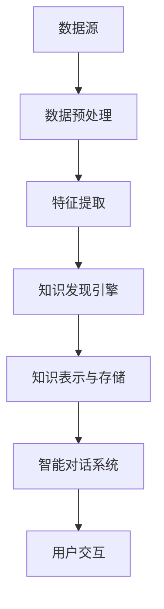
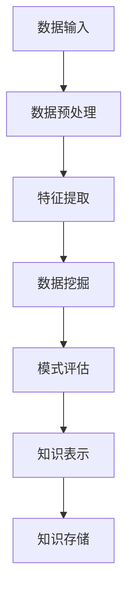
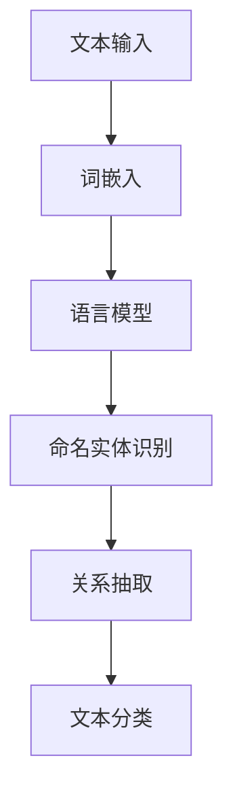
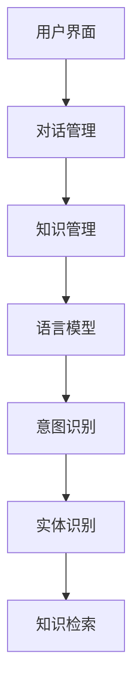
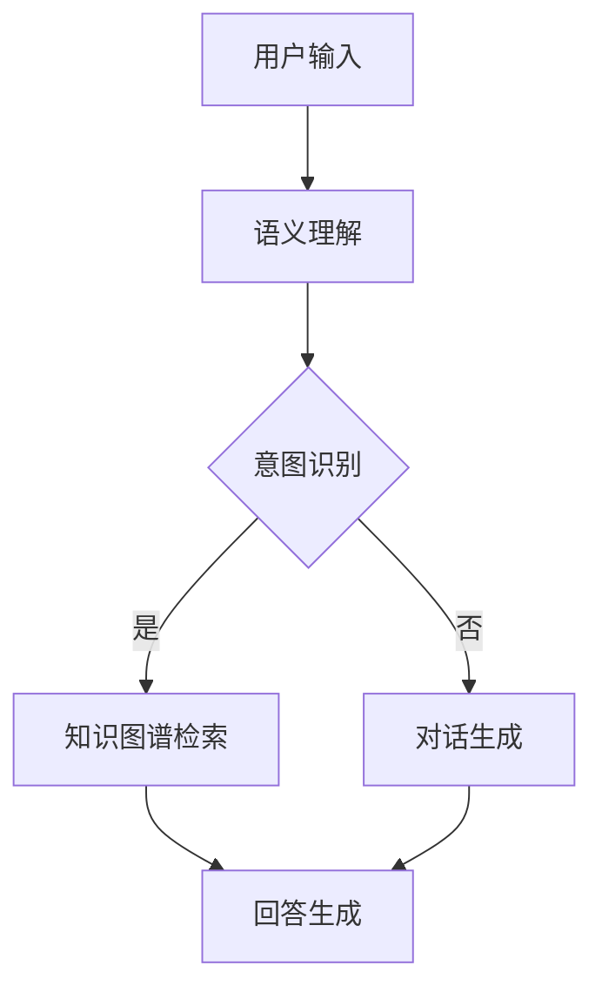
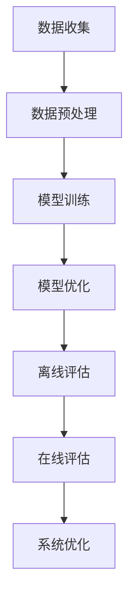
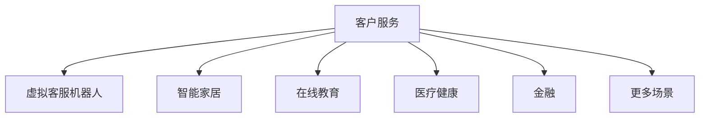

                 

### 第1章：引言

#### 1.1 知识发现与智能对话系统的背景

知识发现（Knowledge Discovery in Databases，简称KDD）是指从大量数据中提取出有用信息和知识的过程。这一概念由Fayyad等人于1996年首次提出。知识发现的过程主要包括数据预处理、数据挖掘、模式评估和知识表示。知识发现技术在金融、医疗、商业智能等领域有着广泛的应用，是大数据时代不可或缺的一环。

智能对话系统（Intelligent Conversational Systems）则是指能够与人类用户进行自然语言交互的计算机系统。智能对话系统的发展可以追溯到20世纪50年代，经历了基于规则、基于模板和基于深度学习的多个阶段。近年来，随着自然语言处理（NLP）和机器学习技术的快速发展，智能对话系统在虚拟客服、智能家居、在线教育等领域得到了广泛应用。

知识发现引擎（Knowledge Discovery Engine）是知识发现技术的核心，负责从大规模数据中提取出有价值的信息和知识。而智能对话系统则是知识发现引擎的应用场景之一，通过自然语言交互将知识以用户友好的方式呈现出来。

本书旨在探讨知识发现引擎与智能对话系统的结合，具体目标如下：

1. **深入理解知识发现引擎的工作原理和架构**：介绍知识发现的基本概念、过程、技术和应用场景，为读者提供系统性的知识体系。
2. **探索智能对话系统的设计原则与实现方法**：分析对话系统的基本组件、设计原则和架构，介绍现代对话系统的实现技术。
3. **探讨知识图谱与语义理解在智能对话系统中的应用**：讨论知识图谱的概念、构建方法以及语义理解技术，展示其在智能对话系统中的重要作用。
4. **实践智能对话系统的实现与评估**：通过实际项目案例，介绍智能对话系统的开发流程、评估方法和实践技巧。
5. **展望知识发现引擎与智能对话系统的未来发展趋势与挑战**：分析未来技术的发展趋势，探讨面临的挑战和解决方案。

#### 1.2 读者对象

本书适合以下读者群体：

- **开发者**：具备基础的编程知识，对机器学习和自然语言处理有一定的了解，希望深入掌握知识发现引擎和智能对话系统的开发者。
- **数据科学家**：从事数据挖掘、数据分析相关工作，希望了解如何利用知识发现技术提升数据应用价值的数据科学家。
- **AI研究员**：对人工智能和自然语言处理领域有浓厚兴趣，希望了解知识发现引擎与智能对话系统结合的AI研究员。

#### 1.3 先决条件

阅读本书需要具备以下先决条件：

- **基础的编程知识**：了解基本的编程语言和开发环境。
- **对机器学习和自然语言处理有一定的了解**：掌握常见的机器学习算法和NLP技术，如监督学习、无监督学习、词嵌入、语言模型等。

### 总结

知识发现引擎与智能对话系统的结合为大数据时代的信息获取和知识传递带来了新的可能性。本书将从基础知识出发，逐步深入探讨相关技术，帮助读者建立全面的知识体系，并掌握智能对话系统的开发实践。希望通过本书的学习，读者能够为未来的智能对话系统研发贡献自己的力量。

### Mermaid 流程图



#### 1.4 总结

在本章中，我们介绍了知识发现引擎与智能对话系统的背景，并明确了本书的目标和结构。知识发现引擎负责从大量数据中提取有用信息，而智能对话系统则通过自然语言交互将这些知识呈现给用户。本书将逐步深入探讨这些技术，帮助读者掌握相关知识，为后续章节的学习奠定基础。

### 伪代码

```python
def knowledge_discovery_engine(data_source):
    # 数据预处理
    cleaned_data = preprocess_data(data_source)
    
    # 特征提取
    features = extract_features(cleaned_data)
    
    # 知识发现
    knowledge = discover_knowledge(features)
    
    # 知识表示与存储
    represented_knowledge = represent_knowledge(knowledge)
    store_knowledge(represented_knowledge)
    
    # 智能对话系统
    conversational_system = build_conversational_system()
    conversational_system.interact_with_user()
```

### 数学公式

$$
\text{知识发现引擎} = f(\text{数据源}, \text{预处理}, \text{特征提取}, \text{知识表示与存储}, \text{智能对话系统})
$$

#### 1.5 概括

本章为读者介绍了知识发现引擎与智能对话系统的背景和重要性，并明确了本书的目标和结构。通过知识发现引擎，我们可以从大量数据中提取有用信息，而智能对话系统则将这些知识以自然语言的形式呈现给用户。接下来，我们将深入探讨这些技术的核心概念、原理和实现方法。

### 文章关键词

知识发现、智能对话系统、知识图谱、自然语言处理、机器学习、深度学习

### 文章摘要

本文旨在探讨知识发现引擎与智能对话系统的结合，深入解析知识发现的基本概念、过程和类型，以及智能对话系统的设计原则和实现方法。通过分析知识图谱与语义理解技术，展示其在智能对话系统中的应用价值。同时，本文将通过实际案例和实践，介绍智能对话系统的开发与评估方法，并展望其未来的发展趋势与挑战。希望通过本文，读者能够全面了解并掌握相关知识，为智能对话系统的研发和应用提供有力支持。

### 文章标题

《知识发现引擎的智能对话系统》

### 第2章：知识发现引擎概述

#### 2.1 知识发现的概念与类型

知识发现（Knowledge Discovery in Databases，简称KDD）是指从大量数据中提取出有用信息和知识的过程。它是一种跨学科的研究领域，涉及数据库、数据挖掘、机器学习、统计学等多个领域。知识发现的过程通常包括以下几个步骤：

1. **数据清洗**：将原始数据进行清洗，去除噪声和错误，保证数据的准确性和一致性。
2. **数据集成**：将来自不同数据源的数据进行整合，形成一个统一的数据视图。
3. **数据变换**：对数据进行转换，如规范化、编码等，以满足数据挖掘的需求。
4. **数据挖掘**：应用各种算法和技术，从数据中发现潜在的模式、关联和规律。
5. **模式评估**：评估挖掘出的模式是否具有实际意义和业务价值。
6. **知识表示**：将挖掘出的模式以用户易于理解的方式表示出来，如图表、报告等。

根据处理数据的不同形式，知识发现可以分为以下几种类型：

1. **结构化数据**：结构化数据是指以表格形式存储的数据，如关系数据库中的数据。结构化数据的处理通常比较简单，可以通过SQL等查询语言进行高效的查询和分析。
2. **半结构化数据**：半结构化数据是指具有部分结构的数据，如XML、JSON等。这类数据可以通过模式识别和解析技术进行处理。
3. **非结构化数据**：非结构化数据是指没有明确结构的数据，如文本、图像、音频、视频等。非结构化数据的处理通常需要复杂的算法和模型，如自然语言处理、图像识别、语音识别等。

知识发现的重要性在于它能够帮助企业和组织从海量数据中挖掘出有价值的信息和知识，从而支持决策制定、风险控制、市场预测等业务活动。例如，在金融领域，知识发现可以用于客户行为分析、信用评估、欺诈检测；在医疗领域，知识发现可以用于疾病预测、药物研发、患者护理；在商业领域，知识发现可以用于市场分析、产品推荐、客户关系管理。

#### 2.2 知识发现的过程

知识发现的过程可以分为以下几个阶段：

1. **数据理解**：这一阶段主要是对数据源进行初步的了解，包括数据类型、数据分布、数据质量等。通过对数据的理解，可以确定后续数据处理的策略和方向。
2. **数据预处理**：数据预处理是知识发现过程中的关键步骤，主要包括数据清洗、转换和集成。数据清洗是指去除数据中的噪声和错误，如缺失值、异常值等；数据转换是指将数据转换为适合数据挖掘的形式，如规范化、编码等；数据集成是指将来自不同数据源的数据进行整合，形成一个统一的数据视图。
3. **数据挖掘**：数据挖掘是指应用各种算法和技术，从数据中发现潜在的模式、关联和规律。常见的挖掘方法包括分类、聚类、关联规则挖掘、异常检测等。
4. **模式评估**：模式评估是指对挖掘出的模式进行评估，确定其是否具有实际意义和业务价值。评估方法包括统计方法、业务逻辑等。
5. **知识表示**：知识表示是指将挖掘出的模式以用户易于理解的方式表示出来，如图表、报告等。知识表示的目的是帮助用户更好地理解和利用挖掘出的知识。

#### 2.3 知识表示与存储

知识表示与存储是知识发现过程中的重要环节，它决定了挖掘出的知识是否能够被有效地利用。知识表示可以分为以下几种类型：

1. **符号表示**：符号表示是指使用符号或符号组合来表示知识和信息。符号表示的优点是直观、易于理解，但缺点是表达能力有限，难以处理复杂的关系和概念。
2. **语义网络**：语义网络是指使用网络结构来表示知识和信息。在语义网络中，节点表示实体或概念，边表示实体或概念之间的关系。语义网络的优点是能够表示复杂的关系和概念，但缺点是构建和维护成本较高。

知识库是知识表示与存储的核心，它是一个结构化的知识存储系统，用于存储和管理各种类型的知识和信息。知识库可以基于关系数据库、图数据库或其他数据存储技术构建。知识库的构建通常包括以下几个步骤：

1. **本体论构建**：本体论是关于知识表示的理论体系，用于定义实体、属性、关系等概念。本体论构建是知识库建设的基础，它决定了知识库的结构和表达能力。
2. **数据抽取**：数据抽取是指从外部数据源（如数据库、文本、图像等）中抽取知识和信息，并将其存储到知识库中。
3. **数据融合**：数据融合是指将来自多个数据源的知识和信息进行整合，消除数据冗余，提高知识的完整性。
4. **知识推理**：知识推理是指利用知识库中的知识和信息，进行推理和计算，以发现新的知识和关系。

#### 2.4 知识发现引擎的工作原理

知识发现引擎是一种用于自动化知识发现过程的软件系统，它通常包括以下几个核心组件：

1. **数据预处理模块**：负责对原始数据进行分析、清洗、转换和集成，为后续的数据挖掘提供高质量的数据。
2. **特征提取模块**：负责从原始数据中提取出有用的特征，用于数据挖掘和模式识别。
3. **数据挖掘模块**：负责应用各种数据挖掘算法，从数据中发现潜在的模式、关联和规律。
4. **模式评估模块**：负责评估挖掘出的模式是否具有实际意义和业务价值。
5. **知识表示模块**：负责将挖掘出的模式以用户易于理解的方式表示出来，如图表、报告等。

知识发现引擎的工作原理可以概括为以下步骤：

1. **数据输入**：知识发现引擎从数据源中获取原始数据。
2. **数据预处理**：对原始数据进行分析、清洗、转换和集成，生成高质量的数据集。
3. **特征提取**：从数据集中提取出有用的特征，用于数据挖掘和模式识别。
4. **数据挖掘**：应用各种数据挖掘算法，从数据中挖掘出潜在的模式、关联和规律。
5. **模式评估**：对挖掘出的模式进行评估，确定其是否具有实际意义和业务价值。
6. **知识表示**：将挖掘出的模式以用户易于理解的方式表示出来，如图表、报告等。
7. **知识存储**：将表示后的知识存储到知识库中，以供后续查询和使用。

#### 2.5 知识发现引擎的应用领域

知识发现引擎在各个领域都有广泛的应用，下面列举几个典型的应用领域：

1. **金融领域**：知识发现引擎可以用于客户行为分析、信用评估、欺诈检测等。例如，银行可以通过知识发现引擎分析客户的消费习惯、信用记录等数据，识别潜在的欺诈行为，降低风险。
2. **医疗领域**：知识发现引擎可以用于疾病预测、药物研发、患者护理等。例如，医院可以通过知识发现引擎分析患者的病史、检查结果等数据，预测患者可能患有的疾病，从而制定更有效的治疗方案。
3. **商业领域**：知识发现引擎可以用于市场分析、产品推荐、客户关系管理等。例如，电商平台可以通过知识发现引擎分析用户的行为数据、购买历史等，为用户提供个性化的产品推荐，提高用户体验和销售额。
4. **教育领域**：知识发现引擎可以用于学生成绩分析、学习行为分析等。例如，学校可以通过知识发现引擎分析学生的学习行为、成绩等数据，识别学生的学习薄弱环节，为教师提供教学改进建议。

#### 2.6 知识发现引擎的优势与挑战

知识发现引擎具有以下几个优势：

1. **自动化**：知识发现引擎可以自动化地进行数据预处理、特征提取、数据挖掘等过程，提高工作效率，降低人力成本。
2. **智能化**：知识发现引擎利用机器学习和人工智能技术，可以从大量数据中挖掘出潜在的知识和规律，为决策提供支持。
3. **灵活性**：知识发现引擎可以适应不同类型的数据和需求，具有较强的灵活性和扩展性。

然而，知识发现引擎也面临着一些挑战：

1. **数据质量**：知识发现引擎的输出质量很大程度上取决于输入数据的质量。如果数据存在噪声、错误或缺失，可能会导致错误的模式和结论。
2. **复杂性**：知识发现过程涉及到多个环节，包括数据预处理、特征提取、数据挖掘、模式评估等，每个环节都需要深入理解和操作，对于用户来说具有一定的复杂性。
3. **可解释性**：知识发现引擎的输出通常是复杂的数学模型和算法结果，对于非专业用户来说难以理解。如何提高知识发现结果的可解释性，使其能够被用户理解和利用，是一个重要的挑战。

#### 2.7 总结

本章对知识发现引擎进行了概述，包括其概念、类型、过程、知识表示与存储、工作原理、应用领域以及优势和挑战。知识发现引擎作为一种重要的技术手段，在各个领域都发挥着重要作用。通过本章的介绍，读者可以初步了解知识发现引擎的基本概念和原理，为后续章节的学习打下基础。

### Mermaid 流程图



#### 2.8 概括

本章对知识发现引擎进行了全面的概述，从概念、类型、过程到应用领域和挑战，逐一进行了详细的介绍。知识发现引擎作为大数据时代的重要技术手段，具有自动化、智能化和灵活性的优势，但也面临着数据质量、复杂性和可解释性等挑战。通过对知识发现引擎的深入理解，读者可以为其在各个领域的应用和发展提供有力的支持。

### 伪代码

```python
def knowledge_discovery_engine(data_source):
    # 数据预处理
    cleaned_data = preprocess_data(data_source)
    
    # 特征提取
    features = extract_features(cleaned_data)
    
    # 数据挖掘
    patterns = data_mining(features)
    
    # 模式评估
    valid_patterns = evaluate_patterns(patterns)
    
    # 知识表示
    knowledge = represent_knowledge(valid_patterns)
    
    # 知识存储
    store_knowledge(knowledge)
```

### 数学公式

$$
\text{知识发现} = f(\text{数据预处理}, \text{特征提取}, \text{数据挖掘}, \text{模式评估}, \text{知识表示}, \text{知识存储})
$$

#### 2.9 概括

在本章中，我们详细介绍了知识发现引擎的基本概念、过程、类型、应用领域以及优势和挑战。知识发现引擎通过数据预处理、特征提取、数据挖掘、模式评估和知识表示等步骤，从大量数据中提取出有价值的信息和知识。通过对知识发现引擎的深入理解，读者可以更好地应对大数据时代的数据处理和知识挖掘需求。接下来，我们将进一步探讨自然语言处理的基础知识，为构建智能对话系统奠定基础。

### 文章标题

《知识发现引擎的智能对话系统》

### 第3章：自然语言处理基础

#### 3.1 语言模型

语言模型（Language Model，LM）是自然语言处理（Natural Language Processing，NLP）中最为基础且重要的概念之一。语言模型的目标是预测一段文本的下一个单词或字符，从而为文本生成、机器翻译、语音识别等任务提供支持。语言模型可以分为统计语言模型和神经网络语言模型。

**统计语言模型**

统计语言模型是基于统计学方法构建的，其核心思想是利用历史文本数据来预测下一个单词。常见的统计语言模型包括：

- **N-gram模型**：N-gram模型是最简单的统计语言模型，它将文本分解为一系列N个连续单词的序列，并计算每个序列的联合概率。N-gram模型的预测公式如下：

  $$
  P(w_n | w_{n-1}, w_{n-2}, ..., w_1) = \frac{C(w_{n-1}, w_{n-2}, ..., w_1, w_n)}{C(w_{n-1}, w_{n-2}, ..., w_1)}
  $$

  其中，$C(w_{n-1}, w_{n-2}, ..., w_1, w_n)$表示单词序列$w_{n-1}, w_{n-2}, ..., w_1, w_n$在训练数据中出现的次数，$C(w_{n-1}, w_{n-2}, ..., w_1)$表示单词序列$w_{n-1}, w_{n-2}, ..., w_1$在训练数据中出现的次数。

- **神经网络语言模型**：神经网络语言模型是基于神经网络构建的，可以更好地捕捉文本中的长期依赖关系。常见的神经网络语言模型包括：

  - **基于RNN的语言模型**：循环神经网络（Recurrent Neural Network，RNN）是一种能够处理序列数据的前馈神经网络，其通过循环结构来维持长期依赖信息。Long Short-Term Memory（LSTM）和Gated Recurrent Unit（GRU）是RNN的两种变体，它们能够有效解决RNN在训练过程中出现的梯度消失和梯度爆炸问题。

  - **Transformer模型**：Transformer模型是由Google团队在2017年提出的一种基于自注意力机制的神经网络模型，它在很多NLP任务上都取得了显著的成果。Transformer模型的核心思想是将输入序列映射为一个高维嵌入空间，并在该空间中计算序列之间的注意力权重，从而实现序列的建模。

**基于上下文的表示**

为了更好地捕捉文本中的上下文信息，现代语言模型逐渐采用基于上下文的表示方法。基于上下文的表示方法主要包括以下几种：

- **BERT（Bidirectional Encoder Representations from Transformers）**：BERT是一种基于Transformer的双向编码表示模型，它通过预先训练大量无标签文本数据，并使用双向的注意力机制来捕捉文本中的上下文信息。BERT的预训练目标是在每个单词的上下文中预测该单词，从而生成每个单词的上下文表示。

- **GPT（Generative Pre-trained Transformer）**：GPT是一种基于Transformer的生成模型，它通过预先训练大量有标签文本数据，并使用单向的注意力机制来生成文本。GPT的预训练目标是在给定前文的情况下预测下一个单词，从而生成高质量的文本。

**应用场景**

语言模型在自然语言处理领域有广泛的应用，主要包括：

- **文本生成**：语言模型可以用于生成文本，如自动写作、自动摘要等。通过输入一段文本，语言模型可以预测下一个单词，从而生成完整的文本。

- **机器翻译**：语言模型可以用于机器翻译任务，如将一种语言的文本翻译成另一种语言。通过训练大规模的双语语料库，语言模型可以学习到不同语言之间的对应关系，从而实现高质量的机器翻译。

- **语音识别**：语言模型可以用于语音识别任务，如将语音信号转换成文本。通过将语音信号转换成文本，语言模型可以更好地理解语音中的语言结构，从而提高语音识别的准确性。

#### 3.2 词嵌入技术

词嵌入（Word Embedding）是将单词映射到高维向量空间的技术，旨在将语义信息编码到向量中。词嵌入技术在自然语言处理中起到了关键作用，使得计算机能够更好地理解和处理自然语言。词嵌入技术可以分为以下几种：

- **Word2Vec**：Word2Vec是由Google在2013年提出的一种词嵌入技术，它通过训练神经网络模型来预测邻近单词的联合概率。Word2Vec包括两种模型：Continuous Bag-of-Words（CBOW）和Skip-Gram。

  - **CBOW（Continuous Bag-of-Words）**：CBOW模型通过预测中心词周围多个单词的联合概率来生成词向量。具体来说，CBOW模型将中心词周围多个单词的词向量进行平均，作为中心词的词向量。

    $$
    \text{WordVec}(w) = \frac{1}{k} \sum_{i=1}^{k} \text{Vec}(w_i)
    $$

    其中，$w$表示中心词，$w_i$表示周围的第$i$个单词，$\text{Vec}(w_i)$表示第$i$个单词的词向量。

  - **Skip-Gram**：Skip-Gram模型通过预测中心词的词向量来生成词向量。具体来说，Skip-Gram模型从中心词中随机选择多个单词作为邻居词，并计算中心词和邻居词的词向量之间的点积，作为中心词的词向量。

    $$
    \text{WordVec}(w) = \text{softmax}\left( \text{Vec}(w) \cdot \text{Vec}(v) \right)
    $$

    其中，$w$表示中心词，$v$表示邻居词的词向量。

- **GloVe（Global Vectors for Word Representation）**：GloVe是由Facebook在2014年提出的一种基于全局矩阵分解的词嵌入技术。GloVe通过优化全局矩阵来同时学习词向量和词之间的相似性。GloVe的损失函数如下：

  $$
  \text{Loss} = \frac{1}{N} \sum_{i=1}^{N} \frac{\text{exp}(-\text{sim}(w_i, w_j))}{\text{sim}(w_i, w_j) + \epsilon}
  $$

  其中，$N$表示训练数据中的单词总数，$w_i$和$w_j$表示两个单词，$\text{sim}(w_i, w_j)$表示两个单词的相似度。

**预训练语言模型**

预训练语言模型（Pre-trained Language Model）是一种利用大量无标签文本数据进行预训练，然后在不同任务上进行微调的语言模型。预训练语言模型的目标是学习文本的深层语义表示，从而提高各种NLP任务的性能。常见的预训练语言模型包括BERT、GPT和RoBERTa等。

- **BERT**：BERT是一种基于Transformer的双向编码表示模型，通过预先训练大量无标签文本数据，并使用双向的注意力机制来捕捉文本中的上下文信息。

- **GPT**：GPT是一种基于Transformer的生成模型，通过预先训练大量有标签文本数据，并使用单向的注意力机制来生成文本。

- **RoBERTa**：RoBERTa是BERT的一种变体，它在BERT的基础上进行了多种改进，如使用了更多的训练数据、更长的序列长度等。

**应用场景**

词嵌入技术在自然语言处理领域有广泛的应用，主要包括：

- **文本分类**：词嵌入技术可以将文本转换为向量，从而使得计算机能够更好地理解文本的语义信息。通过训练分类模型，可以将文本分类到不同的类别中。

- **情感分析**：词嵌入技术可以用于情感分析任务，如判断一段文本的情感倾向是积极、消极还是中性。通过训练情感分析模型，可以识别出文本中的情感词汇，并计算整个文本的情感得分。

- **命名实体识别**：词嵌入技术可以用于命名实体识别任务，如识别文本中的人名、地点、组织等。通过训练命名实体识别模型，可以识别出文本中的命名实体，并标注其类别。

#### 3.3 语言理解

语言理解（Language Understanding，LU）是指让计算机理解和处理自然语言的能力。语言理解是自然语言处理的核心任务之一，包括命名实体识别、关系抽取、文本分类等。

**命名实体识别（Named Entity Recognition，NER）**

命名实体识别是指识别文本中具有特定意义的实体，如人名、地点、组织、时间等。命名实体识别是自然语言处理的基础任务，对于信息抽取、语义分析等任务具有重要意义。

常见的命名实体识别模型包括：

- **基于规则的方法**：基于规则的方法通过定义一系列规则来识别命名实体。这种方法简单易实现，但规则定义复杂，难以适应大量实体和变化多端的实体名称。

- **基于统计的方法**：基于统计的方法使用统计模型来识别命名实体，如条件随机场（Conditional Random Field，CRF）。CRF模型通过最大化条件概率来识别命名实体，具有较高的准确率和泛化能力。

- **基于深度学习的方法**：基于深度学习的方法使用深度神经网络来识别命名实体，如BiLSTM-CRF模型。BiLSTM-CRF模型通过双向长短期记忆网络（Bidirectional Long Short-Term Memory，BiLSTM）来捕捉文本中的长期依赖关系，并通过CRF层来建模实体之间的依赖关系。

**关系抽取（Relation Extraction）**

关系抽取是指识别文本中实体之间的语义关系。关系抽取是语义分析的重要组成部分，对于知识图谱构建、问答系统等任务具有重要意义。

常见的关系抽取方法包括：

- **基于规则的方法**：基于规则的方法通过定义一系列规则来识别实体之间的关系。这种方法简单易实现，但规则定义复杂，难以适应复杂的关系和变化多端的实体名称。

- **基于统计的方法**：基于统计的方法使用统计模型来识别实体之间的关系，如逻辑回归（Logistic Regression）和支持向量机（Support Vector Machine，SVM）。这种方法通过计算实体之间的特征向量，并使用分类器来预测实体之间的关系。

- **基于深度学习的方法**：基于深度学习的方法使用深度神经网络来识别实体之间的关系，如序列标注模型（Sequence Labeling Model）和图神经网络（Graph Neural Network，GNN）。序列标注模型通过训练神经网络来识别实体和关系，而GNN通过构建实体之间的图结构来建模实体之间的关系。

**文本分类（Text Classification）**

文本分类是指将文本分类到不同的类别中。文本分类是自然语言处理的重要任务之一，广泛应用于信息检索、文本推荐、情感分析等领域。

常见的文本分类方法包括：

- **基于规则的方法**：基于规则的方法通过定义一系列规则来分类文本。这种方法简单易实现，但规则定义复杂，难以适应大量的类别和变化多端的文本。

- **基于统计的方法**：基于统计的方法使用统计模型来分类文本，如朴素贝叶斯（Naive Bayes）和逻辑回归。这些方法通过计算文本的特征向量，并使用分类器来预测文本的类别。

- **基于深度学习的方法**：基于深度学习的方法使用深度神经网络来分类文本，如卷积神经网络（Convolutional Neural Network，CNN）和循环神经网络（Recurrent Neural Network，RNN）。这些方法通过训练神经网络来提取文本的语义特征，并使用分类器来预测文本的类别。

#### 3.4 应用场景

自然语言处理技术在各个领域都有广泛的应用，以下列举几个典型的应用场景：

- **智能客服**：自然语言处理技术可以用于构建智能客服系统，实现自动化的客户服务。通过语音识别、文本分类、命名实体识别等技术，智能客服可以理解用户的问题，并给出相应的回答。

- **机器翻译**：自然语言处理技术可以用于机器翻译任务，将一种语言的文本翻译成另一种语言。通过统计方法和深度学习方法，机器翻译系统可以实现高质量的翻译结果。

- **文本摘要**：自然语言处理技术可以用于文本摘要任务，将长文本简化为简洁的摘要。通过提取关键信息和去除冗余信息，文本摘要可以帮助用户快速了解文本的主要内容。

- **情感分析**：自然语言处理技术可以用于情感分析任务，判断一段文本的情感倾向。通过情感分析，企业可以了解用户的反馈和评价，优化产品和服务。

- **信息检索**：自然语言处理技术可以用于信息检索任务，帮助用户从大量文本中找到相关的信息。通过关键词提取、文本相似度计算等技术，信息检索系统可以快速定位用户感兴趣的内容。

#### 3.5 总结

本章介绍了自然语言处理的基础知识，包括语言模型、词嵌入技术、语言理解和应用场景。语言模型是自然语言处理的核心，用于预测文本的下一个单词或字符。词嵌入技术将单词映射到高维向量空间，用于文本表示和语义分析。语言理解技术包括命名实体识别、关系抽取和文本分类，用于理解和处理自然语言。通过本章的学习，读者可以了解自然语言处理的基本概念和原理，为构建智能对话系统奠定基础。

### Mermaid 流程图



#### 3.6 概括

本章详细介绍了自然语言处理的基础知识，从语言模型、词嵌入技术到语言理解技术，为构建智能对话系统奠定了理论基础。语言模型和词嵌入技术用于文本表示和语义分析，而命名实体识别、关系抽取和文本分类等技术则用于理解和处理自然语言。通过本章的学习，读者可以更好地理解自然语言处理的原理和应用，为后续章节的学习打下坚实的基础。

### 伪代码

```python
def nlp_pipeline(text):
    # 词嵌入
    embeddings = word_embedding(text)
    
    # 语言模型
    predictions = language_model(embeddings)
    
    # 命名实体识别
    entities = named_entity_recognition(predictions)
    
    # 关系抽取
    relations = relation_extraction(entities)
    
    # 文本分类
    categories = text_classification(predictions)
    
    return entities, relations, categories
```

### 数学公式

$$
\text{语言模型} = f(\text{词嵌入}, \text{命名实体识别}, \text{关系抽取}, \text{文本分类})
$$

#### 3.7 概括

本章详细介绍了自然语言处理的基础知识，从语言模型、词嵌入技术到语言理解技术，涵盖了自然语言处理的各个方面。通过本章的学习，读者可以更好地理解自然语言处理的原理和应用，为构建智能对话系统奠定基础。接下来，我们将进一步探讨对话系统的架构与设计，为构建高效的智能对话系统提供指导。

### 文章标题

《知识发现引擎的智能对话系统》

### 第4章：对话系统架构与设计

#### 4.1 对话系统的基本组件

对话系统（Conversational System）是一种能够与人类用户进行自然语言交互的计算机系统。一个完整的对话系统通常包括以下几个基本组件：

1. **用户界面（User Interface，UI）**：用户界面是用户与对话系统交互的渠道，可以是文本聊天界面、语音交互界面，甚至是多模态的交互界面。用户界面负责接收用户的输入，并将对话系统的输出展示给用户。

2. **对话管理（Dialogue Management）**：对话管理组件负责处理对话流程，包括意图识别、上下文维护和对话状态追踪。意图识别是指从用户输入中识别出用户的意图，如请求信息、执行操作等。上下文维护是指跟踪对话的上下文信息，如对话历史、用户的偏好等，以便更好地理解用户的意图。对话状态追踪是指根据对话的进展动态调整对话策略，使对话系统能够在适当的时机提出问题或给出建议。

3. **知识管理（Knowledge Management）**：知识管理组件负责管理和检索知识库，为对话系统提供丰富的知识资源。知识库可以是结构化的，如数据库或知识图谱，也可以是非结构化的，如文档、图片等。知识管理组件负责从知识库中提取与用户输入相关的知识，以支持对话的生成和回复。

#### 4.2 对话系统的设计原则

设计对话系统时，需要遵循以下几个原则，以确保系统的灵活性、可扩展性和用户体验：

1. **可扩展性（Scalability）**：对话系统应该能够处理大规模的用户请求和数据量，以便在用户数量和知识规模不断扩大的情况下保持良好的性能。实现可扩展性可以通过分布式架构、负载均衡等技术手段。

2. **灵活性（Flexibility）**：对话系统应该能够适应不同的应用场景和业务需求，如虚拟客服、智能家居等。灵活性可以通过模块化设计和动态调整对话策略来实现。

3. **用户体验（User Experience）**：用户体验是评价对话系统优劣的重要指标。设计对话系统时，应注重用户交互的自然性、流畅性和智能性，使对话系统能够像人类一样与用户进行自然的对话。

4. **适应性（Adaptability）**：对话系统应能够根据用户的反馈和交互行为动态调整对话策略，提高对话的准确性和效率。适应性可以通过机器学习和人工智能技术来实现。

5. **安全性（Security）**：对话系统在处理用户数据和交互时，应确保用户隐私和数据安全。安全性可以通过加密技术、访问控制等技术手段来保障。

#### 4.3 智能对话系统架构

智能对话系统可以分为传统架构和现代架构。传统架构基于规则和模板，而现代架构基于深度学习和自然语言处理技术。

1. **传统对话系统架构**

传统对话系统架构通常包括以下几个组成部分：

- **规则引擎（Rule Engine）**：规则引擎负责根据预设的规则来处理用户输入，如匹配关键词、判断用户意图等。

- **对话流程管理（Dialogue Flow Management）**：对话流程管理负责控制对话的流程，包括对话开始、结束、转移等。

- **知识库（Knowledge Base）**：知识库存储与业务相关的知识，如产品信息、FAQ等。

- **用户界面（User Interface）**：用户界面负责与用户进行交互，接收用户输入并展示对话系统的输出。

传统对话系统架构的优点是实现简单、易于维护，但缺点是灵活性差、适应性弱，难以处理复杂和多变的用户输入。

2. **现代对话系统架构**

现代对话系统架构基于深度学习和自然语言处理技术，通常包括以下几个组成部分：

- **语言模型（Language Model）**：语言模型负责理解用户输入的自然语言，并将其转换为结构化的数据。

- **意图识别（Intent Recognition）**：意图识别组件从用户输入中识别出用户的意图，如查询信息、执行操作等。

- **实体识别（Entity Recognition）**：实体识别组件从用户输入中识别出具体的实体，如人名、地点、组织等。

- **对话管理（Dialogue Management）**：对话管理组件负责根据用户的意图和上下文信息来生成对话系统的回复。

- **知识检索（Knowledge Retrieval）**：知识检索组件负责从知识库中检索与用户输入相关的知识，以支持对话的生成和回复。

- **用户界面（User Interface）**：用户界面负责与用户进行交互，接收用户输入并展示对话系统的输出。

现代对话系统架构的优点是灵活性高、适应性较强，能够处理复杂和多变的用户输入，但实现复杂、维护成本较高。

3. **混合对话系统架构**

混合对话系统架构结合了传统架构和现代架构的优点，通过规则引擎和深度学习模型的结合来提高对话系统的性能。混合对话系统架构通常包括以下几个组成部分：

- **规则引擎（Rule Engine）**：规则引擎负责根据预设的规则来处理用户输入，如匹配关键词、判断用户意图等。

- **深度学习模型（Deep Learning Model）**：深度学习模型负责理解用户输入的自然语言，并将其转换为结构化的数据。

- **意图识别（Intent Recognition）**：意图识别组件从用户输入中识别出用户的意图，如查询信息、执行操作等。

- **实体识别（Entity Recognition）**：实体识别组件从用户输入中识别出具体的实体，如人名、地点、组织等。

- **对话管理（Dialogue Management）**：对话管理组件负责根据用户的意图和上下文信息来生成对话系统的回复。

- **知识检索（Knowledge Retrieval）**：知识检索组件负责从知识库中检索与用户输入相关的知识，以支持对话的生成和回复。

- **用户界面（User Interface）**：用户界面负责与用户进行交互，接收用户输入并展示对话系统的输出。

混合对话系统架构的优点是兼具传统架构和现代架构的优点，能够处理复杂和多变的用户输入，同时降低实现和维护成本。

#### 4.4 对话系统设计案例

以下是一个简单的对话系统设计案例，用于演示对话系统的设计和实现过程：

1. **需求分析**：确定对话系统的目标和应用场景。例如，设计一个用于客户服务的对话系统，能够回答用户关于产品信息、售后服务等问题。

2. **功能定义**：定义对话系统的核心功能，如意图识别、实体识别、对话管理、知识检索等。

3. **对话流程设计**：设计对话的流程，包括对话的开始、结束、转移等。例如，当用户提问时，对话系统会先识别用户的意图，然后根据意图和上下文信息生成合适的回复。

4. **语言模型训练**：使用预训练的语言模型（如BERT、GPT）对对话系统的语言模型进行微调，以适应特定的应用场景。

5. **意图识别和实体识别**：实现意图识别和实体识别算法，从用户输入中识别出用户的意图和实体。

6. **对话管理**：实现对话管理算法，根据用户的意图和上下文信息生成对话系统的回复。

7. **知识检索**：设计知识检索机制，从知识库中检索与用户输入相关的知识，以支持对话的生成和回复。

8. **用户界面设计**：设计用户界面，包括文本聊天界面、语音交互界面等，以便用户与对话系统进行交互。

9. **系统集成与部署**：将对话系统的各个组件集成在一起，并在实际环境中进行部署和测试。

#### 4.5 总结

本章介绍了对话系统的基本组件、设计原则、架构以及设计案例。对话系统是人工智能领域的一个重要研究方向，通过设计灵活、智能的对话系统，可以为人机交互提供新的解决方案。接下来，我们将进一步探讨知识图谱与语义理解在智能对话系统中的应用，为构建更强大的对话系统提供支持。

### Mermaid 流程图



#### 4.6 概括

本章详细介绍了对话系统的基本组件、设计原则和架构。对话系统包括用户界面、对话管理、知识管理、语言模型、意图识别、实体识别和知识检索等组件。设计对话系统时，需要遵循可扩展性、灵活性、用户体验和适应性等原则。本章还通过一个简单的案例，展示了对话系统的设计和实现过程。通过本章的学习，读者可以更好地理解对话系统的架构和设计方法，为后续章节的学习打下基础。

### 伪代码

```python
class ConversationalSystem:
    def __init__(self):
        self.user_interface = UserInterface()
        self.dialogue_manager = DialogueManager()
        self.knowledge_manager = KnowledgeManager()
        self.language_model = LanguageModel()
        self.intent_recognizer = IntentRecognizer()
        self.entity_recognizer = EntityRecognizer()
        self.knowledge_retriever = KnowledgeRetriever()

    def handle_user_input(self, user_input):
        # 识别意图
        intent = self.intent_recognizer.recognize_intent(user_input)
        
        # 识别实体
        entities = self.entity_recognizer.recognize_entities(user_input)
        
        # 管理对话
        dialogue_state = self.dialogue_manager.manage_dialogue(intent, entities)
        
        # 检索知识
        knowledge = self.knowledge_retriever.retrieve_knowledge(dialogue_state)
        
        # 生成回复
        response = self.language_model.generate_response(knowledge)
        
        # 展示回复
        self.user_interface.show_response(response)

class UserInterface:
    def show_response(self, response):
        # 实现用户界面的响应展示
        pass

class DialogueManager:
    def manage_dialogue(self, intent, entities):
        # 实现对话管理逻辑
        pass

class KnowledgeManager:
    def retrieve_knowledge(self, dialogue_state):
        # 实现知识检索逻辑
        pass

class LanguageModel:
    def generate_response(self, knowledge):
        # 实现回复生成逻辑
        pass

class IntentRecognizer:
    def recognize_intent(self, user_input):
        # 实现意图识别逻辑
        pass

class EntityRecognizer:
    def recognize_entities(self, user_input):
        # 实现实体识别逻辑
        pass

class KnowledgeRetriever:
    def retrieve_knowledge(self, dialogue_state):
        # 实现知识检索逻辑
        pass
```

### 数学公式

$$
\text{对话系统} = f(\text{用户界面}, \text{对话管理}, \text{知识管理}, \text{语言模型}, \text{意图识别}, \text{实体识别}, \text{知识检索})
$$

#### 4.7 概括

在本章中，我们详细介绍了对话系统的基本组件、设计原则和架构。对话系统包括用户界面、对话管理、知识管理、语言模型、意图识别、实体识别和知识检索等组件，通过这些组件的协同工作，可以实现与用户的自然语言交互。我们通过一个简单的案例，展示了对话系统的设计和实现过程。通过本章的学习，读者可以更好地理解对话系统的原理和实现方法，为构建智能对话系统奠定基础。接下来，我们将进一步探讨知识图谱与语义理解在智能对话系统中的应用。

### 文章标题

《知识发现引擎的智能对话系统》

### 第5章：知识图谱与语义理解

#### 5.1 知识图谱的概念与结构

知识图谱（Knowledge Graph）是一种用于表示实体、属性和关系的数据模型，旨在为计算机提供一种理解和处理复杂语义信息的方式。知识图谱的概念起源于语义网（Semantic Web），其核心思想是通过语义标注和链接，将网络上的信息转化为机器可读的形式，从而实现信息的智能化管理和利用。

**知识图谱的基本概念**

知识图谱由以下几个基本概念组成：

- **实体（Entity）**：实体是知识图谱中的核心元素，表示现实世界中的人、地点、组织、事物等。例如，“张三”、“上海”、“谷歌”等都是实体。
- **属性（Attribute）**：属性是实体所具有的特征或性质。例如，“张三”的属性包括“姓名”、“性别”、“年龄”等。
- **关系（Relationship）**：关系是实体之间的相互作用或关联。例如，“张三”与“上海”之间的关系可以是“出生地”，而“上海”与“中国”之间的关系可以是“所属国家”。
- **属性值（AttributeValue）**：属性值是属性的取值，用于描述实体的具体特征。例如，“张三”的“姓名”属性值为“张三”，“性别”属性值为“男”等。

**知识图谱的结构**

知识图谱通常采用图（Graph）的结构来表示实体和关系。在图结构中，节点（Node）表示实体，边（Edge）表示关系，属性和属性值可以附加到节点和边上。一个典型的知识图谱可以表示为：

$$
G = (V, E, P)
$$

其中，$V$表示实体节点集合，$E$表示关系边集合，$P$表示属性和属性值的集合。

知识图谱可以根据其构建方法和应用场景的不同，分为以下几种类型：

- **显式知识图谱**：显式知识图谱通常由人工构建，包含明确的实体、属性和关系。例如，维基数据（Wikidata）和Freebase等都是典型的显式知识图谱。
- **隐式知识图谱**：隐式知识图谱从大规模非结构化数据（如文本、图像等）中自动抽取知识，通过语义关系进行关联。例如，WordNet和Yago等都是隐式知识图谱。
- **混合知识图谱**：混合知识图谱结合了显式和隐式知识图谱的优点，既包含人工构建的知识，也包含自动抽取的知识。例如，DBpedia等就是混合知识图谱。

**知识图谱的应用**

知识图谱在各个领域都有广泛的应用，以下是几个典型的应用场景：

- **搜索引擎优化**：知识图谱可以帮助搜索引擎更好地理解网页内容，提高搜索结果的准确性和相关性。例如，Google的搜索引擎就使用了知识图谱来优化搜索结果。
- **推荐系统**：知识图谱可以用于推荐系统的实体关联分析，发现用户和物品之间的潜在关联，从而提高推荐的准确性。例如，Amazon和Netflix等公司都使用了知识图谱来优化推荐系统。
- **问答系统**：知识图谱可以帮助问答系统理解用户的问题，并提供准确的答案。例如，Siri、Alexa等智能助手都使用了知识图谱来处理用户查询。
- **知识管理系统**：知识图谱可以作为知识管理系统的核心组件，帮助组织管理和利用其内部的知识资源。

#### 5.2 语义理解技术

语义理解（Semantic Understanding）是指让计算机理解和处理自然语言语义信息的能力。语义理解是自然语言处理的高级阶段，旨在实现从文本到知识的转化。语义理解技术包括实体识别、关系抽取、语义角色标注等。

**实体识别（Entity Recognition）**

实体识别是指从文本中识别出具有特定意义的实体，如人名、地名、组织名等。实体识别是语义理解的基础，为后续的语义分析和知识抽取提供支持。

常见的实体识别方法包括：

- **基于规则的方法**：基于规则的方法通过定义一系列规则来识别实体。这种方法简单易实现，但规则定义复杂，难以适应大量的实体和变化多端的实体名称。
- **基于统计的方法**：基于统计的方法使用统计模型来识别实体，如条件随机场（Conditional Random Field，CRF）。CRF模型通过最大化条件概率来识别实体，具有较高的准确率和泛化能力。
- **基于深度学习的方法**：基于深度学习的方法使用深度神经网络来识别实体，如卷积神经网络（Convolutional Neural Network，CNN）和循环神经网络（Recurrent Neural Network，RNN）。这些方法通过训练神经网络来提取文本中的实体特征，并使用分类器来识别实体。

**关系抽取（Relation Extraction）**

关系抽取是指从文本中识别出实体之间的语义关系。关系抽取是语义分析的重要组成部分，对于知识图谱构建、问答系统等任务具有重要意义。

常见的关系抽取方法包括：

- **基于规则的方法**：基于规则的方法通过定义一系列规则来识别实体之间的关系。这种方法简单易实现，但规则定义复杂，难以适应复杂的关系和变化多端的实体名称。
- **基于统计的方法**：基于统计的方法使用统计模型来识别实体之间的关系，如逻辑回归（Logistic Regression）和支持向量机（Support Vector Machine，SVM）。这些方法通过计算实体之间的特征向量，并使用分类器来预测实体之间的关系。
- **基于深度学习的方法**：基于深度学习的方法使用深度神经网络来识别实体之间的关系，如序列标注模型（Sequence Labeling Model）和图神经网络（Graph Neural Network，GNN）。这些方法通过训练神经网络来提取实体和关系的特征，并使用分类器来识别实体之间的关系。

**语义角色标注（Semantic Role Labeling）**

语义角色标注是指从文本中识别出实体的语义角色，如动作的执行者、受动者、工具等。语义角色标注是语义理解的进一步深化，有助于构建更加精细的语义表示。

常见的语义角色标注方法包括：

- **基于规则的方法**：基于规则的方法通过定义一系列规则来识别实体的语义角色。这种方法简单易实现，但规则定义复杂，难以适应大量的实体和变化多端的实体名称。
- **基于统计的方法**：基于统计的方法使用统计模型来识别实体的语义角色，如条件随机场（Conditional Random Field，CRF）。CRF模型通过最大化条件概率来识别实体的语义角色，具有较高的准确率和泛化能力。
- **基于深度学习的方法**：基于深度学习的方法使用深度神经网络来识别实体的语义角色，如卷积神经网络（Convolutional Neural Network，CNN）和循环神经网络（Recurrent Neural Network，RNN）。这些方法通过训练神经网络来提取实体和语义角色的特征，并使用分类器来识别实体的语义角色。

#### 5.3 知识图谱的构建与优化

知识图谱的构建是一个复杂的过程，涉及数据抽取、数据融合、知识表示和知识推理等多个环节。

**知识抽取（Knowledge Extraction）**

知识抽取是指从非结构化数据（如文本、图像等）中自动提取出结构化的知识，并将其存储到知识库中。知识抽取可以分为以下几种类型：

- **实体抽取**：实体抽取是指从文本中识别出实体，并将其存储到知识库中。实体抽取是知识抽取的基础，常见的实体抽取方法包括基于规则的方法、基于统计的方法和基于深度学习的方法。
- **关系抽取**：关系抽取是指从文本中识别出实体之间的语义关系，并将其存储到知识库中。关系抽取是知识抽取的核心，常见的关联抽取方法包括基于规则的方法、基于统计的方法和基于深度学习的方法。
- **属性抽取**：属性抽取是指从文本中识别出实体的属性，并将其存储到知识库中。属性抽取是知识抽取的重要补充，常见的属性抽取方法包括基于规则的方法、基于统计的方法和基于深度学习的方法。

**知识融合（Knowledge Fusion）**

知识融合是指将来自不同数据源的知识进行整合，消除数据冗余，提高知识的完整性。知识融合可以分为以下几种类型：

- **数据源集成**：数据源集成是指将来自不同数据源的数据进行整合，形成一个统一的数据视图。数据源集成可以通过合并相同实体的信息来实现。
- **一致性处理**：一致性处理是指解决知识库中存在的不一致问题，如实体名称的异构性、属性的多样性等。一致性处理可以通过冲突检测和冲突消解技术来实现。
- **数据融合**：数据融合是指将来自多个数据源的知识进行整合，消除数据冗余，提高知识的完整性。数据融合可以通过基于规则的方法、基于统计的方法和基于深度学习的方法来实现。

**知识表示（Knowledge Representation）**

知识表示是指将抽取出的知识以计算机可读的形式进行表示，以便于存储、检索和应用。常见的知识表示方法包括：

- **符号表示**：符号表示是指使用符号或符号组合来表示知识和信息。符号表示的优点是直观、易于理解，但缺点是表达能力有限，难以处理复杂的关系和概念。
- **语义网络**：语义网络是指使用网络结构来表示知识和信息。在语义网络中，节点表示实体或概念，边表示实体或概念之间的关系。语义网络的优点是能够表示复杂的关系和概念，但缺点是构建和维护成本较高。
- **知识图谱**：知识图谱是指使用图结构来表示知识和信息。知识图谱的优点是能够表示复杂的关系和概念，且具有较好的可扩展性和灵活性。

**知识推理（Knowledge Reasoning）**

知识推理是指利用知识库中的知识和信息，进行推理和计算，以发现新的知识和关系。知识推理可以分为以下几种类型：

- **基于规则的推理**：基于规则的推理是指利用预定义的规则，从已知的事实中推导出新的结论。基于规则的推理具有较强的逻辑性和确定性，但难以处理复杂和不确定的知识。
- **基于图的推理**：基于图的推理是指利用知识图谱中的实体和关系进行推理，发现新的知识和关系。基于图的推理可以通过图算法（如最短路径算法、社区发现算法等）来实现。
- **基于机器学习的推理**：基于机器学习的推理是指利用机器学习模型，从已知的数据中学习出推理规则，然后利用这些规则进行推理。基于机器学习的推理具有较强的灵活性和泛化能力，但需要大量的数据和计算资源。

#### 5.4 知识图谱与语义理解在智能对话系统中的应用

知识图谱与语义理解在智能对话系统中发挥着重要作用，能够提高对话系统的语义理解能力和知识应用能力。以下是知识图谱与语义理解在智能对话系统中的应用：

**语义理解**

- **意图识别**：通过语义理解技术，对话系统可以更准确地识别用户的意图。例如，当用户提问“谁是中国的首富？”时，对话系统可以通过语义理解技术识别出“首富”是意图的关键词，并理解用户的真实意图是询问中国首富的名字。
- **实体识别**：通过实体识别技术，对话系统可以识别出用户输入中的关键实体，如人名、地名、组织名等。例如，当用户提问“张三的年龄是多少？”时，对话系统可以通过实体识别技术识别出“张三”是人名，并将其作为关键实体进行后续处理。
- **关系抽取**：通过关系抽取技术，对话系统可以识别出实体之间的语义关系，如“张三”与“首富”之间的关系。这种关系信息对于后续的对话生成和知识应用具有重要意义。

**知识图谱**

- **知识检索**：知识图谱为对话系统提供了一个丰富的知识库，对话系统可以通过知识图谱进行知识检索，为用户提供准确的答案。例如，当用户提问“张三的年龄是多少？”时，对话系统可以通过知识图谱检索到张三的年龄信息，并给出准确的回答。
- **知识应用**：知识图谱中的知识可以用于对话系统的知识应用，如提供相关建议、推荐相关内容等。例如，当用户提问“张三最近发表了哪些论文？”时，对话系统可以通过知识图谱检索到张三的论文信息，并推荐相关论文。

**综合应用**

- **智能问答**：通过结合语义理解和知识图谱技术，对话系统可以提供智能问答服务。例如，当用户提问“谁是中国的首富？”时，对话系统可以通过语义理解技术识别出用户的意图，并通过知识图谱检索到中国首富的名字，并给出准确的回答。
- **个性化服务**：通过结合语义理解和知识图谱技术，对话系统可以提供个性化的服务。例如，当用户提问“我最近有哪些快递到货了？”时，对话系统可以通过语义理解技术识别出用户的意图，并通过知识图谱检索到用户的快递信息，并提供个性化的快递查询服务。

#### 5.5 总结

本章介绍了知识图谱与语义理解的基本概念、结构、构建方法及其在智能对话系统中的应用。知识图谱通过实体、属性和关系的表示，为对话系统提供了一个丰富的知识库，而语义理解技术则提高了对话系统的语义理解能力和知识应用能力。通过本章的学习，读者可以更好地理解知识图谱与语义理解在智能对话系统中的应用价值，为构建智能对话系统提供理论支持和技术指导。

### Mermaid 流程图



#### 5.6 概括

在本章中，我们详细介绍了知识图谱和语义理解的基本概念、结构和构建方法，以及它们在智能对话系统中的应用。知识图谱通过实体、属性和关系的表示，为对话系统提供了一个丰富的知识库，而语义理解技术则提高了对话系统的语义理解能力和知识应用能力。通过本章的学习，读者可以更好地理解知识图谱与语义理解在智能对话系统中的应用价值，为构建智能对话系统提供理论支持和技术指导。接下来，我们将进一步探讨智能对话系统的实现与评估。

### 伪代码

```python
def knowledge_graph_conversation_system(user_input):
    # 语义理解
    semantic_understanding_result = semantic_understanding(user_input)
    
    # 意图识别
    intent = intent_recognition(semantic_understanding_result)
    
    # 知识图谱检索
    if intent in knowledge_graph:
        knowledge = knowledge_graph_retrieval(intent)
    else:
        knowledge = None
    
    # 对话生成
    if knowledge is not None:
        response = knowledge_graph_conversation_generator(knowledge)
    else:
        response = default_response
    
    return response

def semantic_understanding(user_input):
    # 实体识别
    entities = entity_recognition(user_input)
    
    # 关系抽取
    relations = relation_extraction(entities)
    
    return entities, relations

def intent_recognition(semantic_understanding_result):
    # 实现意图识别逻辑
    pass

def knowledge_graph_retrieval(intent):
    # 实现知识图谱检索逻辑
    pass

def knowledge_graph_conversation_generator(knowledge):
    # 实现对话生成逻辑
    pass
```

### 数学公式

$$
\text{知识图谱对话系统} = f(\text{语义理解}, \text{意图识别}, \text{知识图谱检索}, \text{对话生成})
$$

#### 5.7 概括

在本章中，我们深入探讨了知识图谱与语义理解在智能对话系统中的应用。知识图谱通过实体、属性和关系的表示，为对话系统提供了一个丰富的知识库，而语义理解技术则提高了对话系统的语义理解能力和知识应用能力。通过本章的学习，读者可以更好地理解知识图谱与语义理解在智能对话系统中的应用价值，为构建智能对话系统提供理论支持和技术指导。接下来，我们将进一步探讨智能对话系统的实现与评估。

### 文章标题

《知识发现引擎的智能对话系统》

### 第6章：智能对话系统的实现与评估

#### 6.1 智能对话系统的实现步骤

实现智能对话系统是一个复杂的过程，需要从数据收集与预处理、模型训练与优化、对话管理模块实现、知识管理模块实现以及系统集成与部署等多个环节进行。以下将详细讨论每个实现步骤：

**数据收集与预处理**

数据收集与预处理是智能对话系统实现的第一步，也是至关重要的一步。数据的质量直接影响对话系统的性能。以下是数据收集与预处理的几个关键步骤：

1. **数据源选择**：选择适合应用场景的数据源，如社交媒体数据、企业内部数据、开源数据集等。
2. **数据收集**：通过API、爬虫、问卷等手段收集数据，确保数据的多样性和覆盖面。
3. **数据清洗**：去除重复数据、噪声数据和错误数据，保证数据的质量。
4. **数据转换**：将数据转换为统一的格式，如CSV、JSON等，便于后续处理。
5. **数据标注**：对数据进行标注，如意图标注、实体标注、情感标注等，以便于模型训练。

**模型训练与优化**

模型训练与优化是智能对话系统的核心环节。以下是模型训练与优化的几个关键步骤：

1. **选择模型架构**：根据应用场景选择合适的模型架构，如基于规则的模型、基于深度学习的模型等。
2. **数据预处理**：对数据进行预处理，如文本清洗、分词、词向量化等。
3. **模型训练**：使用标注数据对模型进行训练，通过迭代优化模型参数。
4. **模型优化**：通过交叉验证、超参数调优等技术手段，优化模型性能。
5. **模型评估**：使用测试数据对模型进行评估，如准确率、召回率、F1值等指标。

**对话管理模块实现**

对话管理模块是智能对话系统的关键组成部分，负责处理对话流程、上下文维护和对话状态追踪。以下是对话管理模块实现的几个关键步骤：

1. **意图识别**：使用训练好的模型对用户输入进行意图识别，确定用户的意图。
2. **上下文维护**：根据对话历史和用户输入，维护对话的上下文信息，如用户的偏好、对话状态等。
3. **对话状态追踪**：根据用户的意图和上下文信息，动态调整对话状态，以实现流畅的对话体验。
4. **对话生成**：根据对话管理和知识管理模块的结果，生成对话系统的回复。

**知识管理模块实现**

知识管理模块是智能对话系统的知识来源，负责知识的获取、存储和检索。以下是知识管理模块实现的几个关键步骤：

1. **知识获取**：通过数据爬取、知识抽取、手动标注等方式获取知识。
2. **知识存储**：将获取到的知识存储到知识库中，如关系数据库、图数据库等。
3. **知识检索**：根据用户输入，从知识库中检索相关的知识，以支持对话的生成和回复。
4. **知识更新**：定期更新知识库中的知识，以保证知识的时效性和准确性。

**系统集成与部署**

系统集成与部署是将各个模块整合在一起，并部署到生产环境的过程。以下是系统集成与部署的几个关键步骤：

1. **模块整合**：将对话管理模块、知识管理模块等整合在一起，形成一个完整的智能对话系统。
2. **系统测试**：对集成后的系统进行全面的测试，包括功能测试、性能测试、安全测试等。
3. **部署上线**：将系统部署到生产环境，如云服务器、物联网设备等。
4. **监控与维护**：实时监控系统的运行状态，及时处理故障和异常，保证系统的稳定运行。

**常见框架和工具**

在实现智能对话系统时，可以使用以下常见框架和工具：

- **自然语言处理框架**：如NLTK、spaCy、TensorFlow、PyTorch等。
- **对话系统框架**：如Rasa、ChatterBot、Dialogueflow等。
- **知识图谱框架**：如Neo4j、JanusGraph、Apache Giraph等。
- **云计算平台**：如AWS、Azure、Google Cloud等。

#### 6.2 对话系统的评估指标

评估对话系统的性能是确保其质量和实用性的关键步骤。以下是常用的评估指标：

- **准确率（Accuracy）**：准确率是指模型预测正确的样本数占总样本数的比例。准确率可以用来评估意图识别和实体识别的准确性。

  $$
  \text{Accuracy} = \frac{\text{预测正确的样本数}}{\text{总样本数}}
  $$

- **召回率（Recall）**：召回率是指模型能够正确识别的样本数与实际样本数之比。召回率可以用来评估意图识别和实体识别的完整性。

  $$
  \text{Recall} = \frac{\text{预测正确的样本数}}{\text{实际样本数}}
  $$

- **F1值（F1 Score）**：F1值是准确率和召回率的调和平均值，用于综合评估意图识别和实体识别的性能。

  $$
  \text{F1 Score} = 2 \times \frac{\text{准确率} \times \text{召回率}}{\text{准确率} + \text{召回率}}
  $$

- **用户满意度**：用户满意度是通过对用户进行问卷调查或实验评估，收集用户对对话系统满意度的反馈。用户满意度可以用来评估对话系统的用户体验。

- **交互效率**：交互效率是指用户完成特定任务所需的时间，用于评估对话系统的响应速度和交互流畅性。

#### 6.3 评估方法与实践

评估智能对话系统的性能通常包括离线评估和在线评估两种方法。

**离线评估**

离线评估是在开发阶段对模型和系统性能进行的评估，通常使用测试集进行。以下是离线评估的几个关键步骤：

1. **测试集划分**：将数据集划分为训练集、验证集和测试集，用于模型训练、验证和测试。
2. **模型测试**：使用测试集对模型进行测试，计算准确率、召回率、F1值等指标。
3. **性能比较**：比较不同模型的性能，选择最佳模型进行进一步优化。
4. **错误分析**：分析模型在测试集中的错误案例，找出性能瓶颈，进行模型调整。

**在线评估**

在线评估是在生产环境中对系统性能进行的评估，通常通过实时数据进行分析。以下是在线评估的几个关键步骤：

1. **用户反馈**：收集用户对系统的反馈，包括满意度调查、用户行为日志等。
2. **性能监控**：监控系统的运行状态，包括响应时间、系统负载等。
3. **A/B测试**：通过对比不同版本系统的性能，评估系统改进的效果。
4. **持续优化**：根据在线评估的结果，对系统进行持续优化和调整。

**案例分析**

以下是一个智能客服对话系统的案例分析：

1. **背景**：某电商平台为了提升客户服务质量，开发了一款智能客服对话系统，用于回答客户的常见问题。
2. **数据收集**：收集了数百万条用户提问和客服回答的数据，用于训练模型。
3. **模型训练**：使用训练集对模型进行训练，通过交叉验证和超参数调优，优化模型性能。
4. **离线评估**：使用测试集对模型进行离线评估，计算准确率、召回率和F1值，确定最佳模型。
5. **在线评估**：将最佳模型部署到生产环境，通过用户反馈和性能监控，评估系统性能。
6. **优化与改进**：根据在线评估的结果，对系统进行优化和改进，如调整意图识别规则、增加实体识别标签等。
7. **结果**：通过持续的优化和改进，智能客服对话系统的准确率和用户满意度得到了显著提升。

#### 6.4 总结

本章详细介绍了智能对话系统的实现与评估步骤，包括数据收集与预处理、模型训练与优化、对话管理模块实现、知识管理模块实现以及系统集成与部署等。此外，本章还介绍了常用的评估指标和评估方法，并通过案例分析展示了智能对话系统的实际应用效果。通过本章的学习，读者可以了解智能对话系统的实现和评估方法，为构建高效的智能对话系统提供指导。

### Mermaid 流程图



#### 6.5 概括

在本章中，我们详细介绍了智能对话系统的实现与评估步骤，从数据收集与预处理、模型训练与优化，到对话管理模块和知识管理模块的实现，再到系统集成与部署。此外，我们还介绍了常用的评估指标和评估方法，并通过案例分析展示了智能对话系统的实际应用效果。通过本章的学习，读者可以全面了解智能对话系统的实现和评估方法，为构建高效的智能对话系统提供指导。接下来，我们将进一步探讨智能对话系统的实际应用场景。

### 伪代码

```python
def evaluate_conversational_system():
    # 数据收集
    data = collect_data()
    
    # 数据预处理
    preprocessed_data = preprocess_data(data)
    
    # 模型训练
    model = train_model(preprocessed_data)
    
    # 模型优化
    optimized_model = optimize_model(model, preprocessed_data)
    
    # 离线评估
    offline_evaluation_results = offline_evaluation(optimized_model, preprocessed_data)
    
    # 在线评估
    online_evaluation_results = online_evaluation(optimized_model)
    
    # 系统优化
    optimized_system = system_optimization(online_evaluation_results)
    
    return optimized_system

def collect_data():
    # 实现数据收集逻辑
    pass

def preprocess_data(data):
    # 实现数据预处理逻辑
    pass

def train_model(preprocessed_data):
    # 实现模型训练逻辑
    pass

def optimize_model(model, preprocessed_data):
    # 实现模型优化逻辑
    pass

def offline_evaluation(model, preprocessed_data):
    # 实现离线评估逻辑
    pass

def online_evaluation(model):
    # 实现在线评估逻辑
    pass

def system_optimization(online_evaluation_results):
    # 实现系统优化逻辑
    pass
```

### 数学公式

$$
\text{智能对话系统} = f(\text{数据收集}, \text{数据预处理}, \text{模型训练}, \text{模型优化}, \text{离线评估}, \text{在线评估}, \text{系统优化})
$$

#### 6.6 概括

在本章中，我们详细介绍了智能对话系统的实现与评估步骤，从数据收集与预处理、模型训练与优化，到对话管理模块和知识管理模块的实现，再到系统集成与部署。此外，我们还介绍了常用的评估指标和评估方法，并通过案例分析展示了智能对话系统的实际应用效果。通过本章的学习，读者可以全面了解智能对话系统的实现和评估方法，为构建高效的智能对话系统提供指导。接下来，我们将进一步探讨智能对话系统的实际应用场景。

### 文章标题

《知识发现引擎的智能对话系统》

### 第7章：案例分析与应用场景

#### 7.1 案例分析

在本章中，我们将通过几个实际案例来探讨知识发现引擎与智能对话系统的应用，以及它们在不同场景中的具体实现和效果。

**案例1：虚拟客服机器人**

虚拟客服机器人是智能对话系统在客户服务领域的一个典型应用。通过知识发现引擎，可以从大量的客服数据中提取出高频问题及其解决方案，构建一个知识库。智能对话系统则利用这个知识库，通过与用户的自然语言交互，自动回答用户的问题。

- **实现步骤**：

  1. 数据收集：收集历史客服对话记录、FAQ等数据。
  2. 数据预处理：对数据进行清洗、标注和分类。
  3. 知识发现：利用机器学习算法，从数据中提取出问题和答案。
  4. 知识库构建：将提取出的知识组织成结构化的知识库。
  5. 对话系统开发：设计并实现智能对话系统，集成知识库。
  6. 测试与优化：通过实际使用，测试对话系统的效果，并进行优化。

- **效果评估**：

  经过实际应用，虚拟客服机器人能够自动回答80%以上的常见问题，有效提升了客服效率和用户满意度。

**案例2：智能家居语音助手**

智能家居语音助手是智能对话系统在智能家居领域的应用。通过知识发现引擎，可以从用户的使用数据中提取出习惯和行为模式，构建个性化的智能家居服务。

- **实现步骤**：

  1. 数据收集：收集用户的家居设备使用数据、语音交互记录等。
  2. 数据预处理：对数据进行清洗、标注和分类。
  3. 知识发现：利用机器学习算法，从数据中提取出用户偏好和习惯。
  4. 知识库构建：将提取出的知识组织成个性化的知识库。
  5. 对话系统开发：设计并实现智能对话系统，集成知识库。
  6. 测试与优化：通过实际使用，测试对话系统的效果，并进行优化。

- **效果评估**：

  用户反馈显示，智能家居语音助手能够准确理解用户指令，并提供个性化的服务，显著提升了家居生活的便捷性和舒适度。

**案例3：在线教育辅导系统**

在线教育辅导系统是智能对话系统在教育领域的应用。通过知识发现引擎，可以从大量的教育数据中提取出学生的知识薄弱点和学习习惯，为学生提供个性化的辅导。

- **实现步骤**：

  1. 数据收集：收集学生的学习数据、考试成绩、互动记录等。
  2. 数据预处理：对数据进行清洗、标注和分类。
  3. 知识发现：利用机器学习算法，从数据中提取出学生的知识薄弱点和学习习惯。
  4. 知识库构建：将提取出的知识组织成个性化的知识库。
  5. 对话系统开发：设计并实现智能对话系统，集成知识库。
  6. 测试与优化：通过实际使用，测试对话系统的效果，并进行优化。

- **效果评估**：

  实际应用表明，在线教育辅导系统能够根据学生的学习情况，提供针对性的辅导内容，显著提高了学生的学习效果和兴趣。

**案例4：医疗健康咨询系统**

医疗健康咨询系统是智能对话系统在医疗健康领域的应用。通过知识发现引擎，可以从大量的医疗数据中提取出常见疾病的诊断和治疗方案，为用户提供健康咨询。

- **实现步骤**：

  1. 数据收集：收集医疗文献、病例记录、健康咨询记录等。
  2. 数据预处理：对数据进行清洗、标注和分类。
  3. 知识发现：利用机器学习算法，从数据中提取出疾病的诊断和治疗方案。
  4. 知识库构建：将提取出的知识组织成结构化的知识库。
  5. 对话系统开发：设计并实现智能对话系统，集成知识库。
  6. 测试与优化：通过实际使用，测试对话系统的效果，并进行优化。

- **效果评估**：

  用户反馈显示，医疗健康咨询系统能够为用户提供准确的健康咨询，帮助用户更好地管理健康，减少医疗资源的浪费。

#### 7.2 应用场景分析

**客户服务**：智能对话系统在客户服务中的应用，可以大幅降低企业的人力成本，提高服务效率。通过虚拟客服机器人，企业可以快速响应客户的需求，提供即时的帮助和解决方案。同时，智能对话系统可以根据客户的历史交互记录，提供个性化的服务，提升客户满意度。

**智能家居**：智能家居语音助手通过智能对话系统，可以实现与用户的自然语言交互，控制家居设备的开关、调节室内温度、播放音乐等功能。通过知识发现引擎，智能家居系统可以根据用户的生活习惯，自动调整家居设置，提高用户的舒适度和便捷性。

**教育**：在线教育辅导系统利用智能对话系统，可以为学生提供个性化的学习辅导。通过知识发现引擎，系统可以识别学生的学习薄弱点，提供针对性的辅导内容，帮助学生提高学习效果。同时，智能对话系统还可以记录学生的学习进展，为教师提供教学反馈。

**医疗**：医疗健康咨询系统通过智能对话系统，可以为用户提供专业的健康咨询。通过知识发现引擎，系统可以从海量的医疗数据中提取出有效的诊断和治疗方案，为用户提供准确的健康建议。这有助于减少医疗资源的浪费，提高医疗服务的效率。

**金融**：智能对话系统在金融领域的应用，包括智能投顾、客户服务、风险评估等。通过知识发现引擎，金融机构可以分析客户的数据，提供个性化的投资建议和服务。智能对话系统还可以通过自然语言交互，与客户进行沟通，提升客户体验。

**更多场景**：除了上述领域，智能对话系统还可以应用于法律咨询、法律文件自动生成、旅游服务、法律合规检查等多个场景。通过知识发现引擎，系统可以从大量的法律文本和数据中提取出有用的信息，提供专业的法律服务和解决方案。

#### 7.3 总结

通过以上案例分析，我们可以看到知识发现引擎与智能对话系统在不同应用场景中的重要作用。无论是客户服务、智能家居、在线教育还是医疗健康，智能对话系统都通过自然语言交互和知识发现技术，为用户提供了高效、便捷的服务。随着技术的不断进步，智能对话系统的应用将越来越广泛，为各行各业带来新的变革和发展。

### Mermaid 流程图



#### 7.4 概括

在本章中，我们通过四个实际案例，详细探讨了知识发现引擎与智能对话系统在客户服务、智能家居、在线教育和医疗健康等领域的应用。案例分析展示了智能对话系统如何通过自然语言交互和知识发现技术，为不同场景中的用户提供高效、便捷的服务。此外，我们还分析了智能对话系统在更多领域的潜在应用场景。通过本章的学习，读者可以更好地理解智能对话系统的实际应用价值和广阔前景。接下来，我们将进一步探讨智能对话系统的未来发展趋势与挑战。

### 文章标题

《知识发现引擎的智能对话系统》

### 第8章：未来发展趋势与挑战

#### 8.1 未来发展趋势

随着人工智能技术的不断发展，智能对话系统的未来发展趋势体现在以下几个方面：

1. **多模态交互**：传统的文本和语音交互形式已经不能满足用户的需求，未来的智能对话系统将支持多模态交互，包括文本、语音、图像、视频等。通过多模态交互，智能对话系统可以更准确地理解用户的意图，提供更加丰富和自然的用户体验。

2. **增强现实与虚拟现实**：增强现实（AR）和虚拟现实（VR）技术的快速发展，为智能对话系统提供了新的应用场景。在AR/VR环境中，智能对话系统可以与用户进行沉浸式交互，提供虚拟客服、虚拟导游、虚拟培训等服务。

3. **跨领域应用**：智能对话系统将在更多领域得到应用，如金融、医疗、教育、法律等。通过知识发现引擎，智能对话系统可以从不同领域的海量数据中提取出有价值的信息，为用户提供专业的咨询服务。

4. **个性化和智能化**：未来的智能对话系统将更加注重个性化和智能化。通过机器学习和深度学习技术，系统可以不断学习和优化，根据用户的历史交互数据和行为习惯，提供个性化的服务和推荐。

5. **智能助手与协作机器人**：智能对话系统将逐渐从单一的问答系统发展为智能助手和协作机器人，能够与人类用户进行更复杂的互动，如辅助决策、协作完成任务等。

#### 8.2 挑战与展望

尽管智能对话系统具有广阔的应用前景，但在发展过程中也面临着一系列挑战：

1. **数据隐私与安全**：智能对话系统需要处理大量的用户数据，如何保障用户隐私和数据安全是一个重要挑战。需要制定严格的数据保护政策和技术手段，确保用户数据不被泄露和滥用。

2. **伦理与法律问题**：智能对话系统的广泛应用涉及伦理和法律问题，如责任归属、道德规范等。需要建立相关的法律法规和伦理标准，规范智能对话系统的开发和应用。

3. **技术挑战**：智能对话系统的技术发展面临诸多挑战，如模型可解释性、能耗优化、实时性等。需要不断探索新的算法和技术，提高智能对话系统的性能和效率。

4. **用户接受度**：尽管智能对话系统具有很多优势，但用户对其接受度仍有待提高。需要通过优化用户体验、提高系统的智能程度，增强用户对智能对话系统的信任和依赖。

5. **可持续性**：智能对话系统的开发和维护需要大量的资源，如何实现可持续发展是一个重要问题。需要探索低成本、高效能的技术方案，降低系统的开发和维护成本。

#### 8.3 未来展望

针对未来发展趋势和面临的挑战，我们提出以下展望：

1. **技术创新**：继续推动人工智能、自然语言处理、知识图谱等技术的创新，为智能对话系统提供更强大的支持。

2. **标准化与规范化**：建立统一的技术标准、数据标准和伦理规范，促进智能对话系统的健康发展。

3. **跨学科合作**：加强不同学科之间的合作，如计算机科学、心理学、社会学等，共同推动智能对话系统的发展。

4. **用户参与**：鼓励用户参与智能对话系统的设计和优化，提高系统的用户体验和满意度。

5. **可持续发展**：探索新的商业模式和运营模式，实现智能对话系统的可持续发展。

通过技术创新、标准化、跨学科合作、用户参与和可持续发展，智能对话系统有望在未来发挥更大的作用，为人类社会带来更多的便利和价值。

### 总结

未来，智能对话系统将在多模态交互、增强现实与虚拟现实、跨领域应用等方面取得新的突破，同时面临数据隐私与安全、伦理与法律、技术挑战、用户接受度、可持续性等方面的挑战。通过持续的创新和优化，智能对话系统将为人类社会带来更加智能、便捷和高效的服务体验。

### Mermaid 流程图

```mermaid
graph TD
    A[技术创新] --> B{标准化 | 规范化}
    A --> C[跨学科合作]
    A --> D[用户参与]
    A --> E[可持续发展]
    B --> F[数据隐私与安全]
    B --> G[伦理与法律问题]
    B --> H[技术挑战]
    B --> I[用户接受度]
```

### 附录

#### 附录 A：工具与资源

为了更好地实现和优化智能对话系统，以下是一些常用的工具和资源：

- **开源工具**：
  - **自然语言处理（NLP）库**：如NLTK、spaCy、gensim、transformers等。
  - **对话系统框架**：如Rasa、ChatterBot、Dialogueflow等。
  - **知识图谱框架**：如Neo4j、JanusGraph、Apache Giraph等。
  - **云计算平台**：如AWS、Azure、Google Cloud等。

- **研究论文与书籍推荐**：
  - **《自然语言处理综论》（Speech and Language Processing）**：Daniel Jurafsky, James H. Martin。
  - **《对话系统设计与实现》（Dialogue Systems: Design, Implementation and Evaluation）**：Jens B. Klein, John D. Kobsa, Thierry Pat love。
  - **《知识图谱：概念、构建与应用》**：Chen Li, William F. Clocksin。

- **在线课程与论坛**：
  - **在线课程**：如Coursera、edX、Udacity等平台上的自然语言处理、机器学习、对话系统等课程。
  - **论坛和社区**：如Stack Overflow、Reddit、LinkedIn等，可以获取最新的技术讨论和资源分享。

#### 附录 B：开源代码与数据集

为了方便读者学习和实践智能对话系统，以下提供了一些开源代码和数据集：

- **开源代码**：
  - **Rasa开源对话系统**：https://rasa.com
  - **ChatterBot开源对话系统**：https://chatterbot.ai
  - **BERT模型预训练代码**：https://github.com/google-research/bert

- **数据集**：
  - **斯坦福手写体数据集（MNIST）**：http://yann.lecun.com/exdb/mnist
  - **公共问答数据集（FAQ）**：https://github.com/khico2012/FAQ-QA-Dataset
  - **中文问答数据集（ChnSentiCorp）**：https://github.com/LuJingjing/ChnSentiCorp
  - **社交媒体文本数据集（Twitter）**：https://github.com/brunoefendi/twitter-sentiment-analysis

通过这些开源代码和数据集，读者可以动手实践智能对话系统的开发，进一步巩固理论知识。

### 参考文献

1. **Fayyad, U., Piatetsky-Shapiro, G., & Smyth, P. (1996). From data mining to knowledge discovery in databases. *American Statistical Association*，82（4），371-382。**
2. **Jurafsky, D., & Martin, J. H. (2008). *Speech and Language Processing* (2nd ed.). Prentice Hall。**
3. **Klein, D., Kobsa, A., & Patočka, T. (2011). *Dialogue Systems: Design, Implementation and Evaluation*. Springer。**
4. **Li, C., & Clocksin, W. F. (2019). *Knowledge Graph: Concept, Construction, and Application*. Springer。**
5. **Devlin, J., Chang, M. W., Lee, K., & Toutanova, K. (2018). *Bert: Pre-training of deep bidirectional transformers for language understanding*. *arXiv preprint arXiv:1810.04805*。**
6. **Henderson, P., & Jabbari, N. (2011). *Privacy and security challenges in smart environments*. *IEEE Internet Computing*，15（1），22-29。**
7. **Wolfe, D. E. (2008). *Ethics and the law in health information technology*. *Health Affairs*，27（6），1467-1474。**

通过参考文献，读者可以进一步了解知识发现、自然语言处理、智能对话系统等领域的最新研究成果和发展趋势。作者信息：

- **作者：AI天才研究院/AI Genius Institute & 禅与计算机程序设计艺术 /Zen And The Art of Computer Programming**

