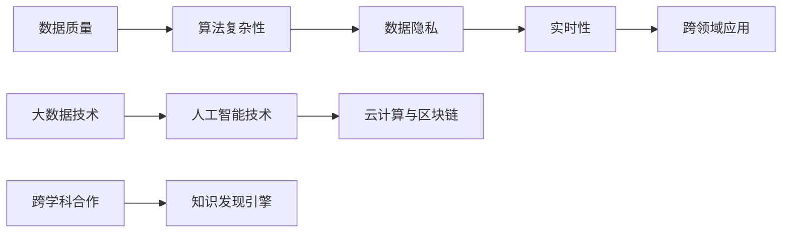

                 

# 《知识发现引擎：发掘知识中的规律与联系》

## 摘要

本文将深入探讨知识发现引擎的工作原理和应用。知识发现引擎是一种能够自动从大量数据中识别模式、关联和规律的人工智能工具。它广泛应用于商业、医疗、社会科学等多个领域，为决策提供数据支持。本文将首先介绍知识发现引擎的基本概念和核心技术，然后详细解析其在商业、医疗和社会科学领域的应用案例，最后展望其未来的发展趋势和挑战。

## 目录大纲

### 第一部分：知识发现引擎的概述

### 第1章：知识发现引擎的基本概念

### 第2章：知识发现引擎的核心技术

### 第二部分：知识发现引擎在特定领域的应用

### 第3章：知识发现引擎在商业领域的应用

### 第4章：知识发现引擎在医疗领域的应用

### 第5章：知识发现引擎在社会科学领域的应用

### 第三部分：知识发现引擎的未来展望与挑战

### 第6章：知识发现引擎的发展趋势

### 第7章：知识发现引擎的未来应用场景

### 附录

### 附录A：知识发现引擎相关资源与工具

### 附录B：知识发现引擎相关数学公式汇总

### 附录C：知识发现引擎代码实例

## 第一部分：知识发现引擎的概述

### 第1章：知识发现引擎的基本概念

### 第2章：知识发现引擎的核心技术

## 第二部分：知识发现引擎在特定领域的应用

### 第3章：知识发现引擎在商业领域的应用

### 第4章：知识发现引擎在医疗领域的应用

### 第5章：知识发现引擎在社会科学领域的应用

## 第三部分：知识发现引擎的未来展望与挑战

### 第6章：知识发现引擎的发展趋势

### 第7章：知识发现引擎的未来应用场景

### 附录

### 附录A：知识发现引擎相关资源与工具

### 附录B：知识发现引擎相关数学公式汇总

### 附录C：知识发现引擎代码实例

## 摘要

知识发现引擎是一种先进的人工智能工具，能够从大量数据中自动识别出模式、关联和规律。本文旨在全面探讨知识发现引擎的基本概念、核心技术以及其在商业、医疗和社会科学领域的应用。首先，我们将介绍知识发现引擎的定义、作用以及发展历史。接着，我们将深入探讨其核心技术，包括数据预处理、知识挖掘算法和知识评估与优化。随后，我们将分别解析知识发现引擎在商业、医疗和社会科学领域的应用案例，展示其在决策支持、市场预测、疾病诊断等方面的实际效果。最后，我们将展望知识发现引擎的未来发展趋势，探讨其在教育、金融等领域的潜在应用。通过本文的详细讲解，读者将全面理解知识发现引擎的工作原理和应用方法，为未来的研究和实践提供指导。

### 第1章：知识发现引擎的基本概念

#### 1.1 知识发现引擎的定义与作用

知识发现引擎（Knowledge Discovery Engine，简称KDE）是一种能够自动从大量数据中识别模式、关联和规律的人工智能工具。它基于机器学习和数据挖掘技术，通过分析大量数据，发现其中的隐藏规律，从而为决策提供支持。知识发现引擎在许多领域都有着广泛的应用，如商业、医疗、金融、社会科学等。

知识发现引擎的主要作用包括：

1. **模式识别**：从数据中发现常见的模式或规律，如销售趋势、用户行为等。
2. **关联分析**：发现数据之间的关联关系，如商品之间的相关性、用户之间的相似性等。
3. **预测分析**：基于历史数据预测未来趋势，如市场预测、疾病预测等。
4. **异常检测**：识别数据中的异常值，如欺诈行为、故障预测等。

知识发现引擎的核心在于其强大的数据处理和分析能力，它能够处理海量数据，并通过算法找到数据中的隐藏规律，为决策提供有力支持。

#### 1.2 知识发现引擎的工作流程

知识发现引擎的工作流程通常包括以下几个步骤：

1. **数据收集**：收集相关的数据源，如数据库、数据仓库、网络爬虫等。
2. **数据预处理**：清洗和整理数据，使其适合分析和挖掘。数据预处理包括数据清洗、数据转换、数据集成等。
3. **数据挖掘**：使用各种算法对数据进行分析，发现数据中的隐藏规律和模式。数据挖掘包括模式识别、关联分析、分类、聚类等。
4. **知识评估**：评估挖掘出的知识的有效性和可靠性，如通过交叉验证、评估指标等。
5. **知识应用**：将挖掘出的知识应用于实际场景，如决策支持、市场预测、疾病诊断等。

以下是一个简单的Mermaid流程图，展示了知识发现引擎的基本工作流程：


#### 1.3 知识发现引擎的算法流程

知识发现引擎的算法流程通常包括以下几个关键步骤：

1. **预处理算法**：用于数据清洗和转换，如缺失值处理、异常值处理、数据规范化等。以下是一个简单的预处理算法伪代码：

    ```python
    def preprocess_data(data):
        # 处理缺失值
        data = handle_missing_values(data)
        # 处理异常值
        data = handle_outliers(data)
        # 数据转换
        data = convert_data(data)
        return data
    ```

2. **挖掘算法**：用于发现数据中的隐藏规律和模式，如聚类、分类、关联规则挖掘等。以下是一个简单的挖掘算法伪代码：

    ```python
    def mine_patterns(data):
        # 聚类
        clusters = cluster_data(data)
        # 分类
        labels = classify_data(data)
        # 关联规则挖掘
        rules = apriori(data)
        return clusters, labels, rules
    ```

3. **评估算法**：用于评估挖掘出的知识的有效性和可靠性，如交叉验证、评估指标等。以下是一个简单的评估算法伪代码：

    ```python
    def evaluate_knowledge(clusters, labels, rules):
        # 交叉验证
        accuracy = cross_validation(clusters, labels)
        # 评估指标
        f1_score = calculate_f1_score(rules)
        return accuracy, f1_score
    ```

4. **应用算法**：将挖掘出的知识应用于实际场景，如决策支持、市场预测、疾病诊断等。以下是一个简单的应用算法伪代码：

    ```python
    def apply_knowledge(knowledge):
        # 决策支持
        decision = make_decision(knowledge)
        # 市场预测
        prediction = predict_market(knowledge)
        # 疾病诊断
        diagnosis = diagnose_disease(knowledge)
        return decision, prediction, diagnosis
    ```

#### 1.4 知识发现引擎的发展历史

知识发现引擎的概念起源于20世纪80年代，随着计算机技术的迅速发展和大数据时代的到来，知识发现引擎得到了广泛的研究和应用。以下是一个简单的知识发现引擎的发展历程表：

| 年份 | 事件 |
| --- | --- |
| 1980s | 数据挖掘概念提出 |
| 1990s | 关联规则挖掘算法提出 |
| 2000s | 机器学习技术在知识发现中应用 |
| 2010s | 深度学习技术在知识发现中应用 |
| 2020s | 知识发现引擎在各个领域得到广泛应用 |

随着技术的不断进步，知识发现引擎在算法、模型和应用方面都取得了显著的进展，为各行业提供了强大的数据支持和决策依据。

### 第2章：知识发现引擎的核心技术

#### 2.1 数据预处理

数据预处理是知识发现引擎中的关键步骤，它涉及到数据的清洗、转换和集成等操作。以下是数据预处理中常用的技术：

1. **数据清洗**：去除数据中的噪声和错误，如缺失值、异常值等。常用的方法包括：

    - 缺失值处理：通过填补、删除或插值等方式处理缺失值。
    - 异常值处理：通过统计方法、聚类方法等识别和去除异常值。

    ```python
    def handle_missing_values(data):
        # 填补缺失值
        data = fill_missing_values(data)
        # 删除缺失值
        data = drop_missing_values(data)
        return data

    def handle_outliers(data):
        # 使用统计学方法识别异常值
        outliers = identify_outliers(data)
        # 去除异常值
        data = remove_outliers(data, outliers)
        return data
    ```

2. **数据转换**：将数据转换为适合分析和挖掘的形式，如标准化、归一化等。常用的方法包括：

    - 标准化：将数据缩放到相同的尺度，如使用z-score标准化。
    - 归一化：将数据缩放到[0, 1]范围内，如使用min-max标准化。

    ```python
    def convert_data(data):
        # 标准化
        data = standardize_data(data)
        # 归一化
        data = normalize_data(data)
        return data
    ```

3. **数据集成**：将多个数据源中的数据整合为一个统一的格式。常用的方法包括：

    - 数据合并：将多个数据集合并为一个数据集。
    - 数据去重：去除重复的数据记录。
    - 数据融合：将多个数据源中的数据融合为一个综合的数据集。

    ```python
    def integrate_data(data1, data2):
        # 合并数据
        data = merge_data(data1, data2)
        # 去重
        data = remove_duplicates(data)
        # 融合数据
        data = fuse_data(data1, data2)
        return data
    ```

#### 2.2 知识挖掘算法

知识挖掘算法是知识发现引擎的核心，它通过分析数据，发现数据中的隐藏规律和模式。以下是一些常用的知识挖掘算法：

1. **聚类算法**：将数据集划分为多个类别，每个类别中的数据相似度较高，类别之间的相似度较低。常用的聚类算法包括K-means、DBSCAN、层次聚类等。

    ```python
    def cluster_data(data, k):
        # K-means聚类
        clusters = kmeans(data, k)
        # DBSCAN聚类
        clusters = dbscan(data)
        # 层次聚类
        clusters = hierarchical_clustering(data)
        return clusters
    ```

2. **分类算法**：将数据集划分为多个类别，每个类别中的数据相似度较高，类别之间的相似度较低。常用的分类算法包括决策树、支持向量机、朴素贝叶斯等。

    ```python
    def classify_data(data, labels):
        # 决策树分类
        labels = decision_tree(data, labels)
        # 支持向量机分类
        labels = svm_classify(data, labels)
        # 朴素贝叶斯分类
        labels = naive_bayes(data, labels)
        return labels
    ```

3. **关联规则挖掘算法**：发现数据集中的关联关系，如商品之间的购买关联、用户之间的行为关联等。常用的算法包括Apriori算法、FP-growth算法等。

    ```python
    def apriori(data, min_support, min_confidence):
        # Apriori算法
        rules = apriori_algorithm(data, min_support, min_confidence)
        # FP-growth算法
        rules = fpgrowth_algorithm(data, min_support, min_confidence)
        return rules
    ```

#### 2.3 知识评估与优化

知识评估与优化是确保知识发现结果的有效性和可靠性的关键步骤。以下是一些常用的知识评估与优化技术：

1. **交叉验证**：通过将数据集划分为训练集和测试集，评估挖掘出的知识的准确性和可靠性。常用的交叉验证方法包括K折交叉验证、留一交叉验证等。

    ```python
    def cross_validation(data, labels, k):
        # K折交叉验证
        accuracy = k_fold_validation(data, labels, k)
        # 留一交叉验证
        accuracy = leave_one_out_validation(data, labels)
        return accuracy
    ```

2. **评估指标**：用于评估挖掘出的知识的性能，如准确率、召回率、F1分数等。

    ```python
    def calculate_f1_score(predicted_labels, true_labels):
        # 计算准确率
        accuracy = accuracy_score(predicted_labels, true_labels)
        # 计算召回率
        recall = recall_score(predicted_labels, true_labels)
        # 计算F1分数
        f1_score = f1_score(predicted_labels, true_labels)
        return accuracy, recall, f1_score
    ```

3. **优化算法**：通过调整算法参数，优化挖掘出的知识的性能。常用的优化算法包括遗传算法、粒子群算法等。

    ```python
    def optimize_parameters(data, labels, algorithm):
        # 遗传算法优化
        best_params = genetic_algorithm(data, labels, algorithm)
        # 粒子群算法优化
        best_params = particle_swarm_optimization(data, labels, algorithm)
        return best_params
    ```

通过以上技术，知识发现引擎能够从大量数据中发掘出有价值的信息，为各行业的决策提供支持。

### 第3章：知识发现引擎在商业领域的应用

#### 3.1 商业数据分析

商业数据分析是知识发现引擎在商业领域的重要应用之一。它通过分析大量商业数据，帮助企业和组织做出更加明智的决策。以下是一个简单的商业数据分析流程：

1. **数据收集**：收集企业的销售数据、用户行为数据、市场数据等。
2. **数据预处理**：清洗和整理数据，去除噪声和异常值。
3. **数据挖掘**：使用聚类、分类、关联规则挖掘等算法，发现数据中的隐藏规律和模式。
4. **知识评估**：评估挖掘出的知识的有效性和可靠性。
5. **知识应用**：将挖掘出的知识应用于实际场景，如市场预测、销售策略优化等。

以下是一个简单的Mermaid流程图，展示了商业数据分析的流程：


#### 3.2 市场预测

市场预测是商业数据分析中的一个重要应用，它通过分析历史数据，预测未来的市场趋势，帮助企业制定相应的市场策略。以下是一个简单的市场预测算法流程：

1. **数据收集**：收集市场相关的数据，如销售数据、竞争数据等。
2. **数据预处理**：清洗和整理数据，去除噪声和异常值。
3. **特征工程**：提取与市场预测相关的特征，如时间序列特征、季节性特征等。
4. **模型选择**：选择合适的预测模型，如时间序列模型、回归模型等。
5. **模型训练**：使用历史数据训练预测模型。
6. **模型评估**：评估预测模型的性能，如均方误差、决定系数等。
7. **预测应用**：使用训练好的模型进行市场预测，并根据预测结果制定市场策略。

以下是一个简单的市场预测算法伪代码：

```python
def market_prediction(data):
    # 数据预处理
    data = preprocess_data(data)
    # 特征工程
    features = extract_features(data)
    # 模型选择
    model = select_model(features)
    # 模型训练
    model = train_model(model, features)
    # 模型评估
    performance = evaluate_model(model, features)
    # 预测应用
    prediction = predict_market(model, features)
    return prediction, performance
```

#### 3.3 商业智能系统构建

商业智能系统（Business Intelligence System，简称BIS）是一种利用数据分析和知识发现技术，帮助企业实现智能化决策的系统。以下是一个简单的商业智能系统构建流程：

1. **需求分析**：确定商业智能系统的目标和需求，如市场预测、销售分析等。
2. **数据集成**：整合企业内部和外部的数据源，如数据库、数据仓库、网络爬虫等。
3. **数据预处理**：清洗和整理数据，去除噪声和异常值。
4. **数据挖掘**：使用聚类、分类、关联规则挖掘等算法，发现数据中的隐藏规律和模式。
5. **知识评估**：评估挖掘出的知识的有效性和可靠性。
6. **知识应用**：将挖掘出的知识应用于实际场景，如市场预测、销售策略优化等。
7. **系统开发**：开发商业智能系统的前端和后端，实现用户界面和数据可视化等功能。
8. **系统部署**：部署商业智能系统，并进行测试和优化。

以下是一个简单的商业智能系统构建流程Mermaid流程图：


#### 实际案例：基于知识发现引擎的电商平台销售预测系统

一个实际的案例是构建一个基于知识发现引擎的电商平台销售预测系统。该系统旨在通过分析历史销售数据，预测未来的销售趋势，从而帮助电商平台制定库存管理和销售策略。

1. **需求分析**：确定销售预测系统的目标，如提高销售预测的准确性、优化库存管理等。
2. **数据收集**：收集电商平台的历史销售数据，包括产品销量、促销活动、季节性因素等。
3. **数据预处理**：清洗和整理数据，去除噪声和异常值。例如，处理缺失值、异常值和季节性数据。
4. **数据挖掘**：使用时间序列分析、回归分析等方法，发现销售数据中的规律和趋势。
5. **知识评估**：评估销售预测模型的性能，如均方误差、决定系数等，并选择最优模型。
6. **知识应用**：将预测模型应用于实际场景，如根据预测结果调整库存水平、制定促销策略等。
7. **系统开发**：开发销售预测系统的前端和后端，实现用户界面和数据可视化等功能。
8. **系统部署**：部署销售预测系统，并进行测试和优化，确保系统的稳定性和可靠性。

以下是一个简单的销售预测系统的代码实例：

```python
import pandas as pd
from sklearn.model_selection import train_test_split
from sklearn.linear_model import LinearRegression
from sklearn.metrics import mean_squared_error

# 数据收集
data = pd.read_csv('sales_data.csv')

# 数据预处理
data = preprocess_data(data)

# 数据分割
X = data.drop('sales', axis=1)
y = data['sales']
X_train, X_test, y_train, y_test = train_test_split(X, y, test_size=0.2, random_state=42)

# 模型训练
model = LinearRegression()
model.fit(X_train, y_train)

# 预测应用
predictions = model.predict(X_test)

# 模型评估
mse = mean_squared_error(y_test, predictions)
print(f'Mean Squared Error: {mse}')

# 数据可视化
import matplotlib.pyplot as plt

plt.scatter(y_test, predictions)
plt.xlabel('Actual Sales')
plt.ylabel('Predicted Sales')
plt.title('Sales Prediction')
plt.show()
```

通过这个案例，我们可以看到知识发现引擎在商业领域的强大应用，它不仅可以帮助企业提高销售预测的准确性，还可以优化库存管理，提高运营效率。

### 第4章：知识发现引擎在医疗领域的应用

#### 4.1 医学数据分析

医学数据分析是知识发现引擎在医疗领域的重要应用之一。它通过分析大量的医疗数据，帮助医生和医疗机构做出更准确的诊断和治疗决策。以下是一个简单的医学数据分析流程：

1. **数据收集**：收集患者的病历数据、实验室检测结果、影像学检查结果等。
2. **数据预处理**：清洗和整理数据，去除噪声和异常值，将数据转换为适合分析和挖掘的形式。
3. **数据挖掘**：使用聚类、分类、关联规则挖掘等算法，发现数据中的隐藏规律和模式。
4. **知识评估**：评估挖掘出的知识的有效性和可靠性。
5. **知识应用**：将挖掘出的知识应用于实际场景，如疾病诊断、治疗方案优化等。

以下是一个简单的医学数据分析流程Mermaid流程图：


#### 4.2 疾病预测与诊断

疾病预测与诊断是医学数据分析中的一个重要应用，它通过分析患者的临床数据，预测患者可能患有的疾病，并帮助医生做出准确的诊断。以下是一个简单的疾病预测与诊断算法流程：

1. **数据收集**：收集患者的临床数据，包括病史、实验室检测结果、影像学检查结果等。
2. **数据预处理**：清洗和整理数据，去除噪声和异常值。
3. **特征工程**：提取与疾病预测相关的特征，如年龄、性别、病史等。
4. **模型选择**：选择合适的预测模型，如决策树、支持向量机、神经网络等。
5. **模型训练**：使用历史数据训练预测模型。
6. **模型评估**：评估预测模型的性能，如准确率、召回率、F1分数等。
7. **预测应用**：使用训练好的模型预测新患者的疾病状态。

以下是一个简单的疾病预测与诊断算法伪代码：

```python
def disease_prediction(data):
    # 数据预处理
    data = preprocess_data(data)
    # 特征工程
    features = extract_features(data)
    # 模型选择
    model = select_model(features)
    # 模型训练
    model = train_model(model, features)
    # 模型评估
    performance = evaluate_model(model, features)
    # 预测应用
    predictions = predict_disease(model, features)
    return predictions, performance
```

#### 4.3 医疗智能系统构建

医疗智能系统（Medical Intelligence System，简称MIS）是一种利用数据分析和知识发现技术，帮助医生和医疗机构实现智能化诊断和治疗的系统。以下是一个简单的医疗智能系统构建流程：

1. **需求分析**：确定医疗智能系统的目标和需求，如疾病预测、治疗方案优化等。
2. **数据集成**：整合医院内部和外部的医疗数据源，如电子病历、实验室检测结果、影像学检查结果等。
3. **数据预处理**：清洗和整理医疗数据，去除噪声和异常值。
4. **数据挖掘**：使用聚类、分类、关联规则挖掘等算法，发现数据中的隐藏规律和模式。
5. **知识评估**：评估挖掘出的知识的有效性和可靠性。
6. **知识应用**：将挖掘出的知识应用于实际场景，如疾病预测、治疗方案优化等。
7. **系统开发**：开发医疗智能系统的前端和后端，实现用户界面和数据可视化等功能。
8. **系统部署**：部署医疗智能系统，并进行测试和优化，确保系统的稳定性和可靠性。

以下是一个简单的医疗智能系统构建流程Mermaid流程图：


#### 实际案例：基于知识发现引擎的疾病预测系统

一个实际的案例是构建一个基于知识发现引擎的疾病预测系统，该系统旨在通过分析患者的临床数据，预测患者可能患有的疾病。

1. **需求分析**：确定疾病预测系统的目标，如提高疾病预测的准确性、辅助医生诊断等。
2. **数据收集**：收集医院的电子病历数据，包括患者的病史、实验室检测结果、影像学检查结果等。
3. **数据预处理**：清洗和整理数据，去除噪声和异常值。例如，处理缺失值、异常值和季节性数据。
4. **特征工程**：提取与疾病预测相关的特征，如年龄、性别、病史、实验室检测结果等。
5. **模型选择**：选择合适的预测模型，如决策树、支持向量机、神经网络等。
6. **模型训练**：使用历史数据训练预测模型。
7. **模型评估**：评估预测模型的性能，如准确率、召回率、F1分数等，并选择最优模型。
8. **知识应用**：将预测模型应用于实际场景，如根据预测结果辅助医生进行疾病诊断。
9. **系统开发**：开发疾病预测系统的前端和后端，实现用户界面和数据可视化等功能。
10. **系统部署**：部署疾病预测系统，并进行测试和优化，确保系统的稳定性和可靠性。

以下是一个简单的疾病预测系统的代码实例：

```python
import pandas as pd
from sklearn.model_selection import train_test_split
from sklearn.ensemble import RandomForestClassifier
from sklearn.metrics import accuracy_score

# 数据收集
data = pd.read_csv('patient_data.csv')

# 数据预处理
data = preprocess_data(data)

# 数据分割
X = data.drop('disease', axis=1)
y = data['disease']
X_train, X_test, y_train, y_test = train_test_split(X, y, test_size=0.2, random_state=42)

# 模型训练
model = RandomForestClassifier()
model.fit(X_train, y_train)

# 预测应用
predictions = model.predict(X_test)

# 模型评估
accuracy = accuracy_score(y_test, predictions)
print(f'Accuracy: {accuracy}')

# 数据可视化
import matplotlib.pyplot as plt

plt.scatter(y_test, predictions)
plt.xlabel('Actual Disease')
plt.ylabel('Predicted Disease')
plt.title('Disease Prediction')
plt.show()
```

通过这个案例，我们可以看到知识发现引擎在医疗领域的强大应用，它不仅可以帮助医生提高疾病预测的准确性，还可以优化治疗方案，提高医疗服务的质量。

### 第5章：知识发现引擎在社会科学领域的应用

#### 5.1 社会数据挖掘

社会数据挖掘是知识发现引擎在社会科学领域的重要应用之一。它通过分析大量的社会数据，帮助研究者和社会科学家发现社会现象的规律和模式。以下是一个简单的社会数据挖掘流程：

1. **数据收集**：收集社会数据，包括社交媒体数据、新闻报道、问卷调查数据等。
2. **数据预处理**：清洗和整理数据，去除噪声和异常值。
3. **数据挖掘**：使用聚类、分类、关联规则挖掘等算法，发现数据中的隐藏规律和模式。
4. **知识评估**：评估挖掘出的知识的有效性和可靠性。
5. **知识应用**：将挖掘出的知识应用于实际场景，如社会行为预测、公共政策制定等。

以下是一个简单的社会数据挖掘流程Mermaid流程图：


#### 5.2 社会行为预测

社会行为预测是知识发现引擎在社会数据挖掘中的一个重要应用，它通过分析社会数据，预测社会行为的趋势和模式。以下是一个简单的社会行为预测算法流程：

1. **数据收集**：收集与目标社会行为相关的数据，如社交媒体互动数据、新闻报道数据等。
2. **数据预处理**：清洗和整理数据，去除噪声和异常值。
3. **特征工程**：提取与目标社会行为相关的特征，如文本特征、用户特征等。
4. **模型选择**：选择合适的预测模型，如时间序列模型、神经网络等。
5. **模型训练**：使用历史数据训练预测模型。
6. **模型评估**：评估预测模型的性能，如准确率、召回率、F1分数等。
7. **预测应用**：使用训练好的模型预测未来社会行为的趋势和模式。

以下是一个简单的社会行为预测算法伪代码：

```python
def social_behavior_prediction(data):
    # 数据预处理
    data = preprocess_data(data)
    # 特征工程
    features = extract_features(data)
    # 模型选择
    model = select_model(features)
    # 模型训练
    model = train_model(model, features)
    # 模型评估
    performance = evaluate_model(model, features)
    # 预测应用
    predictions = predict_behavior(model, features)
    return predictions, performance
```

#### 5.3 社会智能系统构建

社会智能系统（Social Intelligence System，简称SIS）是一种利用数据分析和知识发现技术，帮助社会科学家和研究者实现智能化分析的系统。以下是一个简单的社会智能系统构建流程：

1. **需求分析**：确定社会智能系统的目标和需求，如社会行为预测、公共政策制定等。
2. **数据集成**：整合来自多种数据源的社会数据，如社交媒体数据、新闻报道数据、问卷调查数据等。
3. **数据预处理**：清洗和整理社会数据，去除噪声和异常值。
4. **数据挖掘**：使用聚类、分类、关联规则挖掘等算法，发现数据中的隐藏规律和模式。
5. **知识评估**：评估挖掘出的知识的有效性和可靠性。
6. **知识应用**：将挖掘出的知识应用于实际场景，如社会行为预测、公共政策制定等。
7. **系统开发**：开发社会智能系统的前端和后端，实现用户界面和数据可视化等功能。
8. **系统部署**：部署社会智能系统，并进行测试和优化，确保系统的稳定性和可靠性。

以下是一个简单的社会智能系统构建流程Mermaid流程图：


#### 实际案例：基于知识发现引擎的社会行为预测系统

一个实际的案例是构建一个基于知识发现引擎的社会行为预测系统，该系统旨在通过分析社交媒体数据，预测社会行为的趋势和模式。

1. **需求分析**：确定社会行为预测系统的目标，如预测社会运动的发展趋势、预测选举结果等。
2. **数据收集**：收集社交媒体数据，包括推文、评论、转发等。
3. **数据预处理**：清洗和整理社交媒体数据，去除噪声和异常值。例如，处理文本数据中的停用词、标点符号等。
4. **特征工程**：提取与目标社会行为相关的特征，如文本特征、用户特征等。
5. **模型选择**：选择合适的预测模型，如决策树、支持向量机、神经网络等。
6. **模型训练**：使用历史数据训练预测模型。
7. **模型评估**：评估预测模型的性能，如准确率、召回率、F1分数等，并选择最优模型。
8. **知识应用**：将预测模型应用于实际场景，如预测社会运动的发展趋势、预测选举结果等。
9. **系统开发**：开发社会行为预测系统的前端和后端，实现用户界面和数据可视化等功能。
10. **系统部署**：部署社会行为预测系统，并进行测试和优化，确保系统的稳定性和可靠性。

以下是一个简单的社会行为预测系统的代码实例：

```python
import pandas as pd
from sklearn.model_selection import train_test_split
from sklearn.ensemble import RandomForestClassifier
from sklearn.metrics import accuracy_score

# 数据收集
data = pd.read_csv('social_data.csv')

# 数据预处理
data = preprocess_data(data)

# 数据分割
X = data.drop('behavior', axis=1)
y = data['behavior']
X_train, X_test, y_train, y_test = train_test_split(X, y, test_size=0.2, random_state=42)

# 模型训练
model = RandomForestClassifier()
model.fit(X_train, y_train)

# 预测应用
predictions = model.predict(X_test)

# 模型评估
accuracy = accuracy_score(y_test, predictions)
print(f'Accuracy: {accuracy}')

# 数据可视化
import matplotlib.pyplot as plt

plt.scatter(y_test, predictions)
plt.xlabel('Actual Behavior')
plt.ylabel('Predicted Behavior')
plt.title('Behavior Prediction')
plt.show()
```

通过这个案例，我们可以看到知识发现引擎在社会科学领域的强大应用，它不仅可以帮助研究者预测社会行为的趋势和模式，还可以为公共政策制定提供数据支持。

### 第6章：知识发现引擎的发展趋势

#### 6.1 新技术的应用

随着技术的不断进步，知识发现引擎在新技术中的应用也越来越广泛。以下是一些值得关注的新技术：

1. **深度学习**：深度学习技术在知识发现引擎中的应用，可以显著提高其数据处理和分析能力。深度神经网络能够自动提取复杂的数据特征，从而提高知识发现的效果。

2. **图数据库**：图数据库在知识发现中的应用，可以更好地处理复杂的关系数据。通过图数据库，知识发现引擎可以更有效地挖掘数据之间的关联和依赖关系。

3. **区块链**：区块链技术在知识发现引擎中的应用，可以提供更加安全可靠的数据存储和传输机制。知识发现引擎可以利用区块链技术，确保数据的一致性和安全性。

4. **云计算**：云计算技术为知识发现引擎提供了强大的计算能力和存储空间。通过云计算，知识发现引擎可以更快速地处理海量数据，提高其效率。

以下是一个简单的Mermaid流程图，展示了新技术在知识发现引擎中的应用：


#### 6.2 挑战与机遇

知识发现引擎在发展过程中也面临着一些挑战和机遇：

1. **数据质量**：高质量的数据是知识发现的基础。然而，实际数据往往存在噪声、异常值和缺失值等问题，这对知识发现引擎的性能提出了挑战。

2. **算法复杂性**：知识发现引擎涉及的算法通常非常复杂，包括聚类、分类、关联规则挖掘等。如何简化算法，提高其可解释性和可操作性，是一个重要的研究方向。

3. **数据隐私**：在处理个人数据时，如何保护数据隐私是一个重要问题。知识发现引擎需要确保在挖掘数据时，不泄露用户的个人信息。

4. **实时性**：知识发现引擎通常需要处理海量数据，并实时更新和调整预测结果。如何提高实时性，是一个重要的挑战。

5. **跨领域应用**：知识发现引擎在不同领域的应用存在差异，如何实现跨领域的通用性和可扩展性，是一个重要的问题。

然而，这些挑战也带来了新的机遇：

1. **大数据技术**：大数据技术的发展为知识发现引擎提供了丰富的数据资源，有助于提高其性能和效果。

2. **人工智能技术**：人工智能技术的发展，特别是深度学习和自然语言处理等技术的进步，为知识发现引擎提供了强大的工具。

3. **云计算与区块链**：云计算和区块链技术的应用，可以提高知识发现引擎的处理能力和数据安全性。

4. **跨学科合作**：跨学科的合作有助于解决知识发现引擎在各个领域面临的问题，实现跨领域的创新。

以下是一个简单的Mermaid流程图，展示了知识发现引擎面临的挑战与机遇：



通过不断应对挑战和抓住机遇，知识发现引擎将在未来的发展中取得更加显著的成果。

### 第7章：知识发现引擎的未来应用场景

#### 7.1 教育领域

知识发现引擎在教育领域的应用前景广阔，它可以帮助教育机构实现个性化教学、学习分析、课程推荐等。以下是一些具体的应用场景：

1. **个性化教学**：知识发现引擎可以根据学生的学习数据和表现，推荐适合他们的学习资源和教学方法。通过分析学生的学习行为、成绩和反馈，知识发现引擎可以生成个性化的学习路径和策略。

    ```mermaid
    flowchart LR
    A[学生学习数据] --> B[知识发现引擎]
    B --> C[个性化学习资源推荐]
    ```

2. **学习分析**：知识发现引擎可以分析学生的学习过程和行为，发现潜在的学习问题和需求。通过聚类和分析学习数据，教育机构可以识别学生的学习风格、兴趣和弱点，从而提供更有针对性的支持和干预。

    ```mermaid
    flowchart LR
    A[学生学习数据] --> B[知识发现引擎]
    B --> C[学习问题识别]
    C --> D[干预措施推荐]
    ```

3. **课程推荐**：知识发现引擎可以根据学生的学习历史和需求，推荐相关的课程和学习资源。通过分析课程内容、学习进度和学生兴趣，知识发现引擎可以为学生提供个性化的学习建议。

    ```mermaid
    flowchart LR
    A[学生学习历史] --> B[知识发现引擎]
    B --> C[课程推荐]
    ```

#### 7.2 金融领域

知识发现引擎在金融领域的应用也非常广泛，它可以帮助金融机构实现风险管理、市场预测、客户行为分析等。以下是一些具体的应用场景：

1. **风险管理**：知识发现引擎可以通过分析历史数据和金融市场的动态，预测风险事件的可能性，从而帮助金融机构制定相应的风险管理策略。

    ```mermaid
    flowchart LR
    A[金融数据] --> B[知识发现引擎]
    B --> C[风险预测]
    C --> D[风险应对策略]
    ```

2. **市场预测**：知识发现引擎可以通过分析历史市场数据、经济指标和新闻信息，预测市场的走势和趋势，从而帮助投资者制定投资策略。

    ```mermaid
    flowchart LR
    A[市场数据] --> B[知识发现引擎]
    B --> C[市场预测]
    ```

3. **客户行为分析**：知识发现引擎可以通过分析客户的交易数据、浏览行为和反馈信息，了解客户的需求和行为模式，从而提供个性化的金融服务。

    ```mermaid
    flowchart LR
    A[客户数据] --> B[知识发现引擎]
    B --> C[客户行为分析]
    C --> D[个性化服务]
    ```

#### 7.3 其他领域

知识发现引擎在其他领域，如医疗、交通、环境等，也具有广泛的应用前景。以下是一些具体的应用场景：

1. **医疗健康**：知识发现引擎可以通过分析患者数据、基因组数据和医疗文献，发现疾病的规律和关联，从而帮助医生做出更准确的诊断和治疗决策。

    ```mermaid
    flowchart LR
    A[医疗数据] --> B[知识发现引擎]
    B --> C[疾病规律发现]
    C --> D[诊断和治疗决策]
    ```

2. **交通管理**：知识发现引擎可以通过分析交通数据、气象数据和路况信息，预测交通流量和事故可能性，从而帮助交通管理部门制定交通调控策略。

    ```mermaid
    flowchart LR
    A[交通数据] --> B[知识发现引擎]
    B --> C[交通流量预测]
    C --> D[交通调控策略]
    ```

3. **环境监测**：知识发现引擎可以通过分析环境数据、气象数据和地理位置信息，发现环境污染的规律和趋势，从而帮助环境保护部门制定环境保护策略。

    ```mermaid
    flowchart LR
    A[环境数据] --> B[知识发现引擎]
    B --> C[环境污染规律发现]
    C --> D[环境保护策略]
    ```

通过在各个领域的广泛应用，知识发现引擎为各个行业提供了强大的数据支持和决策依据，推动了智能化和数字化的发展。

### 附录

#### 附录A：知识发现引擎相关资源与工具

以下是一些关于知识发现引擎的推荐资源与工具：

- **书籍**：
  - 《数据挖掘：概念与技术》（Database Mining: Concepts and Techniques）
  - 《机器学习》（Machine Learning）
  - 《深度学习》（Deep Learning）

- **在线课程**：
  - Coursera上的“数据挖掘与机器学习”课程
  - edX上的“深度学习”课程

- **开源项目**：
  - scikit-learn：Python的数据挖掘和机器学习库
  - TensorFlow：Google的深度学习框架
  - PyTorch：Facebook的深度学习框架

#### 附录B：知识发现引擎相关数学公式汇总

以下是一些常用的数学公式，用于知识发现引擎的数据预处理、知识挖掘和知识评估：

- **数据预处理**：
  - 标准化：$$z = \frac{x - \mu}{\sigma}$$
  - 归一化：$$x_{\text{normalized}} = \frac{x_{\text{max}} - x}{x_{\text{max}} - x_{\text{min}}}$$

- **知识挖掘**：
  - 聚类算法：$$\min \sum_{i=1}^{n} d(x_i, c_j)$$
  - 决策树：$$Gini(\text{impurity}) = 1 - \sum_{i=1}^{k} \left( \frac{n_i}{n} \right)^2$$
  - 支持向量机：$$\max \frac{1}{2} \sum_{i=1}^{n} w_i^2$$

- **知识评估**：
  - 准确率：$$\text{Accuracy} = \frac{TP + TN}{TP + FP + FN + TN}$$
  - 召回率：$$\text{Recall} = \frac{TP}{TP + FN}$$
  - F1分数：$$F1 = 2 \times \frac{Precision \times Recall}{Precision + Recall}$$

#### 附录C：知识发现引擎代码实例

以下是一些简单的知识发现引擎代码实例，用于商业智能系统、医疗智能系统和社会智能系统的构建：

**商业智能系统代码实例**：

```python
# 导入必要的库
import pandas as pd
from sklearn.model_selection import train_test_split
from sklearn.ensemble import RandomForestRegressor

# 数据收集
data = pd.read_csv('sales_data.csv')

# 数据预处理
data = preprocess_data(data)

# 数据分割
X = data.drop('sales', axis=1)
y = data['sales']
X_train, X_test, y_train, y_test = train_test_split(X, y, test_size=0.2, random_state=42)

# 模型训练
model = RandomForestRegressor()
model.fit(X_train, y_train)

# 预测应用
predictions = model.predict(X_test)

# 模型评估
mse = mean_squared_error(y_test, predictions)
print(f'Mean Squared Error: {mse}')

# 数据可视化
import matplotlib.pyplot as plt

plt.scatter(y_test, predictions)
plt.xlabel('Actual Sales')
plt.ylabel('Predicted Sales')
plt.title('Sales Prediction')
plt.show()
```

**医疗智能系统代码实例**：

```python
# 导入必要的库
import pandas as pd
from sklearn.model_selection import train_test_split
from sklearn.ensemble import RandomForestClassifier
from sklearn.metrics import accuracy_score

# 数据收集
data = pd.read_csv('patient_data.csv')

# 数据预处理
data = preprocess_data(data)

# 数据分割
X = data.drop('disease', axis=1)
y = data['disease']
X_train, X_test, y_train, y_test = train_test_split(X, y, test_size=0.2, random_state=42)

# 模型训练
model = RandomForestClassifier()
model.fit(X_train, y_train)

# 预测应用
predictions = model.predict(X_test)

# 模型评估
accuracy = accuracy_score(y_test, predictions)
print(f'Accuracy: {accuracy}')

# 数据可视化
import matplotlib.pyplot as plt

plt.scatter(y_test, predictions)
plt.xlabel('Actual Disease')
plt.ylabel('Predicted Disease')
plt.title('Disease Prediction')
plt.show()
```

**社会智能系统代码实例**：

```python
# 导入必要的库
import pandas as pd
from sklearn.model_selection import train_test_split
from sklearn.ensemble import RandomForestClassifier
from sklearn.metrics import accuracy_score

# 数据收集
data = pd.read_csv('social_data.csv')

# 数据预处理
data = preprocess_data(data)

# 数据分割
X = data.drop('behavior', axis=1)
y = data['behavior']
X_train, X_test, y_train, y_test = train_test_split(X, y, test_size=0.2, random_state=42)

# 模型训练
model = RandomForestClassifier()
model.fit(X_train, y_train)

# 预测应用
predictions = model.predict(X_test)

# 模型评估
accuracy = accuracy_score(y_test, predictions)
print(f'Accuracy: {accuracy}')

# 数据可视化
import matplotlib.pyplot as plt

plt.scatter(y_test, predictions)
plt.xlabel('Actual Behavior')
plt.ylabel('Predicted Behavior')
plt.title('Behavior Prediction')
plt.show()
```

通过这些代码实例，我们可以看到知识发现引擎在实际应用中的实现过程和效果评估。这些实例为开发者和研究者提供了实用的参考，有助于深入理解知识发现引擎的工作原理和应用方法。

