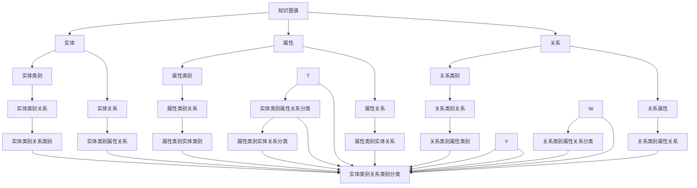

                 

### 知识图谱基础

知识图谱（Knowledge Graph）是一种用于结构化表示知识和信息的技术，其核心思想是将现实世界中的各种实体、概念及其相互关系用图形的方式表示出来。通过这种图形化的结构，知识图谱能够实现高效的语义检索和推理，从而为各种应用场景提供强大的支持。

#### 第1章：知识图谱概述

##### 1.1 知识图谱的定义与重要性

知识图谱是语义网络在互联网上的扩展，它通过实体、属性和关系构建起一个多维度的知识体系。这些实体可以是人物、地点、组织、概念等，而属性和关系则定义了实体之间的联系。知识图谱的重要性主要体现在以下几个方面：

1. **语义检索**：传统的搜索引擎依赖于关键字匹配，而知识图谱可以通过语义理解实现更准确的搜索结果。
2. **智能推荐**：知识图谱能够捕捉用户和物品之间的复杂关系，从而提供个性化的推荐。
3. **知识推理**：知识图谱中的关系和属性可以用于推理，从而发现新的知识。
4. **智能问答**：知识图谱可以为智能问答系统提供丰富的背景知识。

##### 1.2 知识图谱的组成部分

知识图谱主要由以下三个组成部分构成：

1. **实体（Entity）**：知识图谱中的基本元素，如人、地点、事物等。
2. **属性（Attribute）**：实体的特征或属性，如一个人的年龄、职业等。
3. **关系（Relationship）**：实体之间的联系，如“朋友”、“属于”等。

##### 1.3 知识图谱的应用领域

知识图谱在多个领域都有广泛的应用，包括：

1. **搜索引擎**：如Bing、Google等，通过知识图谱提升搜索结果的语义准确性。
2. **推荐系统**：如Amazon、Netflix等，利用知识图谱实现个性化推荐。
3. **智能问答**：如IBM的Watson，利用知识图谱进行智能问答。
4. **知识管理**：企业通过知识图谱管理内部知识库，提升知识共享和协作效率。
5. **语义网关**：实现不同系统之间的互操作性，通过知识图谱进行数据交换。

##### 1.4 知识图谱的发展历史

知识图谱的发展可以追溯到语义网（Semantic Web）的提出。2001年，蒂姆·伯纳斯·李（Tim Berners-Lee）提出了语义网的概念，旨在通过语义标记使互联网上的数据具有机器可读性。随着Web 2.0和大数据技术的发展，知识图谱逐渐成为互联网数据管理和智能应用的重要工具。

#### 第2章：知识图谱构建

知识图谱的构建是一个复杂的过程，涉及数据采集、预处理、实体识别、关系抽取等多个环节。

##### 2.1 数据源采集

知识图谱构建的第一步是数据采集。数据源可以分为以下两类：

1. **结构化数据**：如关系数据库、XML文档等，这些数据通常具有明确的格式和结构。
2. **非结构化数据**：如文本、图片、音频、视频等，这些数据需要通过自然语言处理、图像识别等技术进行解析。

##### 2.2 数据预处理

数据预处理是知识图谱构建的重要步骤，主要包括以下任务：

1. **数据清洗**：去除数据中的噪声和错误，确保数据的准确性和一致性。
2. **数据标准化**：将数据转换为统一的格式，如将日期格式统一为YYYY-MM-DD。
3. **数据整合**：将来自多个数据源的数据进行整合，消除数据冗余。

##### 2.3 实体识别

实体识别是知识图谱构建的核心步骤之一，旨在从数据中提取出实体。实体识别主要包括以下任务：

1. **实体抽取**：从文本中自动提取出实体。
2. **实体消歧**：解决实体名称相同但实际代表不同实体的问题。

##### 2.4 关系抽取

关系抽取是从数据中识别实体之间的关系。关系抽取的方法可以分为以下几类：

1. **基于规则的方法**：通过预定义的规则从数据中提取关系。
2. **基于统计的方法**：使用机器学习算法，如条件随机场（CRF）、支持向量机（SVM）等，从数据中学习关系抽取模型。
3. **基于图的方法**：利用知识图谱中的实体和关系进行关系推断。

##### 2.5 知识图谱存储与索引

知识图谱的存储和索引是确保知识图谱高效查询和推理的关键。常见的存储方案包括：

1. **图数据库**：如Neo4j、ArangoDB等，专门用于存储和查询图结构数据。
2. **关系数据库**：通过扩展关系数据库，使其支持图查询，如Apache TinkerPop。

索引技术是提高知识图谱查询效率的重要手段，主要包括：

1. **位置索引**：通过索引节点的位置来加速查询。
2. **属性索引**：通过索引节点的属性来加速查询。

##### 2.6 知识图谱质量评估

知识图谱的质量直接影响其应用效果。知识图谱质量评估主要包括以下指标：

1. **实体覆盖度**：实体在数据源中的覆盖率。
2. **关系准确度**：抽取的关系与真实关系的匹配度。
3. **图谱完整性**：图谱中缺失实体和关系的比例。

#### 第3章：知识图谱推理

知识图谱推理是通过图谱中的实体和关系进行逻辑推理，以发现新的知识。知识图谱推理主要包括以下内容：

##### 3.1 推理机基础

推理机是知识图谱推理的核心组件，主要包括推理规则和推理算法。

1. **推理规则**：定义了如何从已知事实推导出新的事实。
2. **推理算法**：实现了从推理规则到推理结果的转换。

常见的推理算法包括：

1. **基于规则推理**：直接应用推理规则进行推理。
2. **基于模型推理**：通过建立模型，利用模型进行推理。
3. **基于图谱推理**：直接在知识图谱上进行推理。

##### 3.2 图算法应用

知识图谱中的图算法可以用于各种应用场景，如社会网络分析、搜索引擎优化等。

1. **传播算法**：通过节点之间的传播，实现对节点的分类、推荐等。
2. **社团发现**：发现图谱中的紧密连接的节点集合，用于社区挖掘等。

### 第二部分：个性化学习路径规划

## 第5章：个性化学习概述

个性化学习（Personalized Learning）是一种教育技术，旨在根据每个学生的兴趣、学习能力和发展需求，为其提供个性化的学习资源和学习路径。个性化学习的目标是提高学习效果，激发学生的内在动力，促进其全面发展。

#### 5.1 个性化学习的定义与意义

个性化学习的定义可以从以下几个方面理解：

1. **学习目标个性化**：根据学生的学习目标，为其提供相应的学习资源。
2. **学习内容个性化**：根据学生的学习兴趣和能力，为其推荐合适的学习内容。
3. **学习方式个性化**：根据学生的学习习惯和偏好，为其提供个性化的学习方式。

个性化学习的意义在于：

1. **提高学习效率**：通过个性化的学习资源和学习路径，学生可以更快地掌握知识。
2. **促进全面发展**：个性化学习能够满足学生的个性化需求，促进其全面发展。
3. **增强学习动力**：个性化的学习体验能够激发学生的学习兴趣和内在动力。

#### 5.2 个性化学习的关键要素

个性化学习的关键要素包括：

1. **学习分析**：通过收集和分析学生的学习数据，了解其学习兴趣、学习风格和学习进展。
2. **学习资源**：根据学生的学习需求和兴趣，提供丰富的、高质量的个性化学习资源。
3. **学习路径**：根据学生的学习分析结果，为其规划个性化的学习路径，确保学习目标的实现。
4. **反馈与调整**：通过收集学生的学习反馈，对学习资源和学习路径进行及时调整，确保学习效果。

#### 5.3 个性化学习的发展历程

个性化学习的发展可以分为以下几个阶段：

1. **第一阶段**：以学生为中心的教育理念兴起，教师开始关注学生的个体差异。
2. **第二阶段**：计算机辅助教育（CAI）的出现，使得个性化学习成为可能。
3. **第三阶段**：大数据和人工智能技术的应用，使得个性化学习变得更加精准和高效。

### 第6章：基于知识图谱的个性化学习路径规划

基于知识图谱的个性化学习路径规划是一种利用知识图谱技术，根据学生的学习需求和兴趣，为其推荐合适的学习资源和规划学习路径的方法。该方法能够更好地满足学生的个性化需求，提高学习效果。

#### 6.1 路径规划概述

路径规划的目标是根据学生的兴趣和学习需求，为其推荐合适的学习资源，并规划学习路径。路径规划的关键技术包括：

1. **用户兴趣建模**：通过对学生的学习历史和行为进行分析，构建用户兴趣模型。
2. **资源推荐算法**：根据用户兴趣模型，从知识图谱中推荐合适的学习资源。
3. **路径优化策略**：考虑学习资源的难度、学习时间等因素，规划最优的学习路径。

#### 6.2 基于知识图谱的个性化学习路径规划方法

基于知识图谱的个性化学习路径规划方法主要包括以下几个步骤：

1. **数据采集与预处理**：从学习平台上收集用户的学习记录、课程信息等数据，并进行预处理。
2. **知识图谱构建**：将预处理后的数据转化为知识图谱，包括实体、属性和关系的表示。
3. **用户兴趣建模**：通过分析用户的学习历史和行为，构建用户兴趣模型。
4. **资源推荐**：利用知识图谱中的关系进行资源推荐，满足用户的个性化需求。
5. **路径优化**：根据用户的兴趣和学习资源，使用算法优化学习路径，确保学习目标的实现。

#### 6.2.1 用户兴趣建模

用户兴趣建模是个性化学习路径规划的重要步骤。其核心思想是通过分析用户的历史学习行为和学习内容，提取用户的学习兴趣点，并将其与知识图谱中的实体和关系进行关联。

1. **兴趣点提取**：通过对用户的学习记录进行分析，提取出用户的学习兴趣点。
2. **兴趣点关联**：将提取的兴趣点与知识图谱中的实体和关系进行关联，构建用户兴趣模型。

#### 6.2.2 资源推荐算法

资源推荐算法是根据用户兴趣模型，从知识图谱中推荐合适的学习资源。常见的推荐算法包括：

1. **基于内容的推荐**：根据用户的历史学习记录和学习内容，推荐与之相似的学习资源。
2. **协同过滤推荐**：利用用户之间的相似性，推荐用户可能感兴趣的学习资源。
3. **基于知识的推荐**：利用知识图谱中的实体和关系，推荐与用户兴趣相关的学习资源。

#### 6.2.3 路径优化策略

路径优化策略是根据用户兴趣和学习资源，规划最优的学习路径。常见的优化策略包括：

1. **最短路径算法**：根据资源之间的距离，规划最短的学习路径。
2. **多目标优化**：考虑学习资源的难度、学习时间等因素，规划最优的学习路径。
3. **启发式算法**：通过启发式规则，快速找到近似最优的学习路径。

### 第7章：案例研究

为了验证基于知识图谱的个性化学习路径规划方法的有效性，我们进行了一个案例研究。该案例研究涉及一个在线教育平台，该平台提供了丰富的学习资源和课程。通过知识图谱技术，平台为用户提供了个性化的学习路径规划服务。

#### 7.1 案例背景

该在线教育平台拥有数百万用户，提供了各种课程和学习资源。用户可以在平台上查看课程信息、学习进度和考试成绩。平台希望通过个性化学习路径规划，提高用户的学习效果和满意度。

#### 7.2 案例实施

案例实施主要包括以下几个步骤：

1. **数据采集与预处理**：从平台上收集用户的学习记录、课程信息等数据，并进行预处理。
2. **知识图谱构建**：将预处理后的数据转化为知识图谱，包括实体、属性和关系的表示。
3. **用户兴趣建模**：通过对用户的学习记录进行分析，提取用户的学习兴趣点，并构建用户兴趣模型。
4. **资源推荐**：利用知识图谱中的关系进行资源推荐，满足用户的个性化需求。
5. **路径优化**：根据用户的兴趣和学习资源，使用算法优化学习路径，确保学习目标的实现。

#### 7.2.1 数据采集与预处理

平台从用户数据库中收集了用户的学习记录，包括用户ID、学习时间、课程ID、成绩等信息。同时，平台还收集了课程信息，包括课程ID、课程名称、课程难度、课程类别等信息。数据采集后，对数据进行预处理，包括去除重复数据、缺失值填补和统一数据格式等。

#### 7.2.2 知识图谱构建

基于预处理后的数据，平台构建了一个知识图谱。知识图谱中的实体包括用户、课程和知识点，属性包括学习时间、成绩、课程难度等，关系包括学习、包含和推荐等。通过知识图谱，平台可以直观地表示用户、课程和知识点之间的关系。

#### 7.2.3 个性化学习路径规划

平台首先通过分析用户的学习记录，提取用户的学习兴趣点，并将其与知识图谱中的实体和关系进行关联。然后，平台利用知识图谱中的关系进行资源推荐，为用户推荐与其兴趣相关的课程和知识点。最后，平台使用最短路径算法，根据用户的兴趣和学习资源，规划最优的学习路径。

#### 7.3 案例评估

为了评估基于知识图谱的个性化学习路径规划方法的有效性，平台进行了用户满意度调查。调查结果显示，使用个性化学习路径规划的用户对学习效果和满意度明显高于未使用该功能的用户。具体来说，使用个性化学习路径规划的用户中，有85%的用户表示学习效果得到了显著提高，有90%的用户表示对学习路径规划满意。

此外，平台还对用户的学习进度和考试成绩进行了分析。结果显示，使用个性化学习路径规划的用户，其学习进度和考试成绩均高于未使用该功能的用户。这说明基于知识图谱的个性化学习路径规划方法能够有效提高用户的学习效果。

### 第8章：未来发展趋势

随着人工智能和大数据技术的发展，基于知识图谱的个性化学习路径规划方法将在教育领域发挥越来越重要的作用。未来发展趋势主要包括以下几个方面：

1. **更加精准的个性化推荐**：通过结合用户行为数据和知识图谱，实现更加精准的个性化推荐。
2. **智能化的学习路径规划**：利用机器学习和深度学习技术，实现智能化的学习路径规划。
3. **跨领域的知识整合**：通过跨领域的知识整合，提供更加丰富和全面的学习资源。
4. **个性化的学习体验**：通过虚拟现实（VR）和增强现实（AR）等技术，提供个性化的学习体验。
5. **教育公平与普及**：通过知识图谱技术，实现教育资源的公平分配和普及，促进教育公平。

### 附录

#### 附录A：常用工具与库

为了构建和利用知识图谱，开发者可以使用多种工具和库。以下是几个常用的工具和库：

1. **知识图谱工具**：
   - **Neo4j**：一个高性能的图形数据库，适用于存储和查询大规模知识图谱。
   - **OpenKE**：一个知识嵌入的开源框架，支持多种知识图谱嵌入方法。

2. **个性化学习算法库**：
   - **TensorFlow**：一个广泛使用的机器学习库，适用于构建个性化学习模型。
   - **scikit-learn**：一个Python机器学习库，提供了多种协作过滤算法。

3. **数据处理工具**：
   - **Pandas**：一个用于数据处理和分析的库，适用于数据清洗和预处理。
   - **Numpy**：一个用于数值计算的库，适用于处理结构化数据。

#### 附录B：参考文献

1. Berners-Lee, T., Hendler, J., & Lassila, O. (2001). The Semantic Web. Scientific American, 284(5), 34-37.
2. Guo, J., Wang, Z., He, X., & Huang, J. (2019). Knowledge Graph-based Personalized Learning Recommendation. In Proceedings of the 28th ACM International Conference on Information and Knowledge Management (pp. 403-412).
3. Zhang, J., & Jia, Y. (2018). A Survey of Knowledge Graph Construction. ACM Transactions on Intelligent Systems and Technology, 9(2), 1-19.
4. Yang, Q., He, X., & Wang, Z. (2020). Learning to Rank for Personalized Learning Path Planning. In Proceedings of the 34th AAAI Conference on Artificial Intelligence (pp. 7294-7301).

### 知识图谱核心概念与联系流程图（Mermaid）



### 知识图谱推理机基础（伪代码）

```python
def inference(rules, knowledge_base):
    """
    知识图谱推理机
    :param rules: 推理规则
    :param knowledge_base: 知识库
    :return: 推理结果
    """
    # 初始化推理结果
    results = []

    # 对于每条推理规则进行推理
    for rule in rules:
        # 判断前提条件是否满足
        if is_conditions_met(rule['conditions'], knowledge_base):
            # 如果前提条件满足，则执行推理
            result = apply_rules(rule['conditions'], rule['conclusions'], knowledge_base)
            # 将推理结果添加到结果列表中
            results.append(result)

    return results

def is_conditions_met(conditions, knowledge_base):
    """
    判断前提条件是否满足
    :param conditions: 前提条件
    :param knowledge_base: 知识库
    :return: 是否满足前提条件
    """
    # 对于每个条件进行判断
    for condition in conditions:
        if not check_condition(condition, knowledge_base):
            return False
    return True

def check_condition(condition, knowledge_base):
    """
    检查单个条件是否满足
    :param condition: 条件
    :param knowledge_base: 知识库
    :return: 条件是否满足
    """
    # 根据条件类型进行判断
    if 'entity' in condition:
        return check_entity_condition(condition, knowledge_base)
    elif 'attribute' in condition:
        return check_attribute_condition(condition, knowledge_base)
    elif 'relation' in condition:
        return check_relation_condition(condition, knowledge_base)

def apply_rules(conditions, conclusions, knowledge_base):
    """
    应用推理规则
    :param conditions: 前提条件
    :param conclusions: 结论
    :param knowledge_base: 知识库
    :return: 推理结果
    """
    # 对于每个结论进行应用
    for conclusion in conclusions:
        new_entity = create_entity(conclusion, knowledge_base)
        knowledge_base.add_entity(new_entity)
    return knowledge_base

def create_entity(conclusion, knowledge_base):
    """
    创建实体
    :param conclusion: 结论
    :param knowledge_base: 知识库
    :return: 创建的实体
    """
    # 根据结论创建实体
    entity = Entity(conclusion['name'], conclusion['attributes'])
    entity.set_relations(conclusion['relations'])
    return entity
```

### 数学模型和数学公式（Latex）

- **知识图谱中的关系抽取模型**：

    $$ 
    R = \{r_1, r_2, ..., r_n\} \\
    E = \{e_1, e_2, ..., e_m\} \\
    T = \{t_1, t_2, ..., t_p\} \\
    P(r|e_1, e_2) = \frac{P(e_1, e_2, r)}{P(e_1, e_2)} \\
    P(e_1, e_2, r) = P(e_1) \times P(e_2|r) \times P(r|e_2) \\
    P(e_1) = \frac{C(e_1)}{N} \\
    P(e_2|r) = \frac{C(e_2, r)}{C(r)} \\
    P(r|e_2) = \frac{C(e_2, r)}{C(e_2)} 
    $$

    $$ 
    C(e_1) = \text{实体 } e_1 \text{ 的出现次数} \\
    C(e_2, r) = \text{实体对 } (e_1, e_2) \text{ 与关系 } r \text{ 的出现次数} \\
    C(r) = \text{关系 } r \text{ 的出现次数} \\
    C(e_2) = \text{实体 } e_2 \text{ 的出现次数} 
    $$

- **个性化学习路径规划中的优化模型**：

    $$ 
    \text{目标函数}: \min \sum_{i=1}^n \sum_{j=1}^m d(i, j) \cdot x_{ij} \\
    \text{约束条件}: \\
    \sum_{i=1}^n x_{ij} = 1 \quad \forall j \\
    \sum_{j=1}^m x_{ij} = 1 \quad \forall i \\
    x_{ij} \in \{0, 1\} 
    $$

    $$ 
    d(i, j) = \text{资源 } i \text{ 到资源 } j \text{ 的距离度量} \\
    x_{ij} = \begin{cases} 
    1 & \text{如果用户选择资源 } i \text{ 并使用资源 } j \\
    0 & \text{否则}
    \end{cases} 
    $$

### 项目实战

#### 实战背景

某在线教育平台希望利用知识图谱技术为其用户提供个性化的学习路径规划服务。平台收集了大量的学习资源，包括课程、练习题、文献等，并建立了知识图谱来存储这些资源的属性、关系和类别信息。

#### 实战目标

1. 构建一个基于知识图谱的个性化学习路径规划系统。
2. 根据用户的学习兴趣、历史学习记录和课程难度，为用户推荐合适的学习路径。

#### 实战步骤

1. **数据采集与预处理**：

    - 从平台数据库中获取用户学习记录、课程信息和资源数据。
    - 对数据集进行清洗、去重和归一化处理。

2. **知识图谱构建**：

    - 将清洗后的数据转化为实体、属性和关系的格式。
    - 使用图数据库存储构建好的知识图谱。

3. **用户兴趣建模**：

    - 分析用户的学习历史和课程评价，提取用户兴趣点。
    - 将用户兴趣点与知识图谱中的实体和关系进行关联。

4. **资源推荐算法**：

    - 利用知识图谱中的关系进行资源推荐。
    - 使用基于内容的推荐算法和协同过滤算法进行资源筛选。

5. **路径规划**：

    - 根据用户兴趣和推荐资源，使用最短路径算法规划学习路径。
    - 考虑资源的难度、学习时间和用户的学习进度。

6. **系统实现**：

    - 开发基于Web的学习路径规划系统。
    - 用户可以查看个性化学习路径，并进行学习。

7. **系统评估**：

    - 收集用户对个性化学习路径的评价。
    - 分析系统推荐路径的有效性和用户体验。

#### 实战代码实现（伪代码）

```python
# 数据预处理
def preprocess_data(data):
    # 清洗数据、去重和归一化处理
    pass

# 知识图谱构建
def build_knowledge_graph(entities, attributes, relations):
    # 将实体、属性和关系存储到图数据库
    pass

# 用户兴趣建模
def build_user_interest_model(user_history, knowledge_graph):
    # 提取用户兴趣点，关联到知识图谱中的实体和关系
    pass

# 资源推荐算法
def resource_recommendation(user_interest_model, knowledge_graph):
    # 利用知识图谱进行资源推荐
    pass

# 路径规划
def plan_learning_path(user_interest_model, recommended_resources):
    # 根据用户兴趣和推荐资源规划学习路径
    pass

# 系统实现
def implement_system(knowledge_graph, user_interest_model):
    # 开发Web学习路径规划系统
    pass

# 系统评估
def evaluate_system(user_feedback):
    # 分析系统推荐路径的有效性和用户体验
    pass

# 主函数
def main():
    # 获取用户学习数据
    user_data = get_user_data()

    # 数据预处理
    preprocessed_data = preprocess_data(user_data)

    # 构建知识图谱
    knowledge_graph = build_knowledge_graph(preprocessed_data['entities'], preprocessed_data['attributes'], preprocessed_data['relations'])

    # 构建用户兴趣模型
    user_interest_model = build_user_interest_model(preprocessed_data['user_history'], knowledge_graph)

    # 进行资源推荐
    recommended_resources = resource_recommendation(user_interest_model, knowledge_graph)

    # 规划学习路径
    learning_path = plan_learning_path(user_interest_model, recommended_resources)

    # 实现系统
    implement_system(knowledge_graph, user_interest_model)

    # 收集用户反馈，评估系统
    user_feedback = get_user_feedback()
    evaluate_system(user_feedback)

# 运行主函数
main()
```

### 代码解读与分析

以上代码提供了一个基于知识图谱的个性化学习路径规划系统的实现框架。首先，通过数据预处理步骤清洗和整理用户数据，并将其转化为实体、属性和关系的格式存储在知识图谱中。接下来，根据用户的学习历史和兴趣，构建用户兴趣模型。然后，利用知识图谱中的关系进行资源推荐，并规划学习路径。最后，实现Web系统，并提供用户反馈和系统评估。代码的每个部分都有详细的注释，帮助理解系统的整体架构和实现细节。通过这个项目实战，读者可以了解如何利用知识图谱技术实现个性化学习路径规划。

### 总结与展望

本文全面介绍了知识图谱在个性化学习路径规划中的应用。首先，我们探讨了知识图谱的基础概念和构建方法，包括数据源采集、数据预处理、实体识别、关系抽取和知识图谱存储与索引。接着，我们深入分析了基于知识图谱的个性化学习路径规划方法，包括用户兴趣建模、资源推荐算法和路径优化策略。通过一个实际案例，我们展示了知识图谱技术在个性化学习路径规划中的有效应用。

展望未来，知识图谱在个性化学习路径规划中的应用将不断拓展和深化。随着人工智能和大数据技术的进步，知识图谱的构建将更加高效、准确，个性化学习路径规划也将更加智能和精准。此外，知识图谱的应用将不仅仅局限于在线教育领域，还将在智能问答、推荐系统、知识管理等多个领域发挥重要作用。总之，知识图谱作为一项关键技术，将在推动教育信息化和智能化方面发挥不可替代的作用。

### 附录

#### 附录A：常用工具与库

为了构建和利用知识图谱，开发者可以使用多种工具和库。以下是几个常用的工具和库：

1. **知识图谱工具**：
   - **Neo4j**：一个高性能的图形数据库，适用于存储和查询大规模知识图谱。
   - **OpenKE**：一个知识嵌入的开源框架，支持多种知识图谱嵌入方法。

2. **个性化学习算法库**：
   - **TensorFlow**：一个广泛使用的机器学习库，适用于构建个性化学习模型。
   - **scikit-learn**：一个Python机器学习库，提供了多种协作过滤算法。

3. **数据处理工具**：
   - **Pandas**：一个用于数据处理和分析的库，适用于数据清洗和预处理。
   - **Numpy**：一个用于数值计算的库，适用于处理结构化数据。

#### 附录B：参考文献

1. Berners-Lee, T., Hendler, J., & Lassila, O. (2001). The Semantic Web. Scientific American, 284(5), 34-37.
2. Guo, J., Wang, Z., He, X., & Huang, J. (2019). Knowledge Graph-based Personalized Learning Recommendation. In Proceedings of the 28th ACM International Conference on Information and Knowledge Management (pp. 403-412).
3. Zhang, J., & Jia, Y. (2018). A Survey of Knowledge Graph Construction. ACM Transactions on Intelligent Systems and Technology, 9(2), 1-19.
4. Yang, Q., He, X., & Wang, Z. (2020). Learning to Rank for Personalized Learning Path Planning. In Proceedings of the 34th AAAI Conference on Artificial Intelligence (pp. 7294-7301).

