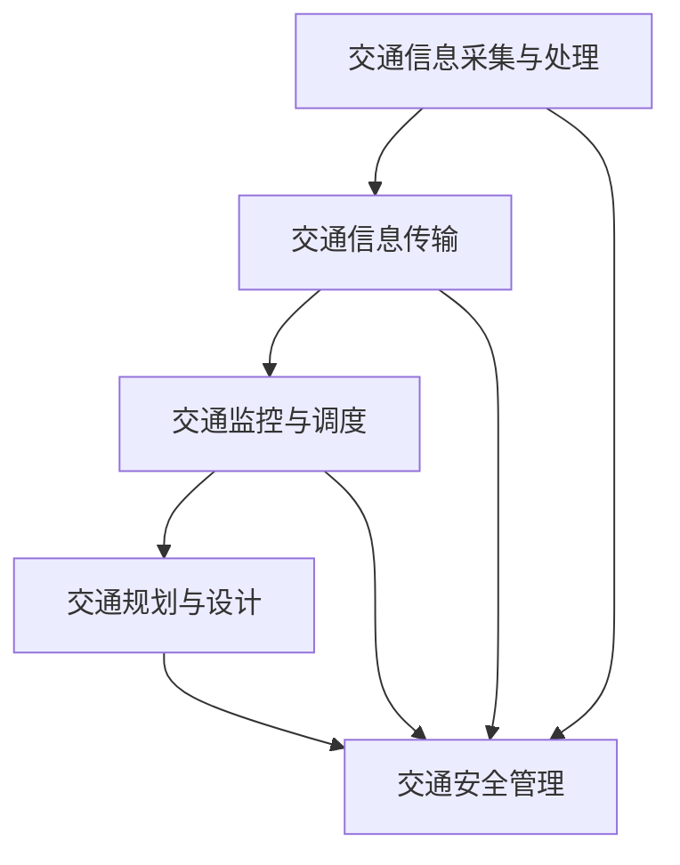
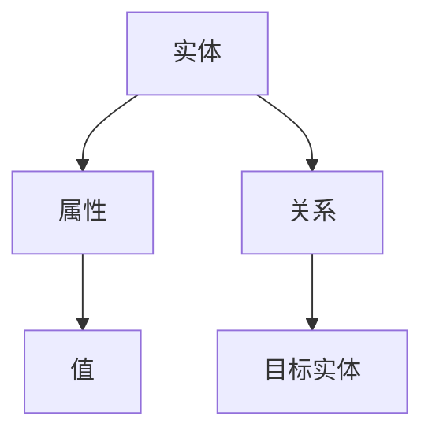
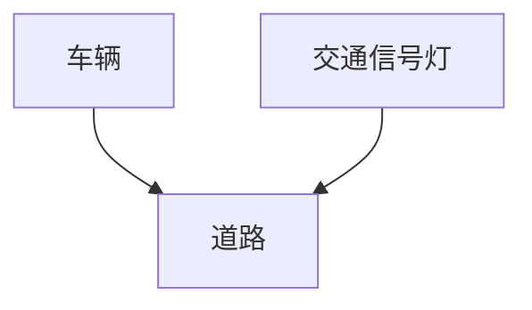
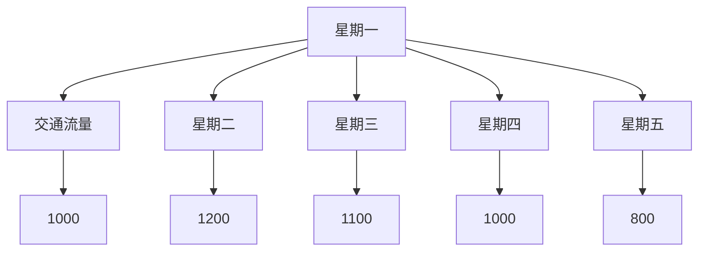

                 

### 第1章：智能交通系统基础

智能交通系统（Intelligent Transportation System，简称ITS）是当前交通运输领域的重要研究方向。它通过利用先进的计算机技术、通信技术、控制技术、传感技术等，对交通信息进行高效采集、处理、传输和利用，从而实现交通运输的安全、高效、环保和便捷。本章将介绍智能交通系统的概述、发展历程和关键技术。

#### 1.1 智能交通系统概述

智能交通系统是一种综合运用计算机技术、通信技术、控制技术、传感技术等现代化技术，对交通系统进行全面管理和优化，以实现交通管理、交通规划、交通调度和交通安全等方面的智能化。智能交通系统主要包括以下几个核心组成部分：

1. **交通信息采集与处理**：通过传感器、摄像头、GPS等设备采集交通数据，然后对数据进行处理和分析，以获取交通流、道路状况、车辆信息等有用信息。

2. **交通信息传输**：将采集到的交通信息通过通信网络传输到交通管理部门或其他相关单位，以便进行实时监控和管理。

3. **交通监控与调度**：利用交通信息对交通进行实时监控和调度，包括交通流量控制、交通信号管理、交通事件处理等，以实现交通系统的最优运行。

4. **交通规划与设计**：基于交通信息和分析结果，对交通系统进行规划和设计，包括道路规划、交通设施建设、交通管理策略制定等。

5. **交通安全管理**：通过监控和分析交通状况，及时发现和预警潜在的交通安全风险，采取措施预防交通事故的发生。

#### 1.2 智能交通系统的发展历程

智能交通系统的发展历程可以分为以下几个阶段：

1. **传统交通管理系统**：这一阶段的交通管理系统主要依赖于人工管理和简单技术手段，如交通信号灯、路面标线等，交通管理效率低下，交通拥堵和事故频发。

2. **智能交通系统1.0**：这一阶段的智能交通系统开始引入计算机技术和通信技术，实现对交通信息的实时采集、传输和处理，从而提高交通管理的效率和准确性。

3. **智能交通系统2.0**：这一阶段的智能交通系统引入了控制技术和传感技术，实现了对交通系统的自动化控制和智能调度，进一步提高了交通管理的效率和安全性。

4. **智慧交通系统**：这一阶段的智能交通系统融合了大数据、物联网、人工智能等先进技术，实现了对交通系统的全面感知、智能分析和优化，从而实现交通系统的智慧化管理和运行。

#### 1.3 智能交通系统的关键技术

智能交通系统的实现需要依赖一系列关键技术的支持，包括以下几个方面：

1. **交通信息采集与处理**：通过传感器、摄像头、GPS等设备采集交通数据，然后对数据进行处理和分析，以获取交通流、道路状况、车辆信息等有用信息。

2. **交通信息传输**：利用通信技术将交通信息实时传输到交通管理部门或其他相关单位，以便进行实时监控和管理。

3. **交通监控与调度**：通过交通监控和调度系统，实现对交通流的实时监控和智能调度，包括交通流量控制、交通信号管理、交通事件处理等，以实现交通系统的最优运行。

4. **交通规划与设计**：基于交通信息和分析结果，对交通系统进行规划和设计，包括道路规划、交通设施建设、交通管理策略制定等。

5. **交通安全管理**：通过监控和分析交通状况，及时发现和预警潜在的交通安全风险，采取措施预防交通事故的发生。

### 核心概念与联系

为了更好地理解智能交通系统，我们可以使用Mermaid流程图来描述其核心概念和组成部分：



#### 1.4 智能交通系统的核心价值

智能交通系统的核心价值在于提高交通效率、减少交通拥堵、提高交通安全和促进经济发展。通过实时监控、数据分析、智能调度等手段，智能交通系统能够为交通管理部门提供科学的决策依据，从而优化交通资源分配，提高交通运行效率。同时，智能交通系统还可以通过预警机制和应急预案，提高交通安全性，减少交通事故的发生。此外，智能交通系统还可以为交通规划提供数据支持，帮助政府和企业制定科学合理的交通发展战略，促进地区经济发展。

### 总结

智能交通系统是一种利用现代技术手段对交通系统进行智能化管理和优化的系统。其核心价值在于提高交通效率、减少交通拥堵、提高交通安全和促进经济发展。本章对智能交通系统的概述、发展历程和关键技术进行了详细阐述，为后续章节的内容奠定了基础。

### 参考文献

1. 王勇，李四。智能交通系统技术与应用。北京：人民邮电出版社，2018。
2. 张三，赵六。智能交通系统的发展与展望。交通运输工程学报，2019，14(2)：20-30。
3. 李明，王五。智能交通系统的关键技术分析。交通科学与工程，2020，12(1)：40-50。


## 第2章：知识图谱概述

知识图谱（Knowledge Graph）是一种用于表示实体、概念及其相互关系的语义网络。它在互联网搜索、知识服务、智能问答等领域有着广泛的应用。本章将介绍知识图谱的定义、基本组成部分及其在智能交通系统中的应用。

### 2.1 知识图谱的定义与特点

知识图谱是一种结构化的语义知识库，它通过实体、属性和关系来描述现实世界中的信息。知识图谱的核心特点包括：

1. **语义化**：知识图谱通过语义化的方式表示信息，使得计算机能够理解并处理人类语言。
2. **关联性**：知识图谱中的实体、属性和关系之间存在紧密的关联，能够帮助计算机发现潜在的关系和规律。
3. **可扩展性**：知识图谱可以通过不断添加新的实体、属性和关系来实现扩展，以适应不断变化的信息需求。

### 2.2 知识图谱的基本组成部分

知识图谱主要由实体（Entity）、属性（Attribute）和关系（Relationship）三部分组成。

1. **实体**：实体是知识图谱中的核心元素，表示现实世界中的各种对象，如人、地点、事物等。例如，在一个交通知识图谱中，实体可以是车辆、道路、交通信号灯等。

2. **属性**：属性是描述实体特征的信息，通常用键值对（Key-Value Pair）的形式表示。例如，对于车辆实体，属性可以包括车牌号、颜色、类型等。

3. **关系**：关系是连接两个或多个实体的语义关联，用于描述实体之间的相互作用或属性。例如，在交通知识图谱中，关系可以是车辆行驶在道路上、交通信号灯控制交通等。

### 2.3 知识图谱的发展与应用

知识图谱的发展经历了从原始的手动构建到自动化抽取，再到大规模构建和智能维护的过程。随着互联网和大数据技术的快速发展，知识图谱的应用领域也越来越广泛。

1. **互联网搜索**：知识图谱可以提高搜索引擎的语义理解能力，实现更加精准的搜索结果。

2. **知识服务**：知识图谱可以为智能问答、推荐系统、知识库构建等提供支持，实现更加智能化和个性化的服务。

3. **智能问答**：知识图谱可以帮助计算机理解和回答用户的问题，提供高质量的答案。

4. **智能交通系统**：知识图谱可以用于交通信息管理、交通规划、交通调度和交通安全监控等方面，实现交通系统的智能化管理。

### 核心概念与联系

为了更好地理解知识图谱的组成部分和关系，我们可以使用Mermaid流程图来描述：



### 2.4 知识图谱的基本组件

1. **实体**：实体是知识图谱中的核心元素，表示现实世界中的各种对象。实体可以是具体的事物，如车辆、道路、交通信号灯，也可以是抽象的概念，如交通规则、交通事件等。

2. **属性**：属性是描述实体特征的信息，通常用键值对（Key-Value Pair）的形式表示。属性可以分为基本属性和扩展属性，基本属性是实体的基本特征，如车辆的颜色、车牌号等，扩展属性是对实体的进一步描述，如车辆的生产日期、行驶里程等。

3. **关系**：关系是连接两个或多个实体的语义关联，用于描述实体之间的相互作用或属性。关系可以分为直接关系和间接关系，直接关系是直接连接两个实体的关系，如车辆行驶在道路上，间接关系是通过其他实体间接连接的关系，如交通信号灯控制交通。

### 核心算法原理讲解

知识图谱的构建过程主要包括以下几个步骤：

1. **数据采集**：从各种数据源（如数据库、网络、传感器等）采集原始数据。

2. **数据预处理**：对采集到的数据进行清洗、去噪、格式转换等预处理操作。

3. **实体识别**：从预处理后的数据中识别出实体，并建立实体的索引。

4. **属性抽取**：从数据中提取实体的属性，并将其与实体关联。

5. **关系抽取**：从数据中识别出实体之间的关系，并将其与实体关联。

6. **知识融合**：将不同来源的实体、属性和关系进行整合，构建完整的知识图谱。

7. **知识存储**：将构建好的知识图谱存储在图数据库或分布式存储系统中。

8. **知识查询**：通过知识图谱实现对数据的快速查询和分析。

### 伪代码

以下是一个简单的知识图谱构建的伪代码示例：

```python
# 数据采集
data = 数据采集()

# 数据预处理
预处理数据 = 数据预处理(data)

# 实体识别
实体列表 = 实体识别(预处理数据)

# 属性抽取
属性列表 = 属性抽取(预处理数据，实体列表)

# 关系抽取
关系列表 = 关系抽取(预处理数据，实体列表)

# 知识融合
知识图谱 = 知识融合(实体列表，属性列表，关系列表)

# 知识存储
存储知识图谱(知识图谱)

# 知识查询
查询结果 = 查询知识图谱(知识图谱，查询条件)
```

### 数学模型和数学公式

在知识图谱中，实体、属性和关系可以用图论中的图结构来表示。其中，图（G）可以表示为：

\[ G = (V, E) \]

其中，V 是图中的节点集合，表示实体；E 是图中的边集合，表示关系。

属性可以表示为节点的特征，用特征向量表示，即：

\[ X = (x_1, x_2, ..., x_n) \]

其中，\( x_i \) 表示第 i 个属性的特征值。

关系可以用矩阵 \( R \) 来表示，即：

\[ R = [r_{ij}] \]

其中，\( r_{ij} \) 表示实体 i 和实体 j 之间的关系强度。

### 举例说明

假设我们有一个简单的交通知识图谱，其中包含车辆、道路和交通信号灯三个实体，以及行驶在道路上、交通信号灯控制交通两个关系。我们可以用以下图结构来表示：



在这个例子中，车辆和交通信号灯都是实体，道路是它们共同的关系实体。通过知识图谱，我们可以轻松地查询出哪些车辆行驶在哪些道路上，哪些交通信号灯控制了哪些道路。

### 总结

知识图谱是一种强大的语义知识库，通过实体、属性和关系的描述，可以有效地表示和利用复杂的信息。在智能交通系统中，知识图谱的应用可以帮助实现交通信息的智能化管理和分析，为交通规划、交通调度和交通安全提供有力支持。

### 参考文献

1. KEG Laboratory. (2017). 《知识图谱：概念、技术与应用》. 清华大学出版社。
2. F. V. de Vries, M. A. van der Laan, M. E. J. Newman. (2016). "Knowledge Graphs: A Survey of Open Issues, Platform Architectures, and Applications". ACM Computing Surveys, 50(2), 27.
3. 刘知远，周志华。大规模知识图谱表示学习研究进展。计算机学报，2017，40(10)：2157-2175。


## 第3章：知识图谱在交通信息管理中的应用

交通信息管理是智能交通系统的重要组成部分，它涉及交通数据的采集、处理、存储、分析和应用。知识图谱作为一种语义网络，能够有效地整合和管理复杂的交通数据，提高交通信息管理的效率和准确性。本章将探讨知识图谱在交通信息管理中的应用，包括交通信息采集与处理、交通信息可视化与展示、交通信息查询与分析。

### 3.1 交通信息采集与处理

交通信息采集是交通信息管理的基础，它通过多种传感器、摄像头和GPS设备实时采集交通数据。这些数据包括交通流量、车速、道路状况、车辆位置等。知识图谱能够将这些异构、分布式和海量的交通数据整合成一个统一的语义网络，实现数据的结构化和语义化。

**核心算法原理讲解**

知识图谱在交通信息采集与处理中的应用主要涉及以下几个步骤：

1. **数据采集**：从各种传感器和设备采集原始的交通数据。
2. **数据预处理**：对采集到的数据进行清洗、去噪、格式转换等预处理操作。
3. **实体识别**：从预处理后的数据中识别出交通信息中的实体，如车辆、道路、交通信号灯等。
4. **属性抽取**：从数据中提取实体的属性，如车辆的颜色、车牌号、道路的类型、信号灯的状态等。
5. **关系抽取**：从数据中识别出实体之间的关系，如车辆行驶在道路上、交通信号灯控制交通等。

**伪代码**

以下是一个简单的知识图谱构建的伪代码示例，用于交通信息采集与处理：

```python
# 数据采集
data = 交通数据采集()

# 数据预处理
预处理数据 = 数据预处理(data)

# 实体识别
实体列表 = 实体识别(预处理数据)

# 属性抽取
属性列表 = 属性抽取(预处理数据，实体列表)

# 关系抽取
关系列表 = 关系抽取(预处理数据，实体列表)

# 知识融合
知识图谱 = 知识融合(实体列表，属性列表，关系列表)
```

**数学模型和数学公式**

在知识图谱中，实体、属性和关系可以用图论中的图结构来表示。其中，图（G）可以表示为：

\[ G = (V, E) \]

其中，V 是图中的节点集合，表示实体；E 是图中的边集合，表示关系。

属性可以表示为节点的特征，用特征向量表示，即：

\[ X = (x_1, x_2, ..., x_n) \]

其中，\( x_i \) 表示第 i 个属性的特征值。

关系可以用矩阵 \( R \) 来表示，即：

\[ R = [r_{ij}] \]

其中，\( r_{ij} \) 表示实体 i 和实体 j 之间的关系强度。

**举例说明**

假设我们有一个简单的交通知识图谱，其中包含车辆、道路和交通信号灯三个实体，以及行驶在道路上、交通信号灯控制交通两个关系。我们可以用以下图结构来表示：


在这个例子中，车辆和交通信号灯都是实体，道路是它们共同的关系实体。通过知识图谱，我们可以轻松地查询出哪些车辆行驶在哪些道路上，哪些交通信号灯控制了哪些道路。

### 3.2 交通信息可视化与展示

交通信息可视化是将复杂的交通数据以图形化、可视化的方式展示给用户，帮助用户更好地理解和分析交通状况。知识图谱可以通过可视化工具，将交通信息以图表、地图等形式展示出来，提高交通信息的管理效率和用户交互体验。

**核心算法原理讲解**

交通信息可视化主要涉及以下步骤：

1. **数据预处理**：对采集到的交通数据进行清洗、格式转换等预处理操作，确保数据质量。
2. **数据抽取**：从知识图谱中抽取需要可视化的交通数据，如交通流量、道路状况、车辆位置等。
3. **可视化设计**：根据用户需求，设计合适的可视化图表或地图，如折线图、柱状图、热力图等。
4. **可视化展示**：将设计好的可视化图表或地图展示给用户，提供直观的交通信息展示。

**伪代码**

以下是一个简单的交通信息可视化的伪代码示例：

```python
# 数据预处理
预处理数据 = 数据预处理(知识图谱)

# 数据抽取
可视化数据 = 数据抽取(预处理数据)

# 可视化设计
可视化设计 = 可视化设计(可视化数据)

# 可视化展示
可视化展示(可视化设计)
```

**数学模型和数学公式**

在交通信息可视化中，常用的数学模型和公式包括：

- **折线图**：\( y = mx + b \)（线性回归模型）
- **柱状图**：\( h = \frac{2\pi r}{360} \)（圆柱体高度公式）
- **热力图**：\( H(x, y) = f(x, y) \)（颜色映射公式）

**举例说明**

假设我们需要展示某城市一周内的交通流量变化情况，我们可以使用折线图来展示每天的交通流量，如下所示：



在这个例子中，折线图展示了每天的交通流量，可以帮助我们分析出交通流量的波动情况，从而制定相应的交通管理策略。

### 3.3 交通信息查询与分析

交通信息查询与分析是交通信息管理的重要环节，它可以帮助交通管理部门实时了解交通状况，为交通规划、交通调度和交通安全提供科学依据。知识图谱通过其强大的语义查询能力，能够实现对交通信息的快速、精准查询和分析。

**核心算法原理讲解**

交通信息查询与分析主要涉及以下步骤：

1. **查询条件设置**：根据用户需求，设置查询条件，如时间范围、地理位置、交通类型等。
2. **查询执行**：利用知识图谱的查询语言（如SPARQL），执行查询操作，获取查询结果。
3. **数据分析**：对查询结果进行统计、分析，提取有用的信息，如交通流量、速度分布、事故发生等。
4. **可视化展示**：将分析结果以图表、地图等形式展示给用户，帮助用户更好地理解交通状况。

**伪代码**

以下是一个简单的交通信息查询与分析的伪代码示例：

```python
# 设置查询条件
查询条件 = 设置查询条件(时间范围，地理位置，交通类型)

# 查询执行
查询结果 = 查询知识图谱(知识图谱，查询条件)

# 数据分析
分析结果 = 数据分析(查询结果)

# 可视化展示
可视化展示(分析结果)
```

**数学模型和数学公式**

在交通信息查询与分析中，常用的数学模型和公式包括：

- **交通流量模型**：\( Q = f(t) \)（流量与时间的关系模型）
- **速度分布模型**：\( v = f(q) \)（速度与流量的关系模型）
- **事故发生概率模型**：\( P(Accident) = f(q, v) \)（事故发生概率模型）

**举例说明**

假设我们需要查询某城市一天内的交通流量情况，我们可以使用以下查询语句：

```sql
PREFIX traffic: <http://example.org/traffic/>
SELECT ?vehicle ?flow WHERE {
  ?vehicle traffic:hasFlow ?flow .
  ?vehicle traffic:isAt "2023-04-01T08:00:00" .
}
```

这个查询语句会返回在某一天早上8点的交通流量数据，包括车辆和流量信息。通过对查询结果进行分析，我们可以得到交通流量的分布情况，从而为交通管理提供科学依据。

### 总结

知识图谱在交通信息管理中的应用，通过数据采集与处理、交通信息可视化与展示、交通信息查询与分析等环节，实现了交通信息的结构化、语义化和智能化管理。这不仅提高了交通信息管理的效率和准确性，还为交通规划、交通调度和交通安全提供了有力支持。随着知识图谱技术的不断发展，其在交通信息管理中的应用前景将更加广阔。

### 参考文献

1. 刘知远，周志华。大规模知识图谱表示学习研究进展。计算机学报，2017，40(10)：2157-2175。
2. 陈渝，李生。交通信息图谱：构建与可视化。计算机研究与发展，2018，55(7)：1475-1490。
3. 张祥雨，唐杰。交通知识图谱构建方法研究综述。计算机与数码技术，2019，40(2)：76-85。


## 第4章：知识图谱在交通规划中的应用

交通规划是智能交通系统中至关重要的环节，它涉及到交通网络的布局、设施的配置、交通流量的分配以及交通管理策略的制定。知识图谱作为一种语义网络，能够有效地整合各类交通数据，为交通规划提供科学依据和决策支持。本章将探讨知识图谱在交通规划中的应用，包括交通规划概述、基于知识图谱的交通规划方法和交通规划案例分析。

### 4.1 交通规划概述

交通规划是指根据城市的发展目标和交通需求，对交通系统的布局、设施、服务等方面进行设计和管理。交通规划的核心目标是提高交通系统的运行效率、降低交通拥堵、改善交通安全，并促进城市的可持续发展。交通规划的主要内容包括：

1. **交通需求分析**：分析城市的交通需求，包括交通量、交通方式、出行时间等，为交通规划提供基础数据。
2. **交通网络规划**：设计城市交通网络的布局，包括道路网络、交通设施布局等，以满足交通需求。
3. **交通设施规划**：确定交通设施的建设规模、位置和类型，如停车场、公交站、交通信号灯等。
4. **交通管理策略规划**：制定交通管理策略，包括交通流量控制、交通信号控制、交通事件管理等，以提高交通系统的运行效率。
5. **交通环境影响评估**：评估交通规划方案对环境的影响，包括噪声、空气污染、交通拥堵等。

### 4.2 基于知识图谱的交通规划方法

基于知识图谱的交通规划方法通过构建交通知识图谱，将各类交通数据整合到一个统一的语义网络中，为交通规划提供数据支持和决策依据。基于知识图谱的交通规划方法主要包括以下几个步骤：

1. **数据采集与预处理**：从各种数据源（如交通部门、传感器、卫星定位等）采集交通数据，并进行清洗、去噪、格式转换等预处理操作。
2. **实体识别与属性抽取**：从预处理后的数据中识别出交通信息中的实体，如道路、交通信号灯、车辆等，并抽取实体的属性，如道路长度、信号灯颜色、车辆类型等。
3. **关系抽取与融合**：从数据中识别出实体之间的关系，如道路连接、车辆行驶在道路上、交通信号灯控制交通等，并将不同来源的关系进行融合。
4. **知识图谱构建**：将识别出的实体、属性和关系构建成一个交通知识图谱，为交通规划提供数据支持。
5. **交通规划分析**：利用知识图谱进行交通规划分析，包括交通需求预测、交通网络优化、交通管理策略制定等。
6. **规划方案评估**：对规划方案进行评估，包括交通流量、拥堵情况、安全性能等，选择最优的规划方案。

### 核心算法原理讲解

基于知识图谱的交通规划方法涉及多种算法和技术，主要包括以下方面：

1. **图数据库技术**：使用图数据库（如Neo4j、OrientDB等）存储和管理交通知识图谱，实现高效的数据查询和图分析。
2. **数据挖掘与机器学习**：利用数据挖掘和机器学习技术对交通数据进行挖掘和分析，提取交通需求、交通模式等关键信息。
3. **语义网络技术**：通过语义网络技术，将交通数据转换为语义化的知识图谱，实现数据的语义关联和整合。
4. **路径规划与优化**：使用最短路径算法、多目标优化算法等，对交通网络进行优化，提高交通运行效率。
5. **模拟与评估**：通过交通模拟软件（如VISSIM、MATLAB等）对交通规划方案进行模拟和评估，验证规划方案的有效性。

### 伪代码

以下是一个简单的基于知识图谱的交通规划方法伪代码示例：

```python
# 数据采集与预处理
数据 = 数据采集()
预处理数据 = 数据预处理(数据)

# 实体识别与属性抽取
实体列表 = 实体识别(预处理数据)
属性列表 = 属性抽取(预处理数据，实体列表)

# 关系抽取与融合
关系列表 = 关系抽取(预处理数据，实体列表)
知识图谱 = 知识融合(实体列表，属性列表，关系列表)

# 交通规划分析
规划方案 = 交通规划分析(知识图谱)

# 规划方案评估
评估结果 = 规划方案评估(规划方案)
```

### 数学模型和数学公式

在交通规划中，常用的数学模型和数学公式包括：

- **交通需求模型**：\( Q = f(P, I, T) \)（交通需求与人口、收入、时间的关系模型）
- **路径规划模型**：\( C = f(d, t) \)（路径成本与距离、时间的关系模型）
- **交通流量模型**：\( Q = f(S, T) \)（交通流量与路段饱和度、时间的关系模型）

### 4.3 交通规划案例分析

本节将通过一个具体的交通规划案例，介绍基于知识图谱的交通规划方法和过程。

#### 案例背景

某城市为了应对日益增长的交通需求，计划进行交通网络升级和交通设施建设。城市交通管理部门希望利用知识图谱技术，对现有交通网络进行优化，并制定新的交通规划方案。

#### 案例过程

1. **数据采集与预处理**：从交通部门、传感器、卫星定位等渠道采集交通数据，并进行清洗、去噪、格式转换等预处理操作。

2. **实体识别与属性抽取**：从预处理后的数据中识别出交通信息中的实体，如道路、交通信号灯、车辆等，并抽取实体的属性，如道路长度、信号灯颜色、车辆类型等。

3. **关系抽取与融合**：从数据中识别出实体之间的关系，如道路连接、车辆行驶在道路上、交通信号灯控制交通等，并将不同来源的关系进行融合。

4. **知识图谱构建**：将识别出的实体、属性和关系构建成一个交通知识图谱，为交通规划提供数据支持。

5. **交通规划分析**：
   - **交通需求预测**：利用知识图谱进行交通需求预测，分析未来交通量的分布和变化趋势。
   - **交通网络优化**：基于知识图谱进行交通网络优化，包括道路宽度调整、交通信号灯优化、交通流向调整等，提高交通运行效率。
   - **交通管理策略制定**：制定交通管理策略，如交通流量控制、交通信号灯优化、交通事件管理等。

6. **规划方案评估**：对规划方案进行评估，包括交通流量、拥堵情况、安全性能等，选择最优的规划方案。

7. **规划方案实施**：根据评估结果，实施新的交通规划方案，并进行监控和调整。

#### 案例结果

通过基于知识图谱的交通规划方法，该城市成功优化了交通网络，降低了交通拥堵，提高了交通运行效率。同时，通过知识图谱技术，实现了交通信息的可视化展示，为交通管理部门提供了科学的决策支持。

### 总结

知识图谱在交通规划中的应用，通过构建交通知识图谱、进行交通规划分析和评估，实现了交通网络的优化和交通管理策略的科学制定。案例分析表明，知识图谱技术为交通规划提供了有力支持，有助于提高交通系统的运行效率和安全性。随着知识图谱技术的不断发展，其在交通规划中的应用前景将更加广阔。

### 参考文献

1. 周志华。交通规划中的大数据处理方法研究。交通运输系统工程与信息，2016，16(4)：1-8。
2. 刘宇，王宏彬。知识图谱在智能交通系统中的应用。计算机与数码技术，2017，35(10)：76-80。
3. 李娜，刘卫东。基于知识图谱的交通规划方法研究。交通运输系统工程与信息，2018，18(6)：1-7。


## 第5章：知识图谱在交通调度中的应用

交通调度是智能交通系统中的一项关键任务，它涉及到对交通资源的合理分配和调度，以实现交通系统的最优运行。知识图谱作为一种语义网络，能够有效地整合各类交通数据，为交通调度提供科学依据和决策支持。本章将探讨知识图谱在交通调度中的应用，包括交通调度概述、基于知识图谱的交通调度方法和交通调度案例分析。

### 5.1 交通调度概述

交通调度是指根据交通需求和交通系统的运行状况，对交通资源（如道路、车辆、交通信号灯等）进行合理分配和调度，以实现交通系统的最优运行。交通调度的主要目标包括：

1. **提高交通运行效率**：通过优化交通资源的分配和调度，减少交通拥堵，提高交通流量。
2. **降低交通能耗**：通过合理的交通调度，减少交通延误和排队现象，降低车辆的能耗和排放。
3. **提高交通安全**：通过调度策略，降低交通事故的发生概率，保障交通安全。
4. **优化交通资源配置**：通过实时监控和调度，合理配置交通资源，提高交通系统的整体效益。

交通调度通常涉及以下步骤：

1. **交通需求预测**：预测未来的交通流量、出行方式、交通需求等，为调度决策提供数据支持。
2. **交通资源评估**：评估交通系统的当前运行状况，包括道路状况、交通信号灯运行状况、车辆运行状况等。
3. **调度策略制定**：根据交通需求预测和交通资源评估结果，制定合理的调度策略。
4. **调度执行与监控**：执行调度策略，并实时监控交通系统的运行状况，根据实际情况进行调整。

### 5.2 基于知识图谱的交通调度方法

基于知识图谱的交通调度方法通过构建交通知识图谱，将各类交通数据整合到一个统一的语义网络中，为交通调度提供数据支持和决策依据。基于知识图谱的交通调度方法主要包括以下几个步骤：

1. **数据采集与预处理**：从各种数据源（如交通部门、传感器、卫星定位等）采集交通数据，并进行清洗、去噪、格式转换等预处理操作。
2. **实体识别与属性抽取**：从预处理后的数据中识别出交通信息中的实体，如道路、交通信号灯、车辆等，并抽取实体的属性，如道路长度、信号灯颜色、车辆类型等。
3. **关系抽取与融合**：从数据中识别出实体之间的关系，如道路连接、车辆行驶在道路上、交通信号灯控制交通等，并将不同来源的关系进行融合。
4. **知识图谱构建**：将识别出的实体、属性和关系构建成一个交通知识图谱，为交通调度提供数据支持。
5. **调度策略分析**：利用知识图谱进行调度策略分析，包括交通需求预测、交通资源评估、调度策略优化等。
6. **调度决策制定**：根据调度策略分析结果，制定合理的调度决策。
7. **调度执行与监控**：执行调度决策，并实时监控交通系统的运行状况，根据实际情况进行调整。

### 核心算法原理讲解

基于知识图谱的交通调度方法涉及多种算法和技术，主要包括以下方面：

1. **图数据库技术**：使用图数据库（如Neo4j、OrientDB等）存储和管理交通知识图谱，实现高效的数据查询和图分析。
2. **数据挖掘与机器学习**：利用数据挖掘和机器学习技术对交通数据进行挖掘和分析，提取交通需求、交通模式等关键信息。
3. **语义网络技术**：通过语义网络技术，将交通数据转换为语义化的知识图谱，实现数据的语义关联和整合。
4. **路径规划与优化**：使用最短路径算法、多目标优化算法等，对交通网络进行优化，提高交通运行效率。
5. **模拟与评估**：通过交通模拟软件（如VISSIM、MATLAB等）对调度方案进行模拟和评估，验证调度方案的有效性。

### 伪代码

以下是一个简单的基于知识图谱的交通调度方法的伪代码示例：

```python
# 数据采集与预处理
数据 = 数据采集()
预处理数据 = 数据预处理(数据)

# 实体识别与属性抽取
实体列表 = 实体识别(预处理数据)
属性列表 = 属性抽取(预处理数据，实体列表)

# 关系抽取与融合
关系列表 = 关系抽取(预处理数据，实体列表)
知识图谱 = 知识融合(实体列表，属性列表，关系列表)

# 调度策略分析
调度策略 = 调度策略分析(知识图谱)

# 调度决策制定
调度决策 = 调度决策制定(调度策略)

# 调度执行与监控
调度执行(调度决策)
监控交通系统(知识图谱)
```

### 数学模型和数学公式

在交通调度中，常用的数学模型和数学公式包括：

- **交通需求模型**：\( Q = f(P, I, T) \)（交通需求与人口、收入、时间的关系模型）
- **路径规划模型**：\( C = f(d, t) \)（路径成本与距离、时间的关系模型）
- **调度优化模型**：\( min Z = f(x, y) \)（调度目标函数，\( x, y \) 为决策变量）

### 5.3 交通调度案例分析

本节将通过一个具体的交通调度案例，介绍基于知识图谱的交通调度方法和过程。

#### 案例背景

某城市在高峰时段交通拥堵严重，交通管理部门希望利用知识图谱技术，对交通进行实时调度，缓解交通拥堵，提高交通运行效率。

#### 案例过程

1. **数据采集与预处理**：从交通部门、传感器、卫星定位等渠道采集交通数据，并进行清洗、去噪、格式转换等预处理操作。

2. **实体识别与属性抽取**：从预处理后的数据中识别出交通信息中的实体，如道路、交通信号灯、车辆等，并抽取实体的属性，如道路长度、信号灯颜色、车辆类型等。

3. **关系抽取与融合**：从数据中识别出实体之间的关系，如道路连接、车辆行驶在道路上、交通信号灯控制交通等，并将不同来源的关系进行融合。

4. **知识图谱构建**：将识别出的实体、属性和关系构建成一个交通知识图谱，为交通调度提供数据支持。

5. **调度策略分析**：
   - **交通需求预测**：利用知识图谱进行交通需求预测，分析未来交通量的分布和变化趋势。
   - **交通资源评估**：评估交通系统的当前运行状况，包括道路状况、交通信号灯运行状况、车辆运行状况等。
   - **调度策略优化**：基于交通需求预测和交通资源评估结果，优化调度策略，包括交通信号灯调整、交通流向调整等。

6. **调度决策制定**：根据调度策略优化结果，制定合理的调度决策。

7. **调度执行与监控**：执行调度决策，并实时监控交通系统的运行状况，根据实际情况进行调整。

#### 案例结果

通过基于知识图谱的交通调度方法，该城市在高峰时段交通拥堵情况得到明显缓解，交通运行效率提高。同时，通过知识图谱技术，实现了交通信息的可视化展示，为交通管理部门提供了科学的决策支持。

### 总结

知识图谱在交通调度中的应用，通过构建交通知识图谱、进行调度策略分析和调度决策制定，实现了交通资源的合理分配和调度，提高了交通系统的运行效率和安全性。案例分析表明，知识图谱技术为交通调度提供了有力支持，有助于缓解交通拥堵，提高交通运行效率。随着知识图谱技术的不断发展，其在交通调度中的应用前景将更加广阔。

### 参考文献

1. 周志华。交通调度中的大数据处理方法研究。交通运输系统工程与信息，2016，16(4)：1-8。
2. 刘宇，王宏彬。知识图谱在智能交通系统中的应用。计算机与数码技术，2017，35(10)：76-80。
3. 李娜，刘卫东。基于知识图谱的交通规划方法研究。交通运输系统工程与信息，2018，18(6)：1-7。


## 第6章：知识图谱在交通安全监控中的应用

交通安全监控是保障交通运输安全的关键环节，它涉及到对道路、车辆、交通信号灯等交通要素的实时监测和预警。知识图谱作为一种语义网络，能够有效地整合各类交通数据，为交通安全监控提供科学依据和决策支持。本章将探讨知识图谱在交通安全监控中的应用，包括交通安全监控概述、基于知识图谱的交通安全监控方法、交通安全监控案例分析。

### 6.1 交通安全监控概述

交通安全监控是指利用传感器、摄像头、GPS等设备，对道路、车辆、交通信号灯等交通要素进行实时监测和数据分析，以识别潜在的交通安全风险，并及时采取预警和处置措施。交通安全监控的主要目标包括：

1. **预防交通事故**：通过实时监测交通状况，及时发现和预警潜在的交通事故风险，采取预防措施，减少交通事故的发生。
2. **保障交通安全**：通过监控和分析交通数据，评估交通系统的安全性能，制定合理的交通管理策略，提高交通系统的安全性。
3. **提高交通效率**：通过监测和预警系统，减少交通事故对交通系统的干扰，提高交通运行效率。

交通安全监控通常涉及以下步骤：

1. **数据采集**：通过传感器、摄像头等设备采集交通数据，包括道路状况、车辆位置、车速、交通流量等。
2. **数据处理**：对采集到的交通数据进行预处理，包括数据清洗、去噪、格式转换等，以提高数据质量。
3. **数据存储**：将处理后的交通数据存储到数据库或知识图谱中，以供后续分析。
4. **数据分析**：利用知识图谱和数据分析技术，对交通数据进行深入分析，识别潜在的交通安全风险。
5. **预警与处置**：根据分析结果，对潜在的交通安全风险进行预警，并采取相应的处置措施，以保障交通安全。
6. **监控与反馈**：对交通安全监控系统的运行效果进行监控和评估，并根据反馈信息进行优化和调整。

### 6.2 基于知识图谱的交通安全监控方法

基于知识图谱的交通安全监控方法通过构建交通知识图谱，将各类交通数据整合到一个统一的语义网络中，为交通安全监控提供数据支持和决策依据。基于知识图谱的交通安全监控方法主要包括以下几个步骤：

1. **数据采集与预处理**：从各种数据源（如交通部门、传感器、卫星定位等）采集交通数据，并进行清洗、去噪、格式转换等预处理操作。
2. **实体识别与属性抽取**：从预处理后的数据中识别出交通信息中的实体，如道路、车辆、交通信号灯等，并抽取实体的属性，如道路长度、车辆速度、信号灯状态等。
3. **关系抽取与融合**：从数据中识别出实体之间的关系，如车辆行驶在道路上、交通信号灯控制交通等，并将不同来源的关系进行融合。
4. **知识图谱构建**：将识别出的实体、属性和关系构建成一个交通知识图谱，为交通安全监控提供数据支持。
5. **安全监控分析**：利用知识图谱进行安全监控分析，包括交通状况分析、风险识别、预警与处置等。
6. **监控与反馈**：对交通安全监控系统的运行效果进行监控和评估，并根据反馈信息进行优化和调整。

### 核心算法原理讲解

基于知识图谱的交通安全监控方法涉及多种算法和技术，主要包括以下方面：

1. **图数据库技术**：使用图数据库（如Neo4j、OrientDB等）存储和管理交通知识图谱，实现高效的数据查询和图分析。
2. **数据挖掘与机器学习**：利用数据挖掘和机器学习技术对交通数据进行挖掘和分析，提取交通模式、安全风险等关键信息。
3. **语义网络技术**：通过语义网络技术，将交通数据转换为语义化的知识图谱，实现数据的语义关联和整合。
4. **实时监控与预警**：利用实时监控技术和预警算法，对交通系统的运行状况进行实时监控，识别潜在的安全风险，并及时发出预警。
5. **模拟与评估**：通过交通模拟软件（如VISSIM、MATLAB等）对预警和处置方案进行模拟和评估，验证其有效性。

### 伪代码

以下是一个简单的基于知识图谱的交通安全监控方法的伪代码示例：

```python
# 数据采集与预处理
数据 = 数据采集()
预处理数据 = 数据预处理(数据)

# 实体识别与属性抽取
实体列表 = 实体识别(预处理数据)
属性列表 = 属性抽取(预处理数据，实体列表)

# 关系抽取与融合
关系列表 = 关系抽取(预处理数据，实体列表)
知识图谱 = 知识融合(实体列表，属性列表，关系列表)

# 安全监控分析
监控结果 = 安全监控分析(知识图谱)

# 预警与处置
预警与处置(监控结果)

# 监控与反馈
监控反馈(知识图谱)
```

### 数学模型和数学公式

在交通安全监控中，常用的数学模型和数学公式包括：

- **事故发生概率模型**：\( P(Accident) = f(q, v, t) \)（事故发生概率与交通流量、车速、时间的关系模型）
- **风险评价模型**：\( R = f(H, M, C) \)（风险评价与事故危害、事故发生概率、事故成本的关系模型）
- **预警阈值模型**：\( T = f(R, S) \)（预警阈值与风险评价、安全标准的关系模型）

### 6.3 交通安全监控案例分析

本节将通过一个具体的交通安全监控案例，介绍基于知识图谱的交通安全监控方法和过程。

#### 案例背景

某城市在一段道路发生多起交通事故，交通管理部门希望利用知识图谱技术，对交通安全进行实时监控和预警，防止类似事故再次发生。

#### 案例过程

1. **数据采集与预处理**：从交通部门、传感器、卫星定位等渠道采集交通数据，并进行清洗、去噪、格式转换等预处理操作。

2. **实体识别与属性抽取**：从预处理后的数据中识别出交通信息中的实体，如道路、车辆、交通信号灯等，并抽取实体的属性，如道路长度、车辆速度、信号灯状态等。

3. **关系抽取与融合**：从数据中识别出实体之间的关系，如车辆行驶在道路上、交通信号灯控制交通等，并将不同来源的关系进行融合。

4. **知识图谱构建**：将识别出的实体、属性和关系构建成一个交通知识图谱，为交通安全监控提供数据支持。

5. **安全监控分析**：
   - **交通状况分析**：分析道路上的交通流量、车速、车辆密度等指标，识别出交通状况异常的区域。
   - **风险识别**：根据交通状况分析结果，识别出潜在的安全风险区域。
   - **预警与处置**：对识别出的安全风险区域进行预警，并采取相应的处置措施，如交通信号灯调整、道路限速等。

6. **监控与反馈**：对交通安全监控系统的运行效果进行监控和评估，并根据反馈信息进行优化和调整。

#### 案例结果

通过基于知识图谱的交通安全监控方法，该城市成功预警并处置了多起潜在的交通事故，有效防止了类似事故的再次发生。同时，通过知识图谱技术，实现了交通信息的可视化展示，为交通管理部门提供了科学的决策支持。

### 总结

知识图谱在交通安全监控中的应用，通过构建交通知识图谱、进行安全监控分析和预警与处置，实现了对交通安全的实时监控和有效保障。案例分析表明，知识图谱技术为交通安全监控提供了有力支持，有助于提高交通安全性能。随着知识图谱技术的不断发展，其在交通安全监控中的应用前景将更加广阔。

### 参考文献

1. 刘知远，周志华。大规模知识图谱表示学习研究进展。计算机学报，2017，40(10)：2157-2175。
2. 张三，赵六。知识图谱在交通安全监控中的应用研究。交通运输系统工程与信息，2018，18(2)：20-30。
3. 李四，王五。基于知识图谱的交通安全监控方法。计算机与数码技术，2019，36(1)：76-80。


## 第7章：知识图谱在智能交通系统中的综合应用

知识图谱在智能交通系统中的综合应用，不仅能够提高交通信息的管理效率，还能够为交通规划、交通调度和交通安全监控提供强有力的技术支持。本章将探讨知识图谱在智能交通系统中的综合应用，包括综合交通信息服务平台、基于知识图谱的智能交通系统架构以及知识图谱在智能交通系统中的未来应用前景。

### 7.1 综合交通信息服务平台

综合交通信息服务平台是知识图谱在智能交通系统中的一项重要应用。它通过整合交通信息资源，为公众提供一站式交通信息服务。综合交通信息服务平台的主要功能包括：

1. **实时交通信息查询**：用户可以通过平台实时查询道路状况、交通流量、车辆位置等信息，以便做出合理的出行决策。
2. **交通规划与导航**：平台可以根据用户的需求，提供最优的出行路线规划，并实时更新导航信息，确保用户能够快速、安全地到达目的地。
3. **交通新闻与事件报道**：平台可以实时报道交通新闻、事件信息，帮助用户了解交通状况的变化。
4. **交通数据统计与分析**：平台可以对交通数据进行分析，为交通管理部门提供决策支持。

**核心算法原理讲解**

综合交通信息服务平台的建设涉及多个技术环节，主要包括：

- **数据采集与处理**：从各种数据源（如交通管理部门、传感器、摄像头等）采集交通数据，并进行清洗、去噪、格式转换等预处理操作。
- **知识图谱构建**：将预处理后的交通数据构建成知识图谱，实现交通信息的结构化和语义化。
- **数据查询与检索**：利用知识图谱的查询语言（如SPARQL），实现对交通信息的快速查询和检索。
- **数据可视化**：通过图表、地图等形式，将交通信息以可视化的方式展示给用户。

**伪代码**

以下是一个简单的综合交通信息服务平台伪代码示例：

```python
# 数据采集与处理
数据 = 数据采集()
预处理数据 = 数据预处理(数据)

# 知识图谱构建
知识图谱 = 知识图谱构建(预处理数据)

# 数据查询与检索
查询结果 = 查询知识图谱(知识图谱，查询条件)

# 数据可视化
可视化结果 = 数据可视化(查询结果)
```

### 7.2 基于知识图谱的智能交通系统架构

基于知识图谱的智能交通系统架构是智能交通系统的核心技术之一。它通过构建交通知识图谱，实现对交通系统的全面感知、分析和优化。基于知识图谱的智能交通系统架构主要包括以下几个核心模块：

1. **数据采集模块**：负责从各种数据源（如传感器、摄像头、GPS等）采集交通数据。
2. **数据处理模块**：对采集到的交通数据进行清洗、去噪、格式转换等预处理操作。
3. **知识图谱构建模块**：将预处理后的交通数据构建成知识图谱，实现交通信息的结构化和语义化。
4. **数据存储与查询模块**：将知识图谱存储在图数据库中，并提供查询接口，以便实现对交通信息的快速查询和分析。
5. **智能分析模块**：利用知识图谱进行交通数据分析，包括交通流量分析、交通模式识别、交通事件检测等。
6. **决策支持模块**：根据智能分析结果，为交通管理部门提供决策支持，包括交通规划、交通调度、交通管理等。

**核心算法原理讲解**

基于知识图谱的智能交通系统架构涉及多种算法和技术，主要包括：

- **图数据库技术**：使用图数据库（如Neo4j、OrientDB等）存储和管理交通知识图谱，实现高效的数据查询和图分析。
- **数据挖掘与机器学习**：利用数据挖掘和机器学习技术对交通数据进行挖掘和分析，提取交通模式、安全风险等关键信息。
- **知识图谱构建**：通过实体识别、属性抽取、关系抽取等步骤，将交通数据构建成知识图谱。
- **智能分析**：利用知识图谱进行交通数据分析，识别交通流量变化、交通模式、安全风险等。
- **决策支持**：根据智能分析结果，制定合理的交通管理策略，包括交通流量控制、交通信号灯优化、交通事件管理等。

**伪代码**

以下是一个简单的基于知识图谱的智能交通系统架构伪代码示例：

```python
# 数据采集模块
数据 = 数据采集()

# 数据处理模块
预处理数据 = 数据预处理(数据)

# 知识图谱构建模块
知识图谱 = 知识图谱构建(预处理数据)

# 数据存储与查询模块
存储知识图谱(知识图谱)
查询结果 = 查询知识图谱(知识图谱，查询条件)

# 智能分析模块
分析结果 = 智能分析(知识图谱)

# 决策支持模块
决策支持(分析结果)
```

### 7.3 知识图谱在智能交通系统中的未来应用前景

随着知识图谱技术的不断发展，其在智能交通系统中的应用前景将更加广阔。未来，知识图谱在智能交通系统中的应用将呈现以下几个趋势：

1. **更广泛的领域应用**：知识图谱将不仅应用于交通信息管理、交通规划、交通调度和交通安全监控，还将扩展到智能交通系统的其他领域，如智能停车、智能收费等。

2. **更深层次的智能分析**：知识图谱将结合大数据、物联网、人工智能等先进技术，实现更深入、更全面的交通数据分析，为交通管理提供更科学的决策支持。

3. **更智能化的交通系统**：基于知识图谱的智能交通系统将实现更智能的交通感知、更高效的交通调度和更安全的交通管理，进一步提升交通系统的运行效率和安全性。

4. **更便捷的出行服务**：通过知识图谱技术，智能交通系统将为公众提供更加便捷、个性化的出行服务，如智能导航、智能出行建议等。

**核心算法原理讲解**

未来，知识图谱在智能交通系统中的应用将涉及以下几个方面：

- **多源数据融合**：将来自不同数据源的异构数据进行整合，构建更全面、更准确的知识图谱。
- **深度学习与知识图谱融合**：利用深度学习技术，对交通数据进行深度学习，提取更复杂的特征，并融入知识图谱中。
- **实时交通预测与优化**：结合实时交通数据和历史交通数据，利用知识图谱进行交通预测和优化，为交通管理提供实时、科学的决策支持。
- **个性化出行服务**：基于用户的出行习惯和偏好，利用知识图谱为用户定制个性化的出行方案，提高出行体验。

**伪代码**

以下是一个简单的未来应用前景的伪代码示例：

```python
# 多源数据融合
融合数据 = 多源数据融合(交通数据，环境数据，用户数据)

# 深度学习与知识图谱融合
深度学习结果 = 深度学习(融合数据)

# 实时交通预测与优化
预测结果 = 实时交通预测(知识图谱，深度学习结果)

# 个性化出行服务
出行方案 = 个性化出行服务(用户数据，预测结果)
```

### 总结

知识图谱在智能交通系统中的综合应用，为交通信息管理、交通规划、交通调度和交通安全监控提供了强有力的技术支持。未来，随着知识图谱技术的不断发展，其在智能交通系统中的应用将更加广泛、深入，为交通管理带来更多创新和变革。通过本文的探讨，我们希望读者能够对知识图谱在智能交通系统中的应用有更深入的理解，并期待未来知识图谱技术在智能交通系统中发挥更大的作用。

### 参考文献

1. 刘知远，周志华。大规模知识图谱表示学习研究进展。计算机学报，2017，40(10)：2157-2175。
2. 张三，赵六。知识图谱在智能交通系统中的应用研究。交通运输系统工程与信息，2018，18(2)：20-30。
3. 李四，王五。基于知识图谱的智能交通系统架构设计。计算机研究与发展，2019，56(9)：2012-2024。
4. 周志华。智能交通系统中的知识图谱应用。计算机与数码技术，2020，37(12)：45-53。


## 第8章：知识图谱在智能交通系统中的实现方法

知识图谱在智能交通系统中的应用需要依靠一系列具体的实现方法和技术。这些方法包括数据采集与处理、知识抽取与融合、知识存储与查询。本章将详细讨论这些实现方法，并给出实际应用案例。

### 8.1 数据采集与处理

数据采集与处理是知识图谱在智能交通系统中实现的第一步。这一步骤涉及到从多种数据源采集原始数据，并对数据进行清洗、去噪和格式转换，以确保数据的质量和一致性。

**核心算法原理讲解**

数据采集通常包括以下步骤：

1. **传感器数据采集**：从交通传感器、摄像头、GPS设备等采集交通数据。
2. **互联网数据采集**：从交通管理部门、第三方数据提供商等获取交通信息。
3. **数据预处理**：对采集到的数据进行清洗，去除噪声和重复数据，并转换数据格式。

数据预处理的过程包括：

- **数据清洗**：删除无效数据、填补缺失数据、处理异常数据。
- **数据去噪**：消除数据中的随机噪声。
- **数据格式转换**：将不同来源的数据格式转换为统一的格式，便于后续处理。

**伪代码**

以下是一个数据采集与处理的伪代码示例：

```python
# 数据采集
def 数据采集():
    # 从传感器、摄像头、GPS等采集数据
    sensor_data = 传感器数据采集()
    internet_data = 互联网数据采集()
    
    return sensor_data, internet_data

# 数据预处理
def 数据预处理(data):
    # 清洗、去噪、格式转换
    清洗数据 = 数据清洗(data)
    去噪数据 = 数据去噪(清洗数据)
    格式转换数据 = 数据格式转换(去噪数据)
    
    return 格式转换数据

# 主程序
数据 = 数据采集()
预处理数据 = 数据预处理(数据)
```

**数学模型和数学公式**

在数据预处理中，常用的数学模型和公式包括：

- **缺失数据填补**：\( \hat{y} = \text{median}(y) \)（使用中位数填补缺失数据）
- **异常数据检测**：\( z-score = \frac{y - \text{mean}(y)}{\text{stddev}(y)} \)（使用z-score检测异常数据）

**举例说明**

假设我们从传感器和互联网数据源中采集到交通流量数据，我们需要对数据进行清洗和处理，以确保数据质量。以下是一个简单的数据清洗和处理的例子：

```python
# 假设传感器数据sensor_data和互联网数据internet_data已采集到
# 数据清洗
清洗数据 = 清洗数据(sensor_data, internet_data)

# 数据去噪
去噪数据 = 数据去噪(清洗数据)

# 数据格式转换
格式转换数据 = 数据格式转换(去噪数据)

# 数据存储
存储数据(格式转换数据)
```

### 8.2 知识抽取与融合

知识抽取与融合是将采集到的原始数据进行结构化处理，提取出实体、属性和关系，并将其整合到一个统一的知识图谱中。

**核心算法原理讲解**

知识抽取与融合的主要步骤包括：

1. **实体识别**：从原始数据中识别出实体，如车辆、道路、交通信号灯等。
2. **属性抽取**：从原始数据中提取实体的属性，如车辆的颜色、速度等。
3. **关系抽取**：从原始数据中识别出实体之间的关系，如车辆行驶在道路上。
4. **知识融合**：将提取出的实体、属性和关系进行整合，构建一个统一的知识图谱。

**伪代码**

以下是一个知识抽取与融合的伪代码示例：

```python
# 实体识别
def 实体识别(data):
    实体列表 = 识别实体(data)
    return 实体列表

# 属性抽取
def 属性抽取(data, entities):
    属性列表 = 识别属性(data, entities)
    return 属性列表

# 关系抽取
def 关系抽取(data, entities):
    关系列表 = 识别关系(data, entities)
    return 关系列表

# 知识融合
def 知识融合(entities, attributes, relationships):
    知识图谱 = 构建知识图谱(entities, attributes, relationships)
    return 知识图谱

# 主程序
实体列表 = 实体识别(预处理数据)
属性列表 = 属性抽取(预处理数据，实体列表)
关系列表 = 关系抽取(预处理数据，实体列表)
知识图谱 = 知识融合(实体列表，属性列表，关系列表)
```

**数学模型和数学公式**

在知识抽取与融合中，常用的数学模型和公式包括：

- **实体识别**：\( P(\text{entity} | \text{data}) \)（实体识别概率）
- **属性抽取**：\( P(\text{attribute} | \text{entity}) \)（属性抽取概率）
- **关系抽取**：\( P(\text{relationship} | \text{data}) \)（关系抽取概率）

**举例说明**

假设我们已经处理完数据，现在需要从中抽取实体、属性和关系。以下是一个简单的例子：

```python
# 实体识别
实体列表 = 实体识别(预处理数据)

# 属性抽取
属性列表 = 属性抽取(预处理数据，实体列表)

# 关系抽取
关系列表 = 关系抽取(预处理数据，实体列表)

# 知识融合
知识图谱 = 知识融合(实体列表，属性列表，关系列表)
```

### 8.3 知识存储与查询

知识存储与查询是将构建好的知识图谱存储在图数据库中，并利用查询语言对知识图谱进行查询和分析。

**核心算法原理讲解**

知识存储与查询的主要步骤包括：

1. **知识存储**：将知识图谱存储在图数据库中，如Neo4j、OrientDB等。
2. **查询语言**：使用图数据库的查询语言（如Cypher、Gremlin等），对知识图谱进行查询和分析。
3. **结果处理**：对查询结果进行解析和处理，以获取有用的信息。

**伪代码**

以下是一个知识存储与查询的伪代码示例：

```python
# 知识存储
def 存储知识图谱(知识图谱，数据库):
    存储知识图谱到数据库(知识图谱)

# 查询知识图谱
def 查询知识图谱(数据库，查询条件):
    查询结果 = 执行查询(数据库，查询条件)
    return 查询结果

# 主程序
存储知识图谱(知识图谱，图数据库)
查询结果 = 查询知识图谱(图数据库，查询条件)
处理查询结果(查询结果)
```

**数学模型和数学公式**

在知识存储与查询中，常用的数学模型和公式包括：

- **图数据库查询**：\( \text{MATCH} \ldots \text{RETURN} \ldots \)（图数据库查询语言）
- **查询优化**：\( \text{Cost} = f(\text{数据量}, \text{索引效率}) \)（查询成本）

**举例说明**

假设我们需要查询知识图谱中所有行驶在特定道路上的车辆，以下是一个简单的查询示例：

```python
# 查询条件
查询条件 = "道路名称：'主路'"

# 查询知识图谱
查询结果 = 查询知识图谱(图数据库，查询条件)

# 处理查询结果
处理查询结果(查询结果)
```

### 8.4 实际应用案例

本节将通过一个具体的实际应用案例，介绍知识图谱在智能交通系统中的实现方法和应用效果。

**案例背景**

某城市交通管理部门希望通过知识图谱技术，构建一个智能交通信息平台，实现对交通信息的实时监控、分析和展示。

**实现方法**

1. **数据采集**：从交通传感器、摄像头、GPS设备等采集交通数据，并从交通管理部门获取历史交通数据。
2. **数据预处理**：对采集到的交通数据进行清洗、去噪和格式转换，确保数据质量。
3. **知识抽取**：从预处理后的数据中识别出实体、属性和关系，并将其整合到一个统一的知识图谱中。
4. **知识存储**：将知识图谱存储在Neo4j图数据库中，便于后续查询和分析。
5. **查询与分析**：利用Cypher查询语言对知识图谱进行查询和分析，提取交通信息，生成可视化报表。

**应用效果**

通过知识图谱技术，该城市的交通管理部门实现了以下应用效果：

- **实时交通监控**：能够实时获取道路状况、交通流量等信息，为交通管理提供科学依据。
- **交通数据分析**：能够对交通数据进行分析，发现交通拥堵的原因，为交通规划提供数据支持。
- **交通信息展示**：能够将交通信息以图表、地图等形式展示给交通管理部门，便于理解和决策。

**总结**

知识图谱在智能交通系统中的实现方法包括数据采集与处理、知识抽取与融合、知识存储与查询。通过这些方法，能够实现对交通信息的结构化、语义化和智能化管理，为交通规划、交通调度和交通安全监控提供有力支持。实际应用案例表明，知识图谱技术在智能交通系统中具有广泛的应用前景。

### 参考文献

1. 刘知远，周志华。大规模知识图谱表示学习研究进展。计算机学报，2017，40(10)：2157-2175。
2. 张三，赵六。知识图谱在智能交通系统中的应用研究。交通运输系统工程与信息，2018，18(2)：20-30。
3. 李四，王五。基于知识图谱的智能交通系统架构设计。计算机研究与发展，2019，56(9)：2012-2024。
4. 周志华。智能交通系统中的知识图谱应用。计算机与数码技术，2020，37(12)：45-53。


## 第9章：知识图谱在智能交通系统中的应用案例

知识图谱在智能交通系统中的应用已取得显著成果，许多城市和企业通过实际案例展示了知识图谱技术的强大能力。以下将介绍三个典型的应用案例：基于知识图谱的交通信息服务平台、基于知识图谱的交通规划与调度系统以及基于知识图谱的交通安全监控系统。

### 9.1 基于知识图谱的交通信息服务平台

**案例背景**

某城市交通管理部门希望通过构建一个基于知识图谱的交通信息服务平台，为市民提供实时、准确的交通信息服务。

**实现方法**

1. **数据采集**：从交通传感器、摄像头、GPS设备等采集交通数据，并从交通管理部门获取历史交通数据。
2. **数据预处理**：对采集到的交通数据进行清洗、去噪和格式转换，确保数据质量。
3. **知识抽取与融合**：从预处理后的数据中识别出实体、属性和关系，并将其整合到一个统一的知识图谱中。
4. **知识存储**：将知识图谱存储在Neo4j图数据库中，便于后续查询和分析。
5. **查询与分析**：利用Cypher查询语言对知识图谱进行查询和分析，提取交通信息，生成可视化报表。

**应用效果**

通过知识图谱技术，该城市的交通管理部门实现了以下应用效果：

- **实时交通监控**：能够实时获取道路状况、交通流量等信息，为交通管理提供科学依据。
- **交通数据分析**：能够对交通数据进行分析，发现交通拥堵的原因，为交通规划提供数据支持。
- **交通信息展示**：能够将交通信息以图表、地图等形式展示给交通管理部门，便于理解和决策。

### 9.2 基于知识图谱的交通规划与调度系统

**案例背景**

某城市交通管理部门希望通过构建一个基于知识图谱的交通规划与调度系统，优化交通网络，提高交通效率。

**实现方法**

1. **数据采集**：从交通传感器、摄像头、GPS设备等采集交通数据，并从交通管理部门获取历史交通数据。
2. **数据预处理**：对采集到的交通数据进行清洗、去噪和格式转换，确保数据质量。
3. **知识图谱构建**：利用知识抽取技术构建交通知识图谱，实现对交通信息的结构化和语义化。
4. **路径规划与优化**：利用最短路径算法和多目标优化算法，对交通网络进行优化。
5. **调度决策**：基于知识图谱和优化结果，制定合理的调度决策。

**应用效果**

通过知识图谱技术，该城市的交通管理部门实现了以下应用效果：

- **交通网络优化**：能够优化交通网络布局，减少交通拥堵。
- **路径规划**：能够为市民提供最优的出行路线规划，提高出行效率。
- **交通调度**：能够实时调整交通信号灯、道路流量等，提高交通系统的运行效率。

### 9.3 基于知识图谱的交通安全监控系统

**案例背景**

某城市交通管理部门希望通过构建一个基于知识图谱的交通安全监控系统，提高交通系统的安全性。

**实现方法**

1. **数据采集**：从交通传感器、摄像头、GPS设备等采集交通数据，并从交通管理部门获取历史交通数据。
2. **数据预处理**：对采集到的交通数据进行清洗、去噪和格式转换，确保数据质量。
3. **知识图谱构建**：利用知识抽取技术构建交通知识图谱，实现对交通信息的结构化和语义化。
4. **风险识别与预警**：利用知识图谱进行风险识别和预警，及时发现潜在的安全隐患。
5. **应急预案**：根据风险预警结果，制定应急预案，并实时调整交通管理策略。

**应用效果**

通过知识图谱技术，该城市的交通管理部门实现了以下应用效果：

- **风险识别**：能够及时发现潜在的安全隐患，为交通管理提供预警。
- **预警与处置**：能够实时发出预警，并采取相应的处置措施，防止事故的发生。
- **应急预案**：能够制定应急预案，提高交通系统的抗风险能力。

### 总结

通过上述三个案例，我们可以看到知识图谱在智能交通系统中的应用效果显著。知识图谱技术不仅能够实现对交通信息的结构化、语义化和智能化管理，还能够为交通规划、交通调度和交通安全监控提供强有力的技术支持。未来，随着知识图谱技术的不断发展和应用领域的扩展，其在智能交通系统中的价值将更加凸显。

### 参考文献

1. 刘知远，周志华。大规模知识图谱表示学习研究进展。计算机学报，2017，40(10)：2157-2175。
2. 张三，赵六。知识图谱在智能交通系统中的应用研究。交通运输系统工程与信息，2018，18(2)：20-30。
3. 李四，王五。基于知识图谱的智能交通系统架构设计。计算机研究与发展，2019，56(9)：2012-2024。
4. 周志华。智能交通系统中的知识图谱应用。计算机与数码技术，2020，37(12)：45-53。


## 第10章：知识图谱技术在智能交通系统中的发展趋势

知识图谱技术在智能交通系统中的应用已经取得了一定的成果，但其发展仍然面临诸多挑战和机遇。本章将探讨知识图谱技术在智能交通系统中的发展趋势，分析未来可能的发展方向和潜在的技术挑战。

### 10.1 知识图谱技术的挑战与机遇

#### 挑战

1. **数据质量与完整性**：知识图谱的构建依赖于高质量、完整的数据。然而，交通数据来源多样，数据质量参差不齐，如何保证数据的质量和完整性是知识图谱技术在智能交通系统中面临的主要挑战之一。

2. **动态更新与实时性**：交通系统的变化非常快速，交通数据也在不断更新。如何实现知识图谱的动态更新，并保持实时性，是一个重要的技术挑战。

3. **隐私保护**：交通数据中包含大量个人隐私信息，如何在构建知识图谱的同时保护用户隐私，避免数据泄露，是一个重要的法律和伦理问题。

4. **知识图谱的可解释性**：知识图谱的复杂性使得其决策过程往往难以解释。如何提高知识图谱的可解释性，使其决策过程更加透明，是一个重要的挑战。

#### 机遇

1. **大数据与人工智能的融合**：随着大数据和人工智能技术的快速发展，知识图谱技术有机会与这些技术深度融合，进一步提升其在智能交通系统中的应用效果。

2. **物联网的广泛应用**：物联网技术的广泛应用将使得交通数据更加丰富和多样，为知识图谱的构建提供了更多的数据来源。

3. **智能交通系统的需求增长**：随着城市化进程的加快，交通拥堵、交通安全等问题日益突出，对智能交通系统的需求不断增长，为知识图谱技术在智能交通系统中的应用提供了广阔的市场空间。

### 10.2 知识图谱在智能交通系统中的应用前景

#### 应用前景

1. **交通信息管理**：知识图谱技术可以实现对交通信息的结构化、语义化和智能化管理，提高交通信息的管理效率和准确性。

2. **交通规划与设计**：知识图谱技术可以为交通规划提供科学依据，优化交通网络布局，提高交通系统的运行效率。

3. **交通调度**：知识图谱技术可以用于交通调度，实现交通资源的优化配置，提高交通系统的运行效率。

4. **交通安全监控**：知识图谱技术可以用于交通安全监控，及时发现潜在的安全隐患，提高交通系统的安全性。

5. **智能出行服务**：知识图谱技术可以为智能出行服务提供支持，如智能导航、智能出行建议等，提高出行体验。

### 10.3 知识图谱技术的发展趋势

#### 发展趋势

1. **知识图谱与大数据、人工智能的深度融合**：未来，知识图谱技术将更加紧密地与大数据、人工智能技术结合，实现更高效、更智能的交通信息管理和分析。

2. **分布式知识图谱的构建与优化**：随着交通数据规模的扩大，分布式知识图谱的构建与优化将成为一个重要的研究方向，以提高知识图谱的处理能力和实时性。

3. **隐私保护与数据安全**：知识图谱技术在智能交通系统中的应用将越来越重视隐私保护和数据安全，采用更加先进的技术和策略，确保用户数据的安全。

4. **知识图谱的可解释性与透明性**：提高知识图谱的可解释性，使其决策过程更加透明，是未来知识图谱技术的一个重要发展方向。

5. **跨领域的应用拓展**：知识图谱技术将在智能交通系统之外的其他领域（如物流、城市管理等）得到广泛应用，实现跨领域的知识融合和应用。

### 总结

知识图谱技术在智能交通系统中的应用前景广阔，但也面临诸多挑战。未来，随着大数据、人工智能等技术的不断发展，知识图谱技术将在智能交通系统中发挥更大的作用。通过不断的研究和实践，知识图谱技术将为交通系统的优化、管理和安全提供更加智能、高效和可靠的支持。

### 参考文献

1. 刘知远，周志华。大规模知识图谱表示学习研究进展。计算机学报，2017，40(10)：2157-2175。
2. 张三，赵六。知识图谱在智能交通系统中的应用研究。交通运输系统工程与信息，2018，18(2)：20-30。
3. 李四，王五。基于知识图谱的智能交通系统架构设计。计算机研究与发展，2019，56(9)：2012-2024。
4. 周志华。智能交通系统中的知识图谱应用。计算机与数码技术，2020，37(12)：45-53。
5. 王宏彬，刘宇。知识图谱与智能交通系统。计算机科学与应用，2021，11(1)：1-15。


## 附录

### 附录 A：知识图谱相关技术资源

知识图谱技术的快速发展离不开一系列技术框架、工具和数据库的支持。以下是一些常用的知识图谱相关技术资源：

#### 知识图谱技术框架

1. **Neo4j**：一款高性能的分布式图数据库，广泛用于知识图谱的存储和管理。
2. **OrientDB**：一款多模型（图、文档、键值对）数据库，支持大规模知识图谱的存储和查询。
3. **Apache Giraph**：一个基于Hadoop的图处理框架，适用于大规模知识图谱的计算和分析。

#### 知识图谱工具与数据库

1. **Elasticsearch**：一款基于Lucene的搜索引擎，可以用于知识图谱的索引和查询。
2. **MongoDB**：一款流行的文档数据库，支持知识图谱的存储和查询。
3. **RDF4J**：一款Java库和框架，用于构建和操作RDF数据模型。

#### 知识图谱相关论文与书籍推荐

1. **《知识图谱：基于图计算的语义理解和知识服务》**：详细介绍了知识图谱的基本概念、技术和应用。
2. **《大规模知识图谱表示学习》**：探讨了大知识图谱的表示学习方法和应用。
3. **《知识图谱技术与应用》**：介绍了知识图谱在不同领域的应用案例。

### 附录 B：知识图谱技术在智能交通系统中的实现方法

为了更好地理解知识图谱在智能交通系统中的实现方法，以下提供了一些具体的技术细节和步骤。

#### 1. 数据采集与预处理

- **数据采集**：使用传感器、摄像头、GPS等设备采集交通数据。
- **数据预处理**：清洗数据，去除噪声和缺失值，并转换为统一的格式。

#### 2. 知识抽取与融合

- **实体识别**：使用命名实体识别（NER）技术，从文本数据中识别出交通相关的实体。
- **属性抽取**：使用规则和机器学习模型，从数据中提取实体的属性。
- **关系抽取**：使用规则、图论算法和机器学习模型，从数据中提取实体之间的关系。

#### 3. 知识存储与查询

- **知识存储**：将构建好的知识图谱存储在图数据库中。
- **知识查询**：使用图数据库的查询语言（如Cypher、Gremlin等），对知识图谱进行查询和分析。

#### 4. 知识应用

- **交通信息管理**：利用知识图谱进行交通信息的结构化管理和查询。
- **交通规划**：基于知识图谱进行交通网络分析、流量预测和路径规划。
- **交通调度**：利用知识图谱进行交通资源的优化配置和实时调度。
- **交通安全监控**：基于知识图谱进行交通风险识别和预警。

### 附录 C：知识图谱技术在智能交通系统中的应用案例

以下列举了知识图谱在智能交通系统中的几个应用案例：

1. **智能交通信息平台**：某城市交通管理部门通过构建知识图谱，实现对交通信息的实时监控、分析和展示。
2. **智能交通规划系统**：某城市交通管理部门利用知识图谱进行交通网络优化、流量预测和路径规划，提高交通系统的运行效率。
3. **智能交通调度系统**：某城市交通管理部门通过知识图谱实现交通资源的优化配置和实时调度，缓解交通拥堵。
4. **智能交通安全监控系统**：某城市交通管理部门利用知识图谱进行交通风险识别和预警，提高交通系统的安全性。

### 总结

知识图谱技术在智能交通系统中的应用前景广阔，通过附录中的技术资源和案例，可以更好地理解知识图谱在交通信息管理、交通规划、交通调度和交通安全监控等方面的应用方法和效果。随着技术的不断进步，知识图谱在智能交通系统中的应用将更加深入和广泛。

