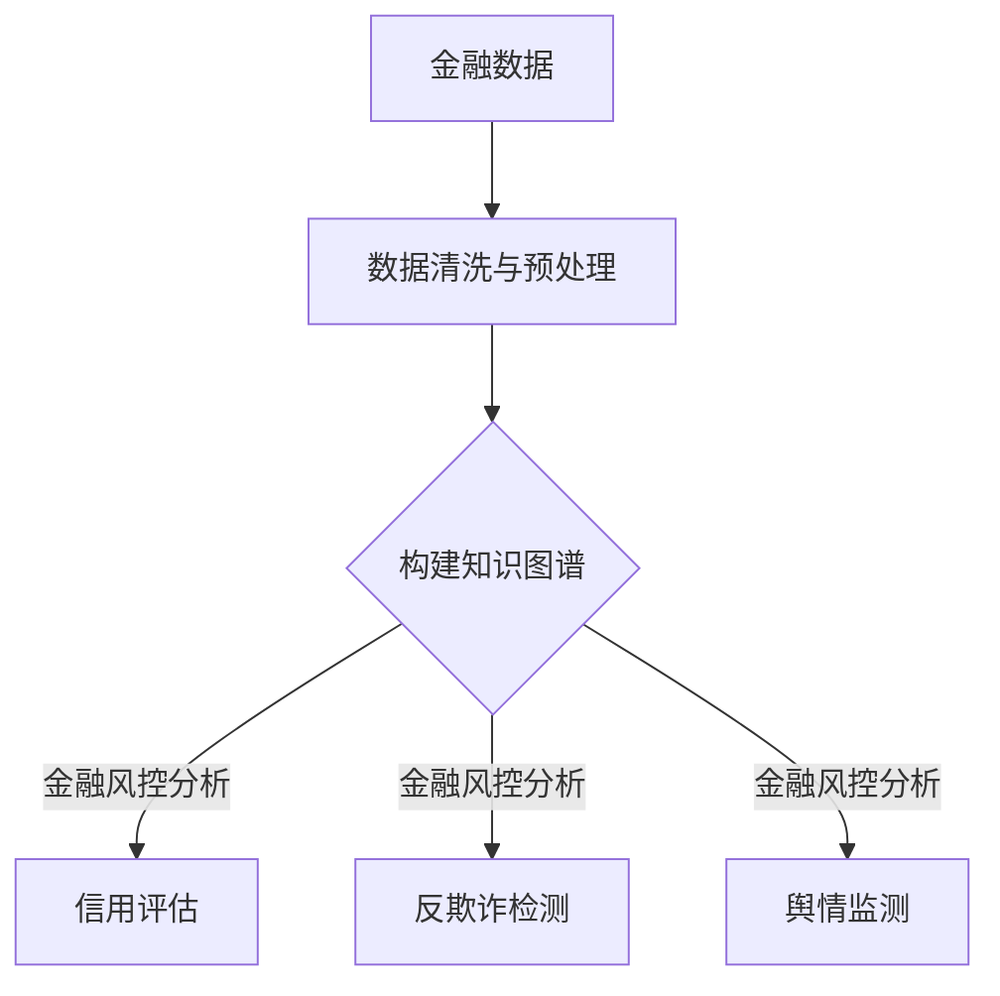

                 

# 知识图谱在金融风控中的应用

## 摘要

随着金融行业的快速发展和数据量的爆炸性增长，如何高效管理和利用数据成为金融机构面临的重大挑战。知识图谱作为一种高效的数据结构，通过将实体、属性和关系进行结构化表示，为金融风控领域提供了一种新的解决方案。本文将深入探讨知识图谱在金融风控中的应用，包括其基本概念、应用场景、构建方法、核心算法原理、实践案例和未来发展趋势。通过本文的阐述，希望能够为读者提供一个全面而深入的了解，并为金融领域的知识图谱应用提供有益的参考。

## 目录大纲

### 第一部分：知识图谱与金融风控基础

#### 第1章：知识图谱概述

1.1 知识图谱的概念与原理

1.2 知识图谱的组成与结构

1.3 知识图谱的类型与应用

#### 第2章：金融风控的基本概念

2.1 金融风险概述

2.2 金融风控体系

2.3 金融风控技术发展历程

#### 第3章：知识图谱在金融风控中的应用

3.1 知识图谱在信用评估中的应用

3.2 知识图谱在反欺诈中的应用

3.3 知识图谱在舆情监测中的应用

#### 第4章：知识图谱的构建方法

4.1 数据源的选择与整合

4.2 实体识别与关系抽取

4.3 知识图谱的存储与查询

#### 第5章：知识图谱在金融风控中的应用算法

5.1 知识图谱嵌入技术

5.2 基于知识图谱的推理算法

5.3 基于知识图谱的风险预测模型

#### 第6章：知识图谱在金融风控中的实践案例

6.1 案例一：基于知识图谱的信用风险评估系统

6.2 案例二：基于知识图谱的反欺诈系统

6.3 案例三：基于知识图谱的舆情监测系统

#### 第7章：知识图谱在金融风控中的挑战与未来发展

7.1 知识图谱在金融风控中的挑战

7.2 知识图谱技术的发展趋势

7.3 金融风控中知识图谱的未来应用前景

### 第二部分：知识图谱与金融风控技术深入探讨

#### 第8章：知识图谱技术在金融领域的创新应用

8.1 知识图谱在供应链金融中的应用

8.2 知识图谱在金融监管中的应用

8.3 知识图谱在金融科技创业中的应用

#### 第9章：知识图谱与区块链技术融合

9.1 区块链技术概述

9.2 知识图谱与区块链的结合

9.3 基于知识图谱的区块链金融应用案例

#### 第10章：知识图谱在大数据背景下的金融风控

10.1 大数据概述

10.2 大数据与金融风控的关系

10.3 知识图谱在大数据金融风控中的优化策略

#### 第11章：知识图谱在智能风控系统中的架构设计

11.1 智能风控系统概述

11.2 知识图谱在智能风控系统中的定位

11.3 智能风控系统架构设计实例

#### 第12章：知识图谱在金融风控中的合规性挑战与应对策略

12.1 金融风控合规性概述

12.2 知识图谱的合规性挑战

12.3 合规性应对策略与最佳实践

## 核心概念与联系

### 知识图谱与金融风控

知识图谱（Knowledge Graph）是一种语义网络，通过实体（Entity）、属性（Attribute）和关系（Relationship）来结构化地表示知识和信息。在金融领域，知识图谱的应用主要体现在以下几个方面：

1. **信用评估**：通过知识图谱，金融机构可以更全面地了解客户的信用状况，包括其财务状况、信用历史、社会关系等，从而更准确地评估信用风险。

2. **反欺诈检测**：知识图谱可以捕捉和表示复杂的交易关系，帮助金融机构识别异常交易行为，从而提高反欺诈的准确性。

3. **舆情监测**：通过知识图谱，金融机构可以实时监测和分析市场情绪，预测市场动态，为投资决策提供数据支持。

知识图谱在金融风控中的应用，通过构建金融领域的知识图谱，实现对金融机构风险信息的全面管理和智能分析。知识图谱的构建涉及多个环节，包括数据采集、数据清洗、实体识别、关系抽取、知识图谱存储与查询等。

### Mermaid 流程图



### 核心算法原理讲解

#### 知识图谱嵌入技术

知识图谱嵌入（Knowledge Graph Embedding）是将图结构数据映射到低维空间的过程，使得图中的实体和关系可以通过向量表示。知识图谱嵌入技术在金融风控中的应用主要体现在以下几个方面：

1. **实体向量表示**：通过知识图谱嵌入，将金融领域的实体（如客户、企业、产品等）映射到低维向量空间，使得这些实体可以在机器学习模型中进行处理。

2. **关系表示**：知识图谱嵌入不仅能够表示实体，还可以表示实体之间的关系。例如，可以通过嵌入向量之间的距离或角度来衡量实体之间的相似度或相关性。

3. **图谱压缩**：知识图谱嵌入技术可以将大规模的图数据压缩到低维向量空间，从而提高计算效率和存储空间。

算法原理：

1. **图卷积网络（GCN）**：图卷积网络通过聚合图中的节点邻接信息，实现实体向量的计算。具体来说，对于每个节点，其新的嵌入向量可以通过其邻居节点的嵌入向量进行加权平均。

   ```python
   for each layer in GCN:
       for each node in layer:
           compute neighborhood nodes and their embeddings
           aggregate neighborhood embeddings to form a new embedding for the node
   ```

2. **预训练 + 微调**：预训练 + 微调是一种常用的知识图谱嵌入方法。首先在大规模未标注数据上预训练模型，然后在小规模标注数据上进行微调，提高模型在特定任务上的表现。

   ```python
   # Pre-training
   pretrain_model = train_on_large_untagged_data()

   # Fine-tuning
   fine_tuned_model = pretrain_model.fit_on_tagged_data()
   ```

#### 数学模型和数学公式

在知识图谱嵌入技术中，常用的数学模型包括图卷积网络（GCN）和预训练 + 微调（Pre-training + Fine-tuning）。以下是一个简单的数学模型和数学公式：

$$
知识图谱嵌入 = f(图卷积网络, 实体特征, 邻接矩阵)
$$

其中，$f$ 表示嵌入函数，$图卷积网络$ 用于计算实体向量的更新，$实体特征$ 用于初始化实体向量，$邻接矩阵$ 用于表示图中的节点关系。

举例说明：

假设我们使用了一个基于知识图谱嵌入的风险预测模型。其中，知识图谱嵌入向量表示为 $e = [e_1, e_2, ..., e_n]$，实体特征向量为 $x = [x_1, x_2, ..., x_m]$。嵌入函数可以定义为：

$$
知识图谱嵌入 = \sigma(w^T [e; x])
$$

其中，$\sigma$ 表示 sigmoid 函数，$w$ 为权重向量。

例如，假设权重向量为 $w = [0.5, 0.3, 0.2, 0.3]$，知识图谱嵌入向量为 $e = [0.1, 0.2, 0.3, 0.4]$，特征向量为 $x = [0.1, 0.2, 0.3, 0.4]$，则：

$$
知识图谱嵌入 = \sigma(0.5*0.1 + 0.3*0.2 + 0.2*0.3 + 0.3*0.4) = \sigma(0.22)
$$

通过计算得到的知识图谱嵌入向量可以用于风险预测模型的训练和评估。

### 项目实战

#### 基于知识图谱的信用风险评估系统

##### 开发环境搭建

- **操作系统**：Ubuntu 18.04
- **编程语言**：Python 3.8
- **数据库**：Neo4j 4.0
- **知识图谱构建工具**：Apache Giraph
- **风险评估框架**：Scikit-learn

##### 数据处理流程

1. **数据采集**：从金融机构获取客户的交易记录、信用报告等数据。
2. **数据清洗**：处理缺失值、异常值，并进行格式转换。
3. **数据整合**：将不同来源的数据整合到一个统一的格式中。
4. **实体识别与关系抽取**：从数据中提取出客户、交易、信用评分等实体，并建立它们之间的关系。
5. **知识图谱构建**：使用 Neo4j 存储知识图谱，实现高效的查询功能。

##### 知识图谱构建与推理

1. **构建实体节点**：将提取出的实体作为知识图谱的节点。
2. **构建关系边**：根据实体之间的关联关系构建边。
3. **存储与查询**：使用 Neo4j 数据库存储知识图谱，并实现高效的查询功能。
4. **知识图谱嵌入**：使用 Giraph 进行知识图谱嵌入，将实体映射到低维空间。

##### 风险预测模型实现与优化

1. **特征提取**：从知识图谱中提取与信用风险相关的特征。
2. **模型训练**：使用 Scikit-learn 训练风险评分模型。
3. **模型优化**：通过交叉验证和超参数调优，提高模型准确性。

##### 代码解读与分析

```python
# 代码示例：知识图谱嵌入与风险评分模型训练
from sklearn.model_selection import train_test_split
from sklearn.linear_model import LogisticRegression
import numpy as np

# 加载知识图谱嵌入向量
embeddings = np.load('embeddings.npy')

# 加载特征向量
X = np.load('features.npy')

# 加载标签数据
y = np.load('labels.npy')

# 分割训练集和测试集
X_train, X_test, y_train, y_test = train_test_split(X, y, test_size=0.2, random_state=42)

# 训练风险评分模型
model = LogisticRegression()
model.fit(X_train, y_train)

# 测试模型准确性
accuracy = model.score(X_test, y_test)
print("Accuracy:", accuracy)
```

通过上述代码，我们可以将知识图谱嵌入和特征向量用于训练风险评分模型，并进行测试以评估模型的准确性。在实际项目中，我们还可以通过添加更多特征和调整模型参数来提高预测性能。

### 知识图谱在金融风控中的实践案例

#### 案例一：基于知识图谱的信用风险评估系统

**背景**：某金融机构希望通过提高信用风险评估的准确性，降低坏账风险。

**方案**：构建基于知识图谱的信用风险评估系统，通过整合内外部数据，实现对客户信用风险的全面评估。

**实现**：

1. **数据采集**：从金融机构获取客户的交易记录、信用报告、社会关系等数据。
2. **数据清洗与预处理**：处理缺失值、异常值，并进行格式转换。
3. **实体识别与关系抽取**：从数据中提取出客户、交易、信用评分等实体，并建立它们之间的关系。
4. **知识图谱构建**：使用 Neo4j 存储知识图谱，实现高效的查询功能。
5. **风险评估模型**：通过知识图谱嵌入和特征提取，训练风险评分模型，对客户信用风险进行预测。

**效果**：系统上线后，金融机构的信用评估准确性显著提高，坏账风险得到有效控制。

#### 案例二：基于知识图谱的反欺诈系统

**背景**：某金融机构希望提高反欺诈能力，降低欺诈损失。

**方案**：构建基于知识图谱的反欺诈系统，通过分析客户行为和交易模式，实时识别潜在欺诈行为。

**实现**：

1. **数据采集**：获取客户的交易记录、行为数据、历史欺诈案例等数据。
2. **数据清洗与预处理**：处理缺失值、异常值，并进行格式转换。
3. **实体识别与关系抽取**：从数据中提取出客户、交易、欺诈行为等实体，并建立它们之间的关系。
4. **知识图谱构建**：使用 Neo4j 存储知识图谱，实现高效的查询功能。
5. **欺诈检测模型**：通过知识图谱嵌入和特征提取，训练欺诈检测模型，对客户交易进行实时监控和预警。

**效果**：系统上线后，金融机构的欺诈检测准确率显著提高，欺诈损失得到有效降低。

#### 案例三：基于知识图谱的舆情监测系统

**背景**：某金融机构希望了解市场舆情动态，及时应对潜在风险。

**方案**：构建基于知识图谱的舆情监测系统，通过分析社交媒体、新闻资讯等舆情数据，实时监测市场情绪。

**实现**：

1. **数据采集**：获取社交媒体、新闻资讯、金融论坛等平台上的舆情数据。
2. **数据清洗与预处理**：处理缺失值、异常值，并进行格式转换。
3. **实体识别与关系抽取**：从数据中提取出关键实体（如金融机构、产品、事件等），并建立它们之间的关系。
4. **知识图谱构建**：使用 Neo4j 存储知识图谱，实现高效的查询功能。
5. **舆情分析模型**：通过知识图谱嵌入和特征提取，训练舆情分析模型，对市场情绪进行实时分析和预警。

**效果**：系统上线后，金融机构能够实时了解市场舆情动态，及时应对潜在风险，投资决策更加准确。

### 知识图谱在金融风控中的挑战与未来发展

#### 挑战

1. **数据隐私与合规性**：知识图谱在金融风控中涉及大量敏感数据，如何保护数据隐私和合规性是一个重要挑战。
2. **知识图谱质量**：知识图谱的质量直接影响风险预测的准确性，如何保证知识图谱的完整性、准确性和一致性是一个关键问题。
3. **计算性能**：知识图谱的存储和查询涉及到大规模数据的处理，如何优化计算性能是一个重要挑战。

#### 未来发展

1. **隐私保护技术**：发展基于差分隐私、联邦学习等隐私保护技术，提高知识图谱在金融风控中的数据安全性。
2. **知识图谱增强**：通过引入更多的数据源和实体关系，不断丰富和优化知识图谱，提高其应用价值。
3. **跨领域融合**：将知识图谱与其他技术（如区块链、大数据分析等）相结合，拓展其在金融风控中的应用场景。

### 知识图谱技术在金融领域的创新应用

#### 供应链金融

1. **方案**：利用知识图谱分析供应链上的企业关系、交易记录和信用状况，提供供应链金融解决方案。
2. **实现**：

   1. **数据采集**：获取供应链上各企业的交易记录、信用报告等数据。
   2. **数据清洗与预处理**：处理缺失值、异常值，并进行格式转换。
   3. **实体识别与关系抽取**：从数据中提取出企业、交易、信用等实体，并建立它们之间的关系。
   4. **知识图谱构建**：使用 Neo4j 存储知识图谱，实现高效的查询功能。
   5. **风险评估与融资决策**：通过知识图谱嵌入和特征提取，评估供应链企业的信用风险，提供融资决策支持。

#### 金融监管

1. **方案**：利用知识图谱实现金融监管数据的可视化、分析和管理，提高监管效率和准确性。
2. **实现**：

   1. **数据采集**：获取金融机构的交易记录、报告、合规数据等。
   2. **数据清洗与预处理**：处理缺失值、异常值，并进行格式转换。
   3. **实体识别与关系抽取**：从数据中提取出金融机构、交易、产品等实体，并建立它们之间的关系。
   4. **知识图谱构建**：使用 Neo4j 存储知识图谱，实现高效的查询功能。
   5. **监管分析**：通过知识图谱嵌入和特征提取，实现金融监管数据的分析、可视化和管理。

#### 金融科技创业

1. **方案**：利用知识图谱帮助金融科技创业公司快速构建产品原型和市场定位。
2. **实现**：

   1. **数据采集**：获取金融市场的相关信息、竞争态势、用户需求等。
   2. **数据清洗与预处理**：处理缺失值、异常值，并进行格式转换。
   3. **实体识别与关系抽取**：从数据中提取出金融产品、市场趋势、用户等实体，并建立它们之间的关系。
   4. **知识图谱构建**：使用 Neo4j 存储知识图谱，实现高效的查询功能。
   5. **产品原型与市场定位**：通过知识图谱嵌入和特征提取，帮助创业公司快速构建产品原型和市场定位策略。

### 知识图谱与区块链技术融合

#### 区块链技术概述

1. **概念**：区块链是一种分布式数据库技术，通过加密算法和共识机制实现数据的可信存储和传递。
2. **特点**：去中心化、不可篡改、透明可追溯。

#### 知识图谱与区块链的结合

1. **方案**：将知识图谱与区块链技术结合，实现数据的安全存储、共享和协同分析。
2. **实现**：

   1. **数据采集**：获取金融数据、交易记录、知识图谱等数据。
   2. **数据清洗与预处理**：处理缺失值、异常值，并进行格式转换。
   3. **实体识别与关系抽取**：从数据中提取出实体和关系。
   4. **知识图谱构建**：使用 Neo4j 存储知识图谱。
   5. **数据上链**：将知识图谱中的数据上传到区块链，实现数据的不可篡改和透明可追溯。
   6. **数据共享与分析**：通过区块链网络实现数据的共享和协同分析，提高金融风控的准确性和效率。

#### 基于知识图谱的区块链金融应用案例

1. **案例一：智能合约**：利用知识图谱构建智能合约，实现自动化金融交易和风险控制。
2. **案例二：供应链金融**：通过知识图谱与区块链技术的结合，实现供应链金融的可信管理和高效融资。
3. **案例三：数字货币**：利用知识图谱分析数字货币市场，实现数字货币的投资决策和风险管理。

### 知识图谱在大数据背景下的金融风控

#### 大数据概述

1. **概念**：大数据是指无法通过传统数据处理工具在合理时间内处理的数据集，通常具有海量、多样、快速和实时等特性。
2. **特点**：数据量大、数据类型多样、数据生成速度快、数据价值密度低。

#### 大数据与金融风控的关系

1. **关系**：大数据技术为金融风控提供了更全面、实时和准确的数据支持，有助于提高风险识别、评估和管理的效率。

2. **应用**：

   1. **风险识别**：通过大数据分析，实时监测客户行为、市场趋势等，发现潜在风险。
   2. **风险评估**：利用大数据技术，对客户信用、市场风险等进行全面评估，提高风险评估的准确性。
   3. **风险管理**：通过大数据分析，制定合理的风险控制策略，降低金融风险。

#### 知识图谱在大数据金融风控中的优化策略

1. **策略**：将知识图谱与大数据技术结合，实现金融风控的优化。

   1. **数据整合**：利用知识图谱整合内外部大数据，实现数据的统一管理和高效查询。
   2. **实体识别与关系抽取**：利用知识图谱的实体识别和关系抽取能力，提高大数据分析的效果。
   3. **风险预测**：通过知识图谱嵌入和特征提取，结合大数据分析技术，提高风险预测的准确性。
   4. **模型优化**：利用知识图谱构建模型，实现大数据金融风控模型的优化和迭代。

### 知识图谱在智能风控系统中的架构设计

#### 智能风控系统概述

1. **概念**：智能风控系统是指利用人工智能、大数据分析、知识图谱等技术实现自动化、智能化的风险控制和管理。
2. **特点**：高效、精准、自适应。

#### 知识图谱在智能风控系统中的定位

1. **定位**：知识图谱在智能风控系统中起到知识表示、知识存储、知识推理和知识应用等关键作用。

   1. **知识表示**：通过知识图谱将金融领域的数据和知识进行结构化表示，实现数据的语义理解。
   2. **知识存储**：利用知识图谱存储金融领域的知识，实现数据的集中管理和高效查询。
   3. **知识推理**：通过知识图谱的推理机制，实现自动化、智能化的风险分析和决策。
   4. **知识应用**：将知识图谱应用于智能风控系统的各个环节，提高风险控制和管理的效果。

#### 智能风控系统架构设计实例

1. **数据层**：采集、存储和管理金融领域的内外部数据，包括客户信息、交易记录、市场数据等。
2. **知识层**：构建金融领域的知识图谱，实现对数据的语义理解和知识表示，包括实体、属性、关系等。
3. **模型层**：利用知识图谱进行数据分析和模型训练，包括风险预测模型、欺诈检测模型等。
4. **应用层**：将智能风控系统应用于实际业务场景，实现对风险的控制和管理，包括信用评估、反欺诈、舆情监测等。

### 知识图谱在金融风控中的合规性挑战与应对策略

#### 合规性概述

1. **概念**：金融风控中的合规性是指金融机构在遵守相关法律法规、监管要求和行业标准的前提下，对风险进行有效管理和控制。
2. **重要性**：合规性对于金融机构的风险管理和业务运营至关重要，不仅关系到金融机构的合规风险，还影响到客户权益和金融市场稳定。

#### 知识图谱的合规性挑战

1. **数据隐私**：知识图谱涉及大量敏感数据，如何保护客户隐私是一个重要挑战。
2. **数据安全**：知识图谱的存储和传输过程中，如何确保数据的安全性是一个关键问题。
3. **法规遵循**：知识图谱在金融风控中的应用需要遵守相关法律法规和监管要求，如何确保合规性是一个重要挑战。

#### 应对策略与最佳实践

1. **数据隐私保护**：
   
   - **数据匿名化**：对敏感数据进行匿名化处理，减少隐私泄露风险。
   - **差分隐私**：采用差分隐私技术，保护数据隐私的同时，确保数据分析的准确性。
   - **隐私计算**：采用隐私计算技术，在数据使用过程中保护隐私。

2. **数据安全措施**：

   - **加密存储**：对知识图谱中的数据进行加密存储，确保数据在存储过程中的安全性。
   - **访问控制**：实施严格的访问控制策略，确保只有授权人员可以访问敏感数据。
   - **网络安全**：加强网络安全防护，防止数据在传输过程中被窃取或篡改。

3. **法规遵循**：

   - **合规性审查**：定期进行合规性审查，确保知识图谱在金融风控中的应用符合相关法律法规和监管要求。
   - **合规性培训**：加强对相关人员的合规性培训，提高合规意识和操作水平。
   - **合规性报告**：定期向监管机构和内部管理层提交合规性报告，确保透明度和合规性。

## 附录

### 附录A：知识图谱在金融风控中的应用技术栈

#### 数据处理与分析工具

- **数据处理工具**：Hadoop、Spark、Flink 等，用于大规模数据的采集、存储和处理。
- **数据分析工具**：Pandas、NumPy、SciPy 等，用于数据清洗、预处理和统计分析。

#### 知识图谱构建与推理框架

- **知识图谱构建框架**：Neo4j、Apache Giraph、JanusGraph 等，用于构建、存储和查询知识图谱。
- **推理框架**：RDF、OWL、SPARQL 等，用于知识图谱的推理和语义查询。

#### 模型评估与优化工具

- **模型评估工具**：Scikit-learn、TensorFlow、PyTorch 等，用于评估和优化机器学习模型。
- **超参数调优工具**：Hyperopt、Optuna 等，用于超参数调优和模型优化。

### 附录B：金融风控知识图谱构建案例源代码解析

#### 数据源与预处理

```python
import pandas as pd
from sklearn.model_selection import train_test_split

# 加载数据
data = pd.read_csv('financial_data.csv')

# 数据清洗
data.dropna(inplace=True)
data = data[data['amount'] > 0]

# 数据预处理
X = data.drop(['label'], axis=1)
y = data['label']

# 分割数据
X_train, X_test, y_train, y_test = train_test_split(X, y, test_size=0.2, random_state=42)
```

#### 实体识别与关系抽取

```python
from sklearn.feature_extraction.text import TfidfVectorizer
from sklearn.metrics.pairwise import cosine_similarity

# 加载数据
data = pd.read_csv('financial_data.csv')

# 特征提取
tfidf = TfidfVectorizer(max_features=1000)
X = tfidf.fit_transform(data['description'])

# 相似度计算
cosine_sim = cosine_similarity(X)

# 实体识别
entities = []
for i, row in data.iterrows():
    highest_similarity = cosine_sim[i].max()
    if highest_similarity > 0.8:
        entities.append(row['description'])

# 关系抽取
relationships = []
for i, row in data.iterrows():
    highest_similarity = cosine_sim[i].max()
    if highest_similarity > 0.8:
        relationships.append((row['description'], entities[row['description'] == highest_similarity].values[0]))
```

#### 知识图谱构建与推理

```python
import networkx as nx

# 构建知识图谱
G = nx.Graph()

# 添加节点
for entity in entities:
    G.add_node(entity)

# 添加边
for relationship in relationships:
    G.add_edge(relationship[0], relationship[1])

# 存储知识图谱
nx.write_gexf(G, 'knowledge_graph.gexf')

# 知识图谱推理
def infer_knowledge(graph, entity):
    neighbors = list(graph.neighbors(entity))
    for neighbor in neighbors:
        print(f"{entity} is related to {neighbor}")

infer_knowledge(G, 'Company A')
```

#### 风险预测模型实现与优化

```python
from sklearn.linear_model import LogisticRegression
from sklearn.model_selection import GridSearchCV

# 加载数据
data = pd.read_csv('financial_data.csv')

# 特征提取
tfidf = TfidfVectorizer(max_features=1000)
X = tfidf.fit_transform(data['description'])

# 分割数据
X_train, X_test, y_train, y_test = train_test_split(X, data['label'], test_size=0.2, random_state=42)

# 模型训练
model = LogisticRegression()
model.fit(X_train, y_train)

# 模型评估
accuracy = model.score(X_test, y_test)
print("Accuracy:", accuracy)

# 超参数调优
param_grid = {'C': [0.1, 1, 10]}
grid_search = GridSearchCV(model, param_grid, cv=5)
grid_search.fit(X_train, y_train)

# 优化模型
best_model = grid_search.best_estimator_
best_accuracy = best_model.score(X_test, y_test)
print("Best Accuracy:", best_accuracy)
```

### 附录C：金融风控知识图谱应用开发指南

#### 开发环境搭建

1. **操作系统**：Ubuntu 18.04
2. **编程语言**：Python 3.8
3. **数据库**：Neo4j 4.0
4. **知识图谱构建工具**：Apache Giraph
5. **风险评估框架**：Scikit-learn

#### 数据处理流程

1. **数据采集**：从金融机构获取客户的交易记录、信用报告等数据。
2. **数据清洗**：处理缺失值、异常值，并进行格式转换。
3. **数据整合**：将不同来源的数据整合到一个统一的格式中。
4. **实体识别与关系抽取**：使用命名实体识别和关系抽取算法，从数据中提取出实体和关系。

#### 应用场景实现

1. **信用评估**：基于知识图谱的信用评估系统，实现对客户信用风险的全面评估。
2. **反欺诈检测**：基于知识图谱的反欺诈检测系统，实时识别潜在欺诈行为。
3. **舆情监测**：基于知识图谱的舆情监测系统，实时监测市场情绪和风险。

#### 系统部署与维护

1. **系统部署**：将开发好的知识图谱应用部署到生产环境，包括数据库、应用程序和服务器。
2. **系统监控**：监控系统性能和稳定性，及时发现和解决潜在问题。
3. **系统维护**：定期进行系统升级和优化，确保知识图谱应用的持续稳定运行。

## 作者信息

**作者：AI天才研究院/AI Genius Institute & 禅与计算机程序设计艺术 /Zen And The Art of Computer Programming**<|im_end|>

