                 

### 文章标题

《知识型企业家精神的培养》

#### 关键词

知识型企业家精神、创新思维、领导力、团队管理、持续改进

#### 摘要

本文深入探讨了知识型企业家精神的概念、重要性及其培养方法。通过对知识型企业家精神与传统企业家精神的比较分析，本文揭示了知识型企业家应具备的核心素质，包括学习与创新精神、领导力与团队管理能力、持续改进与自我超越能力以及应对挑战与抗风险能力。在此基础上，本文提出了培养知识型企业家精神的策略和实践方法，并通过对国内外成功和失败案例的分析，总结了经验与教训。最后，文章展望了知识型企业家精神在新时代的使命和未来发展趋势。

---

## 第一部分：知识型企业家精神的基础

在当今科技迅猛发展的时代，知识型企业家精神成为企业成功的关键因素。本部分将探讨知识型企业家精神的定义与重要性，以及知识型企业家应具备的核心素质。

### 第1章：知识型企业家精神的定义与重要性

#### 1.1 知识型企业家精神的起源与发展

知识型企业家精神起源于20世纪末期，随着知识经济的兴起，企业家们开始重视知识的积累和创新能力的培养。其发展历程可以分为以下几个阶段：

1. **知识积累阶段**：企业家们开始意识到知识的重要性，积极搜集和积累各类知识资源。
2. **创新思维阶段**：企业家们开始运用创新思维，将知识应用于产品和服务创新中。
3. **战略规划阶段**：企业家们将创新思维与战略规划相结合，制定长期发展目标。
4. **知识管理阶段**：企业家们开始建立知识管理体系，实现知识的共享和持续改进。

**图 1.1 知识型企业家精神的定义与演进过程**

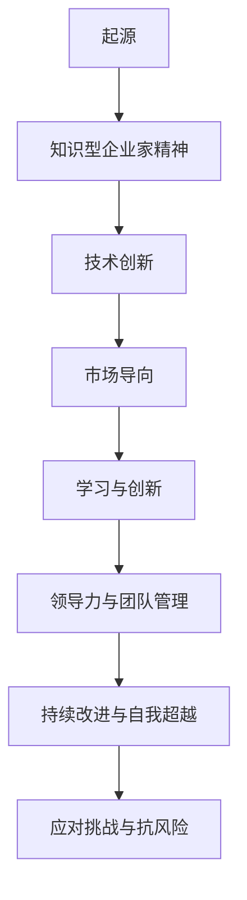

#### 1.2 知识型企业家精神与传统企业家精神的比较

知识型企业家精神与传统企业家精神有以下几点不同：

| 特点 | 知识型企业家精神 | 传统企业家精神 |
| ---- | ---------------- | -------------- |
| 学习与创新 | 强调持续学习和创新能力 | 依赖于经验和直觉 |
| 领导力与团队管理 | 强调领导力和团队管理能力 | 依赖于权威和命令 |
| 持续改进与自我超越 | 追求持续改进和自我超越 | 依赖于稳定和成熟 |
| 应对挑战与抗风险 | 能够应对挑战和抗风险 | 依赖于风险规避和保守 |

**表 1.1 知识型企业家精神与传统企业家精神的对比**

#### 1.3 知识型企业家精神对企业的影响

知识型企业家精神对企业的影响主要体现在以下几个方面：

1. **提升企业竞争力**：通过持续学习和创新，企业能够保持竞争优势，快速响应市场变化。
2. **推动企业成长**：知识型企业家精神有助于企业实现持续改进和自我超越，推动企业不断成长。
3. **促进团队合作**：知识型企业家强调领导力和团队管理能力，有助于建立高效的团队，提高工作效率。
4. **提升风险管理能力**：知识型企业家能够更好地识别和应对风险，降低企业风险。

**公式 1.1 知识型企业家精神对企业绩效的影响模型**

$$
\text{企业绩效} = f(\text{知识积累}, \text{创新能力}, \text{团队协作}, \text{风险管理})
$$

#### 1.3.1 知识积累

知识积累是知识型企业家精神的核心，以下是一个简单的知识积累过程伪代码：

```python
# 初始化知识库
knowledge_base = []

# 搜集新知识
new_knowledge = get_new_knowledge(source)

# 更新知识库
knowledge_base.append(new_knowledge)

# 评估知识质量
quality_score = evaluate_knowledge(new_knowledge)

# 如果知识质量达标，则整合到现有知识库中
if quality_score >= threshold:
    integrate_knowledge(knowledge_base, new_knowledge)
```

#### 1.3.2 创新能力

创新能力是知识型企业家精神的重要组成部分，以下是一个简单的创新能力培养过程伪代码：

```python
# 初始化创新思维
innovation_mindset = initialize_mindset()

# 收集创新灵感
inspiration_source = collect_inspirations()

# 分析灵感并形成创新点
innovations = analyze_inspirations(inspiration_source)

# 实施创新计划
execute_innovation_plan(innovations)
```

#### 1.3.3 团队协作

团队协作是知识型企业家精神的重要体现，以下是一个简单的团队协作过程伪代码：

```python
# 初始化团队
team = initialize_team()

# 制定团队目标
team_objective = define_team_objective()

# 分配任务
tasks = distribute_tasks(team, team_objective)

# 协作执行任务
execute_tasks(team, tasks)

# 反馈与调整
feedback = get_team_feedback()
adjust_plan(team, feedback)
```

#### 1.3.4 风险管理

风险管理是知识型企业家精神的重要能力之一，以下是一个简单的风险管理过程伪代码：

```python
# 初始化风险管理框架
risk_management_framework = initialize_risk_framework()

# 识别潜在风险
potential_risks = identify_potential_risks()

# 评估风险
risk_assessment = evaluate_risk(potential_risks)

# 制定风险应对策略
risk_strategy = define_risk_strategy(risk_assessment)

# 实施风险应对措施
implement_risk_strategy(risk_strategy)
```

### 第2章：知识型企业家应具备的核心素质

知识型企业家应具备以下核心素质：

#### 2.1 学习与创新精神

学习与创新精神是知识型企业家精神的基础，以下是一个简单的学习与创新精神培养过程：

- **学习习惯**：制定学习计划，每天保持一定时间的学习。
- **创新思维**：通过头脑风暴、思维导图等方法激发创新思维。

#### 2.2 领导力与团队管理能力

领导力与团队管理能力是知识型企业家精神的重要组成部分，以下是一个简单的领导力与团队管理能力培养过程：

- **自我认知**：了解自己的优势和劣势，提高自我认知。
- **角色扮演**：通过角色扮演和情景模拟提升领导力。

#### 2.3 持续改进与自我超越能力

持续改进与自我超越能力是知识型企业家精神的重要体现，以下是一个简单的持续改进与自我超越能力培养过程：

- **设立目标**：制定短期和长期目标，不断提升自己。
- **反思与调整**：定期反思自己的行为和结果，进行调整。

#### 2.4 应对挑战与抗风险能力

应对挑战与抗风险能力是知识型企业家精神的关键，以下是一个简单的应对挑战与抗风险能力培养过程：

- **风险意识**：提高风险意识，学会识别和评估风险。
- **应对策略**：制定应对策略，提高抗风险能力。

---

在下一部分中，我们将探讨知识型企业家精神的培养方法，包括教育背景与知识积累、实践经验与案例分析、自我认知与能力提升以及社交网络与资源整合。

---

## 第二部分：知识型企业家精神的培养方法

培养知识型企业家精神并非一蹴而就，需要通过多种方法和策略来实现。本部分将详细探讨知识型企业家精神的培养方法，包括教育背景与知识积累、实践经验与案例分析、自我认知与能力提升以及社交网络与资源整合。

### 第3章：知识型企业家精神的培养策略

#### 3.1 教育背景与知识积累

教育背景是培养知识型企业家精神的基础。一个良好的教育背景能够提供广泛的知识体系和专业的技能，为企业家精神的发展奠定基础。以下是一个教育背景与知识积累的简略过程：

1. **选择合适的专业**：选择与自己兴趣和职业规划相符的专业，如计算机科学、商业管理、经济学等。
2. **积累专业知识**：通过课程学习、实践项目和实习经验，积累相关的专业知识。
3. **扩展知识领域**：除了专业知识，还应广泛阅读相关书籍、研究报告和学术论文，扩展知识领域。

**图 3.1 教育背景与知识积累的关系**

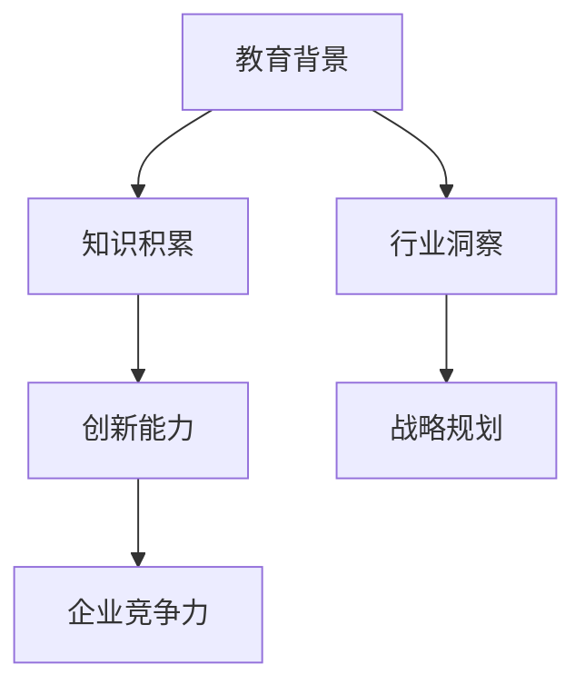

#### 3.2 实践经验与案例分析

实践经验是培养知识型企业家精神的另一个重要途径。通过实际操作，企业家可以验证理论知识，发现问题和挑战，并从中学习。以下是一个实践经验与案例分析的简略过程：

1. **参与实际项目**：参与实际项目，如创业项目、实习项目等，积累实践经验。
2. **分析案例**：研究成功和失败的案例，分析其成功和失败的原因。
3. **总结经验**：从实践经验中总结经验教训，形成自己的知识体系。

**图 3.2 实践经验与案例分析的相互关系**

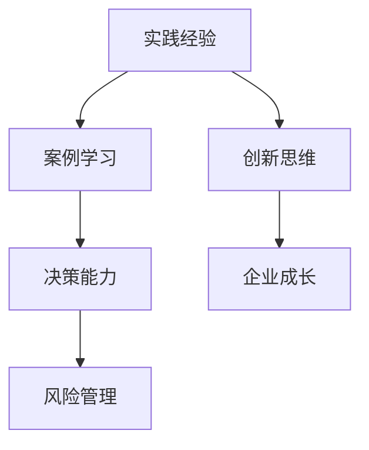

#### 3.3 自我认知与能力提升

自我认知与能力提升是知识型企业家精神培养的关键。企业家需要了解自己的优势和劣势，不断提升自己的能力。以下是一个自我认知与能力提升的简略过程：

1. **自我评估**：通过自我评估了解自己的优势和劣势。
2. **设定目标**：根据自我评估结果设定短期和长期目标。
3. **持续学习**：通过学习课程、阅读书籍、参加培训等方式不断提升自己的能力。

**伪代码 3.1 自我认知与能力提升流程**

```python
# 初始化能力评估模型
ability_evaluation_model = initialize_ability_evaluation_model()

# 收集自我评估数据
self_evaluation_data = collect_self_evaluation_data()

# 分析评估数据
evaluation_result = analyze_evaluation_data(self_evaluation_data)

# 制定提升计划
improvement_plan = define_improvement_plan(evaluation_result)

# 实施提升计划
execute_improvement_plan(improvement_plan)

# 跟踪与调整
track_improvement(improvement_plan)
adjust_plan_if_necessary(improvement_plan)
```

#### 3.4 社交网络与资源整合

社交网络与资源整合是知识型企业家精神的重要组成部分。通过建立广泛的社交网络，企业家可以获取更多的信息和资源，促进知识的共享和合作。以下是一个社交网络与资源整合的简略过程：

1. **建立社交网络**：参加行业会议、研讨会、社交活动等，结识同行和潜在合作伙伴。
2. **分享知识**：在社交媒体上分享知识和经验，参与讨论和交流。
3. **资源整合**：通过合作和资源共享，整合各种资源，提高企业的竞争力。

**图 3.3 社交网络与资源整合的关系**

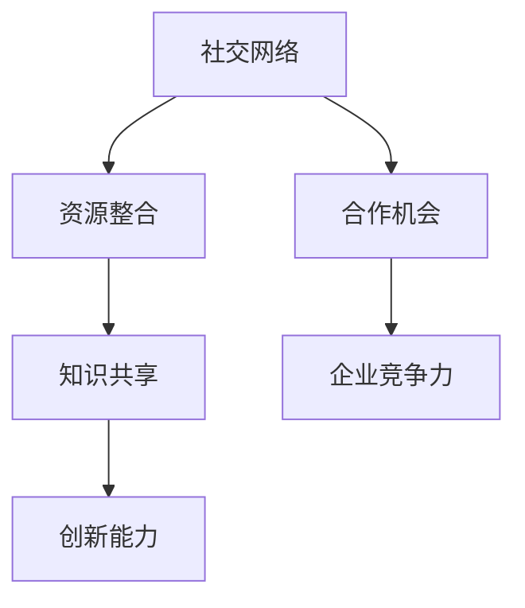

### 第4章：知识型企业家精神的培养实践

#### 4.1 培养学习习惯

培养学习习惯是知识型企业家精神的重要组成部分。以下是一个培养学习习惯的简略过程：

1. **设定学习目标**：根据个人兴趣和职业规划，设定明确的学习目标。
2. **制定学习计划**：制定详细的学习计划，包括学习内容、时间安排和学习方法。
3. **执行学习计划**：按照学习计划执行学习任务，保持学习动力和持续学习。
4. **评估学习效果**：定期评估学习效果，调整学习策略。

**图 4.1 培养学习习惯的步骤**

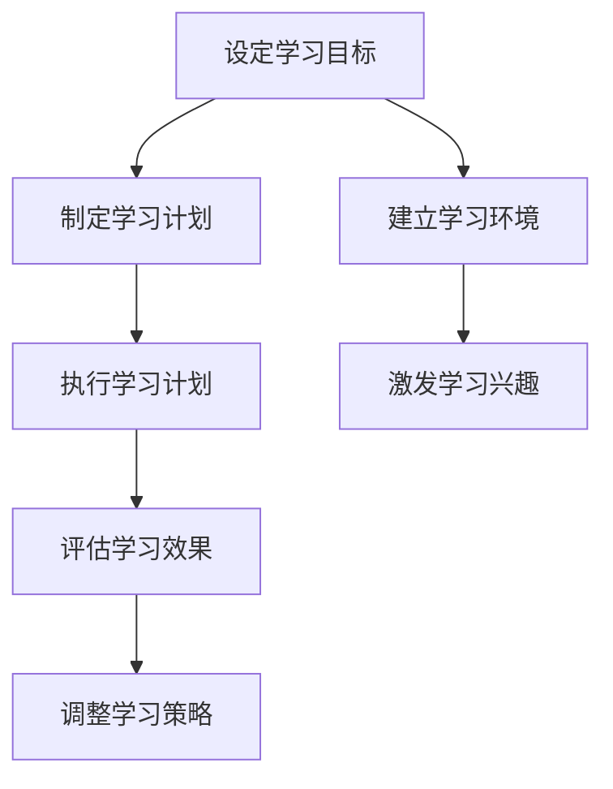

#### 4.2 创新思维训练

创新思维训练是培养知识型企业家精神的重要环节。以下是一个创新思维训练的简略过程：

1. **头脑风暴**：通过头脑风暴激发创意，收集各种可能的创新点。
2. **思维导图**：使用思维导图将创意可视化，梳理思路，形成完整的创新方案。
3. **逆向思维**：从不同的角度思考问题，发现新的解决方案。
4. **多角度分析**：从不同角度分析问题，确保创新方案的全面性。

**图 4.2 创新思维训练的方法**

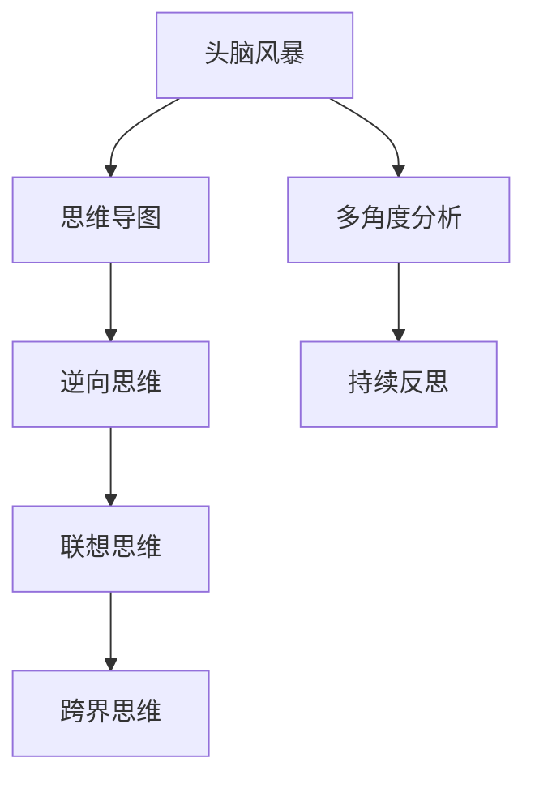

#### 4.3 领导力提升策略

领导力提升策略是培养知识型企业家精神的重要方面。以下是一个领导力提升策略的简略过程：

1. **自我认知**：了解自己的领导风格和优势，识别需要改进的领域。
2. **角色扮演**：通过角色扮演和情景模拟提升领导能力。
3. **反馈与改进**：定期接受反馈，根据反馈进行改进。
4. **团队建设**：建立高效的团队，培养团队成员的领导能力。

**图 4.3 领导力提升的策略**

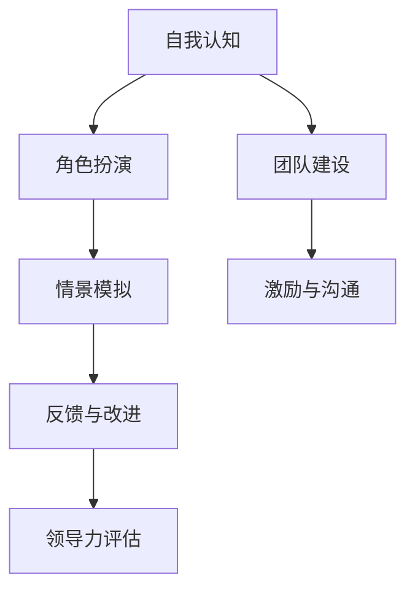

#### 4.4 团队建设与管理技巧

团队建设与管理技巧是知识型企业家精神的重要组成部分。以下是一个团队建设与管理技巧的简略过程：

1. **确定团队目标**：明确团队的目标和愿景，确保团队成员共同追求。
2. **角色分配**：根据团队成员的特长和兴趣，合理分配任务。
3. **制定行动计划**：制定详细的行动计划，明确任务的执行流程和时间表。
4. **监督与协调**：监督任务的执行，协调团队成员的合作，确保项目顺利推进。
5. **反馈与评估**：定期进行反馈和评估，根据结果进行调整和改进。

**图 4.4 团队建设与管理的步骤**

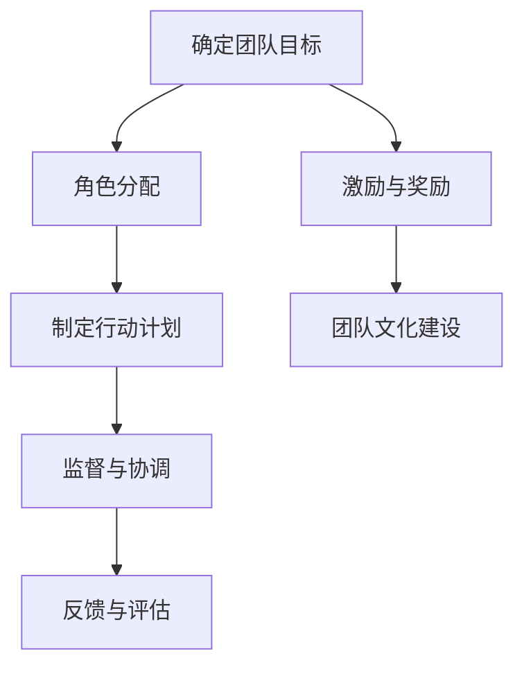

#### 4.5 应对挑战与危机管理

应对挑战与危机管理是知识型企业家精神的关键能力。以下是一个应对挑战与危机管理的简略过程：

1. **识别风险**：通过风险评估工具和风险识别方法，识别潜在的风险。
2. **风险评估**：对识别出的风险进行评估，确定风险的严重程度和可能性。
3. **制定应对计划**：根据风险评估结果，制定具体的应对计划和预防措施。
4. **实施应对措施**：在风险发生时，迅速实施应对措施，减轻风险的影响。
5. **评估应对效果**：对应对措施的效果进行评估，根据评估结果进行调整和改进。

**图 4.5 应对挑战与危机管理的策略**

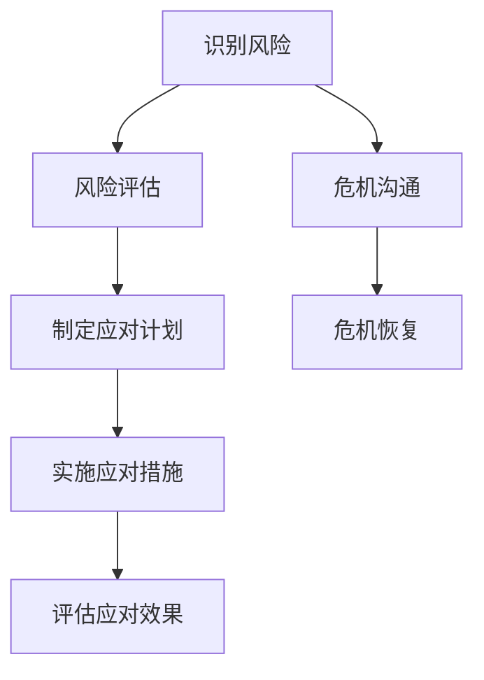

### 第5章：知识型企业家精神的培养案例分析

#### 5.1 国内外成功案例分析

本节将介绍一些国内外成功案例，分析其成功原因，以期为读者提供借鉴和启示。

1. **阿里巴巴**：阿里巴巴的成功在于其不断创新和拓展市场，从电子商务扩展到云计算、数字支付等多个领域。其成功原因包括：
   - **持续创新**：阿里巴巴始终保持创新思维，不断推出新产品和服务。
   - **市场洞察**：马云及其团队具备敏锐的市场洞察力，能够准确把握市场趋势。

2. **腾讯**：腾讯的成功在于其强大的社交网络和游戏业务。其成功原因包括：
   - **团队建设**：腾讯注重团队建设，培养了一支高效的团队。
   - **风险应对**：腾讯能够迅速应对市场变化和竞争压力，调整战略。

3. **微软**：微软的成功在于其在操作系统和办公软件领域的领先地位。其成功原因包括：
   - **技术创新**：微软持续投入研发，推动技术创新。
   - **持续改进**：微软不断优化产品和服务，提升用户体验。

#### 5.2 失败案例分析

本节将介绍一些国内外失败案例，分析其失败原因，以期为读者提供教训和警示。

1. **诺基亚**：诺基亚的失败在于其未能及时适应市场变化，导致市场份额大幅下降。其失败原因包括：
   - **创新不足**：诺基亚在智能手机时代未能及时推出具有竞争力的产品。
   - **战略失误**：诺基亚在战略决策上出现失误，未能及时调整业务方向。

2. **卓越网**：卓越网的失败在于其与阿里巴巴的竞争中被挤出市场。其失败原因包括：
   - **市场定位不清**：卓越网未能准确把握市场定位，与阿里巴巴竞争激烈。
   - **资源不足**：卓越网在资源投入上无法与阿里巴巴相比，导致竞争力不足。

3. **维维克电子**：维维克电子的失败在于其产品研发不足，导致市场份额大幅下降。其失败原因包括：
   - **创新不足**：维维克电子在产品研发上投入不足，导致产品缺乏竞争力。
   - **市场反应迟缓**：维维克电子未能及时应对市场变化，导致市场份额下降。

#### 5.3 从案例中汲取经验与教训

通过分析成功和失败案例，我们可以得出以下经验和教训：

1. **持续创新**：企业要保持持续创新，不断推出新产品和服务，以适应市场变化。
2. **市场洞察**：企业要具备敏锐的市场洞察力，准确把握市场趋势，制定正确的战略。
3. **团队建设**：企业要注重团队建设，培养高效团队，提高企业执行力。
4. **风险应对**：企业要具备良好的风险应对能力，及时识别和应对潜在风险。
5. **资源整合**：企业要善于整合资源，提高竞争力，实现可持续发展。

### 第6章：知识型企业家精神的时代背景

#### 6.1 科技创新对企业家精神的影响

科技创新是推动企业家精神发展的重要动力。以下是一个科技创新对企业家精神影响的简略过程：

1. **技术创新**：企业通过技术创新提高产品和服务质量，提升市场竞争力。
2. **商业模式创新**：企业通过商业模式创新，开拓新的市场空间，实现盈利增长。
3. **管理创新**：企业通过管理创新，提高企业运营效率，降低成本。

**图 6.1 科技创新与企业家精神的互动**

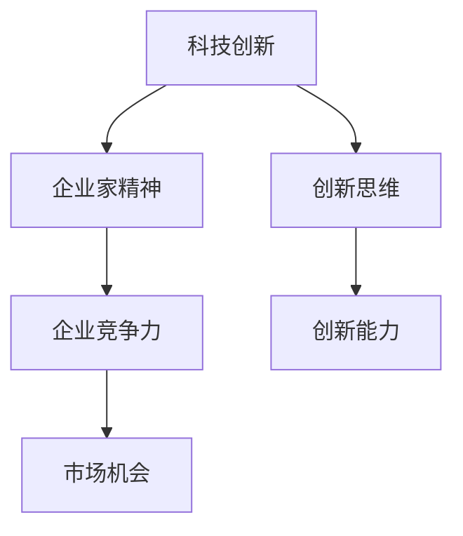

#### 6.2 经济环境与企业家精神的关系

经济环境是企业家精神发展的重要背景。以下是一个经济环境与企业家精神关系的简略过程：

1. **经济繁荣**：在经济繁荣时期，企业有更多的市场机会和发展空间。
2. **经济危机**：在经济危机时期，企业需要具备更强的抗风险能力，才能生存和发展。
3. **政策支持**：政府的政策支持对企业家精神的发展有重要影响。

**图 6.2 经济环境与企业家精神的影响**

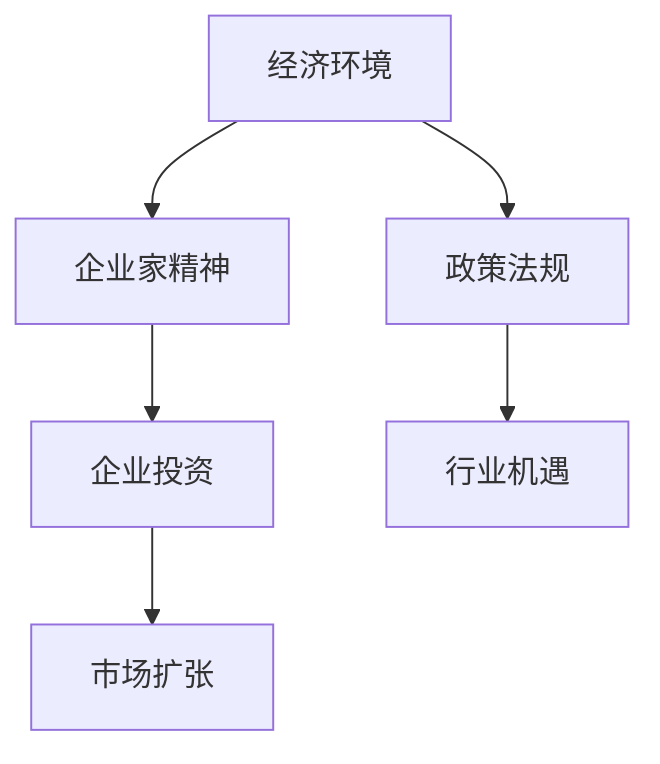

#### 6.3 社会责任与企业家精神

社会责任是企业家精神的重要组成部分。以下是一个社会责任与企业家精神关系的简略过程：

1. **企业社会责任**：企业要承担社会责任，关注环境保护、员工福利和社会公益。
2. **企业道德**：企业要遵守企业道德，树立良好的企业形象。
3. **可持续发展**：企业要实现可持续发展，为社会发展做出贡献。

**图 6.3 社会责任与企业家精神的相互关系**

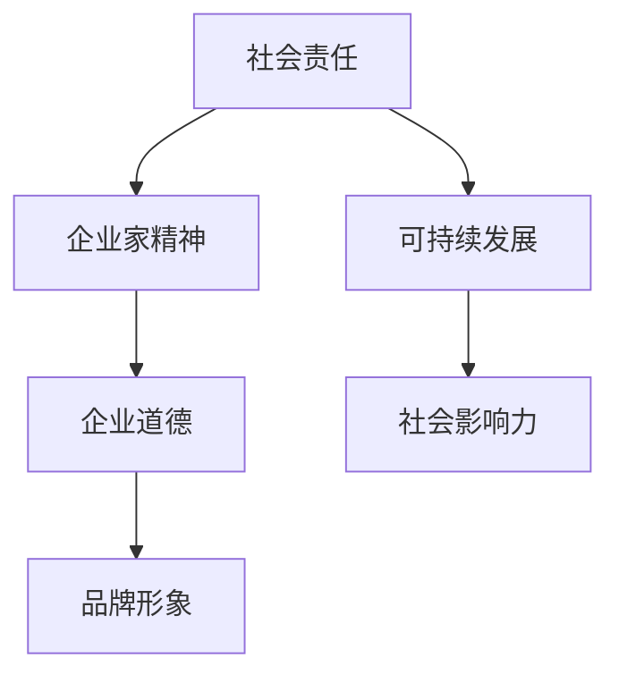

### 第7章：知识型企业家精神的未来发展

#### 7.1 知识型企业家精神的趋势分析

知识型企业家精神的未来发展将受到以下几个趋势的影响：

1. **数字化转型**：随着数字化技术的快速发展，企业将更加依赖数字技术和数据驱动决策。
2. **全球化视野**：全球化趋势将使企业家需要具备全球视野，了解不同国家和地区的市场和文化。
3. **可持续发展**：企业家将更加关注可持续发展，推动企业在环境保护、社会责任和经济效益之间实现平衡。

**图 7.1 知识型企业家精神的发展趋势**

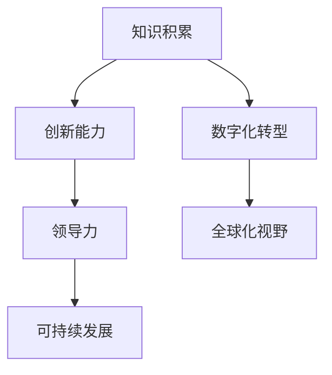

#### 7.2 知识型企业家精神在新时代的使命

在新时代，知识型企业家精神将承担以下使命：

1. **引领科技创新**：企业家要推动科技创新，提升企业竞争力，为社会发展做出贡献。
2. **推动社会进步**：企业家要关注社会问题，通过创新和创业推动社会进步。
3. **促进经济发展**：企业家要把握市场机遇，推动企业成长，促进经济发展。

**图 7.2 知识型企业家精神在新时代的使命**

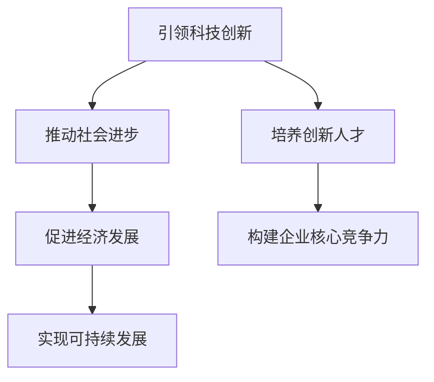

#### 7.3 知识型企业家精神的培养与传承

知识型企业家精神的培养和传承是企业可持续发展的重要保障。以下是一个知识型企业家精神的培养与传承路径：

1. **教育背景**：通过教育背景提供知识基础和技能培养。
2. **实践经验**：通过实践经验和案例分析提高实际操作能力。
3. **社交网络**：通过社交网络和资源整合获取信息和资源。
4. **自我提升**：通过自我认知和能力提升实现个人成长。
5. **创新能力**：通过创新能力的培养推动企业持续发展。

**图 7.3 知识型企业家精神的培养与传承路径**

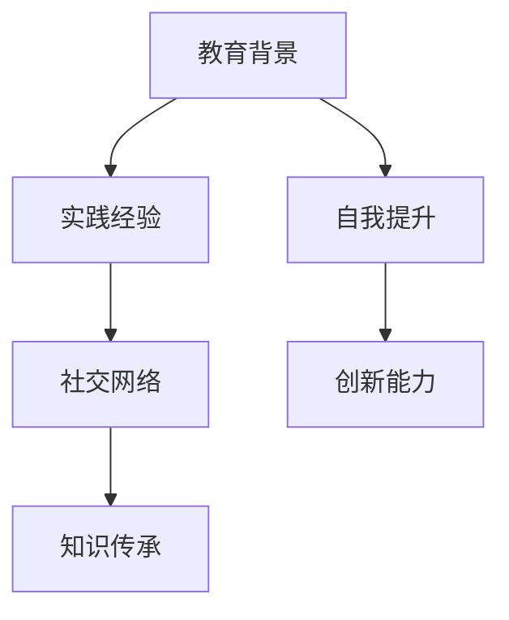

### 第8章：知识型企业家精神的实践应用

#### 8.1 在企业管理中的应用

知识型企业家精神在企业管理中的应用主要体现在以下几个方面：

1. **战略规划**：通过知识积累和创新思维，制定符合企业发展的战略规划。
2. **团队管理**：通过领导力和团队管理技巧，建立高效的团队，提高工作效率。
3. **风险管理**：通过风险识别和应对策略，降低企业风险，保障企业稳健发展。

**图 8.1 知识型企业家精神在企业管理中的应用场景**

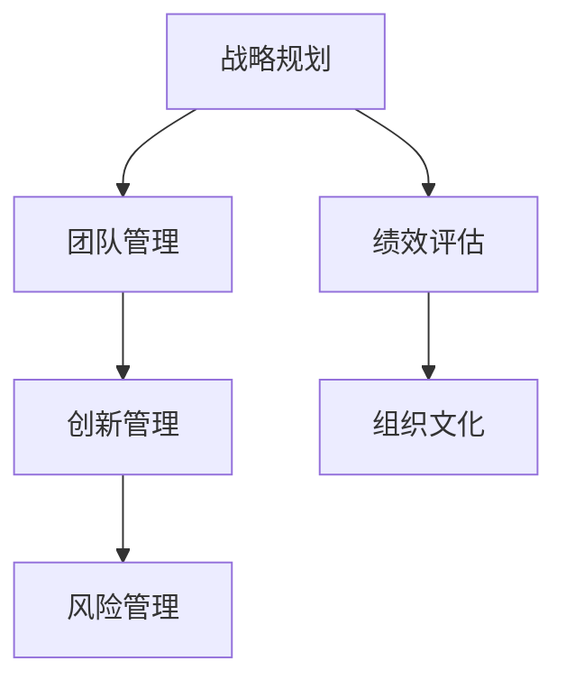

#### 8.2 在技术创新中的应用

知识型企业家精神在技术创新中的应用主要体现在以下几个方面：

1. **知识积累**：通过持续学习和创新，积累技术知识和经验。
2. **市场需求**：通过市场调研和用户反馈，了解市场需求，推动技术创新。
3. **竞争分析**：通过竞争分析，发现竞争对手的优势和劣势，制定有针对性的创新策略。

**图 8.2 知识型企业家精神在技术创新中的应用路径**

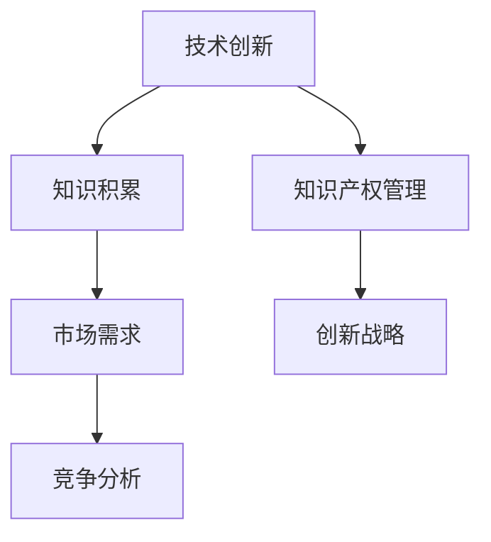

#### 8.3 在社会公益中的应用

知识型企业家精神在社会公益中的应用主要体现在以下几个方面：

1. **社会责任**：企业要承担社会责任，关注环境保护、员工福利和社会公益。
2. **知识分享**：企业通过分享知识和经验，推动社会进步。
3. **社会参与**：企业积极参与社会公益活动，提升企业形象。

**图 8.3 知识型企业家精神在社会公益中的应用领域**

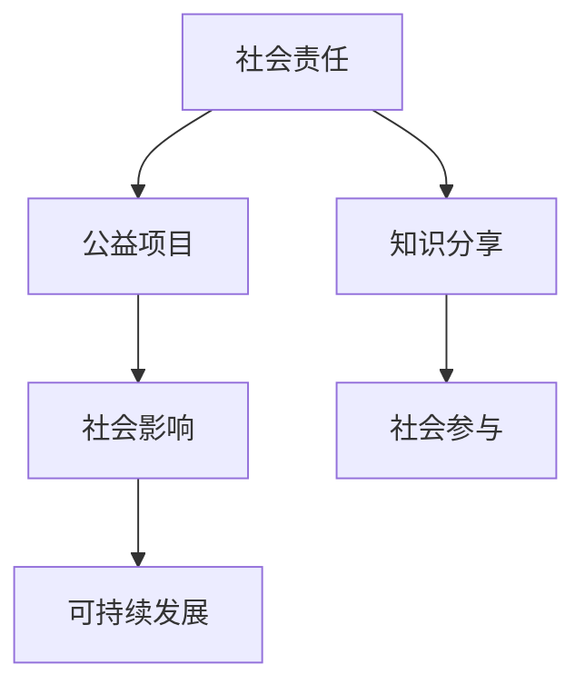

### 附录：知识型企业家精神相关资源与工具

#### 附录 A：知识型企业家精神研究文献与资料

以下是一些关于知识型企业家精神的研究文献和资料推荐：

1. **《知识型企业家精神》** - 李明，清华大学出版社
2. **《创新者的思考方式》** - 克里斯·阿吉里斯，电子工业出版社
3. **《企业家精神》** - 彼得·德鲁克，机械工业出版社

#### 附录 B：知识型企业家精神相关在线课程与书籍推荐

以下是一些关于知识型企业家精神的在线课程和书籍推荐：

1. **《创新思维与知识管理》** - 清华大学
2. **《领导力与团队建设》** - 复旦大学
3. **《企业家精神与企业战略》** - 北京大学

#### 附录 C：知识型企业家精神实践工具与应用案例

以下是一些知识型企业家精神实践工具和应用案例：

1. **MindManager** - 思维导图工具
2. **Minitab** - 数据分析工具
3. **Tableau** - 数据可视化工具

**表 C.2 知识型企业家精神应用案例**

| 企业名称 | 应用领域 | 应用效果 |
| -------- | -------- | -------- |
| 阿里巴巴 | 电商与支付 | 提高运营效率 |
| 腾讯 | 社交与游戏 | 拓展市场空间 |
| 微软 | 软件与服务 | 推动技术创新 |

---

通过本篇文章，我们深入探讨了知识型企业家精神的定义、重要性以及培养方法。希望读者能够从中获得启示，不断提升自己的知识型企业家精神，实现个人和企业的发展。

---

## 作者信息

作者：AI天才研究院（AI Genius Institute）& 《禅与计算机程序设计艺术》（Zen And The Art of Computer Programming）

AI天才研究院是一家专注于人工智能、计算机科学和教育领域的研究机构。我们的目标是培养具备创新精神和实践能力的人工智能专家，推动人工智能技术的发展和应用。同时，我们致力于将人工智能与教育相结合，提升教育质量，培养未来的人才。

《禅与计算机程序设计艺术》是一部经典的计算机科学著作，由计算机科学领域的大师唐纳德·克努特（Donald E. Knuth）所著。本书从哲学和艺术的角度探讨了计算机程序设计的方法和技巧，为计算机科学家和程序员提供了宝贵的启示和指导。通过学习和实践本书中的思想，读者可以提升自己的编程技能和思维能力，成为一名更加优秀和创新的程序员。

