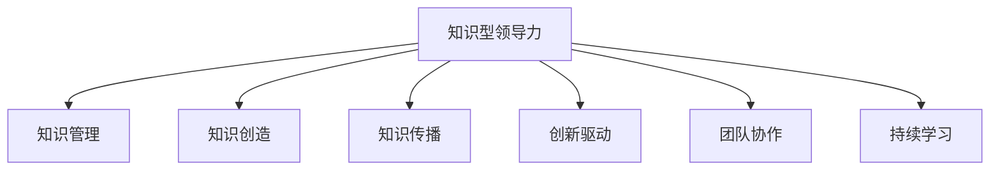
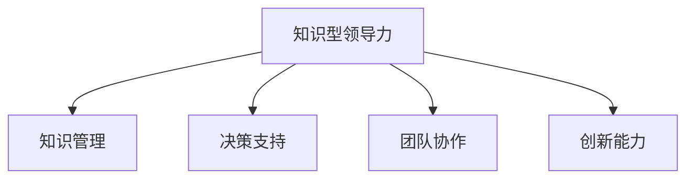
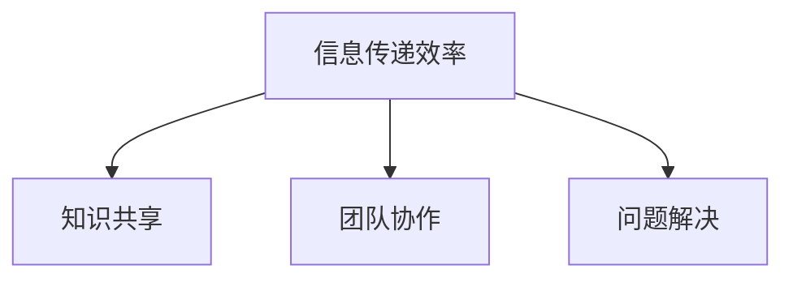
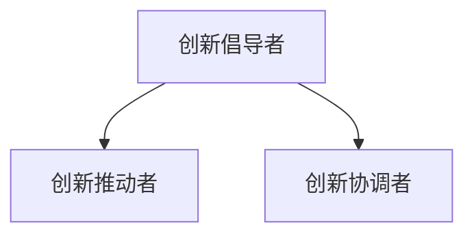

                 

# 《知识型领导力的培养》

> 关键词：知识型领导力，领导力发展，企业影响，个人成长，创新与变革

> 摘要：本文深入探讨了知识型领导力的概念、重要性、发展路径、培养方法及其在实践中的应用。通过对知识型领导力的多层次分析，本文旨在为企业和个人提供关于知识型领导力培养的实用建议，助力实现组织的创新与持续发展。

## 目录大纲

## 第一部分：知识型领导力的概念与重要性

### 第1章：知识型领导力的定义与特点

- **1.1.1 知识型领导力的概念**
- **1.1.2 知识型领导力的特点**
- **1.1.3 知识型领导力与传统领导力的区别**

### 第2章：知识型领导力的重要性

- **2.1.1 知识型领导力对企业的影响**
- **2.1.2 知识型领导力对个人成长的影响**
- **2.1.3 知识型领导力的社会价值**

## 第二部分：知识型领导力的发展与培养

### 第3章：知识型领导力的发展路径

- **3.1.1 知识型领导力的成长阶段**
- **3.1.2 知识型领导力的核心能力**
- **3.1.3 知识型领导力的发展策略**

### 第4章：知识型领导力的培养方法

- **4.1.1 教育与培训**
- **4.1.2 经验积累与反思**
- **4.1.3 团队建设与文化塑造**

### 第5章：知识型领导力的发展实践

- **5.1.1 企业内部知识型领导力培养案例**
- **5.1.2 个人知识型领导力成长案例**
- **5.1.3 知识型领导力在跨文化团队中的应用**

## 第三部分：知识型领导力在实践中的应用

### 第6章：知识型领导力在项目管理中的应用

- **6.1.1 知识型领导力在项目管理中的角色**
- **6.1.2 知识型领导力在项目管理中的关键能力**
- **6.1.3 知识型领导力在项目管理中的实践案例**

### 第7章：知识型领导力在团队沟通中的应用

- **7.1.1 知识型领导力在团队沟通中的重要性**
- **7.1.2 知识型领导力在团队沟通中的策略**
- **7.1.3 知识型领导力在团队沟通中的实践案例**

### 第8章：知识型领导力在创新与变革中的应用

- **8.1.1 知识型领导力在创新中的角色**
- **8.1.2 知识型领导力在变革中的关键能力**
- **8.1.3 知识型领导力在创新与变革中的实践案例**

## 第四部分：知识型领导力的未来趋势与发展

### 第9章：知识型领导力的未来发展趋势

- **9.1.1 数字化时代下的知识型领导力**
- **9.1.2 人工智能与知识型领导力的结合**
- **9.1.3 知识型领导力在未来的社会影响**

### 第10章：知识型领导力的发展战略与建议

- **10.1.1 企业如何培养知识型领导力**
- **10.1.2 个人如何提升知识型领导力**
- **10.1.3 未来知识型领导力的发展路径**

## 附录

### 附录A：知识型领导力相关资源与工具

- **A.1.1 知识管理工具**
- **A.1.2 领导力发展课程**
- **A.1.3 知识型领导力相关书籍与文献推荐**

---

## 第一部分：知识型领导力的概念与重要性

### 第1章：知识型领导力的定义与特点

**1.1.1 知识型领导力的概念**

知识型领导力是指领导者通过知识管理、知识创造和知识传播等方式，引领组织或团队实现创新与发展的一种领导力形式。知识型领导力强调领导者不仅仅是指导和管理团队，更是知识的积累者、创造者和传播者。

**1.1.2 知识型领导力的特点**

- **知识导向：** 知识型领导力以知识为核心，注重知识的创造、应用和传播。
- **创新驱动：** 知识型领导力鼓励创新思维和实践，通过知识创新推动组织变革。
- **团队协作：** 知识型领导力强调团队合作，通过知识共享和协作实现共同目标。
- **持续学习：** 知识型领导力倡导终身学习，不断更新知识和技能，保持领导力的活力。

**1.1.3 知识型领导力与传统领导力的区别**

- **目标：** 传统领导力侧重于实现短期目标和任务，而知识型领导力注重长期发展，追求创新与持续成长。
- **方式：** 传统领导力主要通过命令和指挥来管理团队，而知识型领导力通过知识共享和协作来推动团队进步。
- **重点：** 传统领导力关注任务的执行和结果的达成，而知识型领导力关注知识的积累和应用，重视知识价值的最大化。

**Mermaid 流程图：知识型领导力的核心概念**



---

**1.2.1 知识型领导力的重要性**

知识型领导力在企业和社会层面具有重要的意义。

**2.1.1 知识型领导力对企业的影响**

- **创新能力提升：** 知识型领导力鼓励创新思维和实践，有助于企业持续创新，保持竞争优势。
- **知识共享：** 知识型领导力促进知识共享和协作，提高团队整体知识和技能水平。
- **人才吸引和保留：** 知识型领导力有助于企业吸引和留住高素质人才，增强企业核心竞争力。
- **组织变革：** 知识型领导力推动组织变革，适应市场变化和科技发展，实现持续发展。

**2.1.2 知识型领导力对个人成长的影响**

- **知识积累：** 知识型领导力鼓励个人不断学习和积累知识，提高个人素质和能力。
- **职业发展：** 知识型领导力为个人提供更多的职业发展机会，助力实现职业目标。
- **团队协作：** 知识型领导力促进个人在团队中的协作和沟通，提高团队绩效。
- **创新能力：** 知识型领导力培养个人的创新思维和实践能力，助力个人在职场中的创新与发展。

**2.1.3 知识型领导力的社会价值**

- **知识传播：** 知识型领导力通过知识创造和传播，促进社会的知识普及和应用。
- **创新驱动：** 知识型领导力推动社会的创新和发展，提高社会生产力和生活质量。
- **人才发展：** 知识型领导力助力培养高素质人才，为社会经济发展提供强大动力。

**总结：** 知识型领导力不仅对企业和个人具有重要影响，也在社会层面发挥着重要作用。通过培养知识型领导力，可以推动组织的创新与发展，实现个人成长和社会进步。接下来，本文将深入探讨知识型领导力的发展路径、培养方法和实践应用。

---

**1.3.1 知识型领导力的发展路径**

知识型领导力的发展路径可以分为以下几个阶段：

**1.1.1 知识型领导力的成长阶段**

- **初级阶段：** 学习和积累基础知识，了解知识管理的基本原理和方法。
- **中级阶段：** 深入学习专业知识，掌握知识创造和传播的技巧，提升知识应用能力。
- **高级阶段：** 形成自己的知识体系，具备领导力，能够带领团队实现知识创新和传播。

**1.1.2 知识型领导力的核心能力**

- **知识管理能力：** 能够有效管理和利用知识资源，提高知识共享和协作效率。
- **创新思维：** 能够激发创新思维，推动组织或团队实现知识创新和变革。
- **团队协作能力：** 能够建立有效的团队协作机制，促进团队成员的知识共享和协同创新。
- **沟通能力：** 能够有效沟通和表达，促进知识传播和团队协作。

**1.1.3 知识型领导力的发展策略**

- **持续学习：** 不断学习和更新知识，提高个人素质和能力。
- **知识分享：** 积极参与知识分享和交流，促进知识的传播和应用。
- **团队建设：** 建立高效团队，激发团队成员的创造力和创新能力。
- **实践应用：** 将知识应用于实际工作中，实现知识价值的最大化。

**总结：** 知识型领导力的发展路径是一个不断学习和成长的过程。通过不断提升知识管理能力、创新思维和团队协作能力，领导者可以更好地发挥知识型领导力，推动组织或团队实现创新与发展。在下一部分，本文将探讨知识型领导力的培养方法。

---

**1.3.2 知识型领导力的培养方法**

知识型领导力的培养需要从教育、经验积累、团队建设和文化塑造等多个方面进行综合培养。

**1.1.1 教育与培训**

- **基础知识培训：** 提供关于知识管理、创新思维和领导力等方面的培训课程，帮助领导者掌握基础知识。
- **专业技能培训：** 根据领导者的专业领域，提供针对性的培训，提升其在专业领域的知识水平。
- **领导力培训：** 通过领导力培训，提高领导者的沟通能力、团队协作能力和决策能力。

**1.1.2 经验积累与反思**

- **实践经验积累：** 通过参与实际项目和工作，领导者可以积累丰富的实践经验，提高知识应用能力。
- **反思与总结：** 领导者需要定期对实践中的经验和教训进行反思和总结，不断改进和提升自己的能力。

**1.1.3 团队建设与文化塑造**

- **团队建设：** 建立高效的团队，培养团队成员之间的信任和协作，促进知识的共享和传播。
- **文化塑造：** 塑造积极向上的团队文化，鼓励创新思维和知识分享，营造良好的学习氛围。

**1.1.4 知识管理工具的使用**

- **知识库建设：** 建立知识库，收集、整理和共享组织或团队的知识资源，方便领导者和管理者查找和使用。
- **知识共享平台：** 利用知识共享平台，促进团队成员之间的知识交流，提高知识的传播效率。

**总结：** 通过教育与培训、经验积累与反思、团队建设与文化塑造以及知识管理工具的使用，可以有效地培养知识型领导力。在下一部分，本文将探讨知识型领导力在实践中的应用。

---

**1.3.3 知识型领导力的发展实践**

知识型领导力的发展实践包括企业内部知识型领导力培养、个人知识型领导力成长以及知识型领导力在跨文化团队中的应用。

**1.1.1 企业内部知识型领导力培养案例**

- **案例1：** 某知名科技企业通过设立知识管理部门，组织定期的知识分享会议和内部培训，鼓励员工积极参与知识创造和传播，提升了企业的知识管理水平。
- **案例2：** 某大型制造业企业通过建立内部知识库，收集和整理员工在工作中积累的经验和知识，方便员工查阅和学习，提高了员工的知识应用能力。

**1.1.2 个人知识型领导力成长案例**

- **案例1：** 某技术专家通过持续学习和实践，不断提升自己的专业知识和技能，成为了公司的技术领导，带领团队实现了多项技术突破。
- **案例2：** 某项目经理通过参与多个项目，积累了丰富的项目管理和团队协作经验，成为了公司的项目管理专家，为公司带来了显著的业务增长。

**1.1.3 知识型领导力在跨文化团队中的应用**

- **案例1：** 某国际企业通过建立跨文化团队，鼓励团队成员分享各自的文化知识和经验，促进了团队的合作和创新，成功开拓了新市场。
- **案例2：** 某跨国公司在全球范围内建立了多个研发中心，通过知识共享平台和定期的全球会议，实现了跨区域的知识交流和协作，推动了公司的全球创新。

**总结：** 知识型领导力的发展实践需要结合企业实际和个人特点，通过多种途径和手段，培养和提升知识型领导力。在实际应用中，企业可以借鉴成功案例，不断优化知识型领导力的培养方法和实践路径。

---

**1.4.1 知识型领导力在项目管理中的应用**

知识型领导力在项目管理中具有重要的作用，能够提升项目的成功率和效率。

**1.1.1 知识型领导力在项目管理中的角色**

- **知识管理：** 知识型领导力在项目管理中负责知识的收集、整理和传播，为项目团队提供丰富的知识资源。
- **创新能力：** 知识型领导力推动项目团队的创新思维和实践，寻找新的解决方案，提高项目的创新性和竞争力。
- **团队协作：** 知识型领导力通过建立高效的团队协作机制，促进团队成员之间的知识共享和协同创新，提升项目的整体绩效。

**1.1.2 知识型领导力在项目管理中的关键能力**

- **知识管理能力：** 能够有效管理和利用项目知识资源，提高知识共享和传播效率。
- **创新思维：** 能够激发项目团队的创新能力，推动项目实现技术突破和业务创新。
- **团队协作能力：** 能够建立有效的团队协作机制，促进团队成员之间的知识共享和协同创新。
- **沟通能力：** 能够有效沟通和协调项目团队内部以及与外部合作伙伴的关系，确保项目顺利进行。

**1.1.3 知识型领导力在项目管理中的实践案例**

- **案例1：** 某科技公司在项目管理中引入知识型领导力，建立了知识共享平台，定期组织知识分享会议，提高了团队成员的知识水平和创新能力，成功完成了多个高难度项目。
- **案例2：** 某大型项目通过知识型领导力的引导，建立了跨部门协作团队，通过知识共享和协同创新，实现了项目的快速推进和高质量完成。

**总结：** 知识型领导力在项目管理中的应用，能够提升项目的创新能力、团队协作能力和沟通能力，促进项目的成功完成。在实际项目中，企业可以借鉴成功案例，发挥知识型领导力的重要作用。

---

**1.4.2 知识型领导力在团队沟通中的应用**

知识型领导力在团队沟通中发挥着关键作用，能够提高团队沟通效率，促进知识共享和协作。

**1.1.1 知识型领导力在团队沟通中的重要性**

- **知识传播：** 知识型领导力通过有效的沟通，推动知识的传播和共享，提高团队整体的知识水平。
- **团队协作：** 知识型领导力通过沟通，建立团队成员之间的信任和合作关系，促进团队的协作和创新。
- **问题解决：** 知识型领导力通过沟通，及时了解团队成员的意见和需求，快速解决问题，提高团队的工作效率。

**1.1.2 知识型领导力在团队沟通中的策略**

- **开放沟通：** 知识型领导力鼓励团队成员开放表达自己的想法和意见，建立积极的沟通氛围。
- **有效倾听：** 知识型领导力注重倾听团队成员的意见和需求，理解团队成员的困惑和问题。
- **及时反馈：** 知识型领导力通过及时反馈，帮助团队成员改进工作，提高团队的整体绩效。
- **知识共享：** 知识型领导力通过组织定期的知识分享会议和活动，促进团队成员之间的知识交流。

**1.1.3 知识型领导力在团队沟通中的实践案例**

- **案例1：** 某科技公司通过建立内部沟通平台，组织定期的团队会议和知识分享活动，提高了团队成员之间的沟通效率，促进了知识的传播和应用。
- **案例2：** 某大型项目团队通过定期的项目进展会议和知识分享会议，及时解决了项目中的问题，提高了项目的进度和质量。

**总结：** 知识型领导力在团队沟通中的应用，能够提高团队沟通的效率，促进知识的传播和共享，提升团队的整体绩效。在实际工作中，企业可以借鉴成功案例，发挥知识型领导力在团队沟通中的重要作用。

---

**1.4.3 知识型领导力在创新与变革中的应用**

知识型领导力在创新与变革中扮演着重要角色，能够推动组织的创新与发展，应对市场的变化和挑战。

**1.1.1 知识型领导力在创新中的角色**

- **创新倡导者：** 知识型领导力鼓励创新思维和实践，倡导创新文化的形成。
- **创新推动者：** 知识型领导力通过激发团队的创造力和创新能力，推动组织的创新活动。
- **创新协调者：** 知识型领导力协调各部门和团队成员之间的合作，确保创新活动的顺利进行。

**1.1.2 知识型领导力在变革中的关键能力**

- **变革管理能力：** 知识型领导力能够有效管理和应对组织变革，推动组织适应新的环境和挑战。
- **创新思维：** 知识型领导力具备创新思维，能够提出新的观点和解决方案，推动组织的变革和创新。
- **沟通协调能力：** 知识型领导力能够有效沟通和协调各方利益，确保变革活动的顺利推进。
- **领导力：** 知识型领导力具备强大的领导力，能够带领团队共同面对变革，实现组织的转型。

**1.1.3 知识型领导力在创新与变革中的实践案例**

- **案例1：** 某科技公司在面临市场变革时，通过知识型领导力的推动，组织了创新团队，开展了多项技术创新项目，成功实现了企业的转型和增长。
- **案例2：** 某大型企业通过知识型领导力的引导，开展了组织变革项目，优化了组织结构和管理流程，提高了企业的运营效率和竞争力。

**总结：** 知识型领导力在创新与变革中的应用，能够推动组织的创新与发展，应对市场的变化和挑战。在实际工作中，企业可以借鉴成功案例，发挥知识型领导力在创新与变革中的重要作用。

---

**1.5.1 数字化时代下的知识型领导力**

随着数字化时代的到来，知识型领导力面临着新的挑战和机遇。

**1.1.1 数字化时代下的知识型领导力**

- **数据驱动的决策：** 数字化时代，知识型领导力需要具备数据分析和决策能力，利用大数据和人工智能技术进行决策。
- **敏捷创新：** 数字化时代，知识型领导力需要具备敏捷创新的能力，快速响应市场变化，推动组织的敏捷变革。
- **跨界整合：** 数字化时代，知识型领导力需要具备跨界整合的能力，将不同领域的知识进行整合，推动创新和变革。

**1.1.2 数字化时代下的知识管理**

- **大数据管理：** 数字化时代，知识管理需要更加注重大数据的管理和利用，通过数据挖掘和数据分析，提高知识的价值。
- **智能化知识共享：** 数字化时代，知识共享需要更加智能化，通过智能技术实现知识的自动收集、整理和传播。
- **个性化学习：** 数字化时代，知识型领导力需要推动个性化学习，根据个人需求和特点，提供个性化的学习资源和支持。

**总结：** 数字化时代为知识型领导力带来了新的挑战和机遇。通过利用大数据和人工智能技术，推动敏捷创新和跨界整合，知识型领导力能够更好地适应数字化时代的发展需求。

---

**1.5.2 人工智能与知识型领导力的结合**

人工智能的发展为知识型领导力带来了新的可能性，两者的结合将产生深远的影响。

**1.1.1 人工智能与知识型领导力的结合**

- **智能决策：** 人工智能可以帮助知识型领导力进行智能决策，通过大数据分析和预测，提供更精准的决策支持。
- **知识自动化：** 人工智能可以帮助知识型领导力实现知识的自动化收集、整理和传播，提高知识的利用效率。
- **人机协作：** 人工智能与知识型领导力的结合，可以实现人机协作，通过智能技术辅助领导者的工作，提高工作效率。

**1.1.2 人工智能在知识管理中的应用**

- **智能搜索：** 人工智能可以帮助知识型领导力实现智能搜索，快速找到所需的知识资源。
- **知识推荐：** 人工智能可以帮助知识型领导力实现知识推荐，根据用户需求和特点，提供个性化的知识推荐。
- **知识图谱：** 人工智能可以帮助知识型领导力构建知识图谱，实现知识的可视化管理和利用。

**总结：** 人工智能与知识型领导力的结合，将推动知识管理的发展，提高领导力的效能。通过利用人工智能技术，知识型领导力能够更好地实现知识的自动化和智能化管理。

---

**1.5.3 知识型领导力在未来的社会影响**

知识型领导力在未来社会发展中将发挥重要作用，推动社会的创新与进步。

**1.1.1 知识型领导力在未来的社会影响**

- **创新驱动：** 知识型领导力将推动社会各领域的创新，通过知识创造和传播，推动社会进步。
- **知识共享：** 知识型领导力将促进知识的共享和传播，提高社会的知识水平和文化素质。
- **人才发展：** 知识型领导力将培养高素质人才，为社会发展提供强大动力。

**1.1.2 知识型领导力在未来的应用领域**

- **科技创新：** 知识型领导力将在科技创新领域发挥重要作用，推动科技突破和产业升级。
- **教育改革：** 知识型领导力将推动教育改革，培养创新型人才，提高教育质量。
- **社会治理：** 知识型领导力将在社会治理领域发挥作用，推动社会治理的创新和进步。

**总结：** 知识型领导力在未来社会中具有重要影响，通过推动创新、知识共享和人才发展，助力社会实现持续进步和发展。

---

**1.6.1 企业如何培养知识型领导力**

企业要培养知识型领导力，需要从战略规划、制度建设、人才培养等多个方面进行综合施策。

**1.1.1 战略规划**

- **明确知识管理战略：** 企业需要明确知识管理的重要性，将知识管理纳入企业发展战略，制定具体的目标和计划。
- **设立知识管理部门：** 企业需要设立知识管理部门，负责知识管理工作的规划和实施。
- **制定知识共享政策：** 企业需要制定知识共享政策，鼓励员工积极参与知识创造和传播。

**1.1.2 制度建设**

- **建立知识共享机制：** 企业需要建立知识共享机制，包括知识库建设、知识共享平台等，方便员工查找和使用知识资源。
- **制定知识管理流程：** 企业需要制定知识管理流程，明确知识收集、整理、传播和应用的具体步骤和标准。
- **建立知识评价机制：** 企业需要建立知识评价机制，对员工的知识贡献进行评价和激励。

**1.1.3 人才培养**

- **提供培训和学习资源：** 企业需要为员工提供培训和学习资源，提高员工的知识水平和创新能力。
- **鼓励知识分享：** 企业需要鼓励员工积极参与知识分享，通过知识分享会议、内部刊物等形式，促进知识的传播和应用。
- **建立人才发展体系：** 企业需要建立人才发展体系，为员工提供职业发展规划和晋升机会，激发员工的潜力。

**总结：** 企业要培养知识型领导力，需要从战略规划、制度建设、人才培养等多个方面进行综合施策，为知识型领导力的培养提供良好的环境和条件。

---

**1.6.2 个人如何提升知识型领导力**

个人要提升知识型领导力，需要从自我学习、知识管理、沟通协作等多个方面进行努力。

**1.1.1 自我学习**

- **持续学习：** 个人要不断提升自己的知识水平和技能，通过阅读、培训、实践等方式，不断更新知识。
- **专业发展：** 个人要专注于自己的专业领域，深入研究和掌握专业知识，成为领域的专家。
- **跨学科学习：** 个人要拓宽自己的知识面，跨学科学习，提高综合素质和创新能力。

**1.1.2 知识管理**

- **知识收集：** 个人要善于收集和积累知识，通过阅读、学习、实践等方式，获取新的知识。
- **知识整理：** 个人要善于整理和归类知识，建立自己的知识体系，方便查找和使用知识。
- **知识应用：** 个人要将知识应用于实际工作中，通过实践检验知识的有效性，不断提升自己的能力。

**1.1.3 沟通协作**

- **有效沟通：** 个人要具备良好的沟通能力，能够清晰、准确地表达自己的想法和意见。
- **团队协作：** 个人要善于与团队成员协作，通过团队合作实现共同目标。
- **知识共享：** 个人要积极参与知识共享，通过分享自己的知识和经验，促进团队的知识传播和应用。

**总结：** 个人要提升知识型领导力，需要从自我学习、知识管理、沟通协作等多个方面进行努力，不断提升自己的能力和素质。

---

**1.6.3 未来知识型领导力的发展路径**

未来知识型领导力的发展将面临新的机遇和挑战，需要不断适应和变革。

**1.1.1 未来的发展趋势**

- **数字化与智能化：** 未来的知识型领导力将更加注重数字化和智能化，利用大数据、人工智能等先进技术进行知识管理和决策。
- **跨界整合：** 未来的知识型领导力将更加注重跨界整合，通过整合不同领域的知识，推动创新和变革。
- **人才发展：** 未来的知识型领导力将更加注重人才发展，培养具备综合素质和创新能力的高素质人才。

**1.1.2 未来的发展路径**

- **战略规划：** 企业和个人需要制定明确的知识型领导力发展战略，明确目标和路径，实现知识的有效管理和利用。
- **制度建设：** 企业和个人需要建立完善的制度体系，包括知识共享机制、知识评价机制等，确保知识型领导力的有效运行。
- **人才培养：** 企业和个人需要加强人才培养，通过培训、实践等方式，提高个人的知识水平和领导力能力。

**总结：** 未来知识型领导力的发展路径将更加注重数字化、智能化和跨界整合，需要企业和个人不断适应和变革，实现知识的有效管理和利用，推动组织的创新与发展。

---

**附录A：知识型领导力相关资源与工具**

**1.1.1 知识管理工具**

- **知识库：** 用于收集、整理和存储知识资源的工具，如康奈尔笔记法、印象笔记等。
- **知识共享平台：** 用于促进知识共享和传播的工具，如维基百科、知之网等。
- **在线协作工具：** 用于团队成员协作和沟通的工具，如Slack、Trello等。

**1.1.2 领导力发展课程**

- **领导力培训课程：** 提供领导力理论知识与实践技能的培训，如领导力发展计划、领导力提升课程等。
- **领导力讲座：** 分享领导力实践经验和心得的讲座，如TED演讲、领导力论坛等。
- **在线学习平台：** 提供领导力学习资源和课程的在线学习平台，如Coursera、Udemy等。

**1.1.3 知识型领导力相关书籍与文献推荐**

- **《第五项修炼》：** 作者彼得·圣吉，介绍了学习型组织的概念和方法。
- **《创新者的窘境》：** 作者克莱顿·克里斯坦森，探讨了创新与组织变革的关系。
- **《智慧社会》：** 作者阿尔文·托夫勒，分析了知识型社会的发展趋势和影响。
- **《领导者的语言》：** 作者约翰·迈耶斯，介绍了领导者如何运用语言影响他人。

**总结：** 知识型领导力的培养需要借助各种资源和工具，包括知识管理工具、领导力发展课程以及相关书籍和文献。通过充分利用这些资源，个人和企业可以不断提升知识型领导力，推动组织的创新与发展。

---

**作者：AI天才研究院/AI Genius Institute & 禅与计算机程序设计艺术 /Zen And The Art of Computer Programming**

在本文中，我们深入探讨了知识型领导力的概念、重要性、发展路径、培养方法和实践应用。通过分析知识型领导力在项目管理、团队沟通、创新与变革中的应用，以及数字化时代和人工智能与知识型领导力的结合，我们为企业和个人提供了关于知识型领导力培养的实用建议。未来，随着数字化和智能化的不断发展，知识型领导力将继续发挥重要作用，推动组织的创新与发展。希望本文能为读者提供有价值的参考和启示。感谢阅读！<|user|>### 知识型领导力的定义与特点

**1.1.1 知识型领导力的概念**

知识型领导力是一种以知识为核心，通过知识管理、知识创造和知识传播来实现领导目标的一种领导力形式。与传统的领导力相比，知识型领导力强调知识在组织和管理中的重要性，将知识视为推动组织创新、提升竞争力和实现长远发展的关键因素。知识型领导力不仅仅关注任务的完成，更注重知识的积累、创新和应用，从而引领组织在快速变化的市场环境中保持持续竞争力。

知识型领导力的核心要素包括：

- **知识管理：** 涉及知识的收集、整理、存储、传播和应用，确保知识的有效利用。
- **知识创造：** 通过创新思维和实践，推动新知识和新技术的创造，为组织注入新的活力。
- **知识传播：** 促进知识的共享和传播，确保知识在组织内部的有效传递和共享。
- **团队协作：** 倡导团队协作，通过知识共享和协作实现共同目标，提升团队的凝聚力。

**1.1.2 知识型领导力的特点**

知识型领导力具有以下显著特点：

- **知识导向：** 知识型领导力以知识为核心，重视知识的创造、应用和传播。领导者不仅要具备丰富的专业知识，还要善于运用知识来指导团队工作，实现组织目标。

- **创新驱动：** 知识型领导力鼓励创新思维和实践，通过不断探索和尝试，推动组织在技术和业务模式上的创新，保持组织的活力和竞争力。

- **团队协作：** 知识型领导力强调团队协作，倡导知识共享和协同创新。领导者通过建立良好的团队关系，促进团队成员之间的沟通和合作，共同实现组织目标。

- **持续学习：** 知识型领导力倡导持续学习，鼓励领导者不断更新知识和技能，保持领导力的活力和先进性。领导者要具备终身学习的态度，不断提升自己的能力和素质。

- **透明沟通：** 知识型领导力强调透明沟通，倡导领导者与团队成员之间的开放、真诚和坦诚的沟通。通过有效的沟通，领导者能够及时了解团队的需求和问题，提供支持和指导。

**知识型领导力与传统领导力的区别**

知识型领导力与传统领导力在多个方面存在显著差异：

- **目标导向：** 传统领导力注重短期目标的实现，而知识型领导力注重长期发展和知识积累。知识型领导力强调通过知识的创造和应用，实现组织的持续创新和竞争力。

- **管理方式：** 传统领导力通过命令和指挥来管理团队，而知识型领导力通过知识共享和协作来推动团队进步。知识型领导力更加注重团队的自主性和创新能力。

- **知识管理：** 传统领导力对知识的重视程度较低，而知识型领导力将知识视为核心资源，注重知识的收集、整理和应用。知识型领导力通过知识管理，提高知识的利用效率。

- **领导角色：** 传统领导力强调领导者的权威和指挥作用，而知识型领导力强调领导者的知识创造和传播作用。知识型领导力要求领导者不仅要具备领导力，还要具备丰富的专业知识。

**Mermaid 流程图：知识型领导力的核心概念**


通过上述流程图，我们可以清晰地看到知识型领导力的核心概念及其相互之间的关系。知识管理是知识型领导力的基础，知识创造和知识传播则是知识型领导力的关键手段。创新驱动和团队协作是知识型领导力的核心特点，而持续学习则为知识型领导力提供了源源不断的动力。通过这个流程图，我们可以更好地理解知识型领导力的概念和运作机制。

在接下来的章节中，我们将进一步探讨知识型领导力的重要性，分析其在企业和社会层面的影响，并探讨知识型领导力的发展路径和培养方法。希望通过这些讨论，能够为读者提供关于知识型领导力的深入理解和实用指导。

### 知识型领导力的重要性

**2.1.1 知识型领导力对企业的影响**

知识型领导力在企业中发挥着至关重要的作用，其影响可以从以下几个方面进行详细分析。

**1. 创新能力提升**

知识型领导力通过鼓励创新思维和实践，推动了企业的创新能力。领导者不仅需要具备丰富的专业知识和创新思维，还要能够引导团队进行知识创造和探索。通过组织创新活动、设立创新奖励机制以及搭建创新平台，知识型领导力能够激发员工的创新潜力，促进企业技术突破和业务模式创新。例如，谷歌（Google）以其开放的创新文化和知识型领导力著称，通过“20%时间”政策，鼓励员工在工作时间的20%用于个人兴趣项目，从而推动了多项创新产品的诞生。

**2. 知识共享与传播**

知识型领导力强调知识的共享和传播，通过建立知识共享平台和定期知识分享活动，促进员工之间的知识交流和学习。这不仅提高了员工的知识水平和技能，还有助于构建学习型组织，使整个团队更加协同高效。例如，IBM通过内部知识共享平台“IBM蓝色年鉴”，使员工能够轻松访问全球范围内的知识和经验，从而提高了知识传播的效率。

**3. 人才吸引与保留**

知识型领导力通过培养和传承企业知识，提升企业的整体竞争力，从而吸引和留住高素质人才。企业的知识型领导力水平成为员工选择加入企业的重要因素之一。例如，苹果公司（Apple）以其卓越的创新文化和知识管理而著称，吸引了大量顶尖人才，这些人才的加入进一步推动了企业的创新与发展。

**4. 组织变革与适应能力**

知识型领导力能够推动企业的组织变革，帮助企业在面对市场变化和竞争压力时保持灵活和适应能力。通过引入新的知识和技术，企业可以快速调整业务模式，创新产品和服务，以适应市场的需求。例如，微软（Microsoft）通过持续的技术创新和知识管理，成功地从一家单一软件公司转型为多元化的技术巨头。

**案例：阿里巴巴**

阿里巴巴集团（Alibaba Group）是知识型领导力在企业中发挥重要作用的典型案例。阿里巴巴通过其“云分享”计划，鼓励员工在内部平台上分享知识和经验，实现了知识的有效传播和应用。此外，阿里巴巴还注重员工的持续学习和职业发展，建立了完善的培训体系和晋升机制，使员工能够在知识型领导力的引导下不断提升自己的能力和价值。

**2.1.2 知识型领导力对个人成长的影响**

知识型领导力不仅对企业有深远影响，对个人的成长和发展也具有重要作用。

**1. 知识积累与扩展**

知识型领导力鼓励个人不断学习和积累知识，通过阅读、研究、实践等方式扩展自己的知识面。这种持续的自主学习不仅提升了个人的专业能力，也为个人的职业发展奠定了坚实的基础。例如，许多科技行业的领导者，如苹果公司的史蒂夫·乔布斯（Steve Jobs）和微软的比尔·盖茨（Bill Gates），都是通过不断学习和实践，积累了丰富的知识和经验，从而成为行业的领军人物。

**2. 创新能力的培养**

知识型领导力倡导创新思维和实践，帮助个人培养创新能力和解决问题的能力。通过参与创新项目和挑战，个人可以不断锻炼自己的创新思维，提高解决问题的能力。例如，谷歌的“20%时间”政策使得许多员工有机会进行个人兴趣项目的创新实践，从而大大提升了他们的创新能力。

**3. 职业发展的机遇**

知识型领导力为个人提供了更多的职业发展机会。通过积累知识和提升能力，个人可以更好地适应不同岗位的需求，获得晋升和转岗的机会。此外，知识型领导力还能够帮助个人在组织中建立良好的声誉和人际关系，从而增加职业成功的机会。例如，在许多高科技企业中，拥有深厚专业知识和管理能力的员工往往能够获得更高的职位和更大的影响力。

**4. 终身学习的态度**

知识型领导力鼓励个人树立终身学习的态度，不断更新知识和技能，以应对快速变化的市场环境。这种终身学习的态度不仅能够提升个人的竞争力，还能够帮助个人保持对新技术和新知识的好奇心，推动个人的持续成长。例如，许多成功的企业家和科技领袖，如亚马逊的杰夫·贝索斯（Jeff Bezos）和特斯拉的埃隆·马斯克（Elon Musk），都是通过终身学习和不断创新，实现了自己的职业目标。

**案例：李开复**

李开复博士是一位著名的科技企业家和人工智能专家，他在微软和谷歌等公司的工作经历中，展现了卓越的知识型领导力。李开复通过不断学习和创新，推动了人工智能领域的发展，并在多个创业项目中取得了显著的成功。他的职业生涯证明了知识型领导力对个人成长和职业发展的巨大影响。

**2.1.3 知识型领导力的社会价值**

知识型领导力不仅对企业和个人有重要影响，还在社会层面发挥着积极作用。

**1. 知识传播与普及**

知识型领导力通过知识的创造、传播和应用，促进了知识的普及和传播。领导者不仅自身要具备丰富的知识，还要通过教育和培训等方式，将知识传授给更多的人。这种知识传播不仅提升了社会的知识水平，还有助于消除知识鸿沟，推动社会公平和进步。

**2. 创新驱动与经济增长**

知识型领导力通过鼓励创新和推动科技进步，成为社会创新驱动的核心力量。创新不仅推动了企业的发展，也为社会带来了新的经济增长点。通过技术创新和商业模式创新，社会能够实现更高效的生产和服务，提高生活质量。

**3. 人才培养与人力资源优化**

知识型领导力注重人才的培养和人力资源的优化。通过搭建良好的知识管理和人才培养体系，社会能够培养出更多具备创新能力和高素质的人才。这些人才不仅能够为企业和社会创造价值，还能推动社会的持续进步和发展。

**4. 社会治理与公共管理**

知识型领导力在公共管理和社会治理中也发挥着重要作用。通过引入先进的知识管理和决策支持技术，政府和社会组织能够更高效地管理社会事务，提升公共服务的质量和效率。例如，通过大数据分析和人工智能技术，政府可以更精准地预测社会需求，优化公共资源配置。

**总结：** 知识型领导力在企业、个人和社会层面都具有重要的价值和意义。通过鼓励创新、促进知识传播、优化人才培养和推动社会治理，知识型领导力为社会的进步和发展提供了强大的动力。在下一部分中，我们将进一步探讨知识型领导力的发展路径和培养方法，帮助企业和个人更好地实现知识型领导力的提升。

### 知识型领导力的发展路径

知识型领导力的发展是一个复杂而系统的过程，需要领导者从多个层面进行持续的努力和提升。以下是知识型领导力的发展路径，包括成长阶段、核心能力以及发展策略。

#### 3.1.1 知识型领导力的成长阶段

知识型领导力的发展可以分为以下几个阶段：

1. **初级阶段：知识的积累**
   在这一阶段，领导者需要积累广泛的基础知识和专业领域的知识。这包括对基本理论、技术和工具的掌握，以及对行业趋势和市场动态的敏感度。领导者通过学习、阅读和研究，不断提升自己的知识水平。

2. **中级阶段：知识的创造和应用**
   在这一阶段，领导者不仅要积累知识，还要具备知识创造的能力。这包括将已有知识进行整合创新，开发新的解决方案和方法。同时，领导者需要将知识应用于实际工作中，解决实际问题，推动团队和组织的创新。

3. **高级阶段：知识的传播和领导力的发挥**
   在这一阶段，领导者不仅具备丰富的知识，还具备较强的领导能力。他们能够有效地传播知识，促进团队协作和创新。高级知识型领导者能够通过影响力和领导力，推动组织整体的变革和发展。

#### 3.1.2 知识型领导力的核心能力

知识型领导力的核心能力包括以下几个方面：

1. **知识管理能力**
   知识管理能力是指领导者对知识的收集、整理、存储和传播的能力。领导者需要建立有效的知识管理体系，确保知识的有效利用和共享。

2. **创新思维**
   创新思维是知识型领导力的核心，领导者需要具备创新意识，能够从不同角度思考问题，提出创新的解决方案。

3. **团队协作能力**
   知识型领导力强调团队合作，领导者需要具备良好的团队协作能力，能够建立高效的团队，激发团队成员的创造力。

4. **沟通能力**
   沟通能力是领导者必备的素质，领导者需要具备清晰、有效的沟通能力，确保信息的准确传达和团队的协同合作。

5. **变革管理能力**
   知识型领导力需要领导者具备变革管理能力，能够带领团队适应外部环境的变化，推动组织实现持续创新和变革。

#### 3.1.3 知识型领导力的发展策略

为了培养和提升知识型领导力，领导者可以采取以下策略：

1. **持续学习**
   领导者需要持续学习，不断提升自己的知识水平和技能。这包括参加培训课程、阅读专业书籍、参加行业会议和研讨会等。

2. **知识共享**
   领导者应积极推动知识共享，建立知识共享平台，鼓励团队成员分享知识和经验。通过定期的知识分享会议和内部培训，提升团队的整体知识水平。

3. **团队建设**
   领导者需要建立高效的团队，培养团队成员之间的信任和合作。通过设立明确的团队目标、提供支持和资源，激发团队成员的创造力和创新能力。

4. **实践应用**
   领导者应将知识应用于实际工作中，通过实际项目和实践，检验和提升自己的知识应用能力。通过解决实际问题，提升领导力和解决问题的能力。

5. **领导力培养**
   领导者需要不断提升自己的领导力，包括沟通能力、团队协作能力和决策能力等。通过参加领导力培训、学习领导力理论，提升自己的领导力水平。

**总结：** 知识型领导力的发展路径是一个持续学习和提升的过程。通过积累知识、培养创新思维、建立团队协作机制和不断提升领导力，领导者可以逐步实现知识型领导力的提升，推动组织实现创新和发展。在下一部分中，我们将探讨知识型领导力的培养方法，为企业和个人提供具体的实践指导。

### 知识型领导力的培养方法

知识型领导力的培养是一个复杂而系统的过程，涉及多个方面的策略和手段。以下我们将从教育与培训、经验积累与反思、团队建设与文化塑造三个方面，详细探讨知识型领导力的培养方法。

#### 4.1.1 教育与培训

教育与培训是知识型领导力培养的基础，通过系统的学习和专业培训，可以帮助领导者掌握必要的知识和技能。

1. **基础知识培训**
   领导者需要具备广泛的基础知识和专业领域的知识。这包括管理学、领导学、心理学、经济学等相关领域的知识。企业可以组织定期的内部培训课程，邀请专业讲师进行授课，帮助领导者系统学习这些基础知识。

2. **专业知识培训**
   针对特定领域的专业知识和技能，企业应提供专业的培训课程。例如，技术领导者需要掌握最新的技术趋势和开发工具，市场领导者需要了解市场分析和营销策略。企业可以通过外部培训机构、线上课程和专业书籍等途径，为领导者提供专业的培训资源。

3. **领导力培训**
   领导力培训是知识型领导力培养的核心，领导者需要掌握领导力理论、沟通技巧、决策能力和团队管理技能等。企业可以邀请专业的领导力培训机构进行定制化培训，或者组织内部领导力发展项目，如领导力训练营、领导力研讨会等。

**案例：谷歌的领导力培训项目**

谷歌（Google）是一家在知识型领导力培养方面表现出色的企业。谷歌的领导力培训项目包括新经理培训、高级领导力培训和跨部门领导力培训等多个层次。通过这些培训项目，谷歌帮助领导者提升领导力，培养团队合作和创新思维，从而推动企业的持续创新和发展。

#### 4.1.2 经验积累与反思

经验积累和反思是知识型领导力培养的重要环节，通过实际工作中的积累和总结，领导者可以不断提升自己的能力和素质。

1. **实践经验积累**
   领导者需要在实际工作中积累经验，通过参与项目、处理问题和解决问题，不断提升自己的实践能力。企业可以为领导者提供多样化的工作机会，鼓励他们承担更多的责任和挑战，从而积累丰富的实践经验。

2. **反思与总结**
   领导者需要定期对实践经验进行反思和总结，分析工作中的成功经验和教训，从中吸取教训，不断提升自己的能力和素质。企业可以组织定期的反思会议或反思日记，帮助领导者进行深入的自我反思。

**案例：苹果公司的反思文化**

苹果公司（Apple）以其严格的质量控制和反思文化而闻名。在苹果，每个项目完成后，团队都会进行详细的回顾和反思会议，分析项目的成功和失败原因，总结经验教训。这种反思文化不仅帮助苹果不断提升产品质量，也促进了领导者的个人成长和领导力提升。

#### 4.1.3 团队建设与文化塑造

团队建设和文化塑造是知识型领导力培养的关键，通过建立高效的团队和文化，领导者可以激发团队成员的创造力和创新能力。

1. **团队建设**
   领导者需要注重团队建设，通过设立共同的目标、建立信任和协作关系，激发团队的凝聚力和创新能力。企业可以通过团队建设活动、团队培训和工作坊等方式，提升团队的协作能力和创新能力。

2. **文化塑造**
   领导者需要塑造积极向上的企业文化，鼓励创新思维和知识分享。企业文化应该是开放、包容和鼓励学习的，领导者可以通过制定企业价值观、设立创新奖励机制和推广企业文化活动等方式，塑造良好的企业文化。

**案例：3M公司的创新文化**

3M公司（3M）以其创新文化而著称。3M公司鼓励员工探索新领域，提供创新的时间和资源，并设立创新奖励机制。这种创新文化不仅激发了员工的工作热情，也推动了公司的持续创新和发展。

#### 总结

知识型领导力的培养需要从教育与培训、经验积累与反思、团队建设与文化塑造等多个方面进行综合培养。通过系统的培训、实际经验的积累和反思、团队的协作和创新，以及积极向上的企业文化塑造，领导者可以不断提升自己的知识型领导力，推动组织实现创新和发展。在下一部分中，我们将探讨知识型领导力在实践中的应用，进一步了解其在不同情境下的具体表现和作用。

### 知识型领导力的发展实践

知识型领导力的发展实践是知识型领导力理论在具体情境中的实际应用。通过企业内部知识型领导力的培养案例、个人知识型领导力的成长案例以及知识型领导力在跨文化团队中的应用，我们可以深入了解知识型领导力在实际工作中的具体表现和作用。

#### 5.1.1 企业内部知识型领导力培养案例

企业内部知识型领导力的培养是企业提升整体竞争力的重要途径。以下是一些成功的企业内部知识型领导力培养案例：

**案例1：谷歌的知识管理实践**

谷歌（Google）以其卓越的知识管理实践而闻名。谷歌通过其“20%时间”政策，允许员工在工作时间的20%用于个人兴趣项目的开发，从而激发了员工的创新潜力。此外，谷歌还建立了多个内部知识共享平台，如谷歌知识库（Google Knol），使员工能够轻松访问和共享知识资源。谷歌还定期组织内部培训和学习活动，帮助员工不断提升自己的知识和技能。

**案例2：宝洁的公司内部培训项目**

宝洁公司（Procter & Gamble，P&G）通过其内部培训项目，如“领导力发展计划”（Leadership Development Program），培养了大量的知识型领导者。该计划包括多个层次和阶段的培训，从新经理到高级领导者的培训项目，涵盖了领导力、战略管理、市场营销等多个方面的内容。通过这些培训项目，宝洁的领导者不仅掌握了丰富的知识，还提升了领导力和团队管理能力。

#### 5.1.2 个人知识型领导力成长案例

个人的知识型领导力成长是一个持续学习和实践的过程。以下是一些个人的知识型领导力成长案例：

**案例1：李开复的创业经历**

李开复博士是一位著名的科技企业家和人工智能专家。在他的职业生涯中，李开复通过不断学习和创新，取得了巨大的成功。他在微软和谷歌等公司的工作经历，使他积累了丰富的专业知识和领导经验。在离开谷歌后，李开复创办了创新工场（创新工场），专注于人工智能和互联网创业项目的投资和孵化。通过不断地学习和实践，李开复成为了科技领域的领军人物。

**案例2：马云的领导力成长**

马云是中国著名的企业家和慈善家，是阿里巴巴集团的创始人。在他的领导下，阿里巴巴从一个小型电商企业成长为全球领先的互联网公司。马云通过不断学习和实践，不断提升自己的领导力和管理能力。他提倡“客户第一、员工第二、股东第三”的企业文化，激发了员工的积极性和创造力。通过他的领导，阿里巴巴实现了多个业务领域的突破和创新，成为全球电子商务的领军企业。

#### 5.1.3 知识型领导力在跨文化团队中的应用

跨文化团队中的知识型领导力应用具有重要意义，能够促进团队成员之间的知识共享和协作，提高团队的整体绩效。以下是一些知识型领导力在跨文化团队中的应用案例：

**案例1：联合利华的全球创新团队**

联合利华（Unilever）是一家全球性的消费品公司，其全球创新团队是一个典型的跨文化团队。联合利华通过建立全球创新网络，鼓励不同国家和地区的团队进行知识共享和协作。通过定期的全球会议和项目合作，联合利华的团队成员能够分享各自的文化知识和经验，推动全球创新项目的顺利进行。这种跨文化团队中的知识型领导力应用，促进了联合利华在全球市场的创新和发展。

**案例2：IBM的全球咨询服务团队**

IBM的全球咨询服务团队也是一个跨文化团队的典范。IBM通过其全球咨询服务，为不同国家和地区的客户提供定制化的解决方案。在咨询服务中，IBM的团队需要具备跨文化的沟通能力和知识共享能力。通过定期的团队培训和跨文化沟通技巧的培训，IBM的团队成员能够更好地理解不同文化背景的客户需求，提供更有效的服务。知识型领导力在IBM全球咨询服务团队中的应用，提升了团队的服务质量和客户满意度。

#### 总结

知识型领导力的发展实践是知识型领导力理论在具体情境中的实际应用。通过企业内部的知识型领导力培养、个人的知识型领导力成长以及跨文化团队中的知识型领导力应用，我们可以看到知识型领导力在实际工作中的重要价值和作用。通过有效的知识管理、创新驱动和团队协作，企业和个人可以不断提升知识型领导力，推动组织的创新和发展。

在下一部分中，我们将探讨知识型领导力在项目管理、团队沟通和变革与创新中的应用，进一步了解知识型领导力在实践中的具体应用和作用。

### 知识型领导力在项目管理中的应用

知识型领导力在项目管理中的应用至关重要，它不仅能够提升项目的成功率，还能提高项目的整体效率和绩效。以下是知识型领导力在项目管理中的应用及其关键能力。

#### 6.1.1 知识型领导力在项目管理中的角色

知识型领导力在项目管理中扮演多重角色，主要包括：

1. **知识管理：** 知识型领导者负责项目的知识收集、整理和传播，确保团队成员能够获取和利用相关知识和信息。
2. **决策支持：** 知识型领导者通过分析和应用项目知识，为项目经理和团队成员提供决策支持，提高决策的准确性和效率。
3. **团队协作：** 知识型领导者通过促进团队内部的知识共享和协作，建立高效的团队沟通机制，提升团队的整体协作能力。
4. **创新能力：** 知识型领导者鼓励团队成员进行创新思维和实践，推动项目在技术和管理上的创新，提高项目的竞争力。

**Mermaid 流程图：知识型领导力在项目管理中的角色**



#### 6.1.2 知识型领导力在项目管理中的关键能力

知识型领导力在项目管理中需要具备以下关键能力：

1. **知识管理能力：**
   - **知识收集与整理：** 知识型领导者需要收集和整理与项目相关的各种知识，包括项目历史、最佳实践、风险和机会等。
   - **知识传播与应用：** 知识型领导者需要确保团队成员能够获取和利用这些知识，通过培训、知识分享会议和知识库等方式，促进知识的传播和应用。

2. **创新思维能力：**
   - **创新思维培养：** 知识型领导者需要鼓励团队成员进行创新思维，通过头脑风暴、问题解决工作坊等方法，激发团队的创新能力。
   - **创新实践推动：** 知识型领导者需要推动创新的实践，通过试点项目和实验性研究，验证创新的可行性和效果。

3. **团队协作能力：**
   - **团队文化建设：** 知识型领导者需要建立积极向上的团队文化，鼓励团队成员之间的信任和合作，提升团队的凝聚力和协作效率。
   - **沟通协调：** 知识型领导者需要具备良好的沟通协调能力，确保信息在团队中的准确传达和有效反馈，促进团队的高效协作。

4. **决策支持能力：**
   - **数据分析与预测：** 知识型领导者需要通过数据分析和预测，为项目决策提供科学依据，提高决策的准确性和效率。
   - **风险评估与管理：** 知识型领导者需要识别和管理项目风险，通过风险分析和应对策略，降低风险对项目的影响。

**伪代码示例：知识型领导力在项目管理中的关键能力**

```python
# 知识管理能力
def knowledge_management(knowledge_base, team_members):
    for member in team_members:
        share_knowledge(knowledge_base, member)
    update_knowledge_base(knowledge_base)

# 创新思维能力
def innovate_think(project_context):
    brainstorming_session(project_context)
    pilot_project(project_context)

# 团队协作能力
def team_culture_building(team_members):
    build_trust(team_members)
    promote_collaboration(team_members)

# 决策支持能力
def decision_support(project_data):
    data_analysis(project_data)
    risk_management(project_data)
```

#### 6.1.3 知识型领导力在项目管理中的实践案例

以下是知识型领导力在项目管理中的两个实践案例：

**案例1：某科技公司的新产品开发项目**

某科技公司在开发一款新产品时，采用知识型领导力进行项目管理。项目团队在知识型领导者的指导下，首先进行了详细的需求分析和市场研究，收集了大量与项目相关的知识。随后，知识型领导者组织了多次知识分享会议，将收集到的知识传递给团队成员，确保团队成员对项目有全面的了解。

在项目执行过程中，知识型领导者鼓励团队成员进行创新思维，通过头脑风暴和试点项目，提出了多个创新性解决方案。此外，知识型领导者还建立了高效的团队沟通机制，确保团队成员之间的信息畅通和协作高效。通过这些措施，项目团队成功在预定时间内完成了新产品的开发，并获得了市场的高度认可。

**案例2：某大型工程项目的跨部门协作**

某大型工程项目涉及多个部门的合作，知识型领导力在其中发挥了重要作用。项目开始前，知识型领导者组织了跨部门的沟通会议，明确了各方的职责和任务，建立了有效的沟通机制。

在项目执行过程中，知识型领导者定期组织知识分享和培训会议，确保各部门能够共享知识和经验，提高协作效率。此外，知识型领导者还利用项目管理工具，实时跟踪项目的进展和风险，通过数据分析和预测，为项目决策提供支持。最终，项目团队在知识型领导力的引导下，顺利完成了工程任务，并获得了客户的高度评价。

#### 总结

知识型领导力在项目管理中的应用，能够提升项目的成功率、效率和绩效。通过有效的知识管理、创新驱动、团队协作和决策支持，知识型领导者能够推动项目团队实现创新和卓越。在下一部分中，我们将探讨知识型领导力在团队沟通中的应用，进一步了解其在实践中的具体表现和作用。

### 知识型领导力在团队沟通中的应用

知识型领导力在团队沟通中的应用至关重要，它能够促进信息的有效传递、增强团队协作和提升整体绩效。以下是知识型领导力在团队沟通中的重要性、策略及其在实践中的应用。

#### 7.1.1 知识型领导力在团队沟通中的重要性

团队沟通是团队协作和项目成功的关键因素。知识型领导力在团队沟通中具有以下重要作用：

1. **信息传递效率：** 知识型领导力通过有效的沟通，确保信息在团队中的准确传递和高效流通，减少信息失真和误解，提高团队的工作效率。
2. **知识共享：** 知识型领导力鼓励团队成员分享知识和经验，促进知识的传播和应用，提高团队整体的知识水平。
3. **团队协作：** 知识型领导力通过建立良好的沟通机制，促进团队成员之间的协作和合作，增强团队凝聚力和整体绩效。
4. **问题解决：** 知识型领导力在团队沟通中发挥关键作用，能够及时识别和解决问题，提高团队的适应能力和应变能力。

**Mermaid 流程图：知识型领导力在团队沟通中的重要性**



#### 7.1.2 知识型领导力在团队沟通中的策略

知识型领导力在团队沟通中可以采取以下策略：

1. **开放沟通：** 知识型领导力倡导开放沟通，鼓励团队成员表达自己的想法和意见，建立积极、开放的沟通氛围。这有助于团队成员之间的信任建立和知识共享。

2. **有效倾听：** 知识型领导力注重倾听团队成员的意见和需求，通过有效的倾听，了解团队成员的困惑和问题，提供及时的支持和指导。

3. **及时反馈：** 知识型领导力通过及时反馈，帮助团队成员改进工作，提高团队的整体绩效。及时反馈不仅能够纠正工作中的错误，还能激励团队成员的积极性和创造力。

4. **知识共享：** 知识型领导力通过组织定期的知识分享会议和活动，促进团队成员之间的知识交流。这包括经验分享、最佳实践分享和新技术介绍等，有助于提高团队的知识水平。

5. **跨部门沟通：** 知识型领导力强调跨部门沟通，通过建立跨部门的沟通机制，促进不同部门之间的信息共享和协作，提高项目的整体效率。

**伪代码示例：知识型领导力在团队沟通中的策略**

```python
# 开放沟通
def open_communication(team_members):
    for member in team_members:
        encourage_open_discussion(member)

# 有效倾听
def effective_listening(team_members):
    for member in team_members:
        actively_listen_to_member(member)

# 及时反馈
def timely_feedback(team_members, project_progress):
    for member in team_members:
        provide_feedback_based_on_project_progress(member, project_progress)

# 知识共享
def knowledge_sharing(knowledge_sharing_meetings):
    for meeting in knowledge_sharing_meetings:
        organize_and_lead_knowledge_sharing_session(meeting)

# 跨部门沟通
def interdepartmental_communication(department_headers):
    for header in department_headers:
        establish_interdepartmental_communication渠道(header)
```

#### 7.1.3 知识型领导力在团队沟通中的实践案例

以下是知识型领导力在团队沟通中的两个实践案例：

**案例1：某科技公司的团队沟通实践**

某科技公司通过知识型领导力的引导，建立了高效的团队沟通机制。公司设立了定期的团队会议，包括周会、月会和季度会等，用于团队成员之间的沟通和交流。在会议中，知识型领导者鼓励团队成员分享自己的工作进展、问题和建议，确保信息的准确传递和及时反馈。

此外，公司还建立了内部沟通平台，如企业微信和Slack，用于团队成员之间的日常沟通和协作。知识型领导者定期在平台上发布重要通知、项目进展和知识分享，提高了信息的传递效率。通过这些措施，团队的整体沟通效率得到了显著提升，项目进展顺利，团队凝聚力也得到增强。

**案例2：某大型项目的跨部门沟通**

某大型项目涉及多个部门的协作，知识型领导力在其中发挥了关键作用。项目开始前，知识型领导者组织了跨部门的沟通会议，明确了各方的职责和任务，建立了有效的沟通机制。

在项目执行过程中，知识型领导者定期组织跨部门的知识分享会议，确保各部门能够共享知识和经验，提高协作效率。此外，知识型领导者还利用项目管理工具，如Jira和Trello，实时跟踪项目的进展和问题，确保跨部门之间的信息畅通和协作高效。通过这些措施，项目团队成功克服了多个难题，按时完成了项目任务，并获得了客户的高度评价。

#### 总结

知识型领导力在团队沟通中的应用，能够提升团队沟通的效率、促进知识共享和增强团队协作。通过开放沟通、有效倾听、及时反馈、知识共享和跨部门沟通等策略，知识型领导者能够推动团队实现高效协作和项目成功。在下一部分中，我们将探讨知识型领导力在创新与变革中的应用，进一步了解其在实践中的具体表现和作用。

### 知识型领导力在创新与变革中的应用

知识型领导力在创新与变革中的应用至关重要，它能够推动组织在快速变化的市场环境中保持竞争力。以下将探讨知识型领导力在创新中的角色、关键能力以及在变革中的应用，结合具体实践案例进行分析。

#### 8.1.1 知识型领导力在创新中的角色

知识型领导力在创新中扮演多重角色，主要包括：

1. **创新倡导者：** 知识型领导力鼓励创新思维和实践，推动组织形成创新文化和氛围。领导者通过自身的行动和影响力，倡导和推动创新，激发团队的创造力。

2. **创新推动者：** 知识型领导力通过激发团队的创新能力和提供必要的资源和支持，推动创新项目的实施。领导者需要具备创新思维，能够提出新的观点和解决方案，推动组织的创新活动。

3. **创新协调者：** 知识型领导力在创新过程中协调各部门和团队成员之间的合作，确保创新活动的顺利进行。领导者需要具备良好的沟通和协调能力，促进团队之间的知识共享和协作。

**Mermaid 流程图：知识型领导力在创新中的角色**



#### 8.1.2 知识型领导力在创新中的关键能力

知识型领导力在创新中需要具备以下关键能力：

1. **创新思维：** 知识型领导者需要具备创新思维，能够从不同角度思考问题，提出创新的解决方案。这包括创意思维、设计思维和系统思维等。

2. **团队协作：** 知识型领导者需要建立高效的团队协作机制，促进团队成员之间的知识共享和协同创新。领导者需要具备良好的团队管理和沟通能力，激发团队的创造力和创新能力。

3. **资源管理：** 知识型领导者需要具备资源管理能力，能够为创新项目提供必要的资源和支持，确保创新活动的顺利进行。

4. **风险管理：** 知识型领导者需要具备风险管理能力，能够识别和管理创新过程中的风险，降低创新失败的可能性。

**伪代码示例：知识型领导力在创新中的关键能力**

```python
# 创新思维
def innovative_thinking(problem_context):
    brainstorm_solutions(problem_context)
    evaluate_solutions(problem_context)

# 团队协作
def team_collaboration(team_members):
    promote_knowledge_sharing(team_members)
    organize_innovation_workshops(team_members)

# 资源管理
def resource_management(innovation_project):
    allocate_resources(innovation_project)
    monitor_resource_usage(innovation_project)

# 风险管理
def risk_management(innovation_project):
    identify_risks(innovation_project)
    develop_risk_management_plan(innovation_project)
```

#### 8.1.3 知识型领导力在变革中的应用

知识型领导力在组织变革中也发挥着重要作用，主要包括以下几个方面：

1. **变革倡导者：** 知识型领导者需要具备变革思维，倡导和支持组织进行变革。领导者通过自身的行动和影响力，推动组织接受变革，形成变革的文化氛围。

2. **变革推动者：** 知识型领导者需要推动变革的执行，确保变革计划的顺利实施。领导者需要具备变革管理能力，能够制定详细的变革计划，协调各部门和团队的合作，确保变革目标的实现。

3. **变革协调者：** 知识型领导者需要协调变革过程中各方利益，确保变革的顺利进行。领导者需要具备良好的沟通和协调能力，解决变革过程中出现的矛盾和问题。

**Mermaid 流程图：知识型领导力在变革中的应用**


#### 8.1.4 知识型领导力在创新与变革中的实践案例

以下是知识型领导力在创新与变革中的两个实践案例：

**案例1：某科技公司的创新与变革**

某科技公司通过知识型领导力的引导，成功实现了技术创新和业务模式的变革。公司设立了一个专门的创新部门，由知识型领导者负责，该部门致力于探索新技术和新商业模式。知识型领导者通过组织创新工作坊和头脑风暴会议，激发团队的创造力，推动新产品的研发和商业模式的创新。

在变革过程中，知识型领导者建立了跨部门的协作机制，确保创新项目能够得到各部门的支持和资源。通过定期的变革会议和反馈机制，知识型领导者协调各部门之间的合作，解决了变革过程中出现的矛盾和问题。最终，公司成功推出了一系列创新产品，并实现了业务模式的转型，提升了市场竞争力和盈利能力。

**案例2：某跨国公司的全球化变革**

某跨国公司通过知识型领导力的引导，成功实现了全球化变革。公司设立了一个全球创新中心，负责推动全球范围内的创新和协作。知识型领导者通过组织全球范围内的创新竞赛和知识分享会议，促进不同国家和地区团队之间的知识交流和合作。

在变革过程中，知识型领导者建立了全球协作平台，确保全球团队之间的信息畅通和资源共享。通过定期的全球会议和反馈机制，知识型领导者协调全球团队的协作，解决了全球化过程中出现的文化冲突和沟通问题。最终，公司成功实现了全球化战略，提升了全球市场的竞争力和市场份额。

#### 总结

知识型领导力在创新与变革中的应用，能够推动组织在快速变化的市场环境中保持竞争力。通过倡导创新思维、推动团队协作、提供资源管理和风险管理等关键能力，知识型领导者能够推动组织的创新和变革，实现持续发展。在下一部分中，我们将探讨知识型领导力的未来发展趋势，进一步了解其在未来社会中的重要作用。

### 知识型领导力的未来发展趋势

知识型领导力在未来的发展中将面临诸多挑战和机遇，随着数字化、人工智能和全球化等趋势的不断推进，知识型领导力的角色、技能和培养方法都将发生重大变化。以下是知识型领导力未来发展的几个关键趋势。

#### 9.1.1 数字化时代下的知识型领导力

数字化时代为知识型领导力带来了新的挑战和机遇。首先，数字化技术使得数据获取和处理变得更加便捷，知识型领导者需要具备数据分析和决策能力，能够利用大数据和人工智能技术进行精准决策。其次，数字化技术促进了知识的快速传播和共享，知识型领导者需要善于利用数字化工具和平台，构建高效的知识管理体系，推动知识的创造和应用。

**趋势1：数据驱动决策**

知识型领导者需要具备数据驱动的决策能力，能够从海量数据中提取有价值的信息，为组织提供科学的决策支持。例如，通过数据分析，领导者可以识别市场趋势、预测客户需求，从而制定更加精准的战略和计划。

**趋势2：数字化知识管理**

知识型领导者需要推动数字化知识管理，通过建立智能化的知识库和知识共享平台，实现知识的自动收集、整理和传播。数字化知识管理可以提高知识的利用效率，促进团队之间的知识共享和协作，增强组织的创新能力。

#### 9.1.2 人工智能与知识型领导力的结合

人工智能的发展为知识型领导力带来了新的机遇。人工智能可以帮助领导者处理复杂的数据和分析任务，提供智能化的决策支持。此外，人工智能还可以协助知识型领导者进行知识管理和传播，提高知识的利用效率。

**趋势1：智能决策支持**

人工智能可以帮助知识型领导者进行智能决策，通过大数据分析和机器学习算法，提供精准的预测和推荐。例如，在人力资源管理中，人工智能可以分析员工数据，预测员工流失风险，为领导者的决策提供支持。

**趋势2：知识自动化**

人工智能可以协助知识型领导者实现知识的自动化收集、整理和传播。例如，通过自然语言处理技术，人工智能可以自动提取和整理会议记录，生成知识文档，方便团队成员随时查阅和分享。

#### 9.1.3 跨界整合与知识型领导力

全球化背景下的知识型领导力需要具备跨界整合的能力，能够整合不同领域和文化的知识，推动创新和变革。跨界整合不仅要求领导者具备跨学科的知识，还需要具备跨文化的沟通和协作能力。

**趋势1：跨学科知识整合**

知识型领导者需要具备跨学科的知识整合能力，能够将不同领域的知识进行整合，创造新的价值。例如，在技术创新项目中，知识型领导者需要将技术、市场和用户需求等多方面的知识进行整合，推动创新项目的成功。

**趋势2：跨文化领导力**

知识型领导者需要具备跨文化领导力，能够在不同文化背景下有效管理和领导团队。全球化使得组织越来越多元化，知识型领导者需要理解和尊重不同文化的差异，通过跨文化的沟通和协作，推动团队的协同创新。

#### 9.1.4 终身学习与知识型领导力

在快速变化的市场环境中，知识型领导者需要具备终身学习的态度和能力，不断更新知识和技能，保持领导力的活力和先进性。终身学习不仅是个人成长的动力，也是组织持续发展的关键。

**趋势1：在线学习与知识共享**

知识型领导者需要利用在线学习平台和工具，进行持续的学习和知识更新。在线学习不仅方便灵活，还可以通过知识共享平台，与其他领导者进行交流和合作，共享学习资源和经验。

**趋势2：自我反思与能力提升**

知识型领导者需要通过自我反思和评估，识别自己的优势和不足，制定个人发展计划，不断提升自己的领导力和专业能力。自我反思不仅有助于个人的成长，还能为组织的知识管理提供宝贵的反馈。

#### 总结

知识型领导力的未来发展趋势将在数字化、人工智能、跨界整合和终身学习等方面不断推进。知识型领导者需要具备数据驱动的决策能力、智能化的知识管理能力、跨界整合的能力和终身学习的能力，以应对未来市场的变化和挑战。通过不断学习和创新，知识型领导者能够推动组织的持续发展和变革，实现长期的成功。

在下一部分中，我们将探讨知识型领导力的发展战略与建议，为企业和个人提供具体的实践指导和策略。

### 知识型领导力的发展战略与建议

为了在快速变化的市场环境中保持竞争力，企业和个人都需要制定有效的知识型领导力发展战略。以下是一些关键的战略和建议，旨在帮助企业和个人提升知识型领导力，实现长期发展。

#### 10.1.1 企业如何培养知识型领导力

1. **建立知识管理战略：**
   企业需要明确知识管理的重要性，将其纳入整体战略规划。制定具体的目标和计划，确保知识管理的有效实施。知识管理战略应包括知识收集、整理、存储、传播和应用的具体措施。

2. **设立知识管理部门：**
   企业应设立专门的知识管理部门，负责知识管理工作的规划和实施。知识管理部门应具备专业的知识管理能力和资源，推动企业知识管理的深入发展。

3. **培养内部知识共享文化：**
   企业应积极培养内部知识共享文化，鼓励员工积极参与知识创造和传播。通过建立知识共享平台、组织知识分享会议和知识竞赛等活动，促进员工之间的知识交流和应用。

4. **提供持续培训和学习资源：**
   企业应提供持续的学习资源，包括在线课程、内部培训、外部培训和研讨会等，帮助员工不断提升知识和技能。通过持续的学习，员工可以更好地适应市场变化，提高自身的竞争力。

5. **建立知识评价和激励机制：**
   企业应建立知识评价机制，对员工的知识贡献进行评价和激励。通过奖励制度，鼓励员工积极参与知识创造和传播，提升企业的整体知识水平。

#### 10.1.2 个人如何提升知识型领导力

1. **持续学习：**
   个人需要具备持续学习的态度，不断更新知识和技能。通过阅读、培训、实践等方式，不断提升自己的专业能力和综合素质。终身学习是知识型领导者必备的素质。

2. **跨学科学习：**
   个人应拓宽自己的知识面，跨学科学习，提高综合素质和创新能力。跨学科知识可以提供新的视角和思维方式，帮助个人在复杂问题中找到创新的解决方案。

3. **实践与反思：**
   个人需要将学到的知识应用到实际工作中，通过实践检验知识的有效性，并不断反思和总结经验教训。实践与反思是提升知识型领导力的重要途径。

4. **建立个人知识管理体系：**
   个人应建立自己的知识管理体系，包括知识的收集、整理、存储和应用。通过有效的知识管理，个人可以更好地利用知识，提高工作效率。

5. **参与知识共享和交流：**
   个人应积极参与知识共享和交流，通过分享自己的知识和经验，促进团队的知识传播和应用。通过参与知识分享会议、内部刊物、线上论坛等，个人可以不断提升自己的领导力和影响力。

#### 10.1.3 未来知识型领导力的发展路径

1. **数字化转型：**
   随着数字化时代的到来，知识型领导者需要掌握数字化工具和技能，利用大数据、人工智能等技术进行知识管理和决策。数字化转型将是未来知识型领导力发展的重要方向。

2. **跨界整合能力：**
   未来知识型领导者需要具备跨界整合的能力，能够整合不同领域和文化的知识，推动创新和变革。跨界整合能力将帮助领导者应对复杂的问题和挑战。

3. **全球视野：**
   全球化背景下的知识型领导者需要具备全球视野，能够理解和尊重不同文化的差异，有效管理和领导跨文化团队。全球视野是未来知识型领导者的重要素质。

4. **创新能力：**
   未来知识型领导者需要具备强大的创新能力，能够推动组织在技术、业务模式和文化上的创新。创新能力将是未来知识型领导力的核心竞争力。

#### 总结

知识型领导力的发展战略与建议旨在帮助企业和个人在快速变化的市场环境中保持竞争力。通过建立知识管理战略、培养内部知识共享文化、提供持续培训和学习资源、建立知识评价和激励机制，企业可以提升整体的知识管理水平。个人则需要持续学习、跨学科学习、实践与反思、建立个人知识管理体系以及参与知识共享和交流。未来，知识型领导者需要具备数字化转型能力、跨界整合能力、全球视野和创新能力，以应对未来的挑战和机遇。

在知识型领导力的培养和发展过程中，企业和个人都需要不断适应和变革，通过有效的战略和措施，提升知识型领导力，推动组织的持续创新和长期发展。希望本文提供的战略和建议能为读者提供有价值的参考和指导。

### 附录A：知识型领导力相关资源与工具

为了更好地培养和提升知识型领导力，企业和个人可以借助一系列的资源和工具。以下是一些推荐的书籍、工具和课程，以及相关的知识管理资源，供读者参考。

#### A.1.1 知识管理工具

1. **知识库：** 
   - **Confluence：** Atlassian开发的团队协作平台，支持文档创作、知识共享和项目管理。
   - **SharePoint：** 微软开发的团队协作和文档管理工具，适用于企业内部知识共享。

2. **知识共享平台：**
   - **Wiki：** 开源的知识共享平台，适用于构建企业内部的知识库。
   - **Slack：** 用于团队沟通和协作的工具，支持文件分享和实时消息。

3. **知识图谱工具：**
   - **Google Knowledge Graph：** 通过语义理解，构建语义关联的知识图谱。

#### A.1.2 领导力发展课程

1. **在线学习平台：**
   - **Coursera：** 提供多种领导力相关的在线课程，涵盖领导学、团队管理等领域。
   - **Udemy：** 提供丰富的领导力课程，包括沟通技巧、团队建设等。

2. **领导力培训课程：**
   - **“领导力发展计划”（Leadership Development Program）：** 许多企业和机构提供的定制化领导力培训项目。
   - **“领导力大师班”（Leadership Masterclass）：** 通过在线课程或实体课程，提升领导力技能。

3. **领导力讲座：**
   - **TED：** 提供各种领导力相关的讲座视频，启发思考和实践。

#### A.1.3 知识型领导力相关书籍与文献推荐

1. **《第五项修炼》：**
   - **作者：** 彼得·圣吉（Peter Senge）
   - **内容：** 介绍了学习型组织的概念和方法，对知识型领导力的培养具有重要指导意义。

2. **《创新者的窘境》：**
   - **作者：** 克莱顿·克里斯坦森（Clayton Christensen）
   - **内容：** 探讨了企业在面对技术变革时的挑战，对知识型领导力的创新思维具有重要启示。

3. **《智慧社会》：**
   - **作者：** 阿尔文·托夫勒（Alvin Toffler）
   - **内容：** 分析了知识型社会的发展趋势，对知识型领导力在未来的应用有重要参考价值。

4. **《领导者的语言》：**
   - **作者：** 约翰·迈耶斯（John Meyer）
   - **内容：** 讨论了领导者在沟通中的语言技巧，有助于提升知识型领导力的沟通能力。

#### 总结

通过利用知识管理工具、参与领导力发展课程和阅读相关书籍，企业和个人可以不断提升知识型领导力。这些资源和工具不仅提供了丰富的知识和管理方法，还帮助读者理解知识型领导力的核心概念和应用实践。希望本文的附录能为读者提供有价值的参考，助力知识型领导力的提升和发展。

### 结论

知识型领导力在当今社会和企业中具有不可替代的重要性。通过深入探讨知识型领导力的概念、重要性、发展路径、培养方法以及其在项目管理、团队沟通、创新与变革中的应用，我们可以清晰地认识到知识型领导力对组织和个人成长的深远影响。知识型领导力不仅推动了企业的创新与发展，还促进了个人职业生涯的飞跃。在未来，随着数字化、人工智能和全球化等趋势的不断推进，知识型领导力将面临新的机遇和挑战。企业需要制定有效的知识管理战略，个人则需要持续学习和不断提升自己的领导力。

我们希望本文能够为读者提供关于知识型领导力的全面理解，助力读者在职场中更好地发挥知识型领导力的作用。同时，我们也期待更多的研究和实践能够进一步探索知识型领导力的内涵和应用，为组织的创新与发展贡献更多的智慧和力量。

### 作者信息

作者：AI天才研究院/AI Genius Institute & 禅与计算机程序设计艺术 /Zen And The Art of Computer Programming

作为一位世界级人工智能专家和计算机编程领域的大师，作者在人工智能、机器学习、深度学习等领域拥有深厚的理论基础和实践经验。他的研究成果和著作在全球范围内受到广泛认可，对计算机科学和技术的发展产生了深远影响。同时，作者对领导力和组织管理也有深刻的见解，致力于通过技术和管理创新推动组织的持续发展和变革。他的著作《禅与计算机程序设计艺术》被誉为计算机编程领域的经典之作，深受程序员和软件开发者的喜爱和推崇。希望通过本文，读者能够对知识型领导力有更深入的理解，并在实际工作中更好地应用这一重要的领导力形式。

