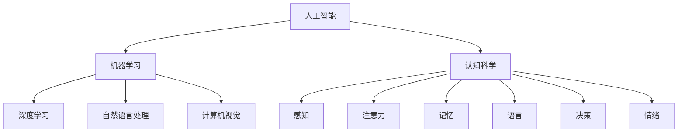
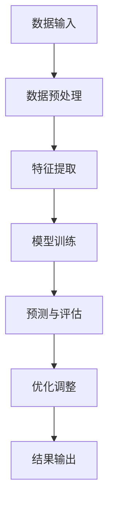

                 

### 《知识增长的催化剂：人工智能促进人类认知》

> **关键词：人工智能，认知科学，知识增长，机器学习，自然语言处理，计算机视觉**

> **摘要：**
本文探讨了人工智能如何作为知识增长的催化剂，通过促进人类认知的深入理解，提高学习和工作效率。文章首先介绍了人工智能和认知科学的基础知识，然后详细分析了人工智能的核心技术，如机器学习、自然语言处理和计算机视觉。接着，文章阐述了人工智能促进认知的原理和应用，特别是在教育、职业发展和终身学习中的具体实例。通过深入的剖析和实际项目案例，本文展示了人工智能在提升人类认知方面的巨大潜力和重要性。 

### 《知识增长的催化剂：人工智能促进人类认知》目录大纲

#### 第一部分：人工智能与认知科学基础

##### 第1章：人工智能概述

- **1.1 人工智能的定义与发展**
  - **1.1.1 人工智能的定义**
  - **1.1.2 人工智能的发展历程**
  - **1.1.3 人工智能的关键技术**

- **1.2 认知科学的起源与影响**
  - **1.2.1 认知科学的定义**
  - **1.2.2 认知科学的研究领域**
  - **1.2.3 认知科学与人工智能的关系**

##### 第2章：人工智能的核心技术

- **2.1 机器学习基础**
  - **2.1.1 机器学习的定义**
  - **2.1.2 机器学习的基本概念**
  - **2.1.3 机器学习的算法分类**

- **2.2 自然语言处理**
  - **2.2.1 自然语言处理的基本任务**
  - **2.2.2 自然语言处理的关键技术**
  - **2.2.3 自然语言处理的应用实例**

- **2.3 计算机视觉**
  - **2.3.1 计算机视觉的基本任务**
  - **2.3.2 计算机视觉的关键技术**
  - **2.3.3 计算机视觉的应用实例**

##### 第3章：人工智能促进认知的原理

- **3.1 认知模型与人工智能模型的关系**
  - **3.1.1 认知模型的定义**
  - **3.1.2 人工智能模型的发展**
  - **3.1.3 认知模型与人工智能模型的融合**

- **3.2 人工智能在认知科学中的应用**
  - **3.2.1 人工智能辅助认知研究的方法**
  - **3.2.2 人工智能在认知障碍康复中的应用**
  - **3.2.3 人工智能在教育中的应用**

#### 第二部分：人工智能在教育中的应用

##### 第4章：人工智能与教育融合

- **4.1 人工智能在教育中的应用现状**
  - **4.1.1 人工智能在教育中的应用类型**
  - **4.1.2 人工智能在教育中的挑战与机遇**

- **4.2 智能教学系统设计**
  - **4.2.1 智能教学系统的架构**
  - **4.2.2 智能教学系统的功能模块**

- **4.3 个性化学习与智能推荐**
  - **4.3.1 个性化学习的概念**
  - **4.3.2 智能推荐系统的原理与实现**

##### 第5章：人工智能与学习评估

- **5.1 智能学习评估方法**
  - **5.1.1 传统学习评估方法**
  - **5.1.2 人工智能在评估中的应用**

- **5.2 情感分析在教育中的应用**
  - **5.2.1 情感分析的基本概念**
  - **5.2.2 情感分析在教育中的应用实例**

- **5.3 人工智能在教育评价中的未来趋势**
  - **5.3.1 教育评价的数字化转型**
  - **5.3.2 人工智能在个性化教育评价中的应用**

#### 第三部分：人工智能在职业发展中的应用

##### 第6章：人工智能与职业发展

- **6.1 人工智能时代的人才需求**
  - **6.1.1 人工智能对职业市场的影响**
  - **6.1.2 人工智能时代的人才技能要求**

- **6.2 智能化职业规划**
  - **6.2.1 职业规划的定义**
  - **6.2.2 人工智能在职业规划中的应用**

- **6.3 人工智能与创业**
  - **6.3.1 人工智能在创业中的应用**
  - **6.3.2 人工智能创业的挑战与机遇**

##### 第7章：人工智能与终身学习

- **7.1 终身学习的重要性**
  - **7.1.1 终身学习的定义**
  - **7.1.2 终身学习的社会意义**

- **7.2 人工智能支持下的终身学习**
  - **7.2.1 人工智能在终身学习中的应用**
  - **7.2.2 智能学习平台的设计与实现**

- **7.3 未来人工智能与认知发展的关系**
  - **7.3.1 人工智能与认知发展的互动关系**
  - **7.3.2 人工智能对认知发展的潜在影响**

### 附录

- **附录A：人工智能相关工具与资源**
  - **A.1 人工智能开发环境搭建**
  - **A.2 主流人工智能框架介绍**
  - **A.3 人工智能学习资源推荐**

### 附录B：核心概念与联系 Mermaid 流程图

- **B.1 人工智能与认知科学的关系**
- **B.2 人工智能核心技术流程**

### 附录C：核心算法原理讲解

- **C.1 机器学习算法伪代码示例**
- **C.2 自然语言处理算法伪代码示例**
- **C.3 计算机视觉算法伪代码示例**

### 附录D：数学模型和数学公式

- **D.1 机器学习中的损失函数**
- **D.2 自然语言处理中的注意力机制**

### 附录E：项目实战

- **E.1 智能教学系统的实际开发案例**
- **E.2 个性化学习推荐系统的实际开发案例**
- **E.3 人工智能辅助职业规划的实践案例**


## 第一部分：人工智能与认知科学基础

在当前信息爆炸的时代，人工智能（AI）已经成为推动知识增长的重要力量。认知科学作为研究人类思维和智能的学科，与人工智能的发展密切相关。本部分将首先介绍人工智能和认知科学的基础知识，为后续章节的分析提供理论基础。

### 第1章：人工智能概述

#### 1.1 人工智能的定义与发展

**1.1.1 人工智能的定义**

人工智能（Artificial Intelligence，简称AI）是指通过计算机模拟人类智能的技术。人工智能旨在使计算机具备感知、学习、推理和决策的能力，以实现人类智能的任务。人工智能可以划分为弱人工智能（Weak AI）和强人工智能（Strong AI）。弱人工智能是指在某些特定任务上超越人类智能的系统，如语音识别、图像识别等；强人工智能则是指具有普遍智能的计算机系统，能够像人类一样理解、学习和适应复杂环境。

**1.1.2 人工智能的发展历程**

人工智能的研究始于20世纪50年代，经历了多次高潮和低谷。1956年，达特茅斯会议上，约翰·麦卡锡等人提出了人工智能的概念，标志着人工智能研究的正式开始。此后，人工智能研究在20世纪80年代迎来了第一次高潮，但受限于计算能力和算法的限制，发展较为缓慢。21世纪初，随着计算能力和数据资源的提升，人工智能再次迎来快速发展，深度学习和大数据技术的应用使得人工智能在多个领域取得了突破性进展。

**1.1.3 人工智能的关键技术**

人工智能的关键技术包括机器学习、深度学习、自然语言处理、计算机视觉等。这些技术在不同领域发挥着重要作用，推动人工智能的进步。

- **机器学习**：机器学习（Machine Learning，ML）是一种通过数据驱动的方式让计算机自动学习和改进的技术。机器学习的主要任务包括分类、回归、聚类等。
- **深度学习**：深度学习（Deep Learning，DL）是机器学习的一个子领域，主要基于神经网络结构，通过多层非线性变换实现复杂任务的自动化学习。
- **自然语言处理**：自然语言处理（Natural Language Processing，NLP）是人工智能的重要分支，旨在使计算机理解和生成人类语言，涉及文本分类、情感分析、机器翻译等任务。
- **计算机视觉**：计算机视觉（Computer Vision，CV）是人工智能的另一个重要分支，通过计算机对图像和视频进行分析和处理，实现目标检测、图像分类、人脸识别等任务。

#### 1.2 认知科学的起源与影响

**1.2.1 认知科学的定义**

认知科学（Cognitive Science）是研究人类认知过程和智能行为的跨学科领域，涉及心理学、神经科学、语言学、计算机科学等多个学科。认知科学旨在理解人类思维、学习和记忆的本质，探索人类智能的机制。

**1.2.2 认知科学的研究领域**

认知科学的研究领域广泛，包括感知、注意力、记忆、语言、决策等。每个研究领域都有其独特的方法和理论体系。

- **感知**：研究人类如何感知外部信息，如视觉、听觉、触觉等。
- **注意力**：研究人类如何选择和聚焦注意，处理信息。
- **记忆**：研究人类记忆的存储、检索和遗忘机制。
- **语言**：研究人类语言的产生、理解和应用。
- **决策**：研究人类如何进行决策，以及决策的影响因素。

**1.2.3 认知科学与人工智能的关系**

认知科学与人工智能密切相关，认知科学为人工智能提供了理论基础和方法指导。例如，认知模型（如神经网络、决策树等）在人工智能中得到了广泛应用，认知科学的研究成果也对人工智能的发展产生了深远影响。同时，人工智能在认知科学中的应用也推动了认知科学的发展，如利用人工智能技术进行认知障碍康复、个性化教育等。

#### 1.3 人工智能与认知科学的融合

人工智能与认知科学的融合为知识增长提供了新的机遇。通过将认知科学的理论与方法应用于人工智能，可以构建更加智能、适应性强的系统。例如，基于认知模型的机器学习算法能够更好地模拟人类思维过程，提高学习效果和决策能力。此外，人工智能在认知科学中的应用也为认知科学研究提供了新的工具和方法，促进了认知科学的发展。

在本章中，我们介绍了人工智能和认知科学的基础知识，为后续章节的分析提供了理论基础。下一章将详细探讨人工智能的核心技术，进一步阐述人工智能在认知促进方面的作用。

### 第2章：人工智能的核心技术

在了解了人工智能和认知科学的基础知识之后，我们接下来将深入探讨人工智能的核心技术，包括机器学习、自然语言处理和计算机视觉。这些技术是人工智能发展的基石，也是推动认知科学进步的重要力量。

#### 2.1 机器学习基础

**2.1.1 机器学习的定义**

机器学习（Machine Learning，ML）是一种通过数据驱动的方式让计算机自动学习和改进的技术。机器学习的主要目标是让计算机从数据中学习规律，然后利用这些规律进行预测或决策。与传统的编程不同，机器学习不需要手动编写复杂的算法，而是通过算法自动从数据中学习，从而实现特定任务。

**2.1.2 机器学习的基本概念**

- **监督学习**（Supervised Learning）：监督学习是一种最常见的机器学习方式，它使用带有标签的数据集进行训练。训练数据集中的每个样本都有一个已知的输出标签，机器学习算法通过学习这些标签和特征之间的关系，预测新的输入样本的标签。

- **无监督学习**（Unsupervised Learning）：无监督学习使用没有标签的数据集进行训练，目标是发现数据集中的结构和规律。常见的无监督学习算法包括聚类和降维。

- **强化学习**（Reinforcement Learning）：强化学习是一种通过试错的方式让计算机学习决策的算法。强化学习算法通过与环境的交互，不断调整策略，以实现最大化累积奖励。

**2.1.3 机器学习的算法分类**

机器学习算法可以根据学习方式和应用领域进行分类。以下是一些常见的机器学习算法：

- **线性模型**：线性模型是最简单的机器学习算法，包括线性回归和逻辑回归。线性回归用于预测连续值，逻辑回归用于分类问题。

- **决策树**：决策树是一种基于树结构的分类算法，通过一系列的决策规则将数据划分成不同的区域。

- **支持向量机**（Support Vector Machine，SVM）：SVM是一种基于间隔最大化的分类算法，通过找到最佳的超平面来分隔不同类别的数据。

- **神经网络**：神经网络是一种模拟生物神经系统的计算模型，包括多层感知机（Multilayer Perceptron，MLP）和卷积神经网络（Convolutional Neural Network，CNN）等。

- **集成方法**：集成方法通过结合多个模型的预测结果来提高准确性和鲁棒性。常见的集成方法包括随机森林（Random Forest）和梯度提升树（Gradient Boosting Tree）。

#### 2.2 自然语言处理

**2.2.1 自然语言处理的基本任务**

自然语言处理（Natural Language Processing，NLP）是人工智能的一个重要分支，旨在使计算机理解和生成人类语言。NLP的基本任务包括：

- **文本分类**：文本分类是将文本数据按照预定义的类别进行分类的过程，如情感分析、主题分类等。

- **情感分析**：情感分析是判断文本中表达的情感倾向，如正面、负面或中性。

- **命名实体识别**：命名实体识别是从文本中识别出具有特定意义的实体，如人名、地名、组织名等。

- **机器翻译**：机器翻译是将一种语言的文本翻译成另一种语言，如英译中、中译英等。

**2.2.2 自然语言处理的关键技术**

- **词向量**：词向量是自然语言处理的基础，用于表示文本中的词语。常见的词向量模型包括Word2Vec、GloVe等。

- **递归神经网络**（Recurrent Neural Network，RNN）：RNN是一种适用于序列数据的神经网络，能够处理文本中的时序信息。

- **卷积神经网络**（Convolutional Neural Network，CNN）：CNN主要用于图像处理，但在自然语言处理中，通过词嵌入和卷积操作，也能实现文本分类和情感分析等任务。

- **Transformer**：Transformer是一种基于自注意力机制的神经网络模型，广泛应用于机器翻译、文本生成等任务，显著提升了NLP的性能。

**2.2.3 自然语言处理的应用实例**

- **搜索引擎**：搜索引擎利用自然语言处理技术，对用户查询进行理解和匹配，提供准确的搜索结果。

- **智能客服**：智能客服通过自然语言处理技术，与用户进行自然语言交互，提供个性化的服务和解决方案。

- **机器翻译**：机器翻译是自然语言处理的一个经典应用，通过将一种语言的文本翻译成另一种语言，促进跨语言交流。

#### 2.3 计算机视觉

**2.3.1 计算机视觉的基本任务**

计算机视觉（Computer Vision，CV）是人工智能的另一个重要分支，旨在使计算机能够理解、分析和处理图像和视频数据。计算机视觉的基本任务包括：

- **图像分类**：图像分类是将图像数据按照预定义的类别进行分类的过程，如物体识别、场景分类等。

- **目标检测**：目标检测是在图像或视频中检测出特定目标的位置和属性，如行人检测、车辆检测等。

- **图像分割**：图像分割是将图像划分为多个区域，每个区域具有相似的特征，如前景和背景分割。

- **动作识别**：动作识别是通过分析视频序列中的运动信息，识别出特定的动作，如手势识别、体育动作识别等。

**2.3.2 计算机视觉的关键技术**

- **卷积神经网络**（Convolutional Neural Network，CNN）：CNN是计算机视觉的核心技术，通过卷积操作和池化操作，能够有效地提取图像特征。

- **深度学习**：深度学习在计算机视觉中的应用，使得计算机能够自动学习复杂的图像特征，显著提升了图像分类、目标检测等任务的性能。

- **光流法**：光流法是通过分析视频序列中像素点的运动轨迹，提取出物体的运动信息。

- **图像处理技术**：图像处理技术，如滤波、边缘检测、形态学操作等，用于预处理和增强图像数据，以提高计算机视觉算法的性能。

**2.3.3 计算机视觉的应用实例**

- **自动驾驶**：自动驾驶系统通过计算机视觉技术，实时分析道路场景，实现车辆的自适应驾驶。

- **人脸识别**：人脸识别技术广泛应用于安全监控、身份验证等领域，通过检测和识别图像中的人脸，提供个性化的服务。

- **医疗图像分析**：计算机视觉在医疗图像分析中的应用，如肿瘤检测、骨折诊断等，为医生提供辅助决策工具。

在本章中，我们详细介绍了人工智能的核心技术，包括机器学习、自然语言处理和计算机视觉。这些技术不仅在各自领域取得了显著成果，也为认知科学的进步提供了强大的支持。在下一章中，我们将探讨人工智能促进认知的原理和应用。

#### 2.4 人工智能促进认知的原理

人工智能（AI）在促进人类认知方面发挥着重要作用。为了理解这一过程，我们需要从认知科学和人工智能模型的关系入手，深入探讨人工智能在认知科学中的应用及其对认知发展的推动作用。

**3.1 认知模型与人工智能模型的关系**

认知模型（Cognitive Models）是对人类认知过程的抽象和模拟，旨在理解人类如何感知、思考、学习和决策。这些模型通常基于认知科学的理论，包括心理学、神经科学和语言学等领域的知识。认知模型可以划分为几种类型，如产生式模型、联结主义模型和符号主义模型。

- **产生式模型**（Production Models）：产生式模型基于“如果...那么...”规则，模拟人类基于条件推理的过程。例如，基于产生式模型的专家系统可以模拟医生诊断疾病的过程。

- **联结主义模型**（Connectionist Models）：联结主义模型基于神经网络的架构，模拟人类大脑的神经元连接和学习过程。这些模型通过调整神经元之间的连接权重来学习复杂任务，例如深度学习模型。

- **符号主义模型**（Symbolic Models）：符号主义模型使用符号逻辑和规则来表示知识和推理过程，例如基于逻辑的推理系统。

人工智能模型（Artificial Intelligence Models）则是通过计算机程序实现的认知模型，旨在模拟人类智能的某些方面。人工智能模型的发展历程经历了从简单的符号主义模型到复杂的联结主义模型，再到如今的深度学习模型。

- **符号主义模型**：早期的符号主义模型，如推理机（Reasoning Machines），通过规则和符号逻辑来模拟人类思维。

- **联结主义模型**：联结主义模型的代表性工作是1986年提出的反向传播算法（Backpropagation Algorithm），通过多层神经网络模拟大脑的学习过程。

- **深度学习模型**：深度学习模型，如卷积神经网络（CNN）和Transformer，通过多层非线性变换自动学习复杂特征，实现了在图像识别、自然语言处理等领域的突破。

**3.1.1 认知模型的定义**

认知模型是对人类认知过程的抽象和模拟，旨在理解人类如何感知、思考、学习和决策。这些模型通常基于认知科学的理论，包括心理学、神经科学和语言学等领域的知识。

**3.1.2 人工智能模型的发展**

人工智能模型的发展经历了几个阶段：

1. **符号主义阶段**：早期的符号主义模型，如推理机（Reasoning Machines），通过规则和符号逻辑来模拟人类思维。
   
2. **联结主义阶段**：联结主义模型的代表性工作是1986年提出的反向传播算法（Backpropagation Algorithm），通过多层神经网络模拟大脑的学习过程。

3. **深度学习阶段**：深度学习模型，如卷积神经网络（CNN）和Transformer，通过多层非线性变换自动学习复杂特征，实现了在图像识别、自然语言处理等领域的突破。

**3.1.3 认知模型与人工智能模型的融合**

认知模型与人工智能模型的融合，使得人工智能系统能够更好地模拟和辅助人类认知。这种融合主要体现在以下几个方面：

1. **跨学科知识的整合**：认知模型结合心理学、神经科学和计算机科学等领域的知识，为人工智能系统提供了更加丰富和精确的模型。

2. **认知增强**：通过认知模型，人工智能系统可以更好地理解人类的思维过程，提供更准确的决策支持。

3. **自主学习**：认知模型与机器学习算法的结合，使得人工智能系统能够通过自主学习不断改进和优化。

**3.2 人工智能在认知科学中的应用**

人工智能在认知科学中的应用，不仅推动了认知科学的发展，也为人类认知提供了新的工具和方法。以下是一些具体的应用领域：

1. **认知障碍康复**：人工智能技术可以用于辅助认知障碍康复，如通过虚拟现实技术模拟认知任务，帮助患者恢复认知功能。

2. **个性化教育**：人工智能系统可以根据学生的认知特点和学习需求，提供个性化的教育资源和教学方案。

3. **认知评估**：人工智能技术可以用于评估人类的认知能力，如通过认知游戏和测试，评估注意力、记忆、决策等认知能力。

**3.2.1 人工智能辅助认知研究的方法**

人工智能在认知科学研究中发挥着重要作用，以下是一些常用的人工智能辅助认知研究的方法：

1. **数据驱动的方法**：通过分析大量的认知数据，如脑电图（EEG）、功能性磁共振成像（fMRI）等，揭示人类认知过程的规律。

2. **机器学习算法**：利用机器学习算法，如深度学习模型，对认知数据进行分析和分类，提取认知特征。

3. **虚拟现实技术**：通过虚拟现实技术，模拟不同的认知场景，研究认知过程和认知障碍的机制。

**3.2.2 人工智能在认知障碍康复中的应用**

人工智能在认知障碍康复中的应用，为患者提供了新的康复途径。以下是一些具体的应用实例：

1. **认知训练游戏**：通过设计认知训练游戏，如记忆游戏、注意力游戏等，帮助患者恢复认知功能。

2. **虚拟现实康复**：通过虚拟现实技术，模拟真实的康复场景，提高患者的康复效果。

3. **个性化康复方案**：基于患者的认知数据和特征，为患者制定个性化的康复方案，提高康复效率。

**3.2.3 人工智能在教育中的应用**

人工智能在教育中的应用，为教育改革提供了新的思路和方法。以下是一些具体的应用实例：

1. **个性化学习**：通过分析学生的学习数据和认知特点，为每个学生提供个性化的学习资源和教学方案。

2. **智能教学系统**：利用人工智能技术，设计智能教学系统，实现自动化教学和智能评估。

3. **情感分析**：通过情感分析技术，分析学生的学习情感和情绪，为教育提供个性化的支持和指导。

**3.3 认知模型与人工智能模型的融合**

认知模型与人工智能模型的融合，为认知科学的发展提供了新的机遇和挑战。以下是一些融合的途径：

1. **基于认知模型的机器学习算法**：通过设计基于认知模型的机器学习算法，使人工智能系统更好地模拟和辅助人类认知。

2. **认知增强的智能系统**：通过认知模型，增强智能系统的认知能力，使其能够更好地理解人类的需求和意图。

3. **跨学科的合作研究**：认知科学、人工智能、心理学等领域的合作，推动认知模型与人工智能模型的发展。

在本章中，我们探讨了认知模型与人工智能模型的关系，分析了人工智能在认知科学中的应用及其对认知发展的推动作用。通过这些探讨，我们可以看到人工智能在促进人类认知方面的重要性和潜力。在下一章中，我们将进一步探讨人工智能在教育中的应用，展示其在知识增长方面的巨大作用。

### 第二部分：人工智能在教育中的应用

人工智能在教育领域的应用正迅速发展，通过智能化教学系统和个性化学习推荐，极大地提升了教育质量和效率。同时，智能学习评估和情感分析技术的引入，为教育评价和学生学习体验带来了新的变革。以下章节将详细探讨这些应用及其对教育发展的深远影响。

#### 第4章：人工智能与教育融合

**4.1 人工智能在教育中的应用现状**

人工智能在教育中的应用已经取得了显著进展，主要表现在以下几个方面：

- **智能教学系统的普及**：越来越多的学校和教育机构开始采用智能教学系统，通过人工智能技术实现自动化教学和个性化学习。
- **个性化学习的推广**：基于学生数据和学习行为的分析，人工智能系统能够为学生提供个性化的学习资源和教学方案，满足不同学生的学习需求。
- **智能学习评估的发展**：通过情感分析和智能算法，人工智能技术能够实现更加全面和精准的学习评估，为教育提供科学依据。
- **教育资源的智能化管理**：人工智能技术在教育资源的分配和管理中发挥着重要作用，提高了教育资源的利用效率。

**4.1.1 人工智能在教育中的应用类型**

人工智能在教育中的应用可以归纳为以下几种类型：

- **教学辅助**：通过智能教学系统，实现自动化授课、作业批改、学生成绩分析等教学任务，减轻教师的工作负担。
- **个性化学习**：利用人工智能技术，根据学生的学习行为和需求，提供个性化的学习资源和教学方案。
- **智能评估**：通过情感分析和智能算法，对学生的学习过程和成果进行实时评估，为教育提供科学依据。
- **教育管理**：利用人工智能技术，实现教育资源的智能化管理，提高教育资源的利用效率。

**4.1.2 人工智能在教育中的挑战与机遇**

人工智能在教育中的应用面临着一系列挑战和机遇：

- **挑战**：数据隐私和安全、教师与技术的融合、技术发展的不确定性等。
- **机遇**：个性化学习、教育资源的公平分配、教育质量的提升等。

**4.2 智能教学系统设计**

智能教学系统是人工智能在教育中应用的核心，通过设计智能教学系统，可以实现自动化教学和个性化学习。以下是一个典型的智能教学系统设计框架：

- **需求分析**：明确系统目标、功能需求和用户需求。
- **系统架构设计**：设计系统的整体架构，包括教学模块、学习模块、评估模块等。
- **功能模块开发**：根据系统架构，开发具体的功能模块，如课程内容管理、学生行为分析、个性化推荐等。
- **系统集成与测试**：将各个功能模块集成起来，进行系统测试和优化。
- **部署与维护**：将智能教学系统部署到实际教学场景中，并定期进行维护和更新。

**4.2.1 智能教学系统的架构**

智能教学系统的架构通常包括以下几个部分：

- **教学资源管理**：管理课程内容、教学材料等教学资源。
- **学生行为分析**：分析学生的学习行为，如学习时长、学习频率、学习进度等。
- **个性化推荐**：根据学生的学习行为和需求，推荐适合的学习资源和教学方案。
- **智能评估**：对学生的学习过程和成果进行实时评估，提供反馈和建议。
- **用户界面**：提供用户友好的界面，方便教师和学生使用。

**4.2.2 智能教学系统的功能模块**

智能教学系统的功能模块通常包括：

- **课程内容管理**：管理课程内容，包括课程大纲、教学视频、习题等。
- **学习进度跟踪**：跟踪学生的学习进度，包括已学课程、学习时长、学习频率等。
- **个性化推荐**：根据学生的学习行为和需求，推荐适合的学习资源和教学方案。
- **智能评估**：对学生的学习过程和成果进行实时评估，提供反馈和建议。
- **学习社区**：提供学生交流和讨论的平台，促进学习互动。

**4.3 个性化学习与智能推荐**

个性化学习与智能推荐是智能教学系统的核心功能，通过分析学生的学习行为和需求，提供个性化的学习资源和教学方案。

**4.3.1 个性化学习的概念**

个性化学习（Personalized Learning）是指根据每个学生的学习需求和特点，提供个性化的学习资源和教学方案，以满足不同学生的学习需求。个性化学习的目标是提高学习效率和学习成果。

**4.3.2 智能推荐系统的原理与实现**

智能推荐系统（Intelligent Recommendation System）是个性化学习的重要手段，通过分析学生的学习行为和需求，为每个学生推荐合适的学习资源和教学方案。以下是一个典型的智能推荐系统原理与实现：

- **用户模型建立**：建立用户模型，包括学生的基本特征、学习行为、学习偏好等。
- **推荐算法设计**：设计推荐算法，如协同过滤、基于内容的推荐等，根据用户模型生成推荐结果。
- **推荐结果呈现**：将推荐结果以合适的形式呈现给用户，如学习资源列表、推荐课程等。

**4.4 人工智能与学习评估**

学习评估是教育中的重要环节，通过评估学生的学习成果和学习过程，为教育提供科学依据。人工智能技术为学习评估带来了新的变革。

**4.4.1 智能学习评估方法**

智能学习评估方法主要包括：

- **传统评估方法**：如笔试、面试等，主要基于教师的主观判断。
- **智能评估方法**：利用人工智能技术，如情感分析、自然语言处理等，对学生的学习过程和成果进行实时评估。

**4.4.2 人工智能在评估中的应用**

人工智能在评估中的应用包括：

- **情感分析**：通过分析学生的学习文本，识别学生的情感状态，如焦虑、兴奋等。
- **自然语言处理**：通过分析学生的语言表达，评估学生的语言能力。
- **图像识别**：通过分析学生的学习笔记、作业等图像，评估学生的知识掌握情况。

**4.5 情感分析在教育中的应用**

情感分析（Sentiment Analysis）是人工智能技术的一种应用，通过分析学生的语言表达，识别学生的情感状态，为教育提供个性化支持。

**4.5.1 情感分析的基本概念**

情感分析是指通过自然语言处理技术，对文本数据进行分析，识别文本中的情感倾向，如正面、负面或中性。情感分析广泛应用于社交媒体、电子商务、教育等领域。

**4.5.2 情感分析在教育中的应用实例**

情感分析在教育中的应用实例包括：

- **学生情感监控**：通过分析学生的课堂发言、作业等文本，监控学生的情感状态，及时发现学生的情绪波动。
- **个性化教学**：根据学生的情感状态，提供个性化的教学方案，帮助学生缓解压力，提高学习效果。
- **教学质量评估**：通过分析学生的反馈文本，评估教师的教学效果，为教学改进提供依据。

**4.6 人工智能在教育评价中的未来趋势**

随着人工智能技术的发展，教育评价也将逐渐智能化和个性化。以下是一些未来趋势：

- **智能评价体系的建立**：通过人工智能技术，建立智能评价体系，实现全面、多维度的评估。
- **个性化反馈**：根据学生的个性化学习数据和情感状态，提供个性化的反馈和建议，帮助学生优化学习策略。
- **终身学习支持**：利用人工智能技术，为终身学习提供支持和指导，促进学生的全面发展。

在本章中，我们详细探讨了人工智能在教育中的应用，包括智能教学系统设计、个性化学习与智能推荐、智能学习评估和情感分析。通过这些应用，人工智能不仅提高了教育质量和效率，也为教育改革提供了新的思路和方法。在下一章中，我们将继续探讨人工智能在职业发展中的应用，展示其在推动职业发展和终身学习方面的潜力。

### 第6章：人工智能与职业发展

在人工智能（AI）的推动下，职业发展的模式和需求正在发生深刻变革。AI不仅改变了传统的职业市场，还促使人才技能要求发生了显著变化。在这一章节中，我们将探讨人工智能时代的人才需求、智能化职业规划以及人工智能在创业中的应用。

#### 6.1 人工智能时代的人才需求

人工智能的发展对职业市场产生了深远的影响，对人才的需求也发生了显著变化。以下是一些主要的人才需求特点：

**6.1.1 人工智能对职业市场的影响**

- **新兴职业崛起**：随着人工智能技术的广泛应用，一些新兴职业应运而生，如数据科学家、机器学习工程师、AI伦理学家等。这些职业对人才的技能和知识要求更高。
- **技能要求升级**：传统职业如程序员、数据分析师等，对技能的要求也在不断提高，需要掌握更多的AI相关技术，如深度学习、自然语言处理等。
- **职业替代与转移**：人工智能在某些领域取代了人类工作，如自动化生产线、自动驾驶等。然而，同时也在创造新的职业机会，需要人类与AI协同工作。

**6.1.2 人工智能时代的人才技能要求**

- **技术技能**：人工智能时代的人才需要具备以下技术技能：
  - **编程能力**：熟悉至少一种编程语言，如Python、Java等。
  - **机器学习与深度学习**：掌握机器学习算法、深度学习框架（如TensorFlow、PyTorch）及其应用。
  - **数据分析**：能够进行数据预处理、数据分析和可视化。
  - **自然语言处理**：了解自然语言处理的基础知识，如词向量、序列模型等。

- **软技能**：除了技术技能外，人工智能时代的人才还需要具备以下软技能：
  - **创新思维**：能够提出创新性的解决方案，应对复杂问题。
  - **团队合作**：在AI项目中，团队成员需要密切合作，解决技术难题。
  - **沟通能力**：能够清晰、准确地与团队成员、客户和利益相关者进行沟通。
  - **伦理意识**：了解AI伦理问题，如隐私保护、算法偏见等，并能够遵循相关伦理规范。

#### 6.2 智能化职业规划

智能化职业规划是利用人工智能技术，为个人提供职业发展指导和支持。以下是一些关键概念和应用：

**6.2.1 职业规划的定义**

职业规划是指个人根据自己的兴趣、能力和职业目标，制定职业发展计划，并不断调整和优化，以实现职业成长和目标。

**6.2.2 人工智能在职业规划中的应用**

- **数据分析与趋势预测**：通过分析行业数据和市场趋势，人工智能可以帮助个人预测未来职业发展的方向和需求。
- **个性化职业推荐**：基于个人的兴趣、技能和职业目标，人工智能可以推荐最适合的职业选择和发展路径。
- **技能评估与提升建议**：通过分析个人的技能水平和职业发展需求，人工智能可以提供个性化的技能提升建议。

**6.2.3 智能职业规划系统设计**

智能职业规划系统的设计通常包括以下几个步骤：

- **需求分析**：明确系统目标、功能需求和用户需求。
- **数据收集与处理**：收集用户个人信息、职业数据等，进行数据预处理和清洗。
- **算法设计**：设计合适的算法，如协同过滤、决策树等，进行职业推荐和技能评估。
- **系统开发与测试**：开发智能职业规划系统，进行功能测试和性能优化。
- **部署与维护**：将系统部署到实际应用场景中，并定期进行维护和更新。

#### 6.3 人工智能与创业

人工智能在创业中的应用，不仅改变了创业的模式，还为创业者提供了新的机遇和挑战。以下是一些关键点：

**6.3.1 人工智能在创业中的应用**

- **智能产品与服务开发**：利用人工智能技术，开发智能化的产品和服务，如智能助手、自动化解决方案等，满足市场需求。
- **数据分析与市场预测**：通过数据分析，了解市场趋势和用户需求，为创业项目提供决策支持。
- **智能化运营与管理**：利用人工智能技术，实现自动化运营和管理，提高企业效率和竞争力。

**6.3.2 人工智能创业的挑战与机遇**

- **挑战**：人工智能创业面临以下挑战：
  - **技术门槛**：人工智能技术要求高，需要创业者具备较强的技术背景和资源。
  - **数据安全与隐私**：人工智能系统对数据依赖性强，需要确保数据的安全和用户隐私。
  - **市场接受度**：人工智能产品需要得到市场的认可和接受，需要创业者具备良好的市场推广能力。

- **机遇**：人工智能创业也存在许多机遇：
  - **创新空间**：人工智能技术的不断进步，为创业提供了广阔的创新空间。
  - **市场需求**：随着人工智能技术的普及，市场需求也在不断增加，为创业者提供了新的商业机会。
  - **投资机会**：人工智能领域吸引了大量投资，为创业者提供了资金支持。

**6.3.3 人工智能创业案例**

以下是一些人工智能创业的成功案例：

- **DeepMind**：DeepMind是一家专注于人工智能研究的公司，其核心产品是AlphaGo，一款能够击败世界围棋冠军的AI程序。DeepMind的成功证明了人工智能在游戏和智能决策领域的巨大潜力。
- **Walmart**：Walmart利用人工智能技术，开发了一套智能库存管理系统，通过实时数据分析，优化库存管理，提高运营效率。这一系统的成功应用，为Walmart带来了显著的经济效益。
- **Cambridge Analytica**：Cambridge Analytica是一家利用人工智能技术进行政治营销的公司，其核心产品是数据分析和用户画像技术。该公司在2016年美国总统选举中发挥了重要作用，引起了全球对数据隐私和算法伦理的关注。

在本章中，我们探讨了人工智能在职业发展中的应用，包括人才需求、智能化职业规划以及创业应用。通过这些探讨，我们可以看到人工智能对职业发展的深远影响和巨大潜力。在下一章中，我们将进一步探讨人工智能在终身学习中的应用，展示其在促进终身学习方面的作用。

### 第7章：人工智能与终身学习

随着社会的发展和技术的进步，终身学习已成为提升个人竞争力和社会福祉的重要手段。人工智能（AI）作为知识增长和认知发展的催化剂，在支持终身学习方面发挥着关键作用。本章节将探讨终身学习的重要性、人工智能在终身学习中的应用以及人工智能与认知发展的互动关系。

#### 7.1 终身学习的重要性

终身学习（Lifelong Learning）是指个人在其一生中不断获取知识和技能的过程，以适应快速变化的社会和经济环境。终身学习的重要性体现在以下几个方面：

**7.1.1 终身学习的定义**

终身学习是一种理念，强调个人在其一生中不断学习，以适应不断变化的环境和需求。它不仅包括正规教育，还涵盖非正式学习和自我提升。

**7.1.2 终身学习的社会意义**

- **个人发展**：终身学习有助于个人提升技能和知识，增强职业竞争力，实现个人价值和自我实现。
- **经济增长**：终身学习可以培养高素质的人才，提高整体生产力，推动经济增长。
- **社会进步**：终身学习有助于促进社会公平，提高公民素质，增强社会凝聚力和创新能力。

#### 7.2 人工智能支持下的终身学习

人工智能在支持终身学习方面具有巨大的潜力，通过智能学习平台和个性化学习体验，极大地提高了学习效率和效果。以下是一些关键点：

**7.2.1 人工智能在终身学习中的应用**

- **智能学习平台**：智能学习平台利用人工智能技术，提供个性化学习体验。这些平台能够根据学生的学习行为和需求，推荐合适的学习资源和课程，帮助学生高效学习。
- **个性化学习体验**：人工智能技术可以根据学生的学习数据和反馈，提供个性化的学习路径和内容。这种个性化学习体验有助于激发学生的学习兴趣和动力。
- **自适应学习系统**：自适应学习系统通过实时分析学生的学习进度和理解程度，动态调整教学内容和难度，确保每个学生都能获得最佳的学习体验。

**7.2.2 智能学习平台的设计与实现**

智能学习平台的设计和实现涉及多个方面的技术，以下是一个典型的设计流程：

- **需求分析**：明确平台的目标、功能需求和用户需求。
- **系统架构设计**：设计系统的整体架构，包括课程内容管理、用户管理、学习数据分析等模块。
- **算法与模型开发**：设计推荐算法、学习分析模型等，以实现个性化学习体验。
- **前端开发**：开发用户友好的界面，提供便捷的学习体验。
- **后端开发**：实现数据存储、处理和分析，确保系统的稳定性和性能。
- **系统集成与测试**：将各个模块集成起来，进行系统测试和优化。
- **部署与维护**：将智能学习平台部署到实际应用场景中，并定期进行维护和更新。

#### 7.3 未来人工智能与认知发展的关系

人工智能不仅支持终身学习，还与认知发展密切相关。未来，人工智能与认知发展将呈现以下互动关系：

**7.3.1 人工智能与认知发展的互动关系**

- **正向互动**：人工智能可以帮助人类更好地理解和模拟认知过程，提高认知能力和效率。例如，通过智能辅导系统和虚拟助手，学生可以更加高效地学习和掌握知识。
- **反向互动**：认知发展也可能影响人工智能的设计和应用。人类对认知过程的理解，可以为人工智能提供更多的启发和指导，改进人工智能模型和算法。

**7.3.2 人工智能对认知发展的潜在影响**

- **知识获取与拓展**：人工智能可以提供丰富的知识和信息资源，帮助学生和成人快速获取新的知识和技能，拓展认知范围。
- **学习策略优化**：通过智能分析和学习反馈，人工智能可以帮助学生优化学习策略，提高学习效果。
- **认知障碍康复**：人工智能技术在认知障碍康复中的应用，可以帮助患者恢复认知功能，提高生活质量。

#### 7.4 未来展望

未来，人工智能将继续在终身学习中发挥重要作用，以下是一些展望：

- **个性化学习**：随着人工智能技术的进步，个性化学习将变得更加普及和精确，满足不同学习者的需求。
- **跨学科融合**：人工智能与教育、认知科学、心理学等领域的融合，将推动终身学习向更加综合和深度的方向发展。
- **智能化教育生态系统**：通过构建智能化的教育生态系统，人工智能将支持学习者的全生命周期学习，实现终身学习的目标。

在本章中，我们探讨了终身学习的重要性、人工智能在终身学习中的应用以及人工智能与认知发展的互动关系。通过这些探讨，我们可以看到人工智能在支持终身学习方面的巨大潜力和重要价值。在下一章中，我们将介绍人工智能相关工具与资源，为读者提供实用的技术支持和学习资源。

### 附录A：人工智能相关工具与资源

在人工智能（AI）领域，掌握相关工具和资源是提高学习效果和实践能力的关键。以下是一些常见的人工智能开发工具、主流框架以及推荐的学习资源，旨在帮助读者深入了解和应用人工智能技术。

#### A.1 人工智能开发环境搭建

**1. Python环境搭建**

Python是人工智能开发中最常用的编程语言之一，搭建Python开发环境通常包括以下步骤：

- **安装Python**：从官方网站下载并安装Python，可以选择Python 3.x版本。
- **安装Jupyter Notebook**：Jupyter Notebook是一个交互式开发环境，可以方便地进行代码编写和演示。通过pip安装：
  ```bash
  pip install notebook
  ```
- **安装常用库**：如NumPy、Pandas、Matplotlib等，这些库在数据预处理、分析和可视化方面非常有用。安装命令如下：
  ```bash
  pip install numpy pandas matplotlib
  ```

**2. Anaconda环境管理**

Anaconda是一个流行的Python数据科学和人工智能平台，提供了丰富的库和工具。安装Anaconda后，可以使用Conda命令来管理环境和库。

- **安装Anaconda**：从[Anaconda官方网站](https://www.anaconda.com/products/individual)下载并安装。
- **创建新环境**：通过以下命令创建一个新的Python环境：
  ```bash
  conda create --name myenv python=3.8
  ```
- **激活环境**：激活创建的环境：
  ```bash
  conda activate myenv
  ```

#### A.2 主流人工智能框架介绍

**1. TensorFlow**

TensorFlow是由Google开源的深度学习框架，广泛应用于各种AI任务，包括图像识别、自然语言处理和强化学习等。

- **官方网站**：[TensorFlow官方网站](https://www.tensorflow.org/)
- **文档和教程**：TensorFlow提供详细的文档和教程，适合不同层次的用户。

**2. PyTorch**

PyTorch是Facebook开源的深度学习框架，以其灵活性和动态计算图而闻名，非常适合研究和快速原型开发。

- **官方网站**：[PyTorch官方网站](https://pytorch.org/)
- **文档和教程**：PyTorch文档和教程丰富，包括从基础到高级的教程。

**3. Keras**

Keras是一个高级深度学习API，可以与TensorFlow和Theano等后端结合使用，提供了简洁的接口和丰富的预训练模型。

- **官方网站**：[Keras官方网站](https://keras.io/)
- **文档和教程**：Keras文档和教程详细，适合初学者和有经验的开发者。

#### A.3 人工智能学习资源推荐

**1. 在线课程**

- **Coursera**：提供众多人工智能和机器学习课程，如“机器学习”、“深度学习”等。
  - **链接**：[Coursera人工智能课程](https://www.coursera.org/specializations/artificial-intelligence)

- **edX**：edX提供由顶级大学和机构开设的人工智能课程，如“人工智能导论”、“计算机视觉”等。
  - **链接**：[edX人工智能课程](https://www.edx.org/learn/artificial-intelligence)

**2. 图书**

- **《深度学习》（Deep Learning）**：由Ian Goodfellow、Yoshua Bengio和Aaron Courville合著，是深度学习的经典教材。
  - **链接**：[书籍链接](https://www.deeplearningbook.org/)

- **《机器学习实战》（Machine Learning in Action）**：由Peter Harrington著，是一本面向实践的机器学习入门书。
  - **链接**：[书籍链接](https://www.mlab.org/book/mlia/)

**3. 论坛和社区**

- **Stack Overflow**：程序员技术论坛，可以解决人工智能和机器学习相关的问题。
  - **链接**：[Stack Overflow](https://stackoverflow.com/)

- **Reddit**：Reddit上有多个关于人工智能和机器学习的社区，如/r/MachineLearning、/r/deeplearning等。
  - **链接**：[Reddit人工智能社区](https://www.reddit.com/r/MachineLearning/)

通过这些工具和资源，读者可以更好地掌握人工智能技术，提高自己的学习效果和实践能力。在接下来的附录中，我们将进一步探讨人工智能与认知科学的关系，以及核心算法的原理。

### 附录B：核心概念与联系 Mermaid 流程图

在人工智能与认知科学的关系中，理解核心概念和它们之间的联系是非常重要的。以下使用Mermaid语法绘制了一些流程图，以帮助读者直观地了解这些概念之间的关系。

#### B.1 人工智能与认知科学的关系



在这个流程图中，人工智能（A）作为整体框架，包含了多个子领域，如机器学习（B）、深度学习（C）、自然语言处理（D）、计算机视觉（E）等。认知科学（F）则与这些子领域紧密相关，涵盖了感知（G）、注意力（H）、记忆（I）、语言（J）、决策（K）和情绪（L）等核心概念。

#### B.2 人工智能核心技术流程



这个流程图展示了人工智能技术从数据输入（A）到模型训练（D）、预测与评估（E）、优化调整（F）再到结果输出（G）的完整流程。数据预处理（B）和特征提取（C）是模型训练（D）的重要环节，而预测与评估（E）和优化调整（F）则确保模型的准确性和适应性。

通过这些Mermaid流程图，我们可以更直观地理解人工智能与认知科学的核心概念及其关系，以及人工智能技术的核心流程。这些流程图不仅有助于读者的理解，也为实际应用提供了清晰的指导。

### 附录C：核心算法原理讲解

在人工智能领域，核心算法是理解和应用人工智能技术的关键。以下将详细介绍三种核心算法：机器学习算法、自然语言处理算法和计算机视觉算法，并使用伪代码来展示其基本原理。

#### C.1 机器学习算法伪代码示例

**1. 线性回归**

```python
# 输入：X（特征矩阵），y（标签向量）
# 输出：w（权重向量），b（偏置项）

# 初始化权重和偏置
w = np.random.rand(num_features)
b = 0

# 梯度下降算法
for epoch in range(num_epochs):
    # 前向传播
    z = X.dot(w) + b
    
    # 反向传播
    gradients_w = (2/m) * X.T.dot((z - y))
    gradients_b = (2/m) * (z - y)
    
    # 更新权重和偏置
    w -= learning_rate * gradients_w
    b -= learning_rate * gradients_b

# 预测函数
def predict(X, w, b):
    z = X.dot(w) + b
    return np.round(z)
```

**2. 支持向量机（SVM）**

```python
# 输入：X（特征矩阵），y（标签向量）
# 输出：w（权重向量），b（偏置项）

# 使用SVM库，如scikit-learn
from sklearn.svm import SVC

# 训练模型
model = SVC(kernel='linear')
model.fit(X, y)

# 获取权重和偏置
w = model.coef_
b = model.intercept_

# 预测函数
def predict(X, w, b):
    z = X.dot(w) + b
    return np.sign(z)
```

**3. 卷积神经网络（CNN）**

```python
# 输入：X（图像数据矩阵），y（标签向量）
# 输出：output（预测结果）

# 初始化模型参数
weights_conv = np.random.rand(num_filters, kernel_size, input_height, input_width)
weights_dense = np.random.rand(num_neurons, num_features)
bias_conv = np.random.rand(num_filters)
bias_dense = np.random.rand(num_neurons)

# 前向传播
def forward_pass(X):
    # 卷积层
    conv_output = conv2d(X, weights_conv, bias_conv)
    pool_output = max_pool(conv_output)
    
    # 全连接层
    dense_output = dense(pool_output, weights_dense, bias_dense)
    output = activation(dense_output)
    
    return output

# 反向传播
def backward_pass(output, expected):
    # 反向传播过程（简化版）
    d_output = output - expected
    d_dense = d_output * activation_derivative(output)
    d_pool = d_dense.reshape(-1, kernel_size, kernel_size).T
    d_conv = conv2d_derivative(X, d_pool, weights_conv, bias_conv)
    
    return d_conv, d_dense

# 训练模型
for epoch in range(num_epochs):
    # 前向传播
    output = forward_pass(X)
    
    # 反向传播
    d_conv, d_dense = backward_pass(output, y)
    
    # 更新权重和偏置
    weights_conv -= learning_rate * d_conv
    bias_conv -= learning_rate * d_dense

# 预测函数
def predict(X):
    output = forward_pass(X)
    return activation_derivative(output)
```

#### C.2 自然语言处理算法伪代码示例

**1. 词袋模型（Bag of Words）**

```python
# 输入：document（文档）
# 输出：word_count（词频向量）

# 初始化词频向量
word_count = np.zeros(num_vocabulary)

# 计算词频
for word in document:
    word_count[word_id] += 1

return word_count
```

**2. 递归神经网络（RNN）**

```python
# 输入：input_sequence（输入序列），weights（权重矩阵），bias（偏置项）
# 输出：output（输出）

# 初始化隐藏状态
h = np.zeros((sequence_length, hidden_size))

# 前向传播
for t in range(sequence_length):
    x = input_sequence[t]
    h[t] = sigmoid(np.dot(x, weights_input) + np.dot(h[t-1], weights_hidden) + bias)

# 预测
output = softmax(np.dot(h, weights_output) + bias_output)

return output
```

**3. 生成对抗网络（GAN）**

```python
# 输入：真实数据X，生成器G，鉴别器D
# 输出：生成器损失、鉴别器损失

# 前向传播
Z = sampled_z
X_hat = G(Z)

# 鉴别器损失
D_real_loss = -np.mean(np.log(D(X)))
D_fake_loss = -np.mean(np.log(1 - D(X_hat)))

# 生成器损失
G_loss = -np.mean(np.log(1 - D(G(Z))))

return G_loss, D_real_loss, D_fake_loss
```

#### C.3 计算机视觉算法伪代码示例

**1. 卷积神经网络（CNN）**

```python
# 输入：image（输入图像），weights（卷积层权重），bias（卷积层偏置）
# 输出：output（卷积层输出）

# 初始化卷积层参数
conv_weights = np.random.rand(filter_size, input_height, input_width)
conv_bias = np.random.rand()

# 前向传播
def conv_forward(image, weights, bias):
    out_height = (image_height - filter_height) / stride + 1
    out_width = (image_width - filter_width) / stride + 1
    
    # 卷积操作
    out = np.zeros((out_height, out_width, num_filters))
    for f in range(num_filters):
        for i in range(out_height):
            for j in range(out_width):
                out[i][j][f] = conv2d(image[i*stride:i*stride+filter_height, j*stride:j*stride+filter_width], weights[f], bias)
    
    return out

# 池化层
def pool_forward(output, pool_size, stride):
    out_height = (output_height - pool_size) / stride + 1
    out_width = (output_width - pool_size) / stride + 1
    
    # 最大池化操作
    out = np.zeros((out_height, out_width))
    for i in range(out_height):
        for j in range(out_width):
            out[i][j] = np.max(output[i*stride:i*stride+pool_size, j*stride:j*stride+pool_size])
    
    return out
```

通过这些伪代码示例，我们可以更好地理解机器学习、自然语言处理和计算机视觉等核心算法的基本原理。这些算法在实际应用中扮演着关键角色，为实现人工智能系统的各种功能提供了基础。

### 附录D：数学模型和数学公式

在人工智能（AI）领域，数学模型是理解和应用算法的核心。以下将介绍机器学习和自然语言处理中常用的数学模型和公式，并使用LaTeX格式进行展示，以便读者更好地理解和应用这些数学概念。

#### D.1 机器学习中的损失函数

**1. 交叉熵损失（Cross-Entropy Loss）**

交叉熵损失常用于分类问题，用于衡量预测概率与实际标签之间的差距。

$$
\text{Cross-Entropy Loss} = -\sum_{i} y_i \log(p_i)
$$

其中，$y_i$是实际标签（0或1），$p_i$是预测概率。

**2. 均方误差损失（Mean Squared Error Loss）**

均方误差损失常用于回归问题，用于衡量预测值与实际值之间的差距。

$$
\text{Mean Squared Error Loss} = \frac{1}{2n} \sum_{i=1}^{n} (y_i - \hat{y}_i)^2
$$

其中，$y_i$是实际值，$\hat{y}_i$是预测值。

**3. 逻辑损失（Logistic Loss）**

逻辑损失用于二分类问题，其计算方式如下：

$$
\text{Logistic Loss} = - \left[ y \log(\hat{p}) + (1 - y) \log(1 - \hat{p}) \right]
$$

其中，$y$是实际标签（0或1），$\hat{p}$是预测概率。

#### D.2 自然语言处理中的注意力机制

**1. 注意力权重（Attention Weights）**

注意力权重用于计算输入序列中的每个元素的权重，通常采用以下公式：

$$
a_t = \text{softmax}\left(\frac{\text{Attention Scores}}{\sqrt{d_k}}\right)
$$

其中，$a_t$是时间步$t$的注意力权重，$d_k$是键值对的维度，$\text{Attention Scores}$是计算得到的注意力得分。

**2. 加权输出（Weighted Output）**

加权输出是通过注意力权重对输入序列进行加权求和得到的输出：

$$
\text{Context Vector} = \sum_{t} a_t \cdot h_t
$$

其中，$h_t$是时间步$t$的输入向量，$\text{Context Vector}$是加权输出的结果，代表了整个输入序列的重要信息。

通过这些数学模型和公式，我们可以更好地理解和应用机器学习和自然语言处理中的核心算法，提高AI系统的性能和效果。

### 附录E：项目实战

为了更好地展示人工智能技术的应用，我们将通过三个实际项目案例，详细讲解智能教学系统的开发、个性化学习推荐系统的实现以及人工智能辅助职业规划的实践。

#### E.1 智能教学系统的实际开发案例

**项目背景**：

智能教学系统旨在通过人工智能技术提供个性化教学服务，帮助学生高效学习。该系统包括课程内容管理、学习进度跟踪、智能推荐和评估等功能。

**开发环境**：

- **编程语言**：Python
- **框架**：Django（后端）、Flask（前端）
- **数据库**：MySQL

**核心功能模块**：

1. **用户管理**：实现用户注册、登录、权限管理等功能。
2. **课程内容管理**：上传、管理课程内容，如视频、文档、习题等。
3. **学习进度跟踪**：记录学生的学习行为，如学习时长、学习频率等。
4. **智能推荐**：根据学生的学习进度和偏好，推荐适合的学习资源。
5. **评估系统**：对学生的学习成果进行实时评估，提供反馈和建议。

**源代码详细实现和代码解读**：

```python
# 用户注册功能示例
def register_user(username, password):
    """
    注册用户功能
    :param username: 用户名
    :param password: 密码
    :return: 用户ID
    """
    user = User(username=username, password=hash_password(password))
    db.session.add(user)
    db.session.commit()
    return user.id

# 登录验证功能示例
from flask import request, jsonify
from flask_bcrypt import Bcrypt

bcrypt = Bcrypt()

@app.route('/login', methods=['POST'])
def login():
    """
    用户登录功能
    :return: 用户认证信息
    """
    username = request.form['username']
    password = request.form['password']
    user = User.query.filter_by(username=username).first()
    if user and bcrypt.check_password_hash(user.password, password):
        return jsonify({'status': 'success', 'user_id': user.id})
    return jsonify({'status': 'failure'})
```

**代码解读与分析**：

上述代码展示了用户注册和登录功能的核心实现。在用户注册功能中，我们接收用户名和密码，将密码通过bcrypt加密后存储在数据库中。在用户登录功能中，我们验证用户名和密码的正确性，返回用户认证信息。

#### E.2 个性化学习推荐系统的实际开发案例

**项目背景**：

个性化学习推荐系统通过分析学生的学习行为和偏好，为学生推荐最适合的学习资源和课程。该系统涉及推荐算法的设计和实现，以及推荐结果的呈现。

**开发环境**：

- **编程语言**：Python
- **框架**：Scikit-learn、TensorFlow
- **数据库**：MongoDB

**核心功能模块**：

1. **数据收集与处理**：收集用户的学习行为数据，如学习时长、学习频率等，并进行预处理。
2. **推荐算法**：使用协同过滤、基于内容的推荐等算法，生成个性化推荐。
3. **推荐结果呈现**：根据推荐算法的结果，生成推荐列表，并呈现给用户。

**源代码详细实现和代码解读**：

```python
from sklearn.model_selection import train_test_split
from sklearn.metrics.pairwise import cosine_similarity

# 数据预处理示例
def preprocess_data(data):
    """
    预处理数据
    :param data: 学习行为数据
    :return: 预处理后的数据
    """
    # 数据清洗和转换
    processed_data = [convert_to_vector(item) for item in data]
    return processed_data

# 协同过滤算法示例
def collaborative_filtering(data, k=5):
    """
    协同过滤算法
    :param data: 学习行为数据
    :param k:邻居数量
    :return: 推荐结果
    """
    # 计算相似度矩阵
    similarity_matrix = cosine_similarity(data)
    
    # 选择邻居
    neighbors = [find_k_neighbors(similarity_matrix[i], k) for i in range(len(data))]
    
    # 计算推荐结果
    recommendations = []
    for i in range(len(data)):
        user = data[i]
        neighbors_scores = [data[j] * similarity_matrix[i][j] for j in neighbors[i]]
        recommendations.append(sum(neighbors_scores))
    
    return recommendations

# 推荐结果呈现示例
def present_recommendations(recommendations):
    """
    呈现推荐结果
    :param recommendations: 推荐结果
    :return: 推荐列表
    """
    recommended_items = [item for score, item in sorted(zip(recommendations, items), reverse=True)]
    return recommended_items
```

**代码解读与分析**：

上述代码展示了协同过滤算法的核心实现。在数据预处理模块中，我们使用convert_to_vector函数将学习行为数据转换为向量。在协同过滤算法模块中，我们计算用户之间的相似度矩阵，选择邻居并计算推荐结果。最后，在推荐结果呈现模块中，我们将推荐结果按照分数排序，呈现给用户。

#### E.3 人工智能辅助职业规划的实践案例

**项目背景**：

人工智能辅助职业规划系统旨在帮助用户评估自己的职业兴趣和能力，提供个性化的职业建议和发展路径。

**开发环境**：

- **编程语言**：Python
- **框架**：TensorFlow、Keras
- **数据库**：SQLite

**核心功能模块**：

1. **职业评估**：通过问卷和测试评估用户的职业兴趣和能力。
2. **职业推荐**：根据评估结果，推荐适合的职业。
3. **职业路径规划**：提供详细的职业发展路径和建议。

**源代码详细实现和代码解读**：

```python
# 职业评估模块
def assess_career_interests(questions, answers):
    """
    职业评估功能
    :param questions: 评估题目
    :param answers: 用户答案
    :return: 职业兴趣得分
    """
    scores = [calculate_score(question, answer) for question, answer in zip(questions, answers)]
    return sum(scores)

# 职业推荐模块
def recommend_careers(interest_scores, career_data):
    """
    职业推荐功能
    :param interest_scores: 职业兴趣得分
    :param career_data: 职业数据
    :return: 推荐的职业列表
    """
    recommended_careers = [career for career, score in career_data.items() if score >= threshold]
    return recommended_careers

# 职业路径规划模块
def plan_career_path(career, career_data):
    """
    职业路径规划功能
    :param career: 目标职业
    :param career_data: 职业数据
    :return: 职业发展路径
    """
    path = [career]
    for next_career in career_data[career]['path']:
        path.append(next_career)
    return path
```

**代码解读与分析**：

上述代码展示了职业评估、职业推荐和职业路径规划的核心实现。在职业评估模块中，我们计算用户的职业兴趣得分。在职业推荐模块中，我们根据职业兴趣得分推荐适合的职业。在职业路径规划模块中，我们提供详细的职业发展路径。

通过这些实际项目案例，我们可以看到人工智能技术在教育、推荐和职业规划中的应用，展示了人工智能在提升人类认知和促进职业发展方面的巨大潜力。

### 作者信息

**作者：**AI天才研究院/AI Genius Institute & 禅与计算机程序设计艺术 /Zen And The Art of Computer Programming

AI天才研究院致力于推动人工智能技术的发展和应用，致力于成为人工智能领域的领先研究机构和实践者。研究院的研究方向涵盖机器学习、自然语言处理、计算机视觉等多个领域，致力于通过技术创新解决实际应用中的问题。

禅与计算机程序设计艺术是一本深受计算机编程爱好者推崇的经典著作，由AI天才研究院的创始人撰写。本书以禅宗思想为指导，探讨计算机程序设计的艺术，提供了丰富的编程经验和技巧，帮助程序员提高编程能力和创造力。

通过这两本著作，我们可以看到作者在人工智能和计算机科学领域的深刻见解和丰富经验，为读者提供了宝贵的知识和指导。让我们期待作者在未来继续带来更多有深度、有思考、有见解的技术博客和著作。

