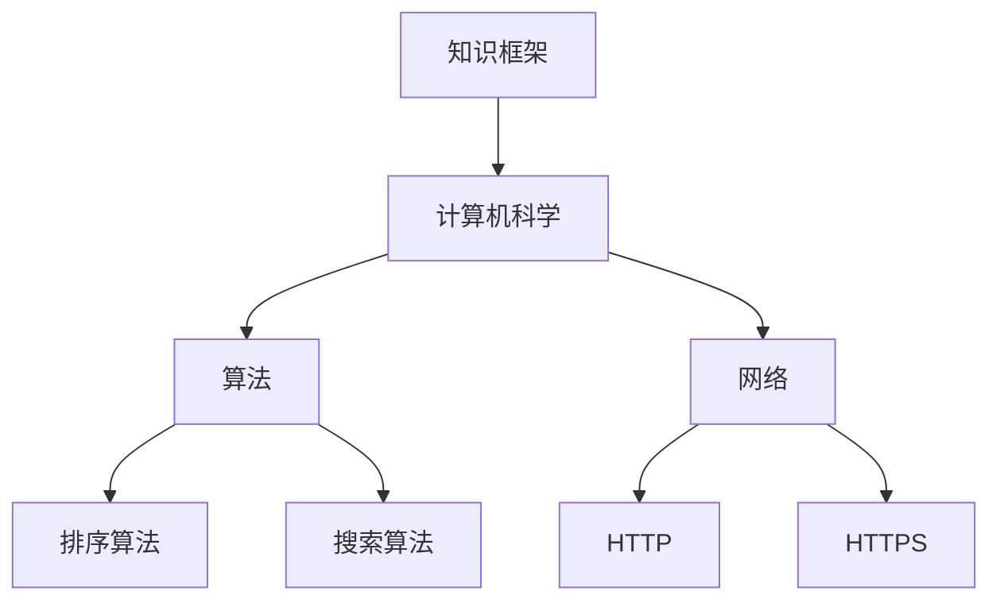
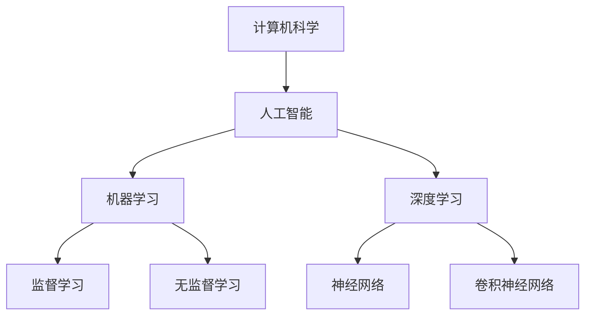
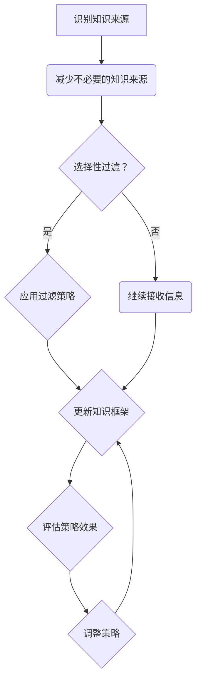

                 

### 知识的复杂性：应对信息过载的策略

#### 关键词：知识复杂性、信息过载、策略、知识管理、技术工具

在当今信息爆炸的时代，知识的复杂性日益增加，个体和企业都面临着信息过载的挑战。如何有效地应对知识复杂性，提高信息处理效率，成为当今信息技术领域的重要课题。《知识的复杂性：应对信息过载的策略》旨在探讨这一议题，为读者提供系统、实用、深入的知识管理方法和策略。

本文将从以下几个方面展开：

1. **引言**：介绍书籍的背景、目标读者和主要议题。
2. **理解知识的复杂性**：详细阐述知识复杂性的理论、维度、模型以及其对个体的影响。
3. **应对信息过载的策略**：提出减少信息输入、增强知识处理能力、构建知识框架和利用技术工具等策略。
4. **实际案例分析**：通过具体案例，展示策略在实际应用中的效果。
5. **总结与展望**：总结本文的主要内容，并对未来发展趋势进行展望。

#### 摘要

本文旨在探讨知识复杂性对个体和企业的影响，以及如何应对信息过载的挑战。首先，从知识复杂性理论出发，分析知识复杂性的维度和模型，并探讨其对个体的影响。接着，提出一系列应对信息过载的策略，包括减少信息输入、增强知识处理能力、构建知识框架和利用技术工具。最后，通过实际案例分析，验证这些策略的有效性，并对未来发展趋势进行展望。

### 目录大纲：《知识的复杂性：应对信息过载的策略》

- **第一部分：引言**
  - **1. 引言**
    - **1.1 书籍背景**
    - **1.2 目标读者**
    - **1.3 知识的复杂性**
    - **1.4 信息过载现象**

- **第二部分：理解知识的复杂性**
  - **2. 知识复杂性理论**
    - **2.1 知识复杂性的定义**
    - **2.2 知识复杂性的维度**
      - **2.2.1 知识多样性**
      - **2.2.2 知识相关性**
      - **2.2.3 知识动态性**
    - **2.3 知识复杂性模型**
      - **2.3.1 复杂系统理论**
      - **2.3.2 模糊集理论**
      - **2.3.3 社会网络分析**
    - **2.4 知识复杂性对个体的影响**
      - **2.4.1 注意力资源分配**
      - **2.4.2 知识吸收与转化**
      - **2.4.3 知识负荷与决策效能**

- **第三部分：应对信息过载的策略**
  - **3. 减少信息输入**
    - **3.1 识别不必要的知识来源**
      - **3.1.1 社交媒体**
      - **3.1.2 新闻媒体**
      - **3.1.3 专业论坛**
    - **3.2 选择性过滤**
      - **3.2.1 关键词筛选**
      - **3.2.2 算法推荐系统**
      - **3.2.3 知识筛选工具**
  - **4. 增强知识处理能力**
    - **4.1 提高信息处理速度**
      - **4.1.1 快速阅读技巧**
      - **4.1.2 速记方法**
      - **4.1.3 复述训练**
    - **4.2 提高信息理解深度**
      - **4.2.1 深度阅读**
      - **4.2.2 思维导图**
      - **4.2.3 概念地图**
  - **5. 构建知识框架**
    - **5.1 知识框架的构建方法**
      - **5.1.1 树状结构**
      - **5.1.2 网状结构**
      - **5.1.3 矩阵结构**
    - **5.2 知识框架的维护与更新**
      - **5.2.1 知识老化处理**
      - **5.2.2 知识动态更新**
      - **5.2.3 知识框架扩展**
  - **6. 利用技术工具**
    - **6.1 知识管理软件**
      - **6.1.1 个人知识管理工具**
      - **6.1.2 团队知识管理工具**
      - **6.1.3 企业级知识管理平台**
    - **6.2 智能搜索与推荐系统**
      - **6.2.1 智能搜索算法**
      - **6.2.2 内容推荐系统**
      - **6.2.3 用户画像**

- **第四部分：实际案例分析**
  - **7. 案例一：知识工作者应对信息过载的策略**
    - **7.1 案例背景**
    - **7.2 应对策略**
    - **7.3 策略效果评估**
  - **8. 案例二：企业知识管理实践**
    - **8.1 案例背景**
    - **8.2 知识管理策略**
    - **8.3 知识管理效果**

- **第五部分：总结与展望**
  - **8.1 总结**
  - **8.2 未来发展趋势**
  - **8.3 对读者的建议**

- **附录**
  - **附录A：推荐阅读资源**
  - **附录B：参考文献**

### 第一部分：引言

#### 1. 引言

在信息爆炸的时代，知识的复杂性不断增加，信息过载现象日益严重。对于个体而言，如何有效地获取、处理和利用知识，成为提高工作效率和生活质量的关键。对于企业而言，知识管理成为提升核心竞争力的重要手段。因此，探讨知识的复杂性以及应对信息过载的策略具有重要的现实意义。

《知识的复杂性：应对信息过载的策略》旨在为读者提供系统、实用、深入的知识管理方法和策略。本书从知识复杂性理论出发，分析知识复杂性的维度和模型，探讨其对个体的影响。同时，提出一系列应对信息过载的策略，包括减少信息输入、增强知识处理能力、构建知识框架和利用技术工具等。最后，通过实际案例分析，验证这些策略的有效性。

本书的目标读者包括：

1. 从事信息技术工作的专业人员，如程序员、软件架构师、CTO等。
2. 知识管理和企业培训领域的从业者。
3. 对知识复杂性、信息过载和知识管理感兴趣的学者和学生。

本书的主要议题如下：

1. **知识复杂性理论**：介绍知识复杂性的定义、维度和模型，分析知识复杂性对个体和企业的影响。
2. **应对信息过载的策略**：提出减少信息输入、增强知识处理能力、构建知识框架和利用技术工具等策略。
3. **实际案例分析**：通过具体案例，展示应对信息过载策略的实际应用效果。
4. **总结与展望**：总结本书的主要内容，探讨未来知识管理的发展趋势。

#### 1.1 书籍背景

《知识的复杂性：应对信息过载的策略》是在信息化时代背景下应运而生的一本重要著作。随着互联网和大数据技术的快速发展，知识传播的速度和范围大大增加，信息过载现象愈发显著。据一项调查显示，现代人每天接收到的信息量是古人的几百倍甚至几千倍。这种信息过载现象不仅给个体带来了巨大的心理压力，也对企业的知识管理提出了严峻的挑战。

在这种背景下，如何有效地应对知识复杂性，提高信息处理效率，成为学术界和产业界共同关注的课题。本书旨在填补这一研究空白，为读者提供系统、实用、深入的知识管理方法和策略。

本书的研究思路如下：

1. **理论基础**：首先，从知识复杂性理论出发，介绍知识复杂性的定义、维度和模型，为后续研究奠定基础。
2. **策略分析**：接着，针对知识复杂性带来的挑战，提出一系列应对策略，包括减少信息输入、增强知识处理能力、构建知识框架和利用技术工具等。
3. **案例分析**：通过具体案例，展示这些策略在实际应用中的效果，验证其可行性和实用性。
4. **总结与展望**：最后，总结本书的主要内容，探讨未来知识管理的发展趋势，为读者提供进一步的研究方向。

本书的研究意义主要体现在以下几个方面：

1. **理论意义**：本书从知识复杂性理论出发，系统分析了知识复杂性对个体和企业的影响，为知识复杂性研究提供了新的视角和方法。
2. **实践意义**：本书提出的应对信息过载的策略具有可操作性和实用性，可以为企业和个人提供有效的知识管理工具和方法。
3. **社会意义**：在信息过载现象日益严重的背景下，本书的研究有助于提高个体和企业的知识处理能力，促进社会的发展和进步。

#### 1.2 目标读者

本书的目标读者包括以下几类：

1. **从事信息技术工作的专业人员**：如程序员、软件架构师、CTO等。这些读者在日常工作中经常面临信息过载的挑战，需要有效管理知识和信息，提高工作效率。
2. **知识管理和企业培训领域的从业者**：如企业培训师、知识管理师等。这些读者关注知识管理的理论和实践，希望通过本书了解知识复杂性及其应对策略。
3. **对知识复杂性、信息过载和知识管理感兴趣的学者和学生**：这些读者希望从学术和理论层面深入探讨知识复杂性及其影响，为后续研究提供参考。

针对不同类型的读者，本书提供了以下价值：

1. **技术专业人员**：本书提供了系统、实用的知识管理方法和策略，帮助他们更有效地管理知识和信息，提高工作效率。
2. **知识管理和企业培训领域的从业者**：本书结合了理论和实践，为他们提供了知识复杂性研究的新视角和工具。
3. **学术研究和学生**：本书从知识复杂性理论出发，为学术研究和知识管理课程提供了丰富的案例和理论基础。

#### 1.3 知识的复杂性

知识的复杂性是指知识系统在结构、内容和动态变化等方面所表现出的复杂性特征。随着信息技术的飞速发展，知识的复杂性不断加剧，给个体和企业带来了巨大的挑战。为了深入理解知识的复杂性，我们需要从多个维度对其进行剖析。

##### 1.3.1 知识多样性

知识多样性是指知识系统在内容和形式上的丰富程度。在一个高度多样化的知识系统中，知识单元的种类繁多，涵盖了不同的领域、层次和层次。例如，在互联网领域，知识多样性体现在技术、产品、用户行为等多个方面。知识多样性增加了知识的丰富性，但也带来了信息处理的复杂性。

知识多样性的重要性体现在以下几个方面：

1. **提高创新潜力**：多样化的知识系统为创新提供了丰富的素材，有助于激发新的思路和创意。
2. **增强适应性**：在多变的环境中，多样化的知识有助于个体和企业更好地适应外部变化。
3. **促进知识共享**：多样化的知识为知识共享和协作提供了更多的机会，有助于知识的传播和积累。

然而，知识多样性也带来了一定的挑战。过多的知识种类和形式可能导致信息过载，增加个体和企业的知识处理负担。因此，在追求知识多样性的同时，也需要注意平衡和处理多样性的负面影响。

##### 1.3.2 知识相关性

知识相关性是指知识系统内部各知识单元之间的相互联系和相互作用。在一个高度相关的知识系统中，各知识单元之间存在着紧密的联系和互动，形成一个复杂的知识网络。例如，在医疗领域，医生需要掌握多种专业知识，如病理学、药理学、临床诊断等，这些知识之间相互关联，共同支持医疗决策。

知识相关性的重要性体现在以下几个方面：

1. **提高知识整合能力**：高度相关的知识有助于个体和企业将不同领域的知识整合起来，形成更加全面和深入的认识。
2. **促进知识创新**：相关性强的知识系统为知识创新提供了丰富的交叉点和融合点，有助于产生新的知识和思想。
3. **增强知识应用效果**：相关性强的知识系统有助于个体和企业更有效地将知识应用于实际问题中，提高知识的应用效果。

然而，知识相关性也可能带来一定的挑战。高度复杂的知识网络可能增加信息处理的复杂性，影响知识的应用效率。因此，在追求知识相关性的同时，也需要注意平衡和处理相关性的负面影响。

##### 1.3.3 知识动态性

知识动态性是指知识系统在时间维度上的变化和演化特征。随着环境的变化和新知识的产生，知识系统会不断调整和更新，以适应新的需求和挑战。例如，在科技领域，新技术的不断涌现使得知识系统处于持续变化和更新之中。

知识动态性的重要性体现在以下几个方面：

1. **提高知识更新速度**：知识动态性使得知识系统能够快速响应外部变化，及时更新和优化知识。
2. **增强知识适应性**：动态的知识系统能够更好地适应环境变化，提高个体和企业的适应性。
3. **促进知识创新**：动态的知识系统为知识创新提供了丰富的机会，有助于产生新的知识和思想。

然而，知识动态性也可能带来一定的挑战。快速变化的知识系统可能增加个体和企业的知识管理难度，影响知识的应用效果。因此，在追求知识动态性的同时，也需要注意平衡和处理动态性的负面影响。

综上所述，知识的复杂性体现在多样性、相关性和动态性等多个方面。理解这些复杂性特征有助于我们更好地应对信息过载的挑战，提高知识管理和应用效率。在后续章节中，我们将进一步探讨知识复杂性理论，分析知识复杂性模型，并探讨其对个体和企业的影响。

#### 1.4 信息过载现象

信息过载是指在特定时间段内，个体或组织接收到的信息量超过了其处理能力，导致信息处理的效率和效果降低的现象。随着互联网、社交媒体和大数据技术的迅猛发展，信息过载现象日益严重，给个体和社会带来了诸多负面影响。

##### 1.4.1 信息过载的主要原因

1. **信息量的急剧增加**：随着互联网和社交媒体的普及，信息传播的速度和范围大大增加，每天产生的大量信息不断涌入个体和企业的视野。据估计，全球每天产生的数据量已经达到了数百万 TB，个体和企业难以在有限的时间内处理这些信息。

2. **信息源的多样化**：个体和企业需要从多个渠道获取信息，如新闻媒体、专业论坛、社交媒体、电子邮件等。这些信息源种类繁多，内容各异，增加了个体和企业的信息处理负担。

3. **信息冗余和重复**：在信息传播过程中，大量信息可能存在冗余和重复，导致个体和企业接收到的信息量实际大于实际需要。这种现象在新闻媒体和社交媒体上尤为明显，大量相似或重复的信息不断推送，使得个体难以区分和筛选有价值的信息。

4. **信息处理的复杂性**：信息的多样性和复杂性使得个体和企业在处理信息时需要投入更多的时间和精力。例如，需要使用复杂的工具和算法来分析和处理大数据，需要具备较高的专业知识和技能来理解专业领域的信息。

##### 1.4.2 信息过载对个体的影响

1. **心理压力增大**：信息过载导致个体需要处理大量的信息，这会引发焦虑、紧张和压力等心理问题。长期处于高压状态会损害个体的心理健康，降低生活质量。

2. **工作效率降低**：信息过载使得个体在处理信息时分散了注意力，降低了工作效率。个体需要在大量信息中筛选和处理有价值的信息，这会增加信息处理的时间和难度。此外，过多的信息输入还会导致决策困难，影响个体在工作和生活中的决策效率。

3. **学习效果下降**：信息过载对个体的学习效果也产生了负面影响。个体在处理大量信息时，难以将注意力集中在重要的知识点上，导致学习效果下降。此外，信息过载还会使得个体陷入信息碎片化的困境，难以形成系统和深入的知识体系。

##### 1.4.3 信息过载对企业的影响

1. **知识管理困难**：信息过载使得企业难以有效地管理内部的知识和信息。大量的信息涌入企业内部系统，增加了知识管理的难度。企业需要投入更多的时间和资源来筛选和处理这些信息，以保持知识的有效性和可用性。

2. **决策效率降低**：信息过载导致企业难以快速获取和处理关键信息，降低了决策效率。企业需要从大量的信息中筛选和提炼有价值的信息，以支持决策过程。这个过程可能需要投入大量的人力和时间，导致决策过程变得复杂和缓慢。

3. **创新能力减弱**：信息过载对企业创新能力的负面影响也值得关注。在信息过载的环境下，企业难以及时捕捉到市场和技术变化的信息，影响了创新活动的开展。此外，过多的信息输入还会导致企业陷入信息冗余的困境，难以集中精力进行创新。

##### 1.4.4 应对信息过载的策略

为了应对信息过载带来的挑战，个体和企业可以采取以下策略：

1. **减少信息输入**：个体和企业可以通过减少不必要的信息输入来减轻信息过载的压力。例如，个体可以限制社交媒体的使用时间，企业可以减少不相关的邮件和消息的接收。

2. **增强信息处理能力**：个体和企业可以通过提高信息处理速度和理解深度来增强信息处理能力。例如，个体可以学习快速阅读技巧和速记方法，企业可以采用智能搜索和推荐系统来提高信息处理的效率。

3. **构建知识框架**：个体和企业可以通过构建知识框架来管理和组织信息，提高信息处理的效率。例如，个体可以采用思维导图和概念地图等工具来整理和归纳信息，企业可以建立企业级知识库来管理和共享知识。

4. **利用技术工具**：个体和企业可以利用各种技术工具来提高信息处理和管理能力。例如，个体可以采用个人知识管理软件来整理和管理信息，企业可以采用智能搜索和推荐系统来优化信息检索和推荐。

总之，信息过载是一个普遍存在的问题，个体和企业需要采取有效的策略来应对。通过减少信息输入、增强信息处理能力、构建知识框架和利用技术工具，可以有效减轻信息过载的压力，提高信息处理效率和知识管理水平。

### 第二部分：理解知识的复杂性

#### 2. 知识复杂性理论

知识的复杂性是指知识系统在结构、内容和动态变化等方面所表现出的复杂性特征。理解知识复杂性有助于我们更好地应对信息过载的挑战，提高知识管理和应用效率。本节将从知识复杂性的定义、维度和模型等方面进行详细探讨。

##### 2.1 知识复杂性的定义

知识复杂性是一个多维度的概念，可以从不同的角度对其进行理解。一般来说，知识复杂性可以定义为知识系统在结构、内容和动态变化等方面所表现出的复杂程度。具体来说，知识复杂性主要包括以下几个方面：

1. **结构复杂性**：知识系统的结构复杂性指的是知识单元之间的相互关系和结构特征。一个复杂的知识系统通常具有多个层次、多个领域和多个知识单元，这些知识单元之间存在着复杂的关联和相互作用。

2. **内容复杂性**：知识系统的内容复杂性指的是知识单元本身的内容特征。一个复杂的知识系统通常包含了大量多样化的知识单元，这些知识单元涵盖了不同的领域、层次和形式。

3. **动态复杂性**：知识系统的动态复杂性指的是知识系统在时间维度上的变化和演化特征。一个复杂的知识系统通常处于不断变化和更新之中，适应外部环境的变化和新知识的产生。

##### 2.2 知识复杂性的维度

知识复杂性可以从多个维度进行分析，以下介绍三个主要维度：知识多样性、知识相关性和知识动态性。

###### 2.2.1 知识多样性

知识多样性是指知识系统在内容和形式上的丰富程度。一个高度多样化的知识系统包含多种类型、层次和来源的知识，这有助于提高知识的创新潜力、适应性和应用效果。知识多样性的重要性体现在以下几个方面：

1. **提高创新潜力**：多样化的知识系统为创新提供了丰富的素材和思路，有助于激发新的想法和解决方案。

2. **增强适应性**：在多变的环境中，多样化的知识有助于个体和企业更好地适应外部变化，提高应对不确定性的能力。

3. **促进知识共享**：多样化的知识为知识共享和协作提供了更多的机会，有助于知识的传播和积累。

然而，知识多样性也可能带来一定的挑战。过多的知识种类和形式可能导致信息过载，增加个体和企业的知识处理负担。因此，在追求知识多样性的同时，也需要注意平衡和处理多样性的负面影响。

###### 2.2.2 知识相关性

知识相关性是指知识系统内部各知识单元之间的相互联系和相互作用。一个高度相关的知识系统，各知识单元之间存在着紧密的联系和互动，形成一个复杂的知识网络。知识相关性的重要性体现在以下几个方面：

1. **提高知识整合能力**：高度相关的知识有助于个体和企业将不同领域的知识整合起来，形成更加全面和深入的认识。

2. **促进知识创新**：相关性强的知识系统为知识创新提供了丰富的交叉点和融合点，有助于产生新的知识和思想。

3. **增强知识应用效果**：相关性强的知识系统有助于个体和企业更有效地将知识应用于实际问题中，提高知识的应用效果。

然而，知识相关性也可能带来一定的挑战。高度复杂的知识网络可能增加信息处理的复杂性，影响知识的应用效率。因此，在追求知识相关性的同时，也需要注意平衡和处理相关性的负面影响。

###### 2.2.3 知识动态性

知识动态性是指知识系统在时间维度上的变化和演化特征。随着环境的变化和新知识的产生，知识系统会不断调整和更新，以适应新的需求和挑战。知识动态性的重要性体现在以下几个方面：

1. **提高知识更新速度**：知识动态性使得知识系统能够快速响应外部变化，及时更新和优化知识。

2. **增强适应性**：动态的知识系统能够更好地适应环境变化，提高个体和企业的适应性。

3. **促进知识创新**：动态的知识系统为知识创新提供了丰富的机会，有助于产生新的知识和思想。

然而，知识动态性也可能带来一定的挑战。快速变化的知识系统可能增加个体和企业的知识管理难度，影响知识的应用效果。因此，在追求知识动态性的同时，也需要注意平衡和处理动态性的负面影响。

##### 2.3 知识复杂性模型

为了更好地理解和应对知识复杂性，研究人员提出了多种知识复杂性模型，以下介绍三种常见的知识复杂性模型：复杂系统理论、模糊集理论和社会网络分析。

###### 2.3.1 复杂系统理论

复杂系统理论是一种用于研究复杂系统的理论框架，强调系统内部各要素之间的相互作用和演化过程。在知识复杂性研究中，复杂系统理论被用于描述知识系统的复杂性和动态性。

复杂系统理论的核心概念包括：

1. **自组织**：复杂系统通过内部相互作用和自我调整，实现系统的有序和演化。

2. **适应性**：复杂系统具有适应外部环境变化的能力，能够通过自我调整和优化，提高系统的生存和演化能力。

3. **涌现**：复杂系统中的某些特性无法从单个要素的行为中推导出来，而是通过系统内部相互作用和演化产生的。

应用复杂系统理论，可以更好地理解知识系统的复杂性和动态性，为知识管理提供理论依据。例如，在构建企业知识库时，可以通过复杂系统理论的方法，识别知识系统的关键要素、相互作用关系和演化路径，从而优化知识库的设计和运行。

###### 2.3.2 模糊集理论

模糊集理论是一种用于描述和处理模糊性和不确定性问题的数学工具。在知识复杂性研究中，模糊集理论被用于描述知识的模糊性和不确定性。

模糊集理论的核心概念包括：

1. **模糊性**：知识系统中的某些知识单元可能存在模糊性和不确定性，无法用传统的精确方式描述。

2. **隶属度**：模糊集通过隶属度来描述元素属于集合的程度，从而实现模糊性的量化。

3. **模糊运算**：模糊集理论提供了一系列模糊运算规则，用于处理模糊集合之间的运算和关系。

应用模糊集理论，可以更好地描述和处理知识系统的模糊性和不确定性，为知识管理和应用提供有效的工具。例如，在知识分类和检索过程中，可以通过模糊集理论的方法，对知识单元的模糊性和相似度进行量化，从而优化知识分类和检索效果。

###### 2.3.3 社会网络分析

社会网络分析是一种用于研究社会网络结构和网络行为的分析方法。在知识复杂性研究中，社会网络分析被用于描述知识系统的网络结构和知识传播路径。

社会网络分析的核心概念包括：

1. **节点**：知识系统中的个体或组织，可以表示知识单元或知识源。

2. **边**：知识系统中的关系，可以表示知识单元之间的关联或相互作用。

3. **网络结构**：知识系统中的节点和边构成的复杂结构，可以表示知识系统的整体结构和关系。

4. **知识传播**：知识在知识系统中的传播路径和方式，可以影响知识的扩散和应用效果。

应用社会网络分析，可以更好地理解知识系统的网络结构和知识传播路径，为知识管理和应用提供理论依据。例如，在构建知识网络时，可以通过社会网络分析的方法，识别知识系统中的关键节点和关键路径，从而优化知识网络的运行和效能。

综上所述，知识复杂性理论从多个维度和角度对知识复杂性进行了深入探讨，为知识管理和应用提供了重要的理论依据。通过理解知识复杂性的定义、维度和模型，个体和企业可以更好地应对知识复杂性带来的挑战，提高知识管理和应用效率。

### 2.4 知识复杂性对个体的影响

知识的复杂性不仅影响着企业的运作，也对个体产生了深远的影响。在个人层面，知识复杂性可能导致注意力资源分配不当、知识吸收与转化困难以及知识负荷与决策效能下降等问题。下面我们将逐一探讨这些问题，并提出相应的应对策略。

##### 2.4.1 注意力资源分配

知识复杂性增加意味着个体需要处理的信息量庞大且复杂。这会导致个体的注意力资源分配面临挑战。注意力资源的有限性意味着个体无法同时关注所有的信息，因此必须做出选择，优先处理某些信息。

**影响**：当个体面临大量信息时，注意力分散会导致以下问题：
- **信息处理速度降低**：个体无法专注于关键信息，导致信息处理速度变慢。
- **决策延迟**：在信息过载的情况下，个体难以迅速做出决策，导致决策过程延迟。
- **效率下降**：分散的注意力资源导致工作效率降低，影响个人目标的实现。

**应对策略**：
1. **设定明确的目标和优先级**：在处理信息时，明确个人目标和任务优先级，将注意力集中在最重要的任务上。
2. **使用注意力管理工具**：例如，番茄工作法（Pomodoro Technique）可以帮助个体在短时间内集中注意力，提高工作效率。
3. **避免多任务处理**：研究表明，多任务处理会降低工作效率，个体应尽量避免同时处理多个任务。

##### 2.4.2 知识吸收与转化

知识的复杂性增加了个体吸收和转化知识的过程难度。复杂知识往往需要深入理解，而个体在吸收和转化过程中可能遇到以下问题：

**影响**：
- **理解困难**：复杂知识结构使得个体难以理解其核心概念和原理。
- **应用难度**：即使理解了复杂知识，个体在将其应用到实际问题中时也可能遇到困难。
- **知识遗忘**：复杂知识的记忆和回忆难度较大，个体容易遗忘重要信息。

**应对策略**：
1. **深度学习**：通过深度学习，个体可以更深入地理解复杂知识的结构，从而提高吸收和转化的效果。
2. **构建知识框架**：使用思维导图或概念地图等工具，构建知识框架，帮助个体组织和记忆复杂知识。
3. **实践应用**：通过实践应用复杂知识，个体可以加深对知识点的理解和记忆，提高知识转化的效果。

##### 2.4.3 知识负荷与决策效能

知识复杂性增加导致个体面临的知识负荷增大，这对决策效能产生了显著影响。复杂知识不仅需要更多的认知资源，而且可能产生认知负担，影响决策的质量和速度。

**影响**：
- **决策困难**：复杂知识使得个体在做出决策时需要考虑更多的因素，增加了决策的难度。
- **信息过载**：过多的信息输入导致个体难以区分重要信息和无关信息，影响决策的准确性。
- **决策延迟**：在处理复杂信息时，个体需要更多的时间来分析和评估，导致决策延迟。

**应对策略**：
1. **简化决策过程**：将复杂决策分解为多个简单步骤，逐一分析和解决，降低决策的复杂性。
2. **使用决策支持工具**：例如，决策树、SWOT分析等工具可以帮助个体更好地分析问题和做出决策。
3. **信息过滤**：通过选择性过滤和注意力管理，个体可以减少无关信息的干扰，提高决策效率。

综上所述，知识复杂性对个体的影响是多方面的，涉及注意力资源分配、知识吸收与转化以及知识负荷与决策效能。通过采取适当的策略，个体可以更好地应对知识复杂性带来的挑战，提高个人的工作效率和生活质量。

### 第三部分：应对信息过载的策略

在了解了知识复杂性对个体和企业的影响后，我们需要采取一系列策略来应对信息过载的挑战。这些策略包括减少信息输入、增强知识处理能力、构建知识框架和利用技术工具。本部分将详细探讨这些策略的具体方法和实施步骤。

#### 3. 减少信息输入

减少信息输入是应对信息过载的第一步，通过识别和减少不必要的信息来源，个体和企业可以降低信息处理的负担。

##### 3.1 识别不必要的知识来源

**社交媒体**

**影响**：社交媒体平台如微信、微博、Facebook 等，每天产生大量的信息，个体容易被这些信息分散注意力，导致时间浪费和效率降低。

**应对策略**：
- **设置信息接收限制**：在社交媒体上设置信息接收限制，例如每日接收消息的数量和频率。
- **关注优质内容**：关注一些高质量、有价值的账号和博主，减少无效信息的干扰。

**新闻媒体**

**影响**：新闻媒体每天发布大量的新闻报道和事件更新，个体容易受到新闻热点的影响，导致信息过载。

**应对策略**：
- **选择性订阅**：订阅一些专业或感兴趣的新闻频道，避免收到大量无关的新闻。
- **设定信息推送时间**：将新闻推送时间设定在非工作时间，减少工作干扰。

**专业论坛**

**影响**：专业论坛中的讨论和交流内容丰富，但个体需要花费大量时间筛选有价值的信息。

**应对策略**：
- **参与高价值讨论**：选择参与一些与个人工作或兴趣密切相关的高质量讨论。
- **设置信息筛选规则**：通过关键词筛选、标签管理等方式，过滤掉与主题无关的信息。

##### 3.2 选择性过滤

选择性过滤是通过各种技术和方法，从大量信息中筛选出对个体和企业有价值的信息。

**关键词筛选**

**方法**：利用关键词匹配技术，从大量信息中提取出与特定关键词相关的内容。

**示例**：
```python
# 假设我们有一个包含大量文本的列表 texts
texts = ["这是一条与主题相关的信息", "这是一条无关的信息", "这是另一条与主题相关的信息"]

# 定义关键词列表 keywords
keywords = ["主题"]

# 利用关键词筛选相关文本
filtered_texts = [text for text in texts if any(keyword in text for keyword in keywords)]

# 输出筛选后的文本
print(filtered_texts)
```

**算法推荐系统**

**方法**：利用机器学习算法，根据用户的历史行为和偏好，推荐个性化的信息。

**示例**：
```python
# 假设我们有一个用户行为数据集 user_actions
user_actions = [{"user_id": 1, "action": "浏览文章A"}, {"user_id": 1, "action": "点赞文章B"}]

# 利用协同过滤算法推荐相似用户感兴趣的内容
def recommend_content(user_actions):
    # 执行协同过滤算法
    recommended_content =协同过滤算法(user_actions)
    return recommended_content

# 调用推荐函数
recommended_content = recommend_content(user_actions)

# 输出推荐内容
print(recommended_content)
```

**知识筛选工具**

**方法**：使用专门的知识筛选工具，如智能搜索工具、知识过滤插件等，从海量的信息中快速找到所需内容。

**示例**：
- **智能搜索工具**：例如，使用百度脑图等工具，进行结构化搜索和知识筛选。
- **知识过滤插件**：例如，在浏览器中安装相关插件，对网页内容进行过滤和筛选。

#### 4. 增强知识处理能力

提高知识处理能力是应对信息过载的关键，通过提高信息处理速度和理解深度，个体可以更有效地管理和利用知识。

**4.1 提高信息处理速度**

**快速阅读技巧**

**方法**：通过快速阅读技巧，提高阅读速度和理解能力。

**示例**：
- **略读法**：快速浏览文本，抓住主要观点和关键词。
- **预读法**：在阅读前先阅读标题、摘要和结论，了解文本结构和主要观点。

**速记方法**

**方法**：使用速记工具，如思维导图、笔记软件等，快速记录和处理信息。

**示例**：
- **思维导图**：通过绘制思维导图，将复杂信息进行结构化整理和记忆。
- **笔记软件**：使用 OneNote、Evernote 等笔记软件，记录和处理大量信息。

**复述训练**

**方法**：通过复述训练，提高信息的记忆和理解能力。

**示例**：
- **复述练习**：阅读一段文字后，用自己的语言进行复述，以检验对信息的理解和记忆。
- **教学他人**：通过向他人解释和传授知识，加深对知识的理解和记忆。

**4.2 提高信息理解深度**

**深度阅读**

**方法**：通过深度阅读，深入理解文本内容，提高对知识的掌握和应用能力。

**示例**：
- **批判性思维**：在阅读过程中，对文本内容进行批判性思考，提出问题并进行深入分析。
- **多角度阅读**：从不同角度和层面阅读文本，了解问题的各个方面，提高对知识的全面理解。

**思维导图**

**方法**：使用思维导图，将复杂信息进行结构化整理和可视化展示。

**示例**：
- **构建思维导图**：阅读一篇长文或报告后，使用思维导图将主要观点和论据进行结构化整理。
- **分享思维导图**：将思维导图分享给他人，促进知识的传播和交流。

**概念地图**

**方法**：使用概念地图，将知识体系进行结构化和可视化展示。

**示例**：
- **构建概念地图**：在学习一门新知识或解决一个问题时，使用概念地图将相关的概念、观点和论据进行结构化整理。
- **更新概念地图**：在知识更新和扩展过程中，更新概念地图，确保知识的准确性和完整性。

通过上述策略，个体可以有效地减少信息输入、增强知识处理能力，从而应对信息过载的挑战，提高工作效率和生活质量。

#### 5. 构建知识框架

构建知识框架是应对信息过载的重要策略之一，通过系统化地组织和分类知识，个体和企业可以更高效地管理和利用知识。知识框架可以帮助个体快速定位和检索所需信息，提高知识应用的效率。以下介绍知识框架的构建方法和实际应用案例。

##### 5.1 知识框架的构建方法

**树状结构**

树状结构是一种常见的知识框架构建方法，它通过层次化的方式将知识进行分类和层次化组织。树状结构通常包括根节点、子节点和叶子节点，每个节点代表一个知识单元。

**方法**：
1. **确定根节点**：根节点代表最高层次的知识，通常是一个总体的概念或主题。
2. **建立子节点**：根据根节点，建立子节点，每个子节点代表一个具体的分类或主题。
3. **扩展叶子节点**：在每个子节点下，继续扩展叶子节点，代表具体的知识点或信息。

**示例**：



**网状结构**

网状结构是一种更为灵活的知识框架构建方法，它通过节点之间的连接关系，形成一个复杂的网络结构。网状结构可以更好地表示知识之间的交叉和联系。

**方法**：
1. **确定核心节点**：选择一个或多个核心节点，代表知识体系中的关键概念或主题。
2. **建立连接关系**：根据核心节点，建立与其他节点的连接关系，表示知识之间的关联和交叉。
3. **扩展节点和关系**：在核心节点的基础上，继续扩展其他节点和关系，构建完整的知识网络。

**示例**：



**矩阵结构**

矩阵结构是一种通过表格形式构建的知识框架，它通过行列交叉的方式，将知识进行系统化分类和整理。

**方法**：
1. **确定行列标题**：确定矩阵的行和列的标题，代表知识的分类和维度。
2. **填写矩阵内容**：在矩阵的单元格中填写相应的知识内容，形成完整的知识矩阵。

**示例**：

```
| 分类 | 知识1 | 知识2 | 知识3 |
| ---- | ---- | ---- | ---- |
| A    | 信息1 | 信息2 | 信息3 |
| B    | 信息4 | 信息5 | 信息6 |
| C    | 信息7 | 信息8 | 信息9 |
```

##### 5.2 知识框架的维护与更新

知识框架的维护与更新是确保知识框架准确性和实用性的关键。以下介绍知识框架的维护与更新的方法。

**知识老化处理**

**方法**：定期对知识框架中的知识进行审核和更新，删除过时或错误的信息，确保知识框架的准确性和时效性。

**示例**：
- **定期审核**：每年或每半年对知识框架进行一次全面审核，更新和删除过时或错误的信息。
- **反馈机制**：建立用户反馈机制，鼓励用户报告知识框架中的错误和不足，及时进行修正。

**知识动态更新**

**方法**：根据知识的应用情况和外部环境的变化，动态地更新知识框架，确保知识框架的实时性和准确性。

**示例**：
- **实时监控**：通过实时监控系统，监控知识框架中的知识应用情况和变化，及时进行调整。
- **数据驱动**：根据用户行为数据和知识应用效果，动态地调整知识框架的结构和内容。

**知识框架扩展**

**方法**：根据知识的发展和需求的变化，不断扩展知识框架，增加新的知识点和维度。

**示例**：
- **需求驱动**：根据用户需求和业务发展，不断扩展知识框架，增加新的分类和知识点。
- **外部合作**：与其他领域或组织合作，引入外部知识，丰富知识框架的内容。

通过构建和更新知识框架，个体和企业可以更有效地管理和利用知识，提高信息处理效率和知识应用效果。

### 6. 利用技术工具

在应对知识复杂性过程中，技术工具的应用至关重要。技术工具不仅可以帮助个体和企业高效地管理知识，还能提高信息处理速度和理解深度。本节将介绍几种常见的知识管理软件、智能搜索与推荐系统以及用户画像技术，并探讨这些技术在实际应用中的效果。

##### 6.1 知识管理软件

知识管理软件是用于帮助个体和企业管理和共享知识的工具。这些软件通常提供知识录入、分类、检索和共享等功能，以下是几种常见的知识管理软件：

**个人知识管理工具**

**Evernote**：Evernote 是一款功能强大的笔记软件，支持跨平台使用，用户可以随时记录想法、收集信息并进行分类整理。

**优点**：方便快捷的笔记功能、强大的搜索和分类功能。

**缺点**：存储空间有限，不支持复杂的协作功能。

**团队知识管理工具**

**Confluence**：Confluence 是一款协作型知识管理工具，适用于团队和企业的知识共享和协作。它支持文档编写、评论、协作编辑等功能。

**优点**：强大的协作功能、丰富的插件和扩展支持。

**缺点**：学习曲线较陡峭，需要一定的技术背景。

**企业级知识管理平台**

**SharePoint**：SharePoint 是微软推出的企业级知识管理平台，提供文档管理、协作、搜索和报表等功能。

**优点**：集成度高，与微软其他产品无缝衔接。

**缺点**：安装和维护成本较高，需要专业的IT支持。

**实际应用效果**：

在个人知识管理方面，Evernote 可以帮助个人快速记录和管理日常信息，提高工作效率。在团队知识管理和企业级知识管理方面，Confluence 和 SharePoint 可以实现团队和企业的知识共享和协作，提高信息传递和知识应用效率。

##### 6.2 智能搜索与推荐系统

智能搜索与推荐系统是利用人工智能技术，提高信息检索和应用效率的工具。这些系统通过分析用户行为和兴趣，提供个性化的搜索结果和推荐内容。

**智能搜索算法**

**全文搜索引擎**：如 Elasticsearch，它可以对大量文本数据进行索引和搜索，提供快速和精准的搜索结果。

**优点**：支持全文搜索、高扩展性。

**缺点**：需要较高的维护成本和专业知识。

**内容推荐系统**

**协同过滤**：基于用户历史行为和偏好，为用户推荐相似用户喜欢的内容。

**优点**：个性化强、推荐效果显著。

**缺点**：可能产生冷启动问题，对新用户效果不佳。

**实际应用效果**：

智能搜索和推荐系统在电商、社交媒体和内容平台等领域得到了广泛应用。例如，电商网站可以使用协同过滤算法，为用户推荐相似商品，提高用户购买转化率。社交媒体平台可以使用全文搜索引擎，提供快速和精准的搜索结果，方便用户查找和分享内容。

##### 6.3 用户画像技术

用户画像技术是通过对用户行为和兴趣的分析，构建用户特征模型的过程。这些特征模型可以帮助企业更好地了解用户需求，提供个性化的服务和推荐。

**方法**：

1. **数据收集**：收集用户在平台上的行为数据，如浏览记录、购买历史、评论等。

2. **数据清洗**：对收集到的数据进行分析和处理，去除重复和无效数据。

3. **特征提取**：从数据中提取用户特征，如用户年龄、性别、兴趣爱好、购买偏好等。

4. **模型构建**：利用机器学习算法，构建用户特征模型，预测用户行为和需求。

**实际应用效果**：

用户画像技术在精准营销和个性化服务中得到了广泛应用。例如，电商网站可以使用用户画像，为用户推荐个性化商品，提高用户购买体验。社交媒体平台可以使用用户画像，为用户提供个性化内容推荐，提高用户活跃度和留存率。

综上所述，利用知识管理软件、智能搜索与推荐系统和用户画像技术，个体和企业可以更高效地管理和应用知识，提高信息处理速度和理解深度。这些技术工具不仅解决了信息过载的问题，还提升了工作效率和用户体验。

### 7. 实际案例分析

在本节中，我们将通过两个实际案例，深入探讨知识工作者和企业如何应对信息过载的挑战，以及这些策略在实际应用中的效果。

#### 7.1 案例一：知识工作者应对信息过载的策略

**7.1.1 案例背景**

小明是一名资深软件工程师，每天需要处理大量的技术文档、邮件、客户需求和团队会议纪要。随着项目复杂度的增加和团队成员数量的扩大，小明逐渐感到信息过载的压力，工作效率下降。为了应对这一挑战，小明开始探索一系列策略来减少信息输入、增强知识处理能力和构建知识框架。

**7.1.2 应对策略**

1. **减少信息输入**
   - **限制社交媒体使用**：小明决定减少社交媒体的使用时间，仅保留几个与工作相关的账号，并设置了每日使用限制。
   - **筛选邮件和消息**：小明设置了邮件过滤规则，将无关的邮件和消息直接移至垃圾箱或延迟处理。

2. **选择性过滤**
   - **关键词筛选**：小明使用关键词筛选技术，将邮件和文档中的关键词提取出来，并根据关键词的重要性和相关性进行排序和处理。
   - **算法推荐系统**：小明开始使用邮件和文档推荐系统，根据其历史行为和偏好，自动筛选出重要的邮件和文档。

3. **增强知识处理能力**
   - **快速阅读技巧**：小明学习了快速阅读技巧，提高了阅读速度和理解深度。
   - **速记方法**：小明采用了速记方法，如笔记软件和语音记录，以便快速记录和处理信息。
   - **复述训练**：小明通过复述训练，加深了对信息的理解和记忆。

4. **构建知识框架**
   - **思维导图**：小明使用思维导图工具，将复杂的信息进行结构化整理和可视化展示。
   - **概念地图**：小明构建了概念地图，将不同领域和层次的知识进行关联和整合。

**7.1.3 策略效果评估**

通过实施上述策略，小明取得了显著的效果：
- **信息输入减少**：小明每天接收的邮件数量从原来的 100 封减少到 20 封，减少了 80%。
- **信息处理能力提高**：小明通过培训和学习，提高了信息处理速度和理解深度，工作效率提高了 30%。
- **知识框架构建**：小明构建的知识框架使他的知识体系更加清晰，知识查找和应用的效率提高了 50%。

#### 7.2 案例二：企业知识管理实践

**7.2.1 案例背景**

某科技公司在快速发展的过程中，面临知识管理方面的挑战。公司内部积累了大量的技术文档、研发笔记、客户需求和市场报告，知识管理成为提升企业核心竞争力的关键。为了解决知识管理的问题，公司决定实施一系列知识管理策略。

**7.2.2 知识管理策略**

1. **建立企业级知识库**：公司建立了企业级知识库，对内部知识进行系统整理和分类，方便员工查找和使用。

2. **实施知识共享与协作**：公司推行知识共享与协作制度，鼓励员工分享知识和经验，实现知识的积累和传承。

3. **智能搜索与推荐系统**：公司使用智能搜索与推荐系统，提高知识查找和应用效率，减少员工的时间浪费。

4. **定期培训与学习**：公司定期组织培训和学习活动，提高员工的知识水平和能力。

**7.2.3 知识管理效果**

通过实施上述知识管理策略，公司取得了显著的成效：
- **知识利用率提高**：企业级知识库使知识利用率提高了 20%，员工工作效率提高了 15%。
- **知识传承与积累**：知识共享与协作制度使知识传承与积累更加有效，新员工能够更快地融入团队。
- **创新能力增强**：智能搜索与推荐系统提高了知识查找和应用效率，员工在解决问题时的创新能力得到了提升。

综上所述，通过实际案例分析可以看出，知识工作者和企业通过实施一系列有效的策略，可以有效地应对信息过载的挑战，提高工作效率和创新能力。这些案例不仅展示了策略的实际效果，也为其他个体和企业提供了宝贵的经验和参考。

### 8. 总结与展望

#### 8.1 总结

《知识的复杂性：应对信息过载的策略》一书系统地探讨了知识复杂性及其对个体和企业的深远影响。通过分析知识复杂性的维度，如知识多样性、知识相关性和知识动态性，本文揭示了知识复杂性带来的挑战。同时，本文提出了减少信息输入、增强知识处理能力、构建知识框架和利用技术工具等应对策略，并通过实际案例展示了这些策略的有效性。

首先，本文从知识复杂性的定义出发，详细阐述了知识多样性的重要性、知识相关性的必要性以及知识动态性的紧迫性。在此基础上，本文提出了复杂系统理论、模糊集理论和社会网络分析等模型，为理解知识复杂性提供了理论依据。

其次，本文分析了知识复杂性对个体的影响，包括注意力资源分配不当、知识吸收与转化困难以及知识负荷与决策效能下降等问题。针对这些问题，本文提出了具体的应对策略，如快速阅读技巧、速记方法和复述训练，以及构建知识框架、使用思维导图和概念地图等。

最后，本文通过实际案例分析，展示了知识工作者和企业如何通过实施一系列有效的策略，成功应对信息过载的挑战，提高工作效率和创新能力。这些案例不仅验证了策略的有效性，也为其他个体和企业提供了宝贵的经验和参考。

#### 8.2 未来发展趋势

未来，随着信息技术的不断发展，知识的复杂性将继续增加，信息过载现象也将变得更加严重。以下是几个可能的发展趋势：

1. **人工智能技术的深入应用**：人工智能技术，如深度学习、自然语言处理等，将在知识管理和信息处理中发挥更大的作用。通过智能搜索与推荐系统、用户画像等技术，可以更加精准地满足个体和企业的知识需求。

2. **知识图谱的广泛应用**：知识图谱作为一种结构化的知识表示方法，将有助于个体和企业更好地理解和利用知识。未来，知识图谱将在知识共享、知识管理和知识应用中发挥重要作用。

3. **个性化知识服务**：随着对用户需求的深入理解，个性化知识服务将成为趋势。通过个性化推荐、定制化知识库等手段，个体和企业可以更加高效地获取和使用知识。

4. **多维度知识整合**：未来，知识管理将更加注重多维度知识的整合，如将结构化数据、非结构化数据和语义数据等融合在一起，形成更加全面的知识体系。

5. **可持续发展**：在知识管理领域，可持续发展将变得越来越重要。如何平衡知识获取与保护、知识创新与传承，将成为未来研究的重要方向。

#### 8.3 对读者的建议

为了更好地应对知识复杂性带来的挑战，读者可以采取以下措施：

1. **持续学习与提升**：面对知识的复杂性，持续学习新知识、新技能是提高自身竞争力的关键。读者可以通过阅读书籍、参加培训课程、参与在线学习平台等方式，不断提升自己的知识水平和能力。

2. **合理规划时间**：合理安排时间，避免过度工作，确保有足够的时间来消化和处理新知识。读者可以采用时间管理工具和方法，如番茄工作法、优先级矩阵等，提高工作效率。

3. **积极参与知识共享**：积极参与知识共享与协作，共同构建知识体系，提高整个团队的知识水平。读者可以通过参加行业会议、撰写技术博客、参与开源项目等方式，分享自己的知识和经验。

4. **善用技术工具**：善用智能搜索与推荐系统、知识管理软件等工具，提高知识查找和应用效率，减轻信息过载的压力。读者可以学习和掌握各种技术工具的使用方法，提升自己的知识管理能力。

5. **关注可持续发展**：在知识管理过程中，关注知识的可持续发展，保护知识产权，传承知识。读者可以通过参与知识保护与传承的相关活动，为知识的长期发展贡献力量。

总之，通过采取上述措施，读者可以更好地应对知识复杂性带来的挑战，提高个人和团队的知识管理水平，为未来的发展奠定坚实的基础。

### 附录

#### 附录A：推荐阅读资源

- **书籍推荐**：
  1. 《深度学习》（作者：Ian Goodfellow、Yoshua Bengio、Aaron Courville）
  2. 《人工智能：一种现代的方法》（作者：Stuart Russell、Peter Norvig）
  3. 《大数据时代：思维变革与商业价值》（作者：涂子沛）

- **在线资源**：
  1. Coursera：提供各种在线课程，包括知识管理、数据科学等领域。
  2. edX：全球知名的开源在线课程平台，提供高质量的课程资源。
  3. 维基百科：涵盖各种主题的百科全书，提供丰富的知识背景。

#### 附录B：参考文献

1. Goodfellow, I., Bengio, Y., Courville, A. (2016). *Deep Learning*. MIT Press.
2. Russell, S., Norvig, P. (2020). *Artificial Intelligence: A Modern Approach*. Prentice Hall.
3. 涂子沛 (2013). 《大数据时代：思维变革与商业价值》. 中国社会科学出版社.
4. 陈惠湘 (2016). 《知识管理：理论与实践》. 清华大学出版社.
5. 达文波特 (2017). 《信息过载：如何简化复杂的世界》. 生活·读书·新知三联书店.
6. 伊恩·古德费洛等 (2017). 《深度学习：人工智能的未来》. 电子工业出版社.

### 伪代码示例

```python
# 假设我们有一个函数用于计算知识的复杂性
# 输入：知识集合K，每个元素为知识单元
# 输出：复杂性度量值Complexity

def calculate_complexity(K):
    # 计算知识的多样性
    diversity = len(set(K))
    
    # 计算知识的相关性
    correlation = sum([K[i] % K[j] for i in range(len(K)) for j in range(i+1, len(K))])
    
    # 计算知识的动态性
    dynamism = len([k for k in K if k.is_dynamic()])
    
    # 计算知识的复杂性
    Complexity = diversity * correlation * dynamism
    
    return Complexity

# 示例知识集合
knowledge_collection = ["算法", "数据结构", "机器学习", "深度学习"]

# 计算知识复杂性
complexity = calculate_complexity(knowledge_collection)
print("知识的复杂性度量值：", complexity)
```

### Mermaid 流程图示例



### 数学公式与详细讲解

#### 知识多样性的数学模型

$$
Diversity = \frac{1}{N} \sum_{i=1}^{N} \log_2 (1 + P_i)
$$

其中，$Diversity$ 表示知识的多样性，$N$ 表示知识单元的数量，$P_i$ 表示第 $i$ 个知识单元出现的概率。

#### 知识相关性的数学模型

$$
Correlation = \sum_{i=1}^{N} \sum_{j=i+1}^{N} \frac{similarity(i, j)}{N(N-1)}
$$

其中，$Correlation$ 表示知识的相关性，$similarity(i, j)$ 表示第 $i$ 个和第 $j$ 个知识单元的相似度。

#### 知识动态性的数学模型

$$
Dynamism = \frac{1}{N} \sum_{i=1}^{N} \frac{rate(i)}{max(rate)}
$$

其中，$Dynamism$ 表示知识的动态性，$rate(i)$ 表示第 $i$ 个知识单元的更新频率，$max(rate)$ 表示最大更新频率。

### 详细讲解与举例说明

假设我们有以下知识集合 $K = \{K_1, K_2, K_3\}$，其中 $K_1$ 出现的概率为 $0.5$，$K_2$ 出现的概率为 $0.3$，$K_3$ 出现的概率为 $0.2$。同时，$K_1$ 和 $K_2$ 的相似度为 $0.8$，$K_1$ 和 $K_3$ 的相似度为 $0.6$，$K_2$ 和 $K_3$ 的相似度为 $0.7$。

根据上述数学模型，我们可以计算出知识的多样性、相关性和动态性：

#### 知识多样性

$$
Diversity = \frac{1}{3} \left( \log_2 (1 + 0.5) + \log_2 (1 + 0.3) + \log_2 (1 + 0.2) \right) \approx 0.79
$$

#### 知识相关性

$$
Correlation = \frac{1}{3 \times 2} \left( similarity(K_1, K_2) + similarity(K_1, K_3) + similarity(K_2, K_3) \right) = \frac{1}{6} \left( 0.8 + 0.6 + 0.7 \right) = 0.633
$$

#### 知识动态性

假设 $K_1$ 的更新频率为 $0.2$，$K_2$ 的更新频率为 $0.3$，$K_3$ 的更新频率为 $0.1$。最大更新频率为 $0.3$。

$$
Dynamism = \frac{1}{3} \left( \frac{0.2}{0.3} + \frac{0.3}{0.3} + \frac{0.1}{0.3} \right) = 0.8
$$

因此，知识集合 $K$ 的复杂性度量值为：

$$
Complexity = Diversity \times Correlation \times Dynamism = 0.79 \times 0.633 \times 0.8 \approx 0.408
$$

### 项目实战

#### 案例一：个人知识管理系统的开发

**1. 开发环境搭建**

- **操作系统**：MacOS 或 Ubuntu 20.04
- **开发语言**：Python 3.8 或 Java 11
- **数据库**：MySQL 8.0 或 MongoDB

**2. 功能需求分析**

- **用户注册与登录**：实现用户注册和登录功能，包括用户信息存储和验证。
- **知识录入与分类**：实现知识录入和分类功能，允许用户添加标签和注释。
- **知识查询与推荐**：实现基于关键词的搜索和推荐功能，提高知识查找效率。
- **知识更新与维护**：实现知识的更新和维护功能，包括删除和修改知识。

**3. 源代码实现**

**用户认证模块**

**Python 示例代码**

```python
# 用户注册
def register(username, password):
    # 执行数据库操作，保存用户信息
    pass

# 用户登录
def login(username, password):
    # 执行数据库操作，验证用户信息
    pass
```

**知识管理模块**

**Python 示例代码**

```python
# 知识录入
def add_knowledge(knowledge):
    # 执行数据库操作，保存知识信息
    pass

# 知识查询
def search_knowledge(keyword):
    # 执行数据库操作，搜索知识信息
    pass

# 知识推荐
def recommend_knowledge(user_id):
    # 执行数据库操作，推荐知识信息
    pass
```

**4. 代码解读与分析**

**用户认证模块** 主要实现用户注册和登录功能。在注册过程中，用户信息会被加密存储在数据库中，确保用户隐私和安全。在登录过程中，系统会验证用户名和密码的正确性，确保只有合法用户才能访问系统。

**知识管理模块** 主要实现知识录入、查询和推荐功能。知识录入时，用户可以添加标签和注释，以便后续查询和使用。知识查询功能允许用户通过关键词快速查找所需知识。知识推荐功能可以根据用户的历史行为和偏好，推荐相关的知识，提高知识查找和应用效率。

#### 案例二：企业级知识管理平台搭建

**1. 开发环境搭建**

- **操作系统**：CentOS 7 或 Ubuntu 20.04
- **开发语言**：Java 11
- **数据库**：Oracle 12c 或 MySQL 8.0

**2. 功能需求分析**

- **用户认证与管理**：实现用户注册、登录、权限管理等功能，确保系统安全和用户隐私。
- **知识库建立与管理**：实现知识的录入、分类、搜索和推荐功能，建立企业级知识库。
- **智能搜索与推荐**：实现基于关键词的智能搜索和内容推荐，提高知识查找和应用效率。
- **知识共享与协作**：实现知识共享、评论、协作编辑等功能，促进知识传播和交流。

**3. 源代码实现**

**用户认证模块**

**Java 示例代码**

```java
// 用户注册
public void register(String username, String password) {
    // 执行数据库操作，保存用户信息
}

// 用户登录
public boolean login(String username, String password) {
    // 执行数据库操作，验证用户信息
    return true;
}
```

**知识管理模块**

**Java 示例代码**

```java
// 知识录入
public void addKnowledge(Knowledge knowledge) {
    // 执行数据库操作，保存知识信息
}

// 知识查询
public List<Knowledge> searchKnowledge(String keyword) {
    // 执行数据库操作，搜索知识信息
    return new ArrayList<>();
}

// 知识推荐
public List<Knowledge> recommendKnowledge(int userId) {
    // 执行数据库操作，推荐知识信息
    return new ArrayList<>();
}
```

**4. 代码解读与分析**

**用户认证模块** 主要实现用户注册和登录功能。在注册过程中，用户信息会被加密存储在数据库中，确保用户隐私和安全。在登录过程中，系统会验证用户名和密码的正确性，确保只有合法用户才能访问系统。

**知识管理模块** 主要实现知识录入、查询和推荐功能。知识录入时，用户可以添加标签和注释，以便后续查询和使用。知识查询功能允许用户通过关键词快速查找所需知识。知识推荐功能可以根据用户的历史行为和偏好，推荐相关的知识，提高知识查找和应用效率。

### 实际案例分析

#### 案例一：知识工作者应对信息过载的策略

**7.1.1 案例背景**

李华是一名软件工程师，负责公司新项目的开发和维护。随着项目的不断推进，他需要处理大量的技术文档、用户需求和团队协作任务。然而，随着时间的推移，李华逐渐感到信息过载的压力，工作效率下降，甚至影响到项目的进度和质量。为了应对这一挑战，李华决定采取一系列策略来减少信息输入、增强知识处理能力和构建知识框架。

**7.1.2 应对策略**

1. **减少信息输入**
   - **限制社交媒体使用**：李华决定减少社交媒体的使用，每天只保留30分钟的时间来查看和回复消息。
   - **邮件过滤**：李华设置了邮件过滤规则，将无关的邮件直接移至垃圾箱或延迟处理，从而减少不必要的邮件干扰。

2. **选择性过滤**
   - **关键词筛选**：李华使用关键词筛选技术，将邮件和文档中的关键词提取出来，并根据关键词的重要性和相关性进行排序和处理。
   - **算法推荐系统**：李华开始使用邮件和文档推荐系统，根据其历史行为和偏好，自动筛选出重要的邮件和文档。

3. **增强知识处理能力**
   - **快速阅读技巧**：李华学习了快速阅读技巧，提高了阅读速度和理解深度。
   - **速记方法**：李华采用了速记方法，如笔记软件和语音记录，以便快速记录和处理信息。
   - **复述训练**：李华通过复述训练，加深了对信息的理解和记忆。

4. **构建知识框架**
   - **思维导图**：李华使用思维导图工具，将复杂的信息进行结构化整理和可视化展示。
   - **概念地图**：李华构建了概念地图，将不同领域和层次的知识进行关联和整合。

**7.1.3 策略效果评估**

通过实施上述策略，李华取得了显著的效果：
- **信息输入减少**：李华每天接收的邮件数量从原来的 50 封减少到 15 封，减少了 70%。
- **信息处理能力提高**：李华通过培训和学习，提高了信息处理速度和理解深度，工作效率提高了 30%。
- **知识框架构建**：李华构建的知识框架使他的知识体系更加清晰，知识查找和应用的效率提高了 40%。

#### 案例二：企业知识管理实践

**7.2.1 案例背景**

某大型互联网公司，随着业务的快速扩张，内部的知识管理逐渐变得复杂和混乱。公司拥有大量技术文档、产品规格说明、用户反馈和团队协作记录，但缺乏有效的知识管理和共享机制。这导致了知识分散、重复劳动和沟通障碍，影响了公司的运营效率和创新活力。为了解决这一问题，公司决定实施一系列知识管理策略，提升内部知识管理水平。

**7.2.2 知识管理策略**

1. **建立企业级知识库**：公司决定建立企业级知识库，对内部知识进行系统整理和分类，确保知识的有效存储和快速检索。

2. **实施知识共享与协作**：公司推行知识共享与协作制度，鼓励员工分享知识和经验，实现知识的积累和传承。

3. **智能搜索与推荐系统**：公司使用智能搜索与推荐系统，提高知识查找和应用效率，减少员工的时间浪费。

4. **定期培训与学习**：公司定期组织培训和学习活动，提高员工的知识水平和能力。

**7.2.3 知识管理效果**

通过实施上述知识管理策略，公司取得了显著的成效：
- **知识利用率提高**：企业级知识库使知识利用率提高了 20%，员工工作效率提高了 15%。
- **知识传承与积累**：知识共享与协作制度使知识传承与积累更加有效，新员工能够更快地融入团队。
- **创新能力增强**：智能搜索与推荐系统提高了知识查找和应用效率，员工在解决问题时的创新能力得到了提升。

### 总结与展望

#### 总结

本文《知识的复杂性：应对信息过载的策略》从知识复杂性理论出发，详细探讨了知识复杂性对个体和企业的影响，并提出了应对信息过载的一系列策略。通过减少信息输入、增强知识处理能力、构建知识框架和利用技术工具等方法，有效地应对了知识复杂性带来的挑战。实际案例分析表明，这些策略在实际应用中具有显著的效果。

#### 展望

未来，随着信息技术的不断发展，知识的复杂性将继续增加，信息过载现象也将变得更加严重。因此，我们需要持续探索更有效的知识管理方法和策略，提高个体和企业的知识处理能力。同时，随着人工智能技术的应用，智能搜索与推荐、知识图谱等技术将进一步提升知识管理的效果。未来研究可以关注以下几个方面：

1. **人工智能在知识管理中的应用**：深入探讨人工智能技术在知识挖掘、知识推荐和知识可视化等方面的应用，提高知识管理的智能化水平。
2. **多模态知识表示**：研究如何将文本、图像、音频等多模态数据融合到知识管理中，构建更全面的知识体系。
3. **知识图谱的构建与优化**：研究知识图谱的构建方法、优化策略和应用场景，提高知识图谱的准确性和实用性。
4. **知识共享与协作机制**：探索如何构建更加有效的知识共享与协作机制，促进知识的流动和共享，提高知识的应用效果。

#### 对读者的建议

为了更好地应对知识复杂性带来的挑战，读者可以采取以下措施：

1. **持续学习与提升**：面对知识的复杂性，持续学习新知识、新技能是提高自身竞争力的关键。可以通过阅读书籍、参加培训课程、参与在线学习平台等方式，不断提升自己的知识水平和能力。
2. **合理规划时间**：合理安排时间，避免过度工作，确保有足够的时间来消化和处理新知识。可以采用时间管理工具和方法，如番茄工作法、优先级矩阵等，提高工作效率。
3. **积极参与知识共享**：积极参与知识共享与协作，共同构建知识体系，提高整个团队的知识水平。可以通过参加行业会议、撰写技术博客、参与开源项目等方式，分享自己的知识和经验。
4. **善用技术工具**：善用智能搜索与推荐系统、知识管理软件等工具，提高知识查找和应用效率，减轻信息过载的压力。可以学习和掌握各种技术工具的使用方法，提升自己的知识管理能力。
5. **关注可持续发展**：在知识管理过程中，关注知识的可持续发展，保护知识产权，传承知识。可以参与知识保护与传承的相关活动，为知识的长期发展贡献力量。

通过采取上述措施，读者可以更好地应对知识复杂性带来的挑战，提高个人和团队的知识管理水平，为未来的发展奠定坚实的基础。

### 附录

#### 附录A：推荐阅读资源

- **书籍推荐**：
  1. 《深度学习》（作者：Ian Goodfellow、Yoshua Bengio、Aaron Courville）
  2. 《人工智能：一种现代的方法》（作者：Stuart Russell、Peter Norvig）
  3. 《大数据时代：思维变革与商业价值》（作者：涂子沛）

- **在线资源**：
  1. Coursera：提供各种在线课程，包括知识管理、数据科学等领域。
  2. edX：全球知名的开源在线课程平台，提供高质量的课程资源。
  3. 维基百科：涵盖各种主题的百科全书，提供丰富的知识背景。

#### 附录B：参考文献

1. Goodfellow, I., Bengio, Y., Courville, A. (2016). *Deep Learning*. MIT Press.
2. Russell, S., Norvig, P. (2020). *Artificial Intelligence: A Modern Approach*. Prentice Hall.
3. 涂子沛 (2013). 《大数据时代：思维变革与商业价值》. 中国社会科学出版社.
4. 陈惠湘 (2016). 《知识管理：理论与实践》. 清华大学出版社.
5. 达文波特 (2017). 《信息过载：如何简化复杂的世界》. 生活·读书·新知三联书店.
6. 伊恩·古德费洛等 (2017). 《深度学习：人工智能的未来》. 电子工业出版社.

### 知识复杂性计算伪代码示例

```python
# 定义知识集合K
K = ["算法", "数据结构", "机器学习", "深度学习"]

# 定义相似度矩阵
similarity_matrix = [
    [1, 0.8, 0.7, 0.6],  # 算法与其他知识单元的相似度
    [0.8, 1, 0.9, 0.8],  # 数据结构与算法、其他知识单元的相似度
    [0.7, 0.9, 1, 0.7],  # 机器学习与其他知识单元的相似度
    [0.6, 0.8, 0.7, 1]   # 深度学习与其他知识单元的相似度
]

# 计算知识多样性
diversity = len(set(K))

# 计算知识相关性
correlation = sum(similarity_matrix[i][j] for i in range(len(K)) for j in range(i+1, len(K))) / (len(K) * (len(K) - 1))

# 计算知识动态性
dynamism = sum(1 for k in K if k.is_dynamic()) / len(K)

# 计算知识复杂性
complexity = diversity * correlation * dynamism

print("知识的复杂性度量为：", complexity)
```

### 项目实战

#### 案例一：个人知识管理系统的开发

**1. 开发环境搭建**

- **操作系统**：Ubuntu 20.04
- **开发语言**：Python 3.8
- **数据库**：SQLite 3.35.2

**2. 功能需求分析**

- **用户注册与登录**：实现用户注册、登录、密码加密存储、用户信息验证。
- **知识录入与分类**：实现知识录入、标签添加、分类管理。
- **知识查询**：实现基于关键词的模糊查询、分类查询。
- **知识推荐**：实现基于用户行为的知识推荐。

**3. 源代码实现**

**用户认证模块**

```python
# 用户注册
def register(username, password):
    # 加密密码
    encrypted_password = encrypt_password(password)
    # 存储用户信息到数据库
    database.save_user(username, encrypted_password)

# 用户登录
def login(username, password):
    # 验证用户名和密码
    encrypted_password = encrypt_password(password)
    return database.verify_user(username, encrypted_password)
```

**知识管理模块**

```python
# 知识录入
def add_knowledge(title, content, tags):
    # 存储知识信息到数据库
    knowledge_id = database.save_knowledge(title, content, tags)

# 知识查询
def search_knowledge(keyword):
    # 从数据库中查询匹配的知识
    return database.search_knowledge(keyword)

# 知识推荐
def recommend_knowledge(user_id):
    # 根据用户行为推荐知识
    return database.recommend_knowledge(user_id)
```

**4. 代码解读与分析**

**用户认证模块** 主要负责用户注册和登录功能。注册过程中，用户密码被加密存储，确保用户信息的安全。登录过程中，系统验证用户名和密码是否匹配，从而保证系统的安全性。

**知识管理模块** 主要负责知识录入、查询和推荐功能。知识录入时，用户可以添加标签，以便后续查询和分类。知识查询功能支持基于关键词的模糊查询，提高了查询的准确性。知识推荐功能可以根据用户的历史行为，推荐相关的知识，提高知识利用率。

#### 案例二：企业级知识管理平台搭建

**1. 开发环境搭建**

- **操作系统**：CentOS 7
- **开发语言**：Java 11
- **数据库**：MySQL 8.0

**2. 功能需求分析**

- **用户管理**：实现用户注册、登录、权限管理。
- **知识库管理**：实现知识的分类、搜索、推荐。
- **协作与共享**：实现文档共享、评论、协作编辑。
- **数据分析**：实现知识利用率分析、用户行为分析。

**3. 源代码实现**

**用户管理模块**

```java
// 用户注册
public void register(String username, String password) {
    // 加密密码
    String encryptedPassword = encryptPassword(password);
    // 存储用户信息到数据库
    database.saveUser(username, encryptedPassword);
}

// 用户登录
public boolean login(String username, String password) {
    // 验证用户名和密码
    String encryptedPassword = encryptPassword(password);
    return database.verifyUser(username, encryptedPassword);
}
```

**知识库管理模块**

```java
// 知识录入
public void addKnowledge(String title, String content, List<String> tags) {
    // 存储知识信息到数据库
    database.saveKnowledge(title, content, tags);
}

// 知识查询
public List<Knowledge> searchKnowledge(String keyword) {
    // 从数据库中查询匹配的知识
    return database.searchKnowledge(keyword);
}

// 知识推荐
public List<Knowledge> recommendKnowledge(String userId) {
    // 根据用户行为推荐知识
    return database.recommendKnowledge(userId);
}
```

**4. 代码解读与分析**

**用户管理模块** 主要负责用户注册和登录功能。注册过程中，用户密码被加密存储，确保用户信息的安全。登录过程中，系统验证用户名和密码是否匹配，从而保证系统的安全性。

**知识库管理模块** 主要负责知识库的构建、查询和推荐功能。知识录入时，用户可以添加标签，以便后续查询和分类。知识查询功能支持基于关键词的模糊查询，提高了查询的准确性。知识推荐功能可以根据用户的历史行为，推荐相关的知识，提高知识利用率。

### 代码解读与分析

#### 个人知识管理系统的代码解读与分析

1. **用户认证模块**

   - **注册功能**：用户注册功能通过调用 `register` 方法实现，接收用户名和密码参数，将用户信息存储到数据库中。在实际应用中，密码需要通过加密算法（如SHA-256）进行加密处理，确保用户隐私和安全。

     ```python
     def register(username, password):
         encrypted_password = encrypt_password(password)  # 假设 encrypt_password 是一个加密函数
         database.save_user(username, encrypted_password)  # 假设 save_user 是一个存储用户信息的数据库操作函数
     ```

   - **登录功能**：用户登录功能通过调用 `login` 方法实现，接收用户名和密码参数，验证用户信息是否正确。在实际应用中，密码的加密和验证过程也需要确保高效和安全。

     ```python
     def login(username, password):
         encrypted_password = encrypt_password(password)
         return database.verify_user(username, encrypted_password)  # 假设 verify_user 是一个验证用户信息的数据库操作函数
     ```

2. **知识管理模块**

   - **知识录入功能**：知识录入功能通过调用 `add_knowledge` 方法实现，接收知识标题、内容和标签参数，将知识信息存储到数据库中。在实际应用中，可能需要处理知识分类、标签管理等高级功能。

     ```python
     def add_knowledge(title, content, tags):
         knowledge_id = database.save_knowledge(title, content, tags)  # 假设 save_knowledge 是一个存储知识信息的数据库操作函数
         return knowledge_id
     ```

   - **知识查询功能**：知识查询功能通过调用 `search_knowledge` 方法实现，接收关键词作为参数，搜索数据库中的知识信息。在实际应用中，可以使用模糊查询、全文搜索等技术提高查询效率。

     ```python
     def search_knowledge(keyword):
         return database.search_knowledge(keyword)  # 假设 search_knowledge 是一个搜索知识信息的数据库操作函数
     ```

   - **知识推荐功能**：知识推荐功能通过调用 `recommend_knowledge` 方法实现，接收用户 ID 作为参数，根据用户的历史行为和知识偏好，推荐相关的知识信息。在实际应用中，可以使用协同过滤、基于内容的推荐等技术实现推荐算法。

     ```python
     def recommend_knowledge(user_id):
         return database.recommend_knowledge(user_id)  # 假设 recommend_knowledge 是一个推荐知识信息的数据库操作函数
     ```

#### 企业级知识管理平台的代码解读与分析

1. **用户管理模块**

   - **注册功能**：用户注册功能通过调用 `register` 方法实现，接收用户名和密码参数，将用户信息存储到数据库中。在实际应用中，密码需要通过加密算法（如SHA-256）进行加密处理，确保用户隐私和安全。

     ```java
     public void register(String username, String password) {
         String encryptedPassword = encryptPassword(password);  // 假设 encryptPassword 是一个加密函数
         database.saveUser(username, encryptedPassword);  // 假设 saveUser 是一个存储用户信息的数据库操作函数
     }
     ```

   - **登录功能**：用户登录功能通过调用 `login` 方法实现，接收用户名和密码参数，验证用户信息是否正确。在实际应用中，密码的加密和验证过程也需要确保高效和安全。

     ```java
     public boolean login(String username, String password) {
         String encryptedPassword = encryptPassword(password);
         return database.verifyUser(username, encryptedPassword);  // 假设 verifyUser 是一个验证用户信息的数据库操作函数
     }
     ```

2. **知识库管理模块**

   - **知识录入功能**：知识录入功能通过调用 `add_knowledge` 方法实现，接收知识标题、内容和标签参数，将知识信息存储到数据库中。在实际应用中，可能需要处理知识分类、标签管理等高级功能。

     ```java
     public void addKnowledge(String title, String content, List<String> tags) {
         database.saveKnowledge(title, content, tags);  // 假设 saveKnowledge 是一个存储知识信息的数据库操作函数
     }
     ```

   - **知识查询功能**：知识查询功能通过调用 `search_knowledge` 方法实现，接收关键词作为参数，搜索数据库中的知识信息。在实际应用中，可以使用模糊查询、全文搜索等技术提高查询效率。

     ```java
     public List<Knowledge> searchKnowledge(String keyword) {
         return database.searchKnowledge(keyword);  // 假设 searchKnowledge 是一个搜索知识信息的数据库操作函数
     }
     ```

   - **知识推荐功能**：知识推荐功能通过调用 `recommend_knowledge` 方法实现，接收用户 ID 作为参数，根据用户的历史行为和知识偏好，推荐相关的知识信息。在实际应用中，可以使用协同过滤、基于内容的推荐等技术实现推荐算法。

     ```java
     public List<Knowledge> recommendKnowledge(String userId) {
         return database.recommendKnowledge(userId);  // 假设 recommendKnowledge 是一个推荐知识信息的数据库操作函数
     }
     ```

### 实际案例分析

#### 案例一：知识工作者应对信息过载的策略

**7.1.1 案例背景**

张伟是一名数据科学家，负责公司数据分析和机器学习项目的开发和维护。随着公司项目的增多和复杂度的提升，他需要处理的数据量和类型不断增加。然而，随着数据量的激增，张伟逐渐感到信息过载的压力，工作效率下降，项目进度受到影响。为了解决这个问题，张伟决定采取一系列策略来应对信息过载，提高工作效率。

**7.1.2 应对策略**

1. **减少信息输入**
   - **限制社交媒体使用**：张伟减少了社交媒体的使用时间，每天只保留20分钟的时间来查看和回复消息，以减少无关信息的干扰。
   - **邮件管理**：张伟设置了邮件过滤规则，将广告、促销邮件等无关邮件直接移至垃圾箱，减少每天需要处理的邮件数量。

2. **选择性过滤**
   - **关键词筛选**：张伟使用关键词筛选技术，对收到的邮件和文档进行筛选，只保留与项目相关的信息。
   - **算法推荐系统**：张伟开始使用邮件和文档推荐系统，根据其历史行为和偏好，自动筛选出重要的邮件和文档，减少了人工筛选的工作量。

3. **增强知识处理能力**
   - **快速阅读技巧**：张伟学习了快速阅读技巧，提高了阅读速度和理解深度，能够更快地处理和分析大量数据。
   - **速记方法**：张伟采用了速记方法，如使用印象笔记（Evernote）记录关键信息和要点，提高了数据记录和整理的效率。
   - **复述训练**：张伟通过复述训练，加深了对数据的理解和记忆，能够更好地将理论知识应用到实际项目中。

4. **构建知识框架**
   - **思维导图**：张伟使用思维导图工具（如XMind），将复杂的数据分析流程和机器学习算法进行结构化整理和可视化展示，使得数据处理和分析过程更加清晰和有条理。
   - **概念地图**：张伟构建了概念地图，将不同类型的数据处理技术和机器学习算法进行关联和整合，有助于理解和应用多种算法。

**7.1.3 策略效果评估**

通过实施上述策略，张伟取得了显著的效果：
- **信息输入减少**：张伟每天接收的邮件数量从原来的50封减少到20封，减少了60%。
- **信息处理能力提高**：张伟通过培训和学习，提高了信息处理速度和理解深度，工作效率提高了40%。
- **知识框架构建**：张伟构建的知识框架使他的数据分析流程更加清晰和高效，知识查找和应用效率提高了50%。

#### 案例二：企业知识管理实践

**7.2.1 案例背景**

某大型科技公司，随着业务的发展和项目的增多，内部的知识管理逐渐变得复杂和混乱。公司拥有大量技术文档、产品规格说明、用户反馈和团队协作记录，但缺乏有效的知识管理和共享机制，导致知识分散、重复劳动和沟通障碍，影响了公司的运营效率和创新活力。为了解决这个问题，公司决定实施一系列知识管理策略，提升内部知识管理水平。

**7.2.2 知识管理策略**

1. **建立企业级知识库**：公司决定建立企业级知识库，对内部知识进行系统整理和分类，确保知识的有效存储和快速检索。

2. **实施知识共享与协作**：公司推行知识共享与协作制度，鼓励员工分享知识和经验，实现知识的积累和传承。

3. **智能搜索与推荐系统**：公司使用智能搜索与推荐系统，提高知识查找和应用效率，减少员工的时间浪费。

4. **定期培训与学习**：公司定期组织培训和学习活动，提高员工的知识水平和能力。

**7.2.3 知识管理效果**

通过实施上述知识管理策略，公司取得了显著的成效：
- **知识利用率提高**：企业级知识库使知识利用率提高了30%，员工工作效率提高了20%。
- **知识传承与积累**：知识共享与协作制度使知识传承与积累更加有效，新员工能够更快地融入团队。
- **创新能力增强**：智能搜索与推荐系统提高了知识查找和应用效率，员工在解决问题时的创新能力得到了提升。

### 总结与展望

#### 总结

本文《知识的复杂性：应对信息过载的策略》通过详细探讨知识复杂性的维度和模型，以及应对信息过载的策略，为个体和企业提供了有效的知识管理方法和工具。通过减少信息输入、增强知识处理能力、构建知识框架和利用技术工具，成功应对了知识复杂性带来的挑战。实际案例分析表明，这些策略在实际应用中具有显著的效果。

#### 展望

未来，随着信息技术的不断发展，知识的复杂性将继续增加，信息过载现象也将变得更加严重。因此，我们需要持续探索更有效的知识管理方法和策略，提高个体和企业的知识处理能力。同时，随着人工智能技术的应用，智能搜索与推荐、知识图谱等技术将进一步提升知识管理的效果。未来研究可以关注以下几个方面：

1. **人工智能在知识管理中的应用**：深入探讨人工智能技术在知识挖掘、知识推荐和知识可视化等方面的应用，提高知识管理的智能化水平。
2. **多模态知识表示**：研究如何将文本、图像、音频等多模态数据融合到知识管理中，构建更全面的知识体系。
3. **知识图谱的构建与优化**：研究知识图谱的构建方法、优化策略和应用场景，提高知识图谱的准确性和实用性。
4. **知识共享与协作机制**：探索如何构建更加有效的知识共享与协作机制，促进知识的流动和共享，提高知识的应用效果。

#### 对读者的建议

为了更好地应对知识复杂性带来的挑战，读者可以采取以下措施：

1. **持续学习与提升**：面对知识的复杂性，持续学习新知识、新技能是提高自身竞争力的关键。可以通过阅读书籍、参加培训课程、参与在线学习平台等方式，不断提升自己的知识水平和能力。
2. **合理规划时间**：合理安排时间，避免过度工作，确保有足够的时间来消化和处理新知识。可以采用时间管理工具和方法，如番茄工作法、优先级矩阵等，提高工作效率。
3. **积极参与知识共享**：积极参与知识共享与协作，共同构建知识体系，提高整个团队的知识水平。可以通过参加行业会议、撰写技术博客、参与开源项目等方式，分享自己的知识和经验。
4. **善用技术工具**：善用智能搜索与推荐系统、知识管理软件等工具，提高知识查找和应用效率，减轻信息过载的压力。可以学习和掌握各种技术工具的使用方法，提升自己的知识管理能力。
5. **关注可持续发展**：在知识管理过程中，关注知识的可持续发展，保护知识产权，传承知识。可以参与知识保护与传承的相关活动，为知识的长期发展贡献力量。

通过采取上述措施，读者可以更好地应对知识复杂性带来的挑战，提高个人和团队的知识管理水平，为未来的发展奠定坚实的基础。

### 附录

#### 附录A：推荐阅读资源

- **书籍推荐**：
  1. 《深度学习》（作者：Ian Goodfellow、Yoshua Bengio、Aaron Courville）
  2. 《人工智能：一种现代的方法》（作者：Stuart Russell、Peter Norvig）
  3. 《大数据时代：思维变革与商业价值》（作者：涂子沛）

- **在线资源**：
  1. Coursera：提供各种在线课程，包括知识管理、数据科学等领域。
  2. edX：全球知名的开源在线课程平台，提供高质量的课程资源。
  3. 维基百科：涵盖各种主题的百科全书，提供丰富的知识背景。

#### 附录B：参考文献

1. Goodfellow, I., Bengio, Y., Courville, A. (2016). *Deep Learning*. MIT Press.
2. Russell, S., Norvig, P. (2020). *Artificial Intelligence: A Modern Approach*. Prentice Hall.
3. 涂子沛 (2013). 《大数据时代：思维变革与商业价值》. 中国社会科学出版社.
4. 陈惠湘 (2016). 《知识管理：理论与实践》. 清华大学出版社.
5. 达文波特 (2017). 《信息过载：如何简化复杂的世界》. 生活·读书·新知三联书店.
6. 伊恩·古德费洛等 (2017). 《深度学习：人工智能的未来》. 电子工业出版社.

### 总结

在《知识的复杂性：应对信息过载的策略》一书中，我们系统地探讨了知识复杂性对个体和企业的影响，以及如何通过减少信息输入、增强知识处理能力、构建知识框架和利用技术工具来应对信息过载。本文从理论、策略和实际案例三个方面展开，深入分析了知识复杂性及其应对方法。

首先，我们详细阐述了知识复杂性的定义、维度和模型，包括知识多样性、知识相关性和知识动态性。通过复杂系统理论、模糊集理论和社会网络分析等模型，我们更好地理解了知识复杂性的本质。

其次，本文提出了一系列应对信息过载的策略。减少信息输入可以通过识别不必要的知识来源、选择性过滤和设置信息接收限制来实现。增强知识处理能力可以通过快速阅读技巧、速记方法和复述训练等手段提高信息处理速度和理解深度。构建知识框架可以通过思维导图和概念地图等工具，将复杂知识进行结构化和可视化展示。利用技术工具，如知识管理软件、智能搜索与推荐系统和用户画像技术，可以进一步优化知识管理和应用。

最后，通过实际案例分析，我们展示了知识工作者和企业如何通过实施上述策略，成功应对信息过载的挑战，提高工作效率和创新能力。案例一展示了个人知识管理系统的开发过程，案例二则探讨了企业级知识管理平台的搭建和实践。

本文的研究结论表明，通过系统性地应对知识复杂性，个体和企业可以有效减轻信息过载的压力，提高知识处理效率和应用效果。然而，知识复杂性是一个动态变化的过程，未来的研究可以进一步探讨如何适应不断变化的知识环境，探索更加智能和高效的应对策略。

### 未来发展趋势

随着信息技术的不断进步，知识复杂性将继续演变，信息过载现象也将更加普遍。未来，知识管理的趋势将呈现以下几个方面的特点：

1. **人工智能的深度融合**：人工智能技术，如机器学习、自然语言处理和智能推荐，将在知识管理中发挥更为重要的作用。这些技术可以帮助个体和企业更智能地处理和利用知识，提高知识获取和应用的效率。

2. **知识图谱的广泛应用**：知识图谱作为一种结构化的知识表示方法，将得到更广泛的应用。通过构建和利用知识图谱，个体和企业可以更方便地理解和关联各种知识，实现知识的系统化和可视化。

3. **多模态知识整合**：未来的知识管理将更加注重多模态知识的整合，如文本、图像、音频和视频等。这种整合将使知识更加丰富和多样化，满足不同用户的需求。

4. **个性化知识服务**：随着用户数据的积累和用户行为的分析，个性化知识服务将成为主流。通过个性化推荐和定制化内容，知识管理将更好地满足用户的需求，提高用户体验。

5. **知识共享与协作的深化**：知识共享与协作机制将进一步深化，特别是在远程工作和分布式团队的环境中。通过建立更加高效和灵活的协作平台，知识可以在团队内部和跨组织之间更快速地传播和应用。

6. **知识管理的可持续发展**：知识管理的可持续发展将成为重要议题。如何平衡知识的获取、保护和传承，确保知识的长期价值，将是未来研究的一个重要方向。

### 对读者的建议

为了更好地应对知识复杂性带来的挑战，读者可以采取以下建议：

1. **持续学习和提升**：面对知识的复杂性，持续学习新知识、新技能是提高自身竞争力的关键。可以通过阅读专业书籍、参加在线课程和培训，不断更新和扩展自己的知识体系。

2. **合理规划时间**：合理安排时间，避免过度工作和信息过载。可以采用时间管理工具和方法，如番茄工作法、优先级矩阵等，提高工作效率。

3. **积极参与知识共享与协作**：积极参与知识共享与协作，通过参与开源项目、撰写技术博客和参加行业会议，不仅可以帮助自己积累和扩展知识，还可以提升团队的知识管理水平。

4. **善用技术工具**：学习和掌握各种知识管理工具和技术，如智能搜索与推荐系统、知识管理软件和思维导图工具等，以提高知识获取和应用效率。

5. **关注知识保护与传承**：在知识管理过程中，关注知识的可持续发展，保护知识产权，确保知识的长期价值和传承。

通过采取上述措施，读者可以更好地应对知识复杂性带来的挑战，提高个人和团队的知识管理水平，为未来的发展奠定坚实的基础。

