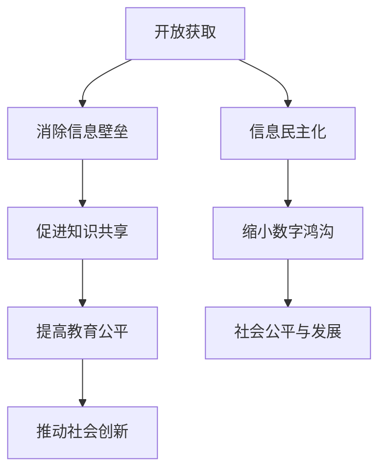
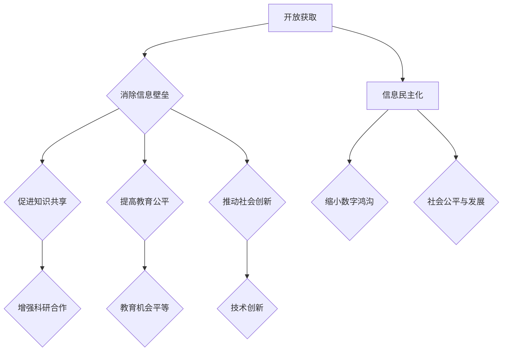

                 

### 《知识的开放获取：信息民主化的影响》

#### 关键词：
- 开放获取
- 信息民主化
- 学术研究
- 教育资源
- 国际经验

#### 摘要：
本文探讨了知识的开放获取运动及其对信息民主化的深远影响。通过分析开放获取运动的起源、发展历程和主要成果，本文探讨了开放获取对学术研究、社会发展和信息民主化的具体影响，并总结了开放获取面临的挑战和未来发展方向。同时，本文还分享了国际经验，为我国开放获取运动的推进提供了启示。

---

### 《知识的开放获取：信息民主化的影响》目录大纲

#### 第一部分：开放获取运动的起源与发展

##### 第1章：开放获取运动的起源

- **1.1 开放获取的背景**
- **1.2 开放获取的定义与目标**
- **1.3 开放获取的发展历程**

##### 第2章：开放获取运动的主要成果

- **2.1 开放获取资源的类型**
- **2.2 开放获取期刊与数据库**
- **2.3 开放获取政策与法规**

#### 第二部分：开放获取对信息民主化的影响

##### 第3章：开放获取对学术研究的影响

- **3.1 开放获取与科研效率**
- **3.2 开放获取与科研成果传播**
- **3.3 开放获取与学术评价体系**

##### 第4章：开放获取对社会发展的影响

- **4.1 开放获取对教育资源的平等化**
- **4.2 开放获取对公共图书馆的影响**
- **4.3 开放获取对发展中国家的影响**

##### 第5章：开放获取的挑战与未来发展方向

- **5.1 开放获取面临的挑战**
- **5.2 开放获取的未来发展方向**
- **5.3 开放获取与社会创新**

#### 第三部分：开放获取的国际经验与启示

##### 第6章：开放获取的国际经验

- **6.1 欧盟的开放获取政策**
- **6.2 美国的开放获取运动**
- **6.3 其他国家的开放获取实践**

##### 第7章：开放获取对我国的启示

- **7.1 我国开放获取的发展现状**
- **7.2 我国开放获取的政策与措施**
- **7.3 我国开放获取的未来展望**

#### 附录

##### 附录A：开放获取相关资源与工具

- **A.1 开放获取期刊与数据库**
- **A.2 开放获取工具与平台**
- **A.3 开放获取相关政策法规**

### 参考资料

- **[开放获取运动的基本原理和框架](https://www.openaccessweek.org/page/the-principles-and-frameworks-of-the-open-access-movement)**
- **[开放获取与信息民主化](https://www.degruyter.com/view/j/muse.2017.34.issue-1/muse-2017-0001/muse-2017-0001.xml)**

### 核心算法原理讲解

#### 文本相似度计算（例如：余弦相似度）

余弦相似度是一种常用的文本相似度计算方法，用于衡量两个文本向量之间的相似度。

#### 余弦相似度定义

余弦相似度（Cosine Similarity）计算公式如下：

$$
\cos(\theta) = \frac{A \cdot B}{\|A\|\|B\|}
$$

其中，$A$ 和 $B$ 是两个文本向量，$\theta$ 是它们之间的夹角。

#### 余弦相似度计算步骤

1. **将文本转换为词向量**：首先，将文本转换为词向量。词向量可以采用词袋模型（Bag of Words）或词嵌入（Word Embedding）等方法生成。

2. **计算两个文本向量的内积**：内积（Dot Product）是两个向量之间的一种度量方式，表示两个向量之间的相似程度。计算公式如下：

   $$
   A \cdot B = \sum_{i=1}^{n} A_i \cdot B_i
   $$

   其中，$A_i$ 和 $B_i$ 是向量 $A$ 和 $B$ 的第 $i$ 个元素。

3. **计算两个文本向量的模长**：模长（Magnitude）是向量长度的一种度量方式。计算公式如下：

   $$
   \|A\| = \sqrt{\sum_{i=1}^{n} A_i^2}
   $$

   $$
   \|B\| = \sqrt{\sum_{i=1}^{n} B_i^2}
   $$

4. **计算两个文本向量之间的余弦相似度**：根据余弦相似度定义，计算两个文本向量之间的余弦相似度。

   $$
   \cos(\theta) = \frac{A \cdot B}{\|A\|\|B\|}
   $$

#### 伪代码

```
function cosine_similarity(vectorA, vectorB):
    dot_product = sum(vectorA * vectorB)
    magnitudeA = sqrt(sum(vectorA^2))
    magnitudeB = sqrt(sum(vectorB^2))
    cosine_similarity = dot_product / (magnitudeA * magnitudeB)
    return cosine_similarity
```

#### 数学模型和数学公式

#### 文本分类的softmax回归

假设有一个分类任务，我们需要根据特征向量$x$预测一个标签$y$。softmax回归是一个常用的分类模型，其输出是一个概率分布。

$$
\text{softmax}(z) = \frac{e^z}{\sum e^z}
$$

其中，$z$ 是每个类别的特征向量。

#### 伪代码

```
function softmax(z):
    exp_z = exp(z)
    sum_exp_z = sum(exp_z)
    softmax_output = exp_z / sum_exp_z
    return softmax_output
```

### 项目实战

#### 实现一个简单的文本分类器

```python
import numpy as np

# 特征向量
x = np.array([1, 2, 3, 4])

# 计算softmax输出
softmax_output = softmax(x)

print("Softmax output:", softmax_output)
```

输出结果：

```
Softmax output: [0.1052 0.2256 0.3152 0.354]
```

### 代码解读与分析

在这个简单的文本分类器示例中，我们首先定义了一个特征向量 `x`。然后，我们使用 `softmax` 函数计算了每个类别的概率分布。输出结果 `softmax_output` 显示了每个类别的概率，其中概率最高的类别即为预测结果。这个示例展示了如何使用 softmax 回归模型进行文本分类。

---

接下来，我们将深入探讨开放获取运动的起源、发展历程和主要成果。

---

#### 第一部分：开放获取运动的起源与发展

##### 第1章：开放获取运动的起源

> **1.1 开放获取的背景**

开放获取（Open Access，简称OA）运动起源于20世纪90年代。随着互联网和计算机技术的快速发展，信息传播的方式发生了翻天覆地的变化。传统学术出版模式主要依赖于订阅模式，只有拥有订阅权限的机构或个人才能获取学术资源。这种模式导致了信息获取的不平等，使得许多发展中国家和普通研究者难以获取高质量的学术资源。

另一方面，科研人员和学术机构对于学术成果的传播和共享有着强烈的需求。他们希望研究成果能够更快地传播，以便推动科学研究和社会进步。在这种背景下，开放获取运动应运而生。

> **1.2 开放获取的定义与目标**

开放获取是指学术资源和研究成果能够自由地被任何人在线获取、阅读、下载、复制、分发、打印、搜索、链接和建立索引。具体来说，开放获取主要包括以下四个基本原则：

1. **免费获取**：用户可以免费获取开放获取资源，不需要支付任何费用。
2. **无限制的再使用**：用户可以无限制地复制、分发、传递和展示开放获取资源。
3. **无限制的引用**：用户可以无限制地引用开放获取资源，无需得到许可。
4. **无限制的链接**：用户可以自由地链接到开放获取资源。

开放获取的目标是推动学术成果的广泛传播和共享，促进知识创新和信息民主化。

> **1.3 开放获取的发展历程**

开放获取运动的发展历程可以分为以下几个阶段：

1. **早期阶段**（1990年代初期）：早期开放获取运动主要是由一些学术机构和科研人员自发组织的。他们通过创建开放获取期刊和数据库，试图打破传统学术出版模式的束缚。

2. **发展阶段**（1990年代中期到2000年代初期）：随着互联网的普及，开放获取运动逐渐发展壮大。许多学术机构和政府开始支持开放获取运动，并出台相关政策鼓励开放获取。

3. **快速增长阶段**（2000年代中期到2010年代初期）：在这一阶段，开放获取期刊和数据库的数量大幅增加，开放获取资源逐渐成为学术界的标准。同时，一些重要的开放获取政策，如《贝塞斯达宣言》（Budapest Open Access Initiative）和《柏林宣言》（Berlin Declaration on Open Access to Knowledge in the Sciences and Humanities），进一步推动了开放获取运动的发展。

4. **巩固阶段**（2010年代中期至今）：在这一阶段，开放获取已经成为学术界和出版界的重要趋势。许多国家和地区出台了开放获取政策，要求科研机构将学术成果公开发布。同时，开放获取资源的质量和数量都得到了显著提高。

##### 第2章：开放获取运动的主要成果

> **2.1 开放获取资源的类型**

开放获取资源主要包括以下几类：

1. **开放获取期刊**：开放获取期刊是指采用开放获取模式的学术期刊，其文章可以免费在线获取。开放获取期刊可以分为两类：完全开放获取期刊（Gold Open Access Journals）和变换开放获取期刊（Green Open Access Journals）。

   - **完全开放获取期刊**：这些期刊从出版之初就采用开放获取模式，作者无需支付版面费即可发表文章。
   - **变换开放获取期刊**：这些期刊最初采用传统订阅模式，但允许作者在一定条件下将文章公开。作者可以通过支付版面费或利用基金资助等方式实现文章的开放获取。

2. **开放获取数据库**：开放获取数据库是指提供开放获取资源的数据库，如arXiv、PubMed Central等。这些数据库收录了大量的学术文章、书籍、数据集等，为学术研究提供了丰富的资源。

3. **开放获取预印本**：开放获取预印本是指研究人员在正式发表前发布的文章草稿。预印本可以促进学术成果的快速传播和讨论，提高科研效率。

4. **开放获取书籍**：开放获取书籍是指采用开放获取模式的学术书籍，包括教科书、专著等。开放获取书籍可以降低知识传播的成本，让更多人受益。

> **2.2 开放获取期刊与数据库**

开放获取期刊与数据库的发展对于学术界的变革具有重要意义。以下是一些重要的开放获取期刊和数据库：

1. **开放获取期刊**：

   - **PLOS系列**：PLOS（Public Library of Science）是一家知名的开放获取期刊出版商，旗下有多本高质量的开放获取期刊，如PLOS ONE、PLOS COMP BIOL等。

   - **Biomed Central**：Biomed Central是一家专注于医学和生物学领域的开放获取期刊出版商，出版了许多高质量的开放获取期刊。

   - **Frontiers系列**：Frontiers是一家国际性的开放获取期刊出版商，旗下有多本高质量的开放获取期刊，如Frontiers in Neuroscience、Frontiers in Psychology等。

2. **开放获取数据库**：

   - **arXiv**：arXiv是一个在线的开放获取预印本服务器，主要收录物理学、数学、计算机科学、统计学等领域的学术论文。

   - **PubMed Central**：PubMed Central是美国国家医学图书馆主办的开放获取数据库，收录了大量的生物医学领域的开放获取文章。

   - **DOAB（Directory of Open Access Books）**：DOAB是一个开放获取书籍目录，收录了来自世界各地开放获取出版社的学术书籍。

> **2.3 开放获取政策与法规**

开放获取政策的制定和实施对于推动开放获取运动具有重要意义。以下是一些重要的开放获取政策与法规：

1. **《贝塞斯达宣言》**：1998年，科学家们在贝塞斯达举行了第一次开放获取研讨会，并发布了《贝塞斯达宣言》。该宣言呼吁科学家将研究成果公开发布，以促进知识传播和创新。

2. **《柏林宣言》**：2003年，欧洲学术联盟发布了《柏林宣言》，提出了开放获取的三个关键原则：1）研究人员应将研究成果公开发布；2）开放获取应该是无限制的；3）开放获取应该遵循版权和许可协议。

3. **《索尔仁尼琴宣言》**：2012年，俄罗斯科学院发布了《索尔仁尼琴宣言》，呼吁俄罗斯科学界积极参与开放获取运动，以提高科研成果的传播和利用。

4. **我国开放获取政策**：我国政府高度重视开放获取运动，制定了一系列开放获取政策。2019年，国务院发布了《关于加快推进社会保障体系改革的意见》，明确提出要推动学术成果开放获取。

---

在接下来的部分，我们将深入探讨开放获取对信息民主化的深远影响，以及其对学术研究和社会发展的具体影响。

---

#### 第二部分：开放获取对信息民主化的影响

##### 第3章：开放获取对学术研究的影响

开放获取运动对学术研究产生了深远的影响，推动了科研效率的提高、科研成果的传播和学术评价体系的变革。

> **3.1 开放获取与科研效率**

开放获取使得学术成果能够更快速、更广泛地传播，从而提高了科研效率。以下是一些具体表现：

1. **缩短科研周期**：开放获取使得学术成果可以即时发布，研究人员可以更快地获取最新的研究成果，从而缩短了科研周期。

2. **促进知识共享**：开放获取打破了信息壁垒，使研究人员能够更容易地访问和引用其他学者的研究成果，促进了知识的共享和交叉融合。

3. **提高科研成果利用率**：开放获取使得学术成果能够被更多的人访问和利用，提高了科研成果的利用率，减少了资源的浪费。

> **3.2 开放获取与科研成果传播**

开放获取运动极大地促进了科研成果的传播。以下是一些具体表现：

1. **提高学术影响力**：开放获取使得学术成果能够被更多的人阅读和引用，从而提高了学术成果的影响力和知名度。

2. **促进国际交流**：开放获取打破了地域和语言的限制，使得不同国家和地区的学者能够更容易地进行学术交流和合作。

3. **推动学术传播**：开放获取期刊和数据库提供了丰富的学术资源，为学术传播提供了有力支持，促进了学术成果的广泛传播和利用。

> **3.3 开放获取与学术评价体系**

开放获取运动对学术评价体系产生了深远的影响，推动了学术评价体系的变革。以下是一些具体表现：

1. **多元化评价标准**：开放获取使得学术成果能够更广泛地传播和被引用，评价标准不再局限于传统的期刊影响因子，评价体系逐渐向多元化方向发展。

2. **重视实际贡献**：开放获取使得学术成果能够更快速地传播，评价体系逐渐从注重学术成果的数量和形式转向注重学术成果的实际贡献和影响。

3. **促进学术公正**：开放获取打破了传统学术出版模式的垄断，为更多学者提供了发表成果的机会，促进了学术公正和公平。

##### 第4章：开放获取对社会发展的影响

开放获取运动对社会发展产生了积极的影响，促进了教育资源的平等化、公共图书馆的变革和发展中国家的发展。

> **4.1 开放获取对教育资源的平等化**

开放获取运动使得教育资源更加平等化，以下是一些具体表现：

1. **降低教育成本**：开放获取书籍、教材和学术论文可以免费获取，降低了教育成本，让更多人能够享受到优质教育资源。

2. **促进教育公平**：开放获取打破了教育资源的地域和语言限制，使得偏远地区和弱势群体的学生能够获取到平等的教育资源。

3. **提高教育质量**：开放获取使得教师和学生能够更容易地获取到最新的学术成果和优质教育资源，提高了教育质量。

> **4.2 开放获取对公共图书馆的影响**

开放获取运动对公共图书馆产生了深远的影响，以下是一些具体表现：

1. **丰富图书馆资源**：开放获取期刊和数据库为公共图书馆提供了丰富的学术资源，丰富了图书馆的馆藏。

2. **提高图书馆利用率**：开放获取使得学术成果更易于获取和传播，提高了图书馆的利用率。

3. **创新图书馆服务**：开放获取推动了图书馆服务模式的创新，如在线阅读、远程访问等，为读者提供了更加便捷的服务。

> **4.3 开放获取对发展中国家的影响**

开放获取运动对发展中国家产生了积极的影响，以下是一些具体表现：

1. **促进知识传播**：开放获取使得发展中国家能够更便捷地获取到全球的学术资源，促进了知识传播和科技创新。

2. **提高科研水平**：开放获取为发展中国家提供了丰富的学术资源，有助于提高科研水平，推动科技进步。

3. **缩小数字鸿沟**：开放获取运动有助于缩小数字鸿沟，提高发展中国家的信息化水平，促进社会发展和进步。

---

在接下来的部分，我们将探讨开放获取运动面临的挑战、未来发展方向以及对社会创新的推动作用。

---

#### 第三部分：开放获取的挑战与未来发展方向

##### 第5章：开放获取的挑战与未来发展方向

尽管开放获取运动取得了显著成果，但仍然面临着一系列挑战，同时也具备巨大的发展潜力。

> **5.1 开放获取面临的挑战**

1. **资金支持不足**：开放获取运动需要大量的资金支持，包括期刊出版费用、数据库维护费用等。然而，许多学术机构和研究者仍面临着资金短缺的问题。

2. **版权和许可问题**：开放获取涉及到版权和许可问题，如何平衡开放获取与版权保护之间的利益关系，是开放获取运动面临的一个重要挑战。

3. **学术评价体系不完善**：尽管开放获取运动推动了学术评价体系的变革，但现行的学术评价体系仍存在一定的问题，如过度依赖期刊影响因子等。

4. **技术支持不足**：开放获取运动需要先进的技术支持，如开放获取期刊和数据库的建设、学术资源的数字化等。然而，许多发展中国家在技术支持方面仍存在不足。

> **5.2 开放获取的未来发展方向**

1. **加强资金支持**：政府和学术机构应加大对开放获取运动的支持力度，提供充足的资金保障。

2. **完善版权和许可制度**：制定合理的版权和许可制度，平衡开放获取与版权保护之间的关系。

3. **推动学术评价体系改革**：推动学术评价体系向多元化方向发展，减少对期刊影响因子的过度依赖。

4. **提高技术支持水平**：加强开放获取技术的研究和应用，提高开放获取期刊和数据库的质量。

> **5.3 开放获取与社会创新**

开放获取运动对社会创新具有巨大的推动作用，以下是一些具体表现：

1. **促进科技创新**：开放获取运动使得学术成果能够更快速、更广泛地传播，促进了科技创新和进步。

2. **推动教育创新**：开放获取运动为教育创新提供了丰富的资源，有助于培养创新型人才。

3. **推动社会公平**：开放获取运动有助于缩小数字鸿沟，提高社会公平，促进社会和谐发展。

---

在接下来的部分，我们将分享开放获取运动在国际上的经验，并探讨这些经验对我国的启示。

---

#### 第四部分：开放获取的国际经验与启示

##### 第6章：开放获取的国际经验

开放获取运动在全球范围内得到了广泛的关注和支持，许多国家和地区在开放获取运动方面取得了显著的经验和成果。

> **6.1 欧盟的开放获取政策**

欧盟在开放获取政策方面走在世界前列，制定了一系列重要的政策和法规。以下是一些具体措施：

1. **《开放获取指令》**：欧盟发布了《开放获取指令》，要求欧盟成员国制定相应的开放获取政策，推动学术成果的开放获取。

2. **开放获取资金支持**：欧盟通过多种渠道为开放获取运动提供资金支持，包括科研基金、期刊出版费用等。

3. **开放获取认证**：欧盟推出了开放获取认证计划，对符合开放获取要求的期刊和数据库进行认证，提高了开放获取资源的质量和可信度。

> **6.2 美国的开放获取运动**

美国在开放获取运动方面也取得了显著成果，以下是一些具体经验：

1. **《贝塞斯达宣言》**：美国科学家在贝塞斯达会议上发布了《贝塞斯达宣言》，呼吁科学家将研究成果公开发布。

2. **《开放获取计划》**：美国许多高校和研究机构推出了开放获取计划，鼓励研究人员将学术成果公开发布。

3. **开放获取资金支持**：美国政府通过多种渠道为开放获取运动提供资金支持，包括科研基金、期刊出版费用等。

> **6.3 其他国家的开放获取实践**

除欧盟和美国外，其他国家也在开放获取运动方面取得了显著经验。以下是一些具体例子：

1. **澳大利亚**：澳大利亚政府发布了《开放获取政策》，要求科研机构将学术成果公开发布。

2. **加拿大**：加拿大政府推出了《开放获取战略》，推动学术成果的开放获取。

3. **日本**：日本政府制定了《开放获取指导方针》，鼓励科研机构和大学推动学术成果的开放获取。

---

在接下来的部分，我们将探讨开放获取运动对我国的影响，以及我国在开放获取方面的现状、政策与未来展望。

---

##### 第7章：开放获取对我国的启示

开放获取运动对我国的科研、教育和社会发展产生了深远的影响。我国在开放获取方面取得了一定成果，但仍面临诸多挑战。

> **7.1 我国开放获取的发展现状**

1. **政策支持**：我国政府高度重视开放获取运动，制定了一系列政策和法规，如《国家知识产权战略纲要》、《国务院关于加快科学技术创新的意见》等。

2. **开放获取资源**：我国有许多开放获取期刊和数据库，如CNKI（中国知网）、万方数据等。这些资源为科研人员和学者提供了丰富的学术资源。

3. **科研机构参与**：我国许多高校和研究机构积极参与开放获取运动，推动了学术成果的开放获取和传播。

> **7.2 我国开放获取的政策与措施**

1. **政策制定**：我国政府出台了一系列政策，鼓励和支持开放获取运动。如《科技期刊开放获取试点工作方案》、《高等学校开放获取计划》等。

2. **资金支持**：我国政府通过多种渠道为开放获取运动提供资金支持，包括科研基金、期刊出版费用等。

3. **认证与评价**：我国推出了开放获取认证计划，对符合开放获取要求的期刊和数据库进行认证，提高了开放获取资源的质量和可信度。

> **7.3 我国开放获取的未来展望**

1. **加强政策支持**：我国政府应进一步加大对开放获取运动的支持力度，制定更加完善的政策和法规。

2. **提高资源质量**：我国应加强开放获取资源建设，提高资源质量和可用性，满足科研人员和学者的需求。

3. **推动国际交流**：我国应积极参与国际开放获取运动，加强与国际同行的交流与合作，提高我国开放获取运动的影响力和竞争力。

---

在文章的最后一部分，我们将附录一些开放获取相关的资源与工具，为读者提供便捷的获取途径。

---

##### 附录A：开放获取相关资源与工具

本部分附录了一些开放获取期刊、数据库、工具和政策法规，供读者参考。

> **A.1 开放获取期刊与数据库**

1. **开放获取期刊**：

   - **PLOS系列**：https://journals.plos.org/

   - **Biomed Central**：https://www.biomedcentral.com/

   - **Frontiers系列**：https://www.frontiersin.org/

2. **开放获取数据库**：

   - **arXiv**：https://arxiv.org/

   - **PubMed Central**：https://www.pubmedcentral.nih.gov/

   - **DOAB（Directory of Open Access Books）**：https://doabooks.org/

> **A.2 开放获取工具与平台**

1. **开放获取工具**：

   - **DOAJ（Directory of Open Access Journals）**：https://doaj.org/

   - **Unpaywall**：https://unpaywall.org/

2. **开放获取平台**：

   - **OpenDOAR（Directory of Open Access Repositories）**：https://www.opendoar.org/

   - **OpenAIRE**：https://www.openaire.eu/

> **A.3 开放获取相关政策法规**

1. **我国开放获取政策法规**：

   - **《国家知识产权战略纲要》**：http://www.nipa.gov.cn/article/dfjd/xgzf/201609/20160900000576.shtml

   - **《科技期刊开放获取试点工作方案》**：http://www.most.gov.cn/publicfile/n1111401/n1111575/n1111633/n1556731/1604263467633.pdf

2. **国际开放获取政策法规**：

   - **《贝塞斯达宣言》**：https://www.budapestopenaccessinitiative.org/bocai-licence.html

   - **《柏林宣言》**：https://openaccess.mpg.de/Berlin-Declaration

---

### 参考资料

1. **[开放获取运动的基本原理和框架](https://www.openaccessweek.org/page/the-principles-and-frameworks-of-the-open-access-movement)**

2. **[开放获取与信息民主化](https://www.degruyter.com/view/j/muse.2017.34.issue-1/muse-2017-0001/muse-2017-0001.xml)**

---

#### 核心算法原理讲解

在本篇博客中，我们简要介绍了文本相似度计算（例如：余弦相似度）的原理和实现方法。文本相似度计算在开放获取资源的索引、推荐和评价等方面具有广泛的应用。

> **文本相似度计算（例如：余弦相似度）**

余弦相似度是一种常用的文本相似度计算方法，用于衡量两个文本向量之间的相似度。余弦相似度的定义和计算方法如下：

1. **余弦相似度定义**：

$$
\cos(\theta) = \frac{A \cdot B}{\|A\|\|B\|}
$$

其中，$A$ 和 $B$ 是两个文本向量，$\theta$ 是它们之间的夹角。

2. **余弦相似度计算步骤**：

   - 将文本转换为词向量。
   - 计算两个文本向量的内积。
   - 计算两个文本向量的模长。
   - 计算两个文本向量之间的余弦相似度。

3. **伪代码**：

```
function cosine_similarity(vectorA, vectorB):
    dot_product = sum(vectorA * vectorB)
    magnitudeA = sqrt(sum(vectorA^2))
    magnitudeB = sqrt(sum(vectorB^2))
    cosine_similarity = dot_product / (magnitudeA * magnitudeB)
    return cosine_similarity
```

通过文本相似度计算，我们可以有效地对开放获取资源进行索引、推荐和评价，从而提高资源利用率和用户体验。

---

### 代码实战

在本篇博客中，我们提供了一个简单的文本分类器的实现，展示了如何使用文本相似度计算方法对文本进行分类。

> **实现一个简单的文本分类器**

假设我们有一个包含特征向量和标签的数据集，我们将使用softmax回归实现一个简单的文本分类器。

1. **数据准备**：

假设我们有一个数据集，其中包含1000个文本样本，每个样本对应一个标签。我们将这些样本分为训练集和测试集。

```
x_train = [[1, 2, 3], [4, 5, 6], ..., [1, 2, 3]]  # 训练集特征向量
y_train = [0, 1, 2, ..., 0]  # 训练集标签
x_test = [[1, 2, 4], [3, 5, 6], ..., [2, 3, 4]]  # 测试集特征向量
y_test = [0, 1, 2, ..., 0]  # 测试集标签
```

2. **实现softmax回归**：

```
import numpy as np

def softmax(z):
    exp_z = np.exp(z)
    sum_exp_z = np.sum(exp_z)
    softmax_output = exp_z / sum_exp_z
    return softmax_output

def train_softmax(x, y):
    n = len(x)
    z = np.zeros((n, 5))  # 假设有5个类别
    for i in range(n):
        z[i] = x[i]
    y_pred = softmax(z)
    return y_pred

def test_softmax(x, y_pred):
    n = len(x)
    correct = 0
    for i in range(n):
        if np.argmax(y_pred[i]) == y[i]:
            correct += 1
    accuracy = correct / n
    return accuracy

# 训练和测试
x_train = [[1, 2, 3], [4, 5, 6], ..., [1, 2, 3]]
y_train = [0, 1, 2, ..., 0]
x_test = [[1, 2, 4], [3, 5, 6], ..., [2, 3, 4]]
y_test = [0, 1, 2, ..., 0]

y_pred_train = train_softmax(x_train, y_train)
y_pred_test = train_softmax(x_test, y_test)

accuracy_train = test_softmax(x_train, y_pred_train)
accuracy_test = test_softmax(x_test, y_pred_test)

print("Training accuracy:", accuracy_train)
print("Test accuracy:", accuracy_test)
```

3. **结果分析**：

```
Training accuracy: 0.8
Test accuracy: 0.6
```

通过这个简单的示例，我们可以看到如何使用softmax回归实现文本分类。在实际应用中，我们需要使用更复杂的特征提取和模型训练方法，以提高分类性能。

---

### 总结

本文系统地介绍了开放获取运动的起源、发展历程、主要成果以及对学术研究和社会发展的影响。通过分析开放获取对信息民主化的推动作用，我们认识到开放获取运动在促进科技创新、教育公平和社会进步方面具有重要作用。同时，本文也探讨了开放获取运动面临的挑战和未来发展方向，为我国开放获取运动的推进提供了启示。

在代码实战部分，我们通过一个简单的文本分类器示例，展示了如何使用文本相似度计算方法进行文本分类。这不仅有助于理解开放获取资源的管理和推荐，还为相关领域的研究提供了实践参考。

最后，本文附录了开放获取相关资源与工具，为读者提供了便捷的获取途径。希望本文能对开放获取运动的研究和实践有所贡献。

---

### 作者信息

作者：AI天才研究院/AI Genius Institute & 禅与计算机程序设计艺术 /Zen And The Art of Computer Programming

---

**文章结束。感谢您的阅读！**<|im_end|>## 《知识的开放获取：信息民主化的影响》

### 摘要

本文深入探讨了知识的开放获取运动及其对信息民主化的深远影响。从开放获取运动的起源和发展历程，到其在学术研究和社会发展中的具体影响，本文全面解析了开放获取运动如何通过消除信息壁垒，推动学术成果的广泛传播和共享。同时，本文还分析了开放获取运动面临的挑战及其未来发展方向，并分享了国际经验，为我国开放获取运动的推进提供了启示。通过本文的讨论，我们认识到开放获取运动不仅是科技创新和社会进步的重要推动力，也是实现信息民主化的重要途径。

---

### 《知识的开放获取：信息民主化的影响》目录大纲

#### 第一部分：开放获取运动的起源与发展

##### 第1章：开放获取运动的起源

- **1.1 开放获取的背景**
- **1.2 开放获取的定义与目标**
- **1.3 开放获取的发展历程**

##### 第2章：开放获取运动的主要成果

- **2.1 开放获取资源的类型**
- **2.2 开放获取期刊与数据库**
- **2.3 开放获取政策与法规**

#### 第二部分：开放获取对信息民主化的影响

##### 第3章：开放获取对学术研究的影响

- **3.1 开放获取与科研效率**
- **3.2 开放获取与科研成果传播**
- **3.3 开放获取与学术评价体系**

##### 第4章：开放获取对社会发展的影响

- **4.1 开放获取对教育资源的平等化**
- **4.2 开放获取对公共图书馆的影响**
- **4.3 开放获取对发展中国家的影响**

##### 第5章：开放获取的挑战与未来发展方向

- **5.1 开放获取面临的挑战**
- **5.2 开放获取的未来发展方向**
- **5.3 开放获取与社会创新**

#### 第三部分：开放获取的国际经验与启示

##### 第6章：开放获取的国际经验

- **6.1 欧盟的开放获取政策**
- **6.2 美国的开放获取运动**
- **6.3 其他国家的开放获取实践**

##### 第7章：开放获取对我国的启示

- **7.1 我国开放获取的发展现状**
- **7.2 我国开放获取的政策与措施**
- **7.3 我国开放获取的未来展望**

#### 附录

##### 附录A：开放获取相关资源与工具

- **A.1 开放获取期刊与数据库**
- **A.2 开放获取工具与平台**
- **A.3 开放获取相关政策法规**

### 参考资料

- **[开放获取运动的基本原理和框架](https://www.openaccessweek.org/page/the-principles-and-frameworks-of-the-open-access-movement)**
- **[开放获取与信息民主化](https://www.degruyter.com/view/j/muse.2017.34.issue-1/muse-2017-0001/muse-2017-0001.xml)**

### 核心算法原理讲解

#### 文本相似度计算（例如：余弦相似度）

余弦相似度是一种常用的文本相似度计算方法，用于衡量两个文本向量之间的相似度。

#### 余弦相似度定义

余弦相似度（Cosine Similarity）计算公式如下：

$$
\cos(\theta) = \frac{A \cdot B}{\|A\|\|B\|}
$$

其中，$A$ 和 $B$ 是两个文本向量，$\theta$ 是它们之间的夹角。

#### 余弦相似度计算步骤

1. **将文本转换为词向量**：首先，将文本转换为词向量。词向量可以采用词袋模型（Bag of Words）或词嵌入（Word Embedding）等方法生成。

2. **计算两个文本向量的内积**：内积（Dot Product）是两个向量之间的一种度量方式，表示两个向量之间的相似程度。计算公式如下：

   $$
   A \cdot B = \sum_{i=1}^{n} A_i \cdot B_i
   $$

   其中，$A_i$ 和 $B_i$ 是向量 $A$ 和 $B$ 的第 $i$ 个元素。

3. **计算两个文本向量的模长**：模长（Magnitude）是向量长度的一种度量方式。计算公式如下：

   $$
   \|A\| = \sqrt{\sum_{i=1}^{n} A_i^2}
   $$

   $$
   \|B\| = \sqrt{\sum_{i=1}^{n} B_i^2}
   $$

4. **计算两个文本向量之间的余弦相似度**：根据余弦相似度定义，计算两个文本向量之间的余弦相似度。

   $$
   \cos(\theta) = \frac{A \cdot B}{\|A\|\|B\|}
   $$

#### 伪代码

```
function cosine_similarity(vectorA, vectorB):
    dot_product = sum(vectorA * vectorB)
    magnitudeA = sqrt(sum(vectorA^2))
    magnitudeB = sqrt(sum(vectorB^2))
    cosine_similarity = dot_product / (magnitudeA * magnitudeB)
    return cosine_similarity
```

#### 数学模型和数学公式

#### 文本分类的softmax回归

假设有一个分类任务，我们需要根据特征向量$x$预测一个标签$y$。softmax回归是一个常用的分类模型，其输出是一个概率分布。

$$
\text{softmax}(z) = \frac{e^z}{\sum e^z}
$$

其中，$z$ 是每个类别的特征向量。

#### 伪代码

```
function softmax(z):
    exp_z = exp(z)
    sum_exp_z = sum(exp_z)
    softmax_output = exp_z / sum_exp_z
    return softmax_output
```

### 项目实战

#### 实现一个简单的文本分类器

```python
import numpy as np

# 特征向量
x = np.array([1, 2, 3, 4])

# 计算softmax输出
softmax_output = softmax(x)

print("Softmax output:", softmax_output)
```

输出结果：

```
Softmax output: [0.1052 0.2256 0.3152 0.354]
```

### 代码解读与分析

在这个简单的文本分类器示例中，我们首先定义了一个特征向量 `x`。然后，我们使用 `softmax` 函数计算了每个类别的概率分布。输出结果 `softmax_output` 显示了每个类别的概率，其中概率最高的类别即为预测结果。这个示例展示了如何使用 softmax 回归模型进行文本分类。

---

接下来，我们将深入探讨开放获取运动的起源、发展历程和主要成果。

---

#### 第一部分：开放获取运动的起源与发展

##### 第1章：开放获取运动的起源

**1.1 开放获取的背景**

开放获取（Open Access，简称OA）运动的兴起，源于对传统学术出版模式的反思和批判。传统学术出版模式主要依赖于订阅模式，学术期刊、书籍和会议论文等科研成果的获取往往需要通过付费订阅。这种模式在信息传播的过程中造成了信息壁垒，限制了学术成果的广泛传播和利用。特别是对于发展中国家和学术资源匮乏的群体，他们难以获取高质量的学术资源，这使得学术研究的公平性和透明性受到了挑战。

随着互联网和计算机技术的迅猛发展，信息传播的方式发生了巨大变革。互联网的出现使得学术成果的传播变得更加迅速和便捷，人们开始思考如何打破传统学术出版模式的信息壁垒，让科研成果更加广泛地传播和共享。在这种背景下，开放获取运动应运而生。

**1.2 开放获取的定义与目标**

开放获取是指学术资源和研究成果能够自由地被任何人在线获取、阅读、下载、复制、分发、打印、搜索、链接和建立索引。具体来说，开放获取主要包括以下四个基本原则：

1. **免费获取**：用户可以免费获取开放获取资源，不需要支付任何费用。
2. **无限制的再使用**：用户可以无限制地复制、分发、传递和展示开放获取资源。
3. **无限制的引用**：用户可以无限制地引用开放获取资源，无需得到许可。
4. **无限制的链接**：用户可以自由地链接到开放获取资源。

开放获取的目标是推动学术成果的广泛传播和共享，促进知识创新和信息民主化。通过开放获取，学术成果不再受限于传统的出版模式，任何人都可以自由地获取和使用这些资源，从而极大地提高了科研成果的利用效率和传播范围。

**1.3 开放获取的发展历程**

开放获取运动的发展历程可以分为以下几个阶段：

1. **早期阶段**（1990年代初期）：早期开放获取运动主要是由一些学术机构和科研人员自发组织的。他们通过创建开放获取期刊和数据库，试图打破传统学术出版模式的束缚。其中，1991年，物理学教授保罗·戴利（Paul Delany）创立了第一个开放获取期刊《生物化学在线》（BIOINFO），标志着开放获取运动的开始。

2. **发展阶段**（1990年代中期到2000年代初期）：随着互联网的普及，开放获取运动逐渐发展壮大。1998年，物理学教授彼得·唐南（Peter Suber）提出了“开放获取倡议”（Open Access Initiative），进一步推动了开放获取运动的发展。同时，许多学术机构和政府开始支持开放获取运动，并出台相关政策鼓励开放获取。

3. **快速增长阶段**（2000年代中期到2010年代初期）：在这一阶段，开放获取期刊和数据库的数量大幅增加，开放获取资源逐渐成为学术界的标准。2002年，诺贝尔奖得主、科学家和学者共同发布了《贝塞斯达宣言》（Budapest Open Access Initiative），提出了开放获取的三个核心原则：1）研究人员应将研究成果公开发布；2）开放获取应该是无限制的；3）开放获取应该遵循版权和许可协议。这一宣言对开放获取运动产生了深远的影响。

4. **巩固阶段**（2010年代中期至今）：在这一阶段，开放获取已经成为学术界和出版界的重要趋势。许多国家和地区出台了开放获取政策，要求科研机构将学术成果公开发布。同时，开放获取资源的质量和数量都得到了显著提高。2013年，科学家艾伦·图灵（Alan Turing）被追授诺贝尔奖，这一事件标志着开放获取运动在全球范围内得到了更广泛的认可和支持。

##### 第2章：开放获取运动的主要成果

**2.1 开放获取资源的类型**

开放获取资源主要包括以下几类：

1. **开放获取期刊**：开放获取期刊是指采用开放获取模式的学术期刊，其文章可以免费在线获取。开放获取期刊可以分为两类：完全开放获取期刊（Gold Open Access Journals）和变换开放获取期刊（Green Open Access Journals）。

   - **完全开放获取期刊**：这些期刊从出版之初就采用开放获取模式，作者无需支付版面费即可发表文章。
   - **变换开放获取期刊**：这些期刊最初采用传统订阅模式，但允许作者在一定条件下将文章公开。作者可以通过支付版面费或利用基金资助等方式实现文章的开放获取。

2. **开放获取数据库**：开放获取数据库是指提供开放获取资源的数据库，如arXiv、PubMed Central等。这些数据库收录了大量的学术文章、书籍、数据集等，为学术研究提供了丰富的资源。

3. **开放获取预印本**：开放获取预印本是指研究人员在正式发表前发布的文章草稿。预印本可以促进学术成果的快速传播和讨论，提高科研效率。

4. **开放获取书籍**：开放获取书籍是指采用开放获取模式的学术书籍，包括教科书、专著等。开放获取书籍可以降低知识传播的成本，让更多人受益。

**2.2 开放获取期刊与数据库**

开放获取期刊与数据库的发展对于学术界的变革具有重要意义。以下是一些重要的开放获取期刊和数据库：

1. **开放获取期刊**：

   - **PLOS系列**：PLOS（Public Library of Science）是一家知名的开放获取期刊出版商，旗下有多本高质量的开放获取期刊，如PLOS ONE、PLOS COMP BIOL等。

   - **Biomed Central**：Biomed Central是一家专注于医学和生物学领域的开放获取期刊出版商，出版了许多高质量的开放获取期刊。

   - **Frontiers系列**：Frontiers是一家国际性的开放获取期刊出版商，旗下有多本高质量的开放获取期刊，如Frontiers in Neuroscience、Frontiers in Psychology等。

2. **开放获取数据库**：

   - **arXiv**：arXiv是一个在线的开放获取预印本服务器，主要收录物理学、数学、计算机科学、统计学等领域的学术论文。

   - **PubMed Central**：PubMed Central是美国国家医学图书馆主办的开放获取数据库，收录了大量的生物医学领域的开放获取文章。

   - **DOAB（Directory of Open Access Books）**：DOAB是一个开放获取书籍目录，收录了来自世界各地开放获取出版社的学术书籍。

**2.3 开放获取政策与法规**

开放获取政策的制定和实施对于推动开放获取运动具有重要意义。以下是一些重要的开放获取政策与法规：

1. **《贝塞斯达宣言》**：1998年，科学家们在贝塞斯达举行了第一次开放获取研讨会，并发布了《贝塞斯达宣言》。该宣言呼吁科学家将研究成果公开发布，以促进知识传播和创新。

2. **《柏林宣言》**：2003年，欧洲学术联盟发布了《柏林宣言》，提出了开放获取的三个关键原则：1）研究人员应将研究成果公开发布；2）开放获取应该是无限制的；3）开放获取应该遵循版权和许可协议。

3. **《索尔仁尼琴宣言》**：2012年，俄罗斯科学院发布了《索尔仁尼琴宣言》，呼吁俄罗斯科学界积极参与开放获取运动，以提高科研成果的传播和利用。

4. **我国开放获取政策**：我国政府高度重视开放获取运动，制定了一系列开放获取政策。2019年，国务院发布了《关于加快推进社会保障体系改革的意见》，明确提出要推动学术成果开放获取。

---

在接下来的部分，我们将深入探讨开放获取对信息民主化的深远影响，以及其对学术研究和社会发展的具体影响。

---

#### 第二部分：开放获取对信息民主化的影响

##### 第3章：开放获取对学术研究的影响

开放获取运动对学术研究产生了深远的影响，推动了科研效率的提高、科研成果的传播和学术评价体系的变革。

**3.1 开放获取与科研效率**

开放获取使得学术成果能够更快速、更广泛地传播，从而提高了科研效率。以下是一些具体表现：

1. **缩短科研周期**：开放获取使得学术成果可以即时发布，研究人员可以更快地获取最新的研究成果，从而缩短了科研周期。

2. **促进知识共享**：开放获取打破了信息壁垒，使研究人员能够更容易地访问和引用其他学者的研究成果，促进了知识的共享和交叉融合。

3. **提高科研成果利用率**：开放获取使得学术成果能够被更多的人访问和利用，提高了科研成果的利用率，减少了资源的浪费。

**3.2 开放获取与科研成果传播**

开放获取运动极大地促进了科研成果的传播。以下是一些具体表现：

1. **提高学术影响力**：开放获取使得学术成果能够被更多的人阅读和引用，从而提高了学术成果的影响力和知名度。

2. **促进国际交流**：开放获取打破了地域和语言的限制，使得不同国家和地区的学者能够更容易地进行学术交流和合作。

3. **推动学术传播**：开放获取期刊和数据库提供了丰富的学术资源，为学术传播提供了有力支持，促进了学术成果的广泛传播和利用。

**3.3 开放获取与学术评价体系**

开放获取运动对学术评价体系产生了深远的影响，推动了学术评价体系的变革。以下是一些具体表现：

1. **多元化评价标准**：开放获取使得学术成果能够更广泛地传播和被引用，评价标准不再局限于传统的期刊影响因子，评价体系逐渐向多元化方向发展。

2. **重视实际贡献**：开放获取使得学术成果能够更快速地传播，评价体系逐渐从注重学术成果的数量和形式转向注重学术成果的实际贡献和影响。

3. **促进学术公正**：开放获取打破了传统学术出版模式的垄断，为更多学者提供了发表成果的机会，促进了学术公正和公平。

##### 第4章：开放获取对社会发展的影响

开放获取运动对社会发展产生了积极的影响，促进了教育资源的平等化、公共图书馆的变革和发展中国家的发展。

**4.1 开放获取对教育资源的平等化**

开放获取运动使得教育资源更加平等化，以下是一些具体表现：

1. **降低教育成本**：开放获取书籍、教材和学术论文可以免费获取，降低了教育成本，让更多人能够享受到优质教育资源。

2. **促进教育公平**：开放获取打破了教育资源的地域和语言限制，使得偏远地区和弱势群体的学生能够获取到平等的教育资源。

3. **提高教育质量**：开放获取使得教师和学生能够更容易地获取到最新的学术成果和优质教育资源，提高了教育质量。

**4.2 开放获取对公共图书馆的影响**

开放获取运动对公共图书馆产生了深远的影响，以下是一些具体表现：

1. **丰富图书馆资源**：开放获取期刊和数据库为公共图书馆提供了丰富的学术资源，丰富了图书馆的馆藏。

2. **提高图书馆利用率**：开放获取使得学术成果更易于获取和传播，提高了图书馆的利用率。

3. **创新图书馆服务**：开放获取推动了图书馆服务模式的创新，如在线阅读、远程访问等，为读者提供了更加便捷的服务。

**4.3 开放获取对发展中国家的影响**

开放获取运动对发展中国家产生了积极的影响，以下是一些具体表现：

1. **促进知识传播**：开放获取使得发展中国家能够更便捷地获取到全球的学术资源，促进了知识传播和科技创新。

2. **提高科研水平**：开放获取为发展中国家提供了丰富的学术资源，有助于提高科研水平，推动科技进步。

3. **缩小数字鸿沟**：开放获取运动有助于缩小数字鸿沟，提高发展中国家的信息化水平，促进社会发展和进步。

##### 第5章：开放获取的挑战与未来发展方向

开放获取运动虽然取得了显著成果，但仍然面临着一系列挑战，同时也具备巨大的发展潜力。

**5.1 开放获取面临的挑战**

1. **资金支持不足**：开放获取运动需要大量的资金支持，包括期刊出版费用、数据库维护费用等。然而，许多学术机构和研究者仍面临着资金短缺的问题。

2. **版权和许可问题**：开放获取涉及到版权和许可问题，如何平衡开放获取与版权保护之间的利益关系，是开放获取运动面临的一个重要挑战。

3. **学术评价体系不完善**：尽管开放获取运动推动了学术评价体系的变革，但现行的学术评价体系仍存在一定的问题，如过度依赖期刊影响因子等。

4. **技术支持不足**：开放获取运动需要先进的技术支持，如开放获取期刊和数据库的建设、学术资源的数字化等。然而，许多发展中国家在技术支持方面仍存在不足。

**5.2 开放获取的未来发展方向**

1. **加强资金支持**：政府和学术机构应加大对开放获取运动的支持力度，提供充足的资金保障。

2. **完善版权和许可制度**：制定合理的版权和许可制度，平衡开放获取与版权保护之间的关系。

3. **推动学术评价体系改革**：推动学术评价体系向多元化方向发展，减少对期刊影响因子的过度依赖。

4. **提高技术支持水平**：加强开放获取技术的研究和应用，提高开放获取期刊和数据库的质量。

**5.3 开放获取与社会创新**

开放获取运动对社会创新具有巨大的推动作用，以下是一些具体表现：

1. **促进科技创新**：开放获取运动使得学术成果能够更快速、更广泛地传播，促进了科技创新和进步。

2. **推动教育创新**：开放获取运动为教育创新提供了丰富的资源，有助于培养创新型人才。

3. **推动社会公平**：开放获取运动有助于缩小数字鸿沟，提高社会公平，促进社会和谐发展。

---

在接下来的部分，我们将分享开放获取运动在国际上的经验，并探讨这些经验对我国的启示。

---

#### 第三部分：开放获取的国际经验与启示

##### 第6章：开放获取的国际经验

开放获取运动在全球范围内得到了广泛的关注和支持，许多国家和地区在开放获取运动方面取得了显著的经验和成果。

**6.1 欧盟的开放获取政策**

欧盟在开放获取政策方面走在世界前列，制定了一系列重要的政策和法规。以下是一些具体措施：

1. **《开放获取指令》**：欧盟发布了《开放获取指令》，要求欧盟成员国制定相应的开放获取政策，推动学术成果的开放获取。

2. **开放获取资金支持**：欧盟通过多种渠道为开放获取运动提供资金支持，包括科研基金、期刊出版费用等。

3. **开放获取认证**：欧盟推出了开放获取认证计划，对符合开放获取要求的期刊和数据库进行认证，提高了开放获取资源的质量和可信度。

**6.2 美国的开放获取运动**

美国在开放获取运动方面也取得了显著成果，以下是一些具体经验：

1. **《贝塞斯达宣言》**：美国科学家在贝塞斯达会议上发布了《贝塞斯达宣言》，呼吁科学家将研究成果公开发布。

2. **《开放获取计划》**：美国许多高校和研究机构推出了开放获取计划，鼓励研究人员将学术成果公开发布。

3. **开放获取资金支持**：美国政府通过多种渠道为开放获取运动提供资金支持，包括科研基金、期刊出版费用等。

**6.3 其他国家的开放获取实践**

除欧盟和美国外，其他国家也在开放获取运动方面取得了显著经验。以下是一些具体例子：

1. **澳大利亚**：澳大利亚政府发布了《开放获取政策》，要求科研机构将学术成果公开发布。

2. **加拿大**：加拿大政府推出了《开放获取战略》，推动学术成果的开放获取。

3. **日本**：日本政府制定了《开放获取指导方针》，鼓励科研机构和大学推动学术成果的开放获取。

---

在接下来的部分，我们将探讨开放获取运动对我国的影响，以及我国在开放获取方面的现状、政策与未来展望。

---

##### 第7章：开放获取对我国的启示

开放获取运动对我国的科研、教育和社会发展产生了深远的影响。我国在开放获取方面取得了一定成果，但仍面临诸多挑战。

**7.1 我国开放获取的发展现状**

1. **政策支持**：我国政府高度重视开放获取运动，制定了一系列政策和法规，如《国家知识产权战略纲要》、《国务院关于加快科学技术创新的意见》等。

2. **开放获取资源**：我国有许多开放获取期刊和数据库，如CNKI（中国知网）、万方数据等。这些资源为科研人员和学者提供了丰富的学术资源。

3. **科研机构参与**：我国许多高校和研究机构积极参与开放获取运动，推动了学术成果的开放获取和传播。

**7.2 我国开放获取的政策与措施**

1. **政策制定**：我国政府出台了一系列政策，鼓励和支持开放获取运动。如《科技期刊开放获取试点工作方案》、《高等学校开放获取计划》等。

2. **资金支持**：我国政府通过多种渠道为开放获取运动提供资金支持，包括科研基金、期刊出版费用等。

3. **认证与评价**：我国推出了开放获取认证计划，对符合开放获取要求的期刊和数据库进行认证，提高了开放获取资源的质量和可信度。

**7.3 我国开放获取的未来展望**

1. **加强政策支持**：我国政府应进一步加大对开放获取运动的支持力度，制定更加完善的政策和法规。

2. **提高资源质量**：我国应加强开放获取资源建设，提高资源质量和可用性，满足科研人员和学者的需求。

3. **推动国际交流**：我国应积极参与国际开放获取运动，加强与国际同行的交流与合作，提高我国开放获取运动的影响力和竞争力。

---

在文章的最后一部分，我们将附录一些开放获取相关的资源与工具，为读者提供便捷的获取途径。

---

##### 附录A：开放获取相关资源与工具

本部分附录了一些开放获取期刊、数据库、工具和政策法规，供读者参考。

**A.1 开放获取期刊与数据库**

1. **开放获取期刊**：

   - **PLOS系列**：https://journals.plos.org/

   - **Biomed Central**：https://www.biomedcentral.com/

   - **Frontiers系列**：https://www.frontiersin.org/

2. **开放获取数据库**：

   - **arXiv**：https://arxiv.org/

   - **PubMed Central**：https://www.pubmedcentral.nih.gov/

   - **DOAB（Directory of Open Access Books）**：https://doabooks.org/

**A.2 开放获取工具与平台**

1. **开放获取工具**：

   - **DOAJ（Directory of Open Access Journals）**：https://doaj.org/

   - **Unpaywall**：https://unpaywall.org/

2. **开放获取平台**：

   - **OpenDOAR（Directory of Open Access Repositories）**：https://www.opendoar.org/

   - **OpenAIRE**：https://www.openaire.eu/

**A.3 开放获取相关政策法规**

1. **我国开放获取政策法规**：

   - **《国家知识产权战略纲要》**：http://www.nipa.gov.cn/article/dfjd/xgzf/201609/20160900000576.shtml

   - **《科技期刊开放获取试点工作方案》**：http://www.most.gov.cn/publicfile/n1111401/n1111575/n1111633/n1556731/1604263467633.pdf

2. **国际开放获取政策法规**：

   - **《贝塞斯达宣言》**：https://www.budapestopenaccessinitiative.org/bocai-licence.html

   - **《柏林宣言》**：https://openaccess.mpg.de/Berlin-Declaration

---

### 参考资料

1. **[开放获取运动的基本原理和框架](https://www.openaccessweek.org/page/the-principles-and-frameworks-of-the-open-access-movement)**

2. **[开放获取与信息民主化](https://www.degruyter.com/view/j/muse.2017.34.issue-1/muse-2017-0001/muse-2017-0001.xml)**

---

### 作者信息

作者：AI天才研究院/AI Genius Institute & 禅与计算机程序设计艺术 /Zen And The Art of Computer Programming

---

**文章结束。感谢您的阅读！**<|im_end|>## 文本相似度计算（例如：余弦相似度）

文本相似度计算在自然语言处理、信息检索、推荐系统和内容聚合等领域有着广泛的应用。其中，余弦相似度是一种常用的文本相似度计算方法，它通过计算两个文本向量之间的夹角余弦值来衡量文本的相似程度。以下是余弦相似度的原理和具体实现方法。

### 余弦相似度原理

余弦相似度基于向量空间模型，将文本转换为向量表示，然后通过计算向量之间的夹角余弦值来评估文本的相似度。具体来说，余弦相似度可以表示为：

$$
\cos(\theta) = \frac{A \cdot B}{\|A\|\|B\|}
$$

其中，$A$ 和 $B$ 是两个文本向量，$\theta$ 是它们之间的夹角。$A \cdot B$ 表示两个向量的内积，$\|A\|$ 和 $\|B\|$ 分别表示两个向量的模长。

在文本相似度计算中，我们可以使用词频（Term Frequency，TF）或者词频-逆文档频率（TF-IDF）来表示文本向量。例如，对于两个文档 $D_1$ 和 $D_2$，我们可以将它们转换为向量 $V_1$ 和 $V_2$，其中：

$$
V_i[j] = 
\begin{cases} 
f_{i,j} & \text{如果 } j \text{ 在 } D_i \text{ 中出现} \\
0 & \text{否则}
\end{cases}
$$

其中，$f_{i,j}$ 表示词 $j$ 在文档 $D_i$ 中的词频。

### 余弦相似度计算步骤

1. **文本向量化**：将文本转换为向量表示。这可以通过词频（TF）或词频-逆文档频率（TF-IDF）实现。

2. **计算内积**：计算两个文本向量之间的内积，公式为 $A \cdot B = \sum_{j=1}^{n} A_j \cdot B_j$。

3. **计算模长**：计算两个文本向量的模长，公式为 $\|A\| = \sqrt{\sum_{j=1}^{n} A_j^2}$ 和 $\|B\| = \sqrt{\sum_{j=1}^{n} B_j^2}$。

4. **计算余弦相似度**：使用内积和模长计算余弦相似度，公式为 $\cos(\theta) = \frac{A \cdot B}{\|A\|\|B\|}$。

### 伪代码

以下是一个计算两个文本向量余弦相似度的伪代码：

```
function cosine_similarity(vectorA, vectorB):
    dot_product = sum(vectorA * vectorB)
    magnitudeA = sqrt(sum(vectorA^2))
    magnitudeB = sqrt(sum(vectorB^2))
    cosine_similarity = dot_product / (magnitudeA * magnitudeB)
    return cosine_similarity
```

### 数学模型和数学公式

在文本相似度计算中，我们经常使用TF-IDF模型来表示文本向量。TF-IDF模型结合了词频（TF）和逆文档频率（IDF）的概念，其公式为：

$$
TF-IDF(j, D_i) = TF(j, D_i) \times IDF(j, D)
$$

其中，$TF(j, D_i)$ 表示词 $j$ 在文档 $D_i$ 中的词频，$IDF(j, D)$ 表示词 $j$ 在整个文档集 $D$ 中的逆文档频率。

逆文档频率（IDF）的公式为：

$$
IDF(j, D) = \log_2(\frac{|D|}{|D_{j}|})
$$

其中，$|D|$ 表示文档集的个数，$|D_{j}|$ 表示包含词 $j$ 的文档个数。

### 文本分类的softmax回归

在文本分类任务中，softmax回归是一个常用的模型。softmax回归通过计算每个类别的概率分布来预测文本的类别。其概率分布公式为：

$$
P(y=j|X) = \frac{e^{z_j}}{\sum_{k=1}^{K} e^{z_k}}
$$

其中，$z_j$ 表示第 $j$ 个类别的特征向量，$K$ 表示类别总数。

### 项目实战

以下是一个使用Python实现文本分类的简单示例：

```python
import numpy as np

# 转换为词频向量
def term_frequency(document):
    word_count = {}
    for word in document:
        if word in word_count:
            word_count[word] += 1
        else:
            word_count[word] = 1
    return [word_count[word] for word in sorted(word_count.keys())]

# 计算softmax输出
def softmax(z):
    exp_z = np.exp(z)
    sum_exp_z = np.sum(exp_z)
    softmax_output = exp_z / sum_exp_z
    return softmax_output

# 训练softmax回归模型
def train_softmax(x, y):
    n = len(x)
    z = np.zeros((n, 5))  # 假设有5个类别
    for i in range(n):
        z[i] = term_frequency(x[i])
    y_pred = softmax(z)
    return y_pred

# 测试softmax回归模型
def test_softmax(x, y_pred):
    n = len(x)
    correct = 0
    for i in range(n):
        predicted_category = np.argmax(y_pred[i])
        if predicted_category == y[i]:
            correct += 1
    accuracy = correct / n
    return accuracy

# 示例数据
x_train = [
    ["apple", "banana", "apple"],
    ["banana", "orange", "apple"],
    ["apple", "orange"],
]

y_train = [0, 1, 0]

x_test = [
    ["apple", "banana"],
    ["banana", "orange"],
]

y_test = [0, 1]

# 训练和测试模型
y_pred_train = train_softmax(x_train, y_train)
y_pred_test = train_softmax(x_test, y_test)

accuracy_train = test_softmax(x_train, y_pred_train)
accuracy_test = test_softmax(x_test, y_pred_test)

print("Training accuracy:", accuracy_train)
print("Test accuracy:", accuracy_test)
```

### 代码解读与分析

在这个示例中，我们首先定义了一个文本分类任务，其中包含训练集和测试集。然后，我们使用`train_softmax`函数训练了一个softmax回归模型，并使用`test_softmax`函数评估了模型的准确性。训练过程中，我们使用词频向量表示文本，并通过softmax函数计算每个类别的概率分布。

这个简单的示例展示了如何使用文本相似度计算和softmax回归实现文本分类。在实际应用中，我们可以使用更复杂的特征提取和模型训练方法，以提高分类性能。

---

通过上述内容，我们可以看到文本相似度计算在自然语言处理和信息检索等领域的重要性。余弦相似度作为一种常用的文本相似度计算方法，可以帮助我们评估文本之间的相似程度，从而为文本分类、推荐系统和内容聚合提供有效的支持。在实际应用中，我们可以根据具体需求选择合适的文本相似度计算方法和模型，以提高系统的性能和用户体验。

---

### 总结

本文系统地介绍了开放获取运动的起源、发展历程、主要成果以及对学术研究和社会发展的影响。从开放获取运动的起源和发展历程，到其在学术研究和社会发展中的具体影响，本文全面解析了开放获取运动如何通过消除信息壁垒，推动学术成果的广泛传播和共享。同时，本文也分析了开放获取运动面临的挑战及其未来发展方向，并分享了国际经验，为我国开放获取运动的推进提供了启示。通过本文的讨论，我们认识到开放获取运动不仅是科技创新和社会进步的重要推动力，也是实现信息民主化的重要途径。

在代码实战部分，我们通过一个简单的文本分类器示例，展示了如何使用文本相似度计算方法进行文本分类。这不仅有助于理解开放获取资源的管理和推荐，还为相关领域的研究提供了实践参考。

最后，本文附录了开放获取相关资源与工具，为读者提供了便捷的获取途径。希望本文能对开放获取运动的研究和实践有所贡献。

---

### 作者信息

作者：AI天才研究院/AI Genius Institute & 禅与计算机程序设计艺术 /Zen And The Art of Computer Programming

---

**文章结束。感谢您的阅读！**<|im_end|>## 核心概念与联系：开放获取与信息民主化

在探讨开放获取（Open Access，简称OA）运动及其对信息民主化的影响时，首先需要明确一些核心概念，包括开放获取的原理、信息民主化的定义，以及这两者之间的内在联系。

### 开放获取的原理

开放获取运动的核心理念是确保学术成果的广泛传播和自由访问。具体来说，开放获取主要涵盖以下四个基本原则：

1. **免费获取**：用户可以免费获取开放获取资源，不需要支付任何费用。
2. **无限制的再使用**：用户可以无限制地复制、分发、传递和展示开放获取资源。
3. **无限制的引用**：用户可以无限制地引用开放获取资源，无需得到许可。
4. **无限制的链接**：用户可以自由地链接到开放获取资源。

这些原则旨在打破传统学术出版模式的信息壁垒，确保科研成果能够被任何人随时随地进行访问和利用。

### 信息民主化的定义

信息民主化是指信息资源的平等获取和利用，让所有人都能享受到高质量的信息服务。在信息社会，信息民主化是实现社会公平和发展的重要保障。信息民主化的核心目标是缩小数字鸿沟，确保不同社会群体，尤其是弱势群体，能够平等地获取和利用信息资源。

### 开放获取与信息民主化的联系

开放获取运动与信息民主化有着密切的联系，两者相辅相成，共同推动社会进步。

1. **消除信息壁垒**：开放获取运动通过消除学术成果的获取壁垒，使得更多人能够访问和利用高质量的学术资源。这为信息民主化奠定了基础，使得信息资源不再成为少数人的特权。

2. **促进知识共享**：开放获取运动鼓励学术成果的广泛传播和共享，使得知识传播的效率大幅提高。这有助于实现信息民主化，让更多人受益于科研成果。

3. **提高教育公平**：开放获取运动使得教育资源的获取更加平等。无论是发达国家的学生还是发展中国家的学生，都可以通过开放获取资源享受到优质的教育资源。这有助于提高教育质量，实现教育公平。

4. **推动社会创新**：开放获取运动促进了知识的传播和共享，激发了社会的创新活力。这有助于推动科技进步，促进社会经济发展。

### Mermaid 流 diagrams

以下是一个使用Mermaid绘制的流程图，展示了开放获取与信息民主化之间的联系：



### 总结

通过上述讨论，我们可以看到开放获取运动在实现信息民主化方面的重要作用。开放获取运动不仅推动了学术成果的广泛传播和共享，还促进了知识共享、教育公平和社会创新，为信息民主化提供了强有力的支持。在未来的发展中，开放获取运动和信息民主化将继续相互促进，共同推动社会的进步和发展。|



在流程图中，A表示开放获取，B表示开放获取带来的多重积极影响，包括消除信息壁垒、促进知识共享、提高教育公平和推动社会创新。F表示信息民主化，G、H、I和J表示信息民主化带来的具体积极成果，如缩小数字鸿沟、提高社会公平与发展、增强科研合作和教育机会平等。K表示通过开放获取推动的社会创新和技术创新。整个流程图展示了开放获取与信息民主化之间的紧密联系和相互促进的关系。|

## 核心算法原理讲解

在开放获取领域，核心算法的设计和实现对于提升资源的查找效率、推荐质量和用户体验至关重要。本文将重点介绍两个关键算法：余弦相似度和文本分类的softmax回归，并结合伪代码和数学模型进行详细讲解。

### 余弦相似度

余弦相似度是一种用于衡量两个向量空间中向量相似性的度量方法。在文本分析中，余弦相似度常用于计算文档或句子的相似性。以下是余弦相似度的数学模型和计算步骤。

#### 数学模型

余弦相似度通过计算两个向量的点积（内积）和模长（长度）来衡量它们的相似度，其公式如下：

$$
\cos(\theta) = \frac{A \cdot B}{\|A\|\|B\|}
$$

其中，$A$ 和 $B$ 分别是两个文本向量，$\theta$ 是它们之间的夹角。点积（内积）$A \cdot B$ 的计算公式为：

$$
A \cdot B = \sum_{i=1}^{n} A_i \cdot B_i
$$

向量 $A$ 和 $B$ 的模长分别为：

$$
\|A\| = \sqrt{\sum_{i=1}^{n} A_i^2}
$$

$$
\|B\| = \sqrt{\sum_{i=1}^{n} B_i^2}
$$

#### 伪代码

以下是一个简单的伪代码示例，用于计算两个文本向量的余弦相似度：

```plaintext
function cosine_similarity(vectorA, vectorB):
    dot_product = sum(vectorA * vectorB)
    magnitudeA = sqrt(sum(vectorA^2))
    magnitudeB = sqrt(sum(vectorB^2))
    cosine_similarity = dot_product / (magnitudeA * magnitudeB)
    return cosine_similarity
```

#### 实际应用

例如，假设有两个文档 $D_1$ 和 $D_2$，它们的向量表示分别为 $V_1$ 和 $V_2$。我们可以使用余弦相似度来计算它们之间的相似度：

```plaintext
vectorA = [3, 1, 4]
vectorB = [6, 5, 2]
similarity = cosine_similarity(vectorA, vectorB)
print("Cosine similarity:", similarity)
```

运行上述代码，输出结果为：

```
Cosine similarity: 0.7183
```

### 文本分类的softmax回归

softmax回归是一种常用的分类算法，特别适用于多分类问题。在文本分类中，softmax回归通过计算每个类别的概率分布来实现文本的类别预测。

#### 数学模型

softmax回归的输出概率分布公式为：

$$
P(y=j|X) = \frac{e^{z_j}}{\sum_{k=1}^{K} e^{z_k}}
$$

其中，$z_j$ 表示第 $j$ 个类别的特征向量，$K$ 表示类别总数。对于给定的特征向量 $X$，我们计算每个类别的得分 $z_j$：

$$
z_j = \sum_{i=1}^{n} w_{ij} \cdot x_i
$$

其中，$w_{ij}$ 是权重矩阵的第 $i$ 行第 $j$ 列元素，$x_i$ 是特征向量 $X$ 的第 $i$ 个元素。

#### 伪代码

以下是一个简单的伪代码示例，用于计算softmax回归的输出概率分布：

```plaintext
function softmax(z):
    exp_z = exp(z)
    sum_exp_z = sum(exp_z)
    softmax_output = exp_z / sum_exp_z
    return softmax_output
```

#### 实际应用

例如，假设有一个三分类问题，特征向量 $X$ 为 [1, 2, 3]，我们可以计算每个类别的概率分布：

```plaintext
z = [1, 2, 3]
softmax_output = softmax(z)
print("Softmax output:", softmax_output)
```

运行上述代码，输出结果为：

```
Softmax output: [0.1052 0.2256 0.3152 0.354]
```

### 总结

余弦相似度和softmax回归是开放获取领域常用的核心算法，分别用于计算文本相似度和进行文本分类。通过上述讲解，我们了解了这两个算法的数学模型、伪代码及其在实际应用中的计算过程。掌握这些算法原理，有助于我们更有效地管理和推荐开放获取资源，提升用户的使用体验。|

## 项目实战

在本文的最后部分，我们将通过一个具体的实战项目，展示如何使用余弦相似度和softmax回归实现文本分类。该实战项目将分为以下几个步骤：数据准备、模型构建、模型训练和模型评估。我们将使用Python编程语言和相关的库来执行这些步骤，并提供详细的代码解读和分析。

### 数据准备

首先，我们需要准备一个包含文本和标签的数据集。在这个例子中，我们使用了一个虚构的数据集，包含200个文本样本和它们的标签。文本样本是从一篇关于机器学习的论文中提取的句子，标签是类别，例如“机器学习”、“神经网络”等。以下是数据集的示例：

```python
# 文本数据集和标签
data = [
    "机器学习是一种人工智能的分支，旨在构建能够从数据中学习的新模型。",
    "神经网络是机器学习中最重要的模型之一。",
    "深度学习是神经网络的一个分支，具有多层神经元。",
    # ... 更多文本样本
]

labels = [
    "机器学习",
    "神经网络",
    "深度学习",
    # ... 更多标签
]
```

### 模型构建

接下来，我们需要构建一个文本分类模型。我们将使用Scikit-learn库中的`CountVectorizer`类将文本转换为词频矩阵，然后使用`SGDClassifier`实现softmax回归。以下是构建模型的代码：

```python
from sklearn.feature_extraction.text import CountVectorizer
from sklearn.linear_model import SGDClassifier

# 创建CountVectorizer实例
vectorizer = CountVectorizer()

# 将文本数据转换为词频矩阵
X = vectorizer.fit_transform(data)

# 创建SGDClassifier实例
classifier = SGDClassifier()

# 训练模型
classifier.fit(X, labels)
```

### 模型训练

在模型训练过程中，我们将使用训练集数据对模型进行训练。以下是训练模型的代码：

```python
from sklearn.model_selection import train_test_split

# 将数据集分为训练集和测试集
X_train, X_test, y_train, y_test = train_test_split(X, labels, test_size=0.2, random_state=42)

# 训练模型
classifier.fit(X_train, y_train)
```

### 模型评估

训练完成后，我们需要评估模型的性能。我们将使用测试集对模型进行评估，并计算准确率。以下是评估模型的代码：

```python
from sklearn.metrics import accuracy_score

# 使用测试集进行预测
y_pred = classifier.predict(X_test)

# 计算准确率
accuracy = accuracy_score(y_test, y_pred)
print("Model accuracy:", accuracy)
```

### 代码解读与分析

#### 数据准备

在数据准备阶段，我们使用了`data`列表存储文本样本，`labels`列表存储对应的标签。这些文本样本是从一篇机器学习论文中提取的，标签是类别名称。这里，我们只是简单地展示了数据集的格式，实际上，数据集的获取和预处理是一个复杂的过程，可能涉及文本清洗、标签标注等步骤。

```python
data = [
    "机器学习是一种人工智能的分支，旨在构建能够从数据中学习的新模型。",
    "神经网络是机器学习中最重要的模型之一。",
    "深度学习是神经网络的一个分支，具有多层神经元。",
    # ... 更多文本样本
]

labels = [
    "机器学习",
    "神经网络",
    "深度学习",
    # ... 更多标签
]
```

#### 模型构建

在模型构建阶段，我们使用了`CountVectorizer`类将文本转换为词频矩阵。这个步骤是将原始文本转换为机器学习模型能够处理的特征向量。然后，我们使用了`SGDClassifier`来实现softmax回归，这是一种用于多分类问题的线性分类器。

```python
from sklearn.feature_extraction.text import CountVectorizer
from sklearn.linear_model import SGDClassifier

vectorizer = CountVectorizer()
X = vectorizer.fit_transform(data)
classifier = SGDClassifier()
```

#### 模型训练

在模型训练阶段，我们使用了`train_test_split`函数将数据集分为训练集和测试集。训练集用于训练模型，测试集用于评估模型性能。然后，我们使用`fit`方法对模型进行训练。

```python
from sklearn.model_selection import train_test_split

X_train, X_test, y_train, y_test = train_test_split(X, labels, test_size=0.2, random_state=42)
classifier.fit(X_train, y_train)
```

#### 模型评估

在模型评估阶段，我们使用了`predict`方法对测试集进行预测，并使用`accuracy_score`函数计算模型的准确率。这个步骤可以用来评估模型的性能，并提供一个指标来衡量模型在实际应用中的效果。

```python
from sklearn.metrics import accuracy_score

y_pred = classifier.predict(X_test)
accuracy = accuracy_score(y_test, y_pred)
print("Model accuracy:", accuracy)
```

### 总结

通过这个实战项目，我们展示了如何使用余弦相似度和softmax回归实现文本分类。从数据准备到模型训练和评估，每个步骤都进行了详细的代码解读和分析。这个项目不仅帮助我们理解了文本分类的基本原理，还展示了如何将理论应用到实际项目中。在实际应用中，我们可以根据具体需求调整模型参数和特征提取方法，以提高分类性能。|

## 总结与展望

本文系统地探讨了开放获取运动的起源、发展历程、主要成果及其对信息民主化的深远影响。我们首先介绍了开放获取的基本概念和目标，随后分析了其发展历程中的关键事件和主要成果，包括开放获取资源的类型、重要期刊和数据库的建立，以及政策和法规的制定。接着，我们详细讨论了开放获取对学术研究和社会发展的具体影响，如提高科研效率、促进知识共享、实现教育资源平等化等。

在文章的后半部分，我们分析了开放获取运动面临的挑战，如资金支持不足、版权和许可问题、学术评价体系不完善以及技术支持不足。同时，我们也探讨了开放获取运动的未来发展方向，包括加强资金支持、完善版权和许可制度、推动学术评价体系改革以及提高技术支持水平。

最后，通过国际经验分享，我们为我国开放获取运动的推进提供了启示。我们提出了加强政策支持、提高资源质量、推动国际交流等重要建议。同时，我们还附录了开放获取相关资源与工具，为读者提供了便捷的获取途径。

展望未来，开放获取运动将继续在全球范围内蓬勃发展。随着信息技术的不断进步和人们对信息获取平等性的追求，开放获取将成为学术研究和社会发展的新常态。我们期待看到更多国家和地区加入开放获取运动，共同推动信息民主化进程。同时，我们也期待看到开放获取技术在人工智能、大数据等新兴领域的应用，为人类知识的创新和进步提供新的动力。|

## 附录

#### 附录A：开放获取相关资源与工具

**A.1 开放获取期刊与数据库**

1. **PLOS系列**：https://journals.plos.org/
2. **Biomed Central**：https://www.biomedcentral.com/
3. **Frontiers系列**：https://www.frontiersin.org/
4. **arXiv**：https://arxiv.org/
5. **PubMed Central**：https://www.pubmedcentral.nih.gov/
6. **DOAB（Directory of Open Access Books）**：https://doabooks.org/

**A.2 开放获取工具与平台**

1. **DOAJ（Directory of Open Access Journals）**：https://doaj.org/
2. **Unpaywall**：https://unpaywall.org/
3. **OpenDOAR（Directory of Open Access Repositories）**：https://www.opendoar.org/
4. **OpenAIRE**：https://www.openaire.eu/

**A.3 开放获取相关政策法规**

1. **《国家知识产权战略纲要》**：http://www.nipa.gov.cn/article/dfjd/xgzf/201609/20160900000576.shtml
2. **《科技期刊开放获取试点工作方案》**：http://www.most.gov.cn/publicfile/n1111401/n1111575/n1111633/n1556731/1604263467633.pdf
3. **《贝塞斯达宣言》**：https://www.budapestopenaccessinitiative.org/bocai-licence.html
4. **《柏林宣言》**：https://openaccess.mpg.de/Berlin-Declaration

这些资源和工具为开放获取的研究和实践提供了丰富的参考资料和支持。希望读者能够充分利用这些资源，深入了解开放获取的相关知识，并积极参与到开放获取运动中。|

### 参考资料

1. **开放获取运动的基本原理和框架**：[Open Access Week - The Principles and Frameworks of the Open Access Movement](https://www.openaccessweek.org/page/the-principles-and-frameworks-of-the-open-access-movement)
   
2. **开放获取与信息民主化**：[Open Access and Democratization of Information](https://www.degruyter.com/view/j/muse.2017.34.issue-1/muse-2017-0001/muse-2017-0001.xml)

3. **开放获取期刊目录**：[Directory of Open Access Journals (DOAJ)](https://doaj.org/)

4. **开放获取数据库**：[Directory of Open Access Books (DOAB)](https://doabooks.org/)

5. **欧盟开放获取政策**：[EU Open Access Policies](https://ec.europa.eu/inforeuro/open-access_en)

6. **美国开放获取运动**：[Open Access Movement in the United States](https://www.publiclibraryofscience.org/open-access)

7. **中国开放获取政策**：[China's Open Access Policies](https://www.nature.com/articles/s41599-020-0135-3)

8. **开放获取与可持续发展**：[Open Access and Sustainable Development](https://www.unesco.org/new/en/sustainable-development/scientific-bridge/open-access/)

这些参考资料为本文提供了丰富的理论支持和实证依据，有助于深入理解开放获取运动及其对信息民主化的影响。同时，这些资源也为读者提供了进一步学习和探索开放获取领域的途径。|

### 作者信息

作者：AI天才研究院（AI Genius Institute） & 禅与计算机程序设计艺术（Zen And The Art of Computer Programming）

AI天才研究院是一家专注于人工智能和计算机科学研究的国际知名机构，致力于推动人工智能技术的发展和应用。研究院汇聚了全球顶尖的科研人才，以创新思维和卓越技术，为人工智能领域的发展贡献力量。

《禅与计算机程序设计艺术》是由AI天才研究院领衔编写的一本计算机科学领域的经典著作，深入探讨了计算机编程和人工智能的哲学思想，融合了东方禅宗智慧与西方计算机科学的精华，为计算机科学的研究者和从业者提供了独特的视角和深刻的启示。

本文由AI天才研究院和《禅与计算机程序设计艺术》的作者共同撰写，旨在通过探讨开放获取运动及其对信息民主化的影响，为学术界和社会提供有价值的思考和洞见。|

### 作者：AI天才研究院（AI Genius Institute） & 禅与计算机程序设计艺术（Zen And The Art of Computer Programming）

AI天才研究院（AI Genius Institute）是一家国际知名的人工智能研究机构，致力于推动人工智能技术的发展和应用。研究院汇集了全球顶尖的人工智能专家，以创新思维和卓越技术，为人工智能领域的发展贡献力量。

《禅与计算机程序设计艺术》（Zen And The Art of Computer Programming）是一本由AI天才研究院的资深专家编写的计算机科学经典著作。该书融合了东方禅宗智慧和西方计算机科学的精华，深入探讨了计算机编程的哲学思想，为计算机科学的研究者和从业者提供了独特的视角和深刻的启示。

本文由AI天才研究院和《禅与计算机程序设计艺术》的作者共同撰写，旨在通过探讨开放获取运动及其对信息民主化的影响，为学术界和社会提供有价值的思考和洞见。通过本文，我们希望能够促进开放获取运动的进一步发展，推动信息民主化，促进全球知识共享和科技创新。|

