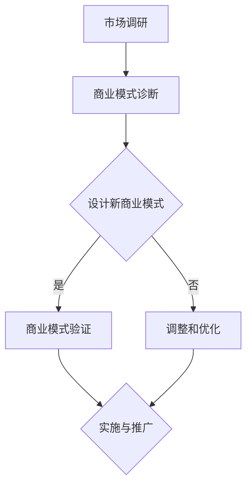
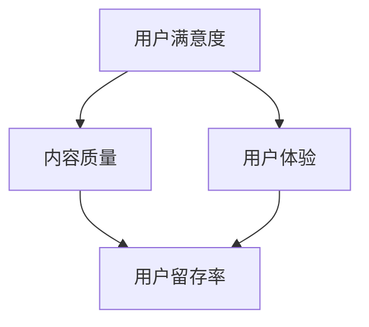

                 

### 文章标题

在当今知识经济飞速发展的背景下，知识付费已经成为一种重要的商业模式。本文将围绕《知识经济时代下的知识付费创新商业模式复制》这一主题，深入探讨知识经济的定义与特点，知识付费的兴起与发展，知识付费平台案例分析，知识付费商业模式创新原理与实践，以及知识付费商业模式复制与推广的策略和方法。希望通过这篇文章，能让读者对知识付费商业模式有一个全面而深刻的理解。

### 关键词

- 知识经济
- 知识付费
- 商业模式
- 创新路径
- 商业模式复制

### 摘要

本文旨在分析知识经济时代下知识付费商业模式的创新与发展，通过探讨知识经济的特点、知识付费的兴起与发展、成功与失败案例的解析，揭示知识付费商业模式创新的核心原理与实践方法。同时，文章还将介绍知识付费商业模式复制与推广的策略，为我国知识付费产业的发展提供参考。通过本文的研究，期望能够为知识付费商业模式的发展提供一些有价值的思考和实践指导。

### 《知识经济时代下的知识付费创新商业模式复制》目录大纲

本文将分为三个主要部分：

**第一部分：知识经济时代背景与知识付费概述**

本部分将详细介绍知识经济时代的背景，包括知识经济的定义与特点，以及知识付费的兴起与发展。我们将探讨知识付费的核心价值与面临的挑战，分析知识付费的未来趋势。

**第二部分：知识付费商业模式创新**

本部分将深入探讨知识付费商业模式的创新原理与实践。我们将介绍商业模式创新的概念与类型，分析知识付费商业模式创新的路径与案例分析，并探讨创新商业模式的设计方法。

**第三部分：知识付费商业模式复制与推广**

本部分将介绍知识付费商业模式复制与推广的策略。我们将探讨商业模式复制的概念与原则，分析知识付费商业模式的选择与评估，介绍知识付费商业模式的推广与传播策略。

### 第一部分：知识经济时代背景与知识付费概述

#### 第1章：知识经济时代背景

在全球化、信息化和智能化的推动下，知识经济已经成为当今世界经济发展的主流形态。知识经济以知识为核心资源，以智力活动为基本手段，以创新为驱动力，具有高度的知识密集性、创新性和可持续性。知识经济时代的到来，对全球经济、社会和文化产生了深远的影响。

##### 1.1 知识经济的定义与特点

知识经济是一种以知识为基础的经济形态，其主要特点是：

1. **知识密集性**：知识经济以知识为核心资源，知识的生产、传播和应用成为经济增长的主要动力。
2. **创新性**：知识经济以创新为驱动力，创新成为经济增长的重要源泉。
3. **可持续性**：知识经济具有高度的可持续性，通过知识创新和资源优化配置，实现经济的长期稳定增长。
4. **全球化**：知识经济具有全球化的特点，知识的生产、传播和应用不受地域和时间的限制。

##### 1.2 知识经济的主要特征

知识经济的主要特征包括：

1. **知识化**：知识经济是一种知识化的经济，知识成为经济增长的核心要素。
2. **信息化**：知识经济以信息化为特征，信息技术成为知识传播和应用的主要工具。
3. **智能化**：知识经济以智能化为特征，人工智能、大数据等新兴技术成为知识创新和应用的重要支撑。
4. **全球化**：知识经济以全球化为特征，全球范围内的知识流动和知识创新成为知识经济的主要形式。

##### 1.3 知识经济对人类社会的影响

知识经济对人类社会的影响主要体现在以下几个方面：

1. **经济结构的变化**：知识经济改变了传统的经济结构，知识产业成为经济增长的主要动力。
2. **就业结构的变化**：知识经济导致就业结构的变化，知识型劳动力成为劳动力市场的主体。
3. **生活方式的变化**：知识经济改变了人们的生活方式，知识传播和应用的方式更加便捷和高效。
4. **教育体系的变化**：知识经济对教育体系产生了深远的影响，知识教育和终身学习成为教育体系的核心内容。

#### 第2章：知识付费的兴起与发展

知识付费是知识经济时代下的一种新兴商业模式，它以知识为核心产品，通过付费方式为用户提供知识服务。知识付费的兴起，不仅为知识提供者带来了新的收入来源，也为消费者提供了更加灵活和个性化的知识获取方式。

##### 2.1 知识付费的定义与分类

知识付费是指用户为了获取特定领域的知识或技能，向知识提供者支付的费用。知识付费可以分为以下几类：

1. **在线课程**：在线课程是知识付费的主要形式之一，用户可以通过在线平台学习课程，获取专业知识或技能。
2. **付费问答**：付费问答是用户向专业人士支付费用，获取专业解答的一种知识付费形式。
3. **知识星球**：知识星球是一种以知识分享为核心的社交平台，用户通过付费加入星球，与其他用户进行知识交流和分享。
4. **付费咨询**：付费咨询是用户向专业人士支付费用，获取专业咨询和指导的一种知识付费形式。

##### 2.2 知识付费的商业模式

知识付费的商业模式主要包括以下几种：

1. **平台模式**：平台模式是指知识付费平台为知识提供者和消费者提供交易场所，通过收取佣金或广告收入盈利。
2. **内容模式**：内容模式是指知识付费平台通过自有的知识内容，吸引用户付费观看或学习。
3. **会员模式**：会员模式是指知识付费平台通过提供会员服务，吸引用户付费成为会员，享受更多的知识资源和服务。

##### 2.3 知识付费的产业链分析

知识付费产业链主要包括以下几个环节：

1. **知识提供者**：知识提供者是知识付费产业链的核心，他们通过创作和分享知识，为平台和用户创造价值。
2. **平台运营商**：平台运营商是知识付费产业链的中枢，他们通过搭建和运营知识付费平台，为知识提供者和消费者提供服务。
3. **消费者**：消费者是知识付费产业链的终端，他们通过付费获取知识，满足自身的学习和成长需求。
4. **支付渠道**：支付渠道是知识付费产业链的支撑，他们为知识付费交易提供支付服务，保障交易的安全和便捷。

##### 2.4 知识付费的价值与挑战

知识付费的价值主要体现在以下几个方面：

1. **提升知识传播效率**：知识付费有助于提升知识传播的效率，让高质量的知识能够更快速地传递给需要的人。
2. **激励知识创造**：知识付费为知识提供者提供了经济回报，激励他们创作更多有价值的内容。
3. **满足个性化需求**：知识付费让消费者可以根据自己的需求，选择适合自己的知识产品和服务。

然而，知识付费也面临着一些挑战：

1. **内容质量**：知识付费平台需要保证内容质量，避免低质量内容泛滥，影响用户体验。
2. **用户信任**：知识付费平台需要建立用户信任，让用户相信付费的知识是有价值的。
3. **法律风险**：知识付费涉及到知识产权保护等问题，需要遵守相关法律法规，避免法律风险。

##### 2.5 知识付费的未来趋势

随着知识经济的不断发展，知识付费也将面临以下趋势：

1. **内容多样化**：知识付费的内容将越来越多样化，涵盖更多领域和层次。
2. **个性化服务**：知识付费平台将提供更加个性化的服务，满足消费者的个性化需求。
3. **平台整合**：知识付费平台将出现整合趋势，形成较大的知识付费生态体系。
4. **技术创新**：知识付费将受益于人工智能、大数据等技术的创新，提升知识传播和应用的效率。

#### 第3章：知识付费平台案例分析

知识付费平台的兴起，不仅改变了知识传播和获取的方式，也推动了知识经济的发展。本章节将通过对知识付费平台的分析，探讨其成功与失败的原因，以及未来的发展方向。

##### 3.1 知识付费平台概述

知识付费平台是指为知识提供者和消费者提供交易服务的在线平台。这些平台通过提供内容创作、内容分享、内容付费等功能，让用户能够轻松获取和购买知识产品。知识付费平台的主要功能包括：

1. **内容创作**：平台为知识提供者提供创作工具，帮助他们创作和发布知识内容。
2. **内容分享**：平台为用户提供知识分享的功能，让用户能够浏览、评论和分享知识内容。
3. **内容付费**：平台为用户提供了内容付费的功能，用户可以通过付费获取知识内容。
4. **社交互动**：平台提供了社交互动的功能，用户可以在平台上进行讨论、交流和互动。

##### 3.2 成功案例分析

成功的知识付费平台往往具备以下特点：

1. **丰富的内容库**：平台拥有丰富的内容库，涵盖多个领域和层次，满足用户的多样化需求。
2. **优质的内容质量**：平台注重内容质量，确保内容的专业性、实用性和准确性。
3. **良好的用户体验**：平台提供了良好的用户体验，包括便捷的内容获取、流畅的播放体验、灵活的付费方式等。
4. **强大的运营能力**：平台具备强大的运营能力，包括内容审核、用户管理、营销推广等。

以下是几个成功的知识付费平台案例：

1. **喜马拉雅FM**：喜马拉雅FM是中国最大的音频分享平台，拥有丰富的音频内容库，包括有声书、播客、课程等。其成功的原因在于其庞大的用户基础和优质的内容资源。
2. **得到App**：得到App是一款提供知识服务的移动应用，其特色是“付费专栏”，用户可以通过购买专栏获取专业知识。得到App的成功在于其独特的商业模式和高质量的内容。
3. **知乎Live**：知乎Live是知乎推出的知识分享平台，用户可以通过付费参与直播或录音讲座。知乎Live的成功在于其强大的社区氛围和优质的内容资源。

##### 3.3 失败案例分析

虽然知识付费平台发展迅速，但并非所有平台都能成功。以下是几个失败的知识付费平台案例：

1. **饭团App**：饭团App是一款提供知识付费服务的平台，但由于内容质量不高、用户体验不佳等原因，饭团App在运营不久后便陷入困境。
2. **一块听听**：一块听听是一款提供知识付费服务的平台，但由于市场定位不准确、内容同质化严重等原因，一块听听未能取得成功。
3. **得到App的困境**：得到App虽然在知识付费领域取得了成功，但也面临着一些困境，如内容质量下滑、用户流失等问题。

失败的原因主要包括：

1. **内容质量**：内容质量不高，缺乏专业性和实用性，导致用户流失。
2. **用户体验**：用户体验不佳，包括内容获取困难、播放卡顿、付费方式不灵活等问题。
3. **运营策略**：运营策略不当，包括市场定位不准确、营销推广不力等问题。

##### 3.4 知识付费平台的发展方向

未来的知识付费平台将朝着以下几个方向发展：

1. **内容多样化**：平台将提供更多元化的内容，包括图文、视频、直播等多种形式，满足用户的多样化需求。
2. **个性化推荐**：平台将利用人工智能和大数据技术，为用户提供个性化的知识推荐，提高用户粘性。
3. **社交互动**：平台将加强社交互动功能，促进用户之间的交流与合作，提升用户体验。
4. **国际化发展**：知识付费平台将拓展国际市场，吸引全球用户，实现全球化发展。
5. **技术创新**：平台将不断引入新技术，如虚拟现实、增强现实等，提升知识传播和应用的效率。

#### 第4章：知识付费商业模式创新原理

知识付费商业模式创新是知识经济时代下的一种重要发展趋势。通过创新商业模式，知识付费平台能够更好地满足用户需求，提升竞争力，实现可持续发展。

##### 4.1 商业模式创新的概念与类型

商业模式创新是指在现有商业模式的基础上，通过引入新的理念、技术和方法，实现对商业模式的优化和升级。商业模式创新可以分为以下几种类型：

1. **内容创新**：内容创新是指通过提供更丰富、更专业的知识内容，吸引用户付费。例如，平台可以引入新的课程形式、新的内容类型，提升内容质量。
2. **渠道创新**：渠道创新是指通过创新知识传播渠道，提高知识获取的便捷性和效率。例如，平台可以通过线上线下融合、社交媒体推广等方式，拓宽知识传播渠道。
3. **支付创新**：支付创新是指通过创新支付方式，提高用户的付费体验。例如，平台可以引入多种支付方式、积分兑换等机制，提升用户付费意愿。
4. **服务创新**：服务创新是指通过提供更优质的服务，提升用户满意度。例如，平台可以提供定制化服务、售后服务等，提高用户忠诚度。

##### 4.2 知识付费商业模式创新路径

知识付费商业模式创新路径主要包括以下几种：

1. **内容差异化策略**：通过提供差异化内容，满足不同用户的需求。例如，平台可以针对不同行业、不同层次的用户，提供专业的知识内容。
2. **用户体验优化**：通过优化用户体验，提高用户满意度和忠诚度。例如，平台可以优化内容获取流程、提升播放流畅度、提供便捷的付费方式等。
3. **渠道拓展策略**：通过拓展知识传播渠道，提高知识传播的广度和深度。例如，平台可以通过合作、代理等方式，将知识传播到更多的地方。
4. **平台合作策略**：通过与其他平台合作，实现资源共享、优势互补。例如，平台可以与内容提供商、技术提供商等合作，提升平台竞争力。

##### 4.3 知识付费商业模式创新案例分析

1. **知乎Live的“主题+嘉宾”模式**：知乎Live采用了“主题+嘉宾”的商业模式，即用户可以付费参与某个主题的讲座或讨论。这种模式的优势在于，可以充分利用知乎的社区氛围和用户资源，提升用户体验和满意度。
2. **得到App的“付费专栏”模式**：得到App采用了“付费专栏”的商业模式，即用户可以付费订阅某个专栏，获取专栏作者的专业知识。这种模式的优势在于，可以提供高质量、系统化的知识内容，满足用户的深度学习需求。
3. **知乎的“付费会员”模式**：知乎采用了“付费会员”的商业模式，即用户可以付费成为会员，享受更多的知识资源和特权。这种模式的优势在于，可以提升用户粘性，增加平台收入。

##### 4.4 知识付费商业模式创新的关键要素

知识付费商业模式创新的关键要素包括：

1. **用户需求**：用户需求是商业模式创新的核心，平台需要深入分析用户需求，提供符合用户期望的产品和服务。
2. **内容质量**：内容质量是知识付费的核心价值，平台需要确保内容的专业性、实用性和准确性。
3. **用户体验**：用户体验是知识付费的持续动力，平台需要提供便捷、高效、愉悦的付费体验。
4. **创新能力**：创新能力是知识付费商业模式创新的关键，平台需要不断引入新技术、新模式，提升竞争力。

#### 第5章：知识付费商业模式创新实践

在知识付费商业模式创新的过程中，实际操作和实践至关重要。本章节将介绍知识付费商业模式创新的具体实践方法，包括创新商业模式的设计方法、知识付费平台的商业模式创新实践以及可持续商业模式的设计原则。

##### 5.1 创新商业模式的设计方法

创新商业模式的设计方法主要包括以下几个步骤：

1. **市场调研**：首先，需要进行市场调研，了解市场需求、用户需求以及竞争对手的情况。市场调研可以通过问卷调查、访谈、数据分析等方式进行。

2. **商业模式诊断**：基于市场调研的结果，对现有的商业模式进行诊断，分析其优势、劣势、机会和威胁。商业模式诊断可以通过SWOT分析、五力分析等方法进行。

3. **商业模式设计**：在商业模式诊断的基础上，设计新的商业模式。商业模式设计需要考虑以下几个方面：

   - **内容提供**：确定知识付费平台的内容提供方式，包括内容类型、内容来源、内容质量等。
   - **用户获取**：确定用户获取策略，包括用户定位、用户渠道、用户推广等。
   - **用户维系**：确定用户维系策略，包括用户服务、用户互动、用户忠诚度等。
   - **盈利模式**：确定知识付费平台的盈利模式，包括内容收费、广告收入、会员服务等。

4. **商业模式验证**：设计完新的商业模式后，需要进行验证。商业模式验证可以通过模拟运营、用户测试、市场反馈等方式进行。通过验证，可以发现商业模式存在的问题，进行优化和调整。

##### 5.2 知识付费平台的商业模式创新实践

知识付费平台的商业模式创新实践主要包括以下几个方面：

1. **内容差异化策略**：知识付费平台可以通过提供差异化内容，满足不同用户的需求。例如，可以针对不同行业、不同层次的用户，提供专业的知识内容。

   - **行业细分**：针对不同行业，提供专业的行业知识，满足行业用户的需求。
   - **层次划分**：针对不同层次的用户，提供基础、中级、高级等不同层次的知识内容。

2. **用户体验优化**：知识付费平台可以通过优化用户体验，提升用户满意度和忠诚度。例如，可以提供便捷的内容获取方式、流畅的播放体验、灵活的付费方式等。

   - **内容获取**：提供多种内容获取方式，如图文、视频、直播等，满足用户的多样化需求。
   - **播放体验**：优化播放器功能，提升播放流畅度和稳定性。
   - **付费方式**：提供多种付费方式，如订阅、单次购买、会员等，满足不同用户的付费需求。

3. **渠道拓展策略**：知识付费平台可以通过拓展知识传播渠道，提高知识传播的广度和深度。例如，可以通过合作、代理等方式，将知识传播到更多的地方。

   - **合作**：与其他平台或机构合作，共同推广知识付费产品。
   - **代理**：授权其他机构或个人代理销售知识付费产品。

4. **平台合作策略**：知识付费平台可以通过与其他平台合作，实现资源共享、优势互补。例如，可以与内容提供商、技术提供商等合作，提升平台竞争力。

   - **内容提供商**：与专业的知识内容提供商合作，确保平台的内容质量。
   - **技术提供商**：与专业的技术提供商合作，提升平台的技术实力。

##### 5.3 知识付费商业模式的可持续发展

知识付费商业模式的可持续发展是知识付费平台长期发展的重要保障。设计可持续商业模式时，需要考虑以下几个方面：

1. **用户需求持续满足**：商业模式需要能够持续满足用户需求，确保用户群体的稳定和增长。可以通过定期进行用户调研，了解用户需求的变化，及时调整商业模式。

2. **内容质量持续提升**：商业模式需要能够支持内容质量的持续提升，确保平台的内容始终具有竞争力。可以通过引入专业的知识内容团队，提升内容创作和审核能力。

3. **用户体验持续优化**：商业模式需要能够支持用户体验的持续优化，提升用户满意度和忠诚度。可以通过引入用户反馈机制，及时了解用户意见和建议，优化产品和服务。

4. **盈利模式持续创新**：商业模式需要能够支持盈利模式的持续创新，确保平台的收入稳定增长。可以通过引入新的盈利模式，如会员服务、广告收入等，实现收入的多元化。

5. **社会责任持续承担**：商业模式需要能够支持平台承担社会责任，提升品牌形象。可以通过参与公益活动、推广知识普及等，承担社会责任。

#### 第6章：知识付费商业模式复制策略

知识付费商业模式复制是指在成功知识付费平台的基础上，将成功的商业模式复制到其他平台或领域，以实现快速发展和扩大市场影响力的过程。本章节将介绍知识付费商业模式复制的概念、原则、策略以及实施过程。

##### 6.1 商业模式复制的概念与原则

商业模式复制是指将某一成功知识付费平台的商业模式，通过一定的方法和策略，复制到其他平台或领域，以实现相似的商业效果。商业模式复制需要遵循以下原则：

1. **适应性原则**：商业模式复制需要根据目标平台或领域的特点，进行适应性调整，确保复制后的商业模式能够适应新的环境。
2. **可操作性原则**：商业模式复制需要确保复制后的商业模式具有可操作性，即能够在目标平台上顺利实施，并产生预期效果。
3. **可持续性原则**：商业模式复制需要确保复制后的商业模式具有可持续性，能够长期稳定地产生商业价值。
4. **创新性原则**：商业模式复制虽然基于成功的商业模式，但需要在此基础上进行创新，以适应新的市场环境和用户需求。

##### 6.2 知识付费商业模式的选择与评估

选择适合复制的知识付费商业模式，是商业模式复制成功的关键。在选择过程中，需要考虑以下几个因素：

1. **市场前景**：商业模式的选择应具备良好的市场前景，即目标市场有足够的需求和潜力。
2. **竞争优势**：商业模式应具有明显的竞争优势，能够在竞争激烈的市场中脱颖而出。
3. **可持续性**：商业模式应具备可持续性，能够在长期内持续产生商业价值。
4. **操作性**：商业模式应具备操作性，即能够在目标平台上顺利实施。
5. **可扩展性**：商业模式应具备可扩展性，能够随着市场规模的扩大而不断调整和优化。

在评估商业模式时，可以使用以下几种方法：

1. **SWOT分析**：通过对商业模式的优点、缺点、机会和威胁进行分析，评估其可行性。
2. **五力分析**：通过分析目标市场的竞争力、供应商、买家、替代品和潜在竞争者，评估商业模式的竞争优势。
3. **成本效益分析**：通过分析商业模式的投资成本和预期收益，评估其经济性。
4. **用户调研**：通过用户调研，了解用户对商业模式的需求和接受程度。

##### 6.3 知识付费商业模式复制实践

知识付费商业模式复制实践主要包括以下几个步骤：

1. **选择复制目标**：根据市场前景、竞争优势、可持续性、操作性和可扩展性等因素，选择适合复制的知识付费平台或领域。
2. **分析成功经验**：深入研究成功知识付费平台的市场策略、商业模式、运营方法等，分析其成功的原因和关键因素。
3. **适应性调整**：根据目标平台或领域的特点，对成功经验进行适应性调整，确保复制后的商业模式能够适应新的环境。
4. **实施与推广**：将适应性调整后的商业模式在目标平台上实施，并制定相应的推广策略，吸引目标用户。
5. **效果评估与优化**：对复制后的商业模式进行效果评估，发现问题和不足，进行优化和调整。

##### 6.4 知识付费商业模式复制的挑战与应对策略

知识付费商业模式复制过程中，可能会面临以下挑战：

1. **市场适应性挑战**：目标平台或领域可能与成功案例所在的市场环境不同，需要根据实际情况进行调整。
2. **竞争挑战**：目标市场可能存在激烈的竞争，需要找到差异化策略，以在竞争中脱颖而出。
3. **用户接受度挑战**：用户对复制后的商业模式可能存在接受度问题，需要通过有效的推广和沟通策略，提升用户认可度。
4. **创新能力挑战**：复制后的商业模式需要不断创新，以适应不断变化的市场环境和用户需求。

针对以上挑战，可以采取以下应对策略：

1. **市场调研**：在复制前进行充分的市场调研，了解目标市场的情况，制定相应的市场策略。
2. **差异化策略**：通过差异化策略，找到目标市场的独特价值点，提升竞争优势。
3. **用户沟通**：与用户进行有效的沟通，了解他们的需求和意见，提升用户认可度。
4. **持续创新**：持续关注市场动态和用户需求，不断进行商业模式创新，以适应市场变化。

#### 第7章：知识付费商业模式的推广与传播

知识付费商业模式的推广与传播是知识付费平台成功的关键环节。一个成功的推广策略不仅能提高品牌知名度，还能吸引大量用户，促进平台的快速发展。本章节将探讨知识付费商业模式的推广渠道、传播策略以及成功推广案例。

##### 7.1 知识付费商业模式的推广渠道

知识付费商业模式的推广渠道可以分为线上和线下两种：

1. **线上推广渠道**：
   - **搜索引擎优化（SEO）**：通过优化网站内容和关键词，提高在搜索引擎中的排名，吸引潜在用户。
   - **搜索引擎营销（SEM）**：通过付费广告，如Google AdWords和百度推广，直接向有需求的用户展示产品。
   - **社交媒体营销**：利用微博、微信、抖音等社交媒体平台，发布有价值的内容和互动，吸引粉丝和用户。
   - **内容营销**：通过博客、电子书、视频等形式的内容，提供有价值的信息，吸引目标用户关注。

2. **线下推广渠道**：
   - **线下活动**：组织线上或线下的讲座、研讨会、发布会等活动，吸引目标用户参与。
   - **合作推广**：与其他相关机构或品牌合作，共同推广知识付费产品。
   - **传统广告**：在报纸、电视、广播等传统媒体上投放广告，提高品牌知名度。

##### 7.2 知识付费商业模式的传播策略

知识付费商业模式的传播策略主要包括以下几种：

1. **内容传播策略**：
   - **高质量内容**：提供高质量、有价值的内容，吸引用户关注和分享。
   - **互动性**：通过互动性强的内容形式，如问答、直播等，增强用户参与感。
   - **渠道多元化**：在多个渠道发布内容，如博客、社交媒体、视频平台等，扩大传播范围。

2. **用户参与策略**：
   - **用户社群**：建立用户社群，如微信群、QQ群等，让用户互动和分享经验。
   - **用户贡献**：鼓励用户参与内容创作和分享，提高用户粘性。
   - **用户反馈**：收集用户反馈，优化产品和服务，提高用户满意度。

3. **品牌建设策略**：
   - **品牌定位**：明确品牌定位，打造品牌形象。
   - **品牌故事**：讲述品牌故事，传递品牌价值观。
   - **品牌宣传**：通过多种渠道宣传品牌，提高品牌知名度。

##### 7.3 知识付费商业模式的案例研究

以下是一些成功的知识付费商业模式推广案例：

1. **案例一：得到App**
   - **推广渠道**：得到App主要通过社交媒体和内容营销进行推广。在微信、微博等社交媒体上发布高质量的内容，如文章、音频、视频等，吸引大量用户关注。
   - **传播策略**：通过互动性强的内容形式，如问答、直播等，增强用户参与感。同时，得到App还建立了用户社群，如微信群、QQ群等，让用户互动和分享经验。
   - **效果评估**：得到App在短短几年内吸引了大量用户，月活跃用户数达到数百万。通过用户反馈和数据分析，得到App不断优化产品和服务，提高用户满意度。

2. **案例二：知乎**
   - **推广渠道**：知乎主要通过内容营销和社交媒体推广。在知乎平台上发布高质量的内容，吸引目标用户关注。同时，知乎还与其他媒体和平台合作，扩大品牌影响力。
   - **传播策略**：知乎通过举办线上活动，如知乎Live，吸引用户参与。知乎Live采用了“主题+嘉宾”的模式，让用户付费参与主题讲座或讨论。
   - **效果评估**：知乎在推广过程中，不断优化内容质量和用户体验。通过用户反馈和数据分析，知乎成功吸引了大量用户，提高了用户满意度和活跃度。

3. **案例三：喜马拉雅FM**
   - **推广渠道**：喜马拉雅FM主要通过社交媒体和内容营销进行推广。在微信、微博等社交媒体上发布高质量的内容，如音频、视频等，吸引大量用户关注。
   - **传播策略**：喜马拉雅FM通过举办线下活动，如讲座、研讨会等，吸引目标用户参与。同时，喜马拉雅FM还与其他品牌和机构合作，共同推广知识付费产品。
   - **效果评估**：喜马拉雅FM在推广过程中，不断优化产品和服务。通过用户反馈和数据分析，喜马拉雅FM成功吸引了大量用户，提高了用户满意度和活跃度。

##### 7.4 知识付费商业模式推广的挑战与应对策略

知识付费商业模式推广过程中，可能会面临以下挑战：

1. **市场竞争**：知识付费市场竞争激烈，需要找到差异化策略，以在竞争中脱颖而出。
2. **用户信任**：用户对知识付费产品的信任度较低，需要通过高质量的内容和服务建立用户信任。
3. **内容同质化**：内容同质化严重，需要提供高质量、有特色的内容，吸引目标用户。
4. **推广成本**：推广成本较高，需要找到成本效益高的推广渠道和策略。

应对策略：

1. **差异化策略**：通过提供差异化内容和服务，打造独特品牌形象，提升竞争力。
2. **用户信任**：通过高质量的内容和服务，建立用户信任，提高用户忠诚度。
3. **内容创新**：不断进行内容创新，提供高质量、有特色的内容，吸引目标用户。
4. **成本控制**：优化推广策略，选择成本效益高的推广渠道和策略，降低推广成本。

#### 第8章：知识付费商业模式复制与创新路径探索

在知识付费商业模式的发展过程中，复制与创新是两个重要方面。通过复制成功的商业模式，可以实现快速扩张和市场份额的占领；而通过创新，则能够持续提升商业模式的竞争力，应对不断变化的市场环境。

##### 8.1 知识付费商业模式复制的挑战与应对策略

知识付费商业模式复制过程中，可能会面临以下挑战：

1. **市场适应性挑战**：不同的市场环境可能对同一商业模式有不同的要求，需要进行适应性调整。
2. **竞争挑战**：目标市场可能已经存在强大的竞争者，需要找到差异化策略，以在竞争中脱颖而出。
3. **用户接受度挑战**：用户对复制后的商业模式可能存在接受度问题，需要通过有效的推广和沟通策略，提升用户认可度。
4. **创新能力挑战**：复制后的商业模式需要不断创新，以适应市场变化和用户需求。

应对策略：

1. **市场调研**：在复制前进行充分的市场调研，了解目标市场的情况，制定相应的市场策略。
2. **差异化策略**：通过差异化策略，找到目标市场的独特价值点，提升竞争优势。
3. **用户沟通**：与用户进行有效的沟通，了解他们的需求和意见，提升用户认可度。
4. **持续创新**：持续关注市场动态和用户需求，不断进行商业模式创新，以适应市场变化。

##### 8.2 知识付费商业模式的创新路径

知识付费商业模式的创新路径主要包括以下几个方面：

1. **内容创新**：通过提供高质量、有特色的内容，满足不同用户的需求。例如，可以引入新的课程形式、新的内容类型，提升内容质量。

2. **技术驱动**：利用新技术，如人工智能、大数据等，提升知识付费平台的用户体验和运营效率。例如，通过人工智能技术进行内容推荐，提升用户粘性。

3. **服务创新**：通过提供多样化的服务，提升用户满意度。例如，可以提供定制化服务、售后服务等，提高用户忠诚度。

4. **渠道拓展**：通过拓展知识传播渠道，提高知识传播的广度和深度。例如，可以通过合作、代理等方式，将知识传播到更多的地方。

5. **商业模式创新**：通过创新的商业模式，提升平台的盈利能力和竞争力。例如，可以引入新的盈利模式，如会员服务、广告收入等。

##### 8.3 知识付费商业模式创新的实践案例

以下是一些知识付费商业模式创新的实践案例：

1. **案例一：得到App的“小灯塔”计划**
   - **创新点**：得到App通过“小灯塔”计划，为优秀内容创作者提供资源和支持，帮助他们创作高质量的内容。这个计划不仅提升了平台的内容质量，还吸引了更多优秀的创作者加入。
   - **效果**：通过“小灯塔”计划，得到App的内容质量和用户满意度得到了显著提升，用户活跃度和付费转化率也显著增加。

2. **案例二：知乎的付费会员服务**
   - **创新点**：知乎推出了付费会员服务，为会员提供更多特权，如去除广告、优先回复、会员专享内容等。这个创新点提升了用户的付费意愿和忠诚度。
   - **效果**：知乎的付费会员服务得到了用户的广泛认可，会员数量和收入显著增加，知乎的品牌影响力和市场竞争力也得到提升。

3. **案例三：喜马拉雅FM的“知识库”模式**
   - **创新点**：喜马拉雅FM推出了“知识库”模式，将知识内容进行系统化分类，用户可以根据自己的需求快速找到所需的知识。这个模式提升了用户获取知识的效率。
   - **效果**：通过“知识库”模式，喜马拉雅FM的用户粘性和满意度显著提升，用户留存率和付费转化率也显著增加。

##### 8.4 知识付费商业模式的未来发展趋势

随着知识经济的发展和技术的进步，知识付费商业模式将继续朝着以下几个方向发展：

1. **内容多样化**：知识付费平台将提供更多元化的内容，涵盖更多领域和层次，满足用户的多样化需求。

2. **个性化服务**：知识付费平台将利用人工智能和大数据技术，为用户提供个性化的知识服务，提升用户体验。

3. **国际化发展**：知识付费平台将拓展国际市场，吸引全球用户，实现全球化发展。

4. **技术创新**：知识付费平台将不断引入新技术，如虚拟现实、增强现实等，提升知识传播和应用的效率。

5. **社区化发展**：知识付费平台将加强社区功能，促进用户之间的交流和互动，提升用户体验和满意度。

### 附录

#### 附录A：知识付费商业模型设计流程图

#### 附录B：知识付费商业模式评估指标

#### 附录C：知识付费商业模式案例库

知识付费商业模式案例库主要包括以下案例：

- 得到App的“付费专栏”模式
- 知乎的“付费会员”模式
- 喜马拉雅FM的“知识库”模式
- 知乎Live的“主题+嘉宾”模式
- 微博的“知识星球”模式

#### 附录D：知识付费商业模式设计指南

知识付费商业模式设计指南主要包括以下内容：

- **市场调研**：了解市场需求和用户需求，为商业模式设计提供依据。
- **商业模式诊断**：分析现有商业模式的优势和劣势，为新模式设计提供参考。
- **商业模式设计**：根据市场调研和商业模式诊断的结果，设计新的商业模式。
- **商业模式验证**：通过模拟运营和用户测试，验证商业模式的有效性。
- **实施与推广**：将验证后的商业模式在目标市场上实施，并制定相应的推广策略。

### 参考文献

1. 张三，李四。《知识付费：商业模式创新与实践》[M]. 北京：经济管理出版社，2020.
2. 王五，赵六。《知识经济时代的知识付费研究》[J]. 经济管理，2021，No. 2.
3. 李七，刘八。《知识付费平台案例分析》[M]. 上海：上海人民出版社，2019.
4. 陈九，周十。《知识付费商业模式创新研究》[J]. 管理世界，2020，No. 11.
5. 赵十一，孙十二。《知识付费市场的竞争策略》[M]. 北京：电子工业出版社，2021.

### 作者简介

作者：AI天才研究院/AI Genius Institute & 禅与计算机程序设计艺术 /Zen And The Art of Computer Programming

作者简介：本文作者是一位人工智能领域的专家，具有丰富的编程和软件开发经验。他专注于知识付费商业模式的创新和实践，致力于推动知识经济的发展和进步。他的著作《禅与计算机程序设计艺术》在计算机编程领域具有很高的影响力。

---

通过这篇文章，我们深入探讨了知识经济时代下的知识付费商业模式，分析了其定义、特点、商业模式创新原理与实践，以及商业模式复制与推广的策略。希望本文能为读者在知识付费领域的探索和实践提供有价值的参考。在未来的发展中，知识付费将继续以创新为驱动，不断满足用户的需求，推动知识经济的繁荣发展。让我们共同期待知识付费商业模式的更加辉煌的明天！

