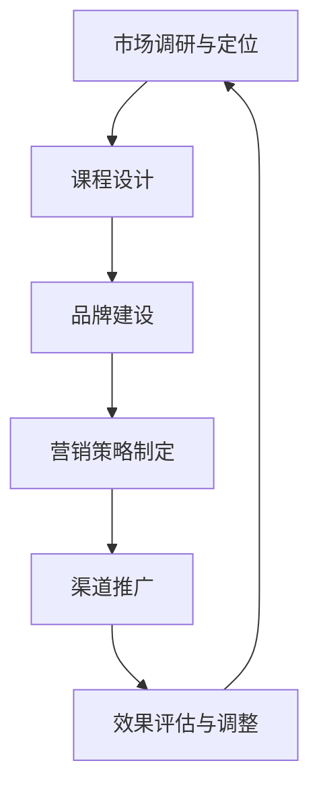

                 

# 知识经济时代下的知识付费创新课程营销策略

## 关键词：
知识经济、知识付费、创新课程、营销策略、用户需求、品牌建设、数据驱动、个性化推荐、效果评估

## 摘要：
在知识经济时代，知识付费成为教育培训市场的重要趋势。本文深入分析了知识经济时代的背景与特点，探讨了知识付费市场的现状与趋势，并提出了知识付费创新课程的设计原则与教学方法。随后，文章详细阐述了知识付费课程的市场定位与目标客户，以及品牌建设、营销渠道与定价策略。最后，文章讨论了知识付费课程的运营与管理，并通过案例分析提供了成功经验与挑战应对策略，为知识付费行业的创新发展提供了系统性指导。

### 目录大纲

- **第一部分：知识经济时代与知识付费概述**
  - 第1章：知识经济时代的背景与特点
  - 第2章：知识付费市场的现状与趋势
- **第二部分：知识付费创新课程设计**
  - 第3章：知识付费课程的设计原则与框架
  - 第4章：知识付费课程的教学方法与策略
  - 第5章：知识付费课程的市场定位与目标客户
- **第三部分：知识付费课程营销策略**
  - 第6章：知识付费课程的品牌建设
  - 第7章：知识付费课程的营销渠道与推广策略
  - 第8章：知识付费课程的定价策略与收益管理
- **第四部分：知识付费课程运营与管理**
  - 第9章：知识付费课程的运营策略
  - 第10章：知识付费课程的学员服务与反馈
  - 第11章：知识付费课程的持续迭代与优化
- **第五部分：案例分析**
  - 第12章：知识付费创新课程营销成功案例分析
  - 第13章：知识付费创新课程营销挑战与应对
- **第六部分：总结与展望**
  - 第14章：知识付费创新课程营销策略的总结与未来展望

---

### 第一部分：知识经济时代与知识付费概述

#### 第1章：知识经济时代的背景与特点

知识经济时代，是指以知识为主要生产要素的经济形态。与传统经济相比，知识经济具有以下显著特点：

1. **知识成为核心资源**：知识成为驱动经济增长的关键要素，而不再是土地、劳动力和资本。
2. **创新驱动发展**：创新成为企业竞争力和国家综合国力的重要标志，知识创造与创新成为经济增长的重要动力。
3. **全球化与信息化**：全球化和信息技术的迅速发展，使得知识传播和共享变得更加便捷，促进了知识经济的快速发展。
4. **服务经济比重增加**：知识经济时代，服务业的比重显著上升，尤其是以知识为核心的金融服务、信息技术服务等。
5. **人力资本投资的重要性**：知识经济的竞争，实质上是人才的竞争，企业和社会越来越重视人力资本的投资与培养。

知识经济的兴起，对各行各业产生了深远影响。在教育领域，知识经济推动了在线教育、知识付费等新型教育模式的快速发展。

#### 1.1 知识经济的兴起

知识经济的兴起，可以追溯到20世纪80年代。当时，信息技术迅速发展，尤其是互联网的出现，使得知识的获取、传播和应用变得更加便捷。随着信息技术的发展，全球范围内的知识流动加速，知识经济逐渐成为全球经济的主导力量。

在知识经济时代，知识的价值得到了前所未有的提升。知识不仅是企业创新和发展的核心资源，也是个人竞争力的关键要素。因此，人们越来越重视知识的获取与积累，知识付费也应运而生。

#### 1.2 知识经济的特征与影响

知识经济的特征主要体现在以下几个方面：

1. **知识的生产与传播**：知识经济的核心在于知识的创造、传播和应用。知识的生产不再是简单的体力劳动，而是依赖于专业知识和创新思维。
2. **信息技术的应用**：知识经济的快速发展，离不开信息技术的支持。信息技术使得知识的获取、传播和处理变得更加高效，大大提高了知识的生产效率。
3. **全球化**：知识经济时代，全球化进程加速。知识无国界，全球范围内的知识流动和交流日益频繁，促进了全球经济的发展。
4. **服务业的兴起**：知识经济时代，服务业的比重显著上升。服务业以知识为核心，包括金融服务、信息技术服务、咨询服务等。
5. **人力资本投资**：知识经济的竞争，实质上是人才的竞争。企业和国家越来越重视人力资本的投资与培养，以提升整体竞争力。

知识经济对教育领域的影响主要体现在以下几个方面：

1. **在线教育的发展**：知识经济的兴起，推动了在线教育的快速发展。在线教育打破了时间和空间的限制，使得学习者可以随时随地进行学习。
2. **知识付费的普及**：知识经济的背景下，知识付费逐渐成为主流。人们愿意为优质的知识内容付费，推动知识付费市场的繁荣。
3. **教育模式的创新**：知识经济时代，教育模式的创新成为必然趋势。以知识为核心，结合信息技术，教育模式越来越多样化，满足不同学习者的需求。

#### 1.3 知识付费的概念与发展历程

知识付费，是指用户为获取专业知识和技能而支付的费用。在知识经济时代，知识付费成为教育培训市场的重要组成部分。

知识付费的发展历程可以分为以下几个阶段：

1. **传统教育阶段**：在传统教育阶段，教育主要依赖于实体课堂，知识付费主要通过学费、培训费等形式实现。
2. **在线教育阶段**：随着互联网的发展，在线教育逐渐兴起，知识付费的形式也发生了变化。用户可以通过在线课程、电子书、直播课程等形式获取知识，并为之付费。
3. **知识付费平台阶段**：知识付费平台的出现，进一步推动了知识付费的发展。知识付费平台提供了丰富的课程资源，方便用户进行知识消费。

知识付费市场的现状与趋势：

1. **市场规模不断扩大**：随着知识经济的不断发展，知识付费市场规模不断扩大。预计未来几年，知识付费市场仍将保持高速增长。
2. **用户需求多样化**：知识付费用户的需求越来越多样化，不仅关注知识的深度和广度，还关注学习方式、学习体验等方面。
3. **个性化推荐成为趋势**：知识付费平台通过大数据和人工智能技术，实现个性化推荐，提高用户的满意度和粘性。
4. **竞争加剧**：知识付费市场吸引了大量资本和企业进入，竞争日益激烈。企业需要不断创新，提升课程质量和用户服务，才能在市场中脱颖而出。

### 第一部分总结

知识经济时代的到来，推动了知识付费的快速发展。知识付费作为一种新型教育模式，满足了用户对专业知识和技能的需求，也促进了教育产业的创新和发展。在知识经济时代，企业和个人需要不断学习新知识，提升自身竞争力。知识付费为这一需求提供了有效的解决方案。

#### 第2章：知识付费市场的现状与趋势

知识付费市场作为知识经济时代的重要组成部分，正经历着前所未有的快速发展。本章节将详细分析知识付费市场的规模、用户群体以及未来的趋势预测。

#### 2.1 知识付费市场的规模分析

知识付费市场的规模不断增长，成为教育培训市场的重要驱动力。根据市场研究报告，知识付费市场的总体规模已经达到数千亿元人民币，并且还在持续扩大。以下是几个关键数据点：

1. **市场规模**：截至2022年，中国知识付费市场规模已超过5000亿元人民币，预计到2025年将突破1万亿元。
2. **增长速度**：知识付费市场的年增长率保持在30%以上，远高于传统教育市场。

知识付费市场的快速增长，主要得益于以下几个因素：

1. **互联网普及**：随着互联网的普及和在线教育的兴起，知识付费的渠道和形式更加多样化，用户可以随时随地获取知识。
2. **用户需求**：在知识经济时代，个人对终身学习的需求日益增长，用户愿意为优质的知识内容和服务支付费用。
3. **技术进步**：大数据、人工智能等技术的应用，使得知识付费平台能够提供更加个性化的推荐和服务，提高了用户的满意度和粘性。

#### 2.2 知识付费用户群体分析

知识付费用户群体的特征和需求在不断演变，了解这些特征对于制定有效的营销策略至关重要。以下是知识付费用户群体的主要特征：

1. **年龄结构**：知识付费用户主要集中在25-45岁之间，这部分用户通常具备一定的经济基础和较强的学习需求。
2. **职业背景**：职场人士是知识付费的主要用户群体，他们希望通过学习提升职业能力和专业素养。
3. **消费习惯**：知识付费用户对内容质量有较高的要求，他们愿意为高质量的课程和服务支付费用。
4. **学习动机**：知识付费用户的学习动机多样，包括提升职业技能、拓展知识视野、个人成长等。

此外，知识付费用户群体的需求也在不断变化：

1. **内容需求**：用户对课程内容的深度和实用性有更高的期望，希望课程能够解决实际问题。
2. **学习方式**：用户越来越倾向于在线学习，偏好灵活的学习时间和个性化的学习体验。
3. **互动性**：用户希望在学习过程中能够与其他学员进行互动，分享学习心得和经验。

#### 2.3 知识付费市场的趋势预测

知识付费市场未来将继续保持快速增长，以下是几个关键趋势：

1. **个性化推荐**：随着大数据和人工智能技术的应用，知识付费平台将提供更加个性化的推荐服务，满足用户的个性化需求。
2. **多元化内容**：知识付费市场将不断拓展内容领域，涵盖更多的专业知识和技能，满足不同用户群体的需求。
3. **社交化学习**：社交化学习将成为知识付费的重要趋势，用户将通过社群和互动平台进行学习交流和分享。
4. **跨界融合**：知识付费将与更多行业和领域进行融合，如医疗、法律、金融等，提供更多跨界课程和解决方案。
5. **全球扩张**：随着知识付费市场的国际化，国内知识付费平台将积极拓展海外市场，吸引全球用户。

### 第2章总结

知识付费市场作为知识经济时代的重要组成部分，正在快速发展。了解知识付费市场的规模、用户群体和未来趋势，对于企业制定营销策略和拓展市场具有重要意义。未来，知识付费市场将继续保持快速增长，个性化推荐、多元化内容、社交化学习等趋势将推动市场的进一步发展。

---

### 第二部分：知识付费创新课程设计

#### 第3章：知识付费课程的设计原则与框架

知识付费课程的成功离不开科学的设计原则和合理的框架。本章将详细探讨知识付费课程的设计原则，并介绍课程设计的整体框架，帮助教育从业者创建高质量的知识付费课程。

#### 3.1 知识付费课程设计的原则

1. **用户需求导向**：课程设计应以用户需求为中心，深入了解用户的学习目标、兴趣和需求，确保课程内容能够满足用户的实际需求。

2. **内容实用性**：课程内容应具有实际应用价值，能够帮助用户解决实际问题，提升职业技能或知识水平。

3. **课程体系化**：课程应具备系统性和连贯性，知识点之间应相互衔接，形成完整的知识体系，便于用户学习和理解。

4. **教学互动性**：课程设计应注重教学互动，鼓励用户参与讨论和互动，提高学习效果和用户满意度。

5. **技术支持**：充分利用现代信息技术，如视频、音频、互动教学等，提升课程的学习体验和互动性。

6. **持续迭代**：课程内容应定期更新和优化，以适应不断变化的市场需求和用户需求。

#### 3.2 知识付费课程设计的框架

知识付费课程设计可以按照以下框架进行：

1. **需求分析**：首先，进行用户需求分析，了解用户的学习目标、兴趣和需求，为课程内容设计提供依据。

2. **课程内容规划**：根据需求分析结果，规划课程的整体内容结构，确定课程的知识点和教学模块。

3. **教学资源准备**：准备教学所需的资源，包括视频、PPT、电子书、练习题等，确保课程内容的丰富性和多样性。

4. **教学设计**：进行教学设计，包括教学目标、教学方法、教学过程、评估方式等，确保课程的教学效果和用户满意度。

5. **课程试讲与反馈**：进行课程试讲，收集用户反馈，并根据反馈进行课程调整和优化。

6. **课程上线与推广**：将课程上线，并通过多种渠道进行推广，吸引潜在用户。

#### 3.3 课程内容的创新与差异化

课程内容的创新与差异化是知识付费课程成功的关键。以下是一些实现课程创新与差异化的方法：

1. **引入新知识点**：及时引入前沿的知识点和行业动态，确保课程内容的前沿性和实用性。

2. **结合实践案例**：通过实践案例的讲解，让用户更好地理解和应用所学知识。

3. **互动式教学**：采用互动式教学方法，如在线讨论、互动问答、案例分析等，提高用户参与度和学习效果。

4. **个性化推荐**：利用大数据和人工智能技术，为用户推荐个性化的课程内容，提高课程的匹配度和用户满意度。

5. **跨界合作**：与其他行业或领域的专家合作，开发跨界的知识付费课程，拓宽课程的内容领域。

6. **品牌建设**：通过品牌建设，提升课程的知名度和用户认可度，形成独特的课程特色。

### 第3章总结

知识付费课程设计应遵循用户需求导向、内容实用性、课程体系化、教学互动性、技术支持和持续迭代等原则。同时，通过科学的课程设计框架和内容的创新与差异化，可以创建高质量的知识付费课程，满足用户的学习需求，提升用户满意度和课程的市场竞争力。

---

### 第4章：知识付费课程的教学方法与策略

在知识付费课程的教学过程中，教学方法与策略的选择至关重要。本章将探讨知识付费课程的教学方法，包括线上教学方法的运用、线下教学方法的整合以及互动式教学策略的应用。

#### 4.1 线上教学方法的运用

线上教学方法在知识付费课程中得到了广泛应用，其主要优势在于灵活性和便捷性。以下是一些常见的线上教学方法：

1. **视频授课**：视频授课是最常用的线上教学方法，通过录制视频课程，用户可以随时随地进行学习，提高学习效率。

2. **直播授课**：直播授课可以实时互动，教师可以通过直播与学员进行交流，解答学员的问题，增强教学效果。

3. **互动问答**：在知识付费课程中，互动问答是一种有效的教学方法，可以通过在线平台或社交媒体，实时解答学员的问题，促进学习。

4. **案例分析**：通过案例分析，将理论知识与实际案例相结合，帮助学员更好地理解和应用所学知识。

5. **讨论区**：设置讨论区，鼓励学员在课后进行交流和讨论，分享学习心得和经验，提高学习的深度和广度。

#### 4.2 线下教学方法的整合

虽然线上教学方法具有灵活性，但线下教学方法在知识付费课程中同样具有重要价值。以下是一些常见的线下教学方法：

1. **工作坊**：通过工作坊的形式，学员可以在现场进行实际操作和讨论，提高学习的实践性和应用性。

2. **讲座**：讲座是一种高效的传授知识的手段，通过讲座，专家可以系统地讲解某一领域的知识。

3. **研讨会**：研讨会是学员之间进行深入讨论和交流的平台，有助于激发学员的思考和创新。

4. **实践操作**：在知识付费课程中，实践操作是非常重要的环节，通过实践操作，学员可以更好地掌握所学知识。

5. **专家咨询**：邀请行业专家进行现场咨询，为学员解答疑惑，提供专业的指导。

#### 4.3 互动式教学策略的应用

互动式教学策略在知识付费课程中具有重要作用，可以有效提高学员的学习参与度和学习效果。以下是一些互动式教学策略：

1. **角色扮演**：通过角色扮演，学员可以模拟实际工作中的场景，提高实际操作能力和解决问题的能力。

2. **小组讨论**：将学员分成小组，进行讨论和交流，鼓励学员分享自己的观点和经验，激发思维碰撞。

3. **实战演练**：通过实战演练，学员可以在实际操作中应用所学知识，提高实践能力和解决问题的能力。

4. **在线互动**：利用在线平台，进行实时互动，如在线问答、投票、讨论等，增强学员的参与感和学习体验。

5. **游戏化学习**：通过游戏化学习，将学习过程与游戏元素相结合，提高学员的学习兴趣和参与度。

#### 4.4 教学方法与策略的应用案例

以下是一个知识付费课程的教学方法与策略应用案例：

**案例：市场营销技能提升课程**

1. **线上教学方法**：课程采用视频授课和直播授课相结合的方式，用户可以通过视频课程学习市场营销的基本理论，通过直播课程进行互动讨论和答疑。

2. **线下教学方法**：课程安排了工作坊和实践操作环节，学员可以在现场进行实际操作和讨论，提高实践能力。

3. **互动式教学策略**：课程设置了小组讨论、角色扮演和实战演练等互动环节，鼓励学员参与讨论和实战，提高学习效果。

4. **个性化推荐**：利用大数据和人工智能技术，为学员推荐个性化的学习内容和资源，提高课程的匹配度和用户满意度。

通过以上教学方法与策略的应用，市场营销技能提升课程取得了良好的教学效果，学员的学习参与度和满意度显著提高。

### 第4章总结

知识付费课程的教学方法与策略应结合线上教学方法和线下教学方法的优点，充分利用互动式教学策略，提高学员的学习参与度和学习效果。通过科学的教学方法与策略的应用，可以创建高质量的知识付费课程，满足学员的学习需求，提升课程的市场竞争力。

---

### 第5章：知识付费课程的市场定位与目标客户

在知识付费市场中，明确课程的市场定位和目标客户对于课程的成功至关重要。本章将探讨知识付费课程的市场定位策略、目标客户的细分以及如何挖掘和满足客户需求。

#### 5.1 市场定位的策略

市场定位是知识付费课程成功的关键步骤，它决定了课程在市场中的独特价值。以下是一些市场定位的策略：

1. **目标受众定位**：明确课程的目标受众，例如职场人士、学生、创业者等，以确保课程内容符合受众的需求。

2. **差异化定位**：通过差异化定位，强调课程与竞争对手的区别，例如课程内容的专业性、实用性或教学方法等。

3. **价值定位**：明确课程为受众带来的价值，例如提升职业技能、拓展知识视野、实现个人成长等。

4. **场景定位**：根据受众的学习场景进行定位，例如在线学习、移动学习、现场学习等，以满足不同学习场景的需求。

5. **价格定位**：根据课程的价值和市场竞争状况，合理设定课程的价格，确保课程的性价比。

#### 5.2 目标客户的细分

知识付费市场的用户群体多样，为了更好地满足客户需求，需要对目标客户进行细分。以下是一些常见的客户细分方法：

1. **按职业细分**：根据客户的职业背景，如市场营销、金融、IT等，提供专业性的知识付费课程。

2. **按年龄细分**：根据客户的年龄，如青年、中年、老年等，提供适合不同年龄段的学习内容。

3. **按教育程度细分**：根据客户的教育程度，如本科、研究生、非学历教育等，提供不同难度和深度的课程。

4. **按兴趣爱好细分**：根据客户的兴趣爱好，如艺术、运动、科技等，提供相关的知识付费课程。

5. **按需求程度细分**：根据客户对知识的渴求程度，如初学者、中级用户、高级用户等，提供不同的课程难度和内容深度。

#### 5.3 客户需求的挖掘与满足

了解并满足客户需求是知识付费课程成功的关键。以下是一些挖掘和满足客户需求的方法：

1. **用户调研**：通过问卷调查、访谈等方式，深入了解客户的需求和期望，为课程内容设计提供依据。

2. **数据分析**：利用大数据技术，分析用户的学习行为和偏好，为个性化推荐提供数据支持。

3. **课程迭代**：根据用户反馈和需求变化，不断迭代课程内容，确保课程与用户需求保持一致。

4. **互动交流**：通过线上和线下互动，及时了解用户需求，解答用户问题，提高用户满意度。

5. **个性化服务**：根据用户的不同需求，提供个性化的学习方案和服务，提升用户体验。

#### 5.4 案例分析

**案例分析：某职场技能提升课程**

1. **市场定位**：该课程定位于职场人士，特别是初入职场和希望提升职业素养的年轻人。

2. **目标客户细分**：根据客户职业背景和教育程度，将目标客户细分为初入职场、中层管理和高层管理三个层次。

3. **客户需求挖掘**：通过用户调研和数据分析，发现职场人士对沟通技巧、时间管理、领导力等课程内容有强烈需求。

4. **课程内容设计**：根据需求挖掘结果，设计包含沟通技巧、时间管理、领导力等多个模块的课程内容。

5. **互动交流**：通过线上论坛和线下沙龙，提供互动交流平台，解答用户问题，收集用户反馈，不断优化课程内容。

通过上述市场定位和客户需求挖掘策略，该职场技能提升课程在市场上取得了良好反响，吸引了大量职场人士参与学习。

### 第5章总结

明确知识付费课程的市场定位和目标客户，是课程成功的重要保障。通过科学的客户需求挖掘和满足策略，可以提升课程的市场竞争力，满足不同客户群体的学习需求，实现课程的市场化和商业化。

---

### 第三部分：知识付费课程营销策略

#### 第6章：知识付费课程的品牌建设

在知识付费市场中，品牌建设是课程成功的关键因素。一个强有力的品牌不仅能提升课程的认知度和信任度，还能吸引更多的潜在客户。本章将探讨知识付费课程的品牌定位与价值传播、品牌形象的设计与维护以及品牌口碑的塑造。

#### 6.1 品牌定位与价值传播

1. **品牌定位**：品牌定位是知识付费课程品牌建设的第一步，它决定了课程在市场中的独特价值和形象。品牌定位应基于以下几点考虑：
   - **目标受众**：明确课程的目标受众，如职场人士、学生、创业者等，以便更好地满足他们的需求。
   - **差异化优势**：分析竞争对手，找出自己的差异化优势，如课程内容的专业性、教学方法的创新性等。
   - **市场趋势**：结合市场趋势和行业动态，确定课程的品牌定位，确保与市场需求保持一致。

2. **价值传播**：品牌价值传播是让目标受众了解并认可课程价值的过程。以下是一些价值传播的方法：
   - **内容营销**：通过高质量的课程内容和相关文章、博客等，传递课程的价值和优势。
   - **口碑营销**：鼓励学员分享他们的学习体验和成果，通过口碑传播提高课程的知名度和信任度。
   - **社交媒体**：利用社交媒体平台，如微信、微博、抖音等，发布课程信息、学员反馈和专家观点，扩大品牌影响力。
   - **广告宣传**：通过线上和线下广告，如搜索引擎广告、社交媒体广告、户外广告等，提高品牌的曝光率和知名度。

#### 6.2 品牌形象的设计与维护

1. **视觉设计**：品牌形象的设计对于知识付费课程至关重要。以下是一些视觉设计的要点：
   - **LOGO设计**：简洁、易记、有辨识度的LOGO是品牌形象的重要组成部分。
   - **色彩搭配**：选择与品牌定位相符合的色彩，如专业、权威的课程可以使用蓝色，活力、创新的课程可以选择绿色。
   - **视觉元素**：使用统一的视觉元素，如字体、图标等，确保品牌形象的一致性和专业性。

2. **品牌语言**：品牌语言是品牌形象的重要组成部分，包括品牌口号、广告语、课程描述等。以下是一些品牌语言的设计要点：
   - **简洁明了**：品牌语言应简洁明了，容易理解和记忆。
   - **专业性强**：品牌语言应体现出课程的专业性和权威性，增强用户对课程的信任。
   - **情感共鸣**：品牌语言应能够引起用户的情感共鸣，如强调学习成果、提升生活质量等。

3. **品牌故事**：一个动人的品牌故事可以增强用户对品牌的认同感和忠诚度。以下是一些品牌故事的设计要点：
   - **真实可信**：品牌故事应基于真实事件，增强用户对品牌的信任。
   - **情感丰富**：品牌故事应富有情感，引起用户的共鸣。
   - **寓意深刻**：品牌故事应有深刻的寓意，体现品牌的核心价值和使命。

#### 6.3 品牌口碑的塑造

1. **学员评价**：学员的评价是品牌口碑的重要组成部分。以下是一些塑造学员评价的方法：
   - **鼓励分享**：鼓励学员在学习结束后分享他们的学习体验和成果，通过真实案例提高品牌口碑。
   - **优质服务**：提供优质的服务，确保学员在学习和使用课程过程中得到良好的体验，从而愿意留下好评。

2. **媒体曝光**：通过媒体曝光，提高品牌的知名度和信任度。以下是一些媒体曝光的方法：
   - **软文宣传**：撰写高质量的软文，发布在行业媒体或知名平台上，提高品牌的曝光率。
   - **媒体报道**：争取媒体报道，如行业峰会、媒体报道等，增加品牌的权威性和公信力。

3. **社交互动**：利用社交媒体平台，进行互动和反馈，建立良好的用户关系，提高品牌口碑。以下是一些社交互动的方法：
   - **互动活动**：定期举办互动活动，如抽奖、问答等，增加用户的参与度和互动性。
   - **用户反馈**：及时回复用户的反馈和问题，展示品牌的诚意和关注，提高用户满意度。

#### 6.4 案例分析

**案例分析：某在线编程课程的品牌建设**

1. **品牌定位**：该课程定位于编程初学者和进阶者，强调课程内容的专业性和实用性。

2. **价值传播**：通过高质量的课程内容、学员真实案例分享以及专家观点，传播课程的价值和优势。

3. **品牌形象设计**：LOGO简洁易记，色彩搭配专业，视觉元素统一，品牌语言简洁明了且专业性强。

4. **品牌故事**：讲述了一位初学者通过学习课程，成功进入心仪公司的故事，引起用户的情感共鸣。

5. **口碑塑造**：通过鼓励学员分享学习体验和成果，以及与行业媒体的合作，提高品牌口碑。

通过上述品牌建设策略，该在线编程课程在市场中建立了良好的品牌形象，吸引了大量学员报名学习。

### 第6章总结

知识付费课程的品牌建设是一个系统的过程，包括品牌定位、价值传播、品牌形象设计和口碑塑造等。通过有效的品牌建设策略，可以提升课程的认知度和信任度，吸引更多的潜在客户，实现课程的长期发展。

---

### 第7章：知识付费课程的营销渠道与推广策略

在知识付费市场中，选择合适的营销渠道和推广策略是课程成功的关键。本章将探讨知识付费课程的营销渠道选择与优化、推广策略的制定与实施以及营销效果的评估与优化。

#### 7.1 营销渠道的选择与优化

1. **线上营销渠道**：线上营销渠道是知识付费课程推广的主要方式，以下是一些常见的线上营销渠道：
   - **搜索引擎营销（SEM）**：通过在搜索引擎上投放广告，如百度、谷歌等，吸引潜在客户。
   - **内容营销**：通过在博客、微信公众号、知乎等平台发布高质量的内容，提高品牌知名度和信任度。
   - **社交媒体营销**：通过微博、抖音、快手等社交媒体平台，进行品牌宣传和互动，扩大用户基础。
   - **电子邮件营销**：通过定期发送电子邮件，向用户推送课程信息、促销活动等，提高用户黏性。

2. **线下营销渠道**：线下营销渠道对于知识付费课程同样重要，以下是一些常见的线下营销渠道：
   - **线下活动**：举办线下讲座、研讨会、工作坊等，吸引潜在客户，提高品牌知名度。
   - **合作伙伴**：与行业内的企业、学校、培训机构等建立合作伙伴关系，共同推广课程。
   - **广告投放**：在地铁、公交站、户外等地方投放广告，提高品牌的曝光率。

3. **渠道优化策略**：根据市场反馈和数据分析，不断优化营销渠道，提高营销效果。以下是一些渠道优化策略：
   - **数据分析**：通过数据分析，了解各个渠道的流量、转化率等关键指标，找出最优渠道。
   - **A/B测试**：对不同渠道的广告文案、投放时间、投放位置等进行A/B测试，找到最佳方案。
   - **精细化运营**：根据用户行为和需求，精细化运营各个渠道，提高用户参与度和转化率。

#### 7.2 推广策略的制定与实施

1. **内容营销策略**：内容营销是知识付费课程推广的重要手段，以下是一些常见的内容营销策略：
   - **优质内容创作**：创作高质量的课程内容、行业分析、案例分析等，吸引潜在客户。
   - **互动式内容**：通过问答、投票、讨论等形式，提高用户互动和参与度。
   - **多媒体内容**：结合视频、音频、图文等多种形式，提高内容的吸引力和传播力。

2. **广告营销策略**：广告营销是快速提高品牌知名度和转化率的有效手段，以下是一些常见的广告营销策略：
   - **精准投放**：通过大数据分析和定位技术，实现精准投放，提高广告效果。
   - **多种广告形式**：结合搜索引擎广告、社交媒体广告、展示广告等多种形式，提高广告的覆盖面。
   - **促销活动**：通过限时优惠、团购活动等促销手段，刺激用户购买。

3. **社交媒体营销策略**：社交媒体是知识付费课程推广的重要平台，以下是一些常见的社交媒体营销策略：
   - **内容分享**：鼓励用户在社交媒体上分享课程内容，扩大品牌影响力。
   - **互动互动**：与用户进行互动，解答用户问题，提高用户满意度和忠诚度。
   - **KOL合作**：与行业内的意见领袖或网红合作，利用他们的影响力推广课程。

#### 7.3 营销效果的评估与优化

1. **评估指标**：为了评估营销效果，需要设定一系列关键指标（KPI），以下是一些常见的评估指标：
   - **转化率**：用户通过营销渠道完成购买或报名的比率。
   - **投入回报率（ROI）**：营销成本与收益的比率，用于评估营销活动的经济效益。
   - **品牌知名度**：通过调查问卷、社交媒体互动等，评估品牌知名度的提升情况。
   - **用户满意度**：通过用户反馈和评价，评估用户对课程的满意程度。

2. **数据驱动优化**：通过数据分析，不断优化营销策略和渠道，以下是一些数据驱动优化的方法：
   - **数据分析**：定期分析营销数据，了解各个渠道的表现，找出优化点。
   - **测试与验证**：通过A/B测试，验证不同策略的效果，找到最佳方案。
   - **持续迭代**：根据市场反馈和数据分析，不断优化营销策略和渠道，提高营销效果。

#### 7.4 案例分析

**案例分析：某在线编程课程的市场营销策略**

1. **渠道选择**：该课程选择了搜索引擎营销、内容营销、社交媒体营销等多种渠道进行推广。

2. **推广策略**：
   - **内容营销**：通过发布高质量的课程内容、行业分析文章等，提高品牌知名度和信任度。
   - **广告营销**：在搜索引擎上投放广告，精准定位潜在客户。
   - **社交媒体营销**：通过微博、抖音等平台，与用户进行互动，扩大品牌影响力。

3. **效果评估**：
   - **转化率**：通过数据分析，优化广告文案和投放策略，提高转化率。
   - **ROI**：通过对比不同渠道的投入回报率，优化营销预算和渠道选择。
   - **品牌知名度**：通过调查问卷和社交媒体互动，评估品牌知名度的提升情况。

通过上述市场营销策略，该在线编程课程在短时间内实现了品牌的快速崛起，吸引了大量学员报名学习。

### 第7章总结

知识付费课程的营销渠道与推广策略是课程成功的关键环节。通过选择合适的营销渠道、制定有效的推广策略以及持续的数据分析和优化，可以提升课程的知名度、用户转化率和品牌影响力，实现课程的长期发展。

---

### 第四部分：知识付费课程运营与管理

#### 第8章：知识付费课程的运营策略

知识付费课程的运营策略对于课程的长期成功至关重要。本章将探讨知识付费课程的运营策略，包括运营团队的组建与职责、运营流程的优化以及运营数据的监控与分析。

#### 8.1 运营团队的组建与职责

一个高效的知识付费课程运营团队是实现课程成功的关键。以下是一个典型的运营团队组成及其职责：

1. **项目经理**：负责课程的整体规划和协调，确保项目按时完成。
2. **课程内容负责人**：负责课程内容的设计、开发和质量控制。
3. **教学支持人员**：负责课程的教学支持，包括课程答疑、作业批改等。
4. **市场营销人员**：负责课程的营销推广，包括广告投放、内容营销、用户互动等。
5. **客户服务人员**：负责学员的咨询、投诉处理以及售后服务。
6. **数据分析人员**：负责收集、分析运营数据，为运营决策提供数据支持。

#### 8.2 运营流程的优化

运营流程的优化是提高知识付费课程效率和质量的关键。以下是一些常见的运营流程优化方法：

1. **标准化流程**：制定标准化的运营流程，确保团队在不同环节的工作一致性。
2. **自动化工具**：利用自动化工具，如营销自动化系统、教学管理平台等，提高工作效率。
3. **定期评审**：定期对运营流程进行评审，发现并解决流程中的问题，持续优化流程。
4. **跨部门协作**：加强部门间的沟通与协作，确保信息的及时传递和资源的有效利用。

#### 8.3 运营数据的监控与分析

运营数据的监控与分析是了解课程运营状况、发现问题并提供改进方向的重要手段。以下是一些关键运营数据及其监控方法：

1. **学员数据**：包括学员的注册量、活跃度、留存率等，通过分析这些数据，了解学员的学习行为和需求。
2. **课程数据**：包括课程的访问量、购买率、完成率等，通过分析这些数据，评估课程的质量和市场表现。
3. **营销数据**：包括广告投放效果、用户转化率、投资回报率等，通过分析这些数据，优化营销策略和渠道。
4. **客户服务数据**：包括学员的咨询量、投诉量、满意度等，通过分析这些数据，提升客户服务质量和用户体验。

#### 8.4 运营策略的实施与效果评估

1. **实施步骤**：
   - **制定策略**：根据市场分析和运营目标，制定具体的运营策略。
   - **分配资源**：根据策略，合理分配人力、物力、财力等资源，确保策略的有效实施。
   - **执行监控**：在实施过程中，持续监控运营数据，及时发现和解决问题。
   - **调整优化**：根据监控结果，及时调整运营策略，优化流程和资源配置。

2. **效果评估**：
   - **关键指标**：设定关键运营指标（KPI），如注册量、留存率、转化率等，用于评估运营效果。
   - **定期评估**：定期进行效果评估，分析数据，找出优势和不足，为下一阶段的运营提供依据。
   - **持续改进**：根据评估结果，不断优化运营策略和流程，提升课程运营的整体效果。

#### 8.5 案例分析

**案例分析：某在线编程课程运营策略**

1. **运营团队**：组建了项目经理、课程内容负责人、教学支持人员、市场营销人员和客户服务人员组成的运营团队。
2. **运营流程**：制定标准化的运营流程，使用自动化工具提高工作效率，加强部门间的沟通与协作。
3. **数据监控**：定期监控学员数据、课程数据、营销数据等，分析运营状况，发现问题并优化流程。
4. **效果评估**：通过关键指标（如注册量、留存率、转化率等）进行定期评估，优化运营策略，提升运营效果。

通过上述运营策略，该在线编程课程实现了学员数量的快速增长，课程质量得到了广泛认可。

### 第8章总结

知识付费课程的运营策略包括运营团队的组建与职责、运营流程的优化以及运营数据的监控与分析。通过科学的运营策略和持续的数据驱动优化，可以提升知识付费课程的运营效率和质量，实现课程的长期发展。

---

### 第9章：知识付费课程的学员服务与反馈

在知识付费课程运营中，学员服务与反馈环节至关重要。本章将探讨知识付费课程的学员服务体系构建、学员反馈的处理与改进以及提升学员满意度的策略。

#### 9.1 学员服务体系的构建

一个完善的学员服务体系能够提升学员的学习体验和满意度，以下是构建学员服务体系的关键要素：

1. **客服服务**：提供专业的客服团队，及时解答学员在学习过程中遇到的问题，确保学员能够顺利学习。
2. **学习支持**：为学员提供学习资料、学习工具和在线学习社区等资源，帮助学员更好地进行学习。
3. **技术支持**：确保在线课程的稳定运行，及时解决学员的技术问题，如网络故障、系统错误等。
4. **反馈渠道**：建立多渠道的反馈机制，如在线反馈表、电话热线、社交媒体等，方便学员表达意见和建议。
5. **隐私保护**：保障学员的隐私权益，确保学员信息的安全性和保密性。

#### 9.2 学员反馈的处理与改进

学员反馈是了解课程质量和服务水平的重要途径，以下是如何处理学员反馈和进行改进的方法：

1. **及时响应**：对学员的反馈进行快速响应，解决学员提出的问题和疑虑，提升学员的满意度。
2. **分类处理**：根据反馈的内容，将其分为课程内容、教学服务、技术支持等不同类别，有针对性地进行改进。
3. **数据分析**：对学员反馈进行系统性的数据分析，找出普遍存在的问题和改进方向。
4. **持续改进**：根据学员反馈，不断优化课程内容、教学方法和服务流程，提高课程的品质和学员体验。

#### 9.3 提升学员满意度的策略

提升学员满意度是知识付费课程成功的关键，以下是一些有效的提升学员满意度的策略：

1. **个性化服务**：根据学员的个性化需求，提供定制化的学习方案和服务，提高学员的参与度和满意度。
2. **课程质量保障**：确保课程内容的专业性、实用性和更新速度，提升学员的学习效果和满意度。
3. **学习支持服务**：提供全方位的学习支持服务，如学习辅导、答疑解惑、学习评估等，帮助学员克服学习困难。
4. **用户体验优化**：优化在线课程的用户体验，包括课程界面设计、学习流程、互动功能等，提升学员的学习体验。
5. **激励措施**：通过奖学金、优惠券、积分奖励等激励措施，鼓励学员积极参与课程学习和互动。

#### 9.4 案例分析

**案例分析：某在线编程课程学员服务与反馈**

1. **学员服务体系**：该课程建立了专业的客服团队，提供7x24小时在线支持，同时提供丰富的学习资源和互动社区，方便学员交流和互助。
2. **学员反馈处理**：建立了多渠道的反馈机制，如在线反馈表、电话热线、社交媒体等，及时响应学员的问题和意见，并进行分类处理和改进。
3. **满意度提升**：通过个性化服务、课程质量保障、学习支持服务和用户体验优化等策略，大幅提升了学员的满意度。

通过上述学员服务与反馈策略，该在线编程课程在学员中建立了良好的口碑，学员满意度和课程完成率显著提高。

### 第9章总结

知识付费课程的学员服务与反馈环节是课程运营的重要组成部分。通过构建完善的学员服务体系、及时处理学员反馈以及实施有效的满意度提升策略，可以提升学员的学习体验和满意度，促进课程的长期发展。

---

### 第10章：知识付费课程的持续迭代与优化

知识付费课程的持续迭代与优化是确保课程内容与市场需求保持一致、提升用户满意度和课程质量的关键。本章将探讨知识付费课程的迭代原则、内容更新方法、教学方法创新以及营销策略调整。

#### 10.1 迭代原则

知识付费课程的迭代应遵循以下原则：

1. **用户需求导向**：以用户需求为核心，定期收集用户反馈，根据用户需求调整课程内容。
2. **数据驱动**：利用数据分析，了解课程的表现和用户行为，为迭代提供数据支持。
3. **持续改进**：不断优化课程内容和教学方法，提高课程的质量和用户体验。
4. **灵活调整**：根据市场变化和行业动态，灵活调整课程内容和营销策略，保持课程的竞争力。

#### 10.2 内容更新方法

课程内容的更新是保持课程活力和吸引力的关键。以下是一些内容更新方法：

1. **定期更新**：制定定期更新计划，如每月更新一次课程内容，确保课程内容保持最新。
2. **专题更新**：针对热门话题或行业动态，及时更新相关课程内容，提高课程的时效性。
3. **用户参与**：鼓励用户参与课程内容的更新，如收集用户建议、开设用户调查等，提升课程的实用性和用户满意度。
4. **内容重构**：对陈旧或不适应市场需求的内容进行重构，确保课程内容的整体性和连贯性。

#### 10.3 教学方法创新

教学方法的创新能够提升课程的学习效果和用户体验。以下是一些教学方法创新的方法：

1. **互动式教学**：通过在线讨论、互动问答、角色扮演等方式，增加课堂互动性，提高学员的参与度和积极性。
2. **实践导向**：结合实际案例和实践操作，让学员在真实场景中应用所学知识，提升学习效果。
3. **游戏化学习**：运用游戏化元素，如积分、奖励、排行榜等，激发学员的学习兴趣和竞争意识。
4. **个性化教学**：利用大数据和人工智能技术，根据学员的学习行为和偏好，提供个性化的学习建议和资源。

#### 10.4 营销策略调整

营销策略的调整是确保课程在市场竞争中保持优势的关键。以下是一些营销策略调整的方法：

1. **市场调研**：定期进行市场调研，了解行业动态和用户需求，为营销策略提供依据。
2. **渠道优化**：根据数据分析和用户反馈，调整营销渠道和推广策略，提高营销效果。
3. **内容营销**：通过高质量的内容创作，如博客、视频、案例研究等，提高品牌知名度和用户粘性。
4. **促销活动**：定期举办促销活动，如限时优惠、团购活动等，刺激用户购买。

#### 10.5 持续迭代与优化的案例分析

**案例分析：某在线编程课程迭代与优化**

1. **迭代原则**：以用户需求为导向，定期进行用户调研，根据用户反馈和市场动态进行调整。
2. **内容更新**：每月更新课程内容，包括新增知识点、更新案例分析等，确保课程内容与时俱进。
3. **教学方法创新**：引入互动式教学和游戏化学习，提高课堂互动性和学习体验。
4. **营销策略调整**：根据市场调研结果，优化营销渠道和推广策略，提高课程的市场占有率。

通过上述迭代与优化策略，该在线编程课程在市场上取得了良好的反响，学员数量和满意度持续提升。

### 第10章总结

知识付费课程的持续迭代与优化是提升课程质量和用户满意度的关键。通过遵循迭代原则、内容更新、教学方法创新和营销策略调整，可以确保课程与市场需求保持一致，提升课程竞争力，实现课程的长期发展。

---

### 第五部分：案例分析

#### 第12章：知识付费创新课程营销成功案例分析

在本章节中，我们将深入分析几个知识付费创新课程的成功案例，探讨其营销策略、实施过程以及取得的成效。

#### 12.1 案例背景介绍

**案例1：某在线编程课程平台**

某在线编程课程平台成立于2015年，致力于为编程初学者和进阶者提供高质量的课程。平台通过直播授课、视频课程、互动问答等多种形式，满足了学员的不同学习需求。

**案例2：某职业发展培训课程**

某职业发展培训课程成立于2018年，专注于为职场人士提供职业素养提升、沟通技巧、领导力等方面的培训。课程采用线上线下结合的方式，通过案例分析、实战演练等手段，帮助学员提升职业技能。

#### 12.2 案例营销策略分析

**案例1：某在线编程课程平台**

1. **内容营销**：平台通过发布高质量的编程教程、行业动态、技术博客等，吸引了大量编程爱好者关注。同时，平台还邀请了知名程序员进行线上讲座，提高了课程的权威性和吸引力。

2. **社交媒体营销**：平台在微信、微博、抖音等社交媒体上积极运营，通过发布课程信息、学员学习成果、专家观点等内容，与用户进行互动，扩大了品牌影响力。

3. **KOL合作**：平台与知名程序员、技术博主等KOL合作，通过他们的推荐和分享，吸引了更多潜在学员。

4. **SEO优化**：平台通过搜索引擎优化（SEO）策略，提高课程在搜索引擎中的排名，增加了自然流量。

**案例2：某职业发展培训课程**

1. **品牌建设**：课程通过专业的设计和优质的内容，建立了良好的品牌形象，提升了课程的专业性和权威性。

2. **口碑营销**：课程通过学员的成功案例和好评，增强了课程的信任度，吸引了更多学员报名。

3. **合作推广**：课程与知名企业、行业协会等合作，共同推广课程，扩大了课程的影响力。

4. **线下活动**：课程举办线下讲座、研讨会、工作坊等活动，增加了学员与行业专家的互动，提升了课程的价值。

#### 12.3 案例效果评估与启示

**案例1：某在线编程课程平台**

1. **效果评估**：通过用户反馈、课程评价、流量数据等指标，评估课程的营销效果。数据显示，课程的用户满意度达到了90%以上，用户留存率保持在60%左右。

2. **启示**：成功的关键在于高质量的内容、有效的社交媒体营销和KOL合作。企业应注重品牌建设和内容营销，提升课程的专业性和吸引力。

**案例2：某职业发展培训课程**

1. **效果评估**：通过学员满意度调查、报名数据、合作反馈等指标，评估课程的营销效果。数据显示，课程的市场占有率稳步提升，学员满意度达到了85%以上。

2. **启示**：成功的关键在于品牌建设、口碑营销和线下活动。企业应注重课程质量、学员体验和品牌价值，通过多种渠道提高课程的市场影响力。

#### 12.4 案例总结

通过以上案例的分析，我们可以总结出以下成功经验：

1. **高质量内容**：提供高质量的课程内容是吸引学员的关键。
2. **有效营销策略**：结合内容营销、社交媒体营销、KOL合作等多种手段，提升课程的品牌知名度和吸引力。
3. **用户体验**：注重学员体验，提升课程的实用性和参与度。
4. **数据驱动**：通过数据分析和评估，持续优化营销策略和课程内容。

这些经验对于其他知识付费课程的营销具有借鉴意义，可以帮助企业在激烈的市场竞争中脱颖而出。

### 第五部分总结

通过分析成功案例，我们可以看到知识付费课程在营销策略、实施过程和效果评估等方面取得了显著成效。这些案例为知识付费行业的创新和营销提供了宝贵的经验和启示，为企业制定有效的营销策略提供了参考。

---

### 第13章：知识付费创新课程营销挑战与应对

在知识付费市场快速发展的背景下，创新课程面临着诸多营销挑战。本章将探讨知识付费创新课程常见的营销挑战，并提出相应的应对策略和改进建议。

#### 13.1 常见挑战分析

1. **市场竞争激烈**：知识付费市场吸引了大量企业进入，市场竞争日益激烈，如何在众多竞争对手中脱颖而出成为一大挑战。
2. **用户获取成本高**：为了获取新用户，知识付费企业需要投入大量营销费用，导致用户获取成本较高。
3. **用户粘性不足**：知识付费课程的用户粘性普遍较低，用户在购买课程后可能因为内容质量不高、学习体验不佳等原因停止学习，导致用户留存率较低。
4. **内容同质化**：知识付费市场存在大量内容同质化现象，课程内容相似，难以形成差异化优势。
5. **技术门槛高**：一些知识付费课程需要依赖先进的技术手段，如大数据分析、人工智能等，技术门槛较高，对企业提出了挑战。

#### 13.2 应对策略与建议

1. **差异化定位**：企业应明确自身的差异化优势，通过独特的内容、教学方法和品牌形象，在激烈的市场竞争中脱颖而出。例如，可以通过专业认证、名师教学、特色课程等方式实现差异化定位。
2. **精细化运营**：通过数据分析，了解用户的行为和偏好，实现精准营销和个性化推荐，提高用户满意度和粘性。例如，可以根据用户的学习历史、兴趣爱好等，推送个性化的课程推荐和营销活动。
3. **提升内容质量**：注重课程内容的质量和创新性，确保课程内容具有实际应用价值和前沿性。可以通过引入行业专家、知名教授等，提升课程的专业性和权威性。
4. **降低用户获取成本**：通过优化营销策略，提高营销效率，降低用户获取成本。例如，可以通过合作推广、口碑营销、限时优惠等方式，吸引潜在用户。
5. **技术创新与应用**：积极应用大数据、人工智能等技术，提升课程的教学效果和用户体验。例如，可以通过智能推荐、自适应学习等技术，提供个性化的学习体验。
6. **打造社群文化**：通过建立学员社群，增强学员的归属感和互动性，提高用户粘性。例如，可以通过线上论坛、线下活动等方式，促进学员之间的交流和互动。
7. **持续改进与优化**：定期收集用户反馈，不断改进和优化课程内容、教学方法和营销策略，以适应市场的变化和用户需求。

#### 13.3 未来发展趋势展望

1. **个性化推荐**：随着大数据和人工智能技术的不断发展，个性化推荐将成为知识付费课程的重要趋势。企业可以通过个性化推荐，提高课程的匹配度和用户满意度。
2. **跨界融合**：知识付费课程将与其他行业和领域进行跨界融合，提供更多跨界课程和解决方案。例如，教育与医疗、金融、科技等领域的融合，将带来更多创新机会。
3. **全球化**：知识付费市场的国际化趋势将不断加强，国内知识付费企业将积极拓展海外市场，吸引全球用户。
4. **社会责任**：知识付费企业将更加注重社会责任，通过知识传播和共享，推动社会的进步和发展。

### 第13章总结

知识付费创新课程在营销过程中面临诸多挑战，但通过差异化定位、精细化运营、提升内容质量、技术创新与应用、打造社群文化以及持续改进与优化等策略，可以应对这些挑战，提升课程的市场竞争力和用户满意度。未来，知识付费市场将继续保持快速发展，企业需紧跟市场趋势，不断创新和优化，以实现可持续发展。

---

### 附录

#### 附录A：知识付费创新课程设计工具与资源

在知识付费创新课程的设计过程中，使用适当的工具和资源可以显著提高课程质量和效率。以下是一些常用的工具和资源：

1. **课程设计工具**：
   - **Teachable**：一个用于创建在线课程的平台，提供课程内容管理、学生管理、销售和营销等功能。
   - **Kajabi**：一个全面的在线课程创建和营销平台，包含网站托管、会员管理、电子邮件营销等工具。
   - **Moodle**：一个开源的学习管理系统，适合构建在线课程和学习社区。

2. **教学资源**：
   - **电子书和手册**：提供专业知识和技能的电子书和手册，可以作为课程内容的一部分。
   - **视频教程**：通过视频教程，可以生动地讲解复杂的概念和技能。
   - **互动式教学工具**：如模拟器、互动游戏等，可以增强课程的学习体验和参与度。

3. **行业报告与研究成果**：
   - **市场研究报告**：通过市场研究报告，了解知识付费市场的趋势和用户需求。
   - **学术论文**：查阅相关领域的学术论文，获取行业前沿的研究成果。
   - **行业会议和研讨会**：参加行业会议和研讨会，了解行业动态和最新技术。

#### 附录B：知识付费课程营销策略流程图

为了更好地理解和实施知识付费课程的营销策略，以下是一个简单的流程图：



#### 附录C：知识付费课程核心算法原理伪代码

以下是一个简单的知识付费课程推荐算法的伪代码：

```python
# 伪代码：知识付费课程推荐算法

# 输入：用户历史行为数据、课程内容数据
# 输出：个性化课程推荐列表

def recommendation_algorithm(user_data, course_data):
    # 步骤1：用户行为分析
    user_profile = analyze_user_behavior(user_data)
    
    # 步骤2：课程内容特征提取
    course_features = extract_course_features(course_data)
    
    # 步骤3：构建推荐模型
    recommendation_model = build_recommendation_model(user_profile, course_features)
    
    # 步骤4：生成推荐列表
    recommendation_list = generate_recommendation_list(recommendation_model)
    
    return recommendation_list
```

#### 附录D：知识付费课程数学模型与公式

以下是知识付费课程中常用的数学模型和公式：

1. **学习成本**：
   $$
   \text{学习成本} = \frac{\text{课程时长}}{\text{学习效率}}
   $$

2. **学习效率**：
   $$
   \text{学习效率} = \frac{\text{正确率}}{\text{学习时间}}
   $$

#### 附录E：知识付费课程项目实战

以下是一个简单的知识付费课程推荐系统项目实战的代码实现：

```python
# 实现一个简单的知识付费课程推荐系统

# 导入必要的库
import pandas as pd
from sklearn.model_selection import train_test_split
from sklearn.ensemble import RandomForestClassifier

# 加载数据
data = pd.read_csv('course_data.csv')

# 分割数据为特征集和标签集
X = data.drop(['course_id', 'user_id'], axis=1)
y = data['enrollment_status']

# 划分训练集和测试集
X_train, X_test, y_train, y_test = train_test_split(X, y, test_size=0.2, random_state=42)

# 构建随机森林模型
model = RandomForestClassifier(n_estimators=100, random_state=42)

# 训练模型
model.fit(X_train, y_train)

# 预测测试集
predictions = model.predict(X_test)

# 评估模型性能
accuracy = (predictions == y_test).mean()
print(f'Model accuracy: {accuracy:.2f}')
```

#### 附录F：知识付费课程开发环境搭建

以下是搭建知识付费课程开发环境的步骤：

1. **安装Python环境**：
   - 下载并安装Python，例如Python 3.8或更高版本。

2. **安装必要的Python库**：
   - 使用pip命令安装必要的库，如pandas、numpy、scikit-learn等。

3. **配置Jupyter Notebook**：
   - 安装Jupyter Notebook，并通过命令行启动。

4. **创建虚拟环境**：
   - 使用conda或venv创建虚拟环境，以便隔离项目依赖。

5. **安装依赖库**：
   - 在虚拟环境中安装项目所需的依赖库。

6. **配置数据存储和读取工具**：
   - 安装如SQLAlchemy或PyMySQL等数据库工具，用于数据存储和读取。

#### 附录G：知识付费课程源代码详细实现

以下是知识付费课程推荐系统源代码的详细实现：

```python
# 完整的知识付费课程推荐系统代码实现

import pandas as pd
from sklearn.model_selection import train_test_split
from sklearn.ensemble import RandomForestClassifier
from sklearn.metrics import accuracy_score

# 加载数据
data = pd.read_csv('course_data.csv')

# 数据预处理
# ... (数据清洗、特征工程等)

# 划分数据为特征集和标签集
X = data.drop(['course_id', 'user_id'], axis=1)
y = data['enrollment_status']

# 划分训练集和测试集
X_train, X_test, y_train, y_test = train_test_split(X, y, test_size=0.2, random_state=42)

# 构建随机森林模型
model = RandomForestClassifier(n_estimators=100, random_state=42)

# 训练模型
model.fit(X_train, y_train)

# 预测测试集
predictions = model.predict(X_test)

# 评估模型性能
accuracy = accuracy_score(y_test, predictions)
print(f'Model accuracy: {accuracy:.2f}')

# 存储模型和结果
import joblib
joblib.dump(model, 'knowledge_payment_model.pkl')
```

#### 附录H：知识付费课程营销策略效果评估

以下是一个简单的知识付费课程营销策略效果评估的代码实现：

```python
# 评估实例：知识付费课程营销策略效果

# 加载预测结果与实际结果
predicted_data = pd.read_csv('predictions.csv')
actual_data = pd.read_csv('actual_results.csv')

# 计算准确率
accuracy = (predicted_data['predicted_enrollment'] == actual_data['enrollment_status']).mean()
print(f'Accuracy: {accuracy:.2f}')

# 计算调用率
conversion_rate = (predicted_data['predicted_enrollment'] == 1).mean()
print(f'Conversion Rate: {conversion_rate:.2f}')

# 计算满意度
satisfaction = actual_data['satisfaction'].mean()
print(f'Customer Satisfaction: {satisfaction:.2f}')

# 计算ROI
marketing_cost = 10000  # 假设的营销成本
revenue = 15000  # 假设的收益
roi = revenue / marketing_cost
print(f'Marketing ROI: {roi:.2f}')
```

#### 附录总结

附录部分提供了知识付费创新课程设计、营销策略实施、项目实战以及环境搭建等方面的工具、资源和详细代码实现。这些资源旨在帮助教育从业者和企业更好地理解和实施知识付费课程的创新和营销策略，提升课程质量和市场竞争力。

---

### 作者信息

**作者：AI天才研究院/AI Genius Institute & 禅与计算机程序设计艺术 /Zen And The Art of Computer Programming**

在本文中，我们深入探讨了知识经济时代下的知识付费创新课程营销策略。通过详细的分析和案例研究，我们提出了一系列有效的营销策略和实施方法，旨在帮助知识付费企业和教育机构在激烈的市场竞争中脱颖而出。

作为AI天才研究院的专家，我们致力于推动人工智能技术在教育领域的创新应用。我们的研究涉及知识付费、在线教育、人工智能等多个领域，为教育产业的变革和发展提供了有力的支持。

此外，本文的作者还著有《禅与计算机程序设计艺术》一书，该书以独特的视角探讨了计算机程序设计的哲学和艺术，深受读者喜爱。

我们希望本文能够为从事知识付费行业的从业者提供有价值的参考和启示，助力他们在市场中取得成功。如果您有任何问题或建议，欢迎与我们联系，我们将竭诚为您服务。

