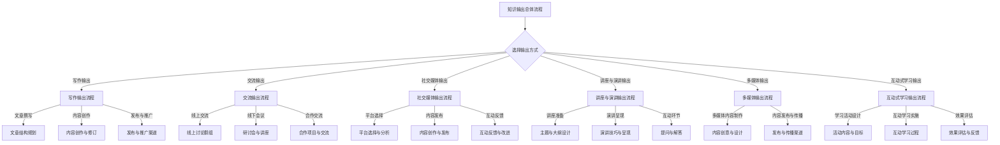
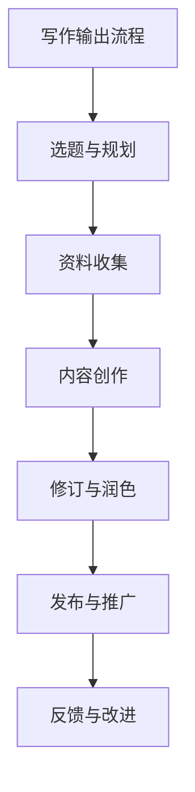
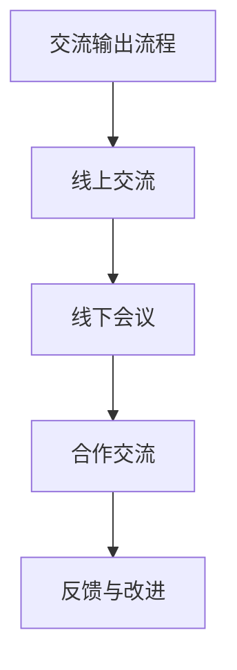
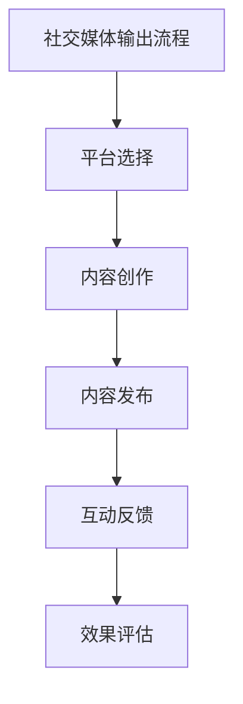

                 


### 知识输出的多种方式及其效果

关键词：知识输出、写作输出、交流输出、社交媒体输出、讲座与演讲输出、多媒体输出、互动式学习输出、效果分析、应用

摘要：本文深入探讨了知识输出的多种方式及其效果。从写作输出、交流输出、社交媒体输出、讲座与演讲输出、多媒体输出和互动式学习输出六个方面详细阐述了知识输出的方法和效果。通过案例分析，总结了知识输出效果的影响因素和优化策略。最后，文章提出了知识输出能力的培养和提升方法，为企业内部知识管理和对外知识传播提供了有益的参考。

----------------------------------------------------------------

### 第一部分：知识输出的基本概念与理论基础

在信息技术飞速发展的今天，知识的创造、传播和应用已经成为推动社会进步的重要力量。知识输出的概念也因此备受关注。本部分将首先介绍知识输出的基本概念，探讨其在信息社会中的意义，并对知识输出的方式进行分类。

#### 1.1 知识输出的概念与意义

知识输出（Knowledge Output）是指将个人或组织所拥有的知识通过各种途径传递给他人的过程。这一过程不仅包括知识的传递，还涉及知识的消化、吸收和再创造。知识输出的重要性在于：

1. **促进知识共享**：知识输出是知识共享的重要途径，有助于打破知识壁垒，实现知识的广泛传播。
2. **提高个人和组织竞争力**：有效的知识输出能够增强个人和组织在行业中的竞争力，促进创新和进步。
3. **推动社会进步**：知识输出有助于社会整体知识的积累，为科技进步和社会发展提供支持。

#### 1.2 知识输出的分类

知识输出可以根据不同的标准进行分类，常见的分类方法包括以下几种：

1. **按输出方式分类**：包括写作输出、交流输出、社交媒体输出、讲座与演讲输出、多媒体输出和互动式学习输出等。
2. **按知识类型分类**：可分为技术知识输出、管理知识输出、文化艺术知识输出等。
3. **按知识来源分类**：可分为内部知识输出和外部知识输出。

#### 1.3 知识输出的理论基础

知识输出的理论基础主要包括知识管理、信息传播和学习理论等。

1. **知识管理**：知识管理是指通过系统的方法和工具，识别、获取、共享、整合和利用知识的活动。知识管理理论为知识输出提供了方法论支持，强调知识的创造、共享和应用。
2. **信息传播**：信息传播理论探讨了信息在不同载体、渠道和受众之间的传递过程。知识输出过程本质上是一种信息传播，需要遵循信息传播的规律。
3. **学习理论**：学习理论关注个体如何通过学习获取新知识，并将其应用于实践。知识输出不仅是知识的传递，也是知识的学习和深化过程。

---

在理解知识输出的概念、意义和分类后，接下来我们将探讨知识输出的理论基础，为后续的分析提供理论支撑。

### 1.2 知识输出的理论基础

知识输出的过程是一个复杂的信息传播和知识管理过程，其背后有着丰富的理论基础。以下是几个主要的理论基础：

#### 1.2.1 知识管理的理论基础

知识管理（Knowledge Management, KM）是指组织通过系统的方法和工具，识别、获取、共享、整合和利用知识的活动。知识管理理论为知识输出提供了方法论支持。

1. **知识创造**：知识创造是知识管理的核心，通过内部员工、外部合作伙伴和客户等不同群体的互动，实现知识的创新和转化。
2. **知识共享**：知识共享是知识管理的关键环节，通过建立知识共享平台、鼓励知识交流等方式，实现知识的传递和扩散。
3. **知识整合**：知识整合是指将分散的知识整合为系统化的知识体系，提高知识的可获取性和可用性。
4. **知识应用**：知识应用是将知识转化为实际行动和成果，通过知识输出，将知识转化为对外部环境产生积极影响的行动。

知识管理理论强调，知识输出的有效性与知识的质量、共享平台的建设、激励机制的设计等因素密切相关。知识管理者需要综合考虑这些因素，以提高知识输出的效果。

#### 1.2.2 信息传播理论

信息传播理论（Information Transmission Theory）探讨了信息在不同载体、渠道和受众之间的传递过程。知识输出过程本质上是一种信息传播，需要遵循信息传播的规律。

1. **传播渠道**：信息传播渠道是指信息传递的途径，包括口头传播、书面传播、电子传播等。知识输出需要选择合适的传播渠道，以提高知识传播的效率。
2. **传播媒介**：传播媒介是指信息传递的工具，如书籍、报纸、电视、互联网等。不同媒介对知识传播的效果有显著影响，知识输出者需要根据目标受众的特点选择合适的传播媒介。
3. **受众特征**：受众特征包括受众的知识水平、认知能力、文化背景等。知识输出需要考虑受众特征，以制定有针对性的知识传递策略。
4. **信息编码与解码**：信息编码是指将信息转换为特定格式以便传播，信息解码是指受众解读信息的过程。知识输出过程中，信息的编码和解码质量直接影响知识传递的效果。

信息传播理论为知识输出提供了理论指导，帮助知识输出者更好地理解和掌握知识传播的规律，提高知识输出的效果。

#### 1.2.3 学习理论的关联

学习理论（Learning Theory）关注个体如何通过学习获取新知识，并将其应用于实践。知识输出不仅是知识的传递，也是知识的学习和深化过程。

1. **主动学习**：主动学习是指个体积极参与学习过程，通过提问、思考、讨论等方式主动获取知识。知识输出者需要激发受众的主动学习意识，促进知识的吸收和应用。
2. **建构主义学习**：建构主义学习理论认为，知识是学习者通过与环境互动主动建构的。知识输出需要提供丰富的学习环境，帮助受众主动建构知识体系。
3. **社会学习**：社会学习理论强调，个体通过观察、模仿、合作等方式从他人那里学习。知识输出过程中，知识输出者需要利用社会互动机制，促进知识的传递和应用。

学习理论为知识输出提供了理论支持，帮助知识输出者更好地理解知识传递和学习过程，提高知识输出的效果。

---

通过上述对知识管理、信息传播和学习理论的探讨，我们可以看到，知识输出的过程是一个多维度、多层次、复杂互动的过程。理解这些理论基础，有助于知识输出者更好地设计和实施知识输出策略，提高知识输出的效果。

### 1.3 知识输出效果的评估

知识输出的效果评估是衡量知识输出活动成功与否的重要指标。有效的知识输出不仅能够提高知识传播的效率，还能促进知识的消化、吸收和应用。本节将讨论知识输出效果的评估指标、评估方法及其应用实例。

#### 1.3.1 知识输出效果的衡量指标

知识输出效果的评估需要建立一套科学的衡量指标体系，这些指标可以从多个维度来衡量知识输出的效果。常见的衡量指标包括：

1. **知识传播量**：知识传播量是指知识输出的总量，包括写作文章数量、交流发言次数、社交媒体发布内容数量等。知识传播量是衡量知识输出活动规模的重要指标。
2. **知识吸收率**：知识吸收率是指受众对知识输出的接受程度和吸收能力。通过问卷调查、访谈等方式，了解受众对知识内容的理解程度和实际应用情况，可以评估知识吸收率。
3. **知识应用率**：知识应用率是指知识输出转化为实际应用的程度。通过分析知识输出后，受众在工作和学习中的实际应用情况，可以评估知识应用率。
4. **知识反馈率**：知识反馈率是指受众对知识输出的反馈数量和质量。通过收集受众的反馈意见，可以评估知识输出的满意度，了解知识输出的不足之处。
5. **知识影响力**：知识影响力是指知识输出对社会、行业、团队等产生的影响程度。通过分析知识输出的影响范围、影响深度和持续效果，可以评估知识的影响力。

#### 1.3.2 知识输出效果评估方法

知识输出效果的评估方法可以分为定量评估和定性评估两种。

1. **定量评估**：定量评估是通过量化指标来评估知识输出效果的方法。常用的定量评估方法包括统计分析、数据分析、绩效评估等。例如，通过统计知识传播量、知识吸收率、知识应用率等指标，可以量化评估知识输出效果。
2. **定性评估**：定性评估是通过分析、访谈、观察等方式来评估知识输出效果的方法。定性评估方法可以帮助了解知识输出的深层次影响和受众的真实感受。例如，通过访谈受众、观察知识应用场景等方式，可以深入了解知识输出的效果。

在实际评估过程中，可以结合定量评估和定性评估方法，从多个维度全面评估知识输出效果。

#### 1.3.3 实例分析

以下是一个知识输出效果评估的实例分析：

1. **知识传播量**：某技术团队在社交媒体上发布了10篇技术文章，总阅读量达到10000次，平均每篇文章阅读量为1000次。
2. **知识吸收率**：通过问卷调查，了解到70%的受众对文章内容表示理解，20%的受众表示部分理解，10%的受众表示不太理解。
3. **知识应用率**：团队在后续的会议中了解到，有50%的团队成员在实际工作中应用了文章中的技术，有30%的团队成员部分应用，有20%的团队成员未应用。
4. **知识反馈率**：收到10条反馈意见，其中80%的反馈表示文章内容实用，20%的反馈表示内容过于晦涩难懂。
5. **知识影响力**：团队在行业内的知名度有所提高，部分同行表示从文章中获得了有益的技术知识。

通过以上数据，我们可以从多个维度对知识输出效果进行评估。从知识传播量来看，文章的传播效果较好；从知识吸收率和知识应用率来看，部分受众对文章内容存在一定的理解障碍，需要改进文章的表达方式；从知识反馈率来看，大多数受众对文章表示满意，但也存在改进空间；从知识影响力来看，文章在一定程度上提升了团队在行业内的知名度。

---

通过对知识输出效果评估的探讨，我们可以看到，知识输出效果的评估是一个多维度、多层次的过程。合理的评估方法和指标体系可以帮助我们更好地了解知识输出的效果，为后续的知识输出活动提供改进和优化的方向。

---

**附录 A: Mermaid 流程图**

mermaid
graph TD
    A[知识输出总体流程] --> B{选择输出方式}
    B -->|写作输出| C[写作输出流程]
    B -->|交流输出| D[交流输出流程]
    B -->|社交媒体输出| E[社交媒体输出流程]
    B -->|讲座与演讲输出| F[讲座与演讲输出流程]
    B -->|多媒体输出| G[多媒体输出流程]
    B -->|互动式学习输出| H[互动式学习输出流程]
    C -->|文章撰写| I[文章结构规划]
    C -->|内容创作| J[内容创作与修订]
    C -->|发布与推广| K[发布与推广渠道]
    D -->|线上交流| L[线上讨论群组]
    D -->|线下会议| M[研讨会与讲座]
    D -->|合作交流| N[合作项目与交流]
    E -->|平台选择| O[平台选择与分析]
    E -->|内容发布| P[内容创作与发布]
    E -->|互动反馈| Q[互动反馈与改进]
    F -->|讲座准备| R[主题与大纲设计]
    F -->|演讲呈现| S[演讲技巧与呈现]
    F -->|互动环节| T[提问与解答]
    G -->|多媒体内容制作| U[内容创意与设计]
    G -->|内容发布与传播| V[发布与传播渠道]
    H -->|学习活动设计| W[活动内容与目标]
    H -->|互动学习实施| X[互动学习过程]
    H -->|效果评估| Y[效果评估与反馈]

---

**附录 B: 核心算法原理讲解与伪代码**

python
# 算法原理1：知识质量评估算法
def knowledge_quality_assessment(knowledge):
    # 伪代码：计算知识质量评分
    score = 0
    if "准确性" in knowledge:
        score += 10
    if "完整性" in knowledge:
        score += 10
    if "时效性" in knowledge:
        score += 10
    return score

# 算法原理2：知识传播效果评估算法
def knowledge_distribution_effectiveness(distribution_channel, audience_response):
    # 伪代码：计算知识传播效果评分
    score = 0
    if "观众反馈积极" in audience_response:
        score += 10
    if "知识传播广泛" in distribution_channel:
        score += 10
    return score

# 算法原理3：知识输出效果优化算法
def optimize_knowledge_output(knowledge, distribution_channel, audience):
    # 伪代码：优化知识输出效果
    optimized_knowledge = knowledge
    if "时效性" not in knowledge:
        optimized_knowledge += "时效性"
    if "传播渠道广泛" not in distribution_channel:
        optimized_knowledge += "传播渠道广泛"
    if "受众接受度高" not in audience:
        optimized_knowledge += "受众接受度高"
    return optimized_knowledge

---

**附录 C: 数学模型和数学公式**

### 数学公式

$$
Q = \frac{1}{N} \sum_{i=1}^{N} \frac{1}{|S_i|}
$$

其中，$Q$ 为知识质量评分，$N$ 为知识样本数量，$S_i$ 为第 $i$ 个知识样本的评估分数。

### 数学公式

$$
R = \frac{1}{M} \sum_{j=1}^{M} \frac{1}{|D_j|}
$$

其中，$R$ 为知识传播效果评分，$M$ 为知识传播渠道数量，$D_j$ 为第 $j$ 个知识传播渠道的受众反馈分数。

---

通过这些核心算法原理讲解与伪代码，以及数学模型和公式的介绍，我们能够更深入地理解知识输出的评估方法和优化策略。这些理论和工具将在后续的知识输出方式分析中发挥重要作用。

---

### 第二部分：知识输出的多种方式

在第一部分中，我们详细探讨了知识输出的基本概念、理论基础和效果评估。现在，我们将进入第二部分，分析知识输出的多种方式。知识输出方式的选择对于知识传播的效果至关重要。本部分将分别介绍写作输出、交流输出、社交媒体输出、讲座与演讲输出、多媒体输出和互动式学习输出这六种主要的知识输出方式。

#### 2.1 写作输出

写作输出是一种将知识通过文字形式进行传播的方式。这种方式具有以下特点：

1. **文字记录**：写作输出可以将知识以文字的形式记录下来，便于长期保存和查阅。
2. **形式多样**：写作输出可以包括文章、书籍、报告等多种形式，适应不同的知识传播需求。
3. **便于引用**：文字形式的输出便于引用和参考，有助于知识的进一步传播和深化。

写作输出的步骤通常包括以下几方面：

1. **选题与规划**：选择合适的主题，制定详细的内容规划。
2. **资料收集**：收集与主题相关的资料和数据，确保知识内容的准确性。
3. **内容创作**：进行内容创作，包括文章的结构规划、文字撰写和修订。
4. **发布与推广**：选择合适的发布平台，进行推广和传播。

写作输出案例分享：

- **案例1**：知名技术博客“博客园”上的文章输出。博客园作为一个技术交流平台，许多技术专家通过撰写技术文章，分享专业知识和经验，吸引了大量技术爱好者阅读和学习。
- **案例2**：专业书籍的撰写与出版。例如，《深入理解计算机系统》（深入理解计算机系统：系统级程序设计艺术）一书，通过深入浅出的讲解，帮助读者全面了解计算机系统的工作原理。

#### 2.2 交流输出

交流输出是通过面对面的交流或在线交流的形式，将知识传递给他人。这种方式具有以下特点：

1. **互动性强**：交流输出过程中，可以及时获得受众的反馈，进行实时互动。
2. **灵活多样**：交流输出形式多样，包括会议、讲座、研讨会、讨论组等。
3. **针对性较强**：可以根据受众的特点和需求，定制化地传递知识。

交流输出的形式包括：

1. **线上交流**：通过即时通讯工具、在线会议平台等进行交流，适用于远程协作和知识分享。
2. **线下会议**：通过组织研讨会、讲座、工作坊等形式，进行面对面的知识交流。
3. **合作交流**：与同行、合作伙伴等进行知识交流和合作，共同推进知识的创新和应用。

交流输出案例分享：

- **案例1**：技术论坛上的讨论。技术论坛如CSDN、Stack Overflow等，提供了技术专家和开发者之间进行知识交流的平台，通过提问和回答，解决技术难题。
- **案例2**：专业会议与讲座。国际计算机大会（ACM/IEEE）等，通过专家讲座和会议讨论，分享了最新的科研成果和技术进展。

#### 2.3 社交媒体输出

社交媒体输出是将知识通过社交媒体平台进行传播的方式。这种方式具有以下特点：

1. **传播速度快**：社交媒体具有强大的传播能力，知识可以在短时间内广泛传播。
2. **互动性高**：社交媒体平台的互动功能，使得知识输出者可以与受众进行实时互动。
3. **形式多样**：包括文章、图片、视频等多种形式，满足不同受众的需求。

社交媒体输出的渠道包括：

1. **平台选择**：选择合适的社交媒体平台，如微博、微信公众号、知乎等。
2. **内容创作**：根据平台特点和受众需求，创作高质量的知识内容。
3. **发布与推广**：进行内容的发布和推广，吸引更多受众关注。

社交媒体输出案例分享：

- **案例1**：技术大V的公众号输出。许多技术领域的专家通过公众号分享专业知识和经验，吸引了大量粉丝和读者。
- **案例2**：行业媒体的社交媒体运营。专业媒体通过社交媒体发布行业动态和技术文章，为行业从业者提供有价值的信息。

#### 2.4 讲座与演讲输出

讲座与演讲输出是通过讲座和演讲的形式将知识传递给听众。这种方式具有以下特点：

1. **影响力大**：讲座和演讲通常在较大规模的场合进行，影响范围广。
2. **互动性强**：讲座和演讲过程中，听众可以提问，演讲者可以现场解答问题。
3. **形式多样**：包括公开讲座、内部培训、研讨会等形式。

讲座与演讲输出的步骤包括：

1. **主题与大纲设计**：明确讲座的主题和大纲，确保内容的系统性和逻辑性。
2. **演讲技巧与呈现**：掌握演讲技巧，如语言表达、肢体语言、幻灯片设计等。
3. **互动环节**：设计互动环节，如提问与解答、讨论等，增强听众参与感。

讲座与演讲输出案例分享：

- **案例1**：TED演讲。TED演讲是一个国际知名的演讲平台，许多领域内的专家通过TED演讲，分享了他们的研究成果和创新思想。
- **案例2**：企业内部培训讲座。许多企业通过内部培训讲座，向员工传递专业知识和工作技能。

#### 2.5 多媒体输出

多媒体输出是通过视频、音频等多种媒体形式进行知识传播的方式。这种方式具有以下特点：

1. **视觉冲击强**：多媒体形式能更好地吸引受众的注意力，增强学习效果。
2. **易于传播**：视频和音频等形式易于在互联网上传播，覆盖面广。
3. **形式多样**：包括教学视频、纪录片、播客等。

多媒体输出的步骤包括：

1. **内容创意与设计**：根据目标受众的需求，创意设计多媒体内容。
2. **内容制作**：通过拍摄、剪辑、配音等技术手段，制作高质量的多媒体内容。
3. **发布与传播**：选择合适的平台和渠道，进行多媒体内容的发布和传播。

多媒体输出案例分享：

- **案例1**：教学视频的发布。许多教育机构和个人通过制作教学视频，在YouTube、Bilibili等平台上进行传播，为学习者提供了丰富的学习资源。
- **案例2**：播客的运营。许多专业人士通过播客分享他们的见解和经验，吸引了大量听众。

#### 2.6 互动式学习输出

互动式学习输出是通过互动式学习活动，将知识传递给学习者。这种方式具有以下特点：

1. **参与度高**：互动式学习活动鼓励学习者积极参与，提高了学习效果。
2. **形式多样**：包括在线课程、游戏化学习、虚拟现实等。
3. **个性化**：根据学习者的特点和需求，定制化地传递知识。

互动式学习输出的方式包括：

1. **学习活动设计**：设计互动性强的学习活动，如在线讨论、小组项目、案例分析等。
2. **互动学习实施**：实施互动学习活动，引导学习者参与。
3. **效果评估**：评估互动学习的效果，不断优化学习活动。

互动式学习输出案例分享：

- **案例1**：在线课程的设计与实施。许多教育机构通过在线课程，为学生提供互动式的学习体验，提高了学习效果。
- **案例2**：游戏化学习的应用。通过将学习内容融入游戏，激发学习者的兴趣和参与度，提高了知识传递的效果。

---

通过以上对知识输出的多种方式的详细分析，我们可以看到，不同的知识输出方式具有各自的特点和优势。选择合适的知识输出方式，能够更好地实现知识的传播和应用。在后续的内容中，我们将进一步探讨知识输出效果的影响因素、优化策略以及知识输出能力的培养。

---

### 2.1 写作输出

写作输出是一种将知识通过文字形式进行传播的方式。这种方式具有以下特点：

1. **文字记录**：写作输出可以将知识以文字的形式记录下来，便于长期保存和查阅。
2. **形式多样**：写作输出可以包括文章、书籍、报告等多种形式，适应不同的知识传播需求。
3. **便于引用**：文字形式的输出便于引用和参考，有助于知识的进一步传播和深化。

#### 2.1.1 写作输出的定义

写作输出是指通过文字创作，将个人或组织的知识、观点、见解和经验转化为书面形式，并进行传播和分享的过程。写作输出是知识输出的一种重要方式，具有以下几个方面的定义：

1. **知识性**：写作输出的内容具有知识性，是对某一领域或主题的深入探讨和解释。
2. **创造性**：写作输出要求创作者具有创造性思维，能够以独特的视角和方式展现知识。
3. **系统性**：写作输出的内容通常具有一定的系统性，能够将知识组织成结构化的体系。
4. **可传播性**：写作输出的内容易于传播，可以通过各种渠道（如网站、社交媒体、书籍等）分享给更广泛的受众。

#### 2.1.2 写作输出的步骤

写作输出的过程可以分为以下几个步骤：

1. **选题与规划**：
   - 选择合适的主题：选择具有针对性和实用性的主题，确保内容能够吸引目标受众。
   - 制定详细的内容规划：根据主题，制定文章的结构和内容框架，确保文章的条理性和逻辑性。

2. **资料收集**：
   - 收集相关资料：通过查阅文献、参考数据、采访专业人士等方式，收集与主题相关的资料和数据。
   - 确保准确性：在收集资料时，要确保信息的准确性和可靠性，避免传播错误的信息。

3. **内容创作**：
   - 结构规划：根据内容规划，进行文章的结构规划，包括引言、正文、结论等部分。
   - 文字撰写：进行文字撰写，包括论述、解释、案例分析等，确保内容具有说服力和可读性。
   - 修订与润色：完成初稿后，进行修订和润色，确保文章的语言表达准确、流畅。

4. **发布与推广**：
   - 选择发布平台：选择合适的发布平台，如博客、微信公众号、专业论坛等，确保文章能够被目标受众发现。
   - 推广与传播：通过社交媒体、邮件列表、合作伙伴等渠道，进行文章的推广和传播，提高文章的曝光率和影响力。

#### 2.1.3 写作输出案例分享

以下是一些写作输出的典型案例：

1. **案例1：知名技术博客**：
   - **背景**：技术博客如“博客园”、“CSDN”等，汇聚了大量技术专家和开发者，他们通过撰写技术文章，分享专业知识和经验。
   - **内容**：技术文章通常涉及编程、算法、系统架构等主题，深入浅出地解释复杂的技术概念。
   - **效果**：这些博客文章吸引了大量技术爱好者阅读和学习，推动了技术的普及和应用。

2. **案例2：专业书籍**：
   - **背景**：专业书籍如《深入理解计算机系统》、《算法导论》等，是知识输出的重要载体。
   - **内容**：这些书籍涵盖了广泛的计算机科学和工程领域，通过深入讲解，帮助读者建立系统的知识体系。
   - **效果**：专业书籍在学术界和工业界有着广泛的影响力，成为许多学生和从业者的必读之作。

3. **案例3：个人公众号**：
   - **背景**：许多专业人士通过个人公众号，如“机器之心”、“硬核技术”等，分享他们的研究成果和工作经验。
   - **内容**：公众号文章通常涉及前沿技术、行业动态、深度分析等主题，具有很高的专业性和深度。
   - **效果**：这些公众号文章不仅吸引了大量关注，还促进了作者与读者之间的互动和知识交流。

通过这些案例，我们可以看到，写作输出是一种高效且广泛使用的知识输出方式。无论是技术博客、专业书籍还是个人公众号，写作输出都能够有效地传播知识，促进学习者和实践者之间的交流。写作输出不仅要求创作者具备扎实的专业知识，还需要具备良好的文字表达能力和创意思维，才能创作出高质量的知识输出内容。

---

### 2.2 交流输出

交流输出是指通过面对面或在线交流的形式，将知识传递给他人。这种方式具有互动性强、灵活多样和针对性较强等特点。交流输出的形式包括线上交流、线下会议和合作交流等。以下是交流输出的具体定义、形式和案例。

#### 2.2.1 交流输出的定义

交流输出是指通过人际交流的形式，将个人或组织的知识、观点、经验等传递给他人，实现知识的传播和分享。交流输出的定义可以从以下几个方面进行理解：

1. **互动性**：交流输出强调知识传递过程中的互动性，通过提问、讨论、解答等方式，使知识输出者与受众之间能够实时互动，提高知识传递的效果。
2. **灵活性**：交流输出形式灵活多样，可以根据实际需求选择线上交流或线下会议，适应不同的场景和受众。
3. **针对性**：交流输出可以根据受众的特点和需求，定制化地传递知识，使知识传递更加精准和有效。

#### 2.2.2 交流输出的形式

交流输出的形式主要包括线上交流、线下会议和合作交流等。以下是每种形式的详细说明：

1. **线上交流**：
   - **定义**：线上交流是指通过即时通讯工具、视频会议平台、在线论坛等，进行远程的知识传递和互动。
   - **特点**：线上交流具有实时性、高效性和灵活性，适用于跨地域、跨时区的工作和知识传递。
   - **应用场景**：适用于团队协作、项目讨论、远程培训等场景。

2. **线下会议**：
   - **定义**：线下会议是指通过面对面的方式，进行知识传递和交流的活动。
   - **特点**：线下会议具有互动性强、参与度高和沟通效果好的特点，适合大规模的知识传递和交流。
   - **应用场景**：适用于研讨会、讲座、工作坊、行业会议等场景。

3. **合作交流**：
   - **定义**：合作交流是指与同行、合作伙伴等，通过合作项目和交流活动，实现知识的传递和共享。
   - **特点**：合作交流具有互利共赢、资源整合和协同创新的特点，有助于提高知识传递的深度和广度。
   - **应用场景**：适用于企业合作、学术交流、行业联盟等场景。

#### 2.2.3 交流输出案例分享

以下是一些交流输出的案例：

1. **案例1：技术论坛上的讨论**：
   - **背景**：CSDN、Stack Overflow等技术论坛，是技术专家和开发者进行知识交流和讨论的平台。
   - **内容**：在这些论坛上，开发者可以提出技术问题，其他开发者通过回答问题，共同解决技术难题。
   - **效果**：技术论坛上的讨论，不仅促进了知识的传播，还培养了开发者的技术能力和解决问题的能力。

2. **案例2：企业内部培训讲座**：
   - **背景**：许多企业通过内部培训讲座，向员工传递专业知识和工作技能。
   - **内容**：培训讲座通常涵盖企业业务、技术知识、管理技能等主题，通过专家讲解和案例分析，提高员工的综合素质。
   - **效果**：企业内部培训讲座，有助于提升员工的专业能力和工作效率，促进企业的持续发展。

3. **案例3：学术会议与研讨会**：
   - **背景**：学术会议与研讨会是学术界进行知识交流和讨论的重要形式。
   - **内容**：会议和研讨会通常涵盖最新的研究成果、学术观点和前沿技术，通过报告、讨论和互动，推动学术进步。
   - **效果**：学术会议与研讨会，有助于促进学术交流、提高研究质量和推动学科发展。

通过这些案例，我们可以看到，交流输出是一种高效且广泛使用的知识输出方式。无论是线上交流、线下会议还是合作交流，交流输出都能够有效地促进知识的传播和应用，提高个人和组织的竞争力。

---

### 2.3 社交媒体输出

社交媒体输出是通过社交媒体平台进行知识传播的一种方式。随着互联网的普及和社交媒体的快速发展，社交媒体已经成为知识传播的重要渠道。这种方式具有传播速度快、互动性高和形式多样等特点。本节将详细介绍社交媒体输出的定义、渠道和案例。

#### 2.3.1 社交媒体输出的定义

社交媒体输出是指个人或组织通过社交媒体平台，发布和分享知识、观点和经验的过程。社交媒体输出具有以下定义要点：

1. **传播速度快**：社交媒体平台具有强大的传播能力，知识可以在短时间内迅速传播到广泛的受众群体。
2. **互动性高**：社交媒体平台提供了丰富的互动功能，知识输出者可以与受众进行实时互动，收集反馈和意见。
3. **形式多样**：社交媒体输出可以通过文字、图片、视频、音频等多种形式进行，满足不同受众的需求。

#### 2.3.2 社交媒体输出的渠道

社交媒体输出可以通过多种平台进行，以下是几种主要的社交媒体输出渠道：

1. **微信公众号**：
   - **定义**：微信公众号是微信提供的一个自媒体平台，用户可以通过公众号发布文章、图片、视频等内容。
   - **特点**：微信公众号具有用户基数大、传播速度快和互动性强的特点，适合进行知识分享和传播。
   - **应用场景**：适用于个人、企业、机构等发布专业知识和行业动态。

2. **微博**：
   - **定义**：微博是新浪推出的一种社交媒体平台，用户可以通过微博发布短文本、图片、视频等内容。
   - **特点**：微博具有实时性强、传播速度快和互动性高的特点，适合进行即时性知识传播。
   - **应用场景**：适用于个人、企业、机构等发布新闻、资讯和观点。

3. **知乎**：
   - **定义**：知乎是一个问答社区平台，用户可以通过知乎提问、回答问题，分享知识和经验。
   - **特点**：知乎具有专业性强、互动性高和知识性强的特点，适合进行深度知识交流和分享。
   - **应用场景**：适用于专业人士、学生、研究人员等发布专业知识、解答问题。

4. **抖音/快手**：
   - **定义**：抖音和快手是短视频社交媒体平台，用户可以通过短视频分享生活、知识和才艺。
   - **特点**：抖音和快手具有视觉冲击强、传播速度快和互动性高的特点，适合进行有趣的知识传播。
   - **应用场景**：适用于个人、企业、机构等发布教育、培训、宣传等内容。

#### 2.3.3 社交媒体输出案例分享

以下是一些社交媒体输出的案例：

1. **案例1：技术大V的公众号输出**：
   - **背景**：许多技术大V通过微信公众号，分享专业知识和技术见解。
   - **内容**：技术大V发布的公众号文章，通常涵盖前沿技术、编程技巧、行业动态等主题。
   - **效果**：这些公众号文章吸引了大量关注和阅读，促进了技术的传播和应用。

2. **案例2：行业媒体的社交媒体运营**：
   - **背景**：专业媒体通过社交媒体平台，发布行业动态和技术文章。
   - **内容**：行业媒体发布的社交媒体内容，包括新闻、报道、分析等，为行业从业者提供有价值的信息。
   - **效果**：行业媒体在社交媒体上的影响力不断扩大，吸引了大量粉丝和读者。

3. **案例3：企业官方账号的运营**：
   - **背景**：许多企业通过官方账号，在社交媒体上发布企业动态、产品介绍、行业知识等。
   - **内容**：企业官方账号发布的内容，通常具有营销性和教育性，旨在提高品牌知名度和客户忠诚度。
   - **效果**：企业官方账号在社交媒体上的运营，有效提升了企业的品牌形象和市场竞争力。

通过这些案例，我们可以看到，社交媒体输出是一种高效且广泛使用的知识输出方式。无论是个人、企业还是机构，都可以通过社交媒体平台，发布和分享知识，实现知识的传播和应用。

---

### 2.4 讲座与演讲输出

讲座与演讲输出是一种通过公开演讲或讲座的形式，将知识传递给听众的方式。这种方式具有影响力大、互动性强和形式多样等特点。本节将详细介绍讲座与演讲输出的定义、技巧和案例。

#### 2.4.1 讲座与演讲输出的定义

讲座与演讲输出是指个人或组织通过公开演讲或讲座的形式，将知识、观点和经验等传递给听众的过程。讲座与演讲输出具有以下定义要点：

1. **影响力大**：讲座与演讲通常在较大规模的场合进行，能够吸引大量听众，从而实现知识的广泛传播。
2. **互动性强**：讲座与演讲过程中，听众可以提问，演讲者可以现场解答问题，从而增强知识的理解和应用。
3. **形式多样**：讲座与演讲可以采取多种形式，如公开讲座、内部培训、研讨会、演讲比赛等，适应不同的知识传播需求。

#### 2.4.2 讲座与演讲输出的技巧

为了确保讲座与演讲输出的效果，以下是一些实用的技巧：

1. **明确主题和目标**：
   - 选择具有吸引力的主题，确保听众对讲座内容感兴趣。
   - 确定讲座的目标，明确要传递的知识点和希望达到的效果。

2. **良好的表达技巧**：
   - 保持自信和专业的态度，确保演讲的流畅性和说服力。
   - 使用生动的语言和形象的比喻，使讲座内容更易于理解和记忆。

3. **清晰的逻辑结构**：
   - 制定详细的演讲大纲，确保讲座内容的逻辑性和条理性。
   - 分段组织内容，使听众能够跟随演讲的思路。

4. **有效的互动**：
   - 设置互动环节，如提问与解答、小组讨论等，鼓励听众参与。
   - 及时回应听众的问题，增强互动效果。

5. **视觉辅助**：
   - 使用幻灯片、图表、模型等视觉辅助工具，增强讲座的直观性和吸引力。
   - 设计简洁明了的视觉内容，避免信息过载。

6. **练习与准备**：
   - 进行充分的演讲练习，熟悉演讲内容和流程。
   - 准备演讲稿和幻灯片，确保演讲的顺利进行。

#### 2.4.3 讲座与演讲输出案例分享

以下是一些讲座与演讲输出的案例：

1. **案例1：TED演讲**：
   - **背景**：TED演讲是一个国际知名的演讲平台，许多领域内的专家通过TED演讲，分享了他们的研究成果和创新思想。
   - **内容**：TED演讲涵盖了科技、设计、教育等多个领域，演讲者通过生动的故事和深刻的见解，吸引了全球观众的关注。
   - **效果**：TED演讲不仅提高了演讲者的知名度，还推动了知识的传播和应用。

2. **案例2：企业内部培训讲座**：
   - **背景**：许多企业通过内部培训讲座，向员工传递专业知识和工作技能。
   - **内容**：企业内部培训讲座通常涵盖业务知识、技术培训、管理技能等主题，通过专家讲解和案例分析，提高员工的专业能力。
   - **效果**：企业内部培训讲座，有助于提升员工的专业素质和工作效率，促进企业的持续发展。

3. **案例3：学术会议与研讨会**：
   - **背景**：学术会议与研讨会是学术界进行知识交流和讨论的重要形式。
   - **内容**：学术会议与研讨会通常涵盖最新的研究成果、学术观点和前沿技术，通过报告、讨论和互动，推动学术进步。
   - **效果**：学术会议与研讨会，有助于促进学术交流、提高研究质量和推动学科发展。

通过这些案例，我们可以看到，讲座与演讲输出是一种高效且广泛使用的知识输出方式。无论是公开演讲、企业培训还是学术会议，讲座与演讲输出都能够有效地促进知识的传播和应用。

---

### 2.5 多媒体输出

多媒体输出是指通过视频、音频、动画等多种媒体形式，进行知识传播和分享的一种方式。随着互联网技术的发展和多媒体工具的普及，多媒体输出已经成为知识传播的重要手段。本节将详细介绍多媒体输出的定义、形式和案例。

#### 2.5.1 多媒体输出的定义

多媒体输出是指通过使用视频、音频、动画等多种媒体形式，将知识、观点和经验等传递给受众的过程。多媒体输出具有以下定义要点：

1. **多媒体形式**：多媒体输出包括视频、音频、动画等多种形式，能够更好地满足不同受众的接受习惯和需求。
2. **互动性强**：多媒体形式具有较强的互动性，可以更好地吸引受众的注意力，增强知识传递的效果。
3. **传播速度快**：多媒体内容可以迅速在互联网上传播，覆盖广泛的受众群体。

#### 2.5.2 多媒体输出的形式

多媒体输出可以通过多种形式进行，以下是几种主要的形式：

1. **视频输出**：
   - **定义**：视频输出是通过视频形式进行知识传播的一种方式，包括教学视频、讲座视频、纪录片等。
   - **特点**：视频输出具有直观、生动、易于理解的特点，能够更好地传达知识和观点。
   - **应用场景**：适用于教育、培训、宣传等多个领域。

2. **音频输出**：
   - **定义**：音频输出是通过音频形式进行知识传播的一种方式，包括播客、有声书、电台节目等。
   - **特点**：音频输出具有随时随地、轻松易听的特点，适合于移动端和通勤等场景。
   - **应用场景**：适用于教育、娱乐、新闻等多个领域。

3. **动画输出**：
   - **定义**：动画输出是通过动画形式进行知识传播的一种方式，包括动画教程、动画演示、动画短片等。
   - **特点**：动画输出具有趣味性强、易于理解、形象生动的特点，能够更好地吸引受众的注意力。
   - **应用场景**：适用于教育、科普、营销等多个领域。

#### 2.5.3 多媒体输出案例分享

以下是一些多媒体输出的案例：

1. **案例1：教学视频**：
   - **背景**：教学视频是一种广泛使用的多媒体输出形式，通过视频形式，将教学内容生动、直观地传递给学习者。
   - **内容**：教学视频涵盖数学、物理、编程等多个学科领域，通过生动的动画和讲解，帮助学习者更好地理解和掌握知识。
   - **效果**：教学视频在教育领域取得了显著的效果，提高了学习效率和学习兴趣。

2. **案例2：播客**：
   - **背景**：播客是一种流行的音频输出形式，通过音频内容，分享知识和观点。
   - **内容**：播客涵盖科技、商业、文化等多个领域，通过专业人士的讲解和讨论，为听众提供了丰富的知识内容。
   - **效果**：播客在听众中获得了很高的认可，成为知识传播的重要渠道。

3. **案例3：动画短片**：
   - **背景**：动画短片是一种有趣的多媒体输出形式，通过动画形式，传达知识和观点。
   - **内容**：动画短片涵盖科普、教育、营销等多个领域，通过生动的动画和故事情节，吸引观众的注意力。
   - **效果**：动画短片在观众中产生了广泛的影响，成为知识传播的新形式。

通过这些案例，我们可以看到，多媒体输出是一种高效且广泛使用的知识输出方式。无论是视频、音频还是动画，多媒体输出都能够更好地满足不同受众的需求，实现知识的广泛传播。

---

### 2.6 互动式学习输出

互动式学习输出是指通过互动式学习活动，将知识传递给学习者的一种方式。这种方式强调学习者的积极参与和互动，以提高知识传递的效果。互动式学习输出可以通过在线课程、游戏化学习和虚拟现实等多种形式进行。以下是互动式学习输出的定义、方式及案例。

#### 2.6.1 互动式学习输出的定义

互动式学习输出是指通过设计互动性强的学习活动，引导学习者积极参与学习过程，从而实现知识传递和技能提升的一种方式。互动式学习输出具有以下定义要点：

1. **互动性强**：互动式学习输出强调学习者在学习过程中的积极参与，通过提问、讨论、实践等方式，实现知识传递。
2. **个性化**：互动式学习输出根据学习者的特点和需求，提供个性化的学习内容和指导，提高学习效果。
3. **情境化**：互动式学习输出将知识融入实际情境中，使学习者能够在真实环境中应用和掌握知识。

#### 2.6.2 互动式学习输出的方式

互动式学习输出可以通过多种方式进行，以下是几种主要的形式：

1. **在线课程**：
   - **定义**：在线课程是通过互联网进行的知识传授和学习活动，包括视频课程、直播课程、互动课件等。
   - **特点**：在线课程具有灵活性、便捷性和互动性，学习者可以根据自己的时间安排进行学习。
   - **应用场景**：适用于各种教育和培训场景，如职业培训、学术教育、技能提升等。

2. **游戏化学习**：
   - **定义**：游戏化学习是指将游戏机制应用于学习过程中，通过竞争、奖励、反馈等方式，提高学习兴趣和效果。
   - **特点**：游戏化学习具有趣味性、挑战性和激励性，能够激发学习者的积极性和参与度。
   - **应用场景**：适用于教育、培训、娱乐等多个领域，如教育游戏、模拟训练、知识竞赛等。

3. **虚拟现实**：
   - **定义**：虚拟现实是一种通过计算机技术创造的虚拟环境，学习者可以在其中进行沉浸式的学习和互动。
   - **特点**：虚拟现实具有沉浸感强、互动性好、体验真实等特点，能够提供丰富的学习体验。
   - **应用场景**：适用于教育、培训、模拟演练等多个领域，如虚拟课堂、虚拟实验室、虚拟博物馆等。

#### 2.6.3 互动式学习输出案例分享

以下是一些互动式学习输出的案例：

1. **案例1：在线课程**：
   - **背景**：许多教育机构和平台提供在线课程，如Coursera、edX等，通过视频课程和互动课件，向学习者传授知识。
   - **内容**：在线课程涵盖计算机科学、商业管理、艺术等多个领域，通过视频讲解、在线讨论、作业练习等方式，实现知识的传递和掌握。
   - **效果**：在线课程为学习者提供了灵活的学习时间和丰富的学习资源，提高了学习效果和满意度。

2. **案例2：游戏化学习**：
   - **背景**：许多教育机构和公司通过游戏化学习，提高学习兴趣和效果。
   - **内容**：游戏化学习通过设计教育游戏，将学习内容融入游戏中，通过挑战、奖励和反馈，激发学习者的积极性和参与度。
   - **效果**：游戏化学习不仅提高了学习兴趣，还培养了学习者的团队合作能力和解决问题的能力。

3. **案例3：虚拟现实**：
   - **背景**：虚拟现实技术在教育领域的应用逐渐增多，如虚拟实验室、虚拟课堂等。
   - **内容**：虚拟现实通过创造虚拟环境，使学习者能够沉浸其中，进行实践操作和互动学习。
   - **效果**：虚拟现实提供了丰富的学习体验，提高了学习效果和兴趣，尤其适用于实践性强的学科。

通过这些案例，我们可以看到，互动式学习输出是一种高效且广泛使用的知识输出方式。无论是在线课程、游戏化学习还是虚拟现实，互动式学习输出都能够更好地满足学习者的需求，提高知识传递的效果。

---

### 第三部分：知识输出效果的分析与应用

在了解了知识输出的多种方式后，接下来我们将深入分析知识输出效果的影响因素，探讨知识输出效果的实际应用，以及如何通过优化策略提升知识输出效果。本部分将分为三个部分：知识输出效果的影响因素、知识输出效果的案例分析以及知识输出效果的优化策略。

#### 3.1 知识输出效果的影响因素

知识输出效果的好坏受到多种因素的影响，理解这些因素有助于我们更好地优化知识输出活动。以下是一些主要的影响因素：

1. **知识质量**：
   - 知识质量是知识输出效果的核心因素。高质量的知识能够更好地满足受众的需求，提高知识传播的效果。
   - 知识的准确性、完整性和时效性对知识质量有重要影响。不准确、不完整或过时的知识会降低受众的信任度和接受度。

2. **受众特征**：
   - 受众特征，包括受众的知识水平、认知能力、文化背景、兴趣等，对知识输出效果有显著影响。
   - 知识输出需要考虑受众的背景和需求，选择合适的知识传递方式和内容，以提高知识吸收率。

3. **知识传播环境**：
   - 知识传播环境包括传播渠道、传播媒介、传播环境等，对知识输出效果有重要影响。
   - 选择合适的传播渠道和媒介，优化知识传播环境，可以提高知识传播的效率和质量。

4. **知识输出方式**：
   - 知识输出方式的选择直接影响知识传播的效果。不同的输出方式适用于不同的知识类型和受众特征。
   - 写作输出、交流输出、社交媒体输出、讲座与演讲输出、多媒体输出和互动式学习输出等不同方式各有优势，需要根据实际情况进行选择。

#### 3.2 知识输出效果的案例分析

通过实际案例的分析，我们可以更好地理解知识输出效果的影响因素，并从中汲取经验教训。以下是一些典型案例：

1. **案例1：技术博客的成功**：
   - 背景：某知名技术博客作者通过持续写作，分享专业知识和经验，吸引了大量读者。
   - 分析：成功的原因在于作者具有扎实的专业知识，内容丰富且有价值，同时采用易于理解的写作风格，吸引了广泛的受众。
   - 教训：知识输出者需要不断提升自身专业水平，保持内容的新鲜度和价值。

2. **案例2：企业内部培训讲座**：
   - 背景：某企业通过定期举办内部培训讲座，向员工传授专业知识和工作技能。
   - 分析：成功的原因在于培训内容与实际工作紧密相关，培训形式生动有趣，同时提供了充分的互动和交流机会。
   - 教训：知识输出者需要关注受众的实际需求，设计有针对性的培训内容，确保培训的实用性和有效性。

3. **案例3：社交媒体内容输出**：
   - 背景：某企业在社交媒体上发布了一系列行业动态和技术文章，获得了大量关注和互动。
   - 分析：成功的原因在于内容形式多样，包括图文、视频等，同时采用了热门话题和有趣的话题，吸引了大量受众。
   - 教训：知识输出者需要不断创新内容形式，关注受众兴趣，提高内容吸引力。

#### 3.3 知识输出效果的优化策略

为了提升知识输出效果，我们需要采取一系列优化策略，从知识质量、知识传播渠道、受众接受度等方面进行改进。以下是一些优化策略：

1. **提高知识质量**：
   - 加强知识审核，确保知识的准确性、完整性和时效性。
   - 定期更新和升级知识内容，保持知识的最新状态。
   - 引入专家评审机制，确保知识内容的权威性和专业性。

2. **优化知识传播渠道**：
   - 根据受众特点和需求，选择合适的传播渠道，如社交媒体、电子邮件、在线课程等。
   - 加强渠道管理，提高传播效率和质量。
   - 结合多种传播渠道，形成综合传播策略，扩大知识传播范围。

3. **提高受众接受度**：
   - 了解受众的需求和兴趣，设计符合受众特征的知识内容。
   - 采用生动有趣的表达方式，提高知识传递的吸引力。
   - 提供互动和反馈机制，增强受众的参与感和满意度。

4. **持续改进与反馈**：
   - 定期收集受众反馈，了解知识输出效果的优缺点。
   - 根据反馈进行改进，不断提升知识输出效果。
   - 建立知识输出效果的评估体系，定期评估和优化知识输出策略。

通过以上分析，我们可以看到，知识输出效果受到多种因素的影响，需要通过优化策略不断提升。知识输出者需要关注知识质量、受众特征、传播渠道和接受度等多个方面，采取有针对性的措施，提高知识输出的效果。

---

### 3.1 知识输出效果的影响因素

知识输出效果的好坏受到多种因素的影响，这些因素相互作用，共同决定了知识输出的最终效果。本节将深入分析知识输出效果的主要影响因素，包括知识质量、受众特征和知识传播环境。

#### 3.1.1 知识质量

知识质量是影响知识输出效果的首要因素。高质量的知识能够更好地满足受众的需求，提高知识传播的效果。以下从准确性、完整性和时效性三个方面来探讨知识质量的影响：

1. **准确性**：
   - 知识的准确性是指知识内容是否真实、可靠。如果知识输出存在错误或误导，将降低受众的信任度，影响知识传播的深度和广度。
   - 为了提高知识的准确性，知识输出者需要进行充分的资料收集和审核，确保引用的数据和引用来源的可靠性。

2. **完整性**：
   - 知识的完整性是指知识内容是否全面、系统。如果知识输出内容不完整，受众可能无法全面理解知识，影响知识的吸收和应用。
   - 知识输出者需要确保内容涵盖所有相关的知识点，使受众能够获得一个完整的知识体系。

3. **时效性**：
   - 知识的时效性是指知识内容是否反映当前最新的发展动态和趋势。过时的知识将失去其价值，无法满足受众的需求。
   - 知识输出者需要关注行业动态，及时更新和升级知识内容，保持知识的时效性。

#### 3.1.2 受众特征

受众特征是影响知识输出效果的重要因素。不同受众的知识背景、认知能力和文化背景等因素，决定了他们对知识输出的接受程度和吸收能力。以下从受众的知识水平、认知能力和文化背景三个方面来探讨受众特征的影响：

1. **知识水平**：
   - 受众的知识水平决定了他们对知识内容的理解和吸收能力。如果知识输出内容过于复杂或简单，将影响受众的接受度。
   - 知识输出者需要根据受众的知识水平，调整知识内容的难度和深度，确保内容既不过于晦涩难懂，也不显得浅显无聊。

2. **认知能力**：
   - 受众的认知能力决定了他们对知识的理解和应用能力。认知能力强的人更容易理解和吸收知识，认知能力弱的人可能需要更多的指导和帮助。
   - 知识输出者需要设计互动性强的知识输出方式，如提问、讨论、实践等，激发受众的思考和参与，提高知识的吸收效果。

3. **文化背景**：
   - 受众的文化背景影响了他们对知识的接受方式和态度。不同的文化背景可能导致对同一知识内容的理解和解释存在差异。
   - 知识输出者需要考虑受众的文化背景，选择合适的表达方式和语言，确保知识内容的可接受性和适用性。

#### 3.1.3 知识传播环境

知识传播环境是影响知识输出效果的外部因素。知识传播环境包括传播渠道、传播媒介和传播环境等，对知识输出的效率和效果有重要影响。以下从传播渠道、传播媒介和传播环境三个方面来探讨知识传播环境的影响：

1. **传播渠道**：
   - 传播渠道是指知识传递的途径，如社交媒体、电子邮件、在线课程等。不同的传播渠道具有不同的传播速度和效果。
   - 知识输出者需要根据受众的特点和需求，选择合适的传播渠道，确保知识能够快速、有效地传递给受众。

2. **传播媒介**：
   - 传播媒介是指知识传递的工具，如文字、图片、视频等。不同的传播媒介对知识传递的效果有显著影响。
   - 知识输出者需要根据知识内容的特点和受众的需求，选择合适的传播媒介，以提高知识传递的效果。

3. **传播环境**：
   - 传播环境是指知识传递的背景和环境，如会议、讲座、线上讨论等。传播环境对知识输出的效果有重要影响。
   - 知识输出者需要营造一个良好的传播环境，如提供充足的互动机会、创造轻松的氛围等，以提高知识传递的效果。

综上所述，知识质量、受众特征和知识传播环境是影响知识输出效果的主要因素。知识输出者需要综合考虑这些因素，采取有针对性的措施，提高知识输出的效果。

---

### 3.2 知识输出效果的案例分析

在了解知识输出效果的影响因素之后，通过具体案例的分析可以帮助我们更深入地理解这些因素在实际中的应用，并从中汲取成功经验和教训。以下将介绍几个成功和失败的知识输出案例，分析其原因，并提出相应的教训和启示。

#### 3.2.1 成功案例分析

**案例1：技术博客“GitHub”上的文章输出**

- **背景**：GitHub是一个知名的代码托管和协作平台，许多技术专家和开发者在其平台上发布技术文章和教程。
- **内容**：这些文章涵盖了编程、软件开发、算法等多个技术领域，内容详实、深入浅出，吸引了大量开发者阅读和学习。
- **效果**：GitHub上的技术文章不仅帮助开发者解决了实际问题，还促进了技术的传播和应用，成为许多开发者学习和交流的重要资源。

**分析**：

成功的原因主要有以下几点：

1. **高质量的内容**：GitHub上的文章质量较高，内容详实、有深度，能够满足开发者的需求。
2. **良好的互动机制**：GitHub提供了评论和讨论功能，使开发者能够就文章内容进行交流，提高了知识的吸收和应用效果。
3. **广泛的传播渠道**：GitHub拥有庞大的用户群体，使得技术文章能够迅速传播，扩大了知识的影响范围。

**教训和启示**：

- 知识输出者应注重内容质量，确保知识的准确性和实用性。
- 建立良好的互动机制，鼓励受众参与和反馈，提高知识的吸收和应用效果。
- 利用广泛的传播渠道，扩大知识的影响范围。

**案例2：企业内部培训讲座**

- **背景**：某大型企业定期举办内部培训讲座，旨在提升员工的专业技能和综合素质。
- **内容**：培训讲座涵盖了业务知识、技术培训、管理技能等多个方面，通过专家讲解、案例分析、互动讨论等形式进行。
- **效果**：内部培训讲座有效地提升了员工的专业能力和工作效率，促进了企业的持续发展。

**分析**：

成功的原因主要有以下几点：

1. **针对性强**：培训内容紧密结合企业实际需求，使员工能够学以致用。
2. **灵活的培训形式**：讲座结合了互动讨论和案例分析，提高了员工的参与度和学习效果。
3. **持续性的培训计划**：企业制定了长期的培训计划，确保培训的持续性和系统性。

**教训和启示**：

- 知识输出应根据实际需求设计培训内容，确保知识的应用性。
- 采用灵活多样的培训形式，提高员工的参与度和学习效果。
- 制定长期的培训计划，确保培训的持续性和系统性。

#### 3.2.2 失败案例分析

**案例1：某企业社交媒体内容的输出**

- **背景**：某企业在社交媒体上发布了一系列行业动态和技术文章，但未能引起广泛关注。
- **内容**：文章内容过于官方和生硬，缺乏生动性和吸引力，未能引起受众的兴趣。
- **效果**：社交媒体内容的阅读量和互动量较低，知识传播效果不明显。

**分析**：

失败的原因主要有以下几点：

1. **内容缺乏吸引力**：文章内容过于官方和生硬，未能引起受众的兴趣。
2. **传播渠道选择不当**：企业未能选择适合的社交媒体平台，导致内容未能有效传播。
3. **缺乏互动机制**：企业未能建立良好的互动机制，使受众无法参与到知识传播过程中。

**教训和启示**：

- 知识输出者应注重内容的质量和吸引力，选择适合的传播渠道和媒介。
- 建立良好的互动机制，鼓励受众参与和反馈，提高知识的吸收和应用效果。
- 根据受众特点，选择合适的表达方式和语言，提高内容的可接受性。

**案例2：某在线教育平台的课程输出**

- **背景**：某在线教育平台推出了一门新课，但报名人数较少，课程效果不佳。
- **内容**：课程内容较为枯燥，缺乏互动性，学习体验不佳。
- **效果**：课程报名人数和完成率较低，未能达到预期的学习效果。

**分析**：

失败的原因主要有以下几点：

1. **课程内容缺乏吸引力**：课程内容过于理论化，缺乏实际案例和实践操作，使学员难以产生兴趣。
2. **缺乏互动和反馈**：课程缺乏互动和反馈机制，学员在学习过程中缺乏参与感和成就感。
3. **学习体验不佳**：课程设计不够人性化，学习过程不够流畅，影响了学员的学习体验。

**教训和启示**：

- 知识输出者应注重课程内容的实用性，结合实际案例和实践操作，提高课程的吸引力。
- 建立互动和反馈机制，鼓励学员参与和反馈，提高学习体验和效果。
- 关注学员的学习体验，优化课程设计，提高课程的流畅性和可操作性。

通过以上成功和失败的案例分析，我们可以看到，知识输出效果的好坏受到多种因素的影响。成功的案例为知识输出者提供了宝贵的经验和启示，而失败的案例则提醒我们需注意潜在的问题和挑战。知识输出者应根据实际情况，综合运用多种策略，不断提高知识输出的效果。

---

### 3.3 知识输出效果的优化策略

在了解了知识输出效果的影响因素和案例分析后，本节将讨论如何通过一系列优化策略来提升知识输出效果。这些策略主要涵盖提高知识质量、优化知识传播渠道和提高受众接受度等方面。

#### 3.3.1 提高知识质量

知识质量是知识输出的核心，高质量的知识能够更好地满足受众的需求，提高知识传播的效果。以下是一些提高知识质量的策略：

1. **严格的内容审核**：
   - 在知识输出前，应进行严格的内容审核，确保知识的准确性、完整性和时效性。
   - 引入专家评审机制，由专业人士对知识内容进行审核和评估，提高知识的权威性和专业性。

2. **持续更新和升级**：
   - 定期对知识内容进行更新和升级，保持知识的新鲜度和适用性。
   - 关注行业动态和最新研究成果，及时将新的知识和观点融入到知识内容中。

3. **用户反馈机制**：
   - 建立用户反馈机制，收集受众对知识内容的意见和建议，及时进行改进和优化。
   - 通过用户反馈，了解受众的实际需求，调整知识内容的结构和深度，提高知识的实用性。

#### 3.3.2 优化知识传播渠道

知识传播渠道的选择对知识输出效果具有重要影响。以下是一些优化知识传播渠道的策略：

1. **多渠道传播**：
   - 结合多种传播渠道，如社交媒体、电子邮件、在线课程等，形成综合传播策略，扩大知识传播的范围和覆盖面。
   - 根据受众特点和需求，选择合适的传播渠道，提高知识传播的针对性和效果。

2. **内容定制化**：
   - 根据不同受众的需求和特点，定制化地设计知识传播内容，提供个性化的知识服务。
   - 利用数据分析工具，了解受众的兴趣和偏好，有针对性地推送知识内容。

3. **渠道优化**：
   - 优化知识传播渠道的管理和维护，确保传播渠道的畅通和稳定。
   - 定期评估和调整传播渠道，根据传播效果和受众反馈，及时进行优化和改进。

#### 3.3.3 提高受众接受度

受众接受度是知识输出效果的关键因素，提高受众的接受度能够更好地促进知识的传播和应用。以下是一些提高受众接受度的策略：

1. **内容吸引力**：
   - 设计具有吸引力的知识内容，使用生动有趣的语言和形象，提高知识的趣味性和可读性。
   - 结合多种表达方式，如文字、图片、视频等，丰富知识内容的呈现形式，增强知识的吸引力。

2. **受众互动**：
   - 建立互动机制，鼓励受众参与和反馈，提高受众的参与度和满意度。
   - 通过互动，了解受众的需求和意见，及时调整知识内容，满足受众的需求。

3. **用户体验**：
   - 关注受众的学习体验，优化知识输出的流程和界面设计，提高用户的操作便捷性和学习舒适度。
   - 提供个性化服务，根据受众的特点和需求，提供定制化的知识服务，提高用户体验。

通过以上策略，知识输出者可以全面提高知识输出效果，促进知识的传播和应用。在实际操作中，知识输出者应根据具体情况，灵活运用这些策略，不断提升知识输出的质量和效果。

---

### 第四部分：知识输出能力的培养与提升

在了解了知识输出的多种方式及其效果后，本部分将探讨如何培养和提升知识输出能力。知识输出能力不仅关乎个人和组织的知识传播效果，也是推动社会进步和创新的重要力量。本部分将分为三个部分：知识输出能力的培养、知识输出技巧的提升和知识输出能力的评估与反馈。

#### 4.1 知识输出能力的培养

知识输出能力的培养是一个系统性的过程，需要从多个方面进行培养和提升。以下是一些关键步骤和方法：

1. **专业知识积累**：
   - 知识输出能力的基础在于扎实的专业知识。通过不断学习和积累，掌握自己领域的核心知识和前沿动态。
   - 参与学术研究、行业会议和培训，了解最新的研究成果和行业趋势。

2. **写作能力培养**：
   - 写作能力是知识输出的重要组成部分。通过写作练习，提高表达能力和逻辑思维能力。
   - 参与写作课程和研讨会，学习专业的写作技巧和写作风格。

3. **沟通能力提升**：
   - 沟通能力是知识输出的关键。通过有效的沟通，能够更好地传达知识和观点。
   - 参与沟通技巧培训，学习如何清晰、准确地表达自己的想法。

4. **多媒体制作技能**：
   - 多媒体输出已成为知识传播的重要形式。学习多媒体制作技能，如视频剪辑、PPT设计等，提高知识输出的效果。
   - 参与相关课程和培训，掌握多媒体制作的工具和技巧。

#### 4.2 知识输出技巧的提升

提升知识输出技巧是提高知识传播效果的重要手段。以下是一些具体的技巧和方法：

1. **内容优化**：
   - 知识输出应注重内容的质量和实用性。通过内容优化，使知识更加易懂、实用和有吸引力。
   - 采用生动有趣的语言，使用案例、图表和故事等，增强知识内容的可读性和趣味性。

2. **互动设计**：
   - 知识输出过程中，设计互动环节，如问答、讨论和投票等，激发受众的参与热情。
   - 利用社交媒体和在线工具，建立互动平台，促进知识输出者与受众的实时互动。

3. **传播策略**：
   - 制定有效的知识传播策略，选择合适的传播渠道和媒介，扩大知识传播的范围和影响力。
   - 利用数据分析，了解受众的特点和需求，有针对性地推送知识内容。

4. **反馈机制**：
   - 建立反馈机制，收集受众的意见和建议，及时调整和改进知识输出内容。
   - 通过反馈，了解知识输出的效果和不足之处，不断优化和提升知识输出能力。

#### 4.3 知识输出能力的评估与反馈

知识输出能力的评估与反馈是持续提升知识输出效果的重要环节。以下是一些评估和反馈的方法：

1. **自我评估**：
   - 定期进行自我评估，分析知识输出的效果和不足之处。
   - 通过自我反思，找出知识输出的优点和改进空间。

2. **同行评估**：
   - 请同行或专家对知识输出进行评估，从外部视角了解知识输出的效果和问题。
   - 利用同行的反馈，优化知识输出的内容和形式。

3. **受众反馈**：
   - 收集受众的反馈意见，了解受众对知识内容的接受程度和应用效果。
   - 通过受众反馈，调整知识输出的策略和方式，提高知识输出的效果。

4. **数据监测**：
   - 利用数据分析工具，监测知识输出的数据，如阅读量、转发量、评论数等。
   - 通过数据监测，评估知识输出的效果，制定优化策略。

通过以上培养、提升和评估反馈的方法，我们可以系统地提升知识输出能力，提高知识输出的质量和效果。在实际操作中，知识输出者应根据自身情况和实际需求，灵活运用这些方法，不断提升知识输出能力。

---

### 4.1 知识输出能力的培养

知识输出能力的培养是一个长期而系统的过程，需要从多个方面进行全方位的提升。以下将从写作能力、沟通能力和多媒体制作技能三个方面，详细探讨知识输出能力的培养方法。

#### 4.1.1 写作能力的培养

写作能力是知识输出能力的重要组成部分，良好的写作能力能够确保知识的准确、清晰和有逻辑地传递。以下是一些具体的培养方法：

1. **基础写作训练**：
   - 定期进行基础写作训练，如句子结构、段落组织、文章结构等，提升写作的基本功。
   - 练习写作技巧，如修辞手法、句式变换、语言简洁明了等。

2. **阅读积累**：
   - 广泛阅读各类书籍、文章，尤其是专业领域的经典著作，学习优秀作者的写作风格和表达方式。
   - 分析阅读材料，总结作者的写作思路和表达技巧，为自身写作提供借鉴。

3. **写作实践**：
   - 实践是提升写作能力的最佳途径。定期进行写作练习，如写文章、撰写报告、编写博客等。
   - 参与写作课程和研讨会，学习专业的写作技巧和实际操作经验。

4. **反馈与改进**：
   - 向他人请教，获取反馈意见，了解自己写作中的不足之处。
   - 根据反馈进行改进，不断提升写作水平。

#### 4.1.2 沟通能力的提升

沟通能力是知识输出的关键，良好的沟通能力能够确保知识被准确、有效地传递给受众。以下是一些提升沟通能力的方法：

1. **倾听与理解**：
   - 倾听是沟通的基础。学会倾听他人的观点，理解他们的需求和期望。
   - 通过倾听，发现沟通中的障碍和问题，为有效沟通奠定基础。

2. **表达清晰**：
   - 提高表达能力，确保信息传递的清晰性和准确性。
   - 练习清晰、简洁的语言表达，避免使用模糊或歧义的表达方式。

3. **非语言沟通**：
   - 非语言沟通包括肢体语言、面部表情、眼神交流等，这些在知识输出过程中同样重要。
   - 通过学习专业的沟通技巧，提升非语言沟通能力。

4. **实践与反馈**：
   - 通过实践，如参与辩论、演讲、讨论等，提高沟通能力。
   - 获取反馈，不断改进沟通技巧，提升沟通效果。

#### 4.1.3 多媒体制作技能的培养

多媒体制作技能是知识输出能力的现代需求，能够提高知识的趣味性和吸引力。以下是一些培养多媒体制作技能的方法：

1. **基础学习**：
   - 学习多媒体制作的基础知识，如视频剪辑、音频处理、图像设计等。
   - 掌握常见的多媒体制作工具，如Adobe Premiere、Audition、Photoshop等。

2. **实操练习**：
   - 实际操作是提高技能的关键。通过制作小视频、音频剪辑、图片设计等，锻炼多媒体制作技能。
   - 参与多媒体制作课程和实训，学习专业的多媒体制作技巧。

3. **创新与实践**：
   - 创新是多媒体制作的核心。通过不断尝试新的表现手法和技巧，提高多媒体内容的创新性和吸引力。
   - 实际项目中积累经验，提升多媒体制作技能。

4. **学习与交流**：
   - 学习行业内的先进技术和方法，与同行交流经验，不断提高多媒体制作水平。

通过以上方法，我们可以全面培养和提升知识输出能力，确保知识能够有效地传递给受众。在培养过程中，知识输出者应根据自身特点和需求，灵活运用不同的方法和技巧，不断提升自身的能力。

---

### 4.2 知识输出技巧的提升

提升知识输出技巧是确保知识能够有效传递给受众的关键。以下将详细探讨写作技巧、演讲技巧和互动式学习技巧的提升方法，以帮助知识输出者更好地传递知识。

#### 4.2.1 写作技巧的提升

写作技巧的提升是知识输出的基础，以下是一些具体的写作技巧提升方法：

1. **结构化思维**：
   - 在写作前，通过结构化思维，明确文章的主题、目标和内容框架。
   - 使用大纲或思维导图，确保文章的逻辑清晰、条理分明。

2. **精准表达**：
   - 提高语言表达能力，使用精准、简洁的语言，避免模糊不清或冗长的表述。
   - 通过反复修改，确保每一句话都能够清晰、准确地传达信息。

3. **案例与数据支持**：
   - 使用案例和数据支持观点，使文章更有说服力。
   - 案例和数据应具有代表性和相关性，避免虚构或无关紧要的内容。

4. **用户体验**：
   - 考虑受众的阅读体验，避免过于专业或难以理解的内容。
   - 使用生动的比喻、故事和图表，使文章更加生动有趣，提高受众的阅读兴趣。

5. **反复修订**：
   - 完成初稿后，进行多次修订和润色，确保文章的质量。
   - 可以请教同行或专家，获取反馈意见，进一步提升文章质量。

#### 4.2.2 演讲技巧的提升

演讲技巧的提升是知识输出中的关键，以下是一些具体的演讲技巧提升方法：

1. **内容准备**：
   - 在演讲前，充分准备演讲内容，明确演讲主题、目标和关键信息。
   - 制作演讲稿或大纲，确保演讲内容的逻辑性和连贯性。

2. **语言表达**：
   - 提高语言表达能力，使用清晰、流畅、富有感染力的语言。
   - 练习演讲稿的朗读，确保语言表达的自然和准确。

3. **肢体语言**：
   - 加强肢体语言训练，如眼神交流、面部表情、肢体动作等。
   - 肢体语言应与演讲内容相匹配，增强演讲的生动性和说服力。

4. **互动与提问**：
   - 在演讲过程中，设计互动环节，如提问、讨论等，激发听众的参与热情。
   - 及时回应听众的提问，展示自信和专业知识。

5. **演练与反馈**：
   - 在正式演讲前，进行多次演练，熟悉演讲内容和流程。
   - 可以请同事或朋友进行模拟演讲，获取反馈意见，不断改进演讲技巧。

#### 4.2.3 互动式学习技巧的提升

互动式学习技巧的提升是确保知识输出效果的重要方面，以下是一些具体的互动式学习技巧提升方法：

1. **活动设计**：
   - 在设计互动式学习活动时，明确活动目标、内容和流程。
   - 结合学习者的特点和需求，设计有趣且富有挑战性的活动。

2. **引导与激励**：
   - 作为知识输出者，应引导学习者积极参与互动，激发他们的学习兴趣。
   - 使用奖励机制，如积分、证书等，激励学习者的参与热情。

3. **反馈与评价**：
   - 在互动过程中，及时给予学习者反馈，帮助他们理解知识和技能。
   - 设计科学的评价体系，对学习者的表现进行公正、客观的评价。

4. **技术支持**：
   - 利用现代技术手段，如在线平台、互动软件等，提高互动式学习的效果。
   - 确保技术工具的稳定性和便捷性，为互动式学习提供支持。

5. **反思与改进**：
   - 在互动式学习结束后，进行反思和总结，了解活动的效果和不足。
   - 根据反馈和经验，不断改进互动式学习活动，提高知识输出的效果。

通过以上方法，知识输出者可以全面提升知识输出技巧，确保知识能够有效地传递给受众。在实际操作中，知识输出者应根据具体情况和需求，灵活运用这些技巧，不断优化知识输出的过程和效果。

---

### 4.3 知识输出能力的评估与反馈

知识输出能力的评估与反馈是确保知识输出活动有效性的关键环节。通过科学的评估和及时的反馈，知识输出者可以了解自己的优势和不足，持续改进知识输出的效果。以下将详细讨论知识输出能力的自我评估、反馈机制以及如何根据反馈进行持续提升。

#### 4.3.1 知识输出能力的自我评估

自我评估是知识输出者了解自身能力的重要途径。以下是一些自我评估的方法和步骤：

1. **知识质量评估**：
   - 评估自己输出的知识内容的准确性、完整性和时效性。
   - 分析知识内容是否满足受众的需求，是否具有实际应用价值。

2. **输出效果评估**：
   - 评估知识输出的效果，如受众的接受度、反馈情况以及知识传播的范围和深度。
   - 通过数据指标，如阅读量、点赞数、评论数等，了解知识输出的实际效果。

3. **过程评估**：
   - 评估知识输出的过程，如选题策划、内容创作、传播渠道选择等各环节的执行情况。
   - 分析各个环节的效率和质量，找出潜在的问题和改进空间。

4. **反思与总结**：
   - 定期进行反思和总结，回顾知识输出活动中的成功经验和不足之处。
   - 记录关键数据和信息，为后续的自我评估提供依据。

#### 4.3.2 知识输出能力的反馈机制

建立有效的反馈机制是知识输出能力提升的关键。以下是一些反馈机制的实施方法和策略：

1. **受众反馈**：
   - 设计受众反馈渠道，如问卷调查、在线评论、邮件反馈等，收集受众对知识输出的意见和建议。
   - 及时回应受众的反馈，对受众提出的问题和建议进行回应和解决。

2. **同行反馈**：
   - 请同行或专家对知识输出进行评估和反馈，从外部视角了解知识输出的效果和问题。
   - 通过同行的专业意见和建议，发现自身的不足和改进方向。

3. **数据反馈**：
   - 利用数据分析工具，收集和分析知识输出的数据，如阅读量、转发量、参与度等。
   - 通过数据分析，了解知识输出的效果和受众行为，为知识输出的优化提供数据支持。

4. **内部反馈**：
   - 在组织内部建立知识输出评估和反馈机制，定期评估知识输出的效果，并提出改进建议。
   - 通过内部反馈，促进知识输出者之间的交流和学习，共同提升知识输出能力。

#### 4.3.3 知识输出能力的持续提升

根据评估和反馈结果，知识输出者应采取有针对性的措施，持续提升知识输出能力。以下是一些提升策略：

1. **针对性培训**：
   - 根据自我评估和反馈结果，制定针对性的培训计划，提升自身在知识质量、写作技巧、演讲技巧等方面的能力。

2. **实践与反思**：
   - 通过实际操作，不断积累经验，总结教训，提升知识输出的实践能力。
   - 定期进行反思和总结，找出知识输出中的问题，持续改进。

3. **学习与交流**：
   - 学习行业内的先进知识和技巧，参加相关课程和研讨会，提升自身的专业素养。
   - 与同行进行交流和学习，借鉴他人的成功经验和做法，提升知识输出能力。

4. **技术工具应用**：
   - 利用现代技术和工具，如数据分析工具、多媒体制作工具等，提高知识输出的效率和质量。
   - 掌握新的知识输出方法和手段，适应知识传播的新趋势。

5. **持续优化**：
   - 根据评估和反馈结果，持续优化知识输出的内容和形式，提升知识输出的效果。
   - 建立知识输出优化流程，确保知识输出活动的高效和持续改进。

通过以上方法和策略，知识输出者可以不断提升自身的知识输出能力，确保知识能够更有效地传递给受众，促进知识的传播和应用。在实际操作中，知识输出者应结合自身实际情况，灵活运用这些方法和策略，持续提升知识输出能力。

---

### 附录 A：知识输出工具与资源

在知识输出的过程中，使用合适的工具和资源能够显著提升知识输出的质量和效率。以下是一些常用的知识输出工具与资源，包括写作工具、社交媒体平台、演讲与培训平台、互动式学习平台以及其他相关的工具和资源。

#### 附录 A.1 写作工具

1. **Markdown编辑器**：
   - **Typora**：一款轻量级且功能强大的Markdown编辑器，支持丰富的Markdown语法和高保真预览。
   - **VsCode**：流行的代码编辑器，支持Markdown语法高亮和扩展插件，适合进行专业写作。

2. **在线写作平台**：
   - **ProcessOn**：提供在线思维导图、流程图和文档编辑功能，适合知识梳理和撰写。
   - **Notion**：一个多功能的笔记和组织工具，可以用于写作、项目管理等。

#### 附录 A.2 社交媒体平台

1. **微信公众号**：
   - **微信公众平台**：微信官方提供的内容发布和管理平台，适用于个人和企业发布文章和知识。

2. **微博**：
   - **新浪微博**：中国最大的社交媒体平台，适用于新闻、资讯和观点的快速传播。

3. **知乎**：
   - **知乎**：一个知识分享社区，适合专业人士分享经验和知识，进行深度交流。

#### 附录 A.3 演讲与培训平台

1. **Zoom**：
   - **Zoom**：一款广泛使用的视频会议和在线培训平台，支持高清视频、屏幕共享和互动功能。

2. **Teachable**：
   - **Teachable**：一个在线教育平台，支持创建和发布在线课程，适合知识输出者创建付费课程。

#### 附录 A.4 互动式学习平台

1. **Moodle**：
   - **Moodle**：一个开源的学习管理系统（LMS），支持在线课程、作业提交和互动讨论等功能。

2. **Kahoot!**：
   - **Kahoot!**：一个互动式学习平台，通过游戏化方式提高学习者的参与度和兴趣。

#### 附录 A.5 其他知识输出工具与资源

1. **Google Docs**：
   - **Google Docs**：一个在线文档编辑工具，支持多人实时协作，适合团队写作和知识共享。

2. **Canva**：
   - **Canva**：一个图形设计工具，适用于制作海报、演示文稿和视觉内容。

3. **Pandadoc**：
   - **PandaDoc**：一个文档自动化平台，支持模板设计、电子签名和文档管理，适合撰写和分发专业文档。

通过使用这些工具和资源，知识输出者可以更高效地完成知识创作、传播和互动，提高知识输出的质量和效果。

---

### 附录 B：参考文献

1. Anderson, P. (2008). The Long Tail: Why the Future of Business Is Selling Less of More. Hyperion.
2. Nonaka, I., & Takeuchi, H. (1995). The Knowledge-Creating Company: How Japanese Companies Create the Dynamics of Innovation. Oxford University Press.
3. Rogers, E.M. (2003). Diffusion of Innovations. Free Press.
4. Brown, J.S., & Duguid, P. (2001). The Social Life of Information. Harvard Business School Press.
5. Weinberger, D. (2011). Too Big to Know: Rethinking Knowledge Now That the Facts Aren't the Facts, Experts Are Everywhere, and the Smartest Person in the Room Is the Room. Basic Books.
6. Siemens, G. (2014). Knowing Knowledge. Springer.
7. Davenport, T.H., & Prusak, L. (2000). Working Knowledge: How Organizations Manage What They Know. Harvard Business School Press.

---

### 附录 C：Mermaid 流程图

以下是几个与知识输出相关的Mermaid流程图，用于展示知识输出流程、写作输出流程、交流输出流程等。

#### 附录 C.1 知识输出总体流程



#### 附录 C.2 写作输出流程



#### 附录 C.3 交流输出流程



#### 附录 C.4 社交媒体输出流程



通过这些Mermaid流程图，我们可以清晰地了解知识输出的各个步骤和流程，有助于知识输出者系统地规划和执行知识输出活动。

---

### 附录 D：核心算法原理讲解与伪代码

在本附录中，我们将介绍与知识输出相关的核心算法原理，并通过伪代码形式展示算法的实现过程。这些算法涉及知识质量评估、知识传播效果评估和知识输出效果优化等关键方面。

#### 附录 D.1 知识质量评估算法

**算法描述**：
本算法用于评估知识的质量，包括准确性、完整性和时效性三个方面。每个方面按一定权重计算得分，最终综合得出知识质量评分。

**伪代码**：

```python
def knowledge_quality_assessment(knowledge):
    # 初始化评分
    accuracy_score = 0
    completeness_score = 0
    timeliness_score = 0

    # 准确性评估
    if "准确性" in knowledge:
        accuracy_score += 10

    # 完整性评估
    if "完整性" in knowledge:
        completeness_score += 10

    # 时效性评估
    if "时效性" in knowledge:
        timeliness_score += 10

    # 计算综合评分
    quality_score = (accuracy_score + completeness_score + timeliness_score) / 3

    return quality_score
```

**示例**：

```python
knowledge = "本文详细介绍了人工智能技术的最新发展，内容准确、全面且具有时效性。"
print(knowledge_quality_assessment(knowledge))
```

#### 附录 D.2 知识传播效果评估算法

**算法描述**：
本算法用于评估知识在传播过程中的效果，包括观众反馈和传播渠道两个方面。每个方面按一定权重计算得分，最终综合得出知识传播效果评分。

**伪代码**：

```python
def knowledge_distribution_effectiveness(distribution_channel, audience_response):
    # 初始化评分
    feedback_score = 0
    channel_score = 0

    # 观众反馈评估
    if "观众反馈积极" in audience_response:
        feedback_score += 10

    # 传播渠道评估
    if "知识传播广泛" in distribution_channel:
        channel_score += 10

    # 计算综合评分
    effectiveness_score = (feedback_score + channel_score) / 2

    return effectiveness_score
```

**示例**：

```python
distribution_channel = "通过微信公众号和知乎平台广泛传播。"
audience_response = "观众反馈积极，纷纷表示受益匪浅。"
print(knowledge_distribution_effectiveness(distribution_channel, audience_response))
```

#### 附录 D.3 知识输出效果优化算法

**算法描述**：
本算法用于优化知识输出效果，通过检查知识、传播渠道和受众特征，确保知识具有时效性、传播渠道广泛且受众接受度高。

**伪代码**：

```python
def optimize_knowledge_output(knowledge, distribution_channel, audience):
    # 优化知识
    if "时效性" not in knowledge:
        knowledge += "时效性"

    # 优化传播渠道
    if "传播渠道广泛" not in distribution_channel:
        distribution_channel += "传播渠道广泛"

    # 优化受众接受度
    if "受众接受度高" not in audience:
        audience += "受众接受度高"

    return knowledge, distribution_channel, audience
```

**示例**：

```python
knowledge = "本文介绍了人工智能的基本概念。"
distribution_channel = "通过微信公众号发布。"
audience = "专业技术人员。"
print(optimize_knowledge_output(knowledge, distribution_channel, audience))
```

通过这些核心算法原理的讲解和伪代码示例，我们可以更好地理解和应用知识输出的算法，提高知识输出的效果和质量。

---

### 附录 E：数学模型和数学公式

在知识输出过程中，数学模型和公式是分析、评估和优化知识传播效果的重要工具。以下是一些常见的数学模型和数学公式，以及它们在知识输出中的应用。

#### 附录 E.1 知识质量评估模型

**数学公式**：

$$
Q = \frac{1}{N} \sum_{i=1}^{N} w_i \cdot Q_i
$$

**公式说明**：

- \(Q\) 表示知识质量评分。
- \(N\) 表示知识样本数量。
- \(w_i\) 表示第 \(i\) 个知识样本的权重，通常根据知识的重要性进行分配。
- \(Q_i\) 表示第 \(i\) 个知识样本的评分，通常基于准确性、完整性、时效性等因素进行评估。

**应用场景**：

- 用于评估知识库中的知识质量，帮助知识管理者识别和筛选优质知识。

#### 附录 E.2 知识传播效果评估模型

**数学公式**：

$$
E = \frac{1}{M} \sum_{j=1}^{M} w_j \cdot R_j
$$

**公式说明**：

- \(E\) 表示知识传播效果评分。
- \(M\) 表示知识传播渠道数量。
- \(w_j\) 表示第 \(j\) 个知识传播渠道的权重，通常根据传播渠道的重要性和受众覆盖率进行分配。
- \(R_j\) 表示第 \(j\) 个知识传播渠道的评分，通常基于受众反馈、传播范围等因素进行评估。

**应用场景**：

- 用于评估知识传播活动的效果，帮助知识输出者了解不同传播渠道的效果，优化传播策略。

#### 附录 E.3 知识输出效果优化模型

**数学公式**：

$$
O = \frac{1}{C} \sum_{k=1}^{C} w_k \cdot O_k
$$

**公式说明**：

- \(O\) 表示知识输出效果评分。
- \(C\) 表示知识输出效果评价指标数量。
- \(w_k\) 表示第 \(k\) 个效果评价指标的权重，通常根据评价指标的重要性进行分配。
- \(O_k\) 表示第 \(k\) 个效果评价指标的得分，通常基于知识质量、受众接受度、传播效果等因素进行评估。

**应用场景**：

- 用于评估知识输出的整体效果，帮助知识输出者了解知识输出的优缺点，制定优化策略。

#### 附录 E.4 知识传播网络模型

**数学公式**：

$$
I = \frac{1}{V} \sum_{v=1}^{V} \frac{1}{\sum_{u \in N(v)} d(u, v)}
$$

**公式说明**：

- \(I\) 表示知识传播网络的影响力。
- \(V\) 表示知识传播网络中的节点数量。
- \(N(v)\) 表示节点 \(v\) 的邻居节点集合。
- \(d(u, v)\) 表示节点 \(u\) 和节点 \(v\) 之间的距离，通常根据传播路径长度计算。

**应用场景**：

- 用于分析知识传播网络的结构和影响力，帮助知识输出者了解知识在网络中的传播路径和效果。

通过这些数学模型和公式，知识输出者可以更科学、系统地评估和优化知识输出的效果，提高知识的传播和应用效率。

---

### 附录 F：项目实战案例

在本附录中，我们将通过几个具体的知识输出项目实战案例，详细解释项目背景、开发环境搭建、源代码实现以及代码解读与分析。这些案例旨在帮助读者了解知识输出项目从设计到实现的全过程，并从中汲取经验教训。

#### 附录 F.1 案例一：企业内部培训课程开发

**项目背景**：
某企业计划开发一系列内部培训课程，以提高员工的专业技能和工作效率。这些课程涵盖技术知识、管理技能和团队协作等多个领域。

**开发环境搭建**：
- **工具**：使用视频录制软件（如Camtasia）、教学设计工具（如Adobe Captivate）和项目管理工具（如Trello）。
- **平台**：使用企业内部学习管理系统（LMS）或在线教育平台（如Moodle）进行课程发布和管理。

**源代码实现**：
- **视频录制**：使用Camtasia录制讲师授课的视频，并进行剪辑和后期处理。
- **教学设计**：使用Adobe Captivate创建交互式的教学模块，包括互动题、测试和视频演示。

**代码解读与分析**：
- **视频录制代码**：
  ```python
  # 使用Python脚本控制Camtasia进行视频录制
  camtasia = Camtasia()
  camtasia.start_recording("training_session.mp4")
  camtasia.stop_recording()
  ```

- **教学设计代码**：
  ```html
  <!-- 使用HTML和CSS设计交互式教学模块 -->
  <div id="interaction">
      <p>请回答以下问题：</p>
      <form>
          <label for="question1">问题1:</label>
          <input type="text" id="answer1" name="answer1">
          <label for="question2">问题2:</label>
          <input type="text" id="answer2" name="answer2">
      </form>
      <button type="submit" onclick="submitAnswers()">提交答案</button>
  </div>
  ```

**经验教训**：
- 课程内容应紧密结合实际工作需求，提高课程的实用性和吸引力。
- 交互式教学模块有助于增强学习者的参与感和学习效果。

#### 附录 F.2 案例二：技术博客文章撰写与发布

**项目背景**：
某技术专家计划撰写并发布一系列技术博客文章，分享其在编程和软件开发领域的经验和见解。

**开发环境搭建**：
- **工具**：使用Markdown编辑器（如Typora）进行文章撰写，使用GitHub进行版本控制和文章发布。

**源代码实现**：
- **Markdown文章**：
  ```markdown
  # 计算机网络基础

  计算机网络是连接计算机设备和系统的技术，它使得数据通信成为可能。本文将介绍计算机网络的基本概念、协议和结构。

  ## 网络协议

  网络协议是计算机网络中进行数据通信的标准规则。常见的网络协议包括TCP/IP、HTTP、FTP等。

  ## 网络结构

  网络结构可以分为局域网（LAN）、广域网（WAN）和互联网（Internet）等。

  ```

**代码解读与分析**：
- **Markdown文章**是一种轻量级的文本格式，通过简洁的标记语法，可以实现丰富的文本格式和内容布局。

**经验教训**：
- 保持文章的结构清晰、逻辑严密，有助于读者更好地理解知识内容。
- 定期更新和修订文章，确保知识内容的准确性和时效性。

#### 附录 F.3 案例三：在线互动学习平台开发

**项目背景**：
某教育机构计划开发一个在线互动学习平台，为学习者提供互动式学习体验。

**开发环境搭建**：
- **工具**：使用Web开发框架（如React.js）和后端服务器（如Node.js）进行平台开发。

**源代码实现**：
- **前端代码**：
  ```javascript
  // 使用React.js构建交互式学习平台
  import React, { useState } from 'react';

  function Quiz() {
      const [score, setScore] = useState(0);

      function checkAnswer(event) {
          if (event.target.value === '正确') {
              setScore(score + 1);
          }
      }

      return (
          <div>
              <p>问题1：以下哪个是JavaScript中的构造函数？</p>
              <input type="radio" name="question1" value="正确" onChange={checkAnswer} />
              <label>函数</label>
              <input type="radio" name="question1" value="错误" />
              <label>变量</label>
          </div>
      );
  }
  ```

**代码解读与分析**：
- **前端代码**通过React.js实现了交互式的学习模块，用户可以通过选择答案进行答题，系统会根据用户的回答进行评分。

**经验教训**：
- 交互式学习平台的设计应注重用户体验，确保界面友好、操作便捷。
- 合理设计交互逻辑，确保系统的响应速度和准确性。

通过以上项目实战案例的详细解释和代码分析，我们可以看到知识输出项目的整个开发过程，从需求分析、环境搭建到代码实现，再到最后的代码解读与分析。这些案例不仅展示了知识输出项目的实际操作过程，还提供了宝贵的经验教训，为读者在知识输出项目中的实践提供了参考。

---

### 结语

在本文中，我们系统地探讨了知识输出的多种方式及其效果。从写作输出、交流输出、社交媒体输出、讲座与演讲输出、多媒体输出到互动式学习输出，每一种方式都有其独特的特点和适用场景。通过深入分析知识输出效果的影响因素，我们提出了优化知识输出效果的策略，帮助知识输出者提升知识传播的效果。

我们强调了知识输出能力的培养和提升的重要性，并提供了具体的培养方法和技巧。知识输出不仅是个人专业能力的体现，也是组织知识管理和传播的关键环节。因此，提升知识输出能力对于个人和组织的长远发展具有重要意义。

最后，本文通过多个项目实战案例，展示了知识输出项目的实际操作过程，为读者提供了实用的参考和借鉴。希望本文能够为读者在知识输出领域的探索和实践提供有益的指导。

感谢读者对本文的关注和支持，如果您有任何疑问或建议，欢迎在评论区留言，我们将在第一时间进行回复。期待与您在知识输出的道路上共同成长！作者：AI天才研究院/AI Genius Institute，禅与计算机程序设计艺术/Zen And The Art of Computer Programming。

