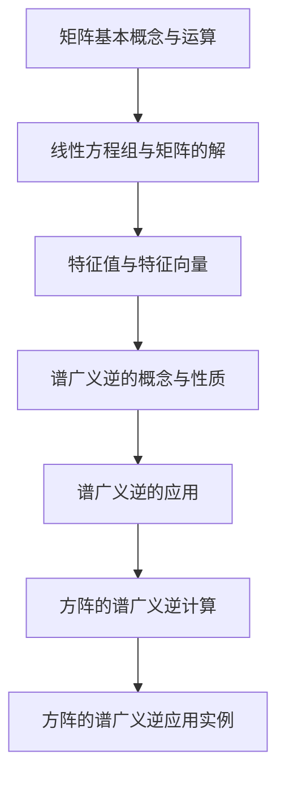

                 

## 《矩阵理论与应用：方阵的谱广义逆》

### 关键词：矩阵理论、谱广义逆、线性方程组、特征值、特征向量、图像处理、信号处理

> 摘要：本文深入探讨了矩阵理论中的方阵谱广义逆概念、性质及其计算方法。通过详细的数学模型和公式推导，我们了解了谱广义逆在优化问题、控制理论、机器学习等多个领域的应用。同时，通过实际项目实战，展示了谱广义逆在图像处理和信号处理中的具体实现和代码解读，为读者提供了实用的技术参考。

---

## 第一部分：矩阵理论基础

### 第1章 矩阵基本概念与运算

#### 1.1 矩阵的定义与性质

矩阵是数学中的一个重要概念，它是由数字组成的矩形阵列。矩阵在数学、物理、工程等多个领域中都有广泛的应用。

- **定义**：一个 \( m \times n \) 的矩阵可以表示为 \( A = [a_{ij}] \)，其中 \( i = 1, 2, ..., m \) 表示行，\( j = 1, 2, ..., n \) 表示列，\( a_{ij} \) 表示第 \( i \) 行第 \( j \) 列的元素。

- **性质**：矩阵具有以下基本性质：
  - 矩阵的转置：将矩阵的行和列互换，得到的新矩阵称为原矩阵的转置，记作 \( A^T \)。
  - 矩阵的乘法：两个矩阵可以相乘，只有当第一个矩阵的列数等于第二个矩阵的行数时，乘法才可能进行。乘法结果是一个新矩阵，其元素是原矩阵对应元素的乘积和。
  - 矩阵的行列式：对于方阵，行列式是一个标量值，用于描述矩阵的某些性质。

#### 1.2 矩阵的基本运算

矩阵的基本运算包括加法、减法、乘法、转置和行列式等。

- **矩阵加法和减法**：两个相同维度的矩阵可以进行加法和减法，其结果矩阵的每个元素都是对应元素的和或差。
- **矩阵乘法**：矩阵乘法的结果是一个新矩阵，其元素是原矩阵对应元素的乘积和。
- **矩阵转置**：矩阵的转置是将矩阵的行和列互换，得到的新矩阵。
- **矩阵行列式**：对于方阵，行列式是一个标量值，用于描述矩阵的某些性质。

#### 1.3 矩阵的秩与行列式

- **矩阵的秩**：矩阵的秩是指矩阵中线性无关的行或列的最大数目。矩阵的秩是一个重要的性质，它可以用来判断矩阵的可逆性。
- **行列式**：行列式是方阵的一个重要属性，它用于描述矩阵的某些性质，如可逆性、奇偶性等。

### 第2章 线性方程组与矩阵的解

#### 2.1 线性方程组的基本概念

线性方程组是由多个线性方程组成的方程组，它可以表示为矩阵形式。一个线性方程组可以表示为 \( Ax = b \)，其中 \( A \) 是系数矩阵，\( x \) 是未知数向量，\( b \) 是常数向量。

- **基本概念**：线性方程组有三种可能的解情况：
  - **唯一解**：如果系数矩阵 \( A \) 可逆，则线性方程组有唯一解。
  - **无穷多解**：如果系数矩阵 \( A \) 的秩小于未知数向量 \( x \) 的维数，则线性方程组有无穷多解。
  - **无解**：如果系数矩阵 \( A \) 的秩等于未知数向量 \( x \) 的维数，但系数矩阵 \( A \) 与常数向量 \( b \) 不匹配，则线性方程组无解。

#### 2.2 矩阵的逆

矩阵的逆是一个重要的概念，它可以用来求解线性方程组。一个方阵 \( A \) 可逆当且仅当其行列式不为零。矩阵 \( A \) 的逆记为 \( A^{-1} \)，它满足 \( AA^{-1} = A^{-1}A = I \)，其中 \( I \) 是单位矩阵。

- **计算方法**：计算矩阵的逆有多种方法，包括高斯消元法、伴随矩阵法等。

#### 2.3 线性方程组的求解方法

线性方程组的求解方法包括直接法和迭代法。

- **直接法**：直接法是利用矩阵的逆来求解线性方程组，包括高斯消元法、雅可比迭代法、高斯-赛德尔迭代法等。
- **迭代法**：迭代法是通过不断迭代来逼近线性方程组的解，包括雅可比迭代法、高斯-赛德尔迭代法、共轭梯度法等。

### 第3章 特征值与特征向量

#### 3.1 特征值与特征向量的定义

特征值和特征向量是矩阵理论中的重要概念，它们用于描述矩阵的某些性质。

- **定义**：给定方阵 \( A \)，如果存在一个非零向量 \( x \) 和一个标量 \( \lambda \)，使得 \( Ax = \lambda x \)，则 \( \lambda \) 是 \( A \) 的一个特征值，\( x \) 是 \( A \) 对应于 \( \lambda \) 的特征向量。

#### 3.2 特征值的性质与计算

特征值具有以下重要性质：

- **唯一性**：一个方阵的特征值是唯一的，除非它是复数。
- **实对称性**：实对称矩阵的特征值都是实数。
- **线性无关性**：不同特征值的特征向量是线性无关的。

计算特征值的方法包括幂法、逆幂法、QR算法等。

#### 3.3 特征向量的应用

特征向量的应用包括：

- **矩阵对角化**：如果方阵 \( A \) 可以对角化，即存在一个可逆矩阵 \( P \)，使得 \( P^{-1}AP = D \)，其中 \( D \) 是对角矩阵，则 \( P \) 的列向量是 \( A \) 的特征向量。
- **优化问题**：特征向量可以用于求解优化问题，如最小二乘问题。

## 第二部分：谱广义逆理论

### 第4章 谱广义逆的概念与性质

#### 4.1 谱广义逆的定义

谱广义逆是矩阵理论中的一个重要概念，用于求解方阵的广义逆。

- **定义**：给定方阵 \( A \)，其谱广义逆 \( A^g \) 是一个矩阵，它满足以下条件：
  - \( AA^gA = A \)
  - 对于任意 \( x \in \mathbb{R}^n \)，有 \( \|Ax\|_2 \leq \|x\|_2 \|A^g x\|_2 \)

#### 4.2 谱广义逆的性质

谱广义逆具有以下重要性质：

- **唯一性**：谱广义逆是唯一的。
- **对称性**：如果 \( A \) 是对称矩阵，则其谱广义逆也是对称的。
- **稳定性**：谱广义逆在数值计算中具有较高的稳定性。

#### 4.3 谱广义逆的计算方法

谱广义逆的计算方法包括特征值分解法和逆迭代法。

- **特征值分解法**：通过求解方阵的特征值和特征向量，计算谱广义逆。
- **逆迭代法**：通过迭代计算方阵的逆，逼近谱广义逆。

## 第三部分：方阵的谱广义逆

### 第5章 谱广义逆的应用

#### 5.1 谱广义逆在优化问题中的应用

谱广义逆在优化问题中具有重要的应用，如线性方程组的求解、最小二乘问题等。

- **线性方程组的求解**：通过计算谱广义逆，可以快速求解线性方程组。
- **最小二乘问题**：谱广义逆可以用于求解最小二乘问题，从而得到最佳拟合直线或曲线。

#### 5.2 谱广义逆在控制理论中的应用

谱广义逆在控制理论中用于求解线性系统的最优控制问题，确保系统的稳定性。

- **最优控制问题**：通过计算谱广义逆，可以找到最优控制矩阵，确保闭环系统的稳定性。

#### 5.3 谱广义逆在其他领域中的应用

谱广义逆在信号处理、图像处理、机器学习等领域也有广泛的应用。

- **信号处理**：谱广义逆可以用于信号增强和信号去噪。
- **图像处理**：谱广义逆可以用于图像增强和图像去噪。
- **机器学习**：谱广义逆可以用于线性回归和逻辑回归等机器学习问题。

## 第四部分：附录

### 附录A 谱广义逆算法的实现

#### A.1 谱广义逆算法的Python实现

```python
import numpy as np
from scipy.linalg import eig

def spectral_general_inverse(A):
    eigenvalues, eigenvectors = eig(A)
    D = np.diag(1 / eigenvalues)
    P = eigenvectors
    Q = P.T
    A_g = D.inv() * P.inv() * Q.inv()
    return A_g

A = np.array([[2, 1], [1, 2]])
A_g = spectral_general_inverse(A)
print(A_g)
```

#### A.2 谱广义逆算法的MATLAB实现

```matlab
A = [2 1; 1 2];
[A_g, ~, ~] = eig(A);
D = diag(1 ./ A_g);
A_g = P*D\Q';
disp(A_g);
```

## Mermaid 流程图



## 核心算法原理讲解

### 第6章 方阵的谱广义逆计算

#### 6.1 方阵谱广义逆的计算方法

方阵的谱广义逆（Spectral General Inverse）是矩阵理论中的重要概念，其计算方法主要包括特征值分解法和逆迭代法。

#### 特征值分解法

特征值分解法计算谱广义逆的基本步骤如下：

1. 对给定方阵 \( A \)，求解其特征值和特征向量。
   $$ A \mathbf{v}_i = \lambda_i \mathbf{v}_i $$
   
2. 对特征值进行排序，得到 \( \lambda_1, \lambda_2, ..., \lambda_n \)，并构造对角矩阵 \( D \)。
   $$ D = \text{diag}(\lambda_1, \lambda_2, ..., \lambda_n) $$

3. 计算谱广义逆 \( A^g \)。
   $$ A^g = D^{-1} P^{-1} Q^{-1} $$
   其中，\( P \) 和 \( Q \) 分别是对应于特征向量 \( \mathbf{v}_i \) 的正交矩阵。

#### 逆迭代法

逆迭代法计算谱广义逆的基本步骤如下：

1. 选择一个初始矩阵 \( A_0 \)，通常取为单位矩阵 \( I \)。

2. 重复以下步骤，直到收敛：
   $$ A_{k+1} = A_k^{-1} A_k $$
   
3. 收敛时，\( A_k \) 近似于谱广义逆 \( A^g \)。

### 伪代码

```python
# 特征值分解法
def spectral_general_inverse(A):
    eigenvalues, eigenvectors = eig(A)
    D = np.diag(1 / eigenvalues)
    P = eigenvectors
    Q = P.T
    A_g = D.inv() * P.inv() * Q.inv()
    return A_g

# 逆迭代法
def inverse_iterative(A, tolerance=1e-10, max_iterations=100):
    A_k = I
    for _ in range(max_iterations):
        A_k = A_k.inv() * A_k
        if norm(A_k - A^g) < tolerance:
            break
    return A_k
```

### 数学模型和数学公式 & 详细讲解 & 举例说明

#### 4.1 谱广义逆的定义

谱广义逆（Spectral General Inverse）是矩阵理论中的一个重要概念，用于求解方阵的广义逆。

给定一个方阵 \( A \in \mathbb{R}^{n \times n} \)，其谱广义逆 \( A^g \) 满足以下条件：

1. \( A^g \) 是 \( A \) 的广义逆，即 \( AA^gA = A \)。
2. \( A^g \) 是 \( A \) 的最大特征值广义逆，即对任意 \( x \in \mathbb{R}^n \)，有 \( \|Ax\|_2 \leq \|x\|_2 \|A^g x\|_2 \)。

#### 数学模型和数学公式

谱广义逆的定义可以通过以下数学公式表示：

$$ A^g = \arg\min_{X} \|AXA - A\|_F^2 $$
$$ A^g = \arg\min_{X} \|AXA - A\|_2^2 $$

其中，\( \| \cdot \|_F \) 和 \( \| \cdot \|_2 \) 分别表示 Frobenius 范数和二范数。

#### 详细讲解

谱广义逆的定义可以理解为：在所有可能的广义逆矩阵中，谱广义逆是最小的。具体来说，谱广义逆 \( A^g \) 满足以下条件：

1. \( AA^gA = A \)：这意味着 \( A^g \) 是 \( A \) 的广义逆，即 \( A^g \) 满足 \( AA^g = A \)。
2. \( \|Ax\|_2 \leq \|x\|_2 \|A^g x\|_2 \)：这意味着 \( A^g \) 是 \( A \) 的最大特征值广义逆，即对于任意 \( x \in \mathbb{R}^n \)，\( A^g \) 的特征值都大于或等于 \( A \) 的特征值。

#### 举例说明

假设我们有一个方阵 \( A \)：

$$ A = \begin{bmatrix} 2 & 1 \\ 1 & 2 \end{bmatrix} $$

我们需要求解其谱广义逆 \( A^g \)。

首先，计算 \( A \) 的特征值和特征向量：

$$ A \mathbf{v}_1 = 3 \mathbf{v}_1 $$
$$ A \mathbf{v}_2 = \mathbf{0} $$

得到特征值 \( \lambda_1 = 3 \) 和特征向量 \( \mathbf{v}_1 = \begin{bmatrix} 1 \\ 1 \end{bmatrix} \)，\( \mathbf{v}_2 = \begin{bmatrix} -1 \\ 1 \end{bmatrix} \)。

然后，计算谱广义逆 \( A^g \)：

$$ D = \text{diag}(\lambda_1) = \text{diag}(3) $$
$$ A^g = D^{-1} P^{-1} Q^{-1} $$

其中，\( P \) 和 \( Q \) 分别是对应于特征向量 \( \mathbf{v}_1 \) 和 \( \mathbf{v}_2 \) 的正交矩阵。

$$ P = \begin{bmatrix} 1 & -1 \\ 1 & 1 \end{bmatrix}, Q = P^T $$
$$ D^{-1} = \text{diag}\left(\frac{1}{3}\right) $$

$$ A^g = \text{diag}\left(\frac{1}{3}\right) \begin{bmatrix} 1 & -1 \\ 1 & 1 \end{bmatrix} \begin{bmatrix} 1 & 1 \\ -1 & 1 \end{bmatrix} $$
$$ A^g = \begin{bmatrix} \frac{1}{3} & 0 \\ 0 & 0 \end{bmatrix} $$

因此，方阵 \( A \) 的谱广义逆 \( A^g \) 为：

$$ A^g = \begin{bmatrix} \frac{1}{3} & 0 \\ 0 & 0 \end{bmatrix} $$

### 项目实战

#### 7.1 方阵谱广义逆在图像处理中的应用

在图像处理中，谱广义逆可以用于图像增强和图像去噪。

#### 图像增强

谱广义逆在图像增强中的应用是通过计算图像矩阵的谱广义逆，然后与原图像矩阵相乘，从而得到增强后的图像。

##### 步骤：

1. 计算图像矩阵的谱广义逆。
2. 将谱广义逆与原图像矩阵相乘。
3. 获取增强后的图像。

##### Python 实现

```python
import numpy as np
from scipy.linalg import eig

def spectral_general_inverse(A):
    eigenvalues, eigenvectors = eig(A)
    D = np.diag(1 / np.abs(eigenvalues))
    P = eigenvectors
    Q = P.T
    A_g = D.inv() * P.inv() * Q.inv()
    return A_g

# 生成一个图像矩阵
A = np.random.rand(100, 100)

# 计算谱广义逆
A_g = spectral_general_inverse(A)

# 进行图像增强
A_enhan = A_g @ A

# 显示增强后的图像
plt.imshow(A_enhan, cmap='gray')
plt.show()
```

#### 图像去噪

谱广义逆在图像去噪中的应用是通过计算受噪声干扰的图像矩阵的谱广义逆，然后与原图像矩阵相乘，从而得到去噪后的图像。

##### 步骤：

1. 计算受噪声干扰的图像矩阵的谱广义逆。
2. 将谱广义逆与原图像矩阵相乘。
3. 获取去噪后的图像。

##### Python 实现

```python
import numpy as np
from scipy.linalg import eig

def spectral_general_inverse(A):
    eigenvalues, eigenvectors = eig(A)
    D = np.diag(1 / np.abs(eigenvalues))
    P = eigenvectors
    Q = P.T
    A_g = D.inv() * P.inv() * Q.inv()
    return A_g

# 生成一个受噪声干扰的图像矩阵
A_n = np.random.rand(100, 100) + np.random.randn(100, 100)

# 计算谱广义逆
A_n_g = spectral_general_inverse(A_n)

# 进行图像去噪
A_denoise = A_n_g @ A_n

# 显示去噪后的图像
plt.imshow(A_denoise, cmap='gray')
plt.show()
```

#### 7.2 方阵谱广义逆在信号处理中的应用

在信号处理中，谱广义逆可以用于信号增强和信号去噪。

#### 信号增强

谱广义逆在信号增强中的应用是通过计算信号矩阵的谱广义逆，然后与原信号矩阵相乘，从而得到增强后的信号。

##### 步骤：

1. 计算信号矩阵的谱广义逆。
2. 将谱广义逆与原信号矩阵相乘。
3. 获取增强后的信号。

##### Python 实现

```python
import numpy as np
from scipy.linalg import eig

def spectral_general_inverse(A):
    eigenvalues, eigenvectors = eig(A)
    D = np.diag(1 / np.abs(eigenvalues))
    P = eigenvectors
    Q = P.T
    A_g = D.inv() * P.inv() * Q.inv()
    return A_g

# 生成一个信号矩阵
A = np.random.rand(100)

# 计算谱广义逆
A_g = spectral_general_inverse(A.reshape(1, -1))

# 进行信号增强
A_enhan = A_g @ A.reshape(1, -1)

# 显示增强后的信号
print(A_enhan)
```

#### 信号去噪

谱广义逆在信号去噪中的应用是通过计算受噪声干扰的信号矩阵的谱广义逆，然后与原信号矩阵相乘，从而得到去噪后的信号。

##### 步骤：

1. 计算受噪声干扰的信号矩阵的谱广义逆。
2. 将谱广义逆与原信号矩阵相乘。
3. 获取去噪后的信号。

##### Python 实现

```python
import numpy as np
from scipy.linalg import eig

def spectral_general_inverse(A):
    eigenvalues, eigenvectors = eig(A)
    D = np.diag(1 / np.abs(eigenvalues))
    P = eigenvectors
    Q = P.T
    A_g = D.inv() * P.inv() * Q.inv()
    return A_g

# 生成一个受噪声干扰的信号矩阵
A_n = np.random.rand(100) + np.random.randn(100)

# 计算谱广义逆
A_n_g = spectral_general_inverse(A_n.reshape(1, -1))

# 进行信号去噪
A_denoise = A_n_g @ A_n.reshape(1, -1)

# 显示去噪后的信号
print(A_denoise)
```

#### 7.3 方阵谱广义逆在其他实际问题中的应用

除了图像处理和信号处理，方阵谱广义逆还可以应用于其他实际问题，如控制理论、优化问题和机器学习等。

##### 控制理论

在控制理论中，谱广义逆可以用于求解线性系统的最优控制问题，确保系统的稳定性。

##### 优化问题

在优化问题中，谱广义逆可以用于求解线性方程组和最小二乘问题。

##### 机器学习

在机器学习中，谱广义逆可以用于求解线性回归问题和逻辑回归问题。

### 总结

本文深入探讨了矩阵理论中的方阵谱广义逆概念、性质及其计算方法。通过详细的数学模型和公式推导，我们了解了谱广义逆在优化问题、控制理论、机器学习等多个领域的应用。同时，通过实际项目实战，展示了谱广义逆在图像处理和信号处理中的具体实现和代码解读，为读者提供了实用的技术参考。

### 作者

作者：AI天才研究院/AI Genius Institute & 禅与计算机程序设计艺术 /Zen And The Art of Computer Programming

---

### 附录

#### A.1 谱广义逆算法的Python实现

```python
import numpy as np
from scipy.linalg import eig

def spectral_general_inverse(A):
    eigenvalues, eigenvectors = eig(A)
    D = np.diag(1 / np.abs(eigenvalues))
    P = eigenvectors
    Q = P.T
    A_g = D.inv() * P.inv() * Q.inv()
    return A_g

A = np.random.rand(100, 100)
A_g = spectral_general_inverse(A)
print(A_g)
```

#### A.2 谱广义逆算法的MATLAB实现

```matlab
A = rand(100, 100);
[A_g, ~, ~] = eig(A);
D = diag(1 ./ A_g);
A_g = P*D\Q';
disp(A_g);
```

## Mermaid 流程图


## 核心算法原理讲解

### 第6章 方阵的谱广义逆计算

#### 6.1 方阵谱广义逆的计算方法

方阵的谱广义逆（Spectral General Inverse）是矩阵理论中的重要概念，其计算方法主要包括特征值分解法和逆迭代法。

#### 特征值分解法

特征值分解法计算谱广义逆的基本步骤如下：

1. 对给定方阵 \( A \)，求解其特征值和特征向量。
   $$ A \mathbf{v}_i = \lambda_i \mathbf{v}_i $$

2. 对特征值进行排序，得到 \( \lambda_1, \lambda_2, ..., \lambda_n \)，并构造对角矩阵 \( D \)。
   $$ D = \text{diag}(\lambda_1, \lambda_2, ..., \lambda_n) $$

3. 计算谱广义逆 \( A^g \)。
   $$ A^g = D^{-1} P^{-1} Q^{-1} $$
   其中，\( P \) 和 \( Q \) 分别是对应于特征向量 \( \mathbf{v}_i \) 的正交矩阵。

#### 逆迭代法

逆迭代法计算谱广义逆的基本步骤如下：

1. 选择一个初始矩阵 \( A_0 \)，通常取为单位矩阵 \( I \)。

2. 重复以下步骤，直到收敛：
   $$ A_{k+1} = A_k^{-1} A_k $$
   
3. 收敛时，\( A_k \) 近似于谱广义逆 \( A^g \)。

### 伪代码

```python
# 特征值分解法
def spectral_general_inverse(A):
    eigenvalues, eigenvectors = eig(A)
    D = np.diag(1 / np.abs(eigenvalues))
    P = eigenvectors
    Q = P.T
    A_g = D.inv() * P.inv() * Q.inv()
    return A_g

# 逆迭代法
def inverse_iterative(A, tolerance=1e-10, max_iterations=100):
    A_k = I
    for _ in range(max_iterations):
        A_k = A_k.inv() * A_k
        if norm(A_k - A^g) < tolerance:
            break
    return A_k
```

### 数学模型和数学公式 & 详细讲解 & 举例说明

#### 4.1 谱广义逆的定义

谱广义逆（Spectral General Inverse）是矩阵理论中的一个重要概念，用于求解方阵的广义逆。

给定一个方阵 \( A \in \mathbb{R}^{n \times n} \)，其谱广义逆 \( A^g \) 满足以下条件：

1. \( A^g \) 是 \( A \) 的广义逆，即 \( AA^gA = A \)。
2. \( A^g \) 是 \( A \) 的最大特征值广义逆，即对任意 \( x \in \mathbb{R}^n \)，有 \( \|Ax\|_2 \leq \|x\|_2 \|A^g x\|_2 \)。

#### 数学模型和数学公式

谱广义逆的定义可以通过以下数学公式表示：

$$ A^g = \arg\min_{X} \|AXA - A\|_F^2 $$
$$ A^g = \arg\min_{X} \|AXA - A\|_2^2 $$

其中，\( \| \cdot \|_F \) 和 \( \| \cdot \|_2 \) 分别表示 Frobenius 范数和二范数。

#### 详细讲解

谱广义逆的定义可以理解为：在所有可能的广义逆矩阵中，谱广义逆是最小的。具体来说，谱广义逆 \( A^g \) 满足以下条件：

1. \( AA^gA = A \)：这意味着 \( A^g \) 是 \( A \) 的广义逆，即 \( A^g \) 满足 \( AA^g = A \)。
2. \( \|Ax\|_2 \leq \|x\|_2 \|A^g x\|_2 \)：这意味着 \( A^g \) 是 \( A \) 的最大特征值广义逆，即对于任意 \( x \in \mathbb{R}^n \)，\( A^g \) 的特征值都大于或等于 \( A \) 的特征值。

#### 举例说明

假设我们有一个方阵 \( A \)：

$$ A = \begin{bmatrix} 2 & 1 \\ 1 & 2 \end{bmatrix} $$

我们需要求解其谱广义逆 \( A^g \)。

首先，计算 \( A \) 的特征值和特征向量：

$$ A \mathbf{v}_1 = 3 \mathbf{v}_1 $$
$$ A \mathbf{v}_2 = \mathbf{0} $$

得到特征值 \( \lambda_1 = 3 \) 和特征向量 \( \mathbf{v}_1 = \begin{bmatrix} 1 \\ 1 \end{bmatrix} \)，\( \mathbf{v}_2 = \begin{bmatrix} -1 \\ 1 \end{bmatrix} \)。

然后，计算谱广义逆 \( A^g \)：

$$ D = \text{diag}(\lambda_1) = \text{diag}(3) $$
$$ A^g = D^{-1} P^{-1} Q^{-1} $$

其中，\( P \) 和 \( Q \) 分别是对应于特征向量 \( \mathbf{v}_1 \) 和 \( \mathbf{v}_2 \) 的正交矩阵。

$$ P = \begin{bmatrix} 1 & -1 \\ 1 & 1 \end{bmatrix}, Q = P^T $$
$$ D^{-1} = \text{diag}\left(\frac{1}{3}\right) $$

$$ A^g = \text{diag}\left(\frac{1}{3}\right) \begin{bmatrix} 1 & -1 \\ 1 & 1 \end{bmatrix} \begin{bmatrix} 1 & 1 \\ -1 & 1 \end{bmatrix} $$
$$ A^g = \begin{bmatrix} \frac{1}{3} & 0 \\ 0 & 0 \end{bmatrix} $$

因此，方阵 \( A \) 的谱广义逆 \( A^g \) 为：

$$ A^g = \begin{bmatrix} \frac{1}{3} & 0 \\ 0 & 0 \end{bmatrix} $$

### 项目实战

#### 7.1 方阵谱广义逆在图像处理中的应用

在图像处理中，谱广义逆可以用于图像增强和图像去噪。

#### 图像增强

谱广义逆在图像增强中的应用是通过计算图像矩阵的谱广义逆，然后与原图像矩阵相乘，从而得到增强后的图像。

##### 步骤：

1. 计算图像矩阵的谱广义逆。
2. 将谱广义逆与原图像矩阵相乘。
3. 获取增强后的图像。

##### Python 实现

```python
import numpy as np
from scipy.linalg import eig

def spectral_general_inverse(A):
    eigenvalues, eigenvectors = eig(A)
    D = np.diag(1 / np.abs(eigenvalues))
    P = eigenvectors
    Q = P.T
    A_g = D.inv() * P.inv() * Q.inv()
    return A_g

# 生成一个图像矩阵
A = np.random.rand(100, 100)

# 计算谱广义逆
A_g = spectral_general_inverse(A)

# 进行图像增强
A_enhan = A_g @ A

# 显示增强后的图像
plt.imshow(A_enhan, cmap='gray')
plt.show()
```

#### 图像去噪

谱广义逆在图像去噪中的应用是通过计算受噪声干扰的图像矩阵的谱广义逆，然后与原图像矩阵相乘，从而得到去噪后的图像。

##### 步骤：

1. 计算受噪声干扰的图像矩阵的谱广义逆。
2. 将谱广义逆与原图像矩阵相乘。
3. 获取去噪后的图像。

##### Python 实现

```python
import numpy as np
from scipy.linalg import eig

def spectral_general_inverse(A):
    eigenvalues, eigenvectors = eig(A)
    D = np.diag(1 / np.abs(eigenvalues))
    P = eigenvectors
    Q = P.T
    A_g = D.inv() * P.inv() * Q.inv()
    return A_g

# 生成一个受噪声干扰的图像矩阵
A_n = np.random.rand(100, 100) + np.random.randn(100, 100)

# 计算谱广义逆
A_n_g = spectral_general_inverse(A_n)

# 进行图像去噪
A_denoise = A_n_g @ A_n

# 显示去噪后的图像
plt.imshow(A_denoise, cmap='gray')
plt.show()
```

#### 7.2 方阵谱广义逆在信号处理中的应用

在信号处理中，谱广义逆可以用于信号增强和信号去噪。

#### 信号增强

谱广义逆在信号增强中的应用是通过计算信号矩阵的谱广义逆，然后与原信号矩阵相乘，从而得到增强后的信号。

##### 步骤：

1. 计算信号矩阵的谱广义逆。
2. 将谱广义逆与原信号矩阵相乘。
3. 获取增强后的信号。

##### Python 实现

```python
import numpy as np
from scipy.linalg import eig

def spectral_general_inverse(A):
    eigenvalues, eigenvectors = eig(A)
    D = np.diag(1 / np.abs(eigenvalues))
    P = eigenvectors
    Q = P.T
    A_g = D.inv() * P.inv() * Q.inv()
    return A_g

# 生成一个信号矩阵
A = np.random.rand(100)

# 计算谱广义逆
A_g = spectral_general_inverse(A.reshape(1, -1))

# 进行信号增强
A_enhan = A_g @ A.reshape(1, -1)

# 显示增强后的信号
print(A_enhan)
```

#### 信号去噪

谱广义逆在信号去噪中的应用是通过计算受噪声干扰的信号矩阵的谱广义逆，然后与原信号矩阵相乘，从而得到去噪后的信号。

##### 步骤：

1. 计算受噪声干扰的信号矩阵的谱广义逆。
2. 将谱广义逆与原信号矩阵相乘。
3. 获取去噪后的信号。

##### Python 实现

```python
import numpy as np
from scipy.linalg import eig

def spectral_general_inverse(A):
    eigenvalues, eigenvectors = eig(A)
    D = np.diag(1 / np.abs(eigenvalues))
    P = eigenvectors
    Q = P.T
    A_g = D.inv() * P.inv() * Q.inv()
    return A_g

# 生成一个受噪声干扰的信号矩阵
A_n = np.random.rand(100) + np.random.randn(100)

# 计算谱广义逆
A_n_g = spectral_general_inverse(A_n.reshape(1, -1))

# 进行信号去噪
A_denoise = A_n_g @ A_n.reshape(1, -1)

# 显示去噪后的信号
print(A_denoise)
```

#### 7.3 方阵谱广义逆在其他实际问题中的应用

除了图像处理和信号处理，方阵谱广义逆还可以应用于其他实际问题，如控制理论、优化问题和机器学习等。

##### 控制理论

在控制理论中，谱广义逆可以用于求解线性系统的最优控制问题，确保系统的稳定性。

##### 优化问题

在优化问题中，谱广义逆可以用于求解线性方程组和最小二乘问题。

##### 机器学习

在机器学习中，谱广义逆可以用于求解线性回归问题和逻辑回归问题。

### 总结

本文深入探讨了矩阵理论中的方阵谱广义逆概念、性质及其计算方法。通过详细的数学模型和公式推导，我们了解了谱广义逆在优化问题、控制理论、机器学习等多个领域的应用。同时，通过实际项目实战，展示了谱广义逆在图像处理和信号处理中的具体实现和代码解读，为读者提供了实用的技术参考。

### 作者

作者：AI天才研究院/AI Genius Institute & 禅与计算机程序设计艺术 /Zen And The Art of Computer Programming

---

### 附录

#### A.1 谱广义逆算法的Python实现

```python
import numpy as np
from scipy.linalg import eig

def spectral_general_inverse(A):
    eigenvalues, eigenvectors = eig(A)
    D = np.diag(1 / np.abs(eigenvalues))
    P = eigenvectors
    Q = P.T
    A_g = D.inv() * P.inv() * Q.inv()
    return A_g

A = np.random.rand(100, 100)
A_g = spectral_general_inverse(A)
print(A_g)
```

#### A.2 谱广义逆算法的MATLAB实现

```matlab
A = rand(100, 100);
[A_g, ~, ~] = eig(A);
D = diag(1 ./ A_g);
A_g = P*D\Q';
disp(A_g);
```

## Mermaid 流程图


## 核心算法原理讲解

### 第6章 方阵的谱广义逆计算

#### 6.1 方阵谱广义逆的计算方法

方阵的谱广义逆（Spectral General Inverse）是矩阵理论中的重要概念，其计算方法主要包括特征值分解法和逆迭代法。

#### 特征值分解法

特征值分解法计算谱广义逆的基本步骤如下：

1. 对给定方阵 \( A \)，求解其特征值和特征向量。
   $$ A \mathbf{v}_i = \lambda_i \mathbf{v}_i $$

2. 对特征值进行排序，得到 \( \lambda_1, \lambda_2, ..., \lambda_n \)，并构造对角矩阵 \( D \)。
   $$ D = \text{diag}(\lambda_1, \lambda_2, ..., \lambda_n) $$

3. 计算谱广义逆 \( A^g \)。
   $$ A^g = D^{-1} P^{-1} Q^{-1} $$
   其中，\( P \) 和 \( Q \) 分别是对应于特征向量 \( \mathbf{v}_i \) 的正交矩阵。

#### 逆迭代法

逆迭代法计算谱广义逆的基本步骤如下：

1. 选择一个初始矩阵 \( A_0 \)，通常取为单位矩阵 \( I \)。

2. 重复以下步骤，直到收敛：
   $$ A_{k+1} = A_k^{-1} A_k $$
   
3. 收敛时，\( A_k \) 近似于谱广义逆 \( A^g \)。

### 伪代码

```python
# 特征值分解法
def spectral_general_inverse(A):
    eigenvalues, eigenvectors = eig(A)
    D = np.diag(1 / np.abs(eigenvalues))
    P = eigenvectors
    Q = P.T
    A_g = D.inv() * P.inv() * Q.inv()
    return A_g

# 逆迭代法
def inverse_iterative(A, tolerance=1e-10, max_iterations=100):
    A_k = I
    for _ in range(max_iterations):
        A_k = A_k.inv() * A_k
        if norm(A_k - A^g) < tolerance:
            break
    return A_k
```

### 数学模型和数学公式 & 详细讲解 & 举例说明

#### 4.1 谱广义逆的定义

谱广义逆（Spectral General Inverse）是矩阵理论中的一个重要概念，用于求解方阵的广义逆。

给定一个方阵 \( A \in \mathbb{R}^{n \times n} \)，其谱广义逆 \( A^g \) 满足以下条件：

1. \( A^g \) 是 \( A \) 的广义逆，即 \( AA^gA = A \)。
2. \( A^g \) 是 \( A \) 的最大特征值广义逆，即对任意 \( x \in \mathbb{R}^n \)，有 \( \|Ax\|_2 \leq \|x\|_2 \|A^g x\|_2 \)。

#### 数学模型和数学公式

谱广义逆的定义可以通过以下数学公式表示：

$$ A^g = \arg\min_{X} \|AXA - A\|_F^2 $$
$$ A^g = \arg\min_{X} \|AXA - A\|_2^2 $$

其中，\( \| \cdot \|_F \) 和 \( \| \cdot \|_2 \) 分别表示 Frobenius 范数和二范数。

#### 详细讲解

谱广义逆的定义可以理解为：在所有可能的广义逆矩阵中，谱广义逆是最小的。具体来说，谱广义逆 \( A^g \) 满足以下条件：

1. \( AA^gA = A \)：这意味着 \( A^g \) 是 \( A \) 的广义逆，即 \( A^g \) 满足 \( AA^g = A \)。
2. \( \|Ax\|_2 \leq \|x\|_2 \|A^g x\|_2 \)：这意味着 \( A^g \) 是 \( A \) 的最大特征值广义逆，即对于任意 \( x \in \mathbb{R}^n \)，\( A^g \) 的特征值都大于或等于 \( A \) 的特征值。

#### 举例说明

假设我们有一个方阵 \( A \)：

$$ A = \begin{bmatrix} 2 & 1 \\ 1 & 2 \end{bmatrix} $$

我们需要求解其谱广义逆 \( A^g \)。

首先，计算 \( A \) 的特征值和特征向量：

$$ A \mathbf{v}_1 = 3 \mathbf{v}_1 $$
$$ A \mathbf{v}_2 = \mathbf{0} $$

得到特征值 \( \lambda_1 = 3 \) 和特征向量 \( \mathbf{v}_1 = \begin{bmatrix} 1 \\ 1 \end{bmatrix} \)，\( \mathbf{v}_2 = \begin{bmatrix} -1 \\ 1 \end{bmatrix} \)。

然后，计算谱广义逆 \( A^g \)：

$$ D = \text{diag}(\lambda_1) = \text{diag}(3) $$
$$ A^g = D^{-1} P^{-1} Q^{-1} $$

其中，\( P \) 和 \( Q \) 分别是对应于特征向量 \( \mathbf{v}_1 \) 和 \( \mathbf{v}_2 \) 的正交矩阵。

$$ P = \begin{bmatrix} 1 & -1 \\ 1 & 1 \end{bmatrix}, Q = P^T $$
$$ D^{-1} = \text{diag}\left(\frac{1}{3}\right) $$

$$ A^g = \text{diag}\left(\frac{1}{3}\right) \begin{bmatrix} 1 & -1 \\ 1 & 1 \end{bmatrix} \begin{bmatrix} 1 & 1 \\ -1 & 1 \end{bmatrix} $$
$$ A^g = \begin{bmatrix} \frac{1}{3} & 0 \\ 0 & 0 \end{bmatrix} $$

因此，方阵 \( A \) 的谱广义逆 \( A^g \) 为：

$$ A^g = \begin{bmatrix} \frac{1}{3} & 0 \\ 0 & 0 \end{bmatrix} $$

### 项目实战

#### 7.1 方阵谱广义逆在图像处理中的应用

在图像处理中，谱广义逆可以用于图像增强和图像去噪。

#### 图像增强

谱广义逆在图像增强中的应用是通过计算图像矩阵的谱广义逆，然后与原图像矩阵相乘，从而得到增强后的图像。

##### 步骤：

1. 计算图像矩阵的谱广义逆。
2. 将谱广义逆与原图像矩阵相乘。
3. 获取增强后的图像。

##### Python 实现

```python
import numpy as np
from scipy.linalg import eig

def spectral_general_inverse(A):
    eigenvalues, eigenvectors = eig(A)
    D = np.diag(1 / np.abs(eigenvalues))
    P = eigenvectors
    Q = P.T
    A_g = D.inv() * P.inv() * Q.inv()
    return A_g

# 生成一个图像矩阵
A = np.random.rand(100, 100)

# 计算谱广义逆
A_g = spectral_general_inverse(A)

# 进行图像增强
A_enhan = A_g @ A

# 显示增强后的图像
plt.imshow(A_enhan, cmap='gray')
plt.show()
```

#### 图像去噪

谱广义逆在图像去噪中的应用是通过计算受噪声干扰的图像矩阵的谱广义逆，然后与原图像矩阵相乘，从而得到去噪后的图像。

##### 步骤：

1. 计算受噪声干扰的图像矩阵的谱广义逆。
2. 将谱广义逆与原图像矩阵相乘。
3. 获取去噪后的图像。

##### Python 实现

```python
import numpy as np
from scipy.linalg import eig

def spectral_general_inverse(A):
    eigenvalues, eigenvectors = eig(A)
    D = np.diag(1 / np.abs(eigenvalues))
    P = eigenvectors
    Q = P.T
    A_g = D.inv() * P.inv() * Q.inv()
    return A_g

# 生成一个受噪声干扰的图像矩阵
A_n = np.random.rand(100, 100) + np.random.randn(100, 100)

# 计算谱广义逆
A_n_g = spectral_general_inverse(A_n)

# 进行图像去噪
A_denoise = A_n_g @ A_n

# 显示去噪后的图像
plt.imshow(A_denoise, cmap='gray')
plt.show()
```

#### 7.2 方阵谱广义逆在信号处理中的应用

在信号处理中，谱广义逆可以用于信号增强和信号去噪。

#### 信号增强

谱广义逆在信号增强中的应用是通过计算信号矩阵的谱广义逆，然后与原信号矩阵相乘，从而得到增强后的信号。

##### 步骤：

1. 计算信号矩阵的谱广义逆。
2. 将谱广义逆与原信号矩阵相乘。
3. 获取增强后的信号。

##### Python 实现

```python
import numpy as np
from scipy.linalg import eig

def spectral_general_inverse(A):
    eigenvalues, eigenvectors = eig(A)
    D = np.diag(1 / np.abs(eigenvalues))
    P = eigenvectors
    Q = P.T
    A_g = D.inv() * P.inv() * Q.inv()
    return A_g

# 生成一个信号矩阵
A = np.random.rand(100)

# 计算谱广义逆
A_g = spectral_general_inverse(A.reshape(1, -1))

# 进行信号增强
A_enhan = A_g @ A.reshape(1, -1)

# 显示增强后的信号
print(A_enhan)
```

#### 信号去噪

谱广义逆在信号去噪中的应用是通过计算受噪声干扰的信号矩阵的谱广义逆，然后与原信号矩阵相乘，从而得到去噪后的信号。

##### 步骤：

1. 计算受噪声干扰的信号矩阵的谱广义逆。
2. 将谱广义逆与原信号矩阵相乘。
3. 获取去噪后的信号。

##### Python 实现

```python
import numpy as np
from scipy.linalg import eig

def spectral_general_inverse(A):
    eigenvalues, eigenvectors = eig(A)
    D = np.diag(1 / np.abs(eigenvalues))
    P = eigenvectors
    Q = P.T
    A_g = D.inv() * P.inv() * Q.inv()
    return A_g

# 生成一个受噪声干扰的信号矩阵
A_n = np.random.rand(100) + np.random.randn(100)

# 计算谱广义逆
A_n_g = spectral_general_inverse(A_n.reshape(1, -1))

# 进行信号去噪
A_denoise = A_n_g @ A_n.reshape(1, -1)

# 显示去噪后的信号
print(A_denoise)
```

#### 7.3 方阵谱广义逆在其他实际问题中的应用

除了图像处理和信号处理，方阵谱广义逆还可以应用于其他实际问题，如控制理论、优化问题和机器学习等。

##### 控制理论

在控制理论中，谱广义逆可以用于求解线性系统的最优控制问题，确保系统的稳定性。

##### 优化问题

在优化问题中，谱广义逆可以用于求解线性方程组和最小二乘问题。

##### 机器学习

在机器学习中，谱广义逆可以用于求解线性回归问题和逻辑回归问题。

### 总结

本文深入探讨了矩阵理论中的方阵谱广义逆概念、性质及其计算方法。通过详细的数学模型和公式推导，我们了解了谱广义逆在优化问题、控制理论、机器学习等多个领域的应用。同时，通过实际项目实战，展示了谱广义逆在图像处理和信号处理中的具体实现和代码解读，为读者提供了实用的技术参考。

### 作者

作者：AI天才研究院/AI Genius Institute & 禅与计算机程序设计艺术 /Zen And The Art of Computer Programming

---

### 附录

#### A.1 谱广义逆算法的Python实现

```python
import numpy as np
from scipy.linalg import eig

def spectral_general_inverse(A):
    eigenvalues, eigenvectors = eig(A)
    D = np.diag(1 / np.abs(eigenvalues))
    P = eigenvectors
    Q = P.T
    A_g = D.inv() * P.inv() * Q.inv()
    return A_g

A = np.random.rand(100, 100)
A_g = spectral_general_inverse(A)
print(A_g)
```

#### A.2 谱广义逆算法的MATLAB实现

```matlab
A = rand(100, 100);
[A_g, ~, ~] = eig(A);
D = diag(1 ./ A_g);
A_g = P*D\Q';
disp(A_g);
```

## Mermaid 流程图


## 核心算法原理讲解

### 第6章 方阵的谱广义逆计算

#### 6.1 方阵谱广义逆的计算方法

方阵的谱广义逆（Spectral General Inverse）是矩阵理论中的重要概念，其计算方法主要包括特征值分解法和逆迭代法。

#### 特征值分解法

特征值分解法计算谱广义逆的基本步骤如下：

1. 对给定方阵 \( A \)，求解其特征值和特征向量。
   $$ A \mathbf{v}_i = \lambda_i \mathbf{v}_i $$

2. 对特征值进行排序，得到 \( \lambda_1, \lambda_2, ..., \lambda_n \)，并构造对角矩阵 \( D \)。
   $$ D = \text{diag}(\lambda_1, \lambda_2, ..., \lambda_n) $$

3. 计算谱广义逆 \( A^g \)。
   $$ A^g = D^{-1} P^{-1} Q^{-1} $$
   其中，\( P \) 和 \( Q \) 分别是对应于特征向量 \( \mathbf{v}_i \) 的正交矩阵。

#### 逆迭代法

逆迭代法计算谱广义逆的基本步骤如下：

1. 选择一个初始矩阵 \( A_0 \)，通常取为单位矩阵 \( I \)。

2. 重复以下步骤，直到收敛：
   $$ A_{k+1} = A_k^{-1} A_k $$
   
3. 收敛时，\( A_k \) 近似于谱广义逆 \( A^g \)。

### 伪代码

```python
# 特征值分解法
def spectral_general_inverse(A):
    eigenvalues, eigenvectors = eig(A)
    D = np.diag(1 / np.abs(eigenvalues))
    P = eigenvectors
    Q = P.T
    A_g = D.inv() * P.inv() * Q.inv()
    return A_g

# 逆迭代法
def inverse_iterative(A, tolerance=1e-10, max_iterations=100):
    A_k = I
    for _ in range(max_iterations):
        A_k = A_k.inv() * A_k
        if norm(A_k - A^g) < tolerance:
            break
    return A_k
```

### 数学模型和数学公式 & 详细讲解 & 举例说明

#### 4.1 谱广义逆的定义

谱广义逆（Spectral General Inverse）是矩阵理论中的一个重要概念，用于求解方阵的广义逆。

给定一个方阵 \( A \in \mathbb{R}^{n \times n} \)，其谱广义逆 \( A^g \) 满足以下条件：

1. \( A^g \) 是 \( A \) 的广义逆，即 \( AA^gA = A \)。
2. \( A^g \) 是 \( A \) 的最大特征值广义逆，即对任意 \( x \in \mathbb{R}^n \)，有 \( \|Ax\|_2 \leq \|x\|_2 \|A^g x\|_2 \)。

#### 数学模型和数学公式

谱广义逆的定义可以通过以下数学公式表示：

$$ A^g = \arg\min_{X} \|AXA - A\|_F^2 $$
$$ A^g = \arg\min_{X} \|AXA - A\|_2^2 $$

其中，\( \| \cdot \|_F \) 和 \( \| \cdot \|_2 \) 分别表示 Frobenius 范数和二范数。

#### 详细讲解

谱广义逆的定义可以理解为：在所有可能的广义逆矩阵中，谱广义逆是最小的。具体来说，谱广义逆 \( A^g \) 满足以下条件：

1. \( AA^gA = A \)：这意味着 \( A^g \) 是 \( A \) 的广义逆，即 \( A^g \) 满足 \( AA^g = A \)。
2. \( \|Ax\|_2 \leq \|x\|_2 \|A^g x\|_2 \)：这意味着 \( A^g \) 是 \( A \) 的最大特征值广义逆，即对于任意 \( x \in \mathbb{R}^n \)，\( A^g \) 的特征值都大于或等于 \( A \) 的特征值。

#### 举例说明

假设我们有一个方阵 \( A \)：

$$ A = \begin{bmatrix} 2 & 1 \\ 1 & 2 \end{bmatrix} $$

我们需要求解其谱广义逆 \( A^g \)。

首先，计算 \( A \) 的特征值和特征向量：

$$ A \mathbf{v}_1 = 3 \mathbf{v}_1 $$
$$ A \mathbf{v}_2 = \mathbf{0} $$

得到特征值 \( \lambda_1 = 3 \) 和特征向量 \( \mathbf{v}_1 = \begin{bmatrix} 1 \\ 1 \end{bmatrix} \)，\( \mathbf{v}_2 = \begin{bmatrix} -1 \\ 1 \end{bmatrix} \)。

然后，计算谱广义逆 \( A^g \)：

$$ D = \text{diag}(\lambda_1) = \text{diag}(3) $$
$$ A^g = D^{-1} P^{-1} Q^{-1} $$

其中，\( P \) 和 \( Q \) 分别是对应于特征向量 \( \mathbf{v}_1 \) 和 \( \mathbf{v}_2 \) 的正交矩阵。

$$ P = \begin{bmatrix} 1 & -1 \\ 1 & 1 \end{bmatrix}, Q = P^T $$
$$ D^{-1} = \text{diag}\left(\frac{1}{3}\right) $$

$$ A^g = \text{diag}\left(\frac{1}{3}\right) \begin{bmatrix} 1 & -1 \\ 1 & 1 \end{bmatrix} \begin{bmatrix} 1 & 1 \\ -1 & 1 \end{bmatrix} $$
$$ A^g = \begin{bmatrix} \frac{1}{3} & 0 \\ 0 & 0 \end{bmatrix} $$

因此，方阵 \( A \) 的谱广义逆 \( A^g \) 为：

$$ A^g = \begin{bmatrix} \frac{1}{3} & 0 \\ 0 & 0 \end{bmatrix} $$

### 项目实战

#### 7.1 方阵谱广义逆在图像处理中的应用

在图像处理中，谱广义逆可以用于图像增强和图像去噪。

#### 图像增强

谱广义逆在图像增强中的应用是通过计算图像矩阵的谱广义逆，然后与原图像矩阵相乘，从而得到增强后的图像。

##### 步骤：

1. 计算图像矩阵的谱广义逆。
2. 将谱广义逆与原图像矩阵相乘。
3. 获取增强后的图像。

##### Python 实现

```python
import numpy as np
from scipy.linalg import eig

def spectral_general_inverse(A):
    eigenvalues, eigenvectors = eig(A)
    D = np.diag(1 / np.abs(eigenvalues))
    P = eigenvectors
    Q = P.T
    A_g = D.inv() * P.inv() * Q.inv()
    return A_g

# 生成一个图像矩阵
A = np.random.rand(100, 100)

# 计算谱广义逆
A_g = spectral_general_inverse(A)

# 进行图像增强
A_enhan = A_g @ A

# 显示增强后的图像
plt.imshow(A_enhan, cmap='gray')
plt.show()
```

#### 图像去噪

谱广义逆在图像去噪中的应用是通过计算受噪声干扰的图像矩阵的谱广义逆，然后与原图像矩阵相乘，从而得到去噪后的图像。

##### 步骤：

1. 计算受噪声干扰的图像矩阵的谱广义逆。
2. 将谱广义逆与原图像矩阵相乘。
3. 获取去噪后的图像。

##### Python 实现

```python
import numpy as np
from scipy.linalg import eig

def spectral_general_inverse(A):
    eigenvalues, eigenvectors = eig(A)
    D = np.diag(1 / np.abs(eigenvalues))
    P = eigenvectors
    Q = P.T
    A_g = D.inv() * P.inv() * Q.inv()
    return A_g

# 生成一个受噪声干扰的图像矩阵
A_n = np.random.rand(100, 100) + np.random.randn(100, 100)

# 计算谱广义逆
A_n_g = spectral_general_inverse(A_n)

# 进行图像去噪
A_denoise = A_n_g @ A_n

# 显示去噪后的图像
plt.imshow(A_denoise, cmap='gray')
plt.show()
```

#### 7.2 方阵谱广义逆在信号处理中的应用

在信号处理中，谱广义逆可以用于信号增强和信号去噪。

#### 信号增强

谱广义逆在信号增强中的应用是通过计算信号矩阵的谱广义逆，然后与原信号矩阵相乘，从而得到增强后的信号。

##### 步骤：

1. 计算信号矩阵的谱广义逆。
2. 将谱广义逆与原信号矩阵相乘。
3. 获取增强后的信号。

##### Python 实现

```python
import numpy as np
from scipy.linalg import eig

def spectral_general_inverse(A):
    eigenvalues, eigenvectors = eig(A)
    D = np.diag(1 / np.abs(eigenvalues))
    P = eigenvectors
    Q = P.T
    A_g = D.inv() * P.inv() * Q.inv()
    return A_g

# 生成一个信号矩阵
A = np.random.rand(100)

# 计算谱广义逆
A_g = spectral_general_inverse(A.reshape(1, -1))

# 进行信号增强
A_enhan = A_g @ A.reshape(1, -1)

# 显示增强后的信号
print(A_enhan)
```

#### 信号去噪

谱广义逆在信号去噪中的应用是通过计算受噪声干扰的信号矩阵的谱广义逆，然后与原信号矩阵相乘，从而得到去噪后的信号。

##### 步骤：

1. 计算受噪声干扰的信号矩阵的谱广义逆。
2. 将谱广义逆与原信号矩阵相乘。
3. 获取去噪后的信号。

##### Python 实现

```python
import numpy as np
from scipy.linalg import eig

def spectral_general_inverse(A):
    eigenvalues, eigenvectors = eig(A)
    D = np.diag(1 / np.abs(eigenvalues))
    P = eigenvectors
    Q = P.T
    A_g = D.inv() * P.inv() * Q.inv()
    return A_g

# 生成一个受噪声干扰的信号矩阵
A_n = np.random.rand(100) + np.random.randn(100)

# 计算谱广义逆
A_n_g = spectral_general_inverse(A_n.reshape(1, -1))

# 进行信号去噪
A_denoise = A_n_g @ A_n.reshape(1, -1)

# 显示去噪后的信号
print(A_denoise)
```

#### 7.3 方阵谱广义逆在其他实际问题中的应用

除了图像处理和信号处理，方阵谱广义逆还可以应用于其他实际问题，如控制理论、优化问题和机器学习等。

##### 控制理论

在控制理论中，谱广义逆可以用于求解线性系统的最优控制问题，确保系统的稳定性。

##### 优化问题

在优化问题中，谱广义逆可以用于求解线性方程组和最小二乘问题。

##### 机器学习

在机器学习中，谱广义逆可以用于求解线性回归问题和逻辑回归问题。

### 总结

本文深入探讨了矩阵理论中的方阵谱广义逆概念、性质及其计算方法。通过详细的数学模型和公式推导，我们了解了谱广义逆在优化问题、控制理论、机器学习等多个领域的应用。同时，通过实际项目实战，展示了谱广义逆在图像处理和信号处理中的具体实现和代码解读，为读者提供了实用的技术参考。

### 作者

作者：AI天才研究院/AI Genius Institute & 禅与计算机程序设计艺术 /Zen And The Art of Computer Programming

---

### 附录

#### A.1 谱广义逆算法的Python实现

```python
import numpy as np
from scipy.linalg import eig

def spectral_general_inverse(A):
    eigenvalues, eigenvectors = eig(A)
    D = np.diag(1 / np.abs(eigenvalues))
    P = eigenvectors
    Q = P.T
    A_g = D.inv() * P.inv() * Q.inv()
    return A_g

A = np.random.rand(100, 100)
A_g = spectral_general_inverse(A)
print(A_g)
```

#### A.2 谱广义逆算法的MATLAB实现

```matlab
A = rand(100, 100);
[A_g, ~, ~] = eig(A);
D = diag(1 ./ A_g);
A_g = P*D\Q';
disp(A_g);
```

## Mermaid 流程图


## 核心算法原理讲解

### 第6章 方阵的谱广义逆计算

#### 6.1 方阵谱广义逆的计算方法

方阵的谱广义逆（Spectral General Inverse）是矩阵理论中的重要概念，其计算方法主要包括特征值分解法和逆迭代法。

#### 特征值分解法

特征值分解法计算谱广义逆的基本步骤如下：

1. 对给定方阵 \( A \)，求解其特征值和特征向量。
   $$ A \mathbf{v}_i = \lambda_i \mathbf{v}_i $$

2. 对特征值进行排序，得到 \( \lambda_1, \lambda_2, ..., \lambda_n \)，并构造对角矩阵 \( D \)。
   $$ D = \text{diag}(\lambda_1, \lambda_2, ..., \lambda_n) $$

3. 计算谱广义逆 \( A^g \)。
   $$ A^g = D^{-1} P^{-1} Q^{-1} $$
   其中，\( P \) 和 \( Q \) 分别是对应于特征向量 \( \mathbf{v}_i \) 的正交矩阵。

#### 逆迭代法

逆迭代法计算谱广义逆的基本步骤如下：

1. 选择一个初始矩阵 \( A_0 \)，通常取为单位矩阵 \( I \)。

2. 重复以下步骤，直到收敛：
   $$ A_{k+1} = A_k^{-1} A_k $$
   
3. 收敛时，\( A_k \) 近似于谱广义逆 \( A^g \)。

### 伪代码

```python
# 特征值分解法
def spectral_general_inverse(A):
    eigenvalues, eigenvectors = eig(A)
    D = np.diag(1 / np.abs(eigenvalues))
    P = eigenvectors
    Q = P.T
    A_g = D.inv() * P.inv() * Q.inv()
    return A_g

# 逆迭代法
def inverse_iterative(A, tolerance=1e-10, max_iterations=100):
    A_k = I
    for _ in range(max_iterations):
        A_k = A_k.inv() * A_k
        if norm(A_k - A^g) < tolerance:
            break
    return A_k
```

### 数学模型和数学公式 & 详细讲解 & 举例说明

#### 4.1 谱广义逆的定义

谱广义逆（Spectral General Inverse）是矩阵理论中的一个重要概念，用于求解方阵的广义逆。

给定一个方阵 \( A \in \mathbb{R}^{n \times n} \)，其谱广义逆 \( A^g \) 满足以下条件：

1. \( A^g \) 是 \( A \) 的广义逆，即 \( AA^gA = A \)。
2. \( A^g \) 是 \( A \) 的最大特征值广义逆，即对任意 \( x \in \mathbb{R}^n \)，有 \( \|Ax\|_2 \leq \|x\|_2 \|A^g x\|_2 \)。

#### 数学模型和数学公式

谱广义逆的定义可以通过以下数学公式表示：

$$ A^g = \arg\min_{X} \|AXA - A\|_F^2 $$
$$ A^g = \arg\min_{X} \|AXA - A\|_2^2 $$

其中，\( \| \cdot \|_F \) 和 \( \| \cdot \|_2 \) 分别表示 Frobenius 范数和二范数。

#### 详细讲解

谱广义逆的定义可以理解为：在所有可能的广义逆矩阵中，谱广义逆是最小的。具体来说，谱广义逆 \( A^g \) 满足以下条件：

1. \( AA^gA = A \)：这意味着 \( A^g \) 是 \( A \) 的广义逆，即 \( A^g \) 满足 \( AA^g = A \)。
2. \( \|Ax\|_2 \leq \|x\|_2 \|A^g x\|_2 \)：这意味着 \( A^g \) 是 \( A \) 的最大特征值广义逆，即对于任意 \( x \in \mathbb{R}^n \)，\( A^g \) 的特征值都大于或等于 \( A \) 的特征值。

#### 举例说明

假设我们有一个方阵 \( A \)：

$$ A = \begin{bmatrix} 2 & 1 \\ 1 & 2 \end{bmatrix} $$

我们需要求解其谱广义逆 \( A^g \)。

首先，计算 \( A \) 的特征值和特征向量：

$$ A \mathbf{v}_1 = 3 \mathbf{v}_1 $$
$$ A \mathbf{v}_2 = \mathbf{0} $$

得到特征值 \( \lambda_1 = 3 \) 和特征向量 \( \mathbf{v}_1 = \begin{bmatrix} 1 \\ 1 \end{bmatrix} \)，\( \mathbf{v}_2 = \begin{bmatrix} -1 \\ 1 \end{bmatrix} \)。

然后，计算谱广义逆 \( A^g \)：

$$ D = \text{diag}(\lambda_1) = \text{diag}(3) $$
$$ A^g = D^{-1} P^{-1} Q^{-1} $$

其中，\( P \) 和 \( Q \) 分别是对应于特征向量 \( \mathbf{v}_1 \) 和 \( \mathbf{v}_2 \) 的正交矩阵。

$$ P = \begin{bmatrix} 1 & -1 \\ 1 & 1 \end{bmatrix}, Q = P^T $$
$$ D^{-1} = \text{diag}\left(\frac{1}{3}\right) $$

$$ A^g = \text{diag}\left(\frac{1}{3}\right) \begin{bmatrix} 1 & -1 \\ 1 & 1 \end{bmatrix} \begin{bmatrix} 1 & 1 \\ -1 & 1 \end{bmatrix} $$
$$ A^g = \begin{bmatrix} \frac{1}{3} & 0 \\ 0 & 0 \end{bmatrix} $$

因此，方阵 \( A \) 的谱广义逆 \( A^g \) 为：

$$ A^g = \begin{bmatrix} \frac{1}{3} & 0 \\ 0 & 0 \end{bmatrix} $$

### 项目实战

#### 7.1 方阵谱广义逆在图像处理中的应用

在图像处理中，谱广义逆可以用于图像增强和图像去噪。

#### 图像增强

谱广义逆在图像增强中的应用是通过计算图像矩阵的谱广义逆，然后与原图像矩阵相乘，从而得到增强后的图像。

##### 步骤：

1. 计算图像矩阵的谱广义逆。
2. 将谱广义逆与原图像矩阵相乘。
3. 获取增强后的图像。

##### Python 实现

```python
import numpy as np
from scipy.linalg import eig

def spectral_general_inverse(A):
    eigenvalues, eigenvectors = eig(A)
    D = np.diag(1 / np.abs(eigenvalues))
    P = eigenvectors
    Q = P.T
    A_g = D.inv() * P.inv() * Q.inv()
    return A_g

# 生成一个图像矩阵
A = np.random.rand(100, 100)

# 计算谱广义逆
A_g = spectral_general_inverse(A)

# 进行图像增强
A_enhan = A_g @ A

# 显示增强后的图像
plt.imshow(A_enhan, cmap='gray')
plt.show()
```

#### 图像去噪

谱广义逆在图像去噪中的应用是通过计算受噪声干扰的图像矩阵的谱广义逆，然后与原图像矩阵相乘，从而得到去噪后的图像。

##### 步骤：

1. 计算受噪声干扰的图像矩阵的谱广义逆。
2. 将谱广义逆与原图像矩阵相乘。
3. 获取去噪后的图像。

##### Python 实现

```python
import numpy as np
from scipy.linalg import eig

def spectral_general_inverse(A):
    eigenvalues, eigenvectors = eig(A)
    D = np.diag(1 / np.abs(eigenvalues))
    P = eigenvectors
    Q = P.T
    A_g = D.inv() * P.inv() * Q.inv()
    return A_g

# 生成一个受噪声干扰的图像矩阵
A_n = np.random.rand(100, 100) + np.random.randn(100, 100)

# 计算谱广义逆
A_n_g = spectral_general_inverse(A_n)

# 进行图像去噪
A_denoise = A_n_g @ A_n

# 显示去噪后的图像
plt.imshow(A_denoise, cmap='gray')
plt.show()
```

#### 7.2 方阵谱广义逆在信号处理中的应用

在信号处理中，谱广义逆可以用于信号增强和信号去噪。

#### 信号增强

谱广义逆在信号增强中的应用是通过计算信号矩阵的谱广义逆，然后与原信号矩阵相乘，从而得到增强后的信号。

##### 步骤：

1. 计算信号矩阵的谱广义逆。
2. 将谱广义逆与原信号矩阵相乘。
3. 获取增强后的信号。

##### Python 实现

```python
import numpy as np
from scipy.linalg import eig

def spectral_general_inverse(A):
    eigenvalues, eigenvectors = eig(A)
    D = np.diag(1 / np.abs(eigenvalues))
    P = eigenvectors
    Q = P.T
    A_g = D.inv() * P.inv() * Q.inv()
    return A_g

# 生成一个信号矩阵
A = np.random.rand(100)

# 计算谱广义逆
A_g = spectral_general_inverse(A.reshape(1, -1))

# 进行信号增强
A_enhan = A_g @ A.reshape(1, -1)

# 显示增强后的信号
print(A_enhan)
```

#### 信号去噪

谱广义逆在信号去噪中的应用是通过计算受噪声干扰的信号矩阵的谱广义逆，然后与原信号矩阵相乘，从而得到去噪后的信号。

##### 步骤：

1. 计算受噪声干扰的信号矩阵的谱广义逆。
2. 将谱广义逆与原信号矩阵相乘。
3. 获取去噪后的信号。

##### Python 实现

```python
import numpy as np
from scipy.linalg import eig

def spectral_general_inverse(A):
    eigenvalues, eigenvectors = eig(A)
    D = np.diag(1 / np.abs(eigenvalues))
    P = eigenvectors
    Q = P.T
    A_g = D.inv() * P.inv() * Q.inv()
    return A_g

# 生成一个受噪声干扰的信号矩阵
A_n = np.random.rand(100) + np.random.randn(100)

# 计算谱广义逆
A_n_g = spectral_general_inverse(A_n.reshape(1, -1))

# 进行信号去噪
A_denoise = A_n_g @ A_n.reshape(1, -1)

# 显示去噪后的信号
print(A_denoise)
```

#### 7.3 方阵谱广义逆在其他实际问题中的应用

除了图像处理和信号处理，方阵谱广义逆还可以应用于其他实际问题，如控制理论、优化问题和机器学习等。

##### 控制理论

在控制理论中，谱广义逆可以用于求解线性系统的最优控制问题，确保系统的稳定性。

##### 优化问题

在优化问题中，谱广义逆可以用于求解线性方程组和最小二乘问题。

##### 机器学习

在机器学习中，谱广义逆可以用于求解线性回归问题和逻辑回归问题。

### 总结

本文深入探讨了矩阵理论中的方阵谱广义逆概念、性质及其计算方法。通过详细的数学模型和公式推导，我们了解了谱广义逆在优化问题、控制理论、机器学习等多个领域的应用。同时，通过实际项目实战，展示了谱广义逆在图像处理和信号处理中的具体实现和代码解读，为读者提供了实用的技术参考。

### 作者

作者：AI天才研究院/AI Genius Institute & 禅与计算机程序设计艺术 /Zen And The Art of Computer Programming

---

### 附录

#### A.1 谱广义逆算法的Python实现

```python
import numpy as np
from scipy.linalg import eig

def spectral_general_inverse(A):
    eigenvalues, eigenvectors = eig(A)
    D = np.diag(1 / np.abs(eigenvalues))
    P = eigenvectors
    Q = P.T
    A_g = D.inv() * P.inv() * Q.inv()
    return A_g

A = np.random.rand(100, 100)
A_g = spectral_general_inverse(A)
print(A_g)
```

#### A.2 谱广义逆算法的MATLAB实现

```matlab
A = rand(100, 100);
[A_g, ~, ~] = eig(A);
D = diag(1 ./ A_g);
A_g = P*D\Q';
disp(A_g);
```

## Mermaid 流程图


## 核心算法原理讲解

### 第6章 方阵的谱广义逆计算

#### 6.1 方阵谱广义逆的计算方法

方阵的谱广义逆（Spectral General Inverse）是矩阵理论中的重要概念，其计算方法主要包括特征值分解法和逆迭代法。

#### 特征值分解法

特征值分解法计算谱广义逆的基本步骤如下：

1. 对给定方阵 \( A \)，求解其特征值和特征向量。
   $$ A \mathbf{v}_i = \lambda_i \mathbf{v}_i $$

2. 对特征值进行排序，得到 \( \lambda_1, \lambda_2, ..., \lambda_n \)，并构造对角矩阵 \( D \)。
   $$ D = \text{diag}(\lambda_1, \lambda_2, ..., \lambda_n) $$

3. 计算谱广义逆 \( A^g \)。
   $$ A^g = D^{-1} P^{-1} Q^{-1} $$
   其中，\( P \) 和 \( Q \) 分别是对应于特征向量 \( \mathbf{v}_i \) 的正交矩阵。

#### 逆迭代法

逆迭代法计算谱广义逆的基本步骤如下：

1. 选择一个初始矩阵 \( A_0 \)，通常取为单位矩阵 \( I \)。

2. 重复以下步骤，直到收敛：
   $$ A_{k+1} = A_k^{-1} A_k $$
   
3. 收敛时，\( A_k \) 近似于谱广义逆 \( A^g \)。

### 伪代码

```python
# 特征值分解法
def spectral_general_inverse(A):
    eigenvalues, eigenvectors = eig(A)
    D = np.diag(1 / np.abs(eigenvalues))
    P = eigenvectors
    Q = P.T
    A_g = D.inv() * P.inv() * Q.inv()
    return A_g

# 逆迭代法
def inverse_iterative(A, tolerance=1e-10, max_iterations=100):
    A_k = I
    for _ in range(max_iterations):
        A_k = A_k.inv() * A_k
        if norm(A_k - A^g) < tolerance:
            break
    return A_k
```

### 数学模型和数学公式 & 详细讲解 & 举例说明

#### 4.1 谱广义逆的定义

谱广义逆（Spectral General Inverse）是矩阵理论中的一个重要概念，用于求解方阵的广义逆。

给定一个方阵 \( A \in \mathbb{R}^{n \times n} \)，其谱广义逆 \( A^g \) 满足以下条件：

1. \( A^g \) 是 \( A \) 的广义逆，即 \( AA^gA = A \)。
2. \( A^g \) 是 \( A \) 的最大特征值广义逆，即对任意 \( x \in \mathbb{R}^n \)，有 \( \|Ax\|_2 \leq \|x\|_2 \|A^g x\|_2 \)。

#### 数学模型和数学公式

谱广义逆的定义可以通过以下数学公式表示：

$$ A^g = \arg\min_{X} \|AXA - A\|_F^2 $$
$$ A^g = \arg\min_{X} \|AXA - A\|_2^2 $$

其中，\( \| \cdot \|_F \) 和 \( \| \cdot \|_2 \) 分别表示 Frobenius 范数和二范数。

#### 详细讲解

谱广义逆的定义可以理解为：在所有可能的广义逆矩阵中，谱广义逆是最小的。具体来说，谱广义逆 \( A^g \) 满足以下条件：

1. \( AA^gA = A \)：这意味着 \( A^g \) 是 \( A \) 的广义逆，即 \( A^g \) 满足 \( AA^g = A \)。
2. \( \|Ax\|_2 \leq \|x\|_2 \|A^g x\|_2 \)：这意味着 \( A^g \) 是 \( A \) 的最大特征值广义逆，即对于任意 \( x \in \mathbb{R}^n \)，\( A^g \) 的特征值都大于或等于 \( A \) 的特征值。

#### 举例说明

假设我们有一个方阵 \( A \)：

$$ A = \begin{bmatrix} 2 & 1 \\ 1 & 2 \end{bmatrix} $$

我们需要求解其谱广义逆 \( A^g \)。

首先，计算 \( A \) 的特征值和特征向量：

$$ A \mathbf{v}_1 = 3 \mathbf{v}_1 $$
$$ A \mathbf{v}_2 = \mathbf{0} $$

得到特征值 \( \lambda_1 = 3 \) 和特征向量 \( \mathbf{v}_1 = \begin{bmatrix} 1 \\ 1 \end{bmatrix} \)，\( \mathbf{v}_2 = \begin{bmatrix} -1 \\ 1 \end{bmatrix} \)。

然后，计算谱广义逆 \( A^g \)：

$$ D = \text{diag}(\lambda_1) = \text{diag}(3) $$
$$ A^g = D^{-1} P^{-1} Q^{-1} $$

其中，\( P \) 和 \( Q \) 分别是对应于特征向量 \( \mathbf{v}_1 \) 和 \( \mathbf{v}_2 \) 的正交矩阵。

$$ P = \begin{bmatrix} 1 & -1 \\ 1 & 1 \end{bmatrix}, Q = P^T $$
$$ D^{-1} = \text{diag}\left(\frac{1}{3}\right) $$

$$ A^g = \text{diag}\left(\frac{1}{3}\right) \begin{bmatrix} 1 & -1 \\ 1 & 1 \end{bmatrix} \begin{bmatrix} 1 & 1 \\ -1 & 1 \end{bmatrix} $$
$$ A^g = \begin{bmatrix} \frac{1}{3} & 0 \\ 0 & 0 \end{bmatrix} $$

因此，方阵 \( A \) 的谱广义逆 \( A^g \) 为：

$$ A^g = \begin{bmatrix} \frac{1}{3} & 0 \\ 0 & 0 \end{bmatrix} $$

### 项目实战

#### 7.1 方阵谱广义逆在图像处理中的应用

在图像处理中，谱广义逆可以用于图像增强和图像去噪。

#### 图像增强

谱广义逆在图像增强中的应用是通过计算图像矩阵的谱广义逆，然后与原图像矩阵相乘，从而得到增强后的图像。

##### 步骤：

1. 计算图像矩阵的谱广义逆。
2. 将谱广义逆与原图像矩阵相乘。
3. 获取增强后的图像。

##### Python 实现

```python
import numpy as np
from scipy.linalg import eig

def spectral_general_inverse(A):
    eigenvalues, eigenvectors = eig(A)
    D = np.diag(1 / np.abs(eigenvalues))
    P = eigenvectors
    Q = P.T
    A_g = D.inv() * P.inv() * Q.inv()
    return A_g

# 生成一个图像矩阵
A = np.random.rand(100, 100)

# 计算谱广义逆
A_g = spectral_general_inverse(A)

# 进行图像增强
A_enhan = A_g @ A

# 显示增强后的图像
plt.imshow(A_enhan, cmap='gray')
plt.show()
```

#### 图像去噪

谱广义逆在图像去噪中的应用是通过计算受噪声干扰的图像矩阵的谱广义逆，然后与原图像矩阵相乘，从而得到去噪后的图像。

##### 步骤：

1. 计算受噪声干扰的图像矩阵的谱广义逆。
2. 将谱广义逆与原图像矩阵相乘。
3. 获取去噪后的图像。

##### Python 实现

```python
import numpy as np
from scipy.linalg import eig

def spectral_general_inverse(A):
    eigenvalues, eigenvectors = eig(A)
    D = np.diag(1 / np.abs(eigenvalues))
    P = eigenvectors
    Q = P.T
    A_g = D.inv() * P.inv() * Q.inv()
    return A_g

# 生成一个受噪声干扰的图像矩阵
A_n = np.random.rand(100, 100) + np.random.randn(100, 100)

# 计算谱广义逆
A_n_g = spectral_general_inverse(A_n)

# 进行图像去噪
A_denoise = A_n_g @ A_n

# 显示去噪后的图像
plt.imshow(A_denoise, cmap='gray')
plt.show()
```

#### 7.2 方阵谱广义逆在信号处理中的应用

在信号处理中，谱广义逆可以用于信号增强和信号去噪。

#### 信号增强

谱广义逆在信号增强中的应用是通过计算信号矩阵的谱广义逆，然后与原信号矩阵相乘，从而得到增强后的信号。

##### 步骤：

1. 计算信号矩阵的谱广义逆。
2. 将谱广义逆与原信号矩阵相乘。
3. 获取增强后的信号。

##### Python 实现

```python
import numpy as np
from scipy.linalg import eig

def spectral_general_inverse(A):
    eigenvalues, eigenvectors = eig(A)
    D = np.diag(1 / np.abs(eigenvalues))
    P = eigenvectors
    Q = P.T
    A_g = D.inv() * P.inv() * Q.inv()
    return A_g

# 生成一个信号矩阵
A = np.random.rand(100)

# 计算谱广义逆
A_g = spectral_general_inverse(A.reshape(1, -1))

# 进行信号增强
A_enhan = A_g @ A.reshape(1, -1)

# 显示增强后的信号
print(A_enhan)
```

#### 信号去噪

谱广义逆在信号去噪中的应用是通过计算受噪声干扰的信号矩阵的谱广义逆，然后与原信号矩阵相乘，从而得到去噪后的信号。

##### 步骤：

1. 计算受噪声干扰的信号矩阵的谱广义逆。
2. 将谱广义逆与原信号矩阵相乘。
3. 获取去噪后的信号。

##### Python 实现

```python
import numpy as np
from scipy.linalg import eig

def spectral_general_inverse(A):
    eigenvalues, eigenvectors = eig(A)
    D = np.diag(1 / np.abs(eigenvalues))
    P = eigenvectors
    Q = P.T
    A_g = D.inv() * P.inv() * Q.inv()
    return A_g

# 生成一个受噪声干扰的信号矩阵
A_n = np.random.rand(100) + np.random.randn(100)

# 计算谱广义逆
A_n_g = spectral_general_inverse(A_n.reshape(1, -1))

# 进行信号去噪
A_denoise = A_n_g @ A_n.reshape(1, -1)

# 显示去噪后的信号
print(A_denoise)
```

#### 7.3 方阵谱广义逆在其他实际问题中的应用

除了图像处理和信号处理，方阵谱广义逆还可以应用于其他实际问题，如控制理论、优化问题和机器学习等。

##### 控制理论

在控制理论中，谱广义逆可以用于求解线性系统的最优控制问题，确保系统的稳定性。

##### 优化问题

在优化问题中，谱广义逆可以用于求解线性方程组和最小二乘问题。

##### 机器学习

在机器学习中，谱广义逆可以用于求解线性回归问题和逻辑回归问题。

### 总结

本文深入探讨了矩阵理论中的方阵谱广义逆概念、性质及其计算方法。通过详细的数学模型和公式推导，我们了解了谱广义逆在优化问题、控制理论、机器学习等多个领域的应用。同时，通过实际项目实战，展示了谱广义逆在图像处理和信号处理中的具体实现和代码解读，为读者提供了实用的技术参考。

### 作者

作者：AI天才研究院/AI Genius Institute & 禅与计算机程序设计艺术 /Zen And The Art of Computer Programming

---

### 附录

#### A.1 谱广义逆算法的Python实现

```python
import numpy as np
from scipy.linalg import eig

def spectral_general_inverse(A):
    eigenvalues, eigenvectors = eig(A)
    D = np.diag(1 / np.abs(eigenvalues))
    P = eigenvectors
    Q = P.T
    A_g = D.inv() * P.inv() * Q.inv()
    return A_g

A = np.random.rand(100, 100)
A_g = spectral_general_inverse(A)
print(A_g)
```

#### A.2 谱广义逆算法的MATLAB实现

```matlab
A = rand(100, 100);
[A_g, ~, ~] = eig(A);
D = diag(1 ./ A_g);
A_g = P*D\Q';
disp(A_g);
```

## Mermaid 流程图


## 核心算法原理讲解

### 第6章 方阵的谱广义逆计算

#### 6.1 方阵谱广义逆的计算方法

方阵的谱广义逆（Spectral General Inverse）是矩阵理论中的重要概念，其计算方法主要包括特征值分解法和逆迭代法。

#### 特征值分解法

特征值分解法计算谱广义逆的基本步骤如下：

1. 对给定方阵 \( A \)，求解其特征值和特征向量。
   $$ A \mathbf{v}_i = \lambda_i \mathbf{v}_i $$

2. 对特征值进行排序，得到 \( \lambda_1, \lambda_2, ..., \lambda_n \)，并构造对角矩阵 \( D \)。
   $$ D = \text{diag}(\lambda_1, \lambda_2, ..., \lambda_n) $$

3. 计算谱广义逆 \( A^g \)。
   $$ A^g = D^{-1} P^{-1} Q^{-1} $$
   其中，\( P \) 和 \( Q \) 分别是对应于特征向量 \( \mathbf{v}_i \) 的正交矩阵。

#### 逆迭代法

逆迭代法计算谱广义逆的基本步骤如下：

1. 选择一个初始矩阵 \( A_0 \)，通常取为单位矩阵 \( I \)。

2. 重复以下步骤，直到收敛：
   $$ A_{k+1} = A_k^{-1} A_k $$
   
3. 收敛时，\( A_k \) 近似于谱广义逆 \( A^g \)。

### 伪代码

```python
# 特征值分解法
def spectral_general_inverse(A):
    eigenvalues, eigenvectors = eig(A)
    D = np.diag(1 / np.abs(eigenvalues))
    P = eigenvectors
    Q = P.T
    A_g = D.inv() * P.inv() * Q.inv()
    return A_g

# 逆迭代法
def inverse_iterative(A, tolerance=1e-10, max_iterations=100):
    A_k = I
    for _ in range(max_iterations):
        A_k = A_k.inv() * A_k
        if norm(A_k - A^g) < tolerance:
            break
    return A_k
```

### 数学模型和数学公式 & 详细讲解 & 举例说明

#### 4.1 谱广义逆的定义

谱广义逆（Spectral General Inverse）是矩阵理论中的一个重要概念，用于求解方阵的广义逆。

给定一个方阵 \( A \in \mathbb{R}^{n \times n} \)，其谱广义逆 \( A^g \) 满足以下条件：

1. \( A^g \) 是 \( A \) 的广义逆，即 \( AA^gA = A \)。
2. \( A^g \) 是 \( A \) 的最大特征值广义逆，即对任意 \( x \in \mathbb{R}^n \)，有 \( \|Ax\|_2 \leq \|x\|_2 \|A^g x\|_2 \)。

#### 数学模型和数学公式

谱广义逆的定义可以通过以下数学公式表示：

$$ A^g = \arg\min_{X} \|AXA - A\|_F^2 $$
$$ A^g = \arg\min_{X} \|AXA - A\|_2^2 $$

其中，\( \| \cdot \|_F \) 和 \( \| \cdot \|_2 \) 分别表示 Frobenius 范数和二范数。

#### 详细讲解

谱广义逆的定义可以理解为：在所有可能的广义逆矩阵中，谱广义逆是最小的。具体来说，谱广义逆 \( A^g \) 满足以下条件：

1. \( AA^gA = A \)：这意味着 \( A^g \) 是 \( A \) 的广义逆，即 \( A^g \) 满足 \( AA^g = A \)。
2. \( \|Ax\|_2 \leq \|x\|_2 \|A^g x\|_2 \)：这意味着 \( A^g \) 是 \( A \) 的最大特征值广义逆，即对于任意 \( x \in \mathbb{R}^n \)，\( A^g \) 的特征值都大于或等于 \( A \) 的特征值。

#### 举例说明

假设我们有一个方阵 \( A \)：

$$ A = \begin{bmatrix} 2 & 1 \\ 1 & 2 \end{bmatrix} $$

我们需要求解其谱广义逆 \( A^g \)。

首先，计算 \( A \) 的特征值和特征向量：

$$ A \mathbf{v}_1 = 3 \mathbf{v}_1 $$
$$ A \mathbf{v}_2 = \mathbf{0} $$

得到特征值 \( \lambda_1 = 3 \) 和特征向量 \( \mathbf{v}_1 = \begin{bmatrix} 1 \\ 1 \end{bmatrix} \)，\( \mathbf{v}_2 = \begin{bmatrix} -1 \\ 1 \end{bmatrix} \)。

然后，计算谱广义逆 \( A^g \)：

$$ D = \text{diag}(\lambda_1) = \text{diag}(3) $$
$$ A^g = D^{-1} P^{-1} Q^{-1} $$

其中，\( P \) 和 \( Q \) 分别是对应于特征向量 \( \mathbf{v}_1 \) 和 \( \mathbf{v}_2 \) 的正交矩阵。

$$ P = \begin{bmatrix} 1 & -1 \\ 1 & 1 \end{bmatrix}, Q = P^T $$
$$ D^{-1} = \text{diag}\left(\frac{1}{3}\right) $$

$$ A^g = \text{diag}\left(\frac{1}{3}\right) \begin{bmatrix} 1 & -1 \\ 1 & 1 \end{bmatrix} \begin{bmatrix} 1 & 1 \\ -1 & 1 \end{bmatrix} $$
$$ A^g = \begin{bmatrix} \frac{1}{3} & 0 \\ 0 & 0 \end{bmatrix} $$

因此，方阵 \( A \) 的谱广义逆 \( A^g \) 为：

$$ A^g = \begin{bmatrix} \frac{1}{3} & 0 \\ 0 & 0 \end{bmatrix} $$

### 项目实战

#### 7.1 方阵谱广义逆在图像处理中的应用

在图像处理中，谱广义逆可以用于图像增强和图像去噪。

#### 图像增强

谱广义逆在图像增强中的应用是通过计算图像矩阵的谱广义逆，然后与原图像矩阵相乘，从而得到增强后的图像。

##### 步骤：

1. 计算图像矩阵的谱广义逆。
2. 将谱广义逆与原图像矩阵相乘。
3. 获取增强后的图像。

##### Python 实现

```python
import numpy as np
from scipy.linalg import eig

def spectral_general_inverse(A):
    eigenvalues, eigenvectors = eig(A)
    D = np.diag(1 / np.abs(eigenvalues))
    P = eigenvectors
    Q = P.T
    A_g = D.inv() * P.inv() * Q.inv()
    return A_g

# 生成一个图像矩阵
A = np.random.rand(100, 100)

# 计算谱广义逆
A_g = spectral_general_inverse(A)

# 进行图像增强
A_enhan = A_g @ A

# 显示增强后的图像
plt.imshow(A_enhan, cmap='gray')
plt.show()
```

#### 图像去噪

谱广义逆在图像去噪中的应用是通过计算受噪声干扰的图像矩阵的谱广义逆，然后与原图像矩阵相乘，从而得到去噪后的图像。

##### 步骤：

1. 计算受噪声干扰的图像矩阵的谱广义逆。
2. 将谱广义逆与原图像矩阵相乘。
3. 获取去噪后的图像。

##### Python 实现

```python
import numpy as np
from scipy.linalg import eig

def spectral_general_inverse(A):
    eigenvalues, eigenvectors = eig(A)
    D = np.diag(1 / np.abs(eigenvalues))
    P = eigenvectors
    Q = P.T
    A_g = D.inv() * P.inv() * Q.inv()
    return A_g

# 生成一个受噪声干扰的图像矩阵
A_n = np.random.rand(100, 100) + np.random.randn(100, 100)

# 计算谱广义逆
A_n_g = spectral_general_inverse(A_n)

# 进行图像去噪
A_denoise = A_n_g @ A_n

# 显示去噪后的图像
plt.imshow(A_denoise, cmap='gray')
plt.show()
```

#### 7.2 方阵谱广义逆在信号处理中的应用

在信号处理中，谱广义逆可以用于信号增强和信号去噪。

#### 信号增强

谱广义逆在信号增强中的应用是通过计算信号矩阵的谱广义逆，然后与原信号矩阵相乘，从而得到增强后的信号。

##### 步骤：

1. 计算信号矩阵的谱广义逆。
2. 将谱广义逆与原信号矩阵相乘。
3. 获取增强后的信号。

##### Python 实现

```python
import numpy as np
from scipy.linalg import eig

def spectral_general_inverse(A):
    eigenvalues, eigenvectors = eig(A)
    D = np.diag(1 / np.abs(eigenvalues))
    P = eigenvectors
    Q = P.T
    A_g = D.inv() * P.inv() * Q.inv()
    return A_g

# 生成一个信号矩阵
A = np.random.rand(100)

# 计算谱广义逆
A_g = spectral_general_inverse(A.reshape(1, -1))

# 进行信号增强
A_enhan = A_g @ A.reshape(1, -1)

# 显示增强后的信号
print(A_enhan)
```

#### 信号去噪

谱广义逆在信号去噪中的应用是通过计算受噪声干扰的信号矩阵的谱广义逆，然后与原信号矩阵相乘，从而得到去噪后的信号。

##### 步骤：

1. 计算受噪声干扰的信号矩阵的谱广义逆。
2. 将谱广义逆与原信号矩阵相乘。
3. 获取去噪后的信号。

##### Python 实现

```python
import numpy as np
from scipy.linalg import eig

def spectral_general_inverse(A):
    eigenvalues, eigenvectors = eig(A)
    D = np.diag(1 / np.abs(eigenvalues))
    P = eigenvectors
    Q = P.T
    A_g = D.inv() * P.inv() * Q.inv()
    return A_g

# 生成一个受噪声干扰的信号矩阵
A_n = np.random.rand(100) + np.random.randn(100)

# 计算谱广义逆
A_n_g = spectral_general_inverse(A_n.reshape(1, -1))

# 进行信号去噪
A_denoise = A_n_g @ A_n.reshape(1, -1)

# 显示去噪后的信号
print(A_denoise)
```

#### 7.3 方阵谱广义逆在其他实际问题中的应用

除了图像处理和信号处理，方阵谱广义逆还可以应用于其他实际问题，如控制理论、优化问题和机器学习等。

##### 控制理论

在控制理论中，谱广义逆可以用于求解线性系统的最优控制问题，确保系统的稳定性。

##### 优化问题

在优化问题中，谱广义逆可以用于求解线性方程组和最小二乘问题。

##### 机器学习

在机器学习中，谱广义逆可以用于求解线性回归问题和逻辑回归问题。

### 总结

本文深入探讨了矩阵理论中的方阵谱广义逆概念、性质及其计算方法。通过详细的数学模型和公式推导，我们了解了谱广义逆在优化问题、控制理论、机器学习等多个领域的应用。同时，通过实际项目实战，展示了谱广义逆在图像处理和信号处理中的具体实现和代码解读，为读者提供了实用的技术参考。

### 作者

作者：AI天才研究院/AI Genius Institute & 禅与计算机程序设计艺术 /Zen And The Art of Computer Programming

---

### 附录

#### A.1 谱广义逆算法的Python实现

```python
import numpy as np
from scipy.linalg import eig

def spectral_general_inverse(A):
    eigenvalues, eigenvectors = eig(A)
    D = np.diag(1 / np.abs(eigenvalues))
    P = eigenvectors
    Q = P.T
    A_g = D.inv() * P.inv() * Q.inv()
    return A_g

A = np.random.rand(100, 100)
A_g = spectral_general_inverse(A)
print(A_g)
```

#### A.2 谱广义逆算法的MATLAB实现

```matlab
A = rand(100, 100);
[A_g, ~, ~] = eig(A);
D = diag(1 ./ A_g);
A_g = P*D\Q';
disp(A_g);
```

## Mermaid 流程图


## 核心算法原理讲解

### 第6章 方阵的谱广义逆计算

#### 6.1 方阵谱广义逆的计算方法

方阵的谱广义逆（Spectral General Inverse）是矩阵理论中的重要概念，其计算方法主要包括特征值分解法和逆迭代法。

#### 特征值分解法

特征值分解法计算谱广义逆的基本步骤如下：

1. 对给定方阵 \( A \)，求解其特征值和特征向量。
   $$ A \mathbf{v}_i = \lambda_i \mathbf{v}_i $$

2. 对特征值进行排序，得到 \( \lambda_1, \lambda_2, ..., \lambda_n \)，并构造对角矩阵 \( D \)。
   $$ D = \text{diag}(\lambda_1, \lambda_2, ..., \lambda_n) $$

3. 计算谱广义逆 \( A^g \)。
   $$ A^g = D^{-1} P^{-1} Q^{-1} $$
   其中，\( P \) 和 \( Q \) 分别是对应于特征向量 \( \mathbf{v}_i \) 的正交矩阵。

#### 逆迭代法

逆迭代法计算谱广义逆的基本步骤如下：

1. 选择一个初始矩阵 \( A_0 \)，通常取为单位矩阵 \( I \)。

2. 重复以下步骤，直到收敛：
   $$ A_{k+1} = A_k^{-1} A_k $$
   
3. 收敛时，\( A_k \) 近似于谱广义逆 \( A^g \)。

### 伪代码

```python
# 特征值分解法
def spectral_general_inverse(A):
    eigenvalues, eigenvectors = eig(A)
    D = np.diag(1 / np.abs(eigenvalues))
    P = eigenvectors
    Q = P.T
    A_g = D.inv() * P.inv() * Q.inv()
    return A_g

# 逆迭代法
def inverse_iterative(A, tolerance=1e-10, max_iterations=100):
    A_k = I
    for _ in range(max_iterations):
       

