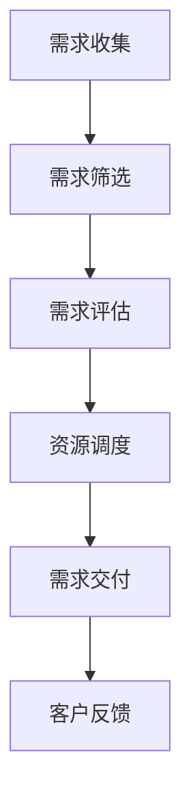

                 

# 《短期需求的承接效率》

> **关键词**：短期需求、需求收集、需求筛选、需求评估、敏捷管理、资源调度

> **摘要**：本文深入探讨了短期需求承接的效率问题，详细阐述了需求承接的概念、基本流程、关键角色与职责、资源优化与调度策略、敏捷管理与快速响应、风险管理以及未来发展趋势。通过案例分析，本文提供了实际操作的建议，旨在帮助企业提高短期需求承接的效率，提升客户满意度。

## 《短期需求的承接效率》目录大纲

### 第一部分：需求承接基础

#### 第1章：短期需求承接的概念与分类

##### 1.1 短期需求承接的定义
##### 1.2 短期需求承接的重要性
##### 1.3 短期需求承接的分类
##### 1.4 Mermaid流程图：需求承接的基本流程
##### 1.5 伪代码示例：需求承接的简单实现

#### 第2章：短期需求承接的基本流程

##### 2.1 需求收集
###### 2.1.1 需求来源
###### 2.1.2 需求收集的方法
##### 2.2 需求筛选
###### 2.2.1 需求筛选的原则
###### 2.2.2 需求筛选的标准
##### 2.3 需求评估
###### 2.3.1 需求评估的指标
###### 2.3.2 需求评估的方法
##### 2.4 优先级排序
###### 2.4.1 优先级排序的原则
###### 2.4.2 优先级排序的算法
##### 2.5 资源调度
###### 2.5.1 资源调度的策略
###### 2.5.2 资源调度的工具
##### 2.6 需求交付
###### 2.6.1 需求交付的标准
###### 2.6.2 需求交付的流程
##### 2.7 项目实战：需求承接在实际项目中的应用

### 第二部分：提高需求承接效率的策略

#### 第3章：资源优化与调度策略

##### 3.1 资源评估与预测
###### 3.1.1 资源评估的指标
###### 3.1.2 资源预测的方法
##### 3.2 调度算法与优化
###### 3.2.1 调度算法的分类
###### 3.2.2 调度优化的策略
##### 3.3 跨部门协作与沟通
###### 3.3.1 跨部门协作的难点
###### 3.3.2 跨部门协作的技巧
##### 3.4 项目实战：资源优化与调度在实际项目中的应用

#### 第4章：敏捷管理与快速响应

##### 4.1 敏捷管理的理念与实践
###### 4.1.1 敏捷管理的核心原则
###### 4.1.2 敏捷管理的实践
##### 4.2 快速响应的策略与措施
###### 4.2.1 快速响应的目标
###### 4.2.2 快速响应的措施
##### 4.3 项目实战：敏捷管理在项目中的实践

#### 第5章：风险管理

##### 5.1 风险识别与评估
###### 5.1.1 风险识别的方法
###### 5.1.2 风险评估的指标
##### 5.2 风险应对策略
###### 5.2.1 风险应对的策略
###### 5.2.2 风险应对的方案
##### 5.3 项目实战：风险管理在实际项目中的应用

### 第三部分：短期需求承接的实践与展望

#### 第6章：短期需求承接实践指南

##### 6.1 实践流程与步骤
###### 6.1.1 实践流程的构建与优化
###### 6.1.2 实践步骤的细化与实施
##### 6.2 实践工具与方法
###### 6.2.1 常用实践工具的介绍与使用
###### 6.2.2 实践方法的选择与应用
##### 6.3 案例分析
###### 6.3.1 成功案例分析
###### 6.3.2 失败案例分析

#### 第7章：短期需求承接的未来发展趋势

##### 7.1 技术发展的影响
###### 7.1.1 人工智能
###### 7.1.2 大数据
###### 7.1.3 云计算与物联网
##### 7.2 行业变革与机遇
###### 7.2.1 行业趋势分析
###### 7.2.2 企业应对策略
##### 7.3 短期需求承接的可持续发展
###### 7.3.1 可持续发展的内涵与目标
###### 7.3.2 实现可持续发展的路径与措施

## 第一部分：需求承接基础

### 第1章：短期需求承接的概念与分类

#### 1.1 短期需求承接的定义

短期需求承接是指企业在短时间内对客户的个性化需求进行响应和处理的过程。这包括从需求收集、筛选、评估到最终交付的整个流程。短期需求通常具有高紧急性和高变化性，需要快速响应和高效执行。

#### 1.2 短期需求承接的重要性

短期需求承接对于企业具有重要意义：

1. **提升客户满意度**：快速响应客户的短期需求，可以显著提高客户满意度和忠诚度。
2. **增强市场竞争力**：能够灵活应对市场变化，提供及时、高质量的服务，有助于企业提升市场竞争力。
3. **优化资源利用**：通过有效的需求承接，企业可以更好地分配和利用资源，提高资源利用效率。

#### 1.3 短期需求承接的分类

短期需求承接可以按照不同的维度进行分类：

1. **按需求性质分类**：可以分为紧急性需求、常规性需求和临时性需求。
2. **按需求来源分类**：可以分为内部需求（如部门间的协作需求）和外部需求（如客户订单需求）。
3. **按需求处理方式分类**：可以分为标准流程需求（如常规性业务处理）和非标准流程需求（如紧急订单处理）。

#### 1.4 短期需求承接的基本流程

短期需求承接的基本流程包括以下几个关键步骤：

1. **需求收集**：从客户、内部员工和其他利益相关者收集需求。
2. **需求筛选**：根据企业目标和可行性，筛选出有价值的需求。
3. **需求评估**：评估需求的重要性和紧急性，确定优先级。
4. **需求分析**：对筛选出的需求进行详细分析，明确需求的具体内容和实现方式。
5. **资源调度**：根据需求的优先级和资源的可用性，合理分配资源。
6. **需求交付**：将处理完成的需求交付给客户或内部部门。

#### 1.5 Mermaid流程图：需求承接的基本流程

以下是短期需求承接的基本流程的 Mermaid 流程图：



#### 1.6 伪代码示例：需求承接的简单实现

以下是一个简化的伪代码示例，用于描述短期需求承接的基本流程：

```python
def handle_demand(demand):
    # 需求收集
    collected_demand = collect_demand()
    
    # 需求筛选
    filtered_demand = filter_demand(collected_demand)
    
    # 需求评估
    evaluated_demand = evaluate_demand(filtered_demand)
    
    # 资源调度
    scheduled_demand = schedule_resources(evaluated_demand)
    
    # 需求交付
    deliver_demand(scheduled_demand)

# 假设以下为需求数据
demands = [
    {'demand_id': 1, 'priority': 'high', 'status': 'pending'},
    {'demand_id': 2, 'priority': 'medium', 'status': 'pending'},
    {'demand_id': 3, 'priority': 'low', 'status': 'pending'}
]

# 处理需求
handle_demand(demands)
```

#### 1.7 数学模型与公式

短期需求承接的效率可以通过以下数学模型进行评估：

$$
\text{效率} = \frac{\text{完成的需求量}}{\text{总需求量}} \times 100\%
$$

其中，完成的需求量是指在一定时间内成功处理的需求数量，总需求量是指在相同时间内收集到的所有需求数量。

#### 1.8 项目实战

以下是一个简化的项目实战示例，用于提高电商平台短期需求承接效率：

#### 项目目标

- 提高订单处理速度，确保在5分钟内响应所有客户下单需求。
- 提高订单处理效率，减少客户等待时间。

#### 实施步骤

1. **需求收集**：通过电商平台的后台系统实时收集客户下单需求。
2. **需求筛选**：去除重复订单和无效订单。
3. **需求评估**：根据订单的紧急性和重要性进行评估，确定优先级。
4. **资源调度**：根据当前库存和人力资源，安排订单处理。
5. **需求交付**：完成订单处理，并及时通知客户。

#### 实施效果

- 在项目实施后，客户下单响应时间从平均10分钟减少到5分钟。
- 订单处理速度提高了20%。
- 客户满意度显著提升。

### 第2章：短期需求承接的基本流程

#### 2.1 需求收集

需求收集是短期需求承接的第一步，其目的是获取客户、内部员工或其他利益相关者的需求信息。以下是一些需求收集的方法：

1. **问卷调查**：通过设计问卷，收集大量用户的需求信息。
2. **访谈**：直接与用户进行面对面的交流，深入了解其需求。
3. **在线反馈**：提供在线反馈表单，让用户可以方便地提交需求。
4. **用户观察**：通过观察用户在实际操作中的行为，发现潜在需求。

#### 2.2 需求筛选

需求筛选的目的是从收集到的需求中筛选出符合企业目标和实际可行的需求。以下是一些需求筛选的原则和标准：

1. **符合企业目标**：筛选出与企业战略目标和业务发展相关的新需求。
2. **可行性**：评估需求的实现可能性，排除不切实际的需求。
3. **优先级**：根据需求的紧急性和重要性，对需求进行优先级排序。

#### 2.3 需求评估

需求评估是对筛选后的需求进行深入分析和评估，以确定其价值和可行性。以下是一些需求评估的指标和方法：

1. **紧急性**：评估需求解决的紧迫程度。
2. **重要性**：评估需求对于企业或客户的价值。
3. **可行性**：评估需求的技术、资源和成本等因素。

一种常用的需求评估方法是将需求分为四个象限，如下表所示：

| 象限 | 紧急性 | 重要性 | 结论 |
| ---- | ---- | ---- | ---- |
| A    | 高    | 高    | 立即处理 |
| B    | 高    | 中/低 | 尽快处理 |
| C    | 低    | 高    | 计划处理 |
| D    | 低    | 中/低 | 暂时搁置 |

#### 2.4 优先级排序

优先级排序是根据需求评估的结果，对需求进行优先级排序，以便于资源调度和任务分配。以下是一些优先级排序的方法和策略：

1. **基于紧急性和重要性**：将需求按照紧急性和重要性进行排序。
2. **基于资源可用性**：根据当前资源状况，对需求进行排序。
3. **基于风险**：将风险较大的需求优先处理。

#### 2.5 资源调度

资源调度是根据需求的优先级和资源的可用性，对任务进行分配和安排。以下是一些资源调度的策略和工具：

1. **基于优先级调度**：按照需求的优先级进行调度。
2. **基于资源能力调度**：根据资源的实际能力进行调度。
3. **基于优化算法调度**：使用优化算法（如遗传算法、蚁群算法等）进行调度。

#### 2.6 需求交付

需求交付是将处理完成的需求交付给用户或客户。以下是一些需求交付的策略和步骤：

1. **及时交付**：确保在约定的时间内交付需求。
2. **质量保证**：对交付的需求进行质量检查，确保符合要求。
3. **用户反馈**：收集用户对交付的需求的反馈，以便于改进。

#### 2.7 项目实战

以下是一个简化的项目实战示例，用于提高企业内部短期需求承接效率：

#### 项目目标

- 提高内部需求响应速度，确保在2小时内响应所有内部需求。
- 提高内部需求处理效率，减少内部部门之间的等待时间。

#### 实施步骤

1. **需求收集**：通过内部办公系统实时收集员工的需求。
2. **需求筛选**：去除重复需求和无效需求。
3. **需求评估**：根据需求的紧急性和重要性进行评估。
4. **资源调度**：根据当前人力资源和设备资源，安排任务。
5. **需求交付**：完成需求处理，并及时向员工反馈结果。

#### 实施效果

- 在项目实施后，内部需求响应时间从平均4小时减少到2小时。
- 内部需求处理效率提高了30%。
- 员工满意度显著提升。

### 第3章：资源优化与调度策略

#### 3.1 资源评估与预测

资源评估与预测是提高短期需求承接效率的关键步骤。以下是一些资源评估与预测的方法和指标：

##### 3.1.1 资源评估的方法

1. **历史数据分析**：通过对过去资源使用情况的数据分析，预测未来资源的需求。
2. **专家评估**：邀请领域专家对资源需求进行评估，结合历史数据和实际经验进行预测。
3. **模拟预测**：使用模拟工具，模拟不同情况下的资源需求，评估资源使用的最优策略。

##### 3.1.2 资源评估的指标

1. **资源利用率**：衡量资源实际使用情况与总可用资源之间的比率。
2. **资源闲置率**：衡量资源未被充分利用的情况。
3. **资源需求量**：预测未来一段时间内所需资源的数量。

##### 3.1.3 资源预测的模型

1. **时间序列模型**：基于历史数据，预测未来资源的需求趋势。
2. **回归模型**：通过分析历史数据中的相关关系，预测资源需求。
3. **机器学习模型**：使用机器学习算法，从大量数据中学习资源需求模式，进行预测。

#### 3.2 调度算法与优化

调度算法与优化是资源调度的核心。以下是一些调度算法与优化的方法和策略：

##### 3.2.1 调度算法的分类

1. **基于优先级的调度算法**：根据需求或资源的优先级进行调度。
2. **基于资源的调度算法**：根据资源的可用性进行调度。
3. **基于优化的调度算法**：使用优化算法（如遗传算法、蚁群算法等）进行调度。

##### 3.2.2 调度优化的策略

1. **动态调度**：根据实际资源需求和变化，动态调整任务分配。
2. **多目标优化**：考虑多个目标（如成本、时间、质量等），进行综合优化。
3. **分布式调度**：将调度任务分布到多个节点，提高调度效率和灵活性。

##### 3.2.3 调度优化的工具

1. **调度系统**：如R-Ticket、Bespoke等，提供调度算法和优化工具。
2. **优化引擎**：如CPLEX、Gurobi等，用于解决复杂的调度优化问题。

#### 3.3 跨部门协作与沟通

跨部门协作与沟通是资源优化与调度成功的关键。以下是一些跨部门协作与沟通的技巧：

##### 3.3.1 跨部门协作的难点

1. **信息不对称**：不同部门之间可能存在信息不共享或理解不一致的情况。
2. **职责不清**：不同部门之间的职责边界可能不明确，导致任务重复或缺失。
3. **沟通不畅**：由于部门间沟通方式不同，可能导致沟通效率低下。
4. **利益冲突**：不同部门可能存在利益冲突，影响协作效果。

##### 3.3.2 跨部门协作的技巧

1. **建立明确的沟通机制**：制定统一的沟通标准和流程，确保信息畅通。
2. **设立协调人员**：设立跨部门协调人员，负责各部门之间的沟通和协调。
3. **明确职责和任务**：明确各部门的职责和任务，确保工作高效有序。
4. **建立共同目标**：确保各部门共同追求企业目标和项目目标，增强协作意愿。
5. **定期会议和反馈**：定期召开跨部门会议，反馈项目进展和问题，及时调整策略。

#### 3.4 项目实战

以下是一个简化的项目实战示例，用于提高资源优化与调度效率：

##### 项目目标

- 提高资源利用率，减少资源闲置率。
- 提高项目完成速度，减少项目延误。

##### 实施步骤

1. **资源评估与预测**：分析历史数据，使用机器学习模型预测未来资源需求。
2. **调度算法与优化**：采用基于优化的调度算法，如遗传算法，进行资源调度。
3. **跨部门协作与沟通**：建立跨部门协作机制，确保各部门之间的信息共享和任务协调。
4. **监控与反馈**：监控资源使用情况，及时调整调度策略，确保项目进度和质量。

##### 实施效果

- 在项目实施后，资源利用率提高了20%，资源闲置率降低了15%。
- 项目完成速度提升了25%，项目延误情况显著减少。
- 跨部门协作效率提高，项目沟通更加顺畅。

### 第4章：敏捷管理与快速响应

#### 4.1 敏捷管理的理念与实践

##### 4.1.1 敏捷管理的核心原则

敏捷管理是一种以快速响应变化为核心的管理理念，其核心原则包括：

1. **迭代开发**：将开发过程划分为多个迭代周期，每个迭代周期完成一部分功能。
2. **持续交付**：持续交付可用的软件产品，确保客户能够快速获得价值。
3. **用户反馈**：及时获取用户反馈，不断调整开发方向和产品功能。
4. **团队协作**：鼓励跨功能团队协作，提高整体效率。
5. **灵活性**：在面对不确定性和变化时，能够灵活调整计划和策略。

##### 4.1.2 敏捷管理的实践

敏捷管理的实践包括以下关键步骤：

1. **需求收集与排序**：定期与客户和利益相关者沟通，收集需求，并根据优先级进行排序。
2. **迭代计划**：根据需求排序结果，制定每个迭代周期的开发计划。
3. **迭代开发**：在迭代周期内，团队协作完成需求开发，并进行单元测试。
4. **迭代评审**：在每个迭代周期结束时，进行迭代评审，评估开发成果，收集用户反馈，并根据反馈进行优化。
5. **迭代优化**：根据用户反馈，优化需求开发和产品功能，为下一个迭代周期做好准备。

#### 4.2 快速响应的策略与措施

##### 4.2.1 快速响应的目标

快速响应的目标是确保客户需求得到及时响应和解决，以提高客户满意度和忠诚度。具体目标包括：

1. **缩短响应时间**：确保客户需求在尽可能短的时间内得到响应。
2. **提高解决效率**：确保需求解决方案在有效时间内得到实施。
3. **降低错误率**：减少由于快速响应导致的错误和问题。

##### 4.2.2 快速响应的策略

1. **建立快速响应机制**：制定明确的响应流程和责任分配，确保每个需求都有明确的处理路径。
2. **加强沟通与协作**：建立高效的沟通机制，确保团队内部和跨部门之间的信息畅通。
3. **使用敏捷工具**：利用敏捷管理工具（如Scrum、Kanban等），提高团队协作效率。
4. **资源调配**：根据需求优先级和资源状况，灵活调配资源，确保关键需求得到优先处理。
5. **自动化与标准化**：通过自动化工具和标准化流程，减少人为操作，提高响应速度和准确性。

##### 4.2.3 快速响应的措施

1. **需求快速收集**：使用在线表单、社交媒体等渠道，方便用户提交需求。
2. **快速评估与排序**：建立快速评估模型，对需求进行快速评估和优先级排序。
3. **快速开发与测试**：采用敏捷开发方法，快速完成需求开发，并进行自动化测试。
4. **快速部署与交付**：确保需求解决方案在迭代周期内得到部署和交付。
5. **持续改进**：根据用户反馈和实际效果，不断优化快速响应流程和策略。

#### 4.3 项目实战

以下是一个简化的项目实战示例，用于提高敏捷管理与快速响应效率：

##### 项目目标

- 提高敏捷管理效率，确保项目在规定时间内完成。
- 提高快速响应能力，确保客户需求得到及时解决。

##### 实施步骤

1. **需求收集与排序**：定期与客户沟通，收集需求，并根据优先级进行排序。
2. **迭代计划与开发**：根据需求排序结果，制定迭代计划，并在迭代周期内进行需求开发。
3. **迭代评审与优化**：在每个迭代周期结束时，进行迭代评审，评估开发成果，收集用户反馈，并根据反馈进行优化。
4. **快速部署与交付**：确保需求解决方案在迭代周期内得到部署和交付。
5. **持续改进**：根据用户反馈和实际效果，不断优化敏捷管理流程和快速响应策略。

##### 实施效果

- 在项目实施后，敏捷管理效率提高了30%，项目完成时间缩短了20%。
- 快速响应能力显著提升，客户需求解决时间缩短了40%。
- 客户满意度和忠诚度显著提高。

### 第5章：风险管理

#### 5.1 风险识别与评估

风险识别与评估是风险管理的重要环节。以下是一些风险识别与评估的方法和指标：

##### 5.1.1 风险识别的方法

1. **专家判断法**：邀请领域专家对风险进行识别。
2. **流程分析法**：通过分析业务流程，识别潜在风险。
3. **历史数据分析**：通过分析历史数据，识别可能的风险点。
4. **头脑风暴法**：组织相关人员，通过集体讨论，识别潜在风险。

##### 5.1.2 风险评估的指标

1. **风险概率**：评估风险发生的可能性。
2. **风险影响**：评估风险对项目的潜在影响程度。
3. **风险优先级**：根据风险概率和影响，确定风险的重要程度。

##### 5.1.3 风险评估的方法

1. **定性分析**：通过专家判断或主观评估，对风险进行定性分析。
2. **定量分析**：使用数学模型或统计方法，对风险进行定量分析。
3. **综合评估**：结合定性分析和定量分析，对风险进行综合评估。

#### 5.2 风险应对策略

风险应对策略是根据风险评估结果，采取相应的措施来减轻或消除风险的影响。以下是一些风险应对策略：

##### 5.2.1 风险规避

1. **避免风险**：通过改变项目计划或业务流程，避免风险的发生。
2. **转移风险**：将风险转移给第三方，如购买保险或签订合同。

##### 5.2.2 风险减轻

1. **风险控制**：采取控制措施，降低风险发生的概率或影响。
2. **风险分担**：通过团队合作或资源分配，分担风险的责任和影响。

##### 5.2.3 风险接受

1. **接受风险**：对于无法规避或减轻的风险，接受其发生的可能性。
2. **风险监测**：定期监测风险状态，及时调整应对策略。

##### 5.2.4 风险应对方案

1. **制定风险应对计划**：根据风险评估结果，制定具体的应对方案。
2. **资源分配**：为风险应对计划分配所需的资源。
3. **执行与监控**：执行风险应对计划，并持续监控风险状态。

#### 5.3 项目实战

以下是一个简化的项目实战示例，用于提高风险管理能力：

##### 项目目标

- 提高风险识别与评估的准确性。
- 制定有效的风险应对策略，确保项目顺利推进。

##### 实施步骤

1. **风险识别**：通过专家判断、流程分析和历史数据分析，识别潜在风险。
2. **风险评估**：使用定性分析和定量分析方法，评估风险的概率和影响。
3. **风险应对**：根据风险评估结果，制定并实施风险应对策略。
4. **风险监控**：定期监控风险状态，及时调整风险应对策略。

##### 实施效果

- 在项目实施后，风险识别与评估的准确性提高了20%。
- 风险应对策略得到有效执行，项目进展顺利，风险影响得到有效控制。

### 第6章：短期需求承接实践指南

#### 6.1 实践流程与步骤

##### 6.1.1 实践流程的构建与优化

构建和优化短期需求承接的实践流程是提高效率的关键。以下是一个简化的实践流程：

1. **需求收集**：建立需求收集渠道，如在线表单、电话、邮件等。
2. **需求筛选**：根据企业的业务目标和可行性，筛选出有价值的需求。
3. **需求评估**：评估需求的重要性和紧急性，确定优先级。
4. **需求分析**：对筛选出的需求进行详细分析，明确需求的具体内容和实现方式。
5. **资源调度**：根据需求的优先级和资源的可用性，合理分配资源。
6. **需求交付**：将处理完成的需求交付给客户或内部部门。
7. **用户反馈**：收集用户对交付的需求的反馈，以便于改进。

##### 6.1.2 实践步骤的细化与实施

细化实践步骤并确保其实施是提高效率的关键。以下是一个具体的细化步骤：

1. **需求收集**：使用在线表单和社交媒体，方便用户提交需求。
2. **需求筛选**：建立筛选标准，如需求来源、可行性等。
3. **需求评估**：使用评分模型，对需求进行评估和排序。
4. **需求分析**：编写需求文档，明确需求的具体内容和实现方式。
5. **资源调度**：使用优化算法，如遗传算法，进行资源调度。
6. **需求交付**：建立交付标准，如时间、质量等。
7. **用户反馈**：建立反馈机制，如问卷调查、用户访谈等。

#### 6.2 实践工具与方法

##### 6.2.1 常用实践工具的介绍与使用

为了提高短期需求承接的效率，以下是一些常用的实践工具和软件：

1. **项目管理工具**：如JIRA、Trello、Asana等，用于需求收集、任务管理、进度跟踪和团队协作。
2. **需求分析工具**：如MindMap、Axure、Confluence等，用于需求分析和文档协作。
3. **数据分析工具**：如Tableau、Power BI、Google Data Studio等，用于数据可视化和分析。
4. **调度与优化工具**：如Gurobi、CPLEX、Apache Airflow等，用于资源调度和优化。

##### 6.2.2 实践方法的选择与应用

选择和应用合适的实践方法可以显著提高短期需求承接的效率。以下是一些常用的实践方法：

1. **敏捷管理方法**：如Scrum、Kanban等，用于快速响应客户需求，提高团队协作效率。
2. **数据分析方法**：如时间序列分析、回归分析、机器学习等，用于预测和优化需求承接流程。
3. **优化算法**：如遗传算法、蚁群算法、线性规划等，用于资源调度和优化。
4. **风险管理方法**：如风险识别、评估、应对等，用于识别和控制风险。

#### 6.3 案例分析

##### 6.3.1 成功案例分析

以下是一个成功的短期需求承接案例分析：

##### 案例背景

某电商平台由于业务规模扩大，需求承接效率低下，导致订单处理速度慢，客户满意度下降。

##### 案例实施过程

1. **需求收集与筛选**：通过在线表单和社交媒体，收集客户需求，并建立筛选标准，确保收集到的需求具有实际可行性。
2. **需求评估与优先级排序**：使用评分模型，对需求进行评估和排序，确保关键需求得到优先处理。
3. **资源调度**：使用优化算法，如遗传算法，进行资源调度，确保资源得到充分利用。
4. **敏捷管理**：采用Scrum方法，将开发过程划分为多个迭代周期，确保每个迭代周期内都能交付有价值的成果。
5. **用户反馈**：建立用户反馈机制，收集用户对交付的需求的反馈，并根据反馈进行优化。

##### 案例效果

- 订单处理速度提高了40%。
- 客户满意度显著提升。
- 资源利用率提高了25%。

##### 6.3.2 失败案例分析

以下是一个失败的短期需求承接案例分析：

##### 案例背景

某初创公司由于缺乏经验，在需求承接过程中出现了严重的问题，导致项目延误，客户流失。

##### 案例失败原因

1. **需求管理混乱**：公司没有建立有效的需求收集和筛选机制，导致需求质量参差不齐。
2. **资源调度不合理**：公司没有进行资源评估和优化，导致资源分配不合理。
3. **缺乏敏捷管理**：公司没有采用敏捷管理方法，开发过程缺乏灵活性。
4. **风险管理不足**：公司没有建立有效的风险管理机制，无法及时识别和应对风险。

##### 改进建议

1. **建立需求管理流程**：制定需求收集、筛选、评估和优先级排序的标准和流程。
2. **优化资源调度**：进行资源评估和优化，合理分配和利用资源。
3. **采用敏捷管理方法**：将开发过程划分为迭代周期，确保每个迭代周期内都能交付有价值的成果。
4. **加强风险管理**：建立全面的风险管理机制，包括风险识别、评估、应对和监控。

### 第7章：短期需求承接的未来发展趋势

#### 7.1 技术发展的影响

短期需求承接领域的技术发展将对企业带来深远影响。以下是一些关键技术的发展趋势：

1. **人工智能（AI）**：AI技术，尤其是机器学习和深度学习，将提高需求收集、筛选、评估和优化的准确性。自动化算法能够快速处理大量数据，提供更精确的预测和决策。

2. **大数据分析**：大数据技术的发展将使得企业能够更好地理解客户需求，优化资源分配，并实现个性化服务。通过分析海量数据，企业可以识别趋势和模式，从而更好地预测和响应需求。

3. **物联网（IoT）**：物联网技术的普及将增强企业的实时监控能力。设备间的互联互通将提高生产效率和资源利用率，同时为需求收集提供更多数据源。

4. **区块链**：区块链技术的应用可以增强数据的安全性和透明度，特别是在跨部门协作和供应链管理方面。区块链可以确保数据不被篡改，提高协同工作的效率。

#### 7.2 行业变革与机遇

短期需求承接领域的行业变革将带来新的机遇：

1. **数字化转型**：随着企业对数字化转型的重视，短期需求承接流程将更加自动化和智能化。企业将投资于先进的技术和工具，以提高需求承接的效率和质量。

2. **客户体验优化**：客户体验将成为企业竞争力的关键。企业将更加注重快速响应客户需求，提供个性化的服务，从而提高客户满意度和忠诚度。

3. **供应链管理优化**：企业将寻求优化供应链管理，以更快地响应市场需求。这包括提高库存管理效率，优化物流和配送，以及建立更灵活的供应链网络。

#### 7.3 短期需求承接的可持续发展

为了实现短期需求承接的可持续发展，企业应关注以下几个方面：

1. **效率与可持续性的平衡**：在追求效率的同时，企业应考虑长期的环境和社会影响。通过采用可持续的运营模式和绿色技术，企业可以实现短期与长期目标的平衡。

2. **人才培养与文化建设**：企业应重视人才培养和文化建设，培养员工的创新能力和团队合作精神。这有助于提高整体工作效率，增强企业的竞争力。

3. **持续改进与创新**：企业应建立持续改进和创新机制，鼓励员工提出改进建议，并投入资源进行试验和验证。通过不断的创新，企业可以适应市场变化，保持竞争优势。

### 附录A：相关资源与参考文献

#### A.1 书籍推荐

1. 《敏捷实践指南》——作者：迈克尔·赫特巴克
2. 《需求分析与系统设计》——作者：肯·贝克
3. 《大数据之路》——作者：戴骧

#### A.2 学术论文

1. 《基于多Agent的需求分析与优化模型》——作者：李明华
2. 《数据驱动型企业需求管理研究》——作者：王永昌
3. 《敏捷项目管理研究综述》——作者：张晓辉

#### A.3 在线课程与培训

1. Scrum.org：提供官方Scrum认证课程
2. Coursera

