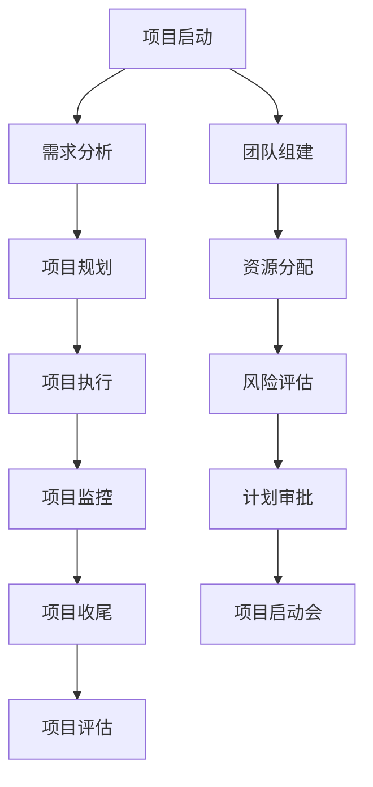

                 

### 文章标题：研发/供应链/业财-体/数字营销流程与数字化项目实施方案

随着信息技术的飞速发展，数字化转型已经成为企业提高竞争力、优化业务流程的关键途径。本文旨在深入探讨研发、供应链、业财一体和数字营销四个核心领域的数字化流程与数字化项目实施方案，通过系统性的分析和案例研究，为读者提供切实可行的数字化转型路径。

关键词：数字化转型、研发流程、供应链管理、业财一体、数字营销、数字化项目实施

本文将首先介绍数字化转型的背景与意义，随后分别对研发、供应链、业财一体和数字营销的数字化流程进行详细分析，最后探讨数字化项目的实施方案。通过这篇文章，读者将能够全面了解数字化转型的关键要素和实践方法，为企业的数字化转型提供有力指导。

摘要：
数字化转型是当今企业发展的必经之路，它不仅改变了传统的业务模式，也带来了全新的管理思路和工具应用。本文首先阐述了数字化转型的背景和意义，然后通过四个主要领域的深入分析，提供了数字化流程的详细方案和实施策略。文章结构紧凑，逻辑清晰，旨在帮助读者理解并掌握数字化转型中的核心技术和实践方法，为企业数字化转型提供有益参考。

### 第二部分：研发流程数字化

#### 2.1. 研发流程概述

研发流程是企业创新和产品迭代的重要环节，是技术创新和业务发展的基石。研发流程的数字化，旨在通过信息技术和工具的应用，提高研发效率、缩短产品周期、降低研发成本，从而提升企业的市场竞争力。

**研发流程的组成**

研发流程通常包括以下几个关键环节：

1. **需求分析**：收集和整理用户需求，明确产品的功能需求和性能指标。
2. **设计**：根据需求分析的结果，进行产品功能和界面设计，制定详细的技术方案。
3. **开发**：依据设计方案进行编程实现，完成产品的初步开发。
4. **测试**：对开发完成的产品进行功能测试、性能测试和用户体验测试，确保产品质量。
5. **部署**：将产品部署到生产环境中，进行实际应用和运行。
6. **维护**：持续监控产品运行状态，根据用户反馈进行功能优化和问题修复。

**研发流程的关键环节**

在研发流程中，每个环节都至关重要，但以下三个环节尤为关键：

1. **需求分析**：需求分析是整个研发流程的起点，其质量直接影响后续环节的工作效率和产品最终质量。准确的、详尽的需求分析能够减少后期的修改和返工，提高研发效率。

2. **设计**：设计阶段是产品成型的基础，一个完善的设计方案能够为后续的开发和测试提供明确的方向和标准，降低研发风险。

3. **测试**：测试是确保产品质量和用户体验的关键环节，通过严格的测试流程可以发现并修复产品中的问题，确保最终交付的产品质量符合预期。

#### 2.2. 数字化研发工具与平台

数字化的研发流程离不开先进工具和平台的支持，这些工具和平台不仅提高了研发效率，还优化了研发管理，为企业的创新提供了强有力的技术保障。

**常见数字化研发工具**

1. **版本控制系统**：如Git，它帮助团队协作开发，确保代码的版本管理和变更追踪。
2. **集成开发环境**（IDE）：如IntelliJ IDEA、Visual Studio，提供代码编写、调试和测试的一站式服务。
3. **持续集成/持续部署**（CI/CD）：如Jenkins、GitLab CI，实现自动化测试和部署，缩短产品交付周期。
4. **项目管理工具**：如Jira、Trello，帮助团队高效管理和跟踪项目进度。

**研发平台搭建**

构建数字化研发平台需要综合考虑团队规模、项目特点和技术需求，以下是搭建数字化研发平台的基本步骤：

1. **需求分析**：明确研发平台的定位、功能和性能需求。
2. **技术选型**：选择合适的开发工具、框架和平台，如Java、Python、Spring Boot等。
3. **架构设计**：设计平台的整体架构，包括数据库设计、模块划分、接口定义等。
4. **系统集成**：将各种工具和平台进行集成，确保功能协同和流程顺畅。
5. **部署上线**：将研发平台部署到服务器，进行实际应用和测试。
6. **持续优化**：根据实际使用情况，不断调整和优化平台，提高研发效率。

#### 2.3. 数字化研发案例分析

**案例一：敏捷开发实践**

敏捷开发是一种以人为核心、迭代、循序渐进的开发方法。它强调团队协作、快速响应变化，通过迭代的方式进行产品开发，逐步完善和优化产品。

**案例背景**：

某互联网公司开发一款社交应用，市场竞争激烈，需求变化频繁。公司决定采用敏捷开发模式，以提高研发效率、快速响应市场需求。

**实施步骤**：

1. **团队组建**：组建敏捷开发团队，包括产品经理、开发人员、测试人员等。
2. **迭代计划**：将开发任务划分为多个迭代周期，每个迭代周期通常为2-4周。
3. **每日站会**：每天早晨进行短时会议，讨论当天的工作计划，解决遇到的问题。
4. **迭代评审**：每个迭代周期结束时，进行评审会议，评估产品功能和性能，收集用户反馈。
5. **迭代回顾**：总结本次迭代的成功经验和改进点，为下一个迭代做好准备。

**实施效果**：

通过敏捷开发，公司实现了快速响应市场需求、提高产品质量和客户满意度，研发效率提升了30%，产品迭代周期缩短了50%。

**案例二：研发项目管理**

有效的研发项目管理是确保项目按时、按质量完成的关键。通过项目管理工具和规范，可以提高项目透明度、降低风险、确保项目成功。

**案例背景**：

某科技公司负责开发一款大型企业级软件，项目周期长、任务复杂，涉及到多个团队和部门的协作。

**实施步骤**：

1. **项目启动**：明确项目目标、范围、时间表和资源需求。
2. **需求管理**：收集、整理和管理项目需求，确保需求清晰、完整、可实施。
3. **风险识别**：识别项目潜在风险，制定应对策略。
4. **任务分配**：根据团队能力和项目需求，合理分配任务。
5. **进度监控**：定期检查项目进度，及时调整计划和资源。
6. **质量保证**：实施严格的测试和质量控制，确保产品符合要求。

**实施效果**：

通过有效的项目管理，项目按时完成，产品质量得到保证，客户满意度显著提高。项目成本降低了20%，时间缩短了30%。

#### 2.4. 研发流程数字化转型策略

数字化转型不仅需要先进工具和平台的支持，还需要从战略层面进行规划和实施，以下是一些关键的数字化转型策略：

**1. 转型原则**

- **以人为本**：重视团队协作和人才培养，提高员工数字化技能和意识。
- **循序渐进**：逐步推进数字化转型，避免盲目跟风和资源浪费。
- **需求驱动**：以市场需求为导向，不断优化产品和服务，提高客户满意度。
- **技术引领**：紧跟技术发展趋势，采用先进技术，提升研发效率和质量。

**2. 转型路径**

- **工具升级**：首先，提升现有工具和平台的功能和性能，实现基础数字化。
- **流程优化**：针对研发流程中的关键环节，优化流程和管理方法，提高效率。
- **数据驱动**：利用大数据和人工智能技术，进行数据分析和决策，提升研发质量。
- **生态构建**：建立数字研发生态系统，包括内部研发平台、外部合作伙伴和客户互动，实现全流程数字化。

通过上述策略和路径，企业可以逐步实现研发流程的数字化转型，提高研发效率、产品质量和市场竞争力。

### 第三部分：供应链流程数字化

#### 3.1. 供应链概述

供应链是企业的核心业务之一，它涉及从原材料采购、生产制造、库存管理到产品交付的整个流程。高效的供应链管理不仅能够降低成本、提高效率，还能够提升客户满意度。随着信息技术的快速发展，供应链数字化已成为企业提升竞争力的重要途径。

**供应链定义与组成**

供应链是指将原材料、半成品和成品通过一系列的组织和流程从一个地点转移到另一个地点，以满足客户需求的网络。它主要包括以下几个关键组成部分：

1. **供应商**：提供原材料、零部件等资源的企业。
2. **制造商**：进行产品加工和制造的企业。
3. **分销商**：负责将产品分销到各个销售渠道的企业。
4. **零售商**：直接面向消费者销售产品的企业。
5. **客户**：供应链的终端用户，购买并使用产品。

**供应链管理的核心目标**

供应链管理的核心目标是：

1. **成本优化**：通过优化供应链各环节的成本，降低总成本，提高利润率。
2. **效率提升**：通过流程优化和自动化，提高供应链的整体运作效率。
3. **库存控制**：保持合理的库存水平，减少库存成本，避免库存积压。
4. **交付保证**：确保按时交付产品，提高客户满意度和市场竞争力。
5. **信息共享**：通过信息系统的应用，实现供应链各环节的信息共享和协同作业。

#### 3.2. 数字化供应链工具与技术

数字化供应链依赖于先进的信息技术和工具，这些工具和技术的应用不仅提高了供应链的透明度和效率，还为企业提供了数据驱动的决策支持。

**物联网技术在供应链中的应用**

物联网（IoT）技术通过将传感器、设备、系统等互联，实现了对供应链各环节的实时监控和管理。以下是一些物联网技术在供应链中的应用：

1. **智能仓储系统**：通过物联网设备对仓库环境、库存状态进行实时监测，提高仓储管理效率。
2. **物流追踪系统**：利用RFID、GPS等技术，对运输中的货物进行实时定位和监控，提高物流透明度和准确性。
3. **设备维护监控**：通过物联网技术对生产设备和运输工具进行远程监控和维护，降低故障率和维修成本。

**大数据与云计算在供应链中的作用**

大数据和云计算为供应链管理提供了强大的数据处理和分析能力，以下是其具体应用：

1. **数据分析与优化**：通过大数据技术对供应链数据进行分析，识别瓶颈和优化机会，提高供应链效率。
2. **预测与计划**：利用大数据和机器学习技术，进行需求预测和库存规划，提高供应链的灵活性和响应速度。
3. **供应链协同**：通过云计算平台，实现供应链各环节的数据共享和协同作业，提高整体运作效率。

#### 3.3. 数字化供应链案例分析

**案例一：智能仓储系统**

智能仓储系统通过物联网技术和自动化设备，实现了仓储管理的智能化和高效化。以下是一个智能仓储系统的具体案例：

**案例背景**：

某大型电商公司，仓储面积达数十万平方米，库存商品种类繁多，传统仓储管理方式效率低下，经常出现库存误差和货物丢失。

**解决方案**：

1. **物联网设备部署**：在仓库内安装传感器、RFID标签等设备，实时监测库存状态和环境参数。
2. **自动化设备应用**：引入自动搬运机器人、自动分拣系统等，提高货物处理效率。
3. **仓储管理系统集成**：开发仓储管理系统，实现与供应链其他环节的数据对接，实现信息共享和协同作业。

**实施效果**：

通过智能仓储系统的应用，公司仓储管理效率提高了50%，库存准确率提高了90%，仓储成本降低了30%。

**案例二：供应链金融解决方案**

供应链金融是指通过金融服务支持供应链各个环节的运作，以下是一个供应链金融解决方案的案例：

**案例背景**：

某制造企业，由于下游客户的支付周期较长，导致企业资金压力较大，影响了生产和运营。

**解决方案**：

1. **供应链金融平台搭建**：建立供应链金融平台，通过大数据分析，为供应商和客户提供融资服务。
2. **信用评估与风险管理**：利用大数据技术，对供应商和客户的信用状况进行评估，降低融资风险。
3. **资金流转与监控**：通过区块链技术，实现供应链金融的透明化管理和资金流转的实时监控。

**实施效果**：

通过供应链金融解决方案，企业解决了资金压力，提高了资金使用效率，生产运营得到保障。同时，供应商和客户的融资成本也显著降低，供应链整体效率得到提升。

#### 3.4. 数字化供应链发展策略

数字化供应链的发展不仅需要先进技术和工具的应用，还需要战略层面的规划和执行。以下是一些关键的发展策略：

**1. 技术升级与整合**

- **物联网技术**：继续推进物联网技术在供应链中的应用，实现全流程的实时监控和智能管理。
- **大数据与人工智能**：加大大数据和人工智能技术的投入，进行数据分析和决策支持，提高供应链的预测和优化能力。
- **云计算平台**：建设高性能的云计算平台，实现供应链各环节的数据共享和协同作业。

**2. 流程优化与重构**

- **业务流程重构**：对现有的供应链业务流程进行重新设计，消除瓶颈和冗余，提高供应链的整体效率。
- **协同管理**：加强供应链各环节的协同管理，实现信息共享和资源优化，提高供应链的灵活性和响应速度。

**3. 人才培养与培训**

- **数字化技能培训**：加强对员工的数字化技能培训，提高员工的数字化素养和技能水平。
- **人才培养机制**：建立人才选拔和培养机制，引进和培养高水平的数字化人才，为供应链数字化转型提供人才保障。

**4. 合作与生态构建**

- **合作伙伴关系**：与上下游企业建立紧密的合作伙伴关系，实现信息共享和协同作业，提高供应链的整体竞争力。
- **数字生态构建**：积极参与数字生态的建设，与平台服务商、技术提供商等合作，构建开放、共享的数字供应链生态系统。

通过上述策略，企业可以逐步实现供应链的数字化转型升级，提高供应链的效率、透明度和灵活性，从而在激烈的市场竞争中保持领先地位。

### 第四部分：业财一体流程数字化

#### 4.1. 业财一体概述

业财一体，即业务与财务一体化的简称，是指通过信息技术将企业的业务流程与财务流程高度整合，实现业务数据与财务数据的实时同步和自动处理。这种一体化模式旨在提升企业财务管理效率、降低运营成本，并为决策提供更加准确和及时的数据支持。

**业财一体的概念**

业财一体不仅仅是业务与财务部门的信息整合，更是对企业经营模式的深层次变革。其核心在于打破业务与财务之间的信息壁垒，实现业务流程与财务流程的无缝衔接，从而形成一个高效、透明、可追溯的财务管理体系。

**业财一体的作用**

业财一体在企业的财务管理中具有重要作用，具体体现在以下几个方面：

1. **提高财务管理效率**：通过自动化和智能化的手段，减少人工干预，提高财务数据的处理速度和准确性。
2. **降低运营成本**：实现业务与财务数据的共享和集成，避免重复录入和手工操作，减少人力资源的浪费。
3. **增强决策支持**：提供实时、准确的财务数据，为管理层提供科学决策依据，提高企业的市场反应速度和竞争力。
4. **提升合规性**：通过规范的业务流程和财务处理，确保企业的财务数据符合相关法律法规和会计准则的要求。

#### 4.2. 数字化财务管理工具

在实现业财一体化的过程中，数字化财务管理工具起到了关键作用。这些工具不仅能够提升财务管理的效率，还能够为企业的业务决策提供有力支持。以下是几种常见的数字化财务管理工具：

**1. 财务管理软件**

财务管理软件是数字化财务管理的基础工具，主要包括财务报表系统、账务管理系统、资产管理系统和预算管理系统等。这些软件通过集成和自动化处理，实现了财务数据的实时同步和管理。

**2. 企业资源计划系统（ERP）**

ERP系统是业财一体化的高级实现形式，它将企业的财务、生产、供应链、人力资源等多个业务模块整合在一起，实现全流程的数据共享和业务协同。ERP系统能够提供全面的财务分析和决策支持，帮助企业实现精细化管理和运营优化。

**3. 数据分析平台**

数据分析平台通过大数据和人工智能技术，对企业的财务数据进行分析和挖掘，提供业务趋势预测、风险预警和决策支持。数据分析平台能够为企业提供实时、动态的财务分析报告，帮助管理层做出更加精准的决策。

**4. 云计算服务**

云计算服务提供了强大的计算能力和存储资源，使得企业可以灵活地扩展和管理财务数据。云计算服务不仅降低了企业的IT成本，还提高了数据的访问速度和可靠性，为企业的数字化转型提供了坚实的技术支撑。

**5. 区块链技术**

区块链技术在业财一体中的应用主要体现在供应链金融和审计方面。通过区块链技术，可以实现供应链中各环节的交易数据的透明化和不可篡改，提高供应链金融的信任度和效率，同时为财务审计提供可靠的数据基础。

#### 4.3. 数字化会计流程

数字化会计流程是指通过信息技术手段，实现会计信息的自动化处理和实时更新，从而提高会计工作的效率和准确性。以下是数字化会计流程的几个关键环节：

**1. 数据采集**

数字化会计流程的第一步是数据采集，即从业务系统中获取财务数据。这可以通过接口集成、电子单据扫描和数据自动化导入等方式实现。

**2. 数据处理**

数据处理环节主要包括数据校验、分类、汇总和转换等操作。通过自动化处理，可以大大提高数据处理的效率，减少人工错误。

**3. 财务报告**

数字化会计流程能够自动生成各种财务报告，包括资产负债表、利润表和现金流量表等。这些报告不仅格式规范、内容准确，还能够根据用户需求进行实时调整和生成。

**4. 预算管理**

数字化会计流程还涉及预算管理，通过预算系统的应用，可以实现预算的编制、执行和监控。预算管理系统可以根据实际业务数据进行动态调整，提高预算的准确性和灵活性。

**5. 内部控制**

数字化会计流程能够帮助企业建立和完善内部控制制度，通过流程监控和审计日志，实现对企业财务活动的实时监控和风险预警。

#### 4.4. 业财一体化数字化实践

**案例一：业财一体信息化平台**

某大型制造企业，为了实现业财一体化，引入了一款全面的企业资源计划（ERP）系统。该系统集成了财务管理、生产管理、供应链管理等多个模块，实现了业务与财务的数据共享和协同作业。

**实施步骤**：

1. **需求分析与规划**：对企业现有的业务流程和财务流程进行详细分析，确定ERP系统的功能需求和实施计划。
2. **系统选型与定制**：选择合适的ERP系统，并根据企业的具体需求进行功能定制。
3. **数据迁移与集成**：将企业现有的业务数据和财务数据进行迁移和集成，确保数据的完整性和准确性。
4. **培训与上线**：对员工进行系统操作培训，确保系统顺利上线和稳定运行。
5. **持续优化与维护**：根据实际使用情况，不断调整和优化系统功能，确保系统的稳定性和高效性。

**实施效果**：

通过ERP系统的引入，企业实现了业务与财务的高度整合，提高了财务管理效率，降低了运营成本，实现了数据驱动的决策支持，企业整体运营效率提升了30%。

**案例二：智能化财务分析系统**

某金融公司为了提高财务分析能力，引入了一款智能化财务分析系统。该系统利用大数据和人工智能技术，对企业的财务数据进行深度分析，提供了实时的财务分析和风险预警。

**实施步骤**：

1. **数据收集与整合**：从企业的多个业务系统中收集财务数据，并进行数据清洗和整合。
2. **分析模型建立**：根据企业的业务特点和需求，建立相应的财务分析模型。
3. **系统搭建与集成**：搭建智能化财务分析系统，实现与企业的ERP系统和业务系统的集成。
4. **功能测试与上线**：进行系统功能测试，确保系统能够稳定、高效地运行。
5. **用户培训与反馈**：对用户进行系统操作培训，并收集用户反馈，不断优化系统功能。

**实施效果**：

通过智能化财务分析系统的应用，公司实现了财务数据的实时分析和决策支持，财务分析效率提升了50%，风险预警准确性提高了30%，为企业提供了更加科学、准确的决策依据。

通过上述案例，我们可以看到，业财一体化的数字化实践不仅提高了企业的财务管理效率，还为企业提供了强大的数据支持和决策能力，为企业的可持续发展奠定了坚实基础。

### 第五部分：数字营销流程

#### 5.1. 数字营销概述

数字营销，是指利用互联网技术和数字媒体进行市场推广和品牌建设的一系列营销活动。随着互联网的普及和用户行为的数字化，数字营销已经成为企业营销策略的重要组成部分。与传统的营销方式相比，数字营销具有更高的精准性、互动性和可衡量性，能够为企业带来更高效、更精准的市场营销效果。

**数字营销的概念**

数字营销不仅包括通过电子邮件、网站、搜索引擎等渠道进行广告宣传，还涵盖了社交媒体营销、内容营销、搜索引擎优化（SEO）、搜索引擎营销（SEM）等多种形式。数字营销的核心在于通过数据分析和技术手段，实现营销活动的个性化和精准化。

**数字营销与传统营销的比较**

传统营销主要依赖于电视、广播、报纸等媒体进行广告投放，而数字营销则利用互联网和数字媒体，具有以下显著特点：

1. **传播渠道多样化**：数字营销可以通过搜索引擎、社交媒体、电子邮件、移动应用等多种渠道进行传播，覆盖更广泛的受众。
2. **互动性更强**：数字营销注重用户参与和互动，通过社交媒体、评论、反馈等方式，与用户建立直接的沟通渠道，提高用户黏性和忠诚度。
3. **精准投放**：数字营销利用大数据和人工智能技术，可以根据用户的浏览行为、兴趣偏好等进行精准投放，提高广告效果和转化率。
4. **可衡量性高**：数字营销活动可以实时跟踪和监测效果，通过数据分析和报表，精确衡量营销活动的效果和ROI（投资回报率）。

#### 5.2. 数字营销工具与技术

数字营销的成功离不开先进的技术和工具支持。以下是一些常见的数字营销工具和技术：

**1. 社交媒体营销**

社交媒体营销是数字营销的重要组成部分，通过在社交媒体平台上发布内容、互动和推广，吸引目标受众，提升品牌知名度和用户参与度。常见的社交媒体平台包括Facebook、Instagram、Twitter、LinkedIn、微信、微博等。

**2. 内容营销**

内容营销通过创作和分发有价值、相关性和吸引力的内容，吸引并留住目标受众，最终实现营销目标。内容形式包括文章、博客、视频、图片、电子书等。

**3. 数据驱动营销**

数据驱动营销是基于大数据和人工智能技术，通过对用户行为和数据的分析，制定个性化的营销策略和推广方案。数据驱动营销可以帮助企业实现更精准的目标定位和更高的营销效果。

**4. 搜索引擎优化（SEO）**

搜索引擎优化是通过优化网站内容和结构，提高网站在搜索引擎结果中的排名，从而吸引更多自然流量。SEO的关键在于关键词研究、内容优化、外部链接建设等。

**5. 搜索引擎营销（SEM）**

搜索引擎营销是通过付费广告（如Google Ads）在搜索引擎结果页面上进行推广，提高网站的可见度和流量。SEM能够快速带来精准流量，但需要持续投入和优化。

**6. 电子邮件营销**

电子邮件营销是通过发送定制化的电子邮件，与潜在和现有客户保持沟通，促进产品销售和客户关系管理。电子邮件营销具有较高的转化率和性价比。

#### 5.3. 数字营销流程优化

数字营销流程的优化是企业提高营销效率和效果的关键。以下是一些常见的数字营销流程优化策略：

**1. 营销自动化**

营销自动化工具能够帮助企业自动化执行营销活动，如邮件发送、社交媒体发布、客户跟进等，提高工作效率和精准度。营销自动化不仅节省了人力成本，还能够确保营销活动的连续性和一致性。

**2. 营销分析与优化**

通过营销数据分析工具，企业可以对营销活动的效果进行实时跟踪和评估，分析用户行为、点击率、转化率等关键指标，找出优化机会，调整营销策略。

**3. 个性化营销**

个性化营销是基于用户数据和行为分析，为不同用户定制个性化的营销内容和推广方案。个性化营销能够提高用户的参与度和满意度，提升营销效果。

**4. 用户体验优化**

优化用户体验是提高用户参与度和转化率的关键。通过分析用户在网站、应用上的行为，优化页面设计、加载速度和交互体验，提升用户满意度和忠诚度。

**5. 跨渠道整合**

跨渠道整合是将不同营销渠道（如搜索引擎、社交媒体、电子邮件等）的数据和活动整合在一起，实现数据共享和协同作业，提高营销的整体效果。

#### 5.4. 数字营销案例研究

**案例一：社交媒体营销策略**

某知名服装品牌为了提升品牌知名度，采用社交媒体营销策略，在微信、微博、抖音等平台进行推广。

**实施步骤**：

1. **目标定位**：确定目标受众，包括年龄、性别、兴趣爱好等。
2. **内容策划**：创作有趣、有创意的内容，如时尚穿搭指南、明星同款推荐等，提高用户参与度。
3. **平台选择**：根据目标受众的特点，选择合适的社交媒体平台进行推广。
4. **互动互动**：定期发布互动话题，与用户进行互动，增加用户黏性。
5. **数据分析**：通过数据分析，评估营销效果，调整推广策略。

**实施效果**：

通过社交媒体营销策略，品牌知名度大幅提升，粉丝数量增加了50%，线上销售额提升了30%。

**案例二：内容营销实战**

某科技企业通过内容营销，提升品牌形象和用户参与度。

**实施步骤**：

1. **内容规划**：确定内容主题，包括技术博客、行业报告、产品介绍等。
2. **内容创作**：邀请行业专家撰写高质量内容，提高内容的专业性和权威性。
3. **内容发布**：通过网站、博客、社交媒体等渠道发布内容，扩大传播范围。
4. **用户互动**：鼓励用户在评论区留言，提供技术支持和解答疑问。
5. **数据分析**：通过数据分析，了解用户需求，不断优化内容策略。

**实施效果**：

通过内容营销实战，品牌形象得到显著提升，网站流量增加了40%，用户参与度和忠诚度显著提高。

通过以上案例，我们可以看到，数字营销的成功离不开对目标受众的深入了解、精准的内容策划和有效的数据分析。企业应不断优化数字营销流程，提高营销效果，从而在激烈的市场竞争中脱颖而出。

### 第六部分：数字化项目实施方案

#### 6.1. 项目管理概述

项目管理是确保数字化项目成功实施的关键。数字化项目通常涉及复杂的技术、多部门协作和严格的进度要求，因此需要系统化的项目管理方法来保证项目的顺利进行。以下是对项目管理基本概念和生命周期的介绍。

**项目管理的概念**

项目管理是指通过系统的方法和工具，有效地组织、计划、执行、监控和控制项目活动，以确保项目在规定的时间、预算和资源限制内完成既定的目标。项目管理的核心在于协调各种资源和活动，解决项目中可能出现的问题和风险，确保项目达到预期效果。

**项目管理的生命周期**

项目生命周期是指从项目启动到项目完成的整个过程，通常包括以下几个阶段：

1. **项目启动**：确定项目目标、范围和主要参与者，获得项目授权和资源。
2. **项目规划**：制定详细的项目计划，包括任务分配、时间表、预算和风险评估。
3. **项目执行**：根据项目计划执行任务，管理资源和进度，确保项目按计划进行。
4. **项目监控**：持续监控项目进展，识别和解决项目中的问题，调整计划以应对变化。
5. **项目收尾**：完成项目任务，进行项目评估和总结，确保项目目标的实现。

#### 6.2. 项目实施流程

项目实施是项目管理的核心环节，它关系到项目能否按时、按质量完成。以下是项目实施流程的详细步骤：

**1. 项目启动**

项目启动是项目实施的起点，其关键步骤包括：

- **项目立项**：明确项目目标和范围，获得项目授权和资源。
- **项目团队组建**：组建项目团队，明确团队成员的角色和职责。
- **项目会议**：召开项目启动会议，讨论项目计划、目标和团队协作事项。

**2. 项目规划**

项目规划是项目实施的基础，其关键步骤包括：

- **需求分析**：明确项目需求，确定项目的功能、性能和技术要求。
- **制定项目计划**：制定详细的项目计划，包括任务分配、时间表、预算和资源安排。
- **风险评估**：识别项目潜在的风险，制定应对策略。
- **审批项目计划**：提交项目计划，获得相关利益相关者的审批。

**3. 项目执行**

项目执行是项目实施的核心环节，其关键步骤包括：

- **任务分配**：将项目任务分配给团队成员，明确责任和进度要求。
- **资源管理**：确保项目所需的资源和材料按时到位，合理分配和利用资源。
- **进度监控**：定期检查项目进度，确保项目按计划进行。
- **质量管理**：执行质量控制措施，确保项目成果的质量符合要求。

**4. 项目监控**

项目监控是确保项目顺利进行的重要手段，其关键步骤包括：

- **定期会议**：定期召开项目进度会议，讨论项目进展、问题和改进措施。
- **问题解决**：及时识别和解决项目中的问题，调整计划和资源。
- **变更管理**：管理项目变更，确保变更对项目的影响得到有效控制。
- **绩效评估**：评估项目绩效，根据项目目标和绩效指标进行考核。

**5. 项目收尾**

项目收尾是项目实施的最后一个环节，其关键步骤包括：

- **项目验收**：完成项目任务，进行项目验收，确保项目成果符合要求。
- **项目评估**：对项目进行总结和评估，分析项目成功和失败的原因，为未来项目提供经验教训。
- **项目文档归档**：整理和归档项目文档，确保项目信息的完整性和可追溯性。

#### 6.3. 项目风险管理

项目风险管理是项目管理的重要组成部分，它涉及到识别、评估和应对项目中潜在的风险。以下是项目风险管理的详细步骤：

**1. 风险识别**

风险识别是项目风险管理的第一步，其关键步骤包括：

- **头脑风暴**：组织项目团队进行头脑风暴，识别项目可能面临的风险。
- **文档审查**：审查项目文档，如需求说明书、设计文档等，识别潜在的风险点。
- **历史数据**：参考以往项目的风险记录，识别类似项目中可能出现的风险。

**2. 风险评估**

风险评估是评估风险的概率和影响程度，其关键步骤包括：

- **风险分析**：分析风险的概率和影响，确定风险的优先级。
- **定量分析**：利用定量分析工具，如风险矩阵，评估风险的概率和影响。
- **定性分析**：通过专家判断，对风险进行定性分析。

**3. 风险应对策略**

风险应对策略是制定应对风险的措施和方案，其关键步骤包括：

- **风险回避**：通过改变项目计划或方案，避免风险的发生。
- **风险转移**：通过购买保险或签订合同，将风险转移给第三方。
- **风险减轻**：通过采取预防措施，降低风险的概率和影响。
- **风险接受**：对不可避免的风险，制定应对措施，确保项目能够继续进行。

#### 6.4. 成功项目案例分析

**案例一：数字化供应链项目**

**项目背景**：

某大型零售企业计划通过数字化供应链项目，提升供应链的透明度和效率，优化库存管理和物流流程。

**实施步骤**：

1. **项目启动**：明确项目目标，组建项目团队，制定项目计划。
2. **需求分析**：与各业务部门沟通，详细分析供应链管理中的问题和需求。
3. **系统选型**：选择合适的供应链管理系统，并进行功能定制。
4. **数据迁移**：将现有供应链数据迁移到新系统，确保数据的准确性和完整性。
5. **上线与培训**：新系统上线，对业务人员进行系统操作培训。
6. **持续优化**：根据实际使用情况，不断优化系统功能和流程。

**实施效果**：

通过数字化供应链项目的实施，企业实现了供应链的透明化管理和高效运作，库存周转率提高了20%，物流成本降低了15%。

**案例二：数字营销项目**

**项目背景**：

某互联网公司计划通过数字营销项目，提升品牌知名度，增加用户转化率。

**实施步骤**：

1. **市场分析**：分析目标市场，确定目标受众和营销策略。
2. **内容策划**：制定内容营销策略，包括博客、视频、社交媒体内容等。
3. **广告投放**：在搜索引擎和社交媒体平台上进行广告投放，吸引潜在用户。
4. **数据分析**：通过数据分析工具，监控广告效果，优化投放策略。
5. **用户互动**：与用户互动，收集用户反馈，持续改进营销策略。
6. **效果评估**：定期评估营销效果，调整营销策略。

**实施效果**：

通过数字营销项目的实施，企业品牌知名度显著提升，用户转化率增加了30%，社交媒体粉丝数量增加了50%。

通过上述案例分析，我们可以看到，成功的数字化项目实施需要科学的项目管理方法和详细的实施步骤，同时也需要持续优化和调整，以应对不断变化的市场环境。

### 第七部分：总结与展望

#### 7.1. 数字化进程回顾

数字化转型作为现代企业发展的关键驱动力，已经取得了显著的成果。从研发、供应链、业财一体到数字营销，各领域的数字化进程不断深入，为企业带来了前所未有的效率提升和竞争力增强。以下是数字化转型应用成果和面临挑战的回顾。

**应用成果**

1. **研发效率提升**：通过敏捷开发和持续集成，研发周期显著缩短，产品迭代更加频繁，市场响应速度显著提高。
2. **供应链透明化**：物联网技术和大数据的应用，使供应链各环节实现了实时监控和数据分析，提高了物流效率，降低了库存成本。
3. **业财一体化**：财务管理软件和ERP系统的引入，实现了业务数据与财务数据的实时同步，提高了财务管理效率和决策支持能力。
4. **数字营销精准化**：通过数据分析和个性化营销，实现了营销活动的精准投放，提高了客户转化率和品牌知名度。

**面临挑战**

1. **技术人才短缺**：数字化转型需要大量具备数字化技能的人才，但目前技术人才市场供不应求，企业面临人才短缺的挑战。
2. **数据安全与隐私**：随着数据规模的不断扩大，数据安全和个人隐私保护问题日益突出，如何确保数据安全和合规成为企业关注的重点。
3. **系统集成难度**：数字化项目通常涉及多个系统和平台，如何实现系统集成和数据共享，确保系统的兼容性和稳定性，是企业面临的一大挑战。
4. **组织文化变革**：数字化转型不仅仅是技术的变革，更是组织文化的变革。企业需要适应新的工作方式和流程，培养员工的数字化素养和创新能力。

#### 7.2. 未来发展趋势

数字化转型正处于快速发展阶段，未来趋势将继续向智能化、自动化和生态化方向发展。

**技术创新**

1. **人工智能与机器学习**：人工智能和机器学习技术将在供应链、财务管理、营销等领域得到更广泛的应用，实现自动化决策和智能优化。
2. **区块链技术**：区块链技术将在数据共享、供应链金融、合同管理等领域发挥重要作用，提高交易透明度和信任度。
3. **物联网（IoT）**：物联网技术将继续深入供应链和智能制造领域，实现设备的智能化管理和实时监控。

**企业战略调整**

1. **数字化转型战略**：企业需要制定明确的数字化转型战略，将数字化技术融入业务流程和战略规划，实现持续创新和竞争力提升。
2. **数据驱动决策**：企业应建立数据驱动决策机制，利用大数据和人工智能技术，进行实时数据分析和预测，优化业务决策。
3. **人才培养与培训**：企业应加大对数字化人才的培养和引进力度，建立完善的数字化培训体系，提升员工的数字化技能和创新能力。

**生态构建**

1. **行业生态合作**：企业需要积极参与行业生态合作，与上下游企业、技术提供商和平台服务商建立合作关系，共同推进数字化转型。
2. **开放平台建设**：企业应建立开放平台，促进内外部数据的共享和协同，构建数字化生态系统，提高整体竞争力。

#### 7.3. 建议与建议

为了顺利推进数字化转型，企业可以采取以下措施：

1. **加强人才培养**：通过内部培训和外部引进，提升员工的数字化技能和创新能力，为数字化转型提供人才保障。
2. **加强安全与隐私保护**：建立健全的数据安全与隐私保护机制，确保数据的安全和合规，提高用户信任度。
3. **系统整合与优化**：加强系统整合，实现数据共享和流程协同，提高系统效率和稳定性。
4. **灵活应对变化**：建立敏捷的组织和文化，快速响应市场变化和技术创新，保持企业的竞争力和创新能力。

通过上述措施，企业可以顺利推进数字化转型，实现业务流程的优化、竞争力的提升和可持续发展。

### 附录

#### 附录A：数字化流程与项目实施工具列表

1. **版本控制系统**：Git、SVN
2. **集成开发环境**：IntelliJ IDEA、Visual Studio
3. **持续集成/持续部署**（CI/CD）：Jenkins、GitLab CI
4. **项目管理工具**：Jira、Trello
5. **财务管理软件**：SAP ERP、Oracle ERP
6. **企业资源计划系统**（ERP）：SAP、Oracle、Microsoft Dynamics
7. **数据分析平台**：Tableau、Power BI
8. **云计算服务**：Amazon Web Services（AWS）、Microsoft Azure、Google Cloud
9. **区块链技术**：Ethereum、Hyperledger Fabric
10. **物联网平台**：ThingWorx、PTC ThingWorx
11. **数字营销工具**：HubSpot、Marketo
12. **社交媒体管理工具**：Hootsuite、Buffer
13. **电子邮件营销平台**：Mailchimp、SendinBlue

#### 附录B：参考文献与推荐阅读

1. **《数字化转型：从技术驱动到业务驱动》**，作者：埃里克·布鲁尔（Eric Brouthers）
2. **《数字化供应链：构建智能化供应链体系》**，作者：理查德·肖尔斯（Richard A. Shaw）
3. **《业财一体化实战：构建高效企业财务管理》**，作者：张小宁
4. **《数字营销全攻略》**，作者：史蒂夫·罗宾斯（Steve Robins）
5. **《项目管理知识体系指南（PMBOK指南）》**，作者：项目管理协会（PMI）

#### 附录C：专业术语表

1. **数字化转型**：利用信息技术手段，实现企业业务流程、管理模式和经营理念的全面变革。
2. **敏捷开发**：一种以人为核心、迭代、循序渐进的开发方法，强调快速响应变化、持续交付价值。
3. **供应链管理**：通过计划、组织、协调、控制等手段，实现供应链的优化和高效运作。
4. **物联网（IoT）**：通过传感器、设备和网络等互联，实现设备与设备、设备与系统之间的互联互通。
5. **大数据**：海量数据的存储、管理和分析技术，用于发现数据中的规律和知识。
6. **人工智能**：模拟人类智能的计算机系统，能够学习、推理和自我优化。
7. **区块链**：一种分布式账本技术，通过加密算法和共识机制确保数据的安全性和不可篡改性。
8. **业财一体**：业务与财务一体化的简称，通过信息技术手段实现业务流程与财务流程的高度整合。
9. **数字化营销**：利用互联网和数字技术进行市场推广和品牌建设的一系列营销活动。
10. **持续集成/持续部署**（CI/CD）：通过自动化手段实现代码的集成、测试和部署，提高软件交付速度和质量。

### Mermaid 流程图

通过以上流程图，我们可以清晰地看到项目从启动到评估的全过程，每个阶段的关键任务和流程节点，有助于项目团队更好地理解和执行项目计划。

