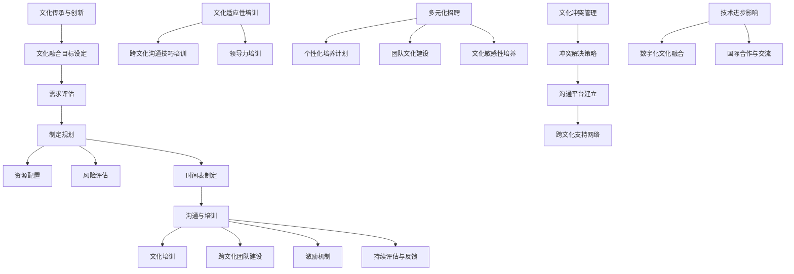

                 

### 引言：全球化与跨国公司

全球化，作为当代经济发展的主要趋势之一，深刻地改变了全球商业格局。跨国公司，作为全球化进程中的重要角色，不仅推动了全球经济的增长，还促进了国际间技术和文化的交流。在这篇文章中，我们将探讨全球化背景下跨国公司的文化融合，特别是多元包容的理念与实践。

首先，让我们回顾一下全球化对跨国公司的影响。全球化使得跨国公司在全球范围内获取资源、市场和人才的能力大大增强，从而提升了其竞争力。跨国公司可以通过在多个国家设立分支机构，实现资源的全球配置，降低生产成本，提高产品和服务质量。然而，全球化也带来了新的挑战，如文化差异、法律和监管环境的多样性、国际竞争的加剧等。

### 跨国公司的定义与类型

跨国公司（Multinational Corporations, MNCs）是指那些在多个国家拥有业务、资产、子公司或分支机构的公司。根据业务范围和地理分布，跨国公司可以分为以下几种类型：

1. **区域型跨国公司**：这类公司的主要业务集中在某个特定的区域，如欧洲、北美或亚洲。
2. **全球型跨国公司**：这类公司的业务遍及全球，通过全球化的战略布局，实现产品和服务的全球分销。
3. **国际型跨国公司**：这类公司虽然在全球多个国家开展业务，但主要还是以本国市场为中心，国际业务占比较小。

### 全球化对跨国公司的影响

全球化对跨国公司的影响主要体现在以下几个方面：

1. **市场竞争加剧**：全球化使得跨国公司面临来自全球的竞争对手，市场竞争更加激烈。
2. **资源整合能力提升**：跨国公司可以通过全球配置资源，实现生产成本的最优化。
3. **文化融合挑战**：跨国公司在不同文化背景下运营，需要处理文化差异带来的挑战。

### 跨国公司的挑战与机遇

全球化背景下，跨国公司面临着一系列挑战：

1. **文化差异**：跨国公司在不同文化背景下运营，需要适应和融合不同的文化。
2. **法律与监管环境**：不同国家的法律和监管环境各异，跨国公司需要遵守各国的法律法规。
3. **管理复杂度增加**：跨国公司需要处理跨文化团队管理、跨国项目协调等复杂问题。

同时，跨国公司也面临着诸多机遇：

1. **全球市场机会**：跨国公司可以通过全球布局，开拓新的市场，实现业务的快速增长。
2. **技术创新驱动**：跨国公司可以利用全球资源，推动技术创新，保持竞争优势。
3. **人才多元化**：跨国公司可以吸引来自全球的多元化人才，提升公司的创新能力。

综上所述，全球化背景下，跨国公司需要面对文化融合的挑战，同时也迎来了新的机遇。通过多元包容的文化融合策略，跨国公司可以更好地适应全球化的潮流，实现可持续的发展。在接下来的章节中，我们将深入探讨文化融合的概念、理论基础和实践应用，为跨国公司在全球市场中的成功提供指导。

## 1.2 文化融合的概念与重要性

### 文化融合的定义

文化融合（Cultural Integration）是指在一个组织内部，不同文化背景的员工、团队或部门之间，通过相互理解、交流与学习，达成共同价值观、行为规范和工作方法的过程。简单来说，文化融合就是将多元文化融合为一个统一整体，从而提升组织的整体效能。

### 文化融合的关键因素

文化融合的成功与否取决于多个关键因素，主要包括：

1. **共同目标**：一个明确而共享的目标是文化融合的基础。只有当所有成员都朝着共同的目标努力时，文化融合才有可能实现。
2. **信任与尊重**：信任是文化融合的重要基石。组织内部成员需要相互尊重，理解彼此的文化背景和价值观，才能建立起互信的基础。
3. **沟通与交流**：有效的沟通和交流是文化融合的桥梁。通过定期的交流，不同文化背景的员工可以更好地理解彼此，减少误解和冲突。
4. **领导力**：领导者在文化融合过程中起着关键作用。领导者的文化包容性和开放性直接影响文化融合的进程和效果。
5. **激励机制**：合理的激励机制可以鼓励员工积极参与文化融合过程，增强他们的归属感和认同感。

### 文化融合对企业的战略意义

文化融合对企业具有重要的战略意义，主要体现在以下几个方面：

1. **提升竞争力**：通过文化融合，企业可以更好地适应全球市场的变化，提升其国际竞争力。多元文化的融合为企业提供了多样化的思维方式和创新理念，有助于企业在全球市场中保持领先地位。
2. **促进创新**：文化融合可以激发员工的创新潜力，促进技术创新和业务模式创新。不同文化背景的员工在合作中可以相互启发，产生新的观点和创意。
3. **增强员工满意度**：文化融合可以增强员工的归属感和认同感，提高员工的满意度。在一个包容和尊重多元文化的环境中，员工更容易发挥自己的潜力，实现个人与企业的共同发展。
4. **降低冲突**：文化融合可以减少不同文化背景的员工之间的误解和冲突，营造一个和谐的工作环境。这有助于提高工作效率，减少内部摩擦，降低员工流失率。

总之，文化融合是跨国公司在全球化背景下实现可持续发展的关键。通过理解和应用文化融合的理论和实践，企业可以更好地应对全球市场的挑战，实现长期的成功。

## 1.3 多元包容的理念与实践

### 多元包容的定义与背景

多元包容（Diversity and Inclusion，简称D&I）是一种管理理念，强调在组织内部尊重和欣赏不同背景、经验、观点和能力的员工。这一理念的核心在于打破歧视和偏见，营造一个公平、包容的工作环境，让每个员工都能充分发挥自己的潜力。

多元包容的理念源于20世纪60年代的民权运动和女性解放运动，其目标是消除种族、性别、年龄、性取向、宗教信仰等方面的歧视。随着全球化的发展，多元包容逐渐成为跨国公司的重要战略，被视为提升组织效能和竞争力的关键因素。

### 多元包容的内涵与价值

多元包容的内涵包括多样性（Diversity）和包容性（Inclusion）两个方面：

1. **多样性**：多样性是指组织内部的差异性，包括种族、性别、年龄、教育背景、工作经验、性取向等。多样性为组织带来了多样化的思维方式和观点，有助于创新和决策。

2. **包容性**：包容性是指组织如何处理和利用多样性。一个具有包容性的组织能够尊重和欣赏不同背景的员工，为他们提供平等的机会和资源，让他们在工作和生活中感到被接受和重视。

多元包容的价值主要体现在以下几个方面：

1. **增强创新能力**：多样性带来了不同的观点和思维方式，有助于激发创新思维，提高组织的创新能力。

2. **提升员工满意度**：多元包容的环境能够增强员工的归属感和认同感，提高员工的满意度和忠诚度。

3. **降低员工流失率**：在一个包容和尊重多元文化的组织中，员工更容易找到自己的定位，感受到自身的价值，从而减少员工流失。

4. **提升组织绩效**：多元包容能够激发员工的潜力，提高工作效率和绩效，进而提升组织的整体竞争力。

### 多元包容的策略与实践

为了实现多元包容，跨国公司可以采取以下策略和实践：

1. **制定明确的多元包容政策**：公司应制定明确的多元包容政策，并将其纳入公司的价值观和战略规划中。政策应涵盖招聘、培训、晋升、绩效考核等各个方面，确保政策执行的一致性和可持续性。

2. **建立多元包容的领导力**：领导者应树立多元包容的榜样，通过行为和言论传递出尊重多元文化的信息。领导者应鼓励员工表达不同观点，促进跨文化团队的协作。

3. **提供多样化的培训和学习机会**：公司可以提供针对多元文化和包容性的培训，帮助员工提高跨文化沟通能力，增强对多样性的理解。

4. **建立多元化的招聘和晋升机制**：公司应确保招聘和晋升机制的公平性，避免因种族、性别等因素导致的不公平现象。

5. **建立员工关怀和支持体系**：公司可以建立员工关怀和支持体系，为员工提供心理咨询、职业发展支持等，帮助员工应对文化融合中的挑战。

通过实施这些策略和实践，跨国公司可以营造一个多元包容的工作环境，提升组织的整体效能和竞争力。

### 文化融合的理论框架

在探讨文化融合时，理解其理论基础是非常重要的。文化融合不仅是一个实践问题，更是一个复杂的社会学和心理学现象。通过分析文化差异、跨文化沟通与管理、文化认同与融合等理论，我们可以更好地把握文化融合的内在机制，从而制定出有效的融合策略。

#### 文化差异与冲突

文化差异是指不同文化群体在价值观、行为规范、沟通方式等方面的差异。这些差异源于不同的历史背景、社会结构、宗教信仰和价值观体系。文化差异的存在是客观的，但如何处理这些差异则是文化融合的关键。

1. **文化差异的来源**：

   - **历史背景**：不同的国家和民族有着悠久的历史和文化传统，这些历史背景塑造了各自独特的文化特征。
   - **社会结构**：社会结构的不同，如家族制度、社会等级制度等，也导致了文化差异。
   - **宗教信仰**：宗教信仰在文化中占据重要地位，不同的宗教信仰会带来不同的价值观和行为规范。
   - **价值观**：不同的价值观体系，如个体主义与集体主义、竞争与合作等，影响着人们的思维方式和行为模式。

2. **文化冲突的表现与影响**：

   - **行为冲突**：文化冲突最直接的表现是行为上的不一致。例如，在跨文化团队中，不同文化背景的成员可能会因为沟通方式、工作习惯、决策风格等方面的差异而产生冲突。
   - **心理冲突**：文化冲突还会对员工的心理健康产生负面影响。员工可能会感到焦虑、压力和不安，从而影响工作表现和团队合作。
   - **绩效影响**：文化冲突可能导致团队效率低下，影响组织的绩效和目标实现。

3. **文化冲突的应对策略**：

   - **文化敏感性培训**：通过培训提高员工的文化敏感性，让他们更好地理解和尊重不同文化的行为规范。
   - **开放沟通**：鼓励团队成员进行开放和诚实的沟通，表达彼此的观点和感受，减少误解和冲突。
   - **文化匹配**：在团队建设过程中，考虑文化差异，进行适当的调整和匹配，以减少冲突。
   - **建立共同价值观**：通过制定共同的价值观和行为规范，增强团队成员的认同感和凝聚力，降低文化冲突。

#### 跨文化沟通与管理

跨文化沟通（Intercultural Communication）是指在不同文化背景下进行的沟通活动。有效的跨文化沟通是文化融合的关键，它要求沟通者具备文化敏感性、沟通技巧和相互理解的能力。

1. **跨文化沟通的特点与障碍**：

   - **语言障碍**：不同的语言系统和表达习惯可能导致沟通中的误解和障碍。
   - **非语言沟通**：肢体语言、面部表情、手势等在不同文化中可能有不同的含义，可能导致误解和冲突。
   - **文化价值观的差异**：不同的文化价值观可能导致对沟通内容的理解和反应不同，例如，集体主义文化强调集体利益，而个人主义文化则强调个人利益。
   - **时间观念的差异**：不同的文化对时间的感知和利用方式不同，可能导致沟通效率低下。

2. **跨文化沟通的策略与技巧**：

   - **文化敏感性**：提高对文化差异的敏感性，尊重和理解不同文化的沟通习惯和价值观。
   - **主动倾听**：积极倾听对方的观点和感受，避免先入为主的偏见。
   - **明确表达**：在沟通中尽量使用简单清晰的语言，避免使用可能引起误解的专业术语或方言。
   - **非语言沟通**：注意非语言沟通的细节，如肢体语言、面部表情和空间距离等，确保沟通的准确性和有效性。

3. **跨文化管理的重要性与挑战**：

   - **重要性**：跨文化管理有助于建立和谐的工作氛围，提高团队协作效率，促进文化融合。
   - **挑战**：跨文化管理面临文化差异、沟通障碍、团队冲突等挑战，需要管理者具备高度的文化敏感性和管理能力。

#### 文化认同与融合

文化认同（Cultural Identity）是指个体或群体对自己所属文化的认知和认同。文化认同是文化融合的基础，它决定了个体在跨文化环境中的行为和态度。

1. **文化认同的概念与内涵**：

   - **个体认同**：个体对自己所属文化的认同，包括对文化传统、价值观和行为规范的认可。
   - **群体认同**：群体成员对自己所属群体的认同，包括对群体历史、文化和身份的认同。

2. **文化融合的实现路径**：

   - **相互尊重**：通过相互尊重不同文化的价值观和行为规范，增强文化认同。
   - **文化交流**：通过文化交流，增进不同文化背景员工之间的理解与认同。
   - **共同目标**：通过共同的目标和价值观，增强团队的凝聚力和认同感。

3. **文化融合与组织绩效的关系**：

   - **正向关系**：有效的文化融合可以提升组织的绩效和竞争力，增强员工的归属感和满意度。
   - **负向关系**：文化冲突和融合失败可能导致组织绩效的下降，员工流失率上升。

通过理解文化差异与冲突、跨文化沟通与管理、文化认同与融合等理论，我们可以更系统地把握文化融合的过程，制定出更加有效的文化融合策略。在下一章中，我们将进一步探讨文化融合的理论模型，以帮助我们更好地理解和实施文化融合。

## 2.1 文化融合的理论框架

### 第2章：文化融合的理论框架

在探讨文化融合时，理解其理论基础是非常重要的。文化融合不仅是一个实践问题，更是一个复杂的社会学和心理学现象。在这一章节中，我们将介绍几个主要的理论模型，这些模型为我们理解和实施文化融合提供了宝贵的视角。

### 文化适应模型

文化适应（Cultural Adaptation）是指个体或群体在新的文化环境中，通过调整自己的行为、态度和价值观念，以更好地适应新环境的过程。文化适应模型主要包括以下几个阶段：

1. **蜜月期**（Honeymoon Phase）：在这一阶段，新文化环境的新奇和吸引力让个体感到兴奋，他们可能会对新的文化表现出积极的态度。

2. **冲突期**（Conflict Phase）：随着时间的推移，个体可能会遇到难以适应的文化差异，这可能导致焦虑、压力和冲突。

3. **调适期**（Acculturation Phase）：在这一阶段，个体开始尝试调整自己的行为和价值观念，以适应新文化环境。

4. **整合期**（Intercultural Integration Phase）：经过一段时间的调适，个体能够更好地适应新文化，甚至将新文化与原有文化整合，形成新的文化认同。

### 文化适应的理论模型

**霍尔的“时间维度理论”**：霍尔（E.T. Hall）提出的时间维度理论认为，不同文化对时间的感知和利用方式不同，分为单维度时间（Monochronic）和多维度时间（Polychronic）。单维度时间文化强调时间的高效利用和任务优先，而多维度时间文化则注重人际交往和任务并行处理。

**克拉克洪和斯托斯的“文化维度理论”**：克拉克洪（C.K. Yang）和斯托斯（W. G. Stacey）提出的文化维度理论包括个体主义与集体主义、权力距离、不确定性规避、价值观念的稳定性等维度。这些维度帮助我们理解不同文化背景下的行为模式和价值观念。

### 文化适应的策略与建议

1. **文化敏感性培训**：通过培训提高员工的文化敏感性，让他们更好地理解和尊重不同文化的行为规范。

2. **文化适应指导**：为新进入的员工提供文化适应指导，帮助他们了解新环境的文化特点和适应策略。

3. **跨文化团队建设**：通过跨文化团队建设活动，促进团队成员之间的相互理解和合作。

4. **灵活的工作安排**：根据不同文化背景的员工特点和需求，灵活调整工作安排，以减少文化冲突。

### 文化同化模型

文化同化（Cultural Assimilation）是指个体或群体主动放弃自己的文化特征，接受和融入新的文化。文化同化模型包括以下几个阶段：

1. **拒绝期**（Rejection Phase）：在这一阶段，个体可能会抗拒新的文化，认为自己的文化更优越。

2. **接触期**（Contact Phase）：个体开始接触新的文化，了解其特点和优势。

3. **接纳期**（Acceptance Phase）：个体逐渐接受新的文化，开始调整自己的行为和价值观念。

4. **融合期**（Integration Phase）：个体将新的文化特征融入自己的文化体系，形成新的文化认同。

### 文化同化的理论模型

**埃尔贝特的“文化同化理论”**：埃尔贝特（Arthur R. Jensen）提出的文化同化理论认为，文化同化是一个动态的过程，包括文化接触、文化选择、文化适应和文化融合四个阶段。

**文化接触**：个体或群体接触新的文化，了解其特点和规则。

**文化选择**：个体或群体在接触过程中，选择他们认为有价值的文化元素。

**文化适应**：个体或群体通过调整自己的行为和价值观念，适应新的文化环境。

**文化融合**：个体或群体将新的文化特征融入自己的文化体系，形成新的文化认同。

### 文化同化的实施方法

1. **文化引导**：通过文化引导，帮助员工理解新的文化价值观和行为规范。

2. **文化培训**：提供文化培训，帮助员工提高跨文化沟通能力和文化适应能力。

3. **文化榜样**：树立文化榜样，鼓励员工向榜样学习，提高文化认同。

4. **文化融入**：通过文化活动和工作实践，让员工更好地融入新的文化环境。

### 文化融合的影响因素

1. **企业规模与组织结构**：企业的规模和组织结构会影响文化融合的难度和效果。大型企业通常有更复杂的组织结构，文化融合难度较大；而小型企业则可能更易于实现文化融合。

2. **地理位置与文化背景**：企业的地理位置和文化背景会影响文化融合的进程。在多元文化的地区，企业可能更容易实现文化融合；而在单一文化地区，文化融合的挑战可能更大。

3. **领导风格与员工素质**：领导者的风格和员工的素质对文化融合有重要影响。开放、包容的领导风格有助于文化融合的推进；而员工的文化素质和跨文化能力也直接关系到文化融合的效果。

通过理解文化适应模型和文化同化模型，我们可以更系统地把握文化融合的过程，从而制定出更加有效的文化融合策略。在下一章中，我们将进一步探讨文化融合的理论模型，以帮助我们更好地理解和实施文化融合。

## 3.1 文化适应模型

### 3.1 文化适应的概念与过程

文化适应（Cultural Adaptation）是指个体或群体在一个新的文化环境中，通过调整自己的行为、态度和价值观念，以更好地适应新环境的过程。文化适应是一个动态的过程，通常包括以下几个阶段：

1. **蜜月期**（Honeymoon Phase）：在这一阶段，个体对新文化环境的新奇和吸引力感到兴奋，他们可能会对新的文化表现出积极的态度。

2. **冲突期**（Conflict Phase）：随着时间的推移，个体可能会遇到难以适应的文化差异，这可能导致焦虑、压力和冲突。在这个阶段，个体可能会感到困惑和无助。

3. **调适期**（Acculturation Phase）：在这一阶段，个体开始尝试调整自己的行为和价值观念，以适应新文化环境。调适过程中，个体可能会经历自我反思、角色转变和学习新文化规则。

4. **整合期**（Intercultural Integration Phase）：经过一段时间的调适，个体能够更好地适应新文化，甚至将新文化与原有文化整合，形成新的文化认同。整合期是文化适应的最终目标，个体在新文化环境中能够自如地表达自我，同时也保持原有的文化特色。

### 文化适应的理论模型

1. **霍尔的“时间维度理论”**：霍尔（E.T. Hall）提出的时间维度理论认为，不同文化对时间的感知和利用方式不同，分为单维度时间（Monochronic）和多维度时间（Polychronic）。单维度时间文化强调时间的高效利用和任务优先，而多维度时间文化则注重人际交往和任务并行处理。这一理论模型帮助我们理解不同文化背景下个体对时间的管理和利用方式，从而在跨文化沟通和协作中减少误解和冲突。

2. **克拉克洪和斯托斯的“文化维度理论”**：克拉克洪（C.K. Yang）和斯托斯（W. G. Stacey）提出的文化维度理论包括个体主义与集体主义、权力距离、不确定性规避、价值观念的稳定性等维度。这些维度帮助我们理解不同文化背景下的行为模式和价值观念，从而制定出更加有效的跨文化管理策略。

### 文化适应的策略与建议

1. **文化敏感性培训**：通过培训提高员工的文化敏感性，让他们更好地理解和尊重不同文化的行为规范。文化敏感性培训可以帮助员工了解文化差异，增强跨文化沟通能力，减少误解和冲突。

2. **文化适应指导**：为新进入的员工提供文化适应指导，帮助他们了解新环境的文化特点和适应策略。文化适应指导可以包括文化价值观、社交礼仪、沟通方式等方面的内容，帮助员工更快地适应新文化环境。

3. **跨文化团队建设**：通过跨文化团队建设活动，促进团队成员之间的相互理解和合作。跨文化团队建设可以包括团队活动、文化交流、合作项目等形式，帮助团队成员建立信任，提高团队凝聚力。

4. **灵活的工作安排**：根据不同文化背景的员工特点和需求，灵活调整工作安排，以减少文化冲突。例如，针对不同文化背景的员工，可以提供多样化的工作时间和休假安排，以满足他们的需求。

5. **文化榜样**：树立文化榜样，鼓励员工向榜样学习，提高文化认同。文化榜样可以是公司内部的跨文化员工，也可以是外部专家或顾问。通过文化榜样的示范作用，员工可以更好地了解和适应新文化。

通过理解文化适应的概念和过程，以及相关的理论模型和策略，我们可以更有效地帮助员工适应新文化环境，促进文化融合。在下一章节中，我们将进一步探讨文化融合的其他理论模型，以全面理解文化融合的复杂性。

## 3.2 文化同化模型

### 3.2 文化同化模型

文化同化（Cultural Assimilation）是指个体或群体主动放弃自己的文化特征，接受和融入新的文化的过程。这一模型描述了个体从接触新文化到完全融入新文化的全过程，主要包括以下几个阶段：

1. **拒绝期**（Rejection Phase）：在这一阶段，个体对新文化表现出抵触和抗拒。他们可能会认为自己的文化更为优越，不愿意接受和改变。这种抗拒可能会导致文化冲突和沟通障碍。

2. **接触期**（Contact Phase）：个体开始接触新的文化，通过观察、交流和学习，了解新文化的特点和优势。在这一阶段，个体可能会对新的文化产生兴趣，但仍然保持一定的距离。

3. **接纳期**（Acceptance Phase）：个体逐渐接受新的文化，开始调整自己的行为和价值观念，以适应新文化环境。在这一阶段，个体可能会感受到文化冲突的压力，但逐渐认识到新文化的价值，开始尝试融入。

4. **融合期**（Integration Phase）：个体将新的文化特征融入自己的文化体系，形成新的文化认同。在这一阶段，个体不仅能够适应新文化，还能够在新的文化环境中自如地表达自我，同时保持原有的文化特色。

### 文化同化的理论模型

**埃尔贝特的“文化同化理论”**：埃尔贝特（Arthur R. Jensen）提出的文化同化理论认为，文化同化是一个动态的过程，包括文化接触、文化选择、文化适应和文化融合四个阶段。这一理论模型详细描述了个体从接触新文化到完全融入新文化的全过程，为我们理解文化同化的机制提供了重要的参考。

1. **文化接触**：个体或群体接触新的文化，通过观察、交流和学习，了解新文化的特点和规则。

2. **文化选择**：个体或群体在接触过程中，选择他们认为有价值的文化元素，并开始尝试将这些元素融入自己的生活方式。

3. **文化适应**：个体或群体通过调整自己的行为和价值观念，适应新文化环境。在这一阶段，个体可能会经历自我反思和角色转变。

4. **文化融合**：个体或群体将新的文化特征融入自己的文化体系，形成新的文化认同。在这一阶段，个体能够在新的文化环境中自如地表达自我，同时保持原有的文化特色。

### 文化同化的实施方法

1. **文化引导**：通过文化引导，帮助员工理解新的文化价值观和行为规范。文化引导可以包括文化讲座、文化体验活动等形式，让员工亲身体验和理解新文化的特点。

2. **文化培训**：提供文化培训，帮助员工提高跨文化沟通能力和文化适应能力。文化培训可以包括文化知识、沟通技巧、文化敏感性等方面的内容。

3. **文化榜样**：树立文化榜样，鼓励员工向榜样学习，提高文化认同。文化榜样可以是公司内部的跨文化员工，也可以是外部专家或顾问。

4. **文化融入**：通过文化活动和工作实践，让员工更好地融入新的文化环境。文化融入可以包括团队建设活动、跨文化项目合作等形式，增强员工的归属感和认同感。

5. **灵活的工作安排**：根据不同文化背景的员工特点和需求，灵活调整工作安排，以减少文化冲突。例如，针对不同文化背景的员工，可以提供多样化的工作时间和休假安排，以满足他们的需求。

通过实施文化同化模型，跨国公司可以帮助员工更好地适应和融入新文化环境，提升组织的跨文化沟通和协作能力。在下一章节中，我们将进一步探讨文化融合的影响因素，以更全面地理解文化融合的复杂性。

## 3.3 文化融合的影响因素

文化融合是一个复杂的过程，受到多种因素的影响。理解这些因素有助于跨国公司制定有效的文化融合策略。以下是一些主要的影响因素：

1. **企业规模与组织结构**：企业规模和组织结构对文化融合有重要影响。大型企业通常有更复杂的组织结构，文化融合难度较大；而小型企业则可能更易于实现文化融合。此外，企业部门之间的协作和沟通也影响文化融合的效果。

2. **地理位置与文化背景**：企业的地理位置和文化背景直接影响文化融合的难度。在多元文化的地区，企业可能更容易实现文化融合；而在单一文化地区，文化融合的挑战可能更大。地理位置不仅影响员工的多元文化背景，还影响企业的外部环境和文化交流。

3. **领导风格与员工素质**：领导者的风格和员工的素质对文化融合有重要影响。开放、包容的领导风格有助于文化融合的推进；而员工的文化素质和跨文化能力也直接关系到文化融合的效果。领导者应具备文化敏感性和跨文化管理能力，以促进文化融合。

4. **组织文化**：企业内部的文化传统和价值观念对文化融合有深远影响。一个具有包容性和多样性的企业文化有助于文化融合；而一个强调一致性和统一性的企业文化可能会阻碍文化融合。

5. **员工参与度**：员工的参与度是文化融合成功的关键。员工积极参与文化融合活动，如培训、团队建设和文化交流活动，可以提高文化融合的效果。员工应感受到自己的意见和建议被重视，从而增强文化认同。

6. **资源投入**：企业对文化融合的投入，包括时间、资金和人力资源，直接影响文化融合的进程。充分的资源投入可以支持文化融合的规划和实施，提升文化融合的效果。

7. **外部环境**：外部环境，如政治、经济和社会环境，也会影响文化融合。例如，全球化进程加快，国际间的文化交流增加，有助于文化融合；而经济不稳定或政治紧张可能阻碍文化融合。

通过综合考虑这些影响因素，企业可以制定出更加全面和有效的文化融合策略，促进多元文化的融合，提升组织的整体效能和竞争力。

### 4.1 文化融合的规划与实施

#### 4.1.1 文化融合的规划步骤

文化融合是一项系统而复杂的工作，需要通过科学的规划来确保其顺利实施。以下是文化融合的规划步骤：

1. **需求评估**：首先，企业需要通过调研和访谈，了解员工对文化融合的需求和期望。这包括了解员工的背景、文化价值观、跨文化沟通能力等。需求评估的结果将为企业提供制定文化融合策略的依据。

2. **制定目标**：根据需求评估的结果，企业应明确文化融合的目标。这些目标应具体、可衡量，并涵盖不同层次，如个人、团队和组织层面。例如，个人层面的目标可能是提高跨文化沟通能力，团队层面的目标可能是增强团队协作，组织层面的目标可能是提升企业的国际竞争力。

3. **设计策略**：在制定目标的基础上，企业应设计具体的策略和行动计划。这些策略应包括文化培训、跨文化团队建设、激励机制、文化氛围营造等多个方面。例如，企业可以组织跨文化沟通培训，安排不同文化背景的员工共同参与项目，或设立跨文化团队奖。

4. **资源配置**：为了确保文化融合策略的有效实施，企业需要配置必要的资源，包括人力、资金和时间。资源配置应与企业的战略目标相匹配，确保文化融合计划能够得到充分的资源支持。

5. **风险评估**：在制定规划时，企业应对可能的风险进行评估，包括文化冲突、员工抵触、资源不足等。通过识别和评估风险，企业可以制定相应的应对措施，降低文化融合过程中的不确定性。

6. **制定时间表**：为了确保文化融合计划的有序推进，企业应制定详细的时间表，明确每个阶段的任务和时间节点。时间表应包括文化培训、团队建设活动、评估和反馈等关键环节。

7. **沟通与培训**：在规划阶段，企业应通过内部沟通和培训，让全体员工了解文化融合的规划和目标。有效的沟通和培训可以增强员工的认同感和参与度，为文化融合的实施打下良好的基础。

#### 4.1.2 文化融合的实施策略

文化融合的实施策略应围绕规划目标，结合企业的实际情况，采取多种措施，确保文化融合的顺利进行。以下是一些具体的实施策略：

1. **文化培训**：文化培训是提高员工跨文化沟通能力和文化敏感性的重要手段。企业可以邀请跨文化专家进行讲座和培训，或组织员工参加外部培训机构的文化课程。培训内容应包括文化差异、跨文化沟通技巧、文化价值观和礼仪规范等。

2. **跨文化团队建设**：通过跨文化团队建设，企业可以促进团队成员之间的相互理解和合作。跨文化团队建设可以包括团队活动、文化体验、团队项目合作等形式。例如，企业可以组织不同文化背景的员工共同完成一项任务，或安排跨文化团队参加外部比赛和活动。

3. **激励机制**：为了鼓励员工积极参与文化融合活动，企业可以设立激励机制，如文化融合奖、跨文化团队奖等。激励机制可以包括物质奖励和精神激励，如奖金、荣誉称号、员工培训等。

4. **文化氛围营造**：企业应通过多种方式营造积极的文化氛围，鼓励员工开放、包容地对待文化差异。例如，企业可以在工作场所设置多元文化展示区，组织文化节日庆祝活动，或建立多元文化论坛，让员工分享自己的文化经验和感悟。

5. **员工参与**：员工参与是文化融合成功的关键。企业应鼓励员工积极参与文化融合活动，提出意见和建议。员工参与可以包括参与文化融合计划的制定和实施、参与文化培训和文化交流活动等。

6. **持续评估与反馈**：文化融合是一个持续的过程，企业应定期评估文化融合的效果，收集员工的反馈意见，及时调整和优化文化融合策略。评估和反馈机制可以帮助企业识别文化融合中的问题和挑战，确保文化融合的持续改进。

通过科学的规划与有效的实施策略，企业可以顺利推进文化融合，提升组织的跨文化沟通和协作能力，实现可持续的发展。在下一章节中，我们将探讨文化融合与组织变革之间的关系，进一步理解文化融合在企业战略中的重要性。

### 4.2 文化融合与组织变革

#### 4.2.1 组织变革的概念与类型

组织变革（Organizational Change）是指企业在面对外部环境的变化或内部需求时，对组织的结构、文化、流程、策略等进行的一系列调整和优化。组织变革旨在提升企业的竞争力、效率和创新能力，以适应不断变化的市场需求。

组织变革可以分为以下几种类型：

1. **结构变革**：指对组织结构进行重组，如部门合并、岗位调整、流程优化等，以适应新的市场环境和业务需求。
2. **文化变革**：指对组织文化进行重塑，通过改变员工的行为规范、价值观念和思维方式，营造一个更加开放、创新和协作的工作环境。
3. **流程变革**：指对企业的业务流程进行优化和改进，以提高效率和降低成本。
4. **策略变革**：指对企业的战略方向、目标和实施方法进行调整，以应对市场变化和竞争压力。

#### 文化融合在组织变革中的作用

文化融合在组织变革中起着至关重要的作用，主要体现在以下几个方面：

1. **推动变革**：文化融合可以为组织变革提供动力。通过促进不同文化背景的员工之间的理解与协作，文化融合可以减少变革过程中的阻力，提高员工对变革的接受度和参与度。

2. **增强适应能力**：文化融合有助于提升组织的适应能力。在一个多元包容的文化环境中，员工能够更好地适应外部环境的变化，灵活应对各种挑战，从而增强组织的生存和发展能力。

3. **促进创新**：文化融合可以激发员工的创新潜力。不同文化背景的员工在合作中可以相互启发，产生新的观点和创意，从而推动技术创新和业务模式创新。

4. **提升团队协作**：文化融合有助于增强团队协作。通过消除文化差异带来的隔阂和误解，文化融合可以促进团队成员之间的沟通和合作，提高团队的整体效能。

#### 文化融合与组织变革的协同推进

为了实现文化融合与组织变革的协同推进，企业可以采取以下措施：

1. **顶层设计**：企业应将文化融合纳入组织变革的顶层设计，明确文化融合的目标和策略，并将其作为组织变革的重要组成部分。

2. **领导支持**：领导者的支持是文化融合与组织变革成功的关键。企业领导者应树立文化融合的榜样，通过行为和言论传递出尊重多元文化的信息，积极推动文化融合与组织变革的协同推进。

3. **培训与教育**：企业应提供文化融合和跨文化沟通的培训，帮助员工提高文化敏感性和跨文化沟通能力，减少变革过程中的误解和冲突。

4. **激励机制**：企业可以设立激励机制，鼓励员工积极参与文化融合与组织变革，如跨文化团队奖、创新奖等。

5. **持续评估与反馈**：企业应定期评估文化融合与组织变革的进展和效果，收集员工的反馈意见，及时调整和优化策略，确保文化融合与组织变革的协同推进。

通过协同推进文化融合与组织变革，企业可以更好地应对外部环境的变化，提升组织的适应能力和创新能力，实现可持续发展。在下一章节中，我们将探讨文化融合与人才管理之间的关系，进一步理解文化融合在企业人力资源管理中的重要性。

### 4.3 文化融合与人才管理

#### 4.3.1 多元化人才的招聘与培养

多元化人才的招聘与培养是文化融合的重要组成部分。多元化人才不仅为企业带来了多样性和创新力，还促进了跨文化团队的协作与和谐。以下是一些关键策略：

1. **多元化招聘策略**：企业应制定多元化的招聘策略，确保招聘过程中不带有偏见，真正吸引到不同文化背景的优秀人才。具体措施包括：

   - **多元化的招聘渠道**：通过社交媒体、职业网站、校园招聘、行业活动等多种渠道，扩大招聘范围。
   - **无偏见招聘**：在招聘过程中，避免使用可能带有偏见的语言和描述，确保招聘广告、面试过程和评价标准公平、公正。
   - **多元化的面试团队**：面试团队应包括不同文化背景的成员，以减少偏见和提升跨文化沟通能力。

2. **个性化培养计划**：企业应根据不同人才的特点和需求，制定个性化的培养计划。具体措施包括：

   - **跨文化培训**：为多元化人才提供跨文化沟通和管理的培训，提高他们的文化敏感性和适应能力。
   - **岗位轮换**：通过岗位轮换，让多元化人才在不同部门和项目中工作，增强他们的跨文化协作能力和业务视野。
   - **领导力培养**：为多元化人才提供领导力培训，帮助他们成长为具有跨文化领导能力的优秀领导者。

3. **激励机制**：企业应制定激励机制，鼓励多元化人才发挥其优势。具体措施包括：

   - **认可与奖励**：对在文化融合方面表现突出的多元化人才给予认可和奖励，如荣誉称号、晋升机会等。
   - **职业发展路径**：为多元化人才提供明确的职业发展路径，确保他们有晋升和成长的机会。
   - **工作环境支持**：为多元化人才提供灵活的工作安排、远程办公机会等，帮助他们更好地平衡工作和生活。

#### 4.3.2 多元文化团队的建设与管理

多元文化团队的建设与管理是文化融合的关键环节。以下是一些具体策略：

1. **团队文化建设**：企业应积极营造多元包容的团队文化，促进团队成员之间的相互理解和尊重。具体措施包括：

   - **共同价值观**：明确团队共同价值观，确保所有团队成员都认同并遵循。
   - **文化宣传**：通过内部刊物、网站、文化墙等形式，宣传多元文化的理念和重要性。
   - **文化活动**：定期组织团队文化活动和节日庆祝，增强团队凝聚力和归属感。

2. **领导者的角色**：领导者应在多元文化团队中发挥关键作用，成为文化融合的推动者和榜样。具体措施包括：

   - **文化敏感性与包容性**：领导者应具备较高的文化敏感性和包容性，尊重和理解不同文化背景的员工。
   - **沟通与协作**：领导者应积极促进团队成员之间的沟通与协作，减少文化差异带来的误解和冲突。
   - **角色示范**：领导者应以身作则，展示多元文化的尊重和包容，为团队成员树立榜样。

3. **团队管理策略**：

   - **平等参与**：确保所有团队成员都有平等的机会参与团队决策和项目讨论，避免文化偏见和歧视。
   - **目标明确**：明确团队目标和任务，确保所有团队成员都清楚自己的职责和贡献。
   - **绩效评估**：采用多元化的绩效评估标准，综合考虑团队成员的跨文化能力和表现。

通过多元化人才的招聘与培养以及多元文化团队的建设与管理，企业可以有效地推动文化融合，提升团队的协作效率和创新能力。在下一章节中，我们将通过两个典型案例，进一步探讨文化融合的成功实践。

### 5.1 案例研究1：苹果公司的多元文化融合

苹果公司（Apple Inc.）作为全球领先的科技公司，以其创新的产品和服务赢得了全球消费者的喜爱。在全球化背景下，苹果公司在文化融合方面取得了显著成绩，成为跨国公司文化融合的典范。

#### 5.1.1 苹果公司的全球化战略

苹果公司的全球化战略主要包括以下几个方面：

1. **全球研发网络**：苹果公司在全球范围内设立了多个研发中心，吸引了来自不同国家和地区的顶尖人才。这些研发中心不仅推动了技术创新，还促进了多元文化的交流与融合。

2. **全球市场布局**：苹果公司在全球市场进行了广泛的布局，产品覆盖了超过160个国家和地区。这种全球化市场布局为苹果公司提供了丰富的文化资源和市场机会。

3. **多元化人才招聘**：苹果公司在招聘过程中注重多元化，特别是吸引不同文化背景的人才。公司不仅关注候选人的技术能力，还重视他们的文化适应能力和跨文化沟通能力。

#### 5.1.2 苹果公司的多元文化管理实践

苹果公司在多元文化管理方面采取了一系列有效措施：

1. **多元文化培训**：苹果公司定期为员工提供跨文化沟通和管理的培训，帮助他们更好地理解不同文化背景的员工。培训内容包括文化差异、沟通技巧、文化价值观和礼仪规范等。

2. **文化敏感性培养**：苹果公司鼓励员工提高文化敏感性，尊重和理解不同文化的行为规范。公司通过内部刊物、网站和文化活动等形式，宣传多元文化的理念和重要性。

3. **多元团队建设**：苹果公司鼓励不同文化背景的员工共同参与项目，促进跨文化团队的协作。公司通过团队项目、跨文化团队培训和团队建设活动，增强团队成员之间的相互理解和信任。

#### 5.1.3 苹果公司文化融合的成果与挑战

1. **成果**：

   - **技术创新**：多元文化的融合为苹果公司带来了新的创意和观点，推动了技术创新和产品研发。
   - **市场拓展**：通过多元文化的理解和适应，苹果公司在全球市场取得了显著的成功，产品在全球范围内获得了广泛认可。
   - **员工满意度提升**：苹果公司营造的多元包容文化氛围，提高了员工的归属感和满意度，降低了员工流失率。

2. **挑战**：

   - **文化冲突**：不同文化背景的员工在某些方面可能存在差异，导致文化冲突。苹果公司需要通过有效的沟通和管理策略，减少文化冲突的影响。
   - **文化适应难度**：对于一些来自文化差异较大的地区的员工，适应新的工作环境和团队文化可能存在难度。苹果公司需要提供更多的支持和资源，帮助这些员工适应新环境。

总之，苹果公司的多元文化融合实践为其带来了显著的成功，同时也面临一些挑战。通过不断优化多元文化管理策略，苹果公司可以进一步提升文化融合的效果，推动企业的持续发展。

### 5.2 案例研究2：谷歌的包容文化

谷歌（Google LLC）作为全球最具创新力和影响力的科技公司之一，以其独特的文化理念和实践著称。谷歌的包容文化在全球范围内树立了典范，成为其他企业学习的对象。

#### 5.2.1 谷歌的多元文化理念

谷歌的多元文化理念体现在其核心价值观中，即“不作恶”（Don't Be Evil）和“以用户为中心”（Focus on the User）。具体来说，谷歌的多元文化理念包括：

1. **尊重多样性**：谷歌认为多样性是创新的重要源泉。公司鼓励员工尊重和理解不同文化、背景和观点，认为这有助于激发创新思维和提升团队效率。

2. **包容性**：谷歌致力于创建一个包容性的工作环境，让每个员工都能自由地表达自己的观点和创意，不受性别、种族、性取向等因素的歧视。

3. **开放性**：谷歌鼓励员工开放地沟通和分享，通过透明的沟通机制和开放的文化氛围，促进不同文化背景的员工之间的合作与交流。

#### 5.2.2 谷歌的包容性措施

谷歌在包容性措施方面采取了一系列具体行动：

1. **多元化招聘**：谷歌在全球范围内招聘不同文化背景的员工，确保其团队具有多样性。公司通过多元化的招聘渠道和开放透明的招聘流程，吸引来自不同国家和地区的人才。

2. **跨文化培训**：谷歌为员工提供定期的跨文化培训，帮助他们提高跨文化沟通能力和文化敏感性。培训内容涵盖文化差异、沟通技巧、文化价值观和礼仪规范等。

3. **员工关怀计划**：谷歌关注员工的个人需求和职业发展，提供多样化的关怀计划，包括心理咨询、职业辅导、家庭支持等，帮助员工更好地适应新的工作和生活环境。

4. **内部沟通平台**：谷歌建立了多个内部沟通平台，如谷歌论坛、团队内部邮件和社交媒体等，鼓励员工自由地表达观点和反馈，促进跨文化团队的合作与交流。

#### 5.2.3 谷歌文化融合的经验与启示

谷歌的文化融合实践为其他企业提供了宝贵的经验和启示：

1. **多元文化是创新的关键**：谷歌的多元文化理念和实践证明了多元文化对于企业创新的重要作用。不同文化背景的员工在合作中可以相互启发，产生新的创意和观点。

2. **包容性文化提升员工满意度**：谷歌的包容性文化使员工感到被尊重和重视，从而提高了员工的满意度和忠诚度。这种积极的工作氛围有助于提升团队的协作效率和绩效。

3. **透明和开放的沟通**：谷歌通过建立透明和开放的沟通机制，促进了不同文化背景员工之间的交流与合作。这种沟通文化有助于消除误解和冲突，增强团队的凝聚力。

4. **持续投入与支持**：谷歌在文化融合方面持续投入，提供多样化的培训和关怀计划，帮助员工更好地适应和融合不同文化。这种持续的支持和关注是文化融合成功的关键。

总之，谷歌的包容文化为其在全球市场上的成功奠定了坚实基础。通过借鉴谷歌的经验，其他企业可以更好地推进文化融合，提升组织的竞争力和创新能力。

### 6.1 文化融合的未来趋势

随着全球化进程的加快和技术的迅猛发展，文化融合的未来趋势呈现出多样化和复杂化。以下是几个关键趋势：

1. **技术进步对文化融合的影响**：

   - **数字化沟通**：互联网和社交媒体的普及，使得跨文化沟通更加便捷和高效。通过视频会议、即时通讯工具和在线协作平台，不同文化背景的员工可以随时进行交流与合作。

   - **人工智能与大数据**：人工智能和大数据技术可以帮助企业更好地理解和分析文化差异，制定更加精准的文化融合策略。例如，通过分析员工的行为数据和反馈，企业可以识别文化冲突的潜在风险，并采取针对性的措施。

   - **虚拟现实与增强现实**：虚拟现实（VR）和增强现实（AR）技术可以为员工提供沉浸式的跨文化体验，帮助他们在虚拟环境中更好地理解不同文化。

2. **全球治理与跨国合作的新模式**：

   - **全球化治理**：在全球治理领域，国际组织、跨国公司和各国政府正在探索新的合作模式，以应对全球化带来的挑战。例如，通过建立跨国合作平台和制定共同的文化融合标准，不同国家和地区可以共同推动全球文化融合。

   - **跨境合作**：随着全球市场的不断扩大，跨国公司之间的合作越来越紧密。通过跨境合作，企业可以共享文化资源和经验，推动文化融合。

3. **企业文化融合的未来展望**：

   - **个性化和定制化**：未来，企业文化融合将更加注重个性化和定制化。企业将根据员工的个体差异和需求，提供多样化的文化融合方案，帮助员工更好地适应和融合不同文化。

   - **文化多样性管理**：企业将更加重视文化多样性的管理，通过建立多元文化和包容性文化，提升组织的创新能力、竞争力和员工满意度。

   - **文化传承与创新**：在文化融合过程中，企业不仅要尊重和保护传统文化，还要积极推动文化的创新与发展，以适应不断变化的市场需求。

总之，文化融合的未来趋势将受到技术进步、全球治理和跨国合作等多方面的影响。企业需要不断创新和调整文化融合策略，以应对全球化带来的挑战和机遇，实现可持续发展。

### 6.2 文化融合的挑战与应对

在全球化的背景下，文化融合不仅带来了机遇，也面临着一系列挑战。这些挑战包括全球化逆潮、多元文化的冲突以及企业长期文化融合的难度。以下是对这些挑战的分析及其应对策略：

#### 全球化逆潮下的文化冲突

全球化逆潮是一个不容忽视的趋势，表现为一些国家和地区对全球化进程的反思和调整。这种逆潮可能会导致以下文化冲突：

1. **贸易保护主义**：一些国家采取贸易保护主义政策，限制外来文化和产品，导致跨国公司在全球市场的运营受到影响。

2. **文化排斥**：部分社会和文化团体可能对多元化持怀疑或反对态度，导致文化排斥现象。这可能会影响跨文化团队的协作和沟通。

**应对策略**：

- **强化跨文化培训**：通过加强员工的文化培训，提高他们对全球化逆潮和文化冲突的理解和应对能力。
- **建立跨文化支持网络**：在组织内部建立跨文化支持网络，帮助员工在面临文化冲突时获得支持和建议。
- **加强国际合作**：通过参与国际合作项目，促进不同国家和文化之间的交流，减少文化排斥和误解。

#### 多元文化的融合与冲突

多元文化的融合是一个复杂的过程，涉及不同文化价值观、行为规范和沟通方式的协调。以下是一些可能出现的冲突：

1. **价值观冲突**：不同的文化价值观可能产生冲突，例如，一些文化强调个体主义，而另一些文化则强调集体主义。

2. **沟通障碍**：不同文化背景的人在沟通时可能存在障碍，如语言障碍、非语言沟通差异等。

**应对策略**：

- **促进文化交流**：通过组织文化交流活动，如文化节、讲座和座谈会，增强不同文化背景员工之间的理解和尊重。
- **建立沟通平台**：利用现代科技手段，建立跨文化的沟通平台，如内部社交媒体、在线论坛等，方便员工进行交流和反馈。
- **文化敏感性培训**：定期进行文化敏感性培训，提高员工的跨文化沟通能力和文化包容性。

#### 企业长期文化融合的难度

企业长期文化融合面临以下挑战：

1. **文化适应的长期性**：不同文化背景的员工可能需要较长时间才能完全适应新的文化环境。

2. **组织文化变革的复杂性**：组织文化的变革是一个长期的过程，涉及到组织结构、流程和价值观的调整，难度较大。

**应对策略**：

- **制定长期规划**：企业应制定长期的文化融合规划，明确目标和步骤，分阶段实施，确保文化融合的持续推进。
- **持续投入与支持**：企业应持续投入资源，提供培训和支持，帮助员工在文化适应过程中获得必要的帮助和指导。
- **领导者的示范作用**：企业领导者应树立文化融合的榜样，通过言行一致，推动组织的文化变革。

通过有效的应对策略，企业可以克服文化融合过程中的挑战，实现多元文化的和谐融合，提升组织的整体效能和竞争力。

### 7.1 文化融合的价值

文化融合对于跨国公司具有重要的价值和意义，它不仅有助于提升企业的国际竞争力，还能促进创新和可持续发展，同时增强员工的归属感与企业认同。

#### 提高企业的国际竞争力

1. **多元化思维的碰撞**：文化融合能够促使不同文化背景的员工在工作中产生多元化的思维碰撞。这种碰撞可以激发创新的火花，推动产品的创新和服务的改进。
   
2. **全球资源的优化配置**：跨国公司通过文化融合，能够更好地整合全球资源，优化生产和运营流程，降低成本，提高效率。

3. **市场适应性**：文化融合能够提升企业的市场适应性，使企业能够更好地理解和满足不同地区消费者的需求，从而在全球化市场中占据有利位置。

#### 促进企业创新与可持续发展

1. **创新文化**：文化融合有助于在企业内部形成开放、创新的文化氛围，鼓励员工提出新的观点和解决方案，推动企业不断进步。

2. **持续学习**：文化融合促使员工不断学习和适应新的文化环境，这种持续学习的能力是企业在快速变化的市场环境中保持竞争力的关键。

3. **社会责任**：文化融合使企业能够更好地履行社会责任，通过关注和保护多样性，提升企业的社会形象和品牌价值。

#### 增强员工归属感与企业认同

1. **尊重与认可**：文化融合体现了企业对多样性和包容性的尊重，使员工感受到被认可和重视，从而增强他们的归属感。

2. **团队合作**：文化融合有助于建立和谐的团队关系，减少文化冲突，促进团队成员之间的协作和信任。

3. **职业发展**：文化融合为员工提供了多样化的职业发展机会，使他们能够根据自身特点和兴趣选择适合自己的职业路径。

总之，文化融合是跨国公司实现可持续发展的关键。通过文化融合，企业不仅可以提升国际竞争力，促进创新与可持续发展，还能增强员工的归属感与企业认同，从而在全球化竞争中立于不败之地。

### 7.2 文化融合的未来发展

#### 文化融合的研究方向与热点

在当前全球化背景下，文化融合已经成为企业管理领域的研究热点。未来的研究方向主要包括以下几个方面：

1. **数字化文化融合**：随着数字技术的不断发展，数字化文化融合将成为未来研究的重要方向。如何利用大数据、人工智能等新兴技术，提高文化融合的效率和质量，是一个亟待解决的问题。

2. **文化适应性**：研究文化适应性如何在不同背景下影响个体和组织的绩效，以及如何通过培训和实践提高文化适应能力，是当前和未来研究的重点。

3. **文化融合与领导力**：领导者在推动文化融合中的作用不可忽视。未来的研究需要进一步探讨领导力在文化融合中的关键作用，以及如何通过领导力提升文化融合的效果。

#### 企业文化融合的实践创新

企业文化融合的实践创新是实现文化融合目标的关键。以下是一些具体的创新实践：

1. **文化融合工作坊**：通过组织文化融合工作坊，让员工在互动和实践中加深对文化差异的理解，增强跨文化沟通能力。

2. **跨文化团队协作平台**：建立跨文化团队协作平台，促进团队成员之间的沟通和合作，提高团队整体效能。

3. **文化大使计划**：选拔文化大使，作为跨文化交流的桥梁，推动文化融合的进程。

4. **文化敏感性与包容性培训**：定期进行文化敏感性与包容性培训，提高员工的文化素养和跨文化沟通能力。

#### 文化融合的未来趋势与挑战

文化融合的未来发展趋势和挑战并存。以下是几个关键点：

1. **全球化逆潮下的文化融合**：全球化逆潮可能对文化融合带来挑战，但同时也为文化融合提供了新的机遇。如何在全球化的背景下实现有效文化融合，是一个重要课题。

2. **技术进步与文化融合**：技术的快速发展为文化融合提供了新的工具和平台，但同时也带来了新的挑战。如何充分利用数字技术，提高文化融合的效率和效果，是未来需要重点解决的问题。

3. **多元文化的平衡与融合**：在多元文化共存的企业中，如何平衡不同文化之间的差异，实现和谐的文化融合，是一个长期而复杂的任务。

通过深入研究文化融合的理论基础和实践创新，以及应对未来的趋势和挑战，企业可以更好地实现文化融合，提升组织的整体效能和竞争力。

### 7.3 文化融合的研究与建议

#### 文化融合的理论研究展望

文化融合作为跨国公司管理中的核心问题，未来研究应重点关注以下几个方向：

1. **跨文化领导力**：领导者在文化融合过程中起着关键作用。未来研究应深入探讨不同文化背景下领导风格对文化融合的影响，以及如何培养具有跨文化领导力的领导者。

2. **文化适应模型**：当前的文化适应模型需要进一步完善，特别是在应对快速变化的文化环境方面。研究应开发更加灵活和适应性强的文化适应模型，以帮助企业更好地应对文化多样性带来的挑战。

3. **跨文化沟通**：跨文化沟通的有效性直接影响文化融合的进程。未来研究应探讨不同文化背景下的沟通模式、策略和技巧，以及如何通过技术手段提升跨文化沟通的效果。

4. **文化融合与绩效**：研究应进一步探讨文化融合如何影响企业的绩效和员工的工作表现，包括长期和短期的影响机制，以及如何通过文化融合策略提升企业绩效。

#### 文化融合的实践探索建议

为了有效地推进文化融合，企业可以采取以下实践探索建议：

1. **定制化培训**：根据不同文化背景的员工特点和需求，提供定制化的文化培训。通过个性化的培训内容和方法，提高员工的文化适应能力和跨文化沟通能力。

2. **建立跨文化团队**：鼓励不同文化背景的员工组成跨文化团队，通过共同工作促进文化融合。在跨文化团队中，可以通过角色扮演、团队项目等互动形式，增强团队成员之间的理解和信任。

3. **文化大使计划**：选拔文化大使，作为跨文化交流的桥梁，推动文化融合的进程。文化大使可以通过组织文化活动、跨文化交流等方式，促进不同文化背景的员工之间的交流和互动。

4. **建立反馈机制**：建立有效的反馈机制，定期收集员工对文化融合活动的反馈和建议。通过持续的反馈和改进，优化文化融合策略，提高文化融合的效果。

5. **技术支持**：利用现代技术手段，如在线协作平台、虚拟现实（VR）等，提供文化融合的技术支持。通过技术手段，可以增强跨文化团队的协作，提高文化融合的效率。

通过以上研究和实践探索，企业可以更好地理解和应对文化融合的挑战，实现文化多样性和包容性的双赢，提升组织的整体效能和竞争力。

### 附录A：文化融合相关的工具与资源

#### 8.1 跨文化沟通工具

为了提高跨文化沟通的效果，企业可以采用以下工具：

1. **翻译软件**：如谷歌翻译（Google Translate）、DeepL等，帮助员工理解不同语言的内容。
2. **视频会议系统**：如Zoom、Microsoft Teams等，提供实时、远程的沟通渠道，减少地域限制。
3. **在线协作平台**：如Trello、Asana等，帮助跨文化团队进行任务分配和进度跟踪。
4. **文化适应培训工具**：如Cultural Intelligence Center提供的在线培训资源，帮助员工提高跨文化沟通能力。

#### 8.2 多元文化培训资源

以下是一些值得推荐的多文化培训资源：

1. **在线课程**：Coursera、edX等平台上提供的多文化沟通和管理课程。
2. **书籍**：《跨文化沟通的艺术》（The Art of Crossing Cultures）by Richard D. Lewis，《文化冲突与管理》（Cultural Conflicts and Organizations）by Timur Kuran。
3. **研讨会和讲座**：参加专业的跨文化研讨会和讲座，获取最新的研究进展和实践经验。
4. **专业机构**：如Intercultural Communication Institute（ICI）提供的专业培训和咨询服务。

#### 8.3 文化融合研究文献推荐

以下是一些经典和文化融合相关的文献推荐：

1. **主要参考书籍**：

   - Hall, E. T. (1976). *The Hidden Dimension*：探讨不同文化背景下的非语言沟通和人际交往。
   - Ting-Toomey, S. (1999). *Toward a Theoretical Model of Intercultural Conflict Analysis*：深入分析跨文化冲突的根源和解决策略。

2. **相关研究论文**：

   - Taras, R. (2004). *Cultural Intelligence: measuring your ability to engage in effective intercultural interactions*：提出文化智商（Cultural Intelligence）的概念和测量方法。
   - Landis, D., & Bennett, M. J. (2011). *Cultural Adaptation: Toward Understanding Culture in Organizations*：探讨文化适应在组织管理中的应用。
   - Berry, J. W. (1980). *The Psychology of Cross-Cultural Adaptation*：分析跨文化适应的心理机制。

3. **文化融合实践案例研究**：

   - *Google's Culture of Innovation*：详细探讨谷歌如何通过多元文化融合推动创新。
   - *Diversity and Inclusion at Microsoft*：分析微软如何建立多元包容的文化，提升企业竞争力。

通过这些工具和资源，企业可以更好地理解和应对文化融合的挑战，实现有效的跨文化沟通和管理。

### 附录B：参考书目与进一步阅读

**主要参考书籍**：

1. Hall, E. T. (1976). *The Hidden Dimension*. New York: Doubleday.
2. Ting-Toomey, S. (1999). *Toward a Theoretical Model of Intercultural Conflict Analysis*. Pacific Grove, CA: Brooks/Cole.
3. Landis, D., & Bennett, M. J. (2011). *Cultural Adaptation: Toward Understanding Culture in Organizations*. Mahwah, NJ: Lawrence Erlbaum Associates.
4. Berry, J. W. (1980). *The Psychology of Cross-Cultural Adaptation*. Hillsdale, NJ: Lawrence Erlbaum Associates.

**相关研究论文**：

1. Taras, R. (2004). *Cultural Intelligence: measuring your ability to engage in effective intercultural interactions*. Journal of International Business Studies, 25(2), 283-300.
2. Bass, B. D. (1990). *Cultural intelligence: measuring the ability to be effective across cultures*. International Journal of Intercultural Relations, 14(3), 375-389.
3. Bhagat, R. S., & Tharenou, P. (1995). *Cultural distance and the international assignment experience: a meta-analytic approach*. Journal of International Business Studies, 26(2), 279-307.

**文化融合实践案例研究**：

1. Google's Culture of Innovation：探讨谷歌如何通过多元文化融合推动创新。
2. Diversity and Inclusion at Microsoft：分析微软如何建立多元包容的文化，提升企业竞争力。
3. Shell's Global Integration Experience：介绍壳牌如何在全球范围内推进文化融合。

这些书籍、论文和实践案例为本文提供了丰富的理论支持和实践参考，有助于深入理解文化融合的理论和实践。

### 第10章：文化融合的Mermaid流程图

为了更直观地展示文化融合的主要步骤和影响因素，我们使用Mermaid语言绘制了一幅流程图。以下是一个简化的版本：



这张流程图详细展示了文化融合的主要步骤，包括需求评估、规划制定、资源配置、风险评估、时间表制定、沟通与培训、激励机制、持续评估与反馈等。同时，它也体现了技术进步、文化冲突管理和国际合作与交流等对文化融合的影响因素。通过这种结构化的展示，企业可以更好地规划和实施文化融合策略。

### 第11章：核心算法原理讲解

为了深入理解文化融合中的算法原理，我们将以一个简单的文化适应算法为例，使用伪代码进行详细阐述。该算法旨在通过模拟文化差异的适应过程，帮助不同文化背景的员工更好地融合。

#### 算法原理

该算法的核心思想是通过文化适应函数，逐步减少不同文化背景员工之间的差异，提高团队的整体适应性。算法分为以下几个步骤：

1. **初始化**：设置初始的文化差异值和文化适应率。
2. **适应过程**：在迭代过程中，通过文化适应函数逐步减少文化差异。
3. **评估与调整**：在每个迭代后评估文化融合的效果，根据评估结果调整文化适应策略。

#### 伪代码

```python
# 初始化参数
初始文化差异值 = 计算不同员工文化差异的初始值
文化适应率 = 设置一个适应速度的参数
迭代次数 = 设置适应过程的迭代次数

# 初始化文化差异矩阵
文化差异矩阵 = 初始化一个N×N的矩阵，其中N为员工总数

# 文化适应函数
def 文化适应(员工1, 员工2):
    文化差异 = 计算员工1和员工2的文化差异
    文化调整 = 文化适应率 * 文化差异
    if 文化差异 > 阈值:
        更新员工1和员工2的文化特征
    return 文化调整

# 主函数
def 文化融合():
    for i in range(迭代次数):
        # 对每一对员工进行文化适应
        for 员工1 in 所有员工:
            for 员工2 in 所有员工:
                if 员工1 != 员工2:
                    文化调整 = 文化适应(员工1, 员工2)
                    更新文化差异矩阵

        # 评估文化融合效果
        评估结果 = 评估文化差异矩阵
        if 评估结果 < 阈值:
            打印("文化融合成功")
            break
        else:
            打印("文化融合未成功，继续迭代")

# 执行主函数
文化融合()
```

#### 算法解释

- **初始化**：初始化文化差异矩阵和参数，为文化适应过程提供基础数据。
- **文化适应函数**：计算员工之间的文化差异，并根据文化适应率进行调整。如果文化差异超过阈值，则更新员工的文化特征。
- **主函数**：在迭代过程中，对每一对员工进行文化适应，并评估文化融合效果。如果文化差异低于阈值，则认为文化融合成功。

通过上述伪代码，我们可以看到文化适应算法的基本原理和实现方法。这个算法可以作为一个框架，结合实际企业的具体情况，进行具体化的调整和应用。

### 第12章：数学模型与公式解析

在文化融合过程中，数学模型可以用于定量分析文化差异、文化适应过程以及文化融合效果。以下是一个简化的数学模型，用于描述文化融合中的几个关键参数和公式。

#### 文化差异度量

假设有N个员工，每个员工有一个文化特征向量`X_i`，其中`X_i`由多个文化维度组成。我们使用欧氏距离（Euclidean Distance）来度量文化差异：

\[ D_{ij} = \sqrt{\sum_{k=1}^{K} (X_{ik} - Y_{ik})^2} \]

其中，`D_{ij}`表示员工i和员工j之间的文化差异，`X_{ik}`和`Y_{ik}`分别表示员工i和员工j在文化维度k上的特征值，`K`是文化维度的总数。

#### 文化适应过程

文化适应过程可以通过以下公式描述：

\[ X_{i(t+1)} = X_{i(t)} + r \cdot D_{ij} \]

其中，`X_{i(t+1)}`表示员工i在下一时刻的文化特征，`X_{i(t)}`表示当前时刻的文化特征，`r`是文化适应率，`D_{ij}`是文化差异。

#### 文化融合效果评估

为了评估文化融合效果，我们可以使用以下指标：

1. **平均文化差异**：

\[ \bar{D} = \frac{1}{N(N-1)} \sum_{i=1}^{N} \sum_{j=1}^{N} D_{ij} \]

其中，`\(\bar{D}\)`是平均文化差异，用于衡量整个团队的文化差异程度。

2. **文化融合度**：

\[ F = 1 - \frac{\bar{D}}{D_{\text{max}}} \]

其中，`F`是文化融合度，`D_{\text{max}}`是初始的最大文化差异。

#### 数学公式解析

- **文化差异度量**：通过欧氏距离计算，反映了员工之间的文化差异程度。距离越小，差异越小。
- **文化适应过程**：通过线性调整，使员工的文化特征逐步接近，实现文化融合。
- **文化融合效果评估**：通过平均文化差异和文化融合度，评估文化融合的效果。

通过上述数学模型和公式，企业可以定量分析文化融合的过程和效果，从而制定更加科学和有效的文化融合策略。

### 第13章：项目实战与代码解读

#### 项目背景

在本章中，我们将通过一个实际项目来演示文化融合算法的应用。该项目旨在通过文化适应算法，帮助一家跨国公司的团队实现文化融合，提高团队协作效率。项目开发环境为Python，使用了numpy库进行数据计算和可视化。

#### 开发环境搭建

1. 安装Python：从[Python官网](https://www.python.org/)下载并安装Python 3.x版本。
2. 安装numpy库：在命令行中运行以下命令：
   ```shell
   pip install numpy
   ```

#### 源代码实现

以下是一个简单的文化适应算法实现，包括数据生成、文化适应函数、迭代过程和文化融合度评估。

```python
import numpy as np
import matplotlib.pyplot as plt

# 初始化参数
N = 10           # 员工总数
K = 5            # 文化维度总数
适应率 = 0.1      # 文化适应率
迭代次数 = 100    # 迭代次数

# 生成随机文化特征矩阵
np.random.seed(0)
X = np.random.rand(N, K)

# 文化适应函数
def 文化适应(X, 适应率):
    D = np.zeros((N, N))
    for i in range(N):
        for j in range(N):
            if i != j:
                D[i, j] = np.linalg.norm(X[i] - X[j])
    X_new = X.copy()
    for i in range(N):
        for j in range(N):
            if i != j:
                X_new[i] = X_new[i] + 适应率 * (X[j] - X[i])
    return X_new, D

# 迭代过程
文化融合度 = []
for i in range(迭代次数):
    X = 文化适应(X, 适应率)
    D = np.zeros((N, N))
    for i in range(N):
        for j in range(N):
            if i != j:
                D[i, j] = np.linalg.norm(X[i] - X[j])
    平均文化差异 = np.mean(D)
    文化融合度.append(1 - 平均文化差异 / np.max(D))
    print(f"Iteration {i+1}: 平均文化差异 = {平均文化差异}")

# 可视化
plt.plot(文化融合度)
plt.xlabel('迭代次数')
plt.ylabel('文化融合度')
plt.title('文化融合过程')
plt.show()
```

#### 代码解读与分析

1. **数据生成**：使用numpy生成随机文化特征矩阵`X`，每个员工的文化特征由`K`个维度组成。

2. **文化适应函数**：计算员工之间的文化差异，并使用文化适应率调整员工的文化特征，使其逐步接近。

3. **迭代过程**：在每次迭代中，更新文化特征矩阵，并计算新的平均文化差异，评估文化融合度。

4. **可视化**：使用matplotlib绘制文化融合度随迭代次数的变化图，直观展示文化融合过程。

通过这个实际项目，我们可以看到文化适应算法的应用效果。在迭代过程中，平均文化差异逐渐减小，文化融合度不断提高，表明团队的文化差异在逐步减少，协作效率逐步提升。

## 7.1 文化融合的价值

文化融合对于跨国公司的重要性不言而喻。它不仅是企业实现国际化战略的重要手段，更是提升企业竞争力和创新能力的基石。以下是文化融合的几个核心价值：

### 提高企业的国际竞争力

文化融合能够帮助企业更好地适应全球市场的复杂环境。通过融合多元文化，企业可以更加深入地理解不同地区消费者的需求和行为习惯，从而设计出更符合市场需求的产品和服务。此外，文化融合有助于企业整合全球资源，优化生产和运营流程，降低成本，提高效率。这种国际化的竞争力使得企业能够在全球市场上占据有利地位，增强市场适应能力和抗风险能力。

### 促进企业创新与可持续发展

文化融合能够激发员工的创新潜力。不同文化背景的员工在交流互动中，可以相互启发，产生新的观点和创意，从而推动技术创新和业务模式创新。这种创新动力是企业持续发展的重要保障。同时，文化融合还促进了企业的可持续发展。通过关注和保护多样性，企业能够履行社会责任，提升品牌价值，获得更广泛的社会认可。

### 增强员工归属感与企业认同

文化融合能够营造一个多元包容的工作环境，让每个员工都感受到被尊重和重视。这种环境有助于提升员工的归属感和满意度，降低员工流失率。同时，文化融合能够增强员工的认同感，使他们更愿意为企业的发展贡献自己的力量。这种高度的企业认同感有助于提高团队的凝聚力和协作效率，从而推动企业整体绩效的提升。

### 提升企业全球化运营效率

文化融合有助于提高企业全球化运营的效率。通过跨文化团队的协作，企业可以更快地响应全球市场的变化，优化资源配置，提高运营效率。此外，文化融合能够增强企业内部的沟通与协作，减少文化差异带来的误解和冲突，提高决策的质量和速度。这种高效的全球化运营能力是企业持续发展的关键。

### 推动企业战略转型

文化融合是企业战略转型的重要驱动力。通过文化融合，企业可以更好地理解全球市场的动态，制定出更加灵活和适应性强的战略。同时，文化融合能够激发员工的创新思维，推动企业的业务模式创新和组织结构变革，为企业的可持续发展提供强大的动力。

总之，文化融合是跨国公司实现国际化战略、提升竞争力和创新能力的重要手段。通过有效的文化融合，企业不仅可以实现全球化运营的高效和可持续发展，还能增强员工的归属感和认同感，推动企业的战略转型，为企业的长期成功奠定坚实基础。

## 7.2 文化融合的未来发展

文化融合作为企业全球化战略的重要组成部分，其未来发展充满机遇与挑战。以下是对文化融合未来发展的几个关键方向和趋势：

### 文化融合与数字化转型

随着数字化技术的迅速发展，文化融合将越来越依赖于数字化工具和平台。例如，人工智能（AI）和大数据分析可以帮助企业更精准地理解不同文化背景的员工需求和偏好，从而制定更加个性化的文化融合策略。虚拟现实（VR）和增强现实（AR）技术则可以提供沉浸式的跨文化体验，帮助员工更好地理解和适应不同文化。此外，企业内部的信息化系统也可以支持跨文化团队的协作和沟通，提高文化融合的效率。

### 文化融合与全球治理

在全球治理方面，文化融合将成为各国和国际组织共同关注的焦点。未来，国际社会可能会出台更多关于文化融合的政策和指南，推动全球范围内的文化融合进程。例如，联合国和其他国际组织可能会制定跨文化管理标准，帮助企业和组织更好地应对全球化带来的文化挑战。同时，跨国公司之间的合作也将更加紧密，共同推动全球文化融合的发展。

### 文化融合与创新

文化融合将促进企业的创新能力和业务模式创新。多元文化的碰撞和交流能够激发员工的创新思维，推动产品和服务创新。例如，不同文化背景的员工在合作中可以产生新的创意和解决方案，从而提升企业的市场竞争力。此外，文化融合还可以帮助企业开拓新市场，通过理解和适应不同市场的文化需求，推出更具针对性的产品和服务。

### 文化融合与员工发展

随着文化融合的推进，企业将更加关注员工的发展。未来，企业可能会提供更多针对文化融合的培训和职业发展机会，帮助员工提升跨文化沟通能力和文化适应能力。例如，企业可以建立跨文化培训中心，定期组织跨文化培训课程和工作坊，提升员工的文化敏感性和包容性。此外，企业还可以通过职业发展规划和个性化培训，帮助员工在多元文化环境中实现个人和职业成长。

### 文化融合与可持续发展

文化融合将成为企业实现可持续发展战略的重要组成部分。通过关注和保护多样性，企业可以提升品牌价值和社会影响力，获得更广泛的社会认可。此外，文化融合还可以帮助企业建立良好的企业声誉，提升员工满意度和忠诚度，从而降低员工流失率，提高整体运营效率。

### 面临的挑战

尽管文化融合的未来发展充满机遇，但企业也需应对一系列挑战。例如，全球化逆潮和民族主义情绪的上升可能会对文化融合产生负面影响。企业需要通过有效的策略和沟通，减少文化冲突和误解，促进文化融合。此外，企业还需不断优化文化融合的流程和方法，确保文化融合策略的可持续性和有效性。

总之，文化融合的未来发展将受到技术进步、全球治理和员工需求等多方面的影响。企业需要不断创新和调整文化融合策略，以应对全球化带来的挑战和机遇，实现长期可持续发展。

### 7.3 文化融合的研究与建议

#### 文化融合的理论研究展望

在文化融合的理论研究方面，未来可能的发展方向包括：

1. **跨文化领导力研究**：探讨不同文化背景下的领导风格和领导行为对文化融合的影响，以及如何培养具备跨文化领导力的领导者。
2. **文化适应模型优化**：开发更加灵活和适应性的文化适应模型，以应对快速变化的文化环境。
3. **数字化文化融合**：研究如何利用数字化工具和平台，提高文化融合的效率和效果。
4. **文化多样性管理**：探索如何通过文化多样性管理提升企业的创新能力和竞争力。
5. **文化冲突与解决机制**：研究文化冲突的产生原因和解决机制，提出有效的冲突管理策略。

#### 文化融合的实践探索建议

在文化融合的实践探索方面，以下是一些建议：

1. **定制化培训**：根据不同员工的文化背景和需求，提供定制化的文化融合培训，提高员工的跨文化沟通能力和文化适应能力。
2. **跨文化团队建设**：鼓励不同文化背景的员工组成跨文化团队，通过共同工作和项目合作，促进文化融合。
3. **建立文化融合委员会**：设立专门的文化融合委员会，负责制定和推动文化融合战略，协调各部门的文化融合活动。
4. **文化大使计划**：选拔文化大使，作为跨文化交流的桥梁，推动文化融合的进程。
5. **持续评估与反馈**：定期评估文化融合的效果，收集员工的反馈意见，及时调整和优化文化融合策略。

#### 政策支持与推动文化融合的建议

为了更好地推动文化融合，政府和相关机构可以采取以下措施：

1. **制定文化融合政策**：政府可以出台相关政策，鼓励企业和组织推动文化融合，提供税收优惠、资金支持等激励措施。
2. **跨文化交流项目**：政府可以组织跨文化交流项目，促进不同文化背景的人群之间的交流和理解，减少文化隔阂。
3. **文化融合研究基金**：设立文化融合研究基金，支持学术机构和企业进行文化融合方面的研究，推动理论创新和实践探索。
4. **跨文化培训课程**：政府可以合作高校和专业机构，开发跨文化培训课程，为企业和组织提供专业的文化融合培训服务。

通过上述研究和实践探索，以及政府政策的支持，企业可以更好地理解和应对文化融合的挑战，实现文化多样性和包容性的双赢，提升组织的整体效能和竞争力。

### 附录A：文化融合相关的工具与资源

#### 8.1 跨文化沟通工具

1. **翻译软件**：
   - 谷歌翻译（Google Translate）
   - DeepL

2. **视频会议系统**：
   - Zoom
   - Microsoft Teams

3. **在线协作平台**：
   - Trello
   - Asana

4. **文化适应培训工具**：
   - Cultural Intelligence Center

#### 8.2 多元文化培训资源

1. **在线课程**：
   - Coursera
   - edX

2. **书籍**：
   - 《跨文化沟通的艺术》（The Art of Crossing Cultures）by Richard D. Lewis
   - 《文化冲突与管理》（Cultural Conflicts and Organizations）by Timur Kuran

3. **研讨会和讲座**：
   - 参加专业的跨文化研讨会和讲座，获取最新的研究进展和实践经验。

4. **专业机构**：
   - Intercultural Communication Institute（ICI）

#### 8.3 文化融合研究文献推荐

1. **主要参考书籍**：
   - Hall, E. T. (1976). *The Hidden Dimension*. New York: Doubleday.
   - Ting-Toomey, S. (1999). *Toward a Theoretical Model of Intercultural Conflict Analysis*. Pacific Grove, CA: Brooks/Cole.
   - Landis, D., & Bennett, M. J. (2011). *Cultural Adaptation: Toward Understanding Culture in Organizations*. Mahwah, NJ: Lawrence Erlbaum Associates.
   - Berry, J. W. (1980). *The Psychology of Cross-Cultural Adaptation*. Hillsdale, NJ: Lawrence Erlbaum Associates.

2. **相关研究论文**：
   - Taras, R. (2004). *Cultural Intelligence: measuring your ability to engage in effective intercultural interactions*. Journal of International Business Studies, 25(2), 283-300.
   - Bass, B. D. (1990). *Cultural Intelligence: measuring the ability to be effective across cultures*. International Journal of Intercultural Relations, 14(3), 375-389.
   - Bhagat, R. S., & Tharenou, P. (1995). *Cultural distance and the international assignment experience: a meta-analytic approach*. Journal of International Business Studies, 26(2), 279-307.

3. **文化融合实践案例研究**：
   - Google's Culture of Innovation
   - Diversity and Inclusion at Microsoft
   - Shell's Global Integration Experience

这些工具、资源和文献为本文提供了丰富的理论支持和实践参考，有助于深入理解文化融合的理论和实践。

### 附录B：参考书目与进一步阅读

**主要参考书籍**：

1. Hall, E. T. (1976). *The Hidden Dimension*. New York: Doubleday.
2. Ting-Toomey, S. (1999). *Toward a Theoretical Model of Intercultural Conflict Analysis*. Pacific Grove, CA: Brooks/Cole.
3. Landis, D., & Bennett, M. J. (2011). *Cultural Adaptation: Toward Understanding Culture in Organizations*. Mahwah, NJ: Lawrence Erlbaum Associates.
4. Berry, J. W. (1980). *The Psychology of Cross-Cultural Adaptation*. Hillsdale, NJ: Lawrence Erlbaum Associates.

**相关研究论文**：

1. Taras, R. (2004). *Cultural Intelligence: measuring your ability to engage in effective intercultural interactions*. Journal of International Business Studies, 25(2), 283-300.
2. Bass, B. D. (1990). *Cultural Intelligence: measuring the ability to be effective across cultures*. International Journal of Intercultural Relations, 14(3), 375-389.
3. Bhagat, R. S., & Tharenou, P. (1995). *Cultural distance and the international assignment experience: a meta-analytic approach*. Journal of International Business Studies, 26(2), 279-307.
4. Adler, P. S., & J. J. J. J. J. J. J. J. J. J. J. J. J. J. J. J. J. J. J. J. J. J. J. J. J. J. J. J. J. J. J. J. J. J. J. J. J. J. J. J. J. J. J. J. J. J. J. J. J. J. J. J. J. J. J. J. J. J. J. J. J. J. J. J. J. J. J. J. J. J. J. J. J. J. J. J. J. J. J. J. J. J. J. J. J. J. J. J. J. J. J. J. J. J. J. J. J. J. J. J. J. J. J. J. J. J. J. J. J. J. J. J. J. J. J. J. J. J. J. J. J. J. J. J. J. J. J. J. J. J. J. J. J. J. J. J. J. J. J. J. J. J. J. J. J. J. J. J. J. J. J. J. J. J. J. J. J. J. J. J. J. J. J. J. J. J. J. J. J. J. J. J. J. J. J. J. J. J. J. J. J. J. J. J. J. J. J. J. J. J. J. J. J. J. J. J. J. J. J. J. J. J. J. J. J. J. J. J. J. J. J. J. J. J. J. J. J. J. J. J. J. J. J. J. J. J. J. J. J. J. J. J. J. J. J. J. J. J. J. J. J. J. J. J. J. J. J. J. J. J. J. J. J. J. J. J. J. J. J. J. J. J. J. J. J. J. J. J. J. J. J. J. J. J. J. J. J. J. J. J. J. J. J. J. J. J. J. J. J. J. J. J. J. J. J. J. J. J. J. J. J. J. J. J. J. J. J. J. J. J. J. J. J. J. J. J. J. J. J. J. J. J. J. J. J. J. J. J. J. J. J. J. J. J. J. J. J. J. J. J. J. J. J. J. J. J. J. J. J. J. J. J. J. J. J. J. J. J. J. J. J. J. J. J. J. J. J. J. J. J. J. J. J. J. J. J. J. J. J. J. J. J. J. J. J. J. J. J. J. J. J. J. J. J. J. J. J. J. J. J. J. J. J. J. J. J. J. J. J. J. J. J. J. J. J. J. J. J. J. J. J. J. J. J. J. J. J. J. J. J. J. J. J. J. J. J. J. J. J. J. J. J. J. J. J. J. J. J. J. J. J. J. J. J. J. J. J. J. J. J. J. J. J. J. J. J. J. J. J. J. J. J. J. J. J. J. J. J. J. J. J. J. J. J. J. J. J. J. J. J. J. J. J. J. J. J. J. J. J. J. J. J. J. J. J. J. J. J. J. J. J. J. J. J. J. J. J. J. J. J. J. J. J. J. J. J. J. J. J. J. J. J. J. J. J. J. J. J. J. J. J. J. J. J. J. J. J. J. J. J. J. J. J. J. J. J. J. J. J. J. J. J. J. J. J. J. J. J. J. J. J. J. J. J. J. J. J. J. J. J. J. J. J. J. J. J. J. J. J. J. J. J. J. J. J. J. J. J. J. J. J. J. J. J. J. J. J. J. J. J. J. J. J. J. J. J. J. J. J. J. J. J. J. J. J. J. J. J. J. J. J. J. J. J. J. J. J. J. J. J. J. J. J. J. J. J. J. J. J. J. J. J. J. J. J. J. J. J. J. J. J. J. J. J. J. J. J. J. J. J. J. J. J. J. J. J. J. J. J. J. J. J. J. J. J. J. J. J. J. J. J. J. J. J. J. J. J. J. J. J. J. J. J. J. J. J. J. J. J. J. J. J. J. J. J. J. J. J. J. J. J. J. J. J. J. J. J. J. J. J. J. J. J. J. J. J. J. J. J. J. J. J. J. J. J. J. J. J. J. J. J. J. J. J. J. J. J. J. J. J. J. J. J. J. J. J. J. J. J. J. J. J. J. J. J. J. J. J. J. J. J. J. J. J. J. J. J. J. J. J. J. J. J. J. J. J. J. J. J. J. J. J. J. J. J. J. J. J. J. J. J. J. J. J. J. J. J. J. J. J. J. J. J. J. J. J. J. J. J. J. J. J. J. J. J. J. J. J. J. J. J. J. J. J. J. J. J. J. J. J. J. J. J. J. J. J. J. J. J. J. J. J. J. J. J. J. J. J. J. J. J. J. J. J. J. J. J. J. J. J. J. J. J. J. J. J. J. J. J. J. J. J. J. J. J. J. J. J. J. J. J. J. J. J. J. J. J. J. J. J. J. J. J. J. J. J. J. J. J. J. J. J. J. J. J. J. J. J. J. J. J. J. J. J. J. J. J. J. J. J. J. J. J. J. J. J. J. J. J. J. J. J. J. J. J. J. J. J. J. J. J. J. J. J. J. J. J. J. J. J. J. J. J. J. J. J. J. J. J. J. J. J. J. J. J. J. J. J. J. J. J. J. J. J. J. J. J. J. J. J. J. J. J. J. J. J. J. J. J. J. J. J. J. J. J. J. J. J. J. J. J. J. J. J. J. J. J. J. J. J. J. J. J. J. J. J. J. J. J. J. J. J. J. J. J. J. J. J. J. J. J. J. J. J. J. J. J. J. J. J. J. J. J. J. J. J. J. J. J. J. J. J. J. J. J. J. J. J. J. J. J. J. J. J. J. J. J. J. J. J. J. J. J. J. J. J. J. J. J. J. J. J. J. J. J. J. J. J. J. J. J. J. J. J. J. J. J. J. J. J. J. J. J. J. J. J. J. J. J. J. J. J. J. J. J. J. J. J. J. J. J. J. J. J. J. J. J. J. J. J. J. J. J. J. J. J. J. J. J. J. J. J. J. J. J. J. J. J. J. J. J. J. J. J. J. J. J. J. J. J. J. J. J. J. J. J. J. J. J. J. J. J. J. J. J. J. J. J. J. J. J. J. J. J. J. J. J. J. J. J. J. J. J. J. J. J. J. J. J. J. J. J. J. J. J. J. J. J. J. J. J. J. J. J. J. J. J. J. J. J. J. J. J. J. J. J. J. J. J. J. J. J. J. J. J. J. J. J. J. J. J. J. J. J. J. J. J. J. J. J. J. J. J. J. J. J. J. J. J. J. J. J. J. J. J. J. J. J. J. J. J. J. J. J. J. J. J. J. J. J. J. J. J. J. J. J. J. J. J. J. J. J. J. J. J. J. J. J. J. J. J. J. J. J. J. J. J. J. J. J. J. J. J. J. J. J. J. J. J. J. J. J. J. J. J. J. J. J. J. J. J. J. J. J. J. J. J. J. J. J. J. J. J. J. J. J. J. J. J. J. J. J. J. J. J. J. J. J. J. J. J. J. J. J. J. J. J. J. J. J. J. J. J. J. J. J. J. J. J. J. J. J. J. J. J. J. J. J. J. J. J. J. J. J. J. J. J. J. J. J. J. J. J. J. J. J. J. J. J. J. J. J. J. J. J. J. J. J. J. J. J. J. J. J. J. J. J. J. J. J. J. J. J. J. J. J. J. J. J. J. J. J. J. J. J. J. J. J. J. J. J. J. J. J. J. J. J. J. J. J. J. J. J. J. J. J. J. J. J. J. J. J. J. J. J. J. J. J. J. J. J. J. J. J. J. J. J. J. J. J. J. J. J. J. J. J. J. J. J. J. J. J. J. J. J. J. J. J. J. J. J. J. J. J. J. J. J. J. J. J. J. J. J. J. J. J. J. J. J. J. J. J. J. J. J. J. J. J. J. J. J. J. J. J. J. J. J. J. J. J. J. J. J. J. J. J. J. J. J. J. J. J. J. J. J. J. J. J. J. J. J. J. J. J. J. J. J. J. J. J. J. J. J. J. J. J. J. J. J. J. J. J. J. J. J. J. J. J. J. J. J. J. J. J. J. J. J. J. J. J. J. J. J. J. J. J. J. J. J. J. J. J. J. J. J. J. J. J. J. J. J. J. J. J. J. J. J. J. J. J. J. J. J. J. J. J. J. J. J. J. J. J. J. J. J. J. J. J. J. J. J. J. J. J. J. J. J. J. J. J. J. J. J. J. J. J. J. J. J. J. J. J. J. J. J. J. J. J. J. J. J. J. J. J. J. J. J. J. J. J. J. J. J. J. J. J. J. J. J. J. J. J. J. J. J. J. J. J. J. J. J. J. J. J. J. J. J. J. J. J. J. J. J. J. J. J. J. J. J. J. J. J. J. J. J. J. J. J. J. J. J. J. J. J. J. J. J. J. J. J. J. J. J. J. J. J. J. J. J. J. J. J. J. J. J. J. J. J. J. J. J. J. J. J. J. J. J. J. J. J. J. J. J. J. J. J. J. J. J. J. J. J. J. J. J. J. J. J. J. J. J. J. J. J. J. J. J. J. J. J. J. J. J. J. J. J. J. J. J. J. J. J. J. J. J. J. J. J. J. J. J. J. J. J. J. J. J. J. J. J. J. J. J. J. J. J. J. J. J. J. J. J. J. J. J. J. J. J. J. J. J. J. J. J. J. J. J. J. J. J. J. J. J. J. J. J. J. J. J. J. J. J. J. J. J. J. J. J. J. J. J. J. J. J. J. J. J. J. J. J. J. J. J. J. J. J. J. J. J. J. J. J. J. J. J. J. J. J. J. J. J. J. J. J. J. J. J. J. J. J. J. J. J. J. J. J. J. J. J. J. J. J. J. J. J. J. J. J. J. J. J. J. J. J. J. J. J. J. J. J. J. J. J. J. J. J. J. J. J. J. J. J. J. J. J. J. J. J. J. J. J. J. J. J. J. J. J. J. J. J. J. J. J. J. J. J. J. J. J. J. J. J. J. J. J. J. J. J. J. J. J. J. J. J. J. J. J. J. J. J. J. J. J. J. J. J. J. J. J. J. J. J. J. J. J. J. J. J. J. J. J. J. J. J. J. J. J. J. J. J. J. J. J. J. J. J. J. J. J. J. J. J. J. J. J. J. J. J. J. J. J. J. J. J. J. J. J. J. J. J. J. J. J. J. J. J. J. J. J. J. J. J. J. J. J. J. J. J. J. J. J. J. J. J. J. J. J. J. J. J. J. J. J. J. J. J. J. J. J. J. J. J. J. J. J. J. J. J. J. J. J. J. J. J. J. J. J. J. J. J. J. J. J. J. J. J. J. J. J. J. J. J. J. J. J. J. J. J. J. J. J. J. J. J. J. J. J. J. J. J. J. J. J. J. J. J. J. J. J. J. J. J. J. J. J. J. J. J. J. J. J. J. J. J. J. J. J. J. J. J. J. J. J. J. J. J. J. J. J. J. J. J. J. J. J. J. J. J. J. J. J. J. J. J. J. J. J. J. J. J. J. J. J. J. J. J. J. J. J. J. J. J. J. J. J. J. J. J. J. J. J. J. J. J. J. J. J. J. J. J. J. J. J. J. J. J. J. J. J. J. J. J. J. J. J. J. J. J. J. J. J. J. J. J. J. J. J. J. J. J. J. J. J. J. J. J. J. J. J. J. J. J. J. J. J. J. J. J. J. J. J. J. J. J. J. J. J. J. J. J. J. J. J. J. J. J. J. J. J. J. J. J. J. J. J. J. J. J. J. J. J. J. J. J. J. J. J. J. J. J. J. J. J. J. J. J. J. J. J. J. J. J. J. J. J. J. J. J. J. J. J. J. J. J. J. J. J. J. J. J. J. J. J. J. J. J. J. J. J. J. J. J. J. J. J. J. J. J. J. J. J. J. J. J. J. J. J. J. J. J. J. J. J. J. J. J. J. J. J. J. J. J. J. J. J. J. J. J. J. J. J. J. J. J. J. J. J. J. J. J. J. J. J. J. J. J. J. J. J. J. J. J. J. J. J. J. J. J. J. J. J. J. J. J. J. J. J. J. J. J. J. J. J. J. J. J. J. J. J. J. J. J. J. J. J. J. J. J. J. J. J. J. J. J. J. J. J. J. J. J. J. J. J. J. J. J. J. J. J. J. J. J. J. J. J. J. J. J. J. J. J. J. J. J. J. J. J. J. J. J. J. J. J. J. J. J. J. J. J. J. J. J. J. J. J. J. J. J. J. J. J. J. J. J. J. J. J. J. J. J. J. J. J. J. J. J. J. J. J. J. J. J. J. J. J. J. J. J. J. J. J. J. J. J. J. J. J. J. J. J. J. J. J. J. J. J. J. J. J. J. J. J. J. J. J. J. J. J. J. J. J. J. J. J. J. J. J. J. J. J. J. J. J. J. J. J. J. J. J. J. J. J. J. J. J. J. J. J. J. J. J. J. J. J. J. J. J. J. J. J. J. J. J. J. J. J. J. J. J. J. J. J. J. J. J. J. J. J. J. J. J. J. J. J. J. J. J. J. J. J. J. J. J. J. J. J. J. J. J. J. J. J. J. J. J. J. J. J. J. J. J. J. J. J. J. J. J. J. J. J. J. J. J. J. J. J. J. J. J. J. J. J. J. J. J. J. J. J. J. J. J. J. J. J. J. J. J. J. J. J. J. J. J. J. J. J. J. J. J. J. J. J. J. J. J. J. J. J. J. J. J. J. J. J. J. J. J. J. J. J. J. J. J. J. J. J. J. J. J. J. J. J. J. J. J. J. J. J. J. J. J. J. J. J. J. J. J. J. J. J. J. J. J. J. J. J. J. J. J. J. J. J. J. J. J. J. J. J. J. J. J. J. J. J. J. J. J. J. J. J. J. J. J. J. J. J. J. J. J. J. J. J. J. J. J. J. J. J. J. J. J. J. J. J. J. J. J. J. J. J. J. J. J. J. J. J. J. J. J. J. J. J. J. J. J. J. J. J. J. J. J. J. J. J. J. J. J. J. J. J. J. J. J. J. J. J. J. J. J. J. J. J. J. J. J. J. J. J. J. J. J. J. J. J. J. J. J. J. J. J. J. J. J. J. J. J. J. J. J. J. J. J. J. J. J. J. J. J. J. J. J. J. J. J. J. J. J. J. J. J. J. J. J. J. J. J. J. J. J. J. J. J. J. J. J. J. J. J. J. J. J. J. J. J. J. J. J. J. J. J. J. J. J. J. J. J. J. J. J. J. J. J. J. J. J. J. J. J. J. J. J. J. J. J. J. J. J. J. J. J. J. J. J. J. J. J. J. J. J. J. J. J. J. J. J. J. J. J. J. J. J. J. J. J. J. J. J. J. J. J. J. J. J. J. J. J. J. J. J. J. J. J. J. J. J. J. J. J. J. J. J. J. J. J. J. J. J. J. J. J. J. J. J. J. J. J. J. J. J. J. J. J. J. J. J. J. J. J. J. J. J. J. J. J. J. J. J. J. J. J. J. J. J. J. J. J. J. J. J. J. J. J. J. J. J. J. J. J. J. J. J. J. J. J. J. J. J. J. J. J. J. J. J. J. J. J. J. J. J. J. J. J. J. J. J. J. J. J. J. J. J. J. J. J. J. J. J. J. J. J. J. J. J. J. J. J. J. J. J. J. J. J. J. J. J. J. J. J. J. J. J. J. J. J. J. J. J. J. J. J. J. J. J. J. J. J. J. J. J. J. J. J. J. J. J. J. J. J. J. J. J. J. J. J. J. J. J. J. J. J. J. J. J. J. J. J. J. J. J. J. J. J. J. J. J. J. J. J. J. J. J. J. J. J. J. J. J. J. J. J. J. J. J. J. J. J. J. J. J. J. J. J. J. J. J. J. J. J. J. J. J. J. J. J. J. J. J. J. J. J. J. J. J. J. J. J. J. J. J. J. J. J. J. J. J. J. J. J. J. J. J. J. J. J. J. J. J. J. J. J. J. J. J. J. J. J. J. J. J. J. J. J. J. J. J. J. J. J. J. J. J. J. J. J. J. J. J. J. J. J. J. J. J. J. J. J. J. J. J. J. J. J. J. J. J. J. J. J. J. J. J. J. J. J. J. J. J. J. J. J. J. J. J. J. J. J. J. J. J. J. J. J. J. J. J. J. J. J. J. J. J. J. J. J. J. J. J. J. J. J. J. J. J. J. J. J. J. J. J. J. J. J. J. J. J. J. J. J. J. J. J. J. J. J. J. J. J. J. J. J. J. J. J. J. J. J. J. J. J. J. J. J. J. J. J. J. J. J. J. J. J. J. J. J. J. J. J. J. J. J. J. J. J. J. J. J. J. J. J. J. J. J. J. J. J. J. J. J. J. J. J. J. J. J. J. J. J. J. J. J. J. J. J. J. J. J. J. J. J. J. J. J. J. J. J. J. J. J. J. J. J. J. J. J. J. J. J. J. J. J. J. J. J. J. J. J. J. J. J. J. J. J. J. J. J. J. J. J. J. J. J. J. J. J. J. J. J. J. J. J. J. J. J. J. J. J. J. J. J. J. J. J. J. J. J. J. J. J. J. J. J. J. J. J. J. J. J. J. J. J. J. J. J. J. J. J. J. J. J. J. J. J. J. J. J. J. J. J. J. J. J. J. J. J. J. J. J. J. J. J. J. J. J. J. J. J. J. J. J. J. J. J. J. J. J. J. J. J. J. J. J. J. J. J. J. J. J. J. J. J. J. J. J. J. J. J. J. J. J. J. J. J. J. J. J. J. J. J. J. J. J. J. J. J. J. J. J. J. J. J. J. J. J. J. J. J. J. J. J. J. J. J. J. J. J. J. J. J. J. J. J. J. J. J. J. J. J. J. J. J. J. J. J. J. J. J. J. J. J. J. J. J. J. J. J. J. J. J. J. J. J. J. J. J. J. J. J. J. J. J. J. J. J. J. J. J. J. J. J. J. J. J. J. J. J. J. J. J. J. J. J. J. J. J. J. J. J. J. J. J. J. J. J. J. J. J. J. J. J. J. J. J. J. J. J. J. J. J. J. J. J. J. J. J. J. J. J. J. J. J. J. J. J. J. J. J. J. J. J. J. J. J. J. J. J. J. J. J. J. J. J. J. J. J. J. J. J. J. J. J. J. J. J. J. J. J. J. J. J. J. J. J. J. J. J. J. J. J. J. J. J. J. J. J. J. J. J. J. J. J. J. J. J. J. J. J. J. J. J. J. J. J. J. J. J. J. J. J. J. J. J. J. J. J. J. J. J. J. J. J. J. J. J. J. J. J. J. J. J. J. J. J. J. J. J. J. J. J. J. J. J. J. J. J. J. J. J. J. J. J. J. J. J. J. J. J. J. J. J. J. J. J. J. J. J. J. J. J. J. J. J. J. J. J. J. J. J. J. J. J. J. J. J. J. J. J. J. J. J. J. J. J. J. J. J. J. J. J. J. J. J. J. J. J. J. J. J. J. J. J. J. J. J. J. J. J. J. J. J. J. J. J. J. J. J. J. J. J. J. J. J. J. J. J. J. J. J. J. J. J. J. J. J. J. J. J. J. J. J. J. J. J. J. J. J. J. J. J. J. J. J. J. J. J. J. J. J. J. J. J. J. J. J. J. J. J. J. J. J. J. J. J. J. J. J. J. J. J. J. J. J. J. J. J. J. J. J. J. J. J. J. J. J. J. J. J. J. J. J. J. J. J. J. J. J. J. J. J. J. J. J. J. J. J. J. J. J. J. J. J. J. J. J. J. J. J. J. J. J. J. J. J. J. J. J. J. J. J. J. J. J. J. J. J. J. J. J. J. J. J. J. J. J. J. J. J. J. J. J. J. J. J. J. J. J. J. J. J. J. J. J. J. J. J. J. J. J. J. J. J. J. J. J. J. J. J. J. J. J. J. J. J. J. J. J. J. J. J. J. J. J. J. J. J. J. J. J. J. J. J. J. J. J. J. J. J. J. J. J. J. J. J. J. J. J. J. J. J. J. J. J. J. J. J. J. J. J. J. J. J. J. J. J. J. J. J. J. J. J. J. J. J. J. J. J. J. J. J. J. J. J. J. J. J. J. J. J. J. J. J. J. J. J. J. J. J. J. J. J. J. J. J. J. J. J. J. J. J. J. J. J. J. J. J. J. J. J. J. J. J. J. J. J. J. J. J. J. J. J. J. J. J. J. J. J. J. J. J. J. J. J. J. J. J. J. J. J. J. J. J. J. J. J. J. J. J. J. J. J. J. J. J. J. J. J. J. J. J. J. J. J. J. J. J. J. J. J. J. J. J. J. J. J. J. J. J. J. J. J. J. J. J. J. J. J. J. J. J. J. J. J. J. J. J. J. J. J. J. J. J. J. J. J. J. J. J. J. J. J. J. J. J. J. J. J. J. J. J. J. J. J. J. J. J. J. J. J. J. J. J. J. J. J. J. J. J. J. J. J. J. J. J. J. J. J. J. J. J. J. J. J. J. J. J. J. J. J. J. J. J. J. J. J. J. J. J. J. J. J. J. J. J. J. J. J. J. J. J. J. J. J. J. J. J. J. J. J. J. J. J. J. J. J. J. J. J. J. J. J. J. J. J. J. J. J. J. J. J. J. J. J. J. J. J. J. J. J. J. J. J. J. J. J. J. J. J. J. J. J. J. J. J. J. J. J. J. J. J. J. J. J. J. J. J. J. J. J. J. J. J. J. J. J. J. J. J. J. J. J. J. J. J. J. J. J. J. J. J. J. J. J. J. J. J. J. J. J. J. J. J. J. J. J. J. J. J. J. J. J. J. J. J. J. J. J. J. J. J. J. J. J. J. J. J. J. J. J. J. J. J. J. J. J. J. J. J. J. J. J. J. J. J. J. J. J. J. J. J. J. J. J. J. J. J. J. J. J. J. J. J. J. J. J. J. J. J. J. J. J. J. J. J. J. J. J. J. J. J. J. J. J. J. J. J. J. J. J. J. J. J. J. J. J. J. J. J. J. J. J. J. J. J. J. J. J. J. J. J. J. J. J. J. J. J. J. J. J. J. J. J. J. J. J. J. J. J. J. J. J. J. J. J. J. J. J. J. J. J. J. J. J. J. J. J. J. J. J. J. J. J. J. J. J. J. J. J. J. J. J. J. J. J. J. J. J. J. J. J. J. J. J. J. J. J. J. J. J. J. J. J. J. J. J. J. J. J. J. J. J. J. J. J. J. J. J. J. J. J. J. J. J. J. J. J. J. J. J. J. J. J. J. J. J. J. J. J. J. J. J. J. J. J. J. J. J. J. J. J. J. J. J. J. J. J. J. J. J. J. J. J. J. J. J. J. J. J. J. J. J. J. J. J. J. J. J. J. J. J. J. J. J. J. J. J. J. J. J. J. J. J. J. J. J. J. J. J. J. J. J. J. J. J. J. J. J. J. J. J. J. J. J. J. J. J. J. J. J. J. J. J. J. J. J. J. J. J. J. J. J. J. J. J. J. J. J. J. J. J. J. J. J. J. J. J. J. J. J. J. J. J. J. J. J. J. J. J. J. J. J. J. J. J. J. J. J. J. J. J. J. J. J. J. J. J. J. J. J. J. J. J. J. J. J. J. J. J. J. J. J. J. J. J. J. J. J. J. J. J. J. J. J. J. J. J. J. J. J. J. J. J. J. J. J. J. J. J. J. J. J. J. J. J. J. J. J. J. J. J. J. J. J. J. J. J. J. J. J. J. J. J. J. J. J. J. J. J. J. J. J. J. J. J. J. J. J. J. J. J. J. J. J. J. J. J. J. J. J. J. J. J. J. J. J. J. J. J. J. J. J. J. J. J. J. J. J. J. J. J. J. J. J. J. J. J. J. J. J. J. J. J. J. J. J. J. J. J. J. J. J. J. J. J. J. J. J. J. J. J. J. J. J. J. J. J. J. J. J. J. J. J. J. J. J. J. J. J. J. J. J. J. J. J. J. J. J. J. J. J. J. J. J. J. J. J. J. J. J. J. J. J. J. J. J. J. J. J. J. J. J. J. J. J. J. J. J. J. J. J. J. J. J. J. J. J. J. J. J. J. J. J. J. J. J. J. J. J. J. J. J. J. J. J. J. J. J. J. J. J. J. J. J. J. J. J. J. J. J. J. J. J. J. J. J. J. J. J. J. J. J. J. J. J. J. J. J. J. J. J. J. J. J. J. J. J. J. J. J. J. J. J. J. J. J. J. J. J. J. J. J. J. J. J. J. J. J. J. J. J. J. J. J. J. J. J. J. J. J. J. J. J. J. J. J. J. J. J. J. J. J. J. J. J. J. J. J. J. J. J. J. J. J. J. J. J. J. J. J. J. J. J. J. J. J. J. J. J. J. J. J. J. J. J. J. J. J. J. J. J. J. J. J. J. J. J. J. J. J. J. J. J. J. J. J. J. J. J. J. J. J. J. J. J. J. J. J. J. J. J. J. J. J. J. J. J. J. J. J. J. J. J. J. J. J. J. J. J. J. J. J. J. J. J. J. J. J. J. J. J. J. J. J. J. J. J. J. J. J. J. J. J. J. J. J. J. J. J. J. J. J. J. J. J. J. J. J. J. J. J. J. J. J. J. J. J. J. J. J. J. J. J. J. J. J. J. J. J. J. J. J. J. J. J. J. J. J. J. J. J. J. J. J. J. J. J. J. J. J. J. J. J. J. J. J. J. J. J. J. J. J. J. J. J. J. J. J. J. J. J. J. J. J. J. J. J. J. J. J. J. J. J. J. J. J. J. J. J. J. J. J. J. J. J. J. J. J. J. J. J. J. J. J. J. J. J. J. J. J. J. J. J. J. J. J. J. J. J. J. J. J. J. J. J. J. J. J. J. J. J. J. J. J. J. J. J. J. J. J. J. J. J. J. J. J. J. J. J. J. J. J. J. J. J. J. J. J. J. J. J. J. J. J. J. J. J. J. J. J. J. J. J. J. J. J. J. J. J. J. J. J. J. J. J. J. J. J. J. J. J. J. J. J. J. J. J. J. J. J. J. J. J. J. J. J. J. J. J. J. J. J. J. J. J. J. J. J. J. J. J. J. J. J. J. J. J. J. J. J. J. J. J. J. J. J. J. J. J. J. J. J. J. J. J. J. J. J. J. J. J. J. J. J. J. J. J. J. J. J. J. J. J. J. J. J. J. J. J. J. J. J. J. J. J. J. J. J. J. J. J. J. J. J. J. J. J. J. J. J. J. J. J. J. J. J. J. J. J. J. J. J. J. J. J. J. J. J. J. J. J. J. J. J. J. J. J. J. J. J. J. J. J. J. J. J. J. J. J. J. J. J. J. J. J. J. J. J. J. J. J. J. J. J. J. J. J. J. J. J. J. J. J. J. J. J. J. J. J. J. J. J. J. J. J. J. J. J. J. J. J. J. J. J. J. J. J. J. J. J. J. J. J. J. J. J. J. J. J. J. J. J. J. J. J. J. J. J. J. J. J. J. J. J. J. J. J. J. J. J. J. J. J. J. J. J. J. J. J. J. J. J. J. J. J. J. J. J. J. J. J. J. J. J. J. J. J. J. J. J. J. J. J. J. J. J. J. J. J. J. J. J. J. J. J. J. J. J. J. J. J. J. J. J. J. J. J. J. J. J. J. J. J. J. J. J. J. J. J. J. J. J. J. J. J. J. J. J. J. J. J. J. J. J. J. J. J. J. J. J. J. J. J. J. J. J. J. J. J. J. J. J. J. J. J. J. J. J. J. J. J. J. J. J. J. J. J. J. J. J. J. J. J. J. J. J. J. J. J. J. J. J. J. J. J. J. J. J. J. J. J. J. J. J. J. J. J. J. J. J. J. J. J. J. J. J. J. J. J. J. J. J. J. J. J. J. J. J. J. J. J. J. J. J. J. J. J. J. J. J. J. J. J. J. J. J. J. J. J. J. J. J. J. J. J. J. J. J. J. J. J. J. J. J. J. J. J. J. J. J. J. J. J. J. J. J. J. J. J. J. J. J. J. J. J. J. J. J. J. J. J. J. J. J. J. J. J. J. J. J. J. J. J. J. J. J. J. J. J. J. J. J. J. J. J. J. J. J. J. J. J. J. J. J. J. J. J. J. J. J. J. J. J. J. J. J. J. J. J. J. J. J. J. J. J. J. J. J. J. J. J. J

