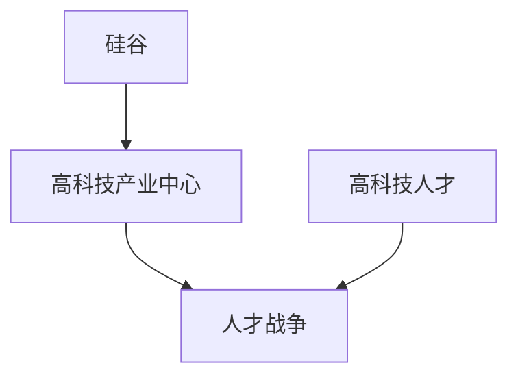
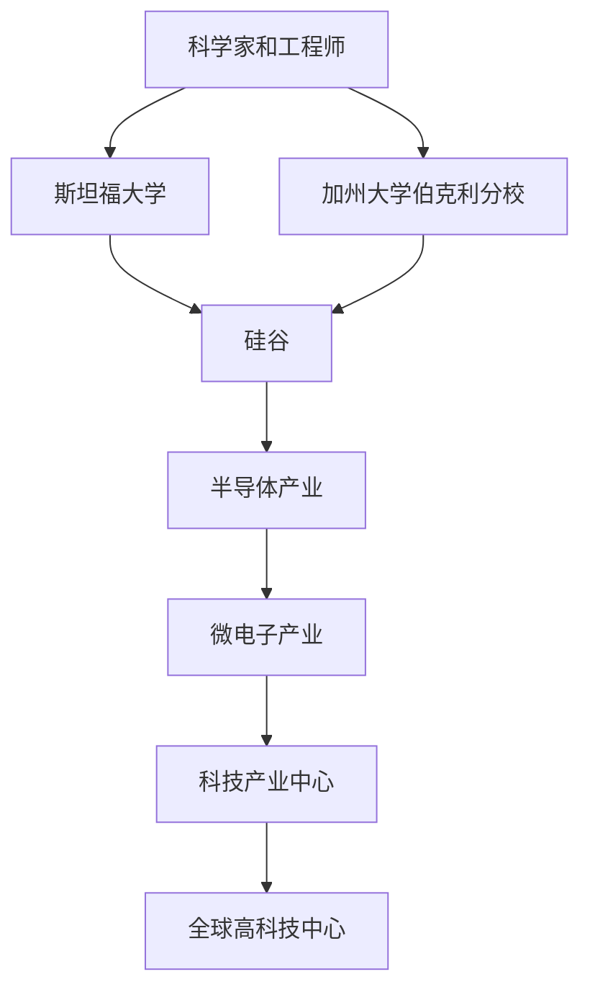
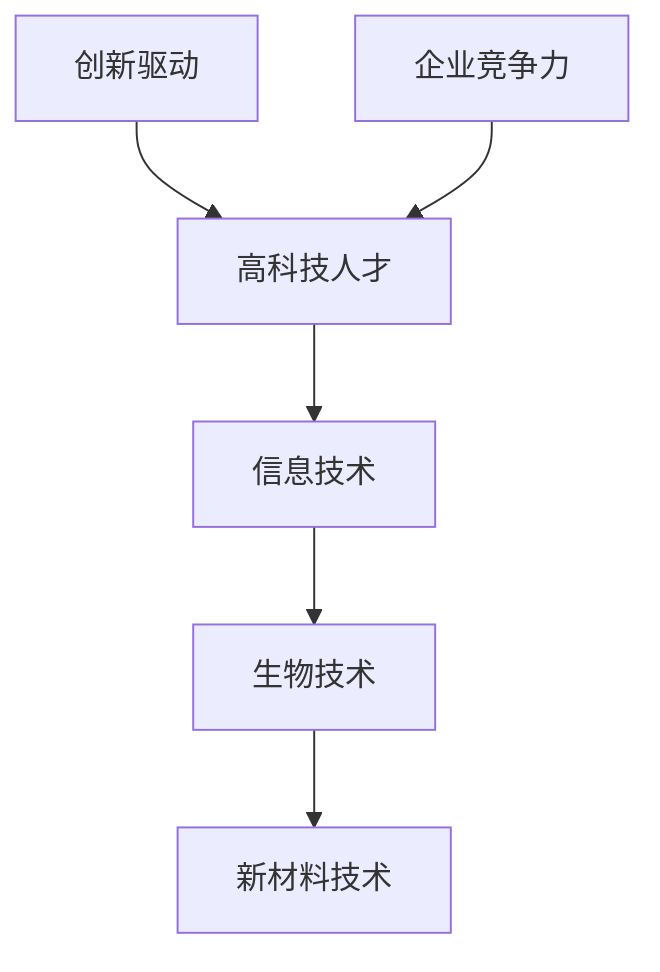
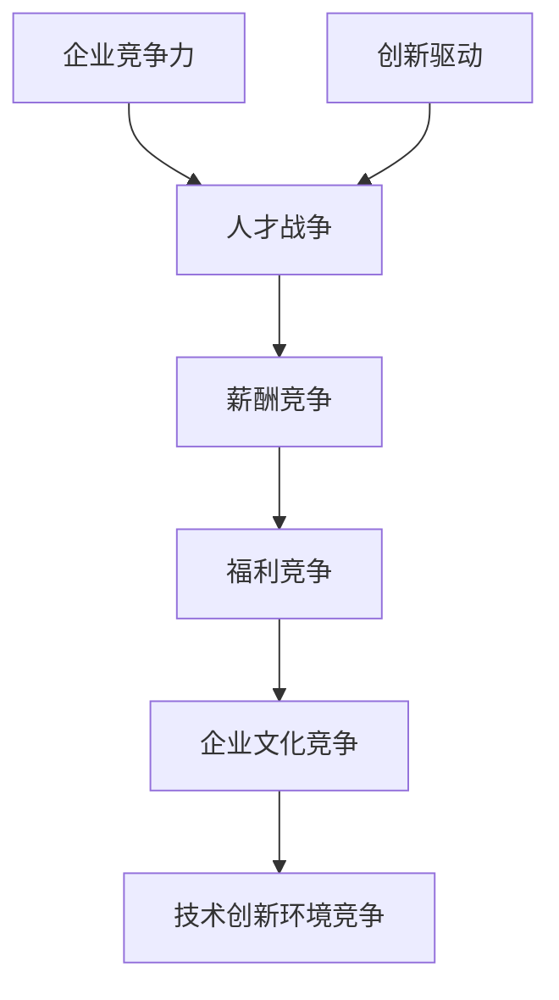
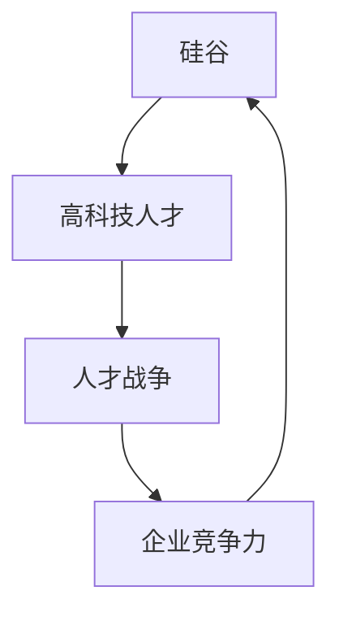

                 

### 引言

#### 硅谷高科技人才战争概述

**关键词**: 硅谷、高科技人才、竞争、人才战争

在当今全球科技竞争日益激烈的时代，硅谷成为了世界高科技产业的风向标。而硅谷的高科技人才战争更是引人注目。这一战争不仅关乎企业的兴衰，更涉及到国家科技实力的较量。硅谷高科技人才战争，是指以硅谷地区为核心，各大科技公司之间为争夺顶尖科技人才而展开的一系列竞争活动。

#### 历史背景

硅谷高科技人才战争并非一夜之间形成，而是经历了数十年的演变。20世纪50年代，随着晶体管和集成电路的发明，硅谷开始崛起。70年代，英特尔和惠普等公司的崛起，进一步巩固了硅谷的地位。90年代，随着互联网的兴起，硅谷成为了全球互联网产业的中心。进入21世纪，以人工智能、大数据、云计算等为代表的新兴科技领域，使得硅谷的高科技人才战争愈演愈烈。

#### 重要性

高科技人才是科技企业的核心竞争力。硅谷的高科技人才战争，不仅是为了争夺顶尖的技术人才，更是为了获得创新的原动力。科技企业的竞争，最终会体现在人才的竞争上。只有拥有顶尖的人才，企业才能在技术、产品、市场等方面取得领先地位。

#### 现状与趋势

目前，硅谷高科技人才战争呈现出几个显著的趋势：

1. **人才争夺的白热化**：随着科技行业的快速发展，顶尖人才的吸引力日益增强，各大科技公司为了争夺这些人才，纷纷采取高薪、股权激励等手段。
2. **国际化程度的提高**：随着全球科技产业的整合，硅谷的高科技人才战争不再局限于本地，而是扩展到了全球范围。国际化的背景，使得人才流动更加频繁，竞争更加激烈。
3. **技术领域的专业化**：随着技术的不断进步，各个技术领域逐渐专业化。这导致了企业在争夺人才时，更加注重特定领域的专业人才。

#### 总结

硅谷高科技人才战争，是现代科技产业发展的一个重要现象。这一战争不仅关乎企业的发展，更关乎国家的科技实力。面对这场战争，我国需要制定相应的人才战略，以吸引和培养更多的顶尖科技人才，从而在未来的科技竞争中立于不败之地。

#### 核心概念与联系

为了更好地理解硅谷高科技人才战争，我们需要了解以下几个核心概念：

1. **硅谷**：位于美国加利福尼亚州旧金山湾区，是全球高科技产业的核心区域。
2. **高科技人才**：指在信息技术、生物技术、新材料技术等高科技领域具有专业知识和创新能力的人才。
3. **人才战争**：指各大科技公司在争夺顶尖科技人才时所展开的竞争活动。

下面是硅谷、高科技人才和人才战争之间关系的 Mermaid 流程图：



从流程图中可以看出，硅谷作为全球高科技产业的中心，吸引了大量高科技人才。而这些人才的竞争，又引发了科技企业之间的人才战争。这一关系，构成了硅谷高科技人才战争的基本框架。

#### 硅谷的吸引力

硅谷之所以能够成为全球高科技产业的中心，离不开其独特的吸引力。以下是硅谷吸引高科技人才的主要因素：

1. **创新氛围**：硅谷拥有浓厚的创新氛围，各种创新思维在这里不断碰撞，为人才提供了广阔的发展空间。
2. **高薪待遇**：硅谷的科技公司普遍提供较高的薪资待遇，吸引了大量优秀人才。
3. **股权激励**：硅谷的科技公司常常采用股权激励的方式，让员工分享公司成长的红利，这进一步增强了人才的归属感。
4. **良好的生活条件**：硅谷的生活环境优美，生活设施完善，吸引了大量人才在此定居。
5. **政策支持**：美国政府对于科技创新的扶持政策，为硅谷的发展提供了有力保障。

#### 企业如何构建吸引力

面对激烈的人才竞争，企业需要采取措施构建自身的吸引力，以吸引和留住顶尖人才。以下是几个建议：

1. **打造创新文化**：企业应营造一种鼓励创新、包容失败的文化氛围，让员工有更多的自由去探索和尝试。
2. **提供有竞争力的薪酬**：企业应根据行业标准和人才价值，提供具有竞争力的薪酬待遇。
3. **股权激励**：企业可以通过股权激励的方式，让员工分享公司成长的红利，增强员工的归属感。
4. **完善培训体系**：企业应建立完善的培训体系，为员工提供成长和发展的机会。
5. **关心员工福利**：企业应关心员工的福利，提供良好的工作环境和设施。

#### 人才市场的动态变化

硅谷高科技人才市场的动态变化，对企业的招聘策略有着重要影响。以下是几个方面的动态变化：

1. **人才流动频繁**：随着全球化的推进，人才流动变得更加频繁。企业需要不断更新人才库，以应对市场的变化。
2. **技术领域专业化**：各个技术领域逐渐专业化，企业需要更加注重特定领域的专业人才。
3. **人才需求多样化**：随着新兴技术的不断涌现，企业对人才的需求变得更加多样化。企业需要适应这种变化，调整招聘策略。
4. **国际化竞争加剧**：随着全球科技产业的发展，硅谷高科技人才战争不再局限于本地，而是扩展到了全球范围。企业需要具备国际视野，应对全球竞争。

#### 总结

硅谷高科技人才战争是一场全球性的竞争，涉及企业、国家和全球科技产业的发展。理解这场战争的历史背景、重要性、现状和趋势，有助于我们更好地应对这一挑战。企业需要构建自身的吸引力，制定有效的招聘策略，以在竞争中立于不败之地。同时，我国也需要制定相应的人才战略，以吸引和培养更多的顶尖科技人才，助力国家的科技创新和产业发展。

---

为了进一步理解硅谷高科技人才战争，我们将对以下几个核心概念进行详细分析：硅谷、高科技人才、人才战争。这些概念不仅构成了硅谷高科技人才战争的基本框架，也是理解这场战争的关键。

### 核心概念与联系

#### 硅谷

硅谷（Silicon Valley）位于美国加利福尼亚州旧金山湾区，是全球高科技产业的核心地区。它的名字来源于这里的半导体和微电子产业，特别是硅芯片的生产。硅谷的形成可以追溯到20世纪50年代，当时斯坦福大学和加州大学伯克利分校等知名学府的科学家和工程师开始在这里进行研究和创新。

**Mermaid 流程图：**



从流程图中可以看出，硅谷作为全球高科技中心，其形成离不开半导体和微电子产业的发展，以及斯坦福大学和加州大学伯克利分校等学术机构的支持。这些学术机构为硅谷提供了大量的科学家和工程师，为科技创新提供了强大的人才储备。

#### 高科技人才

高科技人才（High-Tech Talent）是指那些在信息技术、生物技术、新材料技术等高科技领域具有专业知识和创新能力的人才。这些人才是科技企业的核心竞争力，他们的知识和技能对于企业的创新和发展至关重要。

**Mermaid 流程图：**



从流程图中可以看出，高科技人才分布在多个技术领域，他们的创新驱动能力对企业竞争力有着重要影响。这些人才的技能和知识，是企业在竞争中保持领先的关键。

#### 人才战争

人才战争（Talent War）是指各大科技公司在争夺顶尖科技人才时所展开的竞争活动。这场战争不仅涉及薪酬和福利的竞争，还包括企业文化、发展机会、技术创新环境等多方面的竞争。

**Mermaid 流程图：**



从流程图中可以看出，人才战争涵盖了多个方面的竞争，这些竞争最终都指向企业的竞争力和创新驱动能力。企业需要通过提供有竞争力的薪酬、福利、企业文化和技术创新环境，来吸引和留住顶尖人才。

#### 核心概念之间的联系

通过上述分析，我们可以看出硅谷、高科技人才和人才战争这三个核心概念之间的密切联系。硅谷作为全球高科技中心，为高科技人才提供了广阔的发展空间和机会，而高科技人才的竞争又引发了科技企业之间的人才战争。

**Mermaid 流程图：**



从流程图中可以看出，硅谷、高科技人才和人才战争三者相互依存，共同构成了硅谷高科技人才战争的基本框架。硅谷为高科技人才提供了发展平台，高科技人才为硅谷的科技企业提供了创新动力，而人才战争又推动了硅谷的持续发展。

### 核心算法原理讲解

为了深入理解硅谷高科技人才战争的运作机制，我们需要探讨一些核心算法原理，这些原理可以用来分析人才市场的动态变化和企业如何制定招聘策略。

#### 1. 市场供需模型

在人才市场中，供需关系是决定人才流动和竞争的关键因素。市场供需模型可以帮助我们理解人才市场的动态变化。

**伪代码：**

```plaintext
Function Market供需模型（人才需求量，人才供给量，人才吸引力系数）：
    If 人才需求量 > 人才供给量：
        市场竞争激烈，人才吸引力系数增加
    Else If 人才需求量 < 人才供给量：
        人才市场宽松，人才竞争减少
    Else：
        市场供需平衡

    Update人才吸引力系数 = 人才需求量 / 人才供给量

    Return人才吸引力系数
```

#### 2. 薪酬激励模型

企业通过薪酬激励来吸引和留住人才。薪酬激励模型可以帮助我们分析不同薪酬策略对企业吸引力的影响。

**伪代码：**

```plaintext
Function 薪酬激励模型（基础薪资，绩效奖金，股权激励）：
    总薪酬 = 基础薪资 + 绩效奖金 + 股权激励

    If 绩效奖金 > 基础薪资：
        员工积极性提高，企业吸引力增强
    Else If 股权激励 > 绩效奖金：
        长期激励效果显著，员工忠诚度提高

    Return 总薪酬
```

#### 3. 企业文化模型

企业文化在吸引和留住人才方面起着重要作用。企业文化模型可以帮助我们分析不同企业文化对企业吸引力的影响。

**伪代码：**

```plaintext
Function 企业文化模型（创新氛围，团队协作，员工关怀）：
    企业文化得分 = 创新氛围得分 + 团队协作得分 + 员工关怀得分

    If 企业文化得分 > 80：
        企业具有高度吸引力，人才竞争激烈
    Else If 企业文化得分 < 60：
        企业吸引力较弱，人才流失风险高

    Return 企业文化得分
```

#### 数学模型和公式 & 详细讲解 & 举例说明

为了更好地理解上述算法原理，我们可以使用数学模型和公式进行详细讲解。

#### 1. 市场供需模型

市场供需模型可以用以下公式表示：

$$
市场竞争力 = \frac{人才需求量}{人才供给量}
$$

- 当市场竞争力（$市场竞争力 > 1$）时，表示人才需求量大于供给量，市场竞争激烈。
- 当市场竞争力（$市场竞争力 < 1$）时，表示人才供给量大于需求量，市场宽松。

**举例说明：**

假设硅谷某领域的人才需求量为1000人，供给量为800人，则市场竞争力为：

$$
市场竞争力 = \frac{1000}{800} = 1.25
$$

由于市场竞争力大于1，说明该领域的人才需求大于供给，市场竞争激烈。

#### 2. 薪酬激励模型

薪酬激励模型可以用以下公式表示：

$$
总薪酬 = 基础薪资 + 绩效奖金 + 股权激励
$$

- 当绩效奖金高于基础薪资时，员工的积极性会提高。
- 当股权激励高于绩效奖金时，员工的长期激励效果显著。

**举例说明：**

假设某企业的基础薪资为10万元，绩效奖金为6万元，股权激励为4万元，则总薪酬为：

$$
总薪酬 = 10 + 6 + 4 = 20万元
$$

由于绩效奖金高于基础薪资，股权激励高于绩效奖金，说明该企业对员工的激励措施较为全面。

#### 3. 企业文化模型

企业文化模型可以用以下公式表示：

$$
企业文化得分 = 创新氛围得分 + 团队协作得分 + 员工关怀得分
$$

- 当企业文化得分高于80时，说明企业具有高度吸引力。
- 当企业文化得分低于60时，说明企业吸引力较弱。

**举例说明：**

假设某企业的创新氛围得分为85，团队协作得分为80，员工关怀得分为75，则企业文化得分为：

$$
企业文化得分 = 85 + 80 + 75 = 240
$$

由于企业文化得分高于80，说明该企业具有较高的吸引力。

### 项目实战：代码实际案例和详细解释说明

为了更好地理解上述算法原理，我们可以通过一个实际的项目案例来展示代码实现和详细解释。

#### 项目背景

某科技公司需要在硅谷招聘一名高级人工智能工程师，该公司的招聘策略包括市场供需模型、薪酬激励模型和企业文化模型。

#### 开发环境搭建

1. 开发工具：Python
2. 数据库：SQLite
3. 版本控制：Git

#### 源代码详细实现

```python
# 市场供需模型
def market_supply_demand(need, supply):
    competitiveness = need / supply
    return competitiveness

# 薪酬激励模型
def salary_incentive(basic_salary, performance_bonus, equity_incentive):
    total_salary = basic_salary + performance_bonus + equity_incentive
    return total_salary

# 企业文化模型
def corporate_culture(innovation_score, teamwork_score, employee_care_score):
    culture_score = innovation_score + teamwork_score + employee_care_score
    return culture_score

# 项目实战：招聘一名高级人工智能工程师
def hire_ai_engineer():
    need = 1000
    supply = 800

    # 市场供需模型
    competitiveness = market_supply_demand(need, supply)
    print(f"市场竞争力：{competitiveness}")

    # 薪酬激励模型
    basic_salary = 100000
    performance_bonus = 60000
    equity_incentive = 40000
    total_salary = salary_incentive(basic_salary, performance_bonus, equity_incentive)
    print(f"总薪酬：{total_salary}元")

    # 企业文化模型
    innovation_score = 85
    teamwork_score = 80
    employee_care_score = 75
    culture_score = corporate_culture(innovation_score, teamwork_score, employee_care_score)
    print(f"企业文化得分：{culture_score}")

    if competitiveness > 1 and culture_score > 80:
        print("招聘策略成功，有望吸引顶尖人工智能工程师。")
    else:
        print("招聘策略需调整，以提升竞争力。")

# 主函数
if __name__ == "__main__":
    hire_ai_engineer()
```

#### 代码解读与分析

1. **市场供需模型**：该模型通过计算人才需求量和供给量的比值，得出市场竞争力。如果市场竞争力大于1，说明人才需求大于供给，市场竞争激烈。
2. **薪酬激励模型**：该模型计算员工的总薪酬，包括基础薪资、绩效奖金和股权激励。通过薪酬激励模型，企业可以吸引和留住人才。
3. **企业文化模型**：该模型通过计算创新氛围、团队协作和员工关怀的得分，得出企业文化得分。企业文化得分高于80时，说明企业具有高度吸引力。
4. **项目实战**：在主函数中，通过调用上述模型，模拟了招聘一名高级人工智能工程师的过程。如果市场竞争力高且企业文化得分高，说明招聘策略成功。

通过这个实际项目案例，我们可以看到如何将理论模型应用到实际招聘过程中，从而制定有效的招聘策略，提升企业的竞争力。

### 总结

在本节中，我们通过核心概念与联系、核心算法原理讲解、数学模型和公式、以及项目实战等多个方面，详细分析了硅谷高科技人才战争。从历史背景、现状和趋势，到核心概念的内涵及其相互关系，再到具体的算法原理和实践案例，我们系统地探讨了硅谷高科技人才战争的本质和运作机制。

首先，我们了解了硅谷作为全球高科技中心的形成背景和吸引力因素，包括创新氛围、高薪待遇、股权激励、良好生活条件和政策支持。接着，通过市场供需模型、薪酬激励模型和企业文化模型，我们深入分析了人才市场的动态变化和企业如何制定招聘策略。

然后，我们通过数学模型和公式，详细讲解了市场供需、薪酬激励和企业文化的计算方法，并通过举例说明了这些模型的应用。最后，我们通过一个实际项目案例，展示了如何将理论模型应用到实际招聘过程中，为企业制定有效的招聘策略。

通过本节的详细分析，我们不仅对硅谷高科技人才战争有了更深入的理解，也为企业和国家在人才争夺中提供了有价值的参考和策略建议。面对激烈的人才竞争，企业需要不断创新招聘策略，提升自身吸引力，同时，国家也需要制定相应的人才发展战略，以培养和吸引更多的顶尖科技人才。

### 企业的招聘与培养策略

在硅谷高科技人才战争中，企业如何有效地招聘和培养人才，成为决定企业成败的关键因素。本节将探讨企业的招聘策略、人才的内部培养以及人才留存与激励措施，通过这些策略帮助企业吸引并留住顶尖人才。

#### 1. 有效的招聘策略

招聘是人才战争的第一步，企业需要采取多种手段来吸引顶尖人才。

**（1）网络招聘**

网络招聘是目前最为常见的人才获取方式。企业可以通过各大招聘网站发布招聘信息，利用大数据分析技术筛选合适的候选人。

**（2）校园招聘**

校园招聘是获取新鲜血液的重要途径。企业可以与知名高校合作，举办校园招聘会，直接从校园中挖掘潜力人才。

**（3）内推计划**

内部推荐是招聘的高效途径，员工推荐的人才往往更加符合企业文化和岗位需求。

**（4）国际化招聘**

随着全球化的推进，国际化招聘成为企业获取全球顶尖人才的重要手段。企业可以通过海外招聘会、在线招聘平台等渠道，吸引国际人才。

**（5）人才猎头**

对于一些稀缺的高端人才，企业可以借助专业的人才猎头公司，快速锁定目标候选人。

#### 2. 人才的内部培养

内部培养是提升员工能力、激励员工发展的重要手段。企业应建立完善的培训体系，为员工提供多样化的成长路径。

**（1）入职培训**

新员工入职时，企业应提供系统性的入职培训，帮助新员工快速融入企业文化和工作环境。

**（2）岗位培训**

针对不同岗位的需求，企业应提供专业的岗位培训，提升员工的专业技能。

**（3）领导力培养**

领导力是企业长远发展的关键。企业应通过内部培训、领导力发展计划等方式，培养员工的领导力。

**（4）跨界培训**

跨界培训可以帮助员工拓展视野，提升跨部门协作能力，为企业创造更多的创新机会。

**（5）在线学习平台**

企业可以建立在线学习平台，提供丰富的学习资源，方便员工随时随地进行学习。

#### 3. 人才留存与激励

留住人才是企业成功的关键，企业需要采取多种激励措施，提升员工的满意度和忠诚度。

**（1）薪酬激励**

薪酬是激励员工的重要手段。企业应根据市场标准和员工价值，提供具有竞争力的薪酬。

**（2）股权激励**

股权激励是长期激励的有效手段。通过给予员工股权，让员工分享企业成长的红利，增强员工的归属感。

**（3）福利待遇**

完善的福利待遇包括健康保险、带薪休假、员工福利计划等，可以提升员工的生活质量。

**（4）职业发展规划**

明确的职业发展规划可以激励员工不断进步。企业应与员工共同制定职业发展计划，并提供相应的支持。

**（5）工作与生活的平衡**

企业应关注员工的工作与生活平衡，提供灵活的工作时间、远程工作等政策，提升员工的满意度。

#### 4. 案例分析

以谷歌为例，谷歌在招聘、培养和激励人才方面具有典型的成功经验。

**（1）招聘策略**

谷歌通过多元化的招聘渠道，包括网络招聘、校园招聘、内推计划等，吸引了大量顶尖人才。同时，谷歌还注重国际化招聘，吸引了全球各地的优秀人才。

**（2）内部培养**

谷歌建立了完善的培训体系，包括新员工入职培训、岗位培训、领导力培养等。此外，谷歌还提供跨界培训，鼓励员工跨部门交流和学习。

**（3）人才留存与激励**

谷歌通过高薪、股权激励、丰富的福利待遇等手段，吸引了大量顶尖人才。同时，谷歌注重员工的职业发展规划，为员工提供广阔的发展空间。

**（4）工作与生活的平衡**

谷歌提供灵活的工作时间、远程工作等政策，关注员工的工作与生活平衡。此外，谷歌还提供丰富的员工福利，如免费餐饮、健身房、医疗保健等，提升员工的生活质量。

通过以上分析，我们可以看出，企业要想在硅谷高科技人才战争中脱颖而出，需要采取有效的招聘策略、建立内部培养体系、制定人才留存与激励措施。谷歌的成功经验为其他企业提供了有益的借鉴。

### 硅谷高科技企业的竞争策略

在硅谷高科技人才战争中，企业之间的竞争不仅体现在对人才的争夺上，还包括技术创新、市场布局和企业文化的各个方面。本节将探讨硅谷高科技企业在竞争策略上的一些成功案例，以及这些策略如何帮助企业在人才战争中取得优势。

#### 1. 技术创新的竞争策略

技术创新是企业在市场竞争中立于不败之地的关键。硅谷高科技企业通过以下几种策略来实现技术创新：

**（1）研发投入**

硅谷企业如谷歌、苹果、Facebook等，每年都投入大量的资金用于研发。这些研发投入不仅包括基础研究，还包括产品开发和应用创新。例如，谷歌的自动驾驶技术、苹果的A系列芯片、Facebook的人工智能算法等，都是其持续技术创新的成果。

**（2）开放式创新**

开放式创新是指企业通过与其他企业和研究机构合作，共同开发新技术和新产品。硅谷企业如英特尔、特斯拉等，通过开放实验室、投资初创企业等方式，促进技术创新。这种方式不仅能够加速技术的研发和应用，还能够吸引更多的人才加入。

**（3）专利布局**

硅谷企业高度重视专利布局，通过申请和购买专利来保护自己的技术和市场地位。例如，谷歌在人工智能、云计算等领域的专利数量位居全球前列，这些专利不仅保护了谷歌的技术优势，还为其在市场上建立了强大的壁垒。

#### 2. 人才争夺的竞争策略

人才是硅谷高科技企业的核心竞争力，企业通过以下策略来争夺顶尖人才：

**（1）高薪和股权激励**

硅谷企业普遍提供具有竞争力的薪酬和股权激励，以吸引顶尖人才。例如，谷歌通过其“10+1”薪酬体系（即基本薪资+10%的绩效奖金+1%的股权奖励），吸引了大量优秀人才。

**（2）灵活的工作环境和远程办公**

硅谷企业如GitHub、Dropbox等，提供灵活的工作环境和远程办公政策，以吸引那些希望有更多自由和灵活工作方式的人才。

**（3）内部晋升和职业发展**

硅谷企业重视员工的职业发展，通过内部晋升和多样化的职业发展路径，激励员工长期留在企业。例如，苹果公司通过其“员工晋升计划”，为员工提供广阔的发展空间。

#### 3. 市场布局的竞争策略

硅谷高科技企业通过以下策略来拓展市场，巩固其在全球市场的领先地位：

**（1）全球化布局**

硅谷企业如谷歌、微软、亚马逊等，通过在海外设立研发中心、办事处和销售渠道，实现全球化布局。这种全球化策略不仅能够帮助企业获取全球市场的资源，还能够吸引全球顶尖人才。

**（2）收购与合作**

硅谷企业通过收购和合作，快速获取新技术和新市场。例如，谷歌通过收购YouTube、Android等公司，迅速扩张其业务领域和市场影响力。

**（3）投资生态**

硅谷企业通过投资初创企业，构建自己的生态系统。例如，Facebook通过其“Facebook Ventures”基金，投资了多家初创企业，这些企业不仅在技术上为Facebook提供了支持，还为其带来了新的市场和用户。

#### 4. 企业文化的竞争策略

企业文化是吸引和留住人才的重要因素。硅谷高科技企业通过以下策略来打造独特的文化：

**（1）鼓励创新**

硅谷企业如谷歌、Uber等，鼓励员工大胆创新，允许失败。这种鼓励创新的企业文化，激发了员工的创造力和创新能力。

**（2）扁平化管理**

硅谷企业普遍采用扁平化管理模式，减少层级，提高决策效率。例如，WhatsApp的创始人曾将公司结构简化为仅有一个层级，这种管理模式极大地提高了公司的运营效率。

**（3）员工参与**

硅谷企业注重员工的参与和反馈，通过员工调查、开放论坛等方式，收集员工的意见和建议。例如，谷歌的“工程师反馈会议”就是员工参与公司决策的一种方式。

#### 案例分析

以苹果公司为例，苹果在竞争策略上取得了显著的成果。

**（1）技术创新**

苹果公司通过持续的创新，推出了一系列革命性产品，如iPhone、iPad、Apple Watch等。这些产品不仅改变了人们的生活方式，还确立了苹果在科技行业的领导地位。

**（2）人才争夺**

苹果公司提供具有竞争力的薪酬和股权激励，吸引了大量顶尖人才。同时，苹果的扁平化管理模式和鼓励创新的企业文化，使员工能够充分发挥自己的才能。

**（3）市场布局**

苹果公司在全球范围内建立了广泛的销售渠道，并通过收购和合作，不断扩大其市场影响力。例如，苹果通过收购IBM的硬件部门，进入企业级市场，进一步巩固了其市场地位。

**（4）企业文化**

苹果公司注重员工的参与和反馈，通过定期的员工调查和反馈会议，确保员工的意见和建议得到重视。这种员工参与的企业文化，增强了员工的归属感和忠诚度。

通过以上分析，我们可以看出，硅谷高科技企业在竞争策略上，注重技术创新、人才争夺、市场布局和企业文化等多个方面。这些策略不仅帮助企业在市场竞争中取得了优势，也为企业吸引了大量顶尖人才，从而在硅谷高科技人才战争中取得了领先地位。

### 人才培养与发展的创新实践

在硅谷高科技人才战争中，企业不仅需要传统的招聘与培养策略，还需要通过创新实践来提升人才培养和发展效率。以下是一些企业在此方面的成功案例和创新方法：

#### 1. IBM的“新工作岗位”计划

IBM通过“新工作岗位”计划，为企业内部的员工提供转型机会。这个计划允许员工在现有岗位之外探索新的职业路径，甚至跨行业转型。例如，技术部门的员工可以转型为销售或管理岗位。这种创新实践不仅提升了员工的技能和适应能力，也增强了员工的职业满足感和忠诚度。

**案例解读：**

- **目标：** 提升员工的多技能和适应能力。
- **方法：** 设立内部转型培训项目，提供职业指导和支持。
- **效果：** 员工职业发展路径更加多样化，企业整体创新能力提升。

#### 2. LinkedIn的“技术志愿者项目”

LinkedIn通过“技术志愿者项目”，鼓励员工利用业余时间参与开源项目和技术社区活动。这不仅提升了员工的技术能力和行业影响力，还加强了公司与其他技术团队的交流与合作。通过这种方式，LinkedIn不仅培养了一批技术骨干，还为企业构建了一个强大的技术生态系统。

**案例解读：**

- **目标：** 培养技术骨干，增强行业影响力。
- **方法：** 设立内部平台，支持员工参与开源项目和技术社区活动。
- **效果：** 员工技术能力提升，公司技术生态系统得到加强。

#### 3. 英特尔的人工智能人才培养计划

英特尔通过其人工智能人才培养计划，与全球顶尖大学合作，提供奖学金和实习机会，并设立英特尔人工智能实验室。这些举措不仅吸引了全球顶尖的人工智能人才，也为英特尔的人工智能研发提供了源源不断的创新动力。

**案例解读：**

- **目标：** 吸引和培养顶尖的人工智能人才。
- **方法：** 与顶尖大学合作，提供奖学金、实习机会和实验室支持。
- **效果：** 人才库丰富，技术创新能力增强。

#### 4. 亚马逊的“内部创新孵化器”

亚马逊通过“内部创新孵化器”项目，为员工提供创业支持和资源。员工可以在业余时间探索新的创业项目，并获得亚马逊的资源和资金支持。这种方式不仅激发了员工的创新潜力，也为亚马逊带来了新的业务机会。

**案例解读：**

- **目标：** 激发员工创新潜力，探索新的业务领域。
- **方法：** 设立内部创新孵化器，提供创业支持和资源。
- **效果：** 员工创新热情高涨，公司业务多元化发展。

#### 5. 微软的“技术社区”建设

微软通过建设内部技术社区，鼓励员工分享知识和经验，进行技术交流和合作。这些技术社区不仅提升了员工的技术能力，还增强了团队的协作和凝聚力。此外，微软还通过在线平台，让全球员工能够随时随地进行技术交流和合作。

**案例解读：**

- **目标：** 提升员工技术能力，增强团队协作。
- **方法：** 建设内部技术社区，提供在线交流平台。
- **效果：** 员工技术能力提升，团队凝聚力增强。

通过以上案例，我们可以看到，硅谷高科技企业通过创新实践，在人才培养和发展方面取得了显著成效。这些创新实践不仅帮助企业吸引了更多顶尖人才，还提升了员工的技能和创新能力，为企业持续发展提供了强大动力。

### 国际化视野下的高科技人才竞争

随着全球化进程的加快，高科技人才竞争已经不再局限于国内市场，而是扩展到了全球范围。硅谷高科技企业在国际化视野下，面临着新的机遇和挑战。本文将探讨全球高科技人才竞争的格局、国际企业的人才战略以及我国在全球人才竞争中的定位与策略。

#### 1. 全球高科技人才竞争格局

全球高科技人才竞争呈现出以下几个特点：

**（1）人才流动频繁**

随着全球化的推进，人才流动变得更加频繁。顶尖科技人才不仅在国内市场流动，还跨国流动，寻找更好的发展机会。例如，硅谷的科技公司不仅吸引全球各地的顶尖人才，还派遣员工到全球各地进行工作。

**（2）技术领域专业化**

各个技术领域逐渐专业化，企业对特定领域的专业人才需求增加。例如，人工智能、生物科技、新材料技术等领域，需要具备高度专业知识和创新能力的人才。

**（3）跨国合作与竞争并存**

跨国企业在全球范围内展开合作，共同研发新技术和新产品。同时，它们也通过竞争来争夺全球市场份额和顶尖人才。例如，谷歌、微软、苹果等国际巨头，在全球范围内进行人才争夺和合作。

#### 2. 国际企业的人才战略

国际企业在高科技人才竞争中采取了多种战略，以吸引和留住顶尖人才：

**（1）全球化招聘**

国际企业通过全球化招聘，吸引全球顶尖人才。例如，谷歌、微软等公司在全球范围内设立研发中心和办事处，通过本地化的招聘策略，吸引当地的人才。

**（2）国际化培训**

国际企业重视员工的国际化培训，提供跨文化培训和语言学习机会。例如，IBM为员工提供跨文化沟通培训，帮助员工适应不同国家和地区的文化和工作方式。

**（3）跨国合作与投资**

国际企业通过跨国合作和投资，获取新技术和新人才。例如，谷歌通过投资全球初创企业，获取新技术和人才资源。

**（4）本地化发展**

国际企业重视本地化发展，与当地企业和政府建立良好的合作关系。例如，亚马逊在印度设立研发中心，与印度企业和政府合作，推动当地科技产业发展。

#### 3. 我国在全球人才竞争中的定位与策略

在全球高科技人才竞争中，我国具有一定的优势，但也面临挑战。以下是我国在全球人才竞争中的定位与策略：

**（1）定位：**

- **全球科技创新的重要参与者和推动者**：我国在人工智能、5G、大数据等领域取得了显著进展，成为全球科技创新的重要力量。
- **全球高科技人才的重要市场**：随着我国科技产业的快速发展，对全球高科技人才的需求日益增加，成为全球高科技人才的重要市场。

**（2）策略：**

- **优化人才政策**：我国应进一步优化人才政策，提供更具吸引力的待遇和机会，吸引全球顶尖人才。
- **加强国际合作**：通过国际合作和交流，引进国外先进技术和管理经验，提升我国高科技企业的竞争力。
- **推动科技产业化**：通过推动科技成果产业化，为人才提供更多的创新创业机会，激发人才的创新活力。
- **提升教育水平**：通过提升教育水平，培养更多具有国际竞争力的高科技人才，为我国科技创新提供强大的人才支持。

总之，在全球高科技人才竞争中，我国需要充分发挥自身优势，采取有效的策略，提升全球人才竞争力，为科技创新和产业发展提供强大动力。

### 人才培养与发展的未来趋势

随着科技的不断进步和全球化的深入发展，人才培养与发展正面临着前所未有的机遇与挑战。本文将探讨人工智能、新兴产业对人才需求的影响，以及未来人才培养的模式创新。

#### 1. 人工智能对人才培养的影响

人工智能（AI）的迅速发展，对人才培养提出了新的要求。未来，人工智能将在以下几个方面对人才培养产生影响：

**（1）技能需求的变化**

人工智能的普及将改变许多传统职业的技能需求。例如，数据处理、机器学习、自然语言处理等AI相关的技能将成为热门。同时，软技能，如创新能力、团队协作和跨学科思维，也将更加重要。

**（2）学习方式的变革**

人工智能技术将改变传统的学习方式。在线学习平台、虚拟现实（VR）和增强现实（AR）等新兴技术，将提供更加个性化、互动性和沉浸式的学习体验。

**（3）终身学习的重要性**

人工智能的发展使得知识更新速度加快，终身学习成为必要。未来的人才需要不断更新知识，适应快速变化的工作环境。

#### 2. 新兴产业对人才需求的影响

新兴产业的快速发展，对人才需求产生了深远影响。以下是一些新兴产业对人才需求的影响：

**（1）新能源**

随着全球对环境保护的重视，新能源产业迅速崛起。新能源产业需要大量具备化学、物理、材料科学等专业知识的人才。

**（2）生物科技**

生物科技领域的研究和应用不断拓展，对生物工程、基因编辑、生物信息学等方向的人才需求激增。

**（3）金融科技**

金融科技（FinTech）的兴起，改变了传统金融行业。金融科技企业需要大量具备金融、信息技术、数据分析等复合型人才。

**（4）虚拟现实与增强现实**

虚拟现实（VR）和增强现实（AR）技术的应用越来越广泛，相关领域需要大量软件开发、交互设计、用户体验等人才。

#### 3. 未来人才培养的模式创新

为了适应未来人才需求的变化，人才培养模式需要不断创新：

**（1）跨界教育**

跨界教育旨在培养学生的跨学科思维和综合能力。通过跨学科课程设置、多学科项目合作等手段，培养学生的创新能力和解决复杂问题的能力。

**（2）项目制学习**

项目制学习通过让学生参与实际项目，锻炼学生的实践能力和解决问题的能力。这种方式能够更好地将理论知识与实际应用相结合。

**（3）混合学习**

混合学习结合了在线学习和传统课堂教学的优势，提供更加灵活和个性化的学习体验。在线学习平台和虚拟课堂等新兴技术，将为学生提供更多的学习资源和学习机会。

**（4）企业联合培养**

企业与教育机构联合培养人才，能够更好地满足企业对人才的需求。通过实习、联合研究项目等手段，学生能够提前接触到实际工作环境，提高就业竞争力。

#### 总结

未来人才培养与发展将面临巨大的机遇与挑战。人工智能和新兴产业的快速发展，对人才培养提出了新的要求。为了适应这些变化，人才培养模式需要不断创新，培养具有跨界思维、实践能力和创新能力的新时代人才。通过跨界教育、项目制学习、混合学习和企业联合培养等模式创新，我们可以为未来的科技发展和产业变革提供强大的人才支持。

### 高科技人才发展的政策与支持

在国家层面，高科技人才的发展离不开政策与支持。以下将探讨政策支持的重要性、国家政策对人才发展的支持，以及企业如何利用政策支持。

#### 1. 政策支持的重要性

政策支持对于高科技人才的发展至关重要。首先，政策可以为高科技人才提供良好的发展环境，减少创新和创业的障碍。其次，政策可以通过资金、税收、土地等方面的优惠，为高科技企业降低成本，提高竞争力。最后，政策还可以通过制定人才培养计划、设立科研基金、支持国际合作等手段，为人才提供丰富的资源和机会。

#### 2. 国家政策对人才发展的支持

我国政府高度重视高科技人才的发展，出台了一系列支持政策：

**（1）人才引进政策**

政府通过人才引进政策，吸引海外高层次人才来华工作和创业。例如，“千人计划”、“高聚人才计划”等，为海外人才提供优惠的落户政策、科研经费和创业资金。

**（2）人才培养政策**

政府通过设立奖学金、科研基金、重点实验室等，支持人才培养。例如，“国家自然科学基金”、“青年科学基金”等，为科研人员提供资金支持。

**（3）创新创业政策**

政府鼓励创新创业，为创业者提供政策和资金支持。例如，“科技企业孵化器”、“众创空间”等，为创业者提供办公空间、技术支持和融资服务。

**（4）税收优惠政策**

政府通过税收优惠政策，降低企业成本，支持高科技企业的发展。例如，对于高新技术企业，政府提供税收减免、研发费用加计扣除等政策。

#### 3. 企业如何利用政策支持

企业应充分利用国家政策支持，提高自身竞争力：

**（1）积极申报高新技术企业**

企业应积极申报高新技术企业，享受税收优惠和研发费用加计扣除等政策。这有助于企业降低成本，提高研发投入。

**（2）参与政府科研项目**

企业可以通过参与政府科研项目，获得科研资金和项目支持。这有助于企业提升技术研发能力，推动科技成果转化。

**（3）利用人才引进政策**

企业可以通过人才引进政策，引进海外高层次人才。这有助于企业提升创新能力，推动技术进步。

**（4）建立人才发展平台**

企业可以建立人才发展平台，如内部培训中心、创新创业基地等，为员工提供成长和发展的机会。这有助于企业培养和留住人才。

**（5）积极参与政策制定**

企业可以通过参与政策制定，提出有利于自身发展的建议，推动政策优化。这有助于企业更好地适应政策环境，提升竞争力。

总之，政策支持对于高科技人才的发展具有重要意义。企业应充分利用国家政策支持，提高自身竞争力，推动科技创新和产业发展。

### 总结与展望

在本文中，我们深入探讨了硅谷高科技人才战争的各个方面，从历史背景、现状与趋势，到核心概念、算法原理、项目实战，再到国际化视野下的竞争策略、人才培养与发展的创新实践，以及政策与支持。通过这一系列的探讨，我们得出了以下结论：

首先，硅谷高科技人才战争是一场全球性的竞争，不仅涉及企业之间的争夺，也关乎国家的科技实力。企业需要通过有效的招聘策略、内部培养体系、人才留存与激励措施，来吸引和留住顶尖人才。

其次，技术创新、市场布局和企业文化是企业在人才战争中取得优势的关键因素。通过技术创新，企业能够保持核心竞争力；通过市场布局，企业能够扩大市场份额；通过企业文化，企业能够增强员工的归属感和忠诚度。

此外，国际化视野下的高科技人才竞争更加激烈。国际企业通过全球化招聘、跨国合作、本地化发展等策略，争夺全球顶尖人才。我国在全球人才竞争中具有独特的优势，需要通过优化人才政策、加强国际合作、推动科技产业化等手段，提升全球人才竞争力。

未来，人才培养与发展将面临巨大的机遇与挑战。人工智能、新兴产业的发展，对人才培养提出了新的要求。为了适应这些变化，人才培养模式需要不断创新，培养具有跨界思维、实践能力和创新能力的新时代人才。

在政策与支持方面，国家政策的支持对于高科技人才的发展至关重要。企业应充分利用国家政策支持，提高自身竞争力，推动科技创新和产业发展。

展望未来，硅谷高科技人才战争将愈演愈烈。企业需要不断适应变化，采取创新策略，以在竞争中立于不败之地。同时，国家也需要制定相应的人才战略，为科技产业发展提供强大的人才支持。通过多方努力，我们可以共同推动硅谷高科技人才战争的良性发展，助力建设人才强国。

