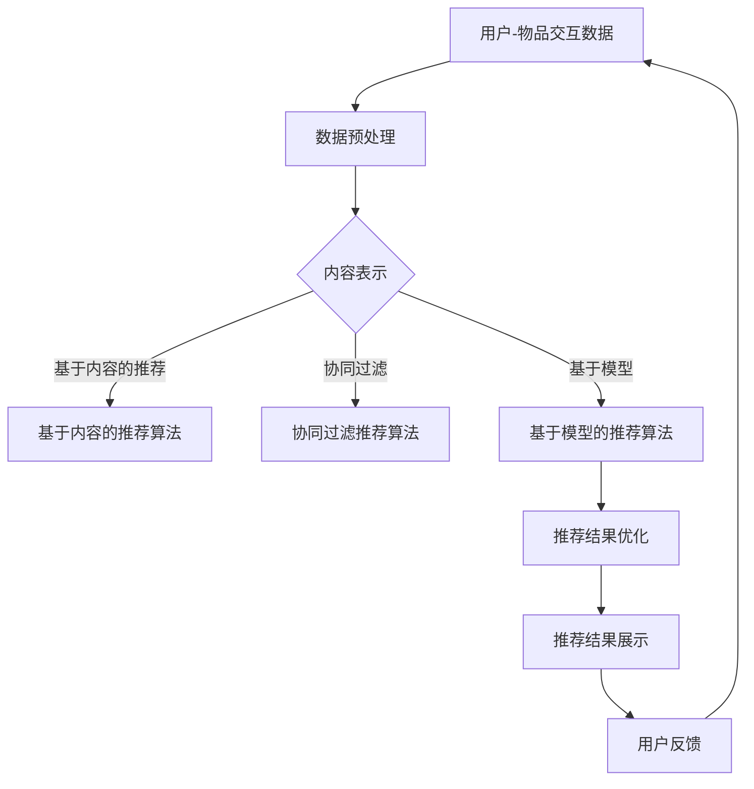

                 

# 社交网络推荐

## 关键词

- 社交网络
- 推荐系统
- 内容推荐
- 协同过滤
- 深度学习
- 个性化推荐
- 用户-物品交互

## 摘要

社交网络推荐系统是近年来发展迅速的一个研究领域，旨在利用社交网络中的用户-物品交互数据为用户推荐感兴趣的内容或物品。本文首先介绍了社交网络和推荐系统的基本概念，然后详细分析了基于内容的推荐算法、协同过滤推荐算法和基于模型的推荐算法，最后通过具体案例分析展示了推荐系统的优化策略和未来发展趋势。文章通过实际项目实战，详细讲解了社交网络推荐系统的开发过程和关键技术的应用。

## 目录大纲

### 《社交网络推荐》目录大纲

#### 第一部分：社交网络推荐概述

- **第1章：社交网络推荐基础**
  - 1.1 社交网络的定义与分类
  - 1.2 推荐系统的基本概念
  - 1.3 社交网络推荐系统的目标与挑战

#### 第二部分：社交网络推荐算法

- **第2章：基于内容的推荐算法**
  - 2.1 基于内容的推荐算法概述
  - 2.2 内容表示与相似性度量
  - 2.3 基于内容的推荐算法应用案例

- **第3章：协同过滤推荐算法**
  - 3.1 协同过滤推荐算法概述
  - 3.2 用户与物品相似性计算
  - 3.3 协同过滤推荐算法应用案例

- **第4章：基于模型的推荐算法**
  - 4.1 基于模型的推荐算法概述
  - 4.2 机器学习与深度学习在推荐系统中的应用
  - 4.3 基于模型的推荐算法应用案例

#### 第三部分：社交网络推荐系统的优化与评估

- **第5章：社交网络推荐系统的优化策略**
  - 5.1 推荐结果的个性化调整
  - 5.2 推荐系统的在线学习与实时更新
  - 5.3 推荐系统的评估指标与性能优化

- **第6章：社交网络推荐系统的案例分析**
  - 6.1 案例一：微博推荐系统
  - 6.2 案例二：Facebook 推荐系统

- **第7章：社交网络推荐系统的未来发展趋势**
  - 7.1 社交网络推荐系统的技术发展
  - 7.2 社交网络推荐系统的伦理与社会影响
  - 7.3 社交网络推荐系统的未来发展

#### 附录

- **附录A：社交网络推荐系统常用工具与资源**
- **附录B：社交网络推荐系统开源项目推荐**

### 社交网络推荐系统概述

#### 第1章：社交网络推荐基础

社交网络推荐系统是一种利用社交网络中的用户-用户关系和用户-物品交互数据为用户推荐感兴趣的内容或物品的系统。社交网络推荐系统不仅关注用户对物品的直接评分或偏好，还利用用户在社交网络中的交互行为，如点赞、评论、分享等，来丰富推荐算法的输入信息。

在本章中，我们将探讨社交网络和推荐系统的基本概念，了解社交网络推荐系统的目标与挑战，并介绍常见的社交网络推荐算法。

### 第1.1节：社交网络的定义与分类

#### 社交网络的基本概念

社交网络是指由用户及其相互关系构成的网络系统，用户通过发布内容、评论、点赞、分享等方式进行社交互动。社交网络的主要功能包括信息分享、社交连接和内容推荐。

#### 社交网络的主要类型

社交网络可以分为以下几类：

1. **基于关系的社交网络**：如 Facebook、LinkedIn，主要强调用户之间的关系网络。
2. **基于内容的社交网络**：如 Twitter、Instagram，主要强调用户发布和分享的内容。
3. **专业社交网络**：如 GitHub、Stack Overflow，主要针对特定领域的专业交流。
4. **兴趣社交网络**：如 Reddit、Douban，主要围绕特定兴趣或主题进行讨论。

#### 社交网络的发展历程

社交网络的发展可以分为以下几个阶段：

1. **初期阶段（1990s）**：以电子邮件和论坛为主要形式，如 Usenet。
2. **Web 2.0阶段（2000s）**：以 Facebook、Twitter、LinkedIn 等为代表，社交网络开始普及。
3. **移动社交阶段（2010s）**：以 Instagram、微信、WhatsApp 等为代表，社交网络逐渐向移动端转移。
4. **当前阶段**：社交网络与大数据、人工智能等技术相结合，不断拓展应用场景。

### 第1.2节：推荐系统的基本概念

#### 推荐系统的定义

推荐系统是一种基于数据挖掘和机器学习的系统，旨在为用户提供个性化的信息推荐服务。推荐系统通过分析用户的历史行为和偏好，预测用户可能感兴趣的内容或物品，从而提高用户的满意度。

#### 推荐系统的主要类型

推荐系统可以分为以下几类：

1. **基于内容的推荐**：根据用户对内容的偏好来推荐相似的内容。
2. **协同过滤推荐**：根据用户与物品的交互历史来推荐相似的物品。
3. **基于模型的推荐**：利用机器学习算法来预测用户对物品的偏好。
4. **混合推荐**：结合多种推荐策略，以提高推荐效果。

#### 推荐系统的发展历程

推荐系统的发展可以分为以下几个阶段：

1. **基于规则的推荐阶段**：通过手工编写规则来实现简单的推荐功能。
2. **基于统计模型的推荐阶段**：如基于协同过滤和贝叶斯模型的推荐系统。
3. **基于机器学习的推荐阶段**：如基于矩阵分解和深度学习的推荐系统。
4. **当前阶段**：推荐系统与大数据、社交网络、个性化搜索等技术相结合，不断优化推荐效果。

### 第1.3节：社交网络推荐系统的目标与挑战

#### 社交网络推荐系统的目标

社交网络推荐系统的目标主要包括：

1. **个性化推荐**：根据用户的历史行为和偏好，为用户推荐个性化内容或物品。
2. **提高用户满意度**：通过准确的推荐，提高用户对社交网络的满意度。
3. **增强社交互动**：利用推荐系统促进用户之间的互动和连接。

#### 社交网络推荐系统面临的挑战

社交网络推荐系统面临以下挑战：

1. **数据稀疏性**：社交网络中的用户-物品交互数据往往稀疏，需要采用有效的算法来处理。
2. **冷启动问题**：新用户或新物品缺乏足够的历史数据，需要设计有效的冷启动策略。
3. **实时性**：社交网络中的用户行为和偏好动态变化，需要推荐系统具有较好的实时性。
4. **推荐效果评估**：需要设计有效的评估指标来评估推荐系统的效果。
5. **数据隐私**：需要保护用户的数据隐私，避免泄露用户个人信息。

### 社交网络推荐系统的基本概念与架构

为了更好地理解社交网络推荐系统，我们可以将其分为以下几个主要组成部分：

1. **用户-物品交互数据**：包括用户的行为数据（如点赞、评论、分享等）和物品的属性数据（如分类、标签、内容等）。
2. **推荐算法**：根据用户-物品交互数据，计算用户对物品的偏好，并生成推荐结果。
3. **推荐引擎**：负责实现推荐算法，并对推荐结果进行排序和展示。
4. **用户界面**：为用户提供推荐结果的展示界面，并支持用户与推荐结果的互动。

#### 社交网络推荐系统的 Mermaid 流程图

通过上述 Mermaid 流程图，我们可以清晰地看到社交网络推荐系统的数据流程和主要组成部分。

### 社交网络推荐算法概述

社交网络推荐算法是社交网络推荐系统的核心组成部分，其目标是根据用户在社交网络中的行为和偏好，为用户推荐感兴趣的内容或物品。社交网络推荐算法可以分为基于内容的推荐算法、协同过滤推荐算法和基于模型的推荐算法。

在本节中，我们将详细介绍这三种常见的社交网络推荐算法。

#### 第2章：基于内容的推荐算法

基于内容的推荐算法（Content-based Recommendation Algorithm）是一种利用物品的内容特征为用户推荐相似物品的推荐算法。该算法的核心思想是，如果用户喜欢某个物品，那么用户可能也会喜欢具有相似内容的其他物品。

##### 2.1 基于内容的推荐算法概述

基于内容的推荐算法可以分为以下几个步骤：

1. **内容表示**：将物品的内容特征转换为向量表示。
2. **相似性度量**：计算用户和物品之间的相似度。
3. **推荐生成**：根据相似度得分生成推荐结果。

基于内容的推荐算法具有以下优点：

- **个性化**：能够根据用户的历史行为和偏好，推荐个性化的内容。
- **易于实现**：不需要大量的用户-物品交互数据，且算法实现相对简单。

然而，基于内容的推荐算法也存在一些缺点：

- **数据稀疏性**：社交网络中的用户-物品交互数据往往稀疏，导致算法效果受限。
- **冷启动问题**：对于新用户或新物品，由于缺乏足够的历史数据，算法难以进行准确推荐。

##### 2.2 内容表示与相似性度量

内容表示是将物品的内容特征转换为向量表示的过程。常见的表示方法包括：

1. **文本表示**：使用词袋模型（Bag of Words，BoW）、词嵌入（Word Embedding）等方法。
2. **图像表示**：使用卷积神经网络（Convolutional Neural Networks，CNN）提取图像特征。
3. **音频表示**：使用深度学习模型提取音频特征。

相似性度量是计算用户和物品之间相似度的过程。常见的相似性度量方法包括：

1. **余弦相似度**：计算两个向量之间的夹角余弦值。
2. **欧氏距离**：计算两个向量之间的欧氏距离。
3. **Jaccard相似度**：计算两个集合之间的交集与并集的比值。

#### 2.3 基于内容的推荐算法应用案例

基于内容的推荐算法在社交网络中有着广泛的应用。以下是一些基于内容的推荐算法的应用案例：

1. **社交网络信息推荐**：如微博、Twitter 的新闻推送，根据用户的历史关注和兴趣，推荐相关的新闻和话题。
2. **社交网络商品推荐**：如淘宝、京东的商品推荐，根据用户的历史购买和浏览记录，推荐相似的商品。
3. **社交网络音乐推荐**：如网易云音乐、QQ音乐的音乐推荐，根据用户的喜好和历史播放记录，推荐相似的歌曲。

#### 第3章：协同过滤推荐算法

协同过滤推荐算法（Collaborative Filtering Algorithm）是一种利用用户-物品交互数据为用户推荐相似物品的推荐算法。该算法的核心思想是，如果用户A喜欢物品A，而用户B也喜欢物品A，那么用户B可能也会喜欢用户A喜欢的其他物品。

##### 3.1 协同过滤推荐算法概述

协同过滤推荐算法可以分为以下两种类型：

1. **用户基于的协同过滤（User-based Collaborative Filtering）**：根据用户之间的相似度，为用户推荐相似用户的喜好。
2. **物品基于的协同过滤（Item-based Collaborative Filtering）**：根据物品之间的相似度，为用户推荐相似物品。

用户基于的协同过滤算法可以分为以下几个步骤：

1. **计算用户相似度**：计算用户之间的相似度，如余弦相似度、皮尔逊相关系数等。
2. **生成邻居列表**：根据相似度阈值，生成用户的邻居列表。
3. **推荐生成**：根据邻居列表，为用户推荐邻居喜欢的物品。

物品基于的协同过滤算法可以分为以下几个步骤：

1. **计算物品相似度**：计算物品之间的相似度，如余弦相似度、欧氏距离等。
2. **生成邻居列表**：根据相似度阈值，生成物品的邻居列表。
3. **推荐生成**：根据邻居列表，为用户推荐邻居喜欢的物品。

协同过滤推荐算法具有以下优点：

- **易于实现**：算法实现简单，对数据稀疏性问题有较好的适应性。
- **效果好**：在用户-物品交互数据丰富的场景下，协同过滤推荐算法能够取得较好的推荐效果。

然而，协同过滤推荐算法也存在一些缺点：

- **冷启动问题**：对于新用户或新物品，由于缺乏足够的历史数据，算法难以进行准确推荐。
- **数据隐私问题**：用户-物品交互数据涉及用户隐私，需要保护用户数据安全。

##### 3.2 用户与物品相似性计算

用户与物品相似性计算是协同过滤推荐算法的核心步骤。以下是常见的用户与物品相似性计算方法：

1. **用户相似度计算**：
   - **余弦相似度**：计算用户之间的夹角余弦值，公式如下：
     $$ 
     \text{Similarity}_{\text{cosine}}(u_i, u_j) = \frac{\text{dot product}(u_i, u_j)}{\|u_i\| \cdot \|u_j\|}
     $$
   - **皮尔逊相关系数**：计算用户之间的线性相关性，公式如下：
     $$
     \text{Similarity}_{\text{pearson}}(u_i, u_j) = \frac{\text{cov}(u_i, u_j)}{\sigma_i \cdot \sigma_j}
     $$

2. **物品相似度计算**：
   - **余弦相似度**：计算物品之间的夹角余弦值，公式如下：
     $$
     \text{Similarity}_{\text{cosine}}(i_k, i_l) = \frac{\text{dot product}(i_k, i_l)}{\|i_k\| \cdot \|i_l\|}
     $$
   - **欧氏距离**：计算物品之间的欧氏距离，公式如下：
     $$
     \text{Similarity}_{\text{euc}}(i_k, i_l) = \sqrt{\sum_{j=1}^{n} (i_{k,j} - i_{l,j})^2}
     $$

##### 3.3 协同过滤推荐算法应用案例

协同过滤推荐算法在社交网络中有着广泛的应用。以下是一些协同过滤推荐算法的应用案例：

1. **社交网络好友推荐**：如 Facebook 的好友推荐，根据用户的共同好友和相似兴趣，为用户推荐可能认识的好友。
2. **社交网络内容推荐**：如微博、知乎的内容推荐，根据用户的关注和点赞行为，为用户推荐相关的内容。
3. **社交网络商品推荐**：如淘宝、京东的商品推荐，根据用户的浏览和购买行为，为用户推荐相似的

