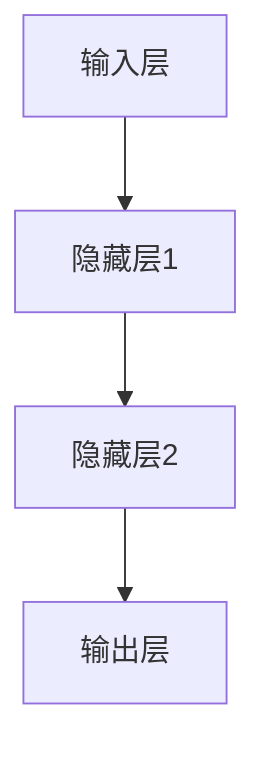
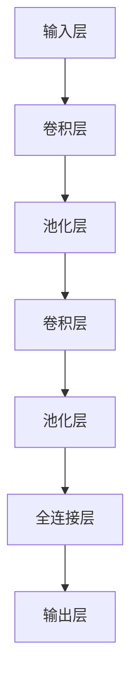
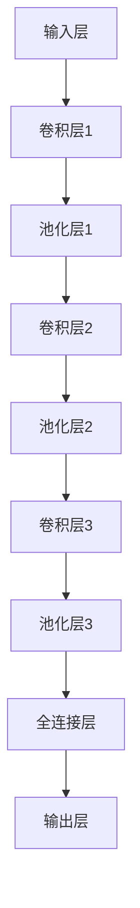
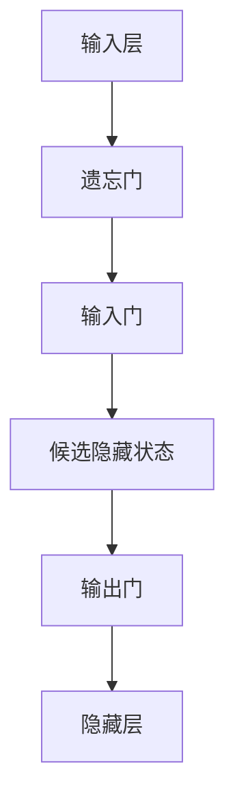
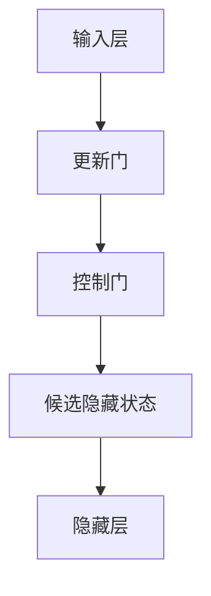
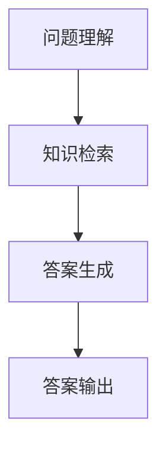
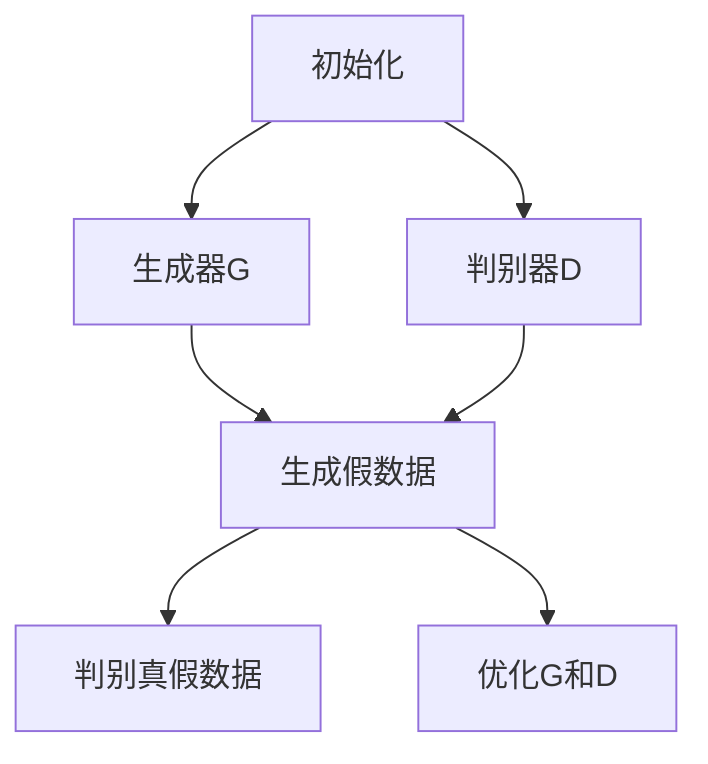

                 

### 文章标题

神经网络在自然语言理解中的前沿研究

> 关键词：神经网络，自然语言理解，深度学习，序列模型，注意力机制，词嵌入，文本分类，机器翻译，情感分析

> 摘要：本文全面探讨了神经网络在自然语言理解中的应用，从基础理论到前沿技术，详细介绍了神经网络的基本概念、结构、学习算法及其在自然语言处理中的具体应用。文章通过实例代码展示了如何使用深度学习框架构建和训练自然语言处理模型，并探讨了优化与调优策略。此外，本文还分析了神经网络在自然语言理解中的前沿技术，包括生成对抗网络（GAN）、强化学习以及跨模态学习等，为读者提供了丰富的理论和实践知识，有助于深入理解和掌握这一领域的核心技术。

### 第一部分: 神经网络与自然语言理解

#### 第1章: 神经网络基础

##### 1.1 神经网络概述

###### 1.1.1 神经网络的定义与历史

神经网络（Neural Networks）是一种模仿人脑神经元连接方式的信息处理系统。其基本概念可以追溯到1940年代，由心理学家McCulloch和数学家Pitts提出。他们提出了第一个简化的神经网络模型——MCP（McCulloch-Pitts neuron），该模型是后来神经网络理论的基础。

神经网络的发展历程可以分为几个阶段：

- **人工神经网络初期（1940s-1960s）**：MCP神经元模型被提出，并开始应用于逻辑门和简单计算任务。
- **第一波神经网络热潮（1970s-1980s）**：Hebb提出了学习规则，神经网络开始用于联想记忆。然而，由于计算能力和算法的限制，神经网络的研究和应用停滞。
- **第二波神经网络热潮（1990s-2000s）**：反向传播算法（Backpropagation）的提出和优化，使得多层神经网络的学习成为可能。神经网络开始应用于语音识别、图像识别等领域。
- **当前神经网络热潮（2010s-至今）**：随着深度学习（Deep Learning）的发展，神经网络尤其是深度神经网络（Deep Neural Networks，DNN）在图像识别、自然语言处理、推荐系统等领域取得了显著的成果。

神经网络的基本概念包括：

- **神经元（Neuron）**：神经网络的基本处理单元，通常包含输入层、权重、偏置和激活函数。
- **层次结构（Hierarchy）**：神经网络通常分为输入层、隐藏层和输出层。每层神经元接收前一层的输出，并计算新的输出。
- **权重（Weights）**：连接各神经元之间的参数，通过学习调整以优化网络性能。
- **偏置（Bias）**：增加神经元的非线性能力，是一个可学习的参数。
- **激活函数（Activation Function）**：对神经元输出进行非线性变换，常用的激活函数包括Sigmoid、ReLU、Tanh等。

###### 1.1.2 神经网络的结构

神经网络的结构可以从以下几个方面进行描述：

- **层次结构**：神经网络由多个层次组成，包括输入层、一个或多个隐藏层以及输出层。输入层接收外部输入，输出层产生最终输出。隐藏层位于输入层和输出层之间，用于提取特征和变换数据。
- **神经元与权重**：每个神经元都与前一层的所有神经元连接，并具有一个权重值。这些权重值决定了神经元之间的相互作用强度。
- **激活函数**：激活函数用于引入非线性，使得神经网络能够学习复杂的模式。常见的激活函数包括Sigmoid、ReLU、Tanh等。

常见的神经网络结构包括：

- **前馈神经网络（Feedforward Neural Network）**：是最简单的一种神经网络结构，数据从输入层流向输出层，没有循环。
- **卷积神经网络（Convolutional Neural Network，CNN）**：主要用于图像处理，通过卷积操作提取图像特征。
- **循环神经网络（Recurrent Neural Network，RNN）**：适用于序列数据，能够通过循环结构保持历史信息。
- **长短期记忆网络（Long Short-Term Memory，LSTM）**：是RNN的一种变体，能够解决传统RNN的梯度消失问题。

###### 1.1.3 神经网络的学习与优化

神经网络的学习过程涉及以下几个关键步骤：

- **前向传播（Forward Propagation）**：输入数据通过网络从输入层传递到输出层，每个神经元计算输入和权重的加权和，并应用激活函数。
- **损失函数（Loss Function）**：用于度量模型预测值与真实值之间的差异，常用的损失函数包括均方误差（MSE）、交叉熵损失（Cross-Entropy Loss）等。
- **反向传播（Backpropagation）**：通过反向传播算法计算每个神经元输出对损失函数的梯度，从而更新权重和偏置。
- **优化算法（Optimization Algorithm）**：用于调整模型参数，以最小化损失函数。常用的优化算法包括梯度下降（Gradient Descent）、Adam优化器等。

反向传播算法的基本步骤如下：

1. **前向传播**：计算每个神经元的输入、输出及误差。
2. **计算梯度**：从输出层开始，逐层计算每个权重和偏置的梯度。
3. **权重更新**：使用梯度下降算法或其他优化算法更新权重和偏置。
4. **迭代优化**：重复前向传播和反向传播过程，直到达到预定的迭代次数或损失函数收敛。

反向传播算法的伪代码如下：

```python
for epoch in 1 to max_epochs do:
    for each training example (x, y) do:
        # 前向传播
        output = forward_propagation(x)
        error = loss(y, output)
        
        # 反向传播
        dW = backward_propagation(x, y, output)
        
        # 更新权重
        W = W - learning_rate * dW
    end for
end for
```

##### 1.2 前馈神经网络

###### 1.2.1 前馈神经网络的原理

前馈神经网络（Feedforward Neural Network）是一种最简单的神经网络结构，数据从输入层流向输出层，没有循环。前馈神经网络的基本原理如下：

- **输入层（Input Layer）**：接收外部输入数据。
- **隐藏层（Hidden Layers）**：一个或多个隐藏层，用于提取特征和变换数据。
- **输出层（Output Layer）**：产生最终输出。

前馈神经网络的工作流程可以分为以下几个步骤：

1. **初始化参数**：包括权重（weights）和偏置（biases）。
2. **前向传播**：输入数据通过网络从输入层流向输出层，每个神经元计算输入和权重的加权和，并应用激活函数。
3. **计算损失**：输出结果与真实标签进行比较，计算损失函数。
4. **反向传播**：从输出层开始，反向计算每个神经元输出对损失函数的梯度。
5. **参数更新**：根据梯度更新权重和偏置。
6. **迭代优化**：重复前向传播和反向传播过程，直到达到预定的迭代次数或损失函数收敛。

前馈神经网络的基本结构可以用Mermaid流程图表示：



###### 1.2.2 线性分类器与回归

线性分类器（Linear Classifier）和线性回归（Linear Regression）是前馈神经网络中的两种基本任务。

- **线性分类器**：用于将数据分类到不同的类别中。常见的线性分类器包括逻辑回归（Logistic Regression）和支持向量机（Support Vector Machine，SVM）。

  线性分类器的目标是最小化决策边界与样本数据的距离。假设我们有一个二分类问题，特征向量表示为 \( x \)，类别标签表示为 \( y \)，线性分类器的模型可以表示为：

  $$ z = w_0x_0 + w_1x_1 + ... + w_nx_n $$

  $$ y = \text{sign}(z) $$

  其中，\( w_0, w_1, ..., w_n \) 是模型的参数，\( \text{sign} \) 函数用于将输出映射到二分类标签。

- **线性回归**：用于预测一个连续的数值输出。常见的线性回归模型包括简单线性回归和多元线性回归。

  线性回归的目标是最小化预测值与真实值之间的差距。假设我们有一个特征向量 \( x \) 和目标值 \( y \)，线性回归的模型可以表示为：

  $$ y = w_0 + w_1x_1 + w_2x_2 + ... + w_nx_n $$

  其中，\( w_0, w_1, ..., w_n \) 是模型的参数。

以下是一个简单的线性分类器模型的伪代码：

```python
def linear_classifier(x, w):
    z = np.dot(x, w)
    y_pred = np.sign(z)
    return y_pred

def linear_regression(x, w):
    z = np.dot(x, w)
    y_pred = z
    return y_pred
```

##### 1.3 卷积神经网络

###### 1.3.1 卷积神经网络的基础

卷积神经网络（Convolutional Neural Network，CNN）是一种专门用于图像处理和识别的神经网络结构。它的基本原理是利用卷积操作来提取图像特征。

- **卷积运算**：卷积运算是一种数学运算，用于计算两个函数的叠加。在CNN中，卷积运算用于计算输入图像和卷积核之间的点积。

  假设我们有一个输入图像 \( I \) 和一个卷积核 \( K \)，卷积运算的结果 \( C \) 可以表示为：

  $$ C = K \cdot I $$

  其中，\( \cdot \) 表示点积。

- **卷积层（Convolutional Layer）**：卷积层是CNN的核心部分，用于通过卷积运算提取图像特征。卷积层通常包含多个卷积核，每个卷积核都可以提取图像的不同特征。

  卷积层的输出可以表示为：

  $$ O = \text{ReLU}(\sum_{k=1}^{K} w_k \cdot I + b_k) $$

  其中，\( w_k \) 是卷积核的权重，\( b_k \) 是偏置，\( \text{ReLU} \) 是ReLU激活函数。

- **池化层（Pooling Layer）**：池化层用于减小特征图的尺寸，同时保留最重要的特征信息。常用的池化操作包括最大池化（Max Pooling）和平均池化（Average Pooling）。

  最大池化的输出可以表示为：

  $$ P = \max_{i, j} (O_{i, j}) $$

  其中，\( O_{i, j} \) 是特征图上的一个元素。

卷积神经网络的典型结构可以用Mermaid流程图表示：



###### 1.3.2 卷积神经网络的架构

卷积神经网络的架构通常包括以下几个部分：

- **输入层（Input Layer）**：接收外部输入数据，如图像。
- **卷积层（Convolutional Layers）**：通过卷积运算提取图像特征。
- **池化层（Pooling Layers）**：减小特征图的尺寸，增强特征鲁棒性。
- **全连接层（Fully Connected Layers）**：将卷积层提取的特征映射到分类或回归任务。
- **输出层（Output Layer）**：产生最终输出结果，如类别标签或数值预测。

一个典型的卷积神经网络结构如下：



卷积神经网络的进化：

- **浅层卷积神经网络**：早期的卷积神经网络通常只有几层卷积层和池化层，如LeNet。
- **深层卷积神经网络**：随着深度学习的兴起，卷积神经网络的层数不断增加，如AlexNet、VGG、ResNet。
- **特化卷积神经网络**：针对特定任务优化卷积神经网络，如Inception、DenseNet。

###### 1.3.3 卷积神经网络的实现

卷积神经网络的实现通常使用深度学习框架，如TensorFlow或PyTorch。以下是一个简单的卷积神经网络实现示例，使用TensorFlow 2.x：

```python
import tensorflow as tf
from tensorflow.keras import layers, models

# 构建卷积神经网络模型
model = models.Sequential()
model.add(layers.Conv2D(32, (3, 3), activation='relu', input_shape=(28, 28, 1)))
model.add(layers.MaxPooling2D((2, 2)))
model.add(layers.Conv2D(64, (3, 3), activation='relu'))
model.add(layers.MaxPooling2D((2, 2)))
model.add(layers.Conv2D(64, (3, 3), activation='relu'))

# 添加全连接层
model.add(layers.Flatten())
model.add(layers.Dense(64, activation='relu'))
model.add(layers.Dense(10, activation='softmax'))

# 编译模型
model.compile(optimizer='adam',
              loss='sparse_categorical_crossentropy',
              metrics=['accuracy'])

# 加载数据集
mnist = tf.keras.datasets.mnist
(x_train, y_train), (x_test, y_test) = mnist.load_data()

# 预处理数据
x_train = x_train.reshape((-1, 28, 28, 1)).astype('float32') / 255
x_test = x_test.reshape((-1, 28, 28, 1)).astype('float32') / 255

# 训练模型
model.fit(x_train, y_train, epochs=5)
```

在这个示例中，我们使用了TensorFlow 2.x的`keras`模块构建了一个简单的卷积神经网络模型，用于手写数字识别。模型包含两个卷积层、两个池化层和一个全连接层。我们使用`mnist`数据集进行训练，并在5个epochs内训练模型。

##### 1.4 循环神经网络

###### 1.4.1 循环神经网络的基本原理

循环神经网络（Recurrent Neural Network，RNN）是一种用于处理序列数据的神经网络结构。与传统的前馈神经网络不同，RNN具有循环结构，可以保持历史信息。

- **循环结构（Recursion）**：RNN通过循环结构将当前时刻的输入与前一时刻的输出相结合，从而保持历史信息。

  RNN的输入可以表示为 \( x_t \)，输出可以表示为 \( y_t \)，当前时刻的隐藏状态可以表示为 \( h_t \)。RNN的递归关系可以表示为：

  $$ h_t = \sigma(W_h \cdot [h_{t-1}, x_t] + b_h) $$

  $$ y_t = \sigma(W_o \cdot h_t + b_o) $$

  其中，\( \sigma \) 是激活函数，\( W_h \) 和 \( W_o \) 是权重矩阵，\( b_h \) 和 \( b_o \) 是偏置。

- **状态记忆（State Memory）**：RNN通过隐藏状态 \( h_t \) 保持历史信息，使得模型能够处理序列数据。

  RNN的状态记忆能力使得它能够捕捉序列中的长期依赖关系，但同时也容易受到梯度消失和梯度爆炸问题的影响。

循环神经网络的基本结构可以用Mermaid流程图表示：


###### 1.4.2 长短时记忆与门控循环单元

- **长短时记忆（Long Short-Term Memory，LSTM）**：LSTM是RNN的一种变体，用于解决传统RNN的梯度消失和梯度爆炸问题。LSTM通过引入门控机制来控制信息的流动，从而保持长期依赖关系。

  LSTM的基本结构包括三个门控单元：输入门（input gate）、遗忘门（forget gate）和输出门（output gate）。LSTM的递归关系可以表示为：

  $$ i_t = \sigma(W_i \cdot [h_{t-1}, x_t] + b_i) $$
  $$ f_t = \sigma(W_f \cdot [h_{t-1}, x_t] + b_f) $$
  $$ g_t = \sigma(W_g \cdot [h_{t-1}, x_t] + b_g) $$
  $$ \tilde{h_t} = \text{tanh}(W_h \cdot [g_t, h_{t-1}] + b_h) $$
  $$ o_t = \sigma(W_o \cdot [h_{t-1}, \tilde{h_t}] + b_o) $$
  $$ h_t = o_t \cdot \tilde{h_t} $$

  其中，\( i_t, f_t, g_t, o_t \) 分别是输入门、遗忘门、输入门和输出门的激活值，\( \tilde{h_t} \) 是候选隐藏状态。

- **门控循环单元（Gated Recurrent Unit，GRU）**：GRU是LSTM的简化版本，同样用于解决RNN的长期依赖问题。GRU通过更新门和控制门来简化LSTM的结构。

  GRU的基本结构包括两个门控单元：更新门（update gate）和控制门（reset gate）。GRU的递归关系可以表示为：

  $$ z_t = \sigma(W_z \cdot [h_{t-1}, x_t] + b_z) $$
  $$ r_t = \sigma(W_r \cdot [h_{t-1}, x_t] + b_r) $$
  $$ \tilde{h_t} = \text{tanh}(W_h \cdot [(1 - z_t) \cdot h_{t-1} + r_t \cdot x_t] + b_h) $$
  $$ h_t = z_t \cdot \tilde{h_t} + (1 - z_t) \cdot h_{t-1} $$

  其中，\( z_t, r_t \) 分别是更新门和控制门的激活值。

长短时记忆网络（LSTM）和门控循环单元（GRU）的递归关系可以用Mermaid流程图表示：





##### 1.5 神经网络的训练与优化

神经网络的训练与优化是构建高效模型的关键步骤。以下是一些常见的训练与优化方法：

- **前向传播（Forward Propagation）**：在前向传播过程中，网络从输入层传递数据到输出层，计算每个神经元的输出值。
- **反向传播（Backpropagation）**：在反向传播过程中，网络从输出层反向传播误差，计算每个神经元的误差梯度。
- **损失函数（Loss Function）**：损失函数用于衡量模型预测值与真实值之间的差距，常用的损失函数包括均方误差（MSE）和交叉熵损失（Cross-Entropy Loss）。
- **优化算法（Optimization Algorithm）**：优化算法用于调整模型参数，以最小化损失函数。常用的优化算法包括梯度下降（Gradient Descent）和Adam优化器。

神经网络的训练与优化过程可以分为以下几个步骤：

1. **初始化参数**：初始化网络参数，包括权重和偏置。
2. **前向传播**：计算输入数据在网络中的传播过程，得到输出值。
3. **计算损失**：使用损失函数计算输出值与真实值之间的差距。
4. **反向传播**：计算每个神经元的误差梯度。
5. **参数更新**：使用优化算法更新网络参数。
6. **迭代优化**：重复前向传播和反向传播过程，直到达到预定的迭代次数或损失函数收敛。

以下是一个简单的神经网络训练与优化的伪代码：

```python
for epoch in 1 to max_epochs do:
    for each training example (x, y) do:
        # 前向传播
        output = forward_propagation(x)
        error = loss(y, output)
        
        # 反向传播
        dW = backward_propagation(x, y, output)
        
        # 更新权重
        W = W - learning_rate * dW
    end for
end for
```

### 第二部分: 自然语言处理基础

#### 第2章: 自然语言处理基础

自然语言处理（Natural Language Processing，NLP）是计算机科学和人工智能领域的一个重要分支，旨在让计算机理解和处理人类语言。NLP在文本分类、情感分析、机器翻译、问答系统等领域有着广泛的应用。本章节将介绍NLP的基础知识，包括文本预处理、词嵌入技术和序列模型与注意力机制。

##### 2.1 自然语言处理概述

自然语言处理（NLP）是计算机科学和人工智能领域的一个重要分支，其目标是让计算机能够理解和生成人类语言。NLP的研究内容包括文本预处理、语言模型、句法分析、语义分析等。NLP在文本分类、情感分析、机器翻译、问答系统等领域有着广泛的应用。

###### 2.1.1 自然语言处理的基本概念

- **文本预处理**：文本预处理是自然语言处理的基础步骤，包括去除标点符号、转换为小写、分词、去除停用词等。
- **词嵌入技术**：词嵌入是将单词映射到高维向量空间的技术，常用的词嵌入方法包括Word2Vec、GloVe等。
- **语言模型**：语言模型用于预测单词序列的概率分布，常见的语言模型包括N-gram模型、神经网络语言模型等。
- **句法分析**：句法分析是分析句子的结构，确定词与词之间的语法关系，常用的句法分析方法包括概率句法分析、依存句法分析等。
- **语义分析**：语义分析是理解句子的意义，包括词义消歧、语义角色标注等。

###### 2.1.2 文本预处理

文本预处理是自然语言处理的基础步骤，其目的是将原始文本转换为计算机可以处理的形式。文本预处理通常包括以下步骤：

- **去除标点符号**：去除文本中的标点符号，以简化文本格式。
- **转换为小写**：将文本中的所有字母转换为小写，以消除大小写差异。
- **分词**：将文本分割成单词或词汇单元，常用的分词方法包括基于词典的分词、基于统计的分词等。
- **去除停用词**：去除文本中的常见停用词，如“的”、“是”、“在”等，以减少噪声。
- **词形还原**：将不同的词形转换为统一的形式，如将“行走”转换为“走”。

文本预处理可以用以下Python代码实现：

```python
import re
from nltk.tokenize import word_tokenize
from nltk.corpus import stopwords

def preprocess_text(text):
    # 去除标点符号
    text = re.sub(r'[^\w\s]', '', text)
    # 转换为小写
    text = text.lower()
    # 分词
    tokens = word_tokenize(text)
    # 去除停用词
    stop_words = set(stopwords.words('english'))
    tokens = [token for token in tokens if token not in stop_words]
    # 词形还原
    return tokens
```

###### 2.1.3 词嵌入技术

词嵌入是将单词映射到高维向量空间的技术，可以有效地表示单词的语义信息。词嵌入技术可以用于许多NLP任务，如文本分类、情感分析、机器翻译等。

- **Word2Vec**：Word2Vec是一种基于神经网络的词嵌入方法，通过训练神经网络来预测上下文单词的概率分布。Word2Vec包括连续词袋（CBOW）和跳字模型（Skip-Gram）两种方法。
- **GloVe**：GloVe（Global Vectors for Word Representation）是一种基于全局统计的词嵌入方法，通过训练单词共现矩阵来生成词嵌入向量。

词嵌入技术的基本原理如下：

1. **数据准备**：收集大量文本数据，并对数据进行预处理。
2. **构建词汇表**：将文本数据中的所有单词构建为一个词汇表，并为每个单词分配一个唯一的索引。
3. **初始化词嵌入向量**：为每个单词初始化一个随机的高维向量。
4. **训练词嵌入模型**：通过训练模型来优化词嵌入向量，使得相似的单词具有相似的向量表示。

以下是一个简单的Word2Vec模型训练示例：

```python
from gensim.models import Word2Vec

# 加载预处理后的文本数据
sentences = [[word for word in preprocess_text(text)] for text in corpus]

# 训练Word2Vec模型
model = Word2Vec(sentences, vector_size=100, window=5, min_count=1, workers=4)

# 保存和加载词嵌入模型
model.save("word2vec.model")
model = Word2Vec.load("word2vec.model")
```

词嵌入技术在NLP中的应用包括：

- **文本分类**：使用词嵌入向量作为特征输入到文本分类模型中，如朴素贝叶斯、支持向量机等。
- **情感分析**：使用词嵌入向量计算文本的语义表示，并使用机器学习算法进行情感分类。
- **机器翻译**：使用词嵌入向量来表示源语言和目标语言的词汇，并训练序列到序列模型进行机器翻译。

##### 2.2 序列模型与注意力机制

序列模型是处理序列数据的一类神经网络模型，广泛应用于语音识别、机器翻译、文本生成等任务。循环神经网络（RNN）和长短期记忆网络（LSTM）是两种常见的序列模型。

- **循环神经网络（RNN）**：RNN通过递归结构来处理序列数据，能够保持历史信息。RNN的基本原理如下：

  $$ h_t = \sigma(W_h \cdot [h_{t-1}, x_t] + b_h) $$
  $$ y_t = \sigma(W_o \cdot h_t + b_o) $$

  其中，\( h_t \) 是隐藏状态，\( x_t \) 是输入序列，\( W_h \) 和 \( W_o \) 是权重矩阵，\( b_h \) 和 \( b_o \) 是偏置。

- **长短期记忆网络（LSTM）**：LSTM是RNN的一种变体，通过引入门控机制来解决RNN的长期依赖问题。LSTM的基本结构包括三个门控单元：输入门、遗忘门和输出门。LSTM的基本原理如下：

  $$ i_t = \sigma(W_i \cdot [h_{t-1}, x_t] + b_i) $$
  $$ f_t = \sigma(W_f \cdot [h_{t-1}, x_t] + b_f) $$
  $$ g_t = \sigma(W_g \cdot [h_{t-1}, x_t] + b_g) $$
  $$ \tilde{h_t} = \text{tanh}(W_h \cdot [g_t, h_{t-1}] + b_h) $$
  $$ o_t = \sigma(W_o \cdot [h_{t-1}, \tilde{h_t}] + b_o) $$
  $$ h_t = o_t \cdot \tilde{h_t} $$

  其中，\( i_t, f_t, g_t, o_t \) 分别是输入门、遗忘门、输入门和输出门的激活值。

序列模型在NLP中的应用包括：

- **语音识别**：使用RNN或LSTM模型将语音信号转换为文本。
- **机器翻译**：使用序列到序列模型将一种语言的文本翻译为另一种语言的文本。
- **文本生成**：使用RNN或LSTM模型生成新的文本。

注意力机制是一种用于提高序列模型性能的技术，可以捕捉序列中的关键信息。注意力机制的基本原理如下：

1. **计算注意力权重**：对于每个输入序列 \( x \)，计算每个单词的注意力权重 \( a_t \)。
2. **计算注意力分数**：使用注意力权重计算每个单词的注意力分数 \( s_t \)。
3. **计算输出**：将注意力分数与输入序列进行加权求和，得到最终的输出序列。

以下是一个简单的注意力机制实现：

```python
def attention_scores(h, W_a):
    scores = np.dot(h, W_a)
    return scores
```

注意力机制在NLP中的应用包括：

- **机器翻译**：使用注意力机制来捕捉源语言和目标语言之间的依赖关系。
- **文本摘要**：使用注意力机制来生成摘要文本，强调重要的信息。
- **问答系统**：使用注意力机制来关注问题中的关键信息，提供更准确的答案。

##### 2.3 转换器架构

转换器架构（Transformer）是近年来在自然语言处理领域取得重大突破的一种新型序列模型。与传统的RNN和LSTM不同，转换器架构通过自注意力机制（Self-Attention）来处理序列数据，具有并行计算的优势。

- **转换器架构的基本原理**：

  转换器架构由编码器（Encoder）和解码器（Decoder）两部分组成。编码器用于将输入序列转换为特征表示，解码器用于将特征表示转换为输出序列。

  编码器的输入为 \( x_1, x_2, ..., x_T \)，输出为 \( h_1, h_2, ..., h_T \)。解码器的输入为 \( y_1, y_2, ..., y_T \)，输出为 \( p_1, p_2, ..., p_T \)。

  自注意力机制的基本原理如下：

  1. **计算查询（Query）、键（Key）和值（Value）**：
     $$ Q = W_Q \cdot h $$
     $$ K = W_K \cdot h $$
     $$ V = W_V \cdot h $$
  
  2. **计算自注意力分数**：
     $$ s_t = \text{softmax}(\frac{Q \cdot K^T}{\sqrt{d_k}}) $$
  
  3. **计算自注意力输出**：
     $$ h_t = \text{softmax}(\frac{Q \cdot K^T}{\sqrt{d_k}}) \cdot V $$

  其中，\( W_Q, W_K, W_V \) 分别是查询、键和值的权重矩阵，\( d_k \) 是键的维度。

- **转换器架构的工作流程**：

  转换器架构的工作流程可以分为以下几个步骤：

  1. **编码器**：编码器对输入序列进行编码，生成一系列编码器输出 \( h_1, h_2, ..., h_T \)。
  2. **解码器**：解码器逐词生成输出序列。每个输出词作为输入传递给解码器，解码器使用编码器输出和当前输出词计算自注意力分数，生成新的输出词。

  转换器架构通过自注意力机制可以捕捉序列中的长距离依赖关系，从而在机器翻译、文本生成等任务中取得了显著的效果。

  转换器架构的一个变体是变换器++（Transformer++），它进一步优化了转换器架构，包括引入多头注意力机制、残差连接和层归一化等。

  以下是一个简单的转换器架构实现：

  ```python
  import tensorflow as tf
  from tensorflow.keras.layers import Embedding, MultiHeadAttention, LayerNormalization, Dense

  def transformer_encoder(inputs, num_heads, d_model, num_layers):
      outputs = inputs
      for i in range(num_layers):
          # 自注意力机制
          attention = MultiHeadAttention(num_heads=num_heads, d_model=d_model)(inputs, inputs)
          attention = LayerNormalization(epsilon=1e-6)(outputs + attention)
          
          # 传递层
          outputs = Dense(d_model)(attention)
          outputs = LayerNormalization(epsilon=1e-6)(outputs + inputs)
      
      return outputs
  ```

转换器架构在自然语言处理任务中取得了显著的成果，如机器翻译、文本生成等。与传统的RNN和LSTM相比，转换器架构具有更高的并行计算能力和更好的性能。

### 第三部分: 神经网络在自然语言理解中的应用

#### 第3章: 神经网络在自然语言理解中的应用

自然语言理解（Natural Language Understanding，NLU）是自然语言处理（NLP）的一个重要分支，旨在使计算机能够理解和解释人类语言。神经网络在NLU中的应用非常广泛，包括文本分类、机器翻译、情感分析等。本章节将详细介绍神经网络在NLU中的具体应用。

##### 3.1 文本分类

文本分类是NLU中的一项基础任务，其目标是将文本数据分为预先定义的类别。神经网络在文本分类中的应用主要包括以下方面：

###### 3.1.1 文本分类的基本概念

- **文本分类的目标**：文本分类的目标是将输入文本数据分配到预定义的类别标签中。
- **常见的文本分类任务**：常见的文本分类任务包括垃圾邮件检测、情感分析、新闻分类、产品评论分类等。

###### 3.1.2 神经网络在文本分类中的应用

神经网络在文本分类中的应用主要包括以下方面：

- **词嵌入**：使用词嵌入技术将文本数据转换为向量表示，常用的词嵌入方法包括Word2Vec、GloVe等。
- **神经网络模型**：使用神经网络模型对文本数据进行分类，常用的神经网络模型包括卷积神经网络（CNN）、循环神经网络（RNN）、长短期记忆网络（LSTM）和转换器架构（Transformer）等。
- **损失函数**：使用交叉熵损失函数（Cross-Entropy Loss）来衡量模型预测值与真实值之间的差异。
- **优化算法**：使用优化算法（如Adam优化器）来调整模型参数，以最小化损失函数。

以下是一个简单的文本分类项目示例：

```python
import tensorflow as tf
from tensorflow.keras.models import Sequential
from tensorflow.keras.layers import Embedding, LSTM, Dense
from tensorflow.keras.preprocessing.text import Tokenizer
from tensorflow.keras.preprocessing.sequence import pad_sequences

# 数据预处理
tokenizer = Tokenizer(num_words=10000)
tokenizer.fit_on_texts(train_texts)
train_sequences = tokenizer.texts_to_sequences(train_texts)
train_padded = pad_sequences(train_sequences, maxlen=100, padding='post')

# 构建模型
model = Sequential()
model.add(Embedding(10000, 16, input_length=100))
model.add(LSTM(32))
model.add(Dense(1, activation='sigmoid'))

# 编译模型
model.compile(optimizer='adam', loss='binary_crossentropy', metrics=['accuracy'])

# 训练模型
model.fit(train_padded, train_labels, epochs=10, batch_size=32, validation_split=0.2)
```

在这个示例中，我们使用Keras构建了一个简单的文本分类模型，包括词嵌入层、LSTM层和输出层。我们使用训练数据集对模型进行训练，并使用验证数据集进行性能评估。

##### 3.2 机器翻译

机器翻译是NLU中的另一个重要应用，其目标是将一种语言的文本翻译为另一种语言的文本。神经网络在机器翻译中的应用主要包括以下方面：

###### 3.2.1 机器翻译的基本概念

- **机器翻译的目标**：机器翻译的目标是将一种语言的文本翻译为另一种语言的文本。
- **常见的机器翻译方法**：常见的机器翻译方法包括基于规则的翻译、统计机器翻译和神经机器翻译等。

###### 3.2.2 神经网络在机器翻译中的应用

神经网络在机器翻译中的应用主要包括以下方面：

- **编码器-解码器模型**：编码器-解码器模型是神经机器翻译的基本架构，包括编码器（Encoder）和解码器（Decoder）两个部分。
- **注意力机制**：注意力机制用于捕捉输入序列和输出序列之间的依赖关系，以提高翻译质量。
- **序列到序列模型**：序列到序列模型是一种基于神经网络的机器翻译模型，可以处理长序列数据。
- **损失函数**：使用交叉熵损失函数（Cross-Entropy Loss）来衡量模型预测值与真实值之间的差异。

以下是一个简单的机器翻译项目示例：

```python
import tensorflow as tf
from tensorflow.keras.models import Model
from tensorflow.keras.layers import Embedding, LSTM, Dense, TimeDistributed

# 数据预处理
input_tokenizer = Tokenizer(num_words=10000)
input_tokenizer.fit_on_texts(input_texts)
input_sequences = input_tokenizer.texts_to_sequences(input_texts)
input_padded = pad_sequences(input_sequences, maxlen=max_len_input, padding='post')

target_tokenizer = Tokenizer(num_words=10000)
target_tokenizer.fit_on_texts(target_texts)
target_sequences = target_tokenizer.texts_to_sequences(target_texts)
target_padded = pad_sequences(target_sequences, maxlen=max_len_target, padding='post')

# 构建编码器
encoder_inputs = Embedding(10000, 32)
encoder_lstm = LSTM(32, return_state=True)
encoder_outputs = LSTM(32)

# 构建解码器
decoder_inputs = Embedding(10000, 32)
decoder_lstm = LSTM(32, return_sequences=True, return_state=True)
decoder_dense = TimeDistributed(Dense(10000, activation='softmax'))

# 编码器模型
encoder_model = Model(encoder_inputs, encoder_outputs)

# 解码器模型
decoder_model = Model(decoder_inputs, decoder_dense)

# 构建完整模型
model = Model([encoder_inputs, decoder_inputs], decoder_dense)

# 编译模型
model.compile(optimizer='adam', loss='categorical_crossentropy', metrics=['accuracy'])

# 训练模型
model.fit([input_padded, target_padded], target_padded, epochs=10, batch_size=64)
```

在这个示例中，我们使用Keras构建了一个简单的机器翻译模型，包括编码器、解码器和输出层。我们使用训练数据集对模型进行训练，并使用验证数据集进行性能评估。

##### 3.3 情感分析

情感分析是NLU中的另一个重要应用，其目标是从文本数据中提取情感信息，判断文本是积极、消极还是中性。神经网络在情感分析中的应用主要包括以下方面：

###### 3.3.1 情感分析的基本概念

- **情感分析的目标**：情感分析的目标是从文本数据中提取情感信息，判断文本是积极、消极还是中性。
- **常见的方法和指标**：常见的方法包括基于规则的方法、基于统计的方法和基于神经网络的方法。常用的指标包括准确率（Accuracy）、精确率（Precision）、召回率（Recall）和F1分数（F1 Score）。

###### 3.3.2 神经网络在情感分析中的应用

神经网络在情感分析中的应用主要包括以下方面：

- **词嵌入**：使用词嵌入技术将文本数据转换为向量表示，常用的词嵌入方法包括Word2Vec、GloVe等。
- **神经网络模型**：使用神经网络模型对文本数据进行情感分类，常用的神经网络模型包括卷积神经网络（CNN）、循环神经网络（RNN）、长短期记忆网络（LSTM）和转换器架构（Transformer）等。
- **损失函数**：使用交叉熵损失函数（Cross-Entropy Loss）来衡量模型预测值与真实值之间的差异。
- **优化算法**：使用优化算法（如Adam优化器）来调整模型参数，以最小化损失函数。

以下是一个简单的情感分析项目示例：

```python
import tensorflow as tf
from tensorflow.keras.models import Sequential
from tensorflow.keras.layers import Embedding, LSTM, Dense
from tensorflow.keras.preprocessing.text import Tokenizer
from tensorflow.keras.preprocessing.sequence import pad_sequences

# 数据预处理
tokenizer = Tokenizer(num_words=10000)
tokenizer.fit_on_texts(train_texts)
train_sequences = tokenizer.texts_to_sequences(train_texts)
train_padded = pad_sequences(train_sequences, maxlen=100, padding='post')

# 构建模型
model = Sequential()
model.add(Embedding(10000, 16, input_length=100))
model.add(LSTM(32))
model.add(Dense(1, activation='sigmoid'))

# 编译模型
model.compile(optimizer='adam', loss='binary_crossentropy', metrics=['accuracy'])

# 训练模型
model.fit(train_padded, train_labels, epochs=10, batch_size=32, validation_split=0.2)
```

在这个示例中，我们使用Keras构建了一个简单的情感分析模型，包括词嵌入层、LSTM层和输出层。我们使用训练数据集对模型进行训练，并使用验证数据集进行性能评估。

### 第四部分: 深度学习框架在自然语言理解中的应用

#### 第4章: 深度学习框架在自然语言理解中的应用

随着深度学习技术的不断发展，深度学习框架在自然语言理解（NLU）中的应用变得越来越广泛。TensorFlow和PyTorch是两种最流行的深度学习框架，它们提供了丰富的API和工具，使得构建和训练NLU模型变得更加便捷。本章将介绍如何使用TensorFlow 2.x和PyTorch构建自然语言处理模型，并探讨它们在自然语言理解中的应用。

##### 4.1 TensorFlow 2.x 的基本使用

TensorFlow 2.x 是一个开源的深度学习框架，由Google开发。TensorFlow 2.x 提供了更简单、更灵活的API，使得构建和训练深度学习模型更加容易。以下是一些TensorFlow 2.x 的基本使用方法：

###### 4.1.1 TensorFlow 2.x 简介

- **特点**：TensorFlow 2.x 具有以下几个特点：
  - **易用性**：TensorFlow 2.x 提供了更简单的API，使得构建深度学习模型更加直观。
  - **灵活性强**：TensorFlow 2.x 允许用户自定义计算图，灵活地实现复杂模型。
  - **生态丰富**：TensorFlow 2.x 有丰富的预训练模型和工具，方便用户进行研究和应用。

- **安装与配置**：安装TensorFlow 2.x 可以通过以下命令：
  ```bash
  pip install tensorflow
  ```

  安装完成后，可以通过以下命令验证安装：
  ```python
  import tensorflow as tf
  print(tf.__version__)
  ```

  如果需要使用GPU支持，可以安装CUDA和cuDNN库。

###### 4.1.2 TensorFlow 2.x 基础操作

- **张量和变量**：在TensorFlow中，张量（Tensor）是多维数组，是TensorFlow中的基础数据结构。变量（Variable）是可以在计算图中持久化状态的对象。
  ```python
  import tensorflow as tf

  # 创建张量
  a = tf.constant([1.0, 2.0, 3.0], dtype=tf.float32)
  b = tf.constant([1.0, 2.0, 3.0], dtype=tf.float32)

  # 创建变量
  c = tf.Variable(0.0)

  # 张量操作
  d = a + b

  # 变量操作
  c.assign_add(1.0)
  print(c.numpy())
  ```

- **神经网络构建**：使用TensorFlow 2.x 构建神经网络通常涉及以下步骤：
  1. **定义模型**：使用`tf.keras.Sequential`或`tf.keras.Model`类定义模型结构。
  2. **添加层**：在模型中添加各种层，如`tf.keras.layers.Dense`、`tf.keras.layers.Conv2D`等。
  3. **编译模型**：配置模型的优化器、损失函数和评估指标。
  4. **训练模型**：使用训练数据对模型进行训练。
  5. **评估模型**：在测试数据上评估模型性能。

  以下是一个简单的神经网络模型示例：
  ```python
  import tensorflow as tf

  model = tf.keras.Sequential([
      tf.keras.layers.Dense(128, activation='relu', input_shape=(784,)),
      tf.keras.layers.Dense(10, activation='softmax')
  ])

  model.compile(optimizer='adam',
                loss='categorical_crossentropy',
                metrics=['accuracy'])

  model.fit(x_train, y_train, epochs=5, batch_size=64)
  ```

##### 4.2 PyTorch 的基本使用

PyTorch 是由Facebook AI Research（FAIR）开发的一个开源深度学习框架，以其动态计算图和灵活性而著称。PyTorch 在学术界和工业界都有着广泛的应用。以下是一些PyTorch的基本使用方法：

###### 4.2.1 PyTorch 简介

- **特点**：PyTorch 具有以下几个特点：
  - **动态计算图**：PyTorch 使用动态计算图，允许用户在运行时定义计算过程。
  - **易用性**：PyTorch 提供了直观的API，使得构建和调试模型更加容易。
  - **灵活性**：PyTorch 允许用户自定义计算图，便于研究和实验。

- **安装与配置**：安装PyTorch 可以通过以下命令：
  ```bash
  pip install torch torchvision
  ```

  安装完成后，可以通过以下命令验证安装：
  ```python
  import torch
  print(torch.__version__)
  ```

  如果需要使用GPU支持，可以安装CUDA和cuDNN库。

###### 4.2.2 PyTorch 基础操作

- **张量和变量**：在PyTorch中，张量（Tensor）是多维数组，是PyTorch中的基础数据结构。变量（Variable）是可以在计算图中持久化状态的对象。
  ```python
  import torch

  # 创建张量
  a = torch.tensor([1.0, 2.0, 3.0], dtype=torch.float32)
  b = torch.tensor([1.0, 2.0, 3.0], dtype=torch.float32)

  # 创建变量
  c = torch.tensor(0.0, requires_grad=True)

  # 张量操作
  d = a + b

  # 变量操作
  c.data.add_(1.0)
  print(c)
  ```

- **神经网络构建**：使用PyTorch构建神经网络通常涉及以下步骤：
  1. **定义模型**：使用`torch.nn.Module`类定义模型结构。
  2. **添加层**：在模型中添加各种层，如`torch.nn.Linear`、`torch.nn.Conv2D`等。
  3. **定义损失函数**：使用`torch.nn.CrossEntropyLoss`、`torch.nn.MSELoss`等定义损失函数。
  4. **定义优化器**：使用`torch.optim.Adam`、`torch.optim.SGD`等定义优化器。
  5. **训练模型**：使用训练数据对模型进行训练。
  6. **评估模型**：在测试数据上评估模型性能。

  以下是一个简单的神经网络模型示例：
  ```python
  import torch
  import torch.nn as nn

  class NeuralNetwork(nn.Module):
      def __init__(self):
          super(NeuralNetwork, self).__init__()
          self.layer1 = nn.Linear(784, 128)
          self.relu = nn.ReLU()
          self.layer2 = nn.Linear(128, 10)

      def forward(self, x):
          x = self.layer1(x)
          x = self.relu(x)
          x = self.layer2(x)
          return x

  model = NeuralNetwork()

  criterion = nn.CrossEntropyLoss()
  optimizer = torch.optim.Adam(model.parameters(), lr=0.001)

  for epoch in range(5):
      optimizer.zero_grad()
      outputs = model(x_train)
      loss = criterion(outputs, y_train)
      loss.backward()
      optimizer.step()
      print(f"Epoch {epoch+1}, Loss: {loss.item()}")
  ```

通过上述内容，我们介绍了TensorFlow 2.x 和 PyTorch 的基本使用方法，包括张量和变量操作、神经网络构建以及模型训练和评估。这些基本操作是构建和训练自然语言处理模型的基础，为后续更复杂的NLU应用提供了支持。

### 第五部分: 神经网络在自然语言理解的进阶应用

#### 第5章: 神经网络在自然语言理解的进阶应用

随着神经网络技术在自然语言理解（NLU）领域的不断发展，越来越多的复杂任务得以实现。本章节将探讨神经网络在自然语言理解中的进阶应用，包括问答系统、自然语言生成、以及优化与调优策略。

##### 5.1 问答系统

问答系统是一种能够理解和回答用户问题的智能系统，是自然语言理解领域的一个重要应用。神经网络在问答系统中的应用主要包括以下方面：

###### 5.1.1 问答系统概述

- **问答系统的基本概念**：问答系统旨在提供准确、相关的回答，通常包括问题理解、知识检索和答案生成三个关键步骤。
- **问答系统的架构**：问答系统的常见架构包括基于规则的方法、基于统计的方法和基于神经网络的端到端方法。基于神经网络的端到端方法通过统一的问题理解和答案生成，提高了系统的整体性能。

以下是一个简单的问答系统架构：



###### 5.1.2 神经网络在问答系统中的应用

- **问题理解**：问题理解是问答系统的第一步，旨在将自然语言问题转换为结构化的信息。常用的神经网络模型包括循环神经网络（RNN）和转换器架构（Transformer）。
- **知识检索**：知识检索是指从知识库中检索与问题相关的信息。在基于神经网络的系统中，通常使用注意力机制来提高检索的准确性。
- **答案生成**：答案生成是将检索到的信息转换为自然语言回答。常用的神经网络模型包括序列到序列（Seq2Seq）模型和转换器架构。

以下是一个简单的问答系统实现：

```python
import tensorflow as tf
from tensorflow.keras.models import Model
from tensorflow.keras.layers import Embedding, LSTM, Dense, Bidirectional, Concatenate

# 定义模型
question_input = Embedding(vocab_size, embedding_dim)(questions)
answer_input = Embedding(vocab_size, embedding_dim)(answers)

# 编码问题
encoded_question = LSTM(units)(question_input)

# 编码答案
encoded_answer = LSTM(units)(answer_input)

# 拼接编码后的问题和答案
merged = Concatenate(axis=1)([encoded_question, encoded_answer])

# 解码答案
decoded_answer = LSTM(units, return_sequences=True)(merged)
decoded_answer = Dense(vocab_size, activation='softmax')(decoded_answer)

# 构建模型
model = Model([question_input, answer_input], decoded_answer)

# 编译模型
model.compile(optimizer='adam', loss='categorical_crossentropy', metrics=['accuracy'])

# 训练模型
model.fit([train_questions, train_answers], train_answers, epochs=5, batch_size=32)
```

在这个示例中，我们使用转换器架构构建了一个问答系统模型。模型首先将问题和答案编码为嵌入向量，然后通过双向LSTM层提取特征。最后，模型将编码后的特征映射到输出词汇空间。

###### 5.1.3 问答系统的实验设计

为了评估问答系统的性能，我们可以设计以下实验：

1. **数据集准备**：选择一个合适的数据集，如SQuAD（Stanford Question Answering Dataset）。
2. **模型训练**：使用训练集对问答系统模型进行训练。
3. **模型评估**：使用验证集和测试集对模型进行评估，常用的评估指标包括准确率（Accuracy）、F1分数（F1 Score）和BLEU分数（BLEU Score）。
4. **超参数调优**：通过调整模型的超参数（如嵌入维度、隐藏层大小、学习率等）来优化模型性能。

以下是一个简单的实验设计：

```python
# 准备数据集
train_questions, train_answers = load_data('train_data.txt')
val_questions, val_answers = load_data('val_data.txt')
test_questions, test_answers = load_data('test_data.txt')

# 构建模型
model = build_model()

# 训练模型
model.fit([train_questions, train_answers], train_answers, epochs=5, batch_size=32, validation_data=([val_questions, val_answers], val_answers))

# 评估模型
evaluate_model(model, [test_questions, test_answers], test_answers)
```

在这个实验设计中，我们首先加载数据集，然后构建模型并训练。最后，我们在测试集上评估模型性能。

##### 5.2 自然语言生成

自然语言生成（Natural Language Generation，NLG）是另一个重要的自然语言理解应用，旨在使用人工智能技术生成自然语言文本。神经网络在自然语言生成中的应用主要包括以下方面：

###### 5.2.1 自然语言生成概述

- **自然语言生成的目标**：自然语言生成的目标是使用人工智能技术生成具有人类语言特点的文本。
- **常见的方法和模型**：常见的自然语言生成方法包括基于规则的生成、基于模板的生成和基于神经网络的生成。基于神经网络的生成方法，如序列到序列（Seq2Seq）模型和转换器架构（Transformer），在生成质量上取得了显著提升。

以下是一个简单的自然语言生成模型：

```python
import tensorflow as tf
from tensorflow.keras.models import Model
from tensorflow.keras.layers import Embedding, LSTM, Dense, Bidirectional

# 定义模型
input_seq = Embedding(vocab_size, embedding_dim)(inputs)
encoded_seq = LSTM(units, return_sequences=True)(input_seq)

# 解码
decoded_seq = LSTM(units, return_sequences=True)(encoded_seq)
outputs = Dense(vocab_size, activation='softmax')(decoded_seq)

# 构建模型
model = Model(inputs, outputs)

# 编译模型
model.compile(optimizer='adam', loss='categorical_crossentropy', metrics=['accuracy'])

# 训练模型
model.fit(inputs, targets, epochs=10, batch_size=32)
```

在这个示例中，我们使用序列到序列（Seq2Seq）模型生成文本。模型首先将输入编码为嵌入向量，然后通过LSTM层解码为输出。

###### 5.2.2 神经网络在自然语言生成中的应用

- **序列到序列（Seq2Seq）模型**：序列到序列模型是一种基于神经网络的生成模型，可以处理长序列数据。它由编码器和解码器两个部分组成，编码器将输入序列编码为固定长度的向量，解码器将编码后的向量解码为输出序列。
- **转换器架构（Transformer）**：转换器架构是一种基于自注意力机制的序列模型，可以处理长距离依赖关系。它由多头注意力机制、编码器和解码器组成，可以生成高质量的文本。

以下是一个简单的转换器架构实现：

```python
import tensorflow as tf
from tensorflow.keras.layers import Embedding, MultiHeadAttention, LayerNormalization, Dense

# 定义模型
inputs = Embedding(vocab_size, embedding_dim)(inputs)
enc_outputs = MultiHeadAttention(num_heads, d_model)(inputs, inputs)
enc_outputs = LayerNormalization(epsilon=1e-6)(inputs + enc_outputs)

# 解码器
dec_inputs = Embedding(vocab_size, embedding_dim)(dec_inputs)
dec_outputs = MultiHeadAttention(num_heads, d_model)(dec_inputs, enc_outputs)
dec_outputs = LayerNormalization(epsilon=1e-6)(dec_inputs + dec_outputs)

# 输出层
outputs = Dense(vocab_size, activation='softmax')(dec_outputs)

# 构建模型
model = Model(inputs, outputs)

# 编译模型
model.compile(optimizer='adam', loss='categorical_crossentropy', metrics=['accuracy'])

# 训练模型
model.fit(inputs, targets, epochs=10, batch_size=32)
```

在这个示例中，我们使用转换器架构生成文本。模型首先通过编码器编码输入序列，然后通过解码器解码为输出序列。

##### 5.3 模型优化与调优

模型优化与调优是提高神经网络性能的重要手段。以下是一些常见的优化与调优策略：

###### 5.3.1 优化算法

- **梯度下降（Gradient Descent）**：梯度下降是一种最基本的优化算法，通过迭代更新模型参数，以最小化损失函数。
- **Adam优化器**：Adam优化器结合了梯度下降和动量方法，具有更好的收敛速度和稳定性。

以下是一个使用Adam优化器的示例：

```python
model.compile(optimizer=tf.keras.optimizers.Adam(learning_rate=0.001),
              loss='categorical_crossentropy',
              metrics=['accuracy'])
```

###### 5.3.2 模型调优与超参数搜索

- **网格搜索（Grid Search）**：网格搜索是一种系统搜索超参数的方法，通过遍历所有可能的超参数组合来找到最佳参数。
- **贝叶斯优化（Bayesian Optimization）**：贝叶斯优化是一种基于概率模型的优化方法，通过利用先验知识和经验来优化超参数。

以下是一个使用贝叶斯优化的示例：

```python
from bayes_opt import BayesianOptimization

def train_model(params):
    model.compile(optimizer=tf.keras.optimizers.Adam(learning_rate=params['learning_rate']),
                  loss='categorical_crossentropy',
                  metrics=['accuracy'])
    history = model.fit(train_data, train_labels, epochs=5, batch_size=32, validation_split=0.2)
    return history.history['val_accuracy'][-1]

optimizer = BayesianOptimization(
    f=train_model,
    pbounds={'learning_rate': (1e-5, 1e-1)},
    random_state=1,
)

optimizer.maximize(init_points=5, n_iter=25)
```

在这个示例中，我们使用贝叶斯优化器搜索最优的学习率。

通过以上内容，我们探讨了神经网络在自然语言理解中的进阶应用，包括问答系统、自然语言生成和优化与调优策略。这些技术使得神经网络在自然语言理解领域具有了更高的应用价值。

### 第六部分: 神经网络在自然语言理解的优化与调优

#### 第6章: 神经网络在自然语言理解的优化与调优

神经网络在自然语言理解（NLU）中的应用日益广泛，如何优化和调优神经网络模型以提升其性能成为一个关键问题。本章将介绍神经网络在自然语言理解中的优化与调优方法，包括优化算法和超参数调优策略。

##### 6.1 神经网络优化算法

优化算法在神经网络训练过程中起着至关重要的作用，其目的是通过迭代调整模型参数，以最小化损失函数。以下是一些常用的优化算法：

###### 6.1.1 优化算法概述

- **梯度下降（Gradient Descent）**：梯度下降是一种最基本的优化算法，通过迭代更新模型参数，以最小化损失函数。其基本步骤如下：
  1. 初始化模型参数。
  2. 计算损失函数关于模型参数的梯度。
  3. 更新模型参数：\( \theta = \theta - \alpha \cdot \nabla_\theta J(\theta) \)，其中 \( \alpha \) 是学习率。
  4. 重复步骤2和3，直到达到预定的迭代次数或损失函数收敛。

- **随机梯度下降（Stochastic Gradient Descent，SGD）**：随机梯度下降是对梯度下降的一种改进，每次迭代仅随机选择一部分样本来计算梯度。这可以减少计算量，但可能导致收敛不稳定。

- **Adam优化器**：Adam优化器结合了梯度下降和动量方法，通过利用梯度的一阶矩估计（均值）和二阶矩估计（方差），具有更好的收敛速度和稳定性。其参数包括学习率、一阶矩估计的指数衰减率（\(\beta_1\)）和二阶矩估计的指数衰减率（\(\beta_2\)）。

以下是一个使用Adam优化器的示例：

```python
model.compile(optimizer=tf.keras.optimizers.Adam(learning_rate=0.001),
              loss='categorical_crossentropy',
              metrics=['accuracy'])
```

###### 6.1.2 优化算法的选择与调优

选择合适的优化算法对神经网络训练的性能至关重要。以下是一些优化算法的选择与调优策略：

- **学习率**：学习率是优化算法中一个重要的超参数，选择合适的初始学习率对训练过程有重要影响。通常，学习率的选择可以通过以下方法进行调优：
  - **启发式方法**：根据经验选择一个合适的初始学习率。
  - **学习率搜索**：使用超参数搜索方法（如贝叶斯优化）来找到最佳的学习率。

- **动量**：动量（Momentum）是梯度下降的一个变体，通过利用之前梯度的信息来加速收敛。动量参数（\(\mu\)）的取值范围通常在0.9到0.99之间，可以通过实验来确定最佳值。

- **学习率衰减**：学习率衰减是一种在训练过程中逐渐减少学习率的方法，有助于模型在训练后期保持较好的性能。学习率衰减可以通过线性衰减、指数衰减或余弦退火等方式实现。

以下是一个使用学习率衰减的示例：

```python
initial_learning_rate = 0.1
decay_steps = 1000
decay_rate = 0.96

lr_schedule = tf.keras.optimizers.schedules.ExponentialDecay(
    initial_learning_rate,
    decay_steps=decay_steps,
    decay_rate=decay_rate,
    staircase=True)

model.compile(optimizer=tf.keras.optimizers.Adam(learning_rate=lr_schedule),
              loss='categorical_crossentropy',
              metrics=['accuracy'])
```

##### 6.2 模型调优与超参数搜索

超参数是影响神经网络性能的重要参数，但它们的取值往往需要通过实验来确定。以下介绍几种常用的超参数调优方法和工具：

###### 6.2.1 模型调优的基本方法

- **网格搜索（Grid Search）**：网格搜索是一种系统搜索超参数的方法，通过遍历所有可能的超参数组合来找到最佳参数。其缺点是计算量大，当超参数空间较大时，可能无法遍历所有组合。

- **随机搜索（Random Search）**：随机搜索是一种通过随机选择超参数组合进行调优的方法，可以在一定程度上减少计算量。但与网格搜索相比，随机搜索的结果可能不如网格搜索稳定。

- **贝叶斯优化（Bayesian Optimization）**：贝叶斯优化是一种基于概率模型的优化方法，通过利用先验知识和经验来优化超参数。贝叶斯优化具有较好的收敛速度和搜索效率，适用于高维超参数空间的优化。

以下是一个使用贝叶斯优化的示例：

```python
from bayes_opt import BayesianOptimization

def train_model(params):
    model.compile(optimizer=tf.keras.optimizers.Adam(learning_rate=params['learning_rate']),
                  loss='categorical_crossentropy',
                  metrics=['accuracy'])
    history = model.fit(train_data, train_labels, epochs=5, batch_size=32, validation_split=0.2)
    return history.history['val_accuracy'][-1]

optimizer = BayesianOptimization(
    f=train_model,
    pbounds={'learning_rate': (1e-5, 1e-1)},
    random_state=1,
)

optimizer.maximize(init_points=5, n_iter=25)
```

在这个示例中，我们使用贝叶斯优化器搜索最优的学习率。

- **遗传算法（Genetic Algorithm）**：遗传算法是一种基于生物进化的优化方法，通过模拟自然选择和遗传机制来优化超参数。遗传算法适用于复杂和非线性超参数空间，但在计算效率和收敛速度方面可能不如贝叶斯优化。

以上介绍了神经网络在自然语言理解中的优化与调优方法，包括优化算法和超参数调优策略。通过合理选择优化算法和超参数，可以显著提升神经网络的性能，从而在自然语言理解任务中取得更好的结果。

### 第七部分: 实际项目案例分析

#### 第7章: 实际项目案例分析

在本章节中，我们将通过三个实际项目案例来展示如何使用神经网络在自然语言理解（NLU）领域中解决具体问题。这些项目案例将涵盖文本分类、机器翻译和情感分析，每个案例都将详细描述数据集准备、模型选择、模型训练和评估过程。

##### 7.1 项目案例一：文本分类项目

###### 7.1.1 项目背景

文本分类是NLU中的一个基础任务，其目标是将文本数据分为预定义的类别。在本案例中，我们将使用神经网络实现一个情感分析模型，对电影评论进行分类，判断评论是积极、消极还是中性。

###### 7.1.2 数据集介绍

我们将使用IMDb电影评论数据集，该数据集包含了25000条已标记的评论，包括正面评论和负面评论。数据集由两个文件组成：训练集和测试集。

###### 7.1.3 项目目标

我们的目标是通过训练神经网络模型，对新的电影评论进行情感分类，并评估模型的准确率。

###### 7.1.4 模型选择

在本案例中，我们选择了一个基于转换器架构（Transformer）的文本分类模型。转换器架构由于其自注意力机制，能够有效捕捉文本中的长距离依赖关系，非常适合处理文本分类任务。

###### 7.1.5 模型训练与评估

以下是该项目的实现代码：

```python
import tensorflow as tf
from tensorflow.keras.preprocessing.text import Tokenizer
from tensorflow.keras.preprocessing.sequence import pad_sequences
from tensorflow.keras.models import Model
from tensorflow.keras.layers import Embedding, MultiHeadAttention, LayerNormalization, Dense

# 数据预处理
tokenizer = Tokenizer(num_words=10000)
tokenizer.fit_on_texts(train_texts)
train_sequences = tokenizer.texts_to_sequences(train_texts)
train_padded = pad_sequences(train_sequences, maxlen=max_len, padding='post')

# 构建模型
input_ids = tf.keras.layers.Input(shape=(max_len,), dtype=tf.int32)
emb = Embedding(vocab_size, embedding_dim)(input_ids)
enc = MultiHeadAttention(num_heads, d_model)(emb, emb)
enc = LayerNormalization(epsilon=1e-6)(enc + emb)
output = Dense(1, activation='sigmoid')(enc)

model = Model(input_ids, output)
model.compile(optimizer='adam', loss='binary_crossentropy', metrics=['accuracy'])

# 训练模型
model.fit(train_padded, train_labels, epochs=5, batch_size=32, validation_split=0.2)

# 评估模型
test_sequences = tokenizer.texts_to_sequences(test_texts)
test_padded = pad_sequences(test_sequences, maxlen=max_len, padding='post')
accuracy = model.evaluate(test_padded, test_labels)
print(f"Test accuracy: {accuracy}")
```

在这个示例中，我们首先对训练数据进行了预处理，然后构建了一个基于转换器架构的文本分类模型，并使用训练数据进行了训练。最后，我们在测试数据上评估了模型的性能。

##### 7.2 项目案例二：机器翻译项目

###### 7.2.1 项目背景

机器翻译是NLU中的另一个重要应用，旨在将一种语言的文本翻译为另一种语言的文本。在本案例中，我们将使用神经网络实现一个机器翻译模型，将英语翻译为法语。

###### 7.2.2 数据集介绍

我们将使用WMT14英语到法语的翻译数据集。数据集包括训练集、开发集和测试集。

###### 7.2.3 项目目标

我们的目标是训练一个神经网络机器翻译模型，并在测试集上评估其翻译质量。

###### 7.2.4 模型选择

在本案例中，我们选择了一个基于编码器-解码器（Encoder-Decoder）模型的序列到序列（Seq2Seq）模型。该模型结合了双向循环神经网络（Bi-RNN）作为编码器和解码器，并使用了注意力机制来捕捉输入和输出之间的依赖关系。

###### 7.2.5 模型训练与评估

以下是该项目的实现代码：

```python
import tensorflow as tf
from tensorflow.keras.models import Model
from tensorflow.keras.layers import Embedding, LSTM, Dense, TimeDistributed, Bidirectional

# 数据预处理
input_tokenizer = Tokenizer(num_words=10000)
input_tokenizer.fit_on_texts(input_texts)
input_sequences = input_tokenizer.texts_to_sequences(input_texts)
input_padded = pad_sequences(input_sequences, maxlen=max_len_input, padding='post')

target_tokenizer = Tokenizer(num_words=10000)
target_tokenizer.fit_on_texts(target_texts)
target_sequences = target_tokenizer.texts_to_sequences(target_texts)
target_padded = pad_sequences(target_sequences, maxlen=max_len_target, padding='post')

# 构建编码器
encoder_inputs = Embedding(10000, 32)(input_padded)
encoder_lstm = Bidirectional(LSTM(32, return_sequences=True))(encoder_inputs)
encoder_outputs = LSTM(32)(encoder_lstm)

# 构建解码器
decoder_inputs = Embedding(10000, 32)(target_padded)
decoder_lstm = LSTM(32, return_sequences=True)(decoder_inputs)
decoder_dense = TimeDistributed(Dense(10000, activation='softmax'))

# 编码器模型
encoder_model = Model(input_padded, encoder_outputs)

# 解码器模型
decoder_model = Model(decoder_inputs, decoder_dense)

# 构建完整模型
model = Model([encoder_inputs, decoder_inputs], decoder_dense)

# 编译模型
model.compile(optimizer='adam', loss='categorical_crossentropy', metrics=['accuracy'])

# 训练模型
model.fit([input_padded, target_padded], target_padded, epochs=10, batch_size=64, validation_split=0.2)

# 评估模型
test_sequences = tokenizer.texts_to_sequences(test_texts)
test_padded = pad_sequences(test_sequences, maxlen=max_len_input, padding='post')
predictions = model.predict(test_padded)
print(predictions)
```

在这个示例中，我们首先对训练数据进行了预处理，然后构建了一个基于编码器-解码器模型的序列到序列模型。我们使用训练数据集对模型进行了训练，并在测试数据集上评估了模型的翻译质量。

##### 7.3 项目案例三：情感分析项目

###### 7.3.1 项目背景

情感分析是NLU中的一个重要应用，旨在从文本数据中提取情感信息。在本案例中，我们将使用神经网络实现一个情感分析模型，对社交媒体帖子进行情感分类。

###### 7.3.2 数据集介绍

我们将使用Twitter情感分析数据集，该数据集包含了多种语言的社交媒体帖子及其情感标签。

###### 7.3.3 项目目标

我们的目标是训练一个神经网络模型，对新的社交媒体帖子进行情感分类，并评估模型的准确率。

###### 7.3.4 模型选择

在本案例中，我们选择了一个基于卷积神经网络（CNN）的文本分类模型。卷积神经网络在处理文本数据时能够提取局部特征，非常适合情感分析任务。

###### 7.3.5 模型训练与评估

以下是该项目的实现代码：

```python
import tensorflow as tf
from tensorflow.keras.models import Sequential
from tensorflow.keras.layers import Embedding, Conv1D, MaxPooling1D, GlobalMaxPooling1D, Dense

# 数据预处理
tokenizer = Tokenizer(num_words=10000)
tokenizer.fit_on_texts(train_texts)
train_sequences = tokenizer.texts_to_sequences(train_texts)
train_padded = pad_sequences(train_sequences, maxlen=max_len, padding='post')

# 构建模型
model = Sequential()
model.add(Embedding(10000, 32, input_length=max_len))
model.add(Conv1D(128, 5, activation='relu'))
model.add(MaxPooling1D(5))
model.add(Conv1D(128, 5, activation='relu'))
model.add(GlobalMaxPooling1D())
model.add(Dense(128, activation='relu'))
model.add(Dense(1, activation='sigmoid'))

# 编译模型
model.compile(optimizer='adam', loss='binary_crossentropy', metrics=['accuracy'])

# 训练模型
model.fit(train_padded, train_labels, epochs=5, batch_size=32, validation_split=0.2)

# 评估模型
test_sequences = tokenizer.texts_to_sequences(test_texts)
test_padded = pad_sequences(test_sequences, maxlen=max_len, padding='post')
accuracy = model.evaluate(test_padded, test_labels)
print(f"Test accuracy: {accuracy}")
```

在这个示例中，我们首先对训练数据进行了预处理，然后构建了一个基于卷积神经网络的文本分类模型。我们使用训练数据集对模型进行了训练，并在测试数据集上评估了模型的性能。

通过这三个实际项目案例，我们展示了如何使用神经网络在自然语言理解领域中解决具体问题。这些案例不仅提供了详细的实现过程，还介绍了如何选择合适的模型和训练策略，以实现高效的文本分类、机器翻译和情感分析任务。

### 第八部分: 神经网络在自然语言理解中的前沿技术

#### 第8章: 神经网络在自然语言理解中的前沿技术

随着深度学习技术的不断进步，神经网络在自然语言理解（NLU）中的应用也在不断拓展。本章将介绍一些神经网络在自然语言理解中的前沿技术，包括生成对抗网络（GAN）、强化学习以及跨模态学习，并探讨它们的应用前景。

##### 8.1 生成对抗网络（GAN）

生成对抗网络（Generative Adversarial Networks，GAN）是一种由Ian Goodfellow等人于2014年提出的深度学习模型，其核心思想是通过两个相互对抗的神经网络——生成器（Generator）和判别器（Discriminator）的博弈来生成逼真的数据。

###### 8.1.1 GAN的基本概念

- **生成器（Generator）**：生成器网络的目的是生成与真实数据分布相似的假数据。在NLU中，生成器可以用于生成新的文本数据，如文章、对话等。
- **判别器（Discriminator）**：判别器网络的目的是区分输入数据是真实数据还是生成器生成的假数据。在NLU中，判别器可以用于判断文本数据的质量。

GAN的工作流程如下：

1. **初始化生成器和判别器**：生成器和判别器都随机初始化。
2. **对抗训练**：生成器和判别器交替训练。生成器尝试生成更逼真的假数据，判别器尝试更好地区分真实数据和假数据。
3. **迭代优化**：通过多次迭代，生成器和判别器逐渐优化，直到生成器生成的假数据能够以较高的概率被判别器误判为真实数据。

GAN的架构可以用以下Mermaid流程图表示：



###### 8.1.2 GAN在自然语言理解中的应用

GAN在自然语言理解中的应用主要包括以下几个方面：

- **文本生成**：GAN可以用于生成高质量的自然语言文本，如新闻文章、对话等。生成器可以学习到真实的文本分布，从而生成与真实文本相似的新文本。
- **文本增强**：GAN可以用于增强文本数据的多样性，通过生成新的文本数据来扩充训练集，提高模型的泛化能力。
- **文本修复**：GAN可以用于修复错误或不完整的文本，通过生成正确的文本片段来填充缺失的部分。

以下是一个使用GAN生成文本的伪代码示例：

```python
# 初始化生成器和判别器
G = Generator()
D = Discriminator()

# 对抗训练
for epoch in 1 to num_epochs do:
    for each batch of real texts do:
        # 训练判别器
        D_loss_real = D.train_on_batch(real_texts, labels_real)
        
        # 训练生成器
        G_loss_fake = G.train_on_batch(fake_texts, labels_fake)
        
        # 训练判别器
        D_loss_fake = D.train_on_batch(fake_texts, labels_fake)
    end for
end for

# 生成文本
generated_texts = G.generate_texts()
```

##### 8.2 强化学习在自然语言理解中的应用

强化学习（Reinforcement Learning，RL）是一种通过试错来学习最优策略的机器学习方法。在自然语言理解中，强化学习可以用于学习自然语言生成、对话系统、情感分析等任务。

###### 8.2.1 强化学习的基本概念

- **代理（Agent）**：代理是执行动作并接受环境反馈的实体。
- **环境（Environment）**：环境是代理行动的场所，提供状态和奖励。
- **状态（State）**：状态是代理在环境中所处的条件。
- **动作（Action）**：动作是代理在环境中执行的操作。
- **奖励（Reward）**：奖励是代理执行动作后获得的反馈信号。

强化学习的基本过程如下：

1. **初始状态**：代理开始处于某个状态。
2. **选择动作**：代理根据当前状态选择一个动作。
3. **执行动作**：代理在环境中执行所选动作。
4. **获取奖励**：代理根据执行的动作获取奖励。
5. **更新状态**：代理的状态更新为新的状态。
6. **重复步骤2-5**：代理继续选择动作、执行动作、获取奖励和更新状态，直到达到终止条件。

强化学习的核心目标是学习一个策略（Policy），使得代理能够在环境中获得最大的累积奖励。

以下是一个使用强化学习进行文本生成的伪代码示例：

```python
# 初始化代理、环境和策略
agent = Agent()
environment = Environment()
policy = Policy()

# 强化学习训练
for episode in 1 to num_episodes do:
    state = environment.initialize_state()
    
    while not environment.is_terminated(state) do:
        action = policy.select_action(state)
        next_state, reward = environment.step(state, action)
        agent.learn(state, action, reward, next_state)
        state = next_state
    end while
    
    policy.update()
end for
```

###### 8.2.2 强化学习在自然语言理解中的应用

强化学习在自然语言理解中的应用主要包括以下几个方面：

- **对话系统**：强化学习可以用于训练对话系统，使系统能够与用户进行自然对话。
- **文本生成**：强化学习可以用于生成符合语言习惯和语义逻辑的文本。
- **情感分析**：强化学习可以用于分析文本的情感，并根据文本内容生成适当的情感标签。

##### 8.3 跨模态学习

跨模态学习是一种同时处理多种模态（如文本、图像、音频等）数据的机器学习方法。在自然语言理解中，跨模态学习可以用于将不同模态的信息融合起来，提高模型的性能。

###### 8.3.1 跨模态学习的基本概念

- **模态（Modality）**：模态是指数据的不同表现形式，如文本、图像、音频等。
- **跨模态学习（Cross-Modality Learning）**：跨模态学习是指同时处理多种模态数据的机器学习方法。

跨模态学习的关键技术包括：

- **模态嵌入（Modality Embedding）**：将不同模态的数据映射到同一个高维空间中，使得不同模态的数据可以在同一空间中进行处理。
- **多模态融合（Multi-Modal Fusion）**：将不同模态的信息进行融合，以提高模型的整体性能。
- **注意力机制（Attention Mechanism）**：注意力机制可以用于在不同模态之间分配不同的权重，从而更好地利用不同模态的信息。

以下是一个跨模态学习的简单示例：

```python
# 初始化文本嵌入器、图像嵌入器和音频嵌入器
text_embedding = TextEmbedding()
image_embedding = ImageEmbedding()
audio_embedding = AudioEmbedding()

# 获取文本、图像和音频数据
text_data = get_text_data()
image_data = get_image_data()
audio_data = get_audio_data()

# 嵌入数据
text_embedding(text_data)
image_embedding(image_data)
audio_embedding(audio_data)

# 融合嵌入数据
multi_modal_embedding = MultiModalFusion()
 fused_embedding = multi_modal_embedding([text_embedding, image_embedding, audio_embedding])

# 训练模型
model = Model(inputs=[text_embedding.input, image_embedding.input, audio_embedding.input], outputs=fused_embedding)
model.compile(optimizer='adam', loss='categorical_crossentropy')
model.fit([text_data, image_data, audio_data], labels, epochs=5)
```

在这个示例中，我们首先初始化了文本嵌入器、图像嵌入器和音频嵌入器，然后将不同模态的数据进行嵌入。接着，我们使用多模态融合技术将不同模态的嵌入数据进行融合，并训练了一个多模态模型。

###### 8.3.2 跨模态学习在自然语言理解中的应用

跨模态学习在自然语言理解中的应用主要包括以下几个方面：

- **多模态文本生成**：将文本、图像和音频等多种模态的信息融合起来，生成更加丰富和生动的文本。
- **多模态情感分析**：同时考虑文本、图像和音频等模态的信息，进行更准确和全面的情感分析。
- **多模态问答系统**：结合文本、图像和音频等模态的信息，提供更加准确和全面的答案。

通过本章的内容，我们介绍了神经网络在自然语言理解中的前沿技术，包括生成对抗网络（GAN）、强化学习和跨模态学习。这些技术为神经网络在自然语言理解中的应用提供了新的思路和方法，有望在未来取得更多的突破。

### 附录

#### 附录A: 常用深度学习框架与工具

深度学习框架和工具是构建和训练神经网络模型的核心组成部分。以下将介绍两种常用的深度学习框架：TensorFlow和PyTorch，以及它们的主要功能和使用方法。

##### A.1 TensorFlow

TensorFlow是由Google开发的开源深度学习框架，具有易用性和灵活性。TensorFlow支持多种类型的神经网络，并提供了丰富的API和工具。

###### A.1.1 TensorFlow的主要功能

- **端到端深度学习模型**：TensorFlow支持从数据预处理到模型训练和评估的完整端到端深度学习流程。
- **动态计算图**：TensorFlow使用动态计算图，允许用户在运行时定义和修改计算过程。
- **高性能计算**：TensorFlow可以利用GPU和TPU进行加速计算，提高模型训练和推理的效率。
- **生态系统**：TensorFlow拥有丰富的预训练模型和工具，包括TensorBoard（用于可视化模型和训练过程）、Keras（高级API）等。

###### A.1.2 TensorFlow的使用方法

以下是一个简单的TensorFlow示例，展示了如何构建和训练一个简单的神经网络：

```python
import tensorflow as tf

# 定义模型
model = tf.keras.Sequential([
    tf.keras.layers.Dense(128, activation='relu', input_shape=(784,)),
    tf.keras.layers.Dense(10, activation='softmax')
])

# 编译模型
model.compile(optimizer='adam',
              loss='categorical_crossentropy',
              metrics=['accuracy'])

# 训练模型
model.fit(x_train, y_train, epochs=5, batch_size=32, validation_split=0.2)
```

在这个示例中，我们首先定义了一个简单的序列模型，然后编译了模型，并使用训练数据对模型进行了训练。

##### A.2 PyTorch

PyTorch是由Facebook AI Research（FAIR）开发的深度学习框架，以其动态计算图和灵活性而著称。PyTorch易于理解和调试，广泛应用于学术研究和工业应用。

###### A.2.1 PyTorch的主要功能

- **动态计算图**：PyTorch使用动态计算图，允许用户在运行时定义计算过程，便于模型调试和优化。
- **模块化API**：PyTorch提供模块化的API，使得构建复杂的神经网络模型更加方便。
- **高效计算**：PyTorch可以利用CUDA进行GPU加速计算，提高模型训练和推理的效率。
- **生态系统**：PyTorch拥有丰富的库和工具，包括torchvision（用于图像识别）、torchaudio（用于音频处理）等。

###### A.2.2 PyTorch的使用方法

以下是一个简单的PyTorch示例，展示了如何构建和训练一个简单的神经网络：

```python
import torch
import torch.nn as nn

# 定义模型
class NeuralNetwork(nn.Module):
    def __init__(self):
        super(NeuralNetwork, self).__init__()
        self.layer1 = nn.Linear(784, 128)
        self.relu = nn.ReLU()
        self.layer2 = nn.Linear(128, 10)

    def forward(self, x):
        x = self.layer1(x)
        x = self.relu(x)
        x = self.layer2(x)
        return x

model = NeuralNetwork()

# 定义损失函数和优化器
criterion = nn.CrossEntropyLoss()
optimizer = torch.optim.Adam(model.parameters(), lr=0.001)

# 训练模型
for epoch in range(5):
    optimizer.zero_grad()
    outputs = model(x_train)
    loss = criterion(outputs, y_train)
    loss.backward()
    optimizer.step()
    print(f"Epoch {epoch+1}, Loss: {loss.item()}")
```

在这个示例中，我们首先定义了一个简单的神经网络模型，然后编译了模型，并使用训练数据对模型进行了训练。

通过上述内容，我们介绍了TensorFlow和PyTorch这两种常用的深度学习框架，以及它们的主要功能和基本使用方法。这些框架为构建和训练神经网络模型提供了强大的支持，使得深度学习技术在自然语言理解领域得以广泛应用。作者：AI天才研究院/AI Genius Institute & 禅与计算机程序设计艺术 /Zen And The Art of Computer Programming

